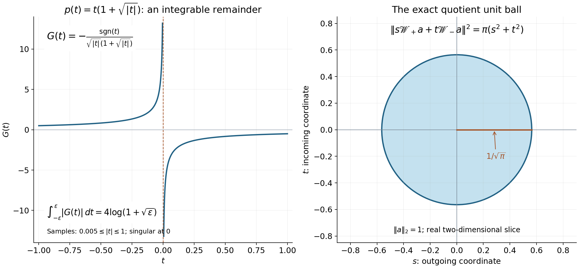

# Division and radiation at regular energies

*Written by GPT-6.1 Sol (OpenAI) and GPT-6 Astra (OpenAI). Self-checked by the writing AI. Original exposition: CC0. The linked coordinate supplement retains CC BY-SA 4.0.*

**Working question: Why do the two boundary denominators produce different tails?** The denominator \(p-\lambda-i0\) selects the upper resolvent. In the transport model, integrating from the left creates the tail on the right. Reversing the sign reverses that selection. A zero trace cancels the persistent amplitude and permits stronger weights; it does not change the order of the original operator.

At a regular energy, a Fourier denominator has a simple zero. Its upper and lower boundary values select waves traveling in opposite normal directions. This lesson proves the localized division estimate, identifies their mass at infinity, and shows why a vanishing shell trace permits stronger spatial decay.

We use the complete slice and transport proofs in [Endpoint spaces and flat energy shells](endpoint-spaces-and-flat-energy-shells.md), the direct \(C^1\) surface-layer mass proof in [Fourier traces on curved energy surfaces](fourier-traces-on-curved-energy-surfaces.md), and the proved logarithmic weight comparisons in [Mild weights and frequency localization](mild-weights-and-frequency-localization.md). These are the exact analytic inputs. Sections 1–5 below give the pole, finite-regularity kernel, radiation and weighted zero-trace arguments themselves. Teschl [T] gives freely readable spectral and scattering background.

Our Fourier transform is unitary. Throughout, \((f,g)=\int f\overline g\) is linear in its first argument. The upper boundary denominator is \(p-\lambda-i0\), since it comes from \(p-z\) with \(z=\lambda+i\varepsilon\).

## 1. The pole and a graph patch

The complete earlier [coordinate inverse proof (CI1)–(CI3)](../providers/analysis/coordinate-inverses-and-integration.md#coordinate-inverse) applies at the regularity used in this lesson: a \(C^{k,\alpha}\) map with invertible derivative has a \(C^{k,\alpha}\) local inverse, with controlled norms on smaller compact charts. It proves the endpoint \(k=1\) as well as every higher finite order, using the Lipschitz inverse bound and the differentiated inverse formula. Equations (CI6)–(CI7) there prove the corresponding surface Jacobians and local coarea formula. Read those proofs before this section.

For a smooth compactly supported function \(b\) on the line,

\[
 \lim_{\varepsilon\downarrow0}\int\frac{b(r)}{r-i\varepsilon}\,dr
 =\operatorname{pv}\int\frac{b(r)}r\,dr+i\pi b(0).
\]

To prove this, choose an even smooth cutoff \(\theta\) equal to one near zero, and split \(b(r)=[b(r)-b(0)\theta(r)]+b(0)\theta(r)\). The first numerator vanishes to first order, so dominated convergence applies near zero and away from it. For the second term, the real part integrates to zero by oddness, and \(\varepsilon/(r^2+\varepsilon^2)\) has integral \(\pi\) and concentrates at zero. Reversing the sign of \(i\varepsilon\) reverses the imaginary term. Hence

\[
 (r-i0)^{-1}-(r+i0)^{-1}=2\pi i\delta_0.
\]

These boundary distributions have degree \(-1\) under positive dilations. Indeed, for \(a>0\) and \(\varepsilon>0\),

\[
 (ar\mp i\varepsilon)^{-1}
      =a^{-1}(r\mp i\varepsilon/a)^{-1}.
\]

Testing this identity and letting \(\varepsilon\downarrow0\) proves
\((ar\mp i0)^{-1}=a^{-1}(r\mp i0)^{-1}\). The same change of variables in a test pairing gives \(\delta_0(ar)=a^{-1}\delta_0(r)\).

The scalar limit also works for compactly supported \(C^\alpha\) tests, for every \(0<\alpha<1\). The subtracted numerator is \(O(|r|^\alpha)\), so its quotient is dominated by \(C|r|^{\alpha-1}\), an integrable function. On a fixed compact support the resulting functional is bounded by the supremum and Hölder seminorm of the test.

Consequently, if \(p\in C^{1,\alpha}_{\mathrm{loc}}(X)\) is real on an open set \(X\), with \(\nabla p\ne0\) at every zero, then \((p\mp i\varepsilon)^{-1}\) has a limit in \(\mathcal D'(X)\). Cover the zeros in a compact test support by finitely many coordinates \((r,\eta)\) with \(r=p(\xi)\), and use a smooth partition in the original coordinates. The inverse is \(C^{1,\alpha}\); its absolute Jacobian and each transformed test are \(C^\alpha\), uniformly on the compact chart. Integration in \(\eta\) produces a scalar \(C^\alpha\) test. Apply the preceding bound; away from the zeros use ordinary dominated convergence. The chart bounds control the resulting functional by finitely many smooth test seminorms, so it is a distribution.

With principal value defined by removing \(\{|p|\leq\tau\}\) and then taking \(\tau\downarrow0\), the scalar formula in these coordinates and the surface Jacobian give

\[
 (p\mp i0)^{-1}
       =\operatorname{pv}\frac1p\ \pm i\pi\delta(p),
 \qquad
 \langle\delta(p),\varphi\rangle
       =\int_{\{p=0\}}\frac{\varphi}{|\nabla p|}\,dS.
\]

Both the principal value and the surface term therefore have their specified meaning independently of the chosen charts. At a nonzero energy, apply the argument to \(p-\lambda\) whenever that level is regular.

Let \(p\) be real on an open frequency region, and suppose \(\partial_1p>0\) on a sufficiently small patch. Write \(\xi=(\tau,\eta)\). The map \(\xi\mapsto(p(\xi),\eta)\) has inverse

\[
 (\lambda,\eta)\mapsto(\Sigma(\lambda,\eta),\eta)
\]

on a product neighborhood. In particular

\[
 p(\Sigma(\lambda,\eta),\eta)=\lambda,
 \qquad \nabla_\eta\Sigma=-\frac{\nabla_\eta p}{\partial_1p}.
\]

All cutoffs below have compact support inside this patch. Compactness bounds \(\partial_1p\) below by a positive constant on the relevant neighborhood.

Choose the patch small enough that the inverse exists on a larger product of an energy interval and a transverse neighborhood. There is then a closed energy interval \(I\) in that product whose interior contains \(p(\operatorname{supp}\chi)\), and whose inverse is defined for every transverse point in the cutoff projection. Shrinking the original frequency box also ensures that the segment joining \(\tau\) to \(\Sigma(\lambda,\eta)\), for \(\lambda\in I\), remains in the region where \(\partial_1p\) is bounded below. Such boxes exist by continuity at the central regular point. Covering a general compact cutoff by finitely many of these smaller boxes will recover the general case. Thus the real-energy arguments below cover all of \(I\), and its complement stays a positive distance from the compact energy support.

## 2. A finite-regularity kernel estimate

The scalar maximum principle used for the nonreal parameter below is proved in the earlier scalar Cauchy lesson, Theorems 3.2 and 3.6. Only that scalar proof is needed; the Hilbert-valued conclusion is obtained by pairing with unit vectors.

**Lemma 2.1.** Let \(N\geq0\) be an integer, \(0<\alpha<1\), \(p\in C^{N+1,\alpha}_{\mathrm{loc}}\) on the graph patch, and \(\chi\in C_c^\infty\) supported there. For a Schwartz forcing \(f\), set

\[
 u_z=\mathcal F^{-1}\left(\frac{\chi\widehat f}{p-z}\right)
 \quad(\operatorname{Im}z>0),
 \qquad
 u_{\lambda,+}=\mathcal F^{-1}
       \big((p-\lambda-i0)^{-1}\chi\widehat f\big).
\]

There is a constant independent of \(f,z\) such that, for every \(t\in\mathbb R\) and \(\operatorname{Im}z\geq0\),

\[
 \|u_z(t,\cdot)\|_{L^2_y}
 \leq C\int\|f(s,\cdot)\|_{L^2_y}
       \left(1_{\{s<t\}}+(1+|t-s|)^{-N}\right)ds.
\]

The value on the boundary means \(u_{\lambda,+}\). For real \(\lambda\), the outgoing slice amplitude is

\[
 v_\lambda(\eta)=i\sqrt{2\pi}\,
      \frac{\chi\widehat f}{\partial_1p}
           (\Sigma(\lambda,\eta),\eta).
\]

It is zero when the level misses the cutoff support. The slice limits are

\[
 \|u_{\lambda,+}(t,\cdot)
       -\mathcal F_y^{-1}(e^{it\Sigma(\lambda,\eta)}v_\lambda)(\cdot)\|_2
        \longrightarrow0\quad(t\to+\infty),
 \qquad
 \|u_{\lambda,+}(t,\cdot)\|_2\longrightarrow0\quad(t\to-\infty).
\]

**Proof.** For \(\lambda\) in a compact energy interval inside the coordinate neighborhood, write \(\Sigma=\Sigma(\lambda,\eta)\) and

\[
 q_\lambda(\tau,\eta)
 =\frac{\tau-\Sigma}{p(\tau,\eta)-\lambda}
 =\left(\int_0^1
       \partial_1p(\Sigma+r(\tau-\Sigma),\eta)\,dr\right)^{-1},
 \qquad g_\lambda=\chi q_\lambda.
\]

Thus \(q_\lambda>0\), \(g_\lambda\in C_c^{N,\alpha}\), with uniform compact-chart bounds, and

\[
 g_\lambda(\Sigma,\eta)
       =\frac{\chi(\Sigma,\eta)}{\partial_1p(\Sigma,\eta)}.
\]

The one-dimensional boundary identity, or its proof after the monotone variable change \(r=p(\tau,\eta)-\lambda\), gives

\[
 \frac{\chi}{p-\lambda-i0}
       =\frac{g_\lambda}{\tau-\Sigma-i0}.
\]

The principal value transforms with the same factor: the two small inverse images of symmetric energy cutoffs have ratio tending to one, so no constant delta term is added. The delta term transforms by \((\partial_1p)^{-1}\), as in the energy-measure computation of the preceding surface lesson.

More explicitly, put \(a=\partial_1p(\Sigma,\eta)>0\). The Hölder derivative gives \(p(\Sigma+t,\eta)-\lambda=at+O(|t|^{1+\alpha})\), uniformly on the compact parameters. The inverse endpoints of \(r=\pm\delta\) therefore have absolute sizes \(\delta/a+O(\delta^{1+\alpha})\). In a test pairing, subtract the numerator's value at \(t=0\). The remaining integrand is bounded by \(C|t|^{\alpha-1}\), so altering either small cutoff changes its integral by a quantity tending to zero. For the constant numerator, the difference between asymmetric and symmetric cutoffs is a signed logarithm of the endpoint ratio, which tends to zero as well. This proves the asserted principal-value identity at the stated \(C^{1,\alpha}\) regularity.

Split the last multiplier into

\[
 \frac{g_\lambda(\Sigma,\eta)}{\tau-\Sigma-i0}
       +G_\lambda(\tau,\eta),
 \qquad
 G_\lambda=\frac{g_\lambda(\tau,\eta)-g_\lambda(\Sigma,\eta)}{\tau-\Sigma}.
\]

With the convolution-kernel normalization \((2\pi)^{-1}\int e^{ir\tau}(\cdot)\,d\tau\), the first term gives

\[
 i g_\lambda(\Sigma,\eta)e^{ir\Sigma}1_{\{r>0\}}.
\]

This sign and normalization follow from the upper transport kernel already proved in the flat-shell lesson. Let \(K_\lambda(r,\eta)\) be the kernel of \(G_\lambda\).

Put \(t=\tau-\Sigma\), suppressing the compact parameters. Subtract the degree-\(N\) Taylor polynomial of \(g(\Sigma+t)\). Its remainder \(e\) satisfies

\[
 |e^{(j)}(t)|\le C|t|^{N+\alpha-j},
 \qquad 0\le j\le N.
\]

For \(j<N\), this follows by repeated integration of the Hölder difference of the \(N\)-th derivative; at \(j=N\) it is precisely that Hölder bound. For \(N=0\), it means \(e(t)=g(\Sigma+t)-g(\Sigma)=O(|t|^\alpha)\). When \(N\ge1\),

\[
 G(\Sigma+t)=\sum_{k=1}^N\frac{g^{(k)}(\Sigma)}{k!}t^{k-1}
                      +\frac{e(t)}t.
\]

At every \(j\le N\), the differentiated remainder is \(O(|t|^{N+\alpha-1-j})\): apply the product rule to \(e(t)t^{-1}\), using the preceding estimate for each derivative of \(e\). All derivatives through \(N-1\) have the same limits from both sides. The highest derivative is \(O(|t|^{\alpha-1})\), hence locally integrable. Integrating by parts separately on the two sides and letting their endpoints tend to zero proves that this is the weak \(N\)-th derivative; matching lower derivatives leave no delta term.

Outside a fixed compact interval, \(G=-g(\Sigma)/(\tau-\Sigma)\). For \(N\ge1\), its \(N\)-th derivative is therefore globally integrable, with uniform norm. Fourier differentiation and the Riemann–Lebesgue lemma give the bounded \(|r|^{-N}\) kernel and its little-oh improvement for \(|r|\ge1\). Equivalently, insert smooth large cutoffs in the integration-by-parts identity and pass to the limit in the integrable derivative.

For \(|r|\le1\), subtract \(e^{ir\Sigma}g(\Sigma)\theta(\tau-\Sigma)\) in the compact pole integral, with even \(\theta=1\) near zero. Its remainder divided by \(\tau-\Sigma\) is bounded by an integrable multiple of \(|\tau-\Sigma|^{\alpha-1}+1\), uniformly in \(r\). The subtracted term has zero principal value and bounded delta contribution. Subtract the bounded Heaviside kernel to obtain a bounded kernel for \(G\).

This calculation also identifies the distributional kernel at \(r=0\): perform the subtraction first with the regularized pole, then pass to the limit on any compact \(r\)-interval using the common integrable bound. Its inverse transforms converge locally as functions and as distributions. After subtraction of the bounded Heaviside function, \(K_\lambda\) is represented by a locally bounded function, with no additional distribution supported at \(r=0\). The large-\(|r|\) derivative argument consequently describes the same kernel. The Riemann–Lebesgue and Fourier differentiation inputs are proved in the earlier [oscillatory-integral argument](../providers/analysis/euclidean-approximation-and-convolution.md#oscillatory-integrals-and-averages) and [tempered Fourier duality](../providers/analysis/finite-derivative-l2.md#tempered-fourier-duality).

When \(N=0\), its compact part is integrable by the same Hölder bound. Its smooth \(1/(\tau-\Sigma)\) tail has integrable first derivative. Riemann–Lebesgue treats the compact part; Fourier differentiation treats the tail for \(|r|\ge1\). Thus in every case

\[
 |K_\lambda(r,\eta)|\le C(1+|r|)^{-N},
 \qquad
 (1+|r|)^N K_\lambda(r,\eta)\longrightarrow0
                 \quad(|r|\to\infty).
\]

The last convergence is uniform in the compact parameters. Indeed, away from \(t=0\) the differentiated expressions vary continuously. Near zero their common \(C|t|^{\alpha-1}\) majorant has integral \(O(\varepsilon^\alpha)\); their tails have a common integrable bound. Splitting into these regions proves continuity in \(L^1\). A finite \(L^1\) approximation makes Riemann–Lebesgue uniform. The same argument applies to the compact part at \(N=0\). Outside a fixed compact transverse set the kernels are zero.

Energies outside a slightly larger compact interval are separated from \(p(\operatorname{supp}\chi)\). There \(\chi/(p-\lambda)\) has uniform compact-support derivatives through \(N+1\), so its kernel is \(O((1+|r|)^{-N-1})\), with constants tending to zero as \(|\lambda|\to\infty\). There is no pole.

Put \(F(s,\eta)=\mathcal F_yf(s,\eta)\). The exact convolution formula is

\[
 \mathcal F_yu_{\lambda,+}(t,\eta)
 =\int F(s,\eta)
       \big(i g_\lambda(\Sigma,\eta)e^{i(t-s)\Sigma}1_{\{s<t\}}
                  +K_\lambda(t-s,\eta)\big)ds.
\]

Minkowski and partial Plancherel give the boundary estimate. Removing the modulation \(e^{it\Sigma}\), the Heaviside part tends in \(L^2_\eta\) to \(i g_\lambda(\Sigma,\eta)\int e^{-is\Sigma}F(s,\eta)ds=v_\lambda\) as \(t\to+\infty\); at \(-\infty\) it tends to zero. The bounded remainder kernel tends to zero and \(s\mapsto\|F(s)\|_2\) is integrable, so dominated convergence treats that part at both ends.

It remains to justify the same bound for nonreal \(z\). Change from \(\tau\) to energy \(r=p(\tau,\eta)\). For fixed physical \(t\), the transformed numerator \(A_t(r)\) is a compactly supported \(C^\alpha\) function of \(r\) with values in \(H=L^2_\eta\), extended by zero outside the larger product chart. Interior cutoff support makes this extension Hölder. The slice is its Cauchy integral, followed by the unitary transverse inverse transform. On compact subsets of the upper half-plane, the denominator is bounded away from zero; its difference quotients and their remainders have integrable \(H\)-norm bounds on the fixed energy support. The vector integral and dominated-convergence results in the earlier [integration proof](../providers/analysis/hilbert-valued-integration.md#bochner-integral) therefore prove norm holomorphy directly.

For boundary continuity write \(z=a+ib\), \(b>0\), and subtract \(A_t(a)\theta(r-a)\), with one fixed even smooth cutoff equal to one near zero. For a small radius \(\delta\), the subtracted near part satisfies

\[
 \int_{|r-a|<\delta}
 \frac{\|A_t(r)-A_t(a)\|_H}{|r-a-ib|}\,dr
 \leq \frac{2[A_t]_{C^\alpha}}{\alpha}\delta^\alpha.
\]

The bound is uniform in \(a,b\). On the complement, use the variable \(r-a\); continuity of \(A_t\) and dominated convergence then apply even as \(a\) varies. The subtracted cutoff contributes \(A_t(a)\int\theta(x)/(x-ib)\,dx\). Its real part is zero by oddness and its scalar imaginary part tends to \(\pi\), by the concentration calculation in Section 1. First fix \(\delta\), pass to the boundary away from zero, and then let \(\delta\downarrow0\). This proves norm continuity for every approach from the closed upper half-plane. These arguments and bounds are uniform when physical \(t\) ranges over a compact interval. Outside a large disk, the energy support is separated from \(z\), giving decay \(O(|z|^{-1})\) for each fixed \(t,f\).

The half-disk maximum principle needed here follows from the same mean-value proof as the cited disk theorem. If a scalar holomorphic function, continuous on the closed half-disk, attains its maximum modulus at an interior point \(c\), use the Cauchy mean-value formula on every circle centered at \(c\) of radius less than the distance to the boundary. The average modulus is both at least the central maximum and at most that maximum; continuity makes the modulus equal to it everywhere on each circle. Increasing the radius to that distance reaches a boundary point with the same modulus. Thus the maximum on the closed half-disk is attained on its boundary. This uses precisely the mean-value consequence of the earlier Theorem 3.2, whose proof and elementary integration prerequisites have been supplied.

Pair the slice with any unit vector in \(L^2_y\). Its scalar pairing is holomorphic and continuous up to the real axis. The boundary estimate already proved bounds it by a number depending on \(t,f\) and independent of the real energy. Apply the just-proved maximum principle on upper half-disks. On their large semicircles the pairing tends uniformly to zero; letting the radius grow leaves the same real-boundary bound at every fixed \(z\). Taking the supremum over unit vectors proves the slice bound for all \(\operatorname{Im}z>0\). \(\square\)

## 3. Uniform boundary division

Let \(X\subset\mathbb R^n\) be open, \(0<\alpha<1\), \(p\in C^{1,\alpha}_{\mathrm{loc}}(X)\) real with \(\nabla p\ne0\) in \(X\), and \(\chi\in C_c^\infty(X)\). For nonreal \(z\), define the localized division operator

\[
 R_{p,\chi}(z)f
       =\mathcal F^{-1}\left(\frac{\chi\widehat f}{p-z}\right),
\]

extending the multiplier by zero outside \(X\). It is a bounded \(L^2\) operator for each such \(z\); no global operator domain outside \(X\) is being assumed. For a real polynomial on all of frequency space, this is the frequency-localized resolvent of its maximal self-adjoint Fourier multiplier. The maximal domain and resolvent identification are proved in [the first spectral lesson, Sections 1 and 2](resolvents-domains-and-spectral-density.md).

**Theorem 3.1.** For each \(f\in B\), the map \(z\mapsto R_{p,\chi}(z)f\) extends uniquely as a weak-star continuous \(B^*\)-valued map to each closed half-plane, with

\[
 \|R_{p,\chi}(z)f\|_{B^*}\leq C_{p,\chi}\|f\|_B,
       \qquad \operatorname{Im}z\geq0\ \hbox{or}\ \operatorname{Im}z\leq0.
\]

Write the real boundary values as \(u_+\) and \(u_-\). On \(M_\lambda=\{p=\lambda\}\), let \(T_\lambda f\) be the Fourier trace on a compact regular neighborhood of the cutoff support. Then

\[
 u_+-u_-=2\pi i\,E_{M_\lambda}
       \left(\frac{\chi T_\lambda f}{|\nabla p|}\right),
\]

where the amplitude is extended by zero off the cutoff support.

**Proof.** A finite partition of \(\chi\) into small graph patches reduces the bound to Lemma 2.1 with \(N=0\), after an orthogonal rotation and, if needed, reversal of a coordinate. Its slice bound, the \(L^1_tL^2_y\) estimate for \(B\), and the dual slice estimate give \(\|u_z\|_{B^*}\leq C\|f\|_B\). To get the lower half-plane, replace \(p,z,f\) by \(-p,-z,-f\); its local increasing coordinate is chosen accordingly.

For Schwartz \(f\), the boundary argument in Lemma 2.1 gives slice \(L^2\) continuity in \(z\), uniformly bounded on each finite interval of physical \(t\). Thus there is \(L^2\) convergence on each bounded physical ball. To prove weak-star continuity against \(g\in B\), truncate \(g\) to a large ball; local convergence treats its compact part, and the uniform \(B^*\) bound treats the \(B\)-small tail. Approximate any \(f\in B\) by Schwartz functions. The uniform operator bound makes the same continuity argument valid for that \(f\). For nonreal \(z\), the extension agrees with the \(L^2\) multiplier, since the approximation also converges in \(L^2\). Uniqueness follows from weak-star continuity and density of the open half-plane in its closure.

For Schwartz \(f\), the one-dimensional pole identity in each graph patch gives Fourier jump \(2\pi i\chi\widehat f\,\delta(p-\lambda)\). The local coarea formula identifies \(\delta(p-\lambda)=dS/|\nabla p|\), giving the displayed extension. The surface trace and extension bounds from the curved-surface lesson allow passage from Schwartz forcing to every \(f\in B\). \(\square\)

## 4. The direction and size of the radiating mass

**Theorem 4.1.** Under Theorem 3.1's hypotheses, for every \(\Phi\in C_c(\mathbb R^n)\),

\[
 \lim_{R\to\infty}\frac1R\int |u_\pm(x)|^2\Phi(x/R)\,dx
 =2\pi\int_{M_\lambda}\frac{|\chi T_\lambda f|^2}{|\nabla p|}
       \left(\int_{\{s:\,\pm s>0\}}
                         \Phi(s\nabla p)\,ds\right)dS,
\]

and

\[
 \lim_{R\to\infty}\frac1R\int
          u_+(x)\overline{u_-(x)}\Phi(x/R)\,dx=0.
\]

For the Euclidean ball in particular,

\[
 \lim_{R\to\infty}\frac1R\int_{|x|<R}|u_\pm|^2\,dx
       =2\pi\int_{M_\lambda}
                   \frac{|\chi T_\lambda f|^2}{|\nabla p|^2}\,dS.
\]

**Proof.** First take a single graph patch with \(\partial_1p>0\) and Schwartz \(f\). Let

\[
 a=\frac{\chi T_\lambda f}{|\nabla p|},
 \qquad w=E_{M_\lambda}a.
\]

The graph area factor is \(J=|\nabla p|/\partial_1p\). Comparing the partial Fourier formula for \(w\) with the amplitude in Lemma 2.1 shows that its two asymptotic models are exactly

\[
 u_+=2\pi i\,1_{\{t>0\}}w+r_+,
 \qquad
 u_-=-2\pi i\,1_{\{t<0\}}w+r_-,
 \qquad r_\pm\in B^*_0.
\]

To verify the last membership, the remainder has bounded slice norms tending to zero at both ends by Lemma 2.1. The finite-middle-interval and small-tail estimate in the flat-shell radiation proof then makes its ball mass divided by radius tend to zero. Multiplying a \(B^*_0\) remainder with a \(B^*\) model in an observation integral also gives a vanishing limit, by Cauchy–Schwarz on the ball containing the support of \(\Phi(x/R)\).

We need the surface-layer theorem with a physical half-space indicator. On this compact patch choose the unit normal \(\nu=\nabla p/|\nabla p|\); its first component is bounded below by a positive constant. Approximate \(1_{\{s_1>0\}}\) by smooth functions with a transition in \(|s_1|<\delta\). The approximation error in the observation integral is bounded by a smooth nonnegative majorant supported in the strip \(|s_1|<2\delta\), times a fixed compact observation cutoff. Its normal-line integral is at most \(C\delta\), uniformly on the surface, because \(\nu_1\) has that positive lower bound. Theorem 2.1 of the surface lesson therefore controls the limiting error by \(C\delta\|a\|_2^2\). Letting \(\delta\downarrow0\) proves

\[
 \lim_{R\to\infty}\frac1R\int
       \Phi(x/R)1_{\{\pm t>0\}}|w(x)|^2\,dx
 =\frac1{2\pi}\int|a|^2
          \left(\int_{\{r:\,\pm r>0\}}\Phi(r\nu)\,dr\right)dS.
\]

Multiply by \(4\pi^2\), and substitute \(r=s|\nabla p|\). This gives the claimed formula on one patch, with the factor \(2\pi\) and one inverse gradient outside the ray integral. The opposite models have disjoint physical half-space supports, so their mixed observation integral is zero; the remainders do not affect its limit.

Here are the details for combining patches. Choose a finite smooth frequency partition with supports sufficiently small that any two intersecting supports have their union in one graph chart. Such a choice follows from a Lebesgue number for a finite graph cover of the compact cutoff region. For two intersecting supports, the preceding local formula, polarized in the two cutoff amplitudes, supplies the same-sign mixed limit with \(\chi_j\overline{\chi_k}\). Their opposite-sign mixed limit is zero by the two complementary models in that common chart.

For disjoint supports, their distance is positive. The two localized Fourier distributions, for Schwartz forcing, are compactly supported distributions of finite order.

The finite-order assertion and their smooth polynomially bounded inverse transforms follow from the compact-distribution construction in the earlier [localization lesson](mild-weights-and-frequency-localization.md#mild-distribution-detection). Apply the two distributions successively to smooth exponential tests on their compact supports, with fixed cutoffs equal to one there. Integration against a compact smooth physical observation commutes with these functionals: its Riemann sums converge in every required frequency-derivative seminorm, since all variables then range over compact sets. This proves the Fourier-kernel identity used next, including for these nonsmooth boundary multipliers.

The Fourier kernel of multiplication by \(\Phi(x/R)\), for smooth compactly supported \(\Phi\), is a fixed constant times \(R^n\widehat\Phi(R(\xi-\eta))\). On the product of those disjoint supports, every fixed number of its derivatives decreases faster than any prescribed inverse power of \(R\): differentiation contributes only a fixed power of \(R\), while the positive separation makes the Schwartz decrease dominate it. Applying the two finite-order distributions therefore makes their mixed integral tend to zero even before dividing by \(R\). Thus summing all pairs gives \(|\sum_j\chi_j|^2=|\chi|^2\), and gives zero for the opposite-sign sum. This proves both assertions for smooth \(\Phi\) and Schwartz forcing.

The ball/shell comparison bounds the quadratic observation forms by \(C_\Phi\|u\|_{B^*}^2\), uniformly for large \(R\). Theorem 3.1 therefore bounds their change under forcing approximation by \(C_\Phi\|f-g\|_B(\|f\|_B+\|g\|_B)\). The trace bound makes the right-hand surface forms equally continuous in \(f\). Passing to Schwartz approximants proves the formulas for every \(f\in B\). Uniform approximation of continuous compactly supported \(\Phi\) by smooth functions in a fixed compact set then proves the stated observation generality. Finally sandwich the ball indicator between smooth radial cutoffs of radii \(1-\delta\), \(1\) and \(1+\delta\), just as in Corollary 2.2 of the surface lesson. The ray length inside the unit ball is \(|\nabla p|^{-1}\) for either sign. Letting \(\delta\downarrow0\) gives the ball formula. \(\square\)

**Corollary 4.2 (two independent radiating tails).** Fix a compact subset \(K\) of a regular level inside \(X\), and write \(\mathcal Q=B^*/B^*_0\), with its ordinary quotient norm. For \(a\in L^2(K,dS)\), extended by zero, choose a smooth cutoff \(\chi=1\) near \(K\) and \(f\in B\) whose trace on the whole cutoff surface is \(|\nabla p|a\). Set

\[
 \mathscr W_\pm a=
 \big[R_{p,\chi}(\lambda\pm i0)f\big]\in\mathcal Q.
\]

These classes are independent of the forcing and cutoff choices. The map from \(L^2(K)\oplus L^2(K)\) satisfies

\[
 \|\mathscr W_+a_++\mathscr W_-a_-\|_{\mathcal Q}^2
       =\pi\big(\|a_+\|_2^2+\|a_-\|_2^2\big).
\]

Its image is closed. In particular the two images intersect only at zero, and

\[
 \mathscr W_+a-\mathscr W_-a=[2\pi iE_Ka],
 \qquad \|[2\pi iE_Ka]\|_{\mathcal Q}=\sqrt{2\pi}\|a\|_2.
\]

**Proof.** Choose a larger compact regular surface neighborhood containing the cutoff support. The onto trace theorem in the curved-surface lesson realizes the stated trace, including its zero extension off \(K\). All cutoffs are compactly supported in the fixed regular region. For two choices use a common cutoff equal to one over both supports, with forcing \(\chi_1(D)f_1-\chi_2(D)f_2\). Smooth Fourier multiplication preserves \(B\), and its trace is zero. The zero-trace consequence of Theorems 3.1–4.1 puts each boundary difference in \(B^*_0\). This proves well-definedness and linearity. It also proves boundedness, by the onto criterion's bounded preimage construction and Theorem 3.1.

Here the identity \(T_\lambda(\chi_j(D)f)=\chi_jT_\lambda f\) first holds for Schwartz inputs. The [smooth multiplier bound](mild-weights-and-frequency-localization.md#mild-multipliers), Schwartz density in \(B\), and trace continuity pass it to every \(f\in B\). Thus the common-cutoff argument uses the actual zero trace on its entire surface support. The trace theorem supplies preimages bounded in \(B\) by a constant times \(\||\nabla p|a\|_2\), and the gradient is bounded on that compact surface; no linear choice of preimages is required for the quotient map's norm bound.

The mixed observation in Theorem 4.1 vanishes for a common forcing. Apply that statement to \(f+g\) and \(f+ig\), and expand. The two resulting identities make each mixed term between arbitrary forcings vanish. For the ball indicator, approximate by smooth radial observations. The error is supported in a thin annulus; Cauchy–Schwarz and the two diagonal radiation formulas bound its limsup by \(C\varepsilon\). Let \(\varepsilon\downarrow0\). Hence the ball mass of the sum, divided by radius, tends to

\[
 L=2\pi(\|a_+\|_2^2+\|a_-\|_2^2).
\]

Proposition 2.4 of the endpoint lesson gives its quotient norm squared as \(L/2\), proving the exact formula. A Cauchy sequence in the image therefore has Cauchy amplitudes in the complete direct sum; boundedness of the map proves closedness of its image. Norm rigidity proves the intersection assertion. The jump formula for a common forcing gives the last identity, and the norm formula gives its constant, agreeing with the surface-extension distance \((2\pi)^{-1/2}\|a\|_2\). These conclusions concern this closed image; no Hilbert structure of the entire quotient is assumed. \(\square\)

*Figure 1. Left: the exact local remainder for \(p(t)=t(1+\sqrt{|t|})\), namely \(G(t)=-\operatorname{sgn}(t)|t|^{-1/2}/(1+\sqrt{|t|})\). Its pole is integrable: \(\int_{-\varepsilon}^{\varepsilon}|G|=4\log(1+\sqrt\varepsilon)\). Right: for unit-norm amplitude \(a\), \(\|s\mathscr W_+a+t\mathscr W_-a\|_{\mathcal Q}^2=\pi(s^2+t^2)\), so the unit ball in these real coordinates is the disk of radius \(1/\sqrt\pi\). This is the two-dimensional slice of the proved image, not the whole quotient. Lemma 2.1 and Corollary 4.2 give the precise proof locations. [Vector figure](../figures/holder-radiation-tails.svg); reproducible plotting source accompanies the editable package.*

## 5. Zero trace and stronger weights

**Corollary 5.1.** For fixed \(\lambda\), the following are equivalent:

1. \(\chi T_\lambda f=0\) on the energy surface.
2. \(u_+=u_-\).
3. \(u_+\in B^*_0\).
4. \(u_-\in B^*_0\).

**Proof.** The jump in Theorem 3.1 is a surface extension of \(\chi T_\lambda f/|\nabla p|\). The lower bound for that extension in the curved-surface lesson proves equivalence of 1 and 2. The ball formula in Theorem 4.1, and the positive upper and lower bounds for \(|\nabla p|\) on the compact cutoff region, prove equivalence of 1 with 3 and 4 by the vanishing-average characterization of \(B^*_0\). \(\square\)

The conclusion can be strengthened while retaining only finitely many derivatives of \(p\).

**Theorem 5.2.** Let \(N\geq0\) be an integer, \(0<\alpha<1\), \(p\in C^{N+1,\alpha}_{\mathrm{loc}}(X)\) real with \(\nabla p\ne0\), and \(\chi\in C_c^\infty(X)\). Let \(\mu\) be positive, nondecreasing and \(C^1\) on \([0,\infty)\), with

\[
 (1+t)\mu'(t)\leq N\mu(t).
\]

If \(f\in B\), \(\|\mu(|x|)f\|_B<\infty\), and \(\chi T_\lambda f=0\), then the common boundary solution \(u=u_+=u_-\) satisfies

\[
 \|\mu(|x|)u\|_{B^*}
       \leq C_{N,p,\chi}\|\mu(|x|)f\|_B.
\]

The constant is independent of the particular weight and its multiplicative normalization.

**Proof.** The logarithmic-derivative estimate proved in the weight lesson gives

\[
 \mu(|t|)\leq\mu(|s|)(1+|t-s|)^N.
\]

On a small graph patch, apply the upper kernel bound of Lemma 2.1 when \(t\leq0\). For its Heaviside part, \(s<t\leq0\) implies \(\mu(|t|)\leq\mu(|s|)\) by monotonicity. For its remainder, the displayed polynomial comparison cancels \((1+|t-s|)^{-N}\). Thus

\[
 \mu(|t|)\|u_+(t,\cdot)\|_2
       \leq C\int\mu(|s|)\|f(s,\cdot)\|_2\,ds
       \quad(t\leq0).
\]

The lower kernel integrates in the opposite direction and gives the same bound for \(u_-\) when \(t\geq0\). Since the localized trace vanishes, Corollary 5.1 makes these the same solution. As \(\mu(|s|)\leq\mu(|(s,y)|)\), the slice estimate in the flat-shell lesson bounds the last integral by \(\sqrt2\|\mu(|x|)f\|_B\). Consequently \(\mu(|t|)u\) has a uniformly bounded \(L^2_y\) slice norm, and therefore a bounded \(B^*\) norm.

For a general \(f\), the same integral representation is valid: \(f\in B\subset L^1_tL^2_y\), the kernels are bounded, and their convolution defines a bounded-slice function. Approximation in this mixed norm identifies it with the boundary solution already defined in Theorem 3.1. Thus the preceding weighted estimate does not require smooth approximants whose shell traces vanish.

To upgrade the directional weight to a radial one, choose \(n\) linearly independent unit vectors \(\omega_1,\ldots,\omega_n\) sufficiently close to the patch's increasing coordinate direction. On a sufficiently small common frequency patch, every \(\omega_j\cdot\nabla p\) stays positive. Each is therefore a permitted increasing coordinate after an orthogonal rotation, with uniform local graph bounds. There is a fixed \(L\geq1\) such that

\[
 |x|\leq L\max_j|\omega_j\cdot x|.
\]

The logarithmic growth bound and monotonicity imply

\[
 \mu(|x|)\leq L^N\max_j\mu(|\omega_j\cdot x|).
\]

Indeed integration of \(\mu'/\mu\leq N/(1+t)\) gives \(\mu(Lr)\leq[(1+Lr)/(1+r)]^N\mu(r)\leq L^N\mu(r)\), including \(r=0\). An open cone of permitted directions contains a basis, so these \(n\) directions exist in every dimension. Apply the directional estimate in each rotated coordinate; orthogonal rotations preserve the radial shell norms and the weighted forcing norm. On each physical shell, the pointwise maximum is bounded by the sum; the triangle inequality and then the shell supremum bound the radial weighted \(B^*\) norm by the sum of the directional bounds. Every rotated graph kernel uses the same \(C^{N+1,\alpha}\) derivatives of \(p\) through the indicated order on a compact patch.

Finally partition a general cutoff into finitely many such small pieces \(\chi_j=\rho_j\chi\). Each localized trace vanishes because \(\chi T_\lambda f=0\); apply the just-proved estimate to each solution and sum. The geometry, cutoff and finite-derivative constants depend on \(N,p,\chi\), while all weight comparisons depend only on \(N\). \(\square\)

**Example 5.3.** If \(p\) is smooth and the forcing has zero localized shell trace, taking \(\mu(t)=(1+t)^k\) for an integer \(k\geq0\) gives \(\|(1+|x|)^ku\|_{B^*}\leq C_k\|(1+|x|)^kf\|_B\). This is a conditional decay estimate: it requires vanishing trace and a finite weighted forcing norm. It does not assert that an arbitrary outgoing wave decays with every power.

**Example 5.4 (a regular symbol below \(C^2\)).** On the line let \(p(t)=t(1+\sqrt{|t|})\), and work near its zero. Its derivative is \(1+\tfrac32\sqrt{|t|}\), including the value \(1\) at zero. Thus \(p\in C^{1,1/2}\), its derivative is positive, and it is not \(C^2\). At zero energy the inverse divided difference is \(q(t)=(1+\sqrt{|t|})^{-1}\). Where the cutoff equals one,

\[
 G(t)=\frac{q(t)-q(0)}t
   =-\frac{\operatorname{sgn}(t)|t|^{-1/2}}{1+\sqrt{|t|}}.
\]

Substitute \(s=\sqrt t\) on each half-line to obtain
\(\int_{-\varepsilon}^{\varepsilon}|G(t)|\,dt=4\log(1+\sqrt\varepsilon)\).
This is the \(N=0\) mechanism of Lemma 2.1: an integrable remainder suffices for the bounded kernel and its vanishing at infinity. Theorems 3.1–4.1 and Corollary 4.2 apply to compact cutoffs here. No \(C^2\) approximation or differentiation of this singular quotient is needed.

### Use the conclusion

Apply the zero-trace criterion to a compactly supported forcing term, then compare it with the two-amplitude quotient formula. Retain the stated finite regularity of the symbol instead of assuming a smooth energy surface.

## 6. Exercises

**Exercise 6.1 (foundation).** For \(p(\xi)=c\xi_1\), \(c>0\), derive the upper slice amplitude and ball-mass formula from Theorem 4.1. Compare with the transport solution in the endpoint lesson.

**Exercise 6.2 (intermediate).** For \(p(\xi_1,\xi_2)=\xi_1+\beta\xi_2^2\), compute the outgoing ray direction, the graph area factor, and the density in the ball-mass formula. Retain every occurrence of \(\beta\).

**Exercise 6.3 (intermediate).** Assume \(p\) is smooth. Let \(g\) be Schwartz with Fourier support in a compact regular patch, and set \(f=(p(D)-\lambda)g\), with \(\chi=1\) on that support. Prove that both localized boundary solutions equal \(g\). Determine their ball-mass limit.

**Exercise 6.4 (advanced).** Recover the full surface-layer observation formula on a compact subset of a smooth regular level from the two radiation formulas and their vanishing mixed limit. Use the onto trace theorem to realize a prescribed \(L^2\) surface amplitude. Check the factor \((2\pi)^{-1}\). Extend the deduction to compact \(C^1\) surface patches by proving the \(C^1\) phase-concentration limit for their exact normal wave models; include continuous compactly supported observation functions.

**Exercise 6.5 (advanced).** Explain why the finite-regularity kernel proof yields weighted division for \(\mu(t)=(1+t)^a\) when \(0\leq a\leq N\). Give a forcing and trace condition under which the estimate applies. Identify where the proof fails if the trace is nonzero, without claiming that \(a>N\) is always impossible by another method.

## 7. Complete solutions

**Solution 6.1.** The level has \(\xi_1=\lambda/c\), \(\partial_1p=c\), and \(|\nabla p|=c\). The amplitude is \(v_\lambda=i\sqrt{2\pi}\,\chi T_\lambda f/c\). Thus its squared slice amplitude norm is \(2\pi c^{-2}\|\chi T_\lambda f\|_{L^2(d\eta)}^2\). The upper model occupies one half-space, giving exactly this ball-mass limit, in agreement with the formula \(2\pi\int|\chi T_\lambda f|^2d\eta/c^2\). When \(\chi=1\) and the trace is taken on the whole flat hyperplane, the transport formula gives \(u_+=ic^{-1}\int_{-\infty}^t e^{i\lambda(t-s)/c}f(s,y)ds\) and the same limiting amplitude. The compact-cutoff theorem supplies its localized version.

**Solution 6.2.** The shell graph is \(\xi_1=\lambda-\beta\eta^2\), its area factor is \(J=\sqrt{1+4\beta^2\eta^2}\), and \(\nabla p=(1,2\beta\eta)\). Thus the upper wave travels along the positive rays \(s(1,2\beta\eta)\), \(s>0\). The ball mass is

\[
 2\pi\int
       \frac{|\chi T_\lambda f(\lambda-\beta\eta^2,\eta)|^2}
            {\sqrt{1+4\beta^2\eta^2}}\,d\eta,
\]

because \(dS/|\nabla p|^2=J\,d\eta/J^2\). The slice amplitude uses \(\partial_1p=1\), so its square integral alone would omit the geometry of the ball. When \(\beta=0\), all these factors reduce to the flat-shell values.

**Solution 6.3.** The Fourier forcing is \((p-\lambda)\widehat g\), which has zero shell trace. Multiplication of either boundary pole by \(p-\lambda\) is the identity distribution on the patch, so \((p-\lambda\mp i0)^{-1}\chi\widehat f=\chi\widehat g=\widehat g\). Thus both solutions equal \(g\). Since \(g\in L^2\), its ball mass divided by \(R\) tends to zero. This also follows from Theorem 4.1's zero trace. For a merely finite-regularity \(p\), use the distributional forcing and the same multiplier cancellation whenever it belongs to \(B\); the stated Schwartz construction uses the smooth symbol case.

**Solution 6.4.** Enlarge the compact surface set slightly within a regular region and choose a smooth cutoff \(\chi\) equal to one on the desired amplitude support. Let \(a\) be that amplitude, extended by zero to the larger compact surface set. Trace surjectivity gives \(f\in B\) whose trace there is \(|\nabla p|a\). Hence \(\chi T_\lambda f/|\nabla p|=a\), and the jump is \(u_+-u_-=2\pi iE a\). Expanding its squared observation integral, the two mixed terms have zero limit by Theorem 4.1, while the two diagonal limits join the positive and negative rays. Dividing by \(4\pi^2\) gives

\[
 \lim_{R\to\infty}\frac1R\int|E a|^2\Phi(x/R)\,dx
 =\frac1{2\pi}\int |a|^2|\nabla p|
       \left(\int_{\mathbb R}\Phi(s\nabla p)\,ds\right)dS.
\]

Substitute \(r=s|\nabla p|\). This is precisely \((2\pi)^{-1}\int|a|^2\int\Phi(r\nu)dr\,dS\), the full surface-layer formula. The prescription must cover the whole cutoff surface support, with zero amplitude off the desired set, to avoid introducing extra jump amplitudes.

For a \(C^1\) graph, the finite-regularity resolvent theorem does not apply as stated. We instead use its exact normal models, whose phase-concentration calculation needs only one derivative. Here is that calculation, including the \(L^2\) amplitude argument. If \(F\in C^1(\mathbb R^d;\mathbb R)\), \(b\in L^2\) has compact support, and
\[
 v_R=\mathcal F^{-1}(e^{iRF}b),
\]
then for \(\Psi\in C_c(\mathbb R^d)\),
\[
 \int |v_R(y)|^2\Psi(y/R)\,dy
       \longrightarrow\int |b(\eta)|^2\Psi(-\nabla F(\eta))\,d\eta.
 \tag{P1}
\]
For a smooth compact amplitude and Schwartz \(\Psi\), expand the Fourier integral and set \(h=R(\zeta-\eta)\). The left side becomes
\[
 (2\pi)^{-d/2}\int \widehat\Psi(h)
       \int b(\eta)\overline{b(\eta+h/R)}
       e^{iR(F(\eta)-F(\eta+h/R))}\,d\eta\,dh.
 \tag{P2}
\]
For each fixed \(h,\eta\), the phase tends to \(-h\cdot\nabla F(\eta)\). On the compact amplitude support dominated convergence gives the inner limit. Its absolute value is at most \(\|b\|_2^2\), by Cauchy–Schwarz, so the integrable \(|\widehat\Psi(h)|\) permits dominated integration in \(h\). Fourier inversion gives the right side of (P1). Smooth approximation of \(b\) in \(L^2\) is uniform in \(R\): Plancherel bounds the change of the quadratic observation by \(\|\Psi\|_\infty\|b-b_j\|_2(\|b\|_2+\|b_j\|_2)\), and the limiting form has the same bound. Finally uniform approximation of a continuous compactly supported \(\Psi\) by smooth functions extends (P1), with error at most \(\|\Psi-\Psi_j\|_\infty\|b\|_2^2\). If the phase is initially defined only near the compact amplitude support, a \(C^1\) cutoff extends it to the whole space before this calculation. This calculation supplies the full phase-concentration input directly, with the inverse-transform sign retained.

Write the surface as \(\xi_1=\Sigma(\eta)\), with \(J(\eta)=\sqrt{1+|\nabla\Sigma(\eta)|^2}\), and set \(b(\eta)=a(\Sigma(\eta),\eta)J(\eta)\). Then \(b\in L^2\) on the compact patch and, with \(t=x_1\), \(y=x'\),
\[
 E a(t,y)=(2\pi)^{-1/2}
                  \mathcal F_y^{-1}(e^{it\Sigma}b)(y).
\]
The exact two model waves \(u_+=i\sqrt{2\pi}\,H(t)\mathcal F_y^{-1}(e^{it\Sigma}b)\) and \(u_-=-i\sqrt{2\pi}\,H(-t)\mathcal F_y^{-1}(e^{it\Sigma}b)\) satisfy \(u_+-u_-=2\pi i E a\). Their mixed observation is zero because their supports in \(t\) are disjoint up to a null set.

In the diagonal observations substitute \(t=R\tau\), and apply (P1) with phase \(F=\tau\Sigma\) and observation \(\Psi(y)=\Phi(\tau,y)\). The parameter \(\tau\) lies in one fixed finite interval when \(\Phi\) is compactly supported. Plancherel bounds every inner observation by \(\|\Phi\|_\infty\|b\|_2^2\), independent of \(R,\tau\). Dominated convergence in \(\tau\) therefore gives, after joining the two half-rays and dividing by \(4\pi^2\),
\[
 \lim_{R\to\infty}\frac1R\int |Ea|^2\Phi(x/R)\,dx
   =\frac1{2\pi}\int |b(\eta)|^2
            \int_{\mathbb R}\Phi(\tau,-\tau\nabla\Sigma(\eta))\,d\tau\,d\eta.
 \tag{P3}
\]
The unit normal is \(\nu=(1,-\nabla\Sigma)/J\). Changing \(r=\tau J\) turns \(|b|^2\,d\eta\,d\tau\) into \(|a|^2\,dS\,dr\). Thus (P3) is the full \(C^1\) graph formula with precisely the same constant.

To pass from a graph patch to a compact part of an arbitrary \(C^1\) hypersurface, use a finite real continuous partition with \(\sum_j\chi_j^2=1\), each \(\chi_j\) supported in a graph chart. The uniform absolute-kernel bound proved in Section 2 of [Fourier traces on curved energy surfaces](fourier-traces-on-curved-energy-surfaces.md) makes the quadratic observation asymptotically local: its difference from the sum of the observations of \(\chi_j a\) has kernel factor \(1-\sum_j\chi_j(\xi)\chi_j(\eta)\). This factor tends uniformly to zero as \(|\xi-\eta|\to0\), while the Schwartz kernel away from any fixed diagonal neighborhood has norm tending to zero as \(R\to\infty\). Split into those two regions, use the uniform kernel bound in the first, and then shrink the neighborhood. The error tends to zero. The limiting local forms sum to the desired formula because \(\sum_j|\chi_j a|^2=|a|^2\).

This locality argument first uses smooth compact observation functions. The continuous compactly supported case follows by the uniform approximation and ball-mass bound proved in the surface lesson. No norm convergence of extensions on moving surfaces is presumed.

**Solution 6.5.** The weight is nondecreasing and \((1+t)\mu'(t)=a\mu(t)\leq N\mu(t)\). Theorem 5.2 therefore applies if \(\|(1+|x|)^af\|_B<\infty\) and \(\chi T_\lambda f=0\). For instance the construction in Exercise 6.3, with smooth \(p\) and compact smooth Fourier \(g\), has those properties for every fixed \(a\), and gives the common solution \(g\).

With nonzero trace, the upper and lower solutions differ. The proof used the upper kernel only on the half-space where its Heaviside contribution comes from sources farther toward the negative end, and used the lower kernel on the opposite half-space. Equality was essential for joining those two favorable estimates for one solution. A nonzero outgoing amplitude instead persists at its outgoing end, and its unweighted mass formula is positive. Finally, the remainder estimate available from \(C^{N+1,\alpha}\) regularity cancels weight growth only through power \(N\); greater powers require additional information or regularity. This explains the proof's limit without imposing an unsupported universal obstruction.

## References

- [Y] Dmitri Yafaev, *Lectures on scattering theory*, 2004, [arXiv:math/0403213](https://arxiv.org/abs/math/0403213).
- [T] Gerald Teschl, *Mathematical Methods in Quantum Mechanics: With Applications to Schrödinger Operators*, second edition, American Mathematical Society, 2014. [Freely readable author's edition](https://www.mat.univie.ac.at/~gerald/ftp/book-schroe/schroe2.pdf).
