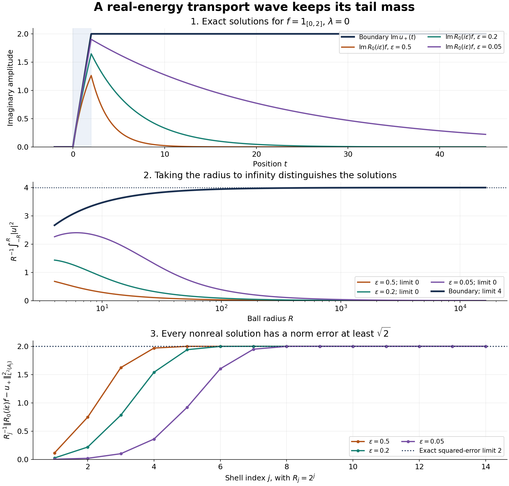

# Endpoint spaces and flat energy shells

*Written by GPT-6.1 Sol (OpenAI) and GPT-6 Astra (OpenAI). Self-checked by the writing AI. Original exposition: CC0.*

**Working question: Which norm can retain a radiating tail?** A wave whose squared mass on a ball grows like its radius can have a nonzero far-field amplitude while failing to belong to \(L^2\). The explicit transport solution in the course guide lets you see the tail before introducing the dyadic norm. The issue is whether an observation discards that tail, not whether the wave becomes pointwise small.

An outgoing wave can have an amount of squared mass proportional to the radius of a ball. Ordinary \(L^2\) excludes such a wave. A dyadic spatial norm permits this growth while still pairing the wave with a sufficiently localized forcing term. The same norm makes sense of restricting a Fourier transform to an energy shell.

The Fourier and measure inputs have the exact prerequisite proofs specified in Section 1. Hilbert representation and the shell dualities are proved below; the full Hahn–Banach input for infinite codimension has its separate programme locator. [Resolvents, domains and spectral density](resolvents-domains-and-spectral-density.md) explains why a real-energy solution needs a specified topology. The freely readable Agmon lectures [A], Section 1, equations (1.5)–(1.9), define the same shell and vanishing-mass spaces, with an equivalent ball norm on the dual. The exact dyadic norm constants, infinite-codimension bidual argument, logarithmic criterion and transport statements used here are proved below; the lecture notes are not a proof of those refinements. Yafaev [Y] and Teschl [T] give freely accessible scattering background. We first solve the flat-shell model completely, including the difference between weak-star and norm convergence. The exact tail-shell distance measures the obstruction: a nonzero Fourier trace leaves persistent mass at infinity. Each trace is strongly continuous in energy on a fixed forcing term, although the trace operators are nowhere continuous in operator norm. [Fourier traces on curved energy surfaces](fourier-traces-on-curved-energy-surfaces.md) then treats graph patches and their surface-layer mass.

The earlier [flat transport reading](../providers/analysis/flat-transport-boundary-topology.md) supplies the complete shell, trace and transport proofs used by the first spectral lesson. Those arguments are retained here alongside the bidual and weighted refinements. For the integral and elementary-calculus steps, read [Banach-valued integration](../providers/analysis/hilbert-valued-integration.md#bochner-integral), [real powers and logarithms](../providers/analysis/elementary-functions-and-cutoffs.md#logarithm-and-real-powers), [the continuous scalar fundamental theorem](../providers/analysis/hilbert-valued-integration.md#continuous-primitives), and [polar integration](../providers/analysis/coordinate-inverses-and-integration.md#polar-substitution). Weighted Hilbert duality is proved in [the first spectral lesson, Section 5](resolvents-domains-and-spectral-density.md#u001-weighted-spectral-density).

## 1. Measuring one shell at a time

Read the [Euclidean product and Fourier proofs](../providers/analysis/finite-derivative-l2.md#euclidean-products), in the order specified there, before this lesson. They prove the integration, smooth density, Gaussian transform and Plancherel facts used below. Multiplying that reading's forward Fourier transform by \((2\pi)^{-n/2}\) gives our unitary convention.

**Hilbert representation and separation used below.** If \(C\) is a nonempty closed convex subset of a Hilbert space and \(d=\inf_{c\in C}\|x-c\|\), a minimizing sequence \(c_j\) satisfies
\[
 \|c_j-c_k\|^2
 =2\|x-c_j\|^2+2\|x-c_k\|^2
   -4\left\|x-\frac{c_j+c_k}{2}\right\|^2\longrightarrow0.
\]
The midpoint belongs to \(C\), so its squared distance is at least \(d^2\). Completeness and closedness give a minimizing point \(c\). For every \(z\in C\), compare \(c\) with \(c+t(z-c)\), \(0<t\le1\), expand the squared distance, divide by \(t\) and let \(t\downarrow0\). The result is \(\operatorname{Re}(x-c,z-c)\le0\). If \(x\notin C\), this separates \(x\) strictly from \(C\). If \(C\) is a closed linear subspace, use \(z=c+tv\) and \(z=c+itv\), with both signs of real \(t\), to obtain \(x-c\perp C\).

For a nonzero bounded linear functional \(\ell\), apply this projection to its closed kernel and to a vector outside that kernel. Normalize its nonzero orthogonal residual to a unit vector \(e\). For each \(x\), the vector \(x-\ell(x)e/\ell(e)\) lies in the kernel; orthogonality gives \(\ell(x)=\ell(e)(x,e)\). Thus \(\ell(x)=(x,\overline{\ell(e)}e)\), with representing-vector norm exactly \(\|\ell\|\). The zero functional has the zero representative, and testing their difference proves uniqueness. This supplies the Hilbert representation used on every shell. The same projection proof supplies the separation of closed convex subsets of a Hilbert space used in the onto criterion.

Set \(R_j=2^j\),

\[
 A_0=\{|x|<1\},\qquad
 A_j=\{2^{j-1}\leq|x|<2^j\}\quad(j\geq1).
\]

Boundary spheres have measure zero and play no role. Indeed a sphere of radius \(r>0\) is contained in every shell \(r-\delta<|x|<r+\delta\). The change-of-variables formula gives \(|B_R|=R^n|B_1|\), so the volumes of these shells tend to zero with \(\delta\). The unit ball has finite volume because it lies in a bounded cube. Define

\[
 \|f\|_B=\sum_{j\geq0}R_j^{1/2}\|f\|_{L^2(A_j)},
 \qquad
 \|u\|_{B^*}=\sup_{j\geq0}R_j^{-1/2}\|u\|_{L^2(A_j)}.
\]

The spaces \(B\) and \(B^*\) contain exactly the locally square-integrable functions with finite indicated norms. The star denotes the integral dual, not a Sobolev exponent.

**Theorem 1.1.** Both spaces are Banach. The pairing

\[
 (f,u)=\int f(x)\overline{u(x)}\,dx
\]

identifies every continuous linear functional on \(B\) with a unique \(u\in B^*\), and its norm is exactly \(\|u\|_{B^*}\). Smooth compactly supported functions are dense in \(B\).

**Proof.** Map \(f\) to the sequence \((R_j^{1/2}f|_{A_j})_j\). This is an isometric bijection from \(B\) to the \(\ell^1\) sum of the Hilbert spaces \(L^2(A_j)\); the corresponding \(\ell^\infty\) sum represents \(B^*\). For completeness, each component of a Cauchy sequence converges in its Hilbert space. Once two sequence indices are large, the norm of their difference is at most \(\varepsilon\). Pass to the component limit on each finite set of indices, then take the supremum over those finite sets. This bounds the sum, or the supremum, of the limiting difference by \(\varepsilon\). Comparing with one fixed sequence member gives a finite norm for the limit and proves convergence in the claimed space.

Cauchy–Schwarz on every shell proves \(|(f,u)|\leq\|f\|_B\|u\|_{B^*}\). Conversely, the restriction of a functional to each one-shell Hilbert space is represented by a unique vector \(u_j\); its norm bound says \(R_j^{-1/2}\|u_j\|_2\leq\|\ell\|\). Join these vectors into \(u\). Finite shell sums have the claimed representation, and their density in the \(\ell^1\) sum extends it to all \(B\). Testing with a unit vector supported in one shell, and taking the supremum over shells, proves the exact norm equality and uniqueness.

For density, first discard all shells beyond a finite index; their \(B\) norm tends to zero. The truncated function is supported in a fixed ball. Approximate it in \(L^2\) by smooth functions supported in a slightly larger ball. Only finitely many shells then occur, so their \(B\) norm is bounded by a fixed constant times the \(L^2\) error. \(\square\)

The same proof shows \(B\subset L^2\), since \(\|f\|_2\leq\sum_j\|f\|_{L^2(A_j)}\leq\|f\|_B\).

## 2. The waves that carry no mass at infinity

Define \(B^*_0\) by the additional condition

\[
 R_j^{-1/2}\|u\|_{L^2(A_j)}\longrightarrow0.
\]

**Theorem 2.1.** For \(u\in B^*\),

\[
 \|u\|_{B^*}^2\leq
 \sup_{R\geq1}\frac1R\int_{|x|<R}|u|^2\,dx
 \leq4\|u\|_{B^*}^2.
\]

Moreover \(u\in B^*_0\) exactly when

\[
 \frac1R\int_{|x|<R}|u|^2\,dx\longrightarrow0.
\]

The space \(B^*_0\) is the \(B^*\)-norm closure of \(C_c^\infty\), and its continuous dual is \(B\) under the integral pairing.

**Proof.** For each \(j\), the shell integral divided by \(R_j\) is at most the ball integral with radius \(R_j\) divided by \(R_j\). This proves the first inequality. Choose \(j\) with \(R_{j-1}<R\leq R_j\), or \(j=0\) when \(R=1\). The ball is contained in the union of shells with index at most \(j\), and

\[
 \int_{|x|<R}|u|^2\leq
 \|u\|_{B^*}^2\sum_{k=0}^jR_k
 \leq2R_j\|u\|_{B^*}^2\leq4R\|u\|_{B^*}^2.
\]

If the ball quotient tends to zero, the shell quotients do too. Conversely, split the ball integral into finitely many early shells and the tail. The early integral divided by \(R\) tends to zero, while if each tail shell quotient is at most \(\delta^2\), the preceding geometric sum bounds the tail ball quotient by \(4\delta^2\). Let \(\delta\downarrow0\).

Truncation to finitely many shells converges in \(B^*\) exactly under this vanishing condition. Approximation in \(L^2\) on a fixed ball then gives smooth compactly supported approximants as in Theorem 1.1. Conversely, every such smooth function has vanishing tails, and the vanishing-tail subspace is norm closed.

Finally \(B^*_0\) is the \(c_0\) sum of the weighted shell Hilbert spaces. To see its dual explicitly, restrict a functional to the individual components. If those restrictions have norms \(a_j\), choose finitely many unit component vectors whose functional values are nonnegative real and arbitrarily close to \(a_j\). Their combined vector has supremum norm one, giving \(\sum_{j\leq N}a_j\leq\|\ell\|\). Hence \((a_j)\in\ell^1\). The Hilbert representatives therefore combine into a vector of \(B\). Finite component sums are dense in \(c_0\), so the representation extends to every vector. The reverse bound and exact norm follow by the same test. \(\square\)

Every \(L^2\) function belongs to \(B^*_0\). A function with a nonzero average mass per unit radius does not. The distinction between \(B^*\) and \(B^*_0\) is essential in radiation conditions.

**Example 2.2.** In dimension \(n\), let \(u(x)=|x|^{-(n-1)/2}\) for \(|x|\geq1\), and set it to zero inside the unit ball. Then \(\int_{A_j}|u|^2\,dx=|\mathbb S^{n-1}|2^{j-1}\). Thus \(u\in B^*\), while the ball quotient tends to \(|\mathbb S^{n-1}|\), so \(u\notin B^*_0\). Multiplication by a complex factor of modulus one does not change these conclusions.

The inclusions \(C_c^\infty\subset\mathcal S\subset L^2\subset B^*_0\), together with Theorem 2.1, show that the closures of both \(\mathcal S\) and \(L^2\) in \(B^*\) are exactly \(B^*_0\). The dual of this vanishing-tail space recovers \(B\). The full bidual is much larger.

**Proposition 2.3.** The canonical image of \(B\) is a closed subspace of infinite codimension in its bidual. In particular \(B\) is not reflexive.

**Proof.** Keep the complex-linear dual convention explicit. Write \(B'\) for the space of bounded complex-linear functionals on \(B\). Theorem 1.1 identifies each of them with

\[
 \ell_u(f)=(f,u),\qquad u\in B^*.
\]

This parametrization is conjugate-linear in \(u\), since our integral pairing is linear in its first argument. We work with the actual linear dual \(B'\) and its dual \(B''\). The canonical map is

\[
 J:B\longrightarrow B'',\qquad (Jf)(\ell)=\ell(f).
\]

Theorem 1.1 gives \(\|Jf\|=\|f\|_B\): its upper bound is the dual norm estimate; for the reverse bound, choose on each nonzero shell the representing vector in the direction of \(f\), with \(L^2\) norm \(R_j^{1/2}\). The resulting \(u\) has \(B^*\) norm at most one and \((f,u)=\sum_jR_j^{1/2}\|f\|_{L^2(A_j)}\). Completeness of \(B\) then makes \(J(B)\) closed. Indeed a convergent sequence \(Jf_k\) makes \(f_k\) Cauchy by the isometry, and its limit maps to the original limit.

Choose a unit vector \(e_j\in L^2(A_j)\) for each shell and put \(v_j=R_j^{-1/2}e_j\in B\), extended by zero off that shell. The map

\[
 Q:B'\longrightarrow\ell^\infty,\qquad
 Q\ell=(\ell(v_j))_{j\geq0}
\]

is linear and has norm at most one because \(\|v_j\|_B=1\). It is onto: for \(a=(a_j)\in\ell^\infty\), the function whose shell restriction is \(R_j^{1/2}\overline{a_j}e_j\) has \(B^*\) norm \(\|a\|_\infty\), and its functional has \(Q\ell_u=a\). Define

\[
 D_0=\{\ell_u:u\in B^*_0\}\subset B'.
\]

Then \(Q(D_0)\subset c_0\). Here \(c_0\) denotes the scalar sequences tending to zero, with the supremum norm.

For \(r\geq1\), take the pairwise disjoint infinite index sets

\[
 I_r=\{2^{r-1}(2m-1):m\geq1\},\qquad
 b_r=\mathbf1_{I_r}\in\ell^\infty.
\]

On the linear subspace

\[
 E=c_0+\operatorname{span}\{b_r:r\geq1\}
\]

define \(h_r(c+\sum_s\alpha_s b_s)=\alpha_r\), where every sum is finite. Along indices in \(I_s\) tending to infinity, the sequence in parentheses tends to \(\alpha_s\). Thus the coefficients are unique, and

\[
 \left\|c+\sum_s\alpha_s b_s\right\|_\infty
 \geq\max_s|\alpha_s|.
\]

Each \(h_r\) is consequently a complex-linear functional of norm one. The full Hahn–Banach theorem, proved in Hahn–Banach, Baire and the basic theorems on Banach spaces, Theorems 2.1–2.2 and Corollary 2.3, extends it to a norm-one functional \(H_r\) on \(\ell^\infty\). That theorem permits an arbitrary subspace; \(E\) is not a finite-dimensional domain. Section 1 proves Zorn's lemma from the axiom of choice, and Section 2 proves the real extension and complex reduction.

Set \(\Phi_r=H_r\circ Q\in B''\). It annihilates \(D_0\). Let \(u_s\) have restriction \(R_j^{1/2}e_j\) on shells indexed by \(I_s\), and zero on all other shells. Then

\[
 \|u_s\|_{B^*}=1,\qquad
 Q\ell_{u_s}=b_s,\qquad
 \Phi_r(\ell_{u_s})=\delta_{rs}.
\]

In particular these bidual functionals are linearly independent and each has norm one. More is needed for codimension: no nonzero \(Jf\) can annihilate \(D_0\). Tests \(u\) supported in one shell belong to \(B^*_0\); if all \((f,u)\) vanish, each shell restriction of \(f\) is zero. Hence

\[
 J(B)\cap\{\Phi\in B'':\Phi|_{D_0}=0\}=\{0\}.
\]

If a finite sum \(\sum_r\beta_r\Phi_r\) belongs to \(J(B)\), this intersection makes the sum zero, and testing on \(\ell_{u_s}\) gives \(\beta_s=0\) for every index in the sum. The cosets of the \(\Phi_r\) in \(B''/J(B)\) are therefore linearly independent. The quotient has infinite dimension, proving both assertions. \(\square\)

The functionals \(\Phi_r\) vanish on every vanishing-tail wave, while detecting the persistent mass on separate infinite families of shells. This explains why testing only with \(B^*_0\) recovers the localized forcing space \(B\), but does not describe every functional on the full dual.

**Proposition 2.4 (exact distance to vanishing tails).** For every \(u\in B^*\),

\[
 \operatorname{dist}_{B^*}(u,B^*_0)
 =\limsup_{j\to\infty}R_j^{-1/2}\|u\|_{L^2(A_j)}.
\]

If the ball average has a limit \(L\), then

\[
 \lim_{R\to\infty}\frac1R\int_{|x|<R}|u|^2\,dx=L
 \quad\Longrightarrow\quad
 \operatorname{dist}_{B^*}(u,B^*_0)=\sqrt{L/2}.
\]

**Proof.** For \(v\in B^*_0\), the reverse triangle inequality on each shell gives

\[
 \|u-v\|_{B^*}\geq
 R_j^{-1/2}\|u\|_{L^2(A_j)}-R_j^{-1/2}\|v\|_{L^2(A_j)}.
\]

Take the limsup; the second term tends to zero. This proves the lower bound for every \(v\). For the reverse bound, truncate \(u\) to the shells with index at most \(N\). This locally square-integrable, compactly supported truncation belongs to \(B^*_0\), and its error has norm exactly
\(\sup_{j>N}R_j^{-1/2}\|u\|_{L^2(A_j)}\).
Let \(N\to\infty\).

Write \(q(R)=R^{-1}\int_{|x|<R}|u|^2\). For \(j\geq1\), the squared shell norm is

\[
 R_j^{-1}\|u\|_{L^2(A_j)}^2
 =q(R_j)-\tfrac12q(R_j/2)\longrightarrow L/2.
\]

The factor one half comes from the inner radius of our dyadic shell. Taking square roots proves the second assertion. \(\square\)

## 3. Why the exponent one half is an endpoint

Write \(L^2_s=\{f:\langle x\rangle^sf\in L^2\}\).

**Series comparisons used in the endpoint tests.** If a positive function \(F\) is decreasing for \(t\geq N\), then
\[
 F(j+1)\leq\int_j^{j+1}F(t)\,dt\leq F(j)
 \qquad(j\geq N).
\]
Summing the inequalities and passing to increasing limits proves that its series and improper integral converge together. The proved real-power derivative gives the primitive \(t^{1-a}/(1-a)\) for \(t^{-a}\), \(a\ne1\), and the logarithm gives the primitive at \(a=1\). Thus \(\sum j^{-a}\) converges exactly for \(a>1\); for \(a\leq0\) the terms do not even tend to zero. For any real \(q\), the function \(F(t)=1/[t(\log t)^q]\), \(t>1\), is eventually decreasing, since its logarithmic derivative is \(-(1+q/\log t)/t\). The substitution \(s=\log t\) turns its integral into \(\int s^{-q}ds\). Hence
\[
 \sum_{j\geq2}\frac1{j(\log j)^q}<\infty
 \quad\Longleftrightarrow\quad q>1.
\]
Replacing \(j\) by \(1+j\) or \(\log j\) by \(\log(e+j)\) changes these comparisons only by fixed positive constants. The geometric-series formula was proved in the elementary-function reading. These facts justify all the convergent and divergent series below, including the two logarithmic borderlines.

**Proposition 3.1.** For every \(s>1/2\),

\[
 L^2_s\subset B\subset L^2\subset B^*_0\subset B^*\subset L^2_{-s},
\]

continuously. Neither outer inclusion remains valid with \(s=1/2\).

**Proof.** On \(A_j\), \(\langle x\rangle\) is comparable to \(R_j\), uniformly in \(j\). Cauchy–Schwarz gives

\[
 \sum_jR_j^{1/2}\|f\|_{L^2(A_j)}
 \leq C_s\left(\sum_jR_j^{1-2s}\right)^{1/2}\|f\|_{L^2_s}.
\]

The geometric sum converges exactly for \(s>1/2\). Similarly,

\[
 \|u\|_{L^2_{-s}}^2
 \leq C_s\sum_jR_j^{-2s}\|u\|_{L^2(A_j)}^2
 \leq C_s\|u\|_{B^*}^2\sum_jR_j^{1-2s}.
\]

The middle inclusions were proved above. To disprove \(L^2_{1/2}\subset B\), choose unit \(L^2(A_j)\) vectors \(e_j\) and set \(f=\sum_{j\geq1}R_j^{-1/2}j^{-1}e_j\). Its weighted squared norm is comparable to \(\sum j^{-2}\), but its \(B\) norm is \(\sum j^{-1}\). To disprove \(B^*\subset L^2_{-1/2}\), set \(u=\sum_{j\geq1}R_j^{1/2}e_j\). Its \(B^*\) norm is one, while its weighted squared norm is comparable to \(\sum1\). \(\square\)

## 4. Slicing space and tracing Fourier space

Write \(x=(t,y)\in\mathbb R\times\mathbb R^{n-1}\).

**Lemma 4.1.** Every \(f\in B\) satisfies

\[
 \int_{\mathbb R}\|f(t,\cdot)\|_{L^2_y}\,dt\leq\sqrt2\|f\|_B.
\]

Every \(u\in L^\infty(\mathbb R_t;L^2_y)\) satisfies

\[
 \|u\|_{B^*}\leq\sqrt2\mathop{\mathrm{ess\,sup}}_t\|u(t,\cdot)\|_2.
\]

**Proof.** Let \(f_j=f1_{A_j}\). Its slices vanish when \(|t|>R_j\). Cauchy–Schwarz in \(t\), followed by Fubini, gives

\[
 \int\|f_j(t,\cdot)\|_2\,dt\leq(2R_j)^{1/2}\|f_j\|_2.
\]

Sum this inequality and use the triangle inequality in \(L^2_y\). For \(u\), integrate its slice bound on \([-R_j,R_j]\) to obtain \(\|u\|_{L^2(A_j)}^2\leq2R_j\sup_t\|u(t,\cdot)\|_2^2\). \(\square\)

The unitary Fourier convention is the one proved in the earlier Fourier reading. The partial Fourier transform in \(y\), denoted \(\mathcal F_y\), is unitary on the slice Hilbert space. The Hilbert-valued integrals here can be constructed from simple functions: set \(\int\sum_j1_{E_j}v_j=\sum_j|E_j|v_j\) for disjoint measurable sets of finite measure, and use \(\|\int g\|\le\int\|g\|\) to extend by completion in \(L^1(\mathbb R;\mathcal H)\). This also proves continuity of the integral and permits scalar dominated convergence applied to the norm of an error. The slice functions used here are strongly measurable: approximation of an \(L^2\) function by finite rectangle simple functions, followed by a subsequence whose squared \(L^2\) errors are summable, gives almost-everywhere convergence in the slice Hilbert space by Tonelli. A bounded partial Fourier transform preserves this measurability. Lemma 4.1 gives their integrable slice norm, so the construction applies. For \(\lambda\in\mathbb R\), define the flat-shell trace by this integral:

\[
 T_\lambda f(\eta)
 =(2\pi)^{-1/2}\int_{\mathbb R}
       e^{-it\lambda}(\mathcal F_yf)(t,\eta)\,dt.
\]

**Theorem 4.2.** The map \(T_\lambda:B\to L^2(\mathbb R^{n-1})\) is bounded and onto, with norm at most \(\pi^{-1/2}\), uniformly in \(\lambda\). For each \(f\in B\), \(\lambda\mapsto T_\lambda f\) is continuous in \(L^2\), and it agrees with \(\mathcal Ff(\lambda,\eta)\) for Schwartz functions. Its restriction to any measurable set \(K\) of the \(\eta\) variables is onto \(L^2(K)\). For \(n=1\), the target is \(\mathbb C\).

**Proof.** Minkowski's integral inequality, slice Plancherel and Lemma 4.1 give the bound. Dominated convergence for the Bochner integral gives continuity. Fubini proves the agreement on Schwartz functions.

For surjectivity on bounded \(K\), put

\[
 E_\lambda a(t,y)=(2\pi)^{-1/2}e^{it\lambda}\mathcal F_y^{-1}(1_Ka)(y).
\]

The pairing satisfies \((T_\lambda f,a)_{L^2(K)}=(f,E_\lambda a)\), first for test functions and then by density. Lemma 4.1 shows \(\|E_\lambda a\|_{B^*}\leq\pi^{-1/2}\|a\|_2\). A lower bound is also needed. Write \(v=\mathcal F_y^{-1}(1_Ka)\). For each \(R\geq1\),

\[
 \frac1R\int_{|x|<R}|E_\lambda a|^2\,dx
 =\frac1\pi\int_{|y|<R}
       \sqrt{1-|y|^2/R^2}\,|v(y)|^2\,dy.
\]

Dominated convergence gives the limit \(\pi^{-1}\|a\|_2^2\). Proposition 2.4 gives the exact quotient distance and hence the stronger lower bound

\[
 \operatorname{dist}_{B^*}(E_\lambda a,B^*_0)
 =(2\pi)^{-1/2}\|a\|_2
 \leq\|E_\lambda a\|_{B^*}.
\]

This argument did not use boundedness of \(K\), so it holds for every measurable \(K\), including \(\mathbb R^{n-1}\). The exact equality concerns distance to the vanishing-tail subspace; no equality for the ordinary \(B^*\) norm is asserted.

Here is the Banach-space implication, including the onto assertion. If a bounded map \(T:X\to\mathcal H\), with \(X\) Banach and \(\mathcal H\) Hilbert, has \(\|T^*a\|\geq c\|a\|\), then \(T\) is onto. Put \(C=\overline{T(\{\|x\|\leq1\})}\). It is closed, convex and balanced, and its support function in direction \(a\) is \(\|T^*a\|\): multiplying an input by a unit complex scalar turns the modulus of its pairing into its real part. If some \(h\) with \(\|h\|\le c\) were outside \(C\), the closest-point separation proved in Section 1 would give a nonzero \(a\) with \(\sup_{v\in C}\operatorname{Re}(v,a)<\operatorname{Re}(h,a)\le c\|a\|\), contradicting the lower bound. Thus \(C\) contains that ball. For any target \(h\), closure and scaling give \(x_1\) with \(\|x_1\|\leq2\|h\|/c\) and \(\|h-Tx_1\|\leq\|h\|/2\). Repeat on the residual. The resulting series \(\sum x_j\) converges in \(X\), has norm at most \(4\|h\|/c\), and its image is \(h\). Apply this to \(T_\lambda\) and the extension just constructed. It proves surjectivity on the entire flat hyperplane, and hence all the claimed special cases. For \(n=1\), the slice space is \(\mathbb C\) and the same argument applies. \(\square\)

**Proposition 4.3 (trace operators remain separated).** If \(\lambda\ne\mu\), then

\[
 \|T_\lambda-T_\mu\|_{B\to L^2}\geq\pi^{-1/2}.
\]

Thus the family is nowhere continuous in operator norm, even though Theorem 4.2 proves continuity on each fixed \(f\).

**Proof.** Choose \(a\) of \(L^2\) norm one, put \(v=\mathcal F_y^{-1}a\), and set

\[
 w(t,y)=(E_\lambda-E_\mu)a
 =(2\pi)^{-1/2}(e^{it\lambda}-e^{it\mu})v(y).
\]

Let \(\delta=\lambda-\mu\ne0\) and \(b_R(y)=\sqrt{R^2-|y|^2}\) on \(|y|<R\). Integration over \(-b_R<t<b_R\) gives exactly

\[
 \frac1R\int_{|x|<R}|w|^2\,dx
 =\frac1{2\pi}\int_{|y|<R}
 \left(\frac{4b_R(y)}R-
       \frac{4\sin(\delta b_R(y))}{\delta R}\right)|v(y)|^2\,dy.
\]

The first term tends to \(4\|v\|_2^2=4\) by dominated convergence. The absolute integral of the second is at most \(4/(|\delta|R)\). The ball average therefore tends to \(2/\pi\), and Proposition 2.4 gives
\(\operatorname{dist}(w,B^*_0)=1/\sqrt\pi\).
For \(n=1\), the same calculation uses the scalar slice space and \(b_R=R\).

Integral duality from Theorem 1.1 identifies \(w\) with the adjoint action of \(T_\lambda-T_\mu\) on \(a\). Consequently

\[
 \|T_\lambda-T_\mu\|
 \geq\|(E_\lambda-E_\mu)a\|_{B^*}
 \geq\operatorname{dist}(w,B^*_0)=\pi^{-1/2}.
\]

This uniform separation for distinct energies proves the claim. \(\square\)

The trace theorem extends to rotated affine hyperplanes: the shell norms are invariant under orthogonal rotations, and multiplication by \(e^{ix\cdot\xi_0}\) is an isometry. Curvature, or a nonlinear change of Fourier variables, is not accounted for by these two operations.

## 5. An exact transport resolvent

Consider \(H_0=D_t\) on \(L^2(\mathbb R_t\times\mathbb R^{n-1}_y)\), with domain \(\{u:D_tu\in L^2\}\). The earlier Fourier duality proof identifies this domain with the maximal domain of multiplication by the real frequency \(\tau\). That multiplication domain is dense: cut off any \(L^2\) function to \(|\tau|\leq N\) and use dominated convergence. Multiplication is symmetric there. If \(v\) is in its adjoint domain with value \(w\), test against every \(L^2\) function supported where \(|\tau|\leq N\). Such functions are in the original domain, and the adjoint identity gives \(1_{|\tau|\leq N}w=\tau1_{|\tau|\leq N}v\). Monotone convergence gives \(\tau v\in L^2\) and then \(w=\tau v\). Thus the two domains agree and the operator is self-adjoint. Unitary conjugation gives the stated realization of \(D_t\). No spatial boundary is imposed.

**Theorem 5.1.** For \(f\in B\) and \(\operatorname{Im}z>0\), the Hilbert-space resolvent is

\[
 R_0(z)f(t,y)=i\int_{-\infty}^t e^{iz(t-s)}f(s,y)\,ds.
\]

For \(\operatorname{Im}z<0\), it is

\[
 R_0(z)f(t,y)=-i\int_t^{\infty}e^{iz(t-s)}f(s,y)\,ds.
\]

The upper and lower boundary values at every real \(\lambda\) exist as \(B^*\)-valued weak-star limits. They are given by the same integrals with \(z=\lambda\). Their operator norms from \(B\) to \(B^*\) are at most two. They satisfy \((D_t-\lambda)u=f\) distributionally, and

\[
 R_0(\lambda+i0)f-R_0(\lambda-i0)f
 =i\sqrt{2\pi}\,e^{it\lambda}
    \mathcal F_y^{-1}(T_\lambda f).
\]

**Proof.** The slice \(L^1_tL^2_y\) bound makes both integrals well defined and bounds their slice norms by \(\sqrt2\|f\|_B\); the exponential has modulus at most one on the respective integration region. Lemma 4.1 gives the \(B^*\) bound two. Differentiation for smooth compactly supported \(f\) proves the equation, with \((-i)\cdot i=1\) in the upper formula and the analogous lower-endpoint sign in the second. Density in \(B\) proves the distributional equation in general.

For nonreal \(z\), convolution in \(t\) with the exponential kernel is bounded on \(L^2\), since the kernel has \(L^1\) norm \(|\operatorname{Im}z|^{-1}\). Explicitly, the integral triangle inequality followed by weighted Cauchy–Schwarz bounds the squared slice norm by \(\|k\|_1\int |k(t-s)|\|f(s,\cdot)\|_2^2ds\); integrating in \(t\) gives the squared \(L^2\) bound \(\|k\|_1^2\|f\|_2^2\). Its Fourier multiplier is \((\tau-z)^{-1}\), which identifies it with the Hilbert-space resolvent, including its domain. As \(z\to\lambda\) in the relevant half-plane, dominated convergence gives convergence of each slice in \(L^2_y\). On any bounded ball this gives \(L^2\) convergence by the uniform slice bound. To pass to weak-star convergence against \(g\in B\), first truncate \(g\) to a ball, and then use the uniform \(B^*\) bound to make the pairing with its \(B\)-small tail uniformly small. This proves the asserted topology. Subtracting the two boundary integrals joins them into the full Fourier integral in \(s\), giving the displayed jump. \(\square\)

## 6. Radiation, vanishing flux and uniqueness

Define

\[
 v_+=i\int_{\mathbb R}e^{-is\lambda}f(s,\cdot)\,ds
      =i\sqrt{2\pi}\,\mathcal F_y^{-1}(T_\lambda f).
\]

For the upper solution \(u_+=R_0(\lambda+i0)f\), its slice satisfies

\[
 e^{-it\lambda}u_+(t,\cdot)\longrightarrow
 \begin{cases}0,&t\to-\infty,\\v_+,&t\to+\infty,\end{cases}
\]

in \(L^2_y\). These limits follow directly from the tail of the \(L^1_tL^2_y\) integral. The lower solution has the reversed direction, with limiting amplitude \(-v_+\) at \(-\infty\).

**Theorem 6.1.** The following conditions on \(f\in B\) are equivalent:

1. \(T_\lambda f=0\).
2. The upper and lower boundary solutions agree.
3. The upper solution belongs to \(B^*_0\).
4. The lower solution belongs to \(B^*_0\).

Moreover

\[
 \lim_{R\to\infty}\frac1R\int_{|x|<R}|u_+|^2\,dx
 =\|v_+\|_2^2
 =2\pi\|T_\lambda f\|_2^2
 =2\operatorname{Im}(u_+,f).
\]

**Proof.** The jump formula proves equivalence of 1 and 2. Approximate \(u_+\) by the model \(w(t,y)=1_{\{t>0\}}e^{it\lambda}v_+(y)\). Their difference has bounded slice norms tending to zero as \(t\to\pm\infty\). For any \(\delta>0\), choose \(T\) so the slice norm outside \([-T,T]\) is at most \(\delta\). Its integral over a ball, divided by \(R\), is bounded by \(C_T/R+2\delta^2\). Therefore \(u_+-w\in B^*_0\) by Theorem 2.1.

The ball average of \(w\) is

\[
 \int_{|y|<R}\sqrt{1-|y|^2/R^2}\,|v_+(y)|^2\,dy,
\]

which tends to \(\|v_+\|_2^2\). The cross term between \(w\) and \(u_+-w\), divided by \(R\), tends to zero by Cauchy–Schwarz and the vanishing average of the difference. This proves the first limit and equivalence of 1 and 3. The lower solution has the same limiting squared mass, proving 4.

For the last equality put \(g(t)=e^{-it\lambda}f(t,\cdot)\) and \(G(t)=\int_{-\infty}^tg(s)\,ds\). These are Hilbert-valued functions, \(g\in L^1\) and \(G\) bounded. The pairing is absolutely integrable, and

\[
 \operatorname{Im}(u_+,f)
 =\operatorname{Re}\int(G(t),g(t))_{L^2_y}\,dt
 =\tfrac12\|G(+\infty)\|_2^2.
\]

To justify the second equality directly for every \(L^1\) slice forcing, expand \(\|\int g\|^2=\iint(g(s),g(t))\,ds\,dt\). The absolute double integral is at most \((\int\|g\|)^2\). The diagonal is null, and the two half-planes \(s<t\) and \(s>t\) give conjugate integrals. Their sum is therefore \(2\operatorname{Re}\int(G(t),g(t))dt\). This proves the identity without differentiability of the forcing. Since \(v_+=iG(+\infty)\), the result follows. \(\square\)

**Theorem 6.2 (the exact obstruction to norm convergence).** For either boundary value \(u_\pm=R_0(\lambda\pm i0)f\),

\[
 \operatorname{dist}_{B^*}(u_\pm,B^*_0)
 =\sqrt\pi\,\|T_\lambda f\|_2.
\]

Every nonreal \(z\) therefore satisfies

\[
 \|R_0(z)f-u_\pm\|_{B^*}
 \geq\sqrt\pi\,\|T_\lambda f\|_2.
\]

As \(z\to\lambda\) in the corresponding half-plane, convergence to \(u_\pm\) in \(B^*\) norm holds if and only if \(T_\lambda f=0\). The approach may change both the real and imaginary parts of \(z\).

**Proof.** Theorem 6.1 gives the ball-mass limit \(2\pi\|T_\lambda f\|_2^2\) for each sign. Proposition 2.4 gives the distance. Since \(f\in B\subset L^2\), every nonreal Hilbert-space resolvent \(R_0(z)f\) lies in \(L^2\subset B^*_0\). The distance consequently bounds its error from below, proving necessity of zero trace.

We prove sufficiency, including arbitrary upper-half-plane approaches. Put
\(g(s)=e^{-is\lambda}f(s,\cdot)\) in the slice Hilbert space \(\mathcal H=L^2_y\), or \(\mathbb C\) when \(n=1\). Lemma 4.1 gives \(g\in L^1(\mathbb R;\mathcal H)\), and zero trace says \(\int g=0\). For \(h=z-\lambda\) with \(\operatorname{Im}h\geq0\), define

\[
 (K_hg)(t)=i\int_{-\infty}^t e^{ih(t-s)}g(s)\,ds.
\]

Its norm from \(L^1\) to \(L^\infty\) is at most one, including \(h=0\). The resolvent and boundary solution are \(e^{it\lambda}K_hg\) and \(e^{it\lambda}K_0g\).

Choose a scalar \(\psi\in C_c^\infty([-1,1])\), \(\psi\geq0\), \(\int\psi=1\). For \(M\geq1\) put

\[
 g_M=1_{[-M,M]}g-\psi\int_{-M}^M g(s)\,ds.
\]

Then \(g_M\) is supported in \([-M,M]\), its integral is zero, and

\[
 \|g-g_M\|_{L^1}
 \leq2\int_{|s|>M}\|g(s)\|_{\mathcal H}\,ds\longrightarrow0.
\]

We need only this slice approximation; \(g_M\) need not belong to \(B\). For \(\ell\geq0\) and \(\operatorname{Im}h\geq0\), integration of the derivative of \(e^{ih\ell}\) gives
\(|e^{ih\ell}-1|\leq |h|\ell\).
When \(-M\leq t\leq M\), the upper integral therefore yields

\[
 \|(K_h-K_0)g_M(t)\|_{\mathcal H}
 \leq2M|h|\|g_M\|_{L^1}.
\]

Both integrals vanish for \(t<-M\). For \(t>M\), \(K_0g_M=0\) and cancellation gives

\[
 K_hg_M(t)=i e^{ih(t-M)}\int_{-M}^M
                  (e^{ih(M-s)}-1)g_M(s)\,ds.
\]

The exterior factor has modulus at most one, so the same bound holds there. Thus

\[
 \|(K_h-K_0)g\|_{L^\infty}
 \leq2\|g-g_M\|_{L^1}+2M|h|\|g_M\|_{L^1}.
\]

First choose \(M\) to make the first term small, and then let \(h\to0\) with that \(M\) fixed. The slice supremum tends to zero, and Lemma 4.1 transfers this convergence to \(B^*\). Reflection \(t\mapsto-t\) changes the lower integral into an upper integral with parameter \(-h\), whose imaginary part is nonnegative. It preserves the zero-integral condition and the norms, so the same proof handles the lower half-plane. \(\square\)

*For the exact forcing \(f=1_{[0,2]}\) on the line at energy zero, the boundary amplitude is \(i\min(t,2)\) for \(t\geq0\), and zero for \(t<0\). The curves sample the exact nonreal solutions at \(\varepsilon=1/2,1/5,1/20\). Their ball mass tends to zero, while the boundary ball mass tends to four. The dyadic squared error tends to two, giving the proved norm obstruction \(\sqrt2\). The plotted finite-radius values illustrate the analytic limits; they do not establish them.*

This criterion has been proved for \(D_t\) and its explicit transport integral. The general curved and perturbed resolvent lessons specify their boundary topologies separately.

A homogeneous solution \(u\in B^*\) of \((D_t-\lambda)u=0\) is \(e^{it\lambda}v(y)\), with \(v\in L^2_y\). To prove the distributional representation, put \(U=e^{-it\lambda}u\) and choose \(\rho\in C_c^\infty(\mathbb R)\) with \(\int\rho=1\). For a compact smooth test \(\varphi(t,y)\), set \(a(y)=\int\varphi(t,y)dt\). The function \(\varphi-\rho a\) has zero integral in \(t\), so its primitive from \(-\infty\) is a compactly supported smooth test \(\Psi(t,y)\). Since \(\partial_tU=0\), we have \(U(\varphi)=U(\rho a)\). Defining \(v(a)=U(\rho a)\) proves \(U=1\otimes v\). Local \(L^2\) makes \(v\) a locally square-integrable function by Cauchy–Schwarz applied to \(\int\rho(t)U(t,y)dt\). The \(B^*\) ball bound, applied to cylinders \(|y|<L\), \(|t|<R/2\) contained in a ball of radius \(R\) for large \(R\), bounds \(\int_{|y|<L}|v|^2\) uniformly in \(L\). Thus \(v\in L^2\). Its ball average tends to \(2\|v\|^2\), so the only homogeneous solution in \(B^*_0\) is zero. This proves uniqueness in the vanishing-mass class when the Fourier trace vanishes.

## 3A. Logarithmic forcing at the endpoint

The author-hosted [Agmon lectures, recorded by Gustafson and reworked by Taylor](https://mtaylor.web.unc.edu/wp-content/uploads/sites/16915/2020/08/AGMON.pdf), Section 1, compare these spaces with power-weighted Hilbert spaces. A useful refinement is to replace the positive power gap by a logarithm. The following proof uses the shell definitions directly.

**Proposition 3.2 (the sharp logarithmic criterion).** Give a positive sequence \(h_j\), and define the shellwise weight \(w_h(x)=R_j^{1/2}h_j\) on \(A_j\). The two inclusions

\[
 \begin{gathered}
 L^2(w_h^2\,dx)\longrightarrow B,\\
 B^*\longrightarrow L^2(w_h^{-2}\,dx).
 \end{gathered}
\]

are bounded if and only if \(\sum_{j\ge0}h_j^{-2}<\infty\). In that case their exact norms both equal

\[
 C_h=\left(\sum_{j\ge0}h_j^{-2}\right)^{1/2}.
\]

In particular, \(h_j=(1+j)^\beta\) works exactly when \(\beta>1/2\). This gives, with equivalent continuous weights,

\[
 \begin{gathered}
 \langle x\rangle^{1/2}[\log(e+|x|)]^\beta f\in L^2\\
 \Longrightarrow f\in B,\\
 u\in B^*\Longrightarrow\\
 \langle x\rangle^{-1/2}[\log(e+|x|)]^{-\beta}u\in L^2.
 \end{gathered}
\]

**Proof.** Put \(a_j=R_j^{1/2}\|f\|_{L^2(A_j)}\). The first assertion is precisely

\[
 \sum_j a_j\le C_h\left(\sum_j h_j^2a_j^2\right)^{1/2},
\]

which is Cauchy–Schwarz. Its best constant on the first \(J+1\) shells is \((\sum_{j=0}^J h_j^{-2})^{1/2}\): take \(a_j=h_j^{-2}\) there and zero elsewhere, and realize the norms with a unit vector \(e_j\in L^2(A_j)\). Letting \(J\) increase proves sharpness and necessity. For the second assertion put \(b_j=R_j^{-1/2}\|u\|_{L^2(A_j)}\); then

\[
 \|w_h^{-1}u\|_2^2=\sum_j h_j^{-2}b_j^2
 \le C_h^2\|u\|_{B^*}^2.
\]

The locally square-integrable function \(u=\sum_jR_j^{1/2}e_j\) has \(b_j=1\) on every shell, proving the exact constant and failure of the second inclusion when the sum diverges.

For logarithmic weights with \(\beta\le1/2\), failure of the first inclusion also occurs for a single function, not only for unbounded finite-shell constants. Set

\[
 a_j=\frac{(1+j)^{-\beta-1/2}}{\log(e+j)},\qquad
 f=\sum_{j\ge1}R_j^{-1/2}a_je_j.
\]

Its weighted squared norm is \(\sum_{j\ge1}(1+j)^{-1}[\log(e+j)]^{-2}<\infty\), whereas \(\sum a_j\) diverges for \(\beta\le1/2\), including the harmonic-logarithmic endpoint. Finally \(\langle x\rangle\) and \(R_j\), and \(\log(e+|x|)\) and \(1+j\), are uniformly comparable on each shell. This proves the continuous-weight version with its equivalence constants. \(\square\)

**Corollary 3.3 (weighted observations of an endpoint operator).** If \(T:B\to B^*\) is bounded and \(C_h<\infty\), then the operator on ordinary \(L^2\) obtained by multiplication on both sides satisfies

\[
 \|w_h^{-1}T w_h^{-1}\|_{L^2\to L^2}
 \le C_h^2\|T\|_{B\to B^*}.
\]

**Proof.** Multiplication by \(w_h^{-1}\) maps \(L^2\) into \(L^2(w_h^2dx)\), isometrically. Apply the first inclusion, then \(T\), then the second inclusion. \(\square\)

Thus an already proved endpoint resolvent bound accepts forcing with a logarithmic gap, strictly weaker at infinity than any fixed positive power gap. Explicitly, for every \(\delta>0\) and real \(\beta\), \((\log r)^\beta/r^\delta\to0\) as \(r\to\infty\): for \(\beta\leq0\) compare with \(r^{-\delta}\), and for \(\beta>0\) put \(y=\delta\log r\) and apply the earlier bound \(y^\beta e^{-y}\to0\). The criterion is exact for arbitrary inputs in the indicated spaces; it does not assert that a particular differential operator fails at a rejected weight. At the further borderline \(h_j=(1+j)^{1/2}[\log(e+j)]^\gamma\), the same proof gives the exact criterion \(\gamma>1/2\). The integral test proves this by the substitution \(s=\log t\) in \(\int dt/(t(\log t)^{2\gamma})\).

Agmon's Proposition 1.A transfers two Hilbert operator bounds to the shell spaces. The following direct proof uses an unweighted bound and only one weighted bound. The stronger two-sided, general adjacent-weight theorem in [Mild weights and frequency localization](mild-weights-and-frequency-localization.md), Theorem 2.1, remains available for other weights.

**Proposition 3.4 (one weighted endpoint suffices).** Suppose \(T\) is bounded on \(L^2\) and its restriction is bounded on \(L^2_1\), with norms \(M_0,M_1\), respectively. Then \(T:B\to B\) is bounded, with

\[
 \|T\|_{B\to B}\le\frac{M_0+3\theta M_1}{1-\theta},
 \qquad\theta=2^{-1/2}.
\]

If instead it has consistent bounds on \(L^2\) and \(L^2_{-1}\), the corresponding estimate holds on \(B^*\), and \(T\) preserves \(B^*_0\).

**Proof.** On \(A_j\) the continuous weight \(\langle x\rangle\) lies between \(R_j/2\) and \(\sqrt2 R_j\), also for \(j=0\). The two operator bounds therefore give

\[
 \|\mathbf1_{A_j}T\mathbf1_{A_k}\|_{2\to2}
 \le\min\left(M_0,3M_1\frac{R_k}{R_j}\right).
\]

For a finite shell input set \(a_k=R_k^{1/2}\|f\|_{L^2(A_k)}\). Multiplying the block estimate by the output shell weight yields

\[
 R_j^{1/2}\|Tf\|_{L^2(A_j)}
 \le \sum_{k\ge j}M_0\theta^{k-j}a_k
     +\sum_{k<j}3M_1\theta^{j-k}a_k.
\]

Sum in \(j\). The first geometric sum, including its zero term, is \(M_0/(1-\theta)\), and the second is \(3M_1\theta/(1-\theta)\). This proves the asserted constant. Finite shell inputs converge in \(B\), and hence in \(L^2\); the bounded \(B\)-extension therefore agrees with the original \(L^2\) operator.

For the second assertion, the \(L^2\) adjoint \(T^*\) has the same unweighted bound and a bound on \(L^2_1\) with norm at most the given \(L^2_{-1}\) norm. Indeed let \(S\) denote the consistent bounded action on \(L^2_{-1}\), and let \(M_{-1}\) be its norm. For \(g\in L^2_1\), the functional \(f\mapsto(Sf,g)\) on \(L^2_{-1}\) has norm at most \(M_{-1}\|g\|_{L^2_1}\). The weighted duality proved in the first spectral lesson represents it by a vector \(v\in L^2_1\) with this norm bound. For compactly supported \(L^2\) tests \(f\), consistency and the ordinary adjoint give \((f,v)=(Tf,g)=(f,T^*g)\). Their \(L^2\) density proves \(v=T^*g\), which is precisely the claimed weighted bound. Apply the first part to \(T^*\), then use the exact \(B\)-duality in Theorem 1.1. This defines the bounded action of \(T\) on \(B^*\). It agrees with the given weighted operator: shell truncations of a \(B^*\) input converge in \(L^2_{-1}\), since the squared tail is at most \(C\|u\|_{B^*}^2\sum_{j>J}2^{-j}\), and pairings against \(B\) converge by the shell sum. To make the identification explicit, write the dual action as \((f,\widetilde Tu)=(T^*f,u)\), \(f\in B\). For a compactly supported smooth \(f\), the truncated inputs \(u_J\) give \((Su_J,f)=(u_J,T^*f)\). The left side converges to \((Su,f)\) by weighted duality, and the right side to \((u,T^*f)=(\widetilde Tu,f)\) by the \(B\) shell tail of \(T^*f\). Thus the two locally square-integrable functions agree as distributions and hence almost everywhere, by compact smooth test density on each bounded region. Finally approximate an input in \(B^*_0\) in that norm by compactly supported \(L^2\) inputs, using Theorem 2.1. Their images are in \(L^2\subset B^*_0\), and this subspace is closed. \(\square\)

### Use the conclusion

Use Proposition 2.4 and Theorem 6.2 to separate distance from the vanishing-tail subspace, weak-star convergence and norm convergence. A nonzero shell trace must remain visible in that comparison.

## 7. Exercises

**Exercise 7.1 (foundation).** For \(u(x)=1_{\{|x|\geq1\}}|x|^{-n/2}\), decide membership in \(L^2\), \(B^*\) and \(B^*_0\).

**Exercise 7.2 (foundation).** On the line, take \(f(t)=e^{i\lambda t}1_{[0,2]}(t)\). Compute both resolvent boundary solutions, their mass per unit radius, and their exact distance to \(B^*_0\). What lower bound does this give for the error of every nonreal resolvent?

**Exercise 7.3 (intermediate).** Construct a nonzero compactly supported forcing term on the line for which the two boundary solutions agree. Compute that common solution explicitly and prove norm convergence of both nonreal resolvents to it.

**Exercise 7.4 (intermediate).** Prove that \(f_k\to f\) in \(B\) implies \(T_\lambda f_k\to T_\lambda f\) uniformly for \(\lambda\in\mathbb R\). Use the exact extension mass to prove the quantitative failure of continuity of \(T_\lambda\) in operator norm.

**Exercise 7.5 (advanced).** Let \(D_v=-iv\cdot\nabla\), \(v\ne0\). By rotation and rescaling of the transport equation, derive the boundary formula and the outgoing mass identity. Retain the factor \(|v|\).

## 8. Complete solutions

**Solution 7.1.** The squared radial integral is \(|\mathbb S^{n-1}|\int_1^Rr^{-1}\,dr=|\mathbb S^{n-1}|\log R\). It diverges, so \(u\notin L^2\). Dividing by \(R\) gives a bounded quantity tending to zero, so Theorem 2.1 places \(u\) in \(B^*_0\), and hence in \(B^*\). Vanishing mass per radius is weaker than square integrability.

**Solution 7.2.** The upper solution is \(ie^{i\lambda t}\) times \(0\), \(t\), or \(2\), according as \(t<0\), \(0\leq t\leq2\), or \(t>2\). The lower solution is \(-ie^{i\lambda t}\) times \(2\), \(2-t\), or \(0\) on those same regions. Their difference is \(2ie^{i\lambda t}\). Each squared mass on \([-R,R]\), divided by \(R\), tends to four. The outgoing amplitude is \(2i\); its squared modulus is four, agreeing with Theorem 6.1. Proposition 2.4 gives distance \(\sqrt{4/2}=\sqrt2\) for each boundary solution. Every nonreal resolvent lies in \(B^*_0\), so its error from either boundary solution is at least \(\sqrt2\), regardless of how near its parameter is to \(\lambda\).

**Solution 7.3.** Put \(f(t)=e^{i\lambda t}(1_{[0,1]}(t)-1_{[1,2]}(t))\). The integral of \(e^{-i\lambda t}f(t)\) is zero. The common solution is \(ie^{i\lambda t}\) times \(0\) for \(t<0\), \(t\) for \(0\leq t\leq1\), \(2-t\) for \(1\leq t\leq2\), and \(0\) for \(t>2\). It is compactly supported and belongs to \(L^2\). Its distributional derivative gives the forcing without delta terms, because it is continuous at all three joining points. For a direct norm estimate, \(g=e^{-it\lambda}f\) has integral zero, support in \([0,2]\) and \(L^1\) norm two. The proof of Theorem 6.2 gives \(\|(K_h-K_0)g\|_{L^\infty}\leq4|h|\): on \([0,2]\) the integration interval has length at most two; after two use the zero integral and factor out \(e^{ih(t-2)}\). Before zero both upper integrals vanish. Hence the upper \(B^*\) error is at most \(4\sqrt2|z-\lambda|\). Reflection gives the same estimate for the lower solution. Both errors tend to zero.

**Solution 7.4.** The trace bound gives \(\sup_\lambda\|T_\lambda(f_k-f)\|_2\leq\pi^{-1/2}\|f_k-f\|_B\to0\). For distinct \(\lambda,\mu\), test the adjoint difference on a unit amplitude \(a\). Its extension is \((2\pi)^{-1/2}(e^{it\lambda}-e^{it\mu})\mathcal F_y^{-1}a\). Integrating in \(t\) over the ball gives the formula in Proposition 4.3: the constant term has limit \(2/\pi\), and the oscillatory term is bounded by \(2/(\pi|\lambda-\mu|R)\), which tends to zero. Its exact distance to \(B^*_0\) is therefore \(1/\sqrt\pi\). Integral duality yields \(\|T_\lambda-T_\mu\|\geq1/\sqrt\pi\). Strong continuity fixes one forcing term; the operator norm ranges over all unit forcing terms, whose tail cutoffs need not be uniform.

**Solution 7.5.** Choose coordinates \(x=t\widehat v+y\), \(\widehat v=v/|v|\), \(y\perp v\). Then \(D_v=|v|D_t\), and

\[
 (D_v-\lambda-i0)^{-1}f
 =\frac{i}{|v|}\int_{-\infty}^t
       e^{i\lambda(t-s)/|v|}f(s,y)\,ds.
\]

The outgoing amplitude is \(a=i|v|^{-1}\int e^{-i\lambda s/|v|}f(s,\cdot)\,ds\). The ball-average argument is unchanged by the rotation, giving limit \(\|a\|^2\). The flux calculation instead gives \(2\operatorname{Im}(u,f)=|v|\|a\|^2\), since the equation has coefficient \(|v|\) before \(D_t\). Hence the mass limit is \(2|v|^{-1}\operatorname{Im}(u,f)\). This also follows from \(u=|v|^{-1}R_0(\lambda/|v|+i0)f\). Dropping the speed would confuse a spatial mass with an energy flux.

## References

- [Y] Dmitri Yafaev, *Lectures on scattering theory*, 2004, [arXiv:math/0403213](https://arxiv.org/abs/math/0403213).
- [T] Gerald Teschl, *Mathematical Methods in Quantum Mechanics: With Applications to Schrödinger Operators*, second edition, American Mathematical Society, 2014. [Freely readable author's edition](https://www.mat.univie.ac.at/~gerald/ftp/book-schroe/schroe2.pdf).

- [A] Shmuel Agmon, *Limiting Absorption Principle for Long Range Potentials*, lectures of 17–21 July 1978, based on notes by Karl Gustafson and reworked by Michael Taylor. [Author-hosted notes](https://mtaylor.web.unc.edu/wp-content/uploads/sites/16915/2020/08/AGMON.pdf), Section 1, equations (1.5)–(1.9) and Proposition 1.A. The latter transfer assertion is stated there; Proposition 3.4 above gives its full shell-block proof and the preservation of vanishing tails.
