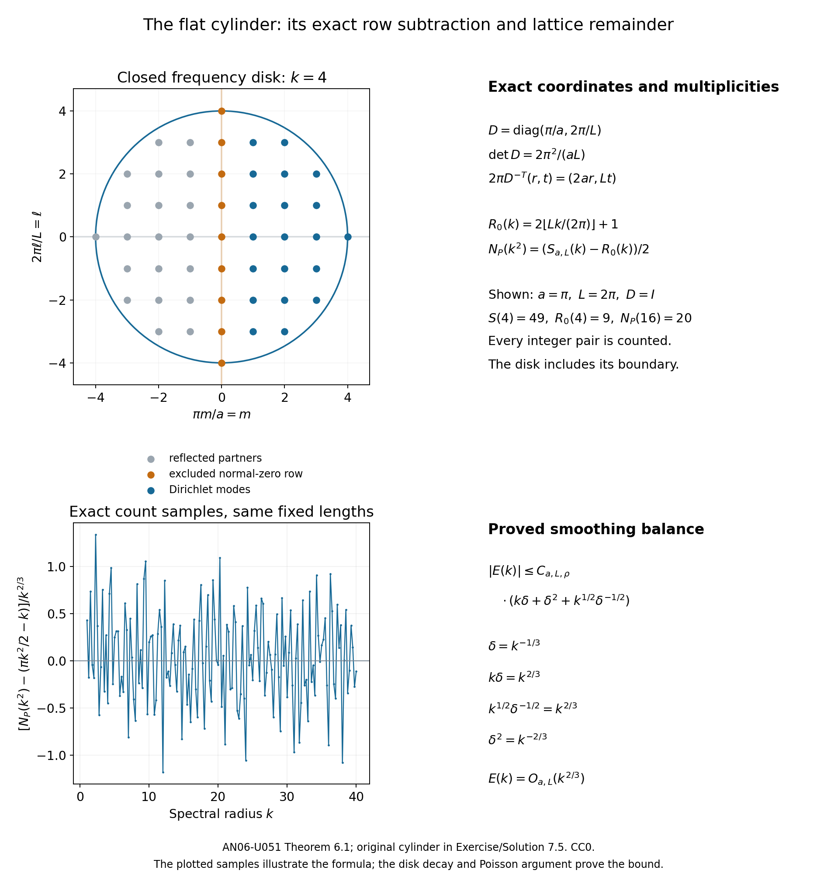

# Generalized rays and the Dirichlet Weyl law

*Written by GPT-6.1 Sol (OpenAI) and GPT-6 Astra (OpenAI). Self-checked by the writing AI. Original exposition: CC0.*

**Working question: Does a reflecting ray's position return imply a wave-trace return?** On the flat cylinder a reflected ray can revisit its position with reversed normal momentum. A full return requires the same position and covector. We use this distinction to prove a general Dirichlet remainder bound, then compare it with a direct cylinder count that subtracts the exact zero-normal row before dividing by two.

A reflecting ray may return to its starting point with a different direction. A wave trace sees a stronger event: the ray must return with the same covector. This distinction gives a useful bound for the spectral remainder. Near the boundary, the local reflected wave contributes a second term, with a negative quarter of the tangential phase volume.

The period-controlled Dirichlet Weyl bound is Hörmander [H4, Theorem 29.3.3], with the two-term consequence in Corollary 29.3.4. His notes credit Ivrii for this spectral refinement. The boundary method has antecedents in the work of Seeley, Pham The Lai and Melrose; the generalized-ray geometry and propagation also owe to Melrose and Sjöstrand, as described in [H3, Notes to Chapters XVII and XXIV].

Ivrii's survey and author monograph [I, M] discuss generalized rays and boundary spectral asymptotics. Duistermaat and Guillemin's work explains the earlier wave-trace setting on manifolds without boundary. Here the linked programme proofs provide the boundary propagation and curved spectral estimates; the arguments below derive the global remainder and the two-term law, and give a separate exact cylinder calculation.

## 1. The operator and the precise prerequisites

Let \(X\) be a compact smooth manifold of dimension \(n\geq2\), with smooth boundary and no corners. Let \(P\) be a scalar formally self-adjoint elliptic differential operator of order two on half densities. Its Dirichlet realization is self-adjoint and strictly positive. Write its quadratic principal symbol as \(p(x,\xi)>0\) for \(\xi\ne0\). This symbol determines a Riemannian metric \(g\). The counting function is
\[
N(\lambda)=\#\{j:\lambda_j\leq\lambda\},\qquad
k=\sqrt\lambda,
\tag{1}
\]
where the eigenvalues are counted with multiplicity. Either the closed or the strict endpoint convention can be used throughout. Let \(\omega_m\) denote the volume of the Euclidean unit ball in \(\mathbb R^m\), and let \(dz=dx\,d\xi\) denote symplectic volume.

We use the full generalized flow of the wave symbol
\[
q(t,x,\tau,\xi)=\tau^2-p(x,\xi).
\tag{2}
\]
It includes transverse reflection, gliding along the wall, and higher-order contact. It need not be a unique flow at every boundary covector. The following are the exact boundary inputs.

First, in boundary normal coordinates \((d,x')\), with \(d\geq0\) inward distance,
\[
p=\xi_d^2+r(d,x',\xi'),\qquad
r=\xi'^T G(d,x')\xi',
\tag{3}
\]
where \(G\) is positive definite. Along every generalized wave curve, parameterized by physical time, \(x'\) and \(\xi'\) are continuously differentiable and satisfy
\[
\dot x'=-G(d,x')\xi'/\tau,
\qquad \dot\xi'=\partial_{x'}r/(2\tau).
\tag{4}
\]
The position is uniformly Lipschitz on normalized compact energy sets. At a transverse reflection, \(\xi'\) stays fixed and \(\xi_d\) reverses sign. Glancing has \(\xi_d=0\). Away from the wall, the ordinary Hamilton equations hold.

Second, generalized curves for this fixed operator have the compactness property that convergent normalized endpoints on bounded time intervals admit a subsequence whose compressed curves converge to a generalized curve. Generalized curves exist and can continue while their normalized phase points remain in a compact set. Compression retains tangential boundary covectors and identifies the two transverse normal lifts at the wall. Interior endpoints retain their full covectors.

Third, a distributional homogeneous Dirichlet wave has the following propagation property: any interior singularity can be continued along a generalized characteristic back to its singular Cauchy data. This applies to the solutions obtained from compactly supported interior data of any fixed negative Sobolev order. For (2), \(\tau\ne0\) on a nonzero characteristic and \(H_qt=2\tau\); hence an arc cannot stop at a radial point instead of reaching the initial time. The compactness and continuation assertion includes all the boundary contact types just described.

For the classical geometric and propagation results, see Hörmander [H3, Definition 24.3.7, Proposition 24.3.12, Corollary 24.3.14 and Theorem 24.5.3]. The programme constructions below retain the possibility of nonuniqueness at infinite-order contact.

The first two inputs follow from [the normal-reaction relation](../providers/analysis/generalized-reflected-curves.md#generalized-reflected-curves), including [compactness](../providers/analysis/generalized-reflected-curves.md#reflected-compactness) and continuation. Its tangential equations (G22) give (4), and it retains both transverse lifts. The third input is the [Dirichlet Cauchy endpoint theorem](../providers/analysis/diffractive-phase-neighborhoods.md#dirichlet-cauchy-endpoints), which applies to every compact interior distributional datum, with arbitrary glancing contact and accumulating reflections.

In [M], Definition 3.2.2 and Theorem 3.2.4 give a broad cone-based construction; Chapter 3, printed p. 196, explains that this alone does not exclude creeping rays. The refined quadratic-block relation (3.4.57)–(3.4.58) is the relevant geometric comparison. The programme [singular-curve proof](../providers/analysis/diffractive-phase-neighborhoods.md#singular-generalized-curves) establishes the inward normal-reaction relation for the actual wave, including arbitrary contact order.

The analytic prerequisites retain the full scalar operator and actual localization forcing: [real-normal-root traces](../providers/analysis/real-normal-root-trace.md#tangential-normal-trace), the [Dirichlet commutator estimate](../providers/analysis/dirichlet-commutator-and-diffraction.md#strict-diffraction-estimate), [quadratic normal division](../providers/analysis/quadratic-normal-cutoffs.md#quadratic-normal-cutoffs), and the [glancing estimate](../providers/analysis/glancing-commutator-estimate.md#glancing-commutator-estimate).

The [complete propagation proof](../providers/analysis/diffractive-phase-neighborhoods.md#dirichlet-cauchy-endpoints) combines fixed-neighborhood Sobolev estimates, separated-root reflection, strict diffraction, general glancing and the Cauchy endpoint argument. [Dirichlet wave regularization](../providers/analysis/dirichlet-wave-regularization.md#dirichlet-wave-regularization) preserves the interior wavefront set at every negative order and supplies smooth compatible initial data near the wall.

The local spectral estimate and its integrated boundary consequence correspond to Hörmander [H3, Theorem 17.5.10 and Corollary 17.5.11]. We use the complete programme proof in the metric-volume normalization stated below.

The spectral prerequisite in the elliptic course is the curved Dirichlet diagonal estimate: relative to \(dV_g\), in a fixed boundary collar the actual spectral density \(e_P(x,x;k^2)\) has the form
\[
\begin{aligned}
e_P(x,x;k^2)&=k^n\bigl[W_n(0)-W_n(2kd)\bigr]+R_k(x),\\
|R_k(x)|&\leq C_0k^n,\\
|R_k(x)|&\leq C_1k(k+d^{-1})^{n-2}\quad(d>0),
\end{aligned}
\tag{5}
\]
with uniform constants, where
\[
W_n(s)=(2\pi)^{-n}\int_{|\eta|<1}\cos(s\eta_n)\,d\eta.
\tag{6}
\]
The [curved spectral estimate](../providers/analysis/curved-boundary-spectral-reduction.md#curved-spectral-estimate), equation (B138), proves (5) for precisely this full operator scope and either spectral endpoint convention. Its finite reflected wave construction controls the reflected arrival; the [joint no-return kernel theorem](../providers/analysis/diffractive-phase-neighborhoods.md#joint-kernel-parameters) controls later times. Positive unsmoothing then gives both simultaneous bounds. [Reflection and the Dirichlet boundary coefficient, Corollary 4.3](reflection-and-the-dirichlet-boundary-coefficient.md#reflection-curved-projector) verifies the metric-volume normalization and the actual-density application.

For comparison, published [I], Sections 2.2.2, 2.2.5 and 2.2.6, describe the boundary spectral route and its dynamical refinement. The literal weighted formula (2.83) in Theorem 2.21 omits the wall coefficient for a weight meeting a Dirichlet boundary. The [half-space counterexample](reflection-and-the-dirichlet-boundary-coefficient.md#reflection-omitted-boundary-term) isolates that formula, with its arXiv numbering; it does not contradict the survey’s global quarter-coefficient formula. Remark 2.22 points to generalized billiards.

The applications of those inputs are proved below. [Reflection and the Dirichlet boundary coefficient](reflection-and-the-dirichlet-boundary-coefficient.md), Theorems 3.1 and 4.1, already proves the collar integral and remainder transfer from (5). [Return times and spectral counting](return-times-and-spectral-counting.md), Lemma 1.1 and Lemma 4.1, proves positive Tauberian unsmoothing and positive microlocal partitions. [Local spectral density and the subprincipal correction](local-spectral-density-and-subprincipal-correction.md), Theorem 5.1 and its trace calculation, supplies the interior short-time coefficients. Scalar symbols, conic localization and wavefront pullbacks are the precisely linked prerequisites of [Wave evolution and cotangent flow](wave-evolution-and-cotangent-flow.md).

The complete bundled proof [Smooth Dirichlet regularity, power domains, and projector growth](../providers/analysis/smooth-dirichlet-powers.md), Sections 1–6, supplies power-domain boundary regularity, compact positive spectral calculus and the parameter Sobolev estimates used here for the stated general scalar operator. It proves every higher boundary-regularity step and both recursive domain inclusions; the source's recalled higher-regularity statements are not imported. Its coordinate statements apply to half densities by the unitary multiplication \(u\mapsto\rho^{1/2}u\) for the chosen positive density \(\rho\). To pass to a compact manifold, use a finite smooth coordinate partition. A bounded \(H_0^1\) family has bounded, compactly supported zero extensions in each flattened boundary chart, and ordinary compactly supported extensions in the interior charts. The local compactness proof gives convergent subsequences in each chart; finitely many successive selections give a single subsequence converging in global \(L^2\). Thus the Dirichlet inverse is compact, and the existing compact positive Hilbert-space proof gives its complete eigenbasis and exact spectral power domains.

The same finite chart partition carries the boundary power estimate and parameter Sobolev estimate to the manifold. In particular, for an integer \(m\) with \(2m>n/2\), they give
\[
\|u\|_{H^{2m}}\leq C_m\bigl(\|P^mu\|_2+\|u\|_2\bigr),
\qquad
s^{2m-n/2}\|u\|_\infty^2
\leq C_m\bigl(\|u\|_{H^{2m}}^2+s^{2m}\|u\|_2^2\bigr).
\]
For \(u=E_\lambda f\) and \(s=\lambda\geq1\), the spectral power norm is at most \(\lambda^m\|u\|_2\). Hence the evaluation functional on this spectral subspace has norm at most \(C\lambda^{n/4}\). Its squared norm is the diagonal eigenfunction sum, so \(e_P(x,x;\lambda)\leq C\lambda^{n/2}\), uniformly in \(x\), relative to \(dV_g\). Integrating proves \(N(\lambda)=O(\lambda^{n/2})\). This finite-chart transfer uses the written regularity and Sobolev proofs; it does not import a Weyl asymptotic as the polynomial growth bound.

## 2. Full covector returns have a uniform positive length

Let \(X^\circ=X\setminus\partial X\). Define the lifted wave relation \(C\) by
\[
\begin{split}
C=\{(t,x,y,\tau,\xi,\eta):\;&\tau^2=p(x,\xi)=p(y,\eta)>0,\\
&(t,x,\tau,\xi)\text{ and }(0,y,\tau,\eta)
\text{ lie on a generalized wave curve}\}.
\end{split}
\tag{7}
\]
The input covector \(\eta\) here is the positive, untwisted input covector. For a distribution kernel, its actual covector in the \(y\) variable will be \(-\eta\). Interior endpoints retain their ordinary full covectors. At a transverse boundary contact we include both one-sided endpoint lifts; at glancing the normal covector is zero. This gives the closed lifted relation in the full cotangent bundle over \(X\). In particular the zero-time boundary relation includes the pair of opposite transverse normal lifts at an instantaneous reflection. This convention is needed for closedness as interior endpoints approach a wall hit.

The closed full-return relation and positive lower bound are the content of Hörmander [H4, Lemma 29.3.1]. The coordinate proof here keeps track of the reflected covector.

**Lemma 2.1 (closed relations and short returns).** The lifted relation \(C\) is closed in the nonzero cotangent space. Its nonzero-time full diagonal return part
\[
C_\Delta=\{(t,x,x,\tau,\xi,\xi)\in C:t\ne0\}
\tag{8}
\]
is also closed there. There is \(t_*>0\), independent of the starting point and direction, with no element of \(C_\Delta\) for \(0<|t|<t_*\).

**Proof.** The fixed-operator curve compactness in Section 1 proves closedness of (7). Indeed, for a convergent sequence of relation points, the nonzero limiting characteristic has \(\tau\ne0\). Normalize the covectors to \(p=1\), retain one time-covector sign after taking a subsequence, and put all the bounded time intervals into a common compact interval by continuation. Curve compactness gives a limiting generalized curve. At an interior endpoint the full covectors converge. At a glancing endpoint the normal covectors tend to zero. At a transverse wall endpoint, the nonzero normal velocity and the implicit function theorem locate the nearby reflection times; the incoming and outgoing ordinary Hamiltonian legs converge separately. The convergent endpoint covector is one of those two permitted lifts. This also covers a zero limiting time with a reflected pair. Thus the limiting endpoints belong to the lifted relation. Scaling back gives the limiting relation point.

We prove the short-return assertion directly. Normalize \(p=1\), so \(\tau=\pm1\). Choose finitely many fixed interior and boundary normal charts, each with a smaller member, such that the smaller members cover \(X\). Uniform spatial speed and a Lebesgue number for this cover ensure that every sufficiently short arc remains in one of the larger charts. All coefficient, Lipschitz and ellipticity bounds can therefore be chosen uniformly.

In an interior chart, \(p=\xi^TG(x)\xi\), and
\[
\dot x=-G(x)\xi/\tau,
\qquad \dot\xi=\partial_xp/(2\tau).
\tag{9}
\]
The normalized covectors are bounded, and both right sides are uniformly bounded and smooth. Thus \(v(t)=\dot x(t)=v(0)+O(T)\) for \(0\leq t\leq T\), while \(|v(0)|\geq c>0\). A position return gives \(0=T v(0)+O(T^2)\), a contradiction for small \(T>0\).

Consider a boundary chart and suppose its arc returns to the initial position in time \(T\). Formula (4) and the uniform spatial Lipschitz bound give
\[
\xi'(t)=\xi'(0)+O(T),\qquad
G(x(t))=G(x(0))+O(T).
\]
Integrating the tangential velocity, using \(x'(T)=x'(0)\), yields
\[
0=-T G(x(0))\xi'(0)/\tau+O(T^2).
\tag{10}
\]
Uniform invertibility implies \(|\xi'(0)|\leq CT\), and then \(|\xi'(t)|\leq C'T\) throughout. From (3),
\[
\xi_d(t)^2=1-r(x(t),\xi'(t))\geq1-C''T^2\geq\tfrac12
\tag{11}
\]
for sufficiently small \(T\); at a reflection both one-sided covectors satisfy this inequality. Thus the hypothesized returning arc has no glancing or gliding point. This conclusion was obtained from the generalized tangential equations; it was not assumed in advance.

Between reflections, \(\xi_d\) is continuous and nonzero. Consequently \(\dot d=-\xi_d/\tau\) has fixed sign. At a wall hit its sign changes from outward to inward. A second wall hit would require the normal velocity to change sign in the interior, contradicting (11). Thus there is at most one reflection. Without a reflection, \(d\) is strictly monotone and cannot return. With one reflection, the final normal covector has the opposite sign to the initial one, and cannot equal it. In either case a full interior-covector return is impossible. The constants are uniform even as the initial interior point approaches the wall.

If the initial and final base point is on the wall, the same tangential estimate gives (11). Immediately after that initial contact the normal position increases. It cannot return to zero without a normal turning point, which (11) excludes. Endpoint reflection conventions do not change this position argument. Thus boundary full returns are also excluded in the same time interval.

Time reversal treats negative \(T\). Take the minimum of the chart thresholds to obtain \(t_*\). Finally, a convergent sequence in (8) cannot have time limit zero, by this bound. All its remaining equalities pass to the limit through the closed relation (7). This proves the closedness of (8). ∎

At the boundary, compression identifies opposite transverse normal lifts. The diagonal equality in (8) is equality of full lifted covectors; equality only in a compressed fiber must not be substituted for it. The wave-kernel application below uses interior endpoints.

Define the least full return time by
\[
\ell_*(x,\xi)=\inf\{t>0:(t,x,x,\sqrt{p(x,\xi)},\xi,\xi)\in C\},
\tag{12}
\]
with \(\inf\varnothing=\infty\). The two time-covector signs give the same positive return set by reversal of a closed curve.

**Corollary 2.2.** The function \(\ell_*\) is lower semicontinuous, is homogeneous of degree zero in \(\xi\), and satisfies \(\ell_*\geq t_*\). Hence
\[
f(x,\xi)=\ell_*(x,\xi)^{-1},\qquad \infty^{-1}=0,
\tag{13}
\]
is bounded, upper semicontinuous and measurable on the punctured cotangent bundle with the stated lift convention.

**Proof.** Simultaneous positive scaling of \((\tau,\xi)\) in (2) preserves physical-time parameterization, proving homogeneity. The lower bound is Lemma 2.1. For lower semicontinuity, let normalized full lifted covectors \(z_j\to z\) have finite lower limit \(L\) of their least return times. Pass to a subsequence realizing that limit, and choose actual return times within \(1/j\) of those infima. Their limit is \(L\geq t_*>0\). Closedness of the diagonal relation gives a return at \(z\) of time \(L\), so \(\ell_*(z)\leq L\). Infinite lower limits require no argument. Taking reciprocals proves the assertions about (13). The positive bound comes from the coordinate proof, not from a compactness argument on the open interior cosphere. ∎

## 3. From propagation to the full wave kernel

Let \(F(t,x,y)\) be the distribution kernel of \(\cos(t\sqrt P)\), restricted to \(\mathbb R\times X^\circ\times X^\circ\). Write
\[
\operatorname{WF}'(F)=
\{(t,x,y,\tau,\xi,\eta):(t,x,y,\tau,\xi,-\eta)\in\operatorname{WF}(F)\}.
\tag{14}
\]

The following elementary kernel observation makes the uniformity in the propagation argument explicit.

**Lemma 3.1 (negative Sobolev bounds give a smooth kernel).** Suppose a distribution kernel \(K(z,y)\) has fixed compact input support in a coordinate chart. If its operator \(S\) extends continuously from \(H^{-2N}\) with that support to \(C^\infty\) locally in \(z\), for every integer \(N\geq0\), then \(K\) is jointly smooth in \((z,y)\).

**Proof.** Put the input chart inside a torus and insert a smooth input cutoff equal to one on the support of \(K\). Let \(e_m(y)\), \(m\in\mathbb Z^n\), be its normalized Fourier modes. Smooth multiplication and the Fourier formula for the Sobolev norm give
\[
\|\chi e_m\|_{H^{-2N}}\leq C_N(1+|m|)^{-2N}.
\tag{15}
\]
For instance the Fourier coefficients are translates of those of \(\chi\); splitting their sum at \(|\ell-m|=|m|/2\) and using the rapid decrease of \(\widehat\chi\) proves (15) for every \(N\).

For any compact output set and any number \(a\) of output derivatives, continuity gives
\[
\|S(\chi e_m)\|_{C^a}\leq C_{a,N}(1+|m|)^{-2N}.
\tag{16}
\]
The kernel Fourier series has terms \(S(\chi e_m)(z)e_{-m}(y)\). Applying \(b\) input derivatives costs at most \(C_b(1+|m|)^b\). Choose \(2N>n+b\). Formula (16) then gives absolute uniform convergence of every prescribed mixed derivative series on the compact output set. The series agrees with \(K\) as a distribution, since it has the same input Fourier coefficients. It is therefore a smooth representative of \(K\). A finite chart partition treats the general compact input support. ∎

This kernel inclusion is Hörmander [H4, Proposition 29.3.2]. We give the negative-order and joint-kernel steps explicitly.

**Proposition 3.2 (the generalized wave relation).** The cosine kernel of the operator in Section 1 satisfies
\[
\operatorname{WF}'(F)\subset C.
\tag{17}
\]

**Proof.** The spectral expansion gives
\((\partial_t^2+P_x)F=0\) and \((\partial_t^2+P_y^{\mathsf t})F=0\), with transpose on the input half density. Elliptic regularity for these equations shows that every nonzero wavefront covector satisfies
\[
\tau^2=p(x,\xi)=p(y,\eta)>0.
\tag{18}
\]
In particular \(\tau\), \(\xi\) and \(\eta\) are nonzero. Locally their magnitudes are comparable. It is enough to exclude a relation point satisfying (18) but lying outside \(C\).

Closedness of \(C\) provides conic neighborhoods \(\Gamma_1\) of the input point \((y,\eta)\) and \(\Gamma_2\) of the output spacetime point \((t,x,\tau,\xi)\), separated by the relation: no generalized wave curve joins any point in the first to any point in the second. Choose a properly supported interior pseudodifferential input operator \(A\) with fixed compact kernel support, microlocally supported in \(\Gamma_1\) and elliptic at the input point. Choose a compactly supported spacetime pseudodifferential operator \(B\), microlocally supported in \(\Gamma_2\) and elliptic at the output point.

For every \(N\), the map
\[
T:f\longmapsto\cos(t\sqrt P)Af
\tag{19}
\]
is continuous from the fixed-support \(H^{-2N}\) space to \(C(\mathbb R,H^{-2N}_{\mathrm{loc}}(X^\circ))\). Here is a direct justification of this extrapolation. An interior properly supported elliptic parametrix for \(P^N\) writes the compactly supported datum \(Af\) as
\[
Af=P^Ng+h,
\qquad \|g\|_2+\|h\|_2\leq C_N\|f\|_{H^{-2N}},
\tag{20}
\]
with \(g,h\) compactly supported in the interior. The residual operator is smoothing, giving the bound for \(h\). Integration by parts against each Dirichlet eigenfunction is valid because of these supports. Thus spectral expansion gives
\[
Tf=P^N\cos(t\sqrt P)g+\cos(t\sqrt P)h
\tag{21}
\]
as an interior distribution. Spectral cosine is strongly continuous and uniformly bounded on \(L^2\), and the differential operator \(P^N\) maps \(L^2\) continuously to \(H^{-2N}_{\mathrm{loc}}\). This proves (19).

This solution has Cauchy data \(Af,0\) and homogeneous Dirichlet data. The boundary assertion for these extrapolated solutions can also be read spectrally: pairing in time with a compactly supported smooth test function makes its cosine transform decrease faster than every power of \(\sqrt{\lambda_j}\). Formula (20) then places the paired solution in every spectral power domain. Elliptic boundary regularity makes it smooth up to the wall with zero Dirichlet value. Thus the distributional boundary condition is retained; negative-order initial data have not removed it.

The [negative-order wave reading, Sections 1–6](../providers/analysis/dirichlet-wave-regularization.md#dirichlet-wave-regularization), proves the precise reduction needed here. In that reading the positive operator is denoted by \(1+P\), so it is distinct from the input cutoff \(A\) above. Applying a sufficiently large inverse power of \(1+P\) to \(Tf\) produces a finite-energy Dirichlet wave, with the same interior spacetime wavefront set. Its initial data have exactly the interior wavefront of \(Af\), are smooth near the wall, and satisfy every iterated Dirichlet compatibility condition there. Therefore a complete finite-energy wavefront propagation theorem transfers to (19) for every negative order. This reduction does not infer full wavefront propagation from a single energy-norm estimate.

The propagation input now implies \(BTf\in C^\infty\) for every \(f\) in this \(H^{-2N}\) space. Indeed a singularity in \(\Gamma_2\) would continue back to a singular initial covector of \(Af\) in \(\Gamma_1\), contradicting their separation. Compactness, generalized continuation and the nonzero physical-time velocity justify continuing back through any wall contacts.

We prove the required continuity into \(C^\infty\). Write \(E\) for the fixed-support \(H^{-2N}\) space, a closed subspace of that Hilbert space: distributional convergence preserves support. Put \(S=BT\). For a closed coordinate ball \(K\) contained in the output chart and an integer \(a\ge0\), set
\[
 p_{K,a}(v)=\max_{|\alpha|\le a}\sup_K|\partial^\alpha v|,
 \qquad F_m=\{f\in E:p_{K,a}(Sf)\le m\}.
\]
Each \(F_m\) is closed in \(E\). Indeed, if \(f_j\to f\), (19) gives convergence of every output derivative in distributions. A normalized nonnegative smooth bump supported inside \(K\), centered at an interior point, averages \(\partial^\alpha Sf_j\) to a number of modulus at most \(m\). Pass first to the distributional limit and then shrink the bump. Smoothness of \(Sf\) gives the same pointwise bound; continuity extends it to the boundary of \(K\). Thus \(f\in F_m\).

The closed sets \(F_m\), \(m=1,2,\ldots\), cover \(E\), because every \(Sf\) is smooth. The nested-ball Baire proof in [Polynomial localizations and rough coefficients, the closed graph input](polynomial-localizations-and-rough-coefficients.md#2-polynomial-classes-and-the-available-derivatives) gives a ball \(B(f_0,r)\subset F_m\). For \(\|h\|_E<r\), subtract the bounds for \(f_0+h\) and \(f_0\) to obtain \(p_{K,a}(Sh)\le2m\). Scaling a nonzero \(h\) to norm \(r/2\) yields
\[
 p_{K,a}(Sh)\le(4m/r)\|h\|_E.
\]
Finite ball covers give every compact-output seminorm. This proves precisely the continuity \(BT:E\to C^\infty\) needed in Lemma 3.1, without importing a Banach-to-Fréchet closed graph theorem. Apply that lemma for every \(N\): the kernel of \(B\cos(t\sqrt P)A\) is jointly smooth. The elementary category argument is also given in the free author edition [T], Theorem 0.42.

Its action on \(F\) is \(B_{t,x}A_y^{\mathsf t}F\). On a conic neighborhood of the proposed covector, (18) makes both the input frequency and the output spacetime frequency comparable to the full joint frequency. The separately acting symbols are consequently ordinary joint order-zero symbols there: each derivative estimate uses the same comparable frequency scale. Insert a joint conic cutoff supported in this neighborhood. The product is elliptic at the point, with principal symbol \(b(t,x,\tau,\xi)a(y,\eta)\), since transposition reverses the input kernel covector \(-\eta\). Joint microlocal elliptic regularity then excludes that point from \(\operatorname{WF}(F)\). Points outside (18) were already excluded. This proves (17). ∎

The use of all negative Sobolev orders is essential in Lemma 3.1. Smoothness of the output for each individual smooth datum would not by itself prove joint smoothness of the kernel.

## 4. Positive localization and the even frequency measure

Choose a fixed smooth cutoff \(w\), zero near the boundary and one outside a small boundary collar, with \(0\leq w\leq1\). Put
\[
\psi=1-w^2.
\tag{22}
\]
Thus \(\psi=1\) near the wall, is supported in the collar, and \(\sqrt{1-\psi}=w\) is smooth. Cover the normalized cotangent directions over \(\operatorname{supp}w\) by finitely many open cones \(\Gamma_j\), and choose numbers
\[
0<L_j<\ell_*(z)\quad(z\in\Gamma_j).
\tag{23}
\]
All cones and operator kernels used here have compact base support in the interior.

The positive normalization construction from the return-time lesson gives operators \(C_j\in\Psi^0_{\mathrm{cl}}\) such that, with \(B_j=C_jC_j^*\),
\[
\sum_j B_j+\psi=I+R,
\qquad R\in\Psi^{-\infty},
\tag{24}
\]
where \(R\) has compact interior kernel support. To apply that construction locally, take a closed smooth extension of a compact neighborhood of \(\operatorname{supp}w\), extend the positive principal symbol, and normalize a square partition there modulo smoothing. Multiply every normalized \(C_j\) on the left by \(w\). The sum becomes \(w(I+R_0)w=w^2+wR_0w\). Terms microlocally outside \(\operatorname{supp}w\) become smoothing and can be absorbed in \(R\). Spatial cutoffs equal to one on the retained symbol supports give compact interior kernels. This proves (24) with the required supports.

The principal symbols \(b_j\geq0\) and subprincipal symbols \(b_{j,s}\) therefore satisfy
\[
\sum_j b_j=1-\psi,
\qquad \sum_j b_{j,s}=0.
\tag{25}
\]
The second identity follows because multiplication by \(\psi\) has zero half-density subprincipal symbol. It is an identity at every symbol order in (24), rather than just a principal-symbol partition.

Let \(\phi_\ell\) be an orthonormal Dirichlet eigenbasis, with \(P\phi_\ell=k_\ell^2\phi_\ell\). Define the positive localized counts
\[
M_j(k)=\sum_{k_\ell\leq k}\|C_j^*\phi_\ell\|_2^2
=\operatorname{Tr}(E_{k^2}B_j).
\tag{26}
\]
The standard elliptic spectral bound gives \(N(k^2)=O(k^n)\), and boundedness of \(C_j\) gives the same growth for \(M_j\). Positivity will let us remove smoothing even though the comparison density need not be positive.

The trace of \(\cos(t\sqrt P)B_j\) is smooth for \(0<|t|\leq L_j\). Indeed, compose (17) with the pseudodifferential relation of \(B_j\), restrict the two spatial variables to the diagonal, and integrate over their compact interior support. The restriction is defined since \(\tau\ne0\). In the resulting spatial integration, a surviving wavefront covector must have \(\xi-\eta=0\), as proved by the compact fiber-integration rule in the wave lesson. Such a point would be a full covector return in \(\Gamma_j\), which (23) excludes. Full returns, rather than mere position returns, are exactly what this trace can retain.

Near \(t=0\), the localized cosine kernel agrees with that of a closed interior extension of \(P\). Here is the local finite-propagation proof for the actual variable-coefficient operator, including its lower-order terms. In an interior half-density chart, write its wave equation as
\[
 u_{tt}-\partial_i(a^{ij}(x)\partial_j u)
       =\beta^j(x)\partial_j u+\gamma(x)u,
\]
where \(a\) is real symmetric and uniformly positive on the compact chart; the smooth lower coefficients may be complex. This form follows by expanding the given formally self-adjoint differential expression; it imposes no restriction on its first-order part. For a smooth solution define
\[
 \begin{aligned}
 e&=\tfrac12\bigl(|u_t|^2+a^{ij}\partial_j u\,
                           \overline{\partial_i u}+|u|^2\bigr),\\
 J_i&=\operatorname{Re}\bigl(a^{ij}\partial_j u\,
                                            \overline{u_t}\bigr).
 \end{aligned}
\]
Direct differentiation, using time independence of \(a\), gives
\[
 \partial_t e-\operatorname{div}J
   =\operatorname{Re}\bigl((\beta^j\partial_j u+(\gamma+1)u)
                                              \overline{u_t}\bigr)
   \le C e.
\]
The sign of the spatial divergence is fixed by this calculation. Ellipticity and the bounded lower coefficients give the final inequality. Choose \(v>0\) with \(a^{ij}\nu_i\nu_j\le v^2\) for all unit Euclidean normals in the chart. Cauchy–Schwarz in the positive quadratic form and \(2AB\le A^2+B^2\) give \(|J\cdot\nu|\le ve\). For a ball whose closure lies in that chart, differentiate the energy in the shrinking ball:
\[
 \begin{aligned}
 E(t)&=\int_{|x-x_0|<R-vt}e(t,x)\,dx,\\
 E'(t)&\le C E(t)+\int_{|x-x_0|=R-vt}(J\cdot\nu-ve)\,dS
          \le C E(t),\qquad 0<t<R/v.
 \end{aligned}
\]
The differentiation follows by polar coordinates and the ordinary fundamental theorem of calculus; spatial integration by parts supplies the flux. Thus \((e^{-Ct}E(t))'\le0\). Zero Cauchy data in the original ball imply zero energy, hence \(u=0\), throughout this cone. Time reversal gives the negative-time assertion. This is the local-energy method of [O], Propositions 10.6–10.9, with the variable principal and lower coefficients proved explicitly here.

Apply the argument to the difference of the Dirichlet wave and the wave for an extension agreeing with \(P\) on an interior neighborhood of the compact kernel supports. For smooth compactly supported data these waves are smooth there by the proved spectral-power regularity; they have identical Cauchy data. Finitely many balls cover the retained output support, so a single sufficiently small fixed time works. The difference vanishes on that support. Testing against smooth input and output functions proves equality of the localized distribution kernels as well. The equality thus holds before taking a trace or applying the negative-order kernel argument. The scalar calculus supplies a local classical square root \(Q\) with
\[
h=\sqrt p,
\qquad h_s=\frac{p_s}{2\sqrt p},
\tag{27}
\]
where \(p_s\) is the subprincipal symbol of the differential operator \(P\). Its construction is the scalar symbol recursion for \(Q^2=P\), and lower-order smoothing errors do not change the zero-time singularity.

Let \(A_j(k)\), normalized by \(A_j(0)=0\), be the real primitive of the full small-time frequency symbol supplied by the local coefficient lesson for the positive branch \(e^{-itQ}B_j\). Its derivative decreases rapidly as \(k\to-\infty\), and
\[
\begin{split}
A_j(k)=(2\pi)^{-n}\bigg[
&\int_{h<k}(b_j+b_{j,s})\,dz\\
&-\partial_k\int_{h<k}
\left(h_sb_j+\frac i2\{b_j,h\}\right)\,dz
\bigg]+o(k^{n-1}).
\end{split}
\tag{28}
\]
This uses the full symbol, not just the two displayed terms. Thus its Fourier transform matches the whole zero-time singularity. In dimension two the omitted primitive can have logarithmic growth, which is still \(o(k)\). The integrated bracket is zero: \(H_h\) is divergence free, is tangent to \(h=k\), and the base supports lie away from the wall. The trace and its even real time cutoff make the frequency symbol real.

**Lemma 4.1 (cosine normalization and unsmoothing).** For each nonzero partition member,
\[
\limsup_{k\to\infty}k^{1-n}|M_j(k)-A_j(k)|
\leq\frac{C_n}{L_j}\int_{p<1}b_j\,dz,
\tag{29}
\]
where \(C_n\) depends only on dimension and the fixed positive smoothing kernel.

**Proof.** The cosine transform is the Fourier transform of the positive even measure
\[
d\mu_j(s)=\frac12\sum_\ell\|C_j^*\phi_\ell\|_2^2
\bigl(\delta_{k_\ell}+\delta_{-k_\ell}\bigr).
\tag{30}
\]
Take its monotone primitive anchored at zero. For \(s>0\), this is \(M_j(s)/2\). Strict positivity of \(P\) removes an atom at zero.

Put \(a_j(s)=A_j'(s)\) and define the real even comparison derivative and its anchored primitive by
\[
\nu_j'(s)=\tfrac12\bigl(a_j(s)+a_j(-s)\bigr),
\qquad \nu_j(s)=\int_0^s\nu_j'(u)\,du.
\tag{31}
\]
The rapid negative-energy decrease implies, for \(s>0\),
\[
\nu_j(s)=\tfrac12 A_j(s)+O(1),
\qquad
\nu_j'(s)=\tfrac12 n\alpha_j s^{n-1}+O(s^{n-2}),
\quad
\alpha_j=(2\pi)^{-n}\int_{p<1}b_j\,dz>0.
\tag{32}
\]
The derivative is even, so its negative tail has the same leading bound. For \(a=L_j^{-1}\), choose \(a_0\geq a\) large enough that
\[
|\nu_j'(s)|\leq\tfrac12 n\alpha_j(|s|+a_0)^{n-1}
\quad(s\in\mathbb R).
\tag{33}
\]
Increasing \(a_0\) absorbs the \(O(|s|^{n-2})\) term, bounded intervals and the lower terms. This is where \(n\geq2\) is used.

The Fourier transforms of (30) and (31) have the same complete singularity at zero, and are smooth at every other time in \([-L_j,L_j]\). Multiplication of their difference by the fixed smoothing transform \(\widehat\varphi(t/L_j)\), whose compact support lies strictly inside that interval, is therefore smooth and compactly supported. Its inverse transform
\[
(d\mu_j-d\nu_j)*\varphi_{1/L_j}
\tag{34}
\]
is Schwartz, in particular bounded and integrable. The positive Tauberian lemma of the return-time lesson now bounds the normalized difference of the primitives by \(C_n n\alpha_j/(2L_j)\). Multiply by two and use (32). The bounded error disappears after division by \(s^{n-1}\). Absorbing the dimensional factors into \(C_n\) gives (29). The factors \(1/2\) on the positive cosine measure and its comparison cancel; no extra factor remains in the counting coefficient. ∎

We next compute the sum of (28). A scalar formally self-adjoint second-order differential operator on half densities can be written locally, with \(D_j=-i\partial_j\), as
\[
P=\sum_{i,j}D_i a^{ij}D_j
+\frac12\sum_j(b^jD_j+D_jb^j)+c,
\tag{35}
\]
where \(a^{ij}=a^{ji}\), \(b^j\), and \(c\) are real smooth functions. To see the lower-order assertion, subtract the real symmetric divergence-form second-order part. Equality with the formal adjoint makes the remaining first-order coefficients real, and makes the remaining zeroth-order coefficient differ from a real function by \(-\tfrac i2\sum_j\partial_j b^j\), exactly the correction in (35).

The half-density subprincipal formula cancels the differentiated \(a^{ij}\) terms and gives
\[
p_s=\sum_j b^j\xi_j.
\tag{36}
\]
Thus \(p_s\) is odd in \(\xi\), while \(h=\sqrt p\) is even. Formula (27) makes \(h_s\) odd. Summing (28) and using (25), the subprincipal partition terms cancel, and
\(\int_{h<k}h_s(1-\psi)\,dz=0\) by the antipodal change \(\xi\mapsto-\xi\). Hence
\[
\sum_j A_j(k)
=(2\pi)^{-n}\omega_n k^n\int_X(1-\psi)\,dV_g
+o(k^{n-1}).
\tag{37}
\]
This proves the absence of an interior second counting term for the present differential operator. Lower-order coefficients were retained and their actual contribution was integrated; they were not discarded.

Finally the smoothing operator in (24) contributes \(O(1)\) to the count. For any large integer \(m\), compact interior support and smoothing make \(RP^m\) bounded. Against an eigenfunction,
\[
|\langle R\phi_\ell,\phi_\ell\rangle|
\leq C_m\lambda_\ell^{-m}.
\tag{38}
\]
The polynomial spectral bound makes this summable when \(m>n/2\), by dyadic shells. Therefore \(\operatorname{Tr}(E_{k^2}R)\) is uniformly bounded. Combining (24), (26), (29) and (37) gives
\[
\begin{split}
\limsup_{k\to\infty}k^{1-n}
\bigg|\operatorname{Tr}\bigl(E_{k^2}(1-\psi)\bigr)
&-(2\pi)^{-n}\omega_n k^n\int_X(1-\psi)\,dV_g\bigg|\\
&\leq C_n\int_{p<1}\sum_j b_jL_j^{-1}\,dz.
\end{split}
\tag{39}
\]

## 5. The global bound and the two-term law

The following estimate and its periodic-null-set corollary are Hörmander [H4, Theorem 29.3.3 and Corollary 29.3.4]. The proof includes the positive-measure normalization and the measurable reciprocal-period approximation.

**Theorem 5.1 (a remainder controlled by generalized periods).** For the operator and full lifted return time of Sections 1–2,
\[
\begin{split}
\limsup_{\lambda\to\infty}\lambda^{(1-n)/2}
\bigg|N(\lambda)
&-(2\pi)^{-n}\omega_n\operatorname{Vol}_g(X)\lambda^{n/2}\\
&+\frac14(2\pi)^{1-n}\omega_{n-1}
\operatorname{Vol}_g(\partial X)\lambda^{(n-1)/2}\bigg|\\
&\leq C_n\int_{p<1}\ell_*(z)^{-1}\,dz.
\end{split}
\tag{40}
\]
The constant \(C_n\) depends only on dimension. In particular the boundary term in \(N\) has a negative sign.

**Proof.** We first improve (39) to its exact return-time integral for each fixed \(\psi\). Put \(f=\ell_*^{-1}\). Choose a compact normalized cotangent set \(Z\) over an interior compact neighborhood of \(\operatorname{supp}w\), and give it a metric \(d_Z\). By Corollary 2.2, \(f\) is bounded and upper semicontinuous. For an integer \(m\geq1\), set
\[
f_m(z)=\sup_{v\in Z}\bigl(f(v)-m d_Z(z,v)\bigr).
\tag{41}
\]
The triangle inequality makes \(f_m\) \(m\)-Lipschitz. Also \(f\leq f_m\leq\sup f\), and \(f_m\) decreases with \(m\). To prove pointwise convergence to \(f\), choose almost maximizing \(v_m\) with error \(1/m\). Boundedness of \(f\) and \(f_m(z)\geq f(z)\geq0\) force \(d_Z(z,v_m)\to0\). Upper semicontinuity gives \(\limsup f(v_m)\leq f(z)\). Since the subtracted distance is nonnegative, \(\limsup f_m(z)\leq f(z)\), proving the claim.

Fix \(m\) and \(\varepsilon>0\). Choose the cones covering \(\operatorname{supp}w\) so small that the oscillation of \(f_m\) on each normalized member is at most \(\varepsilon\), and keep their closures in the interior compact neighborhood. Let
\[
\gamma_j=\sup_{\Gamma_j\cap Z}f+\varepsilon,
\qquad L_j=\gamma_j^{-1}.
\tag{42}
\]
Homogeneity implies (23), including where \(f=0\). At each point in the support of \(b_j\),
\(\gamma_j\leq f_m(z)+2\varepsilon\). Thus (25) gives
\[
\sum_j b_jL_j^{-1}
\leq(1-\psi)(f_m+2\varepsilon).
\tag{43}
\]
Insert this partition in (39), let \(m\to\infty\) by bounded dominated convergence on the finite phase volume, and then let \(\varepsilon\downarrow0\). We obtain
\[
\begin{split}
\limsup_{k\to\infty}k^{1-n}
\bigg|\operatorname{Tr}\bigl(E_{k^2}(1-\psi)\bigr)
&-(2\pi)^{-n}\omega_n k^n\int_X(1-\psi)\,dV_g\bigg|\\
&\leq C_n\int_{p<1}(1-\psi)f\,dz.
\end{split}
\tag{44}
\]
Each partition is fixed before the energy limit. No estimate uniform in the number of partition members is required: the dimensional Tauberian constant is fixed, and the finite sum of lower-order errors disappears for that partition.

For the same fixed \(\psi\), the collar integral and integrated transfer theorem of the reflection lesson, applied to the actual density (5), give
\[
\begin{split}
\limsup_{k\to\infty}k^{1-n}
\bigg|\operatorname{Tr}(E_{k^2}\psi)
&-(2\pi)^{-n}\omega_n k^n\int_X\psi\,dV_g\\
&+\kappa_{n-1}k^{n-1}\int_{\partial X}\psi\,dS_g\bigg|
\leq C'\int_X\psi\,dV_g,
\end{split}
\tag{45}
\]
where \(\kappa_{n-1}=\tfrac14(2\pi)^{1-n}\omega_{n-1}\). The constant \(C'\) may depend on \(P\), but is independent of derivatives of this fixed cutoff. The actual metric collar Jacobian is included in that theorem. Since \(\psi=1\) at the wall, the boundary integral is the full boundary volume.

Add (44) and (45). Their counts add exactly to \(N(k^2)\). Now choose successive fixed collar cutoffs \(\psi_\delta=1-w_\delta^2\) with support in \(d<\delta\), and let \(\delta\downarrow0\) only after taking each energy limsup. The smooth metric collar gives \(\int_X\psi_\delta\,dV_g=O(\delta)\). The bounded reciprocal period gives dominated convergence of the interior phase integral to \(\int_{p<1}f\,dz\). The collar error vanishes, leaving (40) after \(k=\sqrt\lambda\). No derivative bound uniform in \(\delta\) was assumed. ∎

**Corollary 5.2 (periodic rays of measure zero).** If the set of interior covectors admitting a closed generalized ray has symplectic measure zero, then
\[
\begin{split}
N(\lambda)={}&(2\pi)^{-n}\omega_n\operatorname{Vol}_g(X)\lambda^{n/2}\\
&-\frac14(2\pi)^{1-n}\omega_{n-1}
\operatorname{Vol}_g(\partial X)\lambda^{(n-1)/2}
+o\bigl(\lambda^{(n-1)/2}\bigr).
\end{split}
\tag{46}
\]

**Proof.** Outside that periodic set, \(\ell_*=\infty\), so \(f=0\). Its integral in (40) is therefore zero, since \(f\) is bounded and measurable. The nonnegative normalized absolute remainder has limsup zero, which is precisely (46). This conclusion requires no assertion that every generalized ray is the limit of transverse broken rays. ∎

Strict positivity is only a convenient spectral normalization. If the Dirichlet realization is lower bounded, choose \(c\) so that \(P+c>0\), apply the result to \(P+c\), and use \(N_{P+c}(\lambda+c)=N_P(\lambda)\). The principal metric and generalized relation are unchanged. Expanding the volume power adds \(O(\lambda^{n/2-1})=o(\lambda^{(n-1)/2})\); expanding the boundary power adds a still smaller term. The same two coefficients and remainder bound follow.

## 6. A check of dimensions and limits

Rescale the operator to \(P_a=a^{-2}P\), with \(a>0\). Its metric is \(g_a=a^2g\), its frequencies are divided by \(a\), and its physical return times are multiplied by \(a\). Consequently
\[
\operatorname{Vol}_{g_a}(X)=a^n\operatorname{Vol}_g(X),\qquad
\operatorname{Vol}_{g_a}(\partial X)=a^{n-1}\operatorname{Vol}_g(\partial X),
\qquad \ell_{*,a}=a\ell_*.
\tag{47}
\]
Because \(p_a<1\) is \(p<a^2\), covector scaling and degree-zero homogeneity give
\[
\int_{p_a<1}\ell_{*,a}^{-1}\,dz
=a^{n-1}\int_{p<1}\ell_*^{-1}\,dz.
\tag{48}
\]
The left side of (40) scales by the same factor: \(N_{P_a}(\lambda)=N_P(a^2\lambda)\). Thus both the boundary coefficient and the reciprocal-period bound have the required units of length to the power \(n-1\).

There are three distinct limits in the proof. For a fixed collar and a fixed finite cone partition, first take the energy limsup. Refine the cone partition through the continuous majorants (41) to get the exact interior integral. Finally shrink the collar. A cutoff of thickness \(1/k\) would move on the same scale as the reflected profile; the reflection lesson gives an explicit example where such a moving window changes the coefficient. It is not a permitted substitution for this order of limits.

### 6.1. A direct count for the flat cylinder

The cylinder in Exercise 7.5 admits an independent proof of its two coefficients. We keep its original lengths, metric, operator and multiplicities. The classical smoothing and Poisson method gives a stronger remainder and uses neither the general boundary propagation input nor the curved diagonal estimate (5).

**Theorem 6.1 (the fixed flat cylinder).** Fix \(a,L>0\), and let \(P=-\partial_x^2-\partial_s^2\) on \([0,a]\times(\mathbb R/L\mathbb Z)\), with Dirichlet conditions at \(x=0,a\). For the closed counting convention,
\[
 N_P(\lambda)=\frac{aL}{4\pi}\lambda
 -\frac{L}{2\pi}\sqrt\lambda+O_{a,L}(\lambda^{1/3}).
\]
More precisely, with \(k=\sqrt\lambda>0\),
\[
 \begin{aligned}
 N_P(k^2)={}&\frac{aL}{4\pi}k^2-\frac{L}{2\pi}k\\
 &+\left\{\frac{Lk}{2\pi}\right\}-\frac12+\frac12E_{a,L}(k),\\
 E_{a,L}(k)={}&O_{a,L}(k^{2/3}).
 \end{aligned}
\]
Here \(\{u\}=u-\lfloor u\rfloor\). The constants are for each fixed cylinder; no uniformity as a length tends to zero is asserted.

**Proof: the complete spectrum and the excluded row.** Direct integration shows that
\[
 \begin{gathered}
 e_{m,\ell}(x,s)=\sqrt{\frac2{aL}}
       \sin(\pi m x/a)e^{2\pi i\ell s/L},\\
 \lambda_{m,\ell}=(\pi m/a)^2+(2\pi\ell/L)^2,\\
 m\geq1,\qquad\ell\in\mathbb Z
 \end{gathered}
\]
is an orthonormal family with the indicated eigenvalues and zero endpoint values. Here is also a completeness and domain justification. On the circle of length \(2\pi\), take \(F_M(t)=[2\pi(M+1)]^{-1}|\sum_{j=0}^M e^{ijt}|^2\). Expanding the finite square shows that this is a nonnegative trigonometric polynomial; integrating \(e^{i(j-l)t}\) gives integral one. The finite geometric-sum formula gives \(F_M(t)=[2\pi(M+1)]^{-1}[\sin((M+1)t/2)/\sin(t/2)]^2\), with the continuous value at zero. Outside any fixed neighborhood of zero its integral tends to zero. Rescaling gives the same assertions on a circle of any fixed length. Splitting a convolution into that neighborhood and its complement, uniform continuity proves convergence to every continuous periodic function uniformly. Continuous piecewise linear approximations to interval step functions give density in \(L^2\). The periodic exponentials are therefore complete. Odd extension from \((0,a)\) to the circle of length \(2a\) identifies its odd Fourier subspace with the sine family. Products are complete on the cylinder: products of interval step functions are dense, and each factor has just been approximated in its complete one-dimensional system.

The closed Dirichlet form is the closure of
\(\int(|\partial_xu|^2+|\partial_su|^2)\) on smooth periodic functions supported away from the two ends. For a finite sum of the displayed modes, Parseval and differentiation give
\[
 \begin{gathered}
 \|u\|_2^2+\|\partial_xu\|_2^2+\|\partial_su\|_2^2\\
 =\sum_{m,\ell}(1+\lambda_{m,\ell})|c_{m,\ell}|^2.
 \end{gathered}
\]
Such a finite sum belongs to the form closure: cut it off within distance \(\varepsilon\) of the ends. It vanishes there to first order, so the extra differentiated-cutoff term has squared integral \(O(\varepsilon)\), and the other removed terms tend to zero. Conversely, an interior smooth periodic function has a smooth odd extension. Its Fourier partial sums converge with first derivatives, by integration by parts and absolute coefficient decay. They are finite sums of the displayed modes. These two inclusions identify the form closure exactly with the coefficient sequences for which the right side is finite. The associated operator is consequently the diagonal operator with eigenvalues \(\lambda_{m,\ell}\) and domain \(\sum\lambda_{m,\ell}^2|c_{m,\ell}|^2<\infty\). This proves the complete spectrum of the specified Dirichlet realization, including every complex Hilbert-space multiplicity.

Set
\[
 \begin{gathered}
 D=\operatorname{diag}(\pi/a,2\pi/L),\qquad
 d_D=\det D=\frac{2\pi^2}{aL},\\
 S_{a,L}(k)=\sum_{n\in\mathbb Z^2}{\bf1}_{\{|Dn|\leq k\}},\\
 E_{a,L}(k)=S_{a,L}(k)-\frac{\pi k^2}{d_D}.
 \end{gathered}
\]
Reflection pairs each positive normal index with its negative. The zero-normal row has exactly \(R_0(k)=2\lfloor Lk/(2\pi)\rfloor+1\) points. Therefore
\[
 N_P(k^2)=\frac{S_{a,L}(k)-R_0(k)}2.
\]
Substitution already gives the exact fractional-part formula in the theorem. It remains to bound \(E_{a,L}\).

**The disk transform with its constants.** Use
\(\widehat f(z)=\int_{\mathbb R^2}f(\xi)e^{-iz\cdot\xi}\,d\xi\). For the unit disk, rotate \(z\) onto the first axis and integrate the other coordinate:
\[
 \widehat{{\bf1}_{B_1}}(Re_1)
 =2\int_{-1}^1\sqrt{1-t^2}\,e^{-iRt}\,dt.
\]
For \(R\geq2\), put \(\beta=R^{-1}\). The intervals of length \(\beta\) next to the endpoints contribute \(O(\beta^{3/2})\), since \(\sqrt{1-t^2}\leq\sqrt{2(1-|t|)}\). On the remaining interval integrate twice by parts. For \(g(t)=\sqrt{1-t^2}\), its endpoint values are \(O(\beta^{1/2})\), its endpoint first derivatives are \(O(\beta^{-1/2})\), and
\[
 \begin{gathered}
 \int_{-1+\beta}^{1-\beta}|g''(t)|\,dt\\
 =\int_{-1+\beta}^{1-\beta}(1-t^2)^{-3/2}\,dt\\
 \leq C\beta^{-1/2}.
 \end{gathered}
\]
Thus the two boundary terms and the integral are bounded by
\(CR^{-1}\beta^{1/2}+CR^{-2}\beta^{-1/2}\), also \(O(R^{-3/2})\). Bounded \(R\) uses the area bound. Scaling, with the full two-dimensional Jacobian, gives for \(z\ne0\)
\[
 \begin{aligned}
 |\widehat{{\bf1}_{B_s}}(z)|
 &=s^2|\widehat{{\bf1}_{B_1}}(sz)|\\
 &\leq Cs^2(1+s|z|)^{-3/2}\\
 &\leq Cs^{1/2}|z|^{-3/2}.
 \end{aligned}
\]
In the notation (6), the exact identity is
\(\widehat{{\bf1}_{B_s}}(z)=(2\pi)^2s^2W_2(s|z|)\). No general stationary-phase theorem is needed for this disk bound.

**Smoothing in the original frequency coordinates.** Choose an even nonnegative \(\rho\in C_c^\infty(B_1)\) of integral one, and put \(\rho_\delta(\xi)=\delta^{-2}\rho(\xi/\delta)\). For \(k>\delta>0\), the triangle inequality gives
\[
 \begin{gathered}
 {\bf1}_{B_{k-\delta}}*\rho_\delta
 \leq {\bf1}_{B_k}\\
 \leq {\bf1}_{B_{k+\delta}}*\rho_\delta.
 \end{gathered}
\]
Indeed the upper convolution is one at \(|\xi|\leq k\), since every \(y\) in the smoothing support has \(|\xi-y|<k+\delta\). At \(|\xi|>k\), the lower convolution is zero since \(|\xi-y|>k-\delta\); elsewhere it is at most one. Thus counting-boundary points are included correctly.

We prove the required Poisson formula in the same coordinates. For \(f\in C_c^\infty(\mathbb R^2)\), periodize as \(F(x)=\sum_{n\in\mathbb Z^2}f(D(n+x))\). The sum is locally finite with all derivatives and is one-periodic in both variables. Tiling by the translated unit squares and setting \(\xi=Du\), its \(j\)-th Fourier coefficient is
\[
 \int_{[0,1]^2}F(x)e^{-2\pi ij\cdot x}\,dx
 =d_D^{-1}\widehat f(2\pi D^{-T}j).
\]
Smooth integration by parts gives arbitrary coefficient decay. The Fourier series converges absolutely, and the completeness proved above identifies it with \(F\). Evaluation at zero yields
\[
 \begin{gathered}
 \sum_n f(Dn)=d_D^{-1}\sum_{j\in\mathbb Z^2}\widehat f(z_j),\\
 z_{r,t}=2\pi D^{-T}(r,t)=(2ar,Lt).
 \end{gathered}
\]
The convolution \({\bf1}_{B_s}*\rho_\delta\) is smooth with compact support. Direct substitution gives
\(\widehat{\rho_\delta}(z)=\widehat\rho(\delta z)\). Hence
\[
 \begin{aligned}
 \sum_n({\bf1}_{B_s}*\rho_\delta)(Dn)
 ={}&\frac{\pi s^2}{d_D}\\
 &+\frac1{d_D}\sum_{j\ne0}
 \widehat{{\bf1}_{B_s}}(z_j)\widehat\rho(\delta z_j).
 \end{aligned}
\]
The smoothing factor contains \(\delta z_j\), with no inverse dilation. Both the frequency lattice \(D\mathbb Z^2\) and its dual \((2a\mathbb Z)\times(L\mathbb Z)\) are retained.

**The absolute shell sum and the remainder.** Put \(b=\min(2a,L)>0\), the shortest nonzero dual-lattice length. For \(R\geq b\), the number of dual points of length at most \(R\) is at most
\[
 (2\lfloor R/(2a)\rfloor+1)(2\lfloor R/L\rfloor+1)
 \leq C_{a,L}R^2.
\]
Three integrations by parts in a coordinate with \(|z_i|\geq |z|/\sqrt2\), together with the bounded-frequency estimate, give
\(|\widehat\rho(z)|\leq C_\rho(1+|z|)^{-3}\). The absolute contribution of the shell \(R_j\leq |z|<2R_j\), \(R_j=2^jb\), is therefore at most
\[
 C_{a,L,\rho}s^{1/2}R_j^{1/2}(1+\delta R_j)^{-3}.
\]
For \(0<\delta\leq\min(1,b^{-1})\), split at \(R_j=\delta^{-1}\). The lower geometric sum is \(O(\delta^{-1/2})\). The upper sum is bounded by
\(C\delta^{-3}\sum_{R_j>\delta^{-1}}R_j^{-5/2}=O(\delta^{-1/2})\). This proves an absolute error bound \(C_{a,L,\rho}s^{1/2}\delta^{-1/2}\) in the smoothed count, with no cancellation assumption.

Apply it to the two radii \(s=k\pm\delta\) in the sandwich, with \(\delta\leq k/2\). The area changes are
\((k\pm\delta)^2-k^2=\pm2k\delta+\delta^2\). Thus
\[
 |E_{a,L}(k)|\leq C_{a,L,\rho}
       \bigl(k\delta+\delta^2+k^{1/2}\delta^{-1/2}\bigr).
\]
For all sufficiently large \(k\), choose \(\delta=k^{-1/3}\). The two dominant terms are \(k^{2/3}\), and all stated constraints hold for the fixed lengths. If a frequency unit is displayed, fix \(\kappa_0=\max(\pi/a,2\pi/L)\) and use \(\delta=\kappa_0^{4/3}k^{-1/3}\); the same conclusion holds with its fixed factors. This changes the smoothing radius, and does not change the cylinder. The exact row subtraction now proves both statements of the theorem. ∎

For strict endpoints, use open disks in the same sandwich and count \(|2\pi\ell/L|<k\). With \(u=Lk/(2\pi)>0\), this row has \(2\lceil u\rceil-1\) points. The bounded fractional-part term becomes \(u-\lceil u\rceil+1/2\), and the corresponding strict full-lattice error obeys the same \(O_{a,L}(k^{2/3})\) bound. Both conventions therefore imply (57) by this direct lattice calculation. The periods (55)–(56) and every eigenvalue in (58) are unchanged.

The top panel shows the closed disk at \(k=4\) for the explicit fixed lengths \(a=\pi,L=2\pi\): \(D=I\), there are \(49\) full-lattice points, \(9\) points in the excluded row and \(20\) Dirichlet modes. The lower curve samples the exact count for these same lengths; it is not a numerical proof of an asymptotic bound. The final panel displays the proved smoothing balance. All formulas and proof locators are in Theorem 6.1, and the original dimensions and dual lattice are retained. [Vector figure](../figures/cylinder-lattice-and-remainder.svg). Original CC0 figure.

The classical circle estimate and smoothing method are discussed by Nicholas F. Marshall, [*Stretching convex domains to capture many lattice points*, arXiv:1707.00682v4](https://arxiv.org/abs/1707.00682v4), motivation and Step 3.1. His transform uses \(e^{-2\pi ix\cdot\xi}\); the conversion to our convention is the displayed dual factor \(2\pi D^{-T}\). Step 3.1 assumes a bounded convex frequency domain with \(C^{d+2}\) boundary of nonvanishing Gauss curvature and a positive diagonal stretch of determinant one. Here the frequency disk is smooth with positive curvature. We proved its decay and Poisson formula directly for the actual matrix \(D\), whose determinant is \(2\pi^2/(aL)\). The physical cylinder's boundary curvature is not the curvature used in this Fourier estimate. All constants retain the original fixed lengths. No historical novelty or general-manifold remainder improvement is claimed.

### Use the conclusion

Use Theorem 6.1 to check both endpoint conventions and every multiplicity in the cylinder example. For the general Dirichlet law, retain the precise generalized-ray and curved-projector prerequisites in Section 1 and the fixed-collar order of limits.

## 7. Exercises and complete solutions

**Exercise 7.1 (a short position return; introductory).** In the Euclidean half-space \(d\geq0\), take a unit-frequency ray starting at \((x'_0,d_0)\), with \(d_0>0\). Give the conditions for a positive-time position return. Compute its time and final covector. Explain why base return times may tend to zero near the boundary without contradicting Lemma 2.1.

**Solution 7.1.** The tangential momentum is constant, and the tangential displacement is \(-T\xi'/\tau\). A position return with \(T>0\) therefore requires \(\xi'=0\). Unit energy then gives \(|\xi_d|=1\). The initial velocity must point toward the wall; otherwise its normal position increases forever. It reaches the wall after time \(d_0\), reflects, and reaches height \(d_0\) after another \(d_0\). Thus
\[
T=2d_0,\qquad
\xi_d(T)=-\xi_d(0),\qquad \xi'(T)=0.
\tag{49}
\]
More generally, without unit normalization, the time is \(2d_0|\tau|/|\xi_d|\). There can be no second wall hit in a half-space. Hence no full covector return occurs, although the position-return time tends to zero as \(d_0\downarrow0\). Lemma 2.1 concerns the full diagonal relation and is consistent with this example.

**Exercise 7.2 (a magnetic first-order term; intermediate).** On a Euclidean coordinate patch, let
\[
P=\sum_{j=1}^n(D_j+A_j(x))^2+V(x),
\tag{50}
\]
where \(A_j,V\) are real smooth. Compute \(p_s\) and the subprincipal symbol of its local positive square root. At a point where \(A=a e_1\), use the degree-zero weight
\(b(\xi)=1+\varepsilon\xi_1/|\xi|\), \(0<\varepsilon<1\), with zero subprincipal symbol, to show why an individual localized second coefficient need not vanish. Which identity makes the total interior second coefficient vanish?

**Solution 7.2.** Expanding (50) gives
\(P=D^2+2\sum_jA_jD_j-i\sum_j\partial_jA_j+|A|^2+V\).
The principal symbol is \(|\xi|^2\), independent of \(x\), so its mixed derivative correction in the subprincipal formula is zero. Thus
\[
p_s=2A\cdot\xi,
\qquad h=|\xi|,
\qquad h_s=A\cdot\xi/|\xi|.
\tag{51}
\]
This symbol is odd, but the chosen \(b\) is not even. At the stated point,
\[
\int_{|\xi|<1}h_sb\,d\xi
=a\varepsilon\int_{|\xi|<1}\frac{\xi_1^2}{|\xi|^2}\,d\xi
=\frac{a\varepsilon\omega_n}{n}.
\tag{52}
\]
The odd term without \(\varepsilon\) integrates to zero. The last equality follows by rotational symmetry: the \(n\) coordinate integrals are equal and their sum is \(\omega_n\). Homogeneity makes the same integral over \(|\xi|<k\) equal to \(k^n\) times (52). Its differentiated contribution to the coefficient density in (28), at that base point and per unit coordinate volume, is therefore
\(- (2\pi)^{-n}a\varepsilon\omega_n k^{n-1}\), which need not vanish. The integrated bracket is zero for compact spatial support; the prescribed zero weight subprincipal symbol adds no second term. Such a positive principal weight can be realized with zero subprincipal symbol by taking \(C\) with real principal symbol \(\sqrt b\) and zero subprincipal symbol, and using \(CC^*\). To obtain an integrated example, take \(A=a e_1\) on a coordinate neighborhood with \(a\ne0\), choose a nonzero real smooth cutoff \(\chi\) supported there, and give \(C\) real principal symbol \(\chi\sqrt b\) and zero subprincipal symbol. Then \(CC^*\) has principal symbol \(\chi^2b\) and zero subprincipal symbol: the two real subprincipal terms and \(\{\chi\sqrt b,\chi\sqrt b\}\) vanish. The integrated second coefficient is the displayed density multiplied by \(\int\chi^2\,dx>0\), so it is nonzero. The scalar subprincipal calculus in the [local coefficient lesson](local-spectral-density-and-subprincipal-correction.md) gives these identities.

For the full partition, \(\sum b_j=1-\psi(x)\) is even in \(\xi\) and \(\sum b_{j,s}=0\). These two identities, together with oddness of \(h_s\), make the sum vanish. Oddness alone does not justify deleting the second coefficient of each localized count.

**Exercise 7.3 (why every negative order is used; advanced).** Explain the derivative summability threshold in Lemma 3.1. Then give, for a fixed integer \(N\geq0\), a continuous map \(H^{-2N}\to C^\infty\) whose distribution kernel is not smooth in the input variable.

**Solution 7.3.** For \(b\) input derivatives and any fixed number of output derivatives, (16) bounds the Fourier terms by \(C(1+|m|)^{b-2N}\). Their sum over \(\mathbb Z^n\) converges when \(2N>n+b\): dyadic shells contain at most \(C2^{rn}\) points and contribute at most \(C2^{r(n+b-2N)}\). Every mixed derivative is thus handled by choosing a sufficiently large \(N\).

For the counterexample, choose a compactly supported \(h\in H^{2N}\) which is not smooth, and a nonzero smooth output function \(g\). Define
\[
Sf(z)=g(z)\langle f,h\rangle,
\qquad K(z,y)=g(z)\overline{h(y)},
\tag{53}
\]
using the dual Sobolev pairing. It obeys \(\|Sf\|_{C^a}\leq\|g\|_{C^a}\|h\|_{H^{2N}}\|f\|_{H^{-2N}}\) for every \(a\). In a coordinate box one may take
\(h(y)=\chi(y)|y_1|^{2N+1}\), with \(\chi=1\) near the origin and compactly supported. Its weak derivatives through order \(2N\) are square integrable, while its derivative of order \(2N+1\) has a jump across \(y_1=0\). Thus \(h\in H^{2N}\setminus C^\infty\). The kernel in (53) is not smooth wherever \(g\ne0\). One fixed negative-order bound therefore does not suffice; the hypothesis for every \(N\) does.

**Exercise 7.4 (a discontinuous reciprocal period; intermediate).** On \(Z=[0,1]\), put \(f(1/2)=1\) and \(f(z)=0\) elsewhere. Show that \(f\) is upper semicontinuous. Compute the majorants (41) for the ordinary distance, and their integrals for \(m\geq2\). Explain how this example tests the refinement step in the counting proof.

**Solution 7.4.** At every point other than \(1/2\), a neighborhood avoids \(1/2\) and \(f\) is zero. At \(1/2\), every limiting upper value is at most its value one. Hence \(f\) is upper semicontinuous. Choosing \(v=1/2\) in (41) gives \(1-m|z-1/2|\), while the supremum over the zero-value points gives zero whenever that expression is negative. Thus
\[
f_m(z)=\max\{0,1-m|z-1/2|\},
\qquad \int_0^1f_m(z)\,dz=\frac1m\quad(m\geq2).
\tag{54}
\]
The integral is the area of a triangle with height one and base \(2/m\). Its limit is the zero integral of \(f\), despite the fixed height at the exceptional point. Finite cone neighborhoods necessarily include nearby directions, so their upper bounds can be positive even when the limiting reciprocal period is zero almost everywhere. Continuous majorants and dominated convergence remove that neighborhood error without assuming continuity of the actual return-time function. This is an abstract semicontinuity example, not a claim about a particular billiard.

**Exercise 7.5 (a smooth flat cylinder; advanced).** Let
\(X=[0,a]\times(\mathbb R/L\mathbb Z)\), with its flat metric, \(a,L>0\), and Dirichlet boundary conditions at the two ends. Describe its full covector periods, prove that the periodic covectors have measure zero, and state the two-term counting law. Check the result against the separated eigenvalue formula.

**Solution 7.5.** Write a unit covector as \((u,v)\), where \(u\) is the normal component and \(v\) is the circular component. Unfold the reflected normal motion onto a line with translations of length \(2a\). Return to the same interior normal point and normal direction requires an unfolded displacement in \(2a\mathbb Z\). The circular coordinate returns after a displacement in \(L\mathbb Z\). Hence a full period \(T>0\) satisfies
\[
uT=2ar,\qquad vT=Ls,
\qquad r,s\in\mathbb Z,
\quad(r,s)\ne(0,0).
\tag{55}
\]
The time-covector sign only reverses both displacements. For a primitive integer pair \((r,s)\), the corresponding unit direction has least period
\[
T=\sqrt{(2ar)^2+(Ls)^2},
\qquad (u,v)=\frac{(2ar,Ls)}T.
\tag{56}
\]
The purely circular directions have period \(L\); the purely normal ones have period \(2a\). All other periodic directions correspond to the countable rational ratios \((u/(2a))/(v/L)\). A countable set on the unit direction circle has angular measure zero. Product integration in base position, direction and radial covector length proves that the periodic set has symplectic measure zero. The least possible full period is \(\min\{2a,L\}>0\), consistent with Lemma 2.1.

The area is \(aL\), and the two boundary circles have total length \(2L\). Since \(\omega_2=\pi\) and \(\omega_1=2\), the fully proved cylinder Theorem 6.1 gives
\[
N(\lambda)=\frac{aL}{4\pi}\lambda
-\frac{L}{2\pi}\sqrt\lambda+o(\sqrt\lambda).
\tag{57}
\]
Separation of variables gives exactly
\[
\lambda_{m,\ell}=(\pi m/a)^2+(2\pi\ell/L)^2,
\qquad m\geq1,\quad\ell\in\mathbb Z.
\tag{58}
\]
The leading phase-space area of this half-plane lattice is \(aLk^2/(4\pi)\). The excluded zero-normal row has \(\#\{\ell:|2\pi\ell/L|\leq k\}=Lk/\pi+O(1)\) points. Reflecting positive normal indices to negative ones shows that half of this row is subtracted from the full-plane count, giving the boundary coefficient \(-Lk/(2\pi)\). Theorem 6.1 independently proves the lattice remainder \(O_{a,L}(k^{2/3})=o(k)\), for both endpoint conventions. The periodic-null-set calculation also verifies the dynamical hypothesis of Corollary 5.2, giving a second route to the same two coefficients.

## References

- [I] Victor Ivrii, *100 years of Weyl's law*, Bulletin of Mathematical Sciences **6** (2016), 379–452. [Published article](https://link.springer.com/article/10.1007/s13373-016-0089-y) and [arXiv:1608.03963v2](https://arxiv.org/abs/1608.03963v2). Published Sections 2.2.2, 2.2.5–2.2.6 and Theorem 2.21/Remark 2.22 have the distinct roles explained in Section 1.
- [M] Victor Ivrii, *Microlocal Analysis, Sharp Spectral Asymptotics and Applications*, freely readable [author monograph](https://www.math.utoronto.ca/ivrii/Victor_Ivrii_Microlocal_Analysis,_Sharp_Spectral_Asymptotics_and_Applications.pdf), July 9, 2023 version. Chapter 3 introduction, printed p. 196, records the limits of Theorem 3.2.4. Proposition 3.1.14 and its proof, printed pp. 218–219 and 223–225, motivate the independently proved normal trace input. Definition 3.2.2, Theorems 3.1.7 and 3.2.4, and Section 8.1.2 discuss the propagation and spectral constructions compared with the programme proofs above.
- Nicholas F. Marshall, *Stretching convex domains to capture many lattice points*, [arXiv:1707.00682v4](https://arxiv.org/abs/1707.00682v4), motivation and Step 3.1. The direct cylinder proof retains its own determinant, Fourier convention and fixed-length constants.
- Johannes J. Duistermaat and Victor W. Guillemin, *The spectrum of positive elliptic operators and periodic bicharacteristics*, Inventiones Mathematicae **29** (1975), 39–79. [Verified freely readable full article](https://gdz.sub.uni-goettingen.de/download/pdf/PPN356556735_0029/LOG_0010.pdf). The introduction, pp. 39–40, concerns boundaryless manifolds and identifies the wave-trace and clean-composition setting; it does not prove the all-contact boundary propagation required here.
- [T] Gerald Teschl, *Mathematical Methods in Quantum Mechanics*, second edition, 2014. [Free author edition](https://www.mat.univie.ac.at/~gerald/ftp/book-schroe/schroe2.pdf), Theorem 0.42, printed p. 38. The nested-ball category proof is written in the earlier programme lesson linked in Section 3.
- [O] Sung-Jin Oh, *Lecture Notes for Math 222A*, Berkeley, Fall 2023. [Free lecture notes](https://math.berkeley.edu/~sjoh/pdfs/notes-math222a.pdf), Propositions 10.6–10.9, pp. 149–151. The local variable-coefficient energy and moving-ball argument is proved in Section 4.

- [H3] Lars Hörmander, *The Analysis of Linear Partial Differential Operators III: Pseudo-Differential Operators*, reprint of the 1994 edition, Springer, 2007. Theorem 17.5.10 and Corollary 17.5.11, pp. 52–55; Definition 24.3.7, pp. 434–435, Proposition 24.3.12, p. 439, Corollary 24.3.14, p. 441, and Theorem 24.5.3, pp. 458–459; historical notes, pp. 62 and 470. ISBN 978-3-540-49938-1. [Edition information](https://doi.org/10.1007/978-3-540-49938-1).
- [H4] Lars Hörmander, *The Analysis of Linear Partial Differential Operators IV: Fourier Integral Operators*, reprint of the 1994 edition, Springer, 2009, §29.3, pp. 271–274: Lemma 29.3.1, Proposition 29.3.2, Theorem 29.3.3 and Corollary 29.3.4; historical notes, p. 274. ISBN 978-3-642-00136-9. [Edition information](https://doi.org/10.1007/978-3-642-00136-9).
