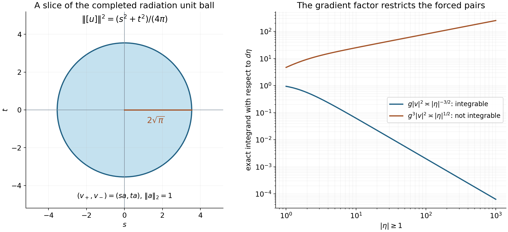

# Global radiation and flux

*Written by GPT-6.1 Sol (OpenAI) and GPT-6 Astra (OpenAI). Self-checked by the writing AI. Original exposition: CC0.*

**Working question: How much of a forced solution is measured by its far-field amplitudes?** Adding a homogeneous shell wave changes the incoming and outgoing amplitudes without changing the forcing. Passing to the quotient by vanishing tails records exactly the persistent part. The flux pairing then relates the two amplitudes, while a stronger hypothesis is needed to identify which quotient classes admit a forcing representative.

At a regular energy, every homogeneous endpoint wave is an inverse Fourier transform of a square-integrable surface amplitude. A forced solution differs from either resolvent boundary value by such a wave. This gives a precise radiation condition and an exact flux identity, including the constants and the sign of the upper boundary.

Use the hypotheses and operators from [Global polynomial resolvent estimates](global-polynomial-resolvent-estimates.md): \(p\) is a nonzero real simply characteristic polynomial, allowing invariant directions; \(\lambda\notin Z(p)\); \(R_\pm(\lambda)\) mean the two boundary values of \((p(D)-z)^{-1}\). Our Fourier transform is unitary, and \((u,f)=\int u\overline f\) is linear in \(u\). Write

\[
 M_\lambda=\{\xi:p(\xi)=\lambda\},\quad
 g(\xi)=|\nabla p(\xi)|,\quad
 \nu(\xi)=\nabla p(\xi)/g(\xi).
\]

On compact regular energy sets, the threshold lemma gives

\[
 g\geq c\widetilde p>0\quad\hbox{on }M_\lambda,\qquad
 |Q|/g\leq C\kappa_p(Q).
\tag{1}
\]

The dependencies used below are the compact surface mass theorem in [Fourier traces on curved energy surfaces](fourier-traces-on-curved-energy-surfaces.md), the compact frequency-coordinate bounds in [Mild weights and frequency localization](mild-weights-and-frequency-localization.md), and the local radiation formulas in [Division and radiation at regular energies](division-and-radiation-at-regular-energies.md). We use the shell norms, duality and vanishing-tail subspace from [Endpoint spaces and flat energy shells](endpoint-spaces-and-flat-energy-shells.md).

The polynomial shell may be unbounded. Fourier coordinates first identify every homogeneous wave with a surface amplitude; the local mass formulas then determine its global radiation and flux. Agmon's lectures [AT], Section 4, discuss radiation conditions for elliptic principal parts with long-range perturbations.

If \(p=c\ne0\) is constant, then \(Z(p)=\{c\}\), so \(\lambda\ne c\) and the shell is empty. Every weaker polynomial is constant: its modulus is bounded by a multiple of \(\widetilde p=|c|\), and any nonconstant polynomial is unbounded on a line on which its leading homogeneous part is nonzero. The boundary solutions are \(R_\pm f=(c-\lambda)^{-1}f\in B\subset B^*_0\), and the homogeneous equation has only the zero solution. Thus all surface amplitudes and radiation limits vanish, the flux pairing is real, and the forced quotient space below is zero. This proves every conclusion in the constant case. In the remaining proof \(p\) is nonconstant, as in the preceding resolvent theorem.

## 1. Every homogeneous wave has an \(L^2\) amplitude

For a compactly supported amplitude \(v\) on \(M_\lambda\), define

\[
 Ev(x)=(2\pi)^{-n/2}\int_{M_\lambda}e^{ix\cdot\xi}v(\xi)\,dS(\xi).
\]

**Lemma 1.1.** If \(u\in B^*\) and \((p(D)-\lambda)u=0\), then
\(\widehat u=v\,dS\) for a unique \(v\in L^2(M_\lambda,dS)\), with

\[
 \|v\|_2\leq C\|u\|_{B^*}.
\tag{2}
\]

**Proof.** Put \(U=\widehat u\). The equation \((p-\lambda)U=0\) first implies \(\operatorname{supp}U\subset M_\lambda\): away from that level, divide a test function by the smooth nonzero factor.

Near a compact part of the level, rotate coordinates so that \(\partial_1p>0\), and use the inverse energy coordinates

\[
 \psi(\tau,\eta)=(\Sigma(\lambda+\tau,\eta),\eta).
\]

Choose \(\chi\in C_c^\infty\) supported inside this coordinate patch and equal to one on a smaller patch, and put \(U_\chi=\chi U\). Fourier pullback by this diffeomorphism, with compact cutoffs, corresponds to a bounded operator on \(B^*\), by the coordinate theorem. Choose the output cutoff equal to one near \(\psi^{-1}(\operatorname{supp}U_\chi)\). Thus \(W=\psi^*U_\chi\), extended by zero outside the coordinate domain, has inverse Fourier transform in \(B^*\) and satisfies \(\tau W=0\).

Here is the elementary normal-variable assertion. Choose \(\theta\in C_c^\infty(\mathbb R)\) with \(\theta(0)=1\). Every compact test function can be written as

\[
 \phi(\tau,\eta)=\theta(\tau)\phi(0,\eta)+\tau h(\tau,\eta).
\]

The quotient defining \(h\) is smooth at zero by the integral divided-difference formula and has compact support, since its numerator does. Define \(a(b)=W(\theta\otimes b)\) for tangential test functions \(b\). Since \(\tau W=0\), the displayed identity gives \(W(\phi)=a(\phi(0,\cdot))\). Thus \(W=\delta_0(\tau)a(\eta)\).

The inverse Fourier transform of \(W\) is
\((2\pi)^{-1/2}\mathcal F_\eta^{-1}a(y)\), independent of the first physical coordinate. The flat homogeneous-wave classification in the endpoint lesson proves that a \(B^*\) function of this form has an \(L^2_y\) profile. For completeness, local \(L^2\) gives a locally \(L^2\) profile; the \(B^*\) ball bound on cylinders \(|y|<L,\ |t|<R/2\), with \(R\) large compared with \(L\), bounds its \(L^2\) norm on every tangential ball by the same constant. Let \(L\to\infty\) and apply tangential Plancherel. Hence \(a\in L^2_\eta\).

Transforming back gives \(U_\chi=a(\eta)\delta(p-\lambda)\). On the smaller patch where \(\chi=1\), this is the original distribution \(U\). More explicitly, for a test function \(\phi\) supported in that smaller patch, scalar distribution pullback and \(\det D\psi=(\partial_1p)^{-1}\) give

\[
 U(\phi)=\int a(\eta)\,
     \frac{\phi(\Sigma(\lambda,\eta),\eta)}
          {\partial_1p(\Sigma(\lambda,\eta),\eta)}\,d\eta.
\]

Thus \(\delta(p-\lambda)=dS/g\), and the surface density is \(a/g\). On the compact patch the positive \(\partial_1p\), \(g\) and their reciprocals are bounded; the graph Jacobian is \(dS=g(\partial_1p)^{-1}d\eta\). These bounds prove that the surface density is locally \(L^2(dS)\). The local densities agree on overlaps because they represent the same distribution; call the resulting density \(v\).

Choose a smooth frequency cutoff \(\chi_R(\xi)=\chi(\xi/R)\), \(R\geq1\), where \(\chi=1\) on the unit ball and has compact support. Its derivatives through any fixed order are uniformly bounded, so \(\chi_R(D)\) has a uniformly bounded \(B^*\) norm. Now \(\chi_R(D)u=E(\chi_Rv)\), with a compactly supported \(L^2\) amplitude. The universal lower extension bound from the compact surface mass theorem gives

\[
 \|\chi_Rv\|_2
       \leq2\sqrt\pi\,\|\chi_R(D)u\|_{B^*}
       \leq C\|u\|_{B^*}.
\]

As \(\chi_R=1\) on successively larger balls, this bounds the full surface \(L^2\) norm and proves (2). Uniqueness follows from uniqueness of the density of a measure on each compact surface patch. \(\square\)

## 2. The global trace and the converse extension

**Theorem 2.1.** Fourier restriction extends to a bounded map

\[
 T_\lambda:B\longrightarrow L^2(M_\lambda,dS).
\tag{3}
\]

Its integral adjoint is a bounded map \(E:L^2(M_\lambda,dS)\to B^*\). Every such \(Ev\) solves the homogeneous equation, and these are all its \(B^*\) solutions. Uniformly on compact regular energy sets,

\[
 C^{-1}\|v\|_2\leq\|Ev\|_{B^*}\leq C\|v\|_2.
\tag{4}
\]

The boundary jump is

\[
 R_+(\lambda)f-R_-(\lambda)f
        =2\pi i\,E\left(T_\lambda f/g\right).
\tag{5}
\]

**Proof.** First take \(f\) with smooth compact Fourier support. The localized jump formula gives, for \(Q=\partial_jp\),

\[
 Q(D)(R_+-R_-)f
        =2\pi i\,E\left(\frac{\partial_jp}{g}T_\lambda f\right).
\]

This is a homogeneous \(B^*\) solution. The global resolvent estimate bounds its \(B^*\) norm by \(C\|f\|_B\), because each \(\partial_jp\) is weaker than \(p\). Apply Lemma 1.1 and sum the squared amplitude bounds over \(j\). Since \(\sum_j|\partial_jp|^2/g^2=1\),

\[
 \|T_\lambda f\|_2^2
   =\sum_j\left\|\frac{\partial_jp}{g}T_\lambda f\right\|_2^2
   \leq C\|f\|_B^2.
\]

Density defines (3), agreeing with every compact trace. Integral duality defines \(Ev\in B^*\) with

\[
 (Ev,f)=(v,T_\lambda f)_{L^2(dS)}.
\tag{6}
\]

For compactly supported amplitudes this is the previously defined extension, by Fubini and density. Testing locally in frequency shows that its Fourier transform is \(v\,dS\); the dual construction proves that this measure represents a tempered distribution even on the unbounded surface. The equation follows from its support. Lemma 1.1 gives the lower bound and classifies all homogeneous waves. All constants are uniform on compact regular energy sets.

Finally \(1/g\) is uniformly bounded there, by (1) and the positive lower bound for \(\widetilde p\). Approximate arbitrary \(f\in B\) by compact-frequency test functions in the local jump identity. The resolvent, trace and extension bounds let both sides converge in \(B^*\), proving (5). \(\square\)

The radiation proof first needs only boundedness and compact trace surjectivity. Its global mass formula will then imply surjectivity on the entire shell, with an explicit lifting bound.

## 3. Radiation observed along normal rays

For \(\Phi\in C_c(\mathbb R^n)\), put

\[
 A_\pm(\xi)=\int_{\{\pm t>0\}}\Phi(t\nu(\xi))\,dt,\qquad
 A(\xi)=\int_{\mathbb R}\Phi(t\nu(\xi))\,dt.
\]

These integrals are bounded uniformly in \(\xi\). If \(Q_j\) is weaker than \(p\) and \(f_j\in B\), write
\(a_j=Q_jT_\lambda f_j/g\). By (1) and (3), \(a_j\in L^2(dS)\).

**Theorem 3.1.** Let \(u=Ev\), \(v\in L^2(dS)\). Then

\[
 \lim_{R\to\infty}\frac1R\int
       Q_1(D)R_\pm f_1\,
       \overline{Q_2(D)R_\pm f_2}\,\Phi(x/R)\,dx
       =2\pi\int_{M_\lambda}a_1\overline{a_2}A_\pm\,dS,
\tag{7}
\]

\[
 \lim_{R\to\infty}\frac1R\int
       Q_1(D)R_+ f_1\,
       \overline{Q_2(D)R_- f_2}\,\Phi(x/R)\,dx=0,
\tag{8}
\]

\[
 \lim_{R\to\infty}\frac1R\int
       Q(D)R_\pm f\,\overline u\,\Phi(x/R)\,dx
       =\pm i\int_{M_\lambda}(QT_\lambda f/g)\overline v A_\pm\,dS,
\tag{9}
\]

and

\[
 \lim_{R\to\infty}\frac1R\int|u|^2\Phi(x/R)\,dx
       =\frac1{2\pi}\int_{M_\lambda}|v|^2 A\,dS.
\tag{10}
\]

In particular,

\[
 \lim_{R\to\infty}\frac1R\int_{|x|<R}|Q(D)R_\pm f|^2\,dx
       =2\pi\int_{M_\lambda}|QT_\lambda f/g|^2\,dS,
\tag{11}
\]

\[
 \lim_{R\to\infty}\frac1R\int_{|x|<R}|Ev|^2\,dx
       =\pi^{-1}\|v\|_2^2.
\tag{12}
\]

**Proof.** For smooth compact-frequency forcing, (7) and (8) are the polarized local radiation formulas, with finitely many patches covering the Fourier support. Apply those formulas to \(Q_j(D)f_j\), which are still smooth compact-frequency Schwartz functions. Polynomial multiplication commutes with the resolvent distributions, so these are exactly the waves on the left of (7) and (8). Their normal-ray version follows by \(t=sg\) from the gradient-ray version: \(g^{-1}ds\) becomes \(g^{-2}dt\). Polarization permits different forcing terms and complex polynomial \(Q_j\); complex conjugation stays on the second amplitude. It also gives the mixed-sign formula with different inputs. Split a complex observation \(\Phi\) into real and imaginary parts and use linearity in the observation. The local proof treats overlapping patches in a common graph chart and disjoint supports by its vanishing off-diagonal term. For general \(B\) forcing the extension below uses the bound for \(Q_j(D)R_\pm\); boundedness of \(Q_j(D)\) on \(B\) is not needed.

To obtain (9) first for a compact amplitude \(v\), choose a smooth compact cutoff \(\chi\) equal to one near its support. Let \(K\) contain the entire intersection of the shell with \(\operatorname{supp}\chi\), within a slightly larger compact regular surface set. Compact trace surjectivity supplies \(h_0\in B\) with trace \(gv/(2\pi i)\) on the amplitude support and zero on the rest of \(K\). Set \(h=\chi(D)h_0\). Then its global trace is exactly \(gv/(2\pi i)\), extended by zero, so (5) gives \(Ev=(R_+-R_-)h\).

Substituting this into the left side of (9), (7) retains the matching sign and (8) removes the opposite sign. For the upper boundary the coefficient is
\(2\pi\,\overline{1/(2\pi i)}=i\); for the lower boundary the subtraction gives \(-i\). This proves (9) for compact amplitudes. Formula (10) for compact \(v\) is the compact surface mass theorem.

Here is the uniform limiting argument for all inputs. If \(\Phi\) is supported in a ball of radius \(L\), with \(L\geq1\), the endpoint ball bound gives

\[
 \left|\frac1R\int w_1\overline{w_2}\Phi(x/R)\,dx\right|
       \leq4L\|\Phi\|_\infty\|w_1\|_{B^*}\|w_2\|_{B^*},
       \qquad R\geq1.
\tag{13}
\]

The global resolvent and extension bounds make all left sides uniformly continuous in the relevant \(B\) forcing and \(L^2\) amplitude norms. On the right, Cauchy–Schwarz, bounded \(A_\pm,A\), (1) and (3) give the same continuity. Approximate the forcing in \(B\) by compact-frequency test functions and the amplitude in \(L^2(dS)\) by compactly supported amplitudes. First (7) and (8) pass to arbitrary forcing, making their use with the constructed \(h\) legitimate; then (9) and (10) pass to arbitrary amplitudes.

For the ball formulas, sandwich its indicator between smooth radial functions supported in balls of radii \(1-\delta\) and \(1+\delta\), as in the compact surface proof. Each half-normal line has intersection length \(1\) with the unit ball, and the whole line has length \(2\). The nonnegative diagonal formulas and \(\delta\downarrow0\) yield (11) and (12). \(\square\)

Thus the upper boundary radiates along positive gradient rays; the lower boundary radiates along negative gradient rays. A homogeneous wave carries equal line-observation mass in the two directions.

**Corollary 3.2 (the global trace is onto).** For every \(v\in L^2(M_\lambda,dS)\),

\[
 \operatorname{dist}_{B^*}(Ev,B^*_0)=(2\pi)^{-1/2}\|v\|_2.
\]

For every \(h\in L^2(M_\lambda,dS)\) and \(\varepsilon>0\) there is \(f\in B\) with

\[
 T_\lambda f=h,\qquad
 \|f\|_B\le(\sqrt{2\pi}+\varepsilon)\|h\|_2.
\]

The conclusion applies to an unbounded shell. It asserts existence of a preimage, without asserting a linear right inverse or attainment of the limiting constant.

**Proof.** Equation (12) gives the limiting ball mass \(L=\pi^{-1}\|v\|_2^2\). The exact dyadic distance formula, Proposition 2.4 of the endpoint lesson, gives distance squared \(L/2\). In particular the adjoint \(E\) of \(T_\lambda\) has norm at least \(c\|v\|_2\), where \(c=(2\pi)^{-1/2}\).

Here is the full onto argument. Let \(C\) be the closure in the surface Hilbert space of the image of the closed unit ball of \(B\). This is convex and balanced; its real support function in direction \(v\) is \(\|Ev\|_{B^*}\), by (6) and the exact duality of \(B,B^*\). It is at least \(c\|v\|_2\). If a vector \(h\) of norm at most \(c\) lay outside \(C\), the Hilbert closest-point argument proved in [Endpoint spaces, Section 1](endpoint-spaces-and-flat-energy-shells.md#1-measuring-one-shell-at-a-time) would give a nonzero \(v\) with
\[
 \sup_{w\in C}\operatorname{Re}(w,v)
 <\operatorname{Re}(h,v)\le c\|v\|_2,
\]
contradicting the support-function bound. Hence \(C\) contains that Hilbert ball. By scaling, each target \(r\) is approximable arbitrarily well by \(Tf\) with \(\|f\|_B\le\|r\|_2/c\).

Choose \(0<\theta<1\) so that \([c(1-\theta)]^{-1}\le c^{-1}+\varepsilon\). Starting with residual \(r_1=h\), choose successive \(f_j\) with \(\|f_j\|_B\le\|r_j\|_2/c\) and \(\|r_j-Tf_j\|_2\le\theta\|r_j\|_2\), and put \(r_{j+1}=r_j-Tf_j\). A zero residual terminates the construction. The series converges in \(B\), since

\[
 \sum_j\|f_j\|_B\le\frac{\|h\|_2}{c(1-\theta)}
                   \le(\sqrt{2\pi}+\varepsilon)\|h\|_2.
\]

Boundedness of \(T\) and \(r_j\to0\) give \(T(\sum_jf_j)=h\). If the shell is empty its Hilbert space is zero and \(f=0\) suffices. \(\square\)

## 4. Recognizing the solution with vanishing mass

Call a \(B^*\) solution of \((p(D)-\lambda)u=f\in B\) outgoing when \(u=R_+f\), and incoming when \(u=R_-f\).

**Theorem 4.1.** For such a solution, the following are equivalent:

1. \(u\) is both outgoing and incoming.
2. \(u\in B^*_0\).
3. \(Q(D)u\in B^*_0\) for every polynomial weaker than \(p\).

These conditions force \(T_\lambda f=0\). Conversely zero trace gives a unique solution in \(B^*_0\), namely the common boundary solution.

**Proof.** If the two boundary solutions coincide, (5) and injectivity of \(E\) give \(T_\lambda f=0\). Formula (11) then gives zero ball mass for every weaker derivative of that solution; the endpoint vanishing-mass criterion proves 3. Since \(1\) is weaker than \(p\), condition 3 implies 2.

We next show that 3 forces zero trace without imposing regularity on the Fourier forcing. Choose \(\psi\in C_c^\infty\), equal to one on the unit ball and zero outside the ball of radius two, and let \(u_R=\psi(x/R)u\). The exact polynomial Leibniz formula is

\[
 (p(D)-\lambda)u_R
   =\psi(x/R)f+
      \sum_{\alpha\ne0}\frac{R^{-|\alpha|}}{\alpha!}
          (D^\alpha\psi)(x/R)(\partial^\alpha p)(D)u.
\tag{14}
\]

For a monomial \(p(\xi)=\xi^\beta\), (14) is the repeated product rule: for \(\alpha\leq\beta\), the coefficient of \((D^\alpha\psi_R)D^{\beta-\alpha}u\) is \(\binom\beta\alpha\), and \((\partial^\alpha\xi^\beta)/\alpha!=\binom\beta\alpha\xi^{\beta-\alpha}\). Summing monomials gives (14); the distributional product rule follows from its definition against compact smooth tests. Every derivative of \(p\) is weaker. If \(w\in B^*_0\), the \(B\) norm of
\(R^{-k}b(x/R)w\), with \(k\geq1\) and \(b\) supported in \(1\leq|x|\leq2\), tends to zero. Indeed at most a fixed number of dyadic shells meet that annulus. On each, \(\|w\|_2\leq\varepsilon_R C R^{1/2}\), with \(\varepsilon_R\to0\); multiplying by the \(B\) shell weight and \(R^{-k}\) gives \(C\varepsilon_R R^{1-k}\leq C\varepsilon_R\). Thus the sum in (14) tends to zero in \(B\), and \(\psi(x/R)f\to f\) in \(B\).

Both \(u_R\) and the right side of (14) are compactly supported \(L^2\) functions, hence \(L^1\). Their Fourier transforms are continuous, and the distributional polynomial identity is therefore a pointwise identity of continuous functions. On the shell the Fourier transform of the right side is zero. To identify this ordinary restriction with the \(B\) trace, approximate a compactly supported \(L^2\) function by smooth functions on a common compact physical support. The approximation converges both in \(B\), by the finitely many shell norms, and in \(L^1\), by Cauchy–Schwarz. Its Fourier transforms converge uniformly; the trace convergence in \(L^2\) on each compact surface patch follows from (3). Hence the limiting trace agrees there with the continuous restriction. Applying this to the right side of (14), then using its \(B\) convergence to \(f\), gives \(T_\lambda f=0\).

If only 2 is known, first apply any smooth compact Fourier cutoff \(\chi(D)\). Then \(u_\chi=\chi(D)u\) solves the equation with \(f_\chi=\chi(D)f\in B\). For every weaker \(Q\), the bounded smooth multiplier \(Q\chi\) preserves \(B^*_0\), so \(u_\chi\) satisfies 3. The preceding argument gives \(T_\lambda f_\chi=\chi T_\lambda f=0\). Taking cutoffs equal to one on successively larger frequency balls proves zero trace globally.

With zero trace, (11) gives \(R_+f=R_-f\in B^*_0\). The difference \(u-R_+f\) is a homogeneous \(B^*_0\) wave. Lemma 1.1 and (12) force its amplitude to be zero. Hence \(u\) is the common boundary solution. This proves 2 implies 1 and proves uniqueness. \(\square\)

The global weighted division theorem gives additional decay for this solution when the forcing has the required weighted \(B\) norm. Membership of \(B^*_0\) alone is the vanishing-mass condition, not a claim of arbitrary polynomial decay.

## 5. The flux identity and the amplitude labels

**Theorem 5.1.** Every \(u\in B^*\) with \((p(D)-\lambda)u=f\in B\) has unique decompositions

\[
 u=R_-f+Ev_+=R_+f+Ev_-,
 \qquad v_\pm\in L^2(M_\lambda,dS).
\tag{15}
\]

The labels are attached to the homogeneous term added to the *opposite* boundary solution. They satisfy

\[
 v_+-v_-=2\pi i\,T_\lambda f/g,
\tag{16}
\]

and

\[
 \int_{M_\lambda}g\big(|v_+|^2-|v_-|^2\big)\,dS
           =4\pi\,\operatorname{Im}(u,f).
\tag{17}
\]

The integrand in (17) is absolutely integrable. The two nonnegative weighted integrals separately need not be finite.

Moreover \((\partial^\alpha p)(D)u\in B^*\) for every \(\alpha\) if and only if
\(\widetilde p\,v_+\in L^2(dS)\); equivalently the condition can be imposed on \(v_-\).

**Proof.** Subtract either boundary solution from \(u\); its equation is homogeneous. Theorem 2.1 gives (15) and uniqueness. Equation (5) gives (16).

Put \(Cf=(R_+f+R_-f)/2\) and write \(u=Cf+Ev_0\). For nonreal conjugate points the Hilbert resolvents are adjoints. Passing to the weak-star boundaries against the fixed \(f\in B\subset L^2\) gives

\[
 (R_-f,f)=\overline{(R_+f,f)},\qquad
 \operatorname{Im}(Cf,f)=0.
\]

Thus (6) yields \(\operatorname{Im}(u,f)=\operatorname{Im}(v_0,T_\lambda f)\). Formula (5) also gives

\[
 v_\pm=v_0\pm\pi i\,T_\lambda f/g.
\]

Expanding the two squares gives the pointwise identity

\[
 g(|v_+|^2-|v_-|^2)
       =4\pi\,\operatorname{Im}
                       \big(v_0\overline{T_\lambda f}\big).
\]

The right side belongs to \(L^1(dS)\) by Cauchy–Schwarz, proving convergence and (17). This argument makes no subtraction of two infinite integrals.

For the last assertion use either decomposition in (15). Every \(\partial^\alpha p\) is weaker, so its derivative of the resolvent term belongs to \(B^*\). The corresponding derivative of \(Ev_\pm\) has Fourier density \((\partial^\alpha p)v_\pm\). The homogeneous classification says it belongs to \(B^*\) exactly when that density is \(L^2\). Summing the finitely many squared density norms gives precisely \(\|\widetilde p\,v_\pm\|_2^2\). Finally (1), (16) and the trace bound show

\[
 \widetilde p\,(v_+-v_-)
       =2\pi i\,(\widetilde p/g)T_\lambda f\in L^2.
\]

Hence the two weighted-amplitude conditions are equivalent. \(\square\)

**Corollary 5.2.** If \((u,f)\) is real, then \(u\) is outgoing if and only if it is incoming.

**Proof.** By (15), outgoing means \(v_-=0\), and incoming means \(v_+=0\). If either vanishes, (17) with zero right side forces the other to vanish, since \(g>0\). \(\square\)

**Corollary 5.3.** For \(u=R_\pm f\),

\[
 \pm2\,\operatorname{Im}(u,f)
       =2\pi\int_{M_\lambda}|T_\lambda f|^2/g\,dS.
\tag{18}
\]

**Proof.** For the upper solution \(v_-=0\) and \(v_+=2\pi iT_\lambda f/g\); substitute in (17). For the lower solution the labels reverse and the sign is negative. The integral is finite because \(1/g\) is bounded and the trace is \(L^2\). \(\square\)

**Corollary 5.4 (the exact norm of the two amplitudes).** For every forced solution and the unchanged amplitude labels in (15),

\[
 \lim_{R\to\infty}\frac1R\int_{|x|<R}|u|^2\,dx
       =\frac{\|v_+\|_2^2+\|v_-\|_2^2}{2\pi},\qquad
 \operatorname{dist}_{B^*}(u,B^*_0)^2
       =\frac{\|v_+\|_2^2+\|v_-\|_2^2}{4\pi}.
\]

**Proof.** Put \(t=T_\lambda f/g\), \(v_0=(v_++v_-)/2\). Equation (16) gives \(u=Cf+Ev_0\) and \(v_\pm=v_0\pm\pi i t\). The function \(t\) is \(L^2\), since \(1/g\) is bounded. For a nonnegative continuous radial compact observation \(\Phi\), let \(b=\int_0^\infty\Phi(s\nu)\,ds\), independent of the unit normal. Equations (7), (8) and (10) give

\[
 \lim_{R\to\infty}\frac1R\int|Cf|^2\Phi(x/R)\,dx
       =\pi b\|t\|_2^2,\qquad
 \lim_{R\to\infty}\frac1R\int|Ev_0|^2\Phi(x/R)\,dx
       =b\pi^{-1}\|v_0\|_2^2.
\]

The two mixed limits in (9) are opposite, so their average, the mixed term between \(Cf\) and \(Ev_0\), is zero. Bound (13) justifies every limit for the original forcing and amplitudes. Sandwich the ball indicator between radial observations whose half-ray integrals tend to one. Nonnegativity yields the ball limit \(\pi\|t\|_2^2+\pi^{-1}\|v_0\|_2^2\). Expanding the two amplitude squares shows that this is \((\|v_+\|_2^2+\|v_-\|_2^2)/(2\pi)\). Proposition 2.4 of the endpoint lesson divides this limiting mass by two for the squared quotient norm. \(\square\)

For a homogeneous wave the labels are both \(v\), recovering Corollary 3.2. For \(R_+f\), the minus label is zero, and the distance squared is \(\pi\|Tf/g\|_2^2\). The exact norm makes the vanishing-mass criterion quantitative.

**Theorem 5.5 (the forced classes and their Hilbert completion).** Let \(\mathcal Q=B^*/B^*_0\), and let \(\mathcal S_\lambda\) consist of classes represented by \(u\in B^*\) with \((p(D)-\lambda)u\in B\). The amplitude map is a linear bijection from \(\mathcal S_\lambda\) onto

\[
 \mathcal D_g=\{(v_+,v_-)\in L^2(M_\lambda,dS)\oplus L^2(M_\lambda,dS):
                       g(v_+-v_-)\in L^2(M_\lambda,dS)\}.
\]

Its inverse has squared norm \((\|v_+\|_2^2+\|v_-\|_2^2)/(4\pi)\). It extends uniquely to the entire Hilbert direct sum, with the same norm, as a map onto the closed subspace \(\overline{\mathcal S_\lambda}\) of \(\mathcal Q\). Exactly the pairs in \(\mathcal D_g\) have a representative with \(B\) forcing.

**Proof.** Two forced representatives of one class differ by \(w\in B^*_0\) with \((p(D)-\lambda)w\in B\). Theorem 4.1 makes \(w\) the common boundary solution, so both its amplitudes are zero. Thus the map is well defined; (15) gives linearity and Corollary 5.4 gives injectivity and its exact norm. Equation (16) proves necessity of the integrability condition.

Conversely, for a pair in \(\mathcal D_g\), Corollary 3.2 supplies \(f\in B\) with \(Tf=g(v_+-v_-)/(2\pi i)\). Set \(u=R_-f+Ev_+\); the jump formula gives its other amplitude \(v_-\). A different forcing with that trace has zero-trace difference, whose boundary solution is in \(B^*_0\), so it gives the same class. This proves surjectivity.

Pairs supported in compact surface subsets lie in \(\mathcal D_g\), since \(g\) is bounded there. They are dense in the full direct sum, by truncation of \(L^2\) amplitudes. The exact norm and completeness of the Banach quotient extend the inverse uniquely to all pairs. The quotient completeness proof is the summable-lift argument in [Compact Fredholm operators, Elementary finite-dimensional tools](../providers/analysis/compact-fredholm-families.md#elementary-finite-dimensional-tools); here \(B^*_0\) is closed by the endpoint lesson. Its image is closed: a Cauchy sequence of classes has Cauchy amplitudes, whose Hilbert limit maps to its quotient limit. Its image is precisely the closure of \(\mathcal S_\lambda\). Necessity already proved characterizes which completed classes have \(B\) forcing. This proves a Hilbert structure on that closed subspace; it does not assert one on the entire quotient. \(\square\)

For example, on the parabola of Exercise 6.5, let \(v(\eta)=(1+\eta^2)^{-5/8}\). Then \(v\in L^2(dS)\), but \(gv\notin L^2(dS)\): the latter squared integrand is \((1+4\eta^2)^{3/2}(1+\eta^2)^{-5/4}\), comparable to \(|\eta|^{1/2}\). Thus \((v,v)\) is a forced pair (with zero forcing), while \((v,0)\) is a completed pair with no \(B\)-forced representative.

*Figure 1. For unit amplitude \(a\), the real coordinates \((v_+,v_-)=(sa,ta)\) have quotient norm squared \((s^2+t^2)/(4\pi)\), so the unit disk has radius \(2\sqrt\pi\). This depicts a two-dimensional slice of the completion. On the parabola \(\xi=(\eta^2,\eta)\), the plotted exact squared-norm integrands for \(v=(1+\eta^2)^{-5/8}\) are \(g|v|^2\) and \(g^3|v|^2\). The former is integrable, the latter is not. Consequently \((v,0)\) lies in the completion and \((v,v)\) is a forced pair. Corollary 5.4 and Theorem 5.5 give the proof and the retained gradient factor. [Vector figure](../figures/global-amplitude-norms.svg); reproducible plotting source accompanies the editable package.*

All arguments in this lesson retain the invariant directions allowed by the preceding global free-resolvent estimate. The local coordinate maps, global cutoff exhaustion and identity \(\sum_j|\partial_jp|^2/g^2=1\) impose no extra condition on \(\Lambda(p)\). Later compact-potential results retain their own hypotheses, as Example 4.3 in that preceding lesson explains.

### Use the conclusion

Use the exact two-amplitude norm and the forced-class completion together. State the gradient integrability condition in the representative theorem; the completion must not be mistaken for an assertion that every class has such a representative.

## 6. Exercises

**Exercise 6.1 (foundation).** On the line take \(p(\xi)=\xi^2\), \(\lambda=k^2>0\). Write \(Ev\), (12), (16) and (18) using the two scalar amplitudes at \(\xi=\pm k\). Identify the directions of the two upper outgoing waves.

**Exercise 6.2 (foundation).** With a pairing linear in its first argument, verify
\(|b+ic|^2-|b-ic|^2=4\operatorname{Im}(b\overline c)\). Use it to check the sign and constant in (17). Explain which label vanishes for \(R_+f\).

**Exercise 6.3 (intermediate).** Prove the annular estimate used after (14) when \(w\in B^*_0\). Then show why the same calculation for a general \(w\in B^*\) gives a bounded error for \(k=1\), rather than necessarily an error tending to zero.

**Exercise 6.4 (intermediate).** Let \(f=(p(D)-\lambda)h\), where \(h\) is Schwartz with smooth compact Fourier support. Find \(v_+,v_-\) for the solution \(u=h\), determine its flux, and explain why it is both incoming and outgoing.

**Exercise 6.5 (advanced).** For \(p(\xi_1,\xi_2)=\xi_1-\xi_2^2\), \(\lambda=0\), parameterize the shell by \((\eta^2,\eta)\) and take
\[
 v(\eta)=(1+\eta^2)^{-5/8},\qquad u=Ev,\qquad f=0.
\]
Check that \(v\in L^2(dS)\) while \(\int g|v|^2dS=\infty\). Apply Theorem 5.1 and explain why its flux integral is still absolutely convergent.

## 7. Complete solutions

**Solution 6.1.** Write \(v_\sigma=v(\sigma k)\), \(\sigma=\pm1\). Surface measure in dimension one is counting measure, and \(g=2k\) at both points. Therefore

\[
 Ev(x)=(2\pi)^{-1/2}(v_1e^{ikx}+v_{-1}e^{-ikx}),
 \quad
 \lim_{R\to\infty}R^{-1}\int_{-R}^R|Ev|^2
       =\pi^{-1}(|v_1|^2+|v_{-1}|^2).
\]

For each point, the difference of the two decomposition amplitudes is
\(2\pi i\,\widehat f(\sigma k)/(2k)\). For the upper boundary, (18) becomes

\[
 2\operatorname{Im}(R_+f,f)
       =\frac{\pi}{k}
          \big(|\widehat f(k)|^2+|\widehat f(-k)|^2\big).
\]

The gradient is \(2k\) at \(k\) and \(-2k\) at \(-k\). Thus the \(k\) upper component travels to positive \(x\), and the \(-k\) upper component to negative \(x\). Outgoing refers to the gradient direction, not to a fixed sign of the frequency.

**Solution 6.2.** The cross term in \(|b+ic|^2\) is
\(2\operatorname{Re}(-ib\overline c)=2\operatorname{Im}(b\overline c)\); the other square has its negative. Their difference is the displayed value. Take \(b=v_0\) and \(c=\pi T_\lambda f/g\), and multiply by \(g\). This gives \(4\pi\operatorname{Im}(v_0\overline{T_\lambda f})\), whose integral is \(4\pi\operatorname{Im}(u,f)\). For \(u=R_+f\), the decomposition with that same boundary has no homogeneous addition, so \(v_-=0\). The opposite-boundary addition has label \(v_+\).

**Solution 6.3.** Choose \(j_R\) with \(2^{j_R-1}<R\leq2^{j_R}\). The annulus \(R\leq|x|\leq2R\) meets at most three shells of comparable radius. Put
\(\varepsilon_R=\sup_{j\geq j_R-1}2^{-j/2}\|w\|_{L^2(A_j)}\); it tends to zero for \(B^*_0\). On each relevant shell the product's \(B\) contribution is at most
\[
 C\,R^{1/2}R^{-k}\varepsilon_R R^{1/2}
       =C\varepsilon_R R^{1-k}.
\]
Summing the fixed number proves convergence to zero for \(k\geq1\). For a general \(B^*\) function, replace \(\varepsilon_R\) by its fixed norm; at \(k=1\) the remaining power is \(R^0\). The estimate is only bounded, so it cannot justify the trace limit without the vanishing-tail hypothesis.

**Solution 6.4.** The shell trace of \(f\) is zero because its Fourier transform is \((p-\lambda)\widehat h\). Boundary multiplication cancels this factor, giving \(R_+f=R_-f=h\). Both homogeneous additions in (15) are zero, hence \(v_+=v_-=0\) and the flux is zero. Alternatively the real polynomial multiplier is symmetric on this Schwartz \(h\), so \((h,(p(D)-\lambda)h)\) is real. The solution is in \(L^2\subset B^*_0\) and is both boundary solutions.

**Solution 6.5.** On this graph,
\[
 g=\sqrt{1+4\eta^2},\qquad dS=g\,d\eta,\qquad
 |v|^2=(1+\eta^2)^{-5/4}.
\]
For large \(|\eta|\), the \(L^2(dS)\) integrand is comparable to
\(|\eta|^{-5/2}|\eta|=|\eta|^{-3/2}\), which is integrable. The weighted integrand \(g|v|^2dS\) is comparable to
\(|\eta|^{-5/2}|\eta|^2=|\eta|^{-1/2}\), which is not. Thus Theorem 2.1 gives \(u\in B^*\) and its homogeneous equation. With \(f=0\), both resolvent terms vanish, so \(v_+=v_-=v\). The integrand in (17) is the pointwise zero function and has absolute integral zero. Writing the left side as the difference of its two separate weighted integrals would instead give an undefined expression; Theorem 5.1 requires the integral of the difference.

## References

- [AT] Lectures of Shmuel Agmon, based on notes of Karl Gustafson, reworked by Michael Taylor, *Limiting Absorption Principle for Long Range Potentials*, lectures of 17–21 July 1978, undated reworked transcription, Section 4, pages 16–18. [Freely readable author-hosted PDF](https://mtaylor.web.unc.edu/wp-content/uploads/sites/16915/2020/08/AGMON.pdf).

- Dmitri Yafaev, *Lectures on scattering theory*, 2004. [arXiv:math/0403213](https://arxiv.org/abs/math/0403213).
- Gerald Teschl, *Mathematical Methods in Quantum Mechanics: With Applications to Schrödinger Operators*, second edition, American Mathematical Society, 2014. [Freely readable author's edition](https://www.mat.univie.ac.at/~gerald/ftp/book-schroe/schroe2.pdf).
