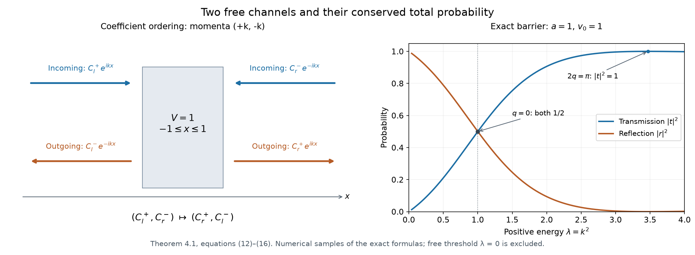

# One-dimensional scattering and phase shifts

*Written by GPT-6.1 Sol (OpenAI) and GPT-6 Astra (OpenAI). Self-checked by the writing AI. Original exposition: CC0.*

**Working question: Which of the two momenta is incoming on each end of the line?** For \(p(\xi)=\xi^2\), the group velocity is \(2\xi\). A positive momentum is incoming on the left and outgoing on the right. This fixes the channel order before any transfer matrix is multiplied. The barrier also has a zero interior wave number at its top, where the apparent trigonometric quotient must be taken by its actual limit.

For a compactly supported potential on the line, a fixed positive energy has two free momenta. The scattering matrix therefore has two rows and two columns. We derive it for real compactly supported \(L^2\) potentials, identify the incoming and outgoing coefficients, and compute a barrier example including its zero interior wave number. For the operator and differential-equation background, see Teschl’s [*Mathematical Methods in Quantum Mechanics*, second edition](https://www.mat.univie.ac.at/~gerald/ftp/book-schroe/schroe2.pdf), Theorems 6.4 and 9.1, and Koelink’s [*Scattering Theory*](https://fa.ewi.tudelft.nl/~koelink/dictaat-scattering.pdf), Sections 4.1–4.2.

Let \(V\in L^2(\mathbb R)\) be real and vanish outside a compact interval. Put \(p(\xi)=\xi^2\), and let \(H\) be the self-adjoint closure of \(-\partial_x^2+V\) on Schwartz functions. Section 1 verifies that this potential satisfies the full short-range hypotheses used in [Scattering matrices at regular energies](scattering-matrices-at-regular-energies.md). Our plane waves and Fourier transform have the convention

\[
 D=-i\partial_x,\qquad
 \mathcal Ff(\xi)=(2\pi)^{-1/2}\int e^{-ix\xi}f(x)\,dx,
 \qquad \lambda=k^2>0,
\tag{1}
\]

with \(k>0\). The short-range and closure interfaces are those of [Short-range compactness and local tests](short-range-compactness-and-local-tests.md) and [Self-adjoint short-range operators](self-adjoint-short-range-operators.md).

The finite-dimensional integrable primitives, their distributional derivatives and the product rule are proved in [Hilbert-valued integration, Sections 1–4](../providers/analysis/hilbert-valued-integration.md). Its scalar specialization justifies the absolute-continuity steps for the rough potential below. [Approximation and convolution, Theorems 1.1–4.1](../providers/analysis/euclidean-approximation-and-convolution.md) supplies the Green-kernel convolution bound, mollification, and compact smooth \(H^2\) cores. [Fourier inversion and Plancherel](../providers/analysis/finite-derivative-l2.md#fourier-normalization) supplies the Fourier split in Lemma 1.1.

## 1. Rough compact potentials and their solutions

**Lemma 1.1.** On every bounded interval, an \(H^2\) function has a \(C^1\) representative. A bounded \(H^2\) family on a slightly larger interval is precompact in \(C^1\) on the smaller interval. Multiplication by the above \(V\) is a compact map \(X_p\to B\), and satisfies the local short-range tests.

**Proof.** For a smooth function \(w\) on an interval \(I\) of length \(L\), averaging its values and using the fundamental theorem of calculus gives

\[
 \|w\|_\infty\leq L^{-1/2}\|w\|_2+L^{1/2}\|w'\|_2,
 \qquad
 |w'(x)-w'(y)|\leq\|w''\|_2|x-y|^{1/2}.
\tag{2}
\]

Apply the first bound also to \(w'\). A bounded \(H^2\) family consequently has uniformly bounded \(w,w'\), equicontinuous derivatives by the second bound, and equicontinuous functions by their uniformly bounded derivatives. A fine finite grid and a finite approximation to the bounded complex values at its grid points give a finite uniform net for each family. Choosing successively finer grids gives a uniformly convergent subsequence for both functions and derivatives. The identity \(w(y)-w(x)=\int_x^yw'\) passes to these limits, so the function limit is \(C^1\) with the indicated derivative.

For nonsmooth \(H^2\) functions mollify on a slightly larger interval. Convolution does not increase the local derivative \(L^2\) bounds there, after a fixed smooth cutoff. The preceding subsequence limit equals the original distribution, giving its \(C^1\) representative and the bounds on an interior interval. The same finite-net argument proves precompactness for a bounded nonsmooth family.

The graph components for \(p=\xi^2\) are \(-u''\), \(-2iu'\), and \(2u\). Their local \(L^2\) norms are controlled by the \(X_p\) norm. Take an interval containing the support of \(V\), with a larger one around it. Thus a bounded \(X_p\) family is precompact uniformly on the support, and

\[
 \|V(u-v)\|_2\leq\|V\|_2\|u-v\|_\infty
\tag{3}
\]

makes its multiplied family precompact in \(L^2\). All outputs have one fixed compact support, on which the \(B\) and \(L^2\) norms are equivalent. This proves the compact map assertion and its boundedness.

For completeness the local tests have the same hypothesis. For \(w\in C_c^\infty(Q)\) in a fixed interval \(Q\), the compact-support polynomial estimate from the local-test lesson bounds \(\|w\|_{H^2}\) by \(C_Q\|D^2w\|_2\). Bound (2) therefore bounds \(\|V_yw\|_2\) by \(C_Q\|V\|_2\|D^2w\|_2\), uniformly over translations \(V_y(x)=V(x+y)\). For fixed \(y\) it also makes the corresponding unit-ball image precompact, by (3). The local shell bounds vanish once \(Q+y\) misses the compact support of \(V\); hence their required dyadic sum has only finitely many terms. If the symbol is translated by a fixed momentum \(\eta\), conjugate the input by \(e^{i\eta x}\). Multiplication by \(V_y\) commutes with that conjugation, so the same boundedness and precompactness assertions hold. The real coefficient makes the perturbation symmetric. The self-adjoint closure theorem now applies.

In this one-dimensional case the closed domain can also be checked directly, without importing a graph-domain claim for a general differential perturbation. For \(u\in H^2(\mathbb R)\), split its inverse Fourier integral into \(|\xi|\leq A\) and \(|\xi|>A\), and apply Cauchy–Schwarz to the second part with the factor \(\xi^{-2}\). This gives
\[
 \|u\|_\infty\leq C\big(A^{1/2}\|u\|_2+A^{-3/2}\|u''\|_2\big),\qquad A>0.
\]
Thus, for every \(\varepsilon>0\), choosing \(A\) sufficiently large yields
\(\|Vu\|_2\leq\varepsilon\|u''\|_2+C_\varepsilon\|u\|_2\).
The Fourier multiplier \(P_0=-\partial_x^2\) is self-adjoint on \(H^2\). Indeed its projections are Fourier multiplication by \(1_{\{\xi^2\in B\}}\) for Borel \(B\subset\mathbb R\); the truncation and exact-adjoint argument in the [self-adjoint spectral-domain proof](../providers/analysis/self-adjoint-spectral-domains.md#self-adjoint-pvm-domain) applied to this explicit measure gives the real multiplier \(\xi^2\) on precisely \(\{u\in L^2:\xi^2\widehat u\in L^2\}=H^2\). Fix \(\varepsilon<1\); its resolvents satisfy \(\|P_0(P_0\pm i\tau)^{-1}\|\leq1\) and \(\|(P_0\pm i\tau)^{-1}\|\leq\tau^{-1}\). Hence \(\|V(P_0\pm i\tau)^{-1}\|<1\) for sufficiently large \(\tau\), and the Neumann inverse in
\[
 P_0+V\pm i\tau=\big(I+V(P_0\pm i\tau)^{-1}\big)(P_0\pm i\tau)
\]
makes both ranges all of \(L^2\). Symmetry then gives self-adjointness: for \(h\in D((P_0+V)^*)\), solve \((P_0+V+i\tau)u=((P_0+V)^*+i\tau)h\); the difference \(h-u\) lies in the adjoint kernel, which is zero because the opposite-sign range is all of \(L^2\). Therefore the adjoint has the same domain. The relative bound also makes the graph norms of \(P_0\) and \(P_0+V\) equivalent. Schwartz approximation in \(H^2\) is consequently approximation in both graph norms, so this operator is the closure specified above and \(D(H)=H^2(\mathbb R)\). This is the resolvent-range proof of Teschl’s Theorem 6.4, with the relative bound verified for the present potential. \(\square\)

**Proposition 1.2.** Every choice of \((u(x_0),u'(x_0))\in\mathbb C^2\) gives exactly one global solution of

\[
 -u''+Vu=k^2u.
\tag{4}
\]

It is \(H^2\) locally, has a \(C^1\) representative, and belongs to \(X_p\). It has exact tail expansions

\[
 \begin{aligned}
 u(x)&=C_r^+e^{ikx}+C_r^-e^{-ikx} &&\text{for sufficiently large }x,\\
 u(x)&=C_l^+e^{ikx}+C_l^-e^{-ikx} &&\text{for sufficiently negative }x.
 \end{aligned}
\tag{5}
\]

There is no positive \(L^2\) eigenfunction of \(H\).

**Proof.** Write \(Y=(u,u')\) and
\(Y'=A(x)Y\), where \(A=\left(\begin{smallmatrix}0&1\\V-k^2&0\end{smallmatrix}\right)\). On a bounded interval \(A\) is integrable. Successive substitution in
\(Y(x)=Y(x_0)+\int_{x_0}^xA(t)Y(t)dt\) converges uniformly: the term with \(m\) factors is bounded by
\(\|Y(x_0)\|(\int\|A\|)^m/m!\). This estimate follows by integrating over the ordered simplex and comparing it with the full product interval. The resulting continuous \(Y\) is locally absolutely continuous and satisfies the integral equation. For uniqueness, iterate the same bound on the difference of two solutions with zero initial value; its supremum is bounded by itself times \((\int\|A\|)^m/m!\), which tends to zero. Intervals on either side of \(x_0\) use the same argument with reversed integration. Agreement on overlaps extends the solution to the whole line.

Since \(u\) is continuous and locally bounded, \((V-k^2)u\in L^2\) on bounded intervals, giving \(u''\in L^2\) there. The integral equation gives (4) distributionally. Outside the compact support, it is the constant-coefficient equation and has (5). All three graph components are bounded on the tails and square integrable on compact intervals. Their mass on any shell of radius \(R\) is at most \(CR\), so they lie in \(B^*\), proving membership in \(X_p\).

An \(L^2\) eigenfunction belongs to \(D(H)=H^2(\mathbb R)\) by the preceding domain argument. It satisfies (4), so the just-proved initial-value uniqueness and tail expansions apply. On a tail of length \(L\), the squared mass of a combination of the two plane waves is
\(L(|C^+|^2+|C^-|^2)+O(1)\): its cross-term integral is bounded by \(2|C^+C^-|/k\). Thus \(L^2\) membership forces both tail coefficients to vanish. The solution and derivative vanish at a point outside the support, and the just-proved uniqueness forces the solution to be zero everywhere. \(\square\)

## 2. Green kernels fix the two coefficient orderings

For \(z\notin\mathbb R\), choose its square root \(k_z\) with \(\operatorname{Im}k_z>0\). Define

\[
 E_z(x)=\frac{i}{2k_z}e^{ik_z|x|}.
\tag{6}
\]

The boundary kernels, channel ordering and eigenphase interpretation below are those of Hörmander [H2, Example 14.6.10].

**Lemma 2.1.** The free resolvent is convolution with (6). At \(z=k^2\pm i0\), its kernels are

\[
 E_+(x)=\frac{i}{2k}e^{ik|x|},\qquad
 E_-(x)=-\frac{i}{2k}e^{-ik|x|}.
\tag{7}
\]

For a solution (5), the homogeneous additions of the stationary decomposition are exactly

\[
 u_-=C_l^+e^{ikx}+C_r^-e^{-ikx},\qquad
 u_+=C_r^+e^{ikx}+C_l^-e^{-ikx}.
\tag{8}
\]

**Proof.** Off zero, \((-\partial_x^2-z)E_z=0\). The derivative has jump \(-1\) at zero: its right derivative is \(-1/2\) and its left derivative is \(1/2\). To verify the distributional identity, integrate twice by parts on the two sides of zero against a compactly supported smooth test function \(\varphi\). The outer boundary terms vanish, and the interior differential equation cancels the integral terms. The remaining expression is
\[
 \int_{\mathbb R}E_z(x)\bigl(-\varphi''(x)-z\varphi(x)\bigr)\,dx
 =\bigl(E_z(0+)-E_z(0-)\bigr)\varphi'(0)
  +\bigl(E_z'(0-)-E_z'(0+)\bigr)\varphi(0)
 =\varphi(0).
\]
Thus \((-\partial_x^2-z)E_z=\delta_0\). The kernel decays exponentially, hence is integrable. For a Schwartz function \(f\), Young's inequality gives \(w=E_z*f\in L^2\), and the test-function identity gives \(w''=-zw-f\in L^2\). Fourier transformation then yields \(\xi^2\widehat w\in L^2\), so the proved Fourier characterization of \(H^2\) puts \(w\) in the exact domain of \(P_0\). It solves \((P_0-z)w=f\) and therefore equals the unique Hilbert resolvent solution. Young's bound and the Hilbert resolvent bound extend the identity from the dense Schwartz class to all of \(L^2\).

For the upper boundary \(k_z\to k\), whereas for the lower boundary the upper-half-plane root tends to \(-k\), giving (7). For compactly supported \(f\in L^2\subset L^1\), dominated convergence in \(E_z*f\) on compact \(x\) sets identifies these kernels with the established distributional boundary values. In particular this applies to \(f=Vu\).

Now \(u_-=u+R_{0,+}Vu\) is globally homogeneous. On the right tail, \(E_+*Vu\) is a multiple of \(e^{ikx}\); on the left tail it is a multiple of \(e^{-ikx}\). Therefore its addition leaves \(C_r^-\) and \(C_l^+\) unchanged. A globally homogeneous solution has the same two coefficients on both tails, so these two unchanged coefficients give the first formula in (8). The lower kernel has \(e^{-ikx}\) on the right and \(e^{ikx}\) on the left; this gives the second formula. \(\square\)

Order the free momenta as \((+k,-k)\). Then the stationary matrix acts on physical coefficients by

\[
 \begin{pmatrix}C_l^+\\C_r^-\end{pmatrix}
     \longmapsto
 \begin{pmatrix}C_r^+\\C_l^-\end{pmatrix}.
\tag{9}
\]

These are incoming coefficients from the left and right, followed by outgoing coefficients to the right and left. Energy amplitudes are each physical coefficient multiplied by \(2k\sqrt{2\pi}\), since the shell measure is counting measure and \(g=2k\). The common conversion cancels from (9). The physical weighted norm is another common scalar multiple of the Euclidean norm on \(\mathbb C^2\). Hence this coefficient matrix is unitary in the ordinary Euclidean norm. Its existence for every incoming vector can also be proved within this lesson: Proposition 1.2 makes the solution space two dimensional. The current calculation in Proposition 3.1 shows that zero incoming coefficients force zero outgoing coefficients. Both tails then vanish, and initial-value uniqueness forces the whole solution to vanish. The map from the solution space to its two incoming coefficients is therefore injective, hence bijective between two-dimensional spaces. Current conservation makes the resulting incoming-to-outgoing matrix an isometry, and finite-dimensional bijectivity makes it unitary. With \(V=0\) it is the identity.

## 3. Conserved flux and eigenphases

**Proposition 3.1.** The current
\(j(x)=\operatorname{Im}(\overline{u(x)}u'(x))\) is constant. Consequently

\[
 |C_r^+|^2-|C_r^-|^2=|C_l^+|^2-|C_l^-|^2.
\tag{10}
\]

If the incoming coefficient vector is a nonzero matrix eigenvector with eigenvalue \(e^{i\theta}\), the right free profile equals the left free profile evaluated at \(x+\theta/k\).

**Proof.** Proposition 1.2 gives \(u\in C^1\) and \(u'(x)=u'(a)+\int_a^x(V-k^2)u\) on each bounded interval. Apply the integration provider's product identity (17) to the continuously differentiable factor \(\overline u\) and this integrable primitive \(u'\). It proves that \(j\) is an integrable primitive, with almost-everywhere derivative
\(j'=\operatorname{Im}(|u'|^2+\overline u(V-k^2)u)=0\), since \(V\) and \(k^2\) are real. The primitive identity then makes \(j\) constant. A plane-wave sum has current \(k(|C^+|^2-|C^-|^2)\); the cross terms in \(\overline u u'\) are real. This proves (10), which is also equality of the incoming and outgoing norm squares in (9).

The eigenvector condition says
\(C_r^+=e^{i\theta}C_l^+\) and \(C_l^-=e^{i\theta}C_r^-\). Rearranging the second equality and using (5),

\[
 C_r^+e^{ikx}+C_r^-e^{-ikx}
     =C_l^+e^{ik(x+\theta/k)}
             +C_l^-e^{-ik(x+\theta/k)}.
\tag{11}
\]

This is the asserted equality of free profiles. The choice of \(\theta\) modulo \(2\pi\) changes the translation by a whole free period \(2\pi/k\). \(\square\)

## 4. An exact barrier matrix

Take \(V(x)=v_0\,1_{[-a,a]}(x)\), with \(a>0\) and real \(v_0\). Let \(L=2a\) and \(q^2=k^2-v_0\). Define the real quantities

\[
 c=\cos(Lq),\qquad d=\frac{\sin(Lq)}q,
 \qquad \alpha=\frac{k^2+q^2}{2k}d,
 \qquad \beta=\frac{k^2-q^2}{2k}d,
\tag{12}
\]

where \(d=L\) when \(q=0\). If \(q^2<0\), use \(q=i\sqrt{v_0-k^2}\); then \(c\) is a hyperbolic cosine and \(d\) a positive real hyperbolic sine quotient. These formulas therefore cover all real barrier heights and positive energies.

**Theorem 4.1.** In the ordering (9),

\[
 S_{k^2}=\begin{pmatrix}t&r\\r&t\end{pmatrix},\qquad
 t=\frac{e^{-ikL}}{c-i\alpha},\qquad r=-i\beta t.
\tag{13}
\]

The denominator is nonzero, \(|t|^2+|r|^2=1\), and the eigenvalues are \(t+r\) and \(t-r\), each of modulus one.

**Proof.** On the interior, the vector \((u,u')\) propagates through length \(L\) by

\[
 P=\begin{pmatrix}c&d\\-q^2d&c\end{pmatrix}.
\tag{14}
\]

This follows by solving \(u''+q^2u=0\), and remains valid at \(q=0\) by its displayed limit. At an endpoint the plane-wave coefficient vector is converted into \((u,u')\) by
\(B(x)=\left(\begin{smallmatrix}e^{ikx}&e^{-ikx}\\ik e^{ikx}&-ik e^{-ikx}\end{smallmatrix}\right)\).
Continuity of \(u,u'\), supplied by local \(H^2\) regularity, gives

\[
 \begin{pmatrix}C_r^+\\C_r^-\end{pmatrix}
 =B(a)^{-1}PB(-a)\begin{pmatrix}C_l^+\\C_l^-\end{pmatrix}
 =\begin{pmatrix}
 e^{-ikL}(c+i\alpha)&-i\beta\\
 i\beta&e^{ikL}(c-i\alpha)
 \end{pmatrix}
 \begin{pmatrix}C_l^+\\C_l^-\end{pmatrix}.
\tag{15}
\]

The determinant is one, because \(c^2+q^2d^2=1\). Solving the second row for \(C_l^-\), and then inserting it into the first, gives (13); the unit determinant gives the transmission coefficient in the first row. The same algebra gives transmission \(t\) for right incidence and reflection \(r\) for both directions.

All four quantities in (12) are real, and
\(\alpha^2-\beta^2=q^2d^2\). Therefore

\[
 |c-i\alpha|^2=c^2+\alpha^2=1+\beta^2>0.
\tag{16}
\]

It follows that \(|t|^2=1/(1+\beta^2)\), \(|r|^2=\beta^2/(1+\beta^2)\), and \(r\overline t=-i\beta|t|^2\) is purely imaginary. These are exactly the column norm and orthogonality conditions for unitarity of (13). The vectors \((1,1)\) and \((1,-1)\) have eigenvalues \(t+r,t-r\); their moduli are one by unitarity. \(\square\)

For \(v_0=0\), \(q=k\), \(\beta=0\), and \(c-i\alpha=e^{-ikL}\), so \(t=1,r=0\). At the interior zero \(v_0=k^2\), the formula is regular:

\[
 t=\frac{e^{-2ika}}{1-ika},\qquad r=-ika\,t.
\tag{17}
\]

The interior zero is different from the free threshold \(k=0\), which is excluded from this positive-energy construction.

The left diagram shows the coefficient ordering in (9), with arrows pointing in the propagation direction. The right panel samples the exact formulas in Theorem 4.1 for \(a=v_0=1\). At the interior zero \(\lambda=1\), transmission and reflection each have probability \(1/2\); at \(2q=\pi\), transmission has probability one. Total probability is one at every positive energy. The threshold \(\lambda=0\) is excluded. [Vector figure](../figures/scattering-channels-and-barrier.svg).

### Use the conclusion

Compute current conservation in the chosen channel order and use it to check the barrier probabilities. Retain real compactly supported square-integrable potentials in the existence argument; the piecewise constant barrier is a worked model.

## 5. Exercises and checked solutions

**Exercise 5.1 (foundation).** Prove the tail mass estimate used in Proposition 1.2 by integrating \(|Ae^{ikx}+Be^{-ikx}|^2\) over \([R,R+L]\). Deduce that no nonzero combination is in \(L^2\) on a half-line.

**Exercise 5.2 (foundation).** Verify the derivative jump in (6), and explain why the lower boundary has the root \(-k\) rather than \(k\) in this upper-half-plane root convention.

**Exercise 5.3 (intermediate).** At \(v_0=k^2\), compute the reflection and transmission probabilities and the two eigenvalues from (17). Verify their moduli without an appeal to the general scattering theorem.

**Exercise 5.4 (intermediate).** Translate an arbitrary real compact potential by \(b\), replacing \(V(x)\) by \(V(x-b)\). If its coefficient matrix is
\(\left(\begin{smallmatrix}t_L&r_R\\r_L&t_R\end{smallmatrix}\right)\), determine the new matrix. Prove that translation preserves its eigenvalues.

**Exercise 5.5 (advanced).** For the barrier, suppose \(q>0\) and \(Lq=m\pi\), \(m\) a positive integer. Determine the matrix, its eigenphase, and the profile translation in (11). Explain how complete transmission can coexist with a nontrivial phase.

**Solution 5.1.** Expanding and integrating gives

\[
 L(|A|^2+|B|^2)+
 2\operatorname{Re}\left(A\overline B\,
       \frac{e^{2ik(R+L)}-e^{2ikR}}{2ik}\right).
\]

The cross term has absolute value at most \(2|AB|/k\), uniformly in \(R,L\). If \(|A|^2+|B|^2>0\), the integral diverges as \(L\to\infty\). A half-line \(L^2\) function of this form must therefore have \(A=B=0\).

**Solution 5.2.** On \(x>0\), \(E_z'= -\tfrac12 e^{ik_zx}\); on \(x<0\), \(E_z'=\tfrac12 e^{-ik_zx}\). Their jump is \(-1\). The distributional second derivative includes that jump times \(\delta_0\), so \(-E_z''-zE_z=\delta_0\). Write \(k_z=s+it\), \(t>0\). Then \(\operatorname{Im}z=2st\). Approaching \(k^2\) from below forces \(s<0\) and hence the limit \(-k\); from above the limit is \(k\). Substitution gives both signs in (7).

**Solution 5.3.** Put \(\gamma=ka\). Then
\(|t|^2=1/(1+\gamma^2)\) and \(|r|^2=\gamma^2/(1+\gamma^2)\). The eigenvalues are

\[
 t+r=e^{-2i\gamma},\qquad
 t-r=e^{-2i\gamma}\frac{1+i\gamma}{1-i\gamma}.
\]

Both have modulus one, since numerator and denominator in the quotient are conjugate and nonzero. The reflection and transmission probabilities sum to one.

**Solution 5.4.** For left incidence, transform the normalized solution to \(e^{ikb}u(x-b)\). Its incoming left coefficient remains one, its transmitted coefficient is \(t_L\), and its left reflected coefficient becomes \(e^{2ikb}r_L\). For right incidence use \(e^{-ikb}u(x-b)\): transmission remains \(t_R\) and right reflection becomes \(e^{-2ikb}r_R\). Thus

\[
 S_b=\begin{pmatrix}
 t_L&e^{-2ikb}r_R\\e^{2ikb}r_L&t_R
 \end{pmatrix}
 =D_bSD_b^{-1},\qquad
 D_b=\operatorname{diag}(e^{-ikb},e^{ikb}).
\]

This is a unitary conjugation, so the characteristic polynomial and eigenvalues agree. The result uses exactly the momentum ordering in (9).

**Solution 5.5.** Here \(d=0\), \(c=(-1)^m\), and \(\alpha=\beta=0\). Formula (13) gives \(r=0\), \(t=(-1)^m e^{-ikL}\), and \(S=tI\). Its eigenphase may be chosen as \(\theta=m\pi-kL\) modulo \(2\pi\). Every incoming vector is an eigenvector, and (11) translates the free profile by \(\theta/k=m\pi/k-L\) modulo the free period. Reflection probability is zero and transmission probability one, while the transmitted complex coefficient still records this phase.

## References

- Gerald Teschl, [*Mathematical Methods in Quantum Mechanics: With Applications to Schrödinger Operators*, second edition](https://www.mat.univie.ac.at/~gerald/ftp/book-schroe/schroe2.pdf). American Mathematical Society, 2014. Section 6.1, Lemma 6.3 and Theorem 6.4, printed pages 158–159: the relative-bound and resolvent-range proof of self-adjointness. Section 9.1, Theorem 9.1 and its proof, printed pages 218–219: existence and uniqueness for locally integrable coefficients by the factorially convergent Volterra series. Equations (9.4)–(9.6), page 218, give the conserved Wronskian.
- Erik Koelink, [*Scattering Theory*](https://fa.ewi.tudelft.nl/~koelink/dictaat-scattering.pdf), Spring 2006, course wi4211. Theorem 4.1.2 and its proof, printed pages 48–50: the Jost construction for real integrable potentials. Section 4.2 Proposition 4.2.1 and equations (4.2.1)–(4.2.2): conserved Wronskians, transmission, reflection, and the unitary two-channel scattering matrix.
- [H2] Lars Hörmander, *The Analysis of Linear Partial Differential Operators II: Differential Operators with Constant Coefficients*, reprint of the 1983 edition, Springer, 2005, Example 14.6.10, pp. 263–264. ISBN 978-3-540-26964-9. [Edition information](https://doi.org/10.1007/b138375).
