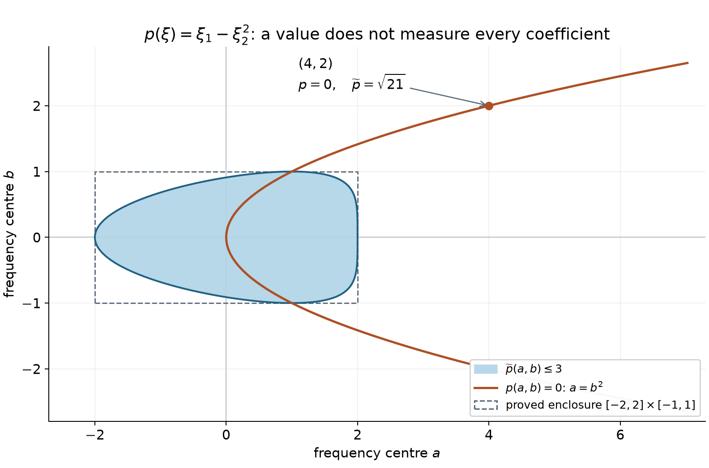
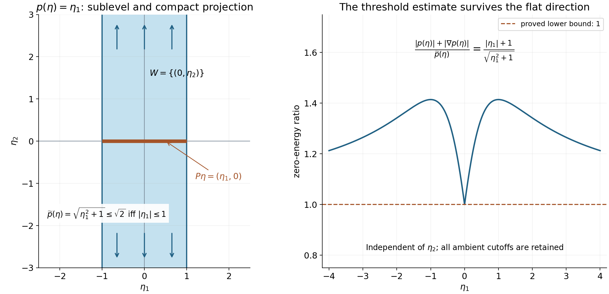

# Polynomial translations and regular energies

*Written by GPT-6.1 Sol (OpenAI) and GPT-6 Astra (OpenAI). Self-checked by the writing AI. Original exposition: CC0, excluding the separately licensed linked algebra readings.*

**Working question: How can one control patches whose centres run to infinity?** For \(p(\xi_1,\xi_2)=\xi_1-\xi_2^2\), translating the centre changes the linear and constant coefficients. Dividing by the full derivative strength makes those coefficients a bounded finite-dimensional family. For \(p=\xi_1\), translation in the second direction changes nothing. That invariant direction is part of the model and must remain in the normalization.

A compact Fourier patch sees only finitely many coefficients of a polynomial. To make estimates uniform over all such patches, translate the polynomial to the patch centre and divide by the size of all its derivatives there. The resulting polynomials form a compact family. A simple-characteristic condition ensures that each member either has a nonzero denominator or has a regular energy surface.

This lesson supplies that finite-dimensional argument for the global resolvent estimates. It uses elementary linear algebra and Taylor's formula for polynomials; the required scalar implicit-function argument is proved after Theorem 4.1. The proof of finiteness of critical values also uses the exact scalar Cauchy proof identified before Lemma 3.1 and two full algebraic prerequisites in the AI Integrated Stacks Project, the AI-integrated draft edition of the Stacks project. Their complete programme carriers prove [Noetherian permanence](../providers/algebra/noetherian-permanence.md#noetherian-permanence) and [characteristic-zero separability](../providers/algebra/irreducible-separability.md#irreducible-separability), including the elementary ascending-chain, polynomial-division and root prerequisites. The analytical setting is developed in [Division and radiation at regular energies](division-and-radiation-at-regular-energies.md). Yafaev [Y] and Teschl [T] provide freely accessible scattering background.

The polynomial properness and uniform-threshold constructions below are proved directly by finite-dimensional translation and degree induction. The free original comparison for properness is the properness argument in the proof of Hörmander [H55], Theorem 2.17; the proof below keeps an arbitrary parameter subspace and its exact invariant directions. The critical-value proof uses the exact freely accessible AI Integrated Stacks Project revision specified in its proof and references. In particular, it covers every real polynomial and retains the original ambient strengths when invariant directions are present. The local graph construction after Theorem 4.1 supplies the scalar implicit-function argument used to interpret its regular alternative.

## 1. Measuring every polynomial derivative

Let \(p\) be a nonzero polynomial of degree \(m\) on \(\mathbb R^n\), possibly with complex coefficients. Define its derivative strength by

\[
 \widetilde p(\eta)=
     \left(\sum_{|\alpha|\leq m}|\partial^\alpha p(\eta)|^2\right)^{1/2}.
\]

A nonzero derivative of order \(m\) is constant, so \(\widetilde p\) has a positive lower bound. Taylor's formula gives

\[
 p(\eta+\xi)=
       \sum_{|\alpha|\leq m}\frac{\partial^\alpha p(\eta)}{\alpha!}\xi^\alpha.
\]

Thus \(\widetilde p(\eta)\) is a norm of the coefficient vector of the translated polynomial. All norms on this fixed finite-dimensional coefficient space are equivalent. In particular, for every \(L\), the polynomials

\[
 p_\eta(\xi)=p(\eta+\xi)/\widetilde p(\eta)
\]

have uniformly bounded derivatives of every order on \(|\xi|\leq L\). Their coefficient vectors have compact closure.

Here the polynomial Taylor identity follows by expanding each monomial with the finite binomial formula. If \(p(\xi)=\sum c_\alpha\xi^\alpha\), the coefficient norm just used is \((\sum|\alpha!c_\alpha|^2)^{1/2}\). For \(p_\eta\) it is exactly one, so no polynomial in its coefficient closure is zero. Each derivative on a fixed ball is a finite sum of bounded monomials times those coefficients, giving the asserted uniform bounds at every fixed order. The [finite-dimensional norm and compactness proof](../providers/analysis/coordinate-inverses-and-integration.md#coordinate-linear-algebra) supplies norm equivalence and compact coefficient closure, also for complex coefficients considered as real coordinate pairs.

A nonzero polynomial with complex coefficients cannot vanish at every real point. In one variable, division by \(T-a\) at a root and degree induction bound the number of distinct roots by the degree; the required [division proof](../providers/algebra/irreducible-separability.md#algebra-polynomial-division) works over \(\mathbb C\). For several variables, hold all but the last variable fixed at real values. Vanishing on the real line makes every coefficient polynomial vanish on all real choices of the remaining variables; induction proves all coefficients zero. This justifies choosing a real direction where a nonzero highest homogeneous part does not vanish.

The invariant-direction space is

\[
 \Lambda(p)=\{v\in\mathbb R^n:D_vp=0\}.
\]

Here \(D_vp=v\cdot\nabla p\), with no factor of \(i\). Polynomial Taylor expansion shows that this is exactly the set of \(v\) such that \(p(\xi+tv)=p(\xi)\) for every real \(t,\xi\).

**Theorem 1.1.** For any linear subspace \(V\subset\mathbb R^n\) and \(T<\infty\), the set

\[
 \{\eta\in V:\widetilde p(\eta)\leq T\}
\]

is bounded modulo \(V\cap\Lambda(p)\): its orthogonal projection on the complement of that invariant space in \(V\) is bounded. Consequently, if \(\Lambda(p)=\{0\}\), then \(\widetilde p(\eta)\to\infty\) as \(|\eta|\to\infty\).

**Proof.** We prove the bounded-projection assertion by induction on degree. It is immediate for a constant polynomial, whose invariant space is all of \(\mathbb R^n\).

Write \(p=p_m+q\), where \(p_m\) is the highest homogeneous part and \(\deg q<m\). The homogeneous part of degree \(m-1\) of \(p(\xi+\eta)\) is

\[
 p_{m-1}(\xi)+D_\eta p_m(\xi).
\]

Bounded translated coefficients therefore bound \(D_\eta p_m\) in coefficient norm. The linear map \(v\mapsto D_vp_m\) on \(V\) has kernel \(V_0=V\cap\Lambda(p_m)\). On the orthogonal complement of \(V_0\) it is injective and bounded below: its norm has a positive minimum on the compact unit sphere. Decompose \(\eta=a+b\), where \(a\) belongs to that complement and \(b\in V_0\). It follows that \(a\) is bounded.

Translation by a bounded vector, or its negative, is uniformly bounded on the coefficient space: its matrix entries are fixed polynomials in that vector. Applying translation by \(-a\) to \(p(\xi+\eta)\) shows that \(p(\xi+b)\) has bounded coefficients. Since \(b\) leaves \(p_m\) invariant,

\[
 p(\xi+b)=p_m(\xi)+q(\xi+b).
\]

Hence \(q(\xi+b)\) has bounded coefficients. If \(q=0\), set \(\Lambda(q)=\mathbb R^n\); its coefficients impose no additional restriction, and the bound modulo \(V_0\) is already established. Otherwise apply the induction hypothesis to \(q\) with parameter space \(V_0\). It bounds \(b\) modulo \(V_0\cap\Lambda(q)\). Homogeneous degrees cannot cancel in \(D_vp_m+D_vq\), so

\[
 V_0\cap\Lambda(q)=V\cap\Lambda(p).
\]

Combining the bounded \(a\) and the induction bound proves the assertion. For \(\Lambda(p)=0\), each strength sublevel is closed and bounded, hence compact. A sequence escaping every bounded set cannot stay in any such sublevel; this proves the last statement. \(\square\)

**Example 1.2.** Take \(p(\xi)=\xi_1-\xi_2^2\) and a centre \(\eta=(a,b)\). Then

\[
 p(\eta+\xi)=(a-b^2)+\xi_1-2b\xi_2-\xi_2^2,
 \qquad
 \widetilde p(a,b)^2=(a-b^2)^2+4b^2+5.
\]

The value of \(p\) alone stays zero on the unbounded parabola \(a=b^2\). The coefficient of \(\xi_2\) detects escape along that parabola. Bounded derivative strength first bounds \(b\), and then the constant coefficient bounds \(a\).

*Figure 1. The shaded set is \((a-b^2)^2+4b^2\leq4\), equivalently \(\widetilde p\leq3\), with boundary \(a=b^2\pm2\sqrt{1-b^2}\), \(|b|\leq1\). It lies in the proved enclosure \([-2,2]\times[-1,1]\). The point \((4,2)\) still has \(p=0\), but its strength is \(\sqrt{21}>3\). Curves are sampled from these exact formulas. The figure illustrates Theorem 1.1 and this example. The [full-size vector figure](../figures/polynomial-translation-strength.svg) and its Python plotting source accompany the editable package.*

## 2. Weaker polynomials and simple characteristics

For another polynomial \(Q\), write

\[
 \kappa_p(Q)=\sup_{\eta\in\mathbb R^n}
                         \frac{\widetilde Q(\eta)}{\widetilde p(\eta)}.
\]

We call \(Q\) weaker than \(p\) when this number is finite. The derivatives of the zero polynomial have strength zero. Every derivative \(\partial^\beta p\) is weaker than \(p\), with ratio at most one, since its strength sum is a sub-sum of the strength sum for \(p\).

If \(Q\ne0\) is weaker, then \(\deg Q\leq m\). Indeed choose a direction on which its highest homogeneous part does not vanish. Along that ray, its value grows like the corresponding degree, whereas \(\widetilde p\leq C(1+|\eta|)^m\). A higher degree would contradict the bounded ratio. Taylor expansion therefore gives, for every fixed \(L,N\),

\[
 \sup_\eta\sup_{|\xi|\leq L}
   \left|\partial_\xi^\alpha
            \frac{Q(\eta+\xi)}{\widetilde p(\eta)}\right|
       \leq C_{m,n,L,N}\kappa_p(Q),
       \qquad |\alpha|\leq N.
\]

Terms with derivative order above the degree are zero. The constant is independent of the coefficients of \(Q\).

Now assume that \(p\) is real. We call it simply characteristic if

\[
 \widetilde p(\eta)\leq C_0\big(1+|p(\eta)|+|\nabla p(\eta)|\big)
       \quad(\eta\in\mathbb R^n).
\]

Replacing the Euclidean gradient norm by the sum of its component absolute values changes only the constant. This condition controls higher derivatives by the value and first derivatives. It does not require ellipticity.

**Example 2.1.** The nonelliptic quadratic \(p(\xi)=\xi_1^2-\xi_2^2\) has

\[
 \widetilde p(\xi)^2=(\xi_1^2-\xi_2^2)^2
                         +4(\xi_1^2+\xi_2^2)+8.
\]

It is simply characteristic and has no invariant direction. The operator with symbol \(\xi_1\) is weaker, while the operator with symbol \(\xi_1^2\) is not: on \((t,t)\), the latter strength grows quadratically and \(\widetilde p\) grows only linearly. Order alone is therefore insufficient to decide weakness.

**Lemma 2.2 (retain the ambient strength on the quotient).** Put \(W=\Lambda(p)\), \(V=W^\perp\), and let \(P\) be orthogonal projection onto \(V\). Then

\[
 p(\eta)=p(P\eta),\qquad
 \partial^\alpha p(\eta)=\partial^\alpha p(P\eta),\qquad
 \widetilde p(\eta)=\widetilde p(P\eta).
\]

Every weaker \(Q\) has \(W\subset\Lambda(Q)\), with the same identities for its ambient derivatives and strength. No change of coordinate norm or of \(\kappa_p(Q)\) is involved.

**Proof.** Integrating \(D_wp=0\) along every line gives translation invariance for each \(w\in W\). Differentiate that identity in the original ambient coordinates; projection subtracts an element of \(W\), proving all three assertions. For fixed \(\eta,w\),

\[
 |Q(\eta+tw)|\le\widetilde Q(\eta+tw)
       \le\kappa_p(Q)\widetilde p(\eta),\qquad t\in\mathbb R.
\]

The polynomial in \(t\) on the left is bounded. A nonconstant polynomial is unbounded along the real line, by its leading term, so this one is constant. Differentiating at zero gives \(D_wQ=0\); its differentiated translation identity proves the rest. \(\square\)

## 3. Why only finitely many critical energies occur

Define

\[
 Z(p)=\{p(\eta):\eta\in\mathbb R^n,\ \nabla p(\eta)=0\}.
\]

**Lemma 3.1.** For any real polynomial \(p\), the set \(Z(p)\) is finite.

The algebraic-closure fact used in the proof has the following exact programme input. The scalar Cauchy lesson, Theorems 3.2–3.3 and Exercise 1 with its solution proves Cauchy's coefficient estimates, Liouville and the fundamental theorem of algebra. Explicitly, if a nonconstant complex polynomial had no root, its reciprocal would be entire and bounded: its leading term forces the reciprocal to tend to zero at infinity, and continuity bounds it on the remaining compact disc. Liouville makes that reciprocal constant, a contradiction. Dividing by each root and inducting on degree factors every polynomial into linear factors. In particular, an element algebraic over \(\mathbb C\) has a linear minimal polynomial and belongs to \(\mathbb C\). The cited programme proof is read before this lemma.

**Proof.** Extend \(p\) to a polynomial over \(\mathbb C\). Its complex critical set \(X\) is cut out by its first derivatives. We use the [Noetherian polynomial-ring theorem](../providers/algebra/noetherian-permanence.md#noetherian-permanence), with its complete proof in the programme’s AI Integrated Stacks Project algebra carrier. The carrier includes the source's two-index ascending-chain argument and its elementary completion. It implies that descending chains of algebraic closed sets stabilize: their ideals of vanishing polynomials form an ascending chain, and a closed set is recovered as the common zero set of its vanishing ideal.

For clarity, write \(Z(S)=\{x:f(x)=0\text{ for every }f\in S\}\). Arbitrary intersections of such sets are obtained by taking unions of the defining families, and \(Z(S)\cup Z(T)=Z(\{fg:f\in S,g\in T\})\): a point outside the union has one nonzero value from each family, hence a nonzero product. These are the closed sets being used. If \(Y=Z(S)\), then \(S\subset I(Y)\) gives \(Z(I(Y))\subset Y\), and the opposite inclusion follows directly from the definition of \(I(Y)\). Thus recovery from the vanishing ideal uses no Nullstellensatz.

Consequently \(X\) is a finite union of irreducible closed sets. To justify this implication, a minimal closed set failing to be a finite union would, if reducible, be the union of two proper closed sets. Each of those satisfies the finite-union property by minimality, a contradiction. A minimal counterexample exists if any exists, by the descending-chain condition.

For each nonempty irreducible component \(Y\), its vanishing ideal \(I(Y)\) is prime. If a product vanishes, irreducibility applied to its two zero sets says one factor vanishes everywhere on \(Y\). Thus

\[
 A=\mathbb C[\xi_1,\ldots,\xi_n]/I(Y)
\]

is a domain, with a finitely generated fraction field \(F\). Denote the image of \(p\) by \(c\). We prove \(c\in\mathbb C\).

Since \(Y\ne\varnothing\), the constant polynomial \(1\) does not vanish on \(Y\); thus \(I(Y)\) is proper. The [quotient and fraction-field construction](../providers/algebra/noetherian-permanence.md#algebra-rings-and-fractions) makes \(A\) a nonzero domain and embeds it in \(F\). Every element of \(A\) is a polynomial in the images of the \(\xi_j\), and every element of \(F\) is a ratio of two such polynomials. Hence these finitely many images generate \(F\) as a field over \(\mathbb C\).

Suppose that \(c\notin\mathbb C\). Algebraic closure of \(\mathbb C\) makes \(c\) transcendental. Include it in a transcendence basis \(c,u_2,\ldots,u_r\) of \(F/\mathbb C\). Such a finite basis is obtained by adding generators that remain algebraically independent; the remaining generators are algebraic. The complete [finite-extension proof](../providers/algebra/irreducible-separability.md#algebra-finite-extensions) justifies this with \(c\) prescribed as the first independent element: rejected generators satisfy nonzero polynomial relations over the current independent list, and finite algebraic towers have finite dimension. Thus the field over which \(F\) is finite is

\[
 E=\mathbb C(c,u_2,\ldots,u_r).
\]

On \(E\), the usual derivative with respect to \(c\) is a \(\mathbb C\)-linear derivation with \(Dc=1\). It extends across each algebraic generator.

Both assertions are proved in the [derivation construction](../providers/algebra/irreducible-separability.md#algebra-derivations). Algebraic independence identifies the polynomial algebra in the basis with a genuine polynomial ring; formal differentiation is therefore unambiguous. The quotient rule extends it to its fraction field, with well-definedness checked from cross multiplication. The construction over a simple algebraic extension uses the minimal polynomial and the fact, proved there by division and Bézout, that \(E[a]=E(a)\). If \(a\) has minimal polynomial \(h(T)=\sum_j h_jT^j\), the extension is forced, and defined, by

\[
 Da=-\frac{\sum_j(Dh_j)a^j}{h'(a)}.
\]

The denominator is nonzero by the complete programme proof of [Irreducible polynomials and characteristic-zero separability](../providers/algebra/irreducible-separability.md#irreducible-separability). Its AI Integrated Stacks Project proof separates a zero derivative before the degree argument, and its explicit Bézout consequence proves \(h'(a)\ne0\). To check that this actually defines a derivation, extend \(D\) to the polynomial ring in a formal variable \(T\), with values in \(E(a)\), by evaluating coefficients at \(a\) and assigning \(DT\) the displayed value. The product rule makes the image of \(Dh\) zero. The derivative of every multiple of \(h\) is therefore zero after evaluation. Thus this map descends to \(E[T]/(h)=E(a)\); the quotient rule extends any intermediate integral domain to its fraction field. Iterating across the finitely many algebraic generators extends \(D\) to \(F\).

But in \(A\), every first derivative of \(p\) is zero, by the definition of \(Y\). The polynomial chain rule in \(F\) therefore gives

\[
 Dc=\sum_j(\partial_jp)(\xi)\,D\xi_j=0,
\]

contradicting \(Dc=1\). Thus \(p\) is a complex constant on each of the finitely many components. Its real critical values belong to this finite set. If the critical set is empty, the conclusion is immediate. \(\square\)

This algebraic proof is separate from the uniform estimate below; that estimate only needs the compact energy set to avoid \(Z(p)\).

## 4. A uniform alternative near every frequency centre

**Theorem 4.1.** Let \(p\) be a nonzero real simply characteristic polynomial, allowing invariant directions. If \(K\subset\mathbb C\) is a nonempty compact set containing no point of \(Z(p)\), there is an \(\alpha>0\) such that

\[
 \frac{|p(\eta)-z|+|\nabla p(\eta)|}{\widetilde p(\eta)}
       \geq\alpha
       \qquad(\eta\in\mathbb R^n,\ z\in K).
\]

There is also an \(r>0\), independent of \(\eta,z\), for which every normalized denominator

\[
 q_{\eta,z}(\xi)-i\beta_{\eta,z}
  =\frac{p(\eta+\xi)-z}{\widetilde p(\eta)},
 \qquad
 \beta_{\eta,z}=\frac{\operatorname{Im}z}{\widetilde p(\eta)},
\]

has one of the following properties on \(|\xi|\leq r\):

1. Its absolute value is at least \(\alpha/4\).
2. The real polynomial \(q_{\eta,z}\) has a unit direction \(\omega\) with \(\omega\cdot\nabla q_{\eta,z}\geq\alpha/4\).

All derivatives on that ball have uniform bounds. The coefficient and imaginary-parameter pairs have compact closure.

**Proof.** Set \(W=\Lambda(p)\), \(V=W^\perp\), and \(P\) as in Lemma 2.2. The ratio in the theorem equals its value at \(P\eta\): its denominator and all ambient first derivatives are invariant. Put \(L=\max_{z\in K}|z|\). Apply Theorem 1.1 with parameter space \(V\); since \(V\cap W=0\), its closed strength sublevels in \(V\) are compact. Thus for \(|P\eta|\) large, \(\widetilde p(\eta)>2C_0(1+L)\). The simple-characteristic inequality then gives

\[
 1\leq C_0\left(
       \frac{1+L}{\widetilde p(\eta)}
       +\frac{|p(\eta)-z|+|\nabla p(\eta)|}{\widetilde p(\eta)}
       \right).
\]

The first contribution is less than \(1/2\), so the desired ratio is at least \(1/(2C_0)\). On the remaining compact product of a closed ball in \(V\) with \(K\), the ratio is continuous and positive: a zero would mean \(z=p(\eta)\) and \(\nabla p(\eta)=0\), which was excluded. Its positive minimum proves the first assertion on all of the original ambient space. If \(V=0\), only this compact case is needed; it includes nonzero constant polynomials with \(K\) separated from their constant value.

The normalized Taylor coefficients are bounded, including the subtracted real part of \(z\), because \(\widetilde p\) has a positive lower bound. Thus the polynomials, their gradients and Hessians have uniform bounds on the unit ball, and \(\beta_{\eta,z}\) is bounded. At zero, either the denominator has absolute value at least \(\alpha/2\), or the real gradient has norm at least \(\alpha/2\).

In the first case choose a ball small enough that the uniformly bounded gradient changes the denominator by at most \(\alpha/4\). In the second case put \(\omega=\nabla q(0)/|\nabla q(0)|\) and choose a ball small enough that the Hessian bound changes this directional derivative by at most \(\alpha/4\). Taking \(r=\min\{1,\alpha/[4(1+M_1)],\alpha/[4(1+M_2)]\}\), where \(M_1,M_2\) bound the gradient and Hessian operator norms on the unit ball, proves the alternative. Finite-dimensional boundedness gives compact closure of the coefficient and parameter pairs; the positive inequalities survive passage to that closure.

For the directional alternative, also take a convergent subsequence of the unit directions, whose sphere is compact. Coefficient convergence gives uniform convergence of the gradients on the fixed ball, so the limiting direction retains the lower bound \(\alpha/4\). In the nonvanishing alternative, uniform convergence of the denominators preserves its lower bound. Every convergent sequence has a subsequence in at least one of these two cases, so the same alternative holds throughout the compact closure. \(\square\)

**Local graph construction.** In the regular alternative, rotate the increasing direction to the first coordinate and write the smooth real function as \(q(\tau,\eta)\). Near any point of a level \(q=\lambda_0\), take a closed rectangle on which \(\partial_\tau q\ge a>0\). On each fixed \(\eta\) fibre, the mean value theorem makes \(q\) strictly increasing. First choose two nearby endpoints on either side of the point; their values bracket \(\lambda_0\) strictly. By continuity the same bracketing holds for all \((\lambda,\eta)\) in a smaller product neighborhood. The intermediate value theorem and strict monotonicity give a unique solution \(\tau=\Sigma(\lambda,\eta)\).

The lower derivative bound and a uniform bound \(M\) for \(\nabla_\eta q\) give
\[
 |\Sigma(\lambda,\eta)-\Sigma(\lambda',\eta')|
 \le a^{-1}\bigl(|\lambda-\lambda'|+M|\eta-\eta'|\bigr).
\]
Indeed compare the two values of \(q\) first in the \(\tau\) direction at fixed \(\eta\), then in the \(\eta\) direction at fixed \(\tau\). Thus \(\Sigma\) is continuous. Subtracting the two equations \(q(\Sigma(\lambda,\eta),\eta)=\lambda\), dividing by a parameter increment and using the integral mean value formula proves
\[
 \partial_\lambda\Sigma=\frac1{\partial_\tau q},\qquad
 \partial_{\eta_j}\Sigma=-\frac{\partial_{\eta_j}q}{\partial_\tau q},
\]
with the derivatives of \(q\) evaluated at \((\Sigma(\lambda,\eta),\eta)\). For a general simultaneous increment, the differentiability remainder for \(q\) divided by the increment tends to zero because the displayed Lipschitz bound controls the change of \(\Sigma\); hence these partial formulas give its total derivative. Their right sides are continuous. Differentiating them repeatedly proves smoothness by induction, with bounds through any fixed order depending only on \(a^{-1}\) and the corresponding bounded derivatives of \(q\) on a smaller rectangle. This proves the local graph statement and its uniform finite-order control directly.

One may also choose its product neighborhood uniformly for points in the ball of radius \(r/2\) from Theorem 4.1. In the increasing coordinates, put \(a=\alpha/4\), let \(M\) bound the transverse gradient, and choose \(h=r/4\). At a level point \((\tau_0,\eta_0)\), the two endpoints \(\tau_0\pm h\), for fixed \(\eta_0\), have values at least \(ah\) on opposite sides of the central level. If

\[
 \begin{gathered}
 |\eta-\eta_0|\leq\min\{h,ah/[4(1+M)]\},\\
 |\lambda-\lambda_0|\leq ah/4,
 \end{gathered}
\]

the transverse change is at most \(ah/4\), so both endpoints still bracket \(\lambda\) with margin at least \(ah/2\). The product remains in the radius-\(r\) ball, since its distance from the level point is at most \(\sqrt2h\). The preceding argument then gives a common inverse neighborhood, with derivative bounds independent of the translating centre. Rotations preserve the gradient and Hessian bounds, and higher rotated derivatives are bounded finite combinations of the original derivatives.

For real \(z=\lambda\), the second case is therefore a uniformly regular local energy surface wherever that level meets the patch. For a genuinely nonreal \(z\), its real part is allowed to be a critical value: it is the complex point \(z\) itself that must avoid the real critical set. The nonzero imaginary part can supply the nonvanishing-denominator case.

**Example 4.2 (an unbounded invariant direction).** For \(p(\xi_1,\xi_2)=\xi_1\), \(Z(p)=\varnothing\), and at \(z=0\)

\[
 \frac{|p(\eta)|+|\nabla p(\eta)|}{\widetilde p(\eta)}
   =\frac{|\eta_1|+1}{\sqrt{\eta_1^2+1}}\ge1.
\]

The second coordinate is unrestricted. The full strength need not tend to infinity in that direction; its properness on \(W^\perp\) is exactly what the proof uses. The normalized denominators, their full-dimensional cutoffs, and every original ambient derivative remain unchanged.

*Figure 2. For \(p(\eta)=\eta_1\), the exact sublevel \(\widetilde p\le\sqrt2\) is the infinite strip \(|\eta_1|\le1\). Its orthogonal projection onto \(W^\perp\) is \([-1,1]\). Arrows indicate the invariant direction beyond the displayed window. The threshold ratio is constant along each such line and at least one at zero energy. Theorem 1.1, Lemma 2.2 and Theorem 4.1 explain the projection and the unchanged ambient estimate. [Vector figure](../figures/polynomial-invariant-directions.svg); plotting source accompanies the editable package.*

### Use the conclusion

Work the two polynomial examples with the ambient strength before taking its quotient. Distinguish a critical energy from an unbounded regular shell; only the first is a threshold obstruction.

## 5. Exercises

**Exercise 5.1 (foundation).** For \(p(\xi_1,\xi_2)=\xi_1\), compute \(\widetilde p\) and \(\Lambda(p)\). Explain precisely why properness holds on the quotient by invariant directions but fails on all of \(\mathbb R^2\).

**Exercise 5.2 (foundation).** For Example 1.2, derive the exact boundary of \(\{\widetilde p\leq3\}\) and prove its enclosure \(|a|\leq2,\ |b|\leq1\). Compute the strength at \((4,2)\).

**Exercise 5.3 (intermediate).** For \(p=\xi_1^2-\xi_2^2\), prove that \(Q=\xi_1\) is weaker with ratio at most \(1/2\), while \(Q=\xi_1^2\) is not weaker. Explain why a second-order multiplier cannot be included merely because \(p\) has order two.

**Exercise 5.4 (intermediate).** Check that \(p=\xi_1^2\xi_2^2\) has no invariant direction but fails the simple-characteristic inequality. Identify a sequence witnessing the failure. Does this example contradict Theorem 1.1?

**Exercise 5.5 (advanced).** For \(p(\xi)=\xi^2\), show \(\widetilde p(\xi)=\xi^2+2\) and \(Z(p)=\{0\}\). Evaluate the ratio in Theorem 4.1 at \(\eta=\sqrt\lambda,\ z=\lambda>0\), and explain why no positive uniform \(\alpha\) can persist as \(\lambda\downarrow0\).

## 6. Complete solutions

**Solution 5.1.** The strength is \(\sqrt{\xi_1^2+1}\), and \(D_vp=v_1\), so the invariant space is \(\{(0,v_2)\}\). A strength sublevel bounds \(\xi_1\) and leaves \(\xi_2\) unrestricted. Its projection to the quotient, identified with the \(\xi_1\) axis, is bounded. The sequence \((0,j)\) shows why the full-space claim would be false without the invariant-direction condition.

**Solution 5.2.** The inequality is \((a-b^2)^2+4b^2\leq4\). It first gives \(|b|\leq1\), then

\[
 b^2-2\sqrt{1-b^2}\leq a
       \leq b^2+2\sqrt{1-b^2}.
\]

The lower endpoint is at least \(-2\). For the upper endpoint set \(v=\sqrt{1-b^2}\in[0,1]\); it is \(1-v^2+2v=2-(v-1)^2\leq2\). Thus the stated rectangle contains the set. At \((4,2)\), the value term vanishes but the squared strength is \(16+5=21\).

**Solution 5.3.** For \(Q=\xi_1\), \(\widetilde Q^2=\xi_1^2+1\). Since

\[
 \tfrac14\widetilde p^2
   =\tfrac14(\xi_1^2-\xi_2^2)^2+\xi_1^2+\xi_2^2+2
       \geq\xi_1^2+1,
\]

the ratio is at most \(1/2\). For \(Q=\xi_1^2\), its squared strength is \(\xi_1^4+4\xi_1^2+4\). On \((t,t)\), the ratio is

\[
 \frac{\sqrt{t^4+4t^2+4}}{\sqrt{8t^2+8}}\longrightarrow\infty.
\]

The uncontrolled growth occurs along the zero-energy cone; comparing degrees misses it.

**Solution 5.4.** The directional derivative is \(2v_1\xi_1\xi_2^2+2v_2\xi_1^2\xi_2\), identically zero only for \(v_1=v_2=0\). On \((0,t)\), both \(p\) and its gradient are zero, while \(\partial_1^2p=2t^2\). Thus \(\widetilde p\geq2t^2\), whereas the proposed right side is the fixed constant \(C_0\). Theorem 1.1 says strength tends to infinity without invariant directions, exactly as it does here; it does not assert the simple-characteristic bound.

**Solution 5.5.** The squared strength is \(\xi^4+4\xi^2+4=(\xi^2+2)^2\); its positive square root is \(\xi^2+2\). The sole critical point is zero and its value is zero. At the prescribed centre, the value difference is zero, so the ratio is \(2\sqrt\lambda/(\lambda+2)\to0\). Each fixed compact set away from zero has its own positive bound. Extending that bound across a threshold would require a different estimate.

## References

- [Y] Dmitri Yafaev, *Lectures on scattering theory*, 2004, [arXiv:math/0403213](https://arxiv.org/abs/math/0403213).
- [T] Gerald Teschl, *Mathematical Methods in Quantum Mechanics: With Applications to Schrödinger Operators*, second edition, 2014. [Free author edition](https://www.mat.univie.ac.at/~gerald/ftp/book-schroe/schroe2.pdf). This is the freely accessible edition actually checked for the repair.
- [H55] Lars Hörmander, “On the theory of general partial differential operators,” *Acta Mathematica* 94 (1955), 161–248. The properness argument inside the proof of Theorem 2.17 establishes derivative-strength properness from homogeneous parts and their invariant directions. [Original article](https://projecteuclid.org/journalArticle/Download?urlid=10.1007%2FBF02392492#page=44).
- AI Integrated Stacks Project, the AI-integrated draft edition of the Stacks project: [Noetherian polynomial rings and localization](https://github.com/KokunoYumeto/unofficial-stacks-project-ai-drafts/blob/565b10e987aba5969b21145a0833f42d69f96790/algebra.tex#L6156) and [Irreducible polynomials and their derivatives](https://github.com/KokunoYumeto/unofficial-stacks-project-ai-drafts/blob/565b10e987aba5969b21145a0833f42d69f96790/fields.tex#L1167). The complete [programme algebra carriers and component notice](../providers/algebra/NOTICE.md) preserve this exact revision, its source excerpts and the elementary completions used above. Their baseline text retains the [GNU Free Documentation License](https://github.com/KokunoYumeto/unofficial-stacks-project-ai-drafts/blob/565b10e987aba5969b21145a0833f42d69f96790/COPYING). The Stacks project’s [Noetherian-ring lemma](https://stacks.math.columbia.edu/tag/00FN) and [irreducible-polynomial lemma](https://stacks.math.columbia.edu/tag/09H0) remain upstream comparisons. No baseline expression is incorporated into this lesson or included in its CC0 dedication.
