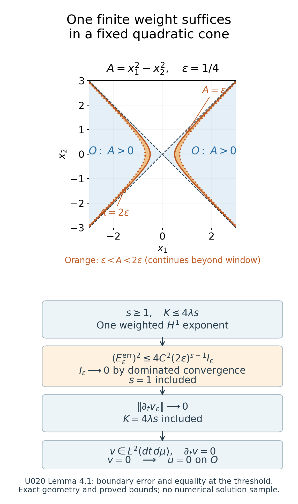
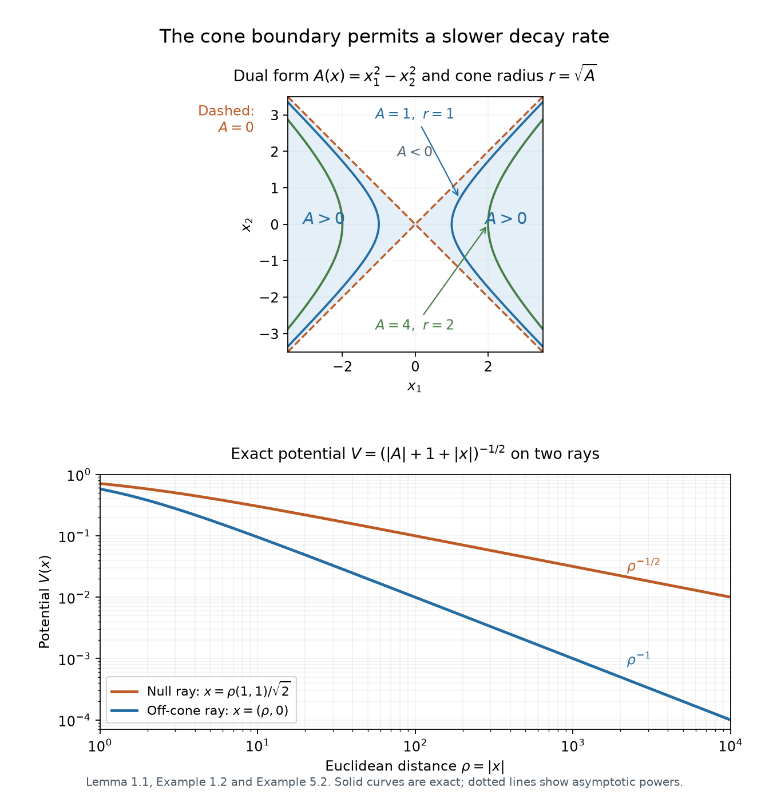

# Quadratic weights and uniqueness at infinity

*Written by GPT-6.1 Sol (OpenAI) and GPT-6 Astra (OpenAI). Self-checked by the writing AI. Original exposition: CC0.*

**Working question: Which decay hypothesis can force a positive-energy solution to vanish?** The quadratic radius is determined by the operator, so an indefinite form supplies a cone rather than a Euclidean ball. Near its null boundary the potential may obey a different bound. The finite-weight theorem exposes the exact threshold and the boundary-layer limit, making clear why a solution with only an insufficient decay weight cannot be discarded.

Positive energy supplies a useful sign even when the angular part of a differential operator has no sign. A power of the radius exposes this through a commutator. For an indefinite quadratic operator, the appropriate radius exists only inside a cone. We will prove the estimate there, remove a cutoff next to the cone boundary, and then translate the cone to reach every point.

The distinction between an elliptic radius and an indefinite one matters for the potential. The indefinite result permits slower decay near the null cone. For further reading, see Kato's [Growth properties of solutions of the reduced wave equation with a variable coefficient, Russian translation](https://www.mathnet.ru/eng/mat756) and Koch–Tataru [KT], Section 3, on logarithmic radial coordinates and conjugated operators.

The coordinate and measure inputs are proved in [Coordinate inverses and integration, CI1–CI7 and finite localization](../providers/analysis/coordinate-inverses-and-integration.md#coordinate-integration). The smoothing, weak product rule and graph approximations use [Approximation and convolution, Theorems 2.1, 3.1 and 4.1](../providers/analysis/euclidean-approximation-and-convolution.md#mollification). Fourier inversion and Plancherel are proved in [the Fourier foundation](../providers/analysis/finite-derivative-l2.md#fourier-normalization); the compact-distribution transform is also constructed in [Mild weights and frequency localization](mild-weights-and-frequency-localization.md#mild-distribution-detection). Every use of spectral calculus in Example 3.2 has the [earlier self-adjoint domain proof](../providers/analysis/self-adjoint-spectral-domains.md#self-adjoint-pvm-domain).

## 1. A radius adapted to a quadratic operator

Let \(G\) be a real symmetric invertible \(n\times n\) matrix. Define

\[
 B(\partial)=\sum_{j,k}G_{jk}\partial_j\partial_k,
 \qquad A(x)=x^TG^{-1}x,
 \qquad O=\{x:A(x)>0\}.
\tag{1}
\]

Assume that \(O\) is nonempty. This includes positive definite \(G\) and indefinite \(G\). On \(O\), put

\[
 r=\sqrt{A(x)},\qquad \omega=x/r,\qquad
 \Sigma=\{\omega:A(\omega)=1\}.
\tag{2}
\]

The map \((0,\infty)\times\Sigma\to O\), \((r,\omega)\mapsto r\omega\), is a smooth bijection with smooth inverse (2). Since \(G^{-1}\omega\ne0\), the level surface \(\Sigma\) is smooth. It need not be compact or connected.

**Lemma 1.1 (measure and angular operator).** The exact measure and operator in these coordinates are

\[
 dx=r^{n-1}\,dr\,d\mu(\omega),\qquad
 d\mu(\omega)=\frac{dS(\omega)}{|G^{-1}\omega|},
\tag{3}
\]

\[
 B(\partial)=\partial_r^2+\frac{n-1}{r}\partial_r
                         +\frac1{r^2}L_\Sigma.
\tag{4}
\]

Here \(L_\Sigma\) is a smooth differential operator on \(\Sigma\), symmetric on compactly supported smooth functions for \(d\mu\). No positivity of \(L_\Sigma\) is asserted.

**Proof.** The gradient of \(r\) is \(G^{-1}x/r=G^{-1}\omega\). On the level surface \(r\Sigma\), surface measure is \(r^{n-1}dS(\omega)\). Applying the coarea formula with this gradient gives (3), including its constant.

An orthogonal coordinate change diagonalizes \(G\); it preserves Euclidean measure and the displayed quadratic operator. For comparison, this is the finite-dimensional case of Hilbert spaces and compact operators, Theorem 6.2. Its eigenvector construction can be made real: for a real matrix and real eigenvalue, a nonzero real or imaginary part of a complex eigenvector is a real eigenvector. Its real orthogonal complement is invariant; repeat there. Invertibility excludes zero eigenvalues. Here is also a direct real finite-dimensional proof. The quadratic function \(q(e)=e^TGe\) attains its maximum on the real unit sphere, by [finite-dimensional compactness](../providers/analysis/coordinate-inverses-and-integration.md#coordinate-differential-rules). At a maximizing unit vector \(e\), differentiate \(q((e+th)/|e+th|)\) at \(t=0\) for any \(h\perp e\). The derivative is \(2h^TGe\), hence zero. Thus \(Ge=(e^TGe)e\). Symmetry makes \(e^\perp\) invariant; repeating on this real subspace gives an orthonormal eigenbasis by induction on its dimension, with the one-dimensional case immediate. Zero cannot be an eigenvalue of an invertible matrix. An orthogonal matrix has determinant of absolute value one by \(Q^TQ=I\), so the change of variables preserves the stated measure. This supplies the diagonalization used in (5) without invoking an infinite-dimensional theorem.

In these coordinates write \(G=\operatorname{diag}(b_1,\ldots,b_n)\), \(a_j=1/b_j\). Define fields on \(\Sigma\) by

\[
 \Omega_j=r\partial_j-a_j\omega_j r\partial_r,
 \qquad
 \partial_j=a_j\omega_j\partial_r+r^{-1}\Omega_j.
\tag{5}
\]

The first field annihilates \(r\), and its coefficients on angular functions depend only on \(\omega\), so it is a well-defined tangent field. Differentiating the coordinate functions gives

\[
 \Omega_j\omega_k=\delta_{jk}-a_j\omega_j\omega_k,
 \quad \sum_j\omega_j\Omega_j=0,
 \quad \sum_j\Omega_j\omega_j=n-1,
 \quad \sum_j a_j\omega_j^2=1.
\tag{6}
\]

For the second identity, \(\sum_j\omega_j r\partial_j=r\partial_r\), and the last identity cancels the radial term. The third is the trace of the first. Expanding \(\sum_j b_j\partial_j^2\) with (5), and differentiating its coefficients, gives coefficient one for \(\partial_r^2\), coefficient \((n-1)/r\) for \(\partial_r\), and zero for mixed radial-angular terms. The remaining operator is

\[
                       L_\Sigma=\sum_j b_j\Omega_j^2.
\tag{7}
\]

This proves (4). In particular, the derivative of \(r^{-1}\) is included; its summed angular contribution vanishes by (6).

To prove symmetry without any assumption on an individual angular field's adjoint, take \(f,h\in C_c^\infty(\Sigma)\) and a nonzero real \(\varphi\in C_c^\infty(0,\infty)\). Apply the symmetry of the constant real operator \(B(\partial)\) in \(dx\) to \(\varphi(r)f(\omega)\) and \(\varphi(r)h(\omega)\). The radial operator \(\partial_r^2+(n-1)r^{-1}\partial_r\) is symmetric in \(r^{n-1}dr\), by integration by parts. Its contributions cancel. The remaining difference is

\[
 \left(\int_0^\infty |\varphi(r)|^2r^{n-3}\,dr\right)
 \bigl((L_\Sigma f,h)_\mu-(f,L_\Sigma h)_\mu\bigr)=0.
\]

The radial factor is strictly positive, proving the assertion. Compact angular support removes every boundary term even if \(\Sigma\) is noncompact. For \(n=1\) and \(G>0\), \(\Sigma\) consists of two points and the same formulas use their weighted counting measure, with \(L_\Sigma=0\). \(\square\)

**Example 1.2 (a hyperbolic radius).** For \(G=\operatorname{diag}(1,-1)\),

\[
 A(x)=x_1^2-x_2^2,\qquad
 \omega=(\sigma\cosh s,\sinh s),\quad \sigma\in\{1,-1\}.
\tag{8}
\]

Each branch of \(\Sigma\) has \(d\mu=ds\), and

\[
 \partial_1^2-\partial_2^2
 =\partial_r^2+r^{-1}\partial_r-r^{-2}\partial_s^2.
\tag{9}
\]

Thus \(L_\Sigma=-\partial_s^2\), with quadratic form \(\|\partial_s f\|^2\). For a Euclidean sphere, the angular operator instead has quadratic form \(-\|\nabla_S f\|^2\). The hyperbolic functions and their derivatives are given by the [exponential calculation in Limiting absorption and point spectrum](limiting-absorption-and-point-spectrum.md#limiting-absorption-example). Since \(\sinh'=\cosh>0\) and its limits at the two ends are \(\pm\infty\), the parameter \(s\) covers each branch exactly once. The Jacobian and operator calculation are written out in Solution 6.1.

For the spherical sign, define the tangential gradient's ambient components to be \(\Omega_j f\) when \(G=I\). Apply \((\Delta u,u)=-\|\nabla u\|_2^2\) to \(u=\varphi(r)f(\omega)\), with compactly supported real \(\varphi\). Formula (5), \(\sum_j\omega_j\Omega_j=0\) and \(\sum_j\omega_j^2=1\) split the squared gradient into its radial part and \(r^{-2}|\varphi|^2\sum_j|\Omega_j f|^2\). Subtract the radial integration-by-parts identity as in Lemma 1.1 and divide by \(\int|\varphi|^2r^{n-3}dr>0\). This gives \((L_\Sigma f,f)_\mu=-\sum_j\|\Omega_jf\|_\mu^2=-\|\nabla_Sf\|_\mu^2\). Thus the angular signs in both examples have a direct proof. The argument below works with both signs.

## 2. The power estimate and its exact constant

The elliptic and indefinite power estimates appear in Hörmander [H2, Propositions 14.7.1 and 14.7.3]. His Theorems 14.7.2 and 14.7.4 give the corresponding rapid-decay uniqueness conclusions.

**Theorem 2.1 (quadratic power estimate).** For \(\lambda>0\), \(\tau>0\), and \(u\in C_c^\infty(O)\),

\[
 2\lambda\tau\int_O |u|^2 A^{\tau/2}\,dx
 \leq\int_O |(B(\partial)+\lambda)u|^2
                                    A^{1+\tau/2}\,dx.
\tag{10}
\]

The same estimate holds for compactly supported \(u\in L^2(O)\) whose distribution \((B(\partial)+\lambda)u\) belongs to \(L^2(O)\), provided the support is a compact subset of \(O\).

**Proof.** Set \(t=\log r\), \(U(t,\omega)=u(e^t\omega)\). Formula (4) becomes

\[
 r^2(B(\partial)+\lambda)u
 =\bigl(\partial_t^2+(n-2)\partial_t+L_\Sigma
                                      +\lambda e^{2t}\bigr)U.
\tag{11}
\]

With \(\alpha=(\tau+n-2)/2\) and \(v=e^{\alpha t}U\), the right side of (10) is exactly

\[
 \|(L_1+L_2)v\|^2_{L^2(dt\,d\mu)},
 \quad
 L_1=\partial_t^2+L_\Sigma+
             \frac{\tau^2-(n-2)^2}{4}+\lambda e^{2t},
 \quad L_2=-\tau\partial_t.
\tag{12}
\]

Indeed the original measure and forcing contribute \(r^{\tau+n-2}dt\,d\mu\), and conjugation removes this factor. The first-order coefficient becomes \(-\tau\), while \(\alpha^2-(n-2)\alpha=[\tau^2-(n-2)^2]/4\).

Use the inner product linear in the first variable. On the compact support of \(v\), \(L_1\) is symmetric and \(L_2\) is skew symmetric. The cross term is therefore

\[
 \|(L_1+L_2)v\|^2
 =\|L_1v\|^2+\|L_2v\|^2+([L_1,L_2]v,v),
 \qquad [L_1,L_2]=2\lambda\tau e^{2t}.
\tag{13}
\]

Only the derivative of the growing multiplication term contributes to this commutator. Finally, (3) gives

\[
                    \|e^tv\|^2=\int_O |u|^2 A^{\tau/2}\,dx.
\tag{14}
\]

Dropping the two nonnegative squared norms in (13) proves (10). A compact support in \(O\) maps to a compact subset of the cylinder, so all integrations by parts are legitimate.

For the extension, extend \(u\) by zero and choose a smooth approximate identity with sufficiently small support. Because \(B(\partial)+\lambda\) has constant coefficients, it commutes with convolution. The convolutions and their images converge in \(L^2\) to \(u\) and its image. Their supports lie in one compact neighborhood contained in \(O\). On that neighborhood both weights in (10) are smooth, bounded and bounded away from zero. Taking the approximation limit with \(\tau\) fixed proves the extension. This uses a graph approximation, and requires no elliptic regularity for \(B\). \(\square\)

For \(G=I\), (10) gives the precise Euclidean estimate

\[
 2\lambda\tau\int |u|^2|x|^\tau\,dx
 \leq\int |(\Delta+\lambda)u|^2|x|^{\tau+2}\,dx,
 \qquad u\in C_c^\infty(\mathbb R^n\setminus\{0\}).
\tag{15}
\]

It also applies to a compactly supported distribution away from zero if its image under \(\Delta+\lambda\) is \(L^2\). To verify the extra input needed for the graph extension, let \(f=(\Delta+\lambda)u\in L^2\). Its compact support gives a finite-order distribution bound on one compact neighborhood. Apply that bound to \(\chi(x)e^{-ix\cdot\xi}\), with \(\chi=1\) near the support: its derivatives grow at most as a fixed power of \(1+|\xi|\). Differentiating with respect to \(\xi\) inserts powers of \(x\) and gives the same local bound. Thus \(\widehat u\) is smooth and polynomially bounded on real frequency space; in particular it is square integrable on a bounded frequency ball. Outside a sufficiently large ball,
\(\widehat u=(\lambda-|\xi|^2)^{-1}\widehat f\), and
\((1+|\xi|^2)/|\lambda-|\xi|^2|\) is bounded. Plancherel then gives \(u\in H^2\), in particular \(u\in L^2\). The graph extension just proved supplies (15).

## 3. Elliptic uniqueness as a precise specialization

Say that \(u\) has **rapid weighted \(H^1\) decay** if

\[
 (1+|x|)^s u,\ (1+|x|)^s\partial_j u\in L^2(\mathbb R^n)
 \quad\text{for every real }s\text{ and every }j.
\tag{16}
\]

It is enough to check all nonnegative integer \(s\), since their weights dominate every lower real power. In particular (16) includes global \(H^1\), with distributional first derivatives.

**Corollary 3.1 (Laplacian case).** Suppose \(\lambda>0\), \(V\) is a measurable, possibly complex potential satisfying

\[
                       |V(x)|\leq C/|x|\quad(x\ne0),
\tag{17}
\]

and \((\Delta+\lambda+V)u=0\) distributionally away from zero. Suppose that, for one real \(s\),

\[
 \begin{gathered}
 s\geq1,\qquad C^2\leq4\lambda s,\\
 (1+|x|)^su,\ (1+|x|)^s\partial_j u\in L^2(\mathbb R^n)\\
 \quad(1\leq j\leq n).
 \end{gathered}
\]

Then \(u=0\) almost everywhere. Both equalities in the sufficient condition are allowed; no optimal threshold is asserted. In particular, the rapid hypothesis (16) implies this conclusion by choosing one sufficiently large \(s\).

**Proof.** Apply Lemma 4.1 below with \(G=I\), \(A=|x|^2\), \(O=\mathbb R^n\setminus\{0\}\), and \(K\leq C^2\). The stated weighted condition includes global \(H^1\); the equation and potential hypotheses are precisely those of the lemma. Its fixed-weight proof includes the endpoints \(s=1\) and \(K=4\lambda s\). The singleton zero has measure zero in every positive dimension. \(\square\)

**Direct specialization under (16).** Put \(p=-\Delta\). The equation gives

\[
 (p-\lambda)u=Vu,\qquad
 |(p-\lambda)u|\leq C|x|^{-1}|u|
                    \leq C|x|^{-1}(|u|+|Du|).
\tag{18}
\]

On each compact set away from zero, \(V\) is bounded, so the image is locally \(L^2\). Choose \(s\geq\max(1,C^2/(4\lambda))\). Hypothesis (16) supplies both weighted norms in Lemma 4.1, while \(|x|^2|V|^2\leq C^2\leq4\lambda s\) supplies its potential bound. Apply that lemma with \(G=I\) to obtain zero away from the null singleton, hence zero almost everywhere. This proves the scalar-potential assertion directly in every positive dimension. The last inequality in (18) does not extend it to equations with an additional first-derivative perturbation. \(\square\)

For a self-adjoint Schrödinger operator \(-\Delta+W\), set \(V=-W\). If a positive-energy eigenfunction has (16) and \(W\) has (17), it vanishes. In particular, whenever [Limiting absorption and point spectrum](limiting-absorption-and-point-spectrum.md) gives rapid weighted decay for every eigenfunction at a positive regular energy of a real short-range potential with this bound, that energy has no eigenfunction. The rapid decay hypothesis is part of the implication; an arbitrary \(L^2\) solution has not been substituted for it.

**Example 3.2 (an inverse-radius potential with a bound state).** The decay of the solution in Corollary 3.1 matters. We construct a real smooth potential \(W\) on \(\mathbb R^3\) with \(|W(x)|\leq C/(1+|x|)\) for which \(-\Delta+W\) has eigenvalue one inside its positive essential spectrum. This is a von Neumann–Wigner type construction. The classical example and its relativistic extensions are discussed by József Lőrinczi and Itaru Sasaki in [*Embedded eigenvalues and Neumann–Wigner potentials for relativistic Schrödinger operators*](https://arxiv.org/abs/1605.00196v3), Section 1. We verify the normalization and all the properties used here directly.

For real \(r\), set

\[
 g(r)=\int_0^r\sin^2t\,dt=\frac r2-\frac{\sin2r}{4},
 \qquad F(r)=1+g(r)^2,\qquad w(r)=\frac{\sin r}{F(r)}.
\]

Define

\[
 W(r)=\frac{8g(r)^2\sin^4r}{F(r)^2}
       -\frac{2\sin^4r+8g(r)\sin r\cos r}{F(r)},
 \qquad
 \psi(x)=\frac{w(|x|)}{|x|},\quad\psi(0)=1.
\]

The potential on space is \(W(x)=W(|x|)\). Its displayed formula has no division by \(\sin r\), so it remains well defined at every zero of the proposed eigenfunction.

Here is the eigenvalue calculation. Since

\[
 F'=2g\sin^2r,\qquad F''=2\sin^4r+4g\sin r\cos r,
\]

differentiate \(w=\sin r/F\) twice. Where \(\sin r\ne0\), the result is

\[
 \frac{w''+w}{w}
 =2\left(\frac{F'}F\right)^2-\frac{F''}F
                              -2\frac{F'}F\cot r=W(r).
\]

The two expressions are smooth, and their equality therefore gives
\(-w''+Ww=w\) at the zeros as well. The function \(g\) is odd and analytic, \(F\) is positive and even, and both \(W(r)\) and \(\sin r/(rF(r))\) are even analytic functions near zero. To justify the radial smoothness precisely, the [exponential and trigonometric series](../providers/analysis/elementary-functions-and-cutoffs.md#trigonometry-and-period) give smooth functions \(S,C,Q\) near \(q=0\) such that

\[
 \sin r=rS(r^2),\qquad \cos r=C(r^2),\qquad
 g(r)=r^3Q(r^2),\qquad S(0)=1.
\]

Indeed expand sine and cosine in their factorial series and collect their even powers; the linear terms cancel in \(g=r/2-\sin(2r)/4\). Each differentiated series converges uniformly on compact \(q\)-intervals, since the factorial denominators dominate any fixed polynomial in its index. Consequently \(F=1+q^3Q(q)^2\), while \(\sin^4r=q^2S(q)^4\) and \(g\sin r\cos r=q^2Q(q)S(q)C(q)\). The displayed potential and \(\sin r/(rF)\) are smooth rational combinations of these functions, with denominator nonzero at \(q=0\). Substituting \(q=|x|^2\) proves smoothness at the origin and gives \(\psi(0)=1\). For \(r>0\), differentiating \(r=|x|\) gives \(\partial_jr=x_j/r\) and \(\Delta f(r)=f''(r)+2f'(r)/r\) in three dimensions. Applying this to \(f=w/r\) gives the three-dimensional radial identity \(\Delta(w(r)/r)=w''(r)/r\), hence

\[
                        (-\Delta+W)\psi=\psi
\]

on all of \(\mathbb R^3\), including the origin by smoothness.

At infinity \(g(r)=r/2+O(1)\). The first two terms involving \(\sin^4r\) are \(O(r^{-2})\), while

\[
 W(r)=-\frac{8\sin2r}{r}+O(r^{-2}),\qquad
 |\psi(x)|+|\nabla\psi(x)|\leq C(1+|x|)^{-3}.
\]

For the derivative bound, use \(F\asymp r^2\), \(F'=O(r)\), and the derivative of \(\sin r/(rF)\). On a compact ball smoothness supplies the same bound after changing \(C\). Thus \(W\) is bounded and satisfies the asserted inverse-radius estimate, and \(\psi\) is a nonzero \(L^2\) function. Its equation also gives \(\Delta\psi=(W-1)\psi\in L^2\). Fourier transformation and Plancherel then give \(|\xi|^2\widehat\psi\in L^2\), hence \(\psi\in H^2\). The bounded-potential domain theorem in [Resolvents, domains and spectral density](resolvents-domains-and-spectral-density.md#u001-specified-domains) makes \(H=-\Delta+W\) self-adjoint on \(H^2\), so this is an eigenfunction in its actual domain.

To locate the surrounding spectrum, choose \(\chi\in C_c^\infty(\mathbb R^3)\) supported in the unit ball with \(\|\chi\|_2=1\). For any fixed \(k\geq0\), put

\[
 \phi_m(x)=m^{-3/2}e^{ikx_1}
                 \chi\bigl((x-m^3e_1)/m\bigr).
\]

These domain vectors have norm one and tend weakly to zero: their supports eventually miss every fixed compact set, and compactly supported \(L^2\) tests are dense. Direct differentiation gives

\[
 \|(H-k^2)\phi_m\|_2
 \leq\frac{2k}{m}\|\partial_1\chi\|_2
       +\frac1{m^2}\|\Delta\chi\|_2
       +\sup_{|x-m^3e_1|\leq m}|W(x)|\longrightarrow0.
\]

If \(k^2\) were outside the spectrum, its bounded inverse would contradict \(\|\phi_m\|_2=1\). If it were an isolated eigenvalue of finite multiplicity, let \(P\) be its finite-rank spectral projection and \(\eta>0\) its distance from the remaining spectrum. The spectral calculus gives
\(\|(I-P)\phi_m\|_2\leq\eta^{-1}\|(H-k^2)\phi_m\|_2\to0\), while finite rank and weak convergence give \(P\phi_m\to0\). This again contradicts norm one. Consequently every \(k^2\geq0\) belongs to the essential spectrum, defined by removing isolated eigenvalues of finite multiplicity. Eigenvalue one lies inside this interval: it is embedded.

Here is the spectral-gap fact just used, directly from the [maximal-domain spectral calculus](../providers/analysis/self-adjoint-spectral-domains.md#selfadjoint-maximal-multipliers). If a real \(a\) is in the resolvent set, write \(M=\|(H-a)^{-1}\|\). Every \(h\in\mathcal D(H)\) satisfies \(\|(H-a)h\|\geq M^{-1}\|h\|\). A vector in the spectral projection of \((a-\delta,a+\delta)\) belongs to the domain and has the opposite upper bound \(\delta\|h\|\), so this projection is zero when \(\delta<M^{-1}\). These zero-projection intervals cover the real resolvent set, and a countable subcover exists by the rational interval basis. Strong countable additivity shows that all scalar spectral measures are supported on the spectrum. Also, the moment norm identity identifies the range of \(E(\{a\})\) with \(\ker(H-a)\): either condition says that the integral of \(|t-a|^2\) is zero. If \(a\) is isolated by a gap \(\eta\), integrate \(|t-a|^2\geq\eta^2\) over the complementary spectral projection to get the bound above. A finite-rank projection tends to zero on a weakly null sequence because each coefficient in a finite orthonormal basis tends to zero.

The radial normalization is also explicit. On the unit sphere in \(\mathbb R^3\), use \(\omega(z,\theta)=(\sqrt{1-z^2}\cos\theta,\sqrt{1-z^2}\sin\theta,z)\), for \(-1<z<1\) and \(0<\theta<2\pi\). Its two tangent vectors are orthogonal with squared lengths \((1-z^2)^{-1}\) and \(1-z^2\). Thus their Gram determinant is one and \(dS=dz\,d\theta\). The omitted meridian and poles have zero surface measure: in regular surface charts they lie in a coordinate line or in finitely many points, whose Euclidean area is zero. The [surface-coordinate formula](../providers/analysis/coordinate-inverses-and-integration.md#surface-coordinates) gives total area \(2(2\pi)=4\pi\). Formula (3) for \(G=I\) therefore yields, for large \(R\),

\[
 \int_{|x|>R}(1+|x|)^{2s}|\psi(x)|^2\,dx
 =4\pi\int_R^\infty
                 \frac{(1+r)^{2s}\sin^2r}{F(r)^2}\,dr.
\]

Since \(F(r)^2\asymp r^4\), this is finite for \(s<3/2\). It diverges for \(s\geq3/2\): on the intervals \([j\pi+\pi/6,j\pi+5\pi/6]\), \(\sin^2r\geq1/4\), and the resulting series has terms comparable to \(j^{2s-4}\). The bound on sine follows from its monotonicity on \([0,\pi/2]\), reflection about \(\pi/2\), and \(\sin(\pi/6)=1/2\). For the last value, set \(c=\cos(\pi/3)>0\). The addition formulas give \(4c^3-3c=\cos\pi=-1\), or \((c+1)(2c-1)^2=0\), hence \(c=1/2\); the complementary-angle identity gives the sine value. The power-series convergence and divergence follow from the scalar integral comparison on unit intervals for \(t^{2s-4}\); at exponent \(-1\), its primitive is \(\log t\). The endpoint is harmonic divergence. Thus this eigenfunction does not have the rapid weighted decay required in (16). With \(V=-W\), its equation is the one in Corollary 3.1 and its potential obeys (17), but its solution does not obey (16).

To compare this example with the strengthened finite-weight corollary, take \(r_j=\pi/4+j\pi\). Its displayed asymptotic gives \(r_jW(r_j)\to-8\), so every constant in (17) satisfies \(C\geq8\). At \(\lambda=1\), the sufficient condition requires \(s\geq C^2/4\geq16\), whereas this eigenfunction's weighted norm is finite only for \(s<3/2\). It therefore fails the finite-weight hypothesis as well.

## 4. Removing the boundary of an indefinite cone

The next result retains the radial derivative term in the exact identity (13). Its potential hypothesis refers to the fixed cone under consideration. A second proof under rapid decay is retained afterward, using only the weaker estimate (10).

**Lemma 4.1 (vanishing in one cone).** Let \(\lambda>0\), let \(G\) be as in (1), and let \(u\in H^1(\mathbb R^n)\). On the nonempty cone \(O\), assume \((B(\partial)+\lambda+V)u=0\) distributionally, with measurable possibly complex \(V\), and

\[
                      K=\mathop{\mathrm{ess\,sup}}_{x\in O}
                                A(x)|V(x)|^2<\infty.
\tag{19}
\]

Suppose that, for one real \(s\),

\[
 \begin{gathered}
 s\geq1,\qquad K\leq4\lambda s,\\
 (1+|x|)^su,\ (1+|x|)^s\partial_j u\in L^2(\mathbb R^n)\\
 \quad(1\leq j\leq n).
 \end{gathered}
\]

Then \(u=0\) almost everywhere on \(O\), including \(s=1\) and \(K=4\lambda s\). This is a sufficient condition, with no optimality claim. Hypothesis (16) is a special case: choose one \(s\geq\max(1,K/(4\lambda))\).

**Proof. Retaining the derivative.** Fix this \(s\), set \(\tau=2s\), \(\alpha=s+(n-2)/2\), and use \(t=\log\sqrt A\) and the exact measure (3). For a smooth compactly supported function in \(O\), (12)–(14) give

\[
 \begin{aligned}
 &\|A^{(1+s)/2}(B+\lambda)u\|_2^2\\
 &=\|L_1v\|^2+4s^2\|\partial_tv\|^2\\
 &\quad+4\lambda s\|A^{s/2}u\|_2^2,\\
 v(t,\omega)&=e^{\alpha t}u(e^t\omega).
 \end{aligned}
\]

The cylinder norms use \(dt\,d\mu\), and \(L_1\) is exactly (12) with \(\tau=2s\). We will discard only \(\|L_1v\|^2\). No angular positivity or elliptic regularity enters this identity.

**The boundary error.** Choose the fixed cutoff \(\psi\) of (20), and put \(m_\varepsilon=\psi(A/\varepsilon)\), \(u_\varepsilon=m_\varepsilon u\), with \(0<\varepsilon\leq1\). The Cartesian calculation (21) is valid by the weak product rule. On its support \(E_\varepsilon=\{\varepsilon<A<2\varepsilon\}\), (22) therefore implies

\[
 \begin{gathered}
 I_\varepsilon=\int_{E_\varepsilon}
                 (|u|^2+|x|^2|\nabla u|^2)\,dx,\\
 E_\varepsilon^{\rm err}
       =\|A^{(1+s)/2}C_\varepsilon u\|_2,\\
 (E_\varepsilon^{\rm err})^2
       \leq4C^2(2\varepsilon)^{s-1}I_\varepsilon.
 \end{gathered}
\]

The constant absorbs the fixed squaring inequality and is independent of \(\varepsilon\). The factor is exact:
\(\varepsilon^{-2}(2\varepsilon)^{1+s}=4(2\varepsilon)^{s-1}\).
The hypothesis with \(s\geq1\) makes \(|u|^2+|x|^2|\nabla u|^2\) integrable. At every fixed \(x\), including points of \(A=0\), the indicator of \(E_\varepsilon\) tends to zero. Dominated convergence gives \(I_\varepsilon\to0\), hence \(E_\varepsilon^{\rm err}\to0\) even at \(s=1\).

For each fixed \(\varepsilon\), the first derivatives of \(m_\varepsilon\) are bounded by a constant times \(|x|/\varepsilon\). Thus \(u_\varepsilon\in H^1\) using the weighted norm of \(u\) at \(s\geq1\). On its support \(|V|\leq\sqrt{K/\varepsilon}\); extending by zero where the cutoff vanishes gives the global graph identity (23). Its unweighted terms are in \(L^2\). Its weighted potential term satisfies
\(\|A^{(1+s)/2}Vu_\varepsilon\|_2\leq\sqrt K\|A^{s/2}u_\varepsilon\|_2\), and the displayed boundary estimate handles the other weighted graph term.

**The outer cutoff.** Choose \(\chi_R=\chi(x/R)\) as in the following rapid-decay proof. The exact split is

\[
 \begin{aligned}
 &[B,\chi_R]u_\varepsilon\\
 &=m_\varepsilon[B,\chi_R]u\\
 &\quad+4\varepsilon^{-1}\psi'(A/\varepsilon)
                       (x\cdot\nabla\chi_R)u.
 \end{aligned}
\]

On \(R\leq|x|\leq2R\), the squared norm of the first term with weight \(A^{1+s}\) is at most

\[
 \begin{gathered}
 C_{G,s}\left(\begin{aligned}
 &R^{2s}\int_{|x|\geq R}|\nabla u|^2\,dx\\
 &+R^{2s-2}\int_{|x|\geq R}|u|^2\,dx
 \end{aligned}\right)\\
 \longrightarrow0.
 \end{gathered}
\]

Each term is bounded by a tail of a finite weighted integral from the single stated hypothesis. In the second part of the split, \(|x\cdot\nabla\chi_R|\) is uniformly bounded and \(A\leq2\varepsilon\). Its squared weighted norm is bounded by

\[
 C(2\varepsilon)^{s-1}
             \int_{|x|\geq R}|u|^2\,dx\longrightarrow0
 \quad\text{for fixed }\varepsilon.
\]

This avoids imposing weight \(s\) on \(\nabla u_\varepsilon\), which would demand an additional power of \(u\) at an unbounded cone boundary.

To pass the derivative term, the exact cylinder formulas are

\[
 \begin{gathered}
 \|v_\varepsilon\|^2
       =\int_O A^{s-1}|u_\varepsilon|^2\,dx,\\
 \partial_tv_\varepsilon=e^{\alpha t}
       (x\cdot\nabla u_\varepsilon+\alpha u_\varepsilon).
 \end{gathered}
\]

Both are finite: \(A^{s-1}\leq C_{G,s}(1+|x|)^{2s-2}\) on \(O\), and
\(x\cdot\nabla m_\varepsilon=2(A/\varepsilon)\psi'(A/\varepsilon)\) is uniformly bounded. On the compact support of \(\chi_Ru_\varepsilon\), the graph mollification from Theorem 2.1 also converges in \(H^1\). Smooth bounded coordinate coefficients there give convergence of the radial derivative in cylinder \(L^2\). The graph image minus \(L_2v\) gives convergence of \(L_1v\), so the full identity extends to this compact graph vector. Now remove \(R\) at fixed \(\varepsilon,s\). The two split errors vanish as shown; the main weighted graph terms converge by dominated convergence. The derivative of \(\chi_R\) contributes a uniformly bounded \(x\cdot\nabla\chi_R\) times a tail in the first cylinder norm, and also vanishes. Consequently

\[
 \begin{gathered}
 4s^2\|\partial_tv_\varepsilon\|^2+4\lambda sF_\varepsilon\\
 \leq\|A^{(1+s)/2}(-Vu_\varepsilon+C_\varepsilon u)\|_2^2,\\
 F_\varepsilon=\int_O A^s|u_\varepsilon|^2\,dx.
 \end{gathered}
\]

**Equality at the threshold.** The triangle inequality bounds the last right side by

\[
 KF_\varepsilon+2\sqrt{KF_\varepsilon}E_\varepsilon^{\rm err}
                  +(E_\varepsilon^{\rm err})^2.
\]

The \(F_\varepsilon\) are uniformly bounded by the finite integral \(\int_O A^s|u|^2\,dx\). Since \(K\leq4\lambda s\), we obtain

\[
 \begin{gathered}
 4s^2\|\partial_tv_\varepsilon\|^2\\
 \leq2\sqrt{KF_\varepsilon}E_\varepsilon^{\rm err}
                         +(E_\varepsilon^{\rm err})^2\longrightarrow0.
 \end{gathered}
\]

The cylinder norm formula and dominated convergence give \(v_\varepsilon\to v\) in \(L^2(dt\,d\mu)\). Hence \(\partial_tv=0\) distributionally. For \(\eta\in C_c^\infty(\Sigma)\), Cauchy–Schwarz and scalar Fubini make
\[
 g_\eta(t)=\int_\Sigma v(t,\omega)\overline{\eta(\omega)}\,d\mu(\omega)
\]
an \(L^2(\mathbb R)\) function with zero distributional derivative. Here is the constant conclusion explicitly. Fix \(\vartheta\in C_c^\infty(\mathbb R)\) of integral one. Every test \(\phi-(\int\phi)\vartheta\) has integral zero, so its primitive from \(-\infty\) is again a compact smooth test. Pairing that primitive with \(g_\eta'=0\) proves
\(\langle g_\eta,\phi\rangle=c_\eta\int\phi\).
Thus \(g_\eta=c_\eta\) as a distribution and almost everywhere; its square integrability forces \(c_\eta=0\).

For completeness, the product tests used here are dense in the full cylinder space. Truncate an \(L^2\) function to \(|t|\leq m\), \(|\omega|\leq m\), and truncate its magnitude; dominated convergence removes these truncations. The remaining angular compact set lies in finitely many relatively compact surface charts. The finite smooth partition proved in the coordinate reading splits it into those charts. On each compact chart, the density for \(d\mu\) is smooth, positive and bounded above and below. Euclidean \(L^2\) approximation by finite sums of box indicators, followed by smooth approximation of their separate time and angular factors, therefore gives finite sums of \(\phi(t)\eta(\omega)\) in the cylinder norm. Cutoffs supported inside the chart keep the angular factors smooth after extension by zero. Summing the finite pieces proves density. No compactness or connectedness of \(\Sigma\) was needed. In dimension one, \(\Sigma\) consists of two points and the same claim is simply density in two copies of \(L^2(\mathbb R)\). All product pairings of \(v\) vanish, hence \(v=0\), so \(u=0\) on \(O\). No increasing-weight limit is used. \(\square\)

The upper panel draws the exact layer \(\varepsilon

**Alternative proof under rapid decay (16).** Fix a real smooth \(\psi\), zero on \((-\infty,1]\), one on \([2,\infty)\), with \(0\leq\psi\leq1\). For \(0<\varepsilon\leq1\), set

\[
 u_\varepsilon=\psi(A/\varepsilon)u,
 \qquad C_\varepsilon=[B(\partial),\psi(A/\varepsilon)].
\tag{20}
\]

The identities \(\nabla A=2G^{-1}x\), \(B(\partial)A=2n\), and
\((\nabla A)^TG\nabla A=4A\) give the exact commutator

\[
 C_\varepsilon u=
 \left(\frac{4A}{\varepsilon^2}\psi''(A/\varepsilon)
          +\frac{2n}{\varepsilon}\psi'(A/\varepsilon)\right)u
       +\frac4\varepsilon\psi'(A/\varepsilon)x\cdot\nabla u.
\tag{21}
\]

It is supported in \(\{\varepsilon<A<2\varepsilon\}\). Consequently

\[
 |C_\varepsilon u|\leq C\varepsilon^{-1}
                              (|u|+|x||\nabla u|).
\tag{22}
\]

These formulas hold distributionally for \(u\in H^1\) by the product rule. The multiplier and its first derivatives grow at most polynomially for fixed \(\varepsilon\). Thus \(u_\varepsilon\) also has (16). On its support, (19) gives \( |V|\leq\sqrt{K/\varepsilon}\). Extending by zero where the multiplier vanishes, the equation gives the global graph identity

\[
             (B(\partial)+\lambda)u_\varepsilon
                         =-Vu_\varepsilon+C_\varepsilon u.
\tag{23}
\]

Every term is \(L^2\), with every fixed polynomial weight. No second derivative of \(u\) has been assumed.

We first make the support compact. Choose a smooth \(\chi\), equal to one on \(\{|x|\leq1\}\), zero on \(\{|x|\geq2\}\), and set \(u_{\varepsilon,R}=\chi(x/R)u_\varepsilon\). Its support is compactly contained in \(O\), and (23) and the outer product rule put it in the graph domain of Theorem 2.1. For fixed \(\varepsilon,\tau>0\), apply (10) and remove \(R\) by taking \(R\to\infty\). Here is the error estimate that justifies this order. On \(R\leq|x|\leq2R\), \(0<A(x)\leq C_G R^2\), and

\[
 |[B(\partial),\chi(x/R)]u_\varepsilon|
 \leq C(R^{-1}|\nabla u_\varepsilon|+R^{-2}|u_\varepsilon|).
\]

Its squared norm with weight \(A^{1+\tau/2}\) is at most

\[
 C_{G,\tau}R^\tau\int_{|x|\geq R}
       (|\nabla u_\varepsilon|^2+R^{-2}|u_\varepsilon|^2)\,dx
                                  \longrightarrow0.
\tag{24}
\]

For example, choose an integer weight \(N>\tau/2\) in (16), and bound each tail by its weighted \(L^2\) norm times \(R^{-2N}\). The main graph terms and \(u_\varepsilon\) themselves converge in the fixed weighted norms by dominated convergence, using (23). Smooth graph approximation is performed on each compact support first. It follows that (10) holds for \(u_\varepsilon\) at this fixed weight.

Put \(F_{\varepsilon,\tau}=\int |u_\varepsilon|^2A^{\tau/2}\,dx\). Equations (19), (23), and \(|a+b|^2\leq2|a|^2+2|b|^2\) give

\[
 2(\lambda\tau-K)F_{\varepsilon,\tau}
       \leq2\int |C_\varepsilon u|^2A^{1+\tau/2}\,dx
       \leq C_u(2\varepsilon)^{\tau/2-1}.
\tag{25}
\]

The last constant is independent of \(\varepsilon,\tau\). Indeed, on the commutator support the weight is at most
\((2\varepsilon)^{1+\tau/2}\), and (22) bounds its unweighted squared norm by a fixed multiple of
\(\varepsilon^{-2}(\|u\|_2^2+\||x|\nabla u\|_2^2)\).
The exact identity
\(\varepsilon^{-2}(2\varepsilon)^{1+\tau/2}=4(2\varepsilon)^{\tau/2-1}\)
proves (25).

Now fix \(\rho>2\varepsilon\). On \(\{A\geq\rho\}\), \(u_\varepsilon=u\) and \(A^{\tau/2}\geq\rho^{\tau/2}\). For \(\tau>K/\lambda\), (25) yields

\[
 \int_{A\geq\rho}|u|^2\,dx
 \leq\frac{C_u}{2(\lambda\tau-K)(2\varepsilon)}
                         \left(\frac{2\varepsilon}{\rho}\right)^{\tau/2}.
\tag{26}
\]

Let \(\tau\to\infty\) with \(\varepsilon,\rho\) fixed. The right side tends to zero. For each \(\rho=1/m\), choose \(\varepsilon<\min(1,\rho/2)\). The union of these sets is \(O\), so \(u=0\) there. Each upper cutoff has already been removed before this weight limit. \(\square\)

## 5. Translating cones to prove global uniqueness

**Theorem 5.1 (indefinite quadratic uniqueness).** Let \(G\) be real symmetric, invertible and indefinite, and let \(A,B\) be (1). Suppose \(\lambda\in\mathbb R\setminus\{0\}\), \(u\) has (16), and

\[
 (B(\partial)+\lambda+V)u=0,
 \qquad |V(x)|\leq C\bigl(|A(x)|+1+|x|\bigr)^{-1/2}
                              \quad\text{a.e.}
\tag{27}
\]

Then \(u=0\) almost everywhere on \(\mathbb R^n\). The potential may be complex.

**Proof.** First suppose \(\lambda>0\). For every fixed center \(y\), the translated form satisfies

\[
 A(x-y)=A(x)-2x^TG^{-1}y+A(y),
 \qquad
 |A(x-y)|\leq C_y\bigl(|A(x)|+1+|x|\bigr).
\tag{28}
\]

Thus \(A(x-y)|V(x)|^2\) is bounded on \(O_y=\{x:A(x-y)>0\}\). For each center, choose a possibly center-dependent exponent \(s\geq\max(1,K_y/(4\lambda))\), where \(K_y=\mathop{\mathrm{ess\,sup}}_{O_y}A(x-y)|V(x)|^2\). Translation preserves (16), because for fixed \(y,s\) the ratios of \((1+|x|)^s\) and \((1+|x-y|)^s\) are bounded in both directions. It preserves the constant differential operator. Lemma 4.1 in coordinates \(x-y\) therefore proves \(u=0\) almost everywhere on \(O_y\).

A countable collection of these cones covers the space. Since \(G\) is indefinite, choose \(z\) with \(A(z)>0\). For any \(x\), the center \(y_0=x-z\) has \(A(x-y_0)>0\). By continuity, the same holds for some rational center \(y\in\mathbb Q^n\) sufficiently close to \(y_0\). Hence \(\bigcup_{y\in\mathbb Q^n}O_y=\mathbb R^n\). The exceptional null sets from the separate cone arguments still have null countable union, which proves the conclusion.

For \(\lambda<0\), multiply the equation by \(-1\). The new data are

\[
 G'=-G,\quad B'=-B,\quad A'=-A,\quad
 \lambda'=-\lambda>0,\quad V'=-V.
\tag{29}
\]

The matrix \(G'\) remains indefinite and invertible. Its dual form is exactly \(-A\), and \(|A'|=|A|\) preserves (27). Apply the positive-energy result to these data. \(\square\)

The constants \(K_y\) obtained from (28) need not be uniformly bounded in \(y\). The fixed-cone improvement has therefore not replaced Theorem 5.1’s rapid hypothesis by one universal finite exponent. Its sign reversal and countable rational-center cover retain their stated scope. For a negative definite matrix at negative energy, sign reversal separately gives the matching definite result with \(G'=-G\), \(A'=-A\), and \(V'=-V\).

**Example 5.2 (decay next to a null direction).** With (8), the potential

\[
           V(x)=\bigl(|x_1^2-x_2^2|+1+|x|\bigr)^{-1/2}
\tag{30}
\]

satisfies (27). On the null ray \(x=(t,t)\), \(t\to+\infty\), it is comparable to \(t^{-1/2}\). On a fixed ray \(x=t\omega\) with \(A(\omega)\ne0\), it is comparable to \(t^{-1}\). The global hypothesis cannot be replaced by a uniform \(C/|x|\) bound without losing this example. Each translated cone still receives the finite constant in (19) from (28).

The top panel draws the exact dual form in Example 1.2: shading denotes \(A>0\), and the hyperbolas have radii \(r=1,2\). The dashed null lines form the boundary where this radius vanishes. The lower panel samples the exact potential (30) as a function of Euclidean distance along two specified rays; dotted lines show its asymptotic powers. Lemma 1.1 supplies the coordinates and Example 5.2 supplies the two decay rates. [Vector figure](../figures/quadratic-cones-and-potential-decay.svg).

The estimate and the uniqueness theorem use different kinds of support. The estimate begins with support compactly inside a cone. The uniqueness theorem begins with a global weak \(H^1\) solution and removes both the unbounded outer region and the layer next to the cone boundary. The finite-weight proof fixes \(s\), removes the outer cutoff, and then lets the boundary layer shrink, retaining the radial derivative at the threshold. The alternative rapid-decay proof instead uses the uniform constant in (25) before taking its increasing-weight limit.

### Use the conclusion

Check the equality case of the weight threshold and the translated-cone argument. Compare the bound-state counterexample with the sufficient finite-weight hypothesis; keep the complex-potential scope and the separate rapid-decay alternative.

## 6. Exercises and checked solutions

**Exercise 6.1 (foundation).** In the hyperbolic model (8), compute \(d\mu\) on both branches, the Jacobian of \(x=(\sigma r\cosh s,r\sinh s)\), and the operator (9). Explain why the angular quadratic form has the opposite sign from the Euclidean sphere's.

**Exercise 6.2 (intermediate).** Let \(u\) have compact support \(K\Subset O\), \(u\in L^2\), and \((B(\partial)+\lambda)u\in L^2\). Prove that convolution approximates both graph entries with support in one compact subset of \(O\). Explain why this proves (10) for each fixed \(\tau\), and why it makes no assertion of uniform approximation as \(\tau\to\infty\).

**Exercise 6.3 (intermediate).** For the potential (30), prove that no constant gives \(|V(x)|\leq C/|x|\) for all large \(x\). Nevertheless, give an explicit upper bound for \(\sup_{O_y}A(x-y)|V(x)|^2\) in terms of \(y,G\).

**Exercise 6.4 (advanced).** Derive (21) directly in Cartesian coordinates, without using polar coordinates. Prove the exponent \(\tau/2-1\) in (25). Then explain why a bound obtained before removing the outer cutoff at fixed \(\tau\) would not, by itself, justify taking \(\tau\to\infty\) in (26).

**Exercise 6.5 (advanced).** Put \(u(x)=\operatorname{sech}x\) on the line. Find \(\lambda<0\) and a real smooth \(V\) with \(|V(x)|\leq C/|x|\) such that \((\partial_x^2+\lambda+V)u=0\). Verify (16). Identify the precise reason that sign reversal does not extend Corollary 3.1 to this example, although sign reversal is valid in Theorem 5.1.

**Solution 6.1.** On either branch,

\[
 |\omega'(s)|=\sqrt{\sinh^2s+\cosh^2s}
                  =|G^{-1}\omega(s)|,
 \qquad dS=|\omega'|\,ds.
\]

Formula (3) gives \(d\mu=ds\). The absolute Jacobian is
\(r|\sigma(\cosh^2s-\sinh^2s)|=r\), so \(dx=r\,dr\,ds\) on each branch. The inverse first derivatives are

\[
 \partial_1=\sigma\cosh s\,\partial_r
                         -\sigma r^{-1}\sinh s\,\partial_s,
 \qquad
 \partial_2=-\sinh s\,\partial_r+r^{-1}\cosh s\,\partial_s.
\]

Squaring these fields includes derivatives of their coefficients. Their mixed second derivatives cancel in \(\partial_1^2-\partial_2^2\); their radial second coefficient is one, angular second coefficient \(-r^{-2}\), and remaining first coefficients are \(r^{-1}\) radially and zero angularly. This gives (9). Integration by parts yields
\(( -\partial_s^2f,f)=\|f'\|^2\), whereas the sphere Laplacian satisfies \((\Delta_S f,f)=-\|\nabla_S f\|^2\).

**Solution 6.2.** The compact set \(K\) has positive distance from the complement of \(O\). Choose \(\delta>0\) smaller than this distance and choose a smooth mollifier supported in the ball of radius one. Convolution at radii less than \(\delta/2\) has support in \(K+\overline B_{\delta/2}\Subset O\). Constant coefficients give

\[
 (B(\partial)+\lambda)(u*\rho_\eta)
                =((B(\partial)+\lambda)u)*\rho_\eta.
\]

Both entries converge in \(L^2\) by the approximate identity property. For fixed \(\tau\), the two positive weights in (10) are bounded on the common compact set, so the weighted norms converge as well. Apply the smooth estimate and take \(\eta\to0\). Bounds for the weights on that compact set can grow exponentially with \(\tau\); this reasoning fixes \(\tau\) before smoothing and supplies no uniform approximation for a varying \(\tau\).

**Solution 6.3.** On \(x=(t,t)\),
\(|x|V(x)=\sqrt2t(1+\sqrt2t)^{-1/2}\to\infty\). The asserted uniform inverse-radius bound therefore fails. On any translated positive cone, (28) and the explicit formula for \(V\) give

\[
 \frac{A(x-y)}{|A(x)|+1+|x|}
 \leq 1+2|G^{-1}y|+|A(y)|.
\]

Indeed the three numerator terms are bounded by
\(|A(x)|\), \(2|G^{-1}y||x|\), and \(|A(y)|\), respectively, and each is bounded by its displayed coefficient times the common denominator. The supremum in the question is at most this finite quantity. No bound uniform in all centers is needed.

**Solution 6.4.** For a smooth multiplier \(m\),

\[
 [B(\partial),m]u=(B(\partial)m)u
                         +2(G\nabla m)\cdot\nabla u.
\]

Take \(m=\psi(A/\varepsilon)\). Since \(G\nabla A=2x\), \(B(\partial)A=2n\), and \((\nabla A)^TG\nabla A=4A\), the chain rule gives exactly (21). On its support \(A\leq2\varepsilon\), all coefficients multiplying \(u\) are bounded by \(C/\varepsilon\), and the last term is bounded by \(C|x||\nabla u|/\varepsilon\). After squaring, multiplying by \(A^{1+\tau/2}\), and integrating, the factor is
\(\varepsilon^{-2}(2\varepsilon)^{1+\tau/2}=4(2\varepsilon)^{\tau/2-1}\). The remaining weighted first-derivative norm of \(u\) is finite by (16) and independent of the two parameters. This proves (25), after the potential term is absorbed. The outer error (24) contains \(R^\tau\) and constants depending on \(\tau\). Rapid decay makes it tend to zero for each fixed \(\tau\); it does not furnish a limit uniform over all positive \(\tau\) at a fixed \(R\). Therefore the justified order is \(R\to\infty\) first and \(\tau\to\infty\) afterward.

**Solution 6.5.** Direct differentiation gives

\[
 u'=-u\tanh x,\qquad u''=(1-2\operatorname{sech}^2x)u.
\]

Thus \(\lambda=-1\), \(V=2\operatorname{sech}^2x\) solve the equation. Both \(u\) and \(u'\) decay exponentially at either end, so every polynomial multiple is square integrable. The function \(2|x|\operatorname{sech}^2x\) is bounded: it is continuous, vanishes at zero, and tends to zero at infinity. This verifies (17). Here \(G=1\) is positive definite. Sign reversal produces \(G'=-1\) and \(A'(x)=-x^2\), whose positive cone is empty. The cone estimate with positive energy has nowhere to apply. In the indefinite theorem, both \(G\) and \(-G\) have nonempty positive cones, so this obstruction does not arise. The positive sign in the elliptic energy assumption is essential.

## References

- [KT] Herbert Koch and Daniel Tataru, [*Carleman estimates and absence of embedded eigenvalues*, free author manuscript](https://math.berkeley.edu/~tataru/papers/em4.pdf). Theorem 3 and Sections 2–3, especially the logarithmic coordinates and conjugated operator on pages 7–9.

- [LS] József Lőrinczi and Itaru Sasaki, *Embedded eigenvalues and Neumann–Wigner potentials for relativistic Schrödinger operators*, Journal of Functional Analysis **273** (2017), 1548–1575. Section 1 gives the classical construction and its background. [Author preprint, version 3, 13 December 2016](https://arxiv.org/abs/1605.00196v3).

- Tosio Kato, [*Growth properties of solutions of the reduced wave equation with a variable coefficient*](https://www.mathnet.ru/eng/mat756). Russian translation by E. P. Fonshteyn, *Matematika* **5**:1 (1961), 115–135. The linked Math-Net record supplies the full freely readable 21-page translation.
- [H2] Lars Hörmander, *The Analysis of Linear Partial Differential Operators II: Differential Operators with Constant Coefficients*, reprint of the 1983 edition, Springer, 2005, Section 14.7, Propositions 14.7.1 and 14.7.3 and Theorems 14.7.2 and 14.7.4, pp. 264–268. ISBN 978-3-540-26964-9. [Edition information](https://doi.org/10.1007/b138375).
