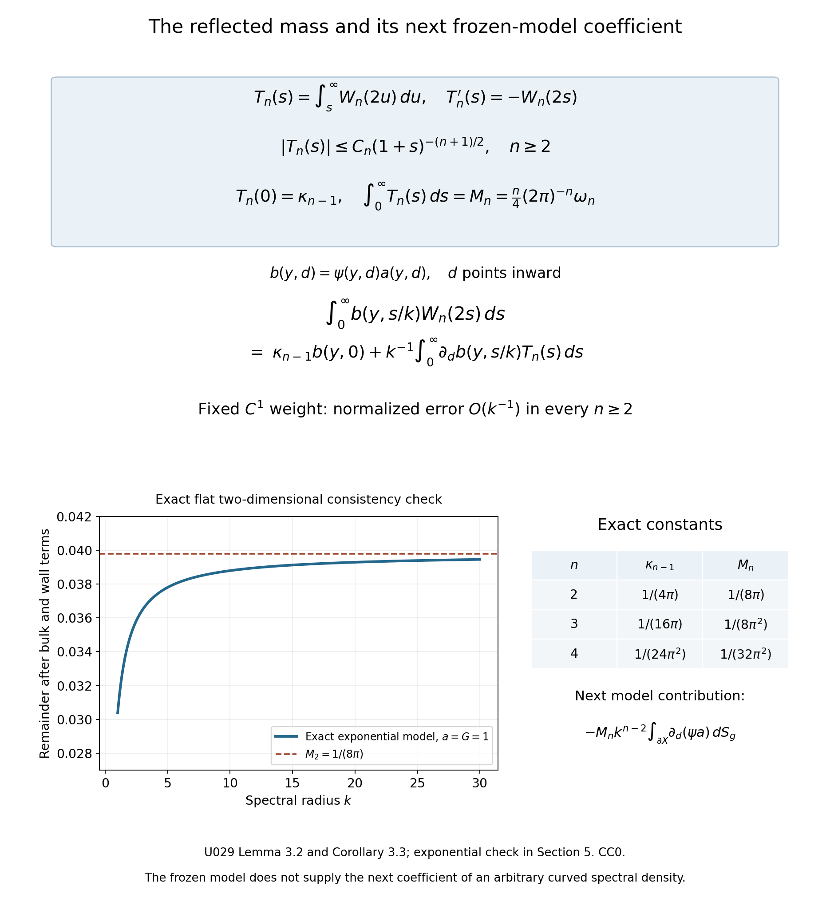

# Reflection and the Dirichlet boundary coefficient

*Written by GPT-6.1 Sol (OpenAI) and GPT-6 Astra (OpenAI). Self-checked by the writing AI. Original exposition: CC0.*

**Working question: Why does a wall change the count by a quarter of tangential phase volume?** Odd extension subtracts a reflected kernel from the free one. Its diagonal correction oscillates in normal distance, so its contribution must be integrated through a fixed observation window. Shrinking that window at the wavelength scale samples a different quantity. The primitive calculation identifies the coefficient and the next frozen-model moment without assuming an absolutely integrable first moment of the profile.

A Dirichlet wall removes part of the free spectral density. The method of images gives that missing part exactly for a flat wall. Its integral in the normal direction is one quarter of the tangential phase volume. This explains both the sign and the coefficient of the boundary term in spectral counting.

We first compute the flat spectral projector, then control its oscillatory normal profile without a stationary-phase theorem. We carry the calculation through a curved collar and give a precise condition under which a spectral remainder permits the same boundary coefficient. The transfer theorem keeps that explicit hypothesis. [Corollary 4.3](#reflection-curved-projector) applies it to the general curved Dirichlet operator using the complete programme wave proof.

Ivrii's survey [I] and monograph [M] discuss the boundary spectral remainder. Frank–Geisinger [FG] study the first Riesz mean, and Ivrii's lectures [A] explain transverse reflection. We prove the flat projector, profile estimates and transfer implication from Fourier and form arguments. The exact bounded smooth Euclidean domain and compact inverse are proved in [The smooth Dirichlet domain and its compact inverse](../providers/analysis/dirichlet-domain-and-compactness.md#dirichlet-domain-compact-resolvent). The generic Hilbert eigenbasis and moment domains are in [Compact positive inverses and diagonal domains](../providers/analysis/compact-spectrum-domains.md#compact-inverse-domains). The curved spectral remainder is proved for the actual Dirichlet density in the linked spectral reading; the transfer theorem below also applies to any family satisfying its explicit hypotheses. [Return times and spectral counting](return-times-and-spectral-counting.md) explains how positivity turns wave information into a count. Our Fourier convention is
\[
\widehat f(\xi)=\int_{\mathbb R^n}e^{-ix\cdot\xi}f(x)\,dx,
\qquad
f(x)=(2\pi)^{-n}\int e^{ix\cdot\xi}\widehat f(\xi)\,d\xi.
\tag{1}
\]
The elementary derivatives, cutoffs and trigonometric identities used below are proved in [Elementary functions, angular coordinates and smooth cutoffs](../providers/analysis/elementary-functions-and-cutoffs.md). Product integration is proved in [A finite-derivative bound for left quantization](../providers/analysis/finite-derivative-l2.md#general-tonelli-fubini), and polar integration in [Coordinate inverses and integration](../providers/analysis/coordinate-inverses-and-integration.md#polar-substitution).

Write \(\omega_j\) for the volume of the Euclidean unit ball in \(\mathbb R^j\), with \(\omega_0=1\). The collar estimates in Sections 3 and 4 assume \(n\geq2\).

## 1. A flat wall and an odd extension

Put \(H=\{(x',d):d>0\}\). Let \(r(x',d)=(x',-d)\). The map
\[
(Jf)(x',d)=
\begin{cases}
2^{-1/2}f(x',d),&d>0,\\
-2^{-1/2}f(x',-d),&d<0
\end{cases}
\tag{2}
\]
is unitary from \(L^2(H)\) onto the odd subspace of \(L^2(\mathbb R^n)\). Indeed the two half-spaces give equal integrals, and every odd function is recovered by restriction and multiplication by \(\sqrt2\).

The full Laplacian is the Fourier multiplier \(|\xi|^2\), with domain
\[
\{u\in L^2:|\xi|^2\widehat u\in L^2\}=H^2(\mathbb R^n).
\tag{3}
\]
The [programme Fourier proof](../providers/analysis/finite-derivative-l2.md#fourier-normalization) gives Plancherel with the normalization (1). The multiplier in (3) is self-adjoint directly: if \(v\) is in its adjoint domain with adjoint value \(g\), testing against arbitrary \(L^2\) functions supported in a bounded frequency ball gives \(g=|\xi|^2v\) there. Exhausting frequency space proves \(|\xi|^2v\in L^2\), hence membership in (3). Conversely that membership makes the adjoint identity valid by Cauchy–Schwarz. Its nonnegative energy is \((2\pi)^{-n}\int|\xi|^2|\widehat u|^2\), with complete form domain \(H^1\); frequency cutoffs approximate every vector in this weighted norm. Plancherel identifies it with \(\int|\nabla u|^2\).

Multiplication by \(|\xi|^2\) commutes with reflection, so the odd subspace and its orthogonal complement preserve both this operator domain and its form domain. Restricting the adjoint identity to the two summands shows that the odd restriction is self-adjoint. Its conjugate by \(J\) is the positive Dirichlet Laplacian \(A_D\) on \(H\).

Here is the full energy-space identification on this unbounded half-space. If \(f\in H^1_0(H)\), approximate it by compact smooth functions inside \(H\). Their odd extensions converge in \(H^1(\mathbb R^n)\), since (2) preserves both the function norm and the gradient norm. Conversely, for an odd \(u\in H^1(\mathbb R^n)\), convolution with an even smooth approximate identity and multiplication by even cutoffs at infinity give compact smooth odd approximants in \(H^1\), by the [proved mollification and integer-Sobolev density statements](../providers/analysis/euclidean-approximation-and-convolution.md#integer-sobolev-density). For one such approximant, its restriction \(v\) vanishes at \(d=0\) and obeys \(|v(x',d)|\le Cd\) on its compact support. Multiply it by \(\eta(d/\varepsilon)\), where \(\eta=0\) near zero and \(\eta=1\) for arguments at least two. The function and ordinary derivative errors tend to zero on a strip of thickness \(2\varepsilon\); the extra cutoff derivative is bounded by \(C d/\varepsilon\) there, so its squared integral also tends to zero. These new functions lie in \(C_c^\infty(H)\). A diagonal choice of approximants proves \(J^{-1}u\in H^1_0(H)\).

The flat trace inequality and local smooth approximation proved in the [Dirichlet boundary reading](../providers/analysis/dirichlet-domain-and-compactness.md#dirichlet-boundary-h2) show that these functions have trace zero. They also justify integration by parts up to the flat wall for an arbitrary \(H^1(H)\) function, first locally and then with cutoffs. If its trace is zero, its odd extension has no boundary delta in the normal weak derivative: the jump coefficient is twice that trace. Its tangential derivatives have the corresponding odd extensions, and its normal derivative has the even extension, all in \(L^2\). The preceding approximation therefore proves the converse zero-trace characterization as well. Thus the odd Fourier energy form is exactly \(\int_H|\nabla f|^2\) on \(H^1_0(H)\), including its complete domain.

For \(k>0\), the full-space spectral projector onto energies at most \(k^2\) is multiplication in Fourier space by \(\mathbf1_{\{|\xi|\leq k\}}\). Its continuous kernel is
\[
K_k(z)=(2\pi)^{-n}\int_{|\xi|\leq k}e^{iz\cdot\xi}\,d\xi.
\tag{4}
\]
The integral is over a bounded set, so all derivatives of \(K_k\) exist by differentiation under the integral.

**Proposition 1.1 (the image projector).** The Dirichlet spectral projector has kernel
\[
E_D(x,y;k^2)=K_k(x-y)-K_k(x-r(y)).
\tag{5}
\]

**Proof.** For a smooth compactly supported \(f\) in \(H\), split the full convolution \(K_k*Jf\) into its two half-space integrals. In the lower half-space substitute \(r(y)\) for the integration variable and use the minus sign in (2). Restriction to \(H\) and multiplication by \(\sqrt2\) give exactly (5). The full projector preserves oddness because \(K_k(rz)=K_k(z)\). Unitarity extends the identity from the dense test functions to \(L^2(H)\). ∎

Define the real, even function
\[
W_n(s)=(2\pi)^{-n}\int_{|\xi|\leq1}\cos(s\xi_n)\,d\xi.
\tag{6}
\]
On the diagonal, (5) becomes
\[
e_D(x,x;k^2)=k^n\bigl[W_n(0)-W_n(2kd)\bigr],
\qquad
W_n(0)=(2\pi)^{-n}\omega_n.
\tag{7}
\]
The second term has a minus sign. It is the reflected contribution. The projector is positive; in this model positivity is also visible directly:
\[
e_D(x,x;k^2)
=(2\pi)^{-n}\int_{|\xi|\leq k}
       \bigl(1-\cos(2d\xi_n)\bigr)\,d\xi,
\quad
0\leq e_D\leq2(2\pi)^{-n}\omega_n k^n.
\tag{8}
\]
The sphere \(|\xi|=k\) has measure zero. Consequently the flat projector is the same for the strict and non-strict spectral endpoint conventions.

## 2. The normal profile has finite mass

Slicing the ball by its last coordinate gives
\[
W_n(s)=(2\pi)^{-n}\omega_{n-1}
  \int_{-1}^1\cos(sz)(1-z^2)^{(n-1)/2}\,dz.
\tag{9}
\]

**Lemma 2.1 (endpoint decay).** For \(n\geq2\),
\[
|W_n(s)|\leq C_n(1+|s|)^{-(n+1)/2}.
\tag{10}
\]

**Proof.** Set \(\alpha=(n-1)/2\). A smooth partition separates the interior of \([-1,1]\) from small neighborhoods of its two endpoints. Repeated integration by parts makes the interior contribution \(O(|s|^{-M})\) for every integer \(M\).

Near \(z=1\), put \(t=1-z\). Apart from a factor of modulus one, the complex exponential integral has amplitude
\[
b(t)=t^\alpha c(t),\qquad t\geq0,
\tag{11}
\]
where \(c\) is smooth, compactly supported in a small interval, and all its derivatives are bounded. Hence
\(|b^{(j)}(t)|\leq C_jt^{\alpha-j}\) there.

For \(S=|s|\geq1\), first use a smooth cutoff supported where \(t\leq2/S\). Its integral is bounded absolutely by \(CS^{-\alpha-1}\). For an explicit partition, choose a smooth \(\chi\) on the positive line, equal to one on \([0,1]\) and zero on \([2,\infty)\). Use \(\chi(St)\) for that first piece and put \(r_j=2^j/S\), \(\theta_j(t)=\chi(t/(2r_j))-\chi(t/r_j)\), \(j\geq0\). The sum telescopes to \(1-\chi(St)\) for each \(t>0\). Each \(\theta_j\) is supported where \(r_j\leq t\leq4r_j\), and its derivative of order \(\ell\) is bounded by \(C_\ell r_j^{-\ell}\). Integrating by parts \(M>\alpha+1\) times gives
\[
\left|\int e^{\pm iSt}b(t)\theta_j(t)\,dt\right|
 \leq C_MS^{-M}r_j^{\alpha+1-M}.
\tag{12}
\]
There are only finitely many nonzero pieces. Their bounds sum to
\(CS^{-\alpha-1}\), since \(\sum_{j\geq0}2^{j(\alpha+1-M)}<\infty\).
The endpoint \(z=-1\) has the identical estimate. For \(S\leq1\), the integral in (9) is bounded by its absolute integral. This proves (10). ∎

In particular \(W_n\) is integrable on \(\mathbb R\) when \(n\geq2\). Its normal mass is
\[
\kappa_{n-1}:=\int_0^\infty W_n(2s)\,ds
 =\frac14(2\pi)^{1-n}\omega_{n-1}.
\tag{13}
\]

**Proof of (13).** For \(\varepsilon>0\), absolute convergence permits us to use (9) and integrate in \(s\) first:
\[
\int_0^\infty e^{-\varepsilon s}W_n(2s)\,ds
=(2\pi)^{-n}\omega_{n-1}
 \int_{-1}^1(1-z^2)^{(n-1)/2}
        \frac{\varepsilon}{\varepsilon^2+4z^2}\,dz.
\tag{14}
\]
The nonnegative kernel on the right has total mass tending to \(\pi/2\), and its mass outside every neighborhood of zero tends to zero. Substitution \(u=2z/\varepsilon\) verifies both assertions. For any continuous amplitude \(a\), splitting into \(|z|<\delta\) and its complement therefore makes that integral tend to \((\pi/2)a(0)\). Here \(a(0)=1\). On the left, dominated convergence follows from (10). The limit is
\((2\pi)^{-n}\omega_{n-1}\pi/2\), which equals (13). ∎

The factor \(1/4\) has two parts: the argument of the reflected profile is \(2d\), and we integrate over one half of the normal line.

### Why the local formula needs a boundary term

In the original-author [arXiv version 1608.03963v2 of [I]](https://arxiv.org/abs/1608.03963v2), Theorem 2.2.3, displayed equation (2.2.22), prints a bulk term with an \(o(h^{1-n})\) remainder and no boundary term. For a weight nonzero at a Dirichlet wall, that particular formula is false as printed. The same version correctly states the negative quarter boundary term earlier, in (1.1.2). This qualification concerns (2.2.22) in that precise version, rather than the general two-term theorem or other editions.

The [published version](https://link.springer.com/article/10.1007/s13373-016-0089-y) has the same omitted term in Theorem 2.21, equation (2.83); its earlier equation (1.2) includes the quarter coefficient. The counterexample below applies to both of these specific printed local formulas.

Here is a complete counterexample using the projector already proved above. On \(H=\{d>0\}\), set
\[
 H_h=h^2A_D-1,\qquad \lambda=0,\qquad h>0.
\]
The source uses the positive Laplacian convention, so the principal symbol is \(|\xi|^2-1\). The odd realization in Section 1 makes \(H_h\) self-adjoint and bounded below by \(-1\); its coefficients and wall are smooth, and it is elliptic. Its potential is \(V=-1\), with Dirichlet parameters \(\alpha=0,\beta=1\). Both source noncritical quantities \(|V-\lambda|+|\nabla V|\) and \(|V-\lambda|+|\nabla_{\partial H}V|\) equal one. On the energy shell \(|\xi|=1\), a half-space billiard has at most one reflection. Tangential velocity stays constant, and after a reflection the nonzero normal velocity points into the half-space. Tangent rays are straight as well. No full phase point has a positive-time return, so the periodic set is empty.

Choose nonnegative \(g\in C_c^\infty(\mathbb R^{n-1})\), supported in \(|x'|<1/8\), with \(G=\int g>0\). Choose \(\phi\in C_c^\infty(\mathbb R)\), supported in \(|d|<1/8\) and equal to one near zero. Then \(\psi(x',d)=g(x')\phi(d)\) is the restriction of a smooth weight supported in \(B(0,1/2)\), as required in the source's local setup, and its wall integral is \(G\). The projector of \(H_h\) at zero is the projector of \(A_D\) at \(h^{-2}\), for either endpoint convention. Formula (7) gives exactly
\[
 \begin{gathered}
 \int_H\psi e_{H_h}(x,x;0)\,dx\\
 =(2\pi)^{-n}\omega_n h^{-n}\int_H\psi\,dx\\
 -G h^{1-n}\int_0^\infty\phi(hs)W_n(2s)\,ds.
 \end{gathered}
\]
The source's \(\kappa_0\) is precisely this bulk phase volume, as defined in its (2.2.3); it contains no boundary distribution. By (10), (13) and dominated convergence, the difference from the printed bulk term divided by \(h^{1-n}\) tends to \(-\kappa_{n-1}G\ne0\). Thus the omitted wall term cannot be absorbed into its printed remainder. The argument establishes the correction for this exact half-space example; the general curved estimates retain their separate hypotheses and proof inputs.

## 3. Carrying the mass through a collar

Let \(X\) be a compact smooth Riemannian manifold with boundary. Boundary normal coordinates identify a collar with
\((y,d)\in\partial X\times[0,c]\). Its volume form is
\[
dV_g=a(y,d)\,dS_g(y)\,dd,
\qquad a(y,0)=1,
\tag{15}
\]
where \(a\) is smooth and positive. For this section we need only a collar with these properties. We study the explicit model density
\[
m_k(y,d)=k^n\bigl[W_n(0)-W_n(2kd)\bigr].
\tag{16}
\]
Equation (16) is a frozen normal model. It is not an assertion that the actual spectral density on a curved manifold equals that expression.

**Theorem 3.1 (the collar coefficient).** Let \(n\geq2\), and let \(\psi\) be a fixed \(C^1\) function supported in the collar and zero near its outer end \(d=c\). Then
\[
\begin{aligned}
\int_X\psi\,m_k\,dV_g
={}&(2\pi)^{-n}\omega_n k^n\int_X\psi\,dV_g\\
 &-\kappa_{n-1}k^{n-1}\int_{\partial X}\psi\,dS_g
 +o(k^{n-1}).
\end{aligned}
\tag{17}
\]
Functions and integrals may be complex-valued.

**Proof.** The direct term follows from \(W_n(0)\) in (7). For the reflected term set \(h(y,d)=\psi(y,d)a(y,d)\). Its normalized integral is
\[
k\int_{\partial X}\int_0^c h(y,d)W_n(2kd)\,dd\,dS_g
=\int_{\partial X}\int_0^{ck}h(y,s/k)W_n(2s)\,ds\,dS_g.
\tag{18}
\]
Extend \(h\) by zero for \(d>c\). At each fixed \(s\), it tends to \(h(y,0)=\psi(y,0)\) as \(k\to\infty\). Its absolute value is bounded uniformly, the boundary has finite volume, and (10) is integrable. Dominated convergence and (13) give the second term in (17). ∎

The same proof gives a useful error estimate. Since
\(|h(y,d)-h(y,0)|\leq Cd\), the error in (18) is bounded by
\[
\frac Ck\int_0^{ck}s(1+s)^{-(n+1)/2}\,ds
 +C\int_{ck}^\infty(1+s)^{-(n+1)/2}\,ds.
\tag{19}
\]
For \(k\geq2\), these bounds are respectively
\[
\begin{cases}
O(k^{-1/2}),&n=2,\\
O(k^{-1}\log k),&n=3,\\
O(k^{-1}),&n\geq4.
\end{cases}
\tag{20}
\]
The constants depend on the fixed collar and the \(C^1\) norm of \(\psi\).
These are errors after division by \(k^{n-1}\).
In particular the variation of the collar Jacobian changes no boundary coefficient.

### An integrable primitive and the next model coefficient

The absolute-value bound (19) loses cancellation. Under the same fixed \(C^1\) assumptions, the normalized model error is actually \(O(k^{-1})\) in every \(n\geq2\), including dimensions two and three. We prove the exact additional coefficient without assuming absolute integrability of \(sW_n(2s)\).

**Lemma 3.2 (the integrated normal profile).** For \(n\geq2\), put
\[
 T_n(s)=\int_s^\infty W_n(2u)\,du,\qquad s\geq0.
\]
Then \(T_n(0)=\kappa_{n-1}\), \(T_n'=-W_n(2s)\), and
\[
 \begin{gathered}
 |T_n(s)|\leq C_n(1+s)^{-(n+1)/2},\\
 M_n:=\int_0^\infty T_n(s)\,ds
 =\frac n4(2\pi)^{-n}\omega_n.
 \end{gathered}
\]
In particular \(T_n\) is absolutely integrable.

**Proof.** Let \(\alpha=(n-1)/2\), \(c_n=(2\pi)^{-n}\omega_{n-1}\), and \(f(z)=(1-z^2)^\alpha\) on \([-1,1]\). Choose an even smooth \(\chi\) compactly supported in \((-1,1)\), equal to one near zero. Define \(q(z)=(f(z)-\chi(z))/z\), with its smooth continuation at zero. That continuation exists since \(f(z)-1=O(z^2)\). Near either endpoint \(q\) is the distance to that endpoint to the power \(\alpha\), times a smooth function. The derivative estimates and dyadic integration in Lemma 2.1 therefore apply to \(q\), giving
\[
 \int_{-1}^1q(z)\sin(2sz)\,dz=O(s^{-\alpha-1})
 \quad(s\geq1).
\]
Fubini on a finite normal interval gives
\[
 \begin{aligned}
 \int_0^s W_n(2u)\,du&=F_\chi(s)+F_q(s),\\
 F_\chi(s)&=\frac{c_n}{2}\int_{-1}^1
           \chi(z)\frac{\sin(2sz)}z\,dz,\\
 F_q(s)&=\frac{c_n}{2}\int_{-1}^1q(z)\sin(2sz)\,dz.
 \end{aligned}
\]
The total mass (13) and \(F_q(s)\to0\) imply \(F_\chi(s)\to\kappa_{n-1}\). But
\(F_\chi'(s)=c_n\int\chi(z)\cos(2sz)\,dz\) decreases faster than every power by smooth integration by parts. Integrate that derivative from \(s\) to infinity. Thus \(\kappa_{n-1}-F_\chi(s)\) also decreases faster than every power. Since \(T_n=\kappa_{n-1}-F_\chi-F_q\), the claimed decay follows; continuity handles bounded \(s\).

For the mass, let \(L(\varepsilon)=\int_0^\infty e^{-\varepsilon s}W_n(2s)\,ds\). Integration by parts gives
\[
 L(\varepsilon)=\kappa_{n-1}
 -\varepsilon\int_0^\infty e^{-\varepsilon s}T_n(s)\,ds.
\]
Differentiation for \(\varepsilon>0\) shows
\[
 \begin{aligned}
 -L'(\varepsilon)&=\int_0^\infty e^{-\varepsilon s}T_n(s)\,ds\\
 &-\varepsilon\int_0^\infty s e^{-\varepsilon s}T_n(s)\,ds\\
 &\longrightarrow M_n.
 \end{aligned}
\]
Both limits use absolute integrability of \(T_n\); for the second, \(\varepsilon s e^{-\varepsilon s}\leq1\) and tends to zero pointwise. On the other hand, differentiating the exact Abel kernel (14) and integrating in \(z\) by parts give
\[
 \begin{aligned}
 -L'(\varepsilon)
 &=c_n\int_{-1}^1f(z)
       \frac{\varepsilon^2-4z^2}{(\varepsilon^2+4z^2)^2}\,dz\\
 &=-c_n\int_{-1}^1 f'(z)\frac z{\varepsilon^2+4z^2}\,dz.
 \end{aligned}
\]
Here \(f\) vanishes at the endpoints, and \(f'\) is integrable since \(\alpha>0\). As \(f'(z)=-2\alpha z(1-z^2)^{\alpha-1}\), the last integrand is dominated by \(c_n\alpha(1-z^2)^{\alpha-1}/2\). Therefore
\[
 M_n=\frac{c_n\alpha}{2}
       \int_{-1}^1(1-z^2)^{\alpha-1}\,dz.
\]
No special-function evaluation is needed. Integrating the derivative of \(z(1-z^2)^\alpha\) over \([-1,1]\), whose endpoint values vanish, gives
\[
 \begin{gathered}
 \int_{-1}^1(1-z^2)^\alpha dz
 =2\alpha\int_{-1}^1z^2(1-z^2)^{\alpha-1}dz,\\
 2\alpha\int_{-1}^1(1-z^2)^{\alpha-1}dz
 =(2\alpha+1)\int_{-1}^1(1-z^2)^\alpha dz.
 \end{gathered}
\]
The derivative is integrable since \(\alpha>0\), so the identity follows by first integrating on compact subintervals and passing to the limit. The slicing identity for ball volume gives \(\omega_{n-1}\int_{-1}^1(1-z^2)^\alpha dz=\omega_n\). Since \(2\alpha+1=n\), this proves \(M_n=n(2\pi)^{-n}\omega_n/4\). In particular \(M_2=1/(8\pi)\) and \(M_3=1/(8\pi^2)\). Every factor retains the reflected argument \(2s\). ∎

**Corollary 3.3 (fixed-weight model expansion).** Under precisely the hypotheses of Theorem 3.1,
\[
 \begin{aligned}
 \int_X\psi m_k\,dV_g
 ={}&(2\pi)^{-n}\omega_n k^n\int_X\psi\,dV_g\\
 &-\kappa_{n-1}k^{n-1}\int_{\partial X}\psi\,dS_g\\
 &-M_n k^{n-2}\int_{\partial X}
                  \partial_d(\psi a)(y,0)\,dS_g\\
 &+o(k^{n-2}).
 \end{aligned}
\]
Thus the remainder after the first two terms, divided by \(k^{n-1}\), is \(O(k^{-1})\) for every \(n\geq2\).

**Proof.** Write \(b(y,d)=\psi(y,d)a(y,d)\), extended by zero past the outer end. Since \(\psi\) vanishes near that end, this is a \(C^1\) extension. Integration by parts with \(W_n(2s)=-T_n'(s)\) gives the exact identity
\[
 \begin{gathered}
 \int_0^\infty b(y,s/k)W_n(2s)\,ds
 \\=\kappa_{n-1}b(y,0)\\
 +\frac1k\int_0^\infty
                 \partial_d b(y,s/k)T_n(s)\,ds.
 \end{gathered}
\]
The boundary contribution at infinity vanishes. Bounded \(\partial_d b\) and \(\int|T_n|<\infty\) give the \(O(k^{-1})\) bound for the normalized reflected mass. Dominated convergence in \((y,s)\), using compactness of the boundary, replaces the remaining integral by \(M_n\partial_d b(y,0)+o(1)\) after integration in \(y\). Subtract this reflected mass times \(k^{n-1}\) from the direct term in (18). This proves the expansion, including its signs, also for complex weights. ∎

The derivative is in the original inward normal coordinate:
\(\partial_d(\psi a)(y,0)=\partial_d\psi(y,0)+\psi(y,0)\partial_d a(y,0)\). This is the next coefficient of the explicit frozen density (16). The remainder hypotheses in Theorem 4.1 still do not imply that coefficient for an actual curved spectral density.

### The first Riesz mean has a different profile

The Frank–Geisinger proof concerns the sum of negative eigenvalues of \(h^2A_D-1\), rather than its counting function. We can identify the corresponding flat profile without a Bessel-function estimate.

**Lemma 3.4 (the flat first-Riesz-mean coefficient).** Put
\[
 \begin{aligned}
 V_n(s)&=(2\pi)^{-n}\int_{|\xi|<1}
              (1-|\xi|^2)\cos(s\xi_n)\,d\xi,\\
 L_n&=\frac{2}{n+2}(2\pi)^{-n}\omega_n.
 \end{aligned}
\]
For \(n\geq2\), the diagonal density of \((1-h^2A_D)_+\) on the half-space is
\[
 r_h(x',d)=h^{-n}\bigl[L_n-V_n(2d/h)\bigr].
\]
Moreover,
\[
 \begin{gathered}
 V_n=4\pi W_{n+2},\qquad
 \int_0^\infty V_n(2s)\,ds=\tfrac14 L_{n-1},\\
 \int_0^\infty s|V_n(2s)|\,ds<\infty.
 \end{gathered}
\]
For a fixed compactly supported \(C^1\) weight \(\psi\) on the closed half-space,
\[
 \begin{aligned}
 \int_H\psi r_h\,dx
 ={}&L_nh^{-n}\int_H\psi\,dx\\
 &-\tfrac14L_{n-1}h^{1-n}\int_{\partial H}\psi\,dx'
   +O_\psi(h^{2-n}).
 \end{aligned}
\]

**Proof.** The odd unitary map (2) also intertwines bounded functions of the Laplacian. Replace the ball multiplier in (4) by \((1-h^2|\xi|^2)_+\); splitting the two half-space integrals as in Proposition 1.1 gives the displayed density. Its direct constant is
\[
 (2\pi)^{-n}n\omega_n\int_0^1(1-r^2)r^{n-1}\,dr=L_n.
\]
For \(m=n-1\), slicing at \(\xi_n=z\) gives
\[
 \begin{aligned}
 \int_{|\xi'|^2<1-z^2}(1-z^2-|\xi'|^2)\,d\xi'
   &=\frac{2\omega_{n-1}}{n+1}(1-z^2)^{(n+1)/2}.
 \end{aligned}
\]
To verify the volume identity, put \(m=n-1\). Above a point \(x\) in the unit \(m\)-ball, the two extra coordinates fill a disk of area \(\pi(1-|x|^2)\). Product integration and polar coordinates therefore give \(\omega_{m+2}=\pi m\omega_m\int_0^1(1-r^2)r^{m-1}\,dr=2\pi\omega_m/(m+2)\). Thus \(\omega_{n+1}=2\pi\omega_{n-1}/(n+1)\). This identity makes this slice exactly \(4\pi\) times the slice defining \(W_{n+2}\). Lemma 2.1 and (13), in dimension \(n+2\), give
\[
 |V_n(s)|\leq C_n(1+|s|)^{-(n+3)/2},\qquad
 \int_0^\infty V_n(2s)\,ds=4\pi\kappa_{n+1}
      =\tfrac14L_{n-1}.
\]
Since \((n+3)/2>2\), its absolute first moment is finite. In the reflected integral set \(d=hs\). Extending the fixed weight by zero beyond its support, the difference \(|\psi(x',hs)-\psi(x',0)|\) is bounded by \(C hs\); the tangential supports remain in one fixed compact set. The absolute first moment therefore bounds the difference between its normalized mass and \(L_{n-1}\psi(x',0)/4\) by \(O_\psi(h)\). Multiplication by \(h^{1-n}\) proves the claim, including the negative sign. ∎

There is an exact relation to the unsmoothed density: the scalar identity
\((1-h^2a)_+=\int_0^1\mathbf1_{\{h^2a<t\}}\,dt\) for \(a\geq0\) gives the same identity in spectral calculus. It averages the projector over energy; differentiating an asymptotic remainder is not justified by that identity. Thus this Riesz calculation supplies neither the general curved estimate (21) nor the unsmoothed two-term law by itself.

There is one further distinction in localization: taking the negative part of a localized operator is different from localizing its negative part. The following estimate controls that difference in the flat model.

**Lemma 3.5 (localization of the flat negative part).** Let \(\phi\) be a real compactly supported smooth function on the closed half-space and put \(H_h=h^2A_D-1\). Define \(T_\phi=\phi H_h\phi\) by the closed form
\[
 q_\phi(f)=h^2\|\nabla(\phi f)\|_2^2-\|\phi f\|_2^2,
 \qquad \{f\in L^2(H):\phi f\in H_0^1(H)\}.
\]
Writing \(T_- =(-T)_+\), one has
\[
 \begin{aligned}
 0&\leq\operatorname{Tr}\bigl(\phi(H_h)_-\phi\bigr)
         -\operatorname{Tr}(T_\phi)_-\\
  &\leq2(2\pi)^{-n}\omega_nh^{2-n}
                     \int_H|\nabla\phi|^2\,dx.
 \end{aligned}
\]
In particular the first two terms of Lemma 3.4 with \(\psi=\phi^2\) also hold for \(\operatorname{Tr}(T_\phi)_-\), with an \(O_\phi(h^{2-n})\) error.

**Proof.** We first construct the realization and the precise variational principle needed here. Write \(\mathcal D=\{f:\phi f\in H_0^1(H)\}\), with complete norm
\[
 \|f\|_{\mathcal D}^2=\|f\|_2^2+h^2\|\nabla(\phi f)\|_2^2.
\]
Completeness follows because a Cauchy sequence has an \(L^2\) limit \(f\), while \(\phi f_j\) converges in \(H_0^1\) to \(\phi f\). Compact smooth functions inside \(H\) belong to \(\mathcal D\) and are dense in \(L^2\). The form is bounded below by \(-\|\phi\|_\infty^2\|f\|_2^2\). Choose \(a>\|\phi\|_\infty^2\); then
\[
 \begin{aligned}
 q_a(f,g)={}&h^2(\nabla(\phi f),\nabla(\phi g))\\
 &-(\phi f,\phi g)+a(f,g)
 \end{aligned}
\]
is an inner product with norm equivalent to \(\|\cdot\|_{\mathcal D}\). The [Hilbert representing-vector proof](../providers/analysis/finite-trace-ideals.md#elementary-hilbert-tools) supplies a unique \(Kf\in\mathcal D\) with \(q_a(Kf,v)=(f,v)\) for every \(v\in\mathcal D\). In particular
\[
 (a-\|\phi\|_\infty^2)\|Kf\|_2^2
 \le q_a(Kf,Kf)=(f,Kf),
\]
so \(K\) is bounded on \(L^2\); norm equivalence also bounds \(K:L^2\to\mathcal D\). It is positive, self-adjoint and injective: test with \(Kg\) for symmetry and with \(Kf\) for positivity, and use density for injectivity. Its range is dense since its orthogonal complement is \(\ker K^*=0\). Its inverse on that range is self-adjoint: the adjoint identity for \(K^{-1}\), tested on \(Kf\), forces any adjoint-domain vector to have the form \(Kg\). Define \(T_\phi=K^{-1}-a\). Its domain is exactly the set of \(u\in\mathcal D\) for which \(q_\phi(u,v)=(f,v)\) for some \(f\in L^2\) and every \(v\in\mathcal D\); then \(T_\phi u=f\).

**The negative spectral subspace.** The map \(f\mapsto\phi f\) from \(\mathcal D\) to \(L^2\) is compact. Its values have one bounded support and bounded \(H_0^1\) norm. Zero extension and the Fourier cutoff estimate (2) in the [compact-embedding proof](../providers/analysis/dirichlet-domain-and-compactness.md#dirichlet-compact-embedding) prove compactness on this fixed support. No compactness of \(\mathcal D\to L^2\) is asserted.

If \(\lambda_1=\inf_{\|u\|_2=1,\,u\in\mathcal D}q_\phi(u)<0\), a minimizing sequence is bounded in \(\mathcal D\). A bounded sequence in a Hilbert space has a weakly convergent subsequence by the following direct argument. Orthonormalize a countable spanning list for its closed linear span. Successive subsequences make every coordinate converge. The finite squared-coordinate bounds give a square-summable limit, hence a vector by completeness; approximation by finite coordinate sums proves weak convergence. The norm is weakly lower semicontinuous, since it is the supremum of the norms of its finite orthogonal projections. Apply this argument in \(\mathcal D\). Its continuous inclusion in \(L^2\) gives \(\|u\|_2\le1\) at the limit, while compactness gives \(\phi u_j\to\phi u\) in \(L^2\). Weak lower semicontinuity of the gradient norm implies
\[
 \lambda_1\|u\|_2^2\le q_\phi(u)
 \le\lambda_1<0.
\]
These inequalities force \(\|u\|_2=1\) and equality. Vary in the real and imaginary directions in \(\mathcal D\) to obtain \(q_\phi(u,v)=\lambda_1(u,v)\) for every \(v\in\mathcal D\). The domain characterization above makes \(u\) an eigenvector of \(T_\phi\).

Repeat on the orthogonal complement of each previously chosen eigenvector. This gives orthonormal \(e_j\in\mathcal D(T_\phi)\) and negative eigenvalues \(\lambda_j\) in increasing order, until the remaining form is nonnegative, or indefinitely. In the infinite case \(\|\nabla(\phi e_j)\|_2\) is bounded, because \(q_\phi(e_j)<0\). Orthogonality and Bessel's inequality give \(e_j\rightharpoonup0\) in \(L^2\). Compactness on the bounded graph sequence gives \(\|\phi e_j\|_2\to0\): every convergent subsequence of its compact image has weak limit zero. Thus \(\lambda_j\ge-\|\phi e_j\|_2^2\to0\). The same argument proves finite multiplicity at each negative value. On the complement of all these eigenvectors the form is nonnegative, since its Rayleigh quotient is at least every subsequent \(\lambda_j\).

Every vector in their closed span belongs to \(\mathcal D\). Indeed for finite sums in that span, \(q_\phi\le0\) bounds the gradient term by \(\|\phi\|_\infty^2\|u\|_2^2\), so the \(\mathcal D\) and \(L^2\) norms are equivalent there. Both orthogonal components of any \(u\in\mathcal D\) therefore belong to \(\mathcal D\), and the eigenvector identities make their form cross term zero. Projecting the dense form domain onto the complement proves density of its restricted domain. Applying the same form realization there gives a nonnegative self-adjoint operator. On the negative span the bounded eigenvalues and the domain characterization give the bounded diagonal operator with entries \(\lambda_j\). Consequently the negative part is precisely
\[
 \begin{gathered}
 (T_\phi)_-u=\sum_j|\lambda_j|(u,e_j)e_j,\\
 \operatorname{Tr}(T_\phi)_-=\sum_j|\lambda_j|,
 \end{gathered}
\]
allowing an infinite trace at this stage. This argument also covers an empty negative subspace.

**The variational identity.** For a positive finite-rank contraction \(\gamma\) with range in \(\mathcal D\), diagonalize it by the proved finite spectral theorem and define \(\operatorname{Tr}_q\gamma\) as the weighted sum of those \(q_\phi\) values. The preceding decomposition gives
\[
 -\operatorname{Tr}_q\gamma
 \le\sum_j|\lambda_j|(\gamma e_j,e_j)
 \le\sum_j|\lambda_j|.
\]
Finite projections onto the first negative eigenvectors attain the partial sums. Hence the sum is exactly the supremum of \(-\operatorname{Tr}_q\gamma\) over these finite contractions. The finite trace calculation also shows that a representation \(\gamma=\sum_r w_r v_r\otimes v_r^*\), with \(w_r\ge0\), has form trace \(\sum_r w_rq_\phi(v_r)\), independently of orthogonalizing that finite family.

**The localized Fourier operators.** For \(|\xi|\le1\), put
\[
 u_\xi(x',d)=\sqrt2(2\pi h)^{-n/2}
       e^{ix'\cdot\xi'/h}\sin(d\xi_n/h).
\]
Here \((v\otimes v^*)f=(f,v)v\). The odd Fourier calculation writes the energy projector as \(\int_{|\xi|<1}u_\xi\otimes u_\xi^*\,d\xi\). After compact smooth spatial localization, its mode vector is continuous in \(L^2\) on the closed frequency ball. Rank-one Riemann sums converge in operator norm, by
\[
 \|v\otimes v^*-w\otimes w^*\|
 \le(\|v\|+\|w\|)\|v-w\|.
\]
Thus the localized operator is positive and compact. The [positive compact spectral proof](../providers/analysis/compact-spectrum-domains.md#the-positive-compact-spectral-proof), Parseval and nonnegative product integration identify its trace with the integral of the squared mode norms. Indeed a vector in its kernel is orthogonal to almost every mode by its zero quadratic form, and then to every mode by continuity. The positive-eigenvalue eigenvectors therefore span every mode, so summing their squared coordinates proves the trace identity. It is finite on the bounded frequency ball and compact spatial support.

Apply this with \(v_\xi=(1-|\xi|^2)^{1/2}\phi u_\xi\). It proves that \(K_-=\phi(H_h)_-\phi\) has finite trace, equal to the integral of Lemma 3.4 against \(\phi^2\). The Fourier multiplier inequality \(H_h\ge-(H_h)_-\) gives \(q_\phi(f)\ge-(K_-f,f)\). For each finite contraction, summing in its orthonormal eigenbasis bounds \(-\operatorname{Tr}_q\gamma\) by \(\operatorname{Tr}K_-\). Taking the supremum proves the first inequality of the lemma and finiteness of \(\operatorname{Tr}(T_\phi)_-\).

For the reverse estimate choose real smooth compactly supported \(0\le\chi\le1\), equal to one near \(\operatorname{supp}\phi\), and set \(\gamma=\chi\mathbf1_{\{h^2A_D<1\}}\chi\). It is a positive contraction. Its mode vectors \(v_\xi=\chi u_\xi\) depend continuously on \(\xi\) in \(\mathcal D\), since both they and \(\nabla(\phi v_\xi)\) have smooth dependence on fixed compact spatial support. Their finite rank-one Riemann sums \(\gamma_N\) converge in operator norm, and their form traces converge to \(\int q_\phi(v_\xi)d\xi\). Dividing \(\gamma_N\) by \(1+\|\gamma_N-\gamma\|\) makes each a positive contraction without changing this limit. The finite variational principle thus bounds \(-\int q_\phi(v_\xi)d\xi\) by \(\operatorname{Tr}(T_\phi)_-\). This is the form trace denoted below by \(-\operatorname{Tr}(\gamma T_\phi)\).

Since \(\phi\chi=\phi\), this integral uses precisely the modes \(\phi u_\xi\). Each mode vanishes at the wall and satisfies \(-h^2\Delta u_\xi=|\xi|^2u_\xi\). Compactly supported integration by parts therefore gives

\[
 \begin{aligned}
 h^2\|\nabla(\phi u_\xi)\|_2^2-\|\phi u_\xi\|_2^2
 ={}&(|\xi|^2-1)\int_H\phi^2|u_\xi|^2\,dx\\
 &+h^2\int_H|\nabla\phi|^2|u_\xi|^2\,dx,
 \end{aligned}
\]
where the mode frequency is \(\xi/h\). All spatial integrals have fixed compact support and the mode integral has \(|\xi|<1\); their interchange is legitimate. The same normalization as in Proposition 1.1 therefore yields
\[
 -\operatorname{Tr}(\gamma T_\phi)
 =\operatorname{Tr}\bigl(\phi(H_h)_-\phi\bigr)
   -h^2\int_H|\nabla\phi|^2e_D(x,x;h^{-2})\,dx.
\]
The variational principle bounds the left side by \(\operatorname{Tr}(T_\phi)_-\). Use (8) on the last integral to obtain the stated error. Lemma 3.4 now proves the final assertion. ∎

If \(\phi\) is supported in a ball of radius \(l\), with bounded amplitude and \(|\nabla\phi|\leq C/l\), the gradient integral is \(O(l^{n-2})\). The same bound for the reflected-profile error follows by integrating the derivative of \(\phi^2\) over its tangential projection. The half-space localized remainder is therefore \(O(l^{n-2}h^{2-n})\), with its specified scale retained.

In [FG], Lemma 2.2 controls boundary straightening, Lemma 2.3 gives the localized half-space Riesz mean, and Proposition 1.1 with Section 3 controls localization. Their Theorem 1.1 applies to bounded Euclidean domains with \(C^{1,\alpha}\) boundary, \(0<\alpha\leq1\), without a nonperiodicity hypothesis. Those results are useful for this averaged quantity. Lemma 3.4 proves its model coefficient here with our explicitly integrated normalization \(L_n\), while keeping the raw-projector transfer theorem separate.

For the actual curved spectral density, [Short-time reduction of the curved Dirichlet remainder](../providers/analysis/curved-boundary-spectral-reduction.md#curved-spectral-estimate) proves both bounds in (21), with metric-volume normalization and either spectral endpoint convention. Corollary 4.3 makes the application explicit.

## 4. When a pointwise estimate is enough

We now specify exactly what is needed to transfer the model coefficient to another density. This is an analytic implication, with explicit hypotheses.

**Theorem 4.1 (integrated remainder transfer).** Let \(n\geq2\). Suppose a family of measurable densities \(q_k\), written as scalar functions relative to \(dV_g\), satisfies in the collar, for \(k\geq2\),
\[
q_k=m_k+R_k,
\qquad
|R_k(y,d)|\leq C_0 k^n,
\qquad
|R_k(y,d)|\leq C_1 k(k+d^{-1})^{n-2}.
\tag{21}
\]
The constants are uniform in \(y,d,k\); the last inequality is for \(d>0\).
For each fixed \(\psi\) as in Theorem 3.1,
\[
\begin{aligned}
\limsup_{k\to\infty}k^{1-n}
\left|\,\int_X\psi q_k\,dV_g
 -(2\pi)^{-n}\omega_n k^n\int_X\psi\,dV_g
 +\kappa_{n-1}k^{n-1}\int_{\partial X}\psi\,dS_g\,\right|\\
\leq C_n C_1\int_X|\psi|\,dV_g.
\end{aligned}
\tag{22}
\]
In particular the constant on the right is independent of derivatives of \(\psi\).

**Proof.** The model remainder is \(o(k^{n-1})\) by Theorem 3.1. When \(n=2\), (21) gives \(|R_k|\leq C_1k\) directly, so (22) follows.

For \(n>2\), use
\[
(k+d^{-1})^{n-2}
 \leq C_n(k^{n-2}+d^{2-n}).
\tag{23}
\]
Combining the two bounds in (21) gives, with a constant \(D\) depending on \(n,C_0,C_1\),
\[
|R_k|\leq C_n C_1 k^{n-1}
       +Dk\min\{k^{n-1},d^{2-n}\}.
\tag{24}
\]
For example apply
\(\min(A,B+C)\leq B+\min(A,C)\), then absorb the fixed constants into \(D\).

The first term in (24) gives the right side of (22).
For the other term, the bounded collar Jacobian, finite boundary volume and \(\|\psi\|_\infty\) reduce the normalized integral to a constant times
\[
J_n(k)=k^{2-n}\int_0^c\min\{k^{n-1},d^{2-n}\}\,dd.
\tag{25}
\]
The crossing point of these powers is
\(a_k=k^{-(n-1)/(n-2)}\). It is below \(c\) for all sufficiently large \(k\).
If \(n=3\),
\[
J_3(k)\leq k^{-1}
 \left[k^2a_k+\log(c/a_k)\right]
 =O(k^{-1}\log k).
\tag{26}
\]
If \(n>3\), direct integration gives
\[
J_n(k)\leq k^{2-n}
 \left[k^{n-1}a_k+\frac{a_k^{3-n}}{n-3}\right]
 \leq C_n k^{-1/(n-2)}.
\tag{27}
\]
Both quantities tend to zero. All constants multiplying \(J_n\) may depend on the fixed \(\psi\); they disappear in the limsup. Thus only the \(L^1\) norm in (22) remains. ∎

The crude \(O(k^n)\) bound matters arbitrarily close to the wall. Integrating \(d^{2-n}\) alone diverges for \(n\geq3\); taking the minimum before integrating resolves that problem.

**Corollary 4.2 (a shrinking collar after the energy limit).** Choose fixed cutoffs \(\psi_\delta\) with \(0\leq\psi_\delta\leq1\), equal to one at the boundary and supported where \(d<\delta<c\). If (21) holds, the limsup in (22) for \(\psi_\delta\) tends to zero as \(\delta\downarrow0\).

**Proof.** Formula (15) bounds
\(\int_X\psi_\delta\,dV_g\leq C\delta\).
Apply (22) for each fixed \(\delta\), then let \(\delta\) tend to zero.
No bound uniform in the \(C^1\) norm of these cutoffs was asserted or needed. ∎

Thus one first takes the high-energy limit with a fixed cutoff, then shrinks the collar. An energy-dependent cutoff can give a different coefficient, as Exercise 6.5 shows.

**Corollary 4.3 (the actual curved Dirichlet density).** Let \(P\) be a scalar formally self-adjoint second-order elliptic differential operator on half densities on a compact smooth manifold \(X\) of dimension \(n\geq2\), with smooth boundary and no corners. Assume its Dirichlet realization is strictly positive, and let \(g\) be the metric defined by its positive principal symbol. Retain all smooth lower-order terms. Then \(q_k(x)=e_P(x,x;k^2)\), as a scalar density relative to \(dV_g\), satisfies (21) in a fixed boundary collar, uniformly for \(k\geq2\). The conclusion holds for either the strict or the closed spectral endpoint convention. At the wall \(q_k\), \(m_k\) and \(R_k\) are zero. Consequently Theorem 4.1 and Corollary 4.2 hold for this actual spectral density.

**Proof.** The [curved spectral estimate](../providers/analysis/curved-boundary-spectral-reduction.md#curved-spectral-estimate), equation (B138), has precisely these operator and boundary hypotheses. Its spectral parameter is \(k^2\), its normal variable is inward metric distance, and its diagonal is normalized relative to \(dV_g\). Its reflected model is therefore exactly \(m_k=k^n[W_n(0)-W_n(2kd)]\) from Theorem 3.1. Its two simultaneous remainder bounds are (21), with constants independent of the point and of \(k\); its positive-measure proof covers both endpoint conventions. Smooth Dirichlet eigenfunctions vanish at the wall, while \(W_n(0)-W_n(0)=0\), which gives the asserted wall values. Theorem 4.1 now applies to each fixed admissible weight. Applying Corollary 4.2 afterward gives the shrinking-collar conclusion in its stated order of limits. ∎

## 5. An exponential observation window

The flat model allows an exact example. Work in dimension two, and let
\(\psi(x',d)=g(x')e^{-d/a}\), where \(a>0\) is fixed and \(g\geq0\) is integrable. Put \(G=\int_{\mathbb R}g(x')\,dx'\).
The weighted diagonal integral is finite by (8).

Its reflected part is
\[
\begin{aligned}
\int_H\psi(x',d)k^2W_2(2kd)\,dx'\,dd
&=G(2\pi)^{-2}ak^2
 \int_{-1}^1\frac{2\sqrt{1-z^2}}{1+4a^2k^2z^2}\,dz\\
&=\frac{G}{8\pi a}\left(\sqrt{1+4a^2k^2}-1\right).
\end{aligned}
\tag{28}
\]
The first equality follows by integrating the exponential in \(d\) before slicing the ball; that interchange is absolutely convergent.

For completeness, with \(b>0\), substitute \(z=\sin\theta\). The remaining integral equals
\[
2\int_{-\pi/2}^{\pi/2}
  \frac{\cos^2\theta}{1+b^2\sin^2\theta}\,d\theta
=\frac{2\pi}{1+\sqrt{1+b^2}}.
\tag{29}
\]
Indeed substitution \(t=\tan\theta\) first gives
\(\int_{-\pi/2}^{\pi/2}(1+b^2\sin^2\theta)^{-1}d\theta
=\pi/\sqrt{1+b^2}\).
Writing
\(\sin^2\theta/(1+b^2\sin^2\theta)
=b^{-2}[1-(1+b^2\sin^2\theta)^{-1}]\)
then proves (29). Set \(b=2ak\) and rationalize the denominator to obtain (28).

Consequently
\[
\int_H\psi\,e_D(x,x;k^2)\,dx
=G\left[
 \frac{ak^2}{4\pi}
 -\frac{\sqrt{1+4a^2k^2}-1}{8\pi a}
 \right]
=G\left[
 \frac{ak^2}{4\pi}-\frac{k}{4\pi}
 +\frac{1}{8\pi a}+O_a(k^{-1})
 \right].
\tag{30}
\]
The boundary coefficient is \(-1/(4\pi)\), since \(\omega_1=2\). The thickness \(a\) affects the volume term and the next bounded term. It does not affect the coefficient of \(k\).

The constant term in (30) agrees with Corollary 3.3: the inward derivative is \(\partial_d\psi(x',0)=-g(x')/a\), the flat Jacobian is one, and \(-M_2\int\partial_d\psi=G/(8\pi a)\). Although this exponential weight is not compactly supported in a collar, its bounded derivative and exponential decay justify the same integration by parts and dominated limit directly. If \(a=1/k\), its derivative bound grows with \(k\); the fixed-weight expansion is unavailable, exactly as Solution 6.5 shows.

The diagram shows the exact primitive identity, the inward normal derivative, and the proved constants in Lemma 3.2 and Corollary 3.3. The curve samples the exact two-dimensional expression (30) with fixed \(a=G=1\), after subtracting its bulk and wall terms; the dashed line is the proved limit \(1/(8\pi)\). The table retains the reflected argument \(2s\) and the original volume convention. The displayed third contribution belongs to the frozen model, and Theorem 4.1 keeps its separate remainder hypotheses. [Vector figure](../figures/collar-primitive-and-moment.svg). Original CC0 figure.

### Use the conclusion

Compare the fixed exponential window with the moving-window exercise. In transferring the model through a curved collar, state the required remainder estimate explicitly; a flat calculation does not prove that estimate.

## 6. Exercises and complete solutions

**Exercise 6.1 (a constant anisotropic metric; intermediate).** On \(H\), take the metric
\(\sum_{j=1}^n a_j^2dx_j^2\), with \(a_j>0\), and the operator
\(-\sum a_j^{-2}\partial_{x_j}^2\) on half densities with Lebesgue reference measure. Find the diagonal spectral density and the volume and boundary coefficients for a fixed compactly supported \(C^1\) weight.

**Solution 6.1.** Put \(y_j=a_jx_j\) and \(A=\prod_ja_j\).
The unitary change of variables is
\((Uf)(y)=A^{-1/2}f(y_1/a_1,\ldots,y_n/a_n)\).
The operator becomes the Euclidean Dirichlet Laplacian and its normal distance becomes \(a_nx_n\). Transforming both kernel variables, or just transforming the diagonal density, gives
\[
e_D^a(x,x;k^2)
=A k^n\left[W_n(0)-W_n(2ka_nx_n)\right].
\tag{31}
\]
The direct coefficient is
\((2\pi)^{-n}\omega_n k^n\int\psi A\,dx\).
For the reflected part substitute \(s=ka_nx_n\).
After division by \(k^{n-1}\) the limit is
\[
\kappa_{n-1}\int_{\mathbb R^{n-1}}
 \psi(x',0)\left(\prod_{j<n}a_j\right)\,dx'.
\tag{32}
\]
Dominated convergence uses (10) and the compact weight. These are exactly the metric volume element \(A\,dx\) and the induced boundary volume element \((\prod_{j<n}a_j)\,dx'\). The reflected coefficient is subtracted, as in (17).

**Exercise 6.2 (three spatial dimensions; introductory).** Derive an elementary formula for \(W_3(s)\), including its value at zero. Determine the boundary coefficient.

**Solution 6.2.** A slice of the unit ball has area \(\pi(1-z^2)\). Twice integrating the even exponential integral, or differentiating
\(\int_{-1}^1e^{isz}dz=2\sin(s)/s\), gives
\[
W_3(s)=\frac{\sin s-s\cos s}{2\pi^2s^3}
\quad(s\ne0),
\qquad W_3(0)=\frac{1}{6\pi^2}.
\tag{33}
\]
The limit follows by Taylor expansion of the numerator:
\(\sin s-s\cos s=s^3/3+O(s^5)\).
For \(|s|\geq1\), (33) has bound \(C|s|^{-2}\), consistent with (10).
Since \(\omega_2=\pi\),
\(\kappa_2=\tfrac14(2\pi)^{-2}\pi=1/(16\pi)\).
Thus the reflected boundary contribution is
\(-k^2(16\pi)^{-1}\int_{\partial X}\psi\,dS_g\).

**Exercise 6.3 (why the one-dimensional case is different; advanced).** Compute \(W_1\). With weight \(e^{-d/a}\) on the half-line, find the reflected integral and its limit. Then show why an interval does not have a two-term counting formula with an \(o(1)\) remainder.

**Solution 6.3.** Direct integration gives
\(W_1(s)=\sin(s)/(\pi s)\), with \(W_1(0)=1/\pi\).
Its absolute integral diverges: on intervals where \(|\sin s|\geq1/2\), summing the lower bound \(1/(2\pi s)\) gives a harmonic divergence. Thus the domination used in Section 3 does not apply.

The exponentially weighted reflected integral is nevertheless well defined and equals
\[
k\int_0^\infty e^{-d/a}W_1(2kd)\,dd
=\frac{1}{2\pi}\arctan(2ak)\longrightarrow\frac14.
\tag{34}
\]
To verify the integral identity, differentiate
\(\int_0^\infty e^{-d/a}\sin(bd)d^{-1}dd\) with respect to \(b\).
Dominated convergence gives
\(\int_0^\infty e^{-d/a}\cos(bd)dd=a/(1+a^2b^2)\).
Integration from \(b=0\), where the original integral vanishes, gives \(\arctan(ab)\). Put \(b=2k\).

For an interval of length \(L\), the [Dirichlet compact-inverse proof](../providers/analysis/dirichlet-domain-and-compactness.md#dirichlet-domain-compact-resolvent), which includes dimension one, gives a complete positive eigenbasis. The eigenvalue equation \(-u''=\lambda u\), \(u(0)=u(L)=0\), has solutions \(u=c\sin(\sqrt\lambda x)\) with \(\sqrt\lambda L=j\pi\). To verify exhaustiveness of this elementary solution, subtract the sine/cosine solution with the same initial data; the difference has zero initial data and constant energy \(|u'|^2+\lambda|u|^2\), whose derivative is zero by the equation, so it vanishes. Positivity excludes \(\lambda\le0\). Thus all eigenvalues are \((j\pi/L)^2\), \(j=1,2,\ldots\), each simple. With the closed endpoint convention,
\[
N(k^2)=\lfloor Lk/\pi\rfloor.
\tag{35}
\]
The proposed volume and boundary terms are \(Lk/\pi-1/2\).
At \(Lk/\pi=m\), their difference from \(N\) is \(1/2\); at
\(Lk/\pi=m+1/2\), it is zero. Hence the error does not tend to zero.
Using the strict convention changes only the value at an eigenvalue and still leaves an oscillation of fixed size. Every nonzero interval billiard is periodic. This does not contradict a theorem requiring a measure-zero set of periodic trajectories.

**Exercise 6.4 (the singular remainder in dimension four; intermediate).** In (25), take \(n=4\). Compute the crossing distance and prove that the normalized singular remainder vanishes. Explain why this conclusion does not require a uniform derivative bound on the cutoffs in Corollary 4.2.

**Solution 6.4.** The powers are \(k^3\) and \(d^{-2}\), so they cross at \(a_k=k^{-3/2}\). For large \(k\) with \(a_k<c\),
\[
J_4(k)=k^{-2}
 \left[k^3a_k+\int_{a_k}^c d^{-2}\,dd\right]
=2k^{-1/2}-\frac{k^{-2}}c\longrightarrow0.
\tag{36}
\]
In the proof of (22), the multiplier of this quantity uses only
\(\|\psi\|_\infty\), the fixed collar and the constants in (21).
The model error uses a \(C^1\) bound but tends to zero for each fixed cutoff.
Taking \(k\to\infty\) first removes that error. The resulting limsup bound depends only on the \(L^1\) norm of the cutoff, which tends to zero with its collar thickness. Reversing these limits would require estimates that were not part of Theorem 4.1.

**Exercise 6.5 (a window that moves with the energy; advanced).** In the two-dimensional example of Section 5, let \(a=1/k\) and \(G=1\). Compute the weighted diagonal integral exactly. Compare it with the volume term minus the boundary term predicted by using (17) with this varying weight.

**Solution 6.5.** Formula (30), before its expansion for fixed \(a\), gives
\[
\int_Hg(x')e^{-kd}e_D(x,x;k^2)\,dx'\,dd
=\frac{3-\sqrt5}{8\pi}\,k.
\tag{37}
\]
The weighted volume is \(1/k\), whereas the boundary weight is one.
The proposed first two terms would therefore cancel:
\(k^2(4\pi)^{-1}k^{-1}-k(4\pi)^{-1}=0\).
The actual positive answer in (37) is of order \(k\).

Equivalently the normalized reflected part is
\(\int_0^\infty e^{-s}W_2(2s)ds=(\sqrt5-1)/(8\pi)\),
rather than \(\kappa_1=1/(4\pi)\). In the rescaled normal variable the weight remains \(e^{-s}\); it does not approach its boundary value one. The fixed-weight dominated-convergence step in (18) is therefore unavailable. This explains the failure without invoking any irregular boundary.

## References

- [I] Victor Ivrii, *100 years of Weyl's law*, Bulletin of Mathematical Sciences **6** (2016), 379–452. [Open author version, v2](https://arxiv.org/abs/1608.03963v2).
- [M] Victor Ivrii, *Microlocal Analysis, Sharp Spectral Asymptotics and Applications*, freely readable [author monograph](https://www.math.utoronto.ca/ivrii/Victor_Ivrii_Microlocal_Analysis,_Sharp_Spectral_Asymptotics_and_Applications.pdf), July 9, 2023 version. Sections 3.2.1 and 8.1.1–8.1.2 give the generalized-ray and pointwise boundary routes and their prerequisite estimates.
- [FG] Rupert L. Frank and Leander Geisinger, *Two-term spectral asymptotics for the Dirichlet Laplacian on a bounded domain*, [arXiv:1105.5182v1](https://arxiv.org/abs/1105.5182v1), Theorem 1.1, Sections 2.2–2.3 and 3. Its spectral sum is the first Riesz mean.
- [A] Victor Ivrii, *Asymptotic and Perturbation Methods*, [Geometric optics and reflection](https://www.math.utoronto.ca/ivrii/APM-textbook/Chapter5/L5.4.html), open lectures.
