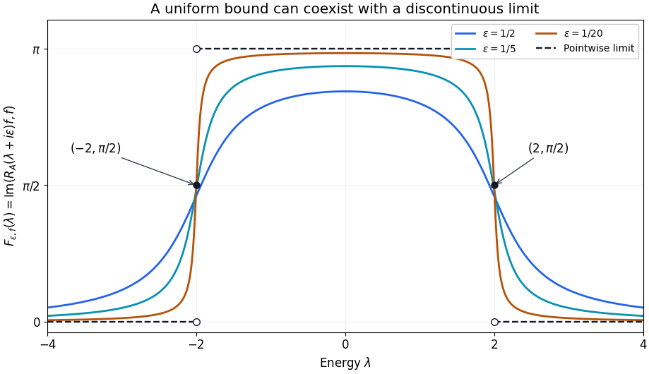

# Resolvents, domains and spectral density

*Written by GPT-6.1 Sol (OpenAI) and GPT-6 Astra (OpenAI). Self-checked by the writing AI. Original exposition: CC0.*

**Working question: What does a measured resolvent actually determine?** For a scalar spectral value \(t\), the imaginary part of \((t-\lambda-i\varepsilon)^{-1}\) is \(\varepsilon/((t-\lambda)^2+\varepsilon^2)\). Its height diverges while its integral stays bounded. This separates an operator-norm question from a scalar-measure question before either is used in scattering.

A stationary equation has two parts: a differential expression and the space on which it acts. A resolvent solves that equation away from the spectrum. Scattering begins when the spectral parameter approaches a real energy and the solution ceases to be square integrable. This lesson establishes the operator identities that survive that passage and explains what additional estimate is needed to recover a spectral density.

The prerequisites are Hilbert spaces, Fourier inversion and elementary measure theory. We use the complete bundled proof of [Self-adjoint spectral calculus with the original domain](../providers/analysis/self-adjoint-spectral-domains.md#self-adjoint-pvm-domain). Its Cayley construction supplies the spectral measure and exact maximal multiplier domains for every self-adjoint operator, without a lower-bound or separability assumption. Section 3 supplies the compact-operator Fredholm argument directly, including its Banach-space scope; [Compact Fredholm operators and their families](../providers/analysis/compact-fredholm-families.md#compact-fredholm) is a companion treatment. The freely readable second edition of Gerald Teschl's *Mathematical Methods in Quantum Mechanics* [T], Theorem 4.3, contains the scalar-kernel proof corresponding to Section 4. Dmitri Yafaev [Y] gives scattering context.

The exact Hilbert-space prerequisites are proved in the bundled [elementary Hilbert tools](../providers/analysis/finite-trace-ideals.md#elementary-hilbert-tools): orthogonal projection, bounded Riesz representation and adjoints. The [measure and function-space foundations](../providers/analysis/finite-derivative-l2.md#measure-foundations) prove convergence of integrals and completeness of \(L^2\). Next read [products of sigma-finite measures](../providers/analysis/finite-derivative-l2.md#general-product-measures), [Euclidean products](../providers/analysis/finite-derivative-l2.md#euclidean-products), [coordinate integration and surface measure](../providers/analysis/coordinate-inverses-and-integration.md#coordinate-integration), and [Fourier normalization](../providers/analysis/finite-derivative-l2.md#fourier-normalization). These supply product integration for the possibly singular spectral measures used below, measure uniqueness, Fourier inversion and Plancherel, as well as all substitutions in the examples. Section 5 constructs the bounded density it needs directly.

## 1. An equation with a specified domain

Our inner products are linear in the first variable. Put \(D_j=-i\partial_{x_j}\), and use the unitary Fourier transform

\[
 \mathcal Ff(\xi)=(2\pi)^{-n/2}\int e^{-ix\cdot\xi}f(x)\,dx.
\]

Let \(p_0\) be a real polynomial. Its Fourier realization is

\[
 H_0=\mathcal F^{-1}M_{p_0}\mathcal F,\qquad
 D(H_0)=\{u\in L^2:p_0\mathcal Fu\in L^2\}.
\]

This is a self-adjoint operator. The maximal multiplication domain is dense, since cutting an arbitrary \(L^2\) function to \(|p_0|\leq N\) gives domain vectors converging to it. Multiplication by the real function is symmetric there. If \(v\) is in the adjoint domain with value \(w\), testing against all \(L^2\) functions supported where \(|p_0|\leq N\) gives \(1_{|p_0|\leq N}w=p_0 1_{|p_0|\leq N}v\). Monotone convergence then puts \(p_0v\) in \(L^2\), and exhaustion gives \(w=p_0v\). The unitary Fourier transform carries this assertion back to \(H_0\).

Its spectral projections are explicitly \(E_{H_0}(S)=\mathcal F^{-1}M_{1_{p_0^{-1}(S)}}\mathcal F\). Indicator products give orthogonal projections, and \(L^2\) dominated convergence gives their strong countable additivity. The moment domain and action follow by bounded truncations of \(p_0\). The uniqueness proved in the self-adjoint prerequisite identifies these with the original spectral measure. Thus all free spectral measures in the examples below have a proved realization.

If \(p_0\) is elliptic of positive order \(m\), meaning that its homogeneous part of degree \(m\) has no zero on the unit sphere, then

\[
 C^{-1}\langle\xi\rangle^m\leq 1+|p_0(\xi)|
 \leq C\langle\xi\rangle^m.
\]

The upper bound is a polynomial estimate. For the lower bound, ellipticity and compactness of the sphere give \(|p_0(\xi)|\geq c|\xi|^m\) outside a sufficiently large ball, and the added constant controls the ball. Consequently \(D(H_0)=H^m(\mathbb R^n)\), with equivalent graph and Sobolev norms. This identification concerns the whole space. A boundary would require another domain.

**Theorem 1.1.** Let \(A\) be self-adjoint and let \(V\) be bounded and self-adjoint on its Hilbert space. Then

\[
 H=A+V,\qquad D(H)=D(A),
\]

is self-adjoint, and its graph norm is equivalent to that of \(A\).

**Proof.** Symmetry is immediate on the common domain. For \(t>\|V\|\), self-adjointness of \(A\) gives \(R_A(\pm it)=(A\mp it)^{-1}\) and \(\|R_A(\pm it)\|\leq t^{-1}\). Thus

\[
 H\mp it=(I+VR_A(\pm it))(A\mp it)
\]

maps \(D(A)\) bijectively onto the Hilbert space: the first factor is inverted by its norm-convergent geometric series. A densely defined symmetric operator whose ranges at both \(it\) and \(-it\) are the whole space is self-adjoint. To verify this last criterion, for \(u\in D(H^*)\) solve \((H-it)v=(H^*-it)u\). Then \(w=u-v\) satisfies \((H^*-it)w=0\). This kernel is the orthogonal complement of \(\operatorname{ran}(H+it)\), hence is zero. Therefore \(u=v\in D(H)\). Finally

\[
 \|Hu\|\leq\|Au\|+\|V\|\|u\|,
 \qquad
 \|Au\|\leq\|Hu\|+\|V\|\|u\|
\]

give both graph-norm comparisons. \(\square\)

For example, \(-\Delta+V\) with real \(V\in L^\infty(\mathbb R^n)\) has domain \(H^2\). The theorem does not handle an unbounded potential or a perturbation of the highest derivatives. Such perturbations require estimates on their actual operator domains.

On a bounded smooth region \(\Omega\), the Dirichlet Laplacian has domain \(H^2(\Omega)\cap H_0^1(\Omega)\). The complete bundled proof of [The smooth Dirichlet domain and its compact inverse](../providers/analysis/dirichlet-domain-and-compactness.md#dirichlet-domain-compact-resolvent), Theorems 3.1 and 4.1, supplies the full second-order boundary estimate, both domain inclusions, the compact \(H_0^1\)-to-\(L^2\) embedding, positive self-adjoint inverse and compact resolvents. See also Hunter's PDE notes, Theorems 4.27 and 4.30; no higher-order regularity result is imported. Applying Theorem 1.1 to that realization preserves its zero-trace condition. An outgoing solution on \(\mathbb R^n\) has a condition at infinity instead; it does not acquire a Dirichlet boundary condition.

## 2. Which resolvent identities are legitimate?

For a self-adjoint \(A\), write \(R_A(z)=(A-z)^{-1}\) for \(\operatorname{Im}z\ne0\). This maps the Hilbert space into \(D(A)\). The bundled spectral-measure result gives, for every such \(A\),

\[
 R_A(z)=\int (t-z)^{-1}\,dE_A(t),\qquad
 D(A)=\left\{u:\int t^2\,d(E_A(t)u,u)<\infty\right\}.
\]

In particular \(\|R_A(z)\|\leq|\operatorname{Im}z|^{-1}\). For a general self-adjoint operator the same bound follows from \(\|(A-z)u\|\geq|\operatorname{Im}z|\|u\|\), applied also to its adjoint to prove surjectivity.

**Proposition 2.1.** For nonreal \(z,w\),

\[
 R_A(z)-R_A(w)=(z-w)R_A(z)R_A(w),\qquad
 R_A(z)^*=R_A(\overline z).
\]

If \(H=A+V\) is as in Theorem 1.1, then

\[
 R_H(z)-R_A(z)=-R_H(z)VR_A(z)=-R_A(z)VR_H(z),
\]

and

\[
 R_H(z)=R_A(z)(I+VR_A(z))^{-1}.
\]

**Proof.** Apply both sides of the first identity to an arbitrary vector, and insert \((A-w)-(A-z)=(z-w)I\) between the two inverses. Their ranges lie in \(D(A)\), so every application of \(A\) is legitimate. The adjoint identity follows from \((A-z)^*=A-\overline z\). For the perturbation formula insert \((A-z)-(H-z)=-V\) between the inverses, in either order. Finally \(I+VR_A(z)\) is invertible because

\[
 (I+VR_A(z))^{-1}=I-VR_H(z).
\]

Multiplying these two bounded factors on either side, using the preceding identities, gives the identity operator. This also proves the final formula without a smallness hypothesis on \(V\). \(\square\)

The placement of the factors matters. \(VR_A(z)\) and \(R_A(z)V\) have different domains and target spaces once weighted estimates replace Hilbert-space bounds. A real-axis version of the formula must first identify the Banach space on which \(I+VR_A(\lambda\pm i0)\) acts.

## 3. Decaying potentials and compact errors

We now make one exact use of Fredholm theory. On a Banach space, a compact perturbation of the identity is Fredholm with index zero. Its kernel and cokernel are finite-dimensional; it is invertible exactly when its kernel is zero. Here is the complete compactness argument. The Banach-space foundation used is Hahn–Banach, Corollary 2.3(1), for extending the finitely many coordinate functionals of a finite-dimensional subspace; its full real and complex proofs are given in Theorems 2.1–2.2 there. The companion reading's [**Elementary finite-dimensional tools**](../providers/analysis/compact-fredholm-families.md#fredholm-finite-tools) proves bounded coordinates, closed complements and completeness of a quotient by a closed subspace; read that paragraph before the argument below.

**Proof of the compact-perturbation input.** Let \(X\) be a Banach space, \(K:X\to X\) compact, and \(T=I+K\). Its kernel \(N\) is finite-dimensional: on \(N\), \(K=-I\), so its unit ball is relatively compact. An infinite-dimensional normed space has a sequence of unit vectors separated by more than \(1/2\), contradicting that compactness. This follows from the elementary separation lemma for a proper closed subspace \(Y\subset Z\): take \(z\notin Y\), set \(d=\operatorname{dist}(z,Y)>0\), choose \(y\in Y\) with \(\|z-y\|<2d\), and normalize \(z-y\) to obtain a unit vector at distance more than \(1/2\) from \(Y\). Apply it successively to the spans of the preceding vectors.

There is a constant \(C\) such that

\[
 \operatorname{dist}(x,N)\leq C\|Tx\|\qquad(x\in X).
\]

Otherwise choose representatives \(x_j\) with distance one from \(N\), norm at most two, and \(Tx_j\to0\). Subtracting an element of \(N\) gives the norm bound without changing either the distance or image. A subsequence of \(Kx_j\) converges, so \(x_j=Tx_j-Kx_j\) converges to a vector in \(N\), contradicting distance one. This also proves that \(R=T(X)\) is closed: if \(Tx_j\to y\), the displayed bound lets us replace \(x_j\) modulo \(N\) by bounded representatives. Compactness of their \(K\)-images then gives a convergent subsequence of the representatives and an inverse image of \(y\).

The quotient \(X/R\) is finite-dimensional. For its quotient map \(q\), the identity \(q(x)=-q(Kx)\) holds because \(Tx\in R\). Every quotient vector of norm at most one has a representative of norm at most two. Its unit ball is therefore relatively compact, being contained in the image under \(-qK\) of that bounded ball. The separation lemma again excludes infinite dimension.

Compactness is preserved by finite sums and by composition on either side with bounded operators. For sums, successively extract subsequences for the finitely many compact images of a bounded sequence; for composition, use continuity on the image side and boundedness on the input side. The metric compactness criterion was proved in the companion reading. Hence every positive power \(T^m=(I+K)^m\) is identity plus compact, by the finite product expansion. We next prove that injectivity and surjectivity are equivalent. If \(T\) is injective but not surjective, the closed ranges \(R_m=T^m(X)\) decrease strictly. They are closed because \(T^m=I+K_m\) with compact \(K_m\), and the preceding closed-range proof applies. Equality of two successive ranges would, by injectivity, imply equality of the preceding pair, eventually contradicting \(X\ne T(X)\). Choose unit \(x_m\in R_{m-1}\) at distance more than \(1/2\) from \(R_m\). For \(k>m\), the vector \(Kx_m-Kx_k\) equals \(-x_m\) plus a vector in \(R_m\); hence its norm exceeds \(1/2\). This contradicts compactness. If \(T\) is surjective but has a nonzero kernel, the closed spaces \(N_m=\ker T^m\) increase strictly: successive preimages of a nonzero kernel vector exhibit the strict inclusions. Choose unit \(x_m\in N_m\) at distance more than \(1/2\) from \(N_{m-1}\). For \(k<m\), \(Kx_m-Kx_k\) equals \(-x_m\) plus a vector in \(N_{m-1}\), giving the same contradiction.

Finally put \(n=\dim N\), \(c=\dim(X/R)\), and \(s=\min(n,c)\). Choose complements \(X=N\oplus X_0=R\oplus Y_0\), with \(\dim Y_0=c\). The first complement is the intersection of the kernels of bounded coordinate extensions supplied by Hahn–Banach; the second is obtained by lifting a quotient basis. Define a bounded finite-rank \(F\) to map \(s\) basis vectors of \(N\) to \(s\) independent basis vectors of \(Y_0\), and to vanish on the other kernel basis vectors and on \(X_0\). Since \(T(X_0)=R\), the operator \(T+F\) has kernel dimension \(n-s\) and cokernel dimension \(c-s\). It is again identity plus compact. If \(n\ne c\), it would be injective without being surjective, or surjective without being injective, contradicting the preceding paragraph. Thus \(n=c\), which is exactly index zero. When \(n=0\), surjectivity follows, and the displayed distance estimate becomes \(\|x\|\leq C\|Tx\|\), proving boundedness of the inverse. \(\square\)

We apply this result to a bounded operator on \(L^2\); the domain of the differential realization is retained separately below.

**Theorem 3.1.** Suppose \(p_0\) is real and elliptic of order \(m>0\), and \(V\) is a bounded multiplication operator satisfying

\[
 \mathop{\mathrm{ess\,sup}}_{|x|>R}|V(x)|\longrightarrow0.
\]

For every nonreal \(z\), \(VR_{H_0}(z)\) is compact on \(L^2\). If \(V\) is real, then \(R_{H_0+V}(z)-R_{H_0}(z)\) is compact.

**Proof.** The multiplier \(r_z(\xi)=(p_0(\xi)-z)^{-1}\) is bounded and tends to zero as \(|\xi|\to\infty\). Choose a smooth cutoff \(\chi_N\) equal to one on \(|\xi|\leq N\) and zero outside \(|\xi|\leq2N\). Then \(r_z\chi_N\in L^2\), and its inverse unitary Fourier transform \(k_N\) is in \(L^2\). For \(V_R=V1_{\{|x|\leq R\}}\), the kernel of \(V_R\mathcal F^{-1}M_{r_z\chi_N}\mathcal F\) is

\[
 (2\pi)^{-n/2}V_R(x)k_N(x-y).
\]

Its square integral is \((2\pi)^{-n}\|V_R\|_2^2\|k_N\|_2^2\), which is finite. Such an integral operator is compact: finite sums of product functions are dense in the product \(L^2\) space, their operators have finite rank, and the kernel \(L^2\) norm bounds the operator norm by Cauchy–Schwarz. Here \(r_z\chi_N\) is smooth with compact support, so \(k_N\) is Schwartz by Fourier inversion. Absolute Fubini first identifies the displayed kernel on compact smooth inputs; boundedness and density extend the identity to all \(L^2\). For the density assertion, first truncate an arbitrary product-space \(L^2\) function to a bounded box, then use finite simple approximation and the proved Euclidean rectangle approximation. A product-space rectangle is a product of two rectangles. This is the same finite-rank kernel argument proved explicitly in the [Dirichlet compactness reading](../providers/analysis/dirichlet-domain-and-compactness.md#dirichlet-compact-embedding), now with either factor allowed to exhaust the full Euclidean space.

The error from removing the Fourier cutoff is bounded by \(\|V\|_\infty\sup_{|\xi|>N}|r_z(\xi)|\). The error from replacing \(V\) by \(V_R\) is bounded by \(\|V-V_R\|_\infty\|r_z\|_\infty\). Let \(N\) and then \(R\) tend to infinity. A norm limit of compact operators is compact, since a finite approximation to the image of a unit ball can be enlarged by the small norm error. The resolvent difference is a bounded operator times \(VR_{H_0}(z)\), by Proposition 2.1, so it is compact too. \(\square\)

If \(\lambda\) lies outside the spectrum of \(H_0\), the same proof gives compactness of \(VR_{H_0}(\lambda)\). Indeed, \(p_0(\xi_0)=\lambda\) would make normalized indicators of shrinking frequency balls around \(\xi_0\) into unit vectors whose \((H_0-\lambda)\)-images tend to zero, contradicting a bounded inverse. Thus \(p_0-\lambda\) never vanishes. Its absolute value has a positive minimum on each compact ball and grows at infinity by ellipticity, so its reciprocal is bounded and tends to zero. The factorization

\[
 H_0+V-\lambda=(I+VR_{H_0}(\lambda))(H_0-\lambda)
\]

then shows that \(H_0+V-\lambda\), regarded as a bounded map from \(D(H_0)\) with its graph norm to \(L^2\), is Fredholm of index zero. The map \(H_0-\lambda\) is a bounded isomorphism from that complete graph space to \(L^2\): its inverse is bounded in graph norm because \(H_0R_{H_0}(\lambda)=I+\lambda R_{H_0}(\lambda)\). Composition with an isomorphism preserves the kernel dimension, range closedness and cokernel dimension. This conclusion follows from the compactness argument just proved; no index formula for a symbol is being asserted. When its kernel is nonzero, the kernel is a finite-dimensional eigenspace. Inside the free spectrum this factorization has no bounded Hilbert-space inverse and needs different spaces.

## 4. A spectral measure seen through a resolvent

Let \(A\) be lower bounded and self-adjoint, and put \(\mu_f(S)=(E_A(S)f,f)\). The spectral theorem from Section 2 gives

\[
 (R_A(\lambda+i\varepsilon)f,f)
 =\int\frac{1}{t-\lambda-i\varepsilon}\,d\mu_f(t),
\]

and therefore

\[
 \operatorname{Im}(R_A(\lambda+i\varepsilon)f,f)
 =\int\frac{\varepsilon}{(t-\lambda)^2+\varepsilon^2}\,d\mu_f(t).
\]

The right side is nonnegative. The sign reverses in the lower half-plane.

**Theorem 4.1 (Stone's formula, scalar form).** For finite \(a<b\),

\[
 \begin{gathered}
 \lim_{\varepsilon\downarrow0}\frac1\pi
 \int_a^b\operatorname{Im}(R_A(\lambda+i\varepsilon)f,f)\,d\lambda\\
 =\mu_f((a,b))+\tfrac12\mu_f(\{a\})+\tfrac12\mu_f(\{b\}).
 \end{gathered}
\]

**Proof.** Apply the proved [general Tonelli theorem](../providers/analysis/finite-derivative-l2.md#general-tonelli-fubini) to the finite Borel measure \(\mu_f\), of mass \(\|f\|^2\), and Lebesgue measure on \([a,b]\). For each fixed \(\varepsilon>0\), the kernel \(\varepsilon/((t-\lambda)^2+\varepsilon^2)\) is nonnegative and jointly Borel measurable: it is continuous, and open subsets of the real plane are countable unions of rational open rectangles. Both measures are sigma-finite, so the theorem permits exchanging these two integrals even when \(\mu_f\) is singular. Integrating first in \(\lambda\), the inner integral divided by \(\pi\) is

\[
 \frac1\pi\left[
 \arctan\frac{b-t}{\varepsilon}-\arctan\frac{a-t}{\varepsilon}
 \right].
\]

It is between zero and one. Its pointwise limit is one for \(a<t<b\), one half at either endpoint, and zero outside \([a,b]\). The measure \(\mu_f\) has finite mass \(\|f\|^2\), so dominated convergence proves the formula. \(\square\)

An operator-valued version follows by polarization. For example, with our convention the form \(B(f,g)=(E_A(S)f,g)\) is recovered from \(Q(h)=B(h,h)\) as

\[
 \begin{aligned}
 B(f,g)&=\tfrac14\bigl(Q(f+g)-Q(f-g)\\
       &\qquad+iQ(f+ig)-iQ(f-ig)\bigr).
 \end{aligned}
\]

The operator formula in fact converges strongly. Let \(h_\varepsilon(t)\) be the normalized arctangent difference in the proof. It is bounded by one and tends pointwise to \(1_{(a,b)}+\tfrac12 1_{\{a,b\}}\). The bounded Borel convergence theorem therefore gives strong convergence of \(h_\varepsilon(A)\) to the corresponding projection sum. This operator is the integral, divided by \(\pi\), of \((R_A(\lambda+i\varepsilon)-R_A(\lambda-i\varepsilon))/(2i)\): the resolvent identity makes the integrand norm continuous on the finite interval, the earlier Banach-valued integral exists, and scalar Tonelli followed by polarization identifies all its pairings with \(h_\varepsilon(A)\). This proves the operator assertion on the whole Hilbert space.

**Theorem 4.2.** Let \(I\) be an open real interval and let \(f\) be a Hilbert-space vector. Suppose

\[
 \operatorname{Im}(R_A(\lambda+i\varepsilon)f,f)
 \longrightarrow g_f(\lambda)
\]

locally uniformly in \(\lambda\in I\), where \(g_f\) is continuous. Then \(\mu_f\) on \(I\) is absolutely continuous and

\[
 d\mu_f(\lambda)=\pi^{-1}g_f(\lambda)\,d\lambda.
\]

**Proof.** The imaginary parts are locally bounded. At an atom \(t\in I\), the contribution \(\mu_f(\{t\})/\varepsilon\) to the value at \(\lambda=t\) forces \(\mu_f(\{t\})=0\). Stone's formula and uniform convergence on \([a,b]\subset I\) now give \(\mu_f((a,b))=\pi^{-1}\int_a^bg_f(\lambda)\,d\lambda\). Open intervals determine finite Borel measures locally: atomlessness gives equality on half-open intervals as well, and the proved [finite-measure uniqueness lemma](../providers/analysis/finite-derivative-l2.md#pi-lambda-uniqueness) gives equality on all Borel sets in any fixed compact subinterval. Exhaustion proves the assertion on \(I\). \(\square\)

If this hypothesis holds for every \(f\) in a dense linear subspace \(\mathcal D\), then every spectral measure is absolutely continuous on \(I\). Indeed, for a Lebesgue-null Borel set \(N\subset I\), \(\|E_A(N)f\|^2=\mu_f(N)=0\) for \(f\in\mathcal D\). Continuity of the orthogonal projection implies \(E_A(N)=0\). This proves absence of singular spectrum there. Theorem 5.1 below shows that the local bound alone suffices for this last conclusion; convergence supplies the stronger continuous-density formula in Theorem 4.2. Existence of a limit at almost every energy without local control is a different hypothesis and does not give either argument.

**Converse for a continuous density.** If a finite positive Borel measure \(\mu\) has continuous density \(h\) on an open interval \(I\), then its Poisson integrals converge locally uniformly to \(\pi h\) there. Here is the proof needed for the free example. Given compact \(K\subset I\), choose a smooth cutoff \(0\leq\chi\leq1\), supported in \(I\) and equal to one on a neighbourhood of \(K\). Continuity and positivity of the measure imply \(h\geq0\): a negative value would give a negative integral over a small interval. Extend \(g=\chi h\) by zero; it is bounded and uniformly continuous on the line. The positive finite measure \(\nu=\mu-g\,dt\) is supported at some positive distance \(d\) from \(K\). Its Poisson integral on \(K\) is at most \(\varepsilon\mu(\mathbb R)/d^2\).

The scalar kernel \(P_\varepsilon(r)=\varepsilon/(r^2+\varepsilon^2)\) has integral \(\pi\), by the proved arctangent primitive. Splitting its convolution with \(g(\lambda-r)-g(\lambda)\) into \(|r|<\delta\) and its complement gives, uniformly in \(\lambda\),
\[
 \begin{gathered}
 \left|\int P_\varepsilon(r)g(\lambda-r)\,dr-\pi g(\lambda)\right|\\
 \leq\pi\omega_g(\delta)+\frac{4\varepsilon\|g\|_\infty}{\delta}.
 \end{gathered}
\]
Indeed the first part is bounded by the modulus of continuity times \(\pi\), while \(\int_{|r|\geq\delta}P_\varepsilon(r)dr\leq2\varepsilon/\delta\). First choose \(\delta\) small, then \(\varepsilon\) small. On \(K\), \(g=h\), and the vanishing contribution of \(\nu\) proves the claimed uniform limit. No pointwise boundary theorem is assumed.

## 5. The topology at a real energy

For \(s\in\mathbb R\), put

\[
 L^2_s=\{f:\langle x\rangle^sf\in L^2\},\qquad
 \|f\|_{L^2_s}=\|\langle x\rangle^sf\|_2.
\]

The integral pairing identifies \(L^2_{-s}\) with the continuous dual of \(L^2_s\), with conjugation according to our inner-product convention. Indeed \(f\mapsto\langle x\rangle^sf\) is an isometry onto \(L^2\), with inverse multiplication by \(\langle x\rangle^{-s}\). The proved Hilbert representation applied after this isometry gives exactly the pairing with \(\langle x\rangle^sg\), \(g\in L^2\), which lies in \(L^2_{-s}\). Cauchy–Schwarz gives its norm and the reverse equality follows by taking the corresponding unit vector. When \(s>0\), \(L^2_s\subset L^2\subset L^2_{-s}\). A limiting absorption estimate has the form

\[
 \sup_{\lambda\in K,\ 0<\varepsilon<1}
 \|R_A(\lambda\pm i\varepsilon)\|_{L^2_s\to L^2_{-s}}<\infty,
\]

for specified compact energy sets \(K\). This bound already has a spectral consequence, before a boundary family is constructed.

**Theorem 5.1 (a bound excludes singular spectral mass).** Let \(A\) have the spectral-measure representation of Section 4, and let \(I\) be an open real interval. Suppose that, for a vector \(f\) and every compact interval \(J\subset I\), there are finite \(C_{f,J}\) and positive \(\varepsilon_J\) such that

\[
 0\leq F_{\varepsilon,f}(\lambda)
 :=\operatorname{Im}(R_A(\lambda+i\varepsilon)f,f)
 \leq C_{f,J},\qquad
 \lambda\in J,\quad 0<\varepsilon<\varepsilon_J.
\]

Then \(\mu_f\) is absolutely continuous on \(I\). On the interior of \(J\) its density satisfies

\[
 0\leq\frac{d\mu_f}{d\lambda}\leq\frac{C_{f,J}}{\pi}
 \quad\hbox{almost everywhere}.
\]

If these bounds hold for every vector in a dense subspace, \(A\) has no singular spectrum in \(I\). In particular, the displayed \(L^2_s\)-to-\(L^2_{-s}\) estimate, for every compact interval in \(I\) and \(s>0\), implies this conclusion. Only its upper-half-plane bound is needed.

**Proof.** Integrate the nonnegative inequality over \([a,b]\subset J^\circ\), then use Theorem 4.1, retaining its endpoint terms:

\[
 \mu_f((a,b))+\tfrac12\mu_f(\{a\})+\tfrac12\mu_f(\{b\})
 \leq\frac{C_{f,J}}{\pi}(b-a).
\]

At any \(t\in J^\circ\), positivity of the original kernel gives
\(\mu_f(\{t\})/\varepsilon\leq F_{\varepsilon,f}(t)\leq C_{f,J}\).
Letting \(\varepsilon\downarrow0\) kills every such atom. Thus each open interval in \(J^\circ\) has measure at most \(C_{f,J}/\pi\) times its length; intervals meeting an endpoint of \(J^\circ\) follow by increasing exhaustion. Every open subset of \(J^\circ\) is a countable disjoint union of intervals. To see this, join two points when the interval between them lies in the open set. The equivalence classes are disjoint open intervals; each contains a rational, so there are at most countably many. Countable additivity therefore gives the same bound for that open set.

For a Borel set \(S\) in a smaller compact interval \(K\subset J^\circ\), cover \(S\) by open sets inside \(J^\circ\) whose lengths decrease to its Lebesgue measure. Such covers exist by Lebesgue outer regularity, since \(K\) has positive distance from the complement of \(J^\circ\). Monotonicity then gives

\[
 \mu_f(S)\leq\frac{C_{f,J}}{\pi}|S|.
\]

Here is the density construction, including its existence. On a compact interval \(K\subset J^\circ\), write \(\nu=\mu_f|_K\) and \(C=C_{f,J}/\pi\). For a simple Borel function \(\varphi\) on \(K\), domination gives

\[
 \left|\int_K\varphi\,d\nu\right|
 \le C\int_K|\varphi|\,d\lambda
 \le C|K|^{1/2}\|\varphi\|_{L^2(K)}.
\]

Null sets have zero \(\nu\)-measure, so this is well defined on \(L^2\) classes. Simple-function density extends it to a bounded linear functional on \(L^2(K)\). The Hilbert representation proved in the prerequisite gives \(h_K\in L^2(K)\) with \(\int\varphi\,d\nu=\int\varphi h_K\,d\lambda\); with linear-first inner products, \(h_K\) is the conjugate of the representing vector. Testing indicators of all measurable sets shows that \(h_K\) is real and \(0\le h_K\le C\) almost everywhere. For detail, a set on which its imaginary part is at least \(1/m\), or at most \(-1/m\), would give a nonreal integral. A set where its real part is below \(-1/m\), or above \(C+1/m\), contradicts respectively positivity or domination. Taking their countable unions proves the assertions.

Thus \(\nu(S)=\int_S h_K\,d\lambda\) for every Borel \(S\subset K\). Densities obtained on overlapping intervals agree almost everywhere, because their difference integrates to zero on every measurable subset of the overlap; the same level-set argument applies. A countable compact exhaustion of \(J^\circ\), and then of \(I\), patches these densities into the asserted local density with the stated bound. This proves the needed bounded-density result without assuming a general Radon–Nikodym theorem.

For the dense-subspace assertion, a null Borel \(N\subset I\) satisfies
\(\|E_A(N)f\|^2=\mu_f(N)=0\) on that subspace. The projection has norm at most one, so approximation extends its zero action to the entire Hilbert space. Constants may depend on the test vector.

Finally, if the weighted resolvent norm on \(J\) is bounded by \(C_J\), weighted duality gives

\[
 0\leq F_{\varepsilon,f}(\lambda)
 \leq |(R_A(\lambda+i\varepsilon)f,f)|
 \leq C_J\|f\|_{L^2_s}^{\,2}.
\]

Compactly supported \(L^2\) functions belong to \(L^2_s\) and are dense in \(L^2\). Apply the preceding argument, with \(C_{f,J}=C_J\|f\|_{L^2_s}^2\). \(\square\)

The proof uses only the positive kernel and the spectral projections. It therefore also applies to a self-adjoint operator unbounded in both directions when its general spectral measure has been supplied. Related smoothness criteria are discussed in Yafaev [Y], Section 2; the scalar measure argument above supplies the consequence used here directly.

To define boundary values one still needs convergence in a specified topology, for example weak convergence against every vector in \(L^2_s\). A locally uniform operator-norm limit is norm continuous and satisfies Theorem 4.2 on that dense subspace, giving a continuous density. For completeness, at fixed \(\varepsilon>0\) the resolvent identity bounds the difference at two real energies by \(|\lambda-\mu|\varepsilon^{-2}\) in \(L^2\) operator norm. The continuous inclusions \(L^2_s\subset L^2\subset L^2_{-s}\), each of norm at most one, give the same continuity in the weighted operator norm. A uniform limit on each compact energy interval is continuous by the triangle inequality. Theorem 5.1 gives a locally bounded density and does not assert continuity or locally uniform convergence of the imaginary parts.

The endpoint model makes this distinction quantitative. Read the earlier prerequisite [Flat transport traces and the norm boundary limit](../providers/analysis/flat-transport-boundary-topology.md) for the definitions of \(B,B^*,B^*_0\), the flat trace and all the following proofs. Its Theorem 5.2 proves for \(D_t\) that the real-energy boundary solution has exact \(B^*\)-distance \(\sqrt\pi\|T_\lambda f\|_2\) from \(B^*_0\). Every nonreal resolvent lies in \(B^*_0\), so a nonzero trace prevents norm convergence although the weak-star boundary exists. Zero trace is also sufficient for norm convergence along any approach in the corresponding half-plane, by the complete zero-integral approximation proof there. Proposition 3.3 proves that the trace operators are nowhere norm continuous, while Theorem 3.2 proves continuity on each fixed forcing term. These arguments require only the earlier measure, Fourier and integral foundations.

**Example 5.1.** For \(A=-\Delta\) and \(\lambda>0\), the \(L^2\) resolvent norm is exactly \(\varepsilon^{-1}\). The Fourier multiplier has that supremum because every neighbourhood of the sphere \(|\xi|^2=\lambda\) has positive measure. It approaches its maximum there. Thus a weighted limit may exist while the \(L^2\)-operator norm diverges. This is compatible with every preceding theorem.

**Example 5.2.** For \(f\) with \(\mathcal Ff\in C_c^\infty(\mathbb R^n)\), the spectral measure of the free Laplacian on positive energies has density

\[
 \frac{d\mu_f}{d\lambda}
 =\frac1{2\sqrt\lambda}
   \int_{|\xi|=\sqrt\lambda}|\mathcal Ff(\xi)|^2\,dS(\xi).
\]

In polar coordinates, \(d\xi=r^{n-1}dr\,d\omega\) and \(d\lambda=2r\,dr\), which proves the formula. On compact positive-energy intervals this density is smooth. The [continuous-density Poisson argument](#continuous-density-poisson-limit) proves locally uniform convergence of the upper resolvent's imaginary part to \(\pi\) times this density, in agreement with Stone's formula. The energy zero requires a separate analysis; no regular-energy claim here includes it.

**Example 5.3 (a bound with a discontinuous limit).** On \(L^2([-2,2],dt)\), let \(A=M_t\) and \(f(t)=1\). The operator is bounded and self-adjoint on the full space, \(\|f\|^2=4\), and \(\mu_f\) is Lebesgue measure restricted to \([-2,2]\). Direct integration gives

\[
 F_{\varepsilon,f}(\lambda)
 =\arctan\frac{2-\lambda}{\varepsilon}
  -\arctan\frac{-2-\lambda}{\varepsilon}.
\]

For every \(\lambda\) and \(\varepsilon>0\), this lies between zero and \(\pi\), the total mass of the positive kernel. Its limit is \(\pi\) for \(|\lambda|<2\), \(\pi/2\) at \(\lambda=\pm2\), and zero for \(|\lambda|>2\). Each approximating function is continuous; their discontinuous limit prevents locally uniform convergence on any interval containing either endpoint. Nevertheless Theorem 5.1 gives the sharp density bound \(d\mu_f/d\lambda\leq1\). This example concerns the scalar bound for this vector, not an operator-norm bound on all of \(L^2([-2,2])\).

*The curves sample the exact arctangent formula in Example 5.3 at \(\varepsilon=1/2,1/5,1/20\). The endpoint dots are exactly \((-2,\pi/2)\) and \((2,\pi/2)\). The horizontal bound \(\pi\) and the density conclusion follow from the proof, rather than from the plotted samples.*

### Use the conclusion

Compare Example 5.1 with Example 5.3: the first has a diverging Hilbert-space resolvent norm; the second has a bounded scalar observation and a discontinuous boundary density. State which estimate each theorem needs.

## 6. Exercises

**Exercise 6.1 (foundation).** Let \(A\phi=\alpha\phi\), with \(\|\phi\|=1\). Compute \((R_A(\lambda+i\varepsilon)\phi,\phi)\), and evaluate Stone's formula on intervals with \(\alpha\) in the interior and at an endpoint.

**Exercise 6.2 (foundation).** Take \(V(x)=2/(1+|x|^2)\). State the domain of \(-\Delta+V\) on \(\mathbb R^n\), give an explicit shift making it positive, and decide whether Theorem 3.1 applies. Explain why it does not establish a real-axis limiting absorption estimate.

**Exercise 6.3 (intermediate).** A formula is proposed as \(R_H(z)=R_A(z)(I-VR_A(z))^{-1}\) for \(H=A+V\). Test it when the Hilbert space is \(\mathbb C\), \(A=3\) and \(V=2\). Derive the correct factorization without commuting any factors.

**Exercise 6.4 (intermediate).** Suppose \(R_A(\lambda+i\varepsilon)\) is locally uniformly bounded from \(L^2_s\) to \(L^2_{-s}\), with \(s>0\). Prove absence of singular spectrum and give a local bound for \(d\mu_f/d\lambda\), \(f\in L^2_s\). If there is also a locally uniform operator-norm limit, show that this density is continuous. Identify where the dense test space is used, and explain why Example 5.3 separates the two scalar hypotheses.

**Exercise 6.5 (advanced).** Let \(p_0(\xi)=\xi_1^2+4\xi_2^2+\xi_3^2\). For \(\mathcal Ff\in C_c^\infty(\mathbb R^3)\), compute the free spectral density by the substitution \(\eta=(\xi_1,2\xi_2,\xi_3)\). Compare it with the surface formula \(\int_{p_0=\lambda}|\mathcal Ff|^2|\nabla p_0|^{-1}\,dS\).

## 7. Complete solutions

**Solution 6.1.** The scalar value is \((\alpha-\lambda-i\varepsilon)^{-1}\), with imaginary part \(\varepsilon/((\alpha-\lambda)^2+\varepsilon^2)\). Its integral divided by \(\pi\) tends to one if \(a<\alpha<b\), one half if \(\alpha=a\) or \(\alpha=b\), and zero if \(\alpha\notin[a,b]\). At \(\lambda=\alpha\) the imaginary part is \(\varepsilon^{-1}\). Therefore the locally bounded hypothesis in Theorem 4.2 excludes this atom exactly as required.

**Solution 6.2.** The domain is \(H^2(\mathbb R^n)\), since \(V\) is real and bounded. The operator is already nonnegative; adding \(I\) makes it at least \(I\). Moreover \(\mathop{\mathrm{ess\,sup}}_{|x|>R}|V(x)|=2/(1+R^2)\to0\), so the resolvent difference at any nonreal \(z\) is compact. The compactness proof uses the multiplier \((|\xi|^2-z)^{-1}\) in \(L^\infty\); its supremum diverges as \(z\) approaches a positive real number. Thus the proof provides no uniform weighted bound at those energies.

**Solution 6.3.** The actual inverse is \((5-z)^{-1}\). The proposed expression gives \((1/(3-z))/(1-2/(3-z))=(1-z)^{-1}\). The correct identity is

\[
 H-z=(I+V(A-z)^{-1})(A-z)
\]

on \(D(A)\). Inverting reverses the factors and gives \((A-z)^{-1}(I+V(A-z)^{-1})^{-1}\). No interchange of \(V\) with \(A\) is needed.

**Solution 6.4.** Write \(C_J\) for the weighted norm bound on a compact energy interval \(J\). For \(f\in L^2_s\), weighted duality bounds the positive scalar imaginary part by \(C_J\|f\|_{L^2_s}^2\). Stone's formula gives interval domination with coefficient \(C_J\|f\|_{L^2_s}^2/\pi\), and the value at an atom bounds its mass divided by \(\varepsilon\). The atom is therefore zero. Open interval decomposition and outer regularity, as in Theorem 5.1, give the same domination on every Borel set locally. Hence the density is bounded by that coefficient almost everywhere. Spectral projections annihilate the dense \(L^2_s\) test space on null sets and extend by continuity to all \(L^2\); this proves absence of singular spectrum without a boundary limit.

With the additional operator-norm limit, the integral pairing bounds the scalar difference by \(\|f\|_{L^2_s}^2\) times the operator-norm difference. The scalar imaginary part therefore converges locally uniformly to a continuous function, and Theorem 4.2 identifies the density with that function divided by \(\pi\). Compactly supported \(L^2\) functions supply the dense test space; continuity of the projections extends their zero action to arbitrary vectors. The pairing itself does not require an \(L^2\) boundary solution. In Example 5.3 the scalar bound is \(\pi\), but the limit jumps at \(\pm2\), excluding locally uniform convergence there. It demonstrates the difference between the scalar hypotheses without asserting a weighted operator estimate for that example.

**Solution 6.5.** The Jacobian is \(d\xi=\tfrac12d\eta\). If \(G(\eta)=\mathcal Ff(\eta_1,\eta_2/2,\eta_3)\), then

\[
 \mu_f((0,\lambda])=\tfrac12\int_{|\eta|^2\leq\lambda}|G(\eta)|^2\,d\eta,
 \qquad
 \frac{d\mu_f}{d\lambda}
 =\frac1{4\sqrt\lambda}\int_{|\eta|=\sqrt\lambda}|G(\eta)|^2\,dS_\eta.
\]

For the coarea comparison, parametrize the ellipsoid by \(\xi=T\eta\), \(T=\operatorname{diag}(1,1/2,1)\). Surface area transforms by \(dS_\xi=|\det T|\,|T^{-T}\omega|\,dS_\eta\), where \(\omega=\eta/|\eta|\). Also \(\nabla_\xi p_0=2\sqrt\lambda\,T^{-T}\omega\). Their quotient is \(dS_\eta/(4\sqrt\lambda)\), agreeing with the calculation. Both the Jacobian and the gradient are necessary.

To verify the area transformation, choose orthonormal tangent vectors \(e_1,e_2\) so that \((e_1,e_2,\omega)\) is an orthonormal frame. The normal to their transformed tangent plane is \(n_T=T^{-T}\omega/|T^{-T}\omega|\). The transformed normal column has height \(|T\omega\cdot n_T|=1/|T^{-T}\omega|\) above that plane. The determinant is tangent area times this height, as follows by expressing the three columns in an orthonormal frame with last vector \(n_T\). Its absolute value is \(|\det T|\). Hence the tangent area factor is \(|\det T|\,|T^{-T}\omega|\), as used above. The surface-coordinate prerequisite then applies it to each chart.

## References

- [Y] Dmitri Yafaev, *Lectures on scattering theory*, 2004, [arXiv:math/0403213](https://arxiv.org/abs/math/0403213).
- [T] Gerald Teschl, *Mathematical Methods in Quantum Mechanics: With Applications to Schrödinger Operators*, second edition, American Mathematical Society, 2014. [Freely readable author's edition](https://www.mat.univie.ac.at/~gerald/ftp/book-schroe/schroe2.pdf).

