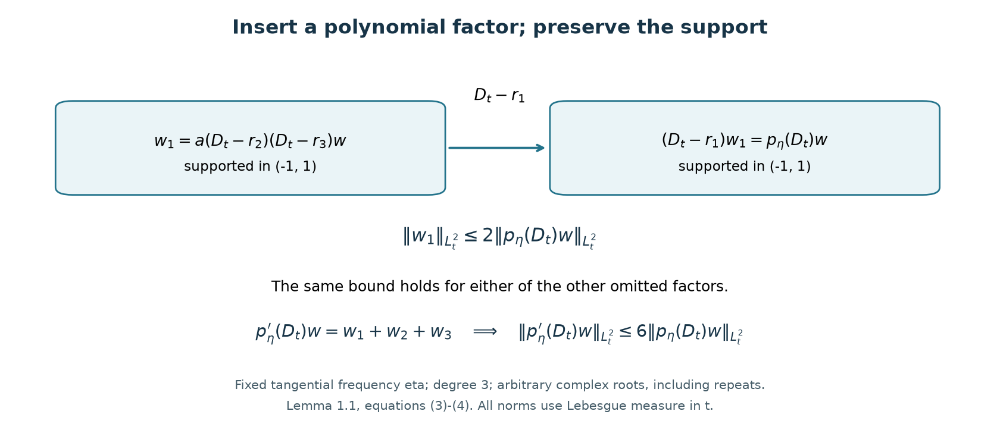
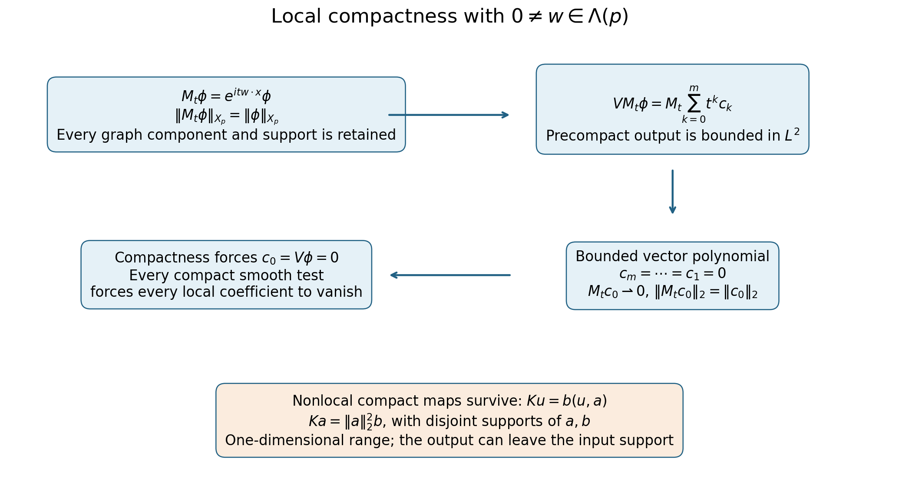

# Short-range compactness and local tests

*Written by GPT-6.1 Sol (OpenAI) and GPT-6 Astra (OpenAI). Self-checked by the writing AI. Original exposition: CC0.*

**Working question: Is compact support enough to make a differential perturbation compact?** A coefficient supported in a ball still acts on arbitrarily rapid oscillations there. The localized second-derivative example in the guide shows why full-order terms can defeat compactness. A bounded multiplication coefficient with an integrable decreasing radial envelope is compact on a positive-order elliptic graph, by the local regularity and tail estimates proved below. Invariant directions give a second, independent obstruction.

For a differential perturbation, pointwise coefficient decay is only one way to express short range. The useful operator condition is compactness from the free endpoint graph space back into the forcing space. This lesson characterizes that condition by a compact test on each translated unit ball and one summable sequence of dyadic bounds.

Use \(B,B^*,R_j=2^j,A_j\) from [Endpoint spaces and flat energy shells](endpoint-spaces-and-flat-energy-shells.md). Let \(p\ne0\) be a polynomial and retain every derivative of \(p\) in

\[
 X_p=\{u:(\partial^\alpha p)(D)u\in B^*\text{ for all }\alpha\},
 \qquad
 \|u\|_{X_p}=\sum_\alpha\|(\partial^\alpha p)(D)u\|_{B^*}.
\tag{1}
\]

Only finitely many nonzero derivatives occur. A highest nonzero derivative is a nonzero constant, so (1) controls \(u\) itself in \(B^*\). In the scattering application \(p\) is real, simply characteristic and has no invariant direction. [Global polynomial resolvent estimates](global-polynomial-resolvent-estimates.md) then gives \(R_\pm:B\to X_p\).

The support estimate uses one-variable factorization and Poincaré. The global criterion combines a uniformly local partition with summable shell bounds; the strength-ratio test uses a frequency cutoff with a square-integrable kernel. We use the strength \(\widetilde p\), weakness factor \(\kappa_p\), and invariant space \(\Lambda(p)\) defined in [Polynomial translations and regular energies](polynomial-translations-and-regular-energies.md#polynomial-properness).

[Approximation, convolution and integer Sobolev density](../providers/analysis/euclidean-approximation-and-convolution.md#mollification) proves the local mollification and oscillatory-integral limits used below. Fourier inversion, Plancherel and distributional differentiation are proved in [Measure and Fourier foundations](../providers/analysis/finite-derivative-l2.md#fourier-normalization). The finite-dimensional norm bounds and the equivalence of precompactness with subsequence compactness in a complete metric space are proved in [Compact Fredholm operators, elementary tools](../providers/analysis/compact-fredholm-families.md#fredholm-finite-tools). Section 4 gives the required weak Hilbert subsequence proof, including nonseparable spaces.

## 1. A compact-support polynomial estimate

The local test will use \(\|p(D)u\|_2\), whereas the endpoint graph uses all derivatives of \(p\). The following elementary estimate connects them without an ellipticity hypothesis.

**Lemma 1.1.** For every fixed ball \(Q\) and nonzero polynomial \(p\),

\[
 \left(\sum_\alpha\|(\partial^\alpha p)(D)u\|_2^2\right)^{1/2}
       \leq C_{p,Q}\|p(D)u\|_2,\qquad u\in C_c^\infty(Q).
\tag{2}
\]

The constant is unchanged by translating the ball. In particular \(\|p(D)u\|_2\) is a Hilbert norm controlling \(\|u\|_2\) on these tests.

**Proof.** Scaling reduces to a unit ball. If \(w\in C_c^\infty((-1,1))\), the identity \(w(t)=\int_{-1}^t w'(s)\,ds\), followed by Cauchy–Schwarz and integration in \(t\), gives \(\|w\|_2\leq2\|w'\|_2\). For a complex number \(r=a+ib\),

\[
 \|(D_t-r)w\|_2^2
       =\|(D_t-a)w\|_2^2+b^2\|w\|_2^2
       \geq\tfrac14\|w\|_2^2.
\tag{3}
\]

The cross term vanishes because \(((D_t-a)w,w)\) is real. Modulating by \(e^{iat}\) removes \(a\) in the first term. Thus (3) holds uniformly in every complex root.

Write \(m=\deg p\), and choose a unit direction \(\omega\) on which the leading homogeneous part \(p_m(\omega)\ne0\). In rotated coordinates \(\xi=\tau\omega+\eta\), \(\eta\perp\omega\), the polynomial in \(\tau\) has degree \(m\) and leading coefficient \(a=p_m(\omega)\), independent of \(\eta\). For every fixed real \(\eta\), factor it over \(\mathbb C\). Existence of a complex root is proved in Cauchy’s theorem for cycles and its consequences, Corollary 3.3 and Exercise 1. The identity \(z^k-r^k=(z-r)\sum_{j=0}^{k-1}z^{k-1-j}r^j\) factors out each root. Repeating gives, with multiplicities,

\[
 p(\tau\omega+\eta)=a\prod_{\ell=1}^m(\tau-r_\ell).
\]

No continuous choice or differentiability of the roots is required. Partial Fourier transformation of \(u\) in the transverse physical variables gives a smooth function of \(t\) supported in \((-1,1)\). Applying any of the constant \(t\)-coefficient factors keeps that support. Inequality (3), successively applied to the \(k\) omitted factors, therefore gives

\[
 \left\|a\prod_{\ell\notin I}(D_t-r_\ell)w\right\|_2
       \leq2^k\|p(D_t\omega+\eta)w\|_2,\qquad |I|=k.
\]

The \(k\)-th \(\tau\) derivative of the product is \(k!\) times the sum over its \(\binom mk\) omitted-factor products. Consequently

\[
 \|(\partial_\omega^k p)(D)u\|_2
       \leq2^k\frac{m!}{(m-k)!}\|p(D)u\|_2
       \quad(0\leq k\leq m),
\tag{4}
\]

after integrating the squared transverse estimates and using partial Plancherel. The pointwise root argument yields a coefficient inequality, so root measurability is unnecessary.

For each \(k\), pure directional derivatives \(\partial_\omega^k\), with \(p_m(\omega)\ne0\), span the constant-coefficient differential operators of homogeneous order \(k\). Indeed a linear functional annihilating all those directional tensors is a homogeneous polynomial in \(\omega\) vanishing on a nonempty open set; a polynomial vanishing on an open set is zero, by repeated one-variable restriction. Finite-dimensional duality gives a finite spanning selection. Thus every \(\partial^\alpha\), \(|\alpha|=k\), is a fixed linear combination of those directions. Applying (4) to that selection proves (2). When \(m=0\), the assertion is immediate. Translation commutes with all constant-coefficient operators. A nonzero constant derivative in (2) gives the \(L^2\) lower bound. \(\square\)

The left side equals \(\|\widetilde p(D)u\|_2\) by Plancherel. The support restriction is essential: the corresponding global inequality need not hold for a nonelliptic polynomial near an unbounded energy surface.

*Figure 1. At a fixed tangential frequency, \(p_\eta(\tau)=a\prod_{\ell=1}^3(\tau-r_\ell)\). Every partial differential product of \(w\in C_c^\infty((-1,1))\) has the same support. Equation (3) bounds each omitted-factor product by twice the full product, independent of the complex roots. Their sum gives the derivative bound \(6\). This is an operator diagram for Lemma 1.1, not a numerical approximation. The [full-size vector figure](../figures/compact-support-polynomial-factors.svg) and its Python plotting source accompany the editable package.*

## 2. The graph space and its smooth approximations

**Lemma 2.1.** \(X_p\) is Banach, and \(C^\infty\cap X_p\) is dense in \(X_p\).

**Proof.** A Cauchy sequence in (1) converges componentwise in \(B^*\). The nonzero constant component determines a limit \(u\in B^*\). Norm convergence implies tempered-distribution convergence, so all other limits are the distributional derivatives of this \(u\); this proves completeness.

Choose a lattice of sufficiently small mesh and a smooth partition \(\sum_k\phi_k=1\), where \(\phi_k(x)=\phi(x-y_k)\) is supported strictly inside \(Q+y_k\), with \(Q\) the unit ball. One explicit construction starts with a nonnegative bump whose lattice translates cover space, and divides each translate by their positive periodic sum. The support radius is less than one, the overlap number is fixed, and all derivative bounds are uniform.

The polynomial product identity gives

\[
 (\partial^\alpha p)(D)(\phi_k u)
   =\sum_\beta\frac{(D^\beta\phi_k)
                  (\partial^{\alpha+\beta}p)(D)u}{\beta!}.
\tag{5}
\]

Every term is a compactly supported \(L^2\) function. Regularize each \(\phi_k u\) by a smooth compact mollifier of sufficiently small radius, giving \(v_k\in C_c^\infty(Q+y_k)\). Polynomial differentiation commutes with convolution; the finite family of \(L^2\) derivatives in (5) converges in \(L^2\). Choose the radius so that the sum of their \(L^2\) errors is less than \(\varepsilon2^{-k-1}\), after enumerating the lattice.

The sum \(v=\sum_kv_k\) is locally finite, hence smooth. Since \(\|h\|_{B^*}\leq\|h\|_2\), summing the errors gives \(\|u-v\|_{X_p}<\varepsilon\). In particular \(v\in X_p\). This uses individual local regularizations, rather than assuming one global smoothing scale gives norm convergence for every endpoint wave. \(\square\)

**Lemma 2.2.** Membership of \(X_p\) is equivalent to \(Q(D)u\in B^*\) for every polynomial weaker than \(p\). More precisely,
\[
 \|Q(D)u\|_{B^*}\leq C_p\kappa_p(Q)\|u\|_{X_p}.
\]

**Proof.** One direction follows because each derivative of \(p\) is weaker. For the other, put \(T=\widetilde p\) and write the exact symbol identity
\[
 Q=\sum_\alpha r_\alpha\,\partial^\alpha p,\qquad
 r_\alpha=\frac{Q\,\overline{\partial^\alpha p}}{T^2}.
\]
Every derivative of \(Q\) is bounded by \(\kappa_p(Q)T\); every derivative of any \(\partial^\alpha p\) is bounded by \(T\). Leibniz's rule gives \(|\partial^\beta(T^2)|\leq C_\beta T^2\). Differentiating \(T^2(T^{-2})=1\) inductively then gives \(|\partial^\beta(T^{-2})|\leq C_\beta T^{-2}\). Thus every fixed finite collection of derivatives of \(r_\alpha\) is bounded by \(C\kappa_p(Q)\), and \(r_\alpha\) is a bounded smooth multiplier on \(B^*\), by [Mild weights and frequency localization](mild-weights-and-frequency-localization.md#mild-multipliers), Corollary 3.1 and shell duality.

To obtain the \(B^*\) action explicitly, apply that corollary to \(\overline{r_\alpha}(D)\) on \(B\). The pairing \((f,\overline{r_\alpha}(D)g)\), for \(f\in B^*\) and \(g\in B\), defines a bounded conjugate-linear functional of \(g\); exact shell duality represents it by an element of \(B^*\), with the same bound. On Schwartz tests the Fourier adjoint identity identifies this output with the tempered distribution \(r_\alpha(D)f\). The symbol identity holds on tempered distributions, since these smooth symbols and all their derivatives are bounded. Apply it to \(u\), use the multiplier bounds on its graph components, and sum. This gives the stated estimate. \(\square\)

## 3. The exact local characterization

Let \(V(x,D)\) be a finite-order differential operator whose coefficients belong to \(L^2_{\mathrm{loc}}\). On smooth functions it is defined by its coefficient products. Call it short range relative to \(p\) if it maps the smooth part of the unit ball of \(X_p\) to a precompact subset of \(B\).

For \(y\in\mathbb R^n\), \(V_y=V(x+y,D)\) denotes its coefficient translate. Define

\[
 M_j=\sup_{\substack{y\in A_j,\ w\in C_c^\infty(Q)\\
                          \|p(D)w\|_2\leq1}}
                       \|V_yw\|_2,\qquad j\geq0.
\tag{6}
\]

**Theorem 3.1.** \(V\) is short range if and only if both of the following hold:

1. For every fixed \(y\), \(V_y\) maps \(\{w\in C_c^\infty(Q):\|p(D)w\|_2\leq1\}\) to a precompact subset of \(L^2\).
2. \(\sum_{j\geq0}R_jM_j<\infty\).

In that case \(V\) has a unique compact extension \(X_p\to B\), and

\[
 \|V\|_{X_p\to B}\leq C_p\sum_jR_jM_j.
\tag{7}
\]

**Proof: necessity.** Precompactness of the smooth unit-ball image bounds its norm. Homogeneity gives \(\|Vu\|_B\leq A\|u\|_{X_p}\) on smooth \(X_p\). A test supported in \(Q+y\) has its \(X_p\) norm bounded by a constant depending on \(y\) times \(\|p(D)u\|_2\), by (2) and the bounded support. Thus the first local image is precompact in \(B\), hence in \(L^2\).

For \(y\in A_j\), \(j\) large enough, the support of the translated unit-ball test meets only \(A_{j-1},A_j,A_{j+1}\), whose radii are comparable to \(R_j\). Formula (2) gives

\[
 \|w(\cdot-y)\|_{X_p}\leq C R_j^{-1/2}\|p(D)w\|_2.
\]

The same support comparison for the output gives
\(\|V_yw\|_2\leq C R_j^{-1/2}\|Vw(\cdot-y)\|_B\). Hence \(M_j\leq CA/R_j\), in particular finite. The finitely many early shells have finite \(M_j\) by the same argument on a fixed larger ball.

For every late \(j\) with \(M_j>0\), choose \(y_j\in A_j\) and \(w_j\in C_c^\infty(Q)\) with \(\|p(D)w_j\|_2=1\) and \(\|V_{y_j}w_j\|_2>M_j/2\). Split these indices into their three residue classes. Within one class the support blocks occupy disjoint groups of three dyadic shells. The function

\[
 u(x)=\sum_{j\text{ in that class}}
             R_j^{1/2}w_j(x-y_j)
\]

is smooth and locally finite. Estimate (2) and the disjoint shell groups give \(\|u\|_{X_p}\leq C\). The local differential action of \(V\) is the sum of the outputs on these disjoint supports, so

\[
 \|Vu\|_B
       \geq c\sum_{j\text{ in that class}}
                       R_j\|V_{y_j}w_j\|_2
       \geq c'\sum_{j\text{ in that class}}R_jM_j.
\]

The left side is finite by short range. Summing the three classes and the finitely many early terms proves condition 2.

**Proof: sufficiency.** Use the lattice partition in Lemma 2.1 and set \(u_k=\phi_ku\), initially with smooth \(u\). Leibniz's rule and finite overlap give, for centres \(y_k\) in shell \(A_j\),

\[
 \sum_{k:y_k\in A_j}\|p(D)u_k\|_2^2
       \leq C_p R_j\|u\|_{X_p}^2.
\tag{8}
\]

To see the scale explicitly, (5) with \(\alpha=0\) bounds each squared local norm by a fixed sum of the squared \(L^2\) norms of \((\partial^\beta p)(D)u\) on \(Q+y_k\). Those balls overlap a bounded number of times and their union lies in a fixed thickening of \(A_j\). The \(B^*\) norm bounds each component's squared mass there by \(C R_j\). The finitely many inner shells are absorbed by the same bound with \(R_0=1\).

Condition (6) gives \(\|Vu_k\|_2\leq M_j\|p(D)u_k\|_2\). Since \(V\) is differential, each output remains in \(Q+y_k\). Finite overlap, (8), and the fact that only adjacent centre shells can contribute to a late output shell yield

\[
 \|Vu\|_{L^2(A_\ell)}
       \leq C_p R_\ell^{1/2}
                 (M_{\ell-1}+M_\ell+M_{\ell+1})\|u\|_{X_p}.
\]

A fixed enlargement handles the early shells. Multiply by \(R_\ell^{1/2}\), sum, and compare adjacent radii to obtain (7). The same calculation on the sum of partition pieces with centres sufficiently far out gives a uniform tail bound

\[
 \left\|V\sum_{|y_k|>R_{J+1}}u_k\right\|_B
       \leq C_p\left(\sum_{j\geq J}R_jM_j\right)\|u\|_{X_p}
       \longrightarrow0.
\tag{9}
\]

Selecting any subset of partition pieces preserves a bounded \(X_p\) norm: (5), the uniform derivative bounds and finite overlap prove this component by component. Thus the tail sum used here is a legitimate smooth graph-space input.

Now take any bounded sequence of smooth \(X_p\) inputs. On a fixed lattice piece the localized \(p(D)\) norms are bounded. Condition 1 gives an \(L^2\)-convergent subsequence of its \(V\) outputs. A diagonal subsequence works for every lattice piece. On finitely many central pieces, this is convergence in \(B\), since the support is in a fixed ball. Estimate (9) makes the remaining tails uniformly small, so the full output sequence is Cauchy in \(B\). This proves precompactness.

Bound (7), completeness and the smooth density from Lemma 2.1 give a unique bounded extension to all of \(X_p\). It is compact: approximate a bounded sequence by smooth inputs with errors tending to zero in \(X_p\), and apply the just-proved subsequence argument to those approximants. \(\square\)

The criterion retains local compactness, rather than replacing it by a local boundedness condition.

**Proposition 3.2 (a finite shell block).** Let \(V\) satisfy Theorem 3.1, and keep its same majorants \(M_j\). For \(0\leq J\leq K<\infty\), put

\[
 E_{J,K}=\bigcup_{j=J}^K\overline{A_j}.
\]

Every \(u\in X_p\) supported in \(E_{J,K}\) satisfies

\[
 \|Vu\|_B\leq C_p
       \left(\sum_{j=J}^K R_jM_j\right)\|u\|_{X_p}.
\]

The constant is independent of \(J,K,V,u\). In particular no adjacent majorant outside the stated block is needed.

**Proof.** We choose the local partition with its centres inside the block. Fix \(\delta=1/16\). Take a maximal \(\delta\)-separated set of centres \(y_k\) in \(\bigcup_{j=J}^K\operatorname{int}A_j\). It is finite by the disjoint-ball packing bound in a bounded set. Maximality puts every point of this open union within distance \(\delta\) of a centre; taking its closure gives the same covering of \(E_{J,K}\).

Choose one nonnegative smooth bump \(b\), equal to one on the closed ball of radius \(\delta\), supported strictly inside the ball of radius \(2\delta\). Set \(S(x)=\sum_k b(x-y_k)\). Separation bounds the overlap, and hence every derivative of \(S\), independently of the block. Also \(S\geq1\) on \(E_{J,K}\). Choose a smooth \(\beta\) on \([0,\infty)\), zero on \([0,1/4]\) and one on \([1/2,\infty)\), and define

\[
 \phi_k(x)=b(x-y_k)\frac{\beta(S(x))}{S(x)},
\]

where the quotient is extended by zero near \(S=0\). These functions have uniformly bounded derivatives, a fixed overlap number, and support strictly inside \(Q+y_k\). Their sum is one on a neighborhood of \(E_{J,K}\). Thus \(u=\sum_k u_k\), \(u_k=\phi_ku\), in distributions and in \(X_p\); this is a finite sum and the polynomial product identity (5) proves its graph membership.

For completeness, the local coefficient action on each \(u_k\) is legitimate even when \(u\) is not smooth. Formula (5) puts \(p(D)u_k\) in \(L^2\), with support strictly inside \(Q+y_k\). Small compact mollifications remain in that ball and converge in the \(p(D)\) norm. Lemma 1.1 makes them converge in all polynomial-derivative \(L^2\) norms, and therefore in \(X_p\). If \(y_k\in A_j\), condition (6) makes their \(V\) images converge in \(L^2\), with

\[
 \|Vu_k\|_2\leq M_j\|p(D)u_k\|_2.
\]

The images remain supported in \(Q+y_k\). On this fixed ball, \(L^2\) convergence implies \(B\) convergence; uniqueness of the bounded extension in Theorem 3.1 identifies this local limit with \(Vu_k\). Linearity consequently gives \(Vu=\sum_kVu_k\).

Group the centres by their shell, and put \(w_j=\sum_{k:y_k\in A_j}Vu_k\). The uniform product bounds, finite overlap and the graph-shell mass estimate used in (8) give

\[
 \sum_{k:y_k\in A_j}\|p(D)u_k\|_2^2
       \leq C_pR_j\|u\|_{X_p}^2,
 \qquad
 \|w_j\|_2\leq C_pM_jR_j^{1/2}\|u\|_{X_p}.
\]

The support of \(w_j\) lies in the unit thickening of \(A_j\). For late shells this meets only a fixed number of shells with radii comparable to \(R_j\); the finitely many early shells lie in one fixed ball. In both cases the definition of \(B\) and Cauchy–Schwarz over those finitely many shells give \(\|w_j\|_B\leq C R_j^{1/2}\|w_j\|_2\), with one constant for all \(j\). The triangle inequality over \(J\leq j\leq K\) now proves the proposition. All centres belonged to those original open shells, so every coefficient bound used exactly one of the stated \(M_j\). \(\square\)

## 4. Distributional convergence becomes strong after the perturbation

The Hilbert facts used here admit the following direct proofs. For a bounded sequence \((v_j)\) in any Hilbert space \(H\), apply successive orthogonal subtraction and normalization to \(v_1,v_2,\ldots\), discarding a vector when its remainder is zero. This constructs a finite or countable orthonormal family \((e_k)\) whose closed span contains every \(v_j\). Orthogonal subtraction proves for each finite \(N\) that \(\sum_{k\le N}|(v_j,e_k)|^2\le\|v_j\|^2\le M^2\). Successive convergent subsequences of the bounded scalar coordinates, followed by the diagonal subsequence, give limits \(c_k\) with \(\sum_k|c_k|^2\le M^2\). In the finite-family case only finitely many subsequence selections are needed. The orthogonal partial sums \(\sum_{k\le N}c_ke_k\) are Cauchy and converge by completeness to a vector \(v\).

For any \(h\in H\), its orthogonal partial sums \(h_N=\sum_{k\le N}(h,e_k)e_k\) also converge, by the same finite-square bound. The difference between \(h\) and that limit is perpendicular to every \(e_k\), and therefore to every \(v_j\) and \(v\). On \(h_N\) the pairings converge coordinatewise. The remaining pairing error is at most \(2M\|\lim_Nh_N-h_N\|\) by Cauchy–Schwarz. Sending \(N\) to infinity proves that the selected subsequence converges weakly to \(v\). This proof works without assuming that the ambient Hilbert space is separable.

Finally, if \(v_j\rightharpoonup v\) and \(v\ne0\), pairing with \(v/\|v\|\) gives \(\|v\|\le\liminf_j\|v_j\|\); for \(v=0\) this is immediate. Weak limits are unique by pairing their difference with itself. These are exactly the subsequence and lower-semicontinuity statements needed in the next proof.

**Theorem 4.1.** Suppose \(V\) is short range. If \(u_\nu\) is bounded in \(X_p\) and \(u_\nu\to u\) in distributions, then \(u\in X_p\) and

\[
 \|Vu_\nu-Vu\|_B\longrightarrow0.
\tag{10}
\]

**Proof.** Each \((\partial^\alpha p)(D)u_\nu\) is bounded in \(L^2\) on every fixed ball. Weak Hilbert compactness and its fixed distributional limit identify the limit as \((\partial^\alpha p)(D)u\). Lower semicontinuity on finite collections of shells and components, then increasing those collections, gives \(\|u\|_{X_p}\leq\liminf_\nu\|u_\nu\|_{X_p}\).

Fix a lattice piece. Let \(H^0_p(Q+y_k)\) be the completion of its compact smooth tests in \(\|p(D)w\|_2\). Lemma 1.1 identifies this completion with a Hilbert space of compactly supported \(L^2\) functions, with all polynomial-derivative components in \(L^2\). Indeed a Cauchy sequence in the \(p(D)\) norm is Cauchy in every one of these \(L^2\) norms. Testing against compact smooth functions identifies each component limit as the corresponding distributional derivative of the zeroth limit. If that zeroth limit is zero, the limit of \(p(D)w\) is the zero distribution and hence the zero \(L^2\) function. The embedding is therefore injective, and its Hilbert norm is exactly \(\|p(D)w\|_2\). Mollifying \(\phi_ku_\nu\), whose support is strictly inside that ball and whose \(p(D)\) component is \(L^2\) by (5), shows that it belongs to this completion. Its Hilbert norm is uniformly bounded.

The fixed distributional limit implies weak convergence in this Hilbert space to \(\phi_ku\). Indeed every subsequence has a weakly convergent sub-subsequence; the \(L^2\) embedding identifies its limit distributionally, so it must be \(\phi_ku\). Failure of weak convergence would contradict that assertion for a scalar Hilbert pairing.

The first local condition of Theorem 3.1 extends \(V\) compactly from this Hilbert space to \(L^2\). A compact operator sends a weakly convergent sequence to a norm-convergent one: every output subsequence has a norm limit, whose weak limit is forced by bounded linearity. Thus \(V(\phi_ku_\nu)\to V(\phi_ku)\) in \(L^2\). Its action agrees with the global extension by smooth approximation and (7).

Finite central pieces converge in \(B\). The uniform tail bound (9), applied to \(u_\nu-u\), makes the rest arbitrarily small. This proves (10). \(\square\)

**Example 4.2.** Compactness is doing two jobs. It extracts a subsequence from bounded inputs, and, together with the local differential structure, makes an already known distributional limit determine the unique strong output limit. An arbitrary compact map on an abstract dual Banach space need not have that second property.

**Corollary 4.3.** For a real simply characteristic \(p\) with no invariant direction and any short-range \(V\),
\[
 \|VR_p(it)\|_{B\to B}\longrightarrow0\qquad(|t|\to\infty).
\]

**Proof.** If the conclusion failed, choose \(|t_\nu|\to\infty\) and \(\|f_\nu\|_B\leq1\) for which \(\|VR_p(it_\nu)f_\nu\|_B\) stays above a fixed positive number. Corollary 3.2 of [Global polynomial resolvent estimates](global-polynomial-resolvent-estimates.md#imaginary-axis-uniformity) bounds \(u_\nu=R_p(it_\nu)f_\nu\) uniformly in \(X_p\). The ordinary Hilbert resolvent bound gives
\(\|u_\nu\|_2\leq|t_\nu|^{-1}\|f_\nu\|_2\leq|t_\nu|^{-1}\), so \(u_\nu\to0\) in distributions. Theorem 4.1 then forces \(\|Vu_\nu\|_B\to0\), a contradiction. \(\square\)

## 5. A sufficient class of decaying coefficients

**Proposition 5.1.** For a polynomial \(Q\), the image
\[
 \{Q(D)w:w\in C_c^\infty(Q_0),\ \|p(D)w\|_2\leq1\}
\]
is precompact in \(L^2\), where \(Q_0\) is any fixed ball, if and only if
\(\widetilde Q(\xi)/\widetilde p(\xi)\to0\) as \(|\xi|\to\infty\).

**Proof.** For sufficiency, (2) controls \(\|\widetilde p(D)w\|_2\), and the strength-ratio assumption makes the high-frequency \(L^2\) tail of \(Q(D)w\) uniformly small. On a frequency ball of radius \(L\), the truncated operator restricted to \(Q_0\) in both variables has kernel

\[
 K_L(x,y)=\frac{1_{Q_0}(x)1_{Q_0}(y)}{(2\pi)^n}
       \int_{|\xi|\le L}e^{i(x-y)\cdot\xi}Q(\xi)\,d\xi.
\]

The inner integral is bounded and continuous on the closure of \(Q_0\times Q_0\): its integrand is bounded by the integrable function \(1_{|\xi|\le L}|Q(\xi)|\), so dominated convergence proves continuity. It is uniformly continuous on this compact set. Subdivide a box containing \(Q_0\) into small cubes and replace the inner integral on each product of cubes by one sampled value. Restricting the cube indicators to \(Q_0\) gives finite sums of products of an input function and an output function. Uniform continuity makes these approximate \(K_L\) in \(L^2(Q_0\times Q_0)\), since this product has finite measure. Thus the truncated kernel is square integrable and its operator is compact. To check the operator conclusion, use these finite product approximations. Each such kernel has finite-rank range, and Cauchy–Schwarz bounds the operator-norm error by the \(L^2\) kernel error. Thus the truncated operator is a norm limit of finite-rank operators. Every full \(Q(D)w\) is supported in \(Q_0\); restricting the low-frequency approximation to this ball and letting its frequency radius grow proves precompactness.

For necessity, choose a fixed nonzero \(\phi\in C_c^\infty(Q_0)\). Taylor expansion gives a uniform bound on the \(p(D)\) norms of
\[
 w_\eta=e^{i\eta\cdot x}\phi(x)/\widetilde p(\eta).
\]
The compactness assumption therefore bounds the norms of
\[
 Q(D)w_\eta
       =e^{i\eta\cdot x}
          \sum_\alpha
             \frac{\partial^\alpha Q(\eta)}
                  {\alpha!\widetilde p(\eta)}D^\alpha\phi(x).
\tag{11}
\]
The finite-dimensional map from polynomial coefficients to this unmodulated sum is injective: a polynomial multiplier annihilating \(\phi\) would vanish on the open set where \(\widehat\phi\ne0\), hence vanish identically. Its norm is bounded below on the coefficient unit sphere. Thus the coefficient vectors in (11) are bounded, and their Euclidean norms are equivalent to \(\widetilde Q(\eta)/\widetilde p(\eta)\).

As \(|\eta|\to\infty\), (11) converges weakly to zero in \(L^2\). Pairing each of its finitely many compact smooth profiles with an \(L^2\) test gives an \(L^1\) oscillatory integral tending to zero by the Riemann–Lebesgue lemma; the bounded coefficients preserve that conclusion. Precompactness and this unique weak limit force convergence to zero in norm: otherwise a sequence with norms bounded below would have a norm-convergent subsequence, whose weak limit is zero, a contradiction. The coefficient lower bound then forces the strength ratio to tend to zero. \(\square\)

Suppose \(Q_1,\ldots,Q_s\) are polynomials satisfying

\[
 \widetilde Q_\ell(\xi)/\widetilde p(\xi)\longrightarrow0
       \quad(|\xi|\to\infty).
\tag{12}
\]

Let \(b:[0,\infty)\to[0,\infty)\) be bounded, nonincreasing, integrable, and suppose
\(|a_\ell(x)|\leq b(|x|)\). Then
\[
 V(x,D)=\sum_{\ell=1}^s a_\ell(x)Q_\ell(D)
\tag{13}
\]
is short range.

**Proof.** Proposition 5.1 gives precompactness of \(Q_\ell(D)w\) in \(L^2(Q)\). Multiplication by the bounded coefficient \(a_\ell(x+y)\), followed by a finite sum, preserves it. Thus condition 1 holds.

The continuous ratio \(|Q_\ell|/\widetilde p\) is bounded globally, so
\(\|Q_\ell(D)w\|_2\leq C\|p(D)w\|_2\). For \(y\in A_j\), \(j\geq2\), and \(|x|<1\), one has \(|x+y|\geq R_j/4\). Hence \(M_j\leq Cb(R_j/4)\). A decreasing integrable function satisfies

\[
 \sum_{j\geq2}R_j b(R_j/4)
       \leq8\int_0^\infty b(t)\,dt,
\]

because \(R_j b(R_j/4)\leq8\int_{R_j/8}^{R_j/4}b(t)\,dt\) and these intervals have disjoint interiors. The early \(M_j\) are bounded by \(Cb(0)\). Theorem 3.1 proves (13).

In particular, if \(p\) has no invariant direction, its strength tends to infinity by [Polynomial translations and regular energies](polynomial-translations-and-regular-energies.md). Thus \(Q=1\) satisfies (12), and a bounded potential controlled by any such \(b\) is short range. \(\square\)

This sufficient condition concerns bounded coefficients. The local characterization itself permits \(L^2_{\mathrm{loc}}\) coefficient singularities whenever its Hilbert-space compactness and dyadic bounds hold.

**Theorem 5.2 (when a nonzero local perturbation can be short range).** For any nonzero polynomial \(p\), including complex coefficients, there exists a nonzero short-range finite-order local differential operator with \(L^2_{\mathrm{loc}}\) coefficients if and only if \(\Lambda(p)=\{0\}\). If \(\Lambda(p)\ne0\), even condition 1 of Theorem 3.1, for every translated ball, forces such an operator to be zero.

**Proof.** Choose \(0\ne w\in\Lambda(p)\). The original polynomial translation identity and all its differentiated identities give

\[
 p(\xi+tw)=p(\xi),\qquad
 (\partial^\alpha p)(\xi+tw)=(\partial^\alpha p)(\xi).
\]

For \(M_tu=e^{itw\cdot x}u\), the exact identity \(DM_t=M_t(D+tw)\) therefore gives

\[
 (\partial^\alpha p)(D)M_tu=M_t(\partial^\alpha p)(D)u,
 \qquad \|M_tu\|_{X_p}=\|u\|_{X_p}.
\]

Every dyadic shell norm is unchanged, as is support. On compact smooth tests the \(p(D)\) \(L^2\) norm is unchanged too.

Write \(V=\sum_{|\alpha|\le m}a_\alpha(x)D^\alpha\), collecting equal multi-indices, and fix \(\phi\in C_c^\infty\). Short range makes \(VM_t\phi\), \(t\ge1\), precompact in \(B\), hence in \(L^2\). Alternatively condition 1 alone does so when \(\phi\) is supported in one translated ball; its \(p(D)\) norm supplies the fixed normalization. Exact differentiation gives

\[
 VM_t\phi=M_t\sum_{k=0}^m t^kc_k,\qquad
 c_k=\sum_{\substack{|\alpha|\le m,\ \beta\le\alpha\\|\alpha-\beta|=k}}
 {\alpha\choose\beta}a_\alpha(x)w^{\alpha-\beta}D^\beta\phi(x),
 \qquad c_0=V\phi.
\]

These are compactly supported \(L^2\) functions; no coefficient is differentiated. Unitarity of \(M_t\) and boundedness of the precompact family bound the vector polynomial \(\sum t^kc_k\). For \(m>0\), divide by \(t^m\) and let \(t\to\infty\); its norm tends to zero whereas the vector polynomial tends to \(c_m\). Thus \(c_m=0\). Descending induction kills every positive-degree coefficient. When \(m=0\) there are none to kill.

The remaining family is \(M_tc_0\). For every \(h\in L^2\), the product \(c_0\overline h\) is \(L^1\), so Riemann–Lebesgue gives \((M_tc_0,h)\to0\), since \(|tw|\to\infty\). Its norm is constant. Precompactness forces that norm to be zero: any sequence \(t_j\to\infty\) has a norm-convergent subsequence, whose weak limit is zero. Hence \(V\phi=0\).

Under the local hypothesis this proves vanishing on each translated ball. A smooth partition of unity then proves it on all compact tests. To recover the coefficients, on a ball choose a compact smooth \(\chi=1\) near its closure and test \(\chi e^{i\xi\cdot x}\) for every rational \(\xi\). On that ball the resulting identity is \(\sum_\alpha a_\alpha(x)\xi^\alpha=0\) almost everywhere. Outside the countable union of exceptional null sets this polynomial vanishes on all rational vectors, hence on all real vectors by continuity. Every coefficient is zero. A countable ball cover completes the claim.

Conversely, \(\Lambda(p)=0\) gives \(\widetilde p(\xi)\to\infty\) by Theorem 1.1 of the polynomial-translation lesson, which permits complex coefficients. The strength of \(1\) is one, so (12) holds for \(Q=1\). Any nonzero compact smooth multiplication coefficient \(a\) belongs to Section 5's class: if its support lies in \(|x|\le R\), take \(b(t)=\|a\|_\infty\) for \(t\le R\) and zero after \(R\). This is bounded, decreasing and integrable. Its multiplication operator is nonzero and short range. This proves both directions, including nonzero constant \(p\), for which \(\Lambda(p)=\mathbb R^n\) and only \(V=0\) qualifies. \(\square\)

**Corollary 5.3 (strict weakness and nonlocal compact maps).** If \(\Lambda(p)\ne0\), the only polynomial satisfying (12) is zero. Nevertheless nonzero compact maps \(X_p\to B\) exist.

**Proof.** Along every line \(\eta+tw\) with \(0\ne w\in\Lambda(p)\), the strength of \(p\) is constant. Condition (12) makes \(|Q(\eta+tw)|\to0\). A polynomial in real \(t\) with this limit is identically zero, so \(Q(\eta)=0\). Since \(\eta\) was arbitrary, \(Q=0\).

Choose nonzero compact smooth \(a,b\) with disjoint supports and put \(Ku=b(u,a)\). A nonzero constant derivative of \(p\) controls \(\|u\|_{B^*}\) by its graph norm; exact shell duality therefore gives \(|(u,a)|\le C_p\|u\|_{X_p}\|a\|_B\). Thus \(K:X_p\to B\) is bounded with one-dimensional range, hence compact. It is nonzero, and \(Ka=\|a\|_2^2b\) has support disjoint from the input's support. A local differential operator preserves support, so \(K\) is not one. \(\square\)

For \(p(\xi_1,\xi_2)=\xi_1\), the modulations \(e^{itx_2}\phi\) retain exactly the graph components \(u,D_1u\). A compact smooth multiplier equal to one on \(\operatorname{supp}\phi\) outputs that same weakly vanishing family with fixed positive \(L^2\) norm. The theorem shows why adding local derivative terms cannot repair this failure. Free resolvent and global radiation bounds allow the invariant direction; nontrivial short-range local perturbation theory has the stronger structural restriction just proved. Later scattering assertions retain their stated hypotheses.

*Figure 2. Theorem 5.2's exact mechanism: modulation in \(0\ne w\in\Lambda(p)\) preserves every original graph component and support. Local compactness bounds the finite vector polynomial, killing all its positive coefficients. Its remaining modulated constant term has fixed norm and weak limit zero, so compactness kills it too. The separate rank-one map in Corollary 5.3 survives because it transfers a scalar pairing to a disjoint output support. Boxes display proof steps and operator actions, rather than sampled geometry. [Vector figure](../figures/local-compactness-obstruction.svg); reproducible plotting source accompanies the editable package.*

### Use the conclusion

Compare the modulation test in Theorem 5.2 with the surviving nonlocal rank-one map. Then check how the local compact test and the summable shell majorants combine; neither condition can be omitted.

For the interval exercise, \(H^1_0((-1,1))\) means the closure of \(C_c^\infty((-1,1))\) in the first-order Sobolev norm. Zero extension preserves that norm on compact smooth tests, so it extends by completeness to an isometry into \(H^1(\mathbb R)\). Its limit agrees with ordinary zero extension in \(L^2\); testing the derivative against a compact smooth function identifies the limiting derivative, with no boundary measure. Thus the Fourier estimate used in Solution 6.5 applies to every element of \(H^1_0\), not just smooth tests.

## 6. Exercises

**Exercise 6.1 (foundation).** Prove (3) for \(r=a+ib\), including its vanished cross term. Explain why the estimate is uniform as a root approaches the real axis.

**Exercise 6.2 (foundation).** For \(p(\tau)=(\tau-r_1)(\tau-r_2)(\tau-r_3)\), derive
\(\|p'(D_t)w\|_2\leq6\|p(D_t)w\|_2\) for \(w\in C_c^\infty((-1,1))\). Retain multiplicities when roots coincide.

**Exercise 6.3 (intermediate).** For the nonelliptic \(p(\xi_1,\xi_2)=\xi_1^2-\xi_2^2\), explain how Lemma 1.1 controls \(\|D_1w\|_2+\|D_2w\|_2\) on unit-ball tests, even though no such global estimate by \(\|p(D)w\|_2\) holds for arbitrary Schwartz functions.

**Exercise 6.4 (intermediate).** Let \(b(t)=(1+t)^{-1-\delta}\), \(\delta>0\). Verify all hypotheses in Section 5 and its dyadic summability. For a polynomial with no invariant direction, state the resulting class of multiplication perturbations.

**Exercise 6.5 (advanced).** Consider the inclusion \(H^1_0((-1,1))\to L^2((-1,1))\) and multiplication by \(a(t)\in L^\infty\). Show local compactness using a frequency cutoff argument, and explain why local compactness by itself says nothing about a coefficient's dyadic tails on the full line.

## 7. Complete solutions

**Solution 6.1.** Expanding the squared norm of \((D_t-a)w-ibw\) produces a cross term equal to a real multiple of the imaginary part of \(((D_t-a)w,w)\). Integration by parts makes that pairing real, so the cross term is zero. Multiplying \(w\) by \(e^{-iat}\) reduces \(D_t-a\) to \(D_t\), without changing its norm or support. The integral Poincaré bound gives \(\|(D_t-a)w\|_2\geq\|w\|_2/2\). The additional \(b^2\|w\|_2^2\) is nonnegative, so the same bound persists at \(b=0\).

**Solution 6.2.** The derivative is the sum of the three products obtained by omitting one factor. For example apply (3) to
\(z=(D_t-r_2)(D_t-r_3)w\), which is still smooth and supported in \((-1,1)\):
\(\|z\|_2\leq2\|(D_t-r_1)z\|_2=2\|p(D_t)w\|_2\).
The other two omissions obey the same bound. Triangle inequality gives the constant \(6\). A repeated root still occupies a distinct factor position, and the product-rule sum keeps all three positions; no simple-root assumption enters.

**Solution 6.3.** The directions \(e_1,e_2\) have nonzero leading coefficients. Estimate (4) with \(m=2,k=1\) controls the derivatives \(\partial_1p=2\xi_1\) and \(\partial_2p=-2\xi_2\). Thus their operator norms, and hence those of \(D_1,D_2\), are bounded by \(C\|p(D)w\|_2\) for compact tests. To see the global obstruction, choose Schwartz Fourier functions of unit \(L^2\) norm supported in balls of radius \(T^{-2}\) around \((T,T)\). On those balls \(|p|\leq C/T\), whereas \(|\xi_j|\geq T/2\) for large \(T\). The \(p(D)\) norm tends to zero and each first derivative norm grows. These functions have no fixed compact physical support, so (2) is not contradicted.

**Solution 6.4.** The function is bounded by one, decreasing, and has integral \(1/\delta\). Moreover
\(R_jb(R_j/4)\leq C_\delta 2^{-\delta j}\), whose sum converges. The strength properness gives (12) for \(Q=1\); hence any measurable coefficient with \(|V(x)|\leq(1+|x|)^{-1-\delta}\), or a fixed multiple of this bound, defines a compact multiplication map \(X_p\to B\).

**Solution 6.5.** Extend a unit \(H^1_0\) test by zero. Its high Fourier tail has squared \(L^2\) norm at most \(L^{-2}\|D_tw\|_2^2\) outside \(|\xi|\leq L\). The truncated Fourier operator, restricted to the fixed interval in both input and output, has a square-integrable kernel and is compact. Uniformly small high tails make the inclusion compact. Bounded multiplication preserves precompactness. These arguments take place on one fixed interval; coefficients translated to distant intervals could retain the same size everywhere. Condition 2 of Theorem 3.1 is the additional summable global requirement.

## References

- [H] Lars Hörmander, *The existence of wave operators in scattering theory*, Mathematische Zeitschrift **146** (1976), 69–91, Section 2, pages 71–72. [Freely accessible journal PDF](https://gdz.sub.uni-goettingen.de/download/pdf/PPN266833020_0146/LOG_0012.pdf). Further reading on coefficient decay and wave-operator existence.
- [T] Gerald Teschl, *Mathematical Methods in Quantum Mechanics: With Applications to Schrödinger Operators*, second edition, American Mathematical Society, 2014, Section 1.6, Lemmas 1.12–1.13. [Author's authorized online edition](https://www.mat.univie.ac.at/~gerald/ftp/book-schroe/schroe2.pdf).
