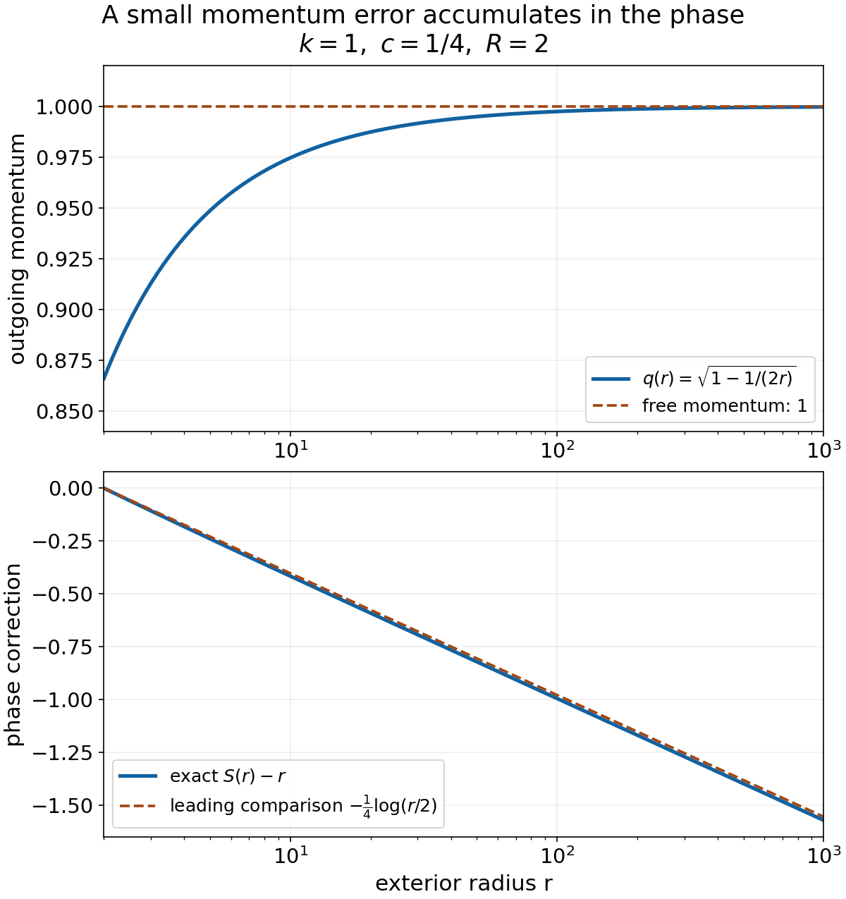

# Smooth long-range phases from Hamilton trajectories

*Written by GPT-6.1 Sol (OpenAI) and GPT-6 Astra (OpenAI). Self-checked by the writing AI. Original exposition: CC0.*

**Working question: Which action produces the phase required by the wave modifier?** The frequency gradient of a phase records the ray position. Integrating the Hamilton action supplies that gradient with the correct sign, even when the phase correction is unbounded in time. The needed bounds concern every frequency derivative on compact regular-velocity sets; smallness of the potential alone would not control those derivatives.

A phase can encode an entire family of trajectories: its frequency gradient is their position. For a long-range perturbation, the free phase \(tP_0\) needs a correction that may grow as time tends to infinity. We construct that correction through an action integral, control every frequency derivative, and join the local phases into one real smooth function for both time directions.

Read [Hamilton trajectories under a long-range force](hamilton-trajectories-under-a-long-range-force.md), especially the derivative-product calculation and the uniform future flow theorem. We use only its spatial data estimates. The [written coordinate inverse proof](../providers/analysis/coordinate-inverses-and-integration.md#coordinate-inverse) supplies smooth inverses and parameter-dependent implicit functions; its [finite bump construction](../providers/analysis/coordinate-inverses-and-integration.md#finite-partitions) supplies the cutoffs. Section 6 constructs the required exhaustion. The method of characteristics and its signs are proved through the action identity below.

For further reading on Hamilton–Jacobi phases and characteristics, see Hörmander [HW], Teschl [T] and Oh [O]. We also use the [continuous scalar fundamental theorem](../providers/analysis/hilbert-valued-integration.md#continuous-primitives), [compactness and uniform continuity](../providers/analysis/hilbert-valued-integration.md#compact-scalar-calculus), and [real powers and logarithms](../providers/analysis/elementary-functions-and-cutoffs.md#logarithm-and-real-powers). Write \(X=(1+|x|^2)^{1/2}\).

## 1. The phase we seek and an exact model

Let \(P_0\) be a real nonconstant polynomial and let \(V_L(x,\xi)\) be a polynomial in \(\xi\) of arbitrary finite order, with real smooth coefficients. On each compact frequency set \(K\), assume

\[
 |\partial_\xi^\alpha\partial_x^\beta V_L(x,\xi)|
       \le C_{\alpha\beta,K}X^{-m(|\beta|)}.
 \tag{1}
\]

Here \(\kappa=2\), \(0<\delta<1/3\), and

\[
 \begin{gathered}
 m(j)=j+\delta\quad(0\le j\le2),\\
 m(j)=1+(1+\delta)j/2\quad(j\ge2),\\
 \Omega=\{\xi:\nabla P_0(\xi)\ne0\}.
 \end{gathered}
 \tag{2}
\]

Write \(\mu(k)=k+1-m(k+1)\) and \(a(k)=\max(\mu(k),0)\).

**Theorem 1.1 (a global long-range phase).** There is a real
\(W\in C^\infty(\mathbb R^n\times\mathbb R)\) such that, for every compact
\(K\subset\Omega\), on both sufficiently late time half-lines,

\[
\begin{gathered}
\partial_tW=P_0(\xi)+V_L(\partial_\xi W,\xi),\\ |\partial_\xi^\alpha(W-tP_0)|\\ \le C_{\alpha,K}|t|^{1+|\alpha|-m(|\alpha|)}\\ (\xi\in K).
\end{gathered}
\tag{3}
\]

Every multiindex is included. The time threshold depends on \(K\), while the constants can also depend on the derivative order. No ellipticity or fixed energy is assumed. The relevant set is where the free velocity is nonzero.

For orientation, on the line with \(P_0(\xi)=\xi\) and
\(V_L(x,\xi)=a(1+x^2)^{-\delta/2}\), an exact phase is

\[
 W(\xi,t)=t\xi+
       a\int_0^t(1+s^2)^{-\delta/2}\,ds.
 \tag{4}
\]

Its gradient is \(t\), and direct differentiation proves the equation.
Its correction is asymptotic to
\(a\,\operatorname{sgn}(t)|t|^{1-\delta}/(1-\delta)\).
All positive frequency derivatives of that correction vanish.
Exercise 5 proves these assertions and the general time reversal.
The construction below handles the full polynomial Hamiltonian.

## 2. The action constructs the phase and proves its exact equation

Fix inner frequency domains \(O_1\Subset O_2\Subset\Omega\), a large initial time \(T\), and the trajectory starting from the free initial graph. Section 3 constructs its inverse projection \(G_t\); Section 4 proves all derivative bounds used here. Put \(H_L(x,\xi)=P_0(\xi)+V_L(x,\xi)\), and let the initial phase be
\(W_T(\eta)=TP_0(\eta)\). Define, along each orbit,
\[
\begin{aligned}
 S(t,\eta)&=W_T(\eta)+\\
 &\quad\int_T^t\bigl(H_L(x(s,\eta),\xi(s,\eta))\\
 &\qquad+x(s,\eta)\cdot\xi'(s,\eta)\bigr)\,ds.
 \end{aligned}
\tag{5}
\]
This is a real smooth finite-time integral. Here is the parameter-differentiation justification. On a compact time interval and a small closed parameter box, the integrand and each of its parameter derivatives are continuous and uniformly continuous. By the segment form of the fundamental theorem, a parameter difference quotient of the integrand is the average of its first derivative along the intervening parameter segment. It converges uniformly to that derivative, so its integral converges as well, with error at most the interval length times the uniform error. Repeating this argument proves every parameter derivative under the integral. The fundamental theorem handles the upper time endpoint; repetition gives all mixed derivatives. The local flow extends through its starting time, so these assertions also hold in a neighborhood of \(t=T\). Set
\(W(\xi,t)=S(t,G_t(\xi))\) on \(O_1\times[T,\infty)\).

To identify its gradient without assuming a global generating function theorem, differentiate the integrand with respect to \(\eta\):
\[
\begin{aligned}
 \partial_\eta(H_L+x\cdot\xi')
 &=H_{L,x}\cdot x_\eta+H_{L,\xi}\cdot\xi_\eta\\
 &\quad+x_\eta\cdot\xi'+x\cdot\partial_\eta\xi'\\
 &=x'\cdot\xi_\eta+x\cdot\partial_\eta\xi'\\
 &=\partial_s(x\cdot\xi_\eta).
 \end{aligned}
\tag{6}
\]
The cancellation uses \(\xi'=-H_{L,x}\), and the last identity uses
\(x'=H_{L,\xi}\). Since \(\partial_\eta W_T=x(T,\eta)\) and
\(\xi_\eta(T,\eta)=I\), integration gives
\(\partial_\eta S=x(t,\eta)\cdot\xi_\eta(t,\eta)\).
After inversion this says
\[
 \partial_\xi W=x=t(\nabla P_0(\xi)+Z(\xi,t)).
 \tag{7}
\]
Along the orbit, differentiation of \(W(\xi(t,\eta),t)\) gives
\(W_t+W_\xi\cdot\xi'=H_L+x\cdot\xi'\).
Using (7) cancels the second terms and yields \(W_t=H_L\), the exact Hamilton–Jacobi equation in (3).

For \(|\alpha|\ge1\), differentiation of (7) and the displacement estimate (14) proved in Sections 3–4 gives
\[
 |\partial_\xi^\alpha(W-tP_0)|
       \le Ct^{1+\mu(|\alpha|-1)}
       =Ct^{1+|\alpha|-m(|\alpha|)}.
 \tag{8}
\]
For \(\alpha=0\), the initial difference is zero. At fixed \(\xi\in O_1\),
\[
 \partial_t(W-tP_0)=V_L(\partial_\xi W,\xi)=O(t^{-\delta}),
 \tag{9}
\]
because \(|\partial_\xi W|\ge ct/2\) for large \(T\). Integrating at fixed frequency gives \(W-tP_0=O(t^{1-\delta})\), which is exactly the required zeroth-order bound. This proves a local future phase on every inner compact regular-frequency domain.

## 3. A frequency projection with an actual inverse on a full inner domain

Let \(O_1\Subset O_2\Subset\Omega\), and start the Hamilton equations at time \(T\) with
\[
 \xi(T,\eta)=\eta,\qquad x(T,\eta)=T\nabla P_0(\eta).
 \tag{10}
\]
In the scaled coordinates, this is \(z(T,\eta)=0\). Choose compact frequency neighborhoods within \(\Omega\) and a small fixed \(z\)-ball so the open flow domain is stable under contractions of \(z\). The uniform flow theorem gives, uniformly in \(\eta\) on an outer compact neighborhood of \(O_2\),
\[
\begin{gathered}
|\xi(t,\eta)-\eta|\le CT^{-\delta},\\ |D_\eta\xi(t,\eta)-I|\le CT^{-\delta},\\ t\ge T.
\end{gathered}
\tag{11}
\]

Here is a way to avoid assuming global injectivity from local invertibility on a possibly nonconvex domain. Choose a fixed smooth compact cutoff \(\rho\) in that outer neighborhood, equal one on a neighborhood of \(\overline{O_1}\), with a fixed positive margin to its transition region. Extend
\(\rho(\eta)(\xi(t,\eta)-\eta)\) by zero to all of \(\mathbb R^n\).
Its supremum and first derivative are \(O(T^{-\delta})\).
For sufficiently large \(T\), call this extended error \(E_t\), with
\(\|DE_t\|_\infty<1/2\). For every \(\xi\in\mathbb R^n\), the equation
\[
 \eta=\xi-E_t(\eta)
 \tag{12}
\]
is a contraction on the complete space \(\mathbb R^n\), so the geometrically summable iteration from the preceding flow proof gives exactly one solution. Smoothness, including the time parameter, follows from the written inverse proof applied to \((\eta,t)\mapsto(\eta+E_t(\eta),t)\). Its block triangular derivative has invertible diagonal blocks \(I+DE_t\) and \(1\); its local inverses agree by uniqueness of the fixed point. If \(\xi\in O_1\), then \(|\eta-\xi|\le\|E_t\|_\infty\) keeps \(\eta\) inside the region where \(\rho=1\). Thus this inverse is the inverse of the original frequency projection on \(O_1\), for all \(t\ge T\).

Higher derivatives of the extended map satisfy the \(t^{a(k)}\) bounds: cutoff derivatives multiply lower derivatives of the original error, and \(a\) is nondecreasing. Section 4 below therefore gives the same bounds for its inverse. Write that inverse as \(\eta=G_t(\xi)\), and define
\[
 Z(\xi,t)=z(t,G_t(\xi)).
 \tag{13}
\]
The scaled flow with zero initial displacement obeys
\(\partial_\eta^\alpha z=O(t^{\mu(|\alpha|)})\) for all orders, including zero. Applying (15) to the finite composition with \(G_t\) gives
\[
 |\partial_\xi^\alpha Z(\xi,t)|
       \le C_\alpha t^{\mu(|\alpha|)},\qquad \xi\in O_1.
 \tag{14}
\]

## 4. Controlling every derivative of the inverse map

Use \(\mu(k)=k+1-m(k+1)\), \(a(k)=\max(\mu(k),0)\) and
\(\theta=(1-\delta)/2\). [Hamilton trajectories under a long-range force](hamilton-trajectories-under-a-long-range-force.md), Section 3, establishes
\[
\begin{gathered}
\mu(q)+\sum a(k_i)\le\mu(k),\\ k_i\ge1,\quad\sum k_i=k,\quad q=\#\{k_i\}.
\end{gathered}
\tag{15}
\]
We also need its positive-part counterpart
\[
 a(q)+\sum a(k_i)\le a(k).
 \tag{16}
\]
If \(q\ge2=\kappa\), then \(a(q)=\mu(q)\); (15) proves (16), since \(k\ge q\) also has \(a(k)=\mu(k)\). If \(q=1\), then \(a(1)=0\) and the single input order is \(k\), so (16) is equality. This supplies every derivative order used below.

Suppose a frequency map \(F_t(\eta)\) has
\(\|DF_t-I\|<1/2\), and positive-order derivatives bounded by
\(C_k t^{a(k)}\). Its inverse, wherever defined, has the same higher derivative bounds. The first inverse derivative is bounded by \(2\). For order \(k\ge2\), differentiate
\(F_t(G_t(\xi))=\xi\). The term containing \(D^kG_t\) is
\(DF_t(G_t)D^kG_t\). Each remaining term is a derivative \(D^qF_t\) with \(q\ge2\), multiplied by inverse derivatives of positive orders less than \(k\) summing to \(k\). Induction, (16), and the inverse first-derivative bound give \(D^kG_t=O(t^{a(k)})\). These are finite product and chain expansions; no unspecified infinite symbolic series is used.

## 5. Restarting from a small nonzero exact initial graph

Globalization needs more than the zero-displacement construction. Suppose at a large initial time \(T\) we have a real smooth initial phase
\[
\begin{gathered}
W_T=TP_0+h_T,\\ |\partial_\eta^\alpha h_T|\le C_\alpha T^{1+|\alpha|-m(|\alpha|)}
\end{gathered}
\tag{17}
\]
on an outer frequency region. Its initial scaled displacement is
\(\psi(\eta)=T^{-1}\partial_\eta h_T(\eta)\).
Then every order satisfies
\[
 |\partial_\eta^\alpha\psi|\le C_\alpha T^{\mu(|\alpha|)}.
 \tag{18}
\]
In particular \(\psi\) and its first derivative are \(O(T^{-\delta})\), since \(\kappa=2\). The data graph lies in the same small flow domain for large \(T\).

The spatial-data flow estimates imply that the composed frequency projection
\(\eta\mapsto\xi(t,\psi(\eta),\eta)\) is \(C^1\)-close to the identity with error \(O(T^{-\delta})\). For its first derivative, the extra term
\(\xi_w\,D\psi\) is \(O(T^{-2\delta})\), while
\(\xi_\eta-I=O(T^{-\delta})\).
Its higher derivatives are \(O(t^{a(k)})\), by (16), using
\(T^{a(k)}\le t^{a(k)}\).
The cutoff-contraction inversion of Section 3 therefore applies again.

The composed displacement also has the full bound
\[
 |\partial_\eta^\alpha z(t,\psi(\eta),\eta)|
       \le C_\alpha t^{\mu(|\alpha|)}.
 \tag{19}
\]
For orders zero and one, retain the special homogeneous term \(T\psi/t\):
\[
 (T/t)T^{-\delta}\le t^{-\delta},
                  \quad\text{since }T\le t,\quad 1-\delta>0.
 \tag{20}
\]
The remaining terms are bounded by \(Ct^{-\delta}\) from the flow estimates. At higher orders, outer flow derivatives of order at least two already have the \(t^{\mu(q)}\) bound; their inner derivatives are bounded by \(t^{a(k_i)}\), so (15) applies. The exceptional first outer \(w\)-derivative gives
\[
\begin{gathered}
(T/t)|D^k\psi|+Ct^{-\delta}|D^k\psi|\\ \le Ct^{\mu(k)},\quad k\ge2,
\end{gathered}
\tag{21}
\]
because \(\mu(k)>0\) and \(\mu(k)+1>0\). First outer \(\eta\)-derivatives have no higher derivatives of the affine input \(\eta\). This proves every term in (19), including the special terms often hidden in a composition estimate.

Composition with the inverse projection gives the analog of (14). The action (5), now starting from the exact phase \(W_T\), has the same cancellation proof and solves the Hamilton–Jacobi equation. The gradient estimates follow exactly as before. Its zeroth-order initial difference is \(O(T^{1-\delta})\); adding \(\int_T^t O(s^{-\delta})\,ds\) proves the required \(O(t^{1-\delta})\) bound.

## 6. Exhaustion and exact agreement of successive solutions

Here is an explicit exhaustion and cutoff construction. If \(\Omega\ne\mathbb R^n\), set \(d(\xi)=\operatorname{dist}(\xi,\mathbb R^n\setminus\Omega)\) and take

\[
 \Omega_j=\{\xi:|\xi|<j+1,\ d(\xi)>1/(j+1)\},\qquad j\ge0.
\]

The distance function is continuous because the triangle inequality gives \(|d(\xi)-d(\eta)|\le|\xi-\eta|\). The sets are open, their closures are compact inside the next set, and they exhaust \(\Omega\). For \(\Omega=\mathbb R^n\), use the balls \(|\xi|<j+1\). Initial empty sets can be discarded and the sequence relabelled. To obtain a cutoff equal to one near a compact inner set, use finitely many bumps supported in the outer set, whose sum \(b\) is positive on the inner set. Its compact minimum is some \(c>0\). Compose \(b\) with a smooth scalar function zero for \(s\le c/3\) and one for \(s\ge2c/3\). Such a function is obtained by integrating and normalizing a nonnegative smooth bump in \((c/3,2c/3)\). This proves the cutoff properties used here and below.

Choose times \(T_j\to\infty\), strictly increasing. Begin with a future solution \(W_1\) on \(\Omega_1\times[T_1,\infty)\), constructed using the initial free graph on \(\Omega_2\).

Suppose \(W_j\) is available on \(\Omega_j\times[T_j,\infty)\) with all estimates (3). Choose
\(\chi_j\in C_c^\infty(\Omega_j)\), equal one on a neighborhood of
\(\overline{\Omega_{j-1}}\). At a new sufficiently large time \(T=T_{j+1}\), put
\[
\begin{gathered}
W_T(\eta)=TP_0(\eta)\\ +\chi_j(\eta)(W_j(\eta,T)-TP_0(\eta)).
\end{gathered}
\tag{22}
\]
The cutoff term extends smoothly by zero outside \(\Omega_j\); this gives an exact global initial phase on the source domain \(\Omega_{j+2}\).
Every derivative of its correction satisfies (17): a derivative hitting the cutoff leaves an order \(\ell\le|\alpha|\) derivative of \(W_j-TP_0\), and
\(\ell-m(\ell)\le|\alpha|-m(|\alpha|)\).
The restarted construction of Section 5 yields \(W_{j+1}\) on
\(\Omega_{j+1}\times[T_{j+1},\infty)\) with the full estimates.

It agrees exactly with \(W_j\) on
\(\Omega_{j-1}\times[T_{j+1},\infty)\), for a sufficiently large new time.
To justify this equality, select a fixed buffer between
\(\overline{\Omega_{j-1}}\) and the region where \(\chi_j\ne1\).
Frequency displacement and inverse projection displacement are \(O(T_{j+1}^{-\delta})\), uniformly for all future times. Thus a final frequency in \(\Omega_{j-1}\) starts in the \(\chi_j=1\) region, and its entire characteristic remains in the domain of the old solution, within the buffer.

To verify that the old phase stays on the same graph, follow any of these new characteristics on an arbitrary finite interval \([T,t_1]\) and set \(y(s)=\partial_\xi W_j(\xi(s),s)\). Differentiating the old Hamilton–Jacobi equation gives
\(y'=H_{L,\xi}(y,\xi)+D_\xi^2W_j[H_{L,x}(y,\xi)-H_{L,x}(x,\xi)]\).
Subtract \(x'=H_{L,\xi}(x,\xi)\). On this finite interval, the trajectories, their connecting position segments and the Hessian of \(W_j\) range over compact sets. The mean-value bound therefore gives \(|(y-x)'|\le C|y-x|\). Initially \(y-x=0\), because the cutoff is identically one near the starting frequency. The integral inequality proved in the preceding flow lesson forces \(y=x\) throughout the interval. Since \(t_1\) was arbitrary, the equality holds for every future time.

Along this orbit the derivative of \(W_j(\xi(s),s)\) is \(H_L+x\cdot\xi'\). Its starting value is exactly (22), so integration gives the same action as the restarted phase. Thus the phase values, as well as their gradients, agree on the whole inner domain and future time interval.

The solutions therefore define one smooth future phase \(W_\infty\) on
\[
 \mathcal U=\bigcup_{j\ge1}
                 \Omega_{j-1}\times(T_j,\infty).
 \tag{23}
\]
Pairwise overlaps agree by repeated use of the just-proved equality. Every compact frequency subset of \(\Omega\) occurs in an inner domain, with a sufficiently late half-line of time.

## 7. A global smooth extension with no eventual cutoff error

Here is an explicit extension, to avoid leaving the global \(C^\infty\) assertion implicit. Choose
\(\rho_j\in C_c^\infty(\Omega_j)\), values in \([0,1]\), equal one near
\(\overline{\Omega_{j-1}}\). Choose smooth \(\vartheta_j(t)\), zero for
\(t\le T_{j+1}+1\), one for \(t\ge T_{j+1}+2\), also with values in \([0,1]\).
Define
\[
 \chi(\xi,t)=1-\prod_{j\ge1}
                       (1-\rho_j(\xi)\vartheta_j(t)).
 \tag{24}
\]
At every bounded time range only finitely many factors are nontrivial, since \(T_j\to\infty\). Thus the product is locally finite and smooth. Its support is contained in the locally finite union of the closed supports of the individual products; each is contained in
\(\Omega_j\times(T_{j+1},\infty)\subset\mathcal U\).
Consequently its closed support lies in \(\mathcal U\).

Set \(W^+=\chi W_\infty\) on \(\mathcal U\), and zero outside it. This is globally smooth and vanishes outside \(\Omega\times\mathbb R\), and for all sufficiently small positive or nonpositive times.
For any compact \(K\subset\Omega\), choose \(j\) with \(K\subset\Omega_{j-1}\). For \(t\ge T_{j+1}+2\), the corresponding factor has
\(\rho_j\vartheta_j=1\) on a neighborhood of \(K\). Thus \(\chi=1\), with all derivatives zero, on that neighborhood for all such times. The exact Hamilton–Jacobi equation and all bounds survive unchanged there. This gives the required future portion of the global function.

## 8. Negative times with the exact sign transformation

Apply the entire future construction to
\(\widetilde P_0=-P_0\), \(\widetilde V_L=-V_L\).
The real polynomial hypotheses, derivative bounds and regular-frequency set \(\Omega\) are unchanged. Its global future phase
\(\widetilde W^+(\xi,s)\) obeys
\[
\begin{gathered}
\partial_s\widetilde W^+\\ =-P_0(\xi)-V_L(\partial_\xi\widetilde W^+,\xi),\\ \widetilde W^+\sim-sP_0.
\end{gathered}
\tag{25}
\]
Define \(W^-(\xi,t)=\widetilde W^+(\xi,-t)\), supported at sufficiently negative times. Then
\[
\begin{gathered}
\partial_tW^-=P_0(\xi)+V_L(\partial_\xi W^-,\xi),\\ W^--tP_0=O(|t|^{1-\delta}),
\end{gathered}
\tag{26}
\]
with every derivative bound (3).
The supports of \(W^+\) and \(W^-\) are disjoint near \(t=0\).
Their sum \(W=W^++W^-\) is therefore a real global \(C^\infty\) function, solves the exact equation for sufficiently large \(|t|\) on every compact \(K\subset\Omega\), and satisfies all the required frequency derivative bounds there. This proves Theorem 1.1.

## 8A. An exterior radial phase with only two potential derivatives

The spatial eikonal phase and the time-dependent Hamilton–Jacobi phase can be compared exactly in a radial model. [Ito and Skibsted, *Scattering theory for C² long-range potentials*, free author preprint arXiv:2408.02979v1](https://arxiv.org/pdf/2408.02979v1), Condition 1.1, Theorems 1.3, 1.5 and 1.14, and §5.1, provide the modern context. Their setting is \(-\tfrac12\Delta+V+q\) in dimension at least two; their short-range term has a weighted relative compactness condition, and absence of positive eigenvalues is explicitly assumed. The intermediate strong radiation estimate uses higher regularity of a regularized potential. These hypotheses do not state a theorem for every polynomial differential perturbation. The following radial construction gives an explicit phase and its exact residual. For its spatial norms use [Endpoint spaces and flat energy shells](endpoint-spaces-and-flat-energy-shells.md), Sections 1–2, including the exact zero-tail criterion in Theorem 2.1. The measure and dominated-convergence inputs are proved in the [programme measure foundation](../providers/analysis/finite-derivative-l2.md#measure-foundations).

**Proposition 8.2 (radial action, time and outgoing flux).** Let \(d\ge2\), \(I=[\lambda_-,\lambda_+]\subset(0,\infty)\), \(R\ge1\), and let \(v\in C^2([R,\infty);\mathbb R)\) satisfy

\[
 \begin{gathered}
 |v(r)|\le\lambda_-/2,\\
 |v^{(j)}(r)|\le Cr^{-\rho-j}\quad(j=0,1,2),\\
 0<\rho\le1.
 \end{gathered}
\]

For \(\lambda\in I\), put

\[
 \begin{gathered}
 k=\sqrt{2\lambda},\quad q(\lambda,r)=\sqrt{2\lambda-2v(r)},\\
 S(\lambda,r)=kR+\int_R^r q(\lambda,s)\,ds.
 \end{gathered}
\]

Then \(S\) solves \(\tfrac12|\nabla_xS(\lambda,|x|)|^2+v(|x|)=\lambda\) for \(|x|>R\). Uniformly for \(\lambda\in I\), its difference from \(kr\) is \(O(r^{1-\rho})\) for \(\rho<1\) and \(O(\log r)\) for \(\rho=1\); its first and second radial derivative differences are \(O(r^{-\rho})\) and \(O(r^{-1-\rho})\).

Write \(T_\lambda(r)=\partial_\lambda S(\lambda,r)\). On the open domain

\[
 \mathcal D=\{(t,r):r>R,\ T_{\lambda_+}(r)<t<T_{\lambda_-}(r)\},
\]

there is a unique \(\lambda_c(t,r)\in(\lambda_-,\lambda_+)\) with \(T_{\lambda_c}(r)=t\). The function

\[
 K(t,r)=S(\lambda_c(t,r),r)-t\lambda_c(t,r)
\]

solves \(\partial_tK+\tfrac12(\partial_rK)^2+v(r)=0\) on \(\mathcal D\). In the free case it is \(K=r^2/(2t)\) on this domain.

For \(h=(d-1)/2\), \(a(\lambda,r)=r^{-h}q(\lambda,r)^{-1/2}\), and \(b\in C^2(S^{d-1})\), the outgoing model \(u=a e^{iS}b\) has the exact sphere flux

\[
 \operatorname{Im}\int_{|x|=r}\overline u\,\partial_ru\,d\sigma_r
 =\|b\|_{L^2(S^{d-1})}^2.
\]

Its residual for \(H=-\tfrac12\Delta+v(|x|)\) is

\[
 \begin{gathered}
 \mathcal R_r=\frac{h(1-h)}{r^2}-\frac{q''}{2q}
              +\frac{3(q')^2}{4q^2},\\
 (H-\lambda)u=-\frac12ae^{iS}
 \left[\mathcal R_r b+\frac{\Delta_{S^{d-1}}b}{r^2}\right].
 \end{gathered}
\]

For the cutoff assertion take any bounded real extension of \(v\) inside the ball. After a smooth cutoff which is zero for \(r\le R\) and one for \(r\ge2R\), this model is in \(B^*\), its residual is in \(B\), and, for \(b\ne0\), it is outside \(B^*_0\) and \(L^2\). No exact generalized eigenfunction is asserted by the model formula alone.

**Proof.** Positivity gives \(q\ge\sqrt{\lambda_-}\). Rationalization and differentiation yield

\[
 \begin{gathered}
 q-k=\frac{-2v}{q+k},\quad q'=-\frac{v'}q,\\
 q''=-\frac{v''}q-\frac{(v')^2}{q^3}.
 \end{gathered}
\]

Since \(S'=q\), the eikonal identity is exact. The displayed identities give the derivative bounds, and integration of \(r^{-\rho}\) gives the phase bound. Only the stated two derivatives of \(v\) are used. Differentiating the integral with respect to energy gives

\[
 \begin{gathered}
 T_\lambda(r)=\frac Rk+\int_R^r\frac{ds}{q(\lambda,s)},\\
 \partial_\lambda T_\lambda(r)
 =-\frac R{k^3}-\int_R^r\frac{ds}{q(\lambda,s)^3}<0.
 \end{gathered}
\]

Strict monotonicity, the intermediate value theorem and the implicit function theorem prove existence, uniqueness and \(C^2\) regularity of the critical energy on \(\mathcal D\). At that energy, differentiating \(K\) cancels the term \((\partial_\lambda S-t)d\lambda_c\). Thus \(K_t=-\lambda_c\) and \(K_r=q(\lambda_c,r)\), proving its equation. When \(v=0\), \(S=kr\), \(t=r/k\), and substitution gives \(K=r^2/(2t)\). Also \(\partial_rT=1/q\): physical radial time satisfies \(dr/dt=q\), with the positive outgoing sign.

The real amplitude satisfies

\[
 \begin{gathered}
 \frac{a'}a=-\frac hr-\frac{q'}{2q},\\
 2qa'+\left(q'+\frac{d-1}{r}q\right)a=0.
 \end{gathered}
\]

The polar formula can be derived at the precise regularity used here. In a sphere chart \(\omega=\omega(y)\), differentiating \(x=r\omega(y)\) gives the radial unit vector orthogonal to all angular tangents, and metric \(dr^2+r^2g_{S^{d-1}}\). Its determinant and the [proved change-of-variables and surface formulas](../providers/analysis/coordinate-inverses-and-integration.md#surface-coordinates) give volume \(r^{d-1}dr\,d\omega\). For compact smooth tests in a chart, Euclidean integration by parts writes \(\int(\Delta f)\varphi=-\int\nabla f\cdot\nabla\varphi\). Substitute the block metric and volume; one-dimensional integration by parts in \(r\) and in each chart coordinate identifies the operator as \(\partial_r^2+(d-1)r^{-1}\partial_r+r^{-2}\Delta_{S^{d-1}}\). The identity holds pointwise for \(C^2\) functions because both sides are continuous and have the same integrals against every compact smooth test. Indeed, a nonzero real or imaginary part of their difference would have a fixed strict sign on a small ball; integration against a nonnegative bump there would contradict the zero test integral. In angular coordinates the operator just identified is \(\Delta_{S^{d-1}}b=|g|^{-1/2}\partial_{y_i}(|g|^{1/2}g^{ij}\partial_{y_j}b)\), with summation over the finitely many chart coordinates. This defines it at the stated \(C^2\) regularity and the derived Euclidean identity makes the definitions agree on overlapping charts. The second transport identity cancels the imaginary term when differentiating \(ae^{iS}b\) twice. The real eikonal term cancels \(v-\lambda\). The radial Laplacian of the amplitude is

\[
 \frac{a''+(d-1)a'/r}{a}
 =\frac{h(1-h)}{r^2}-\frac{q''}{2q}+\frac{3(q')^2}{4q^2},
\]

and the angular Laplacian contributes \(r^{-2}a\Delta_{S^{d-1}}b\). This proves the residual. Since \(a\) is real, \(\operatorname{Im}(\overline u\partial_ru)=q a^2|b|^2\); multiply by \(r^{d-1}\) and use \(r^{d-1}qa^2=1\) to get the flux.

Finally \(q\to k\), and spherical integration gives

\[
 \lim_{L\to\infty}\frac1L\int_{R<|x|<L}|u|^2dx
 =\frac{\|b\|_2^2}{k}.
\]

The limit follows directly by bounding \(|q^{-1}-k^{-1}|\) by an arbitrarily small constant outside a fixed radius. Shell mass is \(O(R_j)\), and its normalized squared mass tends to \(\|b\|_2^2/(2k)\): on \([R_j/2,R_j]\), the uniformly vanishing difference \(q^{-1}-k^{-1}\) contributes at most half its supremum after division by \(R_j\). This proves \(B^*\) membership, failure of the zero-tail condition and failure of \(L^2\) for nonzero \(b\). The residual's shell norm is \(O(R_j^{-3/2})\), because its radial factor is \(O(r^{-h-2})\). Its \(B\)-sum is bounded by a constant times \(\sum_jR_j^{-1}\). The cutoff commutator is supported in a compact annulus and is square integrable, so it changes none of these conclusions. \(\square\)

For the Coulomb exterior \(v(r)=c/r\), with \(c>0\) and \(R\) large enough for the hypotheses, Taylor's formula for the square root gives

\[
 q=k-\frac{c}{kr}+O(r^{-2}),\qquad
 S-kr=-\frac ck\log r+C_{\lambda,R}+O(r^{-1}).
\]

The remainder estimate follows from two applications of the scalar fundamental theorem to \(f(u)=\sqrt{1-u}\) on a fixed interval where \(1-u\) is bounded below: \(f(0)=1\), \(f'(0)=-1/2\), and bounded \(f''\) give \(|f(u)-1+u/2|\le C u^2\). Substitute \(u=2c/(k^2r)\). The resulting \(O(r^{-2})\) error is integrable at infinity, and its tail is \(O(r^{-1})\); its integral supplies the finite constant \(C_{\lambda,R}\). The derivative tends to the free value while the phase correction has no finite limit. Replacing \(e^{iS}\) by \(e^{ikr}\) would discard this long-range information. The normalization here gives unit flux for \(\|b\|_2=1\); it is not a claimed normalization of the full distorted Fourier transform.

*Figure: the exact positive momentum \(q=\sqrt{1-1/(2r)}\) approaches one, while the phase correction \(S-r\), normalized to zero at \(R=2\), continues to decrease. The dashed curve is only the leading comparison \(-\tfrac14\log(r/2)\). Proposition 8.2 and the Coulomb calculation prove the mechanism; plotted values use its explicit integral, not a fit. Original figure and reproducible Python source: GPT-6.1 Sol (OpenAI), Ultra, CC0. Further reading: Ito–Skibsted, cited above.*

### Use the conclusion

Differentiate the action identity once before following the all-derivative estimates. Check the local inverse and the gluing across compact frequency sets for both time directions.

## 9. Exercises with complete solutions

**Exercise 1 — Basic — why the action has these signs.**

Let \(H(x,\xi)\) be a real smooth Hamiltonian, \(x'=H_\xi\), \(\xi'=-H_x\), and let the initial graph be
\(x(T,\eta)=\partial_\eta W_T(\eta)\), \(\xi(T,\eta)=\eta\).
Assume the frequency projection has a smooth inverse. Define
\[
\begin{aligned}
 S(t,\eta)&=W_T(\eta)+\\
 &\quad\int_T^t[H(x(s,\eta),\xi(s,\eta))\\
 &\qquad+x(s,\eta)\cdot\xi'(s,\eta)]\,ds.
 \end{aligned}
\tag{27}
\]
Prove that its expression \(W(\xi,t)\) in final-frequency coordinates satisfies
\(W_\xi=x\) and \(W_t=H(W_\xi,\xi)\).
Explain why replacing the plus sign before \(x\cdot\xi'\) by a minus sign does not give this cancellation.

**Solution 1.** For every data coordinate \(\eta_j\), the product rule gives
\[
\begin{aligned}
 \partial_{\eta_j}(H+x\cdot\xi')
 &=H_x\cdot x_{\eta_j}+H_\xi\cdot\xi_{\eta_j}\\
 &\quad+x_{\eta_j}\cdot\xi'+x\cdot\xi'_{\eta_j}\\
 &=x'\cdot\xi_{\eta_j}+x\cdot\xi'_{\eta_j}\\
 &=\partial_s(x\cdot\xi_{\eta_j}).
 \end{aligned}
\tag{28}
\]
The first and third terms cancel because \(\xi'=-H_x\).
At the initial time \(\xi_{\eta_j}=e_j\) and
\(\partial_{\eta_j}W_T=x_j(T,\eta)\). Integration therefore gives
\(\partial_{\eta_j}S=x(t,\eta)\cdot\xi_{\eta_j}(t,\eta)\).
Since \(S(t,\eta)=W(\xi(t,\eta),t)\) and the projection derivative is invertible, this identity implies \(W_\xi=x\).
Differentiation in time along the same trajectory yields
\[
 W_t+W_\xi\cdot\xi'=H+x\cdot\xi'.
 \tag{29}
\]
The gradient identity cancels the dot products, leaving \(W_t=H\).
With a minus sign in the action, the data derivative instead contains
\((H_x-\xi')\cdot x_{\eta_j}=2H_x\cdot x_{\eta_j}\), and its remaining terms do not form \(\partial_s(x\cdot\xi_{\eta_j})\).
The plus sign is dictated by using frequency, rather than position, as the phase variable.

**Exercise 2 — Intermediate — inversion without a convex domain.**

Let \(O\Subset\widetilde O\) be bounded open frequency domains, with no convexity assumption.
Suppose \(F_t(\eta)=\eta+e_t(\eta)\) is smooth on a neighborhood of
\(\overline{\widetilde O}\), with
\(\|e_t\|_\infty+\|De_t\|_\infty\le CT^{-\delta}\) uniformly for \(t\ge T\).
Choose a cutoff equal one on an inner neighborhood of \(\overline O\).
Construct an actual inverse on \(O\).
For \(\kappa=2\), also prove its order-\(k\) derivative bound
\(Ct^{a(k)}\) when \(D^kF_t=O(t^{a(k)})\), where
\(a(k)=\max(\mu(k),0)\).

**Solution 2.** Choose \(\rho\in C_c^\infty(\widetilde O)\), equal one on an open set containing \(\overline O\).
The distance of \(\overline O\) to the complement of that set is a fixed number \(d>0\).
Extend \(E_t=\rho e_t\) by zero to \(\mathbb R^n\).
The product rule gives
\(\|E_t\|_\infty+\|DE_t\|_\infty\le C_\rho T^{-\delta}\).
For sufficiently large \(T\), these bounds give
\(\|DE_t\|_\infty<1/2\) and \(\|E_t\|_\infty<d\).
For each final \(\xi\), the map \(\eta\mapsto\xi-E_t(\eta)\) is a contraction of the complete space \(\mathbb R^n\).
Its successive iterates have geometrically summable differences, converge to a unique fixed point \(G_t(\xi)\), and satisfy
\[
\begin{gathered}
|G_t(\xi)-\xi|\le\|E_t\|_\infty,\\ (I+DE_t(G_t))DG_t=I.
\end{gathered}
\tag{30}
\]
Thus \(DG_t\) is bounded by \(2\). Difference quotients in the fixed-point equation converge to this linear solution; iteration of the finite derivative equations proves smoothness, including smoothness in \(t\).
If \(\xi\in O\), then \(G_t(\xi)\) lies in the region where \(\rho=1\).
Hence \(F_t(G_t(\xi))=\xi\) there.
Moreover, any preimage of \(\xi\in O\) in \(\widetilde O\) must be within \(CT^{-\delta}<d\) of \(\xi\), and is in that same region. The global contraction makes it the unique such preimage.

At order \(k\ge2\), differentiate \((I+E_t)(G_t(\xi))=\xi\).
Its highest term is \((I+DE_t(G_t))D^kG_t\).
Every other term contains an outer derivative of order \(q\ge2\) and inner derivatives of positive orders \(k_i<k\), with \(\sum k_i=k\).
For \(\kappa=2\),
\[
 a(q)+\sum_i a(k_i)\le a(k):
 \tag{31}
\]
when \(q\ge2\), all outer and total exponents are the corresponding \(\mu\)'s, so this is the proved partition inequality; when \(q=1\), it is equality since \(a(1)=0\).
Cutoff derivatives preserve the outer bounds because \(a\) is nondecreasing.
Induction and the bounded inverse matrix give \(D^kG_t=O(t^{a(k)})\).
Neither the construction nor the derivative induction uses convexity of \(O\).

**Exercise 3 — Advanced — restart from a nonzero graph.**

Suppose \(W_T=TP_0+h_T\) satisfies
\[
 |D^\alpha h_T|\le C_\alpha T^{1+|\alpha|-m(|\alpha|)}
 \tag{32}
\]
for \(\kappa=2\), and set \(\psi=T^{-1}\nabla h_T\).
Show that the flow started at \(z=\psi(\eta)\), \(\xi=\eta\) still produces
\(D_\eta^k z=O(t^{\mu(k)})\), uniformly for \(t\ge T\).
Account explicitly for the first outer \(w\)-derivative when \(k\ge2\).
Compute its bound at \(k=3,\delta=1/5\).

**Solution 3.** Differentiating the initial graph gives
\(D^k\psi=O(T^{\mu(k)})\).
Its zeroth and first derivatives are \(O(T^{-\delta})\), so it lies in the small fixed flow domain.
At order zero, the homogeneous initial term is
\[
 (T/t)|\psi|\le C T^{1-\delta}/t\le Ct^{-\delta}.
 \tag{33}
\]
The remaining flow term is \(O(t^{-\delta})\).
At order one, \(z_\eta=O(t^{-\delta})\) and
\(z_w=(T/t)I+O(t^{-\delta})\). Multiplication of the latter by \(D\psi=O(T^{-\delta})\) gives the same bound.

For \(k\ge2\), every term with an outer flow derivative of order \(q\ge2\) is bounded by
\(t^{\mu(q)}\prod_i t^{a(k_i)}\), with \(\sum k_i=k\).
The partition inequality bounds it by \(Ct^{\mu(k)}\).
The term with one outer \(w\)-derivative is different:
\[
 |z_wD^k\psi|
       \le C[(T/t)+t^{-\delta}]T^{\mu(k)}
       \le Ct^{\mu(k)}.
 \tag{34}
\]
The first inequality retains the initial identity derivative. The second uses
\(T^{1+\mu(k)}/t\le t^{\mu(k)}\), since \(\mu(k)>0\), and
\(t^{-\delta}T^{\mu(k)}\le t^{\mu(k)}\) for \(t\ge T\ge1\).
The first outer \(\eta\)-derivative has no higher derivative of the affine input \(\eta\).
These cover every finite chain-rule term.

When \(\delta=1/5\), \(\mu(3)=3/5\). The exceptional homogeneous contribution is bounded by
\(CT^{8/5}/t\le Ct^{3/5}\).
It cannot be estimated by assuming \(z_w=O(t^{-\delta})\): at \(t=T\),
the initial derivative is exactly \(I\).
The retained \(T/t\) term is what makes the restart argument valid.

**Exercise 4 — Advanced — a global smooth extension.**

Let \(\Omega_j\Subset\Omega_{j+1}\) exhaust an open \(\Omega\), and
let strictly increasing \(T_j\to\infty\).
Suppose agreeing smooth phases define \(W_\infty\) on
\(\mathcal U=\bigcup_{j\ge1}\Omega_{j-1}\times(T_j,\infty)\).
With \(0\le\rho_j\le1\), \(\rho_j\in C_c^\infty(\Omega_j)\), equal one near \(\overline{\Omega_{j-1}}\), and
\(\vartheta_j=0\) for \(t\le T_{j+1}+1\), \(\vartheta_j=1\) for
\(t\ge T_{j+1}+2\), prove that
\[
 \chi=1-\prod_{j\ge1}(1-\rho_j\vartheta_j)
 \tag{35}
\]
defines a smooth cutoff with closed support in \(\mathcal U\).
Prove that zero extension of \(\chi W_\infty\) is globally smooth and preserves the exact equation and every estimate eventually on each compact \(K\subset\Omega\).

**Solution 4.** On a bounded time interval, \(T_{j+1}+1\) exceeds its upper endpoint for every sufficiently large \(j\).
The corresponding factors are identically one on an open neighborhood of that interval.
Thus the product is locally a finite product of smooth functions.
The closed support of \(\rho_j\vartheta_j\) lies in
\(\operatorname{supp}\rho_j\times[T_{j+1}+1,\infty)\), a closed subset of
\(\Omega_j\times(T_{j+1},\infty)\subset\mathcal U\).
These supports are locally finite in \(\mathbb R^{n+1}\).
Their union is closed: every point has a neighborhood meeting only finitely many closed supports.
Outside that union every factor is one locally, so \(\chi=0\).
Consequently \(\operatorname{supp}\chi\subset\mathcal U\).

At a point outside \(\mathcal U\), a neighborhood misses the closed support of \(\chi\).
The zero extension is identically zero there; inside \(\mathcal U\) it is a product of smooth functions.
It is therefore globally smooth.
At each bounded time interval it even has compact frequency support, because only finitely many compact supports occur.

Choose \(j\) with \(K\subset\Omega_{j-1}\).
For \(t>T_{j+1}+2\), one factor is zero on a neighborhood of \(K\).
Thus \(\chi\) is identically one on that frequency neighborhood and future half-line, with all its derivatives zero.
The extended phase equals \(W_\infty\) there. Its equation and all derivative estimates are exactly those of \(W_\infty\), with no cutoff remainder.

**Exercise 5 — Intermediate — an exact phase in both time directions.**

On the line, let \(P_0(\xi)=\xi\), \(V_L(x,\xi)=v(x)=a(1+x^2)^{-\delta/2}\), \(0<\delta<1/3\).
Construct a real global smooth phase satisfying the Hamilton–Jacobi equation for every \(t\).
Compute the leading correction at both temporal infinities and check every frequency derivative bound.
Then explain the correct negative-time transformation for a general \(P_0,V_L\).

**Solution 5.** Put
\[
 W(\xi,t)=t\xi+C(t),\qquad C(t)=\int_0^t v(s)\,ds.
 \tag{36}
\]
It is smooth for all real \((\xi,t)\). Since \(W_\xi=t\),
\(W_t=\xi+v(t)=P_0(\xi)+V_L(W_\xi,\xi)\).
For \(r>0\), substitution \(s=ru\) gives
\[
 \frac{C(r)}{r^{1-\delta}}
       =a\int_0^1(r^{-2}+u^2)^{-\delta/2}\,du
       \longrightarrow \frac{a}{1-\delta}.
 \tag{37}
\]
The integrand is bounded in modulus by \(|a|u^{-\delta}\), which is integrable because \(\delta<1\).
Dominated convergence proves the limit. Evenness of \(v\) gives \(C(-r)=-C(r)\), hence
\[
 \frac{C(t)}{\operatorname{sgn}(t)|t|^{1-\delta}}
       \longrightarrow\frac{a}{1-\delta}
       \quad (|t|\to\infty).
 \tag{38}
\]
Also \(|C(t)|\le C|t|^{1-\delta}\) for \(|t|\ge1\).
Every positive frequency derivative of \(W-tP_0=C(t)\) vanishes.
Thus the zeroth-order bound has precisely the allowed exponent, and all higher bounds hold immediately.

For a general Hamiltonian, construct a future phase \(\widetilde W^+(\xi,s)\) for \(-P_0,-V_L\).
Set \(W^-(\xi,t)=\widetilde W^+(\xi,-t)\).
The time chain rule reverses the sign, giving
\[
 W^-_t=P_0(\xi)+V_L(W^-_\xi,\xi).
 \tag{39}
\]
Its free term is \(tP_0\), since \((-t)(-P_0)=tP_0\).
The frequency gradient is unchanged by the time substitution.
Negating the phase itself would instead change that gradient and would require additional symmetry of \(V_L\); no such symmetry is assumed.

## References

[T] Gerald Teschl, [*Ordinary Differential Equations and Dynamical Systems*, free author's preliminary edition](https://www.mat.univie.ac.at/~gerald/ftp/book-ode/ode.pdf), April 2012, §§2.2, 2.4 and 2.6.

[O] Sung-Jin Oh, [*Lecture Notes for Math 222A*, free evolving lecture notes](https://math.berkeley.edu/~sjoh/pdfs/notes-math222a.pdf), University of California, Berkeley, Fall 2023, §2.4.1, pp. 23–24.

[HW] Lars Hörmander, [*The existence of wave operators in scattering theory*, freely readable journal scan](https://gdz.sub.uni-goettingen.de/download/pdf/PPN266833020_0146/LOG_0012.pdf), 1976, §3, Theorem 3.8, pp. 82–83.
