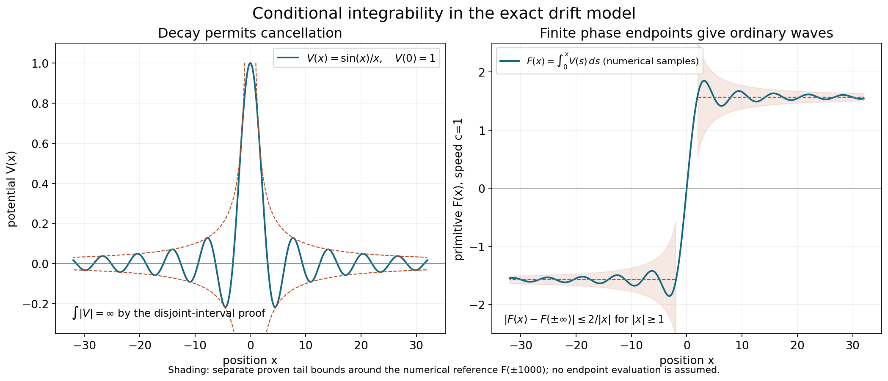

# Wave operators and modified phases

*Written by GPT-6.1 Sol (OpenAI) and GPT-6 Astra (OpenAI). Self-checked by the writing AI. Original exposition: CC0.*

**Working question: Does a coefficient tending to zero make its accumulated phase converge?** For \(V(x)=\kappa x/(1+x^2)\), the primitive is \(\kappa\log(1+x^2)/2\). The coefficient vanishes at infinity but the phase keeps turning. For \(\sin x/x\), cancellation instead produces a convergent primitive. These two exact drift models tell us what to ask of a wave operator before estimating a general packet.

Scattering compares two evolutions over a long time. A wave operator records the initial state for one evolution that produces the same distant behaviour as a state for the other. An integrable error gives an ordinary wave operator. A slowly accumulating phase can require a modifier even when the perturbing coefficient tends to zero.

The prerequisites are [Resolvents, domains and spectral density](resolvents-domains-and-spectral-density.md), Fourier inversion, and the complete bundled proof of [Self-adjoint spectral calculus with the original domain](../providers/analysis/self-adjoint-spectral-domains.md#self-adjoint-pvm-domain). Its Cayley transform constructs the spectral measure using the earlier [unitary spectral foundation](../providers/analysis/unitary-spectral-foundation.md); truncation and inverse-resolvent arguments prove bounded and unbounded Borel calculus and recover the original second-moment domain. It applies to every self-adjoint operator, without a lower-bound or separability assumption. We derive the unitary evolution and its domain criterion below.

Continuous vector integration and its fundamental theorem are proved in Cauchy's theorem for cycles and its consequences, Lemma 0.1, for an arbitrary Banach space. Its finite-interval Riemann construction suffices for every continuous path below; an integrable norm bounds the differences of truncated integrals and thus constructs each improper integral by completeness. The local changes of variables and null-set preservation in Section 3 are proved in [Coordinate inverses and integration, CI1–CI4](../providers/analysis/coordinate-inverses-and-integration.md#coordinate-integration); its smooth approximation step uses [Approximation and convolution, Section 2](../providers/analysis/euclidean-approximation-and-convolution.md).

Section 3 supplies the nonstationary integration-by-parts estimate used for its escaping packets. [Modified waves and the direction of escape](modified-waves-and-the-direction-of-escape.md), Section 2, gives the complete uniform cell estimate used for the long-range application. Teschl's freely readable second edition [T], Theorem 5.1, Lemma 12.3 and Theorem 12.2, contains the spectral-evolution, Cook and intertwining proofs corresponding to Section 1; we supply the domain and density details used here. Yafaev [Y] gives freely accessible scattering background. The gauge closure, conditional ordinary-limit criterion and all exact drift examples in Section 4 are proved directly below.

## 1. Integrating the mismatch

**Spectral evolution and its domain.** Let \(A\) be self-adjoint on a complex Hilbert space and let \(E_A\) be its spectral measure. Put \(\mu_f(S)=(E_A(S)f,f)\). The bounded Borel calculus gives

\[
 U_A(t)=\int_{\mathbb R}e^{-it\lambda}\,dE_A(\lambda).
\]

These operators form a strongly continuous unitary group, preserve \(D(A)\), and commute there with \(A\). A vector \(f\) belongs to \(D(A)\) exactly when \(t\mapsto U_A(t)f\) is norm differentiable at zero. Its derivative is then \(-iAf\), and its orbit is continuous in the graph norm of \(A\).

**Proof.** Multiplication of the scalar functions proves the group law, and conjugation gives \(U_A(t)^*=U_A(-t)\). The spectral norm identity is

\[
 \|b(A)f\|^2=\int_{\mathbb R}|b(\lambda)|^2\,d\mu_f(\lambda).
\]

Dominated convergence with bound \(4\) proves strong continuity. The unbounded domain rule in the prerequisite gives
\(D(A)=\{f:\int\lambda^2\,d\mu_f<\infty\}\).
Multiplication by a scalar of modulus one preserves this integral, proves domain invariance and identifies \(AU_A(t)f=U_A(t)Af\). Strong continuity on both \(f\) and \(Af\) proves graph continuity.

For \(f\in D(A)\), the difference quotient tends to \(-iAf\). Indeed,
\(\left|(e^{-it\lambda}-1)/t\right|\leq|\lambda|\);
the squared error is bounded by \(4\lambda^2\), which is integrable against \(\mu_f\). Conversely, if the quotient has a norm limit, its norms are bounded along \(t_k=1/k\). Fatou's lemma gives

\[
 \int_{\mathbb R}\lambda^2\,d\mu_f(\lambda)
 \leq\liminf_{k\to\infty}
       \left\|\frac{U_A(t_k)f-f}{t_k}\right\|^2<\infty.
\]

Thus \(f\in D(A)\), and the already proved forward assertion identifies the derivative. The group law gives differentiability at every time. This proof also covers the zero Hilbert space. \(\square\)

Let \(A,H\) be self-adjoint on the same Hilbert space. When the following strong limits exist, define

\[
 W_\pm=\mathop{\mathrm{s\!-!lim}}_{t\to\pm\infty}
          e^{itH}e^{-itA}.
\]

Strong convergence means norm convergence after applying the operators to each fixed vector. It does not mean convergence in operator norm.

**Theorem 1.1 (Cook's criterion).** Suppose \(H=A+V\), where \(V\) is bounded and self-adjoint. Let \(\mathcal D\subset D(A)\) be dense in the Hilbert space. If for each \(f\in\mathcal D\),

\[
 \int_0^\infty\|Ve^{-itA}f\|\,dt<\infty,
\]

then \(W_+\) exists on the whole Hilbert space and is an isometry. If the corresponding integral over negative times is finite, the same conclusion holds for \(W_-\).

**Proof.** The bounded-perturbation result gives \(D(H)=D(A)\). For \(f\in D(A)\), spectral multiplication shows that \(t\mapsto e^{-itA}f\) is differentiable in Hilbert norm, remains in \(D(A)\), and is continuous in the graph norm of \(A\). The graph norms of \(A\) and \(H\) are equivalent. Thus the product rule gives

\[
 \frac{d}{dt}\bigl(e^{itH}e^{-itA}f\bigr)
 =ie^{itH}Ve^{-itA}f.
\]

For precision, put \(F(t)=e^{-itA}f\). The difference quotient of \(e^{itH}F(t)\) is the sum of \(e^{i(t+h)H}(F(t+h)-F(t))/h\) and \((e^{i(t+h)H}-e^{itH})F(t)/h\). Strong continuity and the generator-domain criterion give their limits; their sum is the displayed derivative. It is continuous since \(V\) is bounded and \(F\) is continuous. The fundamental theorem for continuous Hilbert-valued paths then implies, for \(t>s\geq0\),

\[
 \|e^{itH}e^{-itA}f-e^{isH}e^{-isA}f\|
 \leq\int_s^t\|Ve^{-irA}f\|\,dr.
\]

The assumed integrability makes this a Cauchy family. Each approximating operator is unitary, so its limit preserves the norm on \(\mathcal D\). For arbitrary \(f\), choose \(g\in\mathcal D\) close to \(f\). The difference of two approximating operators on \(f-g\) has norm at most \(2\|f-g\|\). This proves the Cauchy condition and convergence on all vectors. Taking the limit of their norms proves isometry. The negative-time proof reverses the integration interval. \(\square\)

**Proposition 1.2.** Whenever \(W_\pm\) exists,

\[
 e^{-isH}W_\pm=W_\pm e^{-isA}\qquad(s\in\mathbb R).
\]

The range of \(W_\pm\) is closed and reduces \(H\). Also \(W_\pm D(A)\subset D(H)\) and \(HW_\pm f=W_\pm Af\) for \(f\in D(A)\).

**Proof.** Multiply the approximating operator by the two fixed unitary groups and replace \(t\) by \(t-s\). This shifted parameter tends to the same end of the real line, yielding the group identity. The range is closed because an isometry carries a convergent image sequence back to a Cauchy sequence. The group identity gives invariance under the group and its inverse, so the orthogonal complement is invariant too. Finally differentiate the group identity on a vector in \(D(A)\). The domain of a self-adjoint generator consists exactly of vectors for which its orbit is norm differentiable at zero; this follows directly by dominated convergence in the spectral measure, with the converse obtained from bounded difference quotients and Fatou's lemma. It yields the domain and generator identities. \(\square\)

## 2. What completeness adds

The absolutely continuous subspace \(\mathcal H_{\mathrm{ac}}(A)\) consists of vectors whose scalar spectral measures are absolutely continuous with respect to Lebesgue measure. It is a closed reducing subspace: for a null Borel set \(N\), the condition is \(E_A(N)f=0\); intersection of these closed kernels proves closedness and reducing invariance.

**Proposition 2.1.** A wave operator carries \(\mathcal H_{\mathrm{ac}}(A)\) into \(\mathcal H_{\mathrm{ac}}(H)\).

**Proof.** The group identity gives the resolvent identity

\[
 R_H(z)W_\pm=W_\pm R_A(z).
\]

For example, in the upper half-plane,

\[
 R_A(z)=i\int_0^\infty e^{itz}e^{-itA}\,dt,
\]

where the integral is first defined on each vector. Write \(b=\operatorname{Im}z>0\). Strong continuity gives a continuous vector integrand with norm \(e^{-bt}\|f\|\). Its finite-interval Riemann integrals therefore have a limit by the scalar tail bound and Hilbert completeness. Define the bounded operators

\[
 B_Tf=i\int_0^T e^{itz}e^{-itA}f\,dt.
\]

Spectral multiplication gives the exact scalar function

\[
 i\int_0^T e^{it(z-\lambda)}\,dt
 =\frac{1-e^{iT(z-\lambda)}}{\lambda-z}.
\]

Its error from \((\lambda-z)^{-1}\) is at most \(e^{-bT}/b\), uniformly in real \(\lambda\). The spectral norm estimate therefore proves

\[
 \|R_A(z)-B_T\|\leq e^{-bT}/b.
\]

Thus the vectorwise truncated integrals converge in operator norm, with this explicit tail bound. This does not require a Bochner integral taking values in the operator-norm space \(B(\mathcal H)\). Substitution of the group identity in each vector integral proves the resolvent intertwining. Stone's formula and polarization, with intervals whose endpoints are not atoms, then give \(E_H(S)W_\pm=W_\pm E_A(S)\) for Borel sets \(S\). One may first take such intervals and extend the identity by monotone limits; their endpoints can be chosen outside the countable set of atoms of the scalar measures in each test pairing. For a null Borel set \(N\) and \(f\in\mathcal H_{\mathrm{ac}}(A)\), this identity gives \(E_H(N)W_\pm f=0\). \(\square\)

For a comparison restricted to \(\mathcal H_{\mathrm{ac}}(A)\), **asymptotic completeness** means

\[
 \operatorname{ran}W_\pm=\mathcal H_{\mathrm{ac}}(H).
\]

Existence and isometry do not prove this equality.

**Theorem 2.2.** Suppose \(W_+,W_-\) are isometries from the same comparison Hilbert space and have the same range \(\mathcal K\). Then

\[
 S=W_+^*W_-
\]

is unitary, and commutes with the comparison evolution. If the common range is \(\mathcal H_{\mathrm{ac}}(H)\), it describes scattering of every absolutely continuous state of \(H\).

**Proof.** Since \(W_\pm W_\pm^*=P_{\mathcal K}\),

\[
 S^*S=W_-^*P_{\mathcal K}W_-=I,
 \qquad SS^*=W_+^*P_{\mathcal K}W_+=I.
\]

The intertwining from Proposition 1.2 and its adjoint give \(Se^{-isA}=e^{-isA}S\). The final assertion is the definition of completeness and the two isometric identifications with that subspace. \(\square\)

Without equality of ranges the same expression is only known to be a contraction. Each wave operator separately may have norm one and still leave a part of the perturbed space unaccounted for.

**Example 2.3: vector integrals and operator measurability.** Let \(A\) be multiplication by \(\lambda\) on \(L^2(\mathbb R)\), and set \(K(t)=e^{itz}e^{-itA}\), with \(b=\operatorname{Im}z>0\). For distinct \(s,t\in[0,T]\), the multiplication-operator norm is

\[
 \begin{aligned}
 \|K(t)-K(s)\|
 &=\mathop{\mathrm{ess\,sup}}_{\lambda\in\mathbb R}
 |e^{itz-it\lambda}-e^{isz-is\lambda}|\\
 &=e^{-bt}+e^{-bs}\geq2e^{-bT}.
 \end{aligned}
\]

The relative angle runs through the full circle as \(\lambda\) varies, giving the equality. Thus this range is uncountable and uniformly separated in operator norm on every interval of positive length. A separable metric space contains at most countably many points of a uniformly separated set: cover it by countably many balls of radius less than one third of the separation. Removing a null set of times leaves uncountably many distinct values of \(K(t)\). Its range therefore cannot become separable outside a null set. The map is not strongly measurable as a \(B(\mathcal H)\)-valued function and has no norm-Bochner integral, although \(\int_0^\infty\|K(t)\|\,dt=1/b\). Every vector integral and the operator tail estimate in Proposition 2.1 remain valid.

## 3. A short-range existence theorem

Here the perturbation is a multiplication potential. Perturbations of derivatives require their own operator estimates.

**Theorem 3.1.** Let \(p_0\) be a nonconstant real polynomial on \(\mathbb R^n\), let \(A=p_0(D)\) have its maximal Fourier multiplication domain, and let \(V\) be a real measurable function satisfying

\[
 |V(x)|\leq C\langle x\rangle^{-1-\delta},\qquad \delta>0.
\]

Then the ordinary wave operators for \(H=A+V\) exist on \(L^2\) and are isometries. Their ranges lie in \(\mathcal H_{\mathrm{ac}}(H)\). This theorem asserts existence, not completeness.

**Proof.** Choose the dense set of vectors with \(\mathcal Ff=a\in C_c^\infty\) supported away from \(\{\nabla p_0=0\}\). It is dense because that critical set has measure zero. To verify this fact, at least one partial derivative of the nonconstant polynomial is a nonzero polynomial. The zero set of a nonzero polynomial has measure zero, by induction on the number of variables: regard it as a polynomial in the last variable; outside the zero set of one nonzero coefficient, each fibre has only finitely many roots. Fubini completes the induction. Smooth approximation on the open complement then proves density.

Each vector in this dense set belongs to \(D(A)\). On its compact Fourier support and a slightly larger neighborhood there are constants \(0<r<M\) with

\[
 r\leq|\nabla p_0(\xi)|\leq M.
\]

The free evolution is

\[
 u_t(x)=(2\pi)^{-n/2}\int e^{i(x\cdot\xi-tp_0(\xi))}a(\xi)\,d\xi.
\]

Outside the annulus \(r|t|/2\leq|x|\leq2M|t|\), its phase gradient in \(\xi\) has size at least \(c(|x|+|t|)\). Normalize the phase by \(L=|x|+|t|\), writing \(\phi(\xi)=(x\cdot\xi-tp_0(\xi))/L\). Its derivatives on the fixed support are uniformly bounded, and its gradient is uniformly bounded below on a neighborhood of that support. The normalized parameters \((x/L,t/L)\) range in a compact set; the forbidden stationary region is separated by the two strict annulus constants. For completeness, put \(b=\nabla_\xi\phi/|\nabla_\xi\phi|^2\). Then

\[
 \frac{b\cdot\nabla_\xi}{iL}e^{iL\phi}=e^{iL\phi}.
\]

Every derivative of \(b\) through any fixed order is uniformly bounded, since the denominator is bounded below and the numerator derivatives have the preceding uniform bounds. Integrating by parts \(N\) times moves this differential operator onto the compact amplitude: its formal transpose is \(-\operatorname{div}_\xi(b\,\cdot)/(iL)\), so the resulting amplitude has uniformly bounded \(L^1\) norm at most \(C_NL^{-N}\). There are no boundary terms because the amplitude is compactly supported inside that neighborhood. This proves

\[
 |u_t(x)|\leq C_N(|x|+|t|)^{-N}
\]

there, for \(|t|\geq1\). The square integral of the right side on all of \(\mathbb R^n\) is \(O(|t|^{n-2N})\) for \(2N>n\), by the change \(x=|t|y\). Thus the norm of the far part is \(O(|t|^{n/2-N})\).

On the annulus the potential is bounded by \(C_r|t|^{-1-\delta}\). Unitarity gives \(\|u_t\|_2=\|f\|_2\), so

\[
 \|Vu_t\|_2\leq C_r|t|^{-1-\delta}\|f\|_2
             +C_N'|t|^{n/2-N}.
\]

Choose \(N>n/2+1\). Both terms are integrable for \(|t|\geq1\), and boundedness of \(V\) handles finite times. Cook's criterion proves both limits.

It remains to check the comparison spectral type. If \(N\subset\mathbb R\) is a null Borel set, then \(p_0^{-1}(N)\) has measure zero away from the critical set. Indeed, on a neighborhood where a partial derivative is nonzero, \(\xi\mapsto(p_0(\xi),\xi')\) is a smooth local diffeomorphism. Fubini gives zero measure to \(N\times\mathbb R^{n-1}\), and a locally bounded Jacobian preserves null sets. A countable cover of such neighborhoods suffices. The critical set already has measure zero. Hence all multiplication spectral measures of \(A\) are absolutely continuous. Proposition 2.1 proves the range assertion. \(\square\)

For \(-\Delta\), this proof uses Fourier supports avoiding zero velocity; their union is dense. It does not demand a positive lower velocity bound for every \(L^2\) vector at once. Density extends the limit after the estimate is proved for each selected vector.

## 4. An exactly solvable phase accumulation

Fix a speed \(c>0\), put \(A=cD_x\) on \(L^2(\mathbb R)\) with domain \(H^1\), and let \(V\) be any smooth real function. Choose a real primitive \(F\) with \(F'=V/c\), and put \(Uf=e^{-iF}f\). The multiplier \(U\) is unitary even when \(V\) is unbounded. The domain needs to follow this unitary change of variables.

**Gauge domain and test-function core.** The operator \(cD_x+V\), initially defined on \(C_c^\infty(\mathbb R)\), is essentially self-adjoint. Its self-adjoint closure is

\[
 H=UAU^*,\qquad
 D(H)=U H^1(\mathbb R)
     =\{f\in L^2(\mathbb R):cD_xf+Vf\in L^2(\mathbb R)
                                  \text{ as a distribution}\}.
\]

This statement does not require \(Vf\) and \(D_xf\) separately to be in \(L^2\).

**Proof.** Under the unitary Fourier transform, \(A\) is multiplication by the real function \(c\xi\), with domain \(\{g\in L^2:\xi g\in L^2\}\). This maximal multiplier is self-adjoint. In fact, if \(h\) belongs to its adjoint domain with adjoint value \(k\), testing against arbitrary \(L^2\) functions supported in \([-N,N]\) gives \(k=c\xi h\) on that interval. All \(N\) together imply \(c\xi h\in L^2\) and identify the original maximal domain. Conversely, every vector in that domain satisfies the adjoint identity by the \(L^2\) pairing. The same Fourier characterization identifies this domain with \(H^1\).

Here is also a proof of the required core. For \(g\in H^1\), choose \(\chi\in C_c^\infty\) equal to one near zero and put \(g_R=\chi(x/R)g\). Dominated convergence gives \(g_R\to g\) and \(\chi(x/R)g'\to g'\) in \(L^2\), while

\[
 \|R^{-1}\chi'(x/R)g\|_2
 \leq R^{-1}\|\chi'\|_\infty\|g\|_2\longrightarrow0.
\]

Thus \(g_R\to g\) in \(H^1\). Convolve each compactly supported \(g_R\) with a smooth compactly supported approximate identity. Both the function and its weak derivative converge in \(L^2\), so the convolutions belong to \(C_c^\infty\) and approximate \(g_R\) in \(H^1\). To justify that convergence, translation is continuous in \(L^2\): on the Fourier side its squared error has integrand \(|e^{-is\xi}-1|^2|\widehat g(\xi)|^2\), and dominated convergence applies with bound \(4|\widehat g|^2\). Integrating this translation estimate against the approximate identity proves the asserted convolution convergence, also for \(g_R'\). Choosing successive radii and convolution scales proves that \(C_c^\infty\) is a core for \(A\).

Unitary conjugation makes \(UAU^*\) self-adjoint with domain \(UH^1\). Since \(F\) is smooth, both \(U\) and \(U^*\) carry \(C_c^\infty\) bijectively onto itself. The product rule there gives \((cD_x+V)U=UA\). Applying \(U\) to the core approximation just proved preserves both the vector norm and the graph error. Therefore \(C_c^\infty\) is a core for \(UAU^*\), and its restriction is exactly the differential operator \(cD_x+V\). This proves essential self-adjointness of the initial operator.

Finally, for any \(f\in L^2\), the local distributional product rule gives

\[
 cD_x(U^*f)=U^*(cD_xf+Vf).
\]

All products in this identity are well defined locally because \(V\) and the gauge are smooth. Its right side is globally in \(L^2\) exactly when \(cD_xf+Vf\) is. The Fourier characterization of \(H^1\) then gives precisely \(U^*f\in H^1\). This proves the displayed maximal distributional domain. \(\square\)

**Example (cancellation in the graph domain).** Take \(V(x)=x^2\), \(F(x)=x^3/(3c)\), and \(g(x)=(1+x^2)^{-1/2}\). Both \(g\) and \(g'=-x(1+x^2)^{-3/2}\) belong to \(L^2\), whereas \(x^2g\) does not. Consequently \(f=Ug\) belongs to \(D(H)\) and

\[
 (cD_x+x^2)f=U(cD_xg)\in L^2,
 \qquad x^2f\notin L^2.
\]

If \(D_xf\) were in \(L^2\), subtraction would force \(x^2f\in L^2\), a contradiction. Thus \(f\notin H^1\). The exact closure domain can be larger than the domain on which the derivative and potential are separately square integrable.

If \(V\) is bounded, both gauge multipliers have bounded first derivatives and preserve \(H^1\); in that case \(D(H)=H^1\). For an unbounded potential the distributional sum in the domain formula retains the possible cancellation. On the exact domain the product rule gives

\[
 HU=UA,\qquad H=cD_x+V=UAU^*.
\]

Since \(e^{itA}f(x)=f(x+ct)\), the comparison operator is the explicit multiplier

\[
 e^{itH}e^{-itA}f(x)
 =e^{-iF(x)}e^{iF(x+ct)}f(x).
\]

**Proposition 4.1.** If \(V\in L^1(\mathbb R)\), the ordinary wave operators are unitary multipliers

\[
 W_\pm f(x)=e^{-iF(x)}e^{iF(\pm\infty)}f(x),
 \qquad S=\exp\left(-\frac i c\int_{\mathbb R}V(x)\,dx\right)I.
\]

They are asymptotically complete.

**Proof.** Absolute integrability gives finite endpoint values of \(F\). The multipliers converge pointwise and have modulus one. Dominated convergence against \(|f|^2\) proves strong convergence for each \(f\). Their limiting multipliers have modulus one, so are unitary onto the whole space. Both \(A\) and \(H=UAU^*\) have wholly absolutely continuous spectrum; for \(A\) this is immediate from Fourier multiplication by \(c\xi\). Thus the onto assertion is completeness. Multiplying \(W_+^*W_-\) gives the displayed phase, since \(F(+\infty)-F(-\infty)=c^{-1}\int V\). \(\square\)

Smoothness and integrability do not imply boundedness: a smooth function can have arbitrarily tall, sufficiently narrow bumps. The gauge-domain proof covers such potentials, so Proposition 4.1 retains its full integrable scope.

**Theorem 4.2.** If instead \(V(x)\to0\) as \(x\to\pm\infty\), the modified limits

\[
 \widetilde W_\pm=
 \mathop{\mathrm{s\!-!lim}}_{t\to\pm\infty}
 e^{itH}e^{-itA}e^{-iF(ct)}
\]

exist and equal \(U\). They are unitary, intertwine \(H\) and \(A\), and are complete.

**Proof.** For fixed \(x\),

\[
 F(x+ct)-F(ct)=c^{-1}\int_{ct}^{ct+x}V(s)\,ds\longrightarrow0.
\]

The interval has fixed length and lies arbitrarily far out at the chosen end. Therefore the modified multiplier converges pointwise to \(e^{-iF(x)}\). Dominated convergence gives strong convergence. The intertwining and completeness follow from \(H=UAU^*\). \(\square\)

The phase choice is part of the comparison. In this model the two modified identifications happen to coincide, so their scattering operator is the identity. The ordinary scattering operator in Proposition 4.1 can be nontrivial. These are different normalizations of distant states.

**Example 4.3.** Let \(V(x)=\kappa x/(1+x^2)\), \(\kappa\ne0\). It is bounded, tends to zero at both ends, and has primitive

\[
 F(x)=\frac{\kappa}{2c}\log(1+x^2).
\]

The modified limits exist by Theorem 4.2. The ordinary limit at positive times does not. For a nonzero compactly supported \(f\), the difference

\[
 e^{itH}e^{-itA}f-e^{iF(ct)}Uf
\]

tends to zero in norm, by the same fixed-length integral estimate. But \(F(ct)=(\kappa/c)\log(ct)+o(1)\) as \(t\to+\infty\). Choose sequences for which \((|\kappa|/c)\log(ct)\) equals \(2\pi j\) and \(2\pi j+\pi\). The scalar phases tend respectively to one and minus one, so the two subsequential vector limits are \(Uf\) and \(-Uf\). They differ. This proves failure of the ordinary strong limit without appealing to an approximate trajectory.

**Proposition 4.4: the exact ordinary-limit criterion.** Fix either end of the real line, and suppose \(V(x)\to0\) at that end. The corresponding ordinary wave operator exists if and only if \(F\) has a finite real endpoint there. Equivalently, the corresponding one-sided improper integral of \(V\) converges. Absolute integrability is sufficient and is not necessary.

**Proof.** Put \(T(t)=e^{itH}e^{-itA}\). The fixed-length oriented integral in Theorem 4.2 tends to zero at the chosen end. Dominated convergence against \(4|f|^2\) gives, for every \(f\in L^2\),

\[
 \|T(t)f-e^{iF(ct)}Uf\|_2\longrightarrow0.
\]

Hence convergence of the scalar phase implies the ordinary strong limit. Conversely, if that strong limit exists, choose any nonzero \(f\). Pairing with \(Uf\) and dividing by \(\|f\|_2^2\) shows that \(e^{iF(ct)}\) converges. Its limit has modulus one.

Write this limit as \(e^{i\theta}\) and choose a proper open arc about it, of angular width less than \(\pi\). Eventually the phase lies in that arc. Its real lifts are disjoint intervals about \(\theta+2\pi k\), \(k\in\mathbb Z\). Continuity of \(F\) on the connected tail forces its values into one fixed lift. The inverse of the exponential on that interval is continuous, so \(F\) tends to the finite real value \(\theta+2\pi k\). The argument works at the negative end as well. Finally, \(F(x)=F(0)+c^{-1}\int_0^xV(s)\,ds\) identifies a finite endpoint with the respective improper integral. \(\square\)

If both ends satisfy the criterion, the operators are unitary and complete, with

\[
 W_\pm=Ue^{iF(\pm\infty)},\qquad
 S=e^{i(F(-\infty)-F(+\infty))}I
 =\exp\left[-\frac{i}{c}
   \left(\int_{-\infty}^{0}V(s)\,ds+
         \int_0^{\infty}V(s)\,ds\right)\right]I.
\]

The two integrals here are separate improper limits, rather than a principal value. The completeness proof is the same exact unitary equivalence as in Proposition 4.1. A finite endpoint remains sufficient without assuming \(V\to0\), directly from the multiplier formula; the necessity argument above uses that decay assumption. No higher-dimensional perturbation theorem is inferred from this drift model.

**Example 4.5: conditional convergence is enough.** Take \(V(x)=\sin x/x\) for \(x\ne0\), with \(V(0)=1\). The integral identity \(\sin x/x=\int_0^1\cos(tx)\,dt\) proves smoothness at zero by differentiation under a finite integral. This real even function tends to zero at both ends. For \(1\leq a<b\), integration by parts gives

\[
 \int_a^b\frac{\sin s}{s}\,ds
 =\frac{\cos a}{a}-\frac{\cos b}{b}
       -\int_a^b\frac{\cos s}{s^2}\,ds.
\]

The last integral converges absolutely as \(b\to\infty\), and \(\cos b/b\to0\). Thus \(J=\int_0^\infty\sin s/s\,ds\) exists, with tail bound \(2/a\) for \(a\geq1\). Evenness gives the other separate improper limit. With \(F(0)=0\), the endpoints are \(F(+\infty)=J/c\) and \(F(-\infty)=-J/c\), so both ordinary operators exist and are complete, and \(S=e^{-2iJ/c}I\). No evaluation of \(J\) is needed.

On each interval \([2\pi k+\pi/6,2\pi k+5\pi/6]\), \(k\geq1\), one has \(|\sin s|\geq1/2\) and \(s\leq2\pi(k+1)\). Its absolute integral is at least \(1/[6(k+1)]\). The disjoint intervals give a divergent harmonic sum. Consequently \(V\notin L^1\), while the ordinary limits still exist. The exact phase criterion is stronger than the sufficient absolute-integrability condition for this model.

*Figure 1. Numerical samples in the exact drift model with speed \(c=1\): the potential \(\sin x/x\) and its primitive \(F(x)=\int_0^xV\). The dashed primitive levels use the numerical reference \(F(\pm1000)\); the shaded regions combine the proved tail bounds \(2/|x|\) and \(2/1000\). They illustrate convergence without assigning a closed-form value to the improper integral. The separate disjoint-interval proof gives \(\int|V|=\infty\). Proposition 4.4 and Example 4.5 prove the wave-limit criterion, the tail estimate and the exact scattering phase for every \(c>0\). [Vector figure](../figures/conditional-drift-phase.svg); the editable package includes the reproducible Python source.*

### Use the conclusion

Identify the domain of the gauge-conjugated generator, then apply the exact phase-limit criterion. Keep separate existence, preservation of norm and completeness of the range; an isometry alone answers only the second question.

## 5. Exercises

**Exercise 5.1 (foundation).** Let \(\|e^{itH}e^{-itA}f-e^{isH}e^{-isA}f\|\leq\int_s^tg_f(r)\,dr\), with \(g_f\in L^1(0,\infty)\), on a dense set. Prove the extension of the limit to all vectors, explicitly controlling the approximation error.

**Exercise 5.2 (intermediate).** If \(W_+,W_-\) are arbitrary isometries, prove \(\|W_+^*W_-\|\leq1\). Give two isometries on \(\ell^2(\mathbb N_0)\) whose product \(W_+^*W_-\) is not unitary. State what this example does and does not show about actual wave operators.

**Exercise 5.3 (intermediate).** In the drift model, take

\[
 V(x)=\frac{\alpha}{1+x^2}
      +\frac{\beta x}{(1+x^2)^{3/2}}.
\]

Compute the ordinary scattering operator, and determine which parameter affects it.

**Exercise 5.4 (advanced).** For \(p_0(\xi)=\xi_1^4+\xi_2^2\), identify the critical set and prove existence of both wave operators for \(V(x)=\gamma\langle x\rangle^{-3/2}\). Identify the domain and explain why completeness is still a separate statement.

**Exercise 5.5 (advanced).** In Theorem 4.2, replace \(F(ct)\) by \(F(ct)+\theta_\pm(t)\), where \(\theta_\pm(t)\to a_\pm\) at the respective end. Compute the modified wave operators and their scattering operator. Explain the dependence on the phase convention.

## 6. Complete solutions

**Solution 5.1.** For arbitrary \(f\), choose a vector \(h\) from the dense set with \(\|f-h\|<\eta\). Unitarity gives

\[
 \|U_tf-U_sf\|\leq2\eta+\|U_th-U_sh\|
 \leq2\eta+\int_s^tg_h(r)\,dr,
 \qquad U_t=e^{itH}e^{-itA}.
\]

For fixed \(\eta\), the last integral tends uniformly to zero when \(t,s\to+\infty\). Then let \(\eta\downarrow0\). Completeness of the Hilbert space gives the limit. Its norm is \(\|f\|\), since every \(U_t\) preserves that norm.

**Solution 5.2.** An isometry has norm one and its adjoint has norm one, so the product is a contraction. Take \(W_+=I\) and \(W_-=L\), where \(Le_j=e_{j+1}\) is the unilateral shift. The product is \(L\), whose range misses \(e_0\), so it is not unitary. This proves that isometry alone is insufficient. It does not assert that this pair is obtained as wave operators of some self-adjoint comparison; their strong-limit definition imposes additional constraints. The common-range proof in Theorem 2.2 supplies the missing sufficient hypothesis.

**Solution 5.3.** Both summands are absolutely integrable. The first integrates to \(\pi\alpha\); the second is odd and integrates to zero, also seen from its primitive \(-\beta(1+x^2)^{-1/2}\). Hence \(S=e^{-i\pi\alpha/c}I\). The parameter \(\beta\) changes the individual spatial phase multipliers but not their relative endpoint phase. Completeness holds because each wave operator is a unitary multiplier.

**Solution 5.4.** The gradient is \((4\xi_1^3,2\xi_2)\), so its zero set is the single point \((0,0)\). The potential is real, bounded and satisfies Theorem 3.1 with \(\delta=1/2\). Thus both wave operators exist and are isometries into the absolutely continuous subspace of \(H\). The maximal domain is

\[
 \{f\in L^2:(\xi_1^4+\xi_2^2)\mathcal Ff\in L^2\}.
\]

The bounded perturbation preserves it. This is an anisotropic domain; the polynomial is not elliptic of order four in the isotropic sense, since its degree-four part vanishes on \(\xi_1=0\). Theorem 3.1 did not assume that ellipticity. Its proof constructs comparison states and does not show that every absolutely continuous perturbed state arises from them, so it does not prove completeness.

**Solution 5.5.** The additional scalar phase tends to \(e^{-ia_\pm}\). Therefore \(\widetilde W_\pm=e^{-ia_\pm}U\), and

\[
 \widetilde S=\widetilde W_+^*\widetilde W_-
             =e^{i(a_+-a_-)}I.
\]

The two operators are still unitary and complete. The scattering phase changes because the incoming and outgoing comparison states have been assigned different constant phases. This calculation separates a convention change from a change in the differential operator.

## References

- [Y] Dmitri Yafaev, *Lectures on scattering theory*, 2004, [arXiv:math/0403213](https://arxiv.org/abs/math/0403213).
- [T] Gerald Teschl, *Mathematical Methods in Quantum Mechanics: With Applications to Schrödinger Operators*, second edition, American Mathematical Society, 2014. [Freely readable author's edition](https://www.mat.univie.ac.at/~gerald/ftp/book-schroe/schroe2.pdf).
