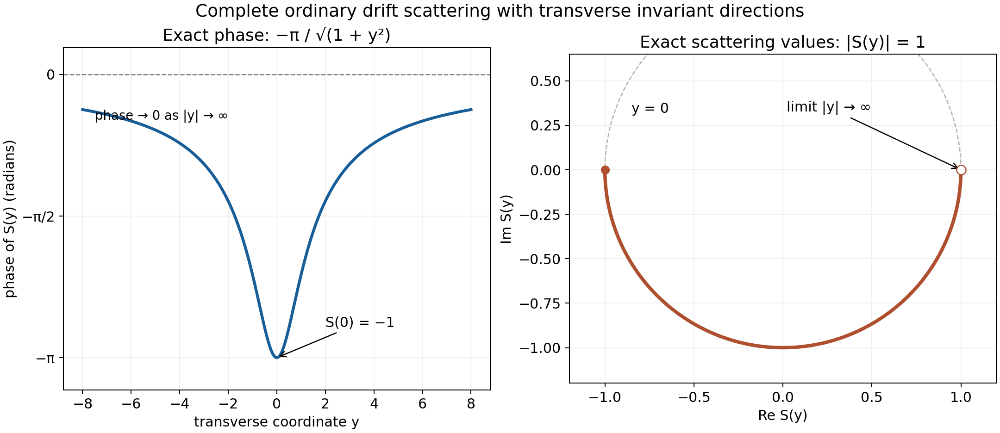

# Wave operators for differential perturbations

*Written by GPT-6.1 Sol (OpenAI) and GPT-6 Astra (OpenAI). Self-checked by the writing AI. Original exposition: CC0.*

**Working question: Can summable shell bounds replace a fixed power of decay?** Along a free packet with nonzero velocity, spatial shells become time intervals of comparable size. The integral of the perturbation over those intervals is controlled by the same summable majorants that defined short range. A logarithmic correction to inverse distance can therefore be sufficient even when no fixed extra power is available.

An ordinary wave operator exists when the perturbation accumulated along a free wave is integrable in time. For a general short-range differential operator, the required integrability follows from its summable local operator bounds. This covers perturbations that are unbounded on \(L^2\), and decay envelopes slower than every fixed power \(r^{-1-\delta}\).

Use the exact hypotheses of [Self-adjoint short-range operators](self-adjoint-short-range-operators.md): \(p\) is real, nonconstant, simply characteristic, with no invariant direction; \(V\) is a finite-order local differential expression with \(L^2_{\mathrm{loc}}\) coefficients, symmetric on compact smooth tests and short range; \(H\) is the self-adjoint closure of \(p(D)+V\) on Schwartz functions. Write \(H_0=p(D)\), and use \(X_p\) and the local bounds \(M_j\) from [Short-range compactness and local tests](short-range-compactness-and-local-tests.md), so
\(\sum_jR_jM_j<\infty\).

The [unitary-group theorem and generator-domain criterion](../providers/analysis/self-adjoint-spectral-domains.md#selfadjoint-groups-and-powers) apply on the original self-adjoint domains. [Modified waves and the direction of escape](modified-waves-and-the-direction-of-escape.md#modified-wave-existence) proves nullity of the polynomial critical set and density of compact-frequency packets. Its [spectral-measure argument](modified-waves-and-the-direction-of-escape.md#modified-wave-spectral-measures) applies to every isometry intertwining the two groups. Section 1 below includes the nonstationary integration-by-parts proof with its parameter and derivative bounds.

[Approximation and convolution](../providers/analysis/euclidean-approximation-and-convolution.md#oscillatory-integrals-and-averages) proves the continuous vector integral and Riemann–Lebesgue limit. The [measure and Fourier foundations](../providers/analysis/finite-derivative-l2.md#measure-foundations) supply Tonelli, dominated convergence and Plancherel. The [elementary functions and cutoffs](../providers/analysis/elementary-functions-and-cutoffs.md) supply the logarithm, exponential, arctangent and smooth cutoffs in the examples. Classical wave-operator and group results are discussed in [H] and [T].

## 1. A dense family of freely propagating packets

Let

\[
 \mathcal D=\{\mathcal F^{-1}a:
       a\in C_c^\infty(\{\nabla p\ne0\})\}.
\]

This is dense in \(L^2\). In the [proof of the packet-density statement in Modified waves and the direction of escape](modified-waves-and-the-direction-of-escape.md#modified-wave-existence), induction on dimension and Tonelli prove that a nonzero polynomial has a null zero set. Apply this to a nonzero partial derivative of \(p\). Compact exhaustion of the open regular set followed by mollification then gives the required smooth density, and Plancherel transfers it to physical space. This proof uses only that \(p\) is nonconstant; invariant directions are allowed.

Fix \(f=\mathcal F^{-1}a\in\mathcal D\), and choose constants \(0<r<M\) such that

\[
 r\leq|\nabla p(\xi)|\leq M
\]

on a compact neighborhood of \(\operatorname{supp}a\). Its free evolution is

\[
 F_t(x)=e^{-itH_0}f(x)
       =(2\pi)^{-n/2}
          \int e^{i(x\cdot\xi-tp(\xi))}a(\xi)\,d\xi.
\tag{1}
\]

For each fixed polynomial \(Q\) and integer \(N\),

\[
 |Q(D)F_t(x)|\leq C_{N,Q}(|x|+|t|)^{-N}
\tag{2}
\]

when \(|t|\geq1\) and either \(|x|<r|t|/2\) or \(|x|>2M|t|\).

To verify this estimate, take \(L=|x|+|t|\). The normalized phase is
\((x/L)\cdot\xi-(t/L)p(\xi)\); its parameters \((x/L,t/L)\) lie in a compact set, and every required derivative on the fixed compact support is bounded. In the first region,
\(|x-t\nabla p|\geq r|t|/2\); in the second it is at least \(|x|/2\). Each is at least a fixed positive multiple of \(L\). Thus the normalized gradient is uniformly nonzero. Multiplication by \(Q(\xi)\) only changes the compact smooth amplitude. This proves (2) with exactly the prescribed nonstationary interface.

The decay calculation itself is elementary. Write this normalized phase as \(\varphi\). The operator
\[
 \mathcal L=\frac{\nabla_\xi\varphi\cdot\nabla_\xi}
                   {iL|\nabla_\xi\varphi|^2}
\]
satisfies \(\mathcal L e^{iL\varphi}=e^{iL\varphi}\). Repeated integration by parts moves its formal transpose onto \(Q(\xi)a(\xi)\). There are no boundary terms because the amplitude has fixed compact support. Each application supplies a factor \(L^{-1}\); the gradient lower bound and the uniform bounds on all needed phase derivatives bound every remaining coefficient and amplitude derivative. After \(N\) steps the resulting amplitude has \(L^1\) norm at most \(C_{N,Q}L^{-N}\), proving (2) directly. The same estimate, uniform over compact sets of normalized phases, is also proved in [Modified waves and the direction of escape, Section 2](modified-waves-and-the-direction-of-escape.md#modified-wave-concentration).

## 2. Integrability from the local short-range bounds

Choose a smooth radial \(\chi\), equal to one for \(r/2\leq|x|\leq2M\), and zero for \(|x|<r/4\) or \(|x|>4M\). For \(|t|\geq1\), put

\[
 u_t=\chi(x/|t|)F_t,\qquad
 v_t=(1-\chi(x/|t|))F_t.
\]

**Lemma 2.1.** For every \(f\in\mathcal D\),

\[
 \int_{|t|\geq1}\|VF_t\|_2\,dt<\infty.
\tag{3}
\]

**Proof.** For the far part, polynomial Leibniz expresses every graph derivative of \(v_t\) as a finite sum of free polynomial derivatives multiplied by derivatives of the cutoff. On their supports the phase is in the region of (2): the cutoff transitions also occur there. Its derivative factors have size at most \(C|t|^{-|\beta|}\). Hence every graph component is bounded pointwise by \(C_N(|x|+|t|)^{-N}\). Scaling \(x=|t|y\) gives

\[
 \|v_t\|_{X_p}\leq
       \sum_\alpha\|(\partial^\alpha p)(D)v_t\|_2
       \leq C_N|t|^{n/2-N}.
\]

Since \(V:X_p\to B\subset L^2\) is bounded, \(\|Vv_t\|_2\) is integrable when \(N>n/2+1\).

The near part has support in
\(r|t|/4\leq|x|\leq4M|t|\). Its graph components have uniformly bounded global \(L^2\) norms: apply Leibniz and then the \(L^2\) norm preservation of the free evolution on each fixed polynomial derivative of \(f\). On its support all physical shell radii are comparable to \(|t|\), with constants depending on \(r,M\), so

\[
 \|u_t\|_{X_p}\leq C_f|t|^{-1/2}.
\tag{4}
\]

We need the corresponding support-restricted version of the local perturbation estimate. In the lattice proof of the short-range criterion, a nonzero piece \(\phi_ku_t\) has its centre within distance one of this annulus. Thus, for sufficiently large \(|t|\), every contributing centre shell has
\(c|t|\leq R_j\leq C|t|\), where \(0<c<C\) are fixed. The same finite-overlap calculation giving the [local criterion’s bound (7)](short-range-compactness-and-local-tests.md#short-range-local-criterion), now summing only these pieces, gives

\[
 \|Vu_t\|_B
       \leq C\|u_t\|_{X_p}
             \sum_{c|t|\leq R_j\leq C|t|}R_jM_j.
\tag{5}
\]

The output of the local differential operator remains in the same annulus. Its \(L^2\) norm is at most \(C|t|^{-1/2}\) times its \(B\) norm: each contributing \(B\) shell weight is at least a fixed multiple of \(|t|^{1/2}\), and the sum of the unweighted shell norms bounds the global \(L^2\) norm. Combining (4) and (5),

\[
 \|Vu_t\|_2\leq
       \frac{C_f}{|t|}
           \sum_{c|t|\leq R_j\leq C|t|}R_jM_j.
\tag{6}
\]

For positive times, Tonelli now gives

\[
 \begin{split}
 \int_1^\infty \frac1t
      \sum_{ct\leq R_j\leq Ct}R_jM_j\,dt
 &\leq\sum_jR_jM_j
              \int_{R_j/C}^{R_j/c}\frac{dt}{t}\\
 &=\log(C/c)\sum_jR_jM_j<\infty.
 \end{split}
\tag{7}
\]

The bounded initial time interval omitted in deriving (5) is harmless: the free path is continuous in Schwartz topology and therefore in \(X_p\), so \(VF_t\) is continuous in \(L^2\). Negative times have the same estimate in \(|t|\). Together with the far part this proves (3). \(\square\)

The factor \(t^{-1}\) in (6) cannot be integrated by itself. Each spatial shell participates only during a fixed multiplicative interval of times; the summable \(R_jM_j\) weights make (7) finite.

## 3. Constructing the wave operators on all of \(L^2\)

**Theorem 3.1.** The strong limits

\[
 W_\pm=\mathop{\mathrm{s\!-\!lim}}_{t\to\pm\infty}
                e^{itH}e^{-itH_0}
\tag{8}
\]

exist on \(L^2\) and are isometries. They satisfy

\[
 e^{-isH}W_\pm=W_\pm e^{-isH_0},
 \qquad
 W_\pm\mathcal D(H_0)\subset\mathcal D(H),\quad
 HW_\pm f=W_\pm H_0f.
\tag{9}
\]

Their closed ranges lie in the absolutely continuous subspace of \(H\).

**Proof.** For \(f\in\mathcal D\), \(F_t=e^{-itH_0}f\) lies in Schwartz space and is differentiable there. Since \(V\) is bounded \(X_p\to B\subset L^2\), and the Schwartz topology controls every graph component, the path \(F_t\) is continuous in the graph norm of \(H\) and lies in its domain. Its derivative is \(-iH_0F_t\). The Hilbert-space product rule for this graph-continuous domain path gives

\[
 \frac{d}{dt}(e^{itH}F_t)
       =i e^{itH}(H-H_0)F_t=i e^{itH}VF_t.
\tag{10}
\]

Here \(HF_t=(p(D)+V)F_t\) because it is in the initial Schwartz domain; no equality of the full operator domains has been used. Formula (10) follows by a difference quotient: the change in \(F_t\) converges in Hilbert norm, while the unitary-group derivative on the fixed domain vector is \(iHF_t\); graph continuity controls replacing that fixed vector by the neighboring one.

The continuous vector integral is obtained from the [proved Hilbert-space Riemann sums](../providers/analysis/euclidean-approximation-and-convolution.md#oscillatory-integrals-and-averages). Pairing those sums with any fixed vector and applying the scalar fundamental theorem gives the integral of (10) as the difference of the endpoint vectors; its norm is at most the integral of the norm. Lemma 2.1 therefore shows that \(e^{itH}F_t\) is Cauchy at each time end. The integral over any finite interval is defined by the same continuous \(L^2\) path. Its limit preserves \(\|f\|_2\), since every approximating operator is unitary.

For arbitrary \(f\in L^2\), approximate by \(h\in\mathcal D\). The norm difference of two approximating operators on \(f-h\) is at most \(2\|f-h\|_2\). This proves convergence on the whole space and preserves its norm, giving (8).

For fixed \(s\), shifting the comparison parameter gives
\[
 \begin{aligned}
 &e^{-isH}e^{itH}e^{-itH_0}\\
 &=e^{i(t-s)H}e^{-i(t-s)H_0}e^{-isH_0}.
 \end{aligned}
\]
The shifted parameter tends to the same time end, so taking strong limits proves the group identity in (9). For \(f\in\mathcal D(H_0)\), its difference quotient in \(s\) converges to \(-iW_\pm H_0f\). The [generator-domain criterion](../providers/analysis/self-adjoint-spectral-domains.md#selfadjoint-groups-and-powers) gives membership of \(W_\pm f\) in \(\mathcal D(H)\) and the operator identity in (9).

The range is closed, since an isometry carries Cauchy sequences to Cauchy sequences and back. The group identity makes it invariant under \(e^{-isH}\) for every real \(s\); its orthogonal complement is invariant by the adjoint pairing. The orthogonal projection onto the range consequently commutes with the group. Taking difference quotients shows that this projection preserves \(\mathcal D(H)\) and commutes with \(H\) there, proving the reducing assertion.

Finally the [spectral-measure proof in Modified waves and the direction of escape](modified-waves-and-the-direction-of-escape.md#modified-wave-spectral-measures) proves two facts at exactly this scope: every nonconstant real polynomial multiplier has wholly absolutely continuous spectrum, and every group-intertwining isometry \(J\) preserves each vector's scalar spectral measure. The first uses regular coordinates outside the null critical set. The second uses the Laplace integral of the groups, the scalar Stone formula including atoms, and finite-measure uniqueness. Apply it with \(J=W_\pm\) to obtain the asserted range inclusion. \(\square\)

The full-range identity \(\operatorname{ran}W_\pm=\mathcal H_{\mathrm{ac}}(H)\) requires the later spectral completeness proof.

## 4. Examples and a wider multiplication route

**Example 4.1.** A bounded real potential controlled by

\[
 b(t)=\frac1{(1+t)[\log(e+t)]^2}
\]

is short range by the decaying-coefficient criterion: \(b\) is bounded, decreasing and integrable. At infinity its dyadic contributions behave as
\(R_jb(R_j)\asymp(1+j)^{-2}\). Theorem 3.1 therefore applies. This envelope is not bounded by any fixed \(C(1+t)^{-1-\delta}\), \(\delta>0\), since their ratio grows as \(t^\delta/(\log t)^2\). To see its divergence, put \(q=\log t\); the nonnegative exponential series gives \(e^{\delta q}\geq(\delta q)^3/6\), so the ratio is bounded below by a positive multiple of \(q\) for large \(t\). The summable local criterion covers it directly.

**Example 4.2.** On the line let \(p(\xi)=\xi^2\) and take a real smooth
\(a(x)=(1+x^2)^{-(1+\delta)/2}\), \(\delta>0\). The differential operator

\[
 V=\tfrac12(aD+Da)=aD-\tfrac i2a'
\]

is symmetric on compact smooth functions. Here \(\widetilde p(\xi)=\xi^2+2\leq2(1+|p(\xi)|)\), so \(p\) is simply characteristic, and \(p(\xi+tw)=p(\xi)\) forces \(w=0\). Also \(a\leq C(1+|x|)^{-1-\delta}\), and \(a^{\prime}=-(1+\delta)x(1+x^2)^{-(3+\delta)/2}\) has the same bound. The symbols \(\xi\) and \(1\) have strength ratios to \(p\) tending to zero, and both coefficients are bounded by a fixed multiple of \((1+|x|)^{-1-\delta}\). Thus \(V\) is short range. It is unbounded on \(L^2\) whenever \(a\ne0\), as the exercise below checks; the preceding theorem still gives both wave operators for its self-adjoint closure.

**Corollary 4.3: integrable envelopes for every nonconstant polynomial.** Let \(p\) be any real nonconstant polynomial, and suppose that a real measurable multiplication potential satisfies

\[
 \begin{gathered}
 |V(x)|\leq b(|x|),\qquad b\geq0,\\
 b\text{ bounded and nonincreasing},\\
 \int_0^\infty b(s)\,ds<\infty.
 \end{gathered}
\]

Then \(H=p(D)+V\) is self-adjoint on \(\mathcal D(p(D))\), both ordinary wave operators exist and are isometries, and (9) and the absolutely continuous range inclusion hold. This statement allows invariant directions and does not require simple characteristics. It does not assert completeness for a general \(p,V\).

**Proof.** The [bounded real perturbation theorem](resolvents-domains-and-spectral-density.md#u001-specified-domains) gives self-adjointness on the exact free domain. Use the same dense family \(\mathcal D\) and the constants \(r,M\) from Section 1. On the annulus \(r|t|/2\leq|x|\leq2M|t|\), monotonicity and preservation of the free norm give a bound \(b(r|t|/2)\|f\|_2\). Off that annulus, (2) with \(Q=1\), squared and integrated after \(x=|t|y\), gives the free norm bound \(C_N|t|^{n/2-N}\). Thus

\[
 \begin{aligned}
 \|Ve^{-itp(D)}f\|_2
 &\leq b(r|t|/2)\|f\|_2\\
 &\quad+\|b\|_\infty C_N|t|^{n/2-N},\qquad |t|\geq1.
 \end{aligned}
\]

For each time end the first term has integral

\[
 \int_1^\infty b(rt/2)\|f\|_2\,dt
 =\frac{2\|f\|_2}{r}\int_{r/2}^\infty b(s)\,ds<\infty.
\]

Choose \(N>n/2+1\) for the second term. Finite times are controlled by boundedness of \(V\). The difference-quotient and dense-packet argument in Theorem 3.1 now applies using this integrability estimate. The remaining group, domain and spectral conclusions follow from that same proof, which only uses self-adjointness, the strong limits and the nonconstant polynomial spectral measure at this stage. Section 1 supplies density even when \(p\) has invariant directions. \(\square\)

In particular, the logarithmic envelope of Example 4.1 also works for this larger class of free polynomials. This multiplication argument supplements Theorem 3.1; its differential hypotheses remain in force for that theorem.

**Example 4.4: complete drift scattering outside the compact graph class.** Let \(n\geq2\), write \(x=(s,y)\in\mathbb R\times\mathbb R^{n-1}\), and fix \(c>0\). Set

\[
 \begin{gathered}
 A=cD_s,\qquad V(s,y)=\frac1{1+s^2+|y|^2},\\
 B(y)=1+|y|^2,
 \end{gathered}
\]

\[
 \begin{gathered}
 F(s,y)=\frac1{c\sqrt{B(y)}}
              \arctan\frac{s}{\sqrt{B(y)}},\\
 U=e^{-iF}.
 \end{gathered}
\]

The free operator has domain

\[
 \begin{aligned}
 \mathcal D(A)&=\{f\in L^2:\partial_s f\in L^2\}\\
 &=\{f\in L^2:c\xi_s\widehat f\in L^2\}.
 \end{aligned}
\]

Here the derivative is distributional; there is no condition on transverse derivatives. Fourier multiplication by the real function \(c\xi_s\) is self-adjoint: if \(g\) is in its adjoint domain, testing on arbitrary \(L^2\) functions supported in slabs \(|\xi_s|\leq N\) identifies the adjoint value with \(c\xi_s g\) there. Letting \(N\to\infty\) shows that this product is in \(L^2\), exactly the stated domain. Conversely that domain plainly gives the adjoint pairing.

Since \(c\partial_sF=V\) and \(|\partial_sU|=V/c\leq1/c\), multiplication by \(U\) and \(U^*\) preserves this domain. The distributional product rule is checked by testing the weak \(s\)-derivative against \(U\) times a compact smooth test; its bounded factors make both resulting terms \(L^2\). It gives

\[
 \begin{gathered}
 (cD_s+V)Uf=UAf,\\
 H=A+V=UAU^*,\qquad \mathcal D(H)=\mathcal D(A).
 \end{gathered}
\]

The [unitary-conjugation proof](modified-waves-and-the-direction-of-escape.md#modified-wave-sign-counterexample) identifies the conjugated spectral projections and group as well. This is the same self-adjoint operator as the bounded real perturbation. To check the core explicitly, take \(\chi\in C_c^\infty(\mathbb R^n)\) equal to one near zero and put \(\chi_R(x)=\chi(x/R)\). Dominated convergence applies to \(\chi_Rf\) and \(\chi_R\partial_sf\), while

\[
 \|(\partial_s\chi_R)f\|_2
 \leq R^{-1}\|\partial_s\chi\|_\infty\|f\|_2\longrightarrow0.
\]

Thus compactly supported domain vectors approximate in the graph norm. Mollifying in all coordinates gives compact smooth functions converging in \(L^2\) both to the vector and to its \(s\)-derivative, by continuity of translations in \(L^2\). Hence \(C_c^\infty\) is a core for \(A\). The smooth gauge maps this set onto itself, so it is also a core for \(H\). This uses no transverse Sobolev regularity.

Free translation is \(e^{-itA}f(s,y)=f(s-ct,y)\). The exact comparison is consequently

\[
 e^{itH}e^{-itA}f(s,y)
 =e^{-iF(s,y)}e^{iF(s+ct,y)}f(s,y).
\]

At every fixed \((s,y)\),

\[
 F(s+ct,y)\longrightarrow F_\pm(y)
 =\pm\frac{\pi}{2c\sqrt{1+|y|^2}}
       \quad(t\to\pm\infty).
\]

The squared multiplier error is bounded by \(4|f(s,y)|^2\), integrable over the whole space. Dominated convergence proves the ordinary strong limits on all of \(L^2\):

\[
 \begin{gathered}
 W_\pm=e^{-iF(s,y)}
          e^{\pm i\pi/(2c\sqrt{1+|y|^2})},\\
 S=W_+^*W_-
   =\exp\left(-\frac{i\pi}{c\sqrt{1+|y|^2}}\right).
 \end{gathered}
\]

Both wave operators are unitary onto \(L^2\). The free operator is wholly absolutely continuous: by Fubini, the inverse image of a null energy set under \(\xi\mapsto c\xi_s\) is null. Its spectral measure therefore vanishes on every such set. Unitary equivalence gives the same fact for \(H\), proving completeness here.

Nevertheless \(p(\xi)=c\xi_s\) has all transverse invariant directions. The nonzero local multiplication \(V\) fails the compact \(X_p\to B\) class of [Short-range compactness and local tests](short-range-compactness-and-local-tests.md), Theorem 5.2. To see the obstruction directly, choose \(\phi\in C_c^\infty\) with \(V\phi\ne0\) and put \(f_j=e^{ijy_1}\phi\). The symbols \(p\) and its derivatives have no transverse dependence, so the \(X_p\) norms of these vectors remain bounded. Their outputs \(Vf_j=e^{ijy_1}V\phi\) have a fixed positive \(L^2\) norm and converge weakly to zero: pair with any \(g\in L^2\), use \(V\phi\overline g\in L^1\), and apply the [proved Riemann–Lebesgue lemma](../providers/analysis/euclidean-approximation-and-convolution.md#oscillatory-integrals-and-averages). They have no strongly convergent \(L^2\) subsequence. As \(B\) embeds continuously in \(L^2\), they cannot have a convergent \(B\) subsequence either. This is a compactness obstruction, although the explicit ordinary scattering above is complete.

*Example 4.4, with \(c=1\) and one transverse coordinate \(y\). The left panel samples the exact phase \(-\pi/\sqrt{1+y^2}\); the right panel shows the corresponding values of \(S(y)\), with the negative phase proved above. The image runs along the lower semicircle from \(-1\) toward the limiting value \(1\), which is approached as \(|y|\to\infty\). Its modulus is exactly one. For general \(n\), replace \(|y|\) by the transverse radius; the proof retains every \(c>0\). [Vector figure](../figures/invariant-drift-scattering.svg); the editable package includes the reproducible plotting source.*

### Use the conclusion

Compare the general differential theorem with the separate drift example outside the compact graph class. Verify the decay along the selected time direction and do not transfer the general compactness hypotheses to the independently solved model.

## 5. Exercises

**Exercise 5.1 (foundation).** Derive (7), identifying the exact time interval associated with one shell \(R_j\). Why does an estimate by a constant times \(1/t\) alone fail to prove integrability?

**Exercise 5.2 (foundation).** Check all four powers of \(|t|\) used in the near/far decomposition: the derivative-cutoff factor, the far \(L^2\) bound, the near \(X_p\) bound, and the conversion from the output \(B\) norm to its \(L^2\) norm.

**Exercise 5.3 (intermediate).** Verify boundedness, monotonicity and integrability of the envelope in Example 4.1. Derive its dyadic asymptotics and its failure of every fixed stronger power envelope.

**Exercise 5.4 (intermediate).** In Example 4.2 prove symmetry of \(V\), calculate the strength ratio of \(Q=\xi\) to \(p=\xi^2\), and show \(V\) is unbounded on \(L^2\) using a modulated compact smooth function.

**Exercise 5.5 (advanced).** Suppose only \(W_+\) has been constructed as an isometry. Prove the group identity by shifting the limit parameter, then explain why it cannot yet prove unitarity of \(W_+^*W_-\) or asymptotic completeness.

## 6. Complete solutions

**Solution 5.1.** The inequalities \(ct\leq R_j\leq Ct\) are exactly
\(R_j/C\leq t\leq R_j/c\). Its \(dt/t\) integral is \(\log(C/c)\), independently of \(j\). Nonnegative summands permit Tonelli, and multiplication by the summable \(R_jM_j\) gives (7). The integral of \(1/t\) over the whole half-line diverges; the time restriction for each shell is essential.

**Solution 5.2.** Differentiating \(\chi(x/|t|)\) \(|\beta|\) times gives \(|t|^{-|\beta|}\). Squaring the pointwise far bound and substituting \(x=|t|y\) gives \(|t|^{n-2N}\), whose square root is \(|t|^{n/2-N}\). Near graph derivatives have fixed global \(L^2\) bounds and support at radius comparable to \(|t|\), so their shell-normalized \(B^*\) norms gain \(|t|^{-1/2}\). Conversely, the output \(B\) weights there are at least \(c|t|^{1/2}\), giving \(\|Vu_t\|_2\leq C|t|^{-1/2}\|Vu_t\|_B\). These two half powers combine to the \(t^{-1}\) in (6).

**Solution 5.3.** Each denominator factor is positive and increasing, so \(b\) is positive, decreasing and bounded by one. On a fixed finite interval it is integrable; for large \(t\) it is comparable to \(1/(t(\log t)^2)\), whose antiderivative tail is \(1/\log t\). Thus the full integral is finite. Since \(R_j=2^j\), \(R_j/(1+R_j)\to1\) and \(\log(e+R_j)\asymp1+j\), proving the dyadic estimate. Finally \(b(t)/(1+t)^{-1-\delta}=(1+t)^\delta/[\log(e+t)]^2\to\infty\), proving the asserted failure.

**Solution 5.4.** For real \(a\), the adjoint of \(aD\) on compact tests is \(Da\), by integration by parts. Their average is symmetric. The strengths are \(\widetilde p=\xi^2+2\) and \(\widetilde Q=\sqrt{\xi^2+1}\), whose ratio tends to zero. The constant symbol's ratio does too. Choose \(\phi\in C_c^\infty\) with \(a\phi\ne0\), and set \(f_N=e^{iNx}\phi\). Then
\[
 Vf_N=e^{iNx}\left(Na\phi+aD\phi-\tfrac i2a'\phi\right).
\]
Its norm is at least \(N\|a\phi\|_2-C_\phi\), while \(\|f_N\|_2=\|\phi\|_2\). This proves unboundedness and explains why the bounded-perturbation version of Cook's criterion alone does not cover this example.

**Solution 5.5.** For fixed \(s\),
\[
 e^{-isH}e^{itH}e^{-itH_0}
       =e^{i(t-s)H}e^{-i(t-s)H_0}e^{-isH_0}.
\]
As \(t\to+\infty\), \(t-s\) tends to the same end, so taking strong limits gives the group identity. It proves invariance of the range and generator intertwining, but gives no assertion that the range is all absolutely continuous states. It also gives no information about a second limit or equality of two ranges. The [common-range isometry proof in Modified waves and the direction of escape](modified-waves-and-the-direction-of-escape.md#modified-wave-spectral-measures) needs both isometries and their common range; those additional conclusions require further proof.

## References

- [H] Lars Hörmander, *The existence of wave operators in scattering theory*, Mathematische Zeitschrift **146** (1976), 69–91, Section 2. [Freely accessible journal PDF](https://gdz.sub.uni-goettingen.de/download/pdf/PPN266833020_0146/LOG_0012.pdf).
- [T] Gerald Teschl, *Mathematical Methods in Quantum Mechanics: With Applications to Schrödinger Operators*, second edition, American Mathematical Society, 2014, Theorem 5.1 and Section 12.1, Theorem 12.2 and Lemma 12.3. [Author's authorized online edition](https://www.mat.univie.ac.at/~gerald/ftp/book-schroe/schroe2.pdf).
