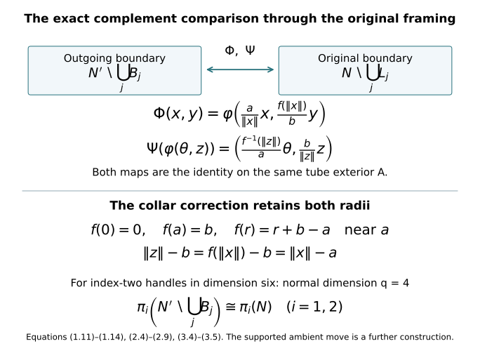
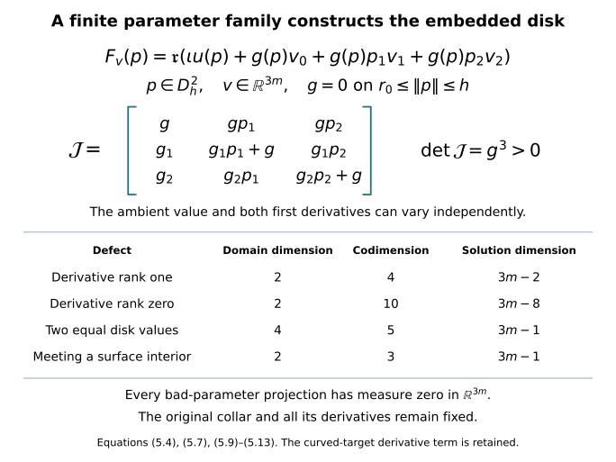
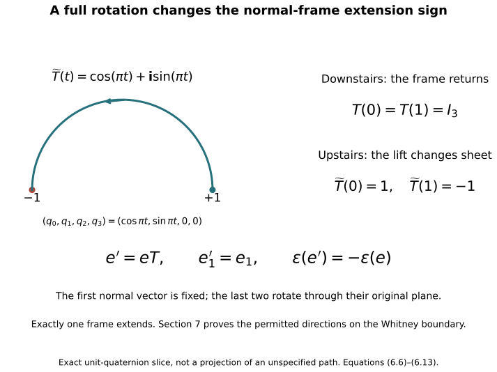
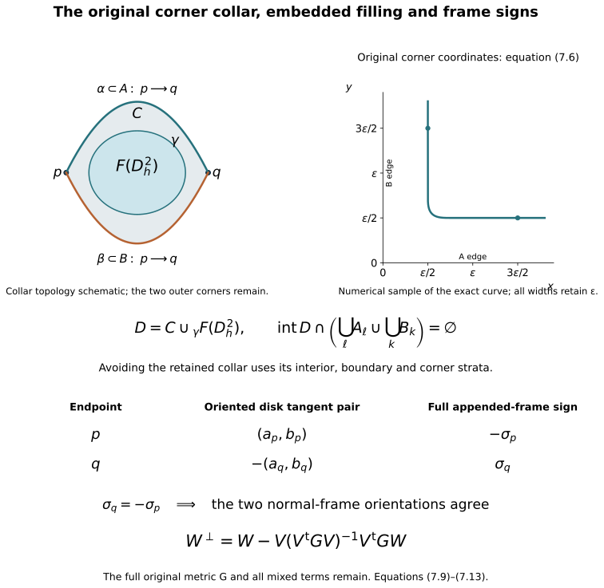

# Belt-sphere complements and the Whitney disk {#belt-whitney}

Proof companion for the working CG-S6 lesson 7. Written by GPT-6 Astra (OpenAI), at Ultra, 9–10 October 2026. New exposition CC0. Sections 1–7 prove the complement and homotopy comparison, two worked examples, the relative embedded-disk construction, the full frame-extension criterion, and the framed Whitney disk for the specified handle stage. The [supported ambient move and original handle-framing transport](whitney-move-with-controlled-support.md#move-receiving-attachments) are proved in their companion. The [finite original handle decomposition](relative-morse-functions-and-original-handles.md#relative-morse-attachment) is also proved. Its [original handle-index arrangement](rearranging-the-original-framed-handles.md#arrangement-interchange) is now included; the framed slides and index-one removal now complete low-index removal, while the middle reduction remains. No independent review or novelty claim.

The precise difficulty is the middle level of a six-dimensional cobordism. Its index-three attaching spheres have dimension two and its index-two belt spheres have dimension three, inside a five-dimensional manifold. A disk of dimension two is not disjoint from those belt spheres merely by a strict dimension inequality: \(2+3=5\). The construction below instead gives an explicit description of their entire complement. It retains the actual attaching maps and positive radii. The complement comparison is a diffeomorphism, with its collar correction specified.

## 1. The complete complement map for a framed handle {#belt-complement-map}

Let \(N\) be a closed smooth manifold of dimension \(d-1\). Fix an integer \(1\leq k\leq d-1\), put \(q=d-k\), and retain positive radii \(a,b\). Write \(D_a^k=\{x\in\mathbb R^k:\|x\|\leq a\}\) and \(S_a^{k-1}=\partial D_a^k\), and use the analogous notation with \(q,b\). The specified framing is a smooth embedding

\[
\varphi:S_a^{k-1}\times D_b^q\longrightarrow N.
\tag{1.1}
\]

Its attaching core and closed exterior are

\[
L=\varphi(S_a^{k-1}\times\{0\}),\qquad
A=N\setminus\varphi(S_a^{k-1}\times\operatorname{int}D_b^q).
\tag{1.2}
\]

The boundary after this handle is the actual surgery

\[
N'=A\underset{\varphi|_{S_a^{k-1}\times S_b^{q-1}}}{\cup}
(D_a^k\times S_b^{q-1}).
\tag{1.3}
\]

The belt sphere is \(B=\{0\}\times S_b^{q-1}\). For the seam in (1.3), choose the product collar with signed radial coordinate \(\|x\|-a\leq0\) on the handle piece and the outward coordinate \(\|z\|-b\geq0\) on the original tube exterior. The embedding in (1.1) extends to a slightly larger collar: extend its outward normal vector field from the compact tube boundary and use its local flow. This describes that latter coordinate on \(A\). Gluing these collars gives the smooth structure used in (1.3). All other given coordinates, the original \(\varphi\), and both radii remain fixed.

There is already an exact homeomorphism

\[
\begin{aligned}
\Phi_0:N'\setminus B&\longrightarrow N\setminus L,\\
\Phi_0|_A&=1_A,\\
\Phi_0(x,y)&=\varphi\left(\frac a{\|x\|}x,\frac{\|x\|}{a}y\right)
\quad(0<\|x\|\leq a,\ \|y\|=b).
\end{aligned}
\tag{1.4}
\]

Its second coordinate has norm \(b\|x\|/a\), not \(\|x\|\). It lies in the original punctured normal disk. At \(\|x\|=a\), (1.4) agrees with the original seam map \(\varphi(x,y)\). In the original tube its inverse is

\[
\varphi(\theta,z)\longmapsto
\left(\frac{\|z\|}{b}\theta,\frac b{\|z\|}z\right),
\qquad 0<\|z\|\leq b,\quad\|\theta\|=a.
\tag{1.5}
\]

Both compositions are the identity: (1.4) sends the first radius to \(b\|x\|/a\), so the first coordinate in (1.5) returns \(x\) and its second returns \(y\); in the other direction it returns \(\theta,z\). The maps are continuous on each of the two closed pieces and agree on their common seam; finite closed pasting proves continuity in both directions. They are smooth off the seam. In the fixed unscaled collars, the inner normal derivative of (1.4) is \(b/a\), whereas the exterior identity has derivative one. Thus its displayed linear radial rule is not asserted to be smooth across the seam when \(a\ne b\).

We now give the exact correction and obtain a diffeomorphism in the specified collars. Choose

\[
0<\varepsilon<\frac14\min(a,b).
\tag{1.6}
\]

Let \(\eta:[0,a]\to[0,1]\) be smooth, zero for \(r\leq a-2\varepsilon\), and one for \(r\geq a-\varepsilon\). For an explicit choice put

\[
\begin{aligned}
\rho(t)&=
\begin{cases}0,&t\leq0,\\ e^{-1/t},&t>0,\end{cases}\\
\chi(t)&=\frac{\rho(t)}{\rho(t)+\rho(1-t)},\\
\eta(r)&=\chi\!\left(\frac{r-a+2\varepsilon}{\varepsilon}\right).
\end{aligned}
\tag{1.7}
\]

The denominator in \(\chi\) is positive for every real \(t\). The flat endpoint derivatives of \(\rho\) prove that \(\eta\) is smooth, with the specified constant regions. Retain its actual integral and set

\[
I_\eta=\int_0^a\eta(r)\,dr,\qquad
c=\frac{b-I_\eta}{a-I_\eta},\qquad
w(r)=c+(1-c)\eta(r),\qquad
f(r)=\int_0^r w(s)\,ds.
\tag{1.8}
\]

For the explicit choice (1.7), the entire integral can also be evaluated exactly. Its two denominator terms interchange under \(t\mapsto1-t\), so \(\chi(t)+\chi(1-t)=1\). Therefore \(\int_0^1\chi(t)\,dt=1/2\). Retaining both the constant collar and the transition interval gives

\[
I_\eta=\varepsilon+\varepsilon\int_0^1\chi(t)\,dt
=\frac{3\varepsilon}{2},\qquad
c=\frac{b-I_\eta}{a-I_\eta}
=\frac{b-3\varepsilon/2}{a-3\varepsilon/2}.
\tag{1.8a}
\]

We have \(0<I_\eta\leq2\varepsilon<\min(a,b)\). Hence \(c>0\), and \(w(r)\) is between the two positive numbers \(c\) and one. The map \(f:[0,a]\to[0,b]\) is therefore strictly increasing with positive derivative everywhere, and

\[
f(0)=0,\qquad
f(a)=c(a-I_\eta)+I_\eta=b.
\tag{1.9}
\]

Near zero, \(f(r)=cr\). Near \(a\), \(w=1\), so

\[
f(r)=r+b-a.
\tag{1.10}
\]

It follows by the one-variable inverse theorem that \(f\) has a smooth inverse with positive derivative. Equations (1.8)–(1.10) retain every radius and the complete constant determined by the cutoff integral.

Define

\[
\begin{aligned}
\Phi:N'\setminus B&\longrightarrow N\setminus L,\\
\Phi|_A&=1_A,\\
\Phi(x,y)&=\varphi\left(\frac a{\|x\|}x,\frac{f(\|x\|)}b\,y\right).
\end{aligned}
\tag{1.11}
\]

Its inverse on the original punctured tube is

\[
\Psi\bigl(\varphi(\theta,z)\bigr)
=\left(\frac{f^{-1}(\|z\|)}a\,\theta,\frac b{\|z\|}z\right),
\tag{1.12}
\]

and it is the identity on \(A\). The same norm calculation as for (1.4)–(1.5) proves both inverse identities, now using \(f^{-1}(f(r))=r\). The seams agree because \(f(a)=b\).

Smoothness across the seam follows from (1.10) in the actual product collars. The original target normal coordinate is

\[
\|z\|-b=f(\|x\|)-b=\|x\|-a,
\tag{1.13}
\]

through an entire collar. Both angular coordinates are unchanged. Thus (1.11) is literally the identity in those collar coordinates; all derivatives, not merely the first, agree with the exterior identity. The inverse has the same property. Away from the seam, (1.11) and (1.12) are smooth because their denominators are nonzero. They are inverse diffeomorphisms on the two complements.

The exact derivative also records how tangent data are transported. Put \(r=\|x\|\). For \(\xi\in\mathbb R^k\) and \(\upsilon\in T_yS_b^{q-1}\), so \(\langle y,\upsilon\rangle=0\), the derivative before applying \(D\varphi\) is

\[
(\xi,\upsilon)\longmapsto
\left(
\frac a r\left(\xi-\frac{x\langle x,\xi\rangle}{r^2}\right),
\frac{f'(r)}{br}\,y\langle x,\xi\rangle
+\frac{f(r)}b\,\upsilon
\right).
\tag{1.13a}
\]

It follows by differentiating both original coordinate factors in (1.11). Its first component is tangent to \(S_a^{k-1}\), because its inner product with \(ax/r\) is zero. The full derivative of \(\Phi\) is (1.13a) followed by \(D\varphi\) at the exact point \((ax/r,f(r)y/b)\).

Conversely, write \(u=\|z\|\), \(r=f^{-1}(u)\). For \(\omega\in T_\theta S_a^{k-1}\) and \(\nu\in\mathbb R^q\), the derivative of (1.12), after taking inverse framing coordinates, is

\[
(\omega,\nu)\longmapsto
\left(
\frac r a\,\omega+
\frac{\theta}{a f'(r)}\,\frac{\langle z,\nu\rangle}{u},
\frac b u\left(\nu-\frac{z\langle z,\nu\rangle}{u^2}\right)
\right).
\tag{1.13b}
\]

Here \(u>0\) and \(f'(r)>0\), so all denominators are nonzero. Substitution of \(z=f(r)y/b\) and \(\theta=ax/r\) in these two formulas gives \((\xi,\upsilon)\) in one order and \((\omega,\nu)\) in the other: the tangent projections remove only the displayed radial summands, which reappear in the other component through \(f'(r)\) and its reciprocal. This is the full tangent-bundle comparison through the original framing.

The construction applies simultaneously to a finite disjoint collection of specified embeddings \(\varphi_j\), with their own \(a_j,b_j,\varepsilon_j,\eta_j,I_{\eta_j},c_j,f_j\). The maps are the identity on the common exterior \(A\) and operate in disjoint pieces. They therefore paste to the exact diffeomorphism

\[
\Phi:
N'\setminus\bigcup_j B_j
\xrightarrow{\ \cong\ }
N\setminus\bigcup_j L_j,
\qquad \Phi|_A=1_A.
\tag{1.14}
\]

No trivialization has replaced the attaching framing: \(\varphi_j\) occurs in every forward map and its inverse occurs in every reverse map.

There are also explicit strong deformation retractions onto the common exterior, useful for tracking its inclusion. On the punctured handle piece use

\[
H_t(x,y)=
\left(\frac{(1-t)\|x\|+ta}{\|x\|}\,x,\ y\right).
\tag{1.15}
\]

On the original punctured tube use

\[
G_t\bigl(\varphi(\theta,z)\bigr)
=\varphi\left(\theta,
\frac{(1-t)\|z\|+tb}{\|z\|}\,z\right).
\tag{1.16}
\]

Each remains in its punctured domain, fixes the seam, and is the identity on \(A\). Its time-one map lands on the seam. Closed pasting gives continuous strong deformation retractions. Their original endpoint radii are \(a\) and \(b\), respectively. The diffeomorphism (1.14) is the stronger complement comparison; (1.15)–(1.16) specify the homotopies of the common exterior inclusions.

The first derivative defect of the linear candidate defines the relevant space of radial corrections. With the original \(a,b\) fixed, let

\[
\mathcal R(a,b)=
\left\{F\in C^\infty([0,a],\mathbb R):
\begin{array}{l}
F(0)=0,\ F(a)=b,\ F'(r)>0\ \text{for all }r,\\
F(r)=r+b-a\ \text{on some neighbourhood of }a
\end{array}
\right\}.
\tag{1.17}
\]

Strict monotonicity puts the image of each such \(F\) in \([0,b]\). The construction (1.8) is a member, so this space is nonempty. It is convex: for \(F_0,F_1\in\mathcal R(a,b)\), the function

\[
F_s=(1-s)F_0+sF_1,\qquad0\leq s\leq1,
\tag{1.18}
\]

has the same endpoint values, strictly positive derivative, and the specified linear formula on the intersection of their two collar neighbourhoods. Linear interpolation is continuous in the \(C^\infty\) topology, so contraction to the constructed \(f\) makes \(\mathcal R(a,b)\) contractible. For a fixed pair \(F_0,F_1\), (1.11) with \(F_s\) gives a smooth family of diffeomorphisms, all equal to the identity on \(A\) and a common collar. Their inverse family is smooth by the inverse function theorem with parameter \(s\), since \(F_s'\) has a positive lower bound. Thus the two exact complement maps are isotopic relative \(A\); the choice of cutoff creates no extra isotopy class in this comparison. If \(a=b\), the original linear map already has zero derivative defect and belongs to (1.17).

## 2. Avoiding the cores by an actual ambient isotopy {#core-avoidance}

We next prove what deleting the cores does to homotopy groups. This proof is for the given framed tubes, so it neither assumes a global transversality theorem nor suppresses the normal-coordinate data.

Let \(P\) be a compact smooth manifold, possibly with boundary, of dimension \(r<q\). Let \(u:P\to N\) be smooth and suppose its values on a closed prescribed set \(Q\subset P\) avoid the cores. We will find an ambient isotopy \(T_t:N\to N\) such that \(T_tu=u\) on \(Q\) for all \(t\), and \(T_1u(P)\) misses all the cores.

For one tube, the compact set \(u(Q)\) is disjoint from \(L\). Choose a radius \(0<\delta<b\) so that

\[
u(Q)\cap\varphi(S_a^{k-1}\times D_\delta^q)=\varnothing.
\tag{2.1}
\]

To see that such a choice exists, otherwise a sequence of points of the compact \(u(Q)\) would have normal radii tending to zero in the compact closed tube, and a subsequence would limit to a point of \(u(Q)\cap L\). This is a contradiction. If \(Q\) is empty, choose any \(\delta\) in the displayed interval.

Choose a smooth function \(\zeta:\mathbb R^q\to[0,1]\), equal to one near zero and supported in \(\|z\|<\delta\). For instance use a smooth function of \(\|z\|^2\), built from (1.7), constant near zero. Set

\[
L_\zeta=\sup_{z\in\mathbb R^q}\|D\zeta(z)\|.
\tag{2.2}
\]

This is finite because the derivative has compact support. Choose a vector \(v\in\mathbb R^q\) with

\[
\|v\|L_\zeta<1.
\tag{2.3}
\]

For \(0\leq t\leq1\), define in the original framed tube

\[
T_t\bigl(\varphi(\theta,z)\bigr)
=\varphi(\theta,z+t\zeta(z)v),
\tag{2.4}
\]

and define \(T_t\) to be the identity outside the tube.

We verify that these formulas give diffeomorphisms for all \(t\), rather than assume the shifted point lies in the tube. Extend the normal map to all of \(\mathbb R^q\). The mean-value inequality gives

\[
\|(z+t\zeta(z)v)-(z'+t\zeta(z')v)\|
\geq(1-t\|v\|L_\zeta)\|z-z'\|.
\tag{2.5}
\]

Thus it is injective. Given \(y\in\mathbb R^q\), the iteration

\[
z_{\nu+1}=y-t\zeta(z_\nu)v
\tag{2.6}
\]

has consecutive differences bounded by a geometric sequence with ratio \(t\|v\|L_\zeta<1\). Their sum is finite, so the sequence is Cauchy, converges in \(\mathbb R^q\), and its limit solves \(z+t\zeta(z)v=y\). The same estimate proves uniqueness. The derivative is

\[
I_q+t\,v\otimes D\zeta(z),\qquad
\det(I_q+t\,v\otimes D\zeta(z))
=1+t\,D\zeta(z)v>0.
\tag{2.7}
\]

The determinant identity follows by multilinearity of columns: any term using two columns of the rank-one addition vanishes, leaving the identity term and the trace of that addition. The strict bound is (2.3). Local inverse maps are smooth and agree by uniqueness, giving a global smooth inverse, smoothly depending on \(t\).

The entire normal derivative inverse, useful for retaining the framing, is

\[
\bigl(I_q+t\,v\otimes D\zeta(z)\bigr)^{-1}
=I_q-\frac{t\,v\otimes D\zeta(z)}
{1+t\,D\zeta(z)v}.
\tag{2.7a}
\]

Multiplication gives the identity because
\((v\otimes D\zeta)^2=(D\zeta\,v)(v\otimes D\zeta)\).
The full denominator is positive by (2.3), so this formula has no exceptional point in its stated domain.

This normal diffeomorphism fixes every point with \(\|z\|\geq\delta\). It therefore maps \(D_b^q\) onto itself: an interior point could not map to a fixed exterior point, by injectivity, and the same argument applies to the inverse. Hence (2.4) is defined in the original tube. It is the identity near the tube boundary and on \(u(Q)\), by (2.1), so it pastes smoothly with the exterior identity. We have proved the claimed ambient isotopy for any vector satisfying (2.3).

It remains to choose \(v\) so that the final image misses the core. On the open subset of \(P\) where \(u(p)\) lies in the interior of the tube, write the actual inverse coordinates as

\[
\varphi^{-1}u(p)=(\theta(p),z(p)).
\tag{2.8}
\]

If \(\zeta(z(p))=0\), the isotopy leaves its nonzero normal coordinate fixed, since \(\zeta=1\) at zero. If \(\zeta(z(p))>0\), intersection with the core at time one occurs exactly when

\[
v=-\frac{z(p)}{\zeta(z(p))}.
\tag{2.9}
\]

The map on the right is smooth on that open subset. Its image has \(q\)-dimensional Lebesgue measure zero because \(r<q\). Here is the precise elementary estimate. Exhaust the subset where \(\zeta(z(p))>0\) by countably many compact coordinate pieces on which this map and its first derivatives are bounded; the sets where \(\zeta(z(p))\geq1/m\), followed by finite coordinate refinements, suffice. Its restriction to each sufficiently small coordinate box is Lipschitz. Cover its bounded \(r\)-dimensional coordinate domain by \(O(h^{-r})\) cubes of side \(h\). Each image lies in a \(q\)-dimensional ball of radius at most a constant times \(h\). The total volume of these covering balls is \(O(h^{q-r})\), which tends to zero. Thus each compact piece has zero outer measure, and so does their countable union. The same argument covers boundary charts by half-cubes.

Every sufficiently small open ball of parameter vectors has positive \(q\)-dimensional volume. Choose \(v\) in that ball outside the measure-zero set (2.9), also satisfying (2.3). Then \(T_1u\) misses the core. For finitely many disjoint tubes, make these choices in each tube. Their isotopies have disjoint supports and preserve each tube, so their composition avoids every core and fixes \(u(Q)\). This proves the avoidance assertion with all prescribed data fixed.

To apply it to continuous homotopy representatives, we supply the smoothing step. The explicit finite-coordinate embedding and normal-neighbourhood construction in the included CW companion, Section 2, applies to the compact smooth \(N\); denote its embedding by \(\iota:N\to\mathbb R^M\), normal neighbourhood by \(U\), and retraction by \(R:U\to N\). Let \(u:P\to N\) be continuous and smooth near the prescribed closed set \(Q\). The compact image of \(F=\iota u\) has a positive Euclidean margin inside \(U\). Choose a finite cover of \(P\) on which the variation of \(F\) is smaller than any given positive error, a smooth subordinate partition \(\psi_i\), and points \(p_i\) in those sets. Then

\[
F_0(p)=\sum_i\psi_i(p)F(p_i)
\tag{2.10}
\]

is smooth and uniformly within that error of \(F\). Choose a smooth cutoff \(\sigma\) equal to one near \(Q\), supported where \(F\) is smooth, and put

\[
\widetilde F=\sigma F+(1-\sigma)F_0.
\tag{2.11}
\]

It is smooth, equals \(F\) near \(Q\), and is as close to \(F\) as \(F_0\) is. The entire straight segment \((1-t)F+t\widetilde F\) lies in \(U\) when the error is below the stated compact margin. Applying \(R\) gives a homotopy from \(u\) to the smooth map \(R\widetilde F\), fixed near \(Q\).

The partitions and cutoff here are obtained from finitely many coordinate bumps of the form (1.7), divided by their positive sum, exactly as in the included manifold embedding. If only the boundary values are initially smooth, first make the map constant in the collar direction near the boundary. On a disk, replace its radius \(r\) by a smooth function \(\kappa(r)\) equal to \(r\) away from the boundary and equal to one near the boundary, with \(r\leq\kappa(r)\leq1\). Straight interpolation of these radial functions is a homotopy fixed on the boundary. It keeps the centre fixed by using the identity near zero. The composite with the original map is now smooth in a boundary collar.

For a based homotopy on \(D^i\times I\), its endpoint representatives may first be made constant in a common collar of \(\partial D^i\). Choose the spatial radial change supported entirely in that collar; it fixes both endpoint representatives exactly. Compose the homotopy with this spatial change and with a time-coordinate change constant near each endpoint of \(I\). Near the spatial side it is now the constant basepoint, and near the two time ends it is the prescribed smooth endpoint map, constant in the time direction. These values agree in neighbourhoods of their corners. This makes the map smooth near the entire prescribed boundary without changing that boundary. Formulas (2.10)–(2.11) then apply relative it. If all values already lie in the open complement of the cores, choose the uniform error below its additional positive compact margin. Its smoothing homotopy then stays in that complement.

## 3. The exact homotopy comparison and the middle level {#belt-homotopy}

Assume \(q=d-k\geq2\), and choose a basepoint in the common exterior \(A\). Let \(U=N\setminus\bigcup_jL_j\). The inclusion

\[
\iota_U:U\hookrightarrow N
\tag{3.1}
\]

is a bijection on components. Surjectivity follows by moving any point off the cores with the dimension-zero case of Section 2. If two points in \(U\) are connected in \(N\), smooth a connecting path relative its two endpoints and apply the avoidance argument with \(r=1<q\). Its final path lies in \(U\) with exactly the same endpoints. This proves injectivity on components.

For each \(1\leq i\leq q-1\), a based \(\pi_i(N)\) representative is a disk map with its whole boundary at the basepoint. Smooth it relative a constant boundary collar as just proved. Its domain has dimension \(i<q\); avoidance fixes its boundary and gives a representative in \(U\) of the same class in \(N\). Thus

\[
(\iota_U)_*:\pi_i(U)\longrightarrow\pi_i(N)
\quad\text{is surjective for }1\leq i\leq q-1.
\tag{3.2}
\]

For \(1\leq i\leq q-2\), take two based representatives in \(U\) which become homotopic in \(N\). Smooth the representatives within \(U\), retaining their based boundary collars. Their homotopy in \(N\) can then be smoothed relative these two endpoint maps and the constant based boundary. Its domain has dimension \(i+1<q\). Apply avoidance relative that entire prescribed boundary. The resulting homotopy lies in \(U\) and has the original smoothed endpoint maps. Composing with the smoothing homotopies inside \(U\) proves injectivity. Consequently

\[
(\iota_U)_*:\pi_i(U)\xrightarrow{\ \cong\ }\pi_i(N)
\quad(1\leq i\leq q-2),
\tag{3.3}
\]

and (3.2) retains the surjection in the next degree. These assertions preserve the original basepoint, not merely an abstract isomorphism type.

Through (1.14) the map on the outgoing belt complement is the actual composite

\[
N'\setminus\bigcup_jB_j
\xrightarrow{\Phi}U
\xrightarrow{\iota_U}N.
\tag{3.4}
\]

It is the identity on \(A\), and its maps on homotopy groups have precisely the properties (3.2)–(3.3). This gives an explicit correspondence between both complements and the earlier handle level.

In the six-dimensional case relevant to lesson 7, \(d=6\), \(k=2\), and \(q=4\). Thus the original attaching spheres are circles, their normal disks have dimension four, and their outgoing belt spheres have dimension three. Formula (3.4) induces

\[
\pi_1\!\left(N'\setminus\bigcup_jB_j\right)\cong\pi_1(N),
\qquad
\pi_2\!\left(N'\setminus\bigcup_jB_j\right)\cong\pi_2(N),
\tag{3.5}
\]

and a surjection in degree three. All these maps have been constructed above. In particular, a simply connected preceding level gives a simply connected complement of the full belt-sphere system. The full index-two framing and the original positive radii occur in (1.11)–(1.14), so this conclusion is not based on a changed surgery presentation.

This supplies the complement in which a pushed-off Whitney circle can be filled. Sections 5–7 use this exact complement to construct the boundary collar, embedded filling and required full normal frame for the specified handle stage. The preceding middle handle level must still be obtained by reducing the actual cobordism. The [supported ambient Whitney move](whitney-move-with-controlled-support.md#move-receiving-attachments) is proved in its included companion. Equations (3.4)–(3.5) supply the complement map used by the complete disk construction; they do not by themselves prove the later handle reduction.

{#belt-complement-diagram}

*Sections 1–3, equations (1.11)–(1.14), (2.4)–(2.9), and (3.4)–(3.5). This is a diagram of the actual maps, not a lower-dimensional geometric substitute for the handle. The original attaching framing appears in both coordinate formulas, the two radial seams match exactly, and the integer homotopy comparison keeps the common exterior and its basepoint.*

## 4. Two exact examples with complete solutions {#belt-exercises}

**Exercise 4.1 — Repair the seam without changing its radii.** Use the cutoff (1.7) with \(a=2\), \(b=3\), and \(\varepsilon=1/8\). Compute \(I_\eta,c\), the complete radial map on its three intervals, and both seam derivatives of the unrepaired and repaired maps.

**Solution.** Formula (1.8a), including its two contributing intervals, gives

\[
I_\eta=\frac18+\frac1{16}=\frac3{16},\qquad
c=\frac{3-3/16}{2-3/16}=\frac{45}{29}.
\tag{4.1}
\]

The transition endpoints are \(a-2\varepsilon=7/4\) and \(a-\varepsilon=15/8\), and the exact cutoff argument is \(8r-14\). Thus

\[
f(r)=
\begin{cases}
\dfrac{45r}{29},&0\leq r\leq7/4,\\[2mm]
\dfrac{315}{116}+
\displaystyle\int_{7/4}^{r}
\left(\dfrac{45}{29}-\dfrac{16}{29}\chi(8s-14)\right)\,ds,
&7/4\leq r\leq15/8,\\[2mm]
r+1,&15/8\leq r\leq2.
\end{cases}
\tag{4.2}
\]

The lower joining value is \(45(7/4)/29=315/116\). In the middle interval the full integral is

\[
\frac{45}{29}\frac18-\frac{16}{29}\frac1{16}
=\frac{37}{232}.
\tag{4.3}
\]

Adding it to \(315/116\) gives \(667/232=23/8\), exactly the value of \(r+1\) at \(15/8\). Flatness of the cutoff at both endpoints makes all derivative joins agree as well. At the original seam \(r=2\), (4.2) gives \(f(2)=3\) and \(f'(2)=1\), with every higher derivative zero in a neighbourhood. Therefore (1.13) matches the original exterior collar exactly.

In contrast, the map (1.4) has original normal radius \(3r/2\). Its derivative at the inner seam is \(3/2\), while the exterior identity has derivative one. Its endpoint radius is correct, but that first derivative prevents it from being smooth in the specified collars. Formula (4.2) repairs precisely this defect while retaining both radii and every term of the transition integral.

**Exercise 4.2 — Why the normal dimension in (3.3) matters.** Let \(R>0\) and

\[
N=S_R^3=\{(z_1,z_2)\in\mathbb C^2:|z_1|^2+|z_2|^2=R^2\},
\qquad
L=\{(z_1,0):|z_1|=R\}.
\tag{4.4}
\]

Give \(L\) its displayed normal complex coordinate, so \(q=2\). Prove that \(\pi_1(N\setminus L)\to\pi_1(N)\) is surjective but not injective.

**Solution.** The framing is actual: for \(0<b<R\), use

\[
\varphi:S_R^1\times D_b^2\longrightarrow S_R^3,\qquad
\varphi(\theta,z)=
\left(\frac{\sqrt{R^2-|z|^2}}R\,\theta,z\right).
\tag{4.5}
\]

Its two coordinates have squared norms \(R^2-|z|^2\) and \(|z|^2\), so the image lies in the original sphere. The first factor is positive on this entire tube; its inverse recovers \(z\) directly and then \(\theta=Rz_1/\sqrt{R^2-|z|^2}\). Hence it is a framed tube about (4.4).

On the full complement \(z_2\ne0\), define

\[
\begin{aligned}
\Upsilon:S_R^3\setminus L&\longrightarrow S_R^1\times\mathbb C,\\
\Upsilon(z_1,z_2)&=
\left(\frac R{|z_2|}z_2,\frac R{|z_2|}z_1\right),\\
\Upsilon^{-1}(\lambda,w)&=
\left(\frac{Rw}{\sqrt{R^2+|w|^2}},
\frac{R\lambda}{\sqrt{R^2+|w|^2}}\right).
\end{aligned}
\tag{4.6}
\]

All denominators are positive in their domains. The inverse's squared norm is
\(R^2(|w|^2+R^2)/(R^2+|w|^2)=R^2\), and its second coordinate is nonzero. Substitution in both directions returns the original coordinates, with \(|\lambda|=R\). These are inverse smooth maps. Contracting \(w\) linearly shows that this complement has the homotopy type of the original circle \(S_R^1\).

Its fundamental group is \(\mathbb Z\): a based loop lifts to a real angle through \(t\mapsto R e^{2\pi it}\); successive short arc charts construct its unique lift starting at zero. Its final angle is an integer. This integer is unchanged in a based homotopy, by continuity of the lifted endpoints. A lift ending at zero contracts linearly with endpoints fixed, so the endpoint integer is also a complete invariant. The loop \(t\mapsto R e^{2\pi imt}\) supplies every integer \(m\).

The two stereographic charts of \(S_R^3\) are contractible and their intersection is path connected. Van Kampen therefore gives \(\pi_1(S_R^3)=0\). Thus (3.1) induces the map \(\mathbb Z\to0\), which is surjective and is not injective. This is exactly the \(q=2\) range of (3.2)–(3.3). The \(q=4\) conclusion (3.5) rests on its larger normal dimension, with the strict disk-avoidance inequality proved in Section 2.

## 5. Embedded disks with the prescribed collar fixed {#relative-embedded-disks}

We prove the disk construction in a five-dimensional smooth target by a finite parameter family. The construction keeps a given boundary collar pointwise fixed and retains an already avoided closed set. It also removes intersections with specified two-dimensional submanifolds. The different dimensions of the attaching and belt spheres will therefore enter through different, proved maps.

Let \(M\) be a closed smooth five-dimensional manifold. Retain a disk of radius \(h>0\),

\[
P=D_h^2=\{p=(p_1,p_2):p_1^2+p_2^2\leq h^2\}.
\tag{5.1}
\]

Choose \(0<r_1<r_0<h\), and let \(u:P\to M\) be smooth, with an embedded restriction to the collar \(\{r_1<\|p\|\leq h\}\). The fixed collar will be

\[
C_0=\{r_0\leq\|p\|\leq h\}.
\tag{5.2}
\]

Let \(K\subset M\) be closed and suppose that \(u(D_{r_0}^2)\cap K=\varnothing\). The part of \(u\) outside that smaller disk is prescribed and will not change. Also let \(A_1,\ldots,A_s\) be closed embedded surfaces in \(M\), allowing compact surfaces with boundary or corners, and assume \(u(C_0\cap\operatorname{int}P)\) avoids them. Intersections of the prescribed boundary with these surfaces are allowed and will stay exactly where they are.

We will construct an embedded disk \(F:P\to M\), homotopic to \(u\) relative \(C_0\), such that its active part still avoids \(K\) and its entire interior avoids all the \(A_j\).

Take the actual finite-coordinate embedding \(\iota:M\to\mathbb R^m\) and tubular projection \(\mathfrak r:\mathcal U\to M\) constructed by the CW companion, Section 2. The integer \(m\) is the number of coordinates in that chosen embedding. In the normal-bundle coordinates for \(\mathcal U\), \(\mathfrak r\) is projection to \(M\), so its derivative is surjective at every point of \(\mathcal U\).

Use the smooth function \(\rho\) of (1.7) and put

\[
g(p)=\rho(r_0^2-p_1^2-p_2^2),\qquad
G(p)=(g(p),g(p)p_1,g(p)p_2).
\tag{5.3}
\]

Then \(g>0\) on \(\|p\|<r_0\), while \(g\) and all its derivatives vanish on the fixed collar, including its inner seam. For three independent vectors \(v_0,v_1,v_2\in\mathbb R^m\), define

\[
\begin{aligned}
Z_v(p)&=\iota(u(p))+g(p)v_0+g(p)p_1v_1+g(p)p_2v_2,\\
F_v(p)&=\mathfrak r(Z_v(p)),\qquad
v=(v_0,v_1,v_2)\in\mathbb R^{3m}.
\end{aligned}
\tag{5.4}
\]

This retains every ambient coordinate, the original disk radius, and all three terms of the perturbation.

We choose an actual parameter neighbourhood on which these formulas are defined and have the required avoidance. The compact \(\iota u(P)\) has positive distance from \(\mathbb R^m\setminus\mathcal U\). The compact \(\iota u(D_{r_0}^2)\) is also contained in the open set \(\mathfrak r^{-1}(M\setminus K)\). Choose \(\delta>0\) so that their closed \(\delta\)-neighbourhoods lie in these respective open sets. With \(g_{\max}=\max_P g>0\), the full Cauchy–Schwarz bound is

\[
\begin{aligned}
\|Z_v(p)-\iota u(p)\|
&\leq |g(p)|\sqrt{1+p_1^2+p_2^2}
 \sqrt{\|v_0\|^2+\|v_1\|^2+\|v_2\|^2}\\
&\leq g_{\max}\sqrt{1+h^2}\,\|v\|.
\end{aligned}
\tag{5.5}
\]

Restrict to the open parameter ball

\[
V=\left\{v:\|v\|<
\frac{\delta}{2g_{\max}\sqrt{1+h^2}}\right\}.
\tag{5.6}
\]

Thus \(F_v\) is defined on all of \(P\), its part over \(D_{r_0}^2\) avoids \(K\), and it equals \(u\) on \(C_0\), with all derivatives there. The same assertions hold for \(F_{tv}\), \(0\leq t\leq1\), so this supplies the eventual homotopy relative the original collar.

We give the complete parameter argument that chooses \(v\) to remove the other defects. Write \(g_\alpha=\partial g/\partial p_\alpha\). At a point where \(g>0\), the value and first derivatives of the three coefficient functions have matrix

\[
\mathcal J(p)=
\begin{pmatrix}
g&gp_1&gp_2\\
g_1&g_1p_1+g&g_1p_2\\
g_2&g_2p_1&g_2p_2+g
\end{pmatrix},
\qquad
\det\mathcal J(p)=g(p)^3>0.
\tag{5.7}
\]

Indeed subtract \(p_1\) times the first column from the second, and \(p_2\) times the first from the third. They become \((0,g,0)^{\mathsf t}\) and \((0,0,g)^{\mathsf t}\), retaining the first column. This computes the determinant of the full original matrix.

Consequently parameter variations can prescribe independently the three ambient vectors

\[
\delta Z_v(p),\qquad
\delta(\partial_1 Z_v)(p),\qquad
\delta(\partial_2 Z_v)(p).
\tag{5.8}
\]

To check the effect of the curved target, use a target chart \(\kappa\) and put \(H=\kappa\circ\mathfrak r\) near \(Z_v(p)\). The complete derivative of the value and its first derivatives with respect to the parameters is

\[
\begin{aligned}
\delta(H(Z_v))&=DH(Z_v)\,\delta Z_v,\\
\delta\bigl(\partial_\alpha(H(Z_v))\bigr)
&=D^2H(Z_v)[\delta Z_v,\partial_\alpha Z_v]
 +DH(Z_v)\,\delta(\partial_\alpha Z_v).
\end{aligned}
\tag{5.9}
\]

The map \(DH(Z_v):\mathbb R^m\to\mathbb R^5\) is surjective. Choose \(\delta Z_v\) to produce any desired value variation. The first term in the second line is then fixed; by (5.8), choose each \(\delta(\partial_\alpha Z_v)\) independently so its image is the desired derivative variation minus that full fixed term. Thus the parameter derivative of the value-and-first-derivative evaluation is surjective everywhere in \(V\) at every active point. The curvature term in (5.9) has not been omitted.

We use the following elementary consequence of the implicit function theorem and the volume estimate already proved in Section 2. Suppose a smooth equation on a parameter space \(\mathbb R^N\) times a domain of dimension \(b\) imposes \(c\) independent scalar conditions at every solution. Locally, the implicit function theorem solves for \(c\) coordinates; the solution set is a manifold of dimension \(N+b-c\). If \(b<c\), its projection into parameter space has measure zero: cover the solution manifold by countably many coordinate charts, exhaust each chart by compact subsets, and apply the lower-dimensional Lipschitz-image estimate of Section 2 to the projection in each chart. The atlas is countable because the spaces here are second countable. This proves the assertion even when the domain is not compact. For a manifold with boundary, apply it to each boundary stratum; its dimension can only decrease. More generally one can impose a smooth submanifold condition of codimension \(c\): local defining coordinates reduce it to those \(c\) scalar equations. Surjectivity of their parameter derivative proves the required independence.

First remove failures of immersion. The derivative in a target chart is a \(5\)-by-\(2\) matrix. Its rank-one locus is smooth of dimension six and codimension four. On the chart where an entry in its first column is nonzero, write the first column as \(a\in\mathbb R^5\) and the second as \(\lambda a\). The five entries of \(a\), in the open set where the specified entry is nonzero, and the scalar \(\lambda\) are six independent coordinates. If the first column is zero and the matrix has rank one, use the second column instead. These charts cover the rank-one locus and prove the dimension assertion. The rank-zero locus is the single zero matrix, of codimension ten.

By (5.9), pulling back either rank stratum imposes exactly its stated number of independent conditions. The active disk contributes dimension two. Hence the two bad-parameter projections have dimensions at most

\[
3m+2-4=3m-2,\qquad
3m+2-10=3m-8,
\tag{5.10}
\]

and both have measure zero in \(\mathbb R^{3m}\). Target charts and their compact exhaustions contribute only countably many such sets. On the fixed collar the original \(u\) is already an immersion. Parameters outside this union therefore make \(F_v\) an immersion on the whole original disk.

Next remove double points. For distinct \(p,p'\), if both are active, the two rows \(G(p),G(p')\) are linearly independent. Choose a coordinate index \(\alpha\in\{1,2\}\) with \(p_\alpha\ne p'_\alpha\); their minor in columns zero and \(\alpha\) is

\[
g(p)g(p')(p'_\alpha-p_\alpha)\ne0.
\tag{5.11}
\]

The parameter variation can consequently prescribe \(Z_v(p)\) and \(Z_v(p')\) independently, coordinate by coordinate in \(\mathbb R^m\). Surjectivity of \(D\mathfrak r\) then prescribes both target value variations independently. If exactly one point is active, its row is nonzero and the other value is fixed. At a coincidence, variation of that one target point still supplies every normal direction to the diagonal in \(M\times M\). If neither is active, the original embedded collar already excludes a coincidence.

The diagonal has codimension five: in a common target chart its equations are the five coordinate differences. At every possible coincidence their parameter derivatives are surjective by the preceding calculation. The two points contribute dimension four. Thus the set of parameters permitting a double point has measure zero, since its local solution manifolds have dimension

\[
3m+4-5=3m-1.
\tag{5.12}
\]

Here the domain of distinct point pairs is not compact, and no finite exhaustion near its diagonal has been assumed. Its open interior and boundary strata have countable charts; exhaust those charts by compact pieces as in the preceding measure argument. This covers all distinct point pairs, including arbitrarily close ones. Hence excluding their countable union excludes every double point.

Finally remove unwanted intersections with the specified \(A_j\). First consider their two-dimensional strata, whose codimension in \(M\) is three. A possible interior intersection is at an active point, since the prescribed collar interior already avoids them. The value variation in (5.9) is surjective, so the three local defining equations of \(A_j\) have independent parameter derivatives. Their solution sets have dimension

\[
3m+2-3=3m-1.
\tag{5.13}
\]

Their projections again have measure zero. A boundary stratum of a specified surface has dimension one and codimension four, and a corner stratum has dimension zero and codimension five. The same value submersion gives solution dimensions \(3m+2-4=3m-2\) and \(3m+2-5=3m-3\); their parameter projections also have measure zero. A compact surface with corners has finitely many corner charts, and its strata have countable atlases. There are finitely many specified surfaces, so the entire excluded union still has measure zero. This extension allows the new disk to avoid a previously constructed compact collar with corners while retaining their prescribed common boundary.

Choose \(v\in V\) outside all the bad sets just proved. Every open ball in \(V\) has positive \(3m\)-dimensional measure, so such vectors exist arbitrarily close to zero. The resulting \(F=F_v\) is injective, is an immersion, fixes the prescribed collar, retains avoidance of \(K\) on the smaller disk, and avoids every \(A_j\) in its interior. Since \(P\) is compact and \(M\) is Hausdorff, its continuous injective map is a homeomorphism to its image: images of closed subsets of \(P\) are compact and hence closed in \(M\). Locally, an invertible two-row minor of its derivative gives graph coordinates by the inverse function theorem; the prescribed boundary collar already has such coordinates. These observations make \(F\) a smooth embedding, including at its boundary. The maps \(F_{tv}\) give the specified homotopy relative \(C_0\). This completes the disk construction.

We also specify how a null-homotopy supplies the initial disk with a prescribed collar. Let

\[
j:\{r_1\leq\|p\|\leq h\}\longrightarrow M
\tag{5.14}
\]

be an embedded smooth collar. Suppose its inner circle bounds a continuous disk in \(M\setminus K\), and the image of \(r_1\leq\|p\|<h\) avoids \(K\) and all the \(A_j\). We preserve this entire specified collar, including its original inner circle.

Extend \(j\) a little inward, to a radius \(r_2<r_1\). Here is the extension argument. Along its embedded inner boundary, the vector field \(Dj(\partial/\partial r)\) is transverse to that boundary inside the collar. Local charts for this embedding extend the field smoothly to ambient charts. A finite partition of unity makes an ambient extension equal to the given field on the existing collar near its inner boundary. Flowing its inner circle for small negative times gives an extension of \(j\); for positive times uniqueness of the flow returns the original radial parametrization. The extension is therefore smooth across the old inner seam with all its original derivatives. It is an embedding for sufficiently small negative time. Otherwise pairs violating injectivity have subsequences tending to the original compact inner circle; distinct limit points contradict the original embedding, while a common limit point contradicts its local embedding chart. Full rank persists by continuity and compactness. The compact inner circle is disjoint from the closed \(K\) and \(A_j\), so the extension can also be chosen to avoid them.

The circle of radius \(r_2\) is homotopic through this annulus, inside \(M\setminus K\), to the original inner circle. It thus has a filling there. Glue such a filling to the extended collar. Smooth the resulting disk relative the original collar and a slightly larger inward neighbourhood of it, by (2.10)–(2.11). The compact image on the disk of radius \(r_1\) has a positive complement margin, so this smoothing retains its avoidance of \(K\).

Apply (5.1)–(5.13) with its fixed-collar radius equal to this original \(r_1\), and its buffer radius chosen strictly between \(r_2\) and \(r_1\), within the unchanged smooth extension. The parameter function is zero on the entire original collar (5.14). The resulting embedded disk therefore agrees with \(j\) on every one of its originally specified points and derivatives; it has no new intersection with \(K\), and its interior avoids all the \(A_j\). No portion of the prescribed collar has been exchanged for a shorter one.

In particular, when the inner circle lies in the simply connected belt complement computed in (3.5), its required filling exists by the definition of the fundamental group. This proves the filling step once the original Whitney boundary collar has been constructed. Section 7 constructs that collar and its full rank-three normal frame for the original two intersection points, retaining the complete opposite-sign calculation.

{#relative-disk-diagram}

The parameter calculation retains all three perturbation terms and all derivatives of the cutoff. Its determinant (5.7), the curved-target term (5.9), and the four dimension computations (5.10)–(5.13) prove the disk construction while fixing the original collar with all derivatives. This diagram records the complete parameter argument. Section 7 supplies the original Whitney boundary and its framing, using the additional boundary and corner strata proved here.

## 6. The exact obstruction to extending a rank-three normal frame {#rank-three-framing}

The disk just constructed has three normal directions in the five-dimensional target. We now compute its frame-extension obstruction and an operation that changes it while preserving a specified first normal vector on a chosen boundary arc. This is a proof about the actual normal bundle of an embedded disk. Section 7 constructs the Whitney boundary with its required sheet data and applies this criterion while retaining its full nonorthogonal frames.

### 6.1. A normal frame over the full original disk

Let \(F:D_h^2\to M^5\) be a smooth embedded disk, with the metric induced by the fixed embedding \(\iota:M\to\mathbb R^m\). Its normal bundle inside \(M\) is the rank-three subbundle

\[
E_p=\{v\in T_{F(p)}M:
 \langle v,DF_p(w)\rangle=0\text{ for every }w\in\mathbb R^2\}.
\tag{6.1}
\]

Here and below \(DF\) is viewed in the original ambient coordinates through \(D\iota\). Write \(P_M(p)\) for the orthogonal projection onto \(T_{F(p)}M\), and write \(P_D(p)\) for the projection onto \(DF_p(\mathbb R^2)\). The latter is explicit: if \(A(p)\) is the \(m\)-by-\(2\) matrix with columns \(D(\iota F)_p(\partial_1)\), \(D(\iota F)_p(\partial_2)\), then

\[
P_D=A(A^{\mathsf t}A)^{-1}A^{\mathsf t},
\qquad P=P_M-P_D.
\tag{6.2}
\]

The inverse exists since \(F\) is an immersion. The nesting of the two tangent spaces gives
\(P_MP_D=P_DP_M=P_D\), so \(P^{\mathsf t}=P\), \(P^2=P\), and its image is exactly (6.1). These projections are smooth, including on the boundary.

We construct a global orthonormal frame rather than assuming a bundle-triviality theorem. For each original \(p\in D_h^2\), retain the radial path \(t\mapsto tp\), \(0\leq t\leq1\), and define

\[
Q_p(t)=P(tp),\qquad
K_p(t)=\dot Q_p(t)Q_p(t)-Q_p(t)\dot Q_p(t),\qquad
\dot U_p(t)=K_p(t)U_p(t),\quad U_p(0)=I_m.
\tag{6.3}
\]

No radius has been replaced: the point at \(t=1\) is the original \(p\), with \(\|p\|\leq h\). The coefficients are smooth on a compact set. Existence and uniqueness of the linear equation can be obtained directly by its iterated integral series. If \(\|K_p(t)\|\leq C\), its term with \(j\) factors has norm at most \(C^j/j!\); the same argument on compact sets, applied to derivatives in \(p\), gives smooth dependence. Thus \(U_p(t)\) is smooth.

Since \(K_p^{\mathsf t}=-K_p\), differentiating \(U_p^{\mathsf t}U_p\) gives zero; it remains \(I_m\). Differentiating \(Q_p^2=Q_p\) gives
\(\dot Q_pQ_p+Q_p\dot Q_p=\dot Q_p\) and \(Q_p\dot Q_pQ_p=0\). Consequently

\[
[K_p,Q_p]=\dot Q_p,\qquad
\frac{d}{dt}\bigl(U_p^{-1}Q_pU_p\bigr)
 =U_p^{-1}\bigl(\dot Q_p+Q_pK_p-K_pQ_p\bigr)U_p=0.
\tag{6.4}
\]

It follows that \(P(p)U_p(1)=U_p(1)P(0)\). Choose an orthonormal ordered basis \(e_1,e_2,e_3\) of \(E_0\), and put

\[
n_j(p)=U_p(1)e_j,\qquad
n(p)=(n_1(p),n_2(p),n_3(p)).
\tag{6.5}
\]

These are a smooth orthonormal frame of the actual bundle \(E\) over every point of the disk. This construction also fixes its orientation. If an orientation of \(E\) was prescribed, start with a positive basis at the centre; continuity preserves that orientation throughout the disk.

### 6.2. The double cover and the full rotation

Use the real quaternions with ordered imaginary basis
\((\mathbf i,\mathbf j,\mathbf k)\), where
\(\mathbf i\mathbf j=\mathbf k\),
\(\mathbf j\mathbf k=\mathbf i\),
\(\mathbf k\mathbf i=\mathbf j\), and reversing either product changes its sign. For imaginary vectors \(a,b\in\mathbb R^3\), their product is
\(ab=-\langle a,b\rangle+a\times b\).
The conjugate of \(q=s+a\) is \(\bar q=s-a\), and \(q\bar q=s^2+\|a\|^2\). Direct multiplication gives
\(\|q_1q_2\|^2=\|q_1\|^2\|q_2\|^2\).

For \(\|q\|=1\), conjugation preserves the imaginary subspace and its Euclidean metric. Its full formula is

\[
\begin{aligned}
C:S^3&\longrightarrow SO(3),&
C(q)v&=qv\bar q,\\
C(s+a)v
 &=(s^2-\|a\|^2)v
   +2\langle a,v\rangle a+2s(a\times v).
\end{aligned}
\tag{6.6}
\]

All three terms are retained. The determinant is \(+1\): it is either \(+1\) or \(-1\) by orthogonality, varies continuously on connected \(S^3\), and equals \(+1\) at \(q=1\). The equation
\(C(q_1q_2)=C(q_1)C(q_2)\) follows from multiplication.

This map is onto. An orthogonal \(3\)-by-\(3\) matrix of determinant one has an eigenvalue \(1\): nonreal eigenvalues occur in conjugate pairs whose product is one, and if all eigenvalues are real they are \(\pm1\) with product one in odd dimension. Choose a unit eigenvector \(a_0\). Its orthogonal two-plane is invariant, and its restriction there is a determinant-one orthogonal matrix. In a positively ordered basis it therefore has the form of a rotation through some angle \(\theta\). Substituting

\[
q=\cos(\theta/2)+a_0\sin(\theta/2)
\tag{6.7}
\]

in (6.6) fixes \(a_0\) and gives that same plane rotation. Thus it gives the original matrix. If \(C(q)=I\), then \(q\) commutes with each of \(\mathbf i,\mathbf j,\mathbf k\). The multiplication rules force its three imaginary coefficients to vanish, so \(q=\pm1\). Every fibre is therefore exactly \(\{q,-q\}\).

At \(1\), the derivative sends an imaginary vector \(a\) to the skew map \(v\mapsto2a\times v\). This is an isomorphism between two three-dimensional tangent spaces. Group translation gives an invertible derivative everywhere. The inverse function theorem gives disjoint inverse neighbourhoods at \(q\) and \(-q\). They cover the full inverse image of some smaller target neighbourhood: otherwise a sequence of additional preimages tending in image to \(C(q)\) has, by compactness of \(S^3\), a limit different from the two allowed local branches, contradicting the exact fibre just computed. Hence \(C\) is a two-sheeted smooth covering.

We recall the elementary lifting argument needed here. Subdivide the parameter interval of a path into pieces lying in such evenly covered neighbourhoods. The starting point selects one local inverse; successive endpoint matching selects the next. This constructs a unique lift. For a homotopy, subdivide its compact parameter square into sufficiently small rectangles with images in evenly covered neighbourhoods. The local inverse selected on one edge continues across each rectangle; uniqueness makes the continuations agree on shared edges. This gives homotopy lifting with any prescribed starting lift. The same argument on a disk, or lifting paths from its centre and comparing them through homotopies, constructs a disk lift whenever the domain is simply connected.

The sphere \(S^3\) is simply connected. Its two stereographic open charts are copies of \(\mathbb R^3\), and their intersection is path connected. Van Kampen, as proved in the fundamental-group lesson, makes the union's fundamental group trivial. Thus a loop in \(SO(3)\), lifted from a chosen point \(q_0\) in its fibre, has precisely two possibilities:

\[
q(1)=\epsilon q_0,\qquad \epsilon\in\{+1,-1\}.
\tag{6.8}
\]

The sign is invariant under based homotopy by lifting; a loop bounds a disk exactly when \(\epsilon=+1\). One implication follows by lifting that disk. For the other, a closed lifted loop contracts in \(S^3\), and applying \(C\) supplies a disk in \(SO(3)\). Concatenation multiplies the two signs. Both signs occur, because the rotation

\[
T(t)=
\begin{pmatrix}
1&0&0\\
0&\cos(2\pi t)&-\sin(2\pi t)\\
0&\sin(2\pi t)&\cos(2\pi t)
\end{pmatrix},
\qquad
\widetilde T(t)=\cos(\pi t)+\mathbf i\sin(\pi t)
\tag{6.9}
\]

lifts from \(1\) to \(-1\). This proves \(\pi_1(SO(3))=\mathbb Z/2\) with its generator and sign convention specified.

### 6.3. An exact extension criterion for the original boundary frame

Let \(e=(e_1^\partial,e_2^\partial,e_3^\partial)\) be a given smooth positive orthonormal frame of \(E\) on the original boundary \(\partial D_h^2\). The comparison with (6.5) is the actual matrix

\[
R_{ij}(p)=\langle n_i(p),e_j^\partial(p)\rangle,\qquad
e(p)=n(p)R(p),\qquad R(p)\in SO(3).
\tag{6.10}
\]

Use the original parametrization
\(p(t)=(h\cos(2\pi t),h\sin(2\pi t))\).
Lift \(R(p(t))\) through (6.6), starting at either of its two preimages. Define \(\epsilon(e)\) by (6.8). Changing the starting preimage negates the entire lift and leaves this sign unchanged.

The frame \(e\) extends over \(D_h^2\) exactly when \(\epsilon(e)=+1\). Indeed an extending frame, expressed in \(n\), is an extending map into \(SO(3)\), so (6.8) proves necessity. Conversely, if the sign is \(+1\), its lifted boundary loop bounds a continuous disk in \(S^3\). Give this filling a collar on which it is the given smooth boundary loop held constant in the radial variable. Smooth the filling relative a smaller such collar using the coordinate embedding and retraction method of (2.10)–(2.11), now for \(S^3\subset\mathbb R^4\). Compactness keeps the approximants in a neighbourhood on which the retraction \(x\mapsto x/\|x\|\) is defined. The resulting smooth quaternion map \(Q:D_h^2\to S^3\) agrees with the original lift on the boundary and on the chosen collar. Then

\[
\widehat e(p)=n(p)C(Q(p))
\tag{6.11}
\]

is the required smooth extending frame with the exact boundary values.

There is also a relative version with an entire prescribed frame collar. Express that collar in \(n\). Its lift exists precisely when its circle lift closes: cut the annulus along a radius, lift on the resulting rectangle, and use the equality of the two edge lifts to glue. Extend the lifted smooth collar a little inward using charts for \(S^3\) and the same collar-extension argument as in (5.14). Fill the new inner circle and smooth relative the whole original collar and a small inward extension. Formula (6.11) then retains every original point and derivative of the prescribed frame collar.

The criterion is independent of the auxiliary frame \(n\). If \(n'=nS\) for a smooth \(S:D_h^2\to SO(3)\), the new boundary comparison is \(S^{-1}R\). The loop \(S|_{\partial D_h^2}\) already extends and has sign \(+1\). Lifts of a pointwise product are pointwise products of lifts, by (6.6); their endpoint signs multiply since \(\pm1\) is central. The sign of \(S^{-1}R\) is consequently the sign of \(R\).

### 6.4. Changing the sign while fixing the prescribed first direction

Choose a closed boundary subarc \(J\) contained strictly inside an arc where the first vector \(e_1^\partial\) must remain fixed, while the ordered pair of its orthogonal normal directions can vary. Let \(s\in[0,1]\) parametrize \(J\) in its boundary order, and choose a smooth function \(\lambda:[0,1]\to[0,1]\) which is identically zero near \(0\), identically one near \(1\), and increases between them. Such a function follows directly by integrating a nonnegative interior bump and dividing by its positive integral.

On \(J\), use (6.9) with \(t=\lambda(s)\); extend the resulting matrix by the identity on the rest of the boundary. The extension is smooth because the rotation is identically the identity near both endpoints of \(J\). Put

\[
\begin{aligned}
e'_1&=e^\partial_1,\\
e'_2&=\cos(2\pi\lambda)e^\partial_2+
             \sin(2\pi\lambda)e^\partial_3,\\
e'_3&=-\sin(2\pi\lambda)e^\partial_2+
             \cos(2\pi\lambda)e^\partial_3
\end{aligned}
\quad\text{on }J,\qquad e'=e\text{ off }J.
\tag{6.12}
\]

This preserves the first vector exactly, preserves the oriented two-plane of the last two vectors, and agrees with every original vector and derivative near the arc endpoints. The comparison matrix becomes \(R'=RT\). Multiplying its quaternion lifts gives

\[
\epsilon(e')=\epsilon(e)\epsilon(T)=-\epsilon(e).
\tag{6.13}
\]

Thus precisely one of the two displayed frames extends. The proof includes the actual local operation and the exact obstruction it changes.

The freedom specified in this paragraph is a real hypothesis on the allowed boundary data. A completely fixed three-frame cannot be changed by (6.12). For the intended Whitney construction, Section 7.5 proves from the original attaching and belt charts that the two directions being rotated are available along the selected attaching-sphere arc. Equations (6.12)–(6.13) do not themselves identify those sheet data or prove their compatibility with an original handle framing.

### 6.5. The actual tubular coordinates of an extending frame

An extending orthonormal frame supplies a product tube about the embedded disk. We give its map and the original derivative, since they will be used in a later move. With the same tubular projection \(\mathfrak r\) as in Section 5, define, for \(p\in D_h^2\) and \(z=(z_1,z_2,z_3)\) near zero,

\[
\mathcal T(p,z)=
\mathfrak r\left(\iota F(p)+
 \sum_{j=1}^3 z_jD\iota_{F(p)}\widehat e_j(p)\right).
\tag{6.14}
\]

Every original coordinate \(z_j\) is retained. At \(z=0\),

\[
D\mathcal T_{(p,0)}(w,\zeta)
=DF_p(w)+\sum_{j=1}^3\zeta_j\widehat e_j(p).
\tag{6.15}
\]

To see this, the derivative of \(\mathfrak r\) at a point of \(\iota M\), restricted to \(D\iota(TM)\), is \(D\iota^{-1}\). The five displayed tangent vectors span \(T_{F(p)}M\), since (6.1) is its orthogonal complement to the disk tangent plane. Thus (6.15) is an isomorphism.

There is a single number \(b_*>0\) such that (6.14) is an embedding on \(D_h^2\times D_{b_*}^3\). Definition on a uniform neighbourhood and invertibility of its derivative follow by compactness and continuity. At boundary points, use smooth extensions of \(F\) and its frame into local embedding charts before applying the inverse function theorem, and then restrict back to the disk. For global injectivity, suppose no positive uniform radius works. Then there are different pairs \((p_\nu,z_\nu),(p'_\nu,z'_\nu)\), with both normal coordinates tending to zero, having the same image. Subsequence limits give \(F(p)=F(p')\); the original embedding implies \(p=p'\). Both pairs then lie in one inverse-function neighbourhood of \((p,0)\), a contradiction. After reducing \(b_*\) once, injectivity holds on its closed normal ball as well. The compact-to-Hausdorff argument used in Section 5 gives a continuous inverse; the local inverse function theorem gives its smoothness.

Changing a frame by a matrix \(T(p)\in SO(3)\) changes these coordinates by the exact identity

\[
\mathcal T_{\widehat eT}(p,z)
=\mathcal T_{\widehat e}(p,T(p)z).
\tag{6.16}
\]

In particular, a rotation of the last two vectors fixes \(z=(z_1,0,0)\) and preserves the set \(z_1=0\). Thus in product coordinates it preserves the respective subsets used by the one-extra-direction and two-extra-direction sheet models. The [supported-move companion](whitney-move-with-controlled-support.md#move-sheet-coordinates), Sections 5–6, establishes those models along the actual boundary and transports the original handle framing through the ambient isotopy, using the full coordinate relation (6.16).

### 6.6. Keeping the original nonorthogonal frame {#full-original-frame}

The sheet directions in a Whitney construction need not be perpendicular in the original metric. We therefore extend the criterion without replacing those directions. Let \(e\) now be any smooth positive ordered frame of \(E\), and retain its full matrix \(R\) in the orthonormal reference frame \(n\) from (6.5). Thus \(e=nR\), with \(R\in GL^+(3,\mathbb R)\). For its three columns \(r_1,r_2,r_3\), put

\[
\begin{aligned}
t_{11}&=\|r_1\|,&q_1&=r_1/t_{11},\\
t_{12}&=\langle q_1,r_2\rangle,&
w_2&=r_2-t_{12}q_1,\\
t_{22}&=\|w_2\|,&q_2&=w_2/t_{22},\\
t_{13}&=\langle q_1,r_3\rangle,&
t_{23}&=\langle q_2,r_3\rangle,\\
w_3&=r_3-t_{13}q_1-t_{23}q_2,\\
t_{33}&=\|w_3\|,&q_3&=w_3/t_{33}.
\end{aligned}
\tag{6.17}
\]

Independence of the columns makes all three diagonal entries strictly positive. These formulas give the exact factorization

\[
R=QT,\qquad
Q=(q_1,q_2,q_3)\in SO(3),\qquad
T=
\begin{pmatrix}
t_{11}&t_{12}&t_{13}\\
0&t_{22}&t_{23}\\
0&0&t_{33}
\end{pmatrix},\qquad
R^{\mathsf t}R=T^{\mathsf t}T.
\tag{6.18}
\]

In particular, all six entries of \(T\), and hence the complete original Gram matrix, are retained. Positivity of \(\det R\) and of the diagonal entries gives \(\det Q=1\). The formulas are smooth in \(R\); they also prove uniqueness, since an orthogonal upper-triangular matrix with positive diagonal is the identity.

Define \(\epsilon(e)\) to be the quaternion endpoint sign of this \(Q\). The frame extends exactly when \(\epsilon(e)=+1\). Necessity follows by applying (6.17) to any extending full matrix. For sufficiency, extend \(Q\) by Section 6.3 and extend \(T\) without discarding a single entry. For a prescribed boundary \(T\) on \(D_h^2\), choose a smooth radial function \(\tau\) which is zero for \(r\leq h/2\), one near \(h\), and takes values in \([0,1]\). Set

\[
\widehat T(p)=
\begin{cases}
I_3+\tau(\|p\|)
 \bigl(T(hp/\|p\|)-I_3\bigr),&p\ne0,\\
I_3,&p=0.
\end{cases}
\tag{6.19}
\]

Each diagonal entry is a convex combination of a strictly positive number and one, so it remains positive; the three off-diagonal entries are all carried by the displayed formula. It is smooth at the centre because it is identically \(I_3\) on a neighbourhood. Then \(n\widehat Q\widehat T\) extends the exact original frame. An entire prescribed collar can be kept by first extending it slightly inward, as in Section 6.3, and applying (6.19) only inside its new inner boundary, with a constant radial collar before the interpolation. This retains the whole original matrix and every derivative on the prescribed collar.

For completeness, the sign-changing rotation still works for this nonorthogonal frame. The full matrices

\[
R_s=Q\bigl((1-s)T+sI_3\bigr),\qquad 0\leq s\leq1,
\tag{6.20}
\]

give a homotopy through invertible matrices from \(R\) to \(Q\). They are a comparison, not a replacement of the frame used in the tube. Applying the factorization continuously to a loop of such matrices shows that its quaternion endpoint sign is unchanged: lift the resulting homotopy with its starting point varying continuously; the discrete endpoint sign cannot change. Apply the same argument to \(R_sT_{\mathrm{rot}}\), where \(T_{\mathrm{rot}}\) is the supported rotation (6.9). At \(s=1\), both factors lie in \(SO(3)\), so multiplication of their lifts proves

\[
\epsilon(eT_{\mathrm{rot}})=-\epsilon(e).
\tag{6.21}
\]

The first original vector is unchanged, and the span of the original last two vectors is unchanged, even though they need not be orthogonal. Formula (6.14) with this full frame still defines a tube: its derivative (6.15) is an isomorphism for any basis of \(E_p\). The uniform inverse argument is unchanged. Its exact relation to a tube defined with the orthonormal comparison is

\[
\mathcal T_{n\widehat Q\widehat T}(p,z)
 =\mathcal T_{n\widehat Q}(p,\widehat T(p)z).
\tag{6.22}
\]

The right side retains \(\widehat T\); its image of a given normal ball is in general an ellipsoid. No original radius or normal coordinate has been absorbed into a new convention.

{#normal-frame-diagram}

The displayed half-circle is the exact path in the specified two-dimensional coordinate slice of the unit three-sphere. Equations (6.6)–(6.13) prove its lift, endpoints and effect on the obstruction. Sections 6.6 and 7 retain the full nonorthogonal matrices and prove the required tangent-direction compatibility along the original Whitney boundary.

## 7. The original Whitney boundary and its framed embedded disk {#whitney-boundary}

We now construct the geometric boundary needed by Sections 5–6. This statement concerns a specified handle level; its hypotheses describe exactly the level to which it applies. Let \(N'\) be obtained from a connected, oriented, simply connected closed five-manifold \(N\) by the finite disjoint framed index-two surgeries of Section 1, with the original attaching maps and radii retained. Let \(B_1,\ldots,B_r\) be their belt three-spheres. Let \(A_1,\ldots,A_s\) be disjoint oriented embedded two-spheres, each transverse to every \(B_j\). Choose two opposite-sign intersections \(p,q\) of one \(A=A_i\) with one \(B=B_j\).

We will construct an embedded disk with two boundary corners, whose boundary consists of an arc in \(A\) and an arc in \(B\), whose interior avoids all the \(A_\ell,B_k\), and whose full normal frame has the required one-direction/two-direction boundary data. The later handle argument must put the original cobordism into this specified stage. This disk theorem does not assume that reduction has already been carried out for the course's cobordism.

### 7.1. Arcs and transverse endpoint charts

The transverse intersections form finite sets. Transversality makes each intersection locally isolated, and compactness then makes the closed discrete intersection set finite. Choose smooth embedded arcs
\(\alpha,\beta:[0,1]\to N'\), both from \(p\) to \(q\), with
\(\alpha\subset A\), \(\beta\subset B\), and with their interiors avoiding every intersection point with the other sphere system. Such arcs can be chosen inside either sphere with the finitely many forbidden points deleted. To justify this without an arc-existence assumption, first join the endpoints by finitely many coordinate segments in the connected sphere; detour around each forbidden point in a small coordinate ball of dimension at least two. Choose the finitely many segment vertices so overlapping pieces are not identical and the resulting crossings are isolated. In dimension two a local perturbation of straight segments gives finitely many crossings; in dimension three it can also separate them. Erase successive loops at crossings to obtain a simple piecewise smooth arc, and round its finitely many corners in disjoint small coordinate balls. Keep prescribed short endpoint arcs unchanged throughout. This gives the required embedded smooth arcs. Their interiors cannot meet each other, since any such meeting would be an avoided point of \(A\cap B\).

At \(p\) choose a coordinate map \(\psi\) on the original \(N'\), together with parametrizations
\(a_p(x,u)\) of \(A\) and \(b_p(y,v,w)\) of \(B\), taking zero to \(p\), so their first coordinate axes give the chosen endpoint arcs with their specified parameters. Define

\[
\mathcal H_p(x,u,y,v,w)
=\psi^{-1}\bigl(
 \psi(a_p(x,u))+\psi(b_p(y,v,w))-\psi(p)
\bigr).
\tag{7.1}
\]

Its derivative at zero is the direct sum of the original two tangent inclusions, hence is invertible by transversality. After restricting its original coordinate neighbourhood it is a diffeomorphism. Moreover

\[
\mathcal H_p(x,u,0,0,0)=a_p(x,u),\qquad
\mathcal H_p(0,0,y,v,w)=b_p(y,v,w).
\tag{7.2}
\]

These identities retain the actual embedded sheets, not only their tangent planes. At \(q\) make the identical construction \(\mathcal H_q\), with its positive first axes tracing \(\alpha(1-x)\) and \(\beta(1-y)\) away from \(q\). No map or radius of the original handle attachment is changed.

The disk's endpoint quadrants are

\[
S_p(x,y)=\mathcal H_p(x,0,y,0,0),\qquad
S_q(x,y)=\mathcal H_q(x,0,y,0,0),\qquad x,y\geq0.
\tag{7.3}
\]

Their interiors, where \(x,y>0\), avoid both sheets by (7.2) and the injectivity of the charts. Shrink the two disjoint endpoint neighbourhoods so they avoid every other sphere.

### 7.2. Strips joining the two quadrants

Along the interior of \(\alpha\), choose a smooth vector field \(\eta_A\) transverse to \(TA\). Near \(p\) it must equal the \(y\)-coordinate field of \(\mathcal H_p\), and near \(q\) the \(y\)-coordinate field of \(\mathcal H_q\). These prescribed endpoint fields are transverse. The choices between them exist because the quotient \(TN'|_\alpha/TA|_\alpha\) is a rank-three bundle over an interval. A frame of that bundle is obtained by the projector transport (6.3) along the interval. In that frame the two endpoint nonzero vectors can be joined through \(\mathbb R^3\setminus\{0\}\), for example by two straight segments through a third vector not on either forbidden ray, followed by smoothing with the endpoints fixed. Interpolate the remaining tangent components independently. Taking the interpolation constant near each prescribed endpoint neighbourhood preserves every already specified derivative.

Along \(\beta\), choose \(\eta_B\) transverse to \(TB\), equal to the \(x\)-coordinate fields in the endpoint charts. The same argument now uses the connected space \(\mathbb R^2\setminus\{0\}\). A path through it can be written by a continuous angle and positive radius along the interval; interpolation of the angle and positive radius, constant near the prescribed endpoint pieces, gives the required smooth path with no zero.

Extend each vector field to an ambient neighbourhood, using local coordinate extensions and a partition of unity equal to the original field along the arc. Make the extensions exactly the respective coordinate fields near the endpoints. Their local flows define the two strips

\[
S_A(s,t)=\operatorname{Fl}^{\,t}_{\eta_A}(\alpha(s)),\qquad
S_B(s,t)=\operatorname{Fl}^{\,t}_{\eta_B}(\beta(s)),\qquad t\geq0.
\tag{7.4}
\]

Near each endpoint these formulas agree exactly with (7.3), by uniqueness of the flow of the coordinate field. At \(t=0\), each strip derivative has rank two. Compactness gives a uniform positive width on which they are embeddings: a sequence of new double points with widths tending to zero would limit either to two distinct points of the embedded original arc, or to the same point where a local embedding chart excludes them. The same argument keeps the strips apart away from their prescribed overlapping endpoint quadrants.

For sufficiently small width, the interior of the \(A\)-strip is disjoint from \(A\). Indeed in a local defining map for \(A\), its derivative in the \(t\)-direction is the nonzero normal component of \(\eta_A\). The expansion is \(t\nu(s)+O(t^2)\), with a uniform positive lower bound for \(\|\nu(s)\|\) on each compact part away from the endpoint charts; hence it cannot vanish for small positive \(t\). The endpoint charts already prove this there. The same argument applies to the \(B\)-strip and \(B\). Each strip away from the endpoints has a positive compact separation from every sphere its original arc avoids. Reducing its width retains all those separations. Thus the union of the quadrants and strips is an embedded collar of the two-arc circle, with two outer corners, and its interior avoids every \(A_\ell,B_k\).

We specify its inner rounding, including its constants. Choose a positive width \(\varepsilon\) small enough that all the preceding charts and strips exist through width \(2\varepsilon\). Retain the original smooth step \(\chi\) of (1.7), and put
\(\kappa(t)=\chi(3t-1)\) for \(0\leq t\leq1\). Then

\[
\kappa(t)+\kappa(1-t)=1,\qquad
\int_0^1\kappa(t)\,dt=\frac12.
\tag{7.5}
\]

The first equality follows from \(\chi(z)+\chi(1-z)=1\); substituting \(1-t\) in the integral gives the second. The function is zero near \(0\) and one near \(1\). In each corner quadrant take the curve

\[
\begin{aligned}
x(t)&=\frac{\varepsilon}{2}
       +2\varepsilon\int_0^t\kappa(s)\,ds,\\
y(t)&=\frac{\varepsilon}{2}
       +2\varepsilon\int_t^1\kappa(1-s)\,ds.
\end{aligned}
\tag{7.6}
\]

Its endpoints and full derivative are

\[
\begin{aligned}
(x(0),y(0))&=(\varepsilon/2,3\varepsilon/2),\\
(x(1),y(1))&=(3\varepsilon/2,\varepsilon/2),\\
(x',y')&=2\varepsilon\bigl(\kappa(t),-\kappa(1-t)\bigr).
\end{aligned}
\tag{7.7}
\]

The derivative never vanishes by (7.5). It is exactly vertical near its first endpoint and exactly horizontal near its second, with all higher derivatives zero there. Both coordinates are at least \(\varepsilon/2\), so the curve stays away from both original sheets. Join it to the edges at strip width \(\varepsilon/2\). Equations (7.4) and (7.3) agree on the joining neighbourhoods, and (7.7) makes the joins smooth with all derivatives.

The resulting inner curve \(\gamma\) is a smooth embedded circle. The portion between it and the original two-arc boundary is a compact embedded annulus \(C\), with two corners only on its outer boundary. To see the annulus topology directly, each strip is a rectangle, each endpoint quadrant portion joins its two neighbouring rectangle ends, and the two inner corner curves join the two inner edges. Traversing the two rectangles and the two corner portions once gives one outer circle and one inner circle, with a product band between them. The outer corner charts remain the original quadrants (7.3); no smooth boundary circle has been substituted for that two-corner boundary.

### 7.3. Filling without intersecting the retained collar {#whitney-filled-collar}

By (3.5), the full complement \(N'\setminus\bigcup_kB_k\) has the same fundamental group as \(N\), hence is simply connected. The inner curve \(\gamma\) lies in this complement by the explicit collar construction. It therefore bounds a continuous disk there.

Extend \(C\) a little across its smooth inner boundary by the transverse-flow collar extension used in (5.14). Take this extension on the side away from \(C\). It is disjoint from \(C\) except on \(\gamma\), and is disjoint from all the sphere systems for sufficiently small width. Parametrize a closed subcollar of this extension as the prescribed boundary collar of an actual round disk \(D_h^2\), with \(h>0\) retained. Its outer boundary parametrizes \(\gamma\); its interior lies on the new inward side.

Apply Section 5 with

\[
K=\bigcup_k B_k,\qquad
\text{additional surfaces } A_1,\ldots,A_s,C.
\tag{7.8}
\]

The last additional surface is exactly the original compact annulus with its outer corners. Its use is justified by the boundary-and-corner strata proved after (5.13). The prescribed disk collar interior avoids all these additional surfaces. The loop bounds a disk in \(N'\setminus K\), so all the hypotheses of the construction following (5.14) hold. We obtain a smooth embedded filling \(F:D_h^2\to N'\), whose interior avoids \(C\), every \(A_\ell\), and every \(B_k\), and which agrees with the entire prescribed inward collar.

Glue this filling to the unchanged \(C\) along \(\gamma\). Their surface charts and derivatives coincide there because both use the same extended collar. Their interiors are disjoint by (7.8). Consequently their union \(D\) is an embedded disk with exactly the two original boundary corners. More explicitly, its domain is the annulus domain just described glued to \(D_h^2\) by the original boundary parametrization; it is topologically a disk, and its smooth structure consists of the original quadrant, strip, and filling charts. The map to \(N'\) is injective by the proved avoidance, is an immersion in each of those charts, and is an embedding by compactness. This construction does not require identifying a smooth round boundary with a corner boundary.

### 7.4. The complete orientation calculation {#whitney-orientations}

Parametrize both outer arcs from \(p\) to \(q\). Write \(a=\alpha'\), and choose \(u\) along \(\alpha\) so \((a,u)\) is the specified positive frame of \(TA\). Write \(b=\beta'\), and choose \(v,w\) along \(\beta\) so \((b,v,w)\) is positive in \(TB\). Near each endpoint use the second coordinate field of the original \(A\)-chart and the last two coordinate fields of the original \(B\)-chart, with these orientations. Such choices extend along the intervals by the same frame transport and connected positive-matrix interpolation used above. Let

\[
\sigma_p=\operatorname{sgn}_{TN'}(a_p,u_p,b_p,v_p,w_p),
\qquad
\sigma_q=\operatorname{sgn}_{TN'}(a_q,u_q,b_q,v_q,w_q).
\tag{7.9}
\]

These are the original intersection signs, and \(\sigma_q=-\sigma_p\) by the choice of pair.

Orient \(D\) so its boundary runs along \(\alpha\) from \(p\) to \(q\) and returns along \(\beta\). At \(p\) its oriented tangent pair is represented by \((a_p,b_p)\): along the \(y=0\) edge of the positive quadrant, the outward-normal-first boundary convention gives the positive \(x\)-direction. At \(q\) the coordinate quadrant has tangent pair \((-a_q,-b_q)\), but its disk orientation is the negative of that coordinate orientation, since the same boundary traversal now approaches its \(x=0\) endpoint along the \(x\)-edge. Thus its oriented disk tangent pair is represented by the negative of \((a_q,b_q)\).

Appending \((u,v,w)\) after these disk tangent pairs gives the exact signs

\[
\operatorname{sgn}_{TN'}(a_p,b_p,u_p,v_p,w_p)=-\sigma_p,
\qquad
\operatorname{sgn}_{TN'}(TD_q,u_q,v_q,w_q)=\sigma_q.
\tag{7.10}
\]

The first sign is one transposition of \(u_p,b_p\). The second includes that same transposition and the negative disk orientation, so the two minus signs cancel. These signs agree precisely because the intersections have opposite signs.

We check that the normal projections preserve this computation in the original metric. In any one of the endpoint charts write \(G\) for that metric matrix, write \(V\) for the two-column disk tangent matrix, and \(W\) for the three columns \(u,v,w\). The full normal projection is

\[
W^\perp=W-
 V(V^{\mathsf t}GV)^{-1}V^{\mathsf t}GW,
\tag{7.11}
\]

with Gram matrix

\[
(W^\perp)^{\mathsf t}GW^\perp
=W^{\mathsf t}GW
 -W^{\mathsf t}GV(V^{\mathsf t}GV)^{-1}V^{\mathsf t}GW.
\tag{7.12}
\]

The original \(G\) and every mixed term remain. Independence of \((V,W)\) makes (7.12) positive definite: a zero quadratic value would put a nonzero linear combination of \(W\) in the span of \(V\), contradicting that independence. The column operation sending \((V,W)\) to \((V,W^\perp)\) is block triangular with diagonal identity, so has determinant one. It changes neither sign in (7.10).

In each endpoint quadrant, apply (7.11) to its actual coordinate fields in the \(u,v,w\) directions. This gives a smooth normal frame \(e_C\) on that quadrant after reducing it if necessary. On its \(A\)-edge, its first vector spans the normal projection of the extra \(A\)-direction; on its \(B\)-edge, its last two vectors span the normal projection of the two extra \(B\)-directions. The frames at the two ends have consistent normal orientation by (7.10). We retain the orientation for which these triples are positive; relative to the normal orientation induced from \(TN'\) and \(TD\), it is the factor \(-\sigma_p=\sigma_q\). This factor is recorded, not suppressed.

### 7.5. An adapted frame on the complete annulus {#whitney-adapted-frame}

Along the \(A\)-arc, let \(e_1\) be the normal projection of its chosen extra tangent vector. It never vanishes: the disk tangent plane meets \(TA\) exactly in the arc tangent line, by the transverse strip construction. Positive completions \((e_1,e_2,e_3)\) form a connected space. Indeed split the three-dimensional normal space into the first line and its metric orthogonal two-plane, only for this calculation. The projected pair of the last two vectors is a positive basis of that two-plane, its matrix belongs to \(GL^+(2,\mathbb R)\), and its two components along the first line are arbitrary. The positive basis space is connected by the full two-dimensional version of (6.17)–(6.20): retain its positive upper-triangular factor and join its rotation by an angle path. The two arbitrary line components can be interpolated directly. Thus along the interval we can choose a smooth completion agreeing with the exact corner frame on neighbourhoods of both endpoints. We keep these full nonorthogonal vectors, not only their orthonormal comparisons.

Along the \(B\)-arc, choose a smoothly varying pair \(v,w\) transverse to its tangent in \(TB\) and agreeing with the corner fields near its ends. Its two normal projections \(e_2,e_3\) are independent, since the disk plane meets \(TB\) exactly in the arc tangent line. Vectors \(e_1\) giving the positive triple \((e_1,e_2,e_3)\) form an open half-space. Interpolation in a frame along the interval therefore joins the prescribed corner first vectors with no determinant zero. The sign agreement (7.10) is exactly what puts both endpoint choices in this same half-space. This gives an adapted frame along both boundary arcs, equal to \(e_C\) near the corners.

Here is an explicit way to extend these choices over the strips while keeping the corner frames exact. Let \(P\) be the orthogonal projection onto the disk's normal bundle along \(C\). Projection of ordinary differentiation gives a connection \(P\,d\). On a corner patch with its full frame matrix \(e_C\), the connection

\[
\nabla^C s
=P\,ds-(P\,de_C)(e_C^{\mathsf t}e_C)^{-1}e_C^{\mathsf t}s
\tag{7.13}
\]

satisfies \(\nabla^C(e_C\xi)=e_C\,d\xi\). Thus \(e_C\) is parallel for this connection, without assuming it is orthonormal. Use smooth cutoff functions equal to one on smaller corner patches to add the displayed correction to \(P\,d\), and retain \(P\,d\) elsewhere. The corner patches are disjoint. This defines a smooth connection on the normal bundle of \(C\), equal to (7.13) wherever the strip and corner formulas overlap.

Transport the chosen boundary frame along each strip's \(t\)-lines using this connection. The resulting linear ordinary differential equations have invertible transport, so each transported triple remains a frame. They depend smoothly on \((s,t)\). Near the corners they reproduce exactly \(e_C\), by (7.13) and uniqueness. Thus the strips and quadrants give a single smooth positive frame \(e\) on the entire original annulus \(C\), adapted to both sheets on its outer boundary.

Extend it slightly across \(\gamma\) along the inward surface collar, using the same connection construction and transport. This gives an actual prescribed frame collar on the round filling disk from Section 7.3. Section 6.6 now applies to that disk and its full original matrices.

If its sign is \(+1\), extend this frame over the filling while fixing its whole collar. If its sign is \(-1\), choose a subarc \(J\) of the interior of the \(A\)-arc, away from both corners, and apply the rotation (6.12) throughout the corresponding strip, with its angle depending on \(s\) and independent of \(t\). It is the identity near both ends of the strip portion, so extends by the identity to the rest of \(C\). On the outer \(A\)-arc it fixes its first original vector; on the outer \(B\)-arc every vector is unchanged. On the inner circle it supplies one full rotation: the inner edge runs through the strip once, and reversing its direction would replace the rotation by its inverse, which has the same endpoint sign \(-1\). By (6.21), the sign on the filling becomes \(+1\).

Extend this corrected frame across the filling by the relative criterion of Section 6.6. The result is a full normal frame over \(D\), with its two original corner charts and its entire outer adapted boundary data retained. The corner domain causes no missing trivialization step: the projector argument is used only on the actual round filling disk, and its extending frame is glued to the frame already constructed on the actual corner annulus. Both agree on an entire prescribed collar, so all derivatives agree across the join.

### 7.6. What this disk supplies to the move

The embedded disk \(D\), its original two arcs, and its frame have now been constructed. Its interior avoids every attaching and belt sphere. Near either endpoint, its surface is exactly (7.3), and the normal projections of the original sheet directions retain the matrices (7.11)–(7.12). Along the \(A\)-arc its first frame vector is in the projected extra \(A\)-direction; along the \(B\)-arc its last two frame vectors span the projected extra \(B\)-directions.

Formula (6.14) with this full frame gives a product tube over the disk with corners as well. In each original quadrant chart, extend the local surface and frame to a small open coordinate neighbourhood and apply the inverse function theorem there. The compactness and injectivity argument after (6.15) then gives one positive normal radius for the entire corner disk. This proves the product tube using the actual corner charts, with no change to the boundary.

The adapted frame specifies the required tangent directions. The [supported-move companion](whitney-move-with-controlled-support.md#move-sheet-coordinates) straightens the actual sheets, constructs the supported ambient Whitney move and transports the entire original framed attaching collection. Its Sections 3–5 prove the full corner-domain comparison before using its model flow. Changing the auxiliary disk frame here has not changed an original handle framing; the later isotopy carries it by its complete derivative.

{#whitney-boundary-diagram}

The left panel records the topology of the constructed collar and filling; it does not prescribe a metric shape for the original disk. The right panel samples the exact curve (7.6) in its original corner coordinates, with every width labelled by the retained positive parameter. Equations (7.9)–(7.12) give the complete orientation and metric calculation. The full nonorthogonal frame is extended by (6.17)–(6.22) and Section 7.5. The ambient move and its original framed attachments are proved in the linked supported-move companion.

## Reading and proof state {#belt-sources}

The canonical disk-literature index was queried for Whitney tricks, \(h\)-cobordisms and belt spheres before this calculation. Its bounded results are recorded in the private source-reading ledger as routing metadata; they do not record reading of any paper. Several hits have PDF-only primary text, which was not read. The listed Giroux TeX route was not used as a proof of the present statement. No human literature reading or novelty claim is added by this note.

The complete coordinate formulas and proofs of Sections 1–7 and both exercises are new teaching exposition for the current receiving task. The normal-neighbourhood and smooth coordinate-bump provider is the [included CW companion](cw-models-and-the-first-hurewicz-map.md#cw-manifolds), Section 2. The complement maps, original collar preservation, avoidance of additional boundary and corner strata, full frame-extension criterion and framed Whitney disk are proved in this note. The new extension retains all six triangular frame coefficients and every entry of the original metric. The supported ambient move is proved in the included companion. The actual cobordism's index arrangement is now proved in its included companion; the framed slides and index-one removal now complete low-index removal, while the middle reduction remains. The included checker verifies 65 finite algebra identities, supplementing the full written arguments. Four reproducible diagrams show the complement, parameter family, frame-extension sign and original Whitney boundary. The actual cobordism handle reduction and smooth sphere-group calculation remain assigned within lesson 7. The supported move is proved separately in its included companion. No independent review or full smooth-recognition proof is claimed.
