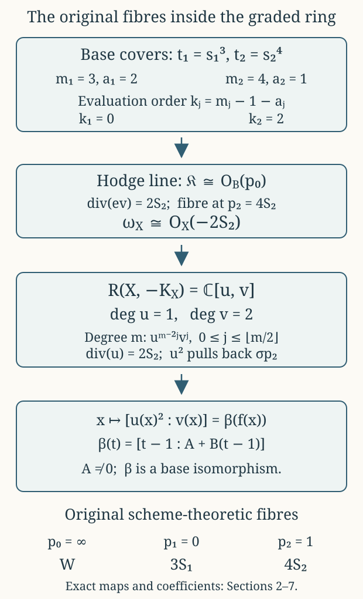

# The canonical divisor, its complete graded ring, and the original fibration {#cg-s6-08}

CG-S6 · Lesson 8

The threefold carries a particular map \(f:X\to B=\mathbb P^1\). In this lesson we recover that very map from holomorphic sections of its anticanonical bundle. The calculation uses the analytic construction of lessons 3–5. It does not require the smooth-sphere recognition at the end of lesson 7.

Keep the original coordinate and fibre names:
\[
t(p_1)=0,\qquad t(p_2)=1,\qquad t(p_0)=\infty,\qquad
f^*(p_1)=3S_1,\qquad f^*(p_2)=4S_2,\qquad f^*(p_0)=W.
\tag{0.1}
\]
Here \(S_1,S_2\) are reduced smooth surfaces and \(W\) is the reduced cusp fibre. A multiple fibre in (0.1) retains its stated multiplicity.

We will prove the actual line-bundle and graded-algebra identities
\[
\begin{gathered}
\omega_X\simeq\mathcal O_X(-2S_2),\qquad
\omega_X^{-2}\simeq f^*\mathcal O_B(p_2),\\
R(X,-K_X):=\bigoplus_{m\geq0}H^0(X,\omega_X^{-m})
\simeq\mathbb C[U,V],\qquad \deg U=1,\quad\deg V=2.
\end{gathered}
\tag{0.2}
\]
The isomorphisms will be specified, including the changes caused by different choices of generators. In particular, the degree-two pencil recovers \(f\) with its multiple fibres.

## 1. Divisors, functions and the evaluation map {#divisor-conventions}

For a Cartier divisor \(D\) on a complex manifold, define
\[
\mathcal O_X(D)(U)=
\{a\in\mathcal M_X(U):\operatorname{div}(a)|_U+D|_U\geq0\}.
\tag{1.1}
\]
The symbol \(\mathcal M_X\) denotes meromorphic functions. If \(D\) has equation \(h=0\) with its multiplicity included, then \(h^{-1}\) is a local frame of \(\mathcal O_X(D)\). Its distinguished meromorphic section \(1\) has divisor \(D\). For an effective divisor it is holomorphic. This convention determines every sign below.

The canonical bundle \(\omega_X\) is the line bundle of holomorphic three-forms. Define
\[
\omega_{X/B}=\omega_X\otimes f^*\omega_B^{-1},
\qquad \mathfrak K=f_*\omega_{X/B}.
\tag{1.2}
\]
The definition makes sense over all fibres: it is a tensor product of line bundles on the smooth threefold. It does not define \(\omega_{X/B}\) by dividing differential forms by \(df\) at a critical point.

There is an actual evaluation morphism
\[
\operatorname{ev}:f^*\mathfrak K\longrightarrow\omega_{X/B}.
\tag{1.3}
\]
A section of \(\mathfrak K\) over a base open set is, by definition, a relative canonical section over its inverse image; evaluation restricts that section at each point of \(X\). We will prove that \(\mathfrak K\) is a line bundle and calculate the zero divisor of (1.3).

**Lemma 1.1.** The original map satisfies \(f_*\mathcal O_X=\mathcal O_B\), with the equality given by pullback of functions.

**Proof.** A holomorphic function on a connected compact complex torus is constant: its absolute value attains a maximum, and the maximum principle in coordinate polydiscs makes it locally, hence globally, constant. Over a regular base point, a holomorphic section of the submersion shows that these constants vary holomorphically. Thus a holomorphic function \(H\) on \(f^{-1}(U)\) descends over the regular part of \(U\).

At \(p_j\), pull back to the original finite étale total-space cover \(q_j:J'_j\to N_j\). The torus family \(J'_j\to\Delta_j\) has its zero section. The value of \(q_j^*H\) on this section gives a holomorphic function \(a(s_j)\); constancy on the torus fibres gives equality with its pullback throughout \(J'_j\). Quotient invariance gives
\[
a(\zeta_js_j)=a(s_j).
\tag{1.4}
\]
The power series of \(a\) therefore has only exponents divisible by \(m_j\), where \(m_1=3,m_2=4\). It is a convergent power series in \(t_j=s_j^{m_j}\), proving holomorphic descent at the finite point.

At the cusp choose a point of the smooth part of \(W\). In the original toric chart \(t_c=z_0z_1z_2\), a sufficiently small neighbourhood of \((0,c_1,c_2)\), with \(c_1c_2\ne0\), has the holomorphic section
\[
t_c\longmapsto(t_c/(c_1c_2),c_1,c_2).
\tag{1.5}
\]
The quotient is locally biholomorphic there, so (1.5) descends to \(N_0\). Evaluating \(H\) on this section extends its base function across the cusp. Its pullback agrees with \(H\) away from the central fibre, and hence everywhere by continuity; that open set is dense in each toric chart. The same density argument establishes the finite-point equality if it was first obtained on punctured fibres. Finally the local descended functions agree on overlaps, since \(f\) is surjective. Pullback is injective for the same reason. ∎

## 2. Every determinant character and every ramification factor {#finite-canonical-characters}

On the marked family let
\[
e=d\zeta_1\wedge d\zeta_2.
\tag{2.1}
\]
Here \(\zeta_1,\zeta_2\) are fibre coordinates. To avoid confusion, the constants denoted \(\zeta_j\) in a base rotation retain the notation of lesson 3:
\[
\zeta_1=e^{-2\pi i/3},\qquad \zeta_2=e^{-\pi i/2}=-i.
\tag{2.2}
\]
The context of a differential or of \(s_j\mapsto\zeta_js_j\) distinguishes the two uses.

The original fibre-linear transformations, obtained by applying the unchanged period matrix to the \(\widehat w,\widehat\delta\) columns, are
\[
R_{g_1}=
\begin{pmatrix}\tau(g_1z)-1&0\\ \mu(g_1z)&1\end{pmatrix},
\qquad
R_{g_2}=
\begin{pmatrix}-\tau(g_2z)&0\\ 1-\mu(g_2z)&1\end{pmatrix}.
\tag{2.3}
\]
Using the full transformation laws of lesson 4 gives
\[
\det R_{g_1}=-1/\tau,\qquad
\det R_{g_2}=1/\tau,\qquad \det R_{g_0}=1.
\tag{2.4}
\]
At the finite centres \(\tau(z_1)=\rho=e^{\pi i/3}\) and \(\tau(z_2)=i\), these values are
\[
\rho-1=\zeta_1^2,\qquad -i=\zeta_2.
\tag{2.5}
\]
Write \(a_1=2,a_2=1\) for these exact character exponents.

Over \(p_j\), the covering map of bases is \(t_j=s_j^{m_j}\). The total-space quotient is étale, although the base map is ramified. On the cover the nowhere-zero canonical frame \(ds_j\wedge e\) transforms by
\[
(g_j^{\log})^*(ds_j\wedge e)=\chi_j(s_j)\,ds_j\wedge e,
\qquad
\chi_j(s)=\zeta_j\det R_{g_j}(s).
\tag{2.6}
\]
The translation part of \(g_j^{\log}\) contributes terms containing \(ds_j\) to the pulled-back fibre differentials; these disappear after wedging with \(ds_j\). Thus (2.6) also includes the varying affine translation.

Iteration gives \(\prod_{r=0}^{m_j-1}\chi_j(\zeta_j^rs)=1\). On a sufficiently small invariant disc take the holomorphic logarithm
\[
\chi_j(s)=\zeta_j^{1+a_j}\exp(\psi_j(s)),\qquad \psi_j(0)=0.
\tag{2.7}
\]
The sum \(\sum_r\psi_j(\zeta_j^rs)\) has exponential \(1\) and value \(0\) at the origin. It is therefore identically zero. In the series \(\psi_j(s)=\sum_{n\geq1}c_{jn}s^n\), every coefficient with \(m_j\mid n\) vanishes.

Define the actual correcting unit by
\[
\varphi_j(s)=
\sum_{\substack{n\geq1\\m_j\nmid n}}
\frac{c_{jn}}{1-\zeta_j^n}s^n .
\tag{2.8}
\]
It is holomorphic on the same disc: the finitely many possible nonzero denominators have a positive minimum absolute value. Moreover
\(\varphi_j(s)-\varphi_j(\zeta_js)=\psi_j(s)\).
Put \(k_j=m_j-1-a_j\), so that
\[
k_1=0,\qquad k_2=2.
\tag{2.9}
\]
Equation (2.8) makes
\[
\sigma_j=s_j^{k_j}e^{\varphi_j(s_j)}ds_j\wedge e
\tag{2.10}
\]
invariant. Indeed its total constant character is
\(\zeta_j^{k_j+1+a_j}=\zeta_j^{m_j}=1\), and the nonconstant factors cancel by (2.8). The descended canonical section has divisor \(k_jS_j\), because its pullback has divisor \(k_j\{s_j=0\}\) and an étale map preserves local orders. This calculation proves, in particular, that the section at \(p_2\) vanishes to order two.

Now use the relative frame
\[
\vartheta_j=(ds_j\wedge e)\otimes(dt_j)^{-1}.
\tag{2.11}
\]
The last factor is the pulled-back inverse frame of \(\omega_{D_j}\). It is nowhere zero as a bundle frame, including at \(s_j=0\). With \(\vartheta'_j=e^{\varphi_j}\vartheta_j\), its character is the constant \(\zeta_j^{1+a_j}\).

Every holomorphic coefficient of a relative canonical section on \(J'_j\) is a function of \(s_j\): divide by \(\vartheta'_j\) and apply the torus constancy and zero-section argument of Lemma 1.1. An invariant coefficient \(F(s)\) must satisfy
\[
F(\zeta_js)\zeta_j^{1+a_j}=F(s).
\tag{2.12}
\]
Its powers are exactly \(s^{k_j+m_jn}\), \(n\geq0\). Descent therefore gives the precise free module
\[
\mathfrak K|_{D_j}
=\mathcal O_{D_j}\cdot s_j^{k_j}\vartheta'_j.
\tag{2.13}
\]
Over the punctured disc only, the relative-fibre identification uses
\(dt_j=m_js_j^{m_j-1}ds_j\) and becomes
\[
s_j^{k_j}\vartheta'_j
=\frac{e^{\varphi_j(s_j)}}{m_j}s_j^{-a_j}e.
\tag{2.14}
\]
Both \(m_j\) and the exponential unit are retained. Equation (2.14) is a comparison over the smooth locus; (2.11) and (2.13) give the nonsingular bundle calculation at its centre.

## 3. The cusp and the global Hodge line {#global-hodge-line}

The original toric cusp has the invariant form
\[
\Omega_0=\frac{dx_1}{x_1}\wedge\frac{dx_2}{x_2}\wedge dt_c.
\tag{3.1}
\]
Lesson 5 proves, in each unimodular monomial chart, that it is a nowhere-zero ordinary three-form. Its chart determinant and the exact overlap give
\[
\Omega_0=(2\pi i)^2dt_c\wedge e.
\tag{3.2}
\]
Translations preserve (3.1), and the defining integral shears have determinant one. It therefore descends to a canonical frame on \(N_0\). Dividing by that frame and applying Lemma 1.1 shows that
\[
\mathfrak K|_{D_0}
=\mathcal O_{D_0}\cdot\bigl((2\pi i)^{-2}\Omega_0\otimes(dt_c)^{-1}\bigr).
\tag{3.3}
\]
On the punctured overlap the displayed generator is exactly \(e\). Together with (2.13) and the invariant volume form on a smooth torus, this proves local freeness of \(\mathfrak K\) everywhere.

We use the function already constructed, with its branch, in lesson 4:
\[
\Theta=
\frac{(E_4\circ\tau)^2h}{\Delta_{\rm mod}\circ\tau},
\qquad h^2=E_6\circ\tau.
\tag{3.4}
\]
That lesson proves its full transformation laws
\[
\Theta(g_1z)=-\Theta(z)/\tau(z),\qquad
\Theta(g_2z)=\Theta(z)/\tau(z),
\tag{3.5}
\]
its invariance at the cusp, and its orders \(2,1,-1\) at \(z_1,z_2,p_0\). The preceding modular-form provider proves that there are no other zeros or poles. The square root and its character are fixed by the original finite coordinates, rather than chosen again here.

Consequently
\[
\mathsf e=\Theta^{-1}e
\tag{3.6}
\]
is single-valued. To check its precise extensions, put
\(c_j(s_j)=s_j^{-a_j}\Theta(s_j)\), a holomorphic unit. Relative to the finite generator (2.14), (3.6) has coefficient
\[
m_j e^{-\varphi_j(s_j)}c_j(s_j)^{-1}.
\tag{3.7}
\]
Both sections are invariant, so this coefficient is an invariant unit and hence a unit in \(t_j\). At the cusp write \(\Theta=t_c^{-1}c_0(t_c)\), where \(c_0\) is a unit. The coefficient of (3.6) relative to (3.3) is \(t_cc_0^{-1}\), which has a simple zero.

Thus (3.6) is a holomorphic section of \(\mathfrak K\) with exact divisor \(p_0\). Sending the distinguished divisor section to \(\mathsf e\) specifies
\[
\mathfrak K\simeq\mathcal O_B(p_0).
\tag{3.8}
\]

## 4. The canonical divisor, with the base coordinate retained {#canonical-divisor}

**Theorem 4.1.** Evaluation (1.3) has zero divisor \(2S_2\). With the choices below,
\[
\omega_X\simeq f^*\mathcal O_B(-p_2)\otimes\mathcal O_X(2S_2)
\simeq\mathcal O_X(-2S_2),
\qquad
\omega_X^{-2}\simeq f^*\mathcal O_B(p_2).
\tag{4.1}
\]

**Proof.** On the finite cover, evaluation of the generator (2.13) is \(s_j^{k_j}\vartheta'_j\) in the nowhere-zero frame \(\vartheta'_j\). It has order \(k_j\) along \(\{s_j=0\}\). Étale descent gives \(k_jS_j\). On smooth fibres the volume form has no zeros; at the cusp (3.3) evaluates to a frame. These open sets cover \(X\), so no further component occurs:
\[
\operatorname{div}(\operatorname{ev})=0S_1+2S_2+0W=2S_2.
\tag{4.2}
\]
A nonzero map of line bundles \(L\to M\) with divisor \(D\) identifies \(M=L\otimes\mathcal O(D)\): in local frames the map is a function \(a\), and multiplying the local frame \(a^{-1}\) of \(\mathcal O(D)\) into its image gives the frame of \(M\). Apply this construction to (1.3) and then tensor by \(f^*\omega_B\):
\[
\omega_X\simeq f^*(\mathfrak K\otimes\omega_B)\otimes\mathcal O_X(2S_2).
\tag{4.3}
\]

Specify the rational function and differential
\[
h_B=\frac1{t-1},\qquad
\eta_B=\frac{dt}{(t-1)^2}.
\tag{4.4}
\]
At infinity, with \(w=1/t\), these are \(w/(1-w)\) and \(-dw/(1-w)^2\). Hence
\[
\operatorname{div}(h_B)=p_0-p_2,\qquad
\operatorname{div}(\eta_B)=-2p_2.
\tag{4.5}
\]
The differential specifies \(\omega_B\simeq\mathcal O_B(-2p_2)\). By (3.8), the base line in (4.3) is \(\mathcal O_B(p_0-2p_2)\). Multiplication by the actual function \(h_B\) maps it isomorphically to \(\mathcal O_B(-p_2)\): under (1.1), multiplication by a function of divisor \(E\) changes \(D\) to \(D-E\).

Pulling back this specified map and using \(f^*(p_2)=4S_2\) gives
\[
\omega_X\simeq\mathcal O_X(-4S_2+2S_2)=\mathcal O_X(-2S_2).
\tag{4.6}
\]
Taking the inverse square gives \(\mathcal O_X(4S_2)=f^*\mathcal O_B(p_2)\), with its induced identification. ∎

There are two separate maps in this calculation: the quotient \(q_j\) is étale and therefore preserves divisor orders; the base map \(s_j\mapsto s_j^{m_j}\) has ramification factor \(m_js_j^{m_j-1}\). Equation (2.14) proves their exact relation.

## 5. Direct images for every positive and negative divisor coefficient {#vertical-direct-image}

**Theorem 5.1.** For every integer \(k\), equality as subsheaves of meromorphic functions, via pullback, is
\[
f_*\mathcal O_X(kS_2)=
\mathcal O_B\bigl(\lfloor k/4\rfloor p_2\bigr).
\tag{5.1}
\]

**Proof.** A section \(a\) on \(f^{-1}(U)\) is a meromorphic function with
\(\operatorname{div}(a)+kS_2\geq0\). Away from \(S_2\) it is holomorphic. Lemma 1.1 therefore gives a unique holomorphic base function on \(U\setminus\{p_2\}\).

Near \(p_2\), pull back to \(J'_2\). The function \(s_2^kq_2^*a\) is holomorphic by its divisor bound; this statement also applies when \(k<0\), in which case it expresses required vanishing of \(q_2^*a\). On punctured fibres the coefficient is already constant. The zero section gives a holomorphic function \(H(s_2)\), and equality with its pullback follows on the whole cover by density. Thus
\(q_2^*a=s_2^{-k}H(s_2)\) is a meromorphic function of \(s_2\) with a Laurent series bounded below.

Its quotient invariance is \(a(\zeta_2s_2)=a(s_2)\). Uniqueness of Laurent coefficients leaves only powers divisible by four. Consequently it equals \(b(s_2^4)\), with \(b\) meromorphic in \(t_2\). The order inequality becomes
\[
4\operatorname{ord}_{p_2}(b)+k\geq0
\quad\Longleftrightarrow\quad
\operatorname{ord}_{p_2}(b)\geq-\lfloor k/4\rfloor .
\tag{5.2}
\]
Conversely any base function with (5.2) pulls back to an allowed section. The extension agrees with the function already obtained on the punctured base; uniqueness makes these constructions compatible with restrictions and overlaps. This proves the sheaf equality. ∎

For example \(k=-1,-2,-3,-4\) all require one zero on the base. The value at \(k=-5\) requires two. Positive \(k=1,2,3\) permits no base pole; \(k=4\) permits one. These jumps encode the original multiplicity four.

**Corollary 5.2.** For \(m\geq0\),
\[
h^0(X,\omega_X^{-m})=\lfloor m/2\rfloor+1.
\tag{5.3}
\]
For every \(m>0\), \(H^0(X,\omega_X^m)=0\).

**Proof.** By (4.6) and (5.1), the two direct images are
\[
f_*\omega_X^{-m}=\mathcal O_B(\lfloor m/2\rfloor p_2),\qquad
f_*\omega_X^m=\mathcal O_B(\lfloor-m/2\rfloor p_2).
\tag{5.4}
\]
For \(d\geq0\), the functions
\[
1,\ (t-1)^{-1},\ldots,(t-1)^{-d}
\tag{5.5}
\]
are a basis of \(H^0(B,\mathcal O_B(dp_2))\). Indeed subtracting the finite principal part of a section at \(p_2\) leaves a holomorphic function on the compact sphere, hence a constant. Independence follows from the distinct Laurent orders. For \(d<0\), an allowed section is a globally holomorphic function with a positive-order zero at \(p_2\), hence is zero. Formula (5.4) now proves the assertions, including odd positive \(m\) and all their ceiling signs. ∎

## 6. Multiplication in the complete anticanonical ring {#complete-graded-ring}

Fix the specific isomorphism
\(\alpha:\omega_X^{-1}\to\mathcal O_X(2S_2)\) obtained in Section 4. Let \(u\) be the section corresponding to the divisor section \(1\). Its zero divisor is \(2S_2\).

Write \(\sigma_{p_2}=1\) for the distinguished section of \(\mathcal O_B(p_2)\). Under the induced degree-two isomorphism,
\[
u^2=f^*\sigma_{p_2}.
\tag{6.1}
\]
Choose
\[
\ell=\frac A{t-1}+B,\qquad A\in\mathbb C^*,\quad B\in\mathbb C,
\tag{6.2}
\]
as a second section of that same bundle. Its value at \(p_2\) in the local frame \((t-1)^{-1}\) is \(A\), so it does not vanish there. Let \(v\in H^0(X,\omega_X^{-2})\) correspond to \(f^*\ell\).

**Theorem 6.1.** The homomorphism
\[
\Phi:\mathbb C[U,V]\longrightarrow R(X,-K_X),\qquad
U\longmapsto u,\quad V\longmapsto v,\quad \deg U=1,\ \deg V=2
\tag{6.3}
\]
is an isomorphism of graded \(\mathbb C\)-algebras.

**Proof.** For \(m=2r\), the degree-\(m\) monomials are
\(U^{2r-2j}V^j\), \(0\leq j\leq r\). Their images correspond to
\[
f^*(\sigma_{p_2}^{\,r-j}\ell^j),\qquad 0\leq j\leq r.
\tag{6.4}
\]
In the meromorphic-function convention these are the polynomials
\((A/(t-1)+B)^j\). Their coefficient matrix in the ordered basis (5.5) is triangular, with diagonal entries \(1,A,\ldots,A^r\), all nonzero. They are therefore exactly a basis of the entire section space.

For \(m=2r+1\), the degree-\(m\) monomials are
\(U^{2r+1-2j}V^j\). Their images are \(u\) times (6.4). Multiplication by the divisor section gives
\[
H^0(X,\mathcal O_X(4rS_2))
\xrightarrow{\ \cdot1\ }
H^0(X,\mathcal O_X((4r+2)S_2)).
\tag{6.5}
\]
By (5.1) both sides consist of exactly the same base meromorphic functions, with pole order at most \(r\). Thus (6.5) is an isomorphism, and these odd-degree images are a basis as well.

The multiplication is preserved by construction, since \(\Phi\) sends generators to sections and takes their actual tensor products. Every homogeneous component maps bijectively. An arbitrary polynomial is a finite sum of homogeneous polynomials, and the target is a direct sum by degree; a relation would give a relation in each of the bases just proved. The kernel is zero and every section is in the image. ∎

The resulting dimensions, multiplication and generator weights are all part of the assertion. A list of dimensions alone would not establish the absence of relations in (6.3).

The choices also have exact effects. Replacing \(\ell\) by \(a\ell+b\sigma_{p_2}\), with \(a\ne0\), changes
\[
(u,v)\longmapsto(u,av+bu^2).
\tag{6.6}
\]
Replacing \(\alpha\) by \(c\alpha\), \(c\ne0\), changes the sections corresponding to the fixed divisor and base sections by
\[
(u,v)\longmapsto(c^{-1}u,c^{-2}v).
\tag{6.7}
\]
These equalities retain both constants and the term \(bu^2\).

## 7. Recovering the map and its multiple fibres {#intrinsic-fibration}

**Theorem 7.1.** The complete degree-two linear system is base-point-free and defines
\[
\phi_{|-2K_X|}(x)
=[u(x)^2:v(x)]
=[\sigma_{p_2}(f(x)):\ell(f(x))]
=\beta(f(x)),
\tag{7.1}
\]
where
\[
\beta(t)=[t-1:A+B(t-1)].
\tag{7.2}
\]
The morphism \(\beta:B\to\mathbb P^1\) is an isomorphism. The degree-one system has the unique effective divisor \(2S_2\).

**Proof.** In the frame \((t-1)^{-1}\), the sections \(\sigma_{p_2},\ell\) have coefficients \(t-1,A+B(t-1)\). They never vanish simultaneously, since the second is \(A\ne0\) when the first is zero. This includes \(p_2\), whose image is \([0:A]\). At infinity, using the regular frame of \(\mathcal O_B(p_2)\), their values are \(1,B\); the image is \([1:B]\). Thus the pulled-back pencil also has no base point.

Writing \(t=T_0/T_1\), (7.2) is induced by
\[
\begin{pmatrix}1&-1\\ B&A-B\end{pmatrix}
\begin{pmatrix}T_0\\T_1\end{pmatrix},
\qquad \det=A\ne0.
\tag{7.3}
\]
It is a projective-coordinate isomorphism, with inverse
\[
[Z_0:Z_1]\longmapsto[Z_1+(A-B)Z_0:Z_1-BZ_0].
\tag{7.4}
\]
Substitution verifies both compositions, with their common nonzero scalar \(A\) retained in the underlying matrices. Equation (7.1) now follows from the very definitions (6.1)–(6.2). In degree one Corollary 5.2 gives a one-dimensional space, generated by \(u\), whose divisor is \(2S_2\). ∎

In particular, the fibre of (7.1) over \(\beta(p_j)\) is the original scheme-theoretic fibre \(m_jS_j\), not merely its support. For a local coordinate \(z\) vanishing at \(\beta(p_j)\), the function \(z\circ\beta\) has a simple zero at \(p_j\), because \(\beta\) is a local isomorphism. Its pullback has divisor \(f^*(p_j)=m_jS_j\). The same argument retains the reduced cusp \(W\).

**Corollary 7.2.** A biholomorphism \(F:X\to X'\) between two threefolds of this construction sends their original fibrations to each other by a unique base isomorphism \(b:B\to B'\):
\[
f'\circ F=b\circ f.
\tag{7.5}
\]
When both bases carry the original labels \(p_0=\infty,p_1=0,p_2=1\), this base isomorphism fixes all three points and is the identity.

**Proof.** Pullback of differential forms along \(F\) identifies the canonical line bundles and their tensor powers; it gives an isomorphism of the entire graded section rings and of the evaluation maps. In degree two it identifies the two-dimensional complete systems. Their projective maps therefore differ by an invertible projective linear map. Substitute (7.1) for each threefold and compose with the two explicit inverses (7.4); this constructs \(b\) and proves (7.5). Uniqueness follows from surjectivity of \(f\).

An isomorphism preserves the scheme-theoretic multiplicity of each fibre, since it preserves local orders of functions. It also preserves whether the reduced fibre is smooth and normal. The non-normal cusp \(W\), the smooth reduced fibre with multiplicity three, and the smooth reduced fibre with multiplicity four are consequently preserved with their respective labels. Hence \(b\) fixes \(\infty,0,1\). A fractional linear map fixing these points has zero translation, zero denominator coefficient and multiplier one, so it is the identity. ∎

This is the intrinsic map needed in the marked comparison of lesson 9. It is proved directly from canonical sections; no assertion about the full meromorphic function field of \(X\) was required.

{.compact-diagram #canonical-diagram}

Figure 1. The arrows record the actual deductions in Sections 2–7. The last row retains every fibre multiplicity. This is a diagram of maps and divisors, not a geometric embedding of the six-manifold. The reproducible source is [the figure script](../checks/draw_canonical_ring.py).

## 8. Four worked exercises {#solved-exercises}

### Exercise 8.1. The coefficient that a ramified base conceals

For each \((m,a)=(3,2),(4,1)\), solve the invariance condition for a holomorphic coefficient multiplying \((ds\wedge e)\otimes(dt)^{-1}\), after the unit correction, and determine both its total-space vanishing order and its expression over \(s\ne0\).

**Solution.** If \(F(s)=\sum_{n\geq0}b_ns^n\), invariance requires
\(b_n(\zeta^{n+1+a}-1)=0\). The least possible exponent is \(k=m-1-a\), namely \(0\) and \(2\). Every allowed \(F\) is \(s^kH(s^m)\). The module generator on the cover is
\(s^ke^{\varphi(s)}(ds\wedge e)\otimes(dt)^{-1}\), with divisor \(k\{s=0\}\). The total-space quotient is étale, so its descended divisor is \(kS\). Over \(s\ne0\), the unchanged differential \(dt=ms^{m-1}ds\) gives
\[
\frac{e^{\varphi(s)}}3s^{-2}e
\quad\hbox{and}\quad
\frac{e^{\varphi(s)}}4s^{-1}e,
\tag{8.1}
\]
respectively. The apparent negative powers in (8.1) are expressions in the smooth-fibre frame, while the original relative bundle frames are (2.11). The exact map (2.14) relates them.

### Exercise 8.2. Negative orders and odd tensor powers

Compute the base divisor in (5.1) for \(k=-9,-8,\ldots,9\). Determine the fixed divisor of the complete anticanonical system in each positive degree.

**Solution.** For the consecutive listed values of \(k\), the floor coefficients are
\[
-3,-2,-2,-2,-2,-1,-1,-1,-1,0,0,0,0,1,1,1,1,2,2.
\tag{8.2}
\]
For degree \(2r\), the sections in (6.4) form the pullback of the complete degree-\(r\) system on the base. At any base point at least one such monomial is nonzero: use a nonvanishing member of the pair \(\sigma_{p_2},\ell\) and raise it to the \(r\)-th power. Its pullback is nonvanishing at every point of that fibre. Thus the even-degree system has no fixed divisor or base point.

For degree \(2r+1\), all sections are \(u\) times that even system by (6.5), so every section vanishes along \(2S_2\). After dividing by the specific divisor section \(u\), the resulting complete system has no base point, by the preceding argument. The fixed divisor is therefore exactly \(2S_2\), including when \(r=0\). No additional component or higher multiplicity can be fixed.

### Exercise 8.3. Hilbert series and all graded coordinate changes

Compute the Hilbert series of \(R(X,-K_X)\), and determine every graded algebra automorphism in the generators \(U,V\).

**Solution.** Counting the monomials gives an equality of formal power series
\[
\sum_{m\geq0}(\lfloor m/2\rfloor+1)z^m
=\sum_{a,b\geq0}z^{a+2b}
=\frac1{(1-z)(1-z^2)}.
\tag{8.3}
\]
The degree-one vector space has basis \(U\), so any graded automorphism sends \(U\) to \(cU\), \(c\ne0\). The degree-two space has basis \(U^2,V\). Its quotient by the square of degree one is one-dimensional, so \(V\) must map to \(aV+bU^2\), with \(a\ne0\). Conversely these assignments define an automorphism; its inverse sends
\[
U\longmapsto c^{-1}U,\qquad
V\longmapsto a^{-1}V-\frac{b}{ac^2}U^2.
\tag{8.4}
\]
Substituting into both compositions proves the inverse exactly. Thus the complete list is \(U\mapsto cU,\ V\mapsto aV+bU^2\), with \(a,c\in\mathbb C^*\) and \(b\in\mathbb C\).

### Exercise 8.4. Every degree-two member with its multiplicity

Let \(\lambda,\mu\in\mathbb C\) be not both zero. Find the entire zero divisor of \(\lambda u^2+\mu v\), including its exceptional cases.

**Solution.** Its base section is
\[
\lambda\sigma_{p_2}+\mu\ell
=(\lambda+\mu B)+\frac{\mu A}{t-1}.
\tag{8.5}
\]
If \(\mu=0\), its zero as a section of \(\mathcal O_B(p_2)\) is \(p_2\); the zero divisor on \(X\) is \(4S_2\).
If \(\mu\ne0\) and \(\lambda+\mu B=0\), it is \(\mu A/(t-1)\). In the regular frame at infinity it has one simple zero there; it is nonzero at \(p_2\) in the frame \((t-1)^{-1}\). Its divisor is \(p_0\), and the pulled-back divisor is \(W\).
In all other cases its unique zero is
\[
t_*=1-\frac{\mu A}{\lambda+\mu B}.
\tag{8.6}
\]
The zero is simple because the numerator in the local frame is a nonconstant linear polynomial. Its divisor on \(X\) is exactly \(f^*(t_*)\): this is \(3S_1\) when \(t_*=0\), and a reduced smooth torus fibre when \(t_*\notin\{0,1,\infty\}\). The case \(t_*=1\) cannot occur here, since \(\mu A\ne0\). This lists every member and every multiplicity.

## 9. Sources and the boundary of this lesson {#sources}

The retained programme proofs are *Structure-sheaf direct images and uniform non-torsion*, equations (9.2)–(9.6), and *The canonical divisor and the exact anticanonical ring*, (CR1)–(CR5). Their complete source files are in the [frozen public project archive](https://zenodo.org/records/22678442/files/28_s6_complete_public_project_frozen_2026-09-06.zip), at the paths ending in analytic_picard.tex and analytic_canonical_ring.tex inside project/supporting_materials/workbench/research/. The first file was read through its entire determinant/Hodge-line argument; the second was read completely. The present lesson supplies independently written receiving proofs, with the coefficient module, exact base changes and every graded multiplication included.

For the modular functions and their branch data, the direct prerequisite is [lesson 4](global-periods-and-line-bundle-quotients.md#global-mu), especially its construction of \(\Theta\). Its checked LG-MF providers are cited there with fixed public commits. For the free finite covers and cusp volume form, the direct prerequisites are [lesson 3](varying-finite-fillings.md) and [lesson 5](cusp-and-compact-threefold.md).

Philip Engel's [Complex structures on \(S^6\), arXiv:2609.38442v1](https://arxiv.org/abs/2609.38442v1), original-author source lines 1645–1682, discusses the varying parameter and an intrinsic fibration via algebraic dimension. The canonical-ring route here is the retained programme argument just cited; it does not attribute that argument to Engel. His conjectural central limit in those remarks is not proved by this lesson.

The Picard-coordinate expressions \(\mathcal O_X(S_1)=L_4,\ \mathcal O_X(S_2)=L_3,\ \omega_X=L_{-6}\) require the separate full analytic Picard calculation with its original choice \(L_{12}=f^*\mathcal O_B(1)\). The divisor and ring proofs in this lesson use their explicit sheaves and do not presume that later comparison.

