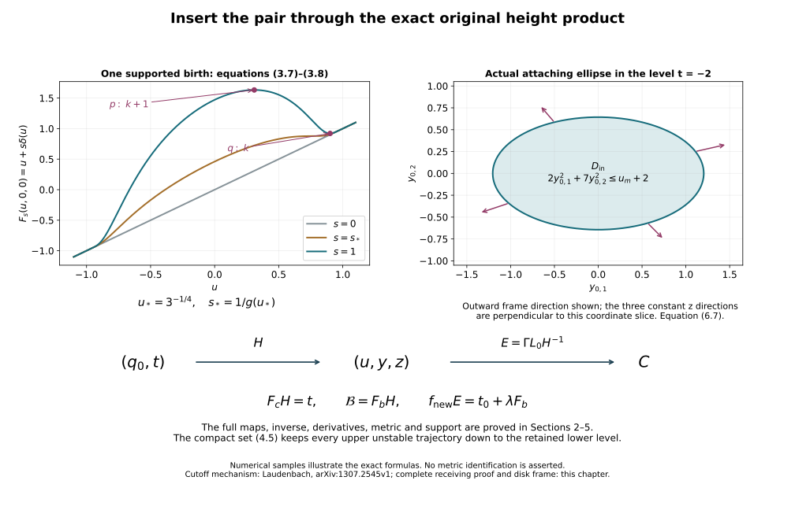

# Creating an original cancelling handle pair

Working source for CG-S6 lesson 7. GPT-6 Astra (OpenAI), Ultra, 10 October 2026. New teaching exposition CC0.

The next handle argument needs a new index-two handle whose attaching circle bounds a framed disk in the original regular level, together with a cancelling index-three handle. Here we construct that pair inside any chosen regular coordinate band. The original function, field, boundary collars, metric and all other critical neighbourhoods are retained outside a compact subset of that band.

More generally, let \(1\leq k\leq n-2\). We construct a pair of indices \(k,k+1\), prove its unique transverse connecting trajectory, and identify the lower attaching sphere and its complete normal frame. The cases used in lesson 7 are \(k=2\) and \(n=6,7\). The construction below is a proof on the original cobordism, with every change of coordinates specified.

## 1. An explicit global pair {#pair-global-model}

On \(\mathbb R\times\mathbb R^k\times\mathbb R^{n-k-1}\), keep the coordinates \((u,y,z)\) and chosen positive coefficients
\[
 A(y)=\sum_{i=1}^k a_i y_i^2,\qquad
 B(z)=\sum_{j=1}^{n-k-1}b_j z_j^2.
 \tag{1.1}
\]
No coefficient is absorbed into a coordinate. Set
\[
 a=-2,\qquad
 \delta(u)=
 \begin{cases}4e^{-1/(1-u^2)},&|u|<1,\\0,&|u|\geq1,\end{cases}
 \qquad h(u)=u+\delta(u),\qquad
 F_b(u,y,z)=h(u)-A(y)+B(z).
 \tag{1.2}
\]
Every derivative of \(\delta\) tends to zero at either joining point: it is an exponential multiplied by a rational function of finite pole order, and \(t^N e^{-t}\to0\). Thus these are smooth global functions.

For \(0<u<1\),
\[
 h'(u)=1-g(u),\quad
 g(u)=\frac{8u}{(1-u^2)^2}e^{-1/(1-u^2)},\quad
 (\log g)'(u)=\frac{1-3u^4}{u(1-u^2)^2}.
 \tag{1.3}
\]
The function \(g\) increases and then decreases, with its unique maximum at \(u_*=3^{-1/4}\), and tends to zero at both endpoints. Also \(g(1/2)=(64/9)e^{-4/3}>1\). For an exact bound, the exponential series gives \(e<3\), whence \(e^{4/3}<3^{3/2}<6<64/9\). Consequently there are exactly two solutions of \(g=1\), denoted
\[
 0<u_M<u_*<u_m<1.
 \tag{1.4}
\]
They are simple. The first is a nondegenerate maximum of \(h\), the second a nondegenerate minimum. On \(u\leq0\) the derivative of \(h\) is positive, as it is outside \([-1,1]\). The entire critical set of \(F_b\) is therefore
\[
 p=(u_M,0,0),\qquad q=(u_m,0,0).
 \tag{1.5}
\]
Its Hessian in the displayed original model coordinates is
\[
 \operatorname{diag}\bigl(h''(u),-2a_1,\ldots,-2a_k,
                    2b_1,\ldots,2b_{n-k-1}\bigr).
 \tag{1.6}
\]
Thus \(p\) has index \(k+1\) and \(q\) has index \(k\), with \(h(u_M)>h(u_m)>a\).

Use the smooth step
\[
 \vartheta(t)=
 \begin{cases}e^{-1/t},&t>0,\\0,&t\leq0,\end{cases}
 \qquad
 \chi(t)=\frac{\vartheta(t)}{\vartheta(t)+\vartheta(1-t)}.
 \tag{1.7}
\]
The denominator is positive everywhere; \(\chi=0\) on \(t\leq0\), \(\chi=1\) on \(t\geq1\), and \(\chi(t)+\chi(1-t)=1\). Fix a positive coefficient \(L\) and put
\[
 b(v)=\frac43\chi(12v-1)\chi(11-12v),\qquad
 \beta(v)=\int_v^1 b(w)\,dw,\qquad
 \eta(B)=1-\chi(2B/L-1).
 \tag{1.8}
\]
Extend \(\beta\) by one for \(v<0\) and zero for \(v>1\). The two transition intervals of \(b\) have length \(1/12\), the plateau has length \(2/3\), and symmetry gives
\[
 \int_0^1b=\frac43\left(\frac1{24}+\frac23+\frac1{24}\right)=1,
 \qquad -\frac43\leq\beta'\leq0.
 \tag{1.9}
\]
In particular \(\beta=1\) on \(v\leq1/12\) and zero on \(v\geq11/12\). The other cutoff is one on \(B\leq L/2\), zero on \(B\geq L\), and nonincreasing.

On \(-1<u<1\), define
\[
 R(u)^2=h(u)-a=u+\delta(u)+2.
 \tag{1.10}
\]
This is positive there. We have \(\delta\leq4/e<3/2\) and \(R^2\geq1+\delta\), so
\[
 0\leq\frac{\delta}{R^2}<\frac35.
 \tag{1.11}
\]
The bound \(e>8/3\) follows from the first five positive terms of its series. Define
\[
 F_c=F_b-\delta(u)\beta(A/R^2)\eta(B)
 \tag{1.12}
\]
where \(|u|<1\), and \(F_c=F_b\) elsewhere. Near either endpoint \(R^2\) stays positive and all derivatives of \(\delta\) vanish, so the displayed joining is smooth. The difference has compact support: \(|u|\leq1\), \(A\leq(11/12)R^2\), and \(B\leq L\) on that support. Positive definiteness in (1.1) bounds all transverse coordinates.

## 2. Cancellation, the complete derivative and the lower level {#pair-cancelled-model}

Write \(v=A/R^2\). The full derivatives on the changed region are
\[
\begin{aligned}
 \partial_{y_i}F_c&=-2a_i y_i
       \left[1+\frac{\delta}{R^2}\beta'(v)\eta(B)\right],\\
 \partial_{z_j}F_c&=2b_j z_j
       \left[1-\delta\beta(v)\eta'(B)\right],\\
 \partial_uF_c&=h'-\delta'\beta(v)\eta(B)
       +2\delta\frac{R'}R\,v\beta'(v)\eta(B).
\end{aligned}
 \tag{2.1}
\]
Here \(2RR'=h'\). In particular the variable-radius contribution is retained. The first bracket is at least \(1-(3/5)(4/3)=1/5\); the second is at least one. A critical point would have \(y=z=0\). But there \(F_c=u\) and \(\partial_uF_c=1\). Outside the changed region a possible critical point of \(F_b\) would be one of (1.5), both of which lie in the changed region. Hence \(F_c\) has no critical point anywhere.

The entire level at \(a=-2\) is unchanged:
\[
 F_c^{-1}(a)=F_b^{-1}(a).
 \tag{2.2}
\]
To prove this, fix \(u\) in the support interval and \(B\geq0\), and regard (1.12) as a function of \(A\). Its derivative with respect to \(A\) is the negative of the first bracket in (2.1), hence is at most \(-1/5\). At \(A=R^2\) its value is \(a+B\). Thus at \(A<R^2\) it is strictly greater than \(a+B\). At \(A\geq R^2\) the modification is zero. This proves both inclusions in (2.2). In fact the support of the difference stays a positive distance above that level: when \(A\leq(11/12)R^2\), integration of the same derivative bound gives
\[
 F_c-a\geq B+\frac15(R^2-A)\geq B+\frac{R^2}{60}
          \geq \frac1{60}.
 \tag{2.3}
\]
The endpoint closures also satisfy this bound wherever the support can accumulate. Thus the two functions agree on a whole neighbourhood of their common \(a\)-level.

That level has a global parametrization, not merely a local chart. For \(y,z\), put
\[
 u_0=a+A(y)-B(z),\qquad
 \gamma(y,z)=1+\frac{\delta(u_0)}{A(y)},\qquad
 j(y,z)=(u_0,\sqrt{\gamma(y,z)}\,y,z).
 \tag{2.4}
\]
When \(\delta(u_0)=0\), interpret \(\gamma=1\). This defines a smooth function even at \(A=0\): if \(A<1\), then \(u_0<-1\), so the added numerator is identically zero. When that numerator is nonzero, \(A=u_0-a+B>1+B>0\). Direct substitution, retaining both quadratic forms, gives
\[
 A(\sqrt\gamma\,y)=A(y)+\delta(u_0),\qquad F_b(j(y,z))=a.
 \tag{2.5}
\]
On this level, writing its points as \((u,Y,z)\), the inverse is
\[
 j^{-1}(u,Y,z)=
 \left(
 \sqrt{\frac{u-a+B(z)}{u+\delta(u)-a+B(z)}}\,Y,\ z
 \right)
 \tag{2.6}
\]
when \(\delta(u)\ne0\), and \((Y,z)\) otherwise. Both numerator and denominator are positive on the support interval. The same zero extension proves smoothness at all other points, including \(Y=0\). Equations (2.4)–(2.6) verify the two inverse identities. Consequently \(j\) is a diffeomorphism onto the entire common level.

For later framing and metric comparisons, its derivative is
\[
\begin{aligned}
 du_0&=2\sum_i a_i y_i\,dy_i-2\sum_j b_jz_j\,dz_j=dA-dB,\\
 d\gamma&=\frac{\delta'(u_0)}A\,du_0
                  -\frac{\delta(u_0)}{A^2}\,dA,\\
 d(\sqrt\gamma\,y)&=\sqrt\gamma\,dy+\frac{y}{2\sqrt\gamma}\,d\gamma,
 \qquad dz=dz.
\end{aligned}
 \tag{2.7}
\]
The formulas involving \(A^{-1}\) are used on \(A>0\) and have the smooth zero extension just proved. No term is dropped at a nonzero numerator.

## 3. A global product with its inverse {#pair-global-product}

Use the Euclidean metric on the model coordinates solely to define the following auxiliary vector field:
\[
 V=\frac{\nabla F_c}{\|\nabla F_c\|^2}.
 \tag{3.1}
\]
There is a uniform positive lower bound for \(\|\nabla F_c\|\). Outside \(|u|\leq1\), the \(u\)-derivative is one. Inside that interval but outside a bounded transverse set, the modification is zero and the transverse gradient of \(F_b\), namely \((-2a_i y_i,2b_jz_j)\), has norm tending to infinity. The remaining set is compact, and the already proved absence of critical points gives a positive minimum there. Let \(m>0\) be the resulting bound. Then \(\|V\|\leq1/m\).

The field \(V\) is complete in both time directions. In finite time, its bounded speed keeps every trajectory in a compact Euclidean ball. On that ball it is smooth with bounded derivatives, and the elementary local ODE theorem extends a trajectory past any proposed finite endpoint. Moreover \(dF_c(V)=1\). Writing its global flow as \(\phi_s\), define
\[
 H(q_0,t)=\phi_{t-a}(j(q_0)),\qquad
 H:\mathbb R^{n-1}\times\mathbb R\longrightarrow\mathbb R^n.
 \tag{3.2}
\]
Here \(q_0=(y,z)\); it is a level parameter, not the critical point \(q\) from (1.5). The inverse map is exactly
\[
 H^{-1}(x)=
 \left(j^{-1}(\phi_{a-F_c(x)}(x)),\,F_c(x)\right).
 \tag{3.3}
\]
Indeed \(F_c(\phi_sx)=F_c(x)+s\), so the inner point lies in the common \(a\)-level. Flow uniqueness and (2.6) verify both compositions. Smooth dependence of the flow verifies smoothness. Thus \(H\) is a global diffeomorphism and
\[
 F_cH(q_0,t)=t,\qquad
 D H_{(q_0,t)}(\xi,\tau)
  =D\phi_{t-a}|_{j(q_0)}\,Dj|_{q_0}\xi+V(H(q_0,t))\tau.
 \tag{3.4}
\]
For completeness the derivative of the inverse uses \(s(x)=a-F_c(x)\):
\[
 D H^{-1}|_x=
 \begin{pmatrix}
 Dj^{-1}|_{\phi_sx}\,[D\phi_s|_x-V(\phi_sx)\,dF_c|_x]\\
 dF_c|_x
 \end{pmatrix}.
 \tag{3.5}
\]
These formulas retain the variable hitting-time term.

Set
\[
 \mathcal B(q_0,t)=F_b(H(q_0,t)).
 \tag{3.6}
\]
Then \(\mathcal B-t=(F_b-F_c)H\) has compact support \(K'=H^{-1}K\), where \(K=\operatorname{supp}(F_b-F_c)\). Compactness follows because \(H^{-1}\) is continuous. The entire two-critical-point function is now a compactly supported modification of the actual height coordinate, with its diffeomorphism explicitly proved.

This construction also gives a single birth through a supported path. Put
\[
 F_s=F_b-(1-s)\delta\beta(A/R^2)\eta(B),\quad
 \mathcal B_s=F_sH,\qquad 0\leq s\leq1.
 \tag{3.7}
\]
Outside \(|u|<1\) use the unchanged formula. Both transverse brackets remain positive. Therefore every critical point of \(F_s\) lies on the axis, where its equation is \(1-sg(u)=0\). If
\[
 s_*=\frac1{g(u_*)},
 \tag{3.8}
\]
then \(0<s_*<1\); there are no critical points for \(s<s_*\), one degenerate point for \(s=s_*\), and exactly the two nondegenerate points for \(s>s_*\). At the degenerate point the second derivative in \(u\) is zero, the third is \(-s_*g''(u_*)>0\), and the derivative of \(\partial_uF_s\) with respect to \(s\) is \(-g(u_*)<0\). The strict negativity of \(g''(u_*)\) follows by differentiating (1.3): at its zero the derivative of its numerator is \(-12u_*^3<0\) and its denominator is positive. Thus the path has the asserted single ordinary birth, with every transverse Hessian coefficient still \(-2a_i,2b_j\). It is not necessary to presume a birth theorem.

## 4. The exact descending field and its connecting trajectory {#pair-connecting-trajectory}

Near either critical coordinate \(u_c\in\{u_M,u_m\}\), put
\[
 \alpha_c=\frac{|h''(u_c)|}{2},\qquad
 \sigma_M=-1,\quad\sigma_m=1,\qquad
 v_c(u)=(u-u_c)
 \sqrt{\frac{h(u)-h(u_c)}{\sigma_c\alpha_c(u-u_c)^2}}.
 \tag{4.1}
\]
The quotient extends smoothly with value one, by Taylor's integral formula. On a small interval it is positive and \(v_c'>0\), with \(v_c'(u_c)=1\). The exact equation is \(h=h(u_c)+\sigma_c\alpha_c v_c^2\).

Choose a smooth positive function \(\tau(u)\), equal to \(1/[2\alpha_c(v_c')^2]\) on smaller disjoint critical intervals and equal to one outside a compact subset of \((0,1)\). A convex interpolation by cutoffs gives such a function, bounded above and below by positive constants. Define
\[
 X_b=(-\tau(u)h'(u),\,y,\,-z).
 \tag{4.2}
\]
Then
\[
 dF_b(X_b)=-\tau(u)(h'(u))^2-2A(y)-2B(z)<0
 \tag{4.3}
\]
away from the two critical points. In the exact coordinates \((v_c,y,z)\), it is \((-\sigma_c v_c,y,-z)\) near either point. At the minimum reorder the negative and positive coordinates as \((y;v_m,z)\). This reordering has determinant sign \((-1)^k\); the maximum order is \((v_M,y;z)\). The factors \(\alpha_c,a_i,b_j\) remain in their function formulas.

The field is complete: its \(u\)-component is bounded, while \(y(s)=e^s y(0)\) and \(z(s)=e^{-s}z(0)\). Its exact unstable and stable sets relevant here are
\[
 W^u(p)=\{(u,y,0):u<u_m\},\qquad
 W^s(q)=\{(u,0,z):u>u_M\}.
 \tag{4.4}
\]
For the first equality, a backward limit at \(p\) forces \(z=0\); the scalar \(u\)-equation has backward limit \(u_M\) exactly when \(u<u_m\), and the \(y\)-coordinates then tend to zero. The forward argument proves the second equality. Their intersection is the open axial interval \(u_M<u<u_m\). On it \(-\tau h'>0\), so it is a single nonconstant trajectory. The tangent spaces of the two sets span the \(u,y\) and \(u,z\) directions, respectively, and their sum is the entire tangent space. Thus the connecting trajectory is transverse.

Every other nonconstant descending trajectory in \(W^u(p)\) crosses \(F_b=a\). If \(y\ne0\), then \(A(y(s))=e^{2s}A(y(0))\) tends to infinity, while \(h(u(s))\) is bounded above on \(u<u_m\); hence \(F_b\) tends to minus infinity. If \(y=0\) and \(u<u_M\), the scalar solution eventually enters \(u<-1\), where its derivative is \(-1\), and again the value tends to minus infinity. The only remaining nonconstant orbit is the connecting interval.

The closure of the part needed above the lower level is compact:
\[
 T=\overline{W^u(p)\cap\{F_b\geq a\}}
   =\{(u,y,0): a\leq u\leq u_m,\ A(y)\leq h(u)-a\}.
 \tag{4.5}
\]
The equality follows from (4.4), with its limiting face \(u=u_m\) retained. Positive definiteness and compactness of the \(u\)-interval give compactness. In particular it includes the limiting lower unstable disk; that contribution is not discarded. This is the full compact set that will be kept inside the original regular band.

## 5. Insert the pair in the original band {#pair-original-band}

Let \(f:C\to\mathbb R\) be the original Morse function and \(Z\) its descending field. Choose a regular product chart
\[
 \Gamma:Q\times J\longrightarrow C,\qquad f\Gamma(x,t)=t,
 \tag{5.1}
\]
where \(Q\) is a coordinate ball in an original regular level and \(J\) is an open interval with no critical value. The [Morse-trajectory companion](morse-trajectories-and-critical-value-lowering.md#trajectory-holonomy) constructs this chart from the original field and retains its full derivative. Choose its coordinate origin in \(Q\), and choose \(t_0\in J\).

The compact sets \(K'\), \(H^{-1}T\) and a neighbourhood of both critical points in \(H\)-coordinates fit in a finite coordinate rectangle. Enlarge that rectangle to contain all the values of \(F_b\) on \(T\), the value \(a\), and the two critical values in its height bound. Choose explicit positive scales \(\epsilon_1,\ldots,\epsilon_{n-1},\lambda\) small enough that
\[
 L_0(q_0,t)=(\epsilon_1q_{0,1},\ldots,\epsilon_{n-1}q_{0,n-1},
                         t_0+\lambda t)
 \tag{5.2}
\]
carries the closure of a larger rectangle into \(Q\times J\). Such choices exist because the rectangle is compact and \(Q\times J\) is open around \((0,t_0)\). Retain the chosen scales as part of the construction. They specify an embedding of the model into the original coordinates; the original function is not replaced by a rescaled function elsewhere.

In this chart set
\[
 f_{\mathrm{new}}(\Gamma L_0(q_0,t))
       =t_0+\lambda\mathcal B(q_0,t),
 \tag{5.3}
\]
and use the old \(f\) outside the changed compact subset. The two definitions agree on a whole open collar because \(\mathcal B=t\) outside \(K'\). Thus the joining is smooth. Replacing \(\mathcal B\) by \(\mathcal B_s\) gives the supported birth path from the actual old function to the new one.

On the model domain for which the expression is defined, the complete comparison map is
\[
 E=\Gamma L_0 H^{-1},\qquad
 f_{\mathrm{new}}E=t_0+\lambda F_b,\qquad
 DE=D\Gamma|_{L_0H^{-1}}\;DL_0\;DH^{-1}.
 \tag{5.4}
\]
Here \(DL_0=\operatorname{diag}(\epsilon_1,\ldots,\epsilon_{n-1},\lambda)\). At either new critical point,
\[
 (DE)^t\,\operatorname{Hess}(f_{\mathrm{new}})\,DE
     =\lambda\,\operatorname{Hess}(F_b).
 \tag{5.5}
\]
The extra second-derivative chain-rule term vanishes there precisely because \(df_{\mathrm{new}}=0\). Equations (1.6), (5.4) and (5.5) give the original-coordinate Hessians without deleting any factor. The original metric \(g_C\) pulls back to
\[
 E^*g_C=(DE)^t(g_C\circ E)\,DE;
 \tag{5.6}
\]
the auxiliary Euclidean metric in (3.1) was not an assertion that this metric is Euclidean.

To construct the endpoint field, choose a smooth cutoff \(\rho\) equal to one on a neighbourhood of \(K'\cup H^{-1}T\), with compact support inside the larger rectangle. It can be chosen so that its transition region misses \(K'\): first take a relatively compact open neighbourhood of that entire compact set, then a larger one, and use a smooth cutoff between them. Push \(X_b\) forward by \(E\), and set
\[
 Z_{\mathrm{new}}=\rho\,E_*X_b+(1-\rho)Z
 \tag{5.7}
\]
inside the chart, with the cutoff interpreted through \(L_0^{-1}\Gamma^{-1}\), and \(Z_{\mathrm{new}}=Z\) outside. On the transition region \(f_{\mathrm{new}}=f\); there both fields strictly decrease that same function. On the inner region (4.3) applies, and at either new critical neighbourhood the field is exactly the Morse model from (4.1)–(4.2). Thus (5.7) is a smooth descending Morse field.

The entire image of \(T\) has the unchanged pushed-forward model field on a neighbourhood. Therefore the new upper unstable trajectories, followed down to the level \(t_0+\lambda a\), are exactly those proved in Section 4. Any trajectory which has crossed that lower level cannot return to the new lower critical value, since the function strictly decreases. There can be no extra connection produced by the outer interpolation. We have consequently inserted exactly one geometrically cancelling pair in the original band, keeping both original boundary collars and every other critical neighbourhood. The cancellation hypotheses in [the supported cancellation companion](morse-cancellation-with-controlled-support.md#morse-cancellation-data) now hold for this actual pair.

The [original handle construction](relative-morse-functions-and-original-handles.md) gives the actual handle presentation of \(f_{\mathrm{new}}\). If \(G_{\mathrm{old}}:P_{\mathrm{old}}\to C\) and \(G_{\mathrm{new}}:P_{\mathrm{new}}\to C\) are its two complete presentation maps, their exact comparison is
\[
 \Psi=G_{\mathrm{new}}^{-1}G_{\mathrm{old}},\qquad
 D\Psi|_x=DG_{\mathrm{new}}^{-1}|_{G_{\mathrm{old}}(x)}
                                      DG_{\mathrm{old}}|_x.
 \tag{5.8}
\]
It carries every old thick attaching map \(\alpha\) to \(\Psi\alpha\), with frame \(D\Psi|_\alpha D\alpha\). The entire outgoing restriction is retained. This supplies the morphism between the two presentations of the original cobordism.

## 6. The lower attaching sphere bounds its framed disk {#pair-attaching-disk}

Write \(h_m=h(u_m)\). The lower unstable disk down to the original model \(a\)-level is exactly
\[
 D_q=\{(u_m,y,0):A(y)\leq h_m-a\}.
 \tag{6.1}
\]
It is embedded, its boundary lies in \(F_b^{-1}(a)\), and its interior is the lower unstable manifold truncated at that level. Apply \(H^{-1}\) to its boundary. Since \(H(q_0,a)=j(q_0)\), (2.6) gives the exact lower attaching sphere in the original height product:
\[
 t=a,\quad z=0,\quad A(y_0)=u_m-a,\qquad
 y_0=\sqrt{\frac{u_m-a}{h_m-a}}\,y.
 \tag{6.2}
\]
In that very same level it bounds the disk
\[
 D_{\mathrm{in}}=\{(y_0,0,a):A(y_0)\leq u_m-a\}.
 \tag{6.3}
\]
Choose the rectangle in Section 5 to contain this additional compact disk and a neighbourhood before fixing its scales. This is compatible with every earlier compactness requirement. Its image under \(\Gamma L_0\) is the desired actual embedded disk in the original regular level. For \(k=2\), (6.2) is the actual contractible attaching circle needed later.

We also compute the normal frame supplied by the Morse construction. Choose a small positive \(\varepsilon<h_m-a\) within the exact lower critical chart. On its descending unstable sphere \(A(y)=\varepsilon\), \(v_m=z=0\). A whole nearby level section is
\[
 y=\sqrt{\frac{\varepsilon+\alpha_m v_m^2+B(z)}{\varepsilon}}\,
       y_\theta,\qquad A(y_\theta)=\varepsilon,
 \tag{6.4}
\]
so its function value is exactly \(h_m-\varepsilon\). This formula specifies the initial thick section, with all mixed derivatives included by differentiation; its derivatives in \(v_m,z\) at zero have no \(y\)-component.

On the unstable sphere the time to \(a\) is the constant
\[
 T_0=\frac12\log\frac{h_m-a}{\varepsilon}.
 \tag{6.5}
\]
The linearized \(u\)-equation along it is \(\dot{\xi}_u=-\xi_u\), since \(\tau(u_m)h''(u_m)=1\). The \(z\)-equation is also \(\dot{\xi}_z=-\xi_z\). At the endpoint their first variations of \(F_b\) vanish: \(h'(u_m)=0\), \(z=0\), and their \(y\)-variations are zero. The implicit hitting-time derivative is therefore zero in these normal directions. As \(v_m'(u_m)=1\), their transported model frame is
\[
 e^{-T_0}\partial_u,\qquad
 e^{-T_0}\partial_{z_1},\ldots,e^{-T_0}\partial_{z_{n-k-1}}.
 \tag{6.6}
\]
Apply the full derivative of (2.6) at \(u=u_m,z=0\). Since \(h'(u_m)=0\), it gives, in the fixed \(t=a\) level,
\[
 e^{-T_0}\frac{y_0}{2(u_m-a)},\qquad
 e^{-T_0}\partial_{z_1},\ldots,e^{-T_0}\partial_{z_{n-k-1}}.
 \tag{6.7}
\]
The first vector is outward radial in (6.3); the remaining constant vectors are its normal frame throughout the disk. The positive factors in (6.7) give a specified homotopy through frames to the outward radial vector followed by the constant \(z\)-frame, by interpolating each factor in the positive real numbers. No rotation or twist is being assumed absent without calculation.

The actual sphere, disk and frame are the images of (6.2), (6.3), (6.7) under the full maps \(\Gamma L_0\) and \(D(\Gamma L_0)\). The complete nearby attaching tube is obtained from (6.4) by the \(X_b\)-flow with its unique implicit hitting time, then by \(j^{-1}\) and \(\Gamma L_0\). For an initial point \(x\) of that section, that time \(T(x)\) and its full derivative satisfy
\[
 F_b(\operatorname{Fl}^{X_b}_{T(x)}x)=a,\qquad
 dT=-\frac{dF_b|_{\operatorname{Fl}_{T}x}\,
                  D\operatorname{Fl}_{T}|_x}
                 {dF_b(X_b)|_{\operatorname{Fl}_{T}x}}.
 \tag{6.8}
\]
The denominator is strictly negative; compactness of the initial sphere gives a uniform sufficiently small tube on which the formula is defined. Its tangent map is \(D\operatorname{Fl}_T+X_b\,dT\), followed by \(Dj^{-1}\) and \(D(\Gamma L_0)\). This retains the entire thick embedding and all frame contributions, beyond just its central sphere.

## 7. Two complete calculations {#pair-exercises}

### 7.1. A six-dimensional pair with five distinct transverse coefficients

Take \(n=6,k=2\), and retain
\[
 A=2y_1^2+7y_2^2,\qquad B=3z_1^2+5z_2^2+13z_3^2.
 \tag{7.1}
\]
Compute the final and cancelled Hessians and the incoming attaching ellipse.

**Solution.** At either critical point of \(F_b\), its Hessian is
\[
 \operatorname{diag}(h''(u_c),-4,-14,6,10,26).
 \tag{7.2}
\]
The signs give index three at \(u_M\), and index two at \(u_m\). The cancelled function has no critical point, as its transverse derivative vector is
\[
 (-4y_1,-14y_2)
       [1+(\delta/R^2)\beta'\eta],\qquad
 (6z_1,10z_2,26z_3)[1-\delta\beta\eta'].
 \tag{7.3}
\]
Both brackets are strictly positive; on their only common zero \(y=z=0\), the remaining derivative is one. The lower attaching ellipse in the product level is
\[
 2y_{0,1}^2+7y_{0,2}^2=u_m+2,\qquad z=0,\quad t=-2.
 \tag{7.4}
\]
Its semiaxes are \(\sqrt{(u_m+2)/2}\) and \(\sqrt{(u_m+2)/7}\), and its framed filling is the exact inequality with the same left side. Under (5.2) these two semiaxes become \(\epsilon_1\sqrt{(u_m+2)/2}\) and \(\epsilon_2\sqrt{(u_m+2)/7}\) in the chosen original level coordinates; its level is \(t_0-2\lambda\). The original metric lengths are computed with \(\Gamma^*g_C\), not presumed equal to these coordinate semiaxes. Equations (5.4)–(5.6) specify that comparison.

### 7.2. The variable-time term is necessary

For the product (3.2), calculate the derivative of its inverse and verify its height component and level projection.

**Solution.** The height derivative is \(dF_c\). The level projection \(P(x)=\phi_{a-F_c(x)}x\) has derivative
\[
 DP=D\phi_{a-F_c(x)}|_x
      -V(P(x))\,dF_c|_x.
 \tag{7.5}
\]
The identity \(F_c\phi_s=F_c+s\), differentiated with \(s\) fixed, gives \(dF_c|_{P(x)}D\phi_s|_x=dF_c|_x\). Since \(dF_c(V)=1\), applying \(dF_c|_{P(x)}\) to (7.5) gives zero. Thus \(DP\) lands in the tangent space of the actual \(a\)-level, as required for \(Dj^{-1}\) in (3.5). Also flow invariance gives \(D\phi_s V(x)=V(P(x))\); therefore \(DP(V(x))=0\). Substituting (3.4) into (3.5) now gives the identity on both the level tangent and height directions. Omitting the second term of (7.5) would send \(V(x)\) to the nonzero vector \(V(P(x))\), which is not tangent to the level. The omitted term would make the proposed inverse derivative false.

<figure>

<figcaption>The left panel samples the exact axis restriction (3.7) at zero, the unique birth parameter (3.8), and one. Its two marked final points have the indices proved in Section 1. The right panel is the actual incoming coordinate ellipse (7.4), with outward transverse directions from (6.7); the three constant normal directions are outside the plotted slice. The lower arrows are the complete maps (3.2) and (5.4), restricted to the chosen implantation domain for the second arrow. Sections 2–6 prove their inverses, derivatives, support and framing. The plots are numerical illustrations of those exact formulas; no metric identification follows from their appearance.</figcaption>
</figure>

## 8. Sources and the next use {#pair-sources}

The construction uses the exact supported cutoff mechanism already proved in [the cancellation companion, Section 5](morse-cancellation-with-controlled-support.md#morse-supported-cutoff), and its explicitly calculated two-critical-point example. The human source for the cancellation mechanism is François Laudenbach, [*A proof of Morse's theorem about the cancellation of critical points*, arXiv:1307.2545v1](https://arxiv.org/abs/1307.2545v1), Sections 1–3; both retained original-author TeX files were already read in full. The global level parametrization, complete product, compact implantation, birth path and framing calculation are written out above as the receiving teaching derivation. No additional external source reading or novelty is claimed.

This proves the exact pair-creation step, including the framed disk for the new lower attaching sphere. The framed slides and index-one removal now use this pair, calculate the exact based relator sign and multiplication order, construct the full ambient loop isotopy, and verify the unique transverse trajectory for the actual one/two cancellation. The added three-handle remains with its complete transported attachment. The later middle-index reduction and smooth six-sphere group calculation still remain. This companion by itself does not complete lesson 7.

