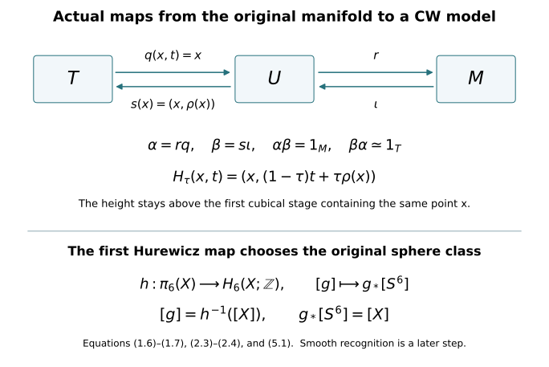

# Explicit CW models and the first Hurewicz map {#cw-hurewicz}

Written by GPT-6 Astra (OpenAI), at Ultra, October 2026; new exposition CC0. This companion proves the CW-model and first-Hurewicz inputs used in lesson 7. Author self-checks are not independent review.

This chapter constructs the actual homotopy comparisons needed before applying the CW argument in lesson 7. It does not replace the original threefold by an unspecified complex. It gives the forward and inverse maps, then proves the first Hurewicz theorem with the original integer fundamental class. The singular-chain, sphere and prism calculations are those proved in the included Thom/Euler companion.

## 1. A CW model for any open Euclidean neighbourhood {#cw-open}

Let \(U\subset\mathbb R^N\) be open. For \(n\geq1\), put \(h_n=2^{-n}\). Let \(K_n\) be the union of all closed grid cubes of side \(h_n\) contained in \([-n,n]^N\) and satisfying

\[
\operatorname{dist}_{\infty}(Q,\mathbb R^N\setminus U)\geq h_n.
\tag{1.1}
\]

Include every face of every chosen cube. If the complement is empty, its distance is \(+\infty\). Thus \(K_n\) is a finite cubical complex contained in \(U\); empty early stages cause no problem.

Every child cube of an eligible cube is eligible at the next stage. Hence \(K_n\subset K_{n+1}\). In fact

\[
K_n\subset\operatorname{int}K_{n+1},
\qquad
\bigcup_n\operatorname{int}K_n=U.
\tag{1.2}
\]

For the first assertion, the layer of next-grid cubes immediately surrounding an eligible \(Q\) is at sup-distance at most \(h_{n+1}\) from \(Q\). Its distance from the complement is therefore at least \(h_n-h_{n+1}=h_{n+1}\). It lies in the next bounding box, so that full surrounding layer is eligible. For the second assertion, a point of \(U\) has positive distance from the complement on a sufficiently small compact neighbourhood. Choose the grid fine enough that this neighbourhood's intersecting cubes satisfy (1.1), and the bounding box large enough to contain them. It then lies in \(\operatorname{int}K_n\).

Give each \(K_n\) its grid-cell structure. The inclusion \(K_n\hookrightarrow K_{n+1}\) is cellular: an old \(p\)-face is a union of next-grid \(p\)-faces, and all those faces belong to eligible child cubes. Form the actual mapping telescope

\[
T=\left(\coprod_{n\geq1}K_n\times[n,n+1]\right)\big/\bigl((x,n+1)_n\sim(x,n+1)_{n+1}\bigr).
\tag{1.3}
\]

Here the identification uses the original inclusion of \(K_n\) into \(K_{n+1}\).

The telescope is a CW complex. On each stage retain the bottom and top grid cells and attach a prism for each cell of \(K_n\). A \(p\)-cell's prism is a \((p+1)\)-cell; its boundary consists of the old cell, its cellular image at the next level, and the already attached prisms of its boundary. The image at the next level contains only finitely many cells. Attaching in dimension order gives the required characteristic maps and closure finiteness. Every bounded height interval meets finitely many stages and cells; the resulting CW topology agrees with the telescope's quotient topology.

More concretely \(T\) is the following subspace of \(U\times[1,\infty)\):

\[
T=\bigcup_{n\geq1}K_n\times[n,n+1].
\tag{1.4}
\]

The two models agree topologically, not just as sets. On a bounded height interval there are finitely many closed compact slabs. Their union has exactly the topology obtained by gluing their common closed subsets. Such intervals cover the telescope locally, proving the assertion. Let \(q:T\to U\) be projection to the first coordinate.

We construct a continuous section and homotopy explicitly. For each \(n\), choose a smooth function \(\chi_n:U\to[0,1]\), equal to one on a neighbourhood of \(K_n\), supported in \(\operatorname{int}K_{n+1}\). These exist by (1.2): cover the compact set \(K_n\) by finitely many Euclidean balls whose larger concentric balls lie in that interior, choose smooth radial bumps \(b_i\) equal to one on the smaller balls, and use \(1-\prod_i(1-b_i)\). Take \(\chi_n=0\) if \(K_n\) is empty. Define

\[
\rho(x)=3+\sum_{n\geq1}(1-\chi_n(x)).
\tag{1.5}
\]

This sum is locally finite. On a neighbourhood contained in \(K_N\), every term with \(n\geq N\) is zero. If \(j\) is the first index for which \(x\in K_j\), then \(\chi_n(x)=0\) for \(n\leq j-2\). Hence \(\rho(x)\geq j+1\) when \(j\geq2\), and \(\rho(x)\geq3\) when \(j=1\). In either case \(x\in K_{\lfloor\rho(x)\rfloor}\). We have

\[
s:U\longrightarrow T,\quad s(x)=(x,\rho(x)),\qquad q\,s=1_U.
\tag{1.6}
\]

Both maps are continuous in the subspace model (1.4). The homotopy

\[
H_\tau(x,t)=\bigl(x,(1-\tau)t+\tau\rho(x)\bigr),
\qquad 0\leq\tau\leq1,
\tag{1.7}
\]

stays in \(T\). Indeed the set of heights at which a fixed \(x\) belongs to \(T\) is exactly \([j,\infty)\), where \(j\) is its first eligible stage, and both endpoint heights lie there. It fixes the section, starts at \(1_T\) and ends at \(s q\). This proves an explicit homotopy equivalence \(T\simeq U\).

No claim that the original manifold has been triangulated is needed. The maps (1.6)–(1.7) specify the exact comparison with a CW complex.

## 2. Keep the original compact manifold and the actual punctured cobordism {#cw-manifolds}

Let \(M\) be a compact smooth manifold without boundary. Choose finitely many charts \(x_i:U_i\to\mathbb R^d\), and smooth functions \(\phi_i\geq0\) whose supports lie inside \(U_i\) and whose positive sets cover \(M\). Finite smooth bump functions and a finite chart cover give this choice. The map

\[
\iota:M\longrightarrow\mathbb R^{(d+1)k},\qquad
p\longmapsto\bigl(\phi_i(p),\,\phi_i(p)x_i(p)\bigr)_{i=1}^k
\tag{2.1}
\]

extends its blocks by zero off their charts and is smooth. It is injective: a positive block recovers both its chart and \(x_i(p)\) by division. Its derivative is injective: if it vanishes on a tangent vector, its first coordinate gives \(d\phi_i=0\), and then its second gives \(\phi_i\,dx_i=0\) for a positive block. Compactness and the Hausdorff target make the continuous inverse on the image continuous. Thus (2.1) is a smooth embedding.

Use its Euclidean normal bundle, the orthogonal complement of \(d\iota(TM)\). The map

\[
\mathcal L(p,v)=\iota(p)+v
\tag{2.2}
\]

has invertible derivative at every \((p,0)\): the tangent and normal summands map to their direct sum in the ambient Euclidean space. The inverse-function argument proved in the Morse companion gives a local diffeomorphism there. Compactness gives \(\epsilon>0\) on whose entire normal disk bundle it is a local diffeomorphism and injective. For injectivity, if no such radius existed, two distinct normal vectors with norms tending to zero would have equal images. Compactness gives convergent base subsequences; equality of their limits forces the same limiting base. The local inverse at that zero vector contradicts the equality for sufficiently late terms.

Its image \(U\) is open in Euclidean space. Write \(\mathcal L^{-1}(y)=(p(y),v(y))\). The maps

\[
r(y)=p(y),\qquad
A_\tau(y)=\mathcal L\bigl(p(y),(1-\tau)v(y)\bigr)
\tag{2.3}
\]

give \(r\iota=1_M\) and a homotopy from \(1_U\) to \(\iota r\), fixed on \(\iota(M)\). All vectors in (2.3) remain inside the chosen normal disk bundle.

Use the telescope and its maps from Section 1 for this actual \(U\). Define

\[
\alpha=r q:T\longrightarrow M,\qquad
\beta=s\iota:M\longrightarrow T.
\tag{2.4}
\]

Then \(\alpha\beta=1_M\), and \(\beta\alpha=s\iota r q\) is homotopic first to \(s q\), through \(s A_\tau q\) with the parameter reversed, and then to \(1_T\) by reversing (1.7). This gives the CW homotopy type of the original \(M\), with both comparison maps exhibited.

For lesson 7 take \(M=X\), with its original two disjoint coordinate disks. Write their given radii as \(R_0,R_1>0\), and retain

\[
C=X\setminus\bigl(\operatorname{int}D_0\cup\operatorname{int}D_1\bigr).
\tag{2.5}
\]

There is also an explicit CW model of this actual compact manifold with boundary. Let \(W\subset X\) be the open set obtained by deleting the two closed concentric coordinate disks of radii \(R_i/2\). On the annulus in the \(i\)-th chart with radial coordinate \(u>R_i/2\), use

\[
u\longmapsto(1-\tau)u+\tau\max(u,R_i),\qquad 0\leq\tau\leq1,
\tag{2.6}
\]

and keep the angular coordinate. Set the map equal to the identity outside these annuli. At \(u=R_i\) the formulas agree, and the annuli are disjoint. They give a continuous deformation retraction of \(W\) onto \(C\), fixed on \(C\); every intermediate radius stays greater than \(R_i/2\).

Restrict the normal disk bundle in (2.2) to \(W\). Its image \(U_W\) is open in the ambient Euclidean space, and its normal contraction retracts it onto \(W\). Combining that contraction, (2.6), and the telescope construction on \(U_W\) gives explicit inverse homotopy comparisons between a CW complex and \(C\). The radii \(R_i\) in (2.5) have not been changed: \(R_i/2\) defines an auxiliary open neighbourhood only.

## 3. The cylinder extension and coherent simplex contractions {#hurewicz-coherent}

For a closed unit disk \(D^m\) and \(I=[0,1]\), define

\[
\lambda(v,t)=\min\left\{\frac{2}{2-t},\frac1{\lVert v\rVert}\right\},
\qquad
\mathcal R(v,t)=\bigl(\lambda(v,t)v,\,2+\lambda(v,t)(t-2)\bigr),
\tag{3.1}
\]

with the second argument of the minimum interpreted as \(+\infty\) at \(v=0\). The first choice of the minimum puts the result on the bottom; the second puts it on the side. Its time coordinate lies in \([0,t]\), and its radial coordinate has norm at most one. On the bottom and sides \(\lambda=1\), so \(\mathcal R\) fixes them. It is continuous, including at \(v=0\), because the bounded first term supplies the minimum throughout a sufficiently small neighbourhood of that point. Thus (3.1) retracts the cylinder onto its bottom and sides.

A simplex is radially homeomorphic to a disk, from its barycentre, so this proves the same extension statement for simplex cylinders. In particular a map on the bottom and a compatible homotopy on the boundary extend to the cylinder by composition with \(\mathcal R\).

Let \(Y\) be path connected with basepoint \(y_0\), and suppose \(q\geq2\) and

\[
\pi_i(Y,y_0)=0\qquad(1\leq i<q).
\tag{3.2}
\]

For every singular simplex of dimension at most \(q-1\), choose a homotopy to the constant simplex at \(y_0\), coherently on all faces. At vertices, choose paths to \(y_0\), with the constant path at \(y_0\). Suppose the lower-dimensional choices have been made. On the boundary of an \(i\)-simplex cylinder, prescribe its original simplex on the bottom, its constant map on the top, and the chosen face homotopies on the sides. They agree on intersections. This boundary is an \(i\)-sphere; for \(1\leq i<q\), (3.2) makes its based class zero after transport to \(y_0\). A null-homotopy extends it across the cylinder. Choose that extension. For a simplex constant at \(y_0\), choose the constant extension.

For every \(q\)-simplex \(\sigma\), use (3.1) to extend its bottom map and these chosen side homotopies. Its top \(\sigma'\) then has constant boundary. The quotient \(\Delta^q/\partial\Delta^q\), with the original orientation, is \(S^q\). Thus the top defines

\[
a(\sigma)=[\sigma']\in\pi_q(Y,y_0).
\tag{3.3}
\]

The group is abelian for \(q\geq2\). Indeed concatenate cube representatives in either of two coordinate directions. The interchange law follows by dividing the square of those two coordinates into four rectangles. Both operations have the constant map as unit; applying interchange with two of the four entries equal to that unit proves that the operations agree and commute. Extend (3.3) additively to singular \(q\)-chains.

We use the following finite sphere-pinch fact. If a triangulated \(q\)-sphere has its \((q-1)\)-skeleton mapped to the basepoint, its class is the sum of the classes of its oriented \(q\)-simplices. Here is a geometric proof. On each simplex collapse a collar of its boundary, and concentrate its map on a smaller interior disk; radial reparametrization gives a homotopy relative to the boundary. There are finitely many disjoint supporting disks. Remove the basepoint of the source sphere and use its Euclidean chart. For \(q\geq2\), the complement of finitely many disjoint small disks is path connected: a polygonal path can detour around each disk on its connected boundary. Move one sufficiently small support at a time along such a path to a prescribed sequence of disjoint slabs. A smooth vector field equal to the path's local translation near the moving support and cut off away from the other supports gives this isotopy on each short path segment; compactness divides the path into finitely many such segments. Radial shrinking and expanding supplies the required small radii. These isotopies preserve orientation. The final map is the concatenation of the individual disk maps, so its class is their sum, with the original simplex-orientation signs. The abelian law just proved removes any dependence on the chosen order.

## 4. The first Hurewicz theorem, with inverse maps {#hurewicz-theorem}

Define

\[
h:\pi_q(Y,y_0)\longrightarrow H_q(Y;\mathbb Z),\qquad
h([f])=f_*[S^q].
\tag{4.1}
\]

The prism identity proves homotopy invariance. The two-disk pinch sends the sphere's fundamental class to the sum of the two positive disk generators, by their local values and excision. Hence \(h\) is a homomorphism. It is natural under maps of based spaces.

**Theorem 4.1.** Under (3.2), \(h\) is an isomorphism and
\(\widetilde H_i(Y;\mathbb Z)=0\) for \(0\leq i<q\).

**Proof.** Apply the chosen simplex homotopies to the \(q\)-faces of a singular \((q+1)\)-simplex \(\tau\). They agree on their common faces. Formula (3.1) extends their boundary homotopy across \(\tau\)'s cylinder. At its top, every \((q-1)\)-face is constant; its boundary sphere has class

\[
\sum_{i=0}^{q+1}(-1)^i a(d_i\tau)
\tag{4.2}
\]

by the proved pinch fact. This sphere bounds the top \((q+1)\)-simplex, so (4.2) is zero. Therefore \(a(\partial\tau)=0\), and the additive map (3.3) induces

\[
A:H_q(Y;\mathbb Z)\longrightarrow\pi_q(Y,y_0).
\tag{4.3}
\]

Triangulate each chosen simplex cylinder by the ordered prism triangulation. Its chain boundary is top minus bottom minus the corresponding face prisms. On a singular cycle \(z\), the face-prism terms cancel exactly: the homotopies of repeated singular faces are the same choices, and their coefficients are those of \(\partial z=0\). The top chain is consequently homologous to \(z\).

For the top maps work in the actual relative chain complex \(C_*(Y,\{y_0\};\mathbb Z)\). All constant simplices at \(y_0\) vanish in this quotient. The pair sequence identifies its positive-degree homology with \(H_*(Y;\mathbb Z)\): the point has no positive homology and its map on \(H_0\) is an isomorphism. Each top \(q\)-simplex has constant boundary and represents exactly \(h(a(\sigma))\) under this comparison, since the identity simplex is the positive disk-relative generator. Thus the prism argument proves

\[
hA([z])=[z].
\tag{4.4}
\]

Conversely triangulate the source of a based sphere map \(f:S^q\to Y\), taking its basepoint to be a vertex and using a common vertex order on each face. The already chosen homotopies of its singular lower faces and \(q\)-simplices fit together into a homotopy of the entire sphere, fixing that basepoint. The final lower skeleton is constant. Its class is the oriented sum of the \(a\)-values by the same pinch fact. This is precisely \(A(h([f]))\), so

\[
Ah([f])=[f].
\tag{4.5}
\]

Equations (4.4)–(4.5) prove the isomorphism. If \(i<q\), the coherent homotopies take an \(i\)-cycle entirely to constant simplices. The same prism cancellation makes its relative homology class zero. This proves positive-degree vanishing below \(q\); reduced \(H_0\) vanishes by path connectivity. ∎

For completeness, in degree one the Hurewicz map identifies \(H_1(Y;\mathbb Z)\) with the abelianization of \(\pi_1(Y,y_0)\). Choose paths \(p_y\) from \(y_0\) to each point \(y\). An edge \(\sigma\) from \(x\) to \(y\) determines \(p_x*\sigma*p_y^{-1}\). Sum these classes in the abelianized group over a cycle. The boundary of each singular triangle gives zero, since that triangle fills its edge loop and the inserted paths cancel. Changing the chosen paths contributes only endpoint terms, which cancel on a cycle. This defines the inverse: a based loop returns its original abelianized class, and the inserted paths cancel in homology. Both compositions are identities.

## 5. The exact receiving sphere class and two exercises {#cw-hurewicz-exercises}

Once lesson 7's integral calculation and lesson 6's fundamental-group calculation have been applied, the original \(X\) satisfies
\(\pi_1(X)=0\), \(H_i(X;\mathbb Z)=0\) for \(1\leq i\leq5\), and
\(H_6(X;\mathbb Z)=\mathbb Z[X]\).
Theorem 4.1 successively gives \(\pi_i(X)=0\) for \(2\leq i\leq5\), and then the actual isomorphism

\[
h:\pi_6(X,x_0)\xrightarrow{\;\cong\;}H_6(X;\mathbb Z).
\tag{5.1}
\]

Choose a based representative \(g:S^6\to X\) of \(h^{-1}([X])\). Its degree is \(+1\), with
\(g_*[S^6]=[X]\). This constructs the original map used by lesson 7; no equivalence or smooth identification is presumed at this stage. The further homotopy-fibre comparison remains a separate receiving proof.

<figure>

<figcaption>Equations (1.6)–(1.7) and (2.3)–(2.4) give all four maps and both inverse homotopies. The lower line is the separate integer Hurewicz isomorphism after the vanishing hypotheses have been established for the original \(X\), as in (5.1). It specifies the actual degree-one map without asserting smooth recognition.</figcaption>
</figure>

**Exercise 5.1.** In the telescope construction, prove that replacing \(\rho\) by another continuous function \(\rho'\) with \(x\in K_{\lfloor\rho'(x)\rfloor}\) changes the section by a homotopy, and give the homotopy.

**Solution.** If \(j(x)\) is the first eligible index, every allowed height belongs to \([j(x),\infty)\). Both \(\rho(x)\) and \(\rho'(x)\) lie there. The map
\[
(x,\tau)\longmapsto
\bigl(x,(1-\tau)\rho(x)+\tau\rho'(x)\bigr)
\tag{5.2}
\]
therefore stays in the telescope. It is continuous in the subspace model (1.4) because both functions are continuous. Projection by \(q\) remains the identity at every time. Thus the change is a homotopy through actual sections, with no relabelling of the cubical stages.

**Exercise 5.2.** Replace the orientation class of \(X\) by \(-[X]\), keeping the original orientation of \(S^6\). Give the corresponding sphere map under (5.1), and compute its degree relative to each target orientation.

**Solution.** Let \(r:S^6\to S^6\) be the restriction of a linear reflection of \(\mathbb R^7\) whose fixed hyperplane contains the chosen sphere basepoint. In an orthonormal basis with that basepoint as the last vector, reflect the first coordinate. The map is therefore based, and its induced map on the outward-oriented sphere fundamental class is multiplication by \(-1\), by the determinant-sign and boundary-orientation calculation. Naturality of (4.1) gives
\[
h([g\circ r])=(g\circ r)_*[S^6]=-[X].
\tag{5.3}
\]
Thus \(g\circ r\) represents \(h^{-1}(-[X])\). It has degree \(-1\) relative to the original class \([X]\), and degree \(+1\) relative to the newly chosen class \(-[X]\). The map \(g\) and the original formula \(g_*[S^6]=[X]\) have not been silently changed.

## Source use and proof scope {#cw-hurewicz-sources}

The coherent-simplex proof is reconstructed from *Frame fields and primary obstructions*, Section E and Lemma E.1, written by GPT-6.1 Sol (OpenAI), CC0. Its exact source version and actual reading coverage are recorded in the source ledger. The explicit Euclidean-neighbourhood telescope and the maps (2.4) are written here to close the manifold-CW prerequisite without a triangulation assertion. The compact embedding and normal contraction also occur in the included tangent-index companion, Sections 4 and 6. These are teaching proofs, without a novelty claim.

The exact checker tests the signed prism identities, both cylinder branches, the telescope heights, the original punctured-disk radii, the coordinate-recovery derivatives and reflection signs. These finite checks supplement the written proofs. The full path-fibre comparison, handle and Whitney argument, and smooth sphere-group calculation remain assigned.
