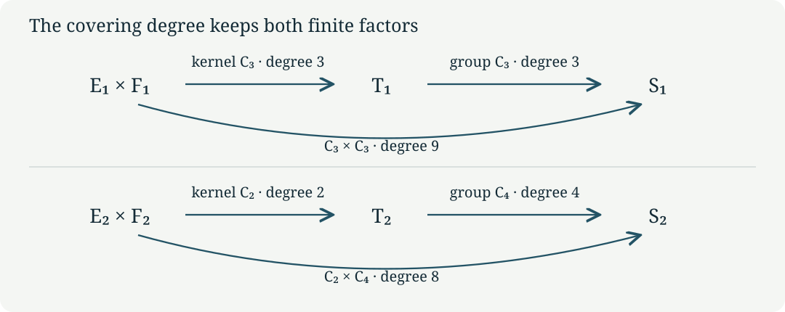

# Two finite torus quotients and their line bundles {#cg-s6-01}

CG-S6 · Lesson 1

Two of the local pieces in the S6 construction are controlled by integral matrices of orders three and four. Their reduced central surfaces can be built from products of one-dimensional complex tori. We will construct the maps, identify every point in their kernels, and prove that the resulting finite group actions are free. The two covering degrees are nine and eight. A line bundle carried by each action will then give an explicit example of a smooth trivialization that cannot be holomorphic.

This lesson supplies the finite central-fibre calculation. The varying family, its cusp, and the global topology are subsequent parts of the course. The matrices below act on the original marked lattice; no change of period, sign, or orientation is implicit.

## 1. The period map as an actual real isomorphism {#period-map}

Use the ordered lattice

\[
\Lambda=\mathbb Z\langle\widehat\gamma,\widehat u,
\widehat w,\widehat\delta\rangle\subset\mathbb R^4.
\tag{1.1}
\]

Its coordinates are columns \(x=(a,b,c,d)^{\mathsf t}\); the covectors \(\gamma,u,w,\delta\) extract these four entries. If \(\tau,\mu,\beta\in\mathbb C\), set

\[
\Pi=\begin{pmatrix}6\mu&\tau&1&0\\\beta&\mu&0&1\end{pmatrix},
\qquad
D=\operatorname{Im}\beta-
\frac{6(\operatorname{Im}\mu)^2}{\operatorname{Im}\tau}.
\tag{1.2}
\]

We work with \(\operatorname{Im}\tau>0\) and \(D<0\). To see exactly what these inequalities do, suppose \(\Pi x=0\). Imaginary parts of its two components give

\[
\begin{pmatrix}6\operatorname{Im}\mu&\operatorname{Im}\tau\\
\operatorname{Im}\beta&\operatorname{Im}\mu\end{pmatrix}
\binom ab=0.
\tag{1.3}
\]

The determinant is
\(6(\operatorname{Im}\mu)^2-\operatorname{Im}\tau\operatorname{Im}\beta
=-\operatorname{Im}\tau D>0\).
Thus \(a=b=0\), and the real parts then give \(c=d=0\).
Consequently \(\Pi:\mathbb R^4\to\mathbb C^2\) is a bijective real-linear map.
It identifies \(\Pi\Lambda\) with a discrete lattice and defines a compact complex torus

\[
T=\mathbb C^2/\Pi\Lambda.
\tag{1.4}
\]

Here a complex torus means the quotient of a complex vector space by a full lattice. For completeness, discreteness follows by applying the continuous inverse \(\Pi^{-1}\) to a convergent sequence of lattice points. Only finitely many lattice points can lie in a bounded set. A sufficiently small ball therefore has disjoint translates by nonzero lattice vectors, and its projection is a holomorphic coordinate chart. Distinct orbits can be separated by smaller balls, so the quotient is Hausdorff. The image of \(\Pi[0,1]^4\) covers the quotient, proving compactness. Since \(\mathbb C^2\) is connected, so is its quotient.

The two period matrices needed here are obtained from

\[
\begin{array}{c|c|c|c}
j&\tau_j&\mu_j&\kappa_j\\\hline
1&\rho=e^{\pi i/3}&(2-\rho)/3&\beta_1+2\mu_1\\
2&i&(1-i)/2&\beta_2+3\mu_2
\end{array}
\tag{1.5}
\]

with \(D_j<0\). Write \(\Pi_j\) for (1.2) at these values and \(T_j=\mathbb C^2/\Pi_j\Lambda\). The parameters \(\beta_1,\beta_2\) retain their full real and imaginary parts. In particular,

\[
\operatorname{Im}\kappa_1=\operatorname{Im}\beta_1-
\tfrac23\operatorname{Im}\rho=D_1<0,
\qquad
\operatorname{Im}\kappa_2=\operatorname{Im}\beta_2-\tfrac32=D_2<0.
\tag{1.6}
\]

The ordered periods \((1,\kappa_j)\) have negative imaginary orientation. This causes no defect in the quotient construction, and we keep that orientation.

## 2. Fixed vectors do not necessarily split the integral lattice {#integral-lattices}

The two monodromy matrices, with the declared column convention, are

\[
A_1=\begin{pmatrix}1&0&0&0\\6&0&1&0\\-6&-1&-1&0\\-2&1&0&1\end{pmatrix},
\qquad
A_2=\begin{pmatrix}1&0&0&0\\0&0&-1&0\\-6&1&0&0\\3&0&1&1\end{pmatrix}.
\tag{2.1}
\]

Put

\[
\begin{gathered}
\varepsilon=(1,2,-4,0)^{\mathsf t},\quad
\varepsilon'=(1,3,-3,0)^{\mathsf t},\quad
\delta_*=(0,0,0,1)^{\mathsf t},\\
e_1=(0,1,-2,0)^{\mathsf t},\quad f_1=(0,0,-3,1)^{\mathsf t},\\
e_2=(0,1,-1,0)^{\mathsf t},\quad f_2=(0,0,-2,1)^{\mathsf t}.
\end{gathered}
\tag{2.2}
\]

**Proposition 2.1.** The full fixed and image lattices are

\[
\begin{array}{c|c|c}
&\ker(A_j-I)\cap\Lambda&(A_j-I)\Lambda\\\hline
j=1&\mathbb Z\varepsilon\oplus\mathbb Z\delta_*&\mathbb Ze_1\oplus\mathbb Zf_1\\
j=2&\mathbb Z\varepsilon'\oplus\mathbb Z\delta_*&\mathbb Ze_2\oplus\mathbb Zf_2.
\end{array}
\tag{2.3}
\]

Their sums have indices three and two in \(\Lambda\), respectively. Each image lattice itself is saturated: an integer vector whose nonzero integer multiple lies in that image already lies in the image.

**Proof.** The equation \((A_1-I)x=0\) reads
\(6a-b+c=0\), \(-6a-b-2c=0\), and \(-2a+b=0\).
It gives \(b=2a,c=-4a\), with \(a,d\) arbitrary integers.
For \(A_2\) the equations are \(-b-c=0\), \(-6a+b-c=0\), and \(3a+c=0\); they give \(b=3a,c=-3a\). This proves the fixed-lattice claims.

In the original basis the columns of the image matrices are

\[
\begin{array}{c|rrrr}
A_1-I&6e_1-2f_1&-e_1+f_1&e_1&0\\
A_2-I&3f_2&-e_2&-e_2+f_2&0.
\end{array}
\tag{2.4}
\]

Every column is in the asserted span; conversely these columns recover each \(e_j,f_j\). The first span consists exactly of the integer solutions of
\(a=0,\ 2b+c+3d=0\), because such a solution is \(be_1+df_1\).
The second consists exactly of \(a=0,\ b+c+2d=0\), with expression \(be_2+df_2\). Multiplication by a nonzero integer cannot turn a nonzero value of these integer linear expressions into zero, proving saturation.

One can compute the indices without presuming an integral direct-sum decomposition. Let \(B_1=[\varepsilon,\delta_*,e_1,f_1]\) and \(B_2=[\varepsilon',\delta_*,e_2,f_2]\). For \(x=(a,b,c,d)^{\mathsf t}\), solving \(x=B_j(A,B,C,E)^{\mathsf t}\) gives

\[
\begin{aligned}
B_1^{-1}x&=\left(a,\ d+\frac{c+2b}{3},\ b-2a,\ -\frac{c+2b}{3}\right)^{\mathsf t},\\
B_2^{-1}x&=\left(a,\ d+\frac{c+b}{2},\ b-3a,\ -\frac{c+b}{2}\right)^{\mathsf t}.
\end{aligned}
\tag{2.5}
\]

Thus the first sum is the kernel of the surjective map
\(x\mapsto c+2b\pmod3\), and the second is the kernel of
\(x\mapsto c+b\pmod2\). Their quotients are \(\mathbb Z/3\) and \(\mathbb Z/2\). Expanding the same matrices gives \(\det B_1=-3\) and \(\det B_2=-2\), including the original orientations. ∎

The images under the periods display the complex geometry behind these integer calculations:

\[
\begin{array}{c|cc}
&j=1&j=2\\\hline
\text{first fixed vector}&\Pi_1\varepsilon=(0,\kappa_1)&\Pi_2\varepsilon'=(0,\kappa_2)\\
\delta_*&(0,1)&(0,1)\\
e_j&(\rho-2,-(\rho-2)/3)&(i-1,-(i-1)/2)\\
f_j&(-3,1)&(-2,1).
\end{array}
\tag{2.6}
\]

These are direct matrix products. For instance
\(6(2-\rho)/3+2\rho-4=0\).
The fixed real plane becomes the complex line \((0,\xi)\). The moving plane becomes \((\eta,-\eta/3)\) or \((\eta,-\eta/2)\). They are complementary complex lines. Their sum is all of \(\mathbb C^2\), even though the integral sum in Proposition 2.1 has a nontrivial finite quotient.

## 3. The product covers and every kernel point {#product-covers}

Define

\[
\begin{gathered}
E_j=\mathbb C/(\mathbb Z+\kappa_j\mathbb Z),\\
F_1=\mathbb C/\bigl(\mathbb Z(\rho-2)+\mathbb Z(-3)\bigr),\qquad
F_2=\mathbb C/\bigl(\mathbb Z(i-1)+\mathbb Z(-2)\bigr).
\end{gathered}
\tag{3.1}
\]

Each pair of periods is independent over \(\mathbb R\). The quotient-chart and compactness argument of Section 1 applies in real dimension two, so these are compact one-dimensional complex tori.

**Theorem 3.1.** The linear maps

\[
L_1(\xi,\eta)=(\eta,\xi-\eta/3),\qquad
L_2(\xi,\eta)=(\eta,\xi-\eta/2)
\tag{3.2}
\]

induce holomorphic group homomorphisms
\(\ell_j:E_j\times F_j\to T_j\). They are surjective covering maps, with

\[
\ker\ell_1=\{0,k_1,2k_1\},\quad k_1=(2/3,\rho),
\qquad
\ker\ell_2=\{0,k_2\},\quad k_2=(1/2,i).
\tag{3.3}
\]

Coordinates of \(k_j\) in (3.3) mean classes in the indicated product torus.

**Proof.** The images of the four product periods under \(L_j\), listed in (2.6), generate exactly \(\Pi_j B_j\mathbb Z^4\). Therefore the maps descend. Each \(L_j\) has complex determinant \(-1\), hence is invertible; its induced map is locally biholomorphic and surjective. Its kernel is the quotient of the target lattice by the image lattice, which has the respective cardinality three or two by Proposition 2.1. This kernel identification follows explicitly by sending a target lattice vector \(\lambda\) to the class of \(L_j^{-1}\Pi_j\lambda\).

For \(\widehat u=(0,1,0,0)^{\mathsf t}\) the exact decompositions are

\[
\widehat u=\tfrac23\delta_*+e_1-\tfrac23f_1
=\tfrac12\delta_*+e_2-\tfrac12f_2.
\tag{3.4}
\]

In the first expression the moving period is
\((\rho-2)-(2/3)(-3)=\rho\); in the second it is
\((i-1)-(1/2)(-2)=i\).
Thus \(L_j(k_j)=\Pi_j\widehat u\), so both indicated points are in the kernel.
The first coordinates have exact orders three and two: since \(\operatorname{Im}\kappa_j\ne0\), a real number lies in \(\mathbb Z+\kappa_j\mathbb Z\) precisely when it is an integer. The moving coordinates obey
\(3\rho=3(\rho-2)-2(-3)\) and \(2i=2(i-1)-(-2)\).
The points therefore have the asserted exact orders and exhaust the kernels.

Translations by a finite subgroup act freely. Small disjoint neighbourhoods of its orbit points give covering charts, proving the covering assertion without an additional compactness theorem. ∎

## 4. Adding the affine rotations {#affine-quotients}

Set \(m_1=3,m_2=4\), \(v_1=\varepsilon\), and \(v_2=-\varepsilon'\). On \(\mathbb R^4/\Lambda\) consider

\[
g_j[x]=[A_jx+v_j/m_j].
\tag{4.1}
\]

This is well defined because the matrices are integral. We now check its holomorphic nature in the stated periods rather than assume that an integral matrix is automatically complex-linear. The two complex matrices are

\[
R_1=\begin{pmatrix}\rho-1&0\\(2-\rho)/3&1\end{pmatrix},
\qquad
R_2=\begin{pmatrix}-i&0\\(1+i)/2&1\end{pmatrix}.
\tag{4.2}
\]

Multiplying the four columns gives
\(R_j\Pi_j=\Pi_j A_j\).
Alternatively, (2.6) identifies a real basis on which both sides agree: the fixed line has eigenvalue one and the moving line has eigenvalue \(\rho-1\) or \(-i\). Thus the action on \(T_j\) is exactly
\([z]\mapsto[R_jz+\Pi_jv_j/m_j]\).
The moving eigenvalues have orders three and four, respectively, so \(A_j^{m_j}=I\). Directly \(A_jv_j=v_j\), whence
\(g_j^k[x]=[A_j^kx+kv_j/m_j]\) and \(g_j^{m_j}=1\).

On the product torus define

\[
h_1(\xi,\eta)=(\xi+\kappa_1/3,(\rho-1)\eta),\qquad
h_2(\xi,\eta)=(\xi-\kappa_2/4,-i\eta).
\tag{4.3}
\]

The moving rotations preserve the exact lattices in (3.1), as the following images of their two generators show:

\[
\begin{aligned}
(\rho-1)(\rho-2)&=-2(\rho-2)+(-3),&
(\rho-1)(-3)&=-3(\rho-2)+(-3),\\
(-i)(i-1)&=(i-1)-(-2),&
(-i)(-2)&=2(i-1)-(-2).
\end{aligned}
\tag{4.4}
\]

The corresponding integer matrices have determinant one. Each rotation therefore maps its period lattice onto itself. Substitution into (3.2) gives the equality on \(\mathbb C^2\)

\[
L_jh_j=R_jL_j+\Pi_jv_j/m_j,
\qquad \ell_jh_j=g_j\ell_j.
\tag{4.5}
\]

The minus sign in the second translation is required by \(v_2=-\varepsilon'\).

**Theorem 4.1.** Let \(k_j\) also denote translation by the kernel point (3.3). The groups generated on the product tori are

\[
\langle k_1,h_1\rangle\cong C_3\times C_3,
\qquad
\langle k_2,h_2\rangle\cong C_2\times C_4.
\tag{4.6}
\]

Both actions are free. Their quotients are compact smooth complex surfaces, and the diagrams of holomorphic covering maps are

\[
E_1\times F_1\xrightarrow[\deg=3]{\ell_1}T_1
\xrightarrow[\deg=3]{}S_1=T_1/\langle g_1\rangle,
\qquad
E_2\times F_2\xrightarrow[\deg=2]{\ell_2}T_2
\xrightarrow[\deg=4]{}S_2=T_2/\langle g_2\rangle.
\tag{4.7}
\]

The composite degrees are exactly nine and eight.

**Proof.** First check commutativity on the quotient tori. On the moving coordinates,

\[
(\rho-1)\rho-\rho=-(\rho-2)+(-3),
\qquad (-i)i-i=-(i-1).
\tag{4.8}
\]

These differences are periods, so \(h_j\) commutes with \(k_j\).
The maps \(h_j\) have orders \(m_j\): their \(m_j\)-th translations are \(\kappa_1\) and \(-\kappa_2\), while a smaller positive power has a nonidentity moving linear part.

To establish both the group order and freeness, write
\((d_1,d_2)=(3,2)\), \((c_1,c_2)=(2/3,1/2)\), and
\((\epsilon_1,\epsilon_2)=(1,-1)\).
A fixed point of \(k_j^a h_j^b\), where \(0\le a<d_j\) and \(0\le b<m_j\), would force equality of its first coordinates:

\[
ac_j+\epsilon_j b\kappa_j/m_j=n+q\kappa_j
\quad(n,q\in\mathbb Z).
\tag{4.9}
\]

Because \(\operatorname{Im}\kappa_j\ne0\), imaginary parts imply \(q=\epsilon_j b/m_j\), hence \(b=0\). The real equation gives \(ac_j\in\mathbb Z\), hence \(a=0\) in the prescribed range. Thus every nonidentity pair has no fixed point and is not the identity map. The indicated products of cyclic groups inject into the automorphism groups and generate them, proving (4.6).

Quotienting first by \(k_j\) gives precisely \(T_j\), by Theorem 3.1. Identity (4.5) identifies the remaining quotient with \(S_j\). It also proves freeness of the action of \(g_j\): if \(g_j^b\) fixes a point of \(T_j\), a chosen lift in the product differs from its \(h_j^b\)-image by a power of \(k_j\), contradicting (4.9) unless \(b=0\).

Finally, a finite free holomorphic action on a Hausdorff complex manifold has explicit quotient charts. Separate the finitely many images of a point by disjoint coordinate neighbourhoods; intersect their inverse translates and shrink to obtain a neighbourhood whose translates are disjoint. It maps bijectively onto an open subset of the quotient, with holomorphic transition maps induced by the group. Distinct finite orbits admit disjoint invariant neighbourhoods, so the quotient is Hausdorff. Compactness follows from compactness of the product torus. Every fibre of the composite covering is one orbit, of cardinality \(d_jm_j\). ∎

## 5. A line can be smoothly trivial and holomorphically nontrivial {#line-bundles}

Let \(\zeta_j=e^{-2\pi i/m_j}\). Form the line bundle

\[
\mathcal N_j=(T_j\times\mathbb C)/\bigl((x,n)\sim(g_jx,\zeta_j n)\bigr)
\longrightarrow S_j.
\tag{5.1}
\]

The quotient charts just constructed trivialize this bundle: over a neighbourhood with a chosen sheet of \(T_j\to S_j\), use the coordinate \(n\); changing sheet multiplies it by a constant power of \(\zeta_j\). These are holomorphic, invertible, linear transition functions.

**Theorem 5.1.** The exact order of \(\mathcal N_j\) under tensor product of holomorphic line bundles is \(m_j\). Nevertheless \(\mathcal N_j\) admits an explicit smooth, nowhere-zero section and a smooth product isomorphism.

**Proof of the holomorphic assertion.** A section of \(\mathcal N_j^{\otimes k}\) pulls back to a function on \(T_j\) satisfying

\[
f(g_jx)=\zeta_j^k f(x).
\tag{5.2}
\]

The sign follows directly from (5.1): the vector represented by \((x,f(x))\) is represented on the next sheet by \((g_jx,\zeta_j^k f(x))\). For \(k=m_j\), the constant function one satisfies (5.2) and trivializes the power.

Every holomorphic function on a compact connected complex manifold is constant. Here is the elementary local argument we need. Its absolute value attains a maximum \(M\). If \(M=0\), the assertion holds. Otherwise, in coordinates centred at a maximum point, suppose the convergent power series has a first nonzero nonconstant homogeneous part \(P_k\). Choose a vector \(v\) with \(P_k(v)\ne0\). On the complex line \(tv\), select the phase of small \(t\) so that \(t^kP_k(v)\) points in the same complex direction as the nonzero constant term. The remaining terms are \(O(|t|^{k+1})\), so the absolute value strictly exceeds \(M\) for sufficiently small positive \(|t|\), a contradiction. Thus the function is constant near the maximum point. More generally this argument applies at every point where it has the same maximal value. The locus on which the function equals that value is closed by continuity and open by this local argument; connectedness makes it the entire manifold. Applying this to \(T_j\), if \(0<k<m_j\) and the power were holomorphically trivial, a nowhere-zero holomorphic section would pull back to a nonzero constant. Equation (5.2) would then require \(\zeta_j^k=1\), a contradiction. This proves exact order.

**Proof of the smooth assertion.** In the original marking write

\[
H_j(x)=\exp\bigl(-2\pi i\epsilon_j\gamma(x)\bigr),
\qquad \epsilon_1=1,\quad\epsilon_2=-1.
\tag{5.3}
\]

Since \(\gamma\Lambda\subset\mathbb Z\), the function is invariant under every lattice translation and descends to \(T_j\). It is smooth and never zero. The first rows of (2.1) give \(\gamma A_j=\gamma\), and \(\gamma(v_j)=\epsilon_j\). Therefore

\[
H_j(A_jx+v_j/m_j)
=H_j(x)\exp(-2\pi i\epsilon_j^2/m_j)
=\zeta_j H_j(x).
\tag{5.4}
\]

The explicit product maps are

\[
\begin{aligned}
\Theta_j:\mathcal N_j&\longrightarrow S_j\times\mathbb C,
&[x,n]&\longmapsto([x],n/H_j(x)),\\
\Theta_j^{-1}:S_j\times\mathbb C&\longrightarrow\mathcal N_j,
&([x],z)&\longmapsto[x,zH_j(x)].
\end{aligned}
\tag{5.5}
\]

Lattice translations leave these expressions unchanged. Replacing \((x,n)\) by \((g_jx,\zeta_jn)\) also leaves the quotient \(n/H_j(x)\) unchanged, by (5.4). Both maps are thus well defined. In each covering chart they are smooth and linear in the line coordinate; their displayed formulas compose to the identity. ∎

This gives the exact comparison between the two categories of bundles: forgetting holomorphic structure sends the nontrivial holomorphic class \([\mathcal N_j]\), of order \(m_j\), to the identity smooth class, with (5.5) as a specified isomorphism. Its first Chern class is zero because the smooth transition functions become identically one in that trivialization. Conversely the holomorphic class is detected by its nontrivial character and the absence of a nowhere-zero holomorphic section. The discrepancy is completely described by these maps.

When a transverse coordinate in the finite filling transforms by \(s\mapsto\zeta_js\), its normal tangent coordinate transforms by the same scalar. The derivative therefore identifies its normal line with (5.1). This local comparison preserves the negative phase. [Lesson 3, Theorem 3.1](varying-finite-fillings.md#varying-quotient) proves the construction and properness of that varying filling, with its exact real-analytic comparison to this normal bundle.

## 6. Exercises with complete solutions {#exercises}

**Exercise 1.** Determine the full integer annihilators of the two image lattices in Proposition 2.1.

**Solution.** A row \((p,q,r,s)\) annihilates \(e_1,f_1\) exactly when \(q-2r=0\) and \(-3r+s=0\). Hence it is
\(p\gamma+r(2u+w+3\delta)\), with \(p,r\in\mathbb Z\).
For \(e_2,f_2\), the equations are \(q-r=0\), \(-2r+s=0\), giving
\(p\gamma+r(u+w+2\delta)\).
These calculations give all annihilating rows because there are no further restrictions on \(p,r\).

**Exercise 2.** For \(0\le k<m_j\), when does \(\mathcal N_j^{\otimes k}\) have a nonzero holomorphic section?

**Solution.** Its pulled-back section is constant by the proof of Theorem 5.1. Equation (5.2) then gives a one-dimensional space of constants if \(k=0\), and only the zero function if \(1\le k<m_j\). Pullback is injective because \(T_j\to S_j\) is surjective, and equivariant functions descend in the bundle charts, so these are the exact section spaces. Tensor powers for arbitrary integers depend only on \(k\pmod {m_j}\).

**Exercise 3.** Find every holomorphic one-form on \(S_j\), expressed on its product cover.

**Solution.** A holomorphic one-form on \(E_j\times F_j\) lifts to
\(a(\xi,\eta)d\xi+b(\xi,\eta)d\eta\). Translation invariance makes both coefficients functions on the compact torus, hence constants by the proof in Section 5. Translation by \(k_j\) fixes both constant forms. Pullback by \(h_j\) fixes \(d\xi\) and multiplies \(d\eta\) by \(\rho-1\) or \(-i\), neither of which is one. The invariant forms are therefore exactly \(\mathbb C d\xi\). On a free finite quotient, an invariant form descends by choosing a local covering sheet; invariance makes the answer independent of that choice. Conversely every form downstairs pulls back invariantly. Thus \(H^0(S_j,\Omega^1_{S_j})\) is precisely one-dimensional, with the specified pullback generator. This calculation uses no classification theorem for surfaces.

**Exercise 4.** Show directly that \(S_j\) is not a complex two-torus.

**Solution.** The preceding solution computes a one-dimensional space of holomorphic one-forms. A complex two-torus has exactly the two-dimensional space of constant forms: its universal-cover coordinate differentials descend, and the compactness argument in Section 5 forces all coefficients to be constant. A biholomorphism induces an isomorphism on holomorphic one-forms by pullback, with inverse the pullback of its inverse map. The unequal dimensions rule out such a biholomorphism.

## 7. Sources and the next construction {#sources}

The original period presentation is the manuscript *The \((3,4,\infty)\) modular family of 2-tori, completed at its three special points, is a complex structure on \(S^6\)*, produced with Claude under Levent Alpöge's direction, Sections 2, 3 and 5. The programme retains a reconstruction of that 108-page source, explicitly identified as a transcription. Its [frozen-project source guide](https://github.com/KokunoYumeto/yang-mills-interacting-workbench/blob/9315695c2f5381882a90190137a3d4dfc997fc8d/s6/S6_FROZEN_PROJECT_GUIDE_2026-09-09.md) locates the complete retained edition.

The exact finite-lattice and product-cover antecedent is the programme's [complete frozen source archive](https://zenodo.org/records/22678442/files/28_s6_complete_public_project_frozen_2026-09-06.zip), member `project/supporting_materials/workbench/research/finite_filling_certificates.tex`, equations FF1–FF22 and FF42–FF46. The companion [key-advances source](https://github.com/KokunoYumeto/yang-mills-interacting-workbench/blob/9315695c2f5381882a90190137a3d4dfc997fc8d/s6/27_s6_key_advances_frozen_2026-09-06.tex) identifies the workbench results. The arguments and teaching organization here are independently written; all calculations needed for this lesson are supplied above.

Philip Engel, [*Complex structures on \(S^6\)*, arXiv:2609.38442v1](https://arxiv.org/abs/2609.38442v1), Section 1.3 and Section 3, gives the geometric period dictionary and the two finite surface types. The author's original TeX was consulted for that comparison. This lesson's explicit marked calculation does not presume a classification theorem or the paper's global conclusion. Exact edition identities and bounded reading coverage are recorded with the course.

[Lesson 2](normal-boundaries-and-integral-maps.md) computes the complete normal-boundary groups and integral maps. [Lesson 3](varying-finite-fillings.md) constructs the varying finite filling, proves its local quotient charts, and evaluates the ramified base change, including every branch. The central calculation proved here is their input.

Mathematical exposition: GPT-6 Astra (OpenAI), Codex, Ultra, 8 October 2026. New lesson text and diagrams: CC0-1.0. Scholarly source credit and the terms of external works remain their own.
