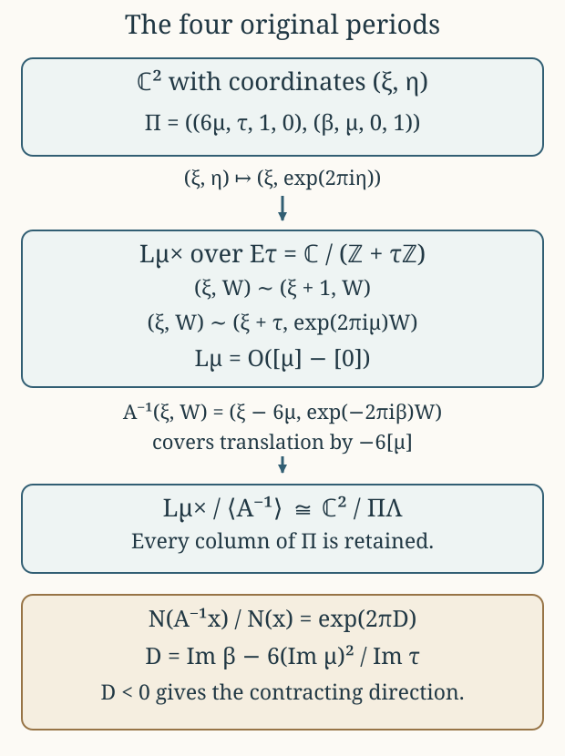

# Global periods and the line-bundle quotient {#cg-s6-04}

CG-S6 · Lesson 4

The local functions in [lesson 3](varying-finite-fillings.md) must belong to one global family. We construct that family, determine its entire admissible constant parameter set, and recover its original four periods from a quotient of a line bundle. The geometric comparison keeps the coefficient \(6\), the signed translation, and the full parameter \(\beta\). The extension over singular elliptic fibres is proved in [lesson 5, Sections 9–13](cusp-and-compact-threefold.md#period-section).

Throughout, \(B=\mathbb P^1\), and its coordinate \(t\) has values \(0,1,\infty\) at \(p_1,p_2,p_0\). We retain

\[
\rho=e^{\pi i/3},\quad
\Lambda=\mathbb Z\langle\widehat\gamma,\widehat u,
 \widehat w,\widehat\delta\rangle,\quad
\Pi(z)=\begin{pmatrix}6\mu(z)&\tau(z)&1&0\\
 \beta(z)&\mu(z)&0&1\end{pmatrix}.
\tag{0.1}
\]

Every quotient below is given with its maps. In particular, the elliptic curve, its line bundle, and the two-dimensional torus are different objects connected by explicit maps.

## 1. The base and its modular period {#global-tau}

Let \(\mathfrak h_z\to B\setminus\{p_0\}\) be the simply connected orbifold cover with stabilizer orders \(3,4\) at \(p_1,p_2\). Its group is

\[
\Delta=\langle g_1,g_2\mid g_1^3=g_2^4=1\rangle,
\qquad g_0=(g_1g_2)^{-1}.
\tag{1.1}
\]

Here the two finite generators turn clockwise. In coordinates \(s_j\) centred at their fixed points \(z_j\),

\[
s_1(g_1z)=e^{-2\pi i/3}s_1(z),\qquad
s_2(g_2z)=-i\,s_2(z).
\tag{1.2}
\]

These signs are compatible with a parabolic cusp generator. Indeed, take a hyperbolic triangle with counterclockwise vertices \(A,B,C\), angles \(\pi/3,\pi/4,0\), and reflections \(\sigma_a,\sigma_b,\sigma_c\) in opposite sides. The products

\[
x=\sigma_b\sigma_c,\quad y=\sigma_c\sigma_a,
\quad z=\sigma_a\sigma_b,
\qquad xyz=1
\tag{1.3}
\]

rotate counterclockwise at \(A,B\). Set \(g_1=x^{-1},g_2=y^{-1}\). Then \(g_2g_1=z\), and \(g_1g_2=g_1zg_1^{-1}\) is parabolic. Reflecting the triangle across its sides gives the cover. Around the finite vertices there are exactly \(6\) and \(8\) triangles, so their lifted neighbourhoods are discs; at the ideal vertex the successive strips give a cusp. The side identifications give precisely (1.1). The resulting complete simply connected surface has curvature \(-1\) and is the hyperbolic plane. The local coordinate \((z-z_j)/(z-\overline z_j)\) conjugates a rotation to multiplication by its complex derivative and proves (1.2).

We use the modular functions with their complete usual factors:

\[
\begin{aligned}
q&=e^{2\pi i\tau},\\
E_4(\tau)&=1+240\sum_{n\ge1}\sigma_3(n)q^n,\\
E_6(\tau)&=1-504\sum_{n\ge1}\sigma_5(n)q^n,\\
\Delta_{\rm mod}(\tau)&=\frac{E_4(\tau)^3-E_6(\tau)^2}{1728}
 =q\prod_{n\ge1}(1-q^n)^{24},\\
j(\tau)&=\frac{E_4(\tau)^3}{\Delta_{\rm mod}(\tau)},\qquad
j(\tau)-1728=\frac{E_6(\tau)^2}{\Delta_{\rm mod}(\tau)}.
\end{aligned}
\tag{1.4}
\]

Here \(\sigma_k(n)=\sum_{d\mid n}d^k\). The provider LG-MF lesson 5, §§1–4 proves the valence formula, these zero divisors, the product, and the bijection \(\operatorname{PSL}_2(\mathbb Z)\backslash\mathfrak h\to\mathbb C\) induced by \(j\). In particular, \(E_4\) has a simple zero at the order-three orbit, \(E_6\) a simple zero at the order-two orbit, and \(\Delta_{\rm mod}\) has no zero in \(\mathfrak h\). That provider uses \(\rho-1\); translation by \(1\), under which all three forms in (1.4) are invariant, identifies that point with our unchanged \(\rho\). Away from \(0,1728\), \(j\) is an unramified covering. Its local degrees at \(\rho,i\) are \(3,2\), respectively. At the cusp, \(1/j=q+O(q^2)\).

**Theorem 1.1.** There is a holomorphic function \(\tau:\mathfrak h_z\to\mathfrak h\) with

\[
j(\tau(z))=1728t(z),\qquad
\tau(g_1z)=\frac{\tau(z)-1}{\tau(z)},\quad
\tau(g_2z)=-\frac1{\tau(z)},\quad
\tau(g_0z)=\tau(z)-1.
\tag{1.5}
\]

It has \(\tau(z_1)=\rho,\tau(z_2)=i\); the respective vanishing orders of \(\tau-\rho,\tau-i\) are \(1,2\). In the specific cusp coordinate \(w=1/t\),

\[
e^{2\pi i\tau}=\frac{w}{1728}+O(w^2).
\tag{1.6}
\]

**Proof.** Delete the inverse images of \(0,1728\). A small meridian around a deleted point maps under \(1728t\) to the third power of an order-three modular meridian or the fourth power of an order-two modular meridian. Both deck transformations are the identity. Small meridians normally generate the fundamental group of the punctured simply connected cover: any compact loop bounds a disc meeting only finitely many punctures, which can be removed by cutting arcs to those points. Thus the covering lifting criterion gives a lift through \(j\).

Compose the lift with a biholomorphism \(\mathfrak h\to\mathbb D\). The bounded function extends at each deleted point. Its extended value cannot lie on the unit circle, since the maximum principle would make it constant. The lift therefore extends into \(\mathfrak h\). Comparison of local degrees gives the orders \(1,2\).

Deck transformations give a homomorphism \(\varphi:\Delta\to\operatorname{PSL}_2(\mathbb Z)\). After moving the first value to \(\rho\), differentiation at its simple zero gives

\[
\varphi(g_1)=S_1,\quad S_1(v)=(v-1)/v,
\qquad S_1'(\rho)=\rho^{-2}=e^{-2\pi i/3}.
\tag{1.7}
\]

The image of \(g_2\) has order two: it fixes the second elliptic value, and triviality would force the order of its local invariant function to be divisible by \(4\), contrary to order \(2\).

The cusp image \(P=\varphi(g_0)\) preserves one component of \(j^{-1}(\{|v|>R\})\). Its stabilizer consists of parabolic translations at that component's rational cusp. The image is nontrivial. Otherwise, after moving that cusp to infinity, the lifted period would descend to the punctured base disc. Its exponential \(q\) would have a zero, because \(j\sim q^{-1}\) has a pole, and also a single-valued logarithm. The argument principle gives positive winding for the zero and zero winding for the logarithm, a contradiction.

For completeness the cusp width and sign can be calculated without guessing them. The trace-\(+2\) lift of a nontrivial integral parabolic fixing the primitive vector \((p,r)^{\mathsf t}\) is

\[
\widetilde P=I+k\begin{pmatrix}-pr&p^2\\-r^2&pr\end{pmatrix},
\quad k\in\mathbb Z\setminus\{0\},\quad \gcd(p,r)=1.
\tag{1.8}
\]

To see this form, write its nilpotent difference from the identity as a rank-one map whose image and kernel are both the fixed line. The primitive image vector is \((p,r)\), and its integral annihilator is generated by \((-r,p)\). Integrality gives the integer \(k\). Since \(\varphi(g_2)=S_1^{-1}P^{-1}\) has projective order two,

\[
0=\operatorname{tr}(\widetilde S_1^{-1}\widetilde P^{-1})
 =1+k(p^2-pr+r^2),\qquad
\widetilde S_1=\begin{pmatrix}1&-1\\1&0\end{pmatrix}.
\tag{1.9}
\]

The positive integer \(p^2-pr+r^2\) must be \(1\), and \(k=-1\). Its solutions, up to common sign, are \((1,0),(0,1),(1,1)\). A power of \(S_1\), which fixes \(\rho\), moves the fixed vector to \((1,0)\). Consequently \(P(v)=v-1\) and \(\varphi(g_2)(v)=-1/v\). This proves every transformation in (1.5). Finally \(j=1728/w\) and \(1/j=q+O(q^2)\) give (1.6) by the inverse function theorem. ∎

## 2. The two gluing calculations on the sphere {#sphere-gluing}

We will use two additive gluing facts and give the analytic argument. A section of \(\mathcal O_B(-p_0)\) is a holomorphic function required to vanish at \(p_0\); local frames can be \(e_0=1\) on the finite chart and \(e_\infty=w=1/t\) near infinity. Their transition is \(e_\infty=t^{-1}e_0\).

**Lemma 2.1.** Additive holomorphic cocycles on the sphere with values in either \(\mathcal O_B\) or \(\mathcal O_B(-p_0)\) split into local holomorphic functions. Global holomorphic sections are constants for the first sheaf and zero for the second.

**Proof.** For an arbitrary finite open cover and cocycle, a smooth partition of unity first splits it into smooth local functions. Applying \(\bar\partial\) gives a globally defined smooth \((0,1)\)-form with values in the specified line bundle, since the original differences are holomorphic. It suffices to solve \(\bar\partial v=\alpha\).

Use two slightly enlarged discs containing \(|t|\le2\) and \(|t|\ge1\), respectively. In each frame, multiply the local coefficient of \(\alpha\) by a smooth cutoff equal to one on the smaller disc. For a compactly supported coefficient \(a\), the Cauchy transform

\[
v(z)=\frac1\pi\int_{\mathbb C}\frac{a(\zeta)}{z-\zeta}
 \,dA(\zeta)
\tag{2.1}
\]

satisfies \(\bar\partial v=a\,d\bar z\). This follows by applying Cauchy's integral formula on a disc with a radius-\(\varepsilon\) hole around \(z\), integrating by parts, and taking \(\varepsilon\to0\); the boundary integral at that hole contributes \(a(z)\), and the remaining kernel is locally integrable. Thus obtain local smooth solutions \(v_0,v_\infty\).

For \(\mathcal O_B(-p_0)\), their difference \(h=v_0-t^{-1}v_\infty\) is holomorphic on \(1<|t|<2\). Its convergent Laurent series splits exactly as

\[
h=\sum_{n\in\mathbb Z}a_nt^n=f_0-t^{-1}f_\infty,
\quad f_0=\sum_{n\ge0}a_nt^n,
\quad f_\infty=-\sum_{n\le-1}a_nt^{n+1}.
\tag{2.2}
\]

The first series extends into the finite disc; the second is holomorphic in \(w\), including \(w=0\). Subtracting them makes the two smooth solutions agree as a global section. For \(\mathcal O_B\), use the same decomposition with \(h=v_0-v_\infty\) and \(f_\infty=-\sum_{n<0}a_nt^n\). Subtract the resulting global solution from the original smooth cocycle splitting. This gives the required holomorphic splitting. Finally a holomorphic function on the compact sphere is constant by the maximum principle, and a constant vanishing at infinity is zero. ∎

## 3. A unique cusp-regular middle period {#global-mu}

Define a multiplicative factor by

\[
\widetilde\jmath(g_1,z)=-\tau(z),\quad
\widetilde\jmath(g_2,z)=\tau(z),\quad
\widetilde\jmath(gh,z)=\widetilde\jmath(g,hz)\widetilde\jmath(h,z).
\tag{3.1}
\]

It is well defined on (1.1), since

\[
(-1)^3\tau\frac{\tau-1}{\tau}\frac{-1}{\tau-1}=1,
\qquad
\tau\left(-\frac1\tau\right)\tau\left(-\frac1\tau\right)=1.
\tag{3.2}
\]

It has \(\widetilde\jmath(g_0,z)=1\). The homogeneous problem asks for

\[
\nu(gz)=\nu(z)/\widetilde\jmath(g,z)
\tag{3.3}
\]

with a holomorphic invariant branch at the cusp.

**Theorem 3.1.** There is exactly one holomorphic \(\mu\) satisfying

\[
\mu(g_1z)=\frac{1-\mu(z)}{\tau(z)},\quad
\mu(g_2z)=1+\frac{\mu(z)}{\tau(z)},\quad
\mu(g_0z)=\mu(z),
\tag{3.4}
\]

whose cusp branch is holomorphic in \(w=1/t\). Its finite special values are \(\mu(z_1)=(2-\rho)/3\) and \(\mu(z_2)=(1-i)/2\).

**Proof.** The finite relations close by substitution, as in lesson 3. At the respective elliptic points local solutions are

\[
\mu_1=(2-\tau)/3,\qquad \mu_2=(1-\tau)/2.
\tag{3.5}
\]

At an ordinary point choose zero on one sheet, extending to the other sheets by (3.4). At the cusp choose zero on its distinguished component. Thus solutions exist locally; the difference of any two satisfies (3.3).

We identify the sheaf of these differences exactly. The function \(E_6\circ\tau\) has only double zeros on the simply connected cover, so it has a global holomorphic square root \(h\). One construction continues a local square root along paths: each small zero meridian changes the argument by an even multiple of \(2\pi\), so there is no sign monodromy. Put

\[
\Theta=\frac{(E_4\circ\tau)^2h}{\Delta_{\rm mod}\circ\tau}.
\tag{3.6}
\]

The quotient \(h(g_jz)/(\tau(z)^3h(z))\) has square one and extends at zeros. At \(z_1\), \(h\ne0\) and \(\rho^3=-1\), so its sign is \(-1\). At \(z_2\), \(h\) has a simple zero and \(s_2(g_2z)=-is_2(z)\), so the ratio \(h(g_2z)/h(z)\) tends to \(-i=i^3\); its sign is \(+1\). The modular weights \(4,6,12\) give

\[
\Theta(g_1z)=-\Theta(z)/\tau(z),\qquad
\Theta(g_2z)=\Theta(z)/\tau(z).
\tag{3.7}
\]

The orders of \(\Theta\) at \(z_1,z_2\) are \(2,1\). A solution of (3.3) is divisible by these respective powers. For example, using \(q_1=(\tau-\rho)/(\tau-\bar\rho)\), multiplication by \(1-q_1\) changes (3.3) into the character law \(f(\zeta_1s)=\zeta_1^2f(s)\), so its series has only powers \(s^{2+3n}\). At \(z_2\), the corresponding character is \(-i\), giving powers \(s^{1+4n}\). These are precisely the homogeneous terms in lesson 3, equation (1.4). Dividing by \(\Theta\) therefore gives an ordinary holomorphic function of the base coordinate at each finite point.

At infinity, (1.6) and (1.4) give \(\Theta=w^{-1}\) times a holomorphic unit. Cusp regularity says that \(\nu/\Theta\) vanishes at \(w=0\). Consequently the difference sheaf is exactly \(\mathcal O_B(-p_0)\), via multiplication by \(\Theta\). Lemma 2.1 splits the local affine differences and gives a global solution. Its difference from any other global solution lies in the zero space of global sections of \(\mathcal O_B(-p_0)\). This proves uniqueness. Substitution at the fixed points gives the stated values. ∎

## 4. The last period and all its constants {#global-beta}

Define

\[
\phi_1=2-\frac{6(1-\mu)^2}{\tau},\qquad
\phi_2=-3-\frac{6\mu^2}{\tau}.
\tag{4.1}
\]

**Theorem 4.1.** There is a holomorphic \(\beta^{\rm part}\) with

\[
\beta(g_1z)=\beta(z)+\phi_1(z),\quad
\beta(g_2z)=\beta(z)+\phi_2(z),\quad
\beta(g_0z)=\beta(z)+1,
\tag{4.2}
\]

such that \(b=\beta+\tau\) is holomorphic in \(w\) at the cusp. Every such solution is exactly \(\beta=\beta^{\rm part}+c\), with \(c\in\mathbb C\).

**Proof.** The three order-three increments are

\[
2-\frac{6(1-\mu)^2}{\tau},\quad
2-\frac{6(\tau-1+\mu)^2}{\tau(\tau-1)},\quad
2+\frac{6\mu^2}{\tau-1}.
\tag{4.3}
\]

Their sum is zero, as putting them over \(\tau(\tau-1)\) shows: the constant terms give \(6\tau(\tau-1)\) and the other terms give its negative. The four order-four increments are

\[
-3-\frac{6\mu^2}{\tau},\quad
-3+\frac{6(\tau+\mu)^2}{\tau},\quad
-3-\frac{6(1-\tau-\mu)^2}{\tau},\quad
-3+\frac{6(1-\mu)^2}{\tau}.
\tag{4.4}
\]

Their sum is \(-12+(6/\tau)(2\tau)=0\). Thus the increments define a cocycle on the group (1.1). Direct composition gives the cusp increment \(+1\).

At each elliptic point the explicit local solution is

\[
\beta_j=\frac1{m_j}\sum_{k=0}^{m_j-1}k\,\phi_j(g_j^kz).
\tag{4.5}
\]

Subtracting this expression from its \(g_j\)-translate telescopes to \(\phi_j\), using the zero total increment. Ordinary local solutions can be chosen as zero on one sheet; the cusp solution is \(-\tau\). Their differences are invariant holomorphic functions, including at infinity. Lemma 2.1 glues them and says that any two global solutions differ by a constant. ∎

## 5. The exact nonsingularity range {#admissible-constants}

Write \(T=\operatorname{Im}\tau>0\), \(U=\operatorname{Im}\mu\), \(V=\operatorname{Im}\beta\). Retain the full scalar

\[
D=V-\frac{6U^2}{T}.
\tag{5.1}
\]

For the ordered real output \((\operatorname{Re}z_1,\operatorname{Im}z_1,
\operatorname{Re}z_2,\operatorname{Im}z_2)\) and the input order in (0.1), the real determinant is \(TD\). In fact, the real matrix is

\[
\begin{pmatrix}
6\operatorname{Re}\mu&\operatorname{Re}\tau&1&0\\
6U&T&0&0\\
\operatorname{Re}\beta&\operatorname{Re}\mu&0&1\\
V&U&0&0
\end{pmatrix}.
\tag{5.2}
\]

Expansion in its last two columns gives \(TV-6U^2=TD\).

The lattice maps and complex maps are the unchanged ones:

\[
\begin{gathered}
A_1=\begin{pmatrix}1&0&0&0\\6&0&1&0\\-6&-1&-1&0\\-2&1&0&1\end{pmatrix},\quad
A_2=\begin{pmatrix}1&0&0&0\\0&0&-1&0\\-6&1&0&0\\3&0&1&1\end{pmatrix},\\
R_1=\begin{pmatrix}-1/\tau&0\\(1-\mu)/\tau&1\end{pmatrix},\quad
R_2=\begin{pmatrix}1/\tau&0\\-\mu/\tau&1\end{pmatrix},\\
R_j(z)\Pi(z)=\Pi(g_jz)A_j.
\end{gathered}
\tag{5.3}
\]

The last identities follow by multiplying all four columns, or from the full calculation in lesson 3. Both integral determinants are \(1\), while \(|\det_{\mathbb C}R_j|^2=1/|\tau|^2\) and \(T(g_jz)=T(z)/|\tau|^2\). Taking real determinants in (5.3) shows \(D(g_jz)=D(z)\). Thus \(D\) is a continuous function on the finite base, including its orbifold points.

For a fixed particular solution let

\[
D_{\rm part}=\operatorname{Im}\beta^{\rm part}-\frac{6U^2}{T},
\qquad M=\max_{B\setminus\{p_0\}}D_{\rm part}.
\tag{5.4}
\]

**Theorem 5.1.** The maximum in (5.4) exists and is finite. The exact constants giving a real isomorphism (0.1) at every point are

\[
\boxed{\operatorname{Im}c<-M.}
\tag{5.5}
\]

**Proof.** At the cusp, \(\mu,b=\beta^{\rm part}+\tau\) are bounded and \(T\to+\infty\), so

\[
D_{\rm part}=\operatorname{Im}b-T-6U^2/T\longrightarrow-\infty.
\tag{5.6}
\]

Choose a point of the finite base. Outside a sufficiently large compact set, the value is smaller than its value at that point minus \(1\). The maximum on the compact set is therefore the global maximum. Adding \(c\) changes \(D\) by exactly \(\operatorname{Im}c\). Strict inequality in (5.5) makes every determinant negative. At equality it vanishes at a maximum point. Above the boundary it is positive there and negative near the cusp; the intermediate value theorem along a path gives a zero. Since \(T>0\), these are exactly the failures of the real isomorphism. ∎

This also proves why cusp regularity is part of the construction. The replacement \(\widetilde\beta=\beta+it\) preserves every affine group law but adds \(\operatorname{Re}t\) to \(D\). On the actual ray \(t=R\to+\infty\),

\[
q=(1728R)^{-1}(1+O(R^{-1})),\qquad
D(R)=-\frac{\log(1728R)}{2\pi}+\operatorname{Im}b(0)+o(1).
\tag{5.7}
\]

Thus \(\widetilde D(R)\to+\infty\). No constant makes it negative everywhere. Its cusp expression \(\widetilde\beta+\tau=b+it\) has a pole, exactly the excluded behaviour.

For (5.5), the original periods form a discrete rank-four lattice: the real inverse of (5.2) maps a compact set to a bounded set, which contains only finitely many integral vectors. Locally in the base the inverse matrices are uniformly bounded on compact sets, proving proper discontinuity for the entire family. The quotient is a holomorphic family of compact complex tori. As a real family it is explicitly the product with \(\mathbb R^4/\Lambda\), via

\[
(z,[r])\longmapsto(z,[\Pi(z)r]).
\tag{5.8}
\]

The inverse real marking varies smoothly. In particular, inverse images of compact base sets are compact. The identities (5.3) give the group action on the family; compositions satisfy the action law because they agree on a real basis of periods. No further complex coordinates have been substituted for the original matrix.

## 6. Recovering the line bundle and its signed translation {#line-bundle-dictionary}

Fix a point of the cover and keep its exact \((\tau,\mu,\beta)\). First divide \(\mathbb C^2\), with coordinates \((\xi,\eta)\), by the last three columns of (0.1). Exponentiating only the second coordinate gives the explicit presentation

\[
L_\mu^\times=(\mathbb C\times\mathbb C^*)/\sim,
\quad
(\xi,W)\sim(\xi+1,W)\sim(\xi+\tau,e^{2\pi i\mu}W).
\tag{6.1}
\]

It projects to \(E_\tau=\mathbb C/(\mathbb Z+\tau\mathbb Z)\). Allowing \(W=0\) defines a holomorphic line bundle \(L_\mu\to E_\tau\).

**Theorem 6.1.** With \(P=[\mu]\in E_\tau\) and \(O=[0]\),

\[
L_\mu\simeq\mathcal O_{E_\tau}(P-O).
\tag{6.2}
\]

The remaining period acts by

\[
A(\xi,W)=(\xi+6\mu,e^{2\pi i\beta}W).
\tag{6.3}
\]

Consequently there is a biholomorphism, with its complete covering map specified,

\[
\begin{aligned}
\mathbb C^2/\Pi\Lambda&\longrightarrow L_\mu^\times/\langle A\rangle,\\
[(\xi,\eta)]&\longmapsto[(\xi,e^{2\pi i\eta})].
\end{aligned}
\tag{6.4}
\]

The generator covering translation by \(-6P\) is exactly \(A^{-1}\), whose fibre multiplier is \(e^{-2\pi i\beta}\).

**Proof.** The odd theta function can be taken to be

\[
\vartheta(\xi,\tau)=\sum_{n\in\mathbb Z}
 \exp\!\left(\pi i(n+\tfrac12)^2\tau
 +2\pi i(n+\tfrac12)(\xi+\tfrac12)\right).
\tag{6.5}
\]

On compact subsets with \(\operatorname{Im}\tau>0\), its summands and derivatives are bounded by a constant times \(e^{-a n^2+b|n|}\), so the series and its derivatives converge uniformly. Index changes give

\[
\vartheta(\xi+1)=-\vartheta(\xi),\quad
\vartheta(\xi+\tau)=-e^{-\pi i\tau-2\pi i\xi}\vartheta(\xi),
\quad \vartheta(-\xi)=-\vartheta(\xi).
\tag{6.6}
\]

It is not the zero function, since its Fourier coefficients are nonzero. On a translated fundamental parallelogram avoiding zeros on the boundary, the logarithmic derivative has period \(1\) and changes by \(-2\pi i\) under \(\tau\). The vertical integrals cancel, and the oriented top and bottom integrals differ by \(2\pi i\). The argument principle gives exactly one zero, counted with multiplicity. Oddness places a zero at \(0\); hence all zeros are lattice points and are simple.

Therefore

\[
f(\xi)=\frac{\vartheta(\xi-\mu,\tau)}{\vartheta(\xi,\tau)}
\tag{6.7}
\]

is a meromorphic section for (6.1): \(f(\xi+1)=f(\xi)\) and \(f(\xi+\tau)=e^{2\pi i\mu}f(\xi)\). Its divisor is \(P-O\), including cancellation when \(P=O\). A line bundle with a meromorphic section of divisor \(D\) is \(\mathcal O(D)\): on local frames the section's meromorphic coefficients give the transition functions of that divisor. This proves (6.2) without reversing the sign of \(P\).

The translations in (6.1) commute with (6.3), so \(A\) descends. Taking a local logarithm of \(W\) gives an inverse to (6.4); changing that logarithm adds the fourth period \((0,1)\), the two identifications in (6.1) add the third and second periods, and changing the \(A\)-representative adds the first period \((6\mu,\beta)\). Thus the inverse is well defined and holomorphic, and its only ambiguities are exactly \(\Pi\Lambda\). Inverting (6.3) proves the final signed formula. ∎

## 7. The determinant is the contraction rate {#exact-contraction}

{.compact-diagram}

**Figure 1.** These are quotient maps, not identifications of the three spaces before quotienting. The first arrow divides by the second, third and fourth columns of \(\Pi\); the second divides by the first column, with inverse generator chosen to display translation by \(-6[\mu]\). Theorem 6.1 proves the maps and Theorem 7.1 proves the norm ratio. [Editable drawing program](../checks/draw_period_quotient.py).

Define a Hermitian norm on (6.1) by

\[
N(\xi,W)=|W|\exp\!\left(2\pi\frac{U}{T}\operatorname{Im}\xi\right).
\tag{7.1}
\]

It is invariant under both identifications: the second multiplies \(|W|\) by \(e^{-2\pi U}\) and the exponential by \(e^{2\pi U}\). It is therefore a norm on the actual line bundle, with no change of its factors.

**Theorem 7.1.** In this metric the lift of translation by \(-6P\) satisfies the exact identity

\[
N(A^{-1}(\xi,W))=e^{2\pi D}N(\xi,W).
\tag{7.2}
\]

For the whole cusp-regular family \(\beta=\beta^{\rm part}+c\), its constants and multiplicative parameters are related by

\[
u=e^{-2\pi ic},\quad |u|=e^{2\pi\operatorname{Im}c},\qquad
0<|u|<e^{-2\pi M}.
\tag{7.3}
\]

The last inequality is equivalent to nonsingularity at every base point.

**Proof.** Under \(A^{-1}\), the absolute multiplier of \(W\) is \(e^{2\pi V}\) and \(\operatorname{Im}\xi\) decreases by \(6U\). The ratio of norms is exactly

\[
e^{2\pi V}\exp(-12\pi U^2/T)=e^{2\pi(V-6U^2/T)}.
\tag{7.4}
\]

This proves (7.2). Multiplying this generator by \(u\) changes its multiplier \(e^{-2\pi i\beta^{\rm part}}\) to \(e^{-2\pi i(\beta^{\rm part}+c)}\), which proves the full parameter relation. Theorem 5.1 proves its exact range. The phase factor is exactly \(e^{-2\pi i\operatorname{Re}c}\), and the only kernel of \(c\mapsto u\) is \(\mathbb Z\). ∎

For clarity, contraction proves the required quotient properties directly. On a compact subset of \(L_\mu^\times\), \(N\) has bounds \(0<a\le N\le b\). If \(r=e^{2\pi D}<1\), an intersection with its \(A^{-n}\)-translate requires \(a/b\le r^n\le b/a\), permitting only finitely many integers \(n\). A fixed point for a nonzero power would require \(r^n=1\), which is impossible. Thus the action is free and properly discontinuous. On compact subsets of the base, continuity gives a uniform \(r<1\), proving the corresponding assertion for families. The real marking (5.8) proves compactness of each torus and properness of the torus family.

Equation (7.3) compares the complete period parameter to the scalar multiplying a chosen reference lift. The reference lift here is the explicitly constructed one for \(\beta^{\rm part}\). [Lesson 5, Theorem 13.1](cusp-and-compact-threefold.md#lift-comparison), proves its global extension over the resolved elliptic surface by the exact theta rigidification \(I=2r_\theta s_{P-O}/(fF_\theta)\). If the geometric reference was fixed independently, its full scalar is \(u_{\rm ref}=\lambda_0e^{-2\pi ic}\), with the nonzero constant \(\lambda_0\) retained and computed by that comparison.

## 8. The cubic with the same elliptic periods {#weierstrass-comparison}

Let

\[
G_k(\tau)=\sum_{(m,n)\in\mathbb Z^2\setminus\{(0,0)\}}(m\tau+n)^{-k},
\quad g_2=60G_4=\frac{4\pi^4}{3}E_4,
\quad g_3=140G_6=\frac{8\pi^6}{27}E_6.
\tag{8.1}
\]

Here \(g_2,g_3\) are Weierstrass invariants; the subscripts in this section do not denote triangle generators. All constants follow from the lattice-series Fourier calculation in LG-MF lesson 4, §§3–4. In particular,

\[
g_2^3-27g_3^2=(2\pi)^{12}\Delta_{\rm mod},\qquad
j=1728\frac{g_2^3}{g_2^3-27g_3^2}.
\tag{8.2}
\]

On the cover define \(f\), up to one global sign, by

\[
f^2=-\frac23t(t-1)\frac{g_2}{g_3}.
\tag{8.3}
\]

The right side has zero orders \(4,2\) at the first and second elliptic orbits and is otherwise a holomorphic unit. Thus it extends and has a global square root, of orders \(2,1\). The same sign calculation as for \(h\) gives

\[
f(g_1z)=-f(z)/\tau(z),\qquad f(g_2z)=f(z)/\tau(z).
\tag{8.4}
\]

**Proposition 8.1.** Over \(t\ne0,1,\infty\), the elliptic family above is explicitly isomorphic to

\[
y^2=x^3-3t^3(t-1)x+2t^4(t-1)^2
\tag{8.5}
\]

by

\[
x=f^2\wp_\tau(\xi),\qquad y=\tfrac12 f^3\wp'_\tau(\xi),\qquad O\mapsto[0:1:0].
\tag{8.6}
\]

**Proof.** The lattice series

\[
\wp_\tau(\xi)=\xi^{-2}+\sum_{\omega\in\mathbb Z+\tau\mathbb Z,\ \omega\ne0}
\left((\xi-\omega)^{-2}-\omega^{-2}\right)
\tag{8.7}
\]

converges locally uniformly off its poles: each summand is \(O(|\omega|^{-3})\) on a fixed compact set, and lattice point counting proves convergence. Its derivative is periodic by reindexing; evenness and evaluation at half a primitive period remove the possible additive constant, so \(\wp\) itself is periodic. Expanding (8.7) near zero gives \(\wp=\xi^{-2}+3G_4\xi^2+5G_6\xi^4+\cdots\). Subtracting the principal parts shows that

\[
(\wp')^2-4\wp^3+g_2\wp+g_3=0:
\tag{8.8}
\]

the difference is an elliptic function without poles, hence constant, and the constant term of its expansion is zero. The function \(\wp\) has one double pole on the torus, so it has degree two to the sphere. Evenness pairs its points by \(\xi\mapsto-\xi\); the derivative distinguishes that pair except at a half-period, where the two points are already the same. At these branch points the cubic is nonsingular by (8.2). Thus \((\wp,\wp'/2)\) identifies the torus with its smooth cubic, including the point at infinity.

Since \(j=1728t\), equation (8.2) gives \(g_2^3/g_3^2=27t/(t-1)\) away from the elliptic values. Substitution in (8.3) retains the exact two identities

\[
f^4=\frac{12t^3(t-1)}{g_2},\qquad
f^6=-\frac{8t^4(t-1)^2}{g_3}.
\tag{8.9}
\]

Equations (8.8)–(8.9) give precisely (8.5). Scaling a lattice by \(a\) gives \(\wp_{a\Lambda}(a\xi)=a^{-2}\wp_\Lambda(\xi)\) and the derivative factor \(a^{-3}\), directly from (8.7). The elliptic part of (5.3) has \(a=-1/\tau,1/\tau\); together with (8.4), these factors make both coordinates in (8.6) invariant. Hence the map descends over the finite punctured base. ∎

There is also a direct rationality calculation for (8.5). Set

\[
w=1-1/t,\quad X=x/t^2,\quad Y=y/t^3.
\tag{8.10}
\]

The equation becomes \(Y^2=X^3-3wX+2w^2\). On the open set \(X\ne0\), let \(U=(Y-\sqrt2w)/X\). Substitution gives the exact inverse formulas

\[
w=\frac{X^2-U^2X}{3+2\sqrt2U},\quad
Y=UX+\sqrt2w,\quad t=\frac1{1-w},\quad
x=t^2X,\quad y=t^3Y.
\tag{8.11}
\]

They are mutual rational inverses where their displayed denominators are nonzero. Thus this surface has function field \(\mathbb C(X,U)\); any smooth projective resolution has the same function field and is rational. The visible section \((x,y)=(0,\sqrt2t^2(t-1))\) follows by direct substitution. [Lesson 5, Theorems 9.1 and 11.2](cusp-and-compact-threefold.md#period-section), uses the complete affine logarithm cocycle and the resolved fibres to prove that the original period section is a Mordell–Weil generator and equals one of the two signed visible sections. It also proves its exact height \(1/6\), its divisor intersections and the resulting identity \(\wp_\tau(\mu)=0\).

For later use the full cubic invariants are

\[
c_4=144t^3(t-1),\quad c_6=-1728t^4(t-1)^2,\quad
\Delta_{\rm cub}=1728t^8(t-1)^3.
\tag{8.12}
\]

They are different from \(\Delta_{\rm mod}\), and (8.9) records their scale comparison. At infinity, \(v=1/t,\ X_\infty=v^2x,\ Y_\infty=v^3y\) gives

\[
Y_\infty^2=X_\infty^3-3(1-v)X_\infty+2(1-v)^2,
\quad \Delta_\infty=1728v(1-v)^3.
\tag{8.13}
\]

At \(v=0\), the cubic is \((X_\infty-1)^2(X_\infty+2)\), so its singularity is a node at \((1,0)\): writing \(h=X_\infty-1\), its lowest equation is \(Y_\infty^2-3h^2=0\), with two distinct tangent lines. This calculation retains the two branches needed in the cusp construction.

## 9. Exercises with complete solutions {#exercises}

**Exercise 9.1.** Compute the complete permitted half-plane for \(c\), and its image under \(c\mapsto e^{-2\pi ic}\), when \(M=7/3\). Determine whether two constants with the same image necessarily give the same marked period matrix.

**Solution.** The half-plane is \(\operatorname{Im}c<-7/3\). Its image is the punctured disc \(0<|u|<e^{-14\pi/3}\). Equality of exponentials means \(c'-c=n\in\mathbb Z\). The matrices then differ in the first column by \(n(0,1)^{\mathsf t}\). Their unmarked lattices are equal, by the integral basis change \(\widehat\gamma\mapsto\widehat\gamma+n\widehat\delta\), with the other three basis vectors fixed. Their marked period matrices agree only for \(n=0\). The quotient parameter retains the phase modulo this exact integral change of marking.

**Exercise 9.2.** Derive the norm multiplier for \(A^k\) for every \(k\in\mathbb Z\), including all factors, and use it to prove that no nonzero power fixes a point when \(D\ne0\).

**Solution.** The iterate is \((\xi+6k\mu,e^{2\pi ik\beta}W)\). The absolute multiplier of \(W\) is \(e^{-2\pi kV}\), and the exponential in (7.1) changes by \(e^{12\pi kU^2/T}\). Their product is \(e^{-2\pi kD}\). Since a point of \(L_\mu^\times\) has strictly positive norm, a fixed point requires this number to be \(1\); real \(D\ne0\) forces \(k=0\). For \(D>0\), it is \(A\) that contracts, whereas for \(D<0\), it is \(A^{-1}\). The global cusp condition fixes the latter sign throughout the admitted family.

**Exercise 9.3.** Verify the rational parametrization (8.11) without cancelling the exceptional sets out of its domain.

**Solution.** Starting with \(Y=UX+\sqrt2w\) gives \(Y^2-2w^2=U^2X^2+2\sqrt2UXw\). Equality to \(X^3-3wX\), on \(X\ne0\), is equivalent to \((3+2\sqrt2U)w=X^2-U^2X\). If \(3+2\sqrt2U\ne0\), this is precisely (8.11). Conversely those formulas give the original cubic and recover \(U=(Y-\sqrt2w)/X\). The affine \(t\)-chart also requires \(w\ne1\), while (8.10) requires \(t\ne0\). These restrictions describe the open sets of the birational map; the curves omitted by them remain part of the elliptic surface and must be treated in its completion.

**Exercise 9.4.** Explain why multiplying \(\beta\)'s cusp exponential by a nonzero constant does not discard the cusp contribution \(+1\) in (4.2).

**Solution.** The equality \(\beta(g_0z)=\beta(z)+1\) remains true after adding \(c\). Its exponential \(e^{-2\pi i\beta}\) is invariant, but the logarithm still changes by \(-2\pi i\). Writing \(b=\beta+\tau\) gives \(e^{-2\pi i\beta}=e^{-2\pi ib}q\), with \(q=e^{2\pi i\tau}\). Equation (1.6) shows a simple zero, and multiplication by \(e^{-2\pi ic}\ne0\) preserves its order. Thus the integral cusp monodromy appears as the exact vanishing order of the multiplier; it has not disappeared.

## Sources and proof scope {#sources}

The global period construction is independently taught from the retained [programme source archive](https://zenodo.org/records/22678442/files/28_s6_complete_public_project_frozen_2026-09-06.zip), member `project/supporting_materials/workbench/research/candidate_geometry.tex`, especially `prop:period-input-audit`, `prop:period-exact-admissible-constants`, and the cusp-extension remark. The full matrix marking comes from the same archive and the first three lessons. The original construction is attributed there to work produced with Claude under Levent Alpöge's direction; the retained transcription is a reconstruction, not original-author TeX.

[Philip Engel, *Complex structures on S6*, arXiv:2609.38442v1](https://arxiv.org/abs/2609.38442v1), original-author `S6.tex`, §1.3 and §2, gives the geometric line-bundle and lifted-translation presentation and equation (8.5). Sections 6–8 here supply explicit fibre maps, the exact contraction identity, and the cubic scale calculation. They do not infer the still-needed resolution and section-intersection arguments from Engel's short period dictionary. The modular prerequisites have the precise pinned proof links above. These proofs are author self-checks; this lesson does not claim independent review of the whole construction.

Original course exposition and calculations: CC0-1.0. Human sources retain their own authorship and rights.
