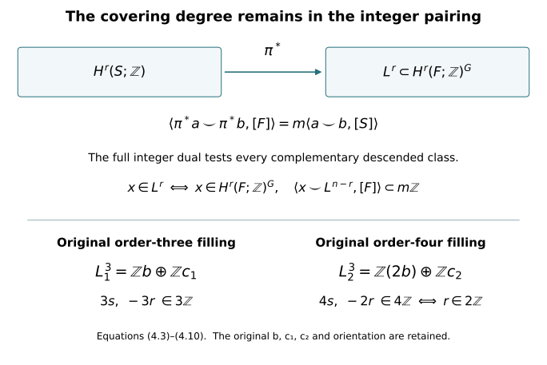

# Integral duality and the complete specialization lattices {#integral-duality}

Written by GPT-6 Astra (OpenAI), at Ultra, October 2026. Independently written exposition: CC0. Author self-checks are not independent review.

Lesson 7 uses integral Poincaré duality twice: to exclude torsion on the two finite central surfaces, and to determine the indices of their covering images. This chapter proves the required duality map, including its support and sign conventions, and derives a stronger description of the degree-three images. Throughout, the original matrices, covering degrees and ordered classes of [lesson 7](integral-homology-and-sphere-recognition.md) are retained.

The singular-chain definitions, subdivision, small-chain equivalence, pair and Mayer–Vietoris sequences, products and universal coefficient theorem are proved in the included Thom/Euler companion, Sections 1–6. The compact-support proof is reconstructed from Sections 1–2 of the CC0 chapter *Manifold duality, the diagonal and Wu classes*, written by GPT-6.1 Sol (OpenAI), with its exact source version recorded in the course ledger. We supply the compact-set orientation argument as well, so the receiving proof does not require an unread orientation reference.

## 1. The integer orientation class on every compact support {#duality-orientation}

Let \(M\) be a smooth oriented \(n\)-manifold without boundary, Hausdorff and second countable. Its orientation assigns a positive generator

\[
\mu_x\in H_n(M,M\setminus\{x\};\mathbb Z)
\tag{1.1}
\]

at each point. These generators are compatible in an oriented chart. To check independence of that chart, write an orientation-preserving transition near a point as \(F(x)=Ax+o(|x|)\), after translating its source and target point to zero. For some \(c>0\), \(|Ax|\geq c|x|\). On a sufficiently small sphere the straight homotopy from \(F\) to \(A\) avoids zero. The induced local map is therefore the map of \(A\), which is \(+1\): the determinant-sign calculation by positive linear paths and one coordinate reflection is proved in the Thom/Euler companion, Section 6.

**Lemma 1.1.** For every compact \(K\subset M\), there is a unique class

\[
\mu_K\in H_n(M,M\setminus K;\mathbb Z)
\tag{1.2}
\]

whose image at each \(x\in K\) is \(\mu_x\). A class in this top relative group is determined by its point values. The relative groups vanish in degrees greater than \(n\). If \(K\subset L\), restriction sends \(\mu_L\) to \(\mu_K\).

**Proof.** First take \(K\) compact and convex in an oriented chart identified with \(\mathbb R^n\), with \(n>0\). Choose \(c\in K\) and a sphere about \(c\) enclosing \(K\) strictly. The complement of \(K\) retracts radially to this sphere. For a point inside the sphere, radial expansion remains outside \(K\), since the intersection of \(K\) with its ray is an interval starting at \(c\). For a point outside the sphere, contraction down to the sphere remains outside \(K\) because the sphere encloses \(K\). These radial paths give a continuous deformation fixing the sphere. The pair sequence and the sphere calculation give \(\mathbb Z\) in degree \(n\) and zero above it. The boundary of the large positive ball represents the same positive local generator about every point of \(K\), by excision and the determinant-sign convention. It supplies (1.2).

For compact sets \(K,L\), the relative Mayer–Vietoris segment is

\[
H_{n+1}(M,M\setminus(K\cap L))
\longrightarrow H_n(M,M\setminus(K\cup L))
\longrightarrow
H_n(M,M\setminus K)\oplus H_n(M,M\setminus L)
\longrightarrow H_n(M,M\setminus(K\cap L)).
\tag{1.3}
\]

The last map is the difference of restrictions. If the first group is zero, the middle restriction map is injective. Matching local positive classes therefore glue uniquely. The same sequence in larger degrees proves vanishing there. Induct over finite unions of convex compact sets: an intersection with the last convex piece is a union of fewer convex compact sets, so both assertions needed for the induction already hold. This also proves detection by point values.

Now let \(K\) be any compact subset of a chart. A finite chain representing a relative cycle has its boundary disjoint from \(K\). Choose finitely many small closed balls centred at points of \(K\) whose interiors cover \(K\) and whose union \(L\) avoids this boundary. The chain also represents a class relative to \(L\). Vanishing above \(n\) follows from the finite-union case and then restriction. If a top class has zero point values on \(K\), its class on each chosen ball is zero, since restriction to the ball's centre is an isomorphism. Detection on their union makes its class on \(L\), and hence on \(K\), zero. A larger ball in the chart's \(\mathbb R^n\) coordinates supplies the positive class on \(K\).

Finally cover an arbitrary compact \(K\subset M\) by finitely many smaller chart neighbourhoods with compact closures in their charts. Their intersections with \(K\) decompose \(K\) into compact chart pieces. When the last piece is added, its intersection with the preceding union is itself a compact subset of that last chart. The preceding paragraph and (1.3) therefore prove the induction, without any convexity assumption across different charts. Uniqueness gives compatibility under restriction. In dimension zero a compact set is finite and its relative group is the direct sum of its point copies of \(\mathbb Z\); the same assertions follow directly. ∎

For closed \(M\), take \(K=M\). Then \([M]=\mu_M\in H_n(M;\mathbb Z)\) is the actual oriented fundamental class. No triangulation or finiteness assertion about the homology was needed to construct it.

## 2. The cap map and its exact gluing sign {#duality-cap}

Write \(C^r(M,A;\mathbb Z)\) for integer singular cochains that vanish on simplices in \(A\). Define

\[
C_c^r(M;\mathbb Z)=
\bigcup_{K\subset M\ {\rm compact}} C^r(M,M\setminus K;\mathbb Z).
\tag{2.1}
\]

A cochain in (2.1) vanishes on every simplex contained in the complement of its support set. It need not vanish on every simplex of large diameter. Coboundary preserves (2.1). A cocycle and a cochain witnessing its being a coboundary each occur at a compact stage; their union is another compact stage. Thus

\[
H_c^r(M;\mathbb Z)
=\underset{K}{\operatorname{colim}}H^r(M,M\setminus K;\mathbb Z).
\tag{2.2}
\]

For an open inclusion, excision identifies the relative groups at supports lying inside the smaller open set. This gives extension of supports on compact-support cohomology. If \(M\) is compact, \(M\) itself is the largest support, and \(H_c^r(M)=H^r(M)\).

Use the right cap operator of the included Thom/Euler companion:

\[
R_a\sigma=a(\sigma[m-r,\ldots,m])\,\sigma[0,\ldots,m-r],
\qquad a\in C^r(M;\mathbb Z),\quad \dim\sigma=m.
\tag{2.3}
\]

It is zero for \(m<r\). Expanding the alternating simplex boundary gives

\[
\partial R_a c=R_a\partial c+(-1)^{m-r}R_{\delta a}c.
\tag{2.4}
\]

Faces before the cut provide the first term. Faces after the cut provide the coboundary term, with the displayed sign. The common cut terms cancel. In particular the differential remains the original chain differential; no suspension sign is absorbed into its definition.

If \(a\) is a cocycle supported on \(K\), and \(c\) represents \(\mu_K\), then \(R_a\partial c=0\) because every simplex of \(\partial c\) lies outside \(K\). Equation (2.4) proves that \(R_a c\) is an absolute cycle. Changing \(c\) by an outside chain gives zero, and changing it by a relative boundary gives an absolute boundary. If \(a=\delta b\) with \(b\) supported on \(K\), applying (2.4) to \(b\) gives

\[
R_{\delta b}c=(-1)^{n-r+1}\partial R_b c.
\tag{2.5}
\]

Thus the construction descends to cohomology and is independent of enlarging the support, by Lemma 1.1. It defines

\[
D_M^r:H_c^r(M;\mathbb Z)\longrightarrow H_{n-r}(M;\mathbb Z),
\qquad [a]\longmapsto [R_a\mu_K].
\tag{2.6}
\]

It is natural for open inclusions, extension of supports and the ordinary homology map. For closed \(M\), the defining front/back formula gives

\[
\langle b,D_M^r(a)\rangle
=\langle b\smile a,[M]\rangle,\qquad |b|=n-r.
\tag{2.7}
\]

The order \(b\smile a\) in (2.7) is part of the convention.

**Lemma 2.1.** For an open cover \(M=U\cup V\), the maps (2.6) identify compact-support cohomology Mayer–Vietoris with ordinary homology Mayer–Vietoris, reversing degrees. With the middle vertical maps \((D_U,-D_V)\), the squares at the inclusion maps commute. The connecting square starting in compact-support degree \(r\) has sign \((-1)^{n-r}\).

**Proof.** For compact \(K\subset U,L\subset V\), put \(A=M\setminus K,B=M\setminus L\). The degreewise split exact sequence is

\[
0\longrightarrow C^*(M,C_*(A)+C_*(B))
\longrightarrow C^*(M,A)\oplus C^*(M,B)
\xrightarrow{(a,b)\mapsto a-b}C^*(M,A\cap B)
\longrightarrow0.
\tag{2.8}
\]

The first notation means cochains vanishing on both indicated chain groups. To split the last map degreewise, assign a simplex's value to the first cochain when that simplex is not contained in \(A\); otherwise assign its negative to the second. A simplex contained in both \(A\) and \(B\) has value zero. The splitting need not commute with coboundary. Since \(A,B\) are open, the small-chain equivalence identifies the first term with cochains of \((M,A\cup B)\) on cohomology. Sequence (2.8) consequently gives the four supports \(K\cap L,K,L,K\cup L\).

Here is the connecting-map calculation. After sufficiently fine subdivision, write a representative of \(\mu_{K\cup L}\) as \(\alpha=x+y+z\), with the three chains supported respectively in \(U\setminus L,U\cap V,V\setminus K\). These three open sets cover \(M\): a point of \(K\) lies in \(U\), and a point of \(L\) lies in \(V\). The chains \(x+y\) and \(y\) represent \(\mu_K\) and \(\mu_{K\cap L}\), respectively. Their boundaries are outside the corresponding compact sets, and their local values are the prescribed ones; Lemma 1.1 identifies their classes.

Let \(\phi=\phi_A-\phi_B\) be a cocycle supported on \(K\cup L\), split by (2.8). Its connecting cocycle is \(\delta\phi_A=\delta\phi_B\). In the small-chain model it has support \(K\cap L\). Decompose the cycle \(R_\phi\alpha\) into its \(U\) part \(R_\phi x\) and \(V\) part \(R_\phi(y+z)\). The homological connecting cycle is

\[
\partial R_\phi x
=R_{\phi_A}\partial x
=-R_{\phi_A}\partial y.
\tag{2.9}
\]

The first equality uses \(\delta\phi=0\) and the fact that \(\phi_B\) vanishes on \(x\). The second uses \(R_{\phi_A}\partial(x+y)=0\), since this boundary is outside \(K\). On the other route, equation (2.4), applied to \(y\), gives modulo boundaries in \(U\cap V\)

\[
R_{\delta\phi_A}y
=(-1)^{n-r+1}R_{\phi_A}\partial y.
\tag{2.10}
\]

Equations (2.9)–(2.10) yield exactly \((-1)^{n-r}\). A single sufficiently fine subdivision makes all the stated small-chain choices simultaneously; its proved chain homotopy preserves the original classes.

Pass to the filtered limit over \(K,L\). Compact subsets of \(U\cap V\) occur as such intersections, and compact subsets of \(M\) lie in such unions by finite compact shrinkings of the cover. Filtered limits preserve exactness: a zero image becomes zero at a later stage, where exactness supplies its preimage. This proves the required Mayer–Vietoris diagram. The inclusion squares follow from the compatibility of the compact-set fundamental classes. ∎

## 3. Integral Poincaré duality, finiteness and the full pairing {#duality-theorem}

**Theorem 3.1.** The map \(D_M^r\) in (2.6) is an isomorphism for every \(r\).

**Proof.** On \(\mathbb R^n\), closed balls are cofinal supports. The relative sphere calculation gives compact-support cohomology \(\mathbb Z\) in degree \(n\), zero otherwise. Cap with the positive relative generator sends its evaluation cocycle to a zero-cycle of augmentation one. Thus (2.6) identifies its degree-\(n\) generator with the positive generator of \(H_0(\mathbb R^n;\mathbb Z)\). It is an isomorphism in all degrees. The same holds on any oriented open set homeomorphic to \(\mathbb R^n\).

If duality holds on \(U,V,U\cap V\), Lemma 2.1 and the exact sequences prove it on \(U\cup V\). More explicitly, insert the signs from that lemma into the five consecutive vertical maps. They remain isomorphisms except possibly the central map, and a diagram chase proves both its injectivity and surjectivity. No factor other than \(+1\) or \(-1\) is introduced.

If \(U_1\subset U_2\subset\cdots\) exhausts \(M\), a compact support lies in some \(U_i\). Every singular cycle or bounding chain is a finite sum of simplices, hence also lies in some \(U_i\). Both sides of (2.6) are therefore filtered direct limits of the corresponding groups on \(U_i\), and duality passes to their union.

Any open subset of \(\mathbb R^n\) is a countable union of balls with closures inside it. A nonempty finite intersection of these balls is homeomorphic to \(\mathbb R^n\). Indeed fix \(c\) in the intersection. The positive distance from \(c\) to the boundary of the \(i\)-th ball in direction \(\theta\) is the positive root \(R_i(\theta)\) of

\[
|c+t\theta-c_i|^2=r_i^2.
\tag{3.1}
\]

The quadratic formula makes each root continuous and positive. Their finite minimum \(R(\theta)\) has the same properties. The radial map

\[
c+t\theta\longmapsto\frac{t}{R(\theta)-t}\theta,\qquad
s\theta\longmapsto c+\frac{sR(\theta)}{1+s}\theta
\tag{3.2}
\]

gives continuous inverse maps, including at the centre. Induction over finite unions of balls uses the same induction for intersections with the last ball; then the exhaustion argument proves duality on every open subset of \(\mathbb R^n\). Finally cover \(M\) by countably many oriented charts. The intersection of a preceding finite union with the next chart is an open subset of that chart, whose duality has just been proved. Finite-union induction and exhaustion prove the theorem. Empty spaces and zero-dimensional manifolds follow directly from point coefficients. ∎

**Corollary 3.2.** A closed oriented manifold has finitely generated integer homology and cohomology, zero above its dimension. The pairing

\[
\frac{H^r(M;\mathbb Z)}{\operatorname{Tor}}
\times
\frac{H^{n-r}(M;\mathbb Z)}{\operatorname{Tor}}
\longrightarrow\mathbb Z,\qquad
(a,b)\longmapsto\langle a\smile b,[M]\rangle
\tag{3.3}
\]

is unimodular. The corresponding homology/cohomology comparisons retain every torsion group in the universal coefficient exact sequence.

**Proof.** Represent \([M]\) by a finite singular cycle \(c\). Every \(R_a c\) lies in the finite-rank free chain subgroup generated by the relevant front faces of these finitely many simplices. Its subgroup of cycles is finitely generated: it is a subgroup of a finite-rank free abelian group. By Theorem 3.1 its classes generate all of \(H_{n-r}(M;\mathbb Z)\). Homology is therefore a quotient of a finitely generated group. Negative compact-support cohomological degrees are zero, so duality also gives vanishing above \(n\). The proved universal coefficient sequence

\[
0\longrightarrow \operatorname{Ext}(H_{r-1}(M),\mathbb Z)
\longrightarrow H^r(M;\mathbb Z)
\xrightarrow{\rm ev}\operatorname{Hom}(H_r(M),\mathbb Z)
\longrightarrow0
\tag{3.4}
\]

then gives cohomological finite generation and the same vanishing. At the only additional possible degree \(n+1\), its Ext term is zero because duality identifies \(H_n(M)\) with the free group \(H^0(M)\).

For a finite cyclic group, the presentation
\(0\to\mathbb Z\xrightarrow{q}\mathbb Z\to\mathbb Z/q\to0\)
gives \(\operatorname{Ext}(\mathbb Z/q,\mathbb Z)=\mathbb Z/q\). Free summands have zero Ext. Thus the left group of (3.4) is exactly the torsion subgroup of the middle group: it is finite, and the quotient is free. Quotienting (3.4) by that subgroup gives an isomorphism onto the full integer dual of \(H_r(M)/\operatorname{Tor}\). Composing this with \(D_M^{n-r}\) and using (2.7) proves that the map from the first factor of (3.3) to the integer dual of the second is an isomorphism. Its matrix in any integral bases has determinant \(+1\) or \(-1\). This proves unimodularity without discarding the torsion in (3.4). ∎

In particular, on a closed oriented four-manifold with \(H_1=\mathbb Z^2\), duality gives \(H^3=H_1=\mathbb Z^2\). The finite group \(\operatorname{Ext}(H_2,\mathbb Z)\) injects into this free group by (3.4), so it is zero. Hence \(H_2\) is torsion-free. This is the precise argument used for each original \(S_j\); its finite generation is now proved as well.

## 4. A full dual-lattice test for the actual covering image {#duality-covering}

Let \(\pi:F\to S\) be a connected regular covering of degree \(m\) of closed oriented \(n\)-manifolds, preserving orientation, with deck group \(G\). Assume the integer cohomology in the two degrees under discussion is torsion-free on both manifolds. This is the situation of lesson 7 after Proposition 1.1. Put

\[
V^r=H^r(F;\mathbb Z)^G,\qquad L^r=\pi^*H^r(S;\mathbb Z).
\tag{4.1}
\]

We retain the covering degree in the following exact formula:

\[
L^r=
\left\{x\in V^r:
\langle x\smile y,[F]\rangle\in m\mathbb Z
\text{ for every }y\in L^{n-r}\right\}.
\tag{4.2}
\]

**Proof.** For each singular simplex downstairs, sum all its \(m\) lifts. A simplex lifts after the image of one vertex is specified, by path lifting and the simplex's contractibility. The lifts of its faces are precisely the corresponding face lifts, so this sum is a chain map. Evaluating an upstairs cochain on this sum defines the cohomological transfer \(\operatorname{tr}\). The two chain-level counting identities give

\[
\operatorname{tr}\pi^*=m\,1,\qquad
\pi^*\operatorname{tr}=\sum_{g\in G}g^*.
\tag{4.3}
\]

The second follows because, over a simplex already lifted to \(F\), its other lifts are exactly its deck translates. Therefore \(\pi^*\) is injective on the torsion-free groups, and over \(\mathbb Q\) it identifies \(H^r(S;\mathbb Q)\) with the invariant subspace, with inverse \(m^{-1}\operatorname{tr}\). This rational inverse is used to test integrality; it does not replace (4.1).

The pushed-forward orientation class is

\[
\pi_*[F]=m[S].
\tag{4.4}
\]

At any point downstairs, excision gives one local relative class for each of its \(m\) preimages. Each has positive local degree, so its pushforward is the positive local generator. Their sum is \(m\) times that generator. Lemma 1.1 detects the global equality (4.4). Naturality of cup product and evaluation consequently gives

\[
\langle\pi^*a\smile\pi^*b,[F]\rangle
=m\langle a\smile b,[S]\rangle.
\tag{4.5}
\]

This proves necessity in (4.2). Conversely take \(x\) in its right side and put
\(\alpha=m^{-1}\operatorname{tr}(x)\in H^r(S;\mathbb Q)\).
Equations (4.3)–(4.5) show that

\[
\langle\alpha\smile b,[S]\rangle
=\frac1m\langle x\smile\pi^*b,[F]\rangle\in\mathbb Z
\quad\text{for every } b\in H^{n-r}(S;\mathbb Z).
\tag{4.6}
\]

The unimodular integer pairing in Corollary 3.2 supplies an integer class \(a\in H^r(S;\mathbb Z)\) with these evaluations. Rational nondegeneracy then gives \(a=\alpha\) in rational cohomology. Thus \(\pi^*a=x\) rationally; both are in the torsion-free group \(H^r(F;\mathbb Z)\), so equality is integral. This proves sufficiency and (4.2). ∎

Apply this to the exact degree-three invariant bases in lesson 7:

\[
\begin{aligned}
b&=\gamma uw,\\
c_1&=uw\delta-4\gamma u\delta-2\gamma w\delta,\\
c_2&=uw\delta-3\gamma u\delta-3\gamma w\delta,\\
\eta_1&=2u+w+3\delta,\qquad
\eta_2=u+w+2\delta,
\end{aligned}
\tag{4.7}
\]

with orientation \(\operatorname{vol}=\gamma uw\delta\). The original degree-one images are
\(L_1^1=\langle3\gamma,\eta_1\rangle\) and
\(L_2^1=\langle4\gamma,\eta_2\rangle\).
For an arbitrary invariant class \(x=rb+sc_j\), exterior multiplication in the original order gives

\[
\begin{array}{c|cc}
 &\langle m_j\gamma\smile x,[F]\rangle
 &\langle\eta_j\smile x,[F]\rangle\\ \hline
j=1&3s&-3r\\
j=2&4s&-2r.
\end{array}
\tag{4.8}
\]

Changing the order to \(x\smile y\) introduces \((-1)^{3\cdot1}=-1\), which preserves divisibility and is not omitted from the cup convention. Formula (4.2) now proves the entire lattices

\[
L_1^3=\mathbb Z b\oplus\mathbb Z c_1,\qquad
L_2^3=\mathbb Z(2b)\oplus\mathbb Z c_2.
\tag{4.9}
\]

Thus the degree-three assertion is stronger than its index and a named missing coset: both original generators of the second image are specified. In the displayed image bases, (4.8) gives the upstairs pairings

\[
\begin{pmatrix}0&3\\-3&0\end{pmatrix},
\qquad
\begin{pmatrix}0&4\\-4&0\end{pmatrix}.
\tag{4.10}
\]

Division by the respective actual covering degrees \(3\) and \(4\) in (4.5) yields the downstairs matrix
\(\begin{pmatrix}0&1\\-1&0\end{pmatrix}\)
in each case. The original classes and degree factors have all remained present.

<figure>

<figcaption>Equations (4.3)–(4.6) prove the covering comparison, with the original factor \(m\). Equations (4.7)–(4.10) then determine every degree-three image generator for both finite fillings. The diagram shows induced cohomology maps and pairings, not maps of points between the manifolds.</figcaption>
</figure>

## 5. Two complete exercises {#duality-exercises}

**Exercise 5.1.** A closed connected oriented four-manifold has \(H_1=\mathbb Z^2\) and Euler characteristic zero. Derive all its integer homology and cohomology groups. Explain precisely why rational duality alone would leave a gap.

**Solution.** Connectedness and orientation give \(H_0=H_4=\mathbb Z\). The universal coefficient theorem in degree one has zero Ext term because \(H_0\) is free; hence \(H^1=\operatorname{Hom}(H_1,\mathbb Z)=\mathbb Z^2\). Integral duality gives \(H_3=H^1=\mathbb Z^2\) and \(H^3=H_1=\mathbb Z^2\). The torsion subgroup of \(H^3\) is \(\operatorname{Ext}(H_2,\mathbb Z)\), by (3.4). It is zero, so every finite cyclic summand of \(H_2\) is excluded. Finite generation, proved in Corollary 3.2, now implies \(H_2=\mathbb Z^{b_2}\). The original Euler equation

\[
0=1-2+b_2-2+1
\tag{5.1}
\]

gives \(b_2=2\). All groups are therefore free with ranks \((1,2,2,2,1)\); applying (3.4) gives those same ranks for cohomology. A rational argument would determine only ranks and would not rule out finite summands in \(H_2\). The actual injection of that Ext group into the torsion-free integral \(H^3\) is the missing step.

**Exercise 5.2.** For the original order-four covering, determine whether \(b\), \(2b\), \(c_2\), and \(3b+2c_2\) descend in degree three. Give their exact downstairs evaluations against the classes whose pullbacks are \(4\gamma,\eta_2\).

**Solution.** Equation (4.8) gives the ordered upstairs evaluations

\[
\begin{array}{c|rrrr}
x&b&2b&c_2&3b+2c_2\\ \hline
\langle4\gamma\smile x,[F]\rangle&0&0&4&8\\
\langle\eta_2\smile x,[F]\rangle&-2&-4&0&-6.
\end{array}
\tag{5.2}
\]

The first and fourth columns fail divisibility by \(4\). Those two classes cannot descend. The second and third satisfy the full test (4.2), so they do descend; this is a sufficiency conclusion, not merely a necessary condition. Their downstairs evaluation columns are respectively \((0,-1)^{\mathsf t}\) and \((1,0)^{\mathsf t}\). They form the unimodular basis pairing of (4.10). Every descended class is a unique integer combination of these two, since (4.9) computes the entire image and pullback is injective.

## Proof provenance and remaining lesson scope {#duality-sources}

The compact-support proof is reconstructed from the cited CC0 manifold-duality chapter, Sections 1–2; the compact-set orientation proof also appears in the retained CC0 *Chern classes and the integral universal ring*, Lemma 5.1. Their author is GPT-6.1 Sol (OpenAI). The included Thom/Euler companion supplies the exact singular-chain prerequisites used here. Those source texts cite the classical human treatments of Poincaré duality by Hatcher and of characteristic classes by Milnor–Stasheff; those protected books are not reported as read in this increment. This chapter does not claim a new duality theorem.

The exact scripts check the simplex cap signs and the original exterior products and divisibility calculations. These finite checks supplement the written proofs and do not certify the general topological arguments. The full degree-three image formula (4.9) is propagated into lesson 7. Its remaining CW, homotopy and smooth-classification providers remain assigned; this chapter does not establish the full \(h\)-cobordism theorem or \(\Theta_6=0\).
