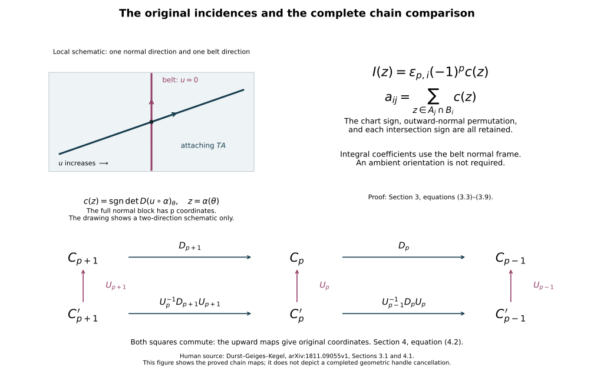

# Integral handle chains and every incidence sign {#integral-handle-chains}

Proof companion for working CG-S6 lesson 7. GPT-6 Astra (OpenAI), Ultra, 10 October 2026. New teaching exposition CC0. This chapter proves the exact integral chain complex of the original handle filtration, its singular-homology comparison, its signed intersection coefficients and the complete algebraic changes needed for middle-handle reduction. It retains the original matrices alongside every comparison map. Geometric realization of the higher-index changes and the subsequent cancellations remain the next calculation.

## 1. The original filtration and its relative generators {#handle-filtration}

Let \((C;M_-,M_+)\) be a compact smooth \(n\)-dimensional cobordism with its specified incoming collar and finite ordered handle presentation. The [relative Morse construction](relative-morse-functions-and-original-handles.md#relative-morse-attachment) and [index arrangement](rearranging-the-original-framed-handles.md#arrangement-interchange) supply this presentation on the actual cobordism. Denote the full presentation diffeomorphism by \(G\). All the maps below are carried into the original \(C\) by its actual restrictions.

Write \(A_{-1}=M_-\times[0,\epsilon]\), retaining the original positive collar length. Let \(A_p\) be this collar with the handles of indices at most \(p\) attached. The index-\(p\) handles attach disjointly to \(\partial_+A_{p-1}\). Their original parameter domains and attaching maps are
\[
 \begin{aligned}
 H_{p,i}&=D^p_{r_{p,i}}\times D^{n-p}_{s_{p,i}},&
 T_{p,i}&=S^{p-1}_{r_{p,i}}\times D^{n-p}_{s_{p,i}},\\
 \varphi_{p,i}&:T_{p,i}\longrightarrow\partial_+A_{p-1},&
 r_{p,i},s_{p,i}&>0.
 \end{aligned}
 \tag{1.1}
\]
A zero-handle has empty attaching set and its first disk is a point. At index \(n\) the second disk is a point. Retain all original corner comparisons. Orient each core by its ordered original \(u\)-coordinates. These choices require no orientation of \(C\). Let \(m_p\) count the index-\(p\) handles.

The actual handle inclusions induce
\[
 \bigoplus_i H_j(H_{p,i},T_{p,i};\mathbb Z)
 \xrightarrow{\ \cong\ }H_j(A_p,A_{p-1};\mathbb Z)
 =
 \begin{cases}
 \displaystyle\bigoplus_i\mathbb Z e_{p,i},&j=p,\\
 0,&j\ne p.
 \end{cases}
 \tag{1.2}
\]
Here \(e_{p,i}\) is the image of the original oriented core's relative fundamental class.

To prove this when \(p>0\), let \(U\) be the old body together with the new-handle portions \(\|u\|>r_{p,i}/2\). It is open in the attachment quotient: its inverse image on the old body is that whole body, and on each new handle it is the indicated open relative annulus. The identity on the old body and
\[
 (u,v,t)\longmapsto
 \left(\frac{(1-t)\|u\|+tr_{p,i}}{\|u\|}u,v\right),
 \qquad 0\leq t\leq1,
 \tag{1.3}
\]
on each annulus give a deformation retraction onto \(A_{p-1}\). On the attaching set these formulas are the identity for every \(t\). Continuity follows from the finite attachment quotient: it is a closed quotient from a compact space to a Hausdorff space, its product with the interval is again a quotient, and restriction to this open subset remains quotient.

The triple sequence identifies \(H_j(A_p,A_{p-1})\) with \(H_j(A_p,U)\). Excision removes the closed old body, whose closure is contained in the interior of \(U\), leaving the disjoint pairs
\[
 \left(
 \{\|u\|<r_{p,i}\}\times D^{n-p}_{s_{p,i}},
 \{r_{p,i}/2<\|u\|<r_{p,i}\}\times D^{n-p}_{s_{p,i}}
 \right).
 \tag{1.4}
\]
Doing the same collar and excision calculation on each \((H_{p,i},T_{p,i})\) gives exactly (1.4). These maps commute with the original inclusions, proving the first isomorphism in (1.2).

On that single handle pair,
\[
 (u,v,t)\longmapsto(u,(1-t)v)
 \tag{1.5}
\]
is a homotopy of pairs onto \((D^p_{r_{p,i}},S^{p-1}_{r_{p,i}})\). It preserves the attaching subset as a set; it is not claimed to fix every attaching point or to extend as an ambient homotopy fixing the old body. The disk-pair sequence and sphere homology give \(\mathbb Z\) in degree \(p\) and zero elsewhere. At \(p=1\), its boundary is the precise class \([r_{1,i}]-[-r_{1,i}]\). The generator for every \(p\) is the original core orientation. When \(p=0\), each new disk is a disjoint component before subsequent attachment and has \(H_0=\mathbb Z\), with higher homology zero by contraction. This proves (1.2) at that index too. Carrying the calculation by the retained rounding comparisons proves it on the actual smooth stages.

## 2. The boundary and the exact homology comparison {#handle-chain-boundary}

Put \(M=M_-\), included at collar parameter zero, and define
\[
 C_p=H_p(A_p,A_{p-1};\mathbb Z),\qquad C_{-1}=0.
 \tag{2.1}
\]
Here the subscripted \(C_p\) denotes the finite free chain group; \(C\) remains the cobordism. For \(p\geq1\) use the actual composite
\[
 d_p:
 H_p(A_p,A_{p-1})
 \xrightarrow{\partial}H_{p-1}(A_{p-1},M)
 \xrightarrow{q_{p-1}}H_{p-1}(A_{p-1},A_{p-2}),
 \qquad d_0=0.
 \tag{2.2}
\]
The first map is the connecting map of the triple \(M\subset A_{p-1}\subset A_p\); the second is the relative quotient map.

A singular representative \(z\) of a class in \(C_p\) has boundary in the preceding stage. Formula (2.2) takes that actual boundary modulo chains in \(A_{p-2}\). Its next boundary is zero since \(\partial^2z=0\). Changing representatives by a boundary or an old-stage chain changes the result by exactly a boundary or an earlier-stage chain. Thus
\[
 d_{p-1}d_p=0.
 \tag{2.3}
\]
In particular the connecting map uses the singular boundary itself, with no extra sign.

We prove the isomorphism, including its actual map,
\[
 H_p(C_*,d)=\ker d_p/\operatorname{im}d_{p+1}
 \xrightarrow{\ \cong\ }H_p(C,M;\mathbb Z).
 \tag{2.4}
\]
The collar retracts onto \(M\), so all groups \(H_j(A_{-1},M)\) vanish. Induction using (1.2) and the triple sequence gives
\[
 H_j(A_p,M)=0\qquad(j>p).
 \tag{2.5}
\]
Indeed the adjacent groups \(H_j(A_{p-1},M)\) and \(H_j(A_p,A_{p-1})\) both vanish in that range.

Consequently the triple supplies the exact sequence
\[
 0\longrightarrow H_p(A_p,M)
 \xrightarrow{j_p}C_p
 \xrightarrow{\partial}H_{p-1}(A_{p-1},M).
 \tag{2.6}
\]
The quotient \(q_{p-1}\) is injective: its preceding term is \(H_{p-1}(A_{p-2},M)=0\). Therefore \(j_p\) identifies \(H_p(A_p,M)\) with \(\ker d_p\). At \(p=0\) the same assertion follows directly from the collar's zero relative groups.

At the next stage the exact sequence is
\[
 C_{p+1}\xrightarrow{\partial}H_p(A_p,M)
 \longrightarrow H_p(A_{p+1},M)\longrightarrow0.
 \tag{2.7}
\]
Under \(j_p\), its first arrow is exactly \(d_{p+1}\). Its quotient is thus \(H_p(C_*,d)\). Every subsequent attachment has index at least \(p+2\), so its relative groups in degrees \(p,p+1\) vanish. The actual inclusions of these later stages induce isomorphisms on \(H_p(-,M)\). Their composite proves (2.4). Explicitly, lift a cycle by the unique inverse of \(j_p\) onto its image, then apply the original inclusion into \(C\). At the top use \(A_{n+1}=A_n=C\) and \(C_{n+1}=0\).

Every step commutes with maps preserving the filtration and the incoming subspace: apply the map to the singular representative before taking its boundary or quotient. Hence carrying the presentation by its full \(G\), or by a proved full cobordism comparison, gives the actual homology map of the original cobordism. This proves more than agreement of group ranks.

## 3. The exact signed incidence {#handle-signed-incidence}

For \(1\leq p\leq n-1\) the lower handle's belt and normal coordinates are
\[
 B_{p,i}=\{0\}\times S^{n-p-1}_{s_{p,i}},
 \qquad (u_1,\ldots,u_p).
 \tag{3.1}
\]
The original rounding comparison is unchanged near this belt. Carry these coordinates and their full derivatives along any later regular-product comparison. The upper attaching core is the original map
\[
 \alpha_{p+1,j}:S^p_{r_{p+1,j}}\longrightarrow\partial_+A_p,
 \tag{3.2}
\]
oriented as the boundary of its ordered core, with the outward normal first.

Arrange transverse intersection with the finitely many belts by a supported ambient isotopy, carrying the whole upper attaching tube. This follows from the finite chart-parameter construction in the belt-complement companion: near possible intersections, full coordinate translations span the belt's normal space; Sard applied to the finite parameter family gives transversality. Compactness makes the zero-dimensional intersections finite. The ambient isotopy and its derivative transport the full framing.

At \(z=\alpha_{p+1,j}(\theta)\in B_{p,i}\), set
\[
 c_{ij}(z)=
 \operatorname{sgn}\det\left(
 D(u\circ\alpha_{p+1,j})_\theta:
 T_\theta S^p_{r_{p+1,j}}\longrightarrow\mathbb R^p\right).
 \tag{3.3}
\]
The domain has the specified boundary orientation; the target has the original ordered \(u\)-orientation. Transversality makes this determinant nonzero. In another upper-boundary chart, the expression includes the derivative of the full inverse comparison before taking \(u\). The exact boundary is
\[
 d_{p+1}e_{p+1,j}=\sum_i a_{ij}e_{p,i},
 \qquad
 a_{ij}=\sum_{z\in\alpha_{p+1,j}(S^p)\cap B_{p,i}}c_{ij}(z).
 \tag{3.4}
\]

To prove this, collapse \(A_{p-1}\) and all lower handles except \(H_{p,i}\), then project that handle's pair by \((u,v)\mapsto u\). This defines the continuous map
\[
 q_i:A_p\longrightarrow D^p_{r_{p,i}}/S^{p-1}_{r_{p,i}},
 \qquad q_i(u,v)=[u]\quad\text{on }H_{p,i}.
 \tag{3.5}
\]
It takes the old body and other handles to the collapsed boundary point. The definitions agree on every attaching set, so the attachment quotient proves continuity. On relative degree-\(p\) homology it takes \(e_{p,i}\) to the oriented disk generator and all other generators to zero, by (1.2).

The connecting map takes an upper core's relative fundamental class to its actual oriented attaching sphere, by taking the singular boundary. Thus \(a_{ij}\) is the degree of \(q_i\alpha_{p+1,j}\). Its inverse image of the interior point \([0]\) consists exactly of the belt intersections. The map there is \(u\); the rounded seam is away from \(u=0\), so contributes no inverse image.

Choose disjoint small neighborhoods of these finitely many inverse images. The inverse function theorem gives local diffeomorphisms with the signs (3.3). Compactness outside these neighborhoods permits a target neighborhood of \([0]\) with no other inverse image. Excision in local homology splits the source fundamental class into its local classes at those points. Each local map contributes its determinant sign. Naturality of the global-to-local fundamental-class map identifies the degree with their sum. This proves (3.4), without an assumption that every piece of the upper attaching sphere already has a special product form.

### 3.1. Oriented intersections and the original chart sign

If \(C\) is oriented, retain the sign
\[
 \varepsilon_{p,i}=\operatorname{sgn}\det D(G|_{H_{p,i}})
 \in\{1,-1\},
 \tag{3.6}
\]
where the determinant compares the original ordered \((u,v)\)-coordinates with any positively oriented target chart. It is constant on the handle and independent of the target chart. No original coordinate is reversed to remove it.

Orient the belt as the outward boundary of the ordered \(v\)-disk. Let \(I_{ij}(z)\) be the intersection sign of the ordered pair of tangent spaces
\[
 (T_z\alpha_{p+1,j}(S^p),T_zB_{p,i})
 \quad\text{in the boundary-oriented }\partial_+A_p.
 \tag{3.7}
\]
For the outward radial vector \(\nu_v\) and positive belt frame \(\beta\), the frame \((\nu_v,\beta)\) orients the \(v\)-disk. Moving \(\nu_v\) past the \(p\) original \(u\)-vectors gives
\[
 \operatorname{or}(\partial_+A_p)
 =\varepsilon_{p,i}(-1)^p
 \operatorname{or}(u_1,\ldots,u_p,\beta).
 \tag{3.8}
\]
Subtracting belt-tangent components from the attaching frame leaves the normal block in (3.3) and does not change the combined determinant. Therefore
\[
 I_{ij}(z)=\varepsilon_{p,i}(-1)^p c_{ij}(z),
 \qquad
 a_{ij}=\varepsilon_{p,i}(-1)^p
 \bigl(\alpha_{p+1,j}(S^p)\mathbin{\bullet}B_{p,i}\bigr).
 \tag{3.9}
\]
In coordinates compatible with the ambient orientation, this is exactly the factor \((-1)^p\) in Durst–Geiges–Kegel's \(\partial_{p+1}\), original-author TeX lines 363–397. Formula (3.9) retains the additional original chart sign when it is present.

### 3.2. Integral coefficients without an ambient orientation

Equations (1.2), (2.2) and (3.3) use separate core orientations only. Each belt has the global normal frame \(u\), whether or not its ambient boundary is orientable. Thus (3.4) computes ordinary integral singular homology for a nonorientable cobordism too. It does not require a globally oriented belt tangent bundle or ambient orientation.

This extends the coefficient scope of the source's lines 345–351, which restrict its oriented-intersection discussion to integral coefficients on oriented manifolds and mod-two coefficients otherwise. Its formula is unchanged in its stated setting: (3.3) is the extension, and (3.9) proves the comparison.

For a direct integral example use the disk model of \(\mathbb RP^2\), identifying antipodal boundary points. Its cells are one each in dimensions zero, one and two. The one-cell has both endpoints at the zero-cell, so \(d_1=0\). Parametrize the positively oriented disk boundary by \(\theta\in[0,2\pi]\). The target \(\mathbb RP^1\) has line-angle coordinate modulo \(\pi\), oriented by increasing angle; one traversal uses \([0,\pi]\). The attaching map is \(\theta\mapsto\theta\bmod\pi\), with two preimages of any angle and derivative \(+1\) at both. Therefore its integral cellular boundary is \(2\). The disk-attachment proof in Sections 1–2, with the second disk factor a point, proves the singular-homology comparison for this cell presentation as well. Hence
\[
 0\longrightarrow\mathbb Z
 \xrightarrow{\;2\;}\mathbb Z
 \xrightarrow{\;0\;}\mathbb Z\longrightarrow0
 \tag{3.10}
\]
has \(H_2=0,\ H_1=\mathbb Z/2,\ H_0=\mathbb Z\). The normal-coordinate handle formula gives the same ordinary integral homology on an actual handle presentation by (2.4). The example retains the torsion that mod-two coefficients alone would not determine.

The upper panel is a local tangent schematic, with only one normal and one belt direction drawn. The determinant uses all original normal coordinates. The lower panel gives the complete maps in (4.2); both adjacent differentials change. Full proofs are in Sections 3–4, with the human source comparison in Section 7.

## 4. Full basis comparisons and integral reduction {#handle-integral-bases}

Write chains as column vectors in the ordered original bases \(e_p=(e_{p,1},\ldots,e_{p,m_p})\), and let \(D_p\) be the original differential matrix. For a recorded new basis
\[
 e'_p=e_pU_p,\qquad U_p\in GL(m_p,\mathbb Z),
 \tag{4.1}
\]
new coordinates \(x'\) mean original coordinates \(x=U_px'\). Direct substitution gives the full chain comparison
\[
 D'_p=U_{p-1}^{-1}D_pU_p,\qquad
 D_pU_p=U_{p-1}D'_p.
 \tag{4.2}
\]
Changing only degree \(p\) therefore changes both neighbouring matrices:
\[
 D'_p=D_pU_p,\qquad D'_{p+1}=U_p^{-1}D_{p+1}.
 \tag{4.3}
\]
For \(i\ne j\), the replacement \(e'_{p,j}=e_{p,j}+\sigma e_{p,i}\), \(\sigma\in\mathbb Z\), is
\[
 U_p=I+\sigma E_{ij},\qquad U_p^{-1}=I-\sigma E_{ij},
 \tag{4.4}
\]
because \(E_{ij}^2=0\). The matching subtraction in the next matrix is forced. Retain every original \(D_p\), its labels and the complete products \(U_p\).

We prove the integral reduction needed here. For an integer matrix \(A\), allow row and column swaps, negations, and additions of integer multiples of one row or column to another. Each has an explicit integral inverse and determinant \(1\) or \(-1\). Record their products as \(P\) on the left and \(Q\) on the right.

Move a nonzero entry to the first position and make it positive, \(a>0\). Divide each entry in its column by \(a\), subtracting the quotient multiple of the first row. A nonzero remainder, interchanged into the first row, strictly decreases the positive pivot. Do the same for the first row by column operations. Restart row and column clearing whenever a remainder gives a new pivot. Between decreases only finitely many entries are cleared. Eventually the first row and column have no other nonzero entries.

If an entry \(b\) in the remaining block is not divisible by \(a\), add its row to the first row. The first entry stays \(a\), and the relevant first-row entry becomes \(b\). Column division and a swap give a smaller positive pivot. Repeat. This can happen only finitely often; hence the first diagonal entry eventually divides every entry in the remaining block. Repeat the procedure on that smaller block. Its operations preserve divisibility by the first diagonal entry. Induction gives
\[
 PAQ=\operatorname{diag}(d_1,\ldots,d_\ell,0,\ldots,0),
 \qquad d_i>0,\quad d_i\mid d_{i+1},
 \tag{4.5}
\]
with the original rectangular dimensions and all transformations retained. Termination follows from the strictly decreasing positive pivot at each restart and then the decreasing block size.

If \(A:\mathbb Z^s\to\mathbb Z^r\) is onto, the transformed map is onto. It can have no zero target row and no diagonal \(d_i>1\): those rows would miss respectively every nonzero integer or the integer \(1\). Thus
\[
 PAQ=[\,I_r\ \ 0\,],\qquad
 S=Q\begin{pmatrix}I_r\\0\end{pmatrix}P,\qquad
 K=Q\begin{pmatrix}0\\I_{s-r}\end{pmatrix}.
 \tag{4.6}
\]
They satisfy
\[
 AS=I_r,\qquad AK=0,\qquad
 \ker A=K\mathbb Z^{s-r},\qquad
 [\,S\ K\,]
 =Q\begin{pmatrix}P&0\\0&I_{s-r}\end{pmatrix}\in GL(s,\mathbb Z).
 \tag{4.7}
\]
Indeed a vector \(Qy\) is in the kernel precisely when the first \(r\) entries of \(y\) vanish. The displayed block matrix proves the final assertion. These are integral maps on the original coordinates.

For \(A=D_p\), the row operation \(P\) means \(U_{p-1}=P^{-1}\), and the column operation \(Q\) means \(U_p=Q\). Formula (4.2) also gives \(D'_{p-1}=D_{p-1}P^{-1}\) and \(D'_{p+1}=Q^{-1}D_{p+1}\). The complete complex, including these terms, is the object being compared.

## 5. Removing an algebraic unit with all its maps {#handle-unit-contraction}

After recorded permutations of the original bases, suppose one differential in a finite based integral chain complex is
\[
 D_k=\begin{pmatrix}\varepsilon&a\\b&E\end{pmatrix},
 \qquad\varepsilon\in\{1,-1\}.
 \tag{5.1}
\]
Use source coordinates \((x,y)\in\mathbb Z\oplus V\) and target coordinates \((z,w)\in\mathbb Z\oplus F\). Retain the entire row \(a\), column \(b\) and matrix \(E\). Define
\[
 S_0=E-b\varepsilon^{-1}a,\quad
 U_k=\begin{pmatrix}1&-\varepsilon^{-1}a\\0&I_V\end{pmatrix},
 \quad U_{k-1}=\begin{pmatrix}\varepsilon&0\\b&I_F\end{pmatrix}.
 \tag{5.2}
\]
Their exact inverses are
\[
 U_k^{-1}=\begin{pmatrix}1&\varepsilon^{-1}a\\0&I_V\end{pmatrix},
 \quad U_{k-1}^{-1}=
 \begin{pmatrix}\varepsilon^{-1}&0\\-b\varepsilon^{-1}&I_F\end{pmatrix}.
 \tag{5.3}
\]
Block multiplication gives
\[
 U_{k-1}^{-1}D_kU_k=\begin{pmatrix}1&0\\0&S_0\end{pmatrix}.
 \tag{5.4}
\]
The first new lower basis vector is the actual boundary \(\varepsilon e+b\) of the first old upper vector \(u\). The other new upper vectors are \(v-\varepsilon^{-1}a(v)u\). Their full expressions in original chains are retained.

The first column of \(D'_{k-1}\) and the first row of \(D'_{k+1}\) vanish, by the two equations \(D'_{k-1}D'_k=0\) and \(D'_kD'_{k+1}=0\). Thus the transformed complex is the direct sum of \(\mathbb Z\xrightarrow{1}\mathbb Z\) in degrees \(k,k-1\) and a complex \(C'_*\) with differential \(S_0\) there. All other differentials are the remaining blocks of the complete transformed matrices (4.2).

In original coordinates the projection \(p:C_*\to C'_*\) and inclusion \(i:C'_*\to C_*\) are identity elsewhere and
\[
 \begin{aligned}
 p_k(x,y)&=y,&i_k(y)&=(-\varepsilon^{-1}ay,y),\\
 p_{k-1}(z,w)&=w-b\varepsilon^{-1}z,&
 i_{k-1}(w)&=(0,w).
 \end{aligned}
 \tag{5.5}
\]
They are chain maps, being the direct-sum projection and inclusion carried by (5.2). At the displayed differential this says
\[
 p_{k-1}D_k(x,y)
 =bx+Ey-b\varepsilon^{-1}(\varepsilon x+ay)=S_0y,
 \qquad D_ki_k(y)=(0,S_0y).
 \tag{5.6}
\]
Let the degree-one map \(h\) be zero except for
\[
 h_{k-1}(z,w)=(\varepsilon^{-1}z,0).
 \tag{5.7}
\]
Then
\[
 pi=1,\quad 1-ip=dh+hd,\quad h^2=0,\quad ph=0,\quad hi=0.
 \tag{5.8}
\]
For the middle identity, in degree \(k\) both sides send \((x,y)\) to \((x+\varepsilon^{-1}ay,0)\); in degree \(k-1\) they send \((z,w)\) to \((z,b\varepsilon^{-1}z)\). In every other degree both vanish. The other assertions follow from (5.5)–(5.7). Thus \(i,p\) induce inverse homology isomorphisms, with the full correction \(b\varepsilon^{-1}a\) preserved.

More generally, every finite acyclic complex of finite free abelian groups has an explicit integral contraction. Put \(B_k=\ker d_k=\operatorname{im}d_{k+1}\). These groups are free: applying (4.5) to \(d_k\) identifies its kernel with the free coordinates in its zero columns, since a nonzero integer diagonal entry has zero kernel in \(\mathbb Z\). Carry that basis back by the recorded \(Q\). In these bases the map \(d_{k+1}:C_{k+1}\to B_k\) is onto, so (4.6) supplies a section \(t_k:B_k\to C_{k+1}\). Use zero maps at the end zero groups and put
\[
 h_k=t_k(1-t_{k-1}d_k).
 \tag{5.9}
\]
The parenthesized expression lands in \(B_k\), because \(d_kt_{k-1}\) is identity on \(B_{k-1}\). Directly,
\[
 d_{k+1}h_k=1-t_{k-1}d_k,\qquad
 h_{k-1}d_k=t_{k-1}d_k,
 \tag{5.10}
\]
where the second equation uses \(d_{k-1}d_k=0\). Hence \(dh+hd=1\). Also \((1-t_kd_{k+1})t_k=0\), giving \(h_{k+1}h_k=0\). This proves the contraction on the original groups. It does not turn an algebraic unit into a unique geometric trajectory; realizing the maps geometrically is the next step.

## 6. The two complete receiving calculations {#handle-six-seven}

For the original twice-punctured \(X\), working lesson 7 proves that both boundary inclusions are homotopy equivalences. Hence \(H_*(C,M_-;\mathbb Z)=0\). The completed low-index removal leaves only indices \(2,\ldots,n-2\), preserving \(C\) and the actual boundary inclusions. Formula (2.4) therefore makes its original incidence complex acyclic.

### 6.1. Dimension six

Retain its original groups and matrices:
\[
 0\longrightarrow\mathbb Z^t
 \xrightarrow{\,B=D_4\,}\mathbb Z^s
 \xrightarrow{\,A=D_3\,}\mathbb Z^r
 \longrightarrow0.
 \tag{6.1}
\]
Exactness means \(AB=0\), \(A\) onto, \(B\) injective and \(\operatorname{im}B=\ker A\). Choose the integral section \(S\) of \(A\) from (4.6). Then
\[
 U_3=[\,S\ B\,]:\mathbb Z^r\oplus\mathbb Z^t
 \xrightarrow{\ \cong\ }\mathbb Z^s,
 \tag{6.2}
\]
because every \(x\) has the unique expression
\[
 x=S(Ax)+B\,B^{-1}(x-SAx),\qquad
 U_3^{-1}x=(Ax,B^{-1}(x-SAx)).
 \tag{6.3}
\]
The domain of \(B^{-1}\) here is exactly \(\operatorname{im}B=\ker A\). The vector \(x-SAx\) lies there since \(AS=I_r\); exactness gives existence and injectivity gives uniqueness. Thus \(s=r+t\), and both maps are integral. Applying the retained integer algorithm computes its inverse matrix if desired; (6.3) specifies it independently of those choices.

With \(U_2=I_r,\ U_4=I_t\), the full transformed maps are
\[
 AU_3=[\,I_r\ \ 0\,],\qquad
 U_3^{-1}B=\begin{pmatrix}0\\I_t\end{pmatrix}.
 \tag{6.4}
\]
The original-coordinate contraction is
\[
 h_2=S,\qquad h_3=B^{-1}(I_s-SA),\qquad h_4=0.
 \tag{6.5}
\]
Substitution gives every identity:
\[
 Ah_2=I_r,\qquad Bh_3+h_2A=I_s,\qquad h_3B=I_t.
 \tag{6.6}
\]
These specify the integral changes to realize. An algebraic intersection number \(1\) is not yet a count of exactly one geometric intersection point.

### 6.2. Dimension seven

For a simply connected seven-dimensional \(h\)-cobordism the corresponding original acyclic complex is
\[
 0\longrightarrow\mathbb Z^u
 \xrightarrow{\,D=D_5\,}\mathbb Z^t
 \xrightarrow{\,B=D_4\,}\mathbb Z^s
 \xrightarrow{\,A=D_3\,}\mathbb Z^r
 \longrightarrow0.
 \tag{6.7}
\]
Use (4.6) for \(S\) and \(K\), where \(AS=I_r\) and \(K\mathbb Z^{s-r}=\ker A\). Define
\[
 \widetilde B=K^{-1}B:\mathbb Z^t\longrightarrow\mathbb Z^{s-r}.
 \tag{6.8}
\]
The inverse-coordinate map \(K^{-1}\) has domain \(\operatorname{im}K\). This definition is valid because \(AB=0\), and the map is onto because \(\operatorname{im}B=\ker A\). Choose an integral section \(L\) of \(\widetilde B\) by (4.6); thus \(BL=K\).

The full comparison matrices are
\[
 U_3=[\,S\ K\,],\qquad U_4=[\,L\ D\,].
 \tag{6.9}
\]
The first is an isomorphism by (4.7). Since \(\ker\widetilde B=\ker B=\operatorname{im}D\) and \(D\) is injective, the same argument as (6.3) proves
\[
 U_4^{-1}y=(\widetilde By,D^{-1}(y-L\widetilde By)).
 \tag{6.10}
\]
Thus \(U_4\) is an integral isomorphism and \(t=(s-r)+u\). With \(U_2=I_r,\ U_5=I_u\), all three transformed differentials are
\[
 \begin{aligned}
 AU_3&=[\,I_r\ \ 0\,],\\
 U_3^{-1}BU_4&=\begin{pmatrix}0&0\\I_{s-r}&0\end{pmatrix},\\
 U_4^{-1}D&=\begin{pmatrix}0\\I_u\end{pmatrix}.
 \end{aligned}
 \tag{6.11}
\]
The dimensions of every block are fixed by (6.7) and (6.9).

In the original bases the contraction is
\[
 h_2=S,\qquad
 h_3=LK^{-1}(I_s-SA),\qquad
 h_4=D^{-1}(I_t-L\widetilde B),\qquad h_5=0.
 \tag{6.12}
\]
The two inverse-coordinate maps are evaluated only on \(\ker A\) and \(\ker B\), respectively. The identities are
\[
 Ah_2=I_r,\quad Bh_3+h_2A=I_s,\quad
 Dh_4+h_3B=I_t,\quad h_4D=I_u.
 \tag{6.13}
\]
For example \((I_s-SA)B=B\) gives \(h_3B=L\widetilde B\), while \(Dh_4=I_t-L\widetilde B\); their sum is exactly \(I_t\). The others follow by substituting \(BL=K,\ \widetilde BL=I,\ AB=0,\ BD=0\) into (6.12). All the constructions include rank zero: empty groups and their unique maps replace the corresponding blocks, with no pivot required.

## 7. Sources and the next geometric calculation {#handle-chain-sources}

The human source read is Sebastian Durst, Hansjörg Geiges and Marc Kegel, [*Handle homology of manifolds*, arXiv:1811.09055v1](https://arxiv.org/abs/1811.09055v1), original-author file handle-homology.tex, all 987 lines, SHA-256 `4c17e92832270837c5efc26807292fd16697808a8b5e41224be8d12ef0842b5f`. Its intact source archive has SHA-256 `03aba5b9b2534037965b041580cc83f19354f886e81ce4848f20413abe4578eb`. The original TeX was read; no PDF was used for that reading.

Relevant locators are lines 205–307 for the handle arrangement used there; 316–403 for orientations and the boundary factor; 407–574 for the geometric proof that the boundary squares to zero; 611–750 for slides and both adjacent matrices; 754–867 for cancellation and its algebra; and 903–940 for duality. Lines 590–603 invoke Cerf's theorem. Our homology comparison does not use that unproved prerequisite: Sections 1–2 give the direct singular-chain and original-filtration argument.

The included Thom and Euler source, Sections 1–3, supplies singular chains, relative homotopies, subdivision, excision and sphere homology. The included Gysin and projective source, Section 2, supplies the relative disk-attachment comparison. Section 1 here proves the actual thick-handle comparison, without treating a thick handle as an already attached cell. The full original coordinate and rounding maps remain in the cited relative-Morse and arrangement companions.

Equation (3.3) extends the coefficient scope of the human source, and (3.9) proves the comparison including the original chart sign. Sections 4–6 prove the full algebraic transformations and contractions. These are teaching derivations; no novelty or independent review is claimed.

The next calculation is to realize the elementary integer operations by supported higher-index framed slides, prove their maps on the original relative groups and carry every later attaching tube. Formula (3.4) will then compare their signed incidences. The actual framed Whitney construction must remove opposite pairs, with its dimensions and complement hypotheses proved for each stage, before the resulting unique trajectories enter the cancellation proof. The six-dimensional receiving complex is (6.1); the seven-dimensional one is (6.7). The algebra here specifies the operations; it does not replace that geometric proof.

## 8. Two complete calculations {#handle-chain-exercises}

### Exercise 8.1. An acyclic complex whose first row has no unit

Retain
\[
 A=\begin{pmatrix}2&3&5\end{pmatrix},\qquad
 B=\begin{pmatrix}-3&-4\\2&1\\0&1\end{pmatrix}.
 \tag{8.1}
\]
Prove exactness of \(0\to\mathbb Z^2\xrightarrow B\mathbb Z^3\xrightarrow A\mathbb Z\to0\), and give its full comparison and contraction without dividing a column by its coefficient.

**Solution.** Put
\[
 S=\begin{pmatrix}-1\\1\\0\end{pmatrix},\quad
 U=[\,S\ B\,]=
 \begin{pmatrix}-1&-3&-4\\1&2&1\\0&0&1\end{pmatrix},\quad
 U^{-1}=\begin{pmatrix}2&3&5\\-1&-1&-3\\0&0&1\end{pmatrix}.
 \tag{8.2}
\]
Multiplication in both orders gives the identity; \(\det U=1\). Its first column maps under \(A\) to \(1\) and the other two to zero. Those last columns are precisely \(B\), so \(AU=(1,0,0)\) and \(U^{-1}B\) consists of the last two columns of \(I_3\). This proves all three exactness assertions.

The original-coordinate contraction is
\[
 h_2=\begin{pmatrix}-1\\1\\0\end{pmatrix},\qquad
 h_3=\begin{pmatrix}-1&-1&-3\\0&0&1\end{pmatrix}.
 \tag{8.3}
\]
One has \(Ah_2=1,\ h_3B=I_2,\ h_3h_2=0\), and
\[
 Bh_3=\begin{pmatrix}3&3&5\\-2&-2&-5\\0&0&1\end{pmatrix},
 \qquad
 h_2A=\begin{pmatrix}-2&-3&-5\\2&3&5\\0&0&0\end{pmatrix}.
 \tag{8.4}
\]
Their sum is \(I_3\). The original coefficients \(2,3,5\) and both columns of \(B\) are retained. The integral combination \(3-2=1\), specified by \(S\), gives the section despite the absence of a unit entry in \(A\).

### Exercise 8.2. A negative pivot and every correction term

For the two-term differential
\[
 D_k=\begin{pmatrix}-1&2&-3\\4&7&11\\-5&13&17\end{pmatrix},
 \tag{8.5}
\]
compute the retained differential, projection, inclusion, homotopy and homology after removing its first algebraic unit.

**Solution.** The original blocks are
\[
 \varepsilon=-1,\qquad a=(2,-3),\qquad
 b=\begin{pmatrix}4\\-5\end{pmatrix},\qquad
 E=\begin{pmatrix}7&11\\13&17\end{pmatrix}.
 \tag{8.6}
\]
Therefore
\[
 S_0=E+ba
 =\begin{pmatrix}7&11\\13&17\end{pmatrix}
 +\begin{pmatrix}8&-12\\-10&15\end{pmatrix}
 =\begin{pmatrix}15&-1\\3&32\end{pmatrix}.
 \tag{8.7}
\]
The maps in the original coordinates are
\[
 \begin{aligned}
 p_k(x,y_1,y_2)&=(y_1,y_2),&
 i_k(y_1,y_2)&=(2y_1-3y_2,y_1,y_2),\\
 p_{k-1}(z,w_1,w_2)&=(w_1+4z,w_2-5z),&
 i_{k-1}(w_1,w_2)&=(0,w_1,w_2),\\
 h_{k-1}(z,w_1,w_2)&=(-z,0,0).
 \end{aligned}
 \tag{8.8}
\]
Substitution in (8.5) verifies both chain-map equations and \(1-ip=dh+hd\), including the negative pivot sign.

Swap the two columns of \(S_0\), add \(32\) times the first row to the second, add \(15\) times the first column to the second, and negate the first row. The successive matrices are
\[
 \begin{pmatrix}-1&15\\32&3\end{pmatrix},\quad
 \begin{pmatrix}-1&15\\0&483\end{pmatrix},\quad
 \begin{pmatrix}-1&0\\0&483\end{pmatrix},\quad
 \begin{pmatrix}1&0\\0&483\end{pmatrix}.
 \tag{8.9}
\]
Every operation is integral and invertible. Hence \(\ker S_0=0\) and \(\operatorname{coker}S_0=\mathbb Z/483\). By (5.8) the original two-term complex has zero homology in degree \(k\) and \(\mathbb Z/483\) in degree \(k-1\). Omitting \(ba\) would give a different determinant and the wrong homology.
