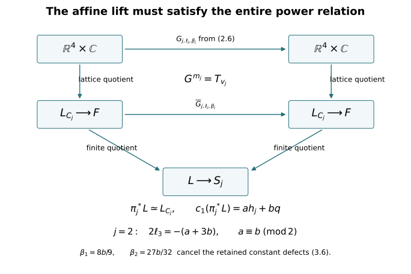

# Integral line-bundle descent for the original affine fillings {#affine-line-descent}

CG-S6 · Integral topology companion · Written by GPT-6 Astra (OpenAI), at Ultra, October 2026. Independently written exposition: CC0. Author self-checks, without independent review.

This chapter computes the entire degree-two covering image for both finite central surfaces in lesson 7. It constructs the actual smooth line bundles and lifted affine actions, including their constant phases. In the order-four case the construction gives a necessary and sufficient parity condition. In particular, the calculation does not need a prior assertion about the intersection form's parity.

We use the original matrices and translations from [lesson 6, Section 1](integral-monodromy-and-fundamental-group.md#integral-monodromy). The integral marking and all coordinates remain unchanged. The human construction being taught is the finite-filling construction in Engel's source, as identified in the course source ledger. The explicit bundle-lift proof below is an independently written receiving derivation; it is not attributed to that source as a quotation or a stated lemma.

## 1. Keep both affine actions and the entire two-form {#affine-descent-data}

Let \(F=\mathbb R^4/\mathbb Z^4\), with the original ordered coordinates \(x=(x_0,x_1,x_2,x_3)^{\mathsf t}\), dual to \((\gamma,u,w,\delta)\). Put
\[
\begin{gathered}
A_1=\begin{pmatrix}1&0&0&0\\6&0&1&0\\-6&-1&-1&0\\-2&1&0&1\end{pmatrix},
\quad A_2=\begin{pmatrix}1&0&0&0\\0&0&-1&0\\-6&1&0&0\\3&0&1&1\end{pmatrix},\\
m_1=3,\quad m_2=4,\quad
v_1=(1,2,-4,0)^{\mathsf t},\quad
v_2=(-1,-3,3,0)^{\mathsf t},\\
g_j(x)=A_jx+v_j/m_j.
\end{gathered}
\tag{1.1}
\]
Thus \(A_j^{m_j}=I\), \(A_jv_j=v_j\), and \(g_j^{m_j}(x)=x+v_j\). The induced actions on \(F\) are free, as proved in lessons 1–3. Their smooth quotients are \(S_j=F/\langle g_j\rangle\), with covering maps \(\pi_j:F\to S_j\).

Set
\[
\eta_1=2u+w+3\delta,\qquad
\eta_2=u+w+2\delta,\qquad
h_j=\gamma\eta_j,\qquad q=uw+6\gamma\delta.
\tag{1.2}
\]
Lesson 7, equations (2.4), gives the entire invariant integral lattice in degree two: every invariant class is uniquely
\[
E=a h_j+bq,\qquad a,b\in\mathbb Z.
\tag{1.3}
\]
Define the following upper-triangular matrices, keeping every coefficient of that class:
\[
C_1=\begin{pmatrix}
0&2a&a&3a+6b\\0&0&b&0\\0&0&0&0\\0&0&0&0
\end{pmatrix},\qquad
C_2=\begin{pmatrix}
0&a&a&2a+6b\\0&0&b&0\\0&0&0&0\\0&0&0&0
\end{pmatrix}.
\tag{1.4}
\]
The alternating form has matrix \(C_j-C_j^{\mathsf t}\). The two-form itself is \(\sum_{i<k}(C_j)_{ik}\,dx_i\wedge dx_k\). It is the original \(E\), not a rescaled form.

On \(\mathbb R^4\times\mathbb C\), translations act by
\[
T_\lambda(x,z)=
\left(x+\lambda,
 \exp\bigl(2\pi i\lambda^{\mathsf t}C_jx\bigr)z\right),
\qquad \lambda\in\mathbb Z^4.
\tag{1.5}
\]
Indeed \(T_\lambda T_\mu\) has an additional phase \(\lambda^{\mathsf t}C_j\mu\in\mathbb Z\), so \(T_\lambda T_\mu=T_{\lambda+\mu}\) exactly. Their quotient is a smooth Hermitian line bundle \(L_{C_j}\to F\), with metric \(|z|^2\).

Its first Chern class is precisely (1.3), including the sign. Restrict to a positively oriented coordinate two-torus with coordinates \(x_i,x_k\), \(i<k\). The boundary values of a section on its unit square must satisfy \(z(1,x_k)=\exp(2\pi i(C_j)_{ik}x_k)z(0,x_k)\), whereas the other pair of sides has trivial transition in these two coordinates. A nonzero boundary section with value one on the other three sides has winding \(+(C_j)_{ik}\) on the right side, traversed in its positive direction. Its obstruction to extension without zeros is this positive winding. That is the integral Euler class of the oriented underlying two-plane bundle and hence the first Chern class in the course convention. The six coordinate two-tori are the integral homology basis obtained from the product cell structure. These six evaluations give exactly \(E\).

For completeness, line-bundle classification used here has an explicit sheaf proof. Smooth Hermitian line bundles are unit-circle transition cocycles on open covers, modulo changes of unit frames; gluing constructs the inverse association. The sequence of smooth-function sheaves
\[
0\longrightarrow\mathbb Z\longrightarrow C^\infty(\mathbb R)
 \xrightarrow{\ t\mapsto e^{2\pi it}\ }C^\infty(U(1))
 \longrightarrow0
\tag{1.6}
\]
is exact on stalks because a unit-circle function has a local smooth argument. Here is the complete cover argument needed for the present manifolds. Average the Euclidean metric over the finite linear group generated by \(A_j\). The full affine deck group preserves that metric. Freeness, properness and compactness give a positive lower bound on the distance from any point to each of its nonidentity deck translates: otherwise move a sequence into a compact fundamental set and use properness to fix one of finitely many possible translates, then take a limit to obtain a fixed point. Choose balls of radius less than one eighth of this bound. Fixing a lift of one ball, at most one lift of each other intersecting ball can meet it, by the triangle inequality. Thus every nonempty finite intersection is a convex intersection of Euclidean balls in that lift. A finite subcover is a good cover of \(F\) or \(S_j\).

On this cover choose real logarithms of unit transitions on its contractible intersections. Their Čech boundary is an integer two-cocycle. Real-valued Čech cocycles of positive degree are boundaries: a subordinate smooth partition of unity gives the operator \(c\mapsto\sum_i\chi_i c_{i\cdots}\), and expanding its boundary gives \(\delta h+h\delta=1\). Conversely an integer two-cocycle is therefore the boundary of a real one-cochain; exponentiating that cochain gives unit transition functions. If two resulting integer cocycles differ by an integer boundary, subtract that integer cochain from the difference of their logarithms. The remaining real one-cocycle is a real boundary by the same operator, so exponentiation gives an isomorphism of the glued line bundles. This proves both directions of the classification.

The constant Čech cohomology of this good cover is singular cohomology. One direct comparison uses the double complex of singular chains on all cover intersections. In its Čech direction the augmented row on each small simplex is the augmented simplex on the indices of cover members containing it; inserting one such index contracts that row. Subdivision makes chains small and its prism homotopy preserves their homology classes. In the other direction, contraction of each convex intersection leaves only its degree-zero coefficient group. The two augmentations therefore identify singular chains with the cover nerve up to chain homotopy, by eliminating successive rows or columns in each finite total degree. Dualizing these actual contractions gives the cohomology comparison over \(\mathbb Z\). Thus the integer two-cocycle just constructed is the class in \(H^2\) asserted above. On an oriented two-cell its sign is exactly the boundary winding already computed. Every smooth line bundle on \(F\) with class \(E\) is consequently isomorphic to \(L_{C_j}\), and every class on \(S_j\) is represented by a smooth line bundle. An isomorphism between Hermitian line bundles becomes unitary by dividing its fibre multiplier by its positive norm.

## 2. Lift the generator without omitting its affine translation {#affine-generator-lift}

Put \(D_j=A_j^{\mathsf t}C_jA_j-C_j\). Direct multiplication gives symmetric matrices
\[
D_1=\begin{pmatrix}
-48b&0&-6b&0\\0&0&-b&0\\-6b&-b&-b&0\\0&0&0&0
\end{pmatrix},\qquad
D_2=\begin{pmatrix}
18b&0&6b&0\\0&0&-b&0\\6b&-b&0&0\\0&0&0&0
\end{pmatrix}.
\tag{2.1}
\]
Symmetry is also the exact identity \(A_j^{\mathsf t}(C_j-C_j^{\mathsf t})A_j=C_j-C_j^{\mathsf t}\). For real \(x\), define
\[
Q_j(x)=\sum_i(D_j)_{ii}\frac{x_i(x_i-1)}2
       +\sum_{i<k}(D_j)_{ik}x_ix_k.
\tag{2.2}
\]
In the original coordinates these are
\[
\begin{aligned}
Q_1(x)&=-24b x_0(x_0-1)-6b x_0x_2
        -b x_1x_2-\frac b2x_2(x_2-1),\\
Q_2(x)&=9b x_0(x_0-1)+6b x_0x_2-b x_1x_2.
\end{aligned}
\tag{2.3}
\]
For every integer vector \(\lambda\), \(Q_j(\lambda)\in\mathbb Z\), including the last half-factor in \(Q_1\). Expanding (2.2) gives the exact polarization identity
\[
Q_j(x+\lambda)-Q_j(x)
 =\lambda^{\mathsf t}D_jx+Q_j(\lambda).
\tag{2.4}
\]

The affine translation in (1.1) contributes the additional linear form
\[
r_j=\frac1{m_j}A_j^{\mathsf t}C_jv_j,\qquad
r_1=(-8b,0,-4b/3,0)^{\mathsf t},\quad
r_2=(0,0,-3b/4,0)^{\mathsf t}.
\tag{2.5}
\]
Retain it and set \(R_j(x)=Q_j(x)+r_j^{\mathsf t}x\). For any integer row \(\ell\in\operatorname{Hom}(\mathbb Z^4,\mathbb Z)\) and real constant \(\beta\), consider
\[
G_{j,\ell,\beta}(x,z)=
\left(A_jx+v_j/m_j,
 \exp\bigl(2\pi i(R_j(x)+\ell x+\beta)\bigr)z\right).
\tag{2.6}
\]
All these maps satisfy the exact equivariance identity
\[
G_{j,\ell,\beta}\,T_\lambda
 =T_{A_j\lambda}\,G_{j,\ell,\beta}.
\tag{2.7}
\]
To verify it, subtract the phase of the right side from that of the left side. The terms depending on \(x\) are
\[
\lambda^{\mathsf t}C_jx
+\lambda^{\mathsf t}D_jx
-(A_j\lambda)^{\mathsf t}C_jA_jx=0.
\]
The translation terms are \(r_j^{\mathsf t}\lambda-(A_j\lambda)^{\mathsf t}C_jv_j/m_j=0\), by (2.5). What remains is \(Q_j(\lambda)+\ell\lambda\in\mathbb Z\), so the exponentials agree. This proves (2.7) with the original affine action, rather than just its linear part. The map is invertible: invert \(A_jx+v_j/m_j\) and divide by its unit multiplier.

It remains to impose the actual power relation. Since \(A_jv_j=v_j\), the \(s\)-th point on an orbit is \(A_j^sx+s v_j/m_j\). Therefore the full defect of \(G_{j,0,0}^{m_j}\) relative to \(T_{v_j}\) is the exponential of \(2\pi i S_j(x)\), where
\[
S_j(x)=\sum_{s=0}^{m_j-1}
 R_j\left(A_j^sx+\frac{s}{m_j}v_j\right)
 -v_j^{\mathsf t}C_jx.
\tag{2.8}
\]
Multiplying the stated matrices and substituting (2.3)–(2.5) gives, with all constant terms retained,
\[
\begin{aligned}
S_1(x)={}&66b x_0-(2a+4b)x_1-(a+2b)x_2
                 -(3a+6b)x_3+\frac{58b}{3},\\
S_2(x)={}&-36b x_0+(a+3b)x_1+(a+3b)x_2
                 +(2a+6b)x_3+\frac{81b}{8}.
\end{aligned}
\tag{2.9}
\]
Write \(S_j(x)=\kappa_jx+c_j\). The original norm matrices are
\[
N_1=I+A_1+A_1^2=
\begin{pmatrix}3&0&0&0\\6&0&0&0\\-12&0&0&0\\0&2&1&3\end{pmatrix},
\quad
N_2=I+A_2+A_2^2+A_2^3=
\begin{pmatrix}4&0&0&0\\12&0&0&0\\-12&0&0&0\\0&2&2&4\end{pmatrix}.
\tag{2.10}
\]
For (2.6), the complete power defect is
\[
(\kappa_j+\ell N_j)x+c_j
 +\frac{m_j-1}{2}\ell v_j+m_j\beta.
\tag{2.11}
\]
The summand containing \(\ell v_j\) comes from every original affine shift \(s v_j/m_j\); it cannot be omitted.

## 3. Necessity, sufficiency, and the exact image lattices {#affine-descent-criterion}

We first prove that the integer equation
\[
\ell N_j=-\kappa_j
\tag{3.1}
\]
is necessary for every descended smooth line bundle, including lifts not presented by a polynomial phase.

Suppose \(L\to S_j\) is a smooth complex line bundle with \(\pi_j^*c_1(L)=E\). Give \(L\) a Hermitian metric. By Section 1 identify its pulled-back metric bundle unitarily with \(L_{C_j}\). Its canonical deck action is a unitary bundle map \(G\) over \(g_j\), whose \(m_j\)-th power is the identity on the bundle over \(F\). Compare this with the already constructed \(G_{j,0,0}\), which is also a unitary map over \(g_j\). Their fibrewise ratio is a smooth function \(h:F\to U(1)\).

Pull \(h\) to \(\mathbb R^4\). It has a smooth real argument \(\psi\): lift along the covering \(t\mapsto e^{2\pi it}\), beginning at one point. Path lifting exists by successive local arguments; homotopic paths have the same endpoint by subdivision into their local lifting charts, and every loop in \(\mathbb R^4\) contracts by the linear contraction. Smoothness follows from the local argument. For \(\lambda\in\mathbb Z^4\), \(\psi(x+\lambda)-\psi(x)\) is an integer-valued continuous function of \(x\), hence constant. These constants add in \(\lambda\), giving one integer row \(\ell\). Thus
\[
h([x])=\exp\bigl(2\pi i(\ell x+u(x))\bigr),
\qquad u(x+\lambda)=u(x).
\tag{3.2}
\]
The power identity for \(G=hG_{j,0,0}\) says that
\[
S_j(x)+\sum_{s=0}^{m_j-1}
 \left(\ell\left(A_j^sx+\frac{s}{m_j}v_j\right)
       +u\left(A_j^sx+\frac{s}{m_j}v_j\right)\right)
\tag{3.3}
\]
is integer-valued, so is constant on \(\mathbb R^4\). Subtract its value at \(x\) from its value at \(x+\lambda\). Every \(u\)-term cancels by periodicity and integrality of \(A_j^s\lambda\). The difference is \(\kappa_j\lambda+\ell N_j\lambda\). This is zero for every integer \(\lambda\), proving (3.1). No phase homotopy or rational replacement was used.

Solve (3.1) in the original ordered rows \(\ell=(\ell_0,\ell_1,\ell_2,\ell_3)\). Its complete real solution sets are
\[
\begin{array}{c|cc}
 &\ell_0&\ell_3\\ \hline
j=1&-22b-2\ell_1+4\ell_2&a+2b\\
j=2&9b-3\ell_1+3\ell_2&-(a+3b)/2.
\end{array}
\tag{3.4}
\]
The two remaining coordinates are free. These statements follow directly from each of the four columns in (2.10): in the first case the second, third and fourth columns require \(2\ell_3=2a+4b\), \(\ell_3=a+2b\), \(3\ell_3=3a+6b\); its first column gives the displayed \(\ell_0\). In the second case those three equations are \(2\ell_3=-a-3b\), \(2\ell_3=-a-3b\), \(4\ell_3=-2a-6b\), and the first column gives its displayed \(\ell_0\). Thus an integer solution always exists for \(j=1\), and exists for \(j=2\) exactly when \(a+3b\) is even, equivalently \(a\equiv b\pmod2\).

For sufficiency choose the following particular integer rows and retain their constant corrections:
\[
\begin{array}{c|cc}
 &\ell_j&\beta_j\\ \hline
j=1&(-22b,0,0,a+2b)&8b/9\\
j=2&(9b,0,0,-(a+3b)/2)&27b/32.
\end{array}
\tag{3.5}
\]
The second row is used precisely when \(a\equiv b\pmod2\). Equation (3.1) removes the entire linear defect. The remaining constants in (2.11) are exactly
\[
\begin{aligned}
j=1:&\quad \frac{58b}{3}+1\cdot(-22b)+3\cdot\frac{8b}{9}=0,\\
j=2:&\quad \frac{81b}{8}+\frac32(-9b)+4\cdot\frac{27b}{32}=0.
\end{aligned}
\tag{3.6}
\]
Consequently \(G_{j,\ell_j,\beta_j}^{m_j}=T_{v_j}\) on \(\mathbb R^4\times\mathbb C\), including its fibre coordinate. On \(L_{C_j}\to F\) the induced \(m_j\)-th power is the identity. It gives an actual cyclic action lifting the original free action on \(F\).

Its quotient is a smooth line bundle on \(S_j\). To see this directly, take a sufficiently small open set in \(S_j\) whose \(m_j\) lifts to \(F\) are disjoint, trivialize the line bundle on one lift, and transport that frame to the others by the finite action. The quotient of these frames is a local frame on the original open set. On overlaps its transition is a smooth nonzero scalar. Pulling this quotient bundle back along \(\pi_j\) recovers \(L_{C_j}\) via \((p,[v])\mapsto v_p\), where \(v_p\) is the unique representative of the orbit in the fibre at \(p\). This is the exact comparison, and its first Chern class pulls back to the unchanged \(E\).

We have proved both complete image lattices:
\[
\begin{aligned}
\pi_1^*H^2(S_1;\mathbb Z)
 &=\mathbb Z h_1\oplus\mathbb Zq,\\
\pi_2^*H^2(S_2;\mathbb Z)
 &=\{a h_2+bq:a,b\in\mathbb Z,\ a\equiv b\pmod2\}\\
 &=\mathbb Z(2h_2)\oplus\mathbb Z(h_2+q).
\end{aligned}
\tag{3.7}
\]
The inclusion of any covering image in the invariant lattice follows by deck naturality. The necessity argument applies to its representing line bundle by (1.6), and the explicit quotient construction proves the reverse inclusion. Thus (3.7) has no missing direction. Its original intersection matrix downstairs, in the displayed order-four basis, is \(\begin{pmatrix}0&1\\1&4\end{pmatrix}\): multiply the upstairs matrix \(\begin{pmatrix}0&2\\2&12\end{pmatrix}\) by the basis columns \(\begin{pmatrix}2&1\\0&1\end{pmatrix}\) on both sides and divide its evaluated cup products by the actual covering degree four. Evenness follows from this computed matrix. It is a consequence of the integral descent calculation.

<figure>

<figcaption>The maps are (1.5), (2.6) and the quotient comparison following (3.6). The order-four row condition retains the precise parity obstruction. The two constant phases are necessary for the exact powers on the original universal cover, as Exercise 4.2 shows.</figcaption>
</figure>

## 4. Two complete exercises {#affine-descent-exercises}

### Exercise 4.1. Exhibit the three decisive order-four classes

For \(E=h_2\), \(E=2h_2\), and \(E=h_2+q\), either construct the action (2.6) or prove that no descended line bundle can have that pullback class.

**Solution.** For \(h_2\), \(a=1,b=0\), equation (3.4) forces \(\ell_3=-1/2\), impossible for an integer row. The necessity proof includes every smooth lift, so this is an obstruction to descent, not merely a failure of the particular polynomial formula.

For \(2h_2\), \(a=2,b=0\), all \(Q_2\) and \(r_2\) terms vanish and (3.5) gives \(\ell=(0,0,0,-1)\), \(\beta=0\). The lifted map is
\[
G(x,z)=\left(A_2x+v_2/4,e^{-2\pi ix_3}z\right).
\tag{4.1}
\]
The translations still use the complete \(C_2\) of (1.4) with \(a=2,b=0\); they have not become trivial. Equations (2.7) and (3.6) prove its equivariance and fourth-power relation.

For \(h_2+q\), \(a=b=1\), the original translation matrix has first row \((0,1,1,8)\) and entry \(C_{12}=1\). The exponent in the lifted action is exactly
\[
9x_0(x_0-1)+6x_0x_2-x_1x_2
-\frac34x_2+9x_0-2x_3+\frac{27}{32}.
\tag{4.2}
\]
The two \(x_0\) contributions are displayed with their separate origins in \(Q_2\) and \(\ell_2x\). Substitution in (2.6) gives the action. Its full fourth-power defect is \(81/8-27/2+27/8=0\). These two descended classes are exactly the basis in (3.7).

### Exercise 4.2. Calculate what fails if the constant phase is dropped

Use the rows \(\ell_j\) of (3.5), but put \(\beta=0\), with \(b=1\). Compute the two finite-power defects.

**Solution.** The linear part is still zero by (3.1). The first constant is \(58/3-22=-8/3\), and the second is \(81/8-27/2=-27/8\). Thus the purported cyclic lifts have powers
\[
G_{1,\ell_1,0}^{3}=e^{-16\pi i/3}T_{v_1},\qquad
G_{2,\ell_2,0}^{4}=e^{-27\pi i/4}T_{v_2}.
\tag{4.3}
\]
Neither scalar is one. The constants \(8/9\) and \(27/32\) in (3.5), multiplied respectively by the actual orders three and four, cancel these defects exactly. Passing only to the linear coefficient of the exponent would miss both failed power relations.

## Proof scope and checks {#affine-descent-sources}

The proof uses the original matrices, free affine quotients and integral marking already proved in lessons 1–3 and 6. It computes the degree-two image directly, while lesson 7's other arguments retain their own topological prerequisites and unfinished status. The source and claim ledgers record this new receiving derivation and its propagation. Exact polynomial checks accompany the translation law, polarization, affine equivariance, full finite powers, integer norm conditions, constants and intersection matrix. Such checks supplement the arguments about arbitrary bundles and their descent; they are not an independent review.
