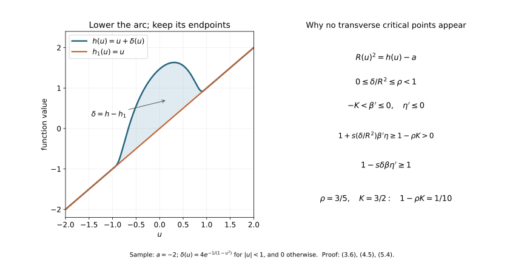

# Morse cancellation with the support and comparison maps retained {#morse-cancellation-provider}

CG-S6 · Smooth recognition companion · Written by GPT-6 Astra (OpenAI), at Ultra, October 2026. Independently written exposition: CC0.

The receiving result of this chapter is geometric cancellation: two adjacent critical points joined by exactly one transverse descending trajectory can be removed in a specified neighbourhood. In particular, a compact cobordism with just these two critical points is a product, with its lower boundary map fixed. This is one ingredient of lesson 7. It is not the full smooth \(h\)-cobordism theorem, and it does not calculate \(\Theta _6\).

The human source is François Laudenbach, [*A proof of Morse's theorem about the cancellation of critical points*, arXiv:1307.2545v1](https://arxiv.org/abs/1307.2545v1), Sections 1–3. Both original author TeX files were read in full. Its main geometric construction is used below. We supply an explicit transverse cutoff calculation for the critical-value change, and the compactness argument which makes the auxiliary disk fibres global. No claim about a unique birth–death parameter along our particular interpolation is needed or made.

## 1. The local coordinates are actual changes of variables {#morse-coordinate-comparison}

Let \(f\) be a smooth real function near \(0\in\mathbb R^n\), with \(df_0=0\) and nonsingular Hessian. Taylor's formula with its entire integral remainder gives

\[
f(v)-f(0)=v^{\mathsf t}Q(v)v,
\qquad
Q(v)=\int_0^1(1-t)\operatorname{Hess}f(tv)\,dt,
\qquad Q(0)=\tfrac12\operatorname{Hess}f(0).
\tag{1.1}
\]

Choose a fixed linear splitting into the negative and positive spaces of \(Q(0)\). Write \(v=(x,z)\) in that splitting, and retain all the variable blocks:

\[
Q(v)=
\begin{pmatrix}-A(v)&B(v)\\ B(v)^{\mathsf t}&C(v)\end{pmatrix},
\qquad S(v)=C(v)+B(v)^{\mathsf t}A(v)^{-1}B(v).
\tag{1.2}
\]

After restricting the neighbourhood, \(A\) and \(S\) are positive definite. Their positive square roots depend smoothly on \(v\). For completeness, the differential of \(R\mapsto R^2\) on symmetric matrices at a positive definite \(R\) is \(H\mapsto RH+HR\). In an orthonormal eigenbasis its \((i,j)\)-entry is multiplied by the strictly positive number \(r_i+r_j\). The inverse function theorem therefore constructs the square root smoothly near each positive matrix; uniqueness of the positive root makes these local constructions agree.

The coordinate map is

\[
y=A(v)^{1/2}\bigl(x-A(v)^{-1}B(v)z\bigr),
\qquad w=S(v)^{1/2}z.
\tag{1.3}
\]

Its derivative at zero is invertible. The inverse function theorem gives a local diffeomorphism, and direct multiplication, with the mixed terms retained, gives

\[
f(v)=f(0)-|y|^2+|w|^2.
\tag{1.4}
\]

Thus (1.4) is an exact pullback identity through (1.3), including the factor \(1/2\) in (1.1). If an already embedded negative disk is \(z=0\), and the restriction of \(f\) to it has its nondegenerate maximum at zero, choose the negative splitting tangent to that disk before (1.2). Formula (1.3) keeps that disk equal to \(w=0\). This is the relative coordinate choice used at the upper critical point below. The corresponding positive-disk version follows by applying the same calculation to \(-f\).

We also need a relative coordinate comparison away from critical points. Suppose two functions \(F,G\) agree on an embedded submanifold \(V\), and their common restriction has nonzero differential. Put \(F_s=(1-s)F+sG\). Locally choose a vector field \(T\) tangent to \(V\) there, extended to a neighbourhood, such that \(dF_s(T)>0\) for every \(0\leq s\leq1\). This can be done because on \(V\) all these differentials have the same strictly positive value; shrink the neighbourhood and use compactness of the parameter interval. Then

\[
Z_s=\frac{F-G}{dF_s(T)}\,T
\tag{1.5}
\]

vanishes on \(V\) and satisfies \(dF_s(Z_s)=F-G\). Local fields of this kind can be combined by a partition of unity: the equation is linear in the field and the weights sum to one. If \(F=G\) near a prescribed closed subset, choose zero there. On a sufficiently small neighbourhood, the time-dependent flow \(\Phi_s\) exists for \(0\leq s\leq1\), fixes \(V\), and obeys

\[
\frac{d}{ds}(F_s\circ\Phi_s)
=(G-F+dF_s(Z_s))\circ\Phi_s=0.
\tag{1.6}
\]

Consequently \(G\circ\Phi_1=F\). For a compact portion of \(V\), finitely many coordinate neighbourhoods and a smaller common neighbourhood give one such comparison. The assertion is about germs along that portion; it does not assert existence of the flow on an unrelated noncompact region.

## 2. The precise cancellation data {#morse-cancellation-data}

A descending field for \(f\) will mean a smooth vector field \(X\) with \(df(X)<0\) away from the critical points, equal to \((y,-w)\) in the coordinates (1.4) near each critical point. Its unstable manifold \(W^u(p)\) consists of trajectories tending to \(p\) in negative time, and its stable manifold \(W^s(q)\) consists of those tending to \(q\) in positive time. These manifolds can be constructed here without a separate stable-manifold theorem: take the local disks \(w=0\) and \(y=0\), respectively, and extend them by the flow. A trajectory tending to the critical point eventually stays in the coordinate neighbourhood; the equations \(\dot y=y,\dot w=-w\) force exactly the asserted vanishing of the transverse coordinate in the relevant time direction. Flow maps are local diffeomorphisms, so the continued disks are immersed smooth manifolds of the same dimensions. Their portions between fixed transverse levels used below are embedded by uniqueness of integral curves. In these coordinates the field has

\[
df(y,-w)=-2|y|^2-2|w|^2;
\tag{2.1}
\]

its unstable dimension is the index of the critical point. Such local fields extend to a descending field by a partition of unity, since strict negativity of \(df(X)\) is preserved by convex combinations away from the critical points.

Here are the hypotheses in the receiving cancellation theorem. The function has critical points \(p,q\) of respective indices \(k+1,k\), with \(f(p)>f(q)\). The manifolds \(W^u(p)\) and \(W^s(q)\) meet transversely in exactly one trajectory \(\ell\). There is a regular value \(a_0<f(q)\) such that every other descending trajectory in \(W^u(p)\) reaches \(f^{-1}(a_0)\). Fix an open set \(U\) containing the closure of the portion of \(W^u(p)\) above that original level. The critical points are isolated, and the local construction below is taken inside \(U\); other critical points of \(f\) may lie outside it.

For \(0\leq k\leq n-1\), these hypotheses imply the following statement:

**Theorem 2.1.** There is a smooth function \(F\), equal to \(f\) outside a compact subset of \(U\), with no critical points in the region where the two given critical points and their connecting trajectory are changed. No new critical points occur anywhere. There is a smooth interpolation from \(f\) to \(F\), fixed outside that same region.

When \(k=0\), the transverse negative variables below are absent. When \(k=n-1\), the transverse positive variables are absent. Empty sums, disks of dimension zero, and the associated absent derivatives are interpreted literally. The argument includes both cases.

## 3. Constructing the disk fibres, including their far ends {#morse-cancellation-fibres}

Choose disjoint small Morse neighbourhoods of \(p\) and \(q\). Retain \(a_0\), and choose a second regular value \(a=f(q)-\epsilon\), with \(0<\epsilon<f(q)-a_0\), sufficiently close to \(f(q)\) that the negative disk down to this level and the short positive cap used below lie within the \(q\)-chart. Every trajectory which reaches \(a_0\) crosses \(a\) first. Thus the same trajectory hypothesis holds at \(a\), and its truncated closure is still in the prescribed \(U\). At \(p\), split off the direction of \(\ell\) from its negative space; at \(q\), split it off from the positive space. With compatible signs along the connecting arc, their formulas are

\[
\begin{aligned}
f&=f(p)-t^2-|y|^2+|z|^2&&\text{near }p,\\
f&=f(q)+t^2-|y|^2+|z|^2&&\text{near }q,
\end{aligned}
\qquad y\in\mathbb R^k,\quad z\in\mathbb R^{n-k-1}.
\tag{3.1}
\]

Take a short negative-time continuation through \(p\) on the other side of its local unstable diameter, then the connecting trajectory, and finally a short continuation through \(q\) along the other side of its stable diameter. The first continuation reaches the level \(a\), by the hypothesis on the other trajectories. The resulting smooth embedded arc is denoted by

\[
\alpha:[0,1]\longrightarrow U,
\qquad h(u)=f(\alpha(u)).
\tag{3.2}
\]

Choose its parameter increasing in the indicated direction. It has precisely one local maximum at \(p\) and one local minimum at \(q\). It satisfies \(h(0)=a\), \(h(u)>a\) for \(u>0\), and \(h'>0\) near both endpoints. Its last endpoint lies just beyond \(q\), inside its Morse neighbourhood. The arc can be smoothed at the joins while retaining these properties: each join outside the two critical points lies in a flow box, where the level itself is a coordinate and the tangent line is already the same descending line.

We describe carefully the transverse manifold around this arc. Just above \(q\), its Morse handle has a level face parametrized by \(D^k\times S^{n-k-1}\); its belt sphere is \(\{0\}\times S^{n-k-1}\). The descending sphere from \(p\) meets this belt sphere at one transverse point. Compactness gives a sufficiently small tubular neighbourhood of the entire belt sphere in which there are no other sheets of that descending sphere. Near the intersection, the implicit function theorem writes its sheet as a graph over \(D^k\).

In a coordinate chart on the spherical factor write that graph as \(z=b(y)\), with \(b(0)=0\). The local map

\[
(y,z)\longmapsto (y,z-sb(y)),\qquad 0\leq s\leq1,
\tag{3.3}
\]

is a diffeomorphism where it is used, has inverse \((y,z)\mapsto(y,z+sb(y))\), and fixes the belt sphere there. A cutoff \(\chi(y,z)\) in a slightly larger spherical chart extends it to an isotopy. Shrink the \(y\)-disk so that \(|b(y)|\,|\partial_z\chi(y,z)|<1\) wherever the cutoff changes; this is possible because \(b(0)=0\). For each fixed \(y\), the map \(z\mapsto z-s\chi(y,z)b(y)\) is then an injective perturbation of the identity, with invertible derivative and compact support. It is onto: the map is proper, its image is closed, and local invertibility makes that image open in the connected Euclidean chart extended by the identity. The \(y\)-coordinate is unchanged, so these maps together give the required diffeomorphism. No bound on \(\partial_yb\) is needed. Thus the sheet is made a meridian without changing the belt sphere. Extend this isotopy through a collar of the level face. It is stationary near \(q\), so its Morse coordinates at the critical point are retained.

Use the meridian to attach the set \(z=0\) of the \(q\)-chart to the unstable disk descending from \(p\). On the entrance collar both sets have the same tangent model. A descending field can be chosen tangent to this union: on its two sides use the original descending field and the field in (3.1), and combine them in the collar. Their restrictions are tangent to the same submanifold and both strictly decrease \(f\), so the combined field has both properties. Outside the collar keep the original field.

Extend the remaining portions down to \(f=a\) by this field. This constructs a compact embedded \((k+1)\)-manifold \(W\) with corners. Its boundary consists of a lower part in \(f=a\) and an end cap beyond \(q\); these meet at their ordinary corner. Specifically take the end cap in the \(q\)-chart to be \(t=t_*>0,z=0\), extended down to \(f=a\); its restricted function is \(f(q)+t_*^2-|y|^2\). It is not a constant-level top face. The arc (3.2) lies in \(W\). There are no other critical points of \(f|_W\): on the flow pieces its derivative in the flow direction is strictly negative, and in the two Morse pieces this follows directly from (3.1). The local negative and positive indices on \(W\) are respectively \((k+1,0)\) at \(p\) and \((k,1)\) at \(q\).

Here are the compactness details used in this construction. Truncate the unstable manifold first at the upper face of the \(q\)-handle. Its part away from the small meridian is compact. Every point of this remaining compact set reaches \(f=a\) in finite time. The hitting time is smooth near each point because the final crossing is transverse; a finite cover bounds it on that compact set. The portion close to the meridian is supplied explicitly by (3.1). Uniqueness of integral curves prevents two flow pieces from crossing, and the graph description at the entrance gives the embedded smooth join. Shrinking the Morse handle and its collars keeps these compact pieces in \(U\), since their limiting compact set lies there. The only new end cap is the positive continuation just beyond \(q\).

Along the arc, apply the relative comparison (1.5)–(1.6), keeping the two Morse neighbourhoods fixed. It gives a small tubular neighbourhood of the arc in \(W\) with

\[
f|_W=h(u)-|y|^2.
\tag{3.4}
\]

There are no critical points of the common restriction on the portion requiring this comparison. Near the two critical points, (3.4) already holds by (3.1), so the vector field in (1.5) is set to zero there.

The coordinates in (3.4) must reach the lower ends of the disks, rather than merely describe a small neighbourhood of the arc. On that neighbourhood put \(Y=y\partial_y\). It strictly decreases \(f|_W\) off the arc. Extend it to a vector field on all of \(W\), tangent to the end cap, still with \(df(Y)<0\) off the arc. To do so, away from the arc choose any local direction of strict decrease; on the end cap choose a direction tangent to the cap, where its restricted function has only the maximum at the endpoint of the arc. Near that endpoint (3.4) supplies the direction. A partition of unity preserves tangency and strict decrease. At the lower boundary the field points outwards, because that boundary is a regular lowest level.

Every negative-time trajectory of \(Y\) stays in \(W\): it points inward at the lower boundary and is tangent to the end cap. It exists for all negative time by compactness. Choose a smaller tube about the arc in which the field is exactly \(y\partial_y\); this tube is invariant under negative time. On the compact complement, \(-df(Y)\) has a positive lower bound. If a negative-time trajectory never entered the tube, \(f\) would increase at at least that rate for arbitrarily long time, contradicting its boundedness on \(W\). Once it enters, its transverse coordinate is multiplied by \(e^{-s}\) in additional negative time \(s\), so it converges to a unique point of the arc. This proves, rather than assumes, the global disk-fibre description.

The limiting arc coordinate \(u\) is smooth off and on the arc. Away from it, flow to a fixed small transverse radius; the hitting time is smooth by transversality, and the flow and its inverse depend smoothly on initial data. In the tube it is already the coordinate \(u\). Carry the angular coordinate \(y/|y|\) along these flow lines and define its radius by

\[
r^2=h(u)-f(x).
\tag{3.5}
\]

This agrees with (3.4) near the arc and increases strictly along every outward trajectory. Each trajectory reaches the lower level in finite positive time: once outside the small tube the same compact lower bound applies until that crossing. Consequently the entire fibre has the exact radius

\[
R(u)^2=h(u)-a,
\qquad |y|^2\leq R(u)^2.
\tag{3.6}
\]

At \(u=0\) the fibre is a point. For \(u>0\) it is a closed \(k\)-disk. At \(u=1\) it is the end cap. These statements concern the displayed parametrization, with its pinched first fibre; smoothness near the first endpoint is read in the original coordinates of \(W\), not asserted from a rectangular parameter box.

The normal bundle of \(W\) is trivial. Indeed (3.5) contracts each disk to its centre and then the centre interval to a point. Parallel transport for any connection along this contraction identifies its fibres with one fixed vector space; one can equivalently do this on overlapping flow-coordinate pieces, using the contraction to extend a frame. The frames near the two critical points can be chosen compatibly along the intervening interval. Choose a tubular neighbourhood using this frame. On it compare \(f\) with \(f|_W+|z|^2\), holding the Morse neighbourhoods fixed, once more by (1.5)–(1.6). Its common restriction has nonzero differential everywhere else. This gives the exact formula

\[
f(u,y,z)=h(u)-|y|^2+|z|^2
\tag{3.7}
\]

on a neighbourhood of each compact portion of \(W\) away from its pinched first endpoint. That is sufficient: the change below is supported on such a compact portion, away from both endpoints and away from the lower boundary.

## 4. An increasing function below the original arc function {#morse-monotone-minorant}

We need a smooth function \(h_1\) satisfying

\[
h_1'>0,\qquad h_1\leq h,\qquad
h_1=h\text{ near }0\text{ and }1.
\tag{4.1}
\]

Here is a construction with the endpoint and inequality requirements checked. On the first increasing branch, choose a short interval whose entire range lies strictly below the local minimum value \(f(q)\). Keep \(h\) up to that interval and then replace its positive derivative by \(\rho h'\), where \(\rho\) decreases smoothly from one to zero, is strictly between zero and one in the interior, and is constant near the interval's ends. The resulting function becomes a constant \(b<f(q)\), remains below \(h\), and agrees with \(h\) at the first endpoint.

Keep that constant across the maximum and minimum. On the final increasing branch, join it to \(h\) by

\[
h_0=(1-\chi)b+\chi h,
\qquad
h_0'=\chi'(h-b)+\chi h',
\tag{4.2}
\]

where \(\chi\) increases smoothly from zero to one before the last endpoint. Both terms in its derivative are nonnegative, and the derivative is positive throughout the interior of the transition. Thus \(h_0\leq h\), equals \(h\) near the endpoints, and has nonnegative derivative everywhere. Its zero-derivative set is contained in a compact interval on which \(h-h_0\) is strictly positive.

To remove the flat interval, choose a smooth function \(q_+\geq0\) positive on a neighbourhood of that zero-derivative set, with compact support where \(h-h_0>0\). Choose \(q_-\geq0\), supported where also \(h_0'>0\), in the same open gap region. Scale \(q_-\) so that its integral equals that of \(q_+\), and put

\[
r(u)=\int_0^u(q_+(v)-q_-(v))\,dv,
\qquad h_1=h_0+\varepsilon r.
\tag{4.3}
\]

The function \(r\) is zero near both endpoints. All its support lies in a compact subinterval of the gap region. There \(h-h_0\) has a positive minimum. Choose \(\varepsilon>0\) small enough that \(\varepsilon|r|\) is below this minimum. On the support of \(q_-\), also require \(\varepsilon q_-<h_0'\); this is possible after choosing its support compactly inside the positive-derivative region. On the remaining set where \(h_0'>0\), the added derivative is nonnegative; on its zero set the added derivative is strictly positive. These estimates prove all of (4.1).

Let

\[
\delta(u)=h(u)-h_1(u)\geq0.
\tag{4.4}
\]

It is supported away from the endpoints. Because \(h_1\) is strictly increasing and \(h_1(0)=a\), equations (3.6) and (4.4) give

\[
0\leq\frac{\delta(u)}{R(u)^2}<1
\tag{4.5}
\]

on its support. By compactness there is one number \(\rho<1\) bounding these ratios. This quantitative gap is exactly what permits the supported transverse change without introducing critical points.

## 5. The full cutoff calculation {#morse-supported-cutoff}

Choose a constant \(K>1\) with \(\rho K<1\). There exists a nonnegative smooth function \(b\), compactly supported in \((0,1)\), of integral one and with \(\sup b<K\). For example, smooth the indicator of \([\epsilon,1-\epsilon]\), keep its support in \((0,1)\), and divide by its integral. Its maximum tends to one as \(\epsilon\) tends to zero, so a sufficiently small \(\epsilon\) gives the stated bound. Put

\[
\beta(v)=\int_v^1b(s)\,ds\quad(0\leq v\leq1),
\tag{5.1}
\]

and extend it constantly as one to the left and zero to the right. Then \(0\leq\beta\leq1\), it is one near zero and zero near one, and

\[
-K<\beta'\leq0.
\tag{5.2}
\]

Choose another smooth nonincreasing cutoff \(\eta\) of the nonnegative variable \(|z|^2\), equal to one near zero and zero outside a small fixed normal radius. Take that radius within the coordinate neighbourhood (3.7) on the compact set of \(u\)'s and \(y\)'s where the proposed change has support. Such a fixed radius exists by compactness. The cutoff \(\beta\) is already zero near the lower boundary, so this set stays away from the corners there.

For \(0\leq s\leq1\), define, in that neighbourhood,

\[
F_s(u,y,z)=h(u)-|y|^2+|z|^2
-s\delta(u)\,
\beta\!\left(\frac{|y|^2}{R(u)^2}\right)\eta(|z|^2).
\tag{5.3}
\]

Set \(F_s=f\) outside. This is smooth: its difference from \(f\) is zero near the arc endpoints, near the lower boundary of \(W\), and near the outside of the normal tube. The possibly pinched coordinate at \(u=0\) is never used where the difference is nonzero.

Write \(v=|y|^2/R(u)^2\) and \(w=|z|^2\). Its complete transverse derivatives are

\[
\begin{aligned}
\frac{\partial F_s}{\partial y_i}
&=-2y_i\left(1+s\frac{\delta(u)}{R(u)^2}\beta'(v)\eta(w)\right),\\
\frac{\partial F_s}{\partial z_j}
&=2z_j\left(1-s\delta(u)\beta(v)\eta'(w)\right).
\end{aligned}
\tag{5.4}
\]

The first parenthesis is at least \(1-\rho K>0\). The second is at least one. Thus all transverse derivatives can vanish simultaneously only at \(y=z=0\). On that axis,

\[
F_s(u,0,0)=h(u)-s\delta(u),
\qquad
\frac{\partial F_s}{\partial u}(u,0,0)=h'(u)-s\delta'(u).
\tag{5.5}
\]

There are no missing derivatives of \(R(u)\) in (5.5): the argument of \(\beta\) is zero on the axis and \(\beta\) is constant near zero. Likewise \(\eta\) is constant there. At \(s=1\), the last expression is \(h_1'(u)>0\). Therefore \(F_1\) has no critical points in the modified region. Off that region, the function and all its derivatives are unchanged. This proves Theorem 2.1.

The derivative estimate is useful even when the two critical values are far apart. A cutoff of arbitrary slope would not suffice: it could make the first parenthesis zero and create additional critical points. The factor \(R(u)^{-2}\), the full difference \(\delta(u)\), and the strict inequality \(\rho K<1\) are all used.

For the figure use the explicit example \(u\in[-2,2]\), \(a=-2\), \(h_1(u)=u\), and \(h(u)=u+\delta(u)\), where \(\delta(u)=4\exp(-1/(1-u^2))\) for \(|u|<1\) and zero otherwise. Every derivative of the exponential tends to zero at the two joining points: it is the exponential times a rational function whose denominator has finite order, and \(t^N e^{-t}\to0\) for every fixed \(N\). Thus the example is smooth and agrees with \(h_1\) near both outer endpoints. On its support, \(\delta\leq4/e<3/2\), while \(R^2=u+2+\delta\geq1+\delta\). Hence \(\delta/R^2<3/5\). The elementary bound \(e>8/3\) follows already from the first five terms of its positive series. Taking \(\rho=3/5\) and \(K=3/2\) gives the displayed transverse gap \(1/10\).

The sample also has exactly the required two critical points. For \(0<u<1\), write \(h'=1-g\), where \(g=8u(1-u^2)^{-2}\exp(-1/(1-u^2))\). Direct differentiation gives \((\log g)'=(1-3u^4)/(u(1-u^2)^2)\). Thus \(g\) increases and then decreases, tends to zero at both ends, and has a single strict maximum. Its value at \(u=1/2\) is \((64/9)e^{-4/3}>1\). To check the last inequality without a decimal approximation, \(e<3\) follows by comparing the tail of its series with a geometric series; then \(e^{4/3}<3^{3/2}<6<64/9\). The two solutions of \(g=1\) are on opposite sides of its strict maximum and have nonzero derivative. They give the nondegenerate maximum and minimum of \(h\). For \(u\leq0\), and for \(|u|\geq1\), its derivative is positive. The plotted samples illustrate these exact statements; their pixels are not the proof.

<figure>

<figcaption>A numerical illustration of the one-dimensional arc change, beside the exact transverse bounds in (5.4). The plotted curves are an example for teaching the mechanism; the theorem uses the original function through (3.2)–(5.5), including its actual disk radius. The source construction is Laudenbach, Sections 1–2; the explicit cutoff estimate is proved here.</figcaption>
</figure>

## 6. The exact product map after cancellation {#morse-product-map}

Suppose \((C;M_0,M_1)\) is a compact smooth cobordism, and \(f:C\to[0,1]\) equals the boundary collar coordinate near each boundary. Assume it has exactly two critical points and the transverse connecting-trajectory hypothesis above. A descending trajectory from the upper point, other than the one ending at the lower point, reaches \(M_0\). To verify this, an interior positive-time limit set is nonempty, compact and connected: it is the intersection of the nested compact connected closures of trajectory tails. The value of \(f\) is constant on it, since the decreasing values have a limit. It is invariant under the flow, so it cannot contain a regular point, where \(df(X)<0\) would contradict that constancy. A connected subset of the finite critical set is a single point. It cannot be the upper point because the value has already decreased below that critical value. Approaching the lower point is precisely membership in its stable manifold, and the unique such trajectory is the given one. A boundary limit instead enters its collar, where the descending field reaches the boundary in finite time. It is the lower boundary because the values decrease. Thus every other trajectory reaches \(M_0\). Choose a regular value \(a_0\) just above zero, and then the closer value \(a\) of Section 3.

Cancel the two points in the interior by Theorem 2.1. The resulting \(F:C\to[0,1]\) has no critical points and retains the two collar formulas. The range remains in \([0,1]\): (5.3) only decreases values, its minimum on each transverse disk remains bounded below by the old lowest level where the change vanishes, and more directly a value outside the boundary range would attain an interior extremum on compact \(C\), contradicting the absence of critical points.

Choose a smooth Riemannian metric and put

\[
V=\frac{\nabla F}{|\nabla F|^2}.
\tag{6.1}
\]

Then \(dF(V)=1\). Its flow \(\varphi_t\), starting at \(M_0\), exists until time one. Indeed, before reaching either boundary it stays in compact subregions of the interior; a finite-time limit is extendible by the ordinary local flow theorem. It cannot exit a boundary early because its value is exactly \(t\). At time one it meets \(M_1\), and the collar formula extends the flow to that time smoothly.

The map and its inverse are

\[
\begin{aligned}
\Psi:M_0\times[0,1]&\longrightarrow C,
&\Psi(x,t)&=\varphi_t(x),\\
\Psi^{-1}:C&\longrightarrow M_0\times[0,1],
&\Psi^{-1}(y)&=(\varphi_{-F(y)}(y),F(y)).
\end{aligned}
\tag{6.2}
\]

Uniqueness of integral curves verifies both inverse identities. Smooth dependence of the flow and the collar formulas verify smoothness up to the boundary. In particular \(\Psi(x,0)=x\): this is a product relative to the actual lower boundary inclusion. Its map \(\Psi|_{M_0\times\{1\}}\) is the actual remaining boundary diffeomorphism. Nothing in this proof asserts that an unrelated diffeomorphism of a sphere extends across a disk.

For lesson 7, (6.2) is the last step after one has geometrically arranged and cancelled every pair of handles. Obtaining those pairs from a simply connected acyclic cobordism still requires handle rearrangement, handle slides and the Whitney argument. Calculating the class of a six-dimensional homotopy sphere still requires the additional smooth sphere theorem. This companion supplies the cancellation and product-map parts only.

## 7. Two worked exercises {#morse-cancellation-exercises}

### Exercise 7.1. Keep every term in a variable-radius modification

Let \(R(u)>0\), \(\delta(u)\geq0\), \(v=|y|^2/R(u)^2\), \(w=|z|^2\), and use (5.3). Compute its full \(u\)-derivative, not just its value on the arc. Determine exactly why the radius derivative disappears on the arc.

**Solution.** The chain rule gives

\[
\frac{\partial v}{\partial u}
=-2\frac{R'(u)}{R(u)}v.
\tag{7.1}
\]

Consequently

\[
\frac{\partial F_s}{\partial u}
=h'(u)-s\delta'(u)\beta(v)\eta(w)
+2s\delta(u)\frac{R'(u)}{R(u)}v\beta'(v)\eta(w).
\tag{7.2}
\]

The last summand is present off the arc and is retained. On the arc, \(v=w=0\), \(\beta(0)=\eta(0)=1\), and \(\beta'(0)=0\). Thus (7.2) is precisely (5.5). To test for a critical point, first use the two independently positive parentheses in (5.4), which force \(y=z=0\). Only then use (7.2). Discarding its last summand everywhere would give an incorrect derivative even though it happens to vanish at the only possible critical points.

### Exercise 7.2. A cutoff can create an unwanted critical point

Consider the exact two-variable function

\[
G(y,z)=-y^2+z^2-d(1-y^2)^2
\tag{7.3}
\]

on a neighbourhood of \(|y|<1,z=0\), with \(d>0\). Locate the critical points and their Hessians when \(d>1/2\). Compare the result with the strict derivative bound in Section 5.

**Solution.** Its derivatives are

\[
G_y=-2y\bigl(1-2d+2dy^2\bigr),
\qquad G_z=2z.
\tag{7.4}
\]

For \(d>1/2\), there are three critical points:

\[
(0,0),\qquad
\left(\sqrt{1-\frac1{2d}},0\right),\qquad
\left(-\sqrt{1-\frac1{2d}},0\right).
\tag{7.5}
\]

The Hessian is diagonal, with entries

\[
G_{yy}=-2+4d-12dy^2,
\qquad G_{zz}=2.
\tag{7.6}
\]

At the origin both entries are positive. At either additional point, the first entry is \(4-8d<0\) and the second is positive. Thus the change has created two index-one critical points and changed the original point to a minimum. For the cutoff \(\beta(v)=(1-v)^2\), its derivative at zero is \(-2\); the first parenthesis in (5.4) at the origin is \(1-2d<0\). This is exactly the failed inequality. The polynomial example concerns the displayed local neighbourhood; it does not pretend that this polynomial is already a globally supported smooth cutoff. A smooth cutoff agreeing with it near the three points has the same three local critical points, so adding an outer support cutoff cannot repair this local defect.

