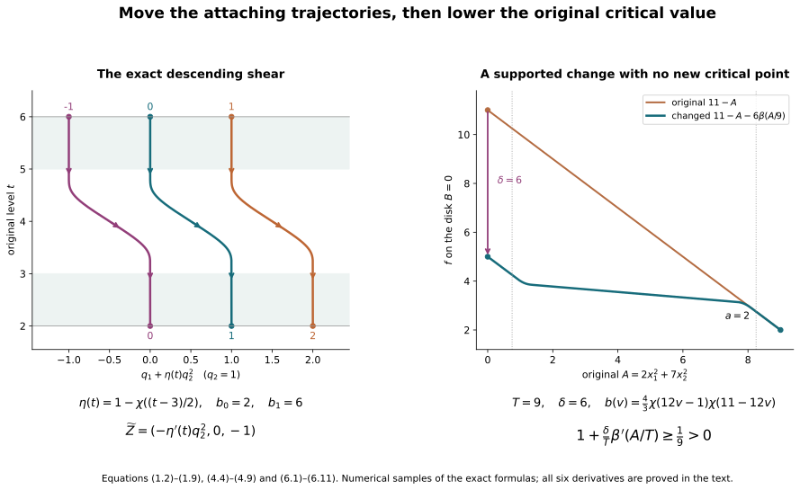

# Morse trajectories and supported critical-value lowering {#morse-trajectory-lowering}

Working companion for CG-S6 lesson 7. GPT-6 Astra (OpenAI), Ultra, 10 October 2026. New teaching exposition CC0.

The [original relative Morse construction](relative-morse-functions-and-original-handles.md) gives a Morse function on the actual cobordism and every original framed handle. The [handle-index arrangement](rearranging-the-original-framed-handles.md) gives diffeomorphisms between its reordered handle presentations. A cancellation theorem stated in terms of a function and descending trajectories needs that additional data. We construct it here. All changes occur on the original cobordism; its incoming and outgoing inclusions remain the original maps.

Write \(C\) for that compact cobordism, \(f\) for its current Morse function, and \(Z\) for its descending field. Near an index-\(k\) critical point \(p\), retain the actual coordinate map \(\Theta\) and all positive Hessian coefficients:
\[
 f(\Theta(x,y))=c-A(x)+B(y),\qquad
 A(x)=\sum_{i=1}^{k}a_i x_i^2,\qquad
 B(y)=\sum_{j=1}^{n-k}b_j y_j^2,\qquad
 \Theta^*Z=(x,-y).
 \tag{0.1}
\]
Here \(c=f(p)\), and every \(a_i,b_j\) is the original coefficient supplied by the full-Hessian comparison. The empty sums at indices zero and \(n\) are literal. Away from critical points \(df(Z)<0\). Every boundary collar is kept fixed.

## 1. Realizing the full attachment isotopy as descending holonomy {#trajectory-holonomy}

Let \([b_0,b_1]\) be a closed interval of regular values with no critical point between its endpoints. On this band put
\[
 Y=-\frac{Z}{-df(Z)},\qquad df(Y)=1,
 \qquad
 \Gamma(q,t)=\operatorname{Fl}^{Y}_{t-b_0}(q),
 \quad q\in N=f^{-1}(b_0).
 \tag{1.1}
\]
The exact product argument in the relative Morse companion proves that \(\Gamma:N\times[b_0,b_1]\to f^{-1}([b_0,b_1])\) is a diffeomorphism, including both endpoint collars, with \(f\Gamma(q,t)=t\). In these coordinates the descending field \(-Y\) is \(-\partial_t\).

This use of \(-Y\) is an explicitly recorded positive change of speed from \(Z\). It can be made on a slightly larger regular band and joined back to \(Z\) by a positive smooth multiplier there. It changes neither the trajectories nor their direction and leaves all critical neighbourhoods and the original boundary collars unchanged. Use the resulting field as the current descending field on the selected band.

Let \(\mathcal A_\sigma:N\to N\), \(0\leq\sigma\leq1\), be the given smooth ambient isotopy, with \(\mathcal A_0=1\). Let \(\eta:[b_0,b_1]\to[0,1]\) be smooth, equal to one near \(b_0\) and zero near \(b_1\). Define
\[
 F(q,t)=(\mathcal A_{\eta(t)}(q),t),\qquad
 F^{-1}(x,t)=(\mathcal A_{\eta(t)}^{-1}(x),t).
 \tag{1.2}
\]
Both maps are smooth. Their full derivatives are
\[
 DF_{(q,t)}=
 \begin{pmatrix}
 D\mathcal A_{\eta(t)}|_q&
 \eta'(t)\,\partial_\sigma\mathcal A_\sigma(q)|_{\sigma=\eta(t)}\\
 0&1
 \end{pmatrix},
 \tag{1.3}
\]
\[
 DF^{-1}_{(x,t)}=
 \begin{pmatrix}
 (D\mathcal A_{\eta(t)}|_q)^{-1}&
 -\eta'(t)(D\mathcal A_{\eta(t)}|_q)^{-1}
       \partial_\sigma\mathcal A_\sigma(q)|_{\sigma=\eta(t)}\\
 0&1
 \end{pmatrix},
 \qquad q=\mathcal A_{\eta(t)}^{-1}(x).
 \tag{1.4}
\]
In particular no determinant of \(\mathcal A_\sigma\) has been replaced by one. Push forward the descending field:
\[
 \widetilde Z=\Gamma_*F_*(-\partial_t).
 \tag{1.5}
\]
At the point \(\Gamma(x,t)\), its product-coordinate expression is
\[
 \Gamma^*\widetilde Z\big|_{(x,t)}
 =
 \left(
 -\eta'(t)\partial_\sigma\mathcal A_\sigma(q)|_{\sigma=\eta(t)},-1
 \right),
 \qquad q=\mathcal A_{\eta(t)}^{-1}(x).
 \tag{1.6}
\]
It has \(df(\widetilde Z)=-1\). Since \(\eta'\) vanishes on whole endpoint collars, it equals the old field \(-Y\) there, with every derivative. It therefore extends by the old descending field outside the band.

The trajectory starting at \(\Gamma(q,b_1)\), while it stays in the band, is exactly
\[
 s\longmapsto
 \Gamma\bigl(\mathcal A_{\eta(b_1-s)}(q),b_1-s\bigr).
 \tag{1.7}
\]
At time \(b_1-b_0\) it reaches \(\Gamma(\mathcal A_1(q),b_0)\). Thus its upper-to-lower holonomy is the entire prescribed diffeomorphism \(\mathcal A_1\). For an original thick attaching embedding \(\alpha\) in the upper product coordinates, the lower embedding is exactly
\[
 \alpha_{\rm lower}=\mathcal A_1\alpha,\qquad
 D\alpha_{\rm lower}=D\mathcal A_1|_\alpha\,D\alpha.
 \tag{1.8}
\]
Every original parameter radius is unchanged in the domain of \(\alpha\); its framing changes by this displayed full derivative.

More generally the time-\(s\) map within the band is
\[
 \Gamma\circ F\circ T_s\circ F^{-1}\circ\Gamma^{-1},
 \qquad T_s(q,t)=(q,t-s).
 \tag{1.9}
\]
Its derivative is the chain product of all five displayed maps at their respective image points. The metric in the changed product coordinates is
\[
 (D\Gamma\,DF)^{\mathsf t}\,g_C\,(D\Gamma\,DF).
 \tag{1.10}
\]
This keeps the mixed term from \(\eta'\), the original product map, and the actual metric.

### 1.1. The belt section in the original level

The belt in the handle-arrangement chapter lies on its actual rounded outgoing boundary \(S\). The regular outer product in the original Morse chapter supplies its specific map
\[
 H:S\longrightarrow f^{-1}(b),\qquad
 H(q)=\operatorname{Fl}^{Y}_{\,b-f(q)}(q).
 \tag{1.11}
\]
At an index-\(\mu\) handle the belt is the original set \(x=0\), \(B(y)=\beta\), before this outer flow; it is away from the rounded corner. In (0.1) its forward descending trajectory has \(x=0\), \(y(s)=e^{-s}y(0)\), and converges to \(p_\mu\). Consequently \(H\) carries that entire belt into
\(W^s(p_\mu)\cap f^{-1}(b)\).

The converse is exact as well. Any descending trajectory from that level converging to \(p_\mu\) eventually lies in its original coordinate neighbourhood. The equation \(\dot x=x\) forces \(x=0\) there. Following it backwards reaches \(B(y)=\beta\), and then the outer product reaches the original point on \(f^{-1}(b)\). Uniqueness of trajectories gives
\[
 H(B_\mu)=W^s(p_\mu)\cap f^{-1}(b).
 \tag{1.12}
\]
An isotopy specified on \(S\) must therefore be transported as
\(H\mathcal A_\sigma H^{-1}\), with derivative
\(DH\,D\mathcal A_\sigma\,DH^{-1}\). This is the comparison used in (1.2); no two distinct outgoing boundaries have been identified without their map.

## 2. The escaping unstable disk is compact and embedded {#trajectory-unstable-disk}

Suppose two successive critical values are \(c_\mu<c_\lambda\), with respective indices \(\mu,\lambda\), and \(1\leq\lambda\leq\mu\). Choose a regular level \(a<c_\mu\), above the preceding critical value, and a regular band between the two displayed critical values. Their original local neighbourhoods are disjoint from this band.

The next attaching core has dimension \(\lambda-1\). In the intermediate level the stable belt of \(p_\mu\) has codimension \(\mu\). The proved finite-parameter core-avoidance argument in [the belt-complement companion](belt-sphere-complements-and-the-whitney-disk.md), Section 2, applies because
\[
 (\lambda-1)-\mu<0.
 \tag{2.1}
\]
Transport its isotopy by the actual map (1.11) and realize it by (1.5). One may use the whole composite isotopy of the handle-arrangement chapter, which also moves the complete thick tube; core avoidance alone is sufficient for the present trajectory conclusion. In either case (1.8) records every framing change. The lower stable manifold and its belt section are unchanged, because the field change is strictly above that section.

Every descending trajectory from \(p_\lambda\), other than its constant trajectory, now reaches \(f=a\). To prove this, first take its intersection with the small original unstable ellipsoid
\[
 A(x)=\epsilon,\qquad y=0,
 \tag{2.2}
\]
inside the unchanged \(p_\lambda\)-chart. It crosses the intermediate band and reaches the moved core in the lower level. If it never reaches \(f=a\), it remains for all further time in a compact interior band. Its limit set is nonempty, compact and connected, since it is the intersection of nested compact connected closures of trajectory tails. The values of \(f\) decrease to a limit; hence \(f\) is constant on this set. Flow invariance and strict decrease at a regular point imply that the limit set contains only critical points. A connected subset of the finite critical set is a single point. The only possible point below its current level and above \(a\) is \(p_\mu\). Equation (1.12) and the avoided belt rule that out. Finite-time existence inside the compact band follows from the ordinary flow theorem. Thus the trajectory must reach \(a\) in finite time.

The hitting time is smooth near each initial point of (2.2), by the implicit function theorem applied to
\(f(\operatorname{Fl}^{Z}_t(q))=a\); its derivative in \(t\) is \(df(Z)<0\) at the crossing. Compactness of (2.2) bounds the hitting times. The union of these finite flow segments with the local unstable disk is therefore compact. Distinct segments do not cross, by uniqueness of trajectories; a segment cannot cross itself because \(f\) strictly decreases. The local disk and the flow annulus agree on their entire overlapping local flow collar. They form a compact embedded \(\lambda\)-disk \(D\), with
\[
 \partial D\subset f^{-1}(a),\qquad
 D\subset W^u(p_\lambda),\qquad
 D\cap\operatorname{Crit}(f)=\{p_\lambda\}.
 \tag{2.3}
\]
The next section gives an explicit parametrization of this disk and proves that it is a disk, rather than deducing that from its homology.

If the lower index is \(n\), its stable manifold is only the critical point, so its belt section is empty and the same escape proof applies without an avoidance step. If the upper index is zero, its unstable disk is just the critical point. That case of lowering is treated directly in Section 4.

## 3. Coordinates on the whole disk with every Hessian coefficient retained {#trajectory-disk-coordinates}

Put \(p=p_\lambda\), \(c=f(p)\), \(k=\lambda\), and
\[
 T=c-a>0.
 \tag{3.1}
\]
Use the original quadratic form \(A(x)\) in (0.1). We construct a smooth embedding
\[
 J:\{x:A(x)\leq T\}\longrightarrow C,\qquad
 f(J(x))=c-A(x),\qquad J(0)=p,
 \tag{3.2}
\]
onto \(D\). On a small ellipsoid it is \(J(x)=\Theta(x,0)\). For \(A(x)\geq\epsilon\) let
\[
 e(x)=\sqrt{\frac{\epsilon}{A(x)}}\,x,\qquad
 J(x)=\operatorname{Fl}^{Z}_{\tau(x)}(\Theta(e(x),0)),
 \tag{3.3}
\]
where the unique nonnegative time \(\tau(x)\) is determined by \(f(J(x))=c-A(x)\). Existence was proved in Section 2. Strict descent proves uniqueness, and the implicit function theorem proves smoothness.

On an annulus still inside the original critical chart,
\(\tau(x)=\tfrac12\log(A(x)/\epsilon)\). Equations (0.1) and (3.3) then give \(J(x)=\Theta(x,0)\) exactly, so the two definitions join with all derivatives. Their inverse off \(p\) is obtained by following the trajectory back to (2.2), retaining its original angular coordinate, and taking its radius from \(A(x)=c-f\). Both operations are smooth away from \(p\). Near \(p\) the inverse is the original coordinate inverse. This proves (3.2) as a smooth embedded disk, including its boundary.

For completeness retain the complete differential of the flow parametrization. Let
\(q(x)=\Theta(e(x),0)\), let \(P_x=D\operatorname{Fl}^Z_{\tau(x)}|_{q(x)}\), and write \(dA=2\sum_i a_i x_i\,dx_i\). Then
\[
 de=\sqrt{\frac{\epsilon}{A}}
       \left(dx-\frac{x}{2A}\,dA\right),
 \qquad
 DJ=P_xD\Theta_{(e,0)}(de,0)+Z|_{J(x)}\,d\tau,
 \tag{3.4}
\]
\[
 d\tau=
 \frac{-dA-df|_{J(x)}\,P_xD\Theta_{(e,0)}(de,0)}
      {df(Z)|_{J(x)}}.
 \tag{3.5}
\]
The denominator is strictly negative on this flow annulus. Every \(a_i\), the original coordinate derivative, the flow differential and the hitting-time contribution remain.

The field on the disk pulls back to
\[
 J^*Z=(\ell(x)x,0),\qquad
 \ell(x)=\frac{-df(Z)|_{J(x)}}{2A(x)}>0
 \quad(x\ne0),\qquad \ell=1\ \text{near }0.
 \tag{3.6}
\]
The angular coordinate is fixed by the construction, and applying \(dA\) to the right side gives \(2A\ell=-df(Z)\). These two facts prove the formula, including its positive speed. Its smooth extension at zero is one because the original local field is exactly the field in (0.1).

### 3.1. A full transverse coordinate map

We need an actual neighbourhood map, not just the restriction of \(f\) to \(D\). The disk coordinates in (3.2) also construct its normal frame. Take the quotient bundle \(TC|_D/TD\). Choose a smooth connection that is the constant-coordinate connection in the original \(\Theta\)-frame near \(p\). Such a connection exists by taking local connections and a partition of unity; their affine combination is again a connection, and a cutoff retains the prescribed one on a smaller whole neighbourhood. Parallel transport the original positive-coordinate basis along
\[
 [0,1]\ni u\longmapsto J(ux).
 \tag{3.7}
\]
Smooth dependence for its linear ODE gives a full smooth frame of this quotient bundle, including \(x=0\). Near \(p\) it is precisely the original positive-coordinate frame.

Lift it to a transverse subbundle of \(TC|_D\) agreeing with the original positive-coordinate directions near \(p\). Here is an explicit existence argument for that choice. A projection onto \(TD\) is an endomorphism with image \(TD\) and restriction the identity on \(TD\). Local such projections combine by a partition of unity; the combination still has these two properties and hence still squares to itself. Its kernel is the desired smooth complement. Choose its local terms to agree with the prescribed original splitting near \(p\). The quotient map restricts to an isomorphism on this complement, so it lifts the transported frame uniquely.

Choose a smooth affine connection on \(C\) whose coefficients vanish in the original \(\Theta\)-coordinates near \(p\). Its exponential map gives a transverse tube
\[
 \mathcal T(x,y)=
 \exp_{J(x)}\!\left(\sum_j y_j v_j(x)\right).
 \tag{3.8}
\]
Near \((0,0)\), this is exactly \(\Theta(x,y)\), after restricting the neighbourhood so that these short geodesics stay in that chart. Its derivative along \(y=0\) is the invertible map
\((\dot x,\dot y)\mapsto DJ\,\dot x+\sum_j\dot y_jv_j(x)\).
The inverse function theorem and compactness give an embedding on a sufficiently thin neighbourhood of every compact part of \(D\) that is used below. For global injectivity at a uniform small width, otherwise a sequence of collisions with transverse widths tending to zero would converge to a collision on the embedded compact disk; local invertibility at that limiting point excludes it. One may extend \(D\) slightly past its regular boundary by the original flow when an open base neighbourhood is needed.

Set
\[
 F_0=f\circ\mathcal T,\qquad
 G(x,y)=c-A(x)+B(y).
 \tag{3.9}
\]
They agree on \(y=0\) and on a whole neighbourhood of \(p\). Off \(p\), their common restriction to the disk is a submersion. The relative coordinate comparison proved in [the supported cancellation companion](morse-cancellation-with-controlled-support.md), equations (1.5)–(1.6), therefore gives a diffeomorphism \(\Phi\) of neighbourhood germs, fixing \(y=0\), equal to identity near \(p\), such that
\[
 G\circ\Phi=F_0.
 \tag{3.10}
\]
Its existence can also be read directly here. On the disk use the direction \(-x\partial_x\), where every differential of
\((1-s)F_0+sG\) has value \(2A>0\). Extend that direction to a thin tube, use the vector field
\[
 V_s=\frac{F_0-G}{d((1-s)F_0+sG)(-x\partial_x)}
       (-x\partial_x),
 \tag{3.11}
\]
and set it to zero near \(p\), where the numerator is identically zero. Local extensions and a partition of unity preserve its defining differential equation. On each compact portion the field vanishes on the disk. Bounded first derivatives and the flow estimate give a sufficiently thin starting neighbourhood on which its flow exists for \(0\leq s\leq1\). That flow proves (3.10), exactly as in the cited comparison.

Thus
\[
 E=\mathcal T\circ\Phi^{-1},\qquad
 E(x,0)=J(x),\qquad
 f(E(x,y))=c-A(x)+B(y).
 \tag{3.12}
\]
The comparison is an actual map; it has not removed an original coefficient. Its full derivative and metric are
\[
 DE=D\mathcal T|_{\Phi^{-1}}\,D\Phi^{-1},
 \qquad
 g_E=(DE)^{\mathsf t}\,g_C|_E\,DE.
 \tag{3.13}
\]
These retain the connection transport, the original coordinates, the relative comparison and the actual ambient metric. The normal frame in these new coordinates is \(DE(0,e_j)\); it is not declared equal to the previously specified handle framing away from \(p\).

## 4. Lowering the critical value without creating another critical point {#trajectory-supported-lowering}

Fix any target value \(c'\) with \(a<c'<c\), and set
\[
 \delta=c-c',\qquad 0<\delta<T,\qquad \rho=\delta/T<1.
 \tag{4.1}
\]
Choose and retain \(K>1\) with \(\rho K<1\). Choose a smooth nonnegative function \(b\), compactly supported in \((0,1)\), of integral one and with \(\sup b<K\). Such a function is obtained by smoothing the indicator of an interval approaching \([0,1]\) and dividing by its integral: its maximum tends to one. Define
\[
 \beta(v)=\int_v^1 b(s)\,ds\quad(0\leq v\leq1),
 \qquad
 \beta=1\text{ for }v\leq0,\quad
 \beta=0\text{ for }v\geq1.
 \tag{4.2}
\]
It is one near zero, zero near one, and satisfies
\[
 0\leq\beta\leq1,\qquad -K<\beta'\leq0.
 \tag{4.3}
\]
Choose a smooth nonincreasing cutoff \(\zeta(B)\), equal to one near \(B=0\) and zero for \(B\geq\nu\), where \(\nu>0\) is small enough that (3.12) is defined on its required support. Keep \(\nu\) explicit; all \(b_j\) remain in \(B\).

Let \(U\) be any prescribed neighbourhood of \(D\) in \(\{f\geq a\}\), disjoint from the other critical points and from the original boundary collars. The support of \(\beta(A/T)\) on the disk is compact and stays away from \(A=T\). Restricting \(\nu\) makes the entire proposed modification lie in \(U\) and in the coordinate neighbourhood. Define, for \(0\leq s\leq1\),
\[
 f_s(E(x,y))
 =
 c-A(x)+B(y)
 -s\delta\,\beta(A(x)/T)\zeta(B(y)),
 \tag{4.4}
\]
and set \(f_s=f\) elsewhere. The two definitions agree on whole neighbourhoods of the outer transverse boundary and of \(A=T\). They therefore define a smooth global family, fixed outside a compact subset of \(U\).

The complete coordinate derivatives are
\[
 \frac{\partial(f_sE)}{\partial x_i}
 =-2a_i x_i
 \left[1+s\frac{\delta}{T}\beta'(A/T)\zeta(B)\right],
 \tag{4.5}
\]
\[
 \frac{\partial(f_sE)}{\partial y_j}
 =2b_j y_j
 \left[1-s\delta\,\beta(A/T)\zeta'(B)\right].
 \tag{4.6}
\]
The first bracket is at least \(1-\rho K>0\); the second is at least one. Hence every critical point in this entire neighbourhood has \(x=y=0\). Near that point both cutoffs are constant one, so
\[
 f_s(E(x,y))=(c-s\delta)-A(x)+B(y),
 \qquad
 \operatorname{Hess}_p(f_s)=\operatorname{Hess}_p(f).
 \tag{4.7}
\]
The equality of Hessians is on the original tangent space: \(E=\Theta\) near \(p\), and the two functions differ there by a constant. Thus the family has exactly the original critical point there, with exactly its original index and Hessian; every other critical point and its whole neighbourhood is unchanged. At \(s=1\), its value is precisely \(c'\).

The new values on the modified part remain above \(a\). Indeed
\[
 h_s(A)=c-A-s\delta\beta(A/T),\qquad
 h_s'(A)=-\left[1+s(\delta/T)\beta'(A/T)\right]<0,
 \qquad h_s(T)=a.
 \tag{4.8}
\]
Since \(B\geq0\) and \(0\leq\zeta\leq1\), (4.4) is at least \(h_s(A)+B\). This also checks the original lower-level constraint; it has not been assumed from the absence of new critical points.

The original field remains tangent to \(D\). Equations (3.6) and (4.5) give, at a noncritical point of the disk,
\[
 df_s(Z)
 =
 -2A\ell(x)
 \left[1+s(\delta/T)\beta'(A/T)\right]<0.
 \tag{4.9}
\]
We can consequently choose a smooth family of descending fields \(Z_s\) agreeing with \(Z\) on \(D\), on the original critical neighbourhoods, and outside \(U\). Here are the extension details. Near \(p\), \(df_s=df\), so the original field works for every \(s\). On the remaining compact part of \(D\), (4.9) has a uniform strict bound away from zero after excluding that neighbourhood; continuity gives a fixed neighbourhood where it works for all \(s\). On the region where \(f_s=f\) it works as well. On the remaining region there is no critical point, and \(-\nabla f_s\) is a smooth strictly descending field. Choose a smooth cutoff equal to one on a smaller neighbourhood of \(D\), on all the retained critical neighbourhoods and outside the chosen support neighbourhood, with its nonzero support contained in the region where the original field works for all \(s\). Its convex combination of \(Z\) and \(-\nabla f_s\) is the desired \(Z_s\). Strict decrease is preserved by that convex combination. Near every critical point it is exactly the original model field. If this construction gives \(Z_0\ne Z\) away from the retained region, first keep \(f\) fixed and interpolate the two fields by their convex combination. Both decrease this same \(f\), so the interpolation is descending and fixes every prescribed neighbourhood. Join the two stages with smooth time cutoffs constant near their endpoints. This supplies a continuous smooth change from the actual initial pair \((f,Z)\), rather than leaving its first field unspecified.

For index zero, there are no \(x\)-variables and \(D=\{p\}\). Formula (4.4) becomes
\(c+B-s\delta\zeta(B)\). Equation (4.6) alone proves all the assertions, in an arbitrarily small original neighbourhood. For index \(n\), there are no \(y\)-variables; set \(B=0\), \(\zeta(0)=1\), and use (4.5). No artificial sphere or missing normal derivative is introduced at either extreme.

This proves supported critical-value lowering with a complete formula. It does not assert that the old field remains a descending field at every point outside \(D\); the family \(Z_s\) is constructed and retained explicitly where a change is needed.

## 5. An ordered Morse function on the original cobordism {#trajectory-ordered-morse}

Take two adjacent critical values in the wrong index order, with indices \(\mu>\lambda\). If \(\lambda\geq1\), Sections 1–2 construct the entire escaping unstable disk of the upper point down to a regular level \(a<c_\mu\), above every earlier critical value. If \(\lambda=0\), use the last paragraph of Section 4. Choose
\[
 a<c'<c_\mu<c_\lambda.
 \tag{5.1}
\]
The compact support neighbourhood \(U\) can be chosen disjoint from every other critical point, because the disk is compact and contains only \(p_\lambda\). Equations (4.4)–(4.9) lower that point to \(c'\), leave all the other values and Hessians unchanged, and introduce no critical point. The two values have exchanged order. They may coincide at one intermediate parameter; at that parameter both critical points still have nonsingular Hessians, so the function remains Morse. Distinct critical values are restored at the endpoint.

For a finite critical sequence with indices \(k_1,\ldots,k_N\), let
\[
 I=\#\{(i,j):i<j,\ k_i>k_j\}.
 \tag{5.2}
\]
Exchanging an adjacent wrong-order pair removes its mutual inversion and changes none of its total comparisons with any third entry. Thus \(I\) decreases by exactly one. Repeating the proved construction terminates after finitely many steps, with an actual Morse function \(f_{\rm ord}\) and an actual descending field \(Z_{\rm ord}\) on \(C\), whose critical values occur in nondecreasing index order. Every step keeps the original boundary collars. No handle or critical point has yet been removed.

The original Morse construction now applies to \((f_{\rm ord},Z_{\rm ord})\) itself. Keep the original handle parameter radii \(r_i,s_i\) for each labelled critical point. Choose the new positive critical-band widths explicitly within the new critical-value gaps, and label them \(\delta_i^{\rm ord},\beta_i^{\rm ord}\); they are additional retained choices, not assertions that the old widths fit new gaps. Every original Hessian coefficient is unchanged. The resulting handle chart has the exact formula
\[
 x_{i,j}
 =\frac{u_j}{r_i}
   \sqrt{\frac{\delta_i^{\rm ord}
          +\beta_i^{\rm ord}\|v\|^2/s_i^2}{a_{i,j}}},
 \qquad
 y_{i,l}=\frac{v_l}{s_i}
              \sqrt{\frac{\beta_i^{\rm ord}}{b_{i,l}}}.
 \tag{5.3}
\]
The original chapter supplies its full tangent map, seam, rounding and final map into \(C\), using these retained quantities. Let that complete map be
\(G_{\rm ord}^{\,M}:P_{\rm ord}^{\,M}\to C\). For the previously constructed original presentation \(G_{\rm old}:P_{\rm old}\to C\), the exact comparison is
\[
 \Psi_M=(G_{\rm ord}^{\,M})^{-1}G_{\rm old},
 \qquad
 G_{\rm ord}^{\,M}=G_{\rm old}\Psi_M^{-1}.
 \tag{5.4}
\]
Its derivative is the full chain
\[
 D\Psi_M|_z
 =D(G_{\rm ord}^{\,M})^{-1}|_{G_{\rm old}(z)}
       DG_{\rm old}|_z.
 \tag{5.5}
\]
In particular its restriction to the outgoing boundary is retained. This is the precise relation to the earlier handle presentation. It does not assert that changed trajectory fields leave each thick attaching embedding fixed, or that the Morse presentation is literally the same as the separately reordered presentation.

We now have the function and trajectories needed for later geometric cancellations. The [zero- and top-index removal](removing-the-original-zero-and-top-handles.md#zero-supported-cancellation) is now proved in its receiving companion: it constructs the connected trajectory graph, verifies each cancellation hypothesis and retains all reversal signs. The remaining calculation removes index one and its reverse using simple connectivity, realizes the required handle slides and incidence operations, and applies the framed Whitney move and supported cancellation. The smooth six-sphere classification calculation remains after that. None of those later steps is asserted by the index-order proof.

## 6. Two complete calculations {#trajectory-lowering-exercises}

### 6.1. The shear and the full holonomy derivative

In a product chart retain \(q=(q_1,q_2)\) and the original isotopy
\[
 \mathcal A_\sigma(q_1,q_2)
 =(q_1+\sigma q_2^2,q_2).
 \tag{6.1}
\]
Compute the descending field in the band and the full derivative of its holonomy.

Its inverse is \((x_1-\sigma x_2^2,x_2)\), and its two required derivatives are
\[
 D\mathcal A_\sigma=
 \begin{pmatrix}1&2\sigma q_2\\0&1\end{pmatrix},
 \qquad
 \partial_\sigma\mathcal A_\sigma=(q_2^2,0).
 \tag{6.2}
\]
Equations (1.3) and (1.6) give
\[
 DF=
 \begin{pmatrix}
 1&2\eta(t)q_2&\eta'(t)q_2^2\\
 0&1&0\\
 0&0&1
 \end{pmatrix},
 \qquad
 \Gamma^*\widetilde Z=(-\eta'(t)x_2^2,0,-1).
 \tag{6.3}
\]
Starting at \(t=b_1\), the original product-coordinate trajectory is
\((q_1+\eta(b_1-s)q_2^2,q_2,b_1-s)\). Hence the holonomy and its derivative are
\[
 (q_1,q_2)\longmapsto(q_1+q_2^2,q_2),
 \qquad
 \begin{pmatrix}1&2q_2\\0&1\end{pmatrix}.
 \tag{6.4}
\]
The mixed term \(\eta'(t)q_2^2\) in (6.3) vanishes near the band ends but is present inside. This calculation concerns the stated coordinate isotopy. A supported version on a compact manifold requires the actual ambient isotopy construction of Section 1; an arbitrary coordinate cutoff is not silently assumed to preserve (6.1).

### 6.2. A lowering that retains six distinct quadratic coefficients

Take \(n=6,k=2,c=11,a=2,c'=5\), and keep
\[
 A=2x_1^2+7x_2^2,\qquad
 B=3y_1^2+5y_2^2+13y_3^2+17y_4^2.
 \tag{6.5}
\]
Then \(T=9,\delta=6,\rho=2/3\). Choose \(K=7/5\) and the cutoff in (4.2) with \(-7/5<\beta'\leq0\). Use any retained transverse cutoff \(\zeta(B)\) with \(\zeta'\leq0\). At the end of the change the exact function is
\[
 11-2x_1^2-7x_2^2
    +3y_1^2+5y_2^2+13y_3^2+17y_4^2
 -6\beta((2x_1^2+7x_2^2)/9)
       \zeta(3y_1^2+5y_2^2+13y_3^2+17y_4^2).
 \tag{6.6}
\]
Its two negative-coordinate derivatives are
\[
 -4x_1[1+(2/3)\beta'(A/9)\zeta(B)],
 \qquad
 -14x_2[1+(2/3)\beta'(A/9)\zeta(B)].
 \tag{6.7}
\]
Its four positive-coordinate derivatives are
\[
 (6y_1,10y_2,26y_3,34y_4)
       [1-6\beta(A/9)\zeta'(B)].
 \tag{6.8}
\]
The first bracket is strictly greater than
\(1-(2/3)(7/5)=1/15\), and the second is at least one. Thus the unique critical point in the entire modified neighbourhood is the original origin. Its value is five and its Hessian in the original displayed coordinates is
\[
 \operatorname{diag}(-4,-14,6,10,26,34).
 \tag{6.9}
\]
The same Hessian occurs before the change. On the lower edge \(A=9,B=0\), the cutoff is zero and the value is the original \(a=2\). Equations (4.8) and (6.7) prove the lower bound throughout the disk, not only at the origin and edge.

An explicit choice for this example, using the retained smooth step \(\chi\) with \(\chi(t)+\chi(1-t)=1\), is
\[
 b(v)=\frac43\chi(12v-1)\chi(11-12v),
 \qquad \beta(v)=\int_v^1b(w)\,dw.
 \tag{6.10}
\]
The support of \(b\) is in \([1/12,11/12]\). Each transition interval has length \(1/12\), and \(\int_0^1\chi=1/2\) by the displayed symmetry. Its plateau has length \(2/3\). Thus
\[
 \int_0^1b=\frac43\left(\frac1{24}+\frac23+\frac1{24}\right)=1,
 \qquad \sup b=\frac43<\frac75.
 \tag{6.11}
\]
This particular choice improves the first bracket's lower bound to \(1/9\); the stated \(1/15\) bound remains valid for every earlier allowed choice. All these bounds concern the complete original six-variable function.

<figure>

<figcaption>The left panel is the slice \(q_2=1\) of (6.1), with \(b_0=2,b_1=6\) and \(\eta(t)=1-\chi((t-3)/2)\). Arrows follow the descending trajectories (1.7). The right panel plots the restriction \(B=0\) of (6.6) with the explicit cutoff (6.10), retaining \(T=9,\delta=6\). The curves are numerical samples; (4.5)–(4.9) and (6.10)–(6.11) prove the exact derivative and support bounds. The transverse derivatives in all six original coordinates remain in the text.</figcaption>
</figure>

## 7. Source coverage and the next use {#trajectory-lowering-sources}

The human reference is François Laudenbach, [*A proof of Morse's theorem about the cancellation of critical points*, arXiv:1307.2545v1](https://arxiv.org/abs/1307.2545v1). Both retained original-author TeX files were previously read in full. For this calculation the precise rereading is Lemma 2 and its proof in **english3.2.tex**, lines 262–285. That lemma states critical-value lowering while retaining a given pseudo-gradient everywhere. Its printed proof describes a transverse-foliation change and refers elsewhere for further details.

Section 4 supplies its own complete supported function formula and derivative estimates. Its field assertion is exactly the one proved in (4.9) and the following extension: the old field is retained on the unstable disk and the prescribed outside region, with an explicitly constructed descending field elsewhere. The stronger everywhere-fixed-field assertion is not being attributed to this formula. This proved version suffices for the actual ordered Morse construction in Section 5.

The other receiving proofs are the included original Morse, handle-arrangement, belt-complement and supported-cancellation chapters, at the exact locations identified above. No new external theorem, novelty, exhaustive literature reading or independent review is claimed. The course metadata records its formula checks, diagram and reader validation. Completion of this companion does not complete lesson 7.

