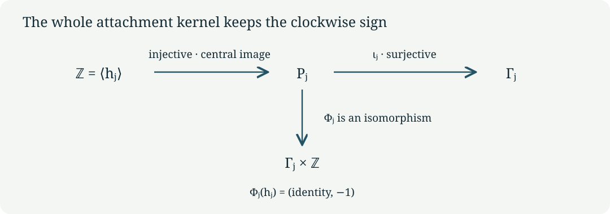

# Normal boundaries and their integral maps {#cg-s6-02}

CG-S6 · Lesson 2

We now compute the topology of the two line bundles constructed in [lesson 1](finite-quotients-and-line-bundles.md#line-bundles). The full attachment kernel is an infinite cyclic central subgroup. Its generator contains the original translation vector and the original clockwise orientation. The calculation also determines which integral covectors descend to the central surface. These are the exact local topological inputs used when the varying finite fillings are attached.

Throughout, \(j\in\{1,2\}\). We retain the lattice \(\Lambda\), matrices \(A_j\), period matrices \(\Pi_j\), central tori \(T_j\), and surfaces \(S_j\) of lesson 1. In particular,

\[
(m_1,m_2)=(3,4),\qquad
v_1=(1,2,-4,0)^{\mathsf t},\qquad
v_2=(-1,-3,3,0)^{\mathsf t},\qquad
\epsilon_j=\gamma(v_j)\in\{1,-1\}.
\tag{1.1}
\]

Here \(A_j^{m_j}=I\), \(A_jv_j=v_j\), and \(\gamma A_j=\gamma\). A marked vector \(x\in\mathbb R^4\) represents the complex point \(\Pi_jx\in\mathbb C^2\); the marking is real-linear and invertible. No complex structure is silently imposed on \(\mathbb R^4\).

## 1. The normal disc and its zero section {#normal-disc}

Let \(r>0\) be an actual radius, \(\Delta_r=\{s\in\mathbb C:|s|<r\}\), and \(\zeta_j=e^{-2\pi i/m_j}\). Define

\[
\mathcal D_j(r)=(\Delta_r\times T_j)/\langle G_j\rangle,
\qquad G_j(s,[x])=(\zeta_js,[A_jx+v_j/m_j]).
\tag{1.2}
\]

This is the radius-\(r\) disc subbundle of the precise holomorphic line bundle \(\mathcal N_j\to S_j\) in lesson 1. The first coordinate in (1.2) is the line coordinate. The action is free, because its action on \(T_j\) is free. The quotient charts of lesson 1 therefore give a smooth complex threefold. Its zero section is exactly \(S_j\).

We compute this normal disc bundle as its own object. [Lesson 3](varying-finite-fillings.md#varying-quotient) constructs the varying holomorphic torus family and its exact real-analytic comparison with this bundle. The normal-bundle calculation retains its full translation, phase, fibre marking, and radius, and has a specified map to the zero section:

\[
p_j:[s,x]\longmapsto[x],\qquad
i_j:[x]\longmapsto[0,x].
\tag{1.3}
\]

They satisfy \(p_ji_j=1\), and the equivariant contraction
\([s,x]\mapsto[(1-t)s,x]\), \(0\le t\le1\), gives a deformation retraction onto the zero section. Thus these maps, rather than an unexplained identification of neighbourhoods, determine the topology computed below.

## 2. The entire deck group {#deck-group}

On \(\Delta_r\times\mathbb R^4\) put

\[
t_\lambda(s,x)=(s,x+\lambda),\qquad
\widehat G_j(s,x)=(\zeta_js,A_jx+v_j/m_j),\quad \lambda\in\Lambda.
\tag{2.1}
\]

**Theorem 2.1.** The universal covering group of \(\mathcal D_j(r)\), and of its zero section \(S_j\), is

\[
\Gamma_j=\left\langle t_\lambda,\widehat G_j\ \middle|\
t_\lambda t_\mu=t_{\lambda+\mu},\quad
\widehat G_jt_\lambda\widehat G_j^{-1}=t_{A_j\lambda},\quad
\widehat G_j^{m_j}=t_{v_j}\right\rangle.
\tag{2.2}
\]

Every group element has a unique form \(t_\lambda\widehat G_j^k\) with \(0\le k<m_j\). The inclusion of the torus covering subgroup is exactly \(\lambda\mapsto t_\lambda\).

**Proof.** The formulas (2.1) give all the displayed relations. Move translations to the left using the conjugation relation and reduce powers by \(\widehat G_j^{m_j}=t_{v_j}\). This produces every asserted normal form. Distinct forms cannot act identically on the covering space: their actions on the nonzero disc coordinate give \(\zeta_j^k=\zeta_j^{k'}\), so \(k=k'\); their fibre translations then give \(\lambda=\lambda'\). Hence the abstract presentation has no additional relation.

For completeness the action is free even above \(s=0\). A fixed point of \(t_\lambda\widehat G_j^k\) would imply, on applying \(\gamma\) to its fibre equation,

\[
\gamma(\lambda)+k\epsilon_j/m_j=0.
\tag{2.3}
\]

Since \(\gamma(\lambda)\) is an integer and \(0\le k<m_j\), this forces \(k=0\). The remaining translation fixes a point only when \(\lambda=0\).

For two compact sets, a translate meeting both must have \(\lambda\) in a bounded subset of \(\mathbb R^4\); only finitely many lattice vectors qualify. There are only \(m_j\) possible remaining powers. This proves proper discontinuity of the full group. Small balls with disjoint translates give covering charts. The cover \(\Delta_r\times\mathbb R^4\) is contractible by straight-line contraction, so it is simply connected and is the universal cover. Restriction to \(s=0\) gives the same free proper action on the contractible \(\mathbb R^4\), with quotient \(S_j\). The specified deck maps consequently give the stated fundamental groups. ∎

## 3. Puncturing the normal disc {#punctured-cover}

Let \(\mathcal D_j(r)^\times=\mathcal D_j(r)\setminus S_j\). Use the logarithmic coordinate with its full radius bound:

\[
s=e^{2\pi iw},\qquad
w\in\mathcal H_r=\{w:\operatorname{Im}w>-\log r/(2\pi)\}.
\tag{3.1}
\]

Its lifted clockwise transformation is

\[
\widetilde G_j(w,x)=(w-1/m_j,A_jx+v_j/m_j).
\tag{3.2}
\]

**Theorem 3.1.** The universal cover of \(\mathcal D_j(r)^\times\) is \(\mathcal H_r\times\mathbb R^4\). Its deck group is the semidirect product

\[
P_j=\Lambda\rtimes_{A_j}\mathbb Z,
\qquad
(\lambda,k)(\mu,l)=(\lambda+A_j^k\mu,k+l),
\tag{3.3}
\]

where \((\lambda,k)\) acts by \(t_\lambda\widetilde G_j^k\). The ordinary positive logarithm deck map is

\[
Q_j(w,x)=(w+1,x)=t_{v_j}\widetilde G_j^{-m_j}(w,x).
\tag{3.4}
\]

**Proof.** Formula (3.2) has the same conjugation relation as (2.2), but its \(k\)-th power has logarithmic displacement \(-k/m_j\). No nonzero power can become a lattice translation. Moving all translations to the left now gives unique normal forms with unrestricted \(k\in\mathbb Z\). Composing them proves (3.3).

The exponential map (3.1) is the ordinary universal cover of the punctured disc: locally a holomorphic logarithm is its inverse, and two logarithms differ by an integer. Combining this cover with the lattice cover gives a covering of \(\Delta_r^\times\times T_j\), and then the free finite quotient gives a cover of \(\mathcal D_j(r)^\times\). All fibres are orbits of the group generated by lattice translations, \(\widetilde G_j\), and \(Q_j\). Formula (3.4) follows by taking the \(-m_j\)-th power of (3.2), so no extra generator is needed. The covering domain is a product of a half-plane and a real vector space and is contractible. This proves the universal-cover assertion and the full deck-group description. ∎

## 4. The full attachment kernel, with its sign {#attachment-kernel}

Fix any base point upstairs and its images under the covers. Identifying fundamental groups by these deck transformations, the inclusion of the punctured disc bundle into the disc bundle induces

\[
\iota_j:P_j\longrightarrow\Gamma_j,
\qquad t_\lambda\longmapsto t_\lambda,\quad
\widetilde G_j\longmapsto\widehat G_j.
\tag{4.1}
\]

**Theorem 4.1.** The map (4.1) is surjective, and

\[
\ker\iota_j=\left\langle h_j\right\rangle\cong\mathbb Z,
\qquad
h_j=\widetilde G_j^{m_j}t_{-v_j}=Q_j^{-1}.
\tag{4.2}
\]

This subgroup is central in \(P_j\).

**Proof.** Every generator in (2.2) is the image of one in (3.3), giving surjectivity. For an arbitrary normal form write \(k=qm_j+a\), \(0\le a<m_j\). Its image in \(\Gamma_j\) is exactly

\[
\iota_j(t_\lambda\widetilde G_j^k)
=t_{\lambda+qv_j}\widehat G_j^a.
\tag{4.3}
\]

By uniqueness in Theorem 2.1, this is the identity if and only if \(a=0\) and \(\lambda=-qv_j\). These are precisely the powers of \(h_j\). Its logarithmic displacement is \(-1\), so those powers are all distinct. It commutes with translations because \(A_j^{m_j}=I\), and with \(\widetilde G_j\) because \(A_jv_j=v_j\). Thus the full kernel is central and infinite cyclic. Equation (3.4) gives its orientation as the inverse positive logarithm loop. ∎

The same result describes a circle boundary of any radius \(0<a<r\). The map
\((s,x)\mapsto(a s/|s|,x)\) is equivariant, and interpolating the radius between \(|s|\) and \(a\) gives a deformation retraction of the punctured disc bundle onto that circle bundle. Every interpolated radius lies strictly between zero and \(r\). Hence the boundary inclusion has exactly the kernel (4.2), with every lattice and loop convention retained.

**Corollary 4.2.** The following is an explicit group isomorphism:

\[
\Phi_j:P_j\longrightarrow\Gamma_j\times\mathbb Z,
\qquad
t_\lambda\widetilde G_j^k\longmapsto
\bigl(t_\lambda\widehat G_j^k,\epsilon_j\gamma(\lambda)\bigr).
\tag{4.4}
\]

**Proof.** The first component is (4.1); the second is additive under (3.3) because \(\gamma A_j=\gamma\). Thus \(\Phi_j\) is a homomorphism. The kernel of its first component is generated by \(h_j\), whose second component is \(-\epsilon_j\gamma(v_j)=-1\). Hence \(\Phi_j\) is injective. For an explicit inverse, write a given element of \(\Gamma_j\) uniquely as \(t_\lambda\widehat G_j^a\), \(0\le a<m_j\), and take any \(n\in\mathbb Z\). Its inverse image is

\[
\Phi_j^{-1}(t_\lambda\widehat G_j^a,n)
=t_\lambda\widetilde G_j^a
 h_j^{\epsilon_j\gamma(\lambda)-n}.
\tag{4.5}
\]

The first component is unchanged by the last factor and the second becomes \(n\), proving surjectivity and both inverse identities. This is the group map induced by the smooth trivialization, as Exercise 2 computes directly. ∎

## 5. The integral first-homology and cohomology maps {#integral-maps}

The covectors computed in lesson 1 are

\[
\psi_1=2u+w+3\delta,\qquad \psi_2=u+w+2\delta.
\tag{5.1}
\]

**Theorem 5.1.** The central surface has

\[
H_1(S_j;\mathbb Z)\cong\mathbb Z^2.
\tag{5.2}
\]

For the original covering \(\pi_j:T_j\to S_j\), the pullback on integral degree-one cohomology is injective and has exactly the image

\[
\pi_j^*H^1(S_j;\mathbb Z)
=\mathbb Z(m_j\gamma)\oplus\mathbb Z\psi_j
\subset H^1(T_j;\mathbb Z)=\operatorname{Hom}(\Lambda,\mathbb Z).
\tag{5.3}
\]

Its index in the invariant covector lattice is \(m_j\).

**Proof.** The map \(\lambda\mapsto(\gamma(\lambda),\psi_j(\lambda))\) has kernel \((A_j-I)\Lambda\), by the full integer calculations of lesson 1. It is surjective: \(\widehat\gamma\) maps to \((1,0)\); \(\widehat w\) for \(j=1\), or \(\widehat u\) for \(j=2\), maps to \((0,1)\). Therefore the lattice coinvariants are exactly \(\mathbb Z^2\).

In these coordinates \(v_j\) has image \((\epsilon_j,0)\). Abelianizing (2.2) gives generators \(e,f,g\) with the single relation

\[
m_jg=\epsilon_je.
\tag{5.4}
\]

Since \(\epsilon_j=\pm1\), this eliminates \(e=\epsilon_jm_jg\), leaving the free basis \(g,f\). Thus the abelianization is \(\mathbb Z^2\), and the image of \(\lambda\in\Lambda\) in that basis is exactly

\[
\lambda\longmapsto
\bigl(\epsilon_jm_j\gamma(\lambda),\psi_j(\lambda)\bigr).
\tag{5.5}
\]

We recall why these group computations determine degree-one integral (co)homology. For a path-connected space, associate a singular loop to its homology class. Concatenation equals addition modulo the boundary of a singular triangle, and commutators consequently vanish. Conversely, choose paths from a base point to the endpoints of singular edges. Replace each edge in a cycle by the resulting based loop; the added paths cancel at vertices. Boundaries of triangles become products of the three edge loops equal to the identity. These constructions give inverse maps between first homology and the abelianized fundamental group. For cohomology, a singular integer one-cocycle evaluates on loops to a homomorphism. If all loop evaluations vanish, integration along the chosen paths to each point defines a zero-cochain whose coboundary is the cocycle. Conversely a homomorphism defines a cocycle by the edge-loop construction; the triangle relation makes it closed. This proves naturally \(H^1=\operatorname{Hom}(\pi_1,\mathbb Z)\) for the spaces here, including the stated restriction maps.

A homomorphism \(\Gamma_j\to\mathbb Z\) restricts on \(\Lambda\) to an invariant covector, hence to \(a\gamma+b\psi_j\). Relation (5.4) forces its value on \(g\) to be \(a\epsilon_j/m_j\). This is an integer exactly when \(m_j\mid a\). Conversely that divisibility defines a homomorphism on the presented group, with no further relation to check. The restriction is injective because zero restriction forces \(m_j\) times its value on \(g\) to be zero in \(\mathbb Z\). This proves (5.3) and its index. ∎

## 6. Exercises with solutions {#exercises}

**Exercise 1.** Compute \(H_1(\mathcal D_j(r)^\times;\mathbb Z)\) and the image of the central kernel generator there.

**Solution.** Abelianizing the semidirect product (3.3) gives the two coinvariant generators \(e,f\) and the unrestricted generator \(g\), with no power relation. The result is \(\mathbb Z^3\). The element \(h_j=\widetilde G_j^{m_j}t_{-v_j}\) has coordinates \((-\epsilon_j,0,m_j)\). Its coordinate greatest common divisor is one. Quotienting by this primitive vector yields \(\mathbb Z^2\), agreeing with (5.2). The nonabelian kernel computation in Theorem 4.1 proves the stronger assertion before abelianization.

**Exercise 2.** Find the integral covector on \(P_j\) corresponding to the positive normal-circle factor under the smooth trivialization of lesson 1.

**Solution.** The trivialized line coordinate is \(s/H_j(x)\), with \(H_j(x)=e^{-2\pi i\epsilon_j\gamma(x)}\). Its logarithm is
\(W=w+\epsilon_j\gamma(x)\).
Under \(t_\lambda\), \(W\) changes by \(\epsilon_j\gamma(\lambda)\). Under \(\widetilde G_j\), it changes by
\(-1/m_j+\epsilon_j\gamma(v_j)/m_j=0\).
Thus the circle covector is
\((\lambda,k)\mapsto\epsilon_j\gamma(\lambda)\).
It takes value one on \(Q_j=t_{v_j}\widetilde G_j^{-m_j}\), and minus one on \(h_j\). This gives the exact agreement between the smooth product trivialization and the clockwise attachment convention.

**Exercise 3.** Why do invariant real covectors fail to record the integral index in (5.3)?

**Solution.** Over \(\mathbb R\), the required value \(a\epsilon_j/m_j\) on the extra generator is allowed for every real \(a\), so restriction identifies the entire invariant real plane. Over \(\mathbb Z\) that value is allowed exactly when \(m_j\mid a\). Tensoring the subgroup \(\mathbb Z(m_j\gamma)\oplus\mathbb Z\psi_j\) with \(\mathbb R\) therefore produces the same real plane as \(\mathbb Z\gamma\oplus\mathbb Z\psi_j\), while losing the finite quotient \(\mathbb Z/m_j\). Equation (5.3) preserves it.

## 7. Proof sources and use in the construction {#sources}

The exact source antecedent is the [frozen programme archive](https://zenodo.org/records/22678442/files/28_s6_complete_public_project_frozen_2026-09-06.zip), member `project/supporting_materials/workbench/research/finite_filling_certificates.tex`, FF30–FF41. Its original marked central surfaces and characters are constructed completely in [lesson 1](finite-quotients-and-line-bundles.md). The originating manuscript was produced with Claude under Levent Alpöge's direction. Philip Engel's [original-author treatment](https://arxiv.org/abs/2609.38442v1), Sections 3 and 6, is a related geometric route; no reading of all of Section 6 is claimed here.

The normal disc and boundary calculation above is complete. [Lesson 3, Theorem 3.1 and Exercise 3](varying-finite-fillings.md#varying-quotient) construct the actual varying finite filling and the equivariant real-analytic map that carries every deck transformation and attachment map above to that filling. The comparison retains the original periods and does not assert a holomorphic product structure.

Mathematical exposition: GPT-6 Astra (OpenAI), Codex, Ultra, 8 October 2026. New lesson text: CC0-1.0.
