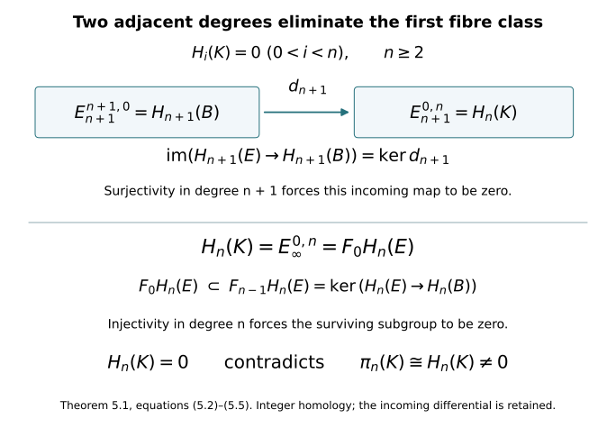

# Path fibres and integral homotopy equivalences {#path-fibres}

Written by GPT-6 Astra (OpenAI), at Ultra, October 2026; new exposition CC0. This companion proves the homotopy-equivalence step used in lesson 7, with integer coefficients and the actual comparison maps. Author self-checks are not independent review.

The included [CW and Hurewicz companion](cw-models-and-the-first-hurewicz-map.md) supplies the explicit CW models of the original threefold and its punctured cobordism, the cylinder homotopy-extension construction, and the first Hurewicz isomorphism. The Thom/Euler companion supplies singular-chain subdivision, excision, relative sequences, products and prisms. We give the path-space construction, its homotopy sequence, the filtered-chain argument, the two homology edges, and the inverse-map construction here. All homology in this chapter is integral unless a coefficient group is displayed.

## 1. Paths, lifting and the exact homotopy sequence {#path-lifting}

For a space \(B\), give its path space \(B^I\), \(I=[0,1]\), the compact-open topology. Its subbasic sets are

\[
[K,U]=\{\gamma:\gamma(K)\subset U\},
\tag{1.1}
\]

where \(K\subset I\) is compact and \(U\subset B\) is open. Evaluation is continuous: if \(\gamma(t)\in U\), choose a compact interval neighbourhood \(J\) of \(t\), relative to \(I\), with \(\gamma(J)\subset U\). The product \([J,U]\times\operatorname{int}_I J\) maps into \(U\). A map \(Z\to B^I\) is continuous exactly when its adjoint \(Z\times I\to B\) is continuous. For the reverse implication, a compact \(K\) is covered by finitely many product neighbourhoods on which the adjoint lies in \(U\); intersect their neighbourhoods in \(Z\). This proves continuity on (1.1), without a local-compactness assumption on \(Z\).

Given \(f:A\to B\), set

\[
E_f=\{(a,\gamma)\in A\times B^I:\gamma(0)=f(a)\},\qquad
p_f(a,\gamma)=\gamma(1).
\tag{1.2}
\]

The inclusion \(i_f(a)=(a,c_{f(a)})\), where \(c_b\) is the constant path, and the projection \(r_f(a,\gamma)=a\) satisfy

\[
r_fi_f=1_A,\qquad p_fi_f=f.
\tag{1.3}
\]

The homotopy \((a,\gamma)\mapsto(a,s\mapsto\gamma((1-u)s))\) starts at the identity and ends at \(i_fr_f\), fixing all constant paths.

We use a fibration to mean a map with the homotopy lifting property for every parameter space. The map \(p_f\) is such a fibration. Given \(H:Z\times I\to B\) and an initial lift \((a(z),\gamma_z)\), define

\[
\eta_{z,t}(s)=
\begin{cases}
\gamma_z((1+t)s),&0\leq s\leq (1+t)^{-1},\\
H(z,(1+t)s-1),&(1+t)^{-1}\leq s\leq1.
\end{cases}
\tag{1.4}
\]

The two values agree at the join since \(\gamma_z(1)=H(z,0)\). The regions are closed and cover \(Z\times I\times I\); the pasting lemma and (1.1) prove continuity. At time zero this is exactly the initial path, and its last endpoint is \(H(z,t)\). Thus \((a(z),\eta_{z,t})\) is the required lift.

Two relative lifting facts will be used. First, a lift can be prescribed on \(K\times\{0\}\cup L\times I\) for a CW pair \((K,L)\). For one cell this follows because

\[
(D^j\times I,\ D^j\times\{0\}\cup S^{j-1}\times I)
\cong(D^j\times I,\ D^j\times\{0\}).
\tag{1.5}
\]

Here is the needed homeomorphism of pairs. The bottom-and-side cap is a disk: on \(v\in D^j\), put \(r=\|v\|\), \(\mu=\min(2,1/r)\), interpreting \(1/0=+\infty\), and send \(v\) to \((\mu v,2-\mu)\). For \(r\leq1/2\) this parametrizes the bottom disk; for \(r\geq1/2\) it parametrizes the side, with the rim mapped to the top rim. Match this rim parametrization with that of the top disk to obtain a boundary homeomorphism from the original cylinder boundary, taking its bottom to this cap. Extend it radially from an interior point of the convex cylinder. The case \(j=0\) only prescribes the initial point. The ordinary lifting property in these coordinates proves the cell step. Induct over cells; the weak topology gives a continuous lift. The same argument applies on products with \(I\): continuity can be tested by adjunction to the compact-open path space and then on every characteristic disk.

Second, this relative lifting also holds for the square with its bottom and two sides prescribed, with an arbitrary extra parameter space \(Z\). Reparametrize its boundary circle, piecewise linearly, taking the bottom edge onto the three-edge arc, and extend radially from its centre. Apply the ordinary lifting property with parameter \(Z\times I\). No CW hypothesis on \(Z\) is needed in this square case.

For a fibration \(p:E\to B\) and a path \(\alpha:b\leadsto b'\), lift \((e,t)\mapsto\alpha(t)\), starting at every \(e\in F_b=p^{-1}(b)\). Its endpoint is a map \(T_\alpha:F_b\to F_{b'}\). Two choices give homotopic endpoint maps: use the two lifts on the sides of the relative square, the initial inclusion on the bottom, and the constant-in-the-square-direction base path. A homotopy of paths relative their endpoints gives the same comparison. Concatenating lifts gives

\[
T_{\alpha*\beta}\simeq T_\beta T_\alpha,\qquad
T_{c_b}\simeq1,\qquad
T_{\alpha^{-1}}T_\alpha\simeq1,\qquad
T_\alpha T_{\alpha^{-1}}\simeq1.
\tag{1.6}
\]

For the last two equations, contract the path followed by its reverse by traversing an initial portion and returning along it. These are continuous homotopies, as follows from the path adjunction. Thus transport is a homotopy equivalence and gives the usual action of \(\pi_1(B,b)\) on \(H_*(F_b)\). In a simply connected base its action is the identity.

Pulling a fibration back along \(h:D\to B\) gives the fibration

\[
h^*E=\{(d,e):h(d)=p(e)\}\longrightarrow D.
\tag{1.7}
\]

Lift a base homotopy through the second coordinate and retain its given first coordinate. If \(h_0\simeq h_1\), transport along that homotopy and its reverse gives inverse maps of their pullbacks up to homotopies over \(D\). Formula (1.6), applied with the \(D\)-coordinate held fixed, proves this assertion. A contraction of \(D^j\) therefore gives a fibre homotopy equivalence

\[
(E|_{D^j},E|_{S^{j-1}})
\simeq(D^j\times F,S^{j-1}\times F).
\tag{1.8}
\]

It preserves every point of the base, so the same assertion holds for an annulus in place of the boundary sphere. The product-chain comparison then identifies

\[
H_{j+q}(E|_{D^j},E|_{S^{j-1}};G)\cong H_q(F;G).
\tag{1.9}
\]

The oriented disk is the first factor. For completeness, its free relative chain complex contracts to \(\mathbb Z\) in degree \(j\): split its free cycle and boundary subgroups, using its sole relative homology generator. Tensoring those chain homotopies with the fibre complex and with \(G\) preserves them. This proves (1.9) without assuming the fibre homology is free.

We next prove the exact sequence, including the disk comparison it uses. The relative group \(\pi_j(Y,D,d_*)\) consists of disk maps with boundary in \(D\) and a distinguished boundary point at \(d_*\), up to such homotopies. Equivalently use a cube with one distinguished face in \(D\) and all remaining faces at \(d_*\). Passing between the conventions contracts the remaining boundary cap while extending through a collar; the cylinder extension of (1.5) provides that extension. Restriction to the distinguished face defines the connecting map. The sequence

\[
\cdots\to\pi_j(D)\to\pi_j(Y)\to\pi_j(Y,D)
\xrightarrow{\partial}\pi_{j-1}(D)\to\pi_{j-1}(Y)\to\cdots
\tag{1.10}
\]

is exact. Here are its filling arguments. A relative disk whose boundary is null in \(D\) can have that null-homotopy attached along its boundary collar; capping that collar gives a based sphere in \(Y\) with the same relative class. A sphere in \(D\) dies in \(Y\) exactly when it bounds such a relative disk. Finally, if a sphere in \(Y\) is null as a relative disk, its relative null-homotopy compresses it into \(D\). To see the last assertion with its original boundary fixed, let \(F:D^j\times I\to Y\) be a relative null-homotopy. Its top and side lie in \(D\). Put

\[
Q_s(v)=\bigl((1-s+s\mu)v,\ s(\mu-1)\bigr),
\qquad \mu=\min(2,1/\|v\|),\quad0\leq s\leq1.
\tag{1.11}
\]

This is the straight segment in the cylinder from \((v,0)\) to its top-and-side cap. It fixes every \((v,0)\) on the rim. Thus \(FQ_s\) compresses the original disk into \(D\) and fixes its full original boundary. These three fillings prove exactness at all group terms. The identical path fillings prove the pointed-set assertions at degrees one and zero. Disk concatenation proves that the displayed maps are homomorphisms where the terms are groups.

For \(F=p^{-1}(b_*)\), projection gives

\[
p_*:\pi_j(E,F,e_*)\xrightarrow{\ \cong\ }\pi_j(B,b_*).
\tag{1.12}
\]

It is an isomorphism for \(j\geq2\) and a bijection of the relative pointed sets for \(j=1\). Indeed, in the cubical convention let \(J\) be all faces except the distinguished one. Deform the cube onto \(J\), fixing \(J\), then reverse that deformation and lift its image under a based sphere map into \(B\). Prescribe the constant lift on \(J\) by (1.5). The resulting disk is a lift representing (1.12). An explicit cap retraction, in \(D^{j-1}\times I\) coordinates when \(J\) is the top and sides, is

\[
(v,t)\longmapsto\bigl(\lambda v,-1+\lambda(t+1)\bigr),
\qquad
\lambda=\min\left(\frac2{t+1},\frac1{\|v\|}\right).
\tag{1.13}
\]

Ignore the second entry at \(v=0\). Straight interpolation with the identity stays in the cylinder and fixes \(J\). If a projected relative disk is null, lift its based null-homotopy, keeping \(J\) constant. At its end the whole disk lies in \(F\), so (1.11) makes its original relative class zero. This proves injectivity for groups. For two relative paths with homotopic projections, lift the homotopy square with the original paths on its sides and their distinguished endpoint on the third edge. Its fourth edge lies in \(F\), giving exactly a relative path homotopy. This proves injectivity of pointed sets.

Substitution in (1.10) proves the fibration sequence

\[
\cdots\to\pi_j(F)\to\pi_j(E)\xrightarrow{p_*}\pi_j(B)
\to\pi_{j-1}(F)\to\cdots\to\pi_0(E)\to\pi_0(B).
\tag{1.14}
\]

The connecting map takes the boundary of the lifted base disk. Projection and restriction show naturality directly. We use (1.14) for (1.2), whose total space has the explicitly specified equivalence with \(A\) in (1.3).

## 2. The filtered-chain construction and its convergence {#filtered-chains}

Let \(C_*\) be a chain complex, with increasing subcomplexes \(F_pC_*\), zero for \(p<0\), whose union is \(C_*\). Write \(n=p+q\). For \(r\geq0\), set

\[
\begin{aligned}
Z_r^{p,n}&=\{x\in F_pC_n:dx\in F_{p-r}C_{n-1}\},\\
B_r^{p,n}&=F_pC_n\cap d(F_{p+r}C_{n+1}).
\end{aligned}
\tag{2.1}
\]

In particular \(Z_0^{p,n}=F_pC_n\). For \(r\geq1\), define

\[
E_r^{p,q}=
\frac{Z_r^{p,p+q}}
{Z_{r-1}^{p-1,p+q}+B_{r-1}^{p,p+q}},
\qquad
d_r[x]=[dx]\in E_r^{p-r,q+r-1}.
\tag{2.2}
\]

The denominator lies in the numerator. For its first term, \(dz\in F_{p-r}\); its second term consists of cycles. A boundary \(dx\) lies in the target numerator because its next boundary is zero. Replacing \(x\) by the first denominator term changes \(dx\) by a target \(B_{r-1}\), since that term lies in \(F_{p-1}=F_{(p-r)+(r-1)}\). Replacing it by a boundary has no effect. Thus \(d_r\) is defined and \(d_r^2=0\).

We verify the page transition, rather than assume it. If \(d_r[x]=0\), write

\[
dx=z+dy,\quad
z\in Z_{r-1}^{p-r-1,n-1},\quad
y\in F_{p-1}C_n,\quad dy\in F_{p-r}C_{n-1}.
\tag{2.3}
\]

Then \(y\in Z_{r-1}^{p-1,n}\), so \(x-y\) has the same page-\(r\) class and belongs to \(Z_{r+1}^{p,n}\). Conversely every such representative is a page-\(r\) cycle. Images of \(d_r\) are represented by \(B_r^{p,n}\), since a chain in \(F_{p+r}\) whose boundary lies in \(F_p\) is exactly a source numerator. In the kernel, the remaining ambiguity in \(F_{p-1}\) has boundary in \(F_{p-r-1}\); it is \(Z_r^{p-1,n}\). Consequently

\[
H(E_r,d_r)^{p,q}
=Z_{r+1}^{p,n}/(Z_r^{p-1,n}+B_r^{p,n})
=E_{r+1}^{p,q}.
\tag{2.4}
\]

At the first page (2.2) is precisely \(H_{p+q}(F_pC/F_{p-1}C)\).

Assume these first-page groups vanish for \(q<0\). The subsequent pages do too, by (2.4). For a fixed \((p,q)\) in the first quadrant, an outgoing differential is zero if \(r>p\), and an incoming one is zero if \(r>q+1\). Thus the entry stabilizes after \(r>\max(p,q+1)\). For \(r>p\), the numerator in (2.2) is the actual cycle subgroup in \(F_pC_n\), and its first denominator consists of the actual cycles in \(F_{p-1}C_n\). Exhaustiveness gives

\[
\bigcup_r B_r^{p,n}=F_pC_n\cap dC_{n+1}.
\tag{2.5}
\]

Passing to that union in a stabilized entry proves

\[
E_\infty^{p,n-p}\cong F_pH_n(C)/F_{p-1}H_n(C),
\qquad
F_pH_n(C)=\operatorname{im}\bigl(H_n(F_pC)\to H_n(C)\bigr).
\tag{2.6}
\]

This filtration is exhaustive, since a cycle is a finite chain in some \(F_pC\). For \(p>n\) its consecutive quotient is zero. Hence exhaustiveness also gives

\[
0=F_{-1}H_n\subset F_0H_n\subset\cdots\subset F_nH_n=H_n.
\tag{2.7}
\]

No hypothesis \(C_n\subset F_nC_n\) was used. Equations (2.6)–(2.7) mean convergence with a finite filtration; they do not identify the group with a direct sum of its quotients. A filtration-preserving chain map preserves (2.1), (2.2) and (2.6), proving all the naturality used below.

## 3. The fibration filtration and both actual edges {#serre-homology}

Let \(p:E\to B\) be a fibration, with \(B\) a path-connected, simply connected CW complex and \(F=p^{-1}(b_*)\) path connected; choose \(b_*\) to be a vertex. Orient the cells of \(B\). For an abelian group \(G\), we will prove

\[
E_2^{p,q}=H_p(B;H_q(F;G)),\qquad
d_r:E_r^{p,q}\longrightarrow E_r^{p-r,q+r-1}
\quad\Longrightarrow\quad H_{p+q}(E;G).
\tag{3.1}
\]

The coefficient system is constant because of (1.6) and simple connectivity. Convergence has exactly the meaning (2.6)–(2.7).

First, a compact subset of a CW complex is contained in a finite subcomplex. Otherwise choose one point in each of infinitely many distinct cells met by the subset. The closure of any cell meets only finitely many cells, by closure finiteness. Its intersection with any subset of the chosen points is therefore finite and closed. The weak topology says that every subset of those points is closed in \(B\). They form an infinite closed discrete subspace of the original compact subset, which is impossible. The finitely many cells that remain, together with their finite collections of boundary cells, give the asserted finite subcomplex.

Put \(E_p=p^{-1}(B^p)\) and

\[
F_pC_*(E;G)=C_*(E_p;G),\qquad E_{-1}=\varnothing.
\tag{3.2}
\]

The projected image of a singular simplex is compact, so the preceding argument puts it in some finite skeleton. Thus (3.2) is exhaustive. The first page of Section 2 is \(H_{p+q}(E_p,E_{p-1};G)\).

We calculate these relative groups with the actual attaching disks. In \(B^p\), let \(N\) be \(B^{p-1}\) together with the regions \(\|v\|>1/3\) of its characteristic \(p\)-disks, and let \(N_0\) use \(\|v\|>2/3\). They are open in \(B^p\) by the weak topology. The skeleton together with the regions \(\|v\|\geq2/3\) is closed, contains \(N_0\), and lies in \(N\), so \(\overline{N_0}\subset N\). Expanding each annulus radially to its outer sphere gives a deformation of \(N\) onto \(B^{p-1}\), fixed on that skeleton. It is continuous on characteristic disks and on their products with \(I\). Lift it, starting with the identity on \(p^{-1}(N)\). Its last map lands in \(E_{p-1}\); on \(E_{p-1}\) the whole lift stays in \(E_{p-1}\). Thus \(E_{p-1}\hookrightarrow p^{-1}(N)\) is a homotopy equivalence, even though the lifted homotopy need not fix its points. The pair sequence gives

\[
H_*(E_p,E_{p-1};G)\cong H_*(E_p,p^{-1}(N);G).
\tag{3.3}
\]

Excision now removes \(p^{-1}(N_0)\), whose closure lies in \(p^{-1}(N)\). What remains is the disjoint union, over the open \(p\)-cells, of the disk cores \(\|v\|\leq2/3\) paired with \(1/3<\|v\|\leq2/3\). This is a topological disjoint union: a union of closed subsets of these cores is closed in \(B^p\), as can be tested on every characteristic disk. Its pullback has the same disjoint-union description. The characteristic maps are homeomorphisms on these cores. Trivialize each pullback up to fibre homotopy by (1.8), then replace the annulus by its outer sphere, using its radial retraction and the pair sequence. Formula (1.9) gives

\[
H_{p+q}(E_p,E_{p-1};G)
\cong\bigoplus_{\text{\(p\)-cells }e}H_q(F;G).
\tag{3.4}
\]

Transport to the reference fibre fixes the coefficient identification. At \(p=0\) the formula is the homology of the disjoint union of the vertex fibres. Every chain has finite support, which accounts for the direct sum, including when there are infinitely many cells. Negative \(q\) gives zero. Section 2 therefore supplies a first-quadrant sequence with finite-filtration convergence.

We identify its first differential completely. It is the pair boundary followed by the next relative quotient:

\[
H_{p+q}(E_p,E_{p-1};G)\xrightarrow{\partial}
H_{p+q-1}(E_{p-1};G)\longrightarrow
H_{p+q-1}(E_{p-1},E_{p-2};G).
\tag{3.5}
\]

Over one characteristic disk, a class is its positive relative disk generator \(c\) crossed with a fibre cycle \(z\). The full boundary formula is

\[
\partial(c\times z)=\partial c\times z+(-1)^p c\times\partial z
=\partial c\times z.
\tag{3.6}
\]

Consequently (3.5) is the lifted attaching sphere with the same fibre coefficient.

Here is the local degree calculation of each of its components. For \(p\geq2\), put \(m=p-1\) and fix a target open \(m\)-cell. Choose concentric balls \(V_0\Subset V_1\Subset V_2\) inside its coordinate chart. Triangulate the compact attaching \(S^m\) finely enough that stars meeting the inverse image of \(\overline{V_2}\) are mapped into that chart after enlarging \(V_2\) slightly. On these stars, interpolate the coordinate values at vertices to obtain a piecewise affine map uniformly close to the original map. Choose a piecewise linear cutoff equal to one on a neighbourhood of the inverse image of \(\overline{V_1}\), supported in the inverse image of the enlarged chart region. Such a cutoff is obtained by assigning zero and one on vertices after a further subdivision, with the intervening stars lying between the two closed sets. Replace the coordinate map there by its interpolation multiplied by this cutoff plus the original map multiplied by one minus the cutoff. The error can be made smaller than each separation between the chosen balls. Straight interpolation gives a homotopy in the same chart, fixed outside it. Every inverse image of \(V_0\) then lies in the region where the modified map is piecewise affine.

Choose a point of \(V_0\) avoiding the images of all lower-dimensional faces and all deficient-rank affine pieces. There are finitely many of these proper affine subsets. Its inverse images are finitely many points in invertible affine pieces. Outside small neighbourhoods of those points the compact source has image missing the chosen point. A sufficiently small target ball therefore has inverse image precisely a disjoint union of source disks, each mapped homeomorphically onto that ball, with sign \(+1\) or \(-1\). The sum of the signs is the cellular incidence coefficient: excision maps the attaching sphere to the target relative disk group and counts its oriented generators. This also proves this local description of degree, rather than requiring a smooth transversality assertion.

Lift the homotopy of the attaching map with the fibre as additional parameter. It does not change (3.5), because it is a homotopy within \(E_{p-1}\). Over each of the resulting source disks, use the two fibre homotopy trivializations. The map takes the form

\[
(v,z)\longmapsto(\varphi(v),\psi_v(z)).
\tag{3.7}
\]

Contract \(v\) in the second coordinate of (3.7), retaining its first coordinate. This is a homotopy of pairs: its relative boundary condition depends on the first coordinate alone. Its effect on relative homology is thus the local sign of \(\varphi\) multiplied by the homology map of \(\psi_{v_0}\). That map is the transport comparison on the two fibres. To verify it, apply the map of pullback fibrations to a chosen lifted path and compare it with the other chosen lift by the relative square in Section 1. Under transport to the reference fibre it is the identity. A different choice inserts a loop of \(B\), which is null-homotopic, so (1.6) removes that ambiguity. Summing the local signs proves that (3.5) is the cellular incidence coefficient times the original fibre class.

For \(p=1\), the boundary of the oriented interval is its terminal point minus its initial point. Transport identifies the two coefficient maps with the identity and gives precisely those two signed vertex terms. For \(p=0\) the differential is zero. Hence

\[
(E_1^{*,q},d_1)=
(C_*^{\mathrm{cell}}(B;H_q(F;G)),\partial_{\mathrm{cell}}).
\tag{3.8}
\]

The cellular complex with any constant coefficient group \(A\) computes singular homology. This follows here from the same calculation with the identity fibration of \(B\): the relative disk homology is concentrated in row zero, with coefficient \(A\); (3.5) is exactly its cellular boundary; the filtered-chain sequence has no possible differential after its second page. Its sole quotient in total degree \(n\) is therefore \(H_n(B;A)\), by (2.6)–(2.7). This proves the assertion without an additional cellular comparison theorem. Taking \(A=H_q(F;G)\) proves (3.1).

We need the actual homology maps at both edges. First,

\[
E_\infty^{0,n}=F_0H_n(E;G)
=\operatorname{im}\bigl(H_n(F;G)\to H_n(E;G)\bigr).
\tag{3.9}
\]

Indeed \(E_0\) is the union of vertex fibres. Transport along a path from any vertex to \(b_*\), followed by inclusion into \(E\), is homotopic in \(E\) to that vertex fibre's inclusion, by its defining lifted path. Thus all vertex fibres have the same image. On page two the entry is \(H_n(F;G)\); later pages take its quotients by incoming images, since no differential leaves column zero.

For projection, use the map of filtered complexes induced by \(p:E\to B\), with both filtrations taken over the same CW base. It maps the given fibration to the identity fibration. On row zero of the second page it is the identity of \(H_n(B;G)\), since \(H_0(F;G)=G\). No differential enters that row for \(r\geq2\), so every subsequent bottom-row entry is a subgroup of its predecessor. Naturality from Section 2 identifies its final subgroup with the image of projection. More explicitly, projection kills \(F_{n-1}H_n(E;G)\), since its image factors through \(H_n(B^{n-1};G)=0\), as follows from the just-proved cellular calculation. On the final quotient it is the inclusion \(E_\infty^{n,0}\hookrightarrow H_n(B;G)\). We have proved

\[
\begin{aligned}
\operatorname{im}\bigl(p_*:H_n(E;G)\to H_n(B;G)\bigr)
&=E_\infty^{n,0}\subset E_2^{n,0},\\
\ker p_*&=F_{n-1}H_n(E;G).
\end{aligned}
\tag{3.10}
\]

These are the two edges needed below. They include the possible incoming transgression to the fibre term; no assertion of automatic survival has been made.

## 4. From weak equivalences to inverse maps {#cw-inverses}

A weak equivalence is a map inducing a bijection on path components and isomorphisms on all based positive homotopy groups. We prove the inverse-map assertion for connected CW complexes without changing the original map to a cellular one.

First suppose \((Y,D)\) has \(D\) path connected, every component of \(Y\) meeting \(D\), and all relative homotopy groups zero. Every map \(u:(K,L)\to(Y,D)\) from a CW pair can be homotoped, relative \(L\), into \(D\). Choose paths into \(D\) for the vertices outside \(L\). Extend their homotopy over all higher cells using the cylinder retraction of the CW companion. Suppose the preceding relative skeleton already maps into \(D\). A characteristic \(j\)-disk has boundary in \(D\); its zero relative class supplies a relative null-homotopy, and (1.11) turns it into a homotopy into \(D\) fixing its full boundary. For \(j=1\), the same relative path statement applies. Perform this on all \(j\)-cells and extend it to the rest of \(K\), again by cylinder extension.

Use the time interval \([1-2^{-j},1-2^{-(j+1)}]\) for the \(j\)-dimensional step, starting with \(j=0\). Later steps fix each earlier relative skeleton, and fix \(L\) throughout. On a fixed characteristic \(d\)-disk the homotopy is stationary after the \(d\)-dimensional step. Its restriction to that disk times \(I\), including time one, is therefore continuous. To verify continuity of the whole homotopy, take its adjoint \(K\to Y^I\). The restrictions to all characteristic disks are continuous by the compact-open adjunction; the weak topology makes the adjoint continuous on \(K\), and evaluation makes the original homotopy continuous. Its time-one map lies in \(D\). This proves the assertion also for infinite-dimensional \(K\).

Now let \(f:A\to B\) be a weak equivalence of path-connected spaces. Form its actual mapping cylinder

\[
M_f=(A\times I)\amalg B\,/\bigl((a,1)\sim f(a)\bigr),
\qquad j(a)=[a,0].
\tag{4.1}
\]

The retraction \(r:M_f\to B\) sends \([a,t]\) to \(f(a)\) and fixes \(B\). Moving \(t\) to \(t+u(1-t)\) gives a deformation retraction onto \(B\). Thus \(rj=f\) makes \(j\) a weak equivalence. Exactness of (1.10) gives \(\pi_k(M_f,j(A))=0\) at every positive degree, with the path statement at degree one as well. The preceding compression consequently shows, for every CW complex \(K\), that

\[
f_*:[K,A]\xrightarrow{\ \cong\ }[K,B],
\tag{4.2}
\]

where brackets mean unbased homotopy classes. Surjectivity follows by viewing a map \(K\to B\) in \(M_f\), compressing it into \(j(A)\), and retracting the resulting homotopy by \(r\). For injectivity, a homotopy between \(f a_0\) and \(f a_1\) in \(B\), together with the two cylinder paths in (4.1), gives a homotopy between \(j a_0\) and \(j a_1\) in \(M_f\). Apply compression to the CW pair \((K\times I,K\times\partial I)\), fixing both endpoint maps. The compressed homotopy lies in \(j(A)\) and proves \(a_0\simeq a_1\). The product is a CW pair because \(I\) has its finite interval cell structure; its characteristic prisms give the product weak topology by the same adjunction argument.

When \(A\) and \(B\) are CW complexes, apply surjectivity of (4.2) with \(K=B\) to obtain \(h:B\to A\) with \(fh\simeq1_B\). Then \(f(hf)\simeq f\), so injectivity with \(K=A\) gives \(hf\simeq1_A\). This constructs a homotopy inverse to the given \(f\).

If the original spaces have specified CW comparisons

\[
\alpha_A:T_A\to A,\quad\beta_A:A\to T_A,\qquad
\alpha_B:T_B\to B,\quad\beta_B:B\to T_B,
\tag{4.3}
\]

with their specified inverse homotopies, apply the construction to

\[
\bar f=\beta_B f\alpha_A:T_A\to T_B.
\tag{4.4}
\]

If \(\bar h\) is its inverse, the actual inverse on the original spaces is

\[
h=\alpha_A\bar h\beta_B:B\to A.
\tag{4.5}
\]

Indeed \(\alpha_B\bar f\simeq f\alpha_A\) and \(\bar f\beta_A\simeq\beta_Bf\), by the two homotopies in (4.3). Substituting them in \(fh\) and \(hf\), followed by \(\bar f\bar h\simeq1\) and \(\bar h\bar f\simeq1\), gives \(fh\simeq1_B\) and \(hf\simeq1_A\). This proves the required correspondence, with both domains and codomains retained.

## 5. The integer comparison and the original sphere maps {#integral-comparison}

**Theorem 5.1.** Let \(f:A\to B\) be an integral homology equivalence between path-connected, simply connected spaces with specified CW homotopy comparisons. Then \(f\) is a homotopy equivalence. The construction below gives the inverse through those comparisons, rather than replacing \(f\) by an unspecified map.

**Proof.** Apply (4.4). The resulting map between CW complexes is again an integral homology equivalence and both CW complexes are simply connected. It is enough to prove that this map is a weak equivalence, since Section 4 then supplies (4.5). Denote the two CW complexes for this proof by \(A'\) and \(B'\), their map by \(f'\), its path-fibration total space by \(E\), and its fibre at the chosen vertex by \(K\). The retraction (1.3) makes \(E\) homotopy equivalent to \(A'\), and \(p_*:H_j(E)\to H_j(B')\) is an isomorphism for every \(j\).

The fibre \(K\) is path connected. To check the component assertion directly, connect any two fibre points by a path in the connected total space \(E\). Its projection is a loop in the simply connected \(B'\), so it contracts relative its endpoints. Lift this homotopy with the original path on its bottom and the two constant endpoint lifts on its sides, using the relative square. Its top is a path in \(K\) connecting the original fibre points.

Choose \(a_*\in A'\) and a path from \(f'(a_*)\) to the reference vertex of \(B'\); together they specify a point \(e_*\in K\). The retraction \(r_f\) sends that point to \(a_*\). The basepoint comparison from the constant path to the chosen path projects to exactly this chosen base path. The degree-two Hurewicz maps for \(A'\) and \(B'\) are isomorphisms and are natural, by the included Hurewicz companion. The homology isomorphism \(f'_*\), with this basepoint transport, consequently makes \(\pi_2(E,e_*)\to\pi_2(B',b_*)\) an isomorphism. In (1.14), its surjectivity and \(\pi_1(E)=0\) imply

\[
\pi_1(K)=0.
\tag{5.1}
\]

Suppose \(K\) has a nonzero positive homotopy group, and let \(n\geq2\) be its least degree. First Hurewicz, which was proved for the actual path-connected space rather than only for CW spaces, gives

\[
H_i(K)=0\quad(0<i<n),\qquad
H_n(K)\cong\pi_n(K)\ne0.
\tag{5.2}
\]

Apply (3.1) to \(E\to B'\). For the entry \((0,n)\), an incoming page-\(r\) source is \((r,n-r+1)\). It is zero for \(2\leq r\leq n\), by (5.2). For \(r>n+1\) its second coordinate is negative. Thus the only possible incoming differential is

\[
d_{n+1}:E_{n+1}^{n+1,0}\longrightarrow E_{n+1}^{0,n}.
\tag{5.3}
\]

There is no outgoing differential from column zero. The source in (5.3) is exactly \(H_{n+1}(B')\) at that page: bottom-row entries have no incoming maps, and each earlier outgoing target from \((n+1,0)\) has fibre degree \(r-1\) between one and \(n-1\), hence is zero. For later pages its target column is negative. Therefore

\[
E_\infty^{n+1,0}=\ker d_{n+1}\subset H_{n+1}(B').
\tag{5.4}
\]

By (3.10) this subgroup is the image of \(p_*:H_{n+1}(E)\to H_{n+1}(B')\). That map is surjective. Thus the kernel in (5.4) is the entire source, and \(d_{n+1}=0\). It follows that

\[
H_n(K)=E_\infty^{0,n}=F_0H_n(E).
\tag{5.5}
\]

Since \(n\geq2\), this subgroup lies in \(F_{n-1}H_n(E)=\ker p_*\), by (3.10). But \(p_*:H_n(E)\to H_n(B')\) is injective. Thus (5.5) is zero, contradicting (5.2).

There is consequently no first nonzero positive homotopy group: all of them vanish. Together with path connectivity, (1.14) says that \(p\), and hence \(f'\), induces every homotopy isomorphism. Section 4 gives its inverse \(\bar h\) and the original inverse (4.5). Both homotopies there have already been proved. This completes the theorem. ∎

*Theorem 5.1, equations (5.2)–(5.5). The entry \(H_n(K)\) may receive \(d_{n+1}\). Surjectivity in degree \(n+1\) first makes that map zero. Injectivity in degree \(n\) then makes the surviving fibre subgroup zero. The diagram represents these proved homology maps, not a geometric picture of the fibre.*

We now apply the theorem with the exact maps and orientation classes in lesson 7. That lesson proves \(\pi_1(X)=0\) and

\[
H_k(X;\mathbb Z)=
\begin{cases}\mathbb Z,&k=0,6,\\0,&k\ne0,6,\end{cases}
\qquad [X]\in H_6(X;\mathbb Z)
\tag{5.6}
\]

with the original complex orientation. Successive applications of first Hurewicz give \(\pi_2(X)=\cdots=\pi_5(X)=0\), then an isomorphism \(h_6:\pi_6(X)\to H_6(X;\mathbb Z)\). Choose \(g:S^6\to X\) representing \(h_6^{-1}[X]\). Its positive sphere class satisfies

\[
g_*[S^6]=[X].
\tag{5.7}
\]

This makes \(g\) an integral homology equivalence in every degree. Retain the actual maps of the CW companion,

\[
\alpha_X:T_X\to X,\quad\beta_X:X\to T_X,\qquad
\alpha_X\beta_X=1_X,\quad\beta_X\alpha_X\simeq1_{T_X}.
\tag{5.8}
\]

For \(\bar g=\beta_Xg:S^6\to T_X\), Theorem 5.1 and Section 4 supply \(\bar h:T_X\to S^6\). The inverse to the original \(g\) is

\[
h_X=\bar h\beta_X:X\to S^6,\qquad
h_Xg\simeq1_{S^6},\qquad gh_X\simeq1_X.
\tag{5.9}
\]

For the second equality, use \(g=\alpha_X\bar g\) exactly, then \(\bar g\bar h\simeq1_{T_X}\), then \(\alpha_X\beta_X=1_X\). Thus the orientation degree in (5.7) has not been replaced or rescaled.

For the cobordism, retain the two original disjoint orientation-preserving coordinate disks, their radii \(R_0,R_1\), and

\[
C=X\setminus(\operatorname{int}D_0\cup\operatorname{int}D_1),
\qquad i_j:\partial D_j\hookrightarrow C.
\tag{5.10}
\]

The pair computation in lesson 7 has the actual sequence

\[
0\longrightarrow H_6(C)\longrightarrow
\mathbb Z[X]\xrightarrow{\,1\mapsto(1,1)\,}
\mathbb Z[D_0,\partial D_0]\oplus\mathbb Z[D_1,\partial D_1]
\xrightarrow{\partial}H_5(C)\longrightarrow0.
\tag{5.11}
\]

Consequently \(H_6(C)=0\), \(H_5(C)=\mathbb Z^2/\mathbb Z(1,1)\), and the two actual boundary classes are the opposite generators \([(1,0)]\) and \([(0,1)]=-[(1,0)]\). The remaining positive homology groups vanish. Van Kampen gives \(\pi_1(C)=0\), as proved there, and each boundary is a simply connected \(S^5\). Each \(i_j\) is therefore an integral homology equivalence, with its own displayed sign. The included CW model for \(C\) preserves the radii in (5.10); write its maps as \(\alpha_C,\beta_C\). Applied to \(\beta_Ci_j\), the same construction yields

\[
h_j=\bar h_j\beta_C:C\to\partial D_j,\qquad
h_ji_j\simeq1_{\partial D_j},\qquad i_jh_j\simeq1_C.
\tag{5.12}
\]

This proves that the particular punctured manifold in (5.10), with its original two inclusions, is an \(h\)-cobordism. Equations (5.9) and (5.12) complete the homotopy assertions. Its smooth product structure and the extension problem for the later gluing diffeomorphism require the further smooth arguments in lesson 7.

## 6. Two worked checks of the mechanism {#path-fibre-exercises}

**Exercise 6.1 — The incoming map cannot be omitted.** Fix \(n\geq2\) and an integer \(m\). Take the free chain complex

\[
C_0=\mathbb Ze,\quad C_n=\mathbb Zb,\quad C_{n+1}=\mathbb Za,
\qquad da=mb,\quad db=de=0.
\tag{6.1}
\]

Put \(e,b\) in filtration zero, \(a\) in filtration \(n+1\), and use the increasing filtration they generate. Compute its pages and both relevant homology maps under the quotient \(P:C\to C/\mathbb Zb\). This is an algebraic model of the edge calculation; no fibration realization is assumed.

**Solution.** The first and second pages have \(\mathbb Z\) at \((0,0),(0,n),(n+1,0)\) and zero elsewhere. The boundary \(da\) drops filtration by \(n+1\), so every differential before page \(n+1\) is zero. Formula (2.2) then gives exactly

\[
d_{n+1}:\mathbb Z[a]\longrightarrow\mathbb Z[b],
\qquad [a]\longmapsto m[b].
\tag{6.2}
\]

The final entries are \(\ker(m:\mathbb Z\to\mathbb Z)\) at \((n+1,0)\), \(\mathbb Z/m\mathbb Z\) at \((0,n)\), and \(\mathbb Z\) at \((0,0)\). These agree directly with the homology of (6.1).

The quotient has \(H_{n+1}(C/\mathbb Zb)=\mathbb Z[a]\) and \(H_n(C/\mathbb Zb)=0\). Its degree-\(n+1\) map has image \(\ker m\), precisely the bottom-row subgroup. If \(m\ne0\), that image is zero and is not surjective. If \(m=0\), it is surjective and the incoming differential is zero; but the degree-\(n\) map has kernel \(\mathbb Z[b]\) and is not injective. For \(m=1\) or \(m=-1\), the nonzero fibre-row entry is killed completely by the incoming differential. For all other nonzero \(m\), its surviving group is exactly \(\mathbb Z/m\mathbb Z\), retaining the full integer \(m\) and its sign in (6.2). This verifies why both adjacent-degree arguments in Theorem 5.1 are needed.

**Exercise 6.2 — The looped five- and six-spheres.** Determine the additive integral homology of \(\Omega S^d\), for \(d=5\) and \(d=6\), using the proved filtration.

**Solution.** Use \(f:\{b_*\}\to S^d\) in (1.2). Its total space is the paths starting at \(b_*\), contracted by the homotopy after (1.3); its fibre is \(\Omega S^d\). The fibre is path connected because \(\pi_1(S^d)=0\): a based null-homotopy of a loop is a path to the constant loop, by (1.1). The sphere has its one-vertex, one-\(d\)-cell structure. With \(A_j=H_j(\Omega S^d;\mathbb Z)\), its cellular homology with these coefficients gives

\[
E_2^{0,j}=A_j,\qquad E_2^{d,j}=A_j,
\tag{6.3}
\]

and no other columns. Only \(d_d:(d,j)\to(0,j+d-1)\) can be nonzero. No differential enters column \(d\), so its kernel must vanish, because the total space has no positive-degree homology. No differential leaves column zero, so its positive-degree quotients must vanish too. Thus

\[
d_d:A_j\xrightarrow{\ \cong\ }A_{j+d-1}\quad(j\geq0).
\tag{6.4}
\]

The entries \(A_j\) with \(0<j<d-1\) have no incoming or outgoing differential, hence are zero. Connectivity gives \(A_0=\mathbb Z\). Induction using (6.4) proves, in every degree,

\[
H_j(\Omega S^5;\mathbb Z)=
\begin{cases}\mathbb Z,&4\mid j,\\0,&4\nmid j,\end{cases}
\qquad
H_j(\Omega S^6;\mathbb Z)=
\begin{cases}\mathbb Z,&5\mid j,\\0,&5\nmid j.\end{cases}
\tag{6.5}
\]

This determines the additive groups. No multiplicative structure or stable homotopy group is inferred from this calculation.

## Sources, exact scope and reproducibility {#path-fibre-sources}

The receiving construction uses the CC0 author source *Homotopy fibres and the Serre spectral sequence*, written by GPT-6.1 Sol (OpenAI), at Ultra. The exact source is included as [unchanged source text](../sources/homotopy-fibres-and-the-serre-spectral-sequence.source.txt), SHA-256 <code style="overflow-wrap:anywhere">40e29c6e793f473644b4099c5b1f18730a1aca42c38aeed19245d642256630f3</code>. All 657 lines were read across the recorded increments; its Sections A–D provide the comparison for our Sections 1–3, and its Exercise E.4 for our Exercise 6.2. Its own reports of reading human PDFs are part of that source's provenance, not reports of reading by this chapter's author.

Section 4 gives the needed inverse through CW-domain compression, without a cellular-approximation prerequisite for the map. Section 5 supplies the exact two-edge integer argument and its receiving applications to \(g\) and \(i_0,i_1\). The sphere maps, original orientations and original disk radii are retained. This is an exposition of the homology and homotopy comparison, with no claim of a new general theorem or a computation of \(\Theta_6\).

The included [CW and Hurewicz companion](cw-models-and-the-first-hurewicz-map.md#hurewicz-theorem), Theorem 4.1, is the complete first-Hurewicz provider used in (5.1)–(5.2). Its Sections 1–2 give the actual maps (5.8) and the punctured-manifold comparison in (5.12). The Thom/Euler companion contains the chain prerequisites named at the start. The filtered-page formulas, lifting joins, cap branches, transgression positions, full integer model (6.1), and the two original boundary signs are checked by the accompanying exact checker. Those finite checks support the written arguments; the proofs of all-degree statements are the arguments above.

