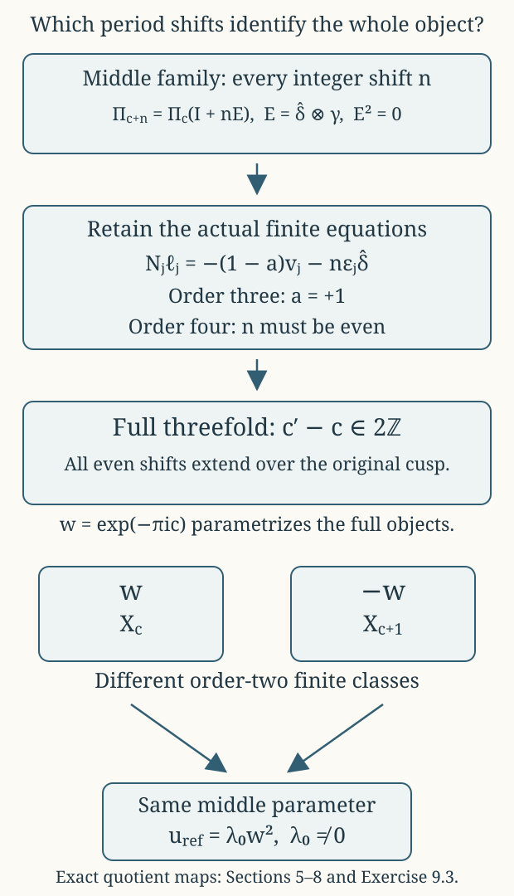

# Periods, the nonzero deformation class, and every parameter identification {#cg-s6-09}

CG-S6 · Lesson 9

The additive constant in the original last period changes the complex structure. We will construct the parameter family, calculate its exact infinitesimal class, and determine precisely when two parameters give biholomorphic threefolds. The same calculation explains why equality of the middle torus lattices loses information at a finite filling.

Retain the original solution \(\beta^{\rm part}\), every base coordinate and every affine twist from lessons 3–5. Put
\[
\begin{gathered}
\beta_c=\beta^{\rm part}+c,\qquad
D_c(z)=\operatorname{Im}\beta_c(z)-
\frac{6(\operatorname{Im}\mu(z))^2}{\operatorname{Im}\tau(z)},\\
M=\max_{B\setminus\{p_0\}}D_{\rm part},\qquad
\mathcal P=\{c\in\mathbb C:\operatorname{Im}c<-M\},\\
\Pi_c(z)=
\begin{pmatrix}6\mu(z)&\tau(z)&1&0\\
\beta^{\rm part}(z)+c&\mu(z)&0&1\end{pmatrix}.
\end{gathered}
\tag{0.1}
\]
Lesson 4 proves existence of the finite maximum and the exact admissible half-plane. In particular \(D_c<0\) throughout every admitted threefold. The homology or smooth recognition of lesson 7 is not an input to this analytic calculation.

## 1. Constructing the full parameter family {#parameter-family}

**Theorem 1.1.** If \(Q\subset\mathcal P\) is an open disc with compact closure in \(\mathcal P\), the actual charts and overlaps give a complex fourfold and maps
\[
F:\mathcal X_Q\longrightarrow B\times Q,\qquad
\pi=\operatorname{pr}_Q\circ F:\mathcal X_Q\longrightarrow Q.
\tag{1.1}
\]
Both maps are proper, and \(\pi\) is a holomorphic submersion. Its fibre at \(c\) is exactly \(X_c\), with the original map \(f_c\), finite exponents \(3,4\), and cusp model.

**Proof on the ordinary pieces.** On a lifted ordinary base open set, the period map is (0.1). With real target coordinates ordered as
\((\operatorname{Re}\zeta_1,\operatorname{Im}\zeta_1,
\operatorname{Re}\zeta_2,\operatorname{Im}\zeta_2)\)
and the unchanged source order
\((\widehat\gamma,\widehat u,\widehat w,\widehat\delta)\),
its determinant is
\[
\operatorname{Im}\tau\cdot D_c.
\tag{1.2}
\]
It is nonzero. Its real inverse varies continuously, and is uniformly bounded on each compact base-parameter set. Thus a compact set in the covering coordinates can meet only finitely many of its integer-lattice translates: a difference \(\Pi_c\lambda\) in a fixed bounded set gives a uniform bound on \(\lambda\in\mathbb Z^4\). The lattice action is free, holomorphic and properly discontinuous. Its quotient is a complex manifold, and projection to \(Q\) is a submersion in these covering charts.

The real marking gives a continuous surjection from a compact base-parameter set times the closed parallelotope \([0,1]^4\) onto the full inverse image of that set. It proves local properness. The original covariance
\[
R_g(z)\Pi_c(z)=\Pi_c(gz)A_g
\tag{1.3}
\]
holds with \(c\) retained; the matrices \(R_g\) are independent of \(c\). The ordinary base quotient therefore has the original jointly holomorphic transition maps, with the same proper-discontinuity proof on the base.

**Finite pieces and their complete overlaps.** For \(j=1,2\), use
\[
(z,c,\zeta)\longmapsto
\left(g_jz,c,R_{g_j}(z)\zeta+
\Pi_c(g_jz)\frac{v_j}{m_j}\right),
\qquad (m_1,m_2)=(3,4).
\tag{1.4}
\]
Under the real marking this is exactly
\((z,c,u)\mapsto(g_jz,c,A_ju+v_j/m_j)\).
For a nonidentity power \(k\), the invariant integral covector \(\gamma\) evaluates its translation as \(k/3\) or \(-k/4\). These numbers are nonintegral when \(0<k<m_j\), so the action remains free at the central torus. Away from the centre the base rotation already has no fixed point. The finite quotient is étale on total spaces and a submersion to \(Q\). Its map to the base remains precisely \(t_j=s_j^{m_j}\). Properness follows from the compact parallelotope argument on the cover and the proper finite base map.

On the punctured overlap the unchanged translating section is
\[
\sigma_{j,c}(z)=\frac{\log s_j(z)}{2\pi i}\Pi_c(z)v_j.
\tag{1.5}
\]
Changing the logarithm by \(2\pi i\ell\) adds the actual period \(\ell\Pi_cv_j\). Thus (1.5) is a branch-independent torus section, jointly holomorphic in \(z,c\). Its original conjugacy calculation in lesson 3 continues to hold with this entire period column; no coefficient involving \(c\) is dropped.

**The cusp with a uniform bound.** Retain \(t_c\), \(h\), \(b^{\rm part}=\beta^{\rm part}+\tau\), the original infinite fan and
\[
C(t_c,c)=
\begin{pmatrix}
6\mu(t_c)&h(t_c)\\
b^{\rm part}(t_c)-h(t_c)+c&\mu(t_c)
\end{pmatrix},
\qquad
B_0=\begin{pmatrix}0&1\\-1&0\end{pmatrix}.
\tag{1.6}
\]
Choose the original holomorphic cusp disc of radius \(r_1\). For the Euclidean operator norm let
\[
K_Q=\max_{\substack{|t_c|\leq r_1\\c\in\overline Q}}
\|-2\pi\operatorname{Im}C(t_c,c)\|,
\qquad
0<\epsilon<\min(r_1,1),\quad
|\log\epsilon|>2K_Q.
\tag{1.7}
\]
This is a finite maximum on a compact set. The action on \(Y_\epsilon\times Q\) is
\[
(x,t_c,c)\longmapsto
\left(e^{2\pi iC(t_c,c)\lambda}
t_c^{B_0\lambda}x,t_c,c\right),
\qquad\lambda\in\mathbb Z^2.
\tag{1.8}
\]
Its toric part extends by the original fan automorphism, and its unit part extends by holomorphic torus multiplication. For \(0<|t_c|<\epsilon\),
\[
B_{t_c,c}=B_0+
\frac{-2\pi\operatorname{Im}C(t_c,c)}{\log|t_c|},
\qquad
\|B_{t_c,c}-B_0\|<\tfrac12,
\qquad
\|B_{t_c,c}\lambda\|>\tfrac12\|\lambda\|
\quad(\lambda\ne0).
\tag{1.9}
\]
The last inequality follows from \(\|B_0\lambda\|=\|\lambda\|\) and the strict perturbation bound. The bounded-chart estimates of lesson 5 now apply uniformly over \(\overline Q\): only finitely many integer translations can join any fixed pair of bounded charts. On the central fibre a nonzero translation moves the corresponding bounded cell; it has no stabilizer. Hence the action is free and properly discontinuous on the full product, including sequences tending to the central fibre.

For properness fix \(\epsilon_1<\epsilon\). Use the same finite union \(K_0\) of closed unit polydiscs whose triangles meet the closed radius-\(\sqrt2\) ball, with \(|t_c|\leq\epsilon_1\), as in lesson 5. For a nonzero \(t_c\), choose \(\lambda\) so that
\(\|B_{t_c,c}^{-1}y+\lambda\|_\infty\leq1/2\).
The translated logarithmic position has norm at most
\(3/(2\sqrt2)<\sqrt2\), by (1.9), and thus lies in a chart defining \(K_0\).
At \(t_c=0\), the same six closed bidiscs on the central toric component give representatives after translation; their exact unit multipliers remain \(e^{2\pi iC(0,c)B_0v}\). Consequently for compact \(K\subset Q\), the image of the compact set \(K_0\times K\) is the entire inverse image of \(\{|t_c|\leq\epsilon_1\}\times K\). This proves cusp properness. Projection to \(Q\) remains a submersion because every quotient chart comes from an open set of \(Y_\epsilon\times Q\).

Finally use the original exponentiation overlap, with its unchanged identity
\(Z=sB_0+C(t_c,c)\), and the two maps (1.5). Each local inverse image of a base-cover member is the entire Hausdorff local piece. Points over different base-parameter values are separated on \(B\times Q\); points over the same value lie in one such Hausdorff open piece. The gluing is Hausdorff and has the required complex charts. Covering a compact subset of \(B\times Q\) by finitely many compact subsets inside those base-cover members and applying the local properness proves that \(F\) is proper. The projection \(B\times Q\to Q\) is proper since \(B\) is compact. This proves properness of \(\pi\), and all its local charts are submersions. The fibrewise formulas are the original construction, establishing every assertion. ∎

## 2. The exact marked map and its Beltrami coefficient {#exact-beltrami}

Fix an original lift \(z\) of a regular base point and \(c_*\in Q\). In this section all periods are evaluated at that very lift. Write
\[
T=\operatorname{Im}\tau>0,\quad
m=\operatorname{Im}\mu,\quad
D=\operatorname{Im}\beta_{c_*}-\frac{6m^2}{T}<0,\quad
a=\frac mT,\quad
P=\begin{pmatrix}0&0\\-a&1\end{pmatrix}.
\tag{2.1}
\]
The letter \(m\) here is the displayed imaginary part; the finite covering orders continue to be denoted \(m_j\). Put \(\delta=c-c_*\).

**Theorem 2.1.** The exact real-linear marked map of the covering spaces is
\[
w=A_\delta\zeta+B_\delta\bar\zeta,\qquad
A_\delta=I+\frac{\delta}{2iD}P,\qquad
B_\delta=-\frac{\delta}{2iD}P.
\tag{2.2}
\]
It carries \(\Pi_{c_*}\Lambda\) onto \(\Pi_c\Lambda\) and descends to an orientation-preserving real-analytic torus diffeomorphism. In the convention that its transported \((0,1)\) space has basis
\[
\partial_{\bar\zeta_k}+\sum_j(\nu_\delta)^j_k\partial_{\zeta_j},
\tag{2.3}
\]
one has
\[
\nu_\delta=\frac{\delta}{2iD+\delta}P.
\tag{2.4}
\]

**Proof.** Write \(\zeta=\Pi_{c_*}u\), with \(u\in\mathbb R^4\) in the original lattice order. The two imaginary-part equations are
\[
\operatorname{Im}\zeta_1=6mu_1+Tu_2,\qquad
\operatorname{Im}\zeta_2=(D+6m^2/T)u_1+mu_2.
\tag{2.5}
\]
Subtracting \(a\) times the first from the second gives
\[
u_1=\frac{\operatorname{Im}\zeta_2-a\operatorname{Im}\zeta_1}{D}.
\tag{2.6}
\]
Keeping the same real vector \(u\) at parameter \(c\) gives
\(w=\Pi_cu=\zeta+\delta e_2u_1\), where \(e_2=(0,1)^{\mathsf t}\).
Insert (2.6) and the identity
\(\operatorname{Im}\zeta=(\zeta-\bar\zeta)/(2i)\); this proves (2.2).

The map is exactly \(\Pi_c\Pi_{c_*}^{-1}\) as a real-linear map. It therefore has the asserted lattice action and is invertible, with real determinant
\[
\frac{D+\operatorname{Im}\delta}{D}>0.
\tag{2.7}
\]
Both numerator and denominator are negative by admissibility.

Since \(P^2=P\),
\[
\det A_\delta=1+\frac{\delta}{2iD},\qquad
A_\delta^{-1}=I-\frac{\delta}{2iD+\delta}P.
\tag{2.8}
\]
The denominator could vanish only at \(\delta=-2iD\). There the new value in (2.7) would be \(D-2D=-D>0\), outside the admitted half-plane. Thus (2.8) is defined for every \(c\in Q\).

A vector in (2.3) belongs to the new \((0,1)\) space exactly when it annihilates the holomorphic coordinate column \(w\). By (2.2) this condition is
\(B_\delta+A_\delta\nu_\delta=0\). Multiplication by the inverse in (2.8) gives (2.4), with its stated sign. ∎

## 3. A nonzero infinitesimal class with its precise sign {#fibre-kodaira-spencer}

Differentiating (2.4) at \(\delta=0\) gives the global invariant tangent-valued form
\[
\dot\nu=
\frac1{2iD}\,
\partial_{\zeta_2}\otimes
(d\bar\zeta_2-a\,d\bar\zeta_1).
\tag{3.1}
\]
The Dolbeault group \(H^{0,1}(F_*,T^{1,0}F_*)\) means the kernel of \(\bar\partial\) on tangent-valued \((0,1)\)-forms modulo \(\bar\partial\) of smooth \((1,0)\) vector fields. The invariant coefficients make (3.1) closed.

**Proposition 3.1.** The class of (3.1) is nonzero. For the tangent-extension convention
\(\operatorname{KS}(\partial_c)=[\bar\partial h]\), with \(h\) a smooth \((1,0)\) lift of \(\partial_c\), the actual fibre class is
\[
\operatorname{KS}_{F_*}(\partial_c)=-[\dot\nu]\ne0.
\tag{3.2}
\]

**Proof of nonvanishing.** The invariant vector fields
\(\partial_{\zeta_1},\partial_{\zeta_2}\) give a global holomorphic frame of the tangent bundle of the torus. A smooth vector field is thus \(V=V^1\partial_{\zeta_1}+V^2\partial_{\zeta_2}\), with smooth periodic coefficients on the covering space.

Integrate with respect to the translation-invariant probability volume of the actual torus. A constant real vector field preserves this volume, and
\(\int V^j(x+tv)\,dx\) is independent of \(t\) by translation invariance. Differentiating under the integral gives \(\int\partial_vV^j=0\). Complex constant derivatives, including \(\partial_{\bar\zeta_k}\), are complex-linear combinations of these real derivatives and also have zero integral.

If (3.1) were \(\bar\partial V\), its coefficient of
\(\partial_{\zeta_2}\otimes d\bar\zeta_2\) would have zero integral. That coefficient is the nonzero constant \(1/(2iD)\), whose integral is itself. This is a contradiction.

**Proof of the sign.** The real marking of the family gives the smooth \((1,0)\) lift
\[
h=\partial_c+u_1\partial_{w_2}
\tag{3.3}
\]
in the moving holomorphic fibre coordinates, evaluated at \(c_*\). It is a global lift: when a period changes \(u_1\) by the corresponding integer component, differentiation of that same moving period changes the coordinate expression of \(\partial_c\) by the compensating vertical term. Equivalently (3.3) is obtained directly by differentiating the globally defined real marking in Theorem 2.1.

At \(c_*\), \(w=\zeta\), and (2.6) gives
\[
\bar\partial u_1=
-\frac{d\bar\zeta_2-a\,d\bar\zeta_1}{2iD}.
\tag{3.4}
\]
Hence \(\bar\partial h=-\dot\nu\), proving (3.2).

This also obstructs a first-order holomorphic trivialization without presuming a dimension formula for a deformation space. Such a trivialization would give a holomorphic lift \(h_0\) of \(\partial_c\). The difference \(h-h_0\) would be a smooth vertical vector field \(V\) with \(\bar\partial V=-\dot\nu\), contradicting the integral just computed. ∎

## 4. Detecting the deformation of the whole threefold {#global-kodaira-spencer}

Variation of one chosen fibre is not by itself the required statement about the whole threefold: a hypothetical trivialization might move the map to the base. We now prove the exact relation using the intrinsic canonical pencil from lesson 8, including its first-order base change.

### 4.1. The relative pencil over the full parameter disc

Let \(\mathcal S_2\subset\mathcal X_Q\) be the reduced divisor over \(p_2\times Q\). The original local equation gives
\(F^*(p_2\times Q)=4\mathcal S_2\).
Using relative differential forms over \(Q\), the full calculation in lesson 8 gives
\[
\omega_{\mathcal X_Q/Q}\simeq\mathcal O_{\mathcal X_Q}(-2\mathcal S_2),
\qquad
\omega_{\mathcal X_Q/Q}^{-2}
\simeq F^*\operatorname{pr}_B^*\mathcal O_B(p_2).
\tag{4.1}
\]
Here is why the isomorphism is genuinely relative. On a middle chart the fibre frame is \(d\zeta_1\wedge d\zeta_2\). On the cusp the relative canonical frame is
\((dx_1/x_1)\wedge(dx_2/x_2)\wedge dt_c\).
Transition terms containing \(dc\) vanish in relative forms. The finite matrices \(R_g\), their determinant characters, their exact correcting functions \(\varphi_j\), and \(\Theta\) are all independent of \(c\); their actual expressions in lesson 8 remain unchanged. Evaluation thus has the same exact exponents \(0,2\). The same functions \(1/(t-1)\) and \(dt/(t-1)^2\) identify the base factors. All these are identities of transition functions on the parameter charts, so they give (4.1), rather than unrelated isomorphisms on separate fibres.

### 4.2. The complete pencil after infinitesimal base change

Set \(A=\mathbb C[\varepsilon]/(\varepsilon^2)\), base-change by
\(c=c_*+\varepsilon\), and denote the resulting space by \(X_A\). It is locally the original coordinate domain with holomorphic functions tensored by \(A\). Put
\[
L_A=\omega_{X_A/A}^{-2},\qquad
L_*=\omega_{X_{c_*}}^{-2}.
\tag{4.2}
\]
Its local free modules give the exact sequence
\[
0\longrightarrow L_*
\xrightarrow{\ \varepsilon\ } L_A
\longrightarrow L_*\longrightarrow0.
\tag{4.3}
\]
Choose the same two sections of \(\mathcal O_B(p_2)\) as in lesson 8,
\[
\sigma_{p_2}=1,\qquad
\ell=\frac{A_0}{t-1}+B'_0,\qquad A_0\ne0.
\tag{4.4}
\]
Their pullbacks under (4.1) give sections \(s_0,s_1\) of \(L_A\) whose reductions are a basis of \(H^0(X_{c_*},L_*)\).

**Lemma 4.1.** The complete section module, with its evaluation, is
\[
H^0(X_A,L_A)=As_0\oplus As_1.
\tag{4.5}
\]
It is base-point-free, and its map is \(f_A\) followed by the original fixed coordinate isomorphism
\(t\mapsto[t-1:A_0+B'_0(t-1)]\).

**Proof.** A section reduces to a complex combination of \(\bar s_0,\bar s_1\). Subtract that combination of the lifted sections. The remainder is in the kernel of the last map of (4.3), so it is the image of a unique global section of \(L_*\) under multiplication by \(\varepsilon\). This uses left exactness of global sections and the injective first map, not a presumed surjectivity on cohomology. Express that remaining section in the same basis. This proves generation in (4.5).

For independence reduce an \(A\)-linear relation modulo \(\varepsilon\); the two constant coefficients vanish. Injectivity in (4.3) then makes both remaining \(\varepsilon\)-coefficients vanish. Finally at every point one of the two reduced sections is nonzero by lesson 8. Its coefficient in a local frame is a unit in \(A\)-valued holomorphic functions: \(a+\varepsilon b\) has inverse \(a^{-1}-\varepsilon ba^{-2}\) when \(a\ne0\). Thus evaluation is surjective there. Formula (4.1) identifies the resulting projective map exactly as asserted. ∎

### 4.3. All three critical values remain fixed to first order

Suppose \(X_A\) were isomorphic to \(X_{c_*}\times\operatorname{Spec}A\) by an isomorphism reducing to the identity. The relative canonical bundle, all its sections, and their evaluation are intrinsic. By (4.5), such an isomorphism would identify the two original maps to the base up to
\(b_A\in\operatorname{PGL}_2(A)\) reducing to the identity.

We must determine this base map over \(A\), including its nilpotent part. At a finite covering chart the original equation is \(t_j=s_j^{m_j}\). The relative critical ideal is
\[
(s_j^{m_j-1}),
\tag{4.6}
\]
because the coefficient \(m_j\) is a nonzero unit over \(\mathbb C\). In its critical ring \(t_j=0\). The map from \(A\) into that ring is injective: evaluation at \(s_j=0\) and at a local constant torus coordinate is a retraction. Since the total-space quotient is étale, these charts compute the intrinsic critical ideal downstairs as well.

At a triple cusp chart, \(t_c=z_0z_1z_2\), so the critical ideal is
\[
(z_1z_2,z_0z_2,z_0z_1).
\tag{4.7}
\]
Again \(t_c=0\) in that ring, and evaluation at the triple origin retracts it onto \(A\). A double chart has \(t_c=z_0z_1\) and ideal \((z_0,z_1)\); a smooth chart has no critical point. There are no other critical fibres.

Thus the scheme-theoretic images of the critical loci are exactly the three constant sections \(p_1,p_2,p_0\) of the base over \(A\). More explicitly, the kernel of the base-ring map on each displayed critical chart is exactly \((t_j)\) or \((t_c)\): the coordinate maps to zero and the remaining constant \(A\) injects. This excludes an extra infinitesimal displacement or a thickening of that base section.

A map reducing to the identity cannot permute three distinct closed points. Hence \(b_A\) fixes each of the three sections. Write its first-order expression in the original affine coordinate as
\[
b_A(t)=t+\varepsilon(b_0+b_1t+b_2t^2).
\tag{4.8}
\]
This follows by expanding an invertible \(2\times2\) matrix equal to the identity modulo \(\varepsilon\). Fixing \(0\) gives \(b_0=0\); fixing \(1\) gives \(b_0+b_1+b_2=0\). In the coordinate \(v=1/t\), the variation is
\(-\varepsilon(b_0v^2+b_1v+b_2)\), so fixing infinity gives \(b_2=0\). All coefficients vanish: \(b_A\) is the identity.

The hypothetical trivialization would therefore preserve the original \(f\). Restricting to any regular base value would give a first-order trivialization of the torus family of Section 3, which is impossible.

### 4.4. The actual global Kodaira–Spencer class

For completeness the needed implication from the class to the trivialization can be written directly. Choose local holomorphic product coordinates for the submersion \(\pi\). Differentiate each transition map in \(c\) at \(c_*\), and compose with its inverse to express the derivative as a holomorphic tangent vector on the overlap. Differentiating the triple-overlap composition law shows that these vectors are a Čech one-cocycle with values in \(T_{X_{c_*}}\).

Its cohomology class is the Kodaira–Spencer class of the tangent extension, with the convention already fixed in (3.2). If the class is zero, after a refinement its overlap vectors are differences of holomorphic vector fields on the individual coordinate domains. Change each local coordinate by that vector field times \(\varepsilon\), with the sign chosen opposite to the overlap difference. Substituting into the transition map and using \(\varepsilon^2=0\) cancels its entire first-order term. The adjusted charts glue to the identity-reducing trivialization. This is also the elementary degree-one sheaf-cohomology interpretation: local splittings of an extension differ by a one-cocycle, and a zero class permits them to be changed to agree.

The preceding contradiction consequently proves
\[
\operatorname{KS}_{X_{c_*}}(\partial_c)\ne0
\quad\hbox{in }H^1(X_{c_*},T_{X_{c_*}}),
\qquad
\dim_{\mathbb C}H^1(X_{c_*},T_{X_{c_*}})\geq1.
\tag{4.9}
\]
The bridge from the fibre calculation to (4.9) is the complete relative canonical pencil and its three fixed critical sections.

## 5. Every possible linear part over the original base {#complete-centralizer}

Let \(e=(0,1)^{\mathsf t}\) and retain the rank-one lattice endomorphism
\[
E=\widehat\delta\otimes\gamma
=\begin{pmatrix}0&0&0&0\\0&0&0&0\\0&0&0&0\\1&0&0&0\end{pmatrix}.
\tag{5.1}
\]
Thus \(E^2=0\), \(\Pi_cE=e\gamma\), and the original monodromy matrices satisfy \(A_jE=EA_j=E\). For an integer \(n\), put \(S_n=I+nE\). Directly from the full periods,
\[
S_n^{-1}=S_{-n},\qquad
\Pi_{c+n}=\Pi_cS_n,\qquad
\Pi_{c+n}\Lambda=\Pi_c\Lambda.
\tag{5.2}
\]
The identity of \(\mathbb C^2\) identifies the middle families, since it also commutes with the unchanged \(R_g\)-action. Its source-to-target lattice map is \(S_{-n}\), as \(\Pi_{c+n}S_{-n}=\Pi_c\).

To classify all possible maps, we need the full centralizer, not just these examples.

**Lemma 5.1.** The simultaneous rational centralizer of the original \(A_1,A_2\) is
\[
\{aI+bE:a,b\in\mathbb Q\}.
\tag{5.3}
\]
Every biholomorphism between two middle families over the identity of \(B^\circ\) forces \(c'-c\in\mathbb Z\). Its complex-linear part is \(I_2\) or \(-I_2\).

**Proof of (5.3).** Solving the displayed matrices from lesson 6 gives
\[
\begin{aligned}
(\Lambda\otimes\mathbb Q)^{A_1}
&=\mathbb Q(1,2,-4,0)^{\mathsf t}+\mathbb Q\widehat\delta,\\
(\Lambda\otimes\mathbb Q)^{A_2}
&=\mathbb Q(1,3,-3,0)^{\mathsf t}+\mathbb Q\widehat\delta .
\end{aligned}
\tag{5.4}
\]
Their intersection is \(\mathbb Q\widehat\delta\): equating the first, second and third coordinates of the two expressions first equates their coefficients and then forces those coefficients to be zero. The respective fixed covector spaces are
\[
\mathbb Q\gamma+\mathbb Q(2u+w+3\delta),\qquad
\mathbb Q\gamma+\mathbb Q(u+w+2\delta).
\tag{5.5}
\]
Their intersection is \(\mathbb Q\gamma\), because comparing the \(u,w\) coefficients gives \(2x=y\) and \(x=y\), hence \(x=y=0\).

A commuting endomorphism \(H\) therefore preserves both \(\mathbb Q\widehat\delta\) and \(\ker\gamma\). On
\(\ker\gamma/\mathbb Q\widehat\delta\), in the unchanged classes of \(\widehat u,\widehat w\), the two induced matrices are
\[
Q_1=\begin{pmatrix}0&1\\-1&-1\end{pmatrix},
\qquad Q_2=\begin{pmatrix}0&-1\\1&0\end{pmatrix}.
\tag{5.6}
\]
Commutation with \(Q_2\) gives a matrix
\(\begin{pmatrix}b&d\\-d&b\end{pmatrix}\); substitution into the \(Q_1\) equation gives \(d=0\).
Thus the four columns of \(H\) have the form
\[
\begin{aligned}
H\widehat\gamma&=(a,r,s,k)^{\mathsf t},&
H\widehat u&=b\widehat u+u_0\widehat\delta,\\
H\widehat w&=b\widehat w+w_0\widehat\delta,&
H\widehat\delta&=d_0\widehat\delta .
\end{aligned}
\tag{5.7}
\]
Use the actual columns
\(A_1\widehat u=-\widehat w+\widehat\delta\),
\(A_1\widehat w=\widehat u-\widehat w\),
\(A_2\widehat u=\widehat w\).
Their commutation equations give
\[
d_0-w_0=b+u_0,\qquad
u_0=2w_0,\qquad w_0=u_0.
\tag{5.8}
\]
Hence \(u_0=w_0=0\) and \(d_0=b\). Commutation on \(\widehat\gamma\) with \(A_1\) gives
\(r=2(a-b),\ s=-4(a-b)\); with \(A_2\) it also gives \(r=-s\).
These equalities force \(a=b\) and \(r=s=0\), so \(H=aI+kE\).
Conversely \(I,E\) commute with both matrices, proving (5.3) in both directions.

**Proof for holomorphic maps.** A map between compact complex tori lifts to a map of their simply connected vector covers. Its derivative is periodic: translation by a source lattice vector changes the lift by a constant target lattice vector. Its entries therefore descend to holomorphic functions on the compact source torus and are constant. The lift is affine, with a complex-linear part \(L\).

In a holomorphic family the linear parts are holomorphic and their integer lattice maps are locally constant. A map over the identity of the original base consequently gives an automorphism \(H\) of its marked local system commuting with both original monodromies. By (5.3), \(H=aI+bE\); its entries force \(a,b\in\mathbb Z\), and its determinant is \(a^4\). Invertibility over \(\mathbb Z\) gives \(a=\pm1\). The full period equation is
\[
L(z)\Pi_c(z)=\Pi_{c'}(z)(aI+bE).
\tag{5.9}
\]
Its third and fourth columns are the standard complex-coordinate vectors. They force \(L=aI_2\). Its first column then gives \(a(c'-c)+b=0\). Thus \(c'-c=-b/a\in\mathbb Z\), as asserted. ∎

## 6. The exact obstruction in the finite fillings {#finite-parity-obstruction}

Put \(\epsilon_1=1,\epsilon_2=-1\), the unchanged values \(\gamma(v_j)\).
The cyclic norm matrices on the original homology lattice are
\[
\begin{aligned}
N_1=I+A_1+A_1^2
&=\begin{pmatrix}3&0&0&0\\6&0&0&0\\-12&0&0&0\\0&2&1&3\end{pmatrix},\\
N_2=I+A_2+A_2^2+A_2^3
&=\begin{pmatrix}4&0&0&0\\12&0&0&0\\-12&0&0&0\\0&2&2&4\end{pmatrix}.
\end{aligned}
\tag{6.1}
\]

Suppose a local biholomorphism over the identity of \(D_j\) extends a middle map with \(c'=c+n\), \(n\in\mathbb Z\), and linear part \(aI_2\), \(a=\pm1\). The normalized base change by \(t_j=u^{m_j}\) is the original covering torus family \(J'_j\), by lesson 3's full branch calculation. This is an actual functorial identification: an isomorphism of the base-changed local rings carries every element integral over the original ring to an integral element, as does its inverse. Hence it lifts uniquely to their integral closures. It commutes with the original rotation generator; both composites lift the same rotation of the same base-changed space. There is no freedom to replace that generator by a different coprime power.

Its translating torus section on the covering disc lifts holomorphically to a vector \(B_j(z)\), since the disc is simply connected and
\(\Delta_j\times\mathbb C^2\to J'_j\) is a covering map with holomorphic local inverses. Equivariance under (1.4), and the equality of integer-shift lattices in (5.2), give
\[
B_j(g_jz)-R_{g_j}(z)B_j(z)
=
\Pi_c(g_jz)\left(
\frac{(1-a)v_j+n\epsilon_j\widehat\delta}{m_j}
+\ell_j\right),
\qquad \ell_j\in\Lambda.
\tag{6.2}
\]
The integer column is locally constant by discreteness and hence constant on the connected disc. Iterating the equation \(m_j\) times returns to the same vector coordinates. Covariance transports the successive lattice columns by the full \(A_j\). Since \(A_jv_j=v_j\) and \(A_j\widehat\delta=\widehat\delta\), the exact resulting equality is
\[
N_j\ell_j=-(1-a)v_j-n\epsilon_j\widehat\delta.
\tag{6.3}
\]
The real period map is injective, so this is equality of lattice columns, not merely equality modulo periods.

For \(a=-1\), apply \(\gamma\) to (6.3). It gives
\(m_j\gamma(\ell_j)=-2\epsilon_j\), impossible already for \(m_1=3\).
Thus a global map must have positive linear part.

For \(a=1\), the first row of (6.3) gives \(\gamma(\ell_j)=0\).
Equation (6.1) then permits every integer \(n\) at \(j=1\), but only even \(n\) at \(j=2\). The obstruction is the exact class
\[
[-n\epsilon_j\widehat\delta]\in\Lambda^{A_j}/N_j\Lambda.
\tag{6.4}
\]
The integral fixed bases follow from (5.4), whose first coordinate recovers the coefficient of its primitive first vector. Formula (6.1) gives
\[
\begin{aligned}
N_1\Lambda&=3\mathbb Zv_1\oplus\mathbb Z\widehat\delta,\\
N_2\Lambda&=4\mathbb Z(1,3,-3,0)^{\mathsf t}
\oplus2\mathbb Z\widehat\delta.
\end{aligned}
\tag{6.5}
\]
Consequently the groups in (6.4) are \(\mathbb Z/3\) and
\(\mathbb Z/4\oplus\mathbb Z/2\), respectively. The class of \(\widehat\delta\) is zero in the first and generates the second summand in the second. This proves the parity obstruction for every possible affine lift.

## 7. Constructing the global map for every even shift {#even-shift-maps}

The obstruction just proved has a complete converse. Fix \(n\in2\mathbb Z\).

### 7.1. The finite maps and their logarithmic overlap

Use the following rational vectors and integral columns, in the original lattice:
\[
\begin{aligned}
r_1&=-\frac n3(\widehat u+\widehat w),&
\ell_1&=-n\widehat w,&
b_1(z)&=-\frac n3(\tau(z)+1,\mu(z))^{\mathsf t},\\
r_2&=\frac n4(\widehat u+\widehat w),&
\ell_2&=\frac n2\widehat u,&
b_2(z)&=\frac n4(\tau(z)+1,\mu(z))^{\mathsf t}.
\end{aligned}
\tag{7.1}
\]
Here \(b_j=\Pi_cr_j\); these vectors are independent of \(c\).
Multiplication by the full matrices gives
\[
(I-A_j)r_j=\frac{n\epsilon_j}{m_j}\widehat\delta+\ell_j,
\tag{7.2}
\]
with entries \((0,0,-n,n/3)^{\mathsf t}\) for \(j=1\), and
\((0,n/2,0,-n/4)^{\mathsf t}\) for \(j=2\).
Covariance (1.3) turns (7.2) into (6.2) for \(a=1\).
Thus translation by \(b_j\) is an isomorphism of the two finite fillings.

Retain the original logarithm and phase:
\[
w_j=\frac{\log s_j}{2\pi i},\qquad
a_j=b_j+n\epsilon_jw_je.
\tag{7.3}
\]
A logarithm change adds an integer multiple of the actual period
\(n\epsilon_j\Pi_c\widehat\delta\), so \(a_j\) is a well-defined torus section. Since \(w_j(g_jz)=w_j(z)-1/m_j\), the exact equation is
\[
a_j(g_jz)=R_{g_j}(z)a_j(z)+\Pi_c(g_jz)\ell_j.
\tag{7.4}
\]
Moreover the original gluing translations (1.5) satisfy
\[
\sigma_{j,c+n}-\sigma_{j,c}=n\epsilon_jw_je.
\tag{7.5}
\]
Thus (7.3) is exactly the middle translation induced by the finite local map, with its entire overlap retained.

### 7.2. The cusp map on every original cone

The full cusp action in (1.8) is identical for \(c\) and \(c+n\), since
\[
(C(t_c,c+n)-C(t_c,c))\lambda=(0,n\lambda_1)^{\mathsf t},
\qquad
e^{2\pi i n\lambda_1}=1.
\tag{7.6}
\]
This identity retains all other entries and all nonconstant units in \(C\).

The affine cocycle in the convention of (7.4) has rule
\[
\ell_{gh}=\ell_g+A_g\ell_h.
\tag{7.7}
\]
For the original relation \(g_0=(g_1g_2)^{-1}\), the columns in (7.1) give
\[
\ell_1+A_1\ell_2=-\frac{3n}{2}\widehat w+\frac n2\widehat\delta,
\qquad
\ell_0=-A_{g_0}(\ell_1+A_1\ell_2)
=\frac{3n}{2}\widehat w-\frac n2\widehat\delta.
\tag{7.8}
\]
The last equality uses that \(A_{g_0}\) fixes both original toric lattice vectors.

Put
\[
q_n=(-3n/2,n/2)^{\mathsf t}\in\mathbb Z^2,\qquad
a_0=sq_n,\qquad s=\tau-h,\quad e^{2\pi is}=t_c.
\tag{7.9}
\]
The original generator has \(s(g_0z)=s(z)-1\), so
\(a_0(g_0z)-a_0(z)=-q_n=\Pi_c(g_0z)\ell_0\), as required.
Exponentiation sends this translation to
\[
(x,t_c)\longmapsto(t_c^{q_n}x,t_c).
\tag{7.10}
\]
It extends to every original cusp chart. Indeed the lattice map
\((y,y_3)\mapsto(y+y_3q_n,y_3)\) translates each height-one triangle by the integral vector \(q_n\). The original fan contains all such translates, so this is a fan automorphism with inverse given by \(-q_n\). It commutes with the identical actions (7.6). This proves extension across all central strata.

### 7.3. Solving the remaining additive gluing problem

On the universal cover of \(B^\circ\), the fundamental group is free on the two original peripheral generators. Assign the two columns \(\ell_1,\ell_2\) in (7.1) to them and extend by (7.7), with \(\ell_{g^{-1}}=-A_g^{-1}\ell_g\). Freeness gives a well-defined integral cocycle, with cusp value (7.8). Covariance makes
\[
(z,y)\longmapsto
(gz,R_g(z)y+\Pi_c(gz)\ell_g)
\tag{7.11}
\]
an affine action: substituting into a composition gives
\(\ell_g+A_g\ell_h\) exactly. Its quotient is an affine holomorphic bundle over \(B^\circ\), using evenly covered base opens as local charts.

Near a finite point prescribe the local section to differ from \(a_j\) by a vector \(\eta_j\) holomorphic on the entire original covering disc and satisfying
\(\eta_j(g_jz)=R_{g_j}(z)\eta_j(z)\).
Near the cusp prescribe difference from \(a_0\) by an ordinary holomorphic vector \(\eta_0(t_c)\).
Equations (7.4) and (7.8) make these prescriptions compatible with (7.11) on the punctured overlaps. They define a locally nonempty affine sheaf \(\mathscr H_n\) on the full \(B\).

Its difference sheaf \(\mathscr V\) fits into
\[
0\longrightarrow\mathcal O_Be\longrightarrow\mathscr V
\longrightarrow\mathcal L\longrightarrow0,
\qquad \mathcal L\simeq\mathcal O_B(-p_0).
\tag{7.12}
\]
Here the last map is the first coordinate. Its first-coordinate transformation factors are exactly \(-1/\tau,1/\tau\) from (2.3), and its cusp extension is ordinary holomorphicity. Dividing by the original \(\Theta\) of lesson 4 gives the usual holomorphic stalks at the two finite points, since its orders there are two and one, and gives the ideal of \(p_0\) at the cusp, since \(\Theta\) has a simple pole. This proves the stated identification of \(\mathcal L\) with the original homogeneous period sheaf.

There is no omitted off-diagonal condition in (7.12). Given a first-coordinate equivariant function at a finite point, start with the vector having that first coordinate and zero second coordinate, and average under the finite action on vector-valued functions. Its first coordinate remains the specified one, and the resulting entire vector is equivariant. The kernel consists exactly of invariant second-coordinate functions; their power series are functions of \(t_j=s_j^{m_j}\), multiplied by \(e\). The ordinary and cusp stalks have the same evident lifting property. Thus (7.12) is exact and \(\mathscr V\) is locally free.

Lesson 4, Lemma 2.1, proves
\(H^1(B,\mathcal O_B)=H^1(B,\mathcal O_B(-p_0))=0\)
by the complete additive Laurent-series construction. Its second vanishing retains the transition shift by one, leaving no missing exponent. Hence (7.12) gives \(H^1(B,\mathscr V)=0\).
More explicitly, choose local affine sections \(h_\alpha\) of \(\mathscr H_n\).
Their differences \(d_{\alpha\beta}=h_\beta-h_\alpha\) form a \(\mathscr V\)-valued cocycle. Project it to \(\mathcal L\), solve its additive cocycle, and lift those local corrections to \(\mathscr V\) using the finite averaging just given. Subtracting their coboundary leaves an \(\mathcal O_Be\)-valued cocycle. Solve that scalar cocycle as well. The resulting corrections \(v_\alpha\) satisfy
\(d_{\alpha\beta}=v_\beta-v_\alpha\), so \(h_\alpha-v_\alpha\) glue to a global section \(a\). In particular,
\[
a=a_j+\eta_j\quad(j=1,2),\qquad
a=a_0+\eta_0\quad\hbox{at the cusp}.
\tag{7.13}
\]
All these are actual holomorphic corrections. Their ambiguity is exactly \(\mathbb Ce\), since (7.12) has \(H^0(B,\mathcal L)=0\).

### 7.4. The maps, their inverses, and their exact agreement

The required local biholomorphisms are
\[
\begin{aligned}
F_{\rm mid}[z,\zeta]&=[z,\zeta+a(z)],\\
F_j[z,\zeta]&=[z,\zeta+b_j(z)+\eta_j(z)]\quad(j=1,2),\\
F_0[x,t_c]&=[e^{2\pi i\eta_0(t_c)}t_c^{q_n}x,t_c].
\end{aligned}
\tag{7.14}
\]
The middle map descends because the affine discrepancies in (7.11) are actual periods. The finite maps descend by (6.2), (7.2) and the covariance of \(\eta_j\). The cusp map descends by (7.6); its unit factor extends by torus multiplication, and its integral factor extends by the fan map (7.10). Each has the inverse given by the negative translation or inverse unit and inverse fan map.

On a finite overlap let \(h_{j,c}(\zeta)=\zeta+\sigma_{j,c}\) be the original gluing. Equations (7.5) and (7.13) give
\[
h_{j,c+n}F_j=F_{\rm mid}h_{j,c},
\tag{7.15}
\]
since both sides add
\(\sigma_{j,c+n}+b_j+\eta_j=\sigma_{j,c}+a\).
On the cusp overlap, exponentiation of (7.13) gives
\(e^{2\pi ia}=t_c^{q_n}e^{2\pi i\eta_0}\), exactly the third map in (7.14).
Thus the maps and their inverses glue to a global biholomorphism \(X_c\to X_{c+n}\) over the original \(B\).

These choices can also be made coherently. Both initial columns in (7.1) have \(\gamma(\ell_j)=0\). Since every \(A_g\) preserves \(\gamma\), all columns \(\ell_g\) have this property, so \(\Pi_c\ell_g\) is independent of \(c\). The local sections and the difference sheaf are also independent of \(c\). Carry out the additive construction once at \(n=2\); for \(n=2k\), multiply that entire chosen correction by \(k\). The resulting jointly holomorphic maps satisfy
\[
F_{2h,c+2k}\circ F_{2k,c}=F_{2(h+k),c},
\qquad F_{0,c}=\operatorname{id}.
\tag{7.16}
\]
This follows directly by addition of the first two translations in (7.14), and multiplication of its cusp units with addition of their integral exponents.

## 8. The complete identification theorem and the parameter disc {#parameter-classification}

**Theorem 8.1.** For any \(c,c'\in\mathcal P\),
\[
X_c\simeq X_{c'}\quad\Longleftrightarrow\quad c'-c\in2\mathbb Z.
\tag{8.1}
\]
Every such biholomorphism preserves the original labelled map to \(B\).
For each even shift, (7.14) constructs one whose complex-linear part is \(I_2\) and whose source-to-target lattice map is \(I-nE\).

**Proof.** By lesson 8, Corollary 7.2, a biholomorphism preserves the original fibration up to a base isomorphism. The non-normal reduced cusp and the smooth reduced fibres of multiplicities three and four have different intrinsic types. Their base points are therefore fixed individually. In the original coordinate they are \(\infty,0,1\); the base map is the identity.

Lemma 5.1 now forces an integer shift and linear part \(\pm I_2\).
The exact lifted finite equation (6.3) excludes the negative part and then excludes odd shifts for the positive part. Conversely Section 7 constructs the entire glued isomorphism for every even shift. Its lattice map is the one computed in (5.2), since translations have trivial derivative. This proves both directions and the stated map. ∎

As a complex parameter space for the isomorphism classes represented by this retained family, the quotient has the exact coordinate
\[
\mathcal P/(2\mathbb Z)\longrightarrow
\{w\in\mathbb C:0<|w|<e^{-\pi M}\},
\qquad w=e^{-\pi ic}.
\tag{8.2}
\]
Indeed \(|w|=e^{\pi\operatorname{Im}c}\); equal exponential values are equivalent to a difference in \(2\mathbb Z\). Every nonzero value in the displayed disc has a logarithm giving a parameter in \(\mathcal P\). The derivative \(-\pi i e^{-\pi ic}\) never vanishes, and the local inverse logarithms give its quotient complex structure.

The middle family alone identifies integer shifts and therefore has coordinate \(w^2=e^{-2\pi ic}\). The map from (8.2) to that middle parameter disc is exactly two-to-one. Its two lifts are distinguished by the order-two class (6.4) at the order-four filling. Thus the precise defect of the middle identification defines the double cover in (8.2), with its exact map \(w\mapsto w^2\).

The statement concerns every parameter and every isomorphism within the retained family. It makes no assertion that this family exhausts all deformations of a member or all compact complex threefolds with those fibre types.

{.compact-diagram #period-identification-diagram}

Figure 1. The finite norm equation retains the order-two class lost by the middle family. The two full parameter values have the same original reference multiplier. This is a diagram of the proved quotient maps, with the exact radius and phase specified in (8.2) and (9.7). The [figure source](../checks/draw_period_identifications.py) reproduces it.

## 9. Four worked exercises {#solved-exercises}

### Exercise 9.1. Compose the actual marked maps

Apply a shift \(\delta_1\) and then a shift \(\delta_2\), with all three parameters in the admitted half-plane. Prove that the exact real-linear maps of Section 2 compose to the map for \(\delta_1+\delta_2\), retaining the changed value of \(D\).

**Solution.** Set \(y=\operatorname{Im}\zeta_2-a\operatorname{Im}\zeta_1\).
The first map is
\[
w=\zeta+\delta_1 e_2y/D.
\tag{9.1}
\]
The value at the new parameter is \(D_1=D+\operatorname{Im}\delta_1\), while \(T,m,a\) are unchanged. Consequently
\[
\operatorname{Im}w_2-a\operatorname{Im}w_1
=y+\operatorname{Im}\delta_1\,y/D=D_1y/D.
\tag{9.2}
\]
The next map adds
\(\delta_2e_2(D_1y/D)/D_1=\delta_2e_2y/D\).
The final expression is exactly
\(\zeta+(\delta_1+\delta_2)e_2y/D\), proving the claim on every covering vector and therefore on every marked lattice element.

In the complex-linear/antilinear decomposition this identity reads
\[
\begin{aligned}
A_{\delta_2,D_1}A_{\delta_1,D}
+B_{\delta_2,D_1}\overline{B_{\delta_1,D}}
&=A_{\delta_1+\delta_2,D},\\
A_{\delta_2,D_1}B_{\delta_1,D}
+B_{\delta_2,D_1}\overline{A_{\delta_1,D}}
&=B_{\delta_1+\delta_2,D}.
\end{aligned}
\tag{9.3}
\]
The bars occur because the second map acts on the conjugate of the entire first map. Equations (9.1)–(9.2) prove both coefficients at once. Keeping \(D\) instead of \(D_1\) in the second map would leave the extra term
\(\delta_2\operatorname{Im}\delta_1\,e_2y/D^2\), which is generally nonzero.

### Exercise 9.2. One period shift versus two, on all three fillings

Evaluate the exact local corrections at \(n=2\). Then explain why the equality of middle lattices for \(n=1\) cannot extend to a global biholomorphism, even after arbitrary local translations.

**Solution.** At \(n=2\), the columns and vectors are
\[
\begin{gathered}
r_1=-\tfrac23(\widehat u+\widehat w),\qquad
\ell_1=-2\widehat w,\qquad
b_1=-\tfrac23(\tau+1,\mu)^{\mathsf t},\\
r_2=\tfrac12(\widehat u+\widehat w),\qquad
\ell_2=\widehat u,\qquad
b_2=\tfrac12(\tau+1,\mu)^{\mathsf t},\\
q_2=(-3,1)^{\mathsf t},\qquad
\ell_0=3\widehat w-\widehat\delta .
\end{gathered}
\tag{9.4}
\]
The complete matrix differences are
\[
(I-A_1)r_1=(0,0,-2,2/3)^{\mathsf t},
\qquad
(I-A_2)r_2=(0,1,0,-1/2)^{\mathsf t}.
\tag{9.5}
\]
The finite overlap sections are \(b_1+2w_1e\) and \(b_2-2w_2e\). The cusp map before its holomorphic-unit correction is
\((x_1,x_2,t_c)\mapsto(t_c^{-3}x_1,t_cx_2,t_c)\).
Although its dense-torus formula has a negative power, the height-one lattice translation \((-3,1)\) permutes the entire original fan. Its extension and inverse on that fan were proved in Section 7.

For \(n=1\), the middle marking is \(I-E\), but (6.3) at \(j=2\) and \(a=1\) asks \(N_2\ell_2=\widehat\delta\). Its first coordinate forces \(\gamma(\ell_2)=0\), and then its fourth coordinate is even by (6.1). It cannot equal one. This argument already allows every integral discrepancy and every holomorphic translation lift in (6.2). A negative linear part is excluded independently by the order-three equation. Lemma 5.1 exhausts the possible linear parts, and lesson 8 fixes the base. Therefore no other biholomorphism can avoid the obstruction.

### Exercise 9.3. Keep the reference scalar and change the infinitesimal parameter

Let the geometric reference multiplier from lesson 5 be
\[
u_{\rm ref}=\lambda_0e^{-2\pi ic},\qquad\lambda_0\ne0.
\tag{9.6}
\]
Express it in the full parameter coordinate \(w\) of (8.2), give its exact image disc and covering degree, and compute the torus Kodaira–Spencer class in a local \(u_{\rm ref}\)-coordinate.

**Solution.** The exact relation is
\[
u_{\rm ref}=\lambda_0w^2,\qquad
0<|u_{\rm ref}|<|\lambda_0|e^{-2\pi M}.
\tag{9.7}
\]
For each nonzero value, its two lifts are the two square roots of \(u_{\rm ref}/\lambda_0\). They differ by sign and correspond to parameters differing by one modulo \(2\mathbb Z\). The phase of \(\lambda_0\) fixes the actual rotation in (9.7); its absolute value fixes the radius. The two lifted threefolds are distinguished by Section 6, although their middle family agrees.

On either local inverse branch, differentiation of (9.6) gives
\[
\frac{dc}{du_{\rm ref}}=\frac{i}{2\pi u_{\rm ref}}.
\tag{9.8}
\]
The connecting class is complex-linear in the base tangent vector. At the chosen lift \(c_*\), (3.2) therefore becomes
\[
\operatorname{KS}_{F_*}(\partial_{u_{\rm ref}})
=
-\frac1{4\pi u_{\rm ref}D}\,
\partial_{\zeta_2}\otimes
(d\bar\zeta_2-a\,d\bar\zeta_1).
\tag{9.9}
\]
The sign is obtained by multiplying
\(i/(2\pi u_{\rm ref})\) by \(-1/(2iD)\). Its coefficient remains nonzero. This is a local parameter formula on the specified branch; it does not identify the two global lifts.

### Exercise 9.4. A critical value can move without moving its reduced point

Over \(A=\mathbb C[\varepsilon]/(\varepsilon^2)\), consider
\(t=s^m+\varepsilon\alpha\), \(m\geq2\), and
\(t=z_0z_1z_2+\varepsilon\alpha\), where \(\alpha\in\mathbb C\).
Compute the full scheme-theoretic critical value in both cases. Explain its role in Section 4.

**Solution.** The derivative is relative to \(A\), so the constant \(\varepsilon\alpha\) contributes no term. The first critical ideal is \((s^{m-1})\), and \(t=\varepsilon\alpha\) in its quotient. The second critical ideal is
\((z_1z_2,z_0z_2,z_0z_1)\), and it has the same value of \(t\).
In each ring, evaluation of the covering variables at zero retracts onto \(A\), so that copy of \(A\) injects.

For a convergent \(A\)-valued base series \(H(t)\), division by \(t-\varepsilon\alpha\) gives
\[
H(t)=H(\varepsilon\alpha)+(t-\varepsilon\alpha)Q(t).
\tag{9.10}
\]
For \(H(t)=\sum h_nt^n\), its constant term after evaluation is
\(h_0+\varepsilon\alpha h_1\); higher powers of \(\varepsilon\) vanish. The usual convergent difference quotient, or the convergent series obtained term by term, supplies \(Q\).
Since \(A\) injects, \(H\) maps to zero in the critical ring exactly when \(H(\varepsilon\alpha)=0\), which by (9.10) is exactly the ideal \((t-\varepsilon\alpha)\).
Thus both full critical-value sections are \(t=\varepsilon\alpha\).

Their reduced point is \(t=0\) for every \(\alpha\). Inspecting only that point would miss the deformation. In the actual family the unchanged equations have \(\alpha=0\); the same calculation therefore fixes the full critical-value sections. It is this stronger fact that kills every coefficient in (4.8).

## 10. Sources and exact scope {#sources}

The period-family calculation is the retained programme derivation *The retained period constant is an effective deformation parameter*, equations (PD1)–(PD18). Its proof is in the [frozen project archive](https://zenodo.org/records/22678442/files/28_s6_complete_public_project_frozen_2026-09-06.zip), in `project/supporting_materials/workbench/research/period_parameter_deformation.tex`. The complete retained file was read. The current local version appends a reference to the later parameter-classification proof; all original deformation-proof bytes agree with the archived prefix.

The exact identification subgroup, finite obstruction and global correction are the later retained programme derivation *Exact global identifications of the retained period parameter*, equations (PS1)–(PS29), including (PS28a). Its complete source was read. It is not a member of the earlier frozen archive. Sections 5–8 above provide its entire receiving proof in this course, with every integer column, additive gluing step and cusp map retained. The complete [retained classification source](../sources/period_shift_classification.tex) is included with this edition, as is the [retained deformation source](../sources/period_parameter_deformation.tex). Their exact hashes and reading coverage are recorded in the edition provenance. No earlier archive link is presented as a link to the later proof.

Philip Engel's [Complex structures on \(S^6\), arXiv:2609.38442v1](https://arxiv.org/abs/2609.38442v1), original-author TeX lines 1645–1660, states variation in the linearization parameter. The present exact Beltrami coefficient, scheme-sensitive pencil comparison and classification by \(2\mathbb Z\) are the retained programme calculations just identified. The original-author file was read completely; that reading does not certify every claim or supply the unfinished classical background in lesson 7.

The direct course prerequisites are [the varying finite covers and every normalized branch](varying-finite-fillings.md), [the original global periods and additive gluing lemma](global-periods-and-line-bundle-quotients.md#sphere-gluing), [the complete cusp charts and lift comparison](cusp-and-compact-threefold.md), [the original integral monodromy](integral-monodromy-and-fundamental-group.md#integral-monodromy), and [the complete canonical pencil](canonical-divisor-and-intrinsic-fibration.md#intrinsic-fibration).

