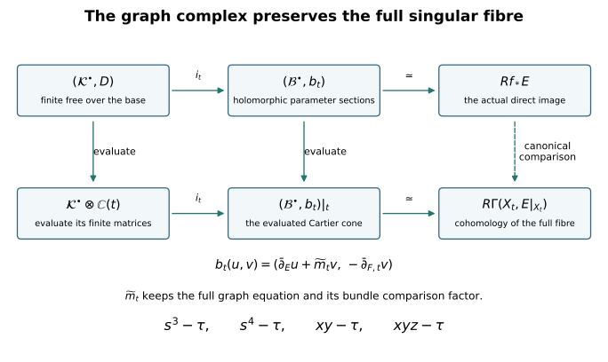

# Proper base change from the actual graph resolution {#proper-curve-provider}

Written by GPT-6 Astra (OpenAI), at Ultra, October 2026. New exposition and proofs: CC0. This chapter proves the finite-complex and top-degree base-change statements needed for lesson 10. The total space is a compact smooth complex manifold, the target is a smooth complex curve, and the coefficient sheaf is a holomorphic vector bundle. Singular and nonreduced fibres are included. No general proper mapping theorem is assumed.

The analytical input is the included [smooth duality and finite-complex chapter](smooth-duality-and-finite-twist-complexes.md): its Sections 1–4 prove the local Dolbeault resolution, weak elliptic estimates, compact resolvent and harmonic contraction; Section 5 proves every perturbed chain map. We extend that argument to an explicitly specified two-term complex. The retained programme source `cdp_program.tex`, at `cor:surface-top-base-change`, uses an analytic finite-complex theorem. The construction below supplies that receiving theorem for its actual compact total space. It makes no claim about an arbitrary proper map with a singular or noncompact total space.

## 1. The graph keeps every fibre equation {#graph-resolution}

Let \(X\) be a connected compact complex manifold of dimension \(n\ge1\), let \(C\) be a smooth complex curve, let \(f:X\to C\) be nonconstant, and let \(E\) be a holomorphic vector bundle on \(X\). Fix \(c\in f(X)\). Choose a coordinate disk \(U\subset C\) with coordinate \(\tau\), where \(\tau(c)=0\), and write

\[
\pi:X\times U\longrightarrow U,\qquad
\Gamma=\{(x,t):f(x)=t\},\qquad
j:f^{-1}(U)\longrightarrow X\times U,\quad j(x)=(x,f(x)).
\tag{1.1}
\]

The graph is closed: the diagonal of the Hausdorff curve is closed and \(\Gamma\) is its inverse image under \((f,\operatorname{id})\). Near a point of \(\Gamma\), its equation is

\[
g(x,\tau)=\tau(f(x))-\tau.
\tag{1.2}
\]

Here \(\tau(f(x))\) is defined on \(f^{-1}(U)\). The derivative of (1.2) in the parameter direction is \(-1\). Away from \(\Gamma\), its ideal is locally generated by \(1\). Consequently \(\Gamma\) is an effective Cartier divisor on \(X\times U\), with invertible ideal \(M=\mathcal O_{X\times U}(-\Gamma)\). Put \(P=\operatorname{pr}_X^*E\). The actual ideal inclusion gives the exact sequence

\[
0\longrightarrow P\otimes M\xrightarrow{\,m\,}P
\longrightarrow j_*(E|_{f^{-1}(U)})\longrightarrow0.
\tag{1.3}
\]

In the local frame given by the generator \(g\) of the ideal, \(m\) is multiplication by exactly \(g\), with the sign in (1.2). This is injective because the local ring of the smooth product is a domain and \(g\) is nonzero. The quotient is the restriction to the graph, which proves the last identification.

Restriction to the slice \(X\times\{t\}\) gives

\[
0\longrightarrow E\otimes\mathcal O_X(-X_t)
\xrightarrow{\,m_t\,}E
\longrightarrow (j_t)_*(E|_{X_t})\longrightarrow0,
\qquad X_t=f^{-1}(t).
\tag{1.4}
\]

This sequence is still exact. A nonzero one-variable germ composed with \(f\) cannot vanish on a neighbourhood in \(X\): otherwise the image there lies in its discrete zero set, \(f\) is locally constant, and the identity theorem makes \(f\) constant on connected \(X\). In particular \(\tau(f(x))-\tau(t)\) is a nonzero element of the domain \(\mathcal O_{X,x}\). Thus every fibre is a Cartier divisor with its full multiplicity. This also proves flatness over \(\mathcal O_{C,t}\): the stalks of \(E\) are torsion-free modules over that discrete valuation ring. Every finite submodule of a torsion-free module over a principal ideal domain is free; their filtered union is flat because filtered unions and tensor products preserve the relevant exact sequences.

In the original course charts, the four maps in (1.4), at parameter \(\tau\), retain the equations

\[
s^3-\tau,\qquad s^4-\tau,\qquad xy-\tau,\qquad xyz-\tau.
\tag{1.5}
\]

For example, at \(\tau=0\) the first quotient is by \((s^3)\), not by \((s)\). The construction never replaces that ideal by its radical. A change of local graph equation multiplies (1.2) by its actual invertible transition function; that function remains in the line bundle \(M\).

## 2. A fixed smooth bundle with holomorphic parameter dependence {#graph-gauge}

Write \(M_0=M|_{X\times\{c\}}\) and \(F=E\otimes M_0\). We construct a smooth identification of \(M_t\) with \(M_0\) that depends holomorphically on \(\tau\). This is a comparison map, not a replacement of the original graph equation.

Compactness permits finitely many coordinate neighbourhoods \(V_i\) in \(X\), with closures in slightly larger neighbourhoods, and a smaller common disk \(U\), on which \(M\) has holomorphic frames \(e_i(t)\). Indeed each point \((x,c)\) has a product neighbourhood on which the line bundle is trivial; a finite subcover of \(X\times\{c\}\) and the intersection of their parameter disks give the assertion. Declare the transition convention

\[
e_j(t)=e_i(t)g_{ij}(x,t),\qquad g_{ij}g_{jk}=g_{ik}.
\tag{2.1}
\]

After further shrinking the disk, each ratio \(g_{ij}(x,t)/g_{ij}(x,c)\) is uniformly close to \(1\) on the relevant compact overlaps. The convergent power series for \(\log(1+w)\) gives holomorphic functions

\[
\ell_{ij}(x,t)=\log\frac{g_{ij}(x,t)}{g_{ij}(x,c)},\qquad
\ell_{ij}(x,c)=0,\qquad
\ell_{ij}+\ell_{jk}=\ell_{ik}.
\tag{2.2}
\]

For the last equality the exponential of the difference is \(1\); the difference is a continuous function into \(2\pi i\mathbb Z\) and is zero at the centre, so it is zero throughout a sufficiently small disk. This argument applies on every connected component of an overlap.

Choose a smooth partition of unity \(\rho_k\) on \(X\), subordinate to these neighbourhoods, and put

\[
a_i(x,t)=\sum_k\rho_k(x)\ell_{ki}(x,t).
\tag{2.3}
\]

Each supported term extends by zero where necessary. Then

\[
a_j-a_i=\ell_{ij},\qquad a_i(x,c)=0.
\tag{2.4}
\]

Define \(\Phi_t:M_0\to M_t\) by

\[
\Phi_t(e_i(c))=e_i(t)\exp(-a_i(x,t)).
\tag{2.5}
\]

It glues with no omitted factor: the right side using frame \(j\) is
\(e_i(t)g_{ij}(x,c)\exp(\ell_{ij}-a_j)
=e_i(t)\exp(-a_i)g_{ij}(x,c)\), exactly the transition of the source frame. Both \(\Phi_t\) and its inverse are smooth in \(x\), holomorphic in \(t\), and equal the identity at the centre. Every derivative in \(x\) has the same parameter regularity, uniformly on compact parameter subdisks.

Pull back the fibrewise Dolbeault differential and the map in (1.3). On the fixed bundle \(F\) they are

\[
\bar\partial_{F,t}=\bar\partial_{F,0}+\alpha(t)\wedge(-),
\qquad \alpha(t)=-\bar\partial_Xa_i(x,t),
\qquad \widetilde m_t=m_t\circ(1_E\otimes\Phi_t).
\tag{2.6}
\]

The forms \(-\bar\partial_Xa_i\) agree on overlaps because \(a_j-a_i=\ell_{ij}\) is holomorphic in \(x\). The minus sign follows directly from
\(e^{a_i}\bar\partial_Xe^{-a_i}=-\bar\partial_Xa_i\).
The multiplication map \(\widetilde m_t\) retains the factor \(\exp(-a_i)\) from (2.5) and the full local factor (1.2). Since \(m\) is holomorphic, it satisfies the operator identity

\[
\bar\partial_E\widetilde m_t
=\widetilde m_t\bar\partial_{F,t}.
\tag{2.7}
\]

Thus we have made the bundles fixed without discarding either their original transition functions or the varying section.

## 3. The complete elliptic cone {#graph-elliptic-cone}

Put the two bundles in (1.4) in degrees \(-1,0\). The fixed graded space of their global Dolbeault forms is

\[
\mathcal B^k=A^{0,k}(X,E)\oplus A^{0,k+1}(X,F),
\qquad -1\le k\le n.
\tag{3.1}
\]

A summand with form degree outside \(0,\ldots,n\) is zero. Its differential is exactly

\[
b_t(u,v)=
\bigl(\bar\partial_Eu+\widetilde m_tv,
      -\bar\partial_{F,t}v\bigr).
\tag{3.2}
\]

The first component of \(b_t^2\) is
\(\bar\partial_E\widetilde m_tv-
\widetilde m_t\bar\partial_{F,t}v\), which is zero by (2.7); the other terms vanish by the Dolbeault identities. The negative sign on the second component is the shift sign from degree \(-1\). The Dolbeault resolution and the exact sequence (1.4) therefore give

\[
H^q(\mathcal B^\bullet,b_t)
\simeq H^q(X_t,E|_{X_t}).
\tag{3.3}
\]

For completeness, this identification is obtained by taking the two Dolbeault resolutions as columns of a double complex. Taking column cohomology as sheaves recovers (1.4), so its total sheaf cohomology is \((j_t)_*(E|_{X_t})\) in degree zero. Smooth forms are fine: a partition of unity supplies the Čech contraction with the identity \(\delta h+h\delta=1\). The augmented Čech double complex consequently identifies the global total complex with that sheaf's cohomology. This proves (3.3) without supposing the fibre smooth.

Choose Hermitian metrics on \(E,F,X\) and the orthogonal sum metric in (3.1). At the centre set

\[
b=b_c,\qquad Q=b+b^*,\qquad
\Lambda=Q^2=bb^*+b^*b.
\tag{3.4}
\]

The section \(\widetilde m_c\) and its adjoint are zero-order terms. On the two blocks the principal symbol of \(Q\) is, respectively,

\[
i\bigl(\varepsilon(\xi^{0,1})-\iota(\xi^{0,1})\bigr),
\qquad
-i\bigl(\varepsilon(\xi^{0,1})-\iota(\xi^{0,1})\bigr).
\tag{3.5}
\]

Both squares equal \(|\xi|_g^2/2\) times the identity. The full coordinate operator, including \(\widetilde m_c\), \(\widetilde m_c^*\), all metric derivatives and all connection terms, has the form \(\sum_j A_j(x)\partial_j+B(x)\) used in the preceding chapter's Section 2. Its frozen-symbol estimate applies to this block symbol, and its commutator calculation retains the entire matrix \(B\). Thus the same proved estimate and weak-domain argument give

\[
\|w\|_{H^1}\le C(\|Qw\|_{L^2}+\|w\|_{L^2}),
\qquad\operatorname{Dom}(Q)=H^1,
\qquad Q=Q^*.
\tag{3.6}
\]

The proof in that chapter uses only the square of the principal symbol, smooth coefficients on the compact manifold and formal self-adjointness. All three have just been verified for (3.4). Its compact-resolvent proof therefore supplies the finite-dimensional smooth harmonic space
\(\mathcal H=\ker\Lambda\), its orthogonal projection \(H\), its inclusion \(i\), and projection \(p\), with \(ip=H\). Write \(G\) for the inverse of \(\Lambda\) on its positive eigenspaces and zero on its kernel. Then

\[
h=b^*G,\qquad
bh+hb=1-ip,\qquad pi=1,
\qquad bi=0,\quad pb=0,
\qquad h^2=0,\quad hi=0,\quad ph=0.
\tag{3.7}
\]

Here \(h:L^2\to H^1\) is bounded and has degree \(-1\). To check the algebra behind this application, \(b^2=0\) gives \(b\Lambda=\Lambda b\), as an identity on smooth sections, and similarly for \(b^*\). Both preserve the harmonic orthogonal decomposition. Hence they commute with \(G\) on smooth sections; (3.7) follows from \(\Lambda G=1-H\) and \((b^*)^2=0\). Every closed section has the unique harmonic cohomology representative \(Hw\), since \(w=Hw+bhw\). This identifies each \(\mathcal H^q\) with (3.3) at \(c\).

## 4. Construct the finite holomorphic complex {#graph-finite-complex}

On the fixed graded space the perturbation is the full zero-order operator

\[
\delta(t)=b_t-b
=\begin{pmatrix}
0&\widetilde m_t-\widetilde m_c\\
0&-\alpha(t)\wedge(-)
\end{pmatrix}.
\tag{4.1}
\]

It is holomorphic in \(t\) as a bounded operator on every Sobolev space, and \(\delta(c)=0\). Shrink \(U\) so that

\[
\|\delta(t)\|_{L^2\to L^2}\,\|h\|_{L^2\to L^2}<1
\qquad(t\in U).
\tag{4.2}
\]

Use the exact operators

\[
\begin{aligned}
T(t)&=(1+\delta(t)h)^{-1}\delta(t)
     =\delta(t)(1+h\delta(t))^{-1},\\
D(t)&=pT(t)i,\\
i_t&=i-hT(t)i,\qquad
p_t=p-pT(t)h,\qquad
h_t=h-hT(t)h.
\end{aligned}
\tag{4.3}
\]

The inverses in (4.3) are convergent Neumann series on \(L^2\). No term of \(\widetilde m_t\), \(\alpha(t)\), or the two-term differential has been discarded. The perturbation proof in the preceding chapter, equations (5.6)–(5.9), applies with \(d=b\), since its exact hypotheses are (3.7) and \((b+\delta)^2=0\). In particular it proves, in the displayed order,

\[
\begin{gathered}
bT+Tb+TipT=0,\qquad D^2=0,\\
b_ti_t=i_tD,\qquad p_tb_t=Dp_t,\qquad p_ti_t=1,\\
b_th_t+h_tb_t=1-i_tp_t.
\end{gathered}
\tag{4.4}
\]

These identities hold on smooth forms and preserve their degrees. We also need their holomorphic dependence in the smooth topology. If
\(v=(1+h\delta)^{-1}u\), the equation \(v=u-h\delta v\), the gain of one derivative by \(h\), and multiplication by smooth coefficients give successively

\[
\|v\|_{H^s}\le C_s\bigl(\|u\|_{H^s}+\|v\|_{H^{s-1}}\bigr)
\qquad(s\ge1),
\tag{4.5}
\]

uniformly on a smaller closed parameter disk. The \(L^2\) bound comes from (4.2). Induction proves a bounded inverse on every \(H^s\); it also proves that a smooth \(u\) has a smooth inverse image. The same argument works for \(1+\delta h\). On \(H^s\), a holomorphic family of bounded invertible operators has a holomorphic inverse: at any fixed parameter factor it by its invertible value there, and use the norm-convergent geometric series for the remaining operator sufficiently near that parameter. Thus (4.3) is holomorphic in every Sobolev norm. The proved Sobolev embeddings imply holomorphy in every smooth seminorm.

Choose bases of the finite spaces \(\mathcal H^q\). Equations (4.3)–(4.4) define a complex of finite free holomorphic sheaves on \(U\):

\[
\mathcal K^q=\mathcal O_U\otimes_{\mathbb C}\mathcal H^q,
\qquad d_{\mathcal K}=D(t).
\tag{4.6}
\]

Its entries are holomorphic functions, \(D(c)=0\), and it is chain-homotopy equivalent to the sheaf of smooth global \(X\)-forms in (3.1) depending holomorphically on \(t\). The actual chain maps and the homotopy are (4.3), not merely an equality of cohomology dimensions.

## 5. Why this complex represents the direct image {#graph-direct-image}

We check the sheaf-theoretic comparison, including its parameter restriction. Start with the two holomorphic bundles in (1.3), in degrees \(-1,0\), and take their full Dolbeault resolutions on \(X\times U\). On \(X\times V\), for an open disk \(V\subset U\), the global total complex computes

\[
H^q\bigl(X\times V,j_*(E|_{f^{-1}(V)})\bigr)
=H^q(f^{-1}(V),E).
\tag{5.1}
\]

The first assertion follows from the local Dolbeault exactness and the fine-sheaf contraction already proved; the second follows from closed-embedding pushforward. To see the latter at the resolution level, a flabby resolution on the graph remains flabby after \(j_*\), since sections on an open set are precisely sections on its intersection with the graph. Pushforward is exact at every stalk. Global sections are unchanged. Thus it computes the same derived cohomology.

The smooth identification (2.5) is holomorphic in the parameter, so its parameter \(\bar\partial\)-derivative is zero. After that identification the full Dolbeault differential splits into the relative differential (3.2) and the ordinary parameter differential \(\bar\partial_t\), with the total-complex sign. They anticommute in the total complex: the coefficients of (3.2) are holomorphic in \(t\). We may compute the cohomology of this double complex first in the parameter direction, at a stalk on \(U\).

That parameter complex is exact in positive degree. More explicitly, for any smooth \(X\)-form-valued function \(v(x,t)\) defined on a disk about the stalk, choose a cutoff \(\chi\) in that disk equal to \(1\) on a smaller disk. The same Cauchy integral as in the preceding chapter is

\[
\mathcal T v(x,t)=-\frac1\pi\int_{\mathbb C}
\frac{\chi(\zeta)v(x,\zeta)}{\zeta-t}\,dA(\zeta),
\qquad \bar\partial_t\mathcal T v=v
\quad\hbox{on the smaller disk}.
\tag{5.2}
\]

It solves the equation for the coefficient of \(d\bar t\). Derivatives in \(x\) can be taken under the distributional Cauchy integral, or under its annular regularizations followed by their local limits, because the cutoff is compactly supported and each smooth seminorm of the coefficient is bounded there. The local Cauchy–Pompeiu proof gives smoothness and the stated equation in each of these seminorms. There is no parameter form degree above one. The kernel in degree zero is exactly the functions holomorphic in \(t\) with values in every smooth seminorm. Hence the parameter cohomology consists precisely of the relative complex used in (4.6).

This argument is stalkwise, so the necessary shrinking of the disk is legitimate. More explicitly, germs of the global complexes over disks form a filtered direct limit; such a limit preserves kernels, images and exact sequences of vector spaces. Both directions of the double complex are bounded. Filtering its finite total complex and eliminating one exact parameter row at a time shows that inclusion of the parameter-holomorphic kernel is a quasi-isomorphism. No commutation of \(\mathcal T\) with the varying relative differential is required; anticommutation of the two differentials and exactness of the rows are the stated double-complex calculation.

Finally, the stalks of \(R^qf_*E\) are the direct limits of (5.1). This follows directly from a flabby resolution: its pushforward sections over \(V\) are its original sections over \(f^{-1}(V)\), and taking the stalk commutes with cohomology by exactness of filtered limits. Together with (4.4) this proves

\[
\mathcal H^q(\mathcal K^\bullet)\simeq R^qf_*E|_U.
\tag{5.3}
\]

There is also a complex-level quasi-isomorphism between \(\mathcal K^\bullet\) and the pushed-forward resolution just described. It is obtained by \(i_t\) in (4.3) followed by the inclusion of the parameter-holomorphic relative complex into the full one. The filtration argument proves that this is a quasi-isomorphism at every stalk. This specifies the derived representative, including its natural comparison maps.

Evaluation at any \(t\in U\) commutes with (3.2), (4.3), and (4.4). By (1.4), the evaluated two-term resolution is the resolution of the **full** fibre, so (3.3) and (4.4) give

\[
\mathcal K^\bullet\otimes_{\mathcal O_U}\mathbb C(t)
\simeq\bigl(\mathcal B^\bullet,b_t\bigr),
\qquad
H^q(\mathcal K^\bullet\otimes\mathbb C(t))
\simeq H^q(X_t,E|_{X_t}).
\tag{5.4}
\]

The symbol \(\simeq\) here denotes the displayed chain-homotopy equivalence after evaluation. It gives the canonical base-change map on cohomology: a germ of a parameter-holomorphic relative cocycle is sent to its restriction at \(t\); the same restriction computes the map on the original resolution (1.3). Thus the square with the two resolutions and the two evaluation maps commutes before taking cohomology. Since every term of \(\mathcal K\) is free, its ordinary tensor product in (5.4) is also its derived tensor product. No local freeness of the individual sheaves in (5.3) has been assumed.

<figure style="overflow-x:auto; margin:2em 0;">

<figcaption>The two comparisons are constructed before taking cohomology. The vertical restriction retains the full graph equation and hence every fibre multiplicity. Proof: (1.3)–(1.5), (3.2), (4.3)–(4.4), and Section5. The perturbation maps use the exact Crainic comparison proved in the preceding chapter.</figcaption>
</figure>

## 6. The top degree, coherence, and every retained torsion term {#graph-top-degree}

The harmonic complex at the centre has no terms in degrees \(-1\) or \(n\). In degree \(-1\) this follows from the injectivity in (1.4). For degree \(n\), the exact sequence of (1.4) gives

\[
H^n(X,E(-X_c))\xrightarrow{m_c}H^n(X,E)
\longrightarrow H^n(X_c,E|_{X_c})\longrightarrow0.
\tag{6.1}
\]

The dual of its first map, under the proved natural smooth Serre pairings, is

\[
H^0(X,E^*\otimes K_X)
\longrightarrow H^0(X,E^*\otimes K_X(X_c)),
\tag{6.2}
\]

given by the actual dual ideal inclusion. It is injective: locally it multiplies by a nonzero divisor, and sections of a vector bundle over the smooth domain have no such torsion. The two cohomology spaces in (6.1) are finite-dimensional by the compact Hodge proof. The dual injectivity therefore makes the first map surjective. This proves \(H^n(X_c,E|_{X_c})=0\). The cone (3.1) has no degree greater than \(n\), so there is no higher cohomology either. Consequently

\[
\mathcal K^q=0\quad(q<0\hbox{ or }q>n-1),
\qquad R^qf_*E=0\quad(q>n-1).
\tag{6.3}
\]

The direct images are coherent. Here is the precise finite algebra needed on a curve. At a point the ring \(A=\mathcal O_{C,t}\) consists of convergent one-variable power series; every nonzero germ is \(\sigma^r u\), where \(\sigma\) is a local coordinate and \(u\) is an invertible germ. Every nonzero ideal therefore has a member of smallest order \(r\), which generates it. A finite matrix over \(A\) can be diagonalized by invertible row and column operations: select an entry of smallest order, use its divisibility of every entry to clear its row and column, and repeat on the smaller matrix. Its kernels and images are finitely generated free modules. Its cokernel is a finite sum of free modules and cyclic modules \(A/(\sigma^r)\). For a complex of finite free modules, the image in a kernel is another such finite submodule, so its cohomology is finitely presented. All entries and invertible operations are convergent germs; choose representatives on a common smaller disk, where their determinant units remain nonzero. The identities then hold on that disk by the identity theorem. This gives local finite presentations of the sheaves in (5.3), which is coherence.

For every degree the multiplication sequence of the finite free complex gives the exact comparison

\[
0\longrightarrow
(R^qf_*E)_t/\sigma(R^qf_*E)_t
\longrightarrow H^q(X_t,E|_{X_t})
\longrightarrow (R^{q+1}f_*E)_t[\sigma]
\longrightarrow0.
\tag{6.4}
\]

Here \(N[\sigma]=\ker(\sigma:N\to N)\). To derive (6.4), take the cohomology sequence of
\(0\to\mathcal K_t\xrightarrow{\sigma}\mathcal K_t
\to\mathcal K_t\otimes_A\mathbb C(t)\to0\),
and use (5.3)–(5.4). The resolution
\(0\to A\xrightarrow{\sigma}A\to\mathbb C(t)\to0\)
also identifies the last term with \(\operatorname{Tor}_1^A((R^{q+1}f_*E)_t,\mathbb C(t))\). Thus the exact possible failure in a lower degree is retained.

At \(q=n-1\), (6.3) makes the last term zero. We obtain the canonical isomorphism

\[
\boxed{\quad
(R^{n-1}f_*E)_t\otimes_A\mathbb C(t)
\xrightarrow{\ \sim\ }H^{n-1}(X_t,E|_{X_t}).
\quad}
\tag{6.5}
\]

This is the required top-degree base-change theorem, proved for every fibre, with singularities and multiplicities intact. If its fibre dimension at \(c\) is one, then \(\dim\mathcal H^{n-1}=1\) and (4.6) presents its stalk as the cokernel of a row matrix into \(A\). All entries of that row vanish at \(c\), since \(D(c)=0\). Its generated ideal is either \(0\) or \((\sigma^r)\) for some \(r\ge1\). Thus the stalk is, after a choice of generator,

\[
(R^{n-1}f_*E)_c\cong A
\quad\hbox{or}\quad A/(\sigma^r),\qquad r\ge1.
\tag{6.6}
\]

The construction does not determine \(r\) from the fibre dimension alone. Equations (6.4) and (6.6) state exactly why an isomorphism in (6.5) cannot be upgraded to a claim that this direct image is locally free.

In lesson 10, \(n=3\), \(C=\mathbb P^1\), and \(E=T_X\otimes L\) for the original analytic line bundle \(L\). Equations (5.3)–(5.4) are its formula (10.7), (6.3) is its formula (10.9), and (6.5) is its formula (10.10). At the cusp, the independently proved full-fibre cohomology dimension is one. Therefore (6.6) applies to that actual \(R^2\)-stalk, with no change to the line bundle or fibre.

## 7. Two full calculations {#graph-exercises}

### Exercise 1. Calculate the lower-degree failure and top-degree success

Let \(A=\mathbb C\{\sigma\}\) and let the two-term complex, in degrees \(n-2,n-1\), be \(A\xrightarrow{\sigma^r}A\), with \(r\ge1\). Compute both cohomology modules, both fibre cohomology groups, and every nonzero map in (6.4).

**Solution.** Since \(A\) is a domain, multiplication by \(\sigma^r\) is injective. Thus the lower cohomology is zero and the upper cohomology is \(A/(\sigma^r)\). Modulo \(\sigma\), the differential is zero, so both fibre cohomology groups are \(\mathbb C\). The lower-degree sequence is

\[
0\longrightarrow0\longrightarrow\mathbb C
\xrightarrow{\ \partial\ }
(A/(\sigma^r))[\sigma]\longrightarrow0,
\qquad \partial(1)=[\sigma^{r-1}].
\tag{7.1}
\]

Indeed lift \(1\) to \(1\in A\), apply the differential to get \(\sigma^r\), and divide by the \(\sigma\) from the short exact sequence of complexes. This gives \(\sigma^{r-1}\), with the positive sign of that sequence. The kernel of multiplication by \(\sigma\) on \(A/(\sigma^r)\) is exactly its span. In the top degree, the sequence is

\[
0\longrightarrow(A/(\sigma^r))/\sigma(A/(\sigma^r))
\xrightarrow{\ 1\mapsto1\ }\mathbb C
\longrightarrow0\longrightarrow0.
\tag{7.2}
\]

Hence the top map is an isomorphism for every \(r\), while the lower map from the direct-image fibre is the zero map into a one-dimensional space. The length \(r\) remains in the module and in the connecting element of (7.1), even though both residue dimensions are independent of it.

### Exercise 2. Keep a branched fibre's nilpotents

Consider \(f:\mathbb P^1\to\mathbb P^1\), \(f(z)=z^m\), with integer \(m\ge1\), and \(E=\mathcal O\). On a small target disk around \(0\), compute the direct image, its fibre, and the graph resolution. Compare with the incorrect reduced fibre calculation.

**Solution.** The graph equation is \(z^m-\tau\). Its two-term resolution multiplies by this exact polynomial. If \(h(z)=\sum_{a\ge0}c_a z^a\) is holomorphic on the inverse-image disk, split its convergent series by the residue of \(a\) modulo \(m\):

\[
h(z)=\sum_{j=0}^{m-1}z^j h_j(\tau),\qquad
h_j(\tau)=\sum_{k\ge0}c_{mk+j}\tau^k,\qquad \tau=z^m.
\tag{7.3}
\]

The convergence radius of each \(h_j\) contains the target disk: the Cauchy bounds on any smaller inverse-image circle give the corresponding bounds for its subsequence. The decomposition is unique by uniqueness of power-series coefficients. Therefore locally

\[
f_*\mathcal O\cong
A[z]/(z^m-\tau)=\bigoplus_{j=0}^{m-1}Az^j,
\qquad
(f_*\mathcal O)\otimes_A\mathbb C(0)
\cong\mathbb C[z]/(z^m).
\tag{7.4}
\]

The relation \(z^m=\tau\) is part of the algebra structure; the displayed basis records the module structure. Since \(n=1\), (6.3) proves that all higher direct images vanish, and (6.5) identifies (7.4) with the full fibre's global functions. That fibre has length \(m\), with nilpotents \([z],\ldots,[z^{m-1}]\) when \(m>1\). Replacing its equation by \(z=0\) gives only \(\mathbb C\), loses \(m-1\) basis vectors, and is not the base-change target. In particular \(m=3\) and \(m=4\) retain exactly the multiplicity issue of the two finite course charts.

## Sources and scope {#graph-sources}

The source-reading ledger records the existing programme proof and the disk-literature search before this construction. Its human perturbation reference is [Marius Crainic, *On the perturbation lemma, and deformations*, arXiv math/0403266v1, Sections 2–3](https://arxiv.org/abs/math/0403266v1). The preceding included chapter proves the exact receiving identities and the sign comparison with that original-author TeX. No claim is made that Crainic states this graph construction. Smooth Serre duality is proved in the included chapter; the original Serre paper is cited there with its actual reading limitation.

This proof uses compactness of the original smooth \(X\) to construct its Hodge contraction. It proves the entire stated map-to-a-curve result and supplies lesson 10's singular-fibre comparison. It does not claim the general coherence theorem for every proper analytic map. Finite symbolic checks of cone signs and local torsion modules supplement the written analytic and sheaf proofs; they do not replace them or constitute independent review.
