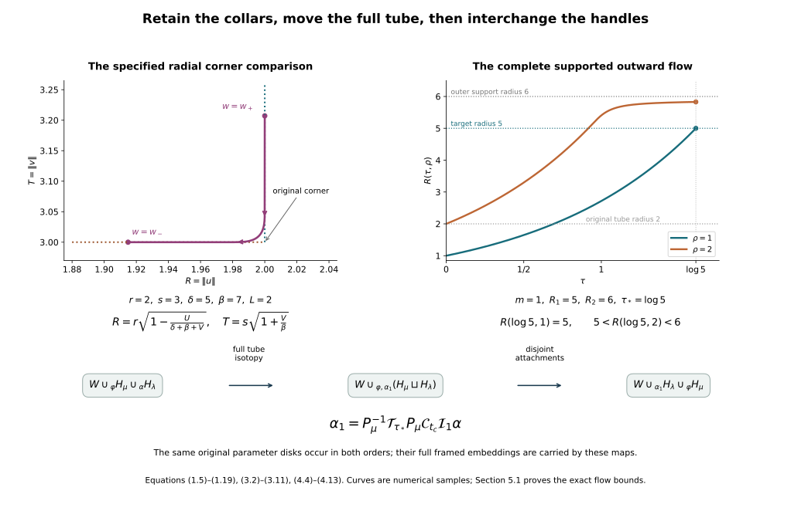

# Rearranging the original framed handles {#original-handle-rearrangement}

Working companion for CG-S6 lesson 7. GPT-6 Astra (OpenAI), Ultra, 10 October 2026. New teaching exposition CC0. The [relative Morse companion](relative-morse-functions-and-original-handles.md#relative-morse-attachment) constructs the finite handles of the original cobordism, with their full framings and original incoming and outgoing maps. Here we construct the changes of that actual presentation needed to arrange the handles by index. The framed slides and index-one removal are now proved in their receiving companion. The [integral handle-chain companion](integral-handle-chains-and-signed-incidences.md#handle-six-seven) now proves the original filtration-to-homology map, every incidence sign, the full integer basis comparisons and the exact contractions in dimensions six and seven. The geometric realization of the higher-index operations and the middle Whitney cancellations remain.

## 1. From the specified rounded boundary to the exact surgery collars {#arrangement-boundary-comparison}

### 1.1. Both original collar coordinates

Consider one of the constructed \(n\)-dimensional handles of index \(\mu\), first with \(1\leq\mu\leq n-1\), and put \(q=n-\mu\). Retain all its original positive parameters \(r,s,\delta,\beta,L\), with \(L<\delta\), and every coefficient \(a_i,b_j\) in its local function \(f=c-A+B\). Set \(D=\delta+\beta\). Its full embedding, before applying the original inverse coordinate map \(\Theta\), is
\[
E_i^x(u,v)=\frac{u_i}{r}
 \sqrt{\frac{\delta+\beta\|v\|^2/s^2}{a_i}},
\qquad
E_j^y(u,v)=\frac{v_j}{s}\sqrt{\frac{\beta}{b_j}},
\tag{1.1}
\]
on \(D_r^\mu\times D_s^q\), and \(\mathcal E=\Theta E\). The entire attaching tube in the old level \(N\) is
\[
\varphi(\theta,v)=\mathcal E(\theta,v),
\qquad \theta\in S_r^{\mu-1},\quad v\in D_s^q.
\tag{1.2}
\]
Its core is \(L_\mu=\varphi(S_r^{\mu-1}\times\{0\})\). The letter \(L_\mu\) denotes this submanifold, whereas \(L\) remains the positive rounding scale.

The abstract outgoing surgery boundary is
\[
N^\#=
\left(N\setminus\varphi(S_r^{\mu-1}\times\operatorname{int}D_s^q)\right)
\underset{\varphi}{\cup}
(D_r^\mu\times S_s^{q-1}).
\tag{1.3}
\]
Use the full unscaled product collar of the [belt-complement companion](belt-sphere-complements-and-the-whitney-disk.md#belt-complement-map). Its signed radial coordinate is
\[
w=\|u\|-r\leq0
\quad\text{on the handle face},\qquad
w=\|v\|-s\geq0
\quad\text{on the original exterior}.
\tag{1.4}
\]
The angular coordinates are \(\theta\in S_r^{\mu-1}\), \(\omega\in S_s^{q-1}\). On the negative side \(u=(1+w/r)\theta,v=\omega\); on the positive side the point is \(\varphi(\theta,(1+w/s)\omega)\). The original framing occurs in this second formula.

The actual outgoing boundary \(S\) in the relative Morse construction has the specified outward rounding
\[
\begin{aligned}
U(t)&=L\int_0^t\kappa(z)\,dz,\\
V(t)&=L\int_t^1\kappa(1-z)\,dz,\qquad 0\leq t\leq1,\\
\kappa(t)&=\chi(3t-1),\qquad \kappa(t)+\kappa(1-t)=1.
\end{aligned}
\tag{1.5}
\]
Here \(U=f-(c-\delta)\) and \(V=B-\beta\); \(\chi\) is the complete smooth symmetric step defined in equation (4.15) of that companion. Its two radial handle parameters are therefore exactly
\[
R(t)=r\sqrt{1-\frac{U(t)}{D+V(t)}},
\qquad
T(t)=s\sqrt{1+\frac{V(t)}{\beta}}.
\tag{1.6}
\]
Indeed \(B=\beta+V=\beta T^2/s^2\), and
\[
A=D+V-U=\frac{R^2}{r^2}
       \left(\delta+\frac{\beta T^2}{s^2}\right).
\tag{1.7}
\]
Both square roots are positive since \(0\leq U,V\leq L/2\) and \(L<\delta<D\). No radial factor from (1.1) has been suppressed.

At the ends of (1.5), the original signed collar coordinates must be
\[
w_+=s\sqrt{1+\frac{L}{2\beta}}-s>0,\qquad
w_-=r\sqrt{1-\frac{L}{2D}}-r<0.
\tag{1.8}
\]
Near \(t=0\), the actual curve has \(U=0\), so its exterior coordinate is
\[
w_0(t)=s\sqrt{1+V(t)/\beta}-s.
\]
Near \(t=1\), it has \(V=0\), so its handle coordinate is
\[
w_1(t)=r\sqrt{1-U(t)/D}-r.
\tag{1.9}
\]
These are the exact germs that a smooth comparison must match. Their derivatives are strictly negative near the respective endpoints.

### 1.2. A decreasing parameter with both complete endpoint germs

Write \(g_0=-w_0'\) and \(g_1=-w_1'\) on small endpoint intervals; both are positive smooth functions. Choose nonnegative cutoffs \(\alpha_0,\alpha_1\), equal to one near the corresponding endpoint, supported in those intervals, and with disjoint supports. Retain
\[
I=\int_0^1(\alpha_0g_0+\alpha_1g_1)\,dt,\qquad
J=\int_0^1(1-\alpha_0-\alpha_1)\,dt.
\tag{1.10}
\]
The supported products are extended by zero. Make the endpoint intervals small enough that \(I<w_+-w_-\). This is possible because the two original germs are bounded on some fixed endpoint intervals and their supported integrals tend to zero as the intervals shrink. Also \(J>0\), since the middle interval is disjoint from both supports.

Set
\[
h=\frac{w_+-w_--I}{J}>0,\qquad
g(t)=\alpha_0g_0+\alpha_1g_1+(1-\alpha_0-\alpha_1)h,
\qquad
w(t)=w_+-\int_0^t g(z)\,dz.
\tag{1.11}
\]
At each point the coefficients in \(g\) are nonnegative and sum to one; every contributing value is positive. Thus \(g>0\). The complete integral gives \(w(1)=w_-\), and \(w(0)=w_+\). Near zero, \(w'=w_0'\) and the endpoint values agree, so \(w=w_0\) throughout that endpoint interval. Near one, the same argument gives \(w=w_1\). Consequently (1.11) matches both original germs with every derivative and is a strictly decreasing smooth bijection from \([0,1]\) to \([w_-,w_+]\). Its inverse is smooth by \(w'=-g<0\).

View \(R,T\) as functions of \(w\) through this inverse. The complete derivatives in the rounded part are
\[
\begin{aligned}
\frac{dR}{dw}
&=\frac{rL}{2g\sqrt{1-U/(D+V)}}
\left(\frac{\kappa(t)}{D+V}
+\frac{U\kappa(1-t)}{(D+V)^2}\right),\\
\frac{dT}{dw}
&=\frac{sL\kappa(1-t)}
 {2\beta g\sqrt{1+V/\beta}}.
\end{aligned}
\tag{1.12}
\]
Both are nonnegative, and at least one is strictly positive: if \(\kappa(1-t)>0\), the second is positive; if it vanishes, then \(\kappa(t)=1\), making the first positive. Extend them outside the rounded interval by the exact expressions
\[
(R(w),T(w))=
\begin{cases}
(r+w,s),&w\leq w_-\ \text{in the handle collar},\\
(r,s+w),&w\geq w_+\ \text{in the exterior collar}.
\end{cases}
\tag{1.13}
\]
The endpoint germ identities just proved show that these extensions agree with (1.6) on whole joining intervals, not merely at their endpoints.

### 1.3. The diffeomorphism and the actual complement map

In these collars define
\[
\Xi(\theta,\omega,w)
=\Theta E\left(\frac{R(w)}r\theta,\frac{T(w)}s\omega\right).
\tag{1.14}
\]
Off the collar use the original handle-face parametrization and the original exterior inclusion. Formula (1.13) makes the definitions equal on open overlaps. Their common image is exactly \(S\), including its specified rounded corner. The map is bijective: the angular coordinates are recovered uniquely from the two nonzero radii in the collar, and the rounded curve has the strictly monotone parameter \(w\). Outside the collar it is the original identification on each face.

Its full collar derivative is
\[
D\Xi[\dot\theta,\dot\omega,\dot w]
=D\Theta\,DE
\left(
 \frac Rr\dot\theta+\frac{R'}r\theta\,\dot w,\,
 \frac Ts\dot\omega+\frac{T'}s\omega\,\dot w
\right),
\tag{1.15}
\]
with both matrices evaluated at the actual image coordinates of (1.14). In particular \(DE\) includes the \(dB\)-term in its \(x\)-coordinates from equation (4.8) of the preceding companion. The two angular derivative blocks are independent; their respective radial components vanish. Since \(R,T>0\) and at least one of \(R',T'\) is nonzero, the remaining radial column is independent of them. Thus the rank is \(n-1\). The inverse function theorem, together with bijectivity and the matching collar germs, proves that \(\Xi:N^\#\to S\) is a diffeomorphism. Its pullback of the original metric is exactly
\[
G_{N^\#}=(D\Xi)^{\mathsf t}G_S(\Xi(\cdot))D\Xi.
\tag{1.16}
\]
The belt \(\{0\}\times S_s^{q-1}\) is outside the seam collar, so its original parametrization and full nearby handle coordinates are retained.

For explicit use below, compose this comparison with the proved complement diffeomorphism. In the notation just used, its unscaled radial correction is
\[
\begin{aligned}
0&<\varepsilon<\tfrac14\min(r,s),\\
\eta(\tau)&=\chi((\tau-r+2\varepsilon)/\varepsilon),\\
c_\varepsilon&=\frac{s-3\varepsilon/2}{r-3\varepsilon/2},\\
F(\tau)&=\int_0^\tau
 \bigl[c_\varepsilon+(1-c_\varepsilon)\eta(z)\bigr]\,dz.
\end{aligned}
\tag{1.17}
\]
The full integral \(3\varepsilon/2\) includes both its constant collar and transition. Thus \(F(0)=0,F(r)=s,F'>0\), and \(F(\tau)=\tau+s-r\) near \(r\), with all the original radii retained. On the punctured handle face,
\[
\Phi(u,v)=
\varphi\left(\frac r{\|u\|}u,\frac{F(\|u\|)}s v\right),
\qquad \|u\|>0,\quad \|v\|=s,
\tag{1.18}
\]
and on the common exterior \(\Phi\) is identity. Its inverse and both complete tangent maps are equations (1.12), (1.13a)–(1.13b) of the belt-complement companion.

Writing \(B_\mu=\Xi(\{0\}\times S_s^{q-1})\), the required map for the actual original outgoing boundary is therefore
\[
P_\mu=\Phi\circ\Xi^{-1}:
S\setminus B_\mu\longrightarrow N\setminus L_\mu.
\tag{1.19}
\]
It is a diffeomorphism, with derivative \(D\Phi\,D\Xi^{-1}\) and inverse derivative \(D\Xi\,D\Phi^{-1}\); every factor in (1.12), (1.15), (1.17) and (1.18) remains. It agrees with the original exterior identification beyond the exterior end \(w_+\) of the rounding collar. This proves the exact comparison needed to use the earlier complement theorem on the actual rounded Morse handle.

## 2. Moving a whole framed tube into its core neighbourhood {#arrangement-tube-compression}

Let \(d\geq1\), let \(\Sigma\) be a compact smooth manifold without boundary, and let
\[
\psi:\Sigma\times D_s^d\longrightarrow N
\tag{2.1}
\]
be an entire framed tube, of the same dimension as its ambient manifold \(N\). In the application, \(\Sigma\) is an attaching sphere and \(d\) is its normal dimension. Keep the full original map, parameter radius \(s\), and original metric. The core is \(K=\psi(\Sigma\times\{0\})\).

The tube extends to a slightly larger radius \(S>s\) with its original collar germ. To see this directly, on an annulus inside the original boundary prescribe the vector field that in its \(\psi\)-coordinates is the outward radial unit vector \((0,z/\|z\|)\). Extend this smooth field across the compact boundary using coordinate extensions and a partition of unity; keep it equal to the prescribed field on a smaller whole annulus. Its flow from \(\psi(\theta,s\omega)\), for \(\|\omega\|=1\), defines the extension at radius \(s+t\). For small negative \(t\), flow uniqueness gives exactly the old point \(\psi(\theta,(s+t)\omega)\). Hence every derivative matches. Local invertibility at the boundary and compactness give a uniform positive extension width and global injectivity: any new collision at widths tending to zero would limit to a collision in the original tube or its locally injective boundary collar. Decrease \(S-s\) once to exclude this. We continue to denote the resulting embedding by \(\psi\).

Use the complete cutoff
\[
\zeta(v)=1-\chi\left(\frac{v-s^2}{S^2-s^2}\right),
\tag{2.2}
\]
and the vector field, in the extended tube coordinates,
\[
Z(\theta,z)=(0,-\zeta(\|z\|^2)z).
\tag{2.3}
\]
It vanishes with every derivative at the outer end and extends by zero to a smooth field on \(N\). The support is compact, so its flow \(\mathcal C_t\) exists for every finite positive and negative time. For example a finite-time trajectory staying in that compact support lies in finitely many coordinate charts where the field and its first derivatives are bounded, so the local existence theorem continues it; once it leaves the support it is stationary.

On every point of the entire original tube, the exact flow is
\[
\mathcal C_t(\psi(\theta,z))
=\psi(\theta,e^{-t}z),\qquad \|z\|\leq s,\quad t\geq0.
\tag{2.4}
\]
Indeed this trajectory remains in \(\|z\|\leq s\), where \(\zeta=1\), and solves (2.3). Its domain remains the full original parameter disk \(D_s^d\); its image has contracted by the displayed positive factor. On that domain the full derivative of the changed attaching map is
\[
D(\mathcal C_t\psi)[\dot\theta,\dot z]
=D\psi|_{(\theta,e^{-t}z)}(\dot\theta,e^{-t}\dot z).
\tag{2.5}
\]
The base-coordinate dependence of \(D\psi\) has not disappeared. On the core the original ordered normal vectors \(D\psi(0,e_j)\) are transported to \(e^{-t}D\psi(0,e_j)\). This is their actual positive scale change under the isotopy, not a declaration that the vectors themselves are unchanged.

The full derivative on the cutoff annulus is also determined. If the initial positive normal radius is \(\rho\), let \(R(t,\rho)\) solve
\[
\partial_t R=-\zeta(R^2)R,\qquad R(0,\rho)=\rho.
\]
Then
\[
J(t,\rho)=\partial_\rho R
=\exp\left[-\int_0^t
 \bigl(\zeta(R(\tau,\rho)^2)
      +2R(\tau,\rho)^2\zeta'(R(\tau,\rho)^2)\bigr)\,d\tau\right]>0.
\tag{2.6}
\]
For a normal variation \(\dot z\), writing \(\rho=\|z\|>0\), its exact normal derivative is
\[
\frac R\rho\,\dot z+
\left(J-\frac R\rho\right)
 \frac{z\langle z,\dot z\rangle}{\rho^2}.
\tag{2.7}
\]
Its determinant is \((R/\rho)^{d-1}J>0\). Near the core the expression is exactly \(e^{-t}I_d\), so its apparent denominators have that smooth extension. In ambient coordinates (2.7), together with the unchanged \(\theta\)-component, is conjugated by \(D\psi\) at the original and image points. This retains the complete original metric and framing comparison.

If the core misses a closed subset \(Q\subset N\), there exists \(0<\epsilon<1\) such that
\[
\psi(\Sigma\times D_{\epsilon s}^d)\cap Q=\varnothing.
\tag{2.8}
\]
Otherwise compactness would give points with normal radii tending to zero whose images converge to a point of \(K\cap Q\). Choose \(t=-\log\epsilon\) in (2.4). The full changed tube then misses \(Q\), while its parameter radius, all coordinates and full derivative remain explicitly recorded.

The ambient flow need not fix \(Q\) pointwise. If the old thick tube met \(Q\), a diffeomorphism fixing \(Q\) pointwise could not make that image disjoint from \(Q\), because it would carry their intersection to another intersection. In the handle application \(Q\) is the fixed comparison belt sphere, and (2.4) changes the next attaching embedding. The resulting change of attached cobordism will be given by an explicit collar extension in Section 4. This distinction retains the full geometric operation and its comparison data.

## 3. Moving the pulled tube beyond the entire earlier attachment {#arrangement-outward-motion}

Retain the earlier attaching tube \(\varphi:S_r^{\mu-1}\times D_s^q\to N\) and its core \(L_\mu\). Let \(K\subset N\setminus L_\mu\) be any compact set. In the application it is the image of the entire next attaching tube pulled back by (1.19), including its boundary.

Choose radii \(R_2>R_1>s\) within an extended original framing tube. When using the actual rounded Morse boundary, choose
\[
R_1>s+w_+,
\tag{3.1}
\]
so the target region lies beyond the whole rounding collar in (1.19). These choices exist in the original construction: the compact rounded corner and a neighbourhood are inside the original coordinate chart; in particular the entire exterior-end sphere with normal radius \(s+w_+\) and a neighbourhood of it are covered by the extension of (1.2).

If \(K\) has no point in the closed extended tube of radius \(R_2\), no motion is needed. Otherwise its intersection with that tube is compact and misses the core. Thus its positive normal radii have a positive minimum. Choose and retain \(m>0\) less than this minimum and also less than \(s\). Set, for a squared normal radius \(v\),
\[
\begin{aligned}
A_m(v)&=\frac{v-m^2/4}{3m^2/4},&
B_R(v)&=\frac{v-R_1^2}{R_2^2-R_1^2},\\
\zeta(v)&=\chi(A_m(v))\,[1-\chi(B_R(v))].
\end{aligned}
\tag{3.2}
\]
It is zero for radius at most \(m/2\) and at least \(R_2\), and equals one for all radii in \([m,R_1]\). Its full derivative is
\[
\zeta'(v)=
\frac{\chi'(A_m(v))}{3m^2/4}[1-\chi(B_R(v))]
-\frac{\chi(A_m(v))\chi'(B_R(v))}{R_2^2-R_1^2}.
\tag{3.3}
\]
Both terms and both denominators remain.

In the original framing coordinates define the outward vector field
\[
Z(\theta,z)=(0,\zeta(\|z\|^2)z),
\tag{3.4}
\]
and extend it by zero to \(N\). The flat endpoint derivatives of \(\chi\) give a smooth extension. Its support is compact and disjoint from \(L_\mu\), so its complete flow \(\mathcal T_\tau\) fixes a whole neighbourhood of that core. Its positive-radius equation is
\[
\partial_\tau R=\zeta(R^2)R,\qquad R(0,\rho)=\rho.
\tag{3.5}
\]
The radius never decreases. If \(m\leq\rho\leq R_1\), it is exactly \(e^\tau\rho\) until it reaches \(R_1\), at time \(\log(R_1/\rho)\). It never returns below \(R_1\). Therefore at the retained time
\[
\tau_*=\log(R_1/m)>0
\tag{3.6}
\]
every point of \(K\) initially inside the earlier attaching tube has moved to normal radius at least \(R_1>s\). Points already outside radius \(R_1\) cannot move inward; points outside the extended tube are fixed. Consequently
\[
\mathcal T_{\tau_*}(K)
\cap\varphi(S_r^{\mu-1}\times D_s^q)=\varnothing.
\tag{3.7}
\]
This proves avoidance of the entire closed earlier tube, rather than only its core. It also proves that the image lies in the region where the actual outgoing-boundary comparison is the original exterior identification, by (3.1).

The exact radial differential of (3.5) is
\[
J(\tau,\rho)=
\exp\left[\int_0^\tau
 \bigl(\zeta(R(t,\rho)^2)+2R(t,\rho)^2\zeta'(R(t,\rho)^2)\bigr)\,dt\right]>0.
\tag{3.8}
\]
The full normal derivative is
\[
D\mathcal T_\tau[\dot z]
=\frac R\rho\dot z+
 \left(J-\frac R\rho\right)
 \frac{z\langle z,\dot z\rangle}{\rho^2},
\qquad \rho>0,
\tag{3.9}
\]
before conjugation by the original \(D\varphi\). Its determinant is \((R/\rho)^{q-1}J>0\). Near the core it is identity, because the cutoff is zero there. In the region before a trajectory reaches \(R_1\), it is the full factor \(e^\tau I_q\). Formulas (3.3), (3.8) retain the additional terms on both transition annuli.

Conjugate this isotopy through the actual complement diffeomorphism:
\[
\mathcal J_t
=P_\mu^{-1}\mathcal T_{t\tau_*}P_\mu
\quad\text{on }S\setminus B_\mu,\qquad 0\leq t\leq1.
\tag{3.10}
\]
The support of \(\mathcal T_\tau\) is contained in a fixed compact subset of \(N\setminus L_\mu\). Its inverse image under the diffeomorphism \(P_\mu\) is compact in \(S\setminus B_\mu\), and hence misses a whole neighbourhood of \(B_\mu\). Thus (3.10) extends by identity to a smooth ambient isotopy of all of \(S\). It fixes the belt neighbourhood for this particular stage. Its derivative is exactly
\[
D\mathcal J_t|_x
=DP_\mu^{-1}|_{\mathcal T_{t\tau_*}P_\mu(x)}
 D\mathcal T_{t\tau_*}|_{P_\mu(x)}
 DP_\mu|_x.
\tag{3.11}
\]
The original collar correction, its inverse and both cutoff contributions occur in this product. This is the precise way in which the motion in the old core complement becomes a motion on the actual new level.

## 4. Interchanging two actual handles and arranging the indices {#arrangement-interchange}

### 4.1. The attaching core can miss the preceding belt

Suppose the finite original handle presentation contains two successive handles of indices \(\mu\) and \(\lambda\), in that order, with
\[
1\leq\lambda\leq\mu\leq n-1.
\tag{4.1}
\]
Let \(N\) be the outgoing boundary just before the \(\mu\)-handle, let \(S\) be its actual outgoing boundary after that handle, and retain the full next attaching tube
\[
\alpha:S_{r_\lambda}^{\lambda-1}\times
D_{s_\lambda}^{n-\lambda}\longrightarrow S.
\tag{4.2}
\]
Its original radii \(r_\lambda,s_\lambda\) remain fixed in every parameter domain below.

The \(\mu\)-handle belt has dimension \(n-\mu-1\) and normal dimension \(\mu\) in \(S\). Its normal tube is explicit in the original handle-face coordinates: take \((u,\omega)\) with \(\|u\|\) smaller than a retained positive radius below \(r\), and \(\omega\in S_s^{n-\mu-1}\); map it by \(\Xi\) and \(\mathcal E\). This lies away from the seam and gives its actual full normal framing. The next attaching core has dimension \(\lambda-1<\mu\).

Apply the proved ambient core-avoidance construction in Section 2 of the [belt-complement companion](belt-sphere-complements-and-the-whitney-disk.md#core-avoidance), using this actual normal tube of the belt and the compact parameter sphere in (4.2). Its strict dimension hypothesis is exactly
\[
(\lambda-1)+(n-\mu-1)-(n-1)=\lambda-\mu-1<0.
\tag{4.3}
\]
It supplies an ambient isotopy \(\mathcal I_t\) of \(S\), starting at identity, such that the core of \(\mathcal I_1\alpha\) misses \(B_\mu\). That cited construction proves avoidance by its finite normal-translation parameter family and the measure-zero image argument; no unproved generic-position assertion is being inserted here. It carries the entire tube and its full derivative by \(\mathcal I_t\).

Now apply Section 2 of the present chapter to \(\mathcal I_1\alpha\), with the closed comparison subset \(B_\mu\). Choose its retained contraction time \(t_c=-\log\epsilon\) as in (2.8), and denote the resulting compression flow by \(\mathcal C_t\). Then
\[
\alpha_0=\mathcal C_{t_c}\mathcal I_1\alpha
\tag{4.4}
\]
has its entire closed image disjoint from \(B_\mu\), with the same original parameter radii. Pull it back through the actual complement map:
\[
\bar\alpha=P_\mu\alpha_0:
S_{r_\lambda}^{\lambda-1}\times D_{s_\lambda}^{n-\lambda}
\longrightarrow N\setminus L_\mu.
\tag{4.5}
\]
Its image \(K\) is compact. Section 3, with that entire image as \(K\), gives a time \(\tau_*\) and the isotopy \(\mathcal J_t\) of (3.10). The final embedding is
\[
\alpha_1=\mathcal J_1\alpha_0
=P_\mu^{-1}\mathcal T_{\tau_*}\bar\alpha.
\tag{4.6}
\]
Its image is in the untouched common exterior beyond the entire rounding collar. There \(P_\mu^{-1}\) is the original exterior identification. Thus in that common part of \(N\) and \(S\), it is exactly \(\mathcal T_{\tau_*}\bar\alpha\), which by (3.7) is disjoint from the entire \(\mu\)-handle attaching tube.

These three isotopies may be joined without losing smoothness in time. An explicit single isotopy is
\[
\mathcal A_t
=\mathcal J_{\chi(3t-2)}
 \circ\mathcal C_{\,t_c\chi(3t-1)}
 \circ\mathcal I_{\chi(3t)},
\qquad 0\leq t\leq1.
\tag{4.7}
\]
The constant regions and flat endpoints of the full step make the first, second and third stages occur successively on the three thirds of the interval. In particular \(\mathcal A_0=1\) and \(\mathcal A_1\alpha=\alpha_1\). Every map in (4.7) is a diffeomorphism. Its derivative is the full chain product of (3.11), (2.5)–(2.7), and \(D\mathcal I\), at their respective image points. The framing of (4.2) is carried by
\[
D(\mathcal A_t\alpha)=D\mathcal A_t|_{\alpha(\cdot)}\,D\alpha,
\tag{4.8}
\]
so the original normal scale and the contraction factor \(e^{-t_c}\) are both recorded. The original metric is carried by the corresponding full pullback matrix.

### 4.2. The isotopy gives an actual diffeomorphism of attached cobordisms

Let \(W_\mu\) be the cobordism through the first of these two handles, whose outgoing boundary is \(S\). Retain an inward collar
\[
c:S\times[0,h)\longrightarrow W_\mu
\tag{4.9}
\]
disjoint from a whole incoming collar. Choose a smooth \(\gamma:[0,h)\to[0,1]\), one near zero and zero for \(r\geq2h/3\). Define
\[
\widehat{\mathcal A}_t(c(x,r))
=c(\mathcal A_{t\gamma(r)}(x),r),
\tag{4.10}
\]
and take it to be identity off this collar. Its inverse on the collar is \(c(x,r)\mapsto c(\mathcal A_{t\gamma(r)}^{-1}(x),r)\). Both formulas are smooth and agree with identity on a whole overlap. Hence it is an ambient diffeomorphism isotopy, fixing the original incoming collar.

Its exact collar derivative is
\[
(\dot x,\dot r)\longmapsto
\left(
D\mathcal A_{t\gamma(r)}\dot x
+t\gamma'(r)
 \left.\partial_\tau\mathcal A_\tau(x)\right|_{\tau=t\gamma(r)}
 \dot r,\,
\dot r
\right),
\tag{4.11}
\]
followed and preceded by the appropriate original derivatives of \(c\) and \(c^{-1}\). The mixed radial term remains. No assertion that the boundary isotopy fixes the preceding belt at every stage is needed or made.

For the second handle, the map \(\widehat{\mathcal A}_1\) on \(W_\mu\), together with identity on its original parameter disk product, descends to
\[
W_\mu\cup_\alpha
(D_{r_\lambda}^{\lambda}\times D_{s_\lambda}^{n-\lambda})
\ \cong\
W_\mu\cup_{\alpha_1}
(D_{r_\lambda}^{\lambda}\times D_{s_\lambda}^{n-\lambda}).
\tag{4.12}
\]
Indeed on the attaching face its two descriptions agree exactly because \(\alpha_1=\mathcal A_1\alpha\). For the transverse smooth structure, use on the new old-body side the full collar obtained by applying \(\widehat{\mathcal A}_1\) to the old gluing collar. On the handle side keep the original collar. In these transported charts the combined map and its inverse are smooth on a whole neighbourhood of the face, including every derivative in (4.11). Carry the original corner smoothing by the same chart map. This proves the smooth assertion in (4.12) without treating equality on the boundary alone as sufficient.

Every later handle, if any, is attached through the outgoing diffeomorphism of (4.12). Transport its entire attaching tube by that map and its normal framing by its full derivative. A finite collection of disjoint original tube images remains disjoint under that one diffeomorphism. This produces a diffeomorphism of the entire original handle presentation, fixing its incoming collar and recording its outgoing map.

### 4.3. The two attachments now commute

The first tube \(\varphi\) and the modified second tube \(\alpha_1\), regarded as maps into \(N\), have disjoint compact images, with the latter beyond the full earlier seam collar. They therefore have disjoint sufficiently small gluing neighbourhoods. Use the already specified full collar identifications on these neighbourhoods, retaining the original parameter disks and transported corner charts.

After these identifications, attaching the two handles in either order gives the same quotient of the disjoint union
\[
W\ \sqcup\
(D_r^\mu\times D_s^{n-\mu})\ \sqcup\
(D_{r_\lambda}^{\lambda}\times D_{s_\lambda}^{n-\lambda}),
\tag{4.13}
\]
where \(W\) is the preceding cobordism. The equivalence relation identifies each negative face with its own tube in \(N=\partial_+W\). These two relations have disjoint images in \(N\). Applying one leaves the entire attaching and collar neighbourhood of the other unchanged. Consequently the identity maps of all three pieces induce inverse maps between the two iterated quotients. They are smooth in the original piece interiors and in each of the two disjoint transported seam charts. The corner smoothing is the specified one in each such chart, so the same identity identifies the smoothed quotients as well.

If a regular collar is inserted between the two stages, use the exact regular-band product map of the relative Morse companion to identify the untouched attaching neighbourhood in the second boundary with its original copy in \(N\). The actual product map, including its endpoint identification, is part of this comparison. Thus adding that collar does not replace an attaching map by an unspecified isotopy class.

Equations (4.12)–(4.13) prove that the original \(\mu\)-then-\(\lambda\) presentation has a diffeomorphic \(\lambda\)-then-\(\mu\) presentation, relative to the incoming collar. They keep both original parameter radii of both handles. Their embeddings and all framing vectors change by the explicit maps already given; these changes are recorded rather than suppressed. Subsequent handles are transported through the actual resulting outgoing diffeomorphism.

### 4.4. Empty faces and the final finite order

The extreme indices require no unstated transversality argument. A \(0\)-handle has empty attaching face and adds a separate disk component. If it follows a handle of positive index, adding that same labelled disk before the earlier handle does not alter the earlier attaching tube, which is in the old level. The two operations commute as disjoint additions; their original disk parameters and the remaining boundary identifications are retained. Two \(0\)-handles likewise commute as their labelled disjoint union.

An \(n\)-handle has empty belt and attaches its entire boundary sphere, with no normal disk coordinate. Its attaching map is an embedding between closed manifolds of the same dimension, so its image is open by the local inverse function theorem and closed by compactness. The sphere is connected for the dimensions \(n=6,7\) in use, so it is one whole boundary component. After that handle, any later positive-index attaching tube lies in the other remaining components. Its attachment therefore commutes with filling the removed component. A later \(0\)-handle is treated by the preceding disjoint-addition argument. This includes consecutive top-index handles on their separate components. The empty normal block and its retained zero-dimensional parameter-disk radius are not replaced by additional coordinates.

Now retain the original labelled finite index sequence
\[
(k_1,\ldots,k_N),\qquad 0\leq k_i\leq n.
\tag{4.14}
\]
Its number of inversions is
\[
I=\#\{(i,j):i<j,\ k_i>k_j\}.
\tag{4.15}
\]
If \(I>0\), there is an adjacent inversion: otherwise every adjacent pair would be nondecreasing, forcing the whole sequence to be nondecreasing. Interchange that pair by the constructions just proved. Its mutual inversion disappears. Its comparison with every other index is unchanged as a count, since the two labels remain on the same side of each other label. Thus \(I\) decreases by exactly one. After finitely many steps it is zero.

Each step supplies an actual diffeomorphism of the complete presentation, including all later attaching tubes and their full framing derivatives. Let \(\Psi\) be their finite composition from the original presentation \(P_{\mathrm{old}}\) to the ordered one \(P_{\mathrm{ord}}\), and retain the previously constructed map \(G_{\mathrm{old}}:P_{\mathrm{old}}\to C\). The exact map back to the original cobordism is
\[
G_{\mathrm{ord}}
=G_{\mathrm{old}}\circ\Psi^{-1}:P_{\mathrm{ord}}\longrightarrow C.
\tag{4.16}
\]
It retains the original incoming collar. Its restriction to the outgoing boundary, and the derivative
\[
DG_{\mathrm{ord}}
=DG_{\mathrm{old}}|_{\Psi^{-1}(\cdot)}\,D\Psi^{-1},
\tag{4.17}
\]
retain the original final identification and all its tangent data. The actual handle presentation is now ordered by index. No handle has been removed by this argument, and no integer incidence matrix has been silently replaced by a diagonal one. The next calculation is the geometric removal and cancellation of the handles using the original connectivity and homology.

## 5. Two worked exercises {#arrangement-exercises}

### Exercise 5.1. A supported expansion is not a constant dilation on its transition annulus

In Section 3 take \(s=2\), \(m=1\), \(R_1=5\), \(R_2=6\), and \(q=3\). Keep exactly the cutoff (3.2), with all its factors. At time \(\tau_*=\log5\), compute the radius and full normal derivative for a point initially at radius one. For a point initially at radius two, give the exact equation determining its final radius and compute the two tangential eigenvalues and the radial eigenvalue of its derivative. Do not extend the constant-dilation formula beyond its proved domain.

**Solution.** The complete cutoff is
\[
\zeta(v)=
\chi\left(\frac{v-1/4}{3/4}\right)
\left[1-\chi\left(\frac{v-25}{11}\right)\right].
\tag{5.1}
\]
For the point initially at radius one, the trajectory remains in the unit-cutoff region until time \(\log5\), and reaches radius five exactly at that time. Along that entire trajectory \(\zeta=1\) and \(\zeta'=0\), including the two flat joining endpoints. Equations (3.8)–(3.9) therefore give
\[
R(\log5,1)=5,\qquad J(\log5,1)=5,\qquad
D\mathcal T_{\log5}=5I_3
\tag{5.2}
\]
in its original normal coordinates. The ambient tangent map still includes \(D\varphi\) at the old and image points.

The point initially at radius two reaches radius five earlier, at \(\log(5/2)\). Its remaining time is \(\log2\), during which it is in the outer transition annulus. Its exact final radius \(R_*\) is the unique solution in \((5,6)\) of
\[
\int_5^{R_*}
\frac{d\rho}
{\rho\left[1-\chi((\rho^2-25)/11)\right]}
=\log2.
\tag{5.3}
\]
The integrand is positive and smooth on \([5,6)\), so the integral is strictly increasing from zero. It tends to infinity at six. Indeed the smooth denominator factor
\(b(\rho)=1-\chi((\rho^2-25)/11)\) is zero at six, positive below it, and has bounded derivative on a closed final subinterval. The mean value estimate gives \(0<b(\rho)\leq C(6-\rho)\) there. Since \(\rho\leq6\), the integrand is at least \(1/[6C(6-\rho)]\), whose integral diverges. Thus (5.3) specifies one and only one exact radius, and proves \(5<R_*<6\). It is not ten.

For a one-dimensional autonomous radius flow \(\dot R=v(R)>0\), separating variables and differentiating
\(\int_\rho^{R(t,\rho)} du/v(u)=t\) in \(\rho\) gives
\[
\partial_\rho R(t,\rho)=\frac{v(R(t,\rho))}{v(\rho)}.
\tag{5.4}
\]
Here \(v(2)=2\), and on the final outer annulus
\(v(R_*)=R_*[1-\chi((R_*^2-25)/11)]\). The radial eigenvalue and both tangential eigenvalues of the full normal derivative are consequently
\[
\lambda_{\mathrm{rad}}
=\frac{R_*}{2}
 \left[1-\chi\left(\frac{R_*^2-25}{11}\right)\right]>0,
\qquad
\lambda_{\mathrm{tan},1}
=\lambda_{\mathrm{tan},2}
=\frac{R_*}{2}.
\tag{5.5}
\]
Its determinant is
\[
\left(\frac{R_*}{2}\right)^3
\left[1-\chi\left(\frac{R_*^2-25}{11}\right)\right]>0.
\tag{5.6}
\]
For a variation \(\dot z\) at an original vector \(z\) of length two, the full map is the expression (3.9) with \(\rho=2\), \(R=R_*\), and \(J=\lambda_{\mathrm{rad}}\). In particular the radial and tangential factors differ in the transition annulus. The supported motion proves the required outward avoidance while keeping precisely these additional derivative terms.

### Exercise 5.2. Track the seven presentation changes and the final boundary map

In dimension six, take a finite original handle sequence with indices
\[
(4,0,3,1,2,6,5).
\tag{5.7}
\]
Keep the handles individually labelled, with their own original parameter radii and framings. Arrange the sequence by interchanging its leftmost adjacent inversion at each step. Compute the inversion count at every step and write the exact final map to the original cobordism in terms of the seven resulting diffeomorphisms.

**Solution.** The complete successive sequences are
\[
\begin{array}{c|c}
\text{index sequence}&I\\ \hline
(4,0,3,1,2,6,5)&7\\
(0,4,3,1,2,6,5)&6\\
(0,3,4,1,2,6,5)&5\\
(0,3,1,4,2,6,5)&4\\
(0,1,3,4,2,6,5)&3\\
(0,1,3,2,4,6,5)&2\\
(0,1,2,3,4,6,5)&1\\
(0,1,2,3,4,5,6)&0 .
\end{array}
\tag{5.8}
\]
Initially the handle of index four contributes four inversions, the one of index three contributes two, and the one of index six contributes one; the remaining labels contribute none. Each displayed adjacent interchange removes exactly its one mutual inversion, as proved in Section 4.4.

The first interchange uses the empty attaching face of the zero-handle. The last uses the filled component and empty belt of the top-index handle. Each of the other five uses (4.1)–(4.13), with its actual attaching and belt dimensions and the strict difference \(\lambda-\mu-1<0\). For example, the interchange of indices four and three has difference \(-2\); the one of four and one has difference \(-4\). These inequalities concern the cores first. The subsequent complete-tube compression and outward motion are still required, even after the cores are disjoint.

Let \(P_i\) be the presentation after step \(i\), and let
\(\Psi_i:P_{i-1}\to P_i\) be its entire diffeomorphism, including the transported later handles. If \(G_0:P_0\to C\) is the original map, the exact ordered map is
\[
G_7
=G_0\circ\Psi_1^{-1}\circ\Psi_2^{-1}
       \circ\Psi_3^{-1}\circ\Psi_4^{-1}
       \circ\Psi_5^{-1}\circ\Psi_6^{-1}
       \circ\Psi_7^{-1}.
\tag{5.9}
\]
For a point \(p_7\in P_7\), define successively \(p_{i-1}=\Psi_i^{-1}(p_i)\). Its complete derivative is
\[
DG_7|_{p_7}
=DG_0|_{p_0}\,
 D\Psi_1^{-1}|_{p_1}\,
 D\Psi_2^{-1}|_{p_2}\,
 D\Psi_3^{-1}|_{p_3}\,
 D\Psi_4^{-1}|_{p_4}\,
 D\Psi_5^{-1}|_{p_5}\,
 D\Psi_6^{-1}|_{p_6}\,
 D\Psi_7^{-1}|_{p_7}.
\tag{5.10}
\]
No two factors have been commuted. Restricting (5.9) to the actual outgoing boundary gives its retained final boundary identification; each factor fixes the incoming collar. All seven original handles remain, with their radii unchanged as parameter domains and their full framings carried by these derivatives. Index order alone neither deletes a handle nor proves that a final boundary diffeomorphism extends across a disk.

<figure>

</figure>

*Figure 1.* The left panel shows the retained radial corner curve of (1.5)–(1.6), with \(r=2,s=3,\delta=5,\beta=7,L=2\). Its axes are the original parameter radii \(R=\|u\|\) and \(T=\|v\|\); the full map into the original cobordism is (1.14), with its derivative (1.15). The right panel samples the complete cutoff flow in Exercise 5.1 for initial radii one and two. Their exact final bounds are proved there; the orange curve enters the transition annulus and therefore does not remain a constant dilation. The lower diagram records the two identical glued quotients after the whole attaching tube has moved into the common exterior. It uses all the maps in (4.4)–(4.13). The source script retains the original constants; the plotted curves are numerical samples of the exact definitions.

## 6. Sources and the receiving work still to be done {#arrangement-sources}

The source objects and exact maps used here are the included [relative Morse and original-handle construction](relative-morse-functions-and-original-handles.md#relative-morse-attachment), Sections 1–4; the [belt-complement and core-avoidance proof](belt-sphere-complements-and-the-whitney-disk.md#belt-complement-map), Sections 1–3; and the outgoing-collar transport of the [supported Whitney-move companion](whitney-move-with-controlled-support.md#move-receiving-attachments), Section 6. Sections 1–4 of the present chapter prove their full receiving comparison and handle interchange, rather than assuming that the independently specified collar structures agree.

The previously read human cancellation source remains François Laudenbach, *A proof of Morse's theorem about the cancellation of critical points*, [arXiv:1307.2545v1](https://arxiv.org/abs/1307.2545v1), Sections 1–3; both retained author TeX files were read in full. Its receiving cancellation proof is the separate [supported Morse-cancellation companion](morse-cancellation-with-controlled-support.md#morse-product-map). No new human-source reading, exhaustive coverage, novelty or independent review is claimed by the present chapter.

The current result is the complete index arrangement of the actual finite handle presentation. The framed slides and index-one removal now complete the low-index reduction, with the actual based group operations, full frame transport and one/two cancellation. The [integral handle-chain companion](integral-handle-chains-and-signed-incidences.md#handle-six-seven) now proves the original filtration-to-homology map, every incidence sign, the full integer basis comparisons and the exact contractions in dimensions six and seven. The geometric realization of the higher-index operations and the middle Whitney cancellations remain. The [ordered Morse function and descending trajectories](morse-trajectories-and-critical-value-lowering.md#trajectory-ordered-morse) are now constructed in the receiving companion. Its Sections 1–5 realize the full attachment isotopy as holonomy, construct the escaping unstable disk, and lower the critical value with complete derivative bounds. They prove the exact comparison to the original handle presentation; no handle is removed by that further construction. The smooth six-sphere classification also remains. These are the next calculations for the working lesson.

