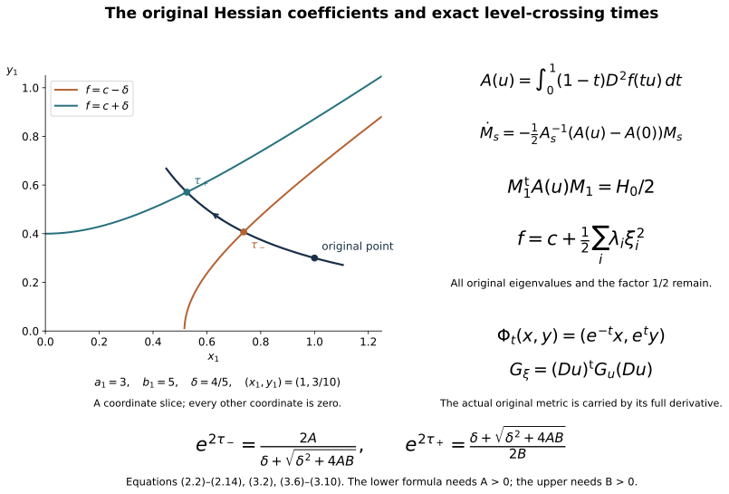
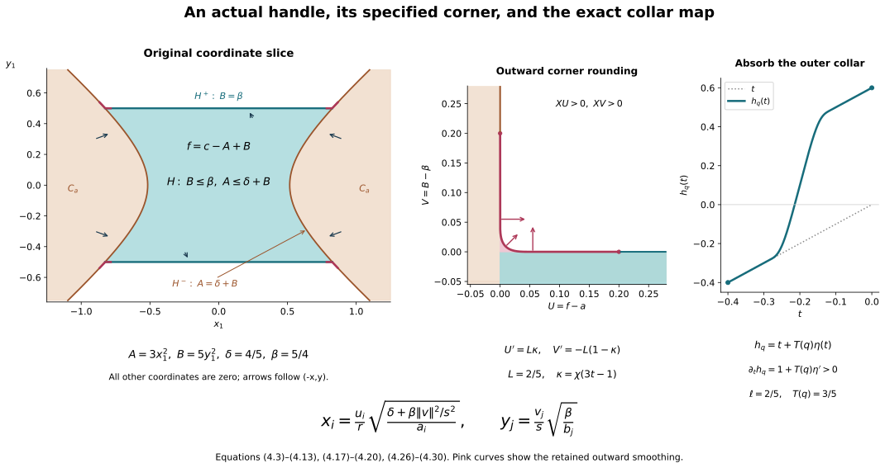

# Relative Morse functions and the original handles {#relative-morse-handles}

Companion for CG-S6 lesson 7. GPT-6 Astra (OpenAI), Ultra, 10 October 2026. New teaching exposition CC0. The actual cobordism is the original
\[
C=X\setminus(\operatorname{int}D_0\cup\operatorname{int}D_1)
\]
from lesson 7, with both original boundary inclusions. Sections 1–4 construct a relative Morse function, prove its full-Hessian coordinate comparison, calculate the local level maps, and construct all its actual framed handles. The finite original handle decomposition is proved. The [original handle-index arrangement](rearranging-the-original-framed-handles.md#arrangement-interchange) is now proved in its companion; low-index removal, slides and complete cancellation remain. The original handle reduction is the next receiving calculation.

## 1. A Morse function on the actual cobordism {#relative-morse-existence}

Write \(M_-=\partial D_0\), \(M_+=\partial D_1\), and retain disjoint inward collars
\[
c_\pm:M_\pm\times[0,L_\pm)\longrightarrow C.
\tag{1.1}
\]
Choose and retain real numbers \(c_-<c_+\), their midpoint \(c_*=(c_-+c_+)/2\), and a positive width
\[
0<\rho<\min\{L_-/5,L_+/5,(c_+-c_-)/10\}.
\tag{1.2}
\]
These are explicit auxiliary choices. They do not change the original disk radii or the boundary maps.

Let \(\chi\) be the full smooth nondecreasing step used in the preceding companions, zero on \((-\infty,0]\) and one on \([1,\infty)\). Define collar cutoffs
\[
\theta_\pm(c_\pm(p,r))=1-\chi((r-3\rho)/\rho),
\tag{1.3}
\]
extended by zero outside their respective collars. They are one for \(r\leq3\rho\) and zero for \(r\geq4\rho\). Their supports are disjoint. The function
\[
f_0=c_*+\theta_-(c_-+r_--c_*)
              +\theta_+(c_+-r_+-c_*)
\tag{1.4}
\]
is well-defined by those supported products. It is exactly \(c_-+r_-\) on the first \(3\rho\) of the incoming collar, exactly \(c_+-r_+\) on the first \(3\rho\) of the outgoing collar, and equals \(c_*\) away from both. Each transition value is a convex combination of the displayed collar value and \(c_*\). Consequently \(c_-<f_0<c_+\) on the interior and the boundary values are exactly \(c_-,c_+\).

Let \(g\) equal \(\chi((r_\pm-\rho)/\rho)\) on each collar for \(r_\pm\leq2\rho\), and equal one elsewhere. It is smooth, zero on the entire prescribed collars \(r_\pm\leq\rho\), positive just beyond them, and one outside \(r_\pm<2\rho\). Construct and retain a smooth embedding \(\iota:C\to\mathbb R^m\) as follows. Choose finitely many coordinate charts \((U_j,\phi_j)\), and nonnegative smooth functions \(\rho_j\) compactly supported in them, such that at every point at least one \(\rho_j\) is positive. Boundary charts take values in half-spaces, with their full \(n\) coordinate functions. The map with all components
\[
\iota=(\rho_j,\rho_j\phi_{j,1},\ldots,\rho_j\phi_{j,n})_j
\]
is smooth after each supported component is extended by zero. If two points have the same image, choose \(j\) with \(\rho_j>0\) at the first point; equality of the first component gives the same positive value at the second, and equality of the next \(n\) components then gives the same chart coordinates, hence the same point. If a tangent vector has zero image derivative, its \(d\rho_j\) component vanishes, and the next components give \(\rho_j d\phi_j=0\), forcing that vector to be zero. Thus the map is an injective immersion. Compactness of \(C\) and the Hausdorff property of \(\mathbb R^m\) give the inverse continuity onto its image, proving that it is an embedding. Here \(m\) is the full number of the displayed components. For parameters \(v=(v_0,\ldots,v_m)\), set
\[
f_v=f_0+g\left(v_0+\sum_{\nu=1}^m v_\nu\iota_\nu\right).
\tag{1.5}
\]
All components and the constant parameter remain.

There is a ball of parameters about zero on which these functions have no critical point in \(r_\pm\leq2\rho\). Indeed \(df_0=\pm dr_\pm\) there, whose norm in the retained original metric has a positive minimum on those compact collar portions. The derivative of the parameter term is linear in \(v\), with bounded coefficients on \(C\). Choose the parameter norm so its derivative norm is less than half that minimum. Also bound its absolute value by \(\rho/2\). Outside the fixed collars, (1.4) lies between \(c_-+\rho\) and \(c_+-\rho\); inside them the perturbation is zero. Thus every such \(f_v\) still has its exact boundary values and its whole interior in \((c_-,c_+)\).

Where \(g(p)>0\), parameter differentiation of the covector \(df_v(p)\) is surjective onto \(T_p^*C\). Given any desired covector \(\eta\), choose \(v'=(v_1',\ldots,v_m')\) with
\[
g(p)\sum_\nu v_\nu' d\iota_\nu|_p=\eta,
\qquad
v_0'=-\sum_\nu v_\nu'\iota_\nu(p).
\tag{1.6}
\]
Such \(v'\) exists because \(D\iota_p\) is injective, so its transpose is onto. In differentiating (1.5), the full \(dg\) contribution vanishes for this choice of \(v_0'\), while the other contribution is exactly \(\eta\). This proves the stated surjectivity without assuming that \(d(g\iota)\) alone has full rank.

In local coordinates, the joint critical set \(df_v(p)=0\) is therefore a smooth manifold of dimension \(m+1\). All its points for our small parameter ball lie in a fixed compact subset of the interior where \(g>0\). At a critical pair its tangent equation is
\[
H_pu+L_pw=0,
\tag{1.7}
\]
where \(H_p\) is the full Hessian of \(f_v\) and \(L_p\) is the onto parameter derivative just proved. The projection of this tangent space to the parameter vector \(w\) is onto if and only if \(H_p\) is onto. One direction follows by solving for \(u\) when \(H_p\) is invertible. Conversely surjectivity of that projection implies \(\operatorname{im}L_p\subset\operatorname{im}H_p\), hence \(\operatorname{im}H_p=T_p^*C\).

Sard's theorem applied to the critical-set projection now gives parameters arbitrarily close to zero for which every critical Hessian is invertible. A countable coordinate cover suffices for this application; the union of the exceptional measure-zero sets still has measure zero. Select such a parameter in the stated small ball. The resulting critical points are isolated, lie in a compact interior set, and hence are finite.

Their critical values can be made distinct without moving the points, changing their Hessians or changing the boundary collars. Choose disjoint coordinate neighbourhoods \(U_i\) of the critical points \(p_i\), and smooth cutoffs \(\psi_i\) supported there and one on smaller neighbourhoods. The original differential has a positive norm minimum \(\eta_i\) on the compact annulus where \(d\psi_i\) can be nonzero. If
\[
|\epsilon_i|\,\sup\|d\psi_i\|<\eta_i/2,
\tag{1.8}
\]
the perturbation
\[
f=f_v+\sum_i\epsilon_i\psi_i
\tag{1.9}
\]
has no new critical point on these annuli, has the exact old differential near each \(p_i\), and is unchanged elsewhere. Further decrease the bounds to retain the interior-value inequalities. Choose the finitely many \(\epsilon_i\) successively within these intervals while excluding the finitely many values that would repeat an earlier critical value. For example one can choose the first rational in a fixed enumeration satisfying those explicit conditions. Then the values \(f_v(p_i)+\epsilon_i\) are distinct, all Hessians are unchanged, and (1.9) is the required relative Morse function on the original \(C\).

## 2. The full original Hessian in local coordinates {#relative-morse-hessian}

Retain an original coordinate chart \(u=(u_1,\ldots,u_n)\) centred at any critical point \(p\), its critical value \(c=f(p)\), and its full nonsingular Hessian matrix
\[
H_0=(\partial_i\partial_j f)(0).
\tag{2.1}
\]
Here \(n=6\) for the current cobordism; the argument also applies to the later seven-dimensional cobordism. The coordinate chart and original metric are not replaced by a preferred metric.

Taylor's formula with integral remainder gives exactly
\[
f(u)-c=u^{\mathsf t}A(u)u,\qquad
A(u)=\int_0^1(1-t)\,D^2f(tu)\,dt,\qquad A(0)=H_0/2.
\tag{2.2}
\]
Choose the chart neighbourhood star-shaped so these segments are inside it. The matrix \(A(u)\) is symmetric. Write \(A_0=H_0/2\), \(\Delta(u)=A(u)-A_0\), and
\[
A_s(u)=A_0+s\Delta(u),\qquad 0\leq s\leq1.
\tag{2.3}
\]
If \(\sigma>0\) is the smallest singular value of \(A_0\), restrict the chart so \(\|\Delta(u)\|<\sigma/2\). Then every \(A_s(u)\) is invertible, since
\(\|A_s v\|\geq(\sigma-\|\Delta\|)\|v\|>\sigma\|v\|/2\).

Solve the matrix equation
\[
\frac{dM_s(u)}{ds}
=-\frac12A_s(u)^{-1}\Delta(u)M_s(u),\qquad M_0(u)=I_n.
\tag{2.4}
\]
It has a smooth solution on the entire compact \(s\)-interval. Its determinant is
\[
\det M_s(u)=
\exp\left[-\frac12\int_0^s
\operatorname{tr}(A_\tau(u)^{-1}\Delta(u))\,d\tau\right]>0.
\tag{2.5}
\]
This is obtained by differentiating the determinant along the linear equation; equivalently the inverse matrix solves its corresponding linear equation, and the logarithmic derivative is the displayed trace. Thus every \(M_s\) is invertible.

Differentiate the complete congruence expression:
\[
\begin{aligned}
\frac{d}{ds}(M_s^{\mathsf t}A_sM_s)
&=M_s^{\mathsf t}
\left[-\frac12\Delta A_s^{-1}A_s
+\Delta-\frac12A_sA_s^{-1}\Delta\right]M_s\\
&=0.
\end{aligned}
\tag{2.6}
\]
Symmetry of both \(A_s\) and \(\Delta\) justifies the first transpose term; commutativity of these two matrices was not assumed. Consequently
\[
M_1(u)^{\mathsf t}A(u)M_1(u)=A_0.
\tag{2.7}
\]
Put \(w=M_1(u)^{-1}u\). At \(u=0\), \(\Delta=0\), so \(M_1(0)=I_n\). The derivative of \(u\mapsto w\) there is identity. The inverse function theorem gives an actual local coordinate map, and (2.2), (2.7) give the exact identity
\[
f(u)=c+w^{\mathsf t}(H_0/2)w.
\tag{2.8}
\]

To identify the index while keeping all eigenvalues, take an orthogonal eigenvector matrix \(Q\) of the original \(H_0\), with
\[
Q^{\mathsf t}H_0Q=\operatorname{diag}(\lambda_1,\ldots,\lambda_n).
\tag{2.9}
\]
Every \(\lambda_i\) is the original nonzero eigenvalue, including its size and sign. Retain the chosen \(Q\) and its determinant. Set \(\xi=Q^{\mathsf t}w\). Then
\[
f=c+\frac12\sum_{i=1}^n\lambda_i\xi_i^2.
\tag{2.10}
\]
This is an exact coordinate comparison retaining the complete original coefficients. The eigenvalues have not been replaced by signs.

The full derivative of that comparison is
\[
D\xi|_u[v]
=Q^{\mathsf t}M_1(u)^{-1}v
-Q^{\mathsf t}M_1(u)^{-1}
 (DM_1|_u[v])M_1(u)^{-1}u.
\tag{2.11}
\]
Its second term is part of the map away from the critical point. For the inverse \(u=u(\xi)\), the original metric in these coordinates remains
\[
G_\xi=(Du|_\xi)^{\mathsf t}G_u(u(\xi))(Du|_\xi).
\tag{2.12}
\]
No identity metric is substituted for (2.12). At the critical point the covariant Hessian agrees with (2.1), since all Christoffel contributions multiply \(df(p)=0\).

Order the eigenvalues so the first \(k\) are negative. Write their retained coefficients as
\[
a_i=-\lambda_i/2>0,\quad 1\leq i\leq k,\qquad
b_j=\lambda_{k+j}/2>0,\quad1\leq j\leq n-k.
\tag{2.13}
\]
With \(\xi=(x,y)\), define the full sums
\[
A(x)=\sum_{i=1}^k a_ix_i^2,\qquad
B(y)=\sum_{j=1}^{n-k}b_jy_j^2,\qquad
f=c-A(x)+B(y).
\tag{2.14}
\]
These formulas retain every eigenvalue contribution, including the empty sums when \(k=0\) or \(k=n\).

## 3. Exact level maps and regular-band products {#relative-morse-levels}

### 3.1. A local increasing field with its metric comparison

In the coordinates just constructed, define the auxiliary field
\[
V=(-x_1,\ldots,-x_k,y_1,\ldots,y_{n-k}).
\tag{3.1}
\]
Its flow, full derivative and function derivative are
\[
\Phi_t(x,y)=(e^{-t}x,e^t y),\quad
D\Phi_t=\operatorname{diag}(e^{-t}I_k,e^tI_{n-k}),\quad
df(V)=2A(x)+2B(y)>0
\tag{3.2}
\]
away from the critical point. The determinant is \(e^{(n-2k)t}\); every coefficient of \(f\) remains in \(A,B\).

This field is not identified with the gradient for the original metric. That gradient is exactly
\[
\nabla_{G_\xi}f
=G_\xi^{-1}(-2a_1x_1,\ldots,-2a_kx_k,
           2b_1y_1,\ldots,2b_{n-k}y_{n-k})^{\mathsf t}.
\tag{3.3}
\]
The comparison is
\[
df((1-s)V+s\nabla_{G_\xi}f)
=(1-s)(2A+2B)+s\,df\,G_\xi^{-1}(df)^{\mathsf t}>0
\tag{3.4}
\]
for \(0\leq s\leq1\), away from the critical point. Thus (3.1) supplies an increasing local field, with its exact relation to the original gradient and metric.

### 3.2. Hitting a specified lower or upper level

Retain \(\delta>0\). A trajectory hits \(f=c-\delta\) when
\[
-Ae^{-2t}+Be^{2t}=-\delta.
\tag{3.5}
\]
If \(A>0\), its unique positive exponential coordinate and time are
\[
s_-=e^{2\tau_-}
=\frac{2A}{\delta+\sqrt{\delta^2+4AB}},
\qquad
\tau_-=\frac12\log s_-.
\tag{3.6}
\]
The time itself can have either sign; the exponential coordinate is positive. This expression remains valid at \(B=0\), where \(s_-=A/\delta\). It follows by solving
\(Bs^2+\delta s-A=0\) and retaining the displayed rationalized expression rather than dividing by \(B\) at its zero.

If \(A=0\) and \(B>0\), the trajectory has \(f>c\) at all finite times and never reaches the lower level. If \(A=B=0\), it is the stationary critical point and reaches neither level.

Similarly the upper level \(f=c+\delta\), for \(B>0\), is reached at
\[
s_+=e^{2\tau_+}
=\frac{\delta+\sqrt{\delta^2+4AB}}{2B},
\qquad
\tau_+=\frac12\log s_+.
\tag{3.7}
\]
This remains valid at \(A=0\), where \(s_+=\delta/B\). If \(B=0\) and \(A>0\), the trajectory stays below \(c\) and never reaches the upper level. These exceptional stable and unstable sets are retained.

The coordinate flow is used only while it remains in the original chart. On that domain the complete hitting maps are
\[
P_\pm(x,y)=(e^{-\tau_\pm(x,y)}x,e^{\tau_\pm(x,y)}y).
\tag{3.8}
\]
Differentiating the respective level equation gives, with
\[
\mathcal D=Ae^{-2\tau_\pm}+Be^{2\tau_\pm}
=\sqrt{\delta^2+4AB}>0,
\]
the full time differential
\[
d\tau_\pm=
\frac{e^{-2\tau_\pm}dA-e^{2\tau_\pm}dB}{2\mathcal D},
\quad
dA[v]=2\sum_i a_ix_iv_i,\quad
dB[w]=2\sum_j b_jy_jw_j.
\tag{3.9}
\]
Thus
\[
DP_\pm[v,w]
=\bigl(e^{-\tau_\pm}(v-x\,d\tau_\pm[v,w]),
       e^{\tau_\pm}(w+y\,d\tau_\pm[v,w])\bigr).
\tag{3.10}
\]
The time derivative terms remain. Substitution into \(df\) at the image gives zero, as it must for a map into the specified level: the numerator in (3.9) cancels exactly the \(2\mathcal D\,d\tau_\pm\) term. These formulas include every coefficient, and describe their exact domains at \(A=0\) and \(B=0\).

### 3.3. The complete product between two regular levels

Choose disjoint small critical charts, and use their fields (3.1) on smaller neighbourhoods. Off the critical points, the original gradient has positive function derivative. Near the boundary use \(+\partial_{r_-}\) and \(-\partial_{r_+}\), respectively, whose function derivatives equal one by (1.4), (1.9). A partition of unity joins these fields into a smooth field \(X\) on the actual cobordism, equal to the specified fields on smaller critical charts and on the prescribed boundary collars. Each weighted contribution has positive \(df\)-value away from a critical point. Therefore
\[
df(X)>0\quad\text{off the critical points}.
\tag{3.11}
\]
It has no extra zero. Its metric and original-coordinate description is obtained by (2.11)–(2.12) in each chart and by the retained collars at the boundary.

Let \([a,b]\subset[c_-,c_+]\) contain no critical value. On its compact inverse image the field
\[
Y=\frac{X}{df(X)}
\tag{3.12}
\]
is smooth and has \(df(Y)=1\). The positive denominator has a minimum on that compact band. The flow therefore exists for the whole time needed to cross the band: while inside it the field is bounded in finitely many charts, and its level coordinate changes exactly at unit speed. Its only exit in the forward direction is at \(f=b\), and in the backward direction at \(f=a\).

The exact product map and inverse are
\[
\begin{aligned}
f^{-1}(a)\times[a,b]&\longrightarrow f^{-1}([a,b]),
&(p,s)&\longmapsto\operatorname{Fl}^{Y}_{s-a}(p),\\
m&\longmapsto
\bigl(\operatorname{Fl}^{Y}_{a-f(m)}(m),f(m)\bigr).
\end{aligned}
\tag{3.13}
\]
The flow uniqueness and composition rule prove both inverse identities. Smooth dependence on time and initial data proves smoothness. This supplies the actual products between the critical levels of (1.9), retaining their endpoint identifications. The next section constructs the exact framed handle across each critical level.

## 4. The actual framed handle at one critical level {#relative-morse-attachment}

### 4.1. Its domain, embedding and complete attaching tube

Let \(p\) be one of the critical points of (1.9), with index \(k\), value \(c\), and the actual coordinates (2.14). Put \(q=n-k\). Denote the inverse of those coordinates, into the original cobordism, by \(\Theta\). Choose positive numbers \(\delta,\beta\) so small that
\[
a=c-\delta,\qquad b=c+2\beta
\tag{4.1}
\]
are regular values, the interval \([a,b]\) contains only this critical value, and the compact set
\[
H_{\mathrm{coord}}
=\{(x,y):B(y)\leq\beta,\ A(x)\leq\delta+B(y)\}
\tag{4.2}
\]
and a neighbourhood of it lie in a coordinate neighbourhood where \(X=V\). Such a choice exists: there are finitely many distinct critical values; moreover (4.2) satisfies \(A\leq\delta+\beta\), \(B\leq\beta\), so it shrinks into any given neighbourhood of the origin as both numbers tend to zero. No original coefficient in \(A,B\) is changed. Write \(H=\Theta(H_{\mathrm{coord}})\) and \(C_t=f^{-1}([c_-,t])\).

Retain arbitrary positive handle radii \(r,s\), and let \(D_r^k,D_s^q\) be the closed Euclidean disks with those radii. Their coordinates will be \(u,v\). The exact coordinate embedding is
\[
\begin{aligned}
B_v&=\frac{\beta}{s^2}\sum_{j=1}^q v_j^2,\\
E_i^x(u,v)&=\frac{u_i}{r}
       \sqrt{\frac{\delta+B_v}{a_i}},\qquad 1\leq i\leq k,\\
E_j^y(u,v)&=\frac{v_j}{s}
       \sqrt{\frac{\beta}{b_j}},\qquad 1\leq j\leq q.
\end{aligned}
\tag{4.3}
\]
Its map into the original cobordism is \(\mathcal E=\Theta\circ E\). Direct substitution gives
\[
B(E^y)=B_v,\qquad
A(E^x)=\frac{\|u\|^2}{r^2}(\delta+B_v),\qquad
f(\mathcal E(u,v))
=c-\frac{\|u\|^2}{r^2}(\delta+B_v)+B_v.
\tag{4.4}
\]
Thus the image is exactly (4.2). The full inverse is
\[
u_i=r\sqrt{\frac{a_i}{\delta+B(y)}}\,x_i,
\qquad
v_j=s\sqrt{\frac{b_j}{\beta}}\,y_j.
\tag{4.5}
\]
All denominators are positive. These formulas and their smooth extensions to neighbourhoods of the closed disks prove that this is a diffeomorphism of manifolds with corners onto \(H\).

In particular, the negative and positive faces are
\[
\begin{aligned}
H^-&=\mathcal E(S_r^{k-1}\times D_s^q)
     =\{A=\delta+B,\ B\leq\beta\}\subset M_a=f^{-1}(a),\\
H^+&=\mathcal E(D_r^k\times S_s^{q-1})
     =\{B=\beta,\ A\leq\delta+\beta\}.
\end{aligned}
\tag{4.6}
\]
The attaching map is the complete embedding
\(\varphi=\mathcal E|_{S_r^{k-1}\times D_s^q}\), not only its core sphere. Formula (4.4) proves
\[
H\cap C_a=H^-,\qquad f>a\ \text{on }H\setminus H^-.
\tag{4.7}
\]
This equality is an equality of subsets of the original cobordism. Hence \(C_a\cup H\) is the actual handle attachment along \(\varphi\).

For completeness, retain the entire derivative of this embedding. For variations \(\dot u,\dot v\), set
\[
\dot B_v=\frac{2\beta}{s^2}\sum_jv_j\dot v_j.
\]
Then
\[
\begin{aligned}
DE_i^x[\dot u,\dot v]
&=\frac1r\sqrt{\frac{\delta+B_v}{a_i}}\,\dot u_i
  +\frac{E_i^x}{2(\delta+B_v)}\,\dot B_v,\\
DE_j^y[\dot u,\dot v]
&=\frac1s\sqrt{\frac{\beta}{b_j}}\,\dot v_j,\\
D\mathcal E&=D\Theta|_{E(u,v)}\,DE.
\end{aligned}
\tag{4.8}
\]
The second term in the first line remains throughout the thick attaching tube. On its core \(v=0\) it vanishes because \(dB_v=0\), and the normal framing of the core in \(M_a\) is the ordered collection
\[
N_j(u)=D\Theta|_{E(u,0)}
       \left(0,\frac1s\sqrt{\frac{\beta}{b_j}}\,e_j\right),
\qquad 1\leq j\leq q.
\tag{4.9}
\]
These vectors lie in \(TM_a\): the \(y\)-derivative of \(f\) vanishes at \(y=0\). Together with the tangent vectors obtained from \(T_uS_r^{k-1}\), they are independent by the invertibility of \(DE\) and \(D\Theta\). They therefore give the actual normal framing, with the indicated ordering and scale. Their full Gram matrix is
\[
\left(N_i(u)^{\mathsf t}G_{\mathrm{original}}(\mathcal E(u,0))
                     N_j(u)\right)_{i,j=1}^q.
\tag{4.10}
\]
No orthonormal framing or replacement metric is inserted.

As a further direct verification of the full tube, differentiating (4.4) gives
\[
d(f\mathcal E)=
-\frac{\delta+B_v}{r^2}\,d\|u\|^2
+\left(1-\frac{\|u\|^2}{r^2}\right)dB_v.
\tag{4.11}
\]
Both terms vanish on tangent vectors of \(S_r^{k-1}\times D_s^q\). Dropping the \(x\)-term involving \(dB_v\) in (4.8) would destroy this identity away from the core.

### 4.2. The specified smooth attachment corner

Assume for this paragraph that \(0<k<n\). The two faces meet at \(A=\delta+\beta,\ B=\beta\). In a neighbourhood of their intersection introduce the exact radial coordinates
\[
U=f-a=\delta-A+B,\qquad V=B-\beta.
\tag{4.12}
\]
Both radial differentials are independent there: \(x\) and \(y\) are nonzero, \(dA\) involves only \(x\), and \(dB\) only \(y\). Coordinates on the two corresponding ellipsoidal spheres supply the remaining coordinates. The inverse radial formulas are
\[
A=\delta+\beta+V-U,\qquad B=\beta+V.
\tag{4.13}
\]
The raw attachment occupies
\[
\{U\leq0\}\ \cup\ \{V\leq0\}
\tag{4.14}
\]
in this neighbourhood. Indeed \(U\leq0\) is \(C_a\), whereas for \(U\geq0\), \(V\leq0\) is precisely its added handle portion.

Here is a specific smoothing, including its scale. The step function may be taken to be
\[
\chi(t)=\frac{e^{-1/t}}{e^{-1/t}+e^{-1/(1-t)}}\quad(0<t<1),
\tag{4.15}
\]
with values zero and one outside this interval. This is the symmetric smooth step already permitted in (1.3); it satisfies \(\chi(t)+\chi(1-t)=1\). Set
\[
\kappa(t)=\chi(3t-1),\qquad
\kappa(t)+\kappa(1-t)=1\quad(0\leq t\leq1).
\tag{4.16}
\]
For a sufficiently small retained \(L>0\), replace the corner by the curve
\[
U(t)=L\int_0^t\kappa(z)\,dz,\qquad
V(t)=L\int_t^1\kappa(1-z)\,dz,\qquad 0\leq t\leq1.
\tag{4.17}
\]
It runs from \((0,L/2)\) to \((L/2,0)\). Near its first endpoint it is exactly a segment of the \(V\)-axis, and near its second it is exactly a segment of the \(U\)-axis. Thus it joins the original two boundary pieces with every derivative. Its tangent is
\[
(U',V')=L(\kappa(t),-\kappa(1-t)),
\tag{4.18}
\]
which never vanishes. Add to (4.14) the bounded region in the nonnegative quadrant enclosed by this curve and the axes. This is an outward rounding of the attachment, not a deletion of points of \(C_a\) or \(H\). Choose \(L<\delta\), and further decrease it so the entire rounding lies inside the retained coordinate neighbourhood. Equations (4.13) remain positive there.

The field \(X=V_{\mathrm{field}}=(-x,y)\), where the subscript distinguishes the vector field from the scalar coordinate \(V\), satisfies
\[
XU=2(A+B)>0,\qquad XV=2B>0.
\tag{4.19}
\]
An outward conormal along (4.17) is
\[
\kappa(1-t)\,dU+\kappa(t)\,dV.
\tag{4.20}
\]
Its value on \(X\) is strictly positive, because both coefficients are nonnegative and their sum is one. On the old boundary portion \(f=a\), the outward conormal is \(df\), whose value on \(X\) is positive; on the unchanged handle face \(B=\beta\), it is \(dB\), whose value is \(2\beta>0\). Consequently \(X\) is transverse outwards along the entire new outgoing boundary.

Let \(K\) denote this particular smoothed attachment, and let \(S\) be its outgoing boundary. Its incoming boundary and a whole collar of it agree with those of \(C\). The only critical point in \(f^{-1}([a,b])\) is in the interior of \(H\), hence in the interior of \(K\). Moreover
\[
a\leq f|_S\leq c+\beta<b.
\tag{4.21}
\]
For the rounded part, \(f=a+U\leq a+L/2<c\); for the original positive face, \(f=c-A+\beta\leq c+\beta\); the remaining part has \(f=a\). This proves (4.21) on all pieces, including their joins.

The construction defines a specific smooth structure on the attached handle and its seam through its embedding in \(C\). It does not appeal to an unspecified smoothing theorem. The original \(\mathcal E\), all of \(H\), and the old \(C_a\) are retained as subsets. Their common face becomes interior except at its boundary, which lies inside the rounded region. The original metric on \(K\) is its restricted metric from \(C\).

### 4.3. Absorbing the regular outer region by an exact collar map

Define
\[
E_{\mathrm{out}}=\overline{C_b\setminus K}.
\tag{4.22}
\]
Its two boundary faces are \(S\) and \(M_b=f^{-1}(b)\). There are no critical points on this compact region. In particular, the field \(Y=X/df(X)\) from (3.12) is smooth on a neighbourhood of it and satisfies \(df(Y)=1\).

Every forward trajectory from \(q\in S\) stays outside the interior of \(K\) until it reaches \(M_b\). It cannot cross back into \(K\): every possible first return through \(S\) would point inward, contrary to the strict outward transversality already proved. Compactness and the equation \(df(Y)=1\) ensure existence up to the upper level. Its exact travel time is
\[
T(q)=b-f(q)>0.
\tag{4.23}
\]
Conversely, every backward trajectory from a point of \(E_{\mathrm{out}}\) reaches \(S\). If it did not, it would continue in the compact critical-point-free region until its value decreased below \(a\), which is impossible because \(C_a\subset K\). Before any such exit it therefore meets the boundary \(S\); strict transversality and uniqueness give a single first intersection and prevent a second. These arguments prove that
\[
e(q,t)=\operatorname{Fl}^Y_t(q),
\qquad q\in S,\quad 0\leq t\leq T(q),
\tag{4.24}
\]
is a bijection onto \(E_{\mathrm{out}}\). Its derivative is invertible: \(Y\) is transverse to \(S\), and the flow carries this transverse splitting to each later time. Equivalently the inverse hitting time is smooth by the implicit function theorem in the transverse boundary coordinate. Thus (4.24) is a diffeomorphism of the displayed variable-length collar with \(E_{\mathrm{out}}\).

Since \(S\) is compact and disjoint from every critical point and the incoming boundary, this collar extends for a uniform negative time \(-\ell\). Decrease \(\ell>0\) until
\[
e:S\times[-\ell,0]\longrightarrow K
\tag{4.25}
\]
is an embedding, stays away from the incoming boundary, and stays in the regular part. For clarity about the embedding assertion, each point has a flow coordinate neighbourhood by transversality; a finite cover gives a uniform local width. Failure of global injectivity at every smaller width would supply two sequences of distinct flow coordinates with times tending to zero and the same image. Compactness gives a common limit on \(S\), since both images converge to their starting points; this contradicts the local injectivity there. This proves (4.25) after decreasing the width once.

Choose a smooth nondecreasing \(\eta:[-\ell,0]\to[0,1]\), zero near \(-\ell\) and one near \(0\). For example use \(\chi((t+3\ell/4)/(\ell/2))\). For each \(q\), define
\[
h_q(t)=t+T(q)\eta(t),\qquad -\ell\leq t\leq0.
\tag{4.26}
\]
Then
\[
h_q(-\ell)=-\ell,\quad h_q(0)=T(q),\qquad
\partial_t h_q=1+T(q)\eta'(t)>0.
\tag{4.27}
\]
It maps its interval diffeomorphically onto \([-\ell,T(q)]\). Define
\[
F:K\longrightarrow C_b,\qquad
F(e(q,t))=e(q,h_q(t))
\tag{4.28}
\]
on the inner collar, and take \(F\) to be the identity elsewhere in \(K\). It is identity on an open overlap near \(t=-\ell\), so the two definitions agree smoothly with every derivative. Equations (4.24), (4.27) prove bijectivity and give its inverse by the smooth inverse of \(h_q\).

The full derivative in these collar coordinates is
\[
DF_{(q,t)}[\dot q,\dot t]
=\left(\dot q,\,
 (1+T(q)\eta'(t))\dot t+\eta(t)\,dT|_q[\dot q]\right),
\qquad dT=-d(f|_S).
\tag{4.29}
\]
Its determinant in this splitting is \(1+T\eta'>0\); the tangential travel-time term is retained. In original coordinates the derivative is
\[
De|_{(q,h_q(t))}
\begin{pmatrix}I&0\\ \eta(t)dT&1+T\eta'\end{pmatrix}
(De|_{(q,t)})^{-1}.
\tag{4.30}
\]
Consequently every tangent vector, frame and original metric has its exact change of coordinates: for example the pullback metric is \((DF)^{\mathsf t}G_{\mathrm{original}}(F(\cdot))DF\), with the full matrix (4.30).

The map fixes a whole incoming collar and all sufficiently early sublevels. More explicitly, the affected collar has \(f(e(q,t))=f(q)+t\geq a-\ell\); taking a slightly earlier regular value gives a sublevel that is fixed pointwise. It generally does not fix the whole of \(C_a\), since its old outgoing boundary outside the attaching tube must move to \(M_b\). On the new outgoing boundary it is the exact map
\[
F|_S(q)=\operatorname{Fl}^Y_{b-f(q)}(q).
\tag{4.31}
\]
Near \(t=0\), \(\eta=1\), and
\[
f(F(e(q,t)))=f(q)+t+b-f(q)=b+t.
\tag{4.32}
\]
Thus the diffeomorphism also gives the precise outgoing product collar. This proves that the original sublevel \(C_b\) is diffeomorphic, relative to its incoming collar, to the specified framed \(k\)-handle attached to \(C_a\), with the corner smoothing (4.17).

### 4.4. The extreme indices and the whole original decomposition

At index \(k=0\), the \(x,u\) blocks are empty and \(A=0\). Formula (4.3) is the full \(0\)-handle parametrization
\[
D_r^0\times D_s^n\longrightarrow\{B\leq\beta\}.
\tag{4.33}
\]
Its negative face is empty and the handle is a new component above \(a=c-\delta\). Its positive face \(B=\beta\) is transverse outwards with \(df(X)=2\beta\). There is no attachment corner. Take \(K=C_a\sqcup H\); the outer-collar proof (4.22)–(4.32) applies to every component of its outgoing boundary. The number \(r>0\) is retained as part of the chosen zero-dimensional disk notation, without introducing an extra coordinate.

At index \(k=n\), the \(y,v\) blocks are empty and \(B=0\). Formula (4.3) is
\[
D_r^n\times D_s^0\longrightarrow
\{A\leq\delta\},\qquad
x_i=\frac{u_i}{r}\sqrt{\frac{\delta}{a_i}}.
\tag{4.34}
\]
Its entire boundary \(A=\delta\) is the negative face; its positive face is empty. The old and added regions occupy respectively \(A\geq\delta\) and \(A\leq\delta\) near that sphere, so their union is smooth without a corner there. This fills the relevant outgoing boundary component. The remaining outgoing components, if any, have exactly the outer collar already proved. If there is no outgoing component, there is no outer region to absorb. Indeed a nonempty such region would contain a backward unit-speed flow trajectory forced to hit an outgoing boundary of \(K\), a contradiction. The original radius \(s\) and all empty sums remain as in (4.34).

Finally order the finitely many critical values of (1.9):
\[
c_-<c_1<\cdots<c_N<c_+.
\tag{4.35}
\]
Choose the intervals \([a_i,b_i]\) of (4.1) disjoint and in that order, keeping all chosen \(\delta_i,\beta_i,r_i,s_i\). The first interval \([c_-,a_1]\), the intervening \([b_i,a_{i+1}]\), and the last \([b_N,c_+]\) have the actual product maps (3.13). Across each critical interval use the just-proved attachment and map (4.28). This is a finite construction, so it yields the entire original cobordism.

Here is the precise induction on its identifications. Suppose an already constructed handle body \(P_i\) has a diffeomorphism \(G_i:P_i\to C_{a_i}\), carrying its outgoing boundary to \(M_{a_i}\) and agreeing with the retained incoming identification. Pull the full attaching tube back by
\[
\widetilde\varphi_i=G_i^{-1}\circ\varphi_i
:S_{r_i}^{k_i-1}\times D_{s_i}^{n-k_i}\longrightarrow\partial_+P_i.
\tag{4.36}
\]
Attach the original parameter disk product along this map. The transverse smooth seam is specified as follows, so equality of boundary maps is not being used as a substitute for equality of collar maps. For \(u_0\in S_{r_i}^{k_i-1}\), extend (4.3) to
\[
(u_0,v,\sigma)\longmapsto
\mathcal E_i((1+\sigma/r_i)u_0,v)
\tag{4.37}
\]
for small positive and negative \(\sigma\). For \(\sigma>0\) the image is in the old sublevel, and for \(\sigma<0\) in the new handle. Its transverse function derivative is
\[
\frac{\partial f}{\partial\sigma}
=-\frac{2}{r_i}(1+\sigma/r_i)(\delta_i+B_v)<0.
\tag{4.38}
\]
Thus (4.37) is a genuine collar through the face, with every derivative prescribed. On the old side use its pullback by \(G_i^{-1}\) as the gluing collar. In this collar chart the combined old and new map is exactly (4.37) on both sides, hence is smooth with smooth inverse at the seam. At the edge of the face use the radial corner coordinates (4.12)–(4.13) and the smoothing (4.17), transported through these same maps; this defines a compatible smooth extension across that edge as well. At index zero there is no seam, and at the top index the face collar (4.37) has no edge.

The map \(G_i\) on the old part and \(\mathcal E_i\) on the handle therefore gives the specified smoothed attachment its exact diffeomorphism to \(K_i\). Compose it with \(F_i:K_i\to C_{b_i}\) and then with the following regular product. This supplies \(G_{i+1}\). Every framing in (4.36) is transported by \(DG_i^{-1}\), including all scale factors in (4.9), and every thick tube is transported by its full map (4.8). The collars in (4.32) specify the smooth seam at the next regular product.

Start this induction with the first regular product from \(M_-\). If \(N=0\), the single product (3.13) already supplies the whole cobordism; otherwise it terminates at the last regular product into \(M_+\). The final outgoing identification is the restriction of the composition of these actual maps. It is retained as part of the construction; it is not replaced by an arbitrary identification of the boundary spheres. This proves a finite handle decomposition of the original \(C\), relative to its prescribed incoming collar, with every original critical index, attaching tube and outgoing gluing map accounted for. This gives their original order. The [original handle-index arrangement](rearranging-the-original-framed-handles.md#arrangement-interchange) is proved in the receiving companion; it does not yet remove a handle.

<figure>

</figure>

*Figure 1.* The left panel is the specified coordinate slice \(f=c-3x_1^2+5y_1^2\), with all other coordinates zero, \(\delta=4/5\), and starting point \((1,3/10)\). The dark curve is the exact flow (3.2); its marked intersections use (3.6) and (3.7), with their stated domains. The right panel displays the complete Hessian comparison (2.2)–(2.12), including the original metric. This is a slice of the proved construction, not a picture of all of \(C\). Reproducible source: the included figure script; no additional result or source reading is asserted by the illustration.

## 5. Two worked exercises {#relative-morse-exercises}

### Exercise 5.1. A thick attaching tube is tangent only with all its terms

Take \(n=6\), \(k=2\), and retain
\[
(a_1,a_2)=(2,11),\quad
(b_1,b_2,b_3,b_4)=(3,13,17,19),\quad
r=2,\ s=3,\ \delta=5,\ \beta=7.
\tag{5.1}
\]
At the point
\[
u=(0,2),\qquad v=(3/5,4/5,0,0)
\tag{5.2}
\]
of the negative face, compute the original coordinate image, its differential in the direction \(\dot u=0,\dot v=(1,0,0,0)\), and the resulting differential of \(f\). State the complete core framing, retaining the two unused positive directions.

**Solution.** Here \(\|u\|^2=r^2=4\), \(\|v\|^2=1<s^2=9\), and \(B_v=7/9\). Equations (4.3)–(4.4) give
\[
\begin{aligned}
x_1&=0,&x_2&=\sqrt{\frac{52}{99}},\\
y_1&=\frac15\sqrt{\frac73},&
y_2&=\frac4{15}\sqrt{\frac7{13}},&
y_3&=0,&y_4&=0,\\
A(x)&=\frac{52}{9},&
B(y)&=\frac79,&
f&=c-\frac{52}{9}+\frac79=c-5=a.
\end{aligned}
\tag{5.3}
\]
In the stated direction,
\[
\dot B_v=\frac{14}{9}\frac35=\frac{14}{15}.
\]
Consequently the full differential is
\[
\dot x_1=0,\qquad
\dot x_2=\frac{21}{260}x_2,\qquad
\dot y_1=\frac13\sqrt{\frac73},\qquad
\dot y_2=\dot y_3=\dot y_4=0.
\tag{5.4}
\]
The two contributions to \(df\) are exactly
\[
-2(11)x_2\dot x_2
=-22\frac{52}{99}\frac{21}{260}
=-\frac{14}{15},
\qquad
2(3)y_1\dot y_1
=6\left(\frac15\sqrt{\frac73}\right)
   \left(\frac13\sqrt{\frac73}\right)
=\frac{14}{15}.
\tag{5.5}
\]
Their sum is zero, as required for a vector tangent to \(M_a\). If the \(dB_v\) term in the \(x\)-coordinate were dropped, the result would instead be \(14/15\), so the alleged tangent map would not land in \(TM_a\).

At any point of the core \(v=0\), retain the actual base point
\[
E(u,0)=\left(\frac{u_1}{2}\sqrt{\frac52},
             \frac{u_2}{2}\sqrt{\frac5{11}},0,0,0,0\right)
\]
and the four ordered vectors
\[
\begin{aligned}
N_1&=D\Theta|_{E(u,0)}(0,0,\sqrt{7/3}/3,0,0,0),\\
N_2&=D\Theta|_{E(u,0)}(0,0,0,\sqrt{7/13}/3,0,0),\\
N_3&=D\Theta|_{E(u,0)}(0,0,0,0,\sqrt{7/17}/3,0),\\
N_4&=D\Theta|_{E(u,0)}(0,0,0,0,0,\sqrt{7/19}/3).
\end{aligned}
\tag{5.6}
\]
They are the complete framing from (4.9). The original metric gives their Gram matrix (4.10). The zero coordinates in (5.2) do not remove the last two normal directions or their scale factors.

### Exercise 5.2. Variable collar length changes the mixed metric terms

On a one-dimensional coordinate slice of \(S\), let its coordinate be \(z\in(-1,1)\), with
\[
a=-2,\qquad b=3,\qquad f(q(z))=-2+z/4,\qquad
T(z)=5-z/4.
\tag{5.7}
\]
Retain \(\ell>0\) and the exact step
\(\eta(t)=\chi((t+3\ell/4)/(\ell/2))\) from Section 4.3. Compute the full derivative of \((z,t)\mapsto(z,t+T(z)\eta(t))\), and its pullback of the original metric
\[
G_{\mathrm{image}}=
\begin{pmatrix}P&Q\\Q&R\end{pmatrix},
\quad P>0,\quad PR-Q^2>0,
\tag{5.8}
\]
evaluated at the actual image point. Explain why the tangential derivative must remain even when only a collar is being added.

**Solution.** Since \(T(z)>19/4>0\), the complete derivative and its determinant are
\[
D F=
\begin{pmatrix}
1&0\\-\eta/4&w
\end{pmatrix},
\qquad
w=1+(5-z/4)\eta'(t)>0,\qquad
\det DF=w.
\tag{5.9}
\]
Here \(19/4\) is the strict lower bound because \(z<1\). Matrix multiplication, without discarding either mixed term of (5.8), gives
\[
F^*G=
\begin{pmatrix}
P-\eta Q/2+\eta^2R/16 & w(Q-\eta R/4)\\
w(Q-\eta R/4)&w^2R
\end{pmatrix}.
\tag{5.10}
\]
Its determinant is exactly \(w^2(PR-Q^2)>0\), and its first diagonal entry is positive because it is the value of the original positive metric on the nonzero vector \((1,-\eta/4)\). Thus it is the complete positive pullback metric.

The inverse function theorem gives a smooth inverse because \(w>0\); global invertibility on the collar follows from strict monotonicity in \(t\), the endpoint values \(-\ell\) and \(T(z)\), and the unchanged \(z\) coordinate. Differentiating this inverse in the image \(z\)-direction gives
\[
DF^{-1}(1,0)=\left(1,\frac{\eta}{4w}\right).
\tag{5.11}
\]
In particular the original and image level parameters cannot be varied independently while suppressing that second component.

For an exact interior check, at \(z=0,t=-\ell/2\) we have \(\chi(1/2)=1/2\) and \(\chi'(1/2)=2\), by differentiating (4.15). Therefore
\[
\eta=\frac12,\quad \eta'=\frac4\ell,\quad
w=1+\frac{20}{\ell},\quad
h_0(-\ell/2)=-\ell/2+5/2.
\tag{5.12}
\]
The off-diagonal entry in (5.10) is \(w(Q-R/8)\), and its first diagonal entry is \(P-Q/4+R/64\). These contributions persist even if the original metric happened to have \(Q=0\). The variation of the travel time, rather than a change of the original metric, creates these coordinate terms.

<figure>

</figure>

*Figure 2.* The left panel retains \(A=3x_1^2\), \(B=5y_1^2\), \(\delta=4/5\), \(\beta=5/4\), with all other coordinates zero. The turquoise region is the handle (4.2), and the brown region is the original sublevel; their common curved sides are exactly the attaching face. Pink curves mark the outward smoothing (4.17), with \(L=2/5\). The middle panel shows its exact radial coordinates \(U=f-a,V=B-\beta\), the two original boundary rays, and its outward conormal directions. The last panel is the one-variable collar map (4.26) at a fixed boundary point, with \(\ell=2/5,T(q)=3/5\); the full variable-\(q\) derivative is (4.29). The plotted integrals are numerical samples of the exact smooth curve; the endpoint values and all signs are proved in Section 4.2.

## 6. Sources, use and the next receiving calculation {#relative-morse-sources}

The objects here are the original punctured manifold and boundary inclusions of [working lesson 7](integral-homology-and-sphere-recognition.md#smooth-recognition). Sections 1–4 give the complete relative Morse and handle-insertion argument used in that lesson, including the coordinate comparison, literal attachment, specified seam, smoothing and boundary map. The proof uses the inverse function theorem, smooth dependence and uniqueness for ordinary differential equations, and Sard's theorem in the explicit finite-parameter application (1.5)–(1.7). The compact-manifold embedding used there is constructed in Section 1. The proof does not assume a handle decomposition or its index order.

For the later cancellation step, the original-author source already read is François Laudenbach, *A proof of Morse's theorem about the cancellation of critical points*, [arXiv:1307.2545v1](https://arxiv.org/abs/1307.2545v1), Sections 1–3, including the relative coordinate claim, Lemmas 1–2 and Corollary 1. Both retained author TeX files, *cancel_hal.tex* and *english3.2.tex*, were read in full. Its receiving argument is written separately in the [supported Morse-cancellation companion](morse-cancellation-with-controlled-support.md#morse-product-map). This is a citation for that receiving cancellation method; the full formulas and handle-insertion proof of the present chapter are given here. No additional human-source reading, exhaustive literature coverage, novelty or independent review is claimed.

The [original handle-index arrangement](rearranging-the-original-framed-handles.md#arrangement-interchange) now carries the entire original decomposition into index order, preserving its full outgoing identification. The next required operations remove the low and high indices using the original connectivity and homology, and calculate the full integer incidence operations of handle slides. Only after those operations produce the needed original stage can the [framed Whitney disk](belt-sphere-complements-and-the-whitney-disk.md#whitney-boundary) and the [supported Whitney move](whitney-move-with-controlled-support.md#move-receiving-attachments) be applied there, followed by supported Morse cancellation. The original outgoing identification from (4.35)–(4.38) must be transported throughout those operations. The remaining smooth six-sphere classification is a further calculation. The finite decomposition proved here supplies the actual starting object for this work; it does not assert its completed reduction.

