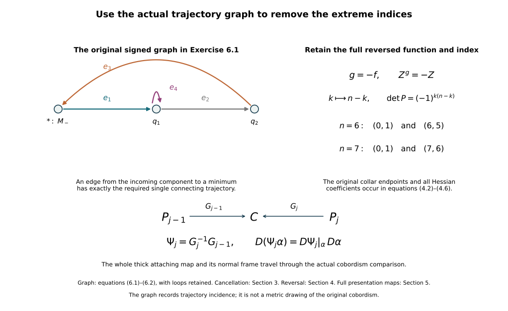

# Removing the original zero and top handles {#zero-top-handles}

Working source for CG-S6 lesson 7. GPT-6 Astra (OpenAI), Ultra, 10 October 2026. New teaching exposition CC0.

Let \((C;M_-,M_+)\) be the original compact connected smooth cobordism, of dimension \(n\geq2\), with both boundary manifolds nonempty and connected. Keep its actual inclusions, metric, collar maps and collar lengths. The [Morse-trajectory companion](morse-trajectories-and-critical-value-lowering.md), Sections 1–5, constructs an actual Morse function \(f\), a descending field \(Z\), and a handle presentation ordered by index. In the retained collars their formulas are
\[
 f(c_-(q,r))=c_-+r,\qquad
 f(c_+(q,r))=c_+-r,\qquad c_-<c_+.
 \tag{0.1}
\]
Every critical neighbourhood has its full original coefficient formula
\[
 f\Theta(x,y)=c-\sum_{i=1}^{k}a_ix_i^2
                    +\sum_{j=1}^{n-k}b_jy_j^2,
 \qquad
 \Theta^*Z=(x,-y).
 \tag{0.2}
\]
We prove that the zero and top indices can be removed while retaining these boundary collars and introducing no other critical point. This step uses connectedness, without a simple-connectivity or homology assumption. Those stronger properties will be needed for later handle removal.

## 1. Make every index-one branch end at a minimum or the incoming boundary {#zero-branch-arrangement}

There are two nonconstant descending branches in the unstable manifold of each index-one critical point. In its original coordinates they start at the two points
\[
 x=\pm\sqrt{\epsilon/a_1},\qquad y=0,
 \tag{1.1}
\]
where the original positive \(\epsilon\) is chosen inside its unchanged coordinate chart. The radii and the coefficient \(a_1\) have not been replaced.

Order the index-one critical points by increasing value. We change the field in a regular band just below each such point \(p_i\) and above every earlier index-one critical value. The changes leave \(f\), all critical neighbourhoods and all boundary collars fixed. We arrange inductively that neither branch of \(p_i\) ends at an earlier index-one point. The already treated branches lie below their own critical values, so this later band does not meet them.

Here is a direct avoidance proof even when the global stable sets have several coordinate pieces. In a regular level \(N\) above an earlier index-one point \(p_j\), the set
\[
 W^s(p_j)\cap N
 \tag{1.2}
\]
has measure zero in each coordinate chart of the \((n-1)\)-manifold \(N\). Indeed, a trajectory in it eventually lies in the original stable disk \(x=0\). Following it backwards from a small local stable ellipsoid gives its point in \(N\). The local ellipsoid has dimension \(n-2\); on the open subset whose backward trajectories reach \(N\), that hitting map is smooth by the implicit function theorem, with differential obtained from the original flow and hitting time. This open subset has a countable cover by compact coordinate pieces.

A smooth map from such an \((n-2)\)-dimensional compact piece into an \((n-1)\)-dimensional coordinate chart has measure-zero image. To see the estimate, bound its derivative on a slightly larger compact piece. Cover the source by \(O(h^{-(n-2)})\) cubes of side \(h\); their images have diameter \(O(h)\) and can be covered by target cubes of total \((n-1)\)-volume \(O(h)\). Let \(h\) tend to zero. A countable union still has measure zero. This also covers \(n=2\), where each source chart is zero-dimensional. Smooth changes of target coordinates preserve null sets on compact subcharts.

The two original branch points in the upper band, pulled to \(N\) by its actual regular product, are distinct. Choose disjoint small coordinate balls around them. The union of (1.2) over the finitely many earlier index-one points has measure zero, so choose a target point in each ball outside that union. Move the original point to its target by an ambient isotopy supported in that ball. Explicitly, if the displacement vector is \(v\), choose a smooth cutoff equal to one on a neighbourhood of the entire straight segment and supported inside the ball, and take the time-one flow of
\[
 V(z)=\chi_0(z)v.
 \tag{1.3}
\]
Along the selected segment its flow is \(z(t)=z(0)+tv\). The complete derivative of its flow is the solution of
\[
 \dot L_t=
 v\,(D\chi_0)|_{z(t)}\,L_t,\qquad L_0=I.
 \tag{1.4}
\]
It is invertible by the flow theorem. The two supports are disjoint, so the two flows combine into one ambient isotopy. It acts on every original thick attaching tube by the full map and on its framing by its full derivative; it is not merely a reassignment of the two core points.

Realize this isotopy as descending holonomy by equations (1.2)–(1.9) of the Morse-trajectory companion. Its support lies strictly above \(N\), so all the stable sets from \(N\) downwards used in (1.2) are unchanged. Both moved branches therefore avoid every earlier index-one stable manifold. No descending branch can approach a higher critical value. The compact limit-set argument in the same companion shows that each branch either reaches \(M_-\) in finite time or converges to an index-zero critical point. There is no other possible limit, since all higher indices occur at higher critical values.

After the finite induction, all index-one branches have this property. Their closures are smooth compact arcs up to their endpoints: near a minimum, \(Z=-y\partial_y\), so the approaching branch is a fixed radial ray and can be parametrized smoothly by its radius; near an index-one point the two branches form its original unstable coordinate line. At the incoming boundary they meet the retained collar transversely. Distinct trajectories cannot cross by uniqueness. Distinct branches approaching the same minimum have distinct radial directions, since a shared ray would be the same entire trajectory and could not have two different negative-time limits.

## 2. The component graph is connected {#zero-component-graph}

Make a finite graph \(\mathcal G\). Its vertices are the index-zero critical points and one vertex \(*\) for the connected incoming manifold \(M_-\). Each index-one point gives an edge whose endpoints are the two destinations just proved. A branch ending anywhere on \(M_-\) gives endpoint \(*\). Loops and parallel edges are retained. The vertex \(*\) records connectedness of the actual incoming manifold; it is not a replacement of that manifold by a point in the cobordism.

Choose a regular value \(b\) above every index-one critical value and below every critical value of index at least two. If one of these sets is empty, choose \(b\) in the corresponding available regular interval. Put \(C_b=\{f\leq b\}\). We prove
\[
 \pi_0(C_b)\ \cong\ \pi_0(\mathcal G).
 \tag{2.1}
\]
Every vertex and edge has a connected representative in \(C_b\): the minimum itself, the connected \(M_-\), and the closed branch pair. Thus a graph component lies in a single component of \(C_b\).

For the reverse statement, assign to any point of \(C_b\) the graph component of its descending destination. If it reaches \(M_-\), use \(*\). If it converges to a minimum, use that vertex. If it converges to an index-one critical point, use the component of that point's edge. The compact limit-set argument proves that one of these cases always occurs.

This assignment is locally constant. At a minimum, the original field contracts a whole coordinate ball to that minimum. A point that later enters this ball has a neighbourhood doing the same, by continuous dependence of the finite-time flow. A point reaching \(M_-\) similarly has a neighbourhood reaching the same incoming collar.

At an index-one point use its actual chart (0.2), with scalar \(x\). Choose a small box
\[
 |x|\leq r,\qquad \|y\|\leq s,
 \tag{2.2}
\]
inside that chart. The two original exit points \((\pm r,0)\) lie in the open basins of their destinations, which are a minimum or \(M_-\) by Section 1. Choose \(s>0\) so small that both entire exit disks \((\pm r,y)\), \(\|y\|\leq s\), lie in those respective basins. This is possible by the just proved openness of those basins. A forward trajectory starting in the box either has \(x=0\) and converges to the critical point, or leaves through one of those two exit disks. It cannot leave through the \(y\)-side, because \(y(t)=e^{-t}y(0)\). Both destinations belong to the same graph component because this very edge joins them. Thus a whole neighbourhood of the critical point has the same assigned component. Pulling it back by finite-time flow proves the same assertion at any point converging to that critical point.

Every fibre of this locally constant assignment is open and closed. It contains exactly the connected representatives of one graph component. Conversely every point can be joined by its own trajectory, including its limiting endpoint, to one of those representatives. The trajectory extends continuously at that endpoint by the convergence already proved. Hence the fibre is path connected: join to the graph representative and then follow its finite edge paths and paths in \(M_-\). This proves (2.1), with both directions specified.

Now use the original handle presentation above \(b\). An index-\(k\) handle with \(k\geq2\) has nonempty connected attaching face
\[
 S^{k-1}_{r_i}\times D^{n-k}_{s_i}.
 \tag{2.3}
\]
Its entire image lies in one component of the preceding boundary and hence in one component of the preceding cobordism. Its connected handle disk product joins that same component; it cannot merge two components. Regular products and the specified corner roundings are diffeomorphisms on the component set as well. Thus the later handles do not change \(\pi_0(C_b)\). Since the original \(C\) is connected, (2.1) shows that \(\mathcal G\) is connected.

This argument also proves that the incoming stage already accounts for every component relevant to the cancellation. It does not assume a disk embedding is standard or invoke a sphere-extension theorem.

## 3. Cancel a boundary-to-minimum edge and repeat {#zero-supported-cancellation}

If any index-zero vertex remains, connectedness of \(\mathcal G\) gives an edge from \(*\) to an index-zero vertex: take the first edge of a shortest path from \(*\) to any other vertex. Denote its index-one point by \(p\) and its index-zero endpoint by \(q\). Exactly one descending branch of \(p\) ends at \(q\); the other reaches the actual \(M_-\).

The stable manifold of \(q\) is open, because \(q\) is a minimum and its attracting coordinate neighbourhood is open. Therefore \(W^u(p)\) and \(W^s(q)\) meet transversely, and their intersection is exactly that one trajectory. Choose a regular value
\[
 c_-<a_0<f(q)
 \tag{3.1}
\]
below every critical value. The other branch crosses \(f=a_0\) on its way to \(M_-\). Consequently every nonconstant descending trajectory from \(p\), except the one converging to \(q\), reaches that level. There are exactly two such trajectories because the unstable dimension is one.

The closure of the portion of \(W^u(p)\) above \(a_0\) is a compact embedded arc from its \(a_0\)-intersection to \(q\), passing through \(p\). Section 1 proves its endpoint regularity. It contains no other critical point and misses both boundary collars. Choose a neighbourhood \(U\) of that arc whose compact closure retains those exclusions. The [supported Morse cancellation theorem](morse-cancellation-with-controlled-support.md), Theorem 2.1 and Sections 3–5, now applies with \(k=0\). Its hypotheses have all been obtained from the original function and field.

In its actual comparison coordinates \(E_0(u,z)\), the unchanged function and the supported change have the formulas
\[
 fE_0=h(u)+\|z\|^2,\qquad
 F_sE_0=h(u)+\|z\|^2-s\Delta(u)\eta_0(\|z\|^2),
 \qquad
 \Delta=h-h_1\geq0.
 \tag{3.2}
\]
Here \(h_1'>0\), \(h_1=h\) near both endpoints, and the nonincreasing \(\eta_0\) is one near zero and zero outside the retained transverse radius. These are the full formulas in that theorem for the literal empty negative transverse block; its factor \(\beta(0)=1\) is not an omitted variable term. The comparison \(E_0\), constructed there from the original Morse charts, retains their coefficient changes, tangent maps and metric. In these coordinates the complete derivatives are
\[
 \partial_u(F_sE_0)=h'(u)-s\Delta'(u)\eta_0(\|z\|^2),
 \qquad
 \partial_{z_j}(F_sE_0)
 =2z_j[1-s\Delta(u)\eta_0'(\|z\|^2)].
 \tag{3.3}
\]
The last bracket is at least one. At \(s=1\) a critical point would therefore have \(z=0\), where the first derivative is \(h_1'(u)>0\). Thus the final function has no critical point in the modified region. It agrees with \(f\) outside \(U\), and every other critical point, its index, value and complete local formula is unchanged. Exactly the chosen zero/one pair has been removed.

The original cobordism and both its inclusions are unchanged throughout. Choose a descending field for the final function, equal to the retained original model on the other critical neighbourhoods and equal to the old collar field at the boundaries. A partition of unity combining those fields with the negative gradient on the remaining regular region gives such a field. All terms strictly decrease the final function wherever their weights are nonzero. Reapply Section 1 to its remaining index-one points. Their index order and the order of all other critical values are unchanged, since the cancellation changed no other critical neighbourhood.

Repeat. At every step the same component argument applies to the same connected cobordism. The number \(N_0\) of minima decreases by one and never increases; the number \(N_1\) decreases by one. After exactly the initial \(N_0\) steps,
\[
 N_0^{\rm new}=0,\qquad
 N_1^{\rm new}=N_1^{\rm old}-N_0^{\rm old},
 \tag{3.4}
\]
and every critical point of index at least two remains. In particular the proof also yields \(N_1^{\rm old}\geq N_0^{\rm old}\). This is a count of the actual cancelled pairs. It does not claim that every changed trajectory graph is literally one fixed graph contraction; the field is explicitly reconstructed and its component graph is re-established after each cancellation.

## 4. Reverse the actual function to remove the top index {#zero-dual-top}

Apply the preceding construction to the same cobordism with its boundary roles reversed and the exact function and field
\[
 g=-f,\qquad Z^g=-Z.
 \tag{4.1}
\]
No interval rescaling is made. The incoming and outgoing collar formulas are now
\[
 g(c_+(q,r))=-c_++r,\qquad
 g(c_-(q,r))=-c_--r.
 \tag{4.2}
\]
The original incoming and outgoing collar maps themselves remain \(c_+\) and \(c_-\), with their original lengths. Moreover
\[
 dg(Z^g)=df(Z)<0.
 \tag{4.3}
\]
At an original index-\(k\) point, put \((x',y')=(y,x)\). Its full formula becomes
\[
 g\Theta(y',x')
 =-c-\sum_{j=1}^{n-k}b_j(x'_j)^2
       +\sum_{i=1}^{k}a_i(y'_i)^2,
 \qquad
 (\Theta\circ P^{-1})^*Z^g=(x',-y').
 \tag{4.4}
\]
Here \(P(x,y)=(y,x)\); its determinant is
\[
 \det P=(-1)^{k(n-k)}.
 \tag{4.5}
\]
Thus every coefficient, the minus sign on the critical value, the exchanged index \(n-k\), and the coordinate-orientation factor are retained. In the new coordinates the metric is
\[
 (P^{-1})^{\mathsf t}\,g_\Theta(P^{-1}(x',y'))\,P^{-1}.
 \tag{4.6}
\]
The original ordered indices remain ordered for \(g\): reversing the critical-value order and replacing \(k\) by \(n-k\) both occur.

The new incoming manifold is the original connected \(M_+\). Sections 1–3 remove every index-zero point of \(g\), paired with an index-one point of \(g\). In terms of the original function, these are precisely pairs of indices \(n,n-1\). Set the resulting original-direction function to the negative of the final \(g\). It has no critical point of index \(n\), and no new critical point of any index. In particular it does not restore the previously removed original index zero.

For the receiving dimensions six and seven, the two phases remove the following actual index pairs:
\[
 \begin{array}{c|c|c}
 \dim C&\text{incoming phase}&\text{reversed phase}\\ \hline
 6&(0,1)&(6,5)\\
 7&(0,1)&(7,6).
 \end{array}
 \tag{4.7}
\]
Both original boundary collars have been fixed in every modification. All remaining indices lie in \(\{1,\ldots,n-1\}\).

## 5. The exact comparison with the original handle presentation {#zero-presentation-comparison}

For each intermediate and final Morse pair, the original-handle construction gives its specific diffeomorphism
\[
 G_j:P_j\longrightarrow C.
 \tag{5.1}
\]
It uses each retained labelled critical point's original parameter radii and coefficients, with explicitly chosen positive critical-band widths that fit its current gaps. Cancelled labels are recorded as the pairs removed in Section 3 or Section 4; they are not reused for a different handle.

The exact transition between two successive presentations is
\[
 \Psi_j=G_j^{-1}G_{j-1}:P_{j-1}\longrightarrow P_j.
 \tag{5.2}
\]
This is an actual diffeomorphism of the complete glued cobordisms, since both displayed maps are the proved original-handle maps onto the same \(C\). Its entire derivative is
\[
 D\Psi_j|_z=
 DG_j^{-1}|_{G_{j-1}(z)}\,DG_{j-1}|_z.
 \tag{5.3}
\]
An old thick embedding \(\alpha\) is carried to \(\Psi_j\alpha\), with derivative
\(D\Psi_j|_\alpha D\alpha\); its whole parameter domain and normal frame are retained through that expression. This does not assert that a newly constructed Morse attaching tube is pointwise the old one.

At the incoming boundary (5.2) fixes the actual incoming parametrization. At the outgoing boundary it retains the exact induced identification. For the finite composition,
\[
 G_m=G_0\Psi_1^{-1}\Psi_2^{-1}\cdots\Psi_m^{-1},
 \tag{5.4}
\]
with derivatives taken at the successive actual image points. No two factors are commuted. The metric comparison is the complete pullback by this derivative. Thus the removal theorem concerns the original cobordism with its maps, rather than only an abstract list of handle counts.

## 6. Worked calculations {#zero-exercises}

### 6.1. The relative incidence map remembers loops and signs

Take the finite graph with vertices \(*,q_1,q_2\) and oriented edges
\(e_1:* \to q_1\), \(e_2:q_1\to q_2\),
\(e_3:q_2\to *\), and \(e_4:q_1\to q_1\).
Write the relative incidence map with the root vertex assigned zero.

The boundary of an oriented interval is its terminal endpoint minus its initial endpoint. In the retained ordered bases \((e_1,e_2,e_3,e_4)\) and \((q_1,q_2)\), this gives
\[
 \partial=
 \begin{pmatrix}
 1&-1&0&0\\
 0&1&-1&0
 \end{pmatrix}.
 \tag{6.1}
\]
The loop column is exactly zero; it has not been deleted. The first two columns give an integral determinant one. Solving all equations gives
\[
 \ker\partial
 =\mathbb Z(e_1+e_2+e_3)\oplus\mathbb Z e_4.
 \tag{6.2}
\]
The root-to-\(q_1\) edge supplies a geometric zero/one cancellation by Section 3. Repeating the actual construction removes two minima and two index-one points. Equation (3.4) leaves two index-one points, in agreement with the two retained independent cycle vectors. The algebra calculation does not identify those surviving critical points with a preselected geometric basis of the two cycles; the intervening diffeomorphisms and fields determine that comparison.

### 6.2. Keep the reversal sign and every coefficient

In dimension seven, take an original index-six chart
\[
 f\Theta(x,y)=
 c-2x_1^2-3x_2^2-5x_3^2-7x_4^2-11x_5^2-13x_6^2
 +17y_1^2.
 \tag{6.3}
\]
For \(g=-f\) with \(x'=y_1\) and
\(y'=(x_1,\ldots,x_6)\), the exact formula is
\[
 g(\Theta(y',x'))=
 -c-17(x')^2
 +2(y'_1)^2+3(y'_2)^2+5(y'_3)^2
 +7(y'_4)^2+11(y'_5)^2+13(y'_6)^2.
 \tag{6.4}
\]
Its Hessian in these coordinates is
\[
 \operatorname{diag}(-34,4,6,10,14,22,26).
 \tag{6.5}
\]
The permutation determinant is \((-1)^{6\cdot1}=+1\), and its new index is one. An original top-index-seven point becomes an index-zero point. A reverse zero/one cancellation therefore removes an original seven/six pair, with all seven coefficient contributions and the actual collar reversal (4.2) retained.

<figure>

<figcaption>The left graph has exactly the four oriented edges in (6.1), including the original loop \(e_4\) and the returning edge \(e_3\). Section 2 proves its connection with components of the actual cobordism; Section 3 verifies the cancellation hypotheses for an edge from the incoming component to a minimum. The right panel retains the full reversal and its coordinate-orientation sign from (4.1)–(4.7). The lower diagram is the actual comparison (5.1)–(5.3), through which whole attaching tubes and frames are carried. The graph is an incidence schematic, not a metric representation of the cobordism.</figcaption>
</figure>

## 7. Reading scope and the next calculation {#zero-sources}

The receiving geometric cancellation is the proved included companion, Theorem 2.1 and Sections 3–5; its human source is François Laudenbach, [*A proof of Morse's theorem about the cancellation of critical points*, arXiv:1307.2545v1](https://arxiv.org/abs/1307.2545v1), Sections 1–3. Both original-author TeX files were already read in full. The exact holonomy and Morse-order constructions used here are supplied by the included Morse-trajectory companion. No additional external source reading or novelty is claimed in this draft.

Sections 1–5 remove the extreme indices under the connectedness hypotheses stated at the start. The framed slides and index-one removal now remove index one and its reversed counterpart using the actual boundary and cobordism maps. A group presentation with trivial quotient does not by itself supply geometrically cancelling handle pairs. The [supported creation of a cancelling handle pair](creating-an-original-cancelling-handle-pair.md#pair-original-band) now supplies the added pair, the exact product and original-band maps, and the full framed disk bounded by its lower attaching sphere. The receiving slide proof supplies the complete based group operation, its exact sign, the full normal-frame transport, the original descending comparison and the verified one-intersection cancellation. It also proves that surjectivity of the actual incoming fundamental-group map suffices for the forward removal. The [integral handle-chain companion](integral-handle-chains-and-signed-incidences.md#handle-six-seven) now proves the original filtration-to-homology map, every incidence sign, the full integer basis comparisons and the exact contractions in dimensions six and seven. The geometric realization of the higher-index operations and the middle Whitney cancellations remain. The existing Whitney and cancellation companions then receive the middle-index calculation. The smooth six-sphere group calculation remains after that.

