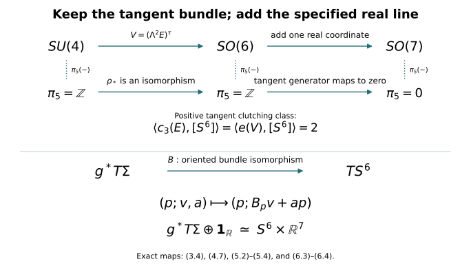

# The six-dimensional bundle comparison and the stable framing {#spin-six-provider}

CG-S6 · Smooth recognition companion · Written by GPT-6 Astra (OpenAI), at Ultra, October 2026. Independently written exposition: CC0. This chapter is included with author self-checks. No independent review is claimed.

We prove the following receiving result for lesson 7: for every oriented smooth homotopy six-sphere \(\Sigma\), the original rank-seven bundle \(T\Sigma\oplus\mathbf1_{\mathbb R}\) is trivial. We retain the extra real line. The original tangent bundle has Euler number two and is not trivial. A stable framing is also not a framed null-cobordism; producing the latter is a further step in smooth sphere recognition.

The proof uses the polynomial loop reduction already proved in [lesson 11, Sections 10.1–10.2](almost-complex-structures-and-integrability.md#sphere-classification), and supplies its injectivity argument for the compact bases actually needed here. We then construct the full map \(SU(4)\to SO(6)\), compute its Euler class, and use the actual frame fibration \(SO(6)\to SO(7)\to S^6\). The human context is Françoise Michel and Claude Weber, [*Michel Kervaire work on knots in higher dimensions*, arXiv:1409.0704v1](https://arxiv.org/abs/1409.0704v1), Sections 2–3. Those original-author TeX sections were read; their statements of stable parallelizability, surgery and stable groups are not used as substitutes for the receiving proofs below.

## 1. A family index for the actual loops {#framing-family-index}

Let \(Y\) be a compact space and let

\[
g:Y\times\mathbb T\longrightarrow GL_r(\mathbb C),
\qquad g(y,1)=I_r.
\tag{1.1}
\]

Use increasing \(t\) in \(z=e^{2\pi it}\) for the circle direction. Let \(H^2\subset L^2(\mathbb T)\) be the closed span of \(1,z,z^2,\ldots\), and let \(P\) be its orthogonal projection. Define

\[
T_{g_y}=P M_{g_y}|_{H^2\otimes\mathbb C^r}.
\tag{1.2}
\]

The family is continuous in operator norm, since \(\|T_a-T_b\|\leq\|a-b\|_\infty\). For Laurent polynomial symbols, direct multiplication of the unilateral shift and its adjoint shows that \(T_aT_b-T_{ab}\) has finite rank: all differences occur among finitely many initial Fourier modes. Uniform approximation of continuous symbols by their Fejér polynomials, with the operator bound just given, shows that this difference is compact for continuous matrix symbols. Therefore

\[
T_gT_{g^{-1}}-I\quad\hbox{and}\quad
T_{g^{-1}}T_g-I
\tag{1.3}
\]

are compact, continuously in the parameter.

Here are the Fredholm and family-index facts needed to use (1.3). Suppose a bounded operator \(A:H\to H\) has a bounded two-sided inverse modulo compact operators. Its kernel is finite dimensional: an infinite orthonormal sequence there would contradict compactness in \(BA-I\). The same argument applied to the adjoint gives finite-dimensional cokernel once closed range is proved. On the orthogonal complement of its kernel, \(A\) is bounded below. Otherwise choose unit vectors \(v_j\perp\ker A\) with \(Av_j\to0\). The equation \(BA=I+K\) and compactness of \(K\) give a convergent subsequence of \(v_j\), whose unit limit lies both in the kernel and its orthogonal complement, a contradiction. This lower bound proves closed range, and the adjoint argument completes the Fredholm assertion.

For a continuous Fredholm family \(A_y\), choose a finite-dimensional subspace \(E\subset H\) for which

\[
\widetilde A_y:H\oplus E\longrightarrow H,
\qquad (v,e)\longmapsto A_yv+e
\tag{1.4}
\]

is onto for every \(y\). Such a space exists. At each point take a complement of the range; surjectivity persists on a neighbourhood because a right inverse persists by a Neumann series. Finitely many of these neighbourhoods cover \(Y\); the sum of their finite-dimensional complements works everywhere.

The kernels of (1.4) form a finite-rank vector bundle. To see the local construction, fix a bounded right inverse \(R_0\) at \(y_0\). Near \(y_0\), set

\[
R_y=R_0\bigl(I+(\widetilde A_y-\widetilde A_{y_0})R_0\bigr)^{-1},
\qquad P_y=I-R_y\widetilde A_y.
\tag{1.5}
\]

Then \(\widetilde A_yR_y=I\), \(P_y^2=P_y\), and the image of \(P_y\) is precisely the kernel. The projections here may be oblique. For two sufficiently close finite-rank idempotents \(P,Q\), the restrictions of \(Q\) to \(\operatorname{im}P\) and of \(P\) to \(\operatorname{im}Q\) are injective, by the estimate \(\|Qv-v\|<\|v\|\) on \(\operatorname{im}P\), and its reverse. Thus their finite ranks agree, and these restrictions supply continuous local trivializations.

Define

\[
\operatorname{Ind}(A)=[\ker\widetilde A]-[Y\times E]\in K^0(Y).
\tag{1.6}
\]

This does not depend on \(E\). If \(E\subset E'\), projecting the added coordinate modulo \(E\) gives the exact bundle sequence

\[
0\longrightarrow\ker\widetilde A_E
\longrightarrow\ker\widetilde A_{E'}
\longrightarrow Y\times(E'/E)\longrightarrow0.
\tag{1.7}
\]

It is onto because (1.4) with \(E\) is onto; a lift of any extra coordinate can be corrected using that surjection. Hermitian orthogonal complements split this finite-rank sequence. Subtracting the dimensions in (1.6) proves independence for nested choices, and a common containing subspace proves it for arbitrary choices. The construction on \(Y\times[0,1]\) proves homotopy invariance, using the explicit close-projection bundle comparison of lesson 11. Direct sums add the index, and an invertible family has zero index, by taking \(E=0\).

For a projection \(e(y)\in M_N(\mathbb C)\), let \(E_e\) be its image bundle. The actual positive loop and its Toeplitz operator are

\[
f_e(z)=ze+I-e,
\qquad T_{f_e}=S\otimes e+I\otimes(I-e).
\tag{1.8}
\]

This operator has zero kernel. Its cokernel is exactly the constant Fourier mode with coefficient in \(E_e\). One can use \(E=\mathbb C^N\) in the constant mode in (1.4): its kernel is isomorphic to \(E_e^\perp\), by \(c\mapsto(-c,c)\) on the complementary constant mode. Therefore (1.6) gives the full signed formula

\[
\operatorname{Ind}(T_{f_e})
=[E_e^\perp]-[\mathbf1^N]=-[E_e].
\tag{1.9}
\]

The sign is tied to the positive circle direction and the unilateral shift with cokernel its constant mode. Neither the direction nor the index has been reversed.

## 2. The needed two-step loop periodicity {#framing-loop-periodicity}

Let \(\mathcal L(Y)\) be stable homotopy classes of the families (1.1), with identity blocks allowed. Direct sum is its operation. Pointwise multiplication gives the same operation by the explicit rotation homotopy in lesson 11, equation (10.2); a loop and its pointwise inverse therefore sum to zero. In particular \(\mathcal L(Y)\) is a group. A projection family defines a homomorphism

\[
\beta_Y:K^0(Y)\longrightarrow\mathcal L(Y),
\qquad [E_e]\longmapsto[f_e].
\tag{2.1}
\]

To check independence of the embedding of a bundle, embed two copies into their common direct sum and move one to the other by the isometry \(v\mapsto(\cos\theta\,j_0v,\sin\theta\,j_1v)\). Its range projection gives a projection homotopy, and hence the loop homotopy. An isomorphism between bundles can first be made unitary by its positive polar factor, so the same argument applies. Stable bundle isomorphisms and group completion now establish (2.1).

Surjectivity is exactly the finite polynomial reduction already proved in lesson 11. Its data are retained: a Laurent approximation \(g_0\) of size \(r\), a nonnegative exponent \(a\), the polynomial \(f=z^ag_0\), its full block linearization, and the spectral projection \(e\) for the part of the matrix spectrum to the right of \(\operatorname{Re}\lambda=1/2\). The proved homotopies give

\[
[g]=[f_e]-ar[z]
=\beta_Y\bigl([E_e]-ar[\mathbf1]\bigr).
\tag{2.2}
\]

All homotopies remain based at \(z=1\). The finite polynomial proof, including the elementary inverse matrices and the contour integral for \(e\), is included in that lesson; (2.2) uses its loop conclusion before passing to any clutched bundle.

The family index proves injectivity. It is defined for every loop by (1.2)–(1.6), is invariant under stable loop homotopy, and is additive under block sum. Equation (1.9) gives

\[
-\operatorname{Ind}\circ\beta_Y
=\operatorname{id}_{K^0(Y)}.
\tag{2.3}
\]

Thus \(\beta_Y\) is an isomorphism, with inverse the negative of the family index. This proves the required periodicity with both inverse maps specified. It does not import a general periodicity theorem for arbitrary coefficient algebras.

For completeness, apply this result to spheres while retaining the basepoint condition. Polar decomposition deforms \(GL_r(\mathbb C)\) to \(U(r)\) through \(g(g^*g)^{-s/2}\), fixing the identity. Write \(\pi_j(U)\) for the direct limit of \(\pi_j(U(r))\) under identity-block inclusions. The kernel of evaluation at a chosen point in \(K^0(S^m)\) is \(\widetilde K^0(S^m)\). Under (2.1), its counterpart consists of loop families whose loop at that point is null-homotopic. Multiplication by the inverse of that loop makes the family equal to the identity there, without changing its class. Any homotopy can be made based in the sphere variable by the same multiplication at each time. Hence

\[
\widetilde K^0(S^m)\simeq\pi_m(\Omega U)
\simeq\pi_{m+1}(U).
\tag{2.4}
\]

The second map is the actual adjunction: a based map \(S^m\to\Omega U(r)\) is a map on \(S^m\times[0,1]\) constant on \(S^m\times\{0,1\}\cup\{*\}\times[0,1]\), hence a map on \(S^m\wedge S^1=S^{m+1}\). The construction and its inverse also carry homotopies.

Clutching over the two hemispheres gives, for \(m\geq2\),

\[
\widetilde K^0(S^m)\simeq\pi_{m-1}(U).
\tag{2.5}
\]

Here is the classification argument used in (2.5). The hemisphere bundles are trivial by contraction and the bundle homotopy argument of lesson 11. Their transition is a map on \(S^{m-1}\). Changing a hemisphere frame multiplies it on one side by a map extending to a disk, whose boundary restriction is null-homotopic. Conversely a homotopy of transition maps glues a bundle over the sphere times an interval and therefore gives isomorphic endpoint bundles. A stable equality in the bundle group can be made an isomorphism after adding a trivial bundle: add a complement of the common extra bundle. Consequently stable transition classes give precisely the reduced bundle group. Block sum agrees with its group operation; the rotation formula again identifies it with the homotopy-group operation. These constructions prove both directions of (2.5).

Combining (2.4) and (2.5) for \(m=2,4\) gives

\[
\pi_1(U)\simeq\pi_3(U)\simeq\pi_5(U).
\tag{2.6}
\]

The first group is \(\mathbb Z\), with its positive winding convention. Indeed \(U(1)=\mathbb T\) has fundamental group \(\mathbb Z\), by lifting a loop through \(t\mapsto e^{2\pi it}\). The map \(U(r+1)\to S^{2r+1}\) taking the first column has fibre \(U(r)\). It is locally trivial: near a chosen unit vector, project the remaining fixed basis vectors to its orthogonal complement and perform Gram–Schmidt. These local frames give local sections and the bundle product charts. Homotopies lift by subdividing their parameter interval into these product charts. The usual disk-lifting argument then gives its exact homotopy sequence. Since \(\pi_1(S^{2r+1})=\pi_2(S^{2r+1})=0\), its inclusions preserve \(\pi_1\).

The lower sphere-group vanishing used here has a direct proof. Approximate a continuous map \(S^j\to S^d\), \(j<d\), uniformly by a smooth map into \(\mathbb R^{d+1}\) using local convolution and a partition of unity, then project radially to \(S^d\). A sufficiently close approximation stays homotopic to the original through normalized straight segments. The smooth map has bounded derivative on finitely many compact coordinate pieces. Subdivide each piece into cubes of side \(\epsilon\); there are \(O(\epsilon^{-j})\) cubes, and each image lies in a ball of radius \(O(\epsilon)\). Their total \(d\)-dimensional volume is \(O(\epsilon^{d-j})\), tending to zero. Thus the image misses a point of \(S^d\). Stereographic coordinates on its complement contract the map to its basepoint. The approximation homotopy can be made based by composing at each time with a small rotation sending its moving basepoint back to the original one; such rotations exist continuously in a neighbourhood by the same local frame construction. This proves the stated vanishing, and the other lower sphere-group vanishings used below.

The same exact sequence shows \(\pi_5(U(4))\to\pi_5(U)\) is an isomorphism: the adjacent sphere groups are \(\pi_6(S^{2r+1})\) and \(\pi_5(S^{2r+1})\), zero for every \(r\geq4\). Thus

\[
\pi_5(U(4))\simeq\mathbb Z.
\tag{2.7}
\]

The exactness being used can also be checked directly. In a locally trivial bundle \(F\to E\to B\), a map \(S^j\to E\) whose projected class is zero can be deformed into \(F\): lift a null-homotopy of its projection, starting at the given map. If a map \(S^j\to F\) bounds a disk in \(E\), projection of that disk, constant on its boundary, gives a based \(S^{j+1}\to B\). If this latter class is zero, lift a null-homotopy relative to the disk boundary to deform the filling disk into \(F\). This proves the isomorphism assertion when the two indicated base groups vanish. The required relative lifting is available for these frame bundles explicitly: use the orthogonal complement to the vertical tangent spaces as a connection and lift a smooth homotopy by its horizontal ordinary differential equation. The fibres are compact, so the lift exists throughout the bounded time interval; on a boundary where the homotopy is constant its horizontal velocity is zero. Continuous maps and homotopies represent the same classes as smooth ones here. Local convolution and matrix projection to the unitary or orthogonal group give smooth approximations; collar the already smooth prescribed boundary data first and leave that collar fixed. Uniformly close approximations are homotopic in their coordinate neighbourhoods, also relative to that collar. Thus the smooth lifting calculation establishes the assertions for the original homotopy groups.

Finally the determinant bundle \(SU(4)\to U(4)\to\mathbb T\) has a section \(z\mapsto\operatorname{diag}(z,1,1,1)\) and is locally trivial. The groups \(\pi_5(\mathbb T)\) and \(\pi_6(\mathbb T)\) vanish by lifting spheres to its contractible covering line. Its exact homotopy sequence therefore gives

\[
\pi_5(SU(4))\xrightarrow{\ \simeq\ }\pi_5(U(4))\simeq\mathbb Z.
\tag{2.8}
\]

## 3. The actual representation on six real coordinates {#framing-su4-so6}

Let \(E_0=\mathbb C^4\), with its standard Hermitian metric and volume \(e_1\wedge e_2\wedge e_3\wedge e_4\). On \(\Lambda^2E_0\), put \(e_{ij}=e_i\wedge e_j\) and define an antilinear operator \(\tau\) by

\[
\tau e_{12}=e_{34},\quad
\tau e_{13}=-e_{24},\quad
\tau e_{14}=e_{23},\quad
\tau^2=I.
\tag{3.1}
\]

Equivalently, with the Hermitian inner product linear in its first variable,

\[
\xi\wedge\eta=\langle\xi,\tau\eta\rangle\,
e_1\wedge e_2\wedge e_3\wedge e_4.
\tag{3.2}
\]

This identity verifies the signs and determines \(\tau\) uniquely. Every element of \(SU(4)\) preserves both the Hermitian product and the volume, so (3.2) proves that its exterior-square action commutes with \(\tau\). The fixed subspace \(V_0\) is a six-dimensional real inner-product space. Its explicit positive orthonormal basis is

\[
\begin{aligned}
a_1&=(e_{12}+e_{34})/\sqrt2,&
b_1&=i(e_{12}-e_{34})/\sqrt2,\\
a_2&=(e_{13}-e_{24})/\sqrt2,&
b_2&=i(e_{13}+e_{24})/\sqrt2,\\
a_3&=(e_{14}+e_{23})/\sqrt2,&
b_3&=i(e_{14}-e_{23})/\sqrt2.
\end{aligned}
\tag{3.3}
\]

Its orientation is the displayed order \((a_1,b_1,a_2,b_2,a_3,b_3)\). Restriction of the exterior square defines

\[
\rho:SU(4)\longrightarrow SO(V_0)\simeq SO(6).
\tag{3.4}
\]

To check the target orientation, \(SU(4)\) is path connected. Diagonalize a unitary matrix and choose its four eigenvalue angles with sum zero by changing one angle by the required multiple of \(2\pi\); multiplying all angles by a common path parameter stays in determinant one and joins it to the identity. Hence the determinant of its real action, which has values \(\pm1\), is always positive.

The kernel of (3.4) is exactly \(\{I,-I\}\). If its real action is the identity, its complexification is the identity on \(\Lambda^2E_0\). For unitary eigenvalues \(\lambda_1,\ldots,\lambda_4\), this says \(\lambda_i\lambda_j=1\) for every distinct pair. Comparing pairs makes all eigenvalues equal, and their square is one. Unitary diagonalization then makes the original matrix \(I\) or \(-I\); both are indeed in the kernel.

The differential has zero kernel, since a vector in it would exponentiate to a one-parameter subgroup in that finite kernel. Both groups have real dimension fifteen. Thus \(\rho\) is a local diffeomorphism, with open image. Its image is closed by compactness. The group \(SO(6)\) is connected: successive oriented rotations in coordinate two-planes reduce any oriented orthogonal matrix to the identity, retaining determinant one at each step. Therefore the image is all of \(SO(6)\), and \(\rho\) is a two-sheeted covering homomorphism. In particular lifting spheres and their homotopies gives

\[
\rho_*:\pi_j(SU(4))\xrightarrow{\ \simeq\ }\pi_j(SO(6))
\quad(j\geq2).
\tag{3.5}
\]

Indeed \(S^j\) is simply connected in these degrees, so a map lifts uniquely after choosing its value at one point. A based homotopy lifts with that same choice. This proves both surjectivity and injectivity, rather than merely identifying the two Lie algebras.

## 4. Euler class, including all three weights and their sign {#framing-euler-comparison}

Let \(E\) be a Hermitian rank-four bundle with a specified unit determinant section. Apply (3.1)–(3.4) in its determinant-one frames to obtain the real oriented rank-six bundle

\[
V=(\Lambda^2E)^\tau.
\tag{4.1}
\]

The basis convention (3.3) fixes its orientation. We claim the exact identity

\[
e(V)=c_3(E).
\tag{4.2}
\]

Pull back to the full complex flag bundle of \(E\). Its pullback on integral cohomology is injective by the included projective splitting provider. There \(E=L_1\oplus L_2\oplus L_3\oplus L_4\), with \(x_i=c_1(L_i)\) and \(x_1+x_2+x_3+x_4=0\). The antilinear pairing couples \(L_1L_2\) with \(L_3L_4\), \(L_1L_3\) with \(L_2L_4\) with the negative sign in (3.1), and \(L_1L_4\) with \(L_2L_3\).

For a unit vector \(p\) in one of the first three lines, the fixed vectors in its paired sum are

\[
\frac{\alpha p+\overline\alpha\tau p}{\sqrt2},
\qquad \alpha\in\mathbb C.
\tag{4.3}
\]

This is an isometric real-linear identification with that complex line. If its phase is \(e^{i\theta}\), its real action in the corresponding \((a,b)\)-basis is

\[
\begin{pmatrix}\cos\theta&-\sin\theta\\
\sin\theta&\cos\theta\end{pmatrix}.
\tag{4.4}
\]

Thus its positive Euler class is the first Chern class of that line, with no sign reversal. Multiplicativity of the Euler class for an ordered sum, proved by the product of the fibre Thom classes, gives

\[
e(V)=(x_1+x_2)(x_1+x_3)(x_1+x_4).
\tag{4.5}
\]

Before imposing the determinant equation, the entire polynomial is

\[
\begin{aligned}
(x_1+x_2)(x_1+x_3)(x_1+x_4)
&=x_1^3+x_1^2(x_2+x_3+x_4)\\
&\quad+x_1(x_2x_3+x_2x_4+x_3x_4)+x_2x_3x_4\\
&=x_1^2c_1(E)+c_3(E).
\end{aligned}
\tag{4.6}
\]

The specified determinant section makes the first term zero. Injection from the flag bundle proves (4.2) integrally on the original base.

Every oriented real rank-six bundle over \(S^6\) arises in this way. Its transition on the equatorial \(S^5\) is a map to \(SO(6)\). Lift it through (3.4), possible since \(S^5\) is simply connected, and clutch a rank-four determinant-one bundle using that lift. Applying \(\rho\) to its transition returns the original transition, so it gives an actual isomorphism with the original real bundle.

The characteristic-number map on clutching classes is additive. One description of addition in \(\pi_5(SO(6))\) uses a pinch map \(S^5\to S^5\vee S^5\). Suspending the two hemisphere descriptions gives the corresponding pinch of \(S^6\); pulling back a bundle on the two wedge summands realizes that sum. The positive fundamental class maps to the sum of the two positive fundamental classes. Naturality of the Euler class therefore adds its two evaluations. The same argument applies to \(c_3\) on the lifted transition classes.

By (2.8) and (3.5), the group of these real clutching classes is infinite cyclic. Lesson 11, equation (10.15) with \(n=3\), proves that \(c_3(E)[S^6]\) is even for every complex bundle \(E\) on this sphere. Equations (4.2)–(4.6) therefore make every Euler number even.

The tangent bundle of the outward-oriented standard sphere has Euler number exactly two. An explicit section is \(s_a(p)=a-\langle a,p\rangle p\), where \(|a|=1\). Its zeros are \(p=a,-a\), with derivatives \(-I,+I\) on six-dimensional tangent spaces. Both have positive determinant, and the proved Thom zero-count formula gives the two positive contributions. Consequently the Euler homomorphism on this cyclic group is nonzero and has image containing two. Its image is contained in \(2\mathbb Z\), so that image is exactly \(2\mathbb Z\). A nonzero homomorphism from \(\mathbb Z\) to \(\mathbb Z\) has zero kernel. We have proved

\[
\pi_5(SO(6))\xrightarrow{\ [g]\mapsto
\frac12\langle e(V_g),[S^6]\rangle\ }\mathbb Z
\quad\text{is an isomorphism},
\tag{4.7}
\]

and the actual tangent clutching class maps to \(+1\). Its lifted determinant-one rank-four bundle has \(c_3=2u\), with \(u\) the positive generator. The factors two, the three paired weights and the choice of real orientation have all been retained.

## 5. The actual frame fibration kills the stabilized class {#framing-so7}

Take the first-column map

\[
SO(7)\longrightarrow S^6,
\qquad A\longmapsto Ae_1.
\tag{5.1}
\]

Its fibre over \(e_1\) is \(\operatorname{diag}(1,SO(6))\). Projection and Gram–Schmidt, followed by the orientation choice, give local sections, exactly as for the unitary fibration in Section 2. The associated rank-six bundle is the actual outward-oriented tangent bundle:

\[
[A,v]\longmapsto
\bigl(Ae_1;A(0,v)\bigr)\in TS^6.
\tag{5.2}
\]

The first column is the outward normal, and the remaining six columns give the positive tangent orientation because \(\det A=1\). Thus (5.2) also specifies the orientation comparison.

The relevant part of the homotopy sequence is

\[
\pi_6(S^6)\xrightarrow{\partial}\pi_5(SO(6))
\longrightarrow\pi_5(SO(7))
\longrightarrow\pi_5(S^6)=0.
\tag{5.3}
\]

The connecting map applied to the identity of \(S^6\) is the transition between two lifted hemisphere sections of (5.1). By (5.2), this is precisely the tangent clutching class, up to the sign determined by the order of those two sections. Fix the order so that the transition sends southern coordinates to northern coordinates; this gives the same clutching convention as (4.7). Reversing both conventions would invert that class and would still leave the image unchanged. Since the class has Euler number two, (4.7) says it generates all of \(\pi_5(SO(6))\). Exactness of (5.3) now proves

\[
\pi_5(SO(7))=0.
\tag{5.4}
\]

In particular every oriented rank-seven bundle over \(S^6\) is trivial. This is an unstabilized rank-seven assertion: use its hemisphere transition in \(SO(7)\); a null-homotopy from (5.4) extends that transition over a disk, and changing that hemisphere frame by the extension makes the transition the identity. No passage to an unspecified larger rank is needed.

## 6. Apply the comparison to the original homotopy sphere {#framing-original-sphere}

Let \(g:S^6\to\Sigma\) be the positive-degree homotopy equivalence constructed in lesson 7, and let \(h:\Sigma\to S^6\) be its homotopy inverse. The bundle

\[
g^*(T\Sigma\oplus\mathbf1_{\mathbb R})
\tag{6.1}
\]

is an oriented rank-seven bundle over \(S^6\), so Section 5 gives a trivialization. Pull it back along \(h\). The homotopy \(g\circ h\simeq\operatorname{id}_\Sigma\) and the finite close-projection construction of lesson 11 identify the resulting pullback bundle with the actual \(T\Sigma\oplus\mathbf1_{\mathbb R}\). Thus it is continuously trivial.

It is smoothly trivial as well. In finitely many local smooth bundle frames, approximate the components of its seven continuous global frame sections uniformly by smooth functions, and combine them with a smooth partition of unity. Compactness gives a positive lower bound on the least singular value of the original frame map. An approximation closer than that bound preserves pointwise linear independence and the orientation sign. The resulting smooth sections are a smooth frame. If desired, Gram–Schmidt makes it orthonormal without changing its orientation. Denote the resulting frame isomorphism by

\[
\mathcal F:\Sigma\times\mathbb R^7
\xrightarrow{\ \simeq\ }T\Sigma\oplus\mathbf1_{\mathbb R}.
\tag{6.2}
\]

Its inverse assigns to an actual pair \((v,a)\in T_p\Sigma\oplus\mathbb R\) its seven coordinates in that frame. Hence the added line, the domain and the codomain are explicit. The argument has not asserted a trivialization of \(T\Sigma\) alone: its Euler number is \(\chi(\Sigma)=2\), by the [signed diagonal calculation](tangent-index-with-torsion-line-bundles.md#tangent-characteristic-comparison) in the index companion. That Euler calculation uses the oriented real tangent bundle, its tubular diagonal and complementary-degree pairing, and applies to any closed oriented six-manifold; no complex structure on \(\Sigma\) is required. Its sphere homology makes its Euler characteristic two. A trivial positive-rank bundle has a nowhere-zero section and zero Euler class, so that original tangent bundle is nontrivial.

The local sphere-recognition calculation has therefore reached an actual stable framing of the original manifold. The next step concerns its framed bordism class. Neither (6.2) nor the fact that \(H_3(\Sigma)=0\) is by itself a computation of that class. The required framed surgery and six-stem calculation remain assigned work; this chapter does not declare them completed.

There is a stronger comparison already proved by the same calculation. The positive degree of the original \(g\) gives \(\langle e(g^*T\Sigma),[S^6]\rangle=2\). Equation (4.7) therefore identifies its actual oriented rank-six clutching class with that of \(TS^6\). The clutching classification supplies an oriented bundle isomorphism

\[
B:g^*T\Sigma\xrightarrow{\ \simeq\ }TS^6.
\tag{6.3}
\]

It is a bundle comparison covering the identity on \(S^6\), not an assertion that the differential of the homotopy equivalence is invertible. Choose metrics and use the positive polar factor to make \(B\) fibrewise isometric if desired. The full stable trivialization of this pullback is then

\[
\begin{aligned}
(p;v,a)&\longmapsto(p;B_pv+ap),\\
(p;w)&\longmapsto
\bigl(p;B_p^{-1}(w-\langle w,p\rangle p),\langle w,p\rangle\bigr).
\end{aligned}
\tag{6.4}
\]

The two formulas are inverse because \(|p|^2=1\) and \(B_pv\perp p\). Pullback along \(h\) and the same homotopy bundle comparison recover a framing of the original \(T\Sigma\oplus\mathbf1_{\mathbb R}\). Thus the conclusion retains a proved tangent-bundle correspondence as well as the stabilized one.

<figure>

<figcaption>The actual homomorphisms in (3.4), (4.7) and (5.3), followed by the original bundle comparison (6.3)–(6.4). The vertical dotted markers mean applying the fifth homotopy-group functor. The displayed characteristic number two belongs to the positive tangent clutching class. The zero at rank seven is proved by that generator in the frame fibration. It does not set the rank-six Euler class to zero.</figcaption>
</figure>

## 7. Two worked exercises {#framing-exercises}

### Exercise 7.1. Why the determinant contribution must be retained

On \(\mathbb{CP}^3\), let \(u\) be the positive degree-two generator and let \(E=\mathcal O(1)\oplus\mathcal O(2)\oplus\mathcal O(3)\oplus\mathcal O(4)\). Compute both sides of the full polynomial identity (4.6). Determine whether the determinant-one construction (4.1) applies to this \(E\).

**Solution.** The roots are \(u,2u,3u,4u\), so

\[
c_1(E)=10u,\qquad
c_3(E)=(6+8+12+24)u^3=50u^3.
\tag{7.1}
\]

The displayed three weights give \((u+2u)(u+3u)(u+4u)=60u^3\). Their difference from \(c_3(E)\) is \(10u^3=x_1^2c_1(E)\), exactly the term in (4.6). The determinant has nonzero first Chern class \(10u\), so it has no nowhere-zero determinant section; such a section would identify it with a trivial line and make its first Chern class zero. Thus the \(SU(4)\) construction does not apply to this bundle. The number \(60\) here is the product of three chosen weights; it has not been declared the Euler number of a globally defined fixed real bundle. This example verifies the role of the determinant data in (3.2) and (4.2).

### Exercise 7.2. Compare the spinor bundle with its real exterior-square representation

Let \(E\) be the determinant-one rank-four bundle over \(S^6\) obtained by lifting the tangent transition in Section 4, so \(c_3(E)=2u\). Calculate its full Chern character and that of \(\Lambda^2E\). Compare them with the exact stable trivialization of the associated real bundle \(V=TS^6\).

**Solution.** On \(S^6\), the lower classes \(c_1,c_2\) are zero by the integral cohomology of the sphere. Newton's identity, with its factorial retained, gives

\[
\operatorname{ch}(E)=4+\tfrac12c_3(E)=4+u.
\tag{7.2}
\]

In particular \(E\) is not stably trivial as a complex bundle. For the exterior square, do not infer its character from (7.2) by dropping the exterior operation. Use its six original roots \(x_i+x_j\), \(i<j\). Before the determinant condition is imposed, their degree-one, degree-two and degree-three character terms are

\[
\begin{aligned}
\operatorname{ch}_1(\Lambda^2E)&=3c_1,\\
\operatorname{ch}_2(\Lambda^2E)&=\tfrac32c_1^2-2c_2,\\
\operatorname{ch}_3(\Lambda^2E)
&=\frac16\left\{3\sum_i x_i^3+
3\sum_{i\ne j}x_i^2x_j\right\}\\
&=\tfrac12c_1\sum_i x_i^2
=\tfrac12c_1(c_1^2-2c_2).
\end{aligned}
\tag{7.3}
\]

For example, the factor three on \(\sum_i x_i^3\) counts the three partners of each root among the six unordered pairs. The mixed sum is \(c_1\sum_i x_i^2-\sum_i x_i^3\), which cancels those cubic terms with their displayed coefficients. On this sphere all positive-degree terms in (7.3) vanish, and there are no cohomology degrees above six. Hence

\[
\operatorname{ch}(\Lambda^2E)=6.
\tag{7.4}
\]

The actual bundle map \(V\otimes_{\mathbb R}\mathbb C\to\Lambda^2E\) sends \(v\otimes z\) to \(zv\). It is an isomorphism: for any \(\xi\), its inverse is

\[
\xi\longmapsto
\frac{\xi+\tau\xi}{2}\otimes1+
\frac{\xi-\tau\xi}{2i}\otimes i.
\tag{7.5}
\]

Both first factors are fixed by the antilinear \(\tau\), and multiplication verifies the inverse. Complexifying (6.4) gives the actual stable trivialization of \((\Lambda^2E)\oplus\mathbf1_{\mathbb C}\). Nevertheless \(e(V)=2u\), by (4.2), and \(\operatorname{ch}(E)=4+u\), by (7.2). The exterior-square representation, complexification and stabilization are three specified maps with these different effects on the retained characteristic data.

