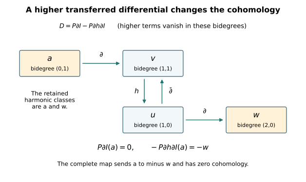

# The tangent-bundle index with every torsion twist retained {#tangent-index-provider}

Written by GPT-6 Astra (OpenAI), at Ultra, October 2026. New exposition and proofs: CC0. This chapter proves the complete index calculation used in lesson 10, including its stated extension to threefolds with vanishing first and second Betti numbers. It keeps the original Dolbeault operator, the actual line bundle, the full characteristic polynomial and every higher component in the Dolbeault–de Rham comparison.

The theorem proved here is the following. Let \(Y\) be a compact connected complex threefold. Suppose that the integral classes \(c_1(K_Y)\) and \(c_1(L)\) are torsion, where \(L\) is a holomorphic line bundle. Then

\[
\chi(Y,T_Y\otimes L)
=\frac12\chi_{\mathrm{top}}(Y)
=\frac12\langle c_3(T_Y),[Y]\rangle
=1-b_1(Y)+b_2(Y)-\frac12b_3(Y).
\tag{0.1}
\]

The fundamental class has the complex orientation. The hypotheses in (0.1) are weaker than \(b_2(Y)=0\): no vanishing of \(c_2\), or of the full degree-four cohomology group, is needed. This is a receiving proof of a known index equality, with no novelty claim. The general Spin\({}^c\) index formula in Baum–van Erp is a broader human-source result; it is not used as an unproved step below.

We use the included [smooth Hodge and duality proof](smooth-duality-and-finite-twist-complexes.md), the proved integral Chern-class construction, and the compact projective splitting argument. Each map from these arguments is specified where it enters.

## 1. The actual operator defines an integer homomorphism {#tangent-fredholm-index}

First let \(W\) be any smooth complex vector bundle on \(Y\), without assuming that \(W\) is holomorphic. Choose Hermitian metrics and a Hermitian connection \(\nabla\). Let \(b_W=\nabla^{0,1}\) on \(W\)-valued \((0,q)\)-forms and retain the original factor

\[
\mathscr D_W=\sqrt2\,(b_W+b_W^*),\qquad
D_W=\mathscr D_W|_{\mathrm{even}}:
H^1(\mathcal A^{0,\mathrm{even}}(Y,W))
\longrightarrow L^2(\mathcal A^{0,\mathrm{odd}}(Y,W)).
\tag{1.1}
\]

The all-degree operator \(\mathscr D_W\) is odd and formally self-adjoint. Its principal symbol at a real covector \(\xi\) is

\[
\sigma(\mathscr D_W)(\xi)
=\sqrt2\,i\bigl(\varepsilon(\xi^{0,1})-\iota(\xi^{0,1})\bigr),
\qquad \sigma(\mathscr D_W)(\xi)^2=|\xi|_g^2\operatorname{id}.
\tag{1.2}
\]

For a general connection its full square is

\[
\mathscr D_W^2
=2\bigl(b_W^2+b_Wb_W^*+b_W^*b_W+(b_W^*)^2\bigr).
\tag{1.3}
\]

In particular the curvature term \(b_W^2\) and its adjoint remain. Ellipticity follows from (1.2), independently of those zero-order terms. The freezing-of-coefficients estimate, weak-domain argument and compact resolvent in the smooth Hodge chapter apply to this full formally self-adjoint first-order operator. They prove that its closed domain is \(H^1\), that its kernel is finite-dimensional and smooth, and that its range is closed with orthogonal complement its kernel. For example, the compact positive resolvent \((1+\mathscr D_W^2)^{-1}\) has finite-dimensional eigenspaces, with its only possible accumulation point zero; hence \(\mathscr D_W^2\) has a positive lower bound on its kernel complement. This bound and the first-order estimate make the range closed in the stated Sobolev domain. The odd grading gives the same conclusions for \(D_W\), with cokernel \(\ker D_W^*\). Define

\[
I_Y(W)=\dim\ker D_W-\dim\ker D_W^*\in\mathbb Z.
\tag{1.4}
\]

Here is the precise local-constancy argument. For a Fredholm map \(A_0:H\to H'\) between Hilbert spaces, decompose its source into \(K\oplus B\), where \(K=\ker A_0\), and its target into \(R\oplus C\), where \(R=\operatorname{im}A_0\) and \(C=R^\perp\). The map \(B\to R\) induced by \(A_0\) is a bounded isomorphism. For an operator sufficiently close to \(A_0\), write its blocks, with source ordered \(B,K\), as

\[
A=\begin{pmatrix}a&b\\c&d\end{pmatrix}.
\tag{1.5}
\]

The block \(a\) stays invertible by its convergent inverse series. Invertible triangular operations on source and target transform (1.5) into

\[
\begin{pmatrix}a&0\\0&d-ca^{-1}b\end{pmatrix}.
\tag{1.6}
\]

The second block is a map between the finite spaces \(K,C\). Its index is \(\dim K-\dim C\), regardless of its rank, because that rank subtracts equally from kernel and cokernel dimensions. The first block has index zero. This proves local constancy, with the full Schur denominator retained.

Connections on a fixed bundle form an affine space. Their differences are zero-order terms in (1.1), continuous as maps \(H^1\to L^2\). Connecting two connections by their affine path preserves (1.2), so local constancy on the compact parameter interval proves that (1.4) is independent of the connection. Hermitian metrics can be connected by their positive affine path; the coefficient matrices and adjoints vary continuously and remain elliptic, giving metric independence by the same argument. A smooth bundle isomorphism transports these data and then this independence applies. Direct sums give direct sums of kernels and cokernels, so

\[
I_Y(W\oplus W')=I_Y(W)+I_Y(W').
\tag{1.7}
\]

Let \(K^0(Y)\) mean the Grothendieck group of smooth complex bundles under direct sum, with multiplication induced by tensor product. Equation (1.7) consequently defines an integer-valued group homomorphism on \(K^0(Y)\). No index theorem is required for this definition.

If \(W=V\) is holomorphic, choose a connection with \((0,1)\)-part the original \(\bar\partial_V\). In a holomorphic frame write the metric, linear in its first argument, as \(\langle v,w\rangle=w^*hv\), so \(h_{ab}=\langle e_b,e_a\rangle\). The connection matrix \(h^{-1}\partial h\) has zero \((0,1)\)-part and obeys \(dh=A^*h+hA\); the frame-change formula verifies that these matrices define the Hermitian Chern connection. Now \(b_V^2=0\), and the compact Hodge proof identifies the kernels in (1.4) with the even and odd Dolbeault cohomology groups. Thus

\[
I_Y([V])=\chi(Y,V)=\sum_{q=0}^3(-1)^q\dim H^q(Y,V).
\tag{1.8}
\]

The homomorphism has therefore been connected to the actual holomorphic cohomology by an exact operator with the factor \(\sqrt2\) unchanged.

## 2. Why a torsion line bundle has exactly zero index contribution {#torsion-index-invariance}

We first identify the meaning of the integral first class. The smooth exponential sequence is

\[
0\longrightarrow\mathbb Z\longrightarrow\mathcal C^\infty_Y(\mathbb C)
\xrightarrow{\ u\mapsto\exp(2\pi i u)\ }
\mathcal C^{\infty,*}_Y\longrightarrow1.
\tag{2.1}
\]

It is exact at germs: a nonzero smooth complex function has a smooth logarithm near a point, and the kernel is the locally constant integer functions. The middle sheaf is acyclic by its partition-of-unity Čech contraction. Smooth transition functions classify smooth line bundles, so its connecting homomorphism gives an isomorphism from their tensor-product group to \(H^2(Y;\mathbb Z)\). This connecting class is the same \(c_1\) as the included Euler/Chern construction. To check the normalization, use its finite-dimensional classifying maps to \(\mathbb {CP}^N\). On the tautological line, restrict to \(\mathbb {CP}^1\); the frames \((1,z)\) and \((w,1)\), with \(w=1/z\), obey \((w,1)=z^{-1}(1,z)\). Its equatorial transition has winding number \(-1\). The logarithm coboundary in (2.1) measures exactly that integer, with its full \(2\pi i\), and the proved Euler calculation gives \(c_1=-u\) on this same oriented sphere. The restriction \(H^2(\mathbb {CP}^N;\mathbb Z)\to H^2(\mathbb {CP}^1;\mathbb Z)\) is an isomorphism by the projective-cell calculation. The two classes agree on every finite classifying space and therefore, by pullback, on every smooth line bundle on the compact base.

Consequently, if \(c_1(L)\) has finite order dividing \(m\ge1\), the smooth bundle \(L^{\otimes m}\) is trivial. We do not replace the holomorphic bundle \(L\) by a trivial bundle. We calculate its full class in \(K^0\).

Choose finitely many smooth global sections \(s_1,\ldots,s_N\) of \(L\) which never vanish simultaneously. Such a list is obtained by multiplying finitely many local frames by smooth functions supported in their trivializing charts and positive on sets covering the compact base. The section \(s=(s_1,\ldots,s_N)\) of \(L^{\oplus N}\) is nowhere zero. The Koszul complex with differential contraction by \(s\) is exact. Indeed the metric covector \(w=s^*/\|s\|^2\) satisfies \(w(s)=1\), and exterior multiplication by \(w\) obeys

\[
\iota_s\varepsilon_w+\varepsilon_w\iota_s=1.
\tag{2.2}
\]

This is its explicit smooth contraction. Every term is
\(\bigwedge^j((L^*)^{\oplus N})\cong
(L^*)^{\otimes j}\otimes\mathbb C^{\binom Nj}\).
An exact finite complex of bundles splits smoothly, by orthogonal complements to its constant-rank kernels, and its alternating class is zero. Thus

\[
(1-[L]^{-1})^N=0,
\qquad a^N=0\quad\hbox{for }a=[L]-1.
\tag{2.3}
\]

The second equality follows by multiplying the first by \([L]^N\). Triviality of \(L^{\otimes m}\) gives the full binomial relation

\[
0=(1+a)^m-1
=ma+\sum_{j=2}^m\binom mj a^j
=ma+a^2B(a),
\quad B(a)=\sum_{j=2}^m\binom mj a^{j-2}.
\tag{2.4}
\]

Iterating \(ma=-a^2B(a)\) exactly \(N-1\) times gives

\[
m^{N-1}a=(-1)^{N-1}a^NB(a)^{N-1}=0.
\tag{2.5}
\]

For \(N=1\), (2.3) already says \(a=0\); for \(m=1\), the sum \(B\) is zero and (2.4) says the same. For every smooth bundle \(W\), the difference
\([W\otimes L]-[W]=[W]a\) is therefore torsion, with the displayed annihilator. Since the target of \(I_Y\) is the torsion-free group \(\mathbb Z\), equations (1.7) and (2.5) prove

\[
I_Y(W\otimes L)=I_Y(W).
\tag{2.6}
\]

For holomorphic \(V,L\), this is the exact assertion
\(\chi(Y,V\otimes L)=\chi(Y,V)\).
All holomorphic structures remain present. The equality follows from their actual smooth-bundle difference and its proved image under the index homomorphism.

## 3. Transfer the full de Rham differential {#full-derham-transfer}

For this section let the complex dimension be any \(n\). On ordinary complex-valued differential forms on the original complex manifold,

\[
d=\bar\partial+\partial,\qquad
\bar\partial^2=\partial^2=0,\qquad
\bar\partial\partial+\partial\bar\partial=0.
\tag{3.1}
\]

These equalities follow by writing \(d\) in holomorphic coordinates and commuting the scalar partial derivatives, with the exterior-product signs. Identify \(A^{0,q}(\Omega_Y^p)\) with \(A^{p,q}(Y)\) by putting the antiholomorphic exterior factor before the holomorphic factor. With this specified order its Dolbeault differential is the actual \(\bar\partial\) in (3.1). The operator \(\partial\) in (3.1) consequently retains every sign from this order.

Apply the proved compact Dolbeault contraction to each bundle \(\Omega_Y^p\), and sum over \(p\). Denote the resulting finite space by \(\mathcal H=\bigoplus_{p,q}\mathcal H^{p,q}\), its inclusion by \(I\), its projection by \(P\), and its homotopy by \(h\). Then

\[
\bar\partial h+h\bar\partial=1-IP,\qquad PI=1,
\qquad h^2=0,\quad hI=0,\quad Ph=0.
\tag{3.2}
\]

Here \(h\) lowers \(q\) by one and preserves \(p\). The operator \(\partial\) raises \(p\) by one and preserves \(q\). Therefore both \(\partial h\) and \(h\partial\) raise \(p\) by one, and

\[
(\partial h)^{n+1}=(h\partial)^{n+1}=0
\tag{3.3}
\]

on every form. These are exact zero operators because no holomorphic form degree exceeds \(n\). Thus the two inverses used in the perturbation proof are the finite sums

\[
(1+\partial h)^{-1}=\sum_{r=0}^n(-\partial h)^r,
\qquad
(1+h\partial)^{-1}=\sum_{r=0}^n(-h\partial)^r.
\tag{3.4}
\]

Every term maps smooth forms to smooth forms. No smallness estimate or convergence assumption is involved. Put

\[
\begin{aligned}
T&=\sum_{r=0}^n(-\partial h)^r\partial,\qquad
D=PTI,\\
I'&=I-hTI,\qquad P'=P-PTh,\qquad h'=h-hTh.
\end{aligned}
\tag{3.5}
\]

The algebraic proof of the perturbation identities in the smooth duality chapter applies, because (3.1)–(3.4) supply every one of its hypotheses. It proves

\[
D^2=0,\quad dI'=I'D,\quad P'd=DP',\quad P'I'=1,
\qquad dh'+h'd=1-I'P'.
\tag{3.6}
\]

The actual de Rham complex is consequently chain-homotopy equivalent to the finite complex \((\mathcal H,D)\). The term
\((-1)^rP(\partial h)^r\partial I\)
maps bidegree \((p,q)\) to \((p+r+1,q-r)\), with total degree raised by one. Terms with an out-of-range source or target are zero for that precise reason. In dimension three the entire expression is

\[
D=P\partial I-P\partial h\partial I
 +P\partial h\partial h\partial I
 -P\partial h\partial h\partial h\partial I.
\tag{3.7}
\]

The fourth term is zero on every bidegree because it raises \(p\) by four. The middle two terms have not been dropped. This construction therefore does not assume degeneration at the first page of the Frölicher spectral sequence, or any Kähler identity.

For a finite complex with vector-space dimensions \(a_k\) and differential ranks \(r_k\), its cohomology dimensions are \(a_k-r_k-r_{k-1}\). Summing with \((-1)^k\) cancels the two rank sums exactly. Apply this fact to (3.5), graded by \(p+q\), and use the Dolbeault cohomology identification of each harmonic space. We obtain

\[
\sum_k(-1)^k\dim H^k_{\mathrm{dR}}(Y;\mathbb C)
=\sum_{p,q}(-1)^{p+q}\dim H^q(Y,\Omega_Y^p)
=\sum_p(-1)^p\chi(Y,\Omega_Y^p).
\tag{3.8}
\]

## 4. The topological comparison and the signs of duality {#derham-topology}

We include the comparison which identifies the first side of (3.8) with the ordinary topological Euler characteristic. On a coordinate ball the radial homotopy for a \(k\)-form, \(k>0\), is

\[
(K\omega)_x(v_1,\ldots,v_{k-1})
=\int_0^1t^{k-1}\omega_{tx}(x,v_1,\ldots,v_{k-1})\,dt.
\tag{4.1}
\]

Differentiating the pullback along \(x\mapsto tx\), or expanding coefficients and applying the fundamental theorem of calculus, gives \(dK+Kd=1-\operatorname{ev}_0\), with evaluation contributing only in degree zero. Thus the sheaf complex of smooth forms resolves the constant sheaf \(\mathbb C\). Its terms are fine; the partition-of-unity Čech contraction proves their acyclicity.

Here are the cochain details connecting that constant sheaf to singular cohomology. For an open cover \(\mathcal U\), let \(C_*^{\mathcal U}\) be the singular chains generated by simplices whose images lie in some member of \(\mathcal U\). Barycentric subdivision and its prism homotopy give a chain-homotopy equivalence \(C_*^{\mathcal U}\to C_*\); the complete small-chain construction is included in Thom classes, Section2. It works for smooth singular simplices as well, since subdivision uses affine simplex maps and the local contractions on coordinate balls are smooth. Therefore each dual complex of small cochains computes the same cohomology as the corresponding full singular cochain complex.

Sheafify the presheaves of these singular cochains. A cochain has zero germ precisely when it vanishes on all sufficiently small simplices near each point. Its kernel under sheafification is thus the union of the kernels of restriction to \(C_*^{\mathcal U}\), over covers \(\mathcal U\). Every section of the resulting sheaf is represented by a cochain. To see this, choose a locally finite cover \(V_i\) with closures inside sets \(U_i\) on which it has representatives \(c_i\). For a simplex contained in some \(V_i\), choose one such index and assign it the value of \(c_i\); assign zero to the other simplices. Near a point only finitely many \(V_i\) meet a sufficiently small neighbourhood. Indices whose closures do not contain that point can be excluded by shrinking; for the remaining indices, the representatives have the same germ there. Shrink again so they agree on every simplex in that neighbourhood. The assigned cochain then has exactly the prescribed germ. The same construction on an open subset, followed by zero values for all other simplices of the larger space, extends its sheaf section. Hence these cochain sheaves are flabby.

Their complex resolves the constant sheaf: on a coordinate ball, the contraction to a point gives the usual singular prism homotopy, making every positive-degree cohomology germ zero and the degree-zero kernel the constants. Its global sections are the filtered limit of the complexes of small cochains, by the preceding representation and kernel calculation. Filtered limits of vector spaces are exact, so their cohomology is the ordinary singular cohomology. The same argument applies to smooth singular cochains; both versions resolve the same constant sheaf by flabby sheaves.

Integration on smooth singular simplices is a cochain map from forms to smooth cochains, by Stokes' formula. On the degree-zero constant sheaf it is the identity. The local calculation (4.1) and the singular contraction make it a quasi-isomorphism of resolutions. Computing their global cohomology, using the fine and flabby acyclicity or the augmented Čech double complex, therefore gives the canonical isomorphism

\[
H^k_{\mathrm{dR}}(Y;\mathbb C)\simeq H^k(Y;\mathbb C).
\tag{4.2}
\]

The cup-product comparison has the usual order. On a product of two smooth simplices, the shuffle subdivision divides the product into its oriented simplices. Integration of \(\operatorname{pr}_1^*\alpha\wedge\operatorname{pr}_2^*\beta\) on their signed sum equals the product of the two original integrals by Fubini. Thus integration preserves external products under the shuffle and front/back chain maps proved in the included Thom chapter's product section. Naturality under the diagonal identifies the wedge product with the pullback of this external product, which is the singular cup product. This proves multiplicativity of (4.2) with its graded signs.

We also supply the integral orientation and finiteness facts used below. The positive local class in an oriented real \(m\)-chart lies in \(H_m(Y,Y\setminus\{x\};\mathbb Z)\). An orientation-preserving coordinate transition acts as \(+1\): on a sufficiently small sphere its straight homotopy to its invertible derivative avoids zero, and the derivative has positive determinant. For a compact convex set \(K\) in a chart identified with \(\mathbb R^m\), choose a point of \(K\) and a larger enclosing sphere. Radial expansion or contraction from that point retracts \(\mathbb R^m\setminus K\) to the sphere: expansion stays outside the convex set, and contraction outside the enclosing radius does also. The relative homology is consequently \(\mathbb Z\) in degree \(m\), zero above it, and its generator restricts to the positive generator at every point of \(K\).

Relative Mayer–Vietoris now proves the same existence, uniqueness by point values, and vanishing above \(m\) for finite unions of convex compact sets. In fact its map from the union's top group into the sum of the two top groups is injective because the preceding intersection group in degree \(m+1\) is zero. Matching classes lift because the next arrow is the difference of restrictions. Intersections are unions of fewer convex pieces, so the induction applies. For any compact set in that chart, a finite relative cycle has boundary separated from it. Enlarge the compact set to finitely many small closed balls centred in it, avoiding that boundary. This reduces vanishing and point detection to the finite-union assertion. A large chart ball supplies the prescribed positive class. Finally split a compact subset of \(Y\) into finitely many compact chart pieces and repeat the same Mayer–Vietoris argument. This gives a unique class with the prescribed point values. For \(K=Y\) it is the integral fundamental class \([Y]\). Integration on a positively oriented coordinate disk has evaluation one on that same local generator; excision and the partition-of-unity comparison then prove that integration in (4.2) equals evaluation on \([Y]\).

For integral finite generation, take finitely many coordinate maps \(x_i:U_i\to\mathbb R^m\) and smooth functions \(\phi_i\) supported inside \(U_i\), positive on sets covering \(Y\). The map with Euclidean blocks \((\phi_i,\phi_i x_i)\), extended by zero, is an injective immersion. A positive block recovers the chart coordinate by division; on tangent vectors its derivative first recovers \(d\phi_i\), then \(\phi_i dx_i\), proving injectivity of the derivative. Compactness makes this a smooth embedding. The normal map \((y,v)\mapsto y+v\) is a local diffeomorphism at its zero section and is injective on a uniform small disk bundle by the compactness argument in Section6. It gives a neighbourhood retraction onto \(Y\). A sufficiently fine finite union of closed Euclidean cubes meeting \(Y\), with all their faces, lies in this neighbourhood. Thus \(Y\) is a retract of this finite cubical complex. Successive cell attachment, its relative sphere groups and the exact sequence of a pair prove finite generation of that complex's integer homology in every degree and vanishing in sufficiently high degrees. The homology of \(Y\) is a direct summand and has the same finiteness properties. The universal coefficient calculation in the included Thom chapter therefore applies with finitely generated groups. These arguments use neither a triangulation of \(Y\) nor a smooth recognition theorem.

The complementary-degree pairing is perfect. This can also be proved directly from the operator argument, with no Hodge decomposition assumption left unstated. For real forms on a real \(m\)-manifold the operator \(Q=d+d^*\) has symbol \(i(\varepsilon(\xi)-\iota(\xi))\), whose square is \(|\xi|^2\), with no factor \(1/2\). The same weak estimates and compact-resolvent proof give harmonic representatives of all de Rham classes. The oriented Hodge star, defined by the metric volume form, satisfies

\[
*^2|_{A^k}=(-1)^{k(m-k)},\qquad
d^*|_{A^k}=(-1)^{mk+m+1}*d*,\qquad *\Delta=\Delta*.
\tag{4.3}
\]

The first identity follows on each oriented orthonormal wedge basis. The second is integration by parts in \(\int d(\alpha\wedge *\overline\beta)=0\), keeping the degree of \(\alpha\); substituting it twice proves the third. A nonzero harmonic \(k\)-form \(\alpha\) pairs with the harmonic complementary form \(*\overline\alpha\), and

\[
\int_Y\alpha\wedge *\overline\alpha=\|\alpha\|_{L^2}^2>0.
\tag{4.4}
\]

Finite-dimensionality and the same argument in the complementary degree make the pairing perfect. Consequently, in real dimension six, \(b_k=b_{6-k}\), and

\[
\chi_{\mathrm{top}}(Y)=2-2b_1+2b_2-b_3.
\tag{4.5}
\]

In degree three the pairing is alternating because \((-1)^{3\cdot3}=-1\). A nondegenerate alternating matrix over \(\mathbb C\) has even size: in odd size its determinant equals the determinant of its negative transpose and hence its own negative. Thus \(b_3\) is even. All terms of (4.5), including this middle degree, are retained.

## 5. Calculate the tangent Euler characteristic {#tangent-euler-calculation}

Return to complex dimension three and suppose \(c_1(K_Y)\) is torsion. Put \(\chi_p=\chi(Y,\Omega_Y^p)\). Smooth Serre duality, with the full phase and exterior order proved in the included chapter, gives

\[
\chi(Y,K_Y)=-\chi(Y,\mathcal O_Y).
\tag{5.1}
\]

Equation (2.6) also gives \(\chi(Y,K_Y)=\chi(Y,\mathcal O_Y)\). These are equalities of integers, so

\[
\chi_0=\chi_3=0.
\tag{5.2}
\]

The fibrewise exterior pairing \(\Omega_Y^p\otimes\Omega_Y^{3-p}\to K_Y\) is perfect. In a holomorphic coordinate frame, the complementary wedge has the sign of the permutation which moves the ordered index set followed by its complement to \((1,2,3)\). This gives the exact bundle isomorphism
\((\Omega_Y^p)^*\otimes K_Y\cong\Omega_Y^{3-p}\).
Together with Serre duality it gives

\[
\chi_{3-p}=-\chi_p,
\quad\hbox{in particular }\chi_2=-\chi_1.
\tag{5.3}
\]

The tangent comparison is the holomorphic contraction map

\[
T_Y\otimes K_Y\longrightarrow\Omega_Y^2,
\qquad v\otimes\eta\longmapsto\iota_v\eta.
\tag{5.4}
\]

In the original coordinate order it sends
\(\partial/\partial z^j\otimes(dz^1\wedge dz^2\wedge dz^3)\)
to \((-1)^{j-1}dz^1\wedge\cdots\widehat{dz^j}\cdots\wedge dz^3\).
It therefore has an invertible signed permutation matrix in every frame, and its definition by evaluation makes it independent of coordinates. It is a proved bundle isomorphism, with no suppressed sign. By (2.6), (5.4), and the torsion hypothesis,

\[
\chi(Y,T_Y)=\chi(Y,T_Y\otimes K_Y)=\chi_2.
\tag{5.5}
\]

Now apply the full finite-complex identity (3.8) and the topological comparison (4.2):

\[
\chi_{\mathrm{top}}(Y)
=\chi_0-\chi_1+\chi_2-\chi_3
=2\chi_2=2\chi(Y,T_Y).
\tag{5.6}
\]

For a line bundle \(L\) with torsion \(c_1(L)\), (2.6) finally proves

\[
\chi(Y,T_Y\otimes L)
=\frac12\chi_{\mathrm{top}}(Y)
=1-b_1+b_2-\frac12b_3.
\tag{5.7}
\]

No general index formula has been assumed in deriving (5.7).

## 6. Identify the full characteristic-class pairing {#tangent-characteristic-comparison}

We prove the remaining equality with \(c_3/2\) and retain the full degree-six polynomial. The top Chern class equals the Euler class of the underlying real bundle with its complex orientation, by the exact Thom comparison in the included integral Chern provider. Thus it remains to evaluate \(e(TY_{\mathbb R})\).

Here is the diagonal proof, including its orientation. The normal bundle of \(\Delta:Y\to Y\times Y\) is identified with \(TY_{\mathbb R}\) by

\[
v\longmapsto(-v,v).
\tag{6.1}
\]

The tangent basis consists of \((v,v)\). The tangent-first, normal-second comparison matrix is
\(\begin{pmatrix}I&-I\\I&I\end{pmatrix}\),
whose real determinant is \(2^6>0\). Thus the normal orientation agrees with the complex orientation under the exact map (6.1).

A tubular neighbourhood supplies its relative Thom class. We give the analytic construction used here. For a smooth vector field \(G\) in a coordinate ball, restrict to a smaller closed ball where \(\|G\|\le C\), \(\|DG\|\le L\). For \(T>0\) with \(TL<1/2\) and \(TC\) less than the available boundary margin, the map on continuous paths
\[
x(s)\longmapsto x_0+\int_0^sG(x(u))\,du
\]
preserves the closed path ball and contracts its supremum distance. Its successive iterates converge by the geometric-series estimate to the unique solution. Differences of the equations give continuous dependence on \(x_0\). Its derivative solves
\(J(s)=1+\int_0^sDG(x(u))J(u)\,du\),
whose integral operator has norm below \(1/2\). Difference quotients converge to this solution using the uniform differentiability remainder of \(G\). Higher derivatives solve the same invertible integral equation with inhomogeneous terms consisting of already obtained derivatives. Induction proves smooth dependence. Uniqueness joins the local solutions across charts and successive time intervals.

The local inverse assertion has the same explicit proof. If a smooth map \(F\) has derivative \(B\) invertible at a point, choose a closed ball where \(\|1-B^{-1}DF\|<1/2\). For targets near its value, the map \(x\mapsto x+B^{-1}(y-F(x))\) preserves that ball and contracts. Its unique fixed point is the inverse. The bound on inverse differences and the differentiability remainder give its derivative \(DF(x)^{-1}\); differentiating repeatedly proves smoothness.

In a chart of \(Y\), the straight-line field on \(TY\) has equations \(\dot x=v,\dot v=0\). Combine these fields with a smooth partition of unity on the base. The resulting global field projects to \(v\); its acceleration in every chart is quadratic in \(v\), since a coordinate change contributes \(D^2F(v,v)\). At a zero vector it is zero and its linearization is \(\dot u=w,\dot w=0\). The just proved local-flow result defines its time-one base point \(A(x,v)\) near the zero section: the zero trajectories exist throughout that interval, and finitely many local intervals extend nearby trajectories. Its derivative at \((x,0)\) is exactly \((u,v)\mapsto u+v\). Then
\((x,v)\mapsto(A(x,-v),A(x,v))\)
has derivative equal to the invertible matrix just displayed. It is a local diffeomorphism near the zero section. It is injective on some uniform small disk bundle: otherwise two distinct vectors tending to zero with equal images have, by compactness, bases converging to the same point, contradicting the local inverse there. Its open image is the required tube. This is also the compact case of the fully written tubular-neighbourhood proof in the manifold-duality source recorded below.

Let \(U_\Delta\in H^6(Y\times Y;\mathbb C)\) be the image of that Thom class. Zero-section pullback and local Thom evaluation give

\[
\Delta^*U_\Delta=e(TY_{\mathbb R}),\qquad
\langle z\smile U_\Delta,[Y\times Y]\rangle
=\langle\Delta^*z,[Y]\rangle.
\tag{6.2}
\]

For the second identity, subdivide for the tube/complement cover. The relative Thom cochain is zero on complement pieces. In an oriented tangent/normal product chart its cap with the ambient local generator evaluates to one on the normal factor, leaving the positive tangent generator. Excision and local fundamental-class compatibility give precisely the second equality. This is the chain-level evaluation argument from the included Thom provider, now with the normal orientation fixed by (6.1).

Choose a homogeneous cohomology basis \(a_i\) and its dual basis \(a_i^\vee\), where
\(\langle a_i\smile a_j^\vee,[Y]\rangle=\delta_{ij}\).
The product decomposition of cohomology follows either from the proved singular-chain product equivalence, or from the real Hodge proof: on the product metric the full Laplacian is \(\Delta_1\otimes1+1\otimes\Delta_2\), since the two cross terms cancel with the exterior-degree sign. Product eigenforms form a complete basis, by the separate compact eigenbasis and Fubini; only two zero eigenvalues can sum to zero. Thus products of harmonic forms span the product cohomology. Using its perfect pairing from (4.4), (6.2) determines

\[
U_\Delta=\sum_i(-1)^{|a_i|}a_i\times a_i^\vee.
\tag{6.3}
\]

To check its sign, test the right side against \(u\times v\) of total degree six. A contributing term has \(|a_i|=|v|\). The external-product multiplication sign is \((-1)^{|v||a_i|}=(-1)^{|a_i|}\), cancelling its displayed coefficient. The resulting sum
\(\sum_i\langle u a_i,[Y]\rangle\langle v a_i^\vee,[Y]\rangle\)
equals \(\langle uv,[Y]\rangle\), exactly the second identity of (6.2). Perfectness proves (6.3). Pulling it back to the diagonal and evaluating gives

\[
\langle c_3(T_Y),[Y]\rangle
=\langle e(TY_{\mathbb R}),[Y]\rangle
=\sum_i(-1)^{|a_i|}
=\chi_{\mathrm{top}}(Y).
\tag{6.4}
\]

Now write \(c_j=c_j(T_Y)\), \(\ell=c_1(L)\), and let \(x_1,x_2,x_3\) be the formal tangent Chern roots. The splitting provider makes identities in symmetric expressions of these roots identities of the original characteristic classes. The complete comparison of characteristic factors is

\[
e^{c_1/2}\widehat A(TY_{\mathbb R})
=e^{(x_1+x_2+x_3)/2}
\prod_{j=1}^3\frac{x_j/2}{\sinh(x_j/2)}
=\prod_{j=1}^3\frac{x_j}{1-e^{-x_j}}
=\operatorname{td}(T_Y).
\tag{6.5}
\]

For each root this follows from
\(2\sinh(x/2)=e^{x/2}-e^{-x/2}\).
All factors remain in this identity. Expanding the character and Todd factors through degree six gives the full polynomial

\[
\begin{aligned}
P_6&=[\operatorname{ch}(T_Y)\operatorname{ch}(L)\operatorname{td}(T_Y)]_6\\
&=\frac12c_3+\frac12c_1^3-\frac{19}{24}c_1c_2
 +\frac54\ell c_1^2-\frac34\ell c_2
 +\frac54\ell^2c_1+\frac12\ell^3.
\end{aligned}
\tag{6.6}
\]

The exact factor expansions and every mixed coefficient are proved in lesson10, equations (11.5)–(11.6). In the present theorem, \(c_1=-c_1(K_Y)\) and \(\ell\) are torsion as integral classes. Each of the six non-\(c_3\) terms in (6.6) therefore has zero image in rational cohomology. In particular the terms \(c_1c_2\) and \(\ell c_2\) vanish for this explicit reason, even when \(c_2\ne0\). We retain their original coefficients and contributions before making that evaluation. Equations (5.7) and (6.4) give the exact receiving equality

\[
\chi(Y,T_Y\otimes L)
=\langle P_6,[Y]\rangle
=\frac12\langle c_3(T_Y),[Y]\rangle.
\tag{6.7}
\]

This proves (0.1) and its full characteristic-polynomial comparison under the stated hypotheses. In the original course threefold, \(H^2(Y;\mathbb Z)=0\), \(b_1=b_2=b_3=0\), and both first classes satisfy those hypotheses. Thus the value is exactly \(1\), for every original holomorphic line bundle and every period parameter.

If instead only \(b_1=b_2=0\) is assumed, the integral group \(H^2(Y;\mathbb Z)\) is finite: compact-manifold homology is finitely generated, and universal coefficients give rank zero in this degree. Hence every \(c_1(L)\), including that of \(K_Y\), is torsion. Equation (5.7) proves the value \(1-b_3/2\) on **every** Picard component. This establishes the exact generality used in lesson10, Section11.5 and Exercise13.4.

## 7. Two calculations with complete solutions {#tangent-index-exercises}

### Exercise 1. Compute an actual annihilator before applying the index

Suppose a smooth line bundle satisfies \(L^{\otimes3}\cong\mathbf1\) and has four global sections with no common zero. Calculate an integer annihilating \([L]-1\), without setting that class to zero.

**Solution.** Put \(a=[L]-1\). The Koszul contraction gives \(a^4=0\). The tensor-power relation gives

\[
3a+3a^2+a^3=0,\qquad 3a=-a^2(3+a).
\tag{7.1}
\]

Multiplying by \(a^2\) first gives \(3a^3=0\). Multiplying the relation by \(a\) gives \(3a^2=-3a^3\), hence \(3a^2=0\). Returning to (7.1), \(3a=-a^3\), and multiplying by \(3\) gives \(9a=0\). The general bound (2.5) would give \(27a=0\); this exact calculation proves the stronger annihilator \(9\) for these data. It does not assert \(a=0\). For every \(W\), the index homomorphism nevertheless gives \(9I_Y([W]a)=0\) in \(\mathbb Z\), hence the exact equality \(I_Y(W\otimes L)=I_Y(W)\).

### Exercise 2. Keep the second transferred differential

Consider a double complex over \(\mathbb C\) with basis elements \(a,u,v,w\) in bidegrees \((0,1),(1,0),(1,1),(2,0)\). Its vertical differential is \(\bar\partial u=v\), zero on the other basis elements. Its horizontal differential is \(\partial a=v\), \(\partial u=w\), zero otherwise. Compute its vertical harmonic model and the full transferred differential.

**Solution.** Give the basis the orthonormal metric. The vertical cohomology is spanned by \(a\) and \(w\); its contraction is \(h(v)=u\) and zero on the other elements. The vertical projection kills \(u,v\). The equations \(\partial^2=0\) and \(\bar\partial\partial+\partial\bar\partial=0\) hold on each of the four basis elements. The first transferred term \(P\partial I\) is zero. The second gives

\[
-P\partial h\partial I(a)
=-P\partial h(v)=-P\partial u=-w.
\tag{7.2}
\]

All higher terms vanish by the displayed bidegrees. Thus \(D(a)=-w\), \(D(w)=0\), and the finite model is acyclic. The complete original total differential sends \(a\) to \(v\) and \(u\) to \(v+w\); its matrix from degree one to degree two in bases \((a,u)\), \((v,w)\) is
\(\begin{pmatrix}1&1\\0&1\end{pmatrix}\),
which is invertible. This independently confirms the actual zero total cohomology. Dropping the second term would incorrectly leave two nonzero cohomology classes. The Euler characteristic remains zero either way, which shows why the full chain comparison contains more information than the alternating sum alone.

<figure style="overflow-x:auto; margin:2em 0;">

<figcaption>The original bidegrees and all three nonzero arrows in Exercise2 are shown, together with the contraction of the vertical pair. The negative sign of the effective map is the second term of (3.5), not a chosen change of basis. Equations (3.5)–(3.7) and the full solution prove the calculation. The perturbation comparison with Crainic is given in the included smooth-duality chapter.</figcaption>
</figure>

## Sources, exact use, and limits {#tangent-index-sources}

The human index reference is [Paul F. Baum and Erik van Erp, *K-homology and Fredholm Operators I: Dirac Operators*, arXiv:1604.03502v1](https://arxiv.org/abs/1604.03502v1), Theorem1 and its complex Spin\({}^c\) appendix. The title and authors were checked against the retained original-author TeX. The source ledger records the exact portions read and the retained correction concerning negative Bott coefficients. This chapter proves its receiving tangent-twist formula by (1.1)–(6.7); it does not claim to supply a proof of that paper's entire general index theorem.

The transfer algebra is compared exactly with [Marius Crainic, *On the perturbation lemma, and deformations*, arXiv math/0403266v1, Sections2–3](https://arxiv.org/abs/math/0403266v1) in the included smooth-duality chapter. The finite sum (3.4) verifies the required inverse here without an operator-norm hypothesis. The compact-support, tubular and signed-diagonal comparisons were checked against the CC0 chapter *Manifold duality, the diagonal and Wu classes*, written by GPT-6.1 Sol (OpenAI), Sections1–4, with its source hash and reading coverage retained privately. That chapter's human references include Milnor–Stasheff and Hatcher; no claim is made that those protected books were read in this increment.

The exact checks of the nilpotent transfer, integer annihilators and full characteristic polynomial supplement these written proofs. They do not constitute independent review or replace the compact-operator and sheaf arguments.
