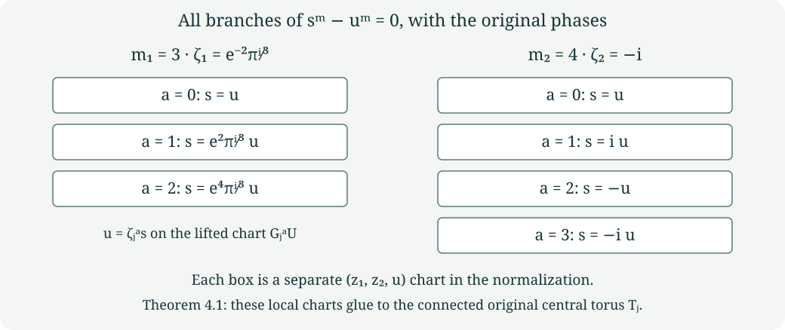

# Varying finite fillings and every base-change branch {#cg-s6-03}

CG-S6 · Lesson 3

The normal bundles in [lesson 2](normal-boundaries-and-integral-maps.md) have a precise relation to the varying holomorphic fillings. We construct the local periods, retaining their entire matrices, then prove that relation by an explicit real-analytic map. We also compute every branch after the ramified base change and the holomorphic map to the punctured unfilled family. The global compatibility of the two local constructions and the cusp belongs to the later global period construction; no global existence assertion is inferred from local germs.

We retain the marked lattice, matrices \(A_j\), signed vectors \(v_j\), and central parameters of [lesson 1](finite-quotients-and-line-bundles.md). In particular,

\[
\begin{gathered}
(m_1,m_2)=(3,4),\qquad \zeta_j=e^{-2\pi i/m_j},\\
(a_1,a_2)=(\rho,i),\qquad \rho=e^{\pi i/3},\\
(\mu_{1,0},\mu_{2,0})=((2-\rho)/3,(1-i)/2).
\end{gathered}
\tag{1.1}
\]

The unchanged central constants \(\beta_{j,0}\) satisfy

\[
\operatorname{Im}(\beta_{1,0}+2\mu_{1,0})<0,
\qquad
\operatorname{Im}(\beta_{2,0}+3\mu_{2,0})<0.
\tag{1.2}
\]

## 1. Constructing all the local period germs {#local-periods}

A holomorphic germ here is a convergent power series near zero; we choose an actual disc on which the displayed functions converge. Choose any germs \(F_j,H_j,B_j\) with \(B_j(0)=0\). To obtain the original local orders of the period map, choose \(F_j(0)\ne0\). Define

\[
\begin{array}{c|ccccc}
j&m_j&d_j&e_j&c_j&a_j\\ \hline
1&3&1&2&-1&\rho\\
2&4&2&1&1&i
\end{array}
\tag{1.3}
\]

and the following exact formulas:

\[
\begin{aligned}
q_j(s)&=s^{d_j}F_j(s^{m_j}),&
\tau_j(s)&=\frac{a_j-\overline a_j q_j(s)}{1-q_j(s)},\\
\mu_1(s)&=\frac{2-\tau_1(s)}3+
 \frac{s^2H_1(s^3)}{1-q_1(s)},&
\mu_2(s)&=\frac{1-\tau_2(s)}2+
 \frac{sH_2(s^4)}{1-q_2(s)}.
\end{aligned}
\tag{1.4}
\]

Here \(q_j\) is an auxiliary function with its specified inverse relation to \(\tau_j\); it does not replace the original period. Put

\[
\begin{aligned}
\phi_1(s)&=2-\frac{6(1-\mu_1(s))^2}{\tau_1(s)},&
b_1(s)&=\frac{\phi_1(\zeta_1s)+2\phi_1(\zeta_1^2s)}3,\\
\phi_2(s)&=-3-\frac{6\mu_2(s)^2}{\tau_2(s)},&
b_2(s)&=\frac{\phi_2(\zeta_2s)+2\phi_2(\zeta_2^2s)
                       +3\phi_2(\zeta_2^3s)}4,\\
\beta_j(s)&=\beta_{j,0}+B_j(s^{m_j})+b_j(s).
\end{aligned}
\tag{1.5}
\]

All constants and all summands in these formulas are retained. They provide actual local functions, not equations left to be solved.

**Theorem 1.1.** The formulas (1.4)–(1.5) give holomorphic germs with precisely the following transformation laws:

\[
\begin{aligned}
\tau_1(\zeta_1s)&=(\tau_1(s)-1)/\tau_1(s),&
\mu_1(\zeta_1s)&=(1-\mu_1(s))/\tau_1(s),\\
\beta_1(\zeta_1s)&=\beta_1(s)+2-6(1-\mu_1(s))^2/\tau_1(s),\\
\tau_2(\zeta_2s)&=-1/\tau_2(s),&
\mu_2(\zeta_2s)&=1+\mu_2(s)/\tau_2(s),\\
\beta_2(\zeta_2s)&=\beta_2(s)-3-6\mu_2(s)^2/\tau_2(s).
\end{aligned}
\tag{1.6}
\]

Their central values are exactly \((a_j,\mu_{j,0},\beta_{j,0})\). On an actual disc \(\Delta_{r_j}\) of sufficiently small radius \(r_j>0\),

\[
\operatorname{Im}\tau_j(s)>0,\qquad
D_j(s)=\operatorname{Im}\beta_j(s)
 -\frac{6(\operatorname{Im}\mu_j(s))^2}{\operatorname{Im}\tau_j(s)}<0.
\tag{1.7}
\]

Conversely, every holomorphic period germ with these central values and laws is recovered uniquely by (1.4)–(1.5), with \(F_j,H_j,B_j\) holomorphic and \(B_j(0)=0\). The orders of \(\tau_1-\rho\) and \(\tau_2-i\) are one and two exactly when the corresponding \(F_j(0)\ne0\).

**Proof.** The auxiliary Cayley function and its inverse are

\[
q=\frac{\tau-a_j}{\tau-\overline a_j},\qquad
\tau=\frac{a_j-\overline a_jq}{1-q}.
\tag{1.8}
\]

Direct substitution of \((\tau-1)/\tau\) for \(j=1\) and \(-1/\tau\) for \(j=2\) multiplies \(q\) by
\(r_j^{\mathrm{phase}}=\overline a_j/a_j=\zeta_j^{d_j}\).
The notation \(r_j^{\mathrm{phase}}\) denotes this unit complex number, and is distinct from the positive radius \(r_j\). Formula (1.4) has exactly this transformation because \((\zeta_js)^{m_j}=s^{m_j}\). This proves the two laws for \(\tau_j\).

The particular functions \(p_1(\tau)=(2-\tau)/3\) and \(p_2(\tau)=(1-\tau)/2\) satisfy the stated affine laws for \(\mu\), by substitution. The differences \(\delta_j=\mu_j-p_j(\tau_j)\) must therefore satisfy

\[
\delta_j(\zeta_js)=\frac{c_j}{\tau_j(s)}\delta_j(s).
\tag{1.9}
\]

The full multiplier is

\[
\frac{c_j}{\tau_j(s)}
=\frac{c_j}{a_j}\frac{1-q_j(s)}{1-r_j^{\mathrm{phase}}q_j(s)},
\qquad \frac{c_j}{a_j}=\zeta_j^{e_j}.
\tag{1.10}
\]

Consequently the correction term in (1.4) satisfies (1.9). This proves both \(\mu\) laws without dropping the denominator.

The additive functions \(\phi_j\) have zero sum around their full orbit. To verify every term, write \(T=\tau_j(s)\), \(M=\mu_j(s)\). For \(j=1\), the successive pairs are

\[
(T,M),\quad ((T-1)/T,(1-M)/T),\quad
(-1/(T-1),(T+M-1)/(T-1)),
\tag{1.11}
\]

followed by \((T,M)\). Their three additive terms are

\[
2-\frac{6(1-M)^2}{T},\quad
2-\frac{6(T+M-1)^2}{T(T-1)},\quad
2+\frac{6M^2}{T-1}.
\tag{1.12}
\]

Multiplying their sum by \(T(T-1)\) gives, by expansion,

\[
6T(T-1)-6(1-M)^2(T-1)-6(T+M-1)^2+6TM^2=0.
\]

For \(j=2\), the successive pairs are

\[
(T,M),\quad(-1/T,(T+M)/T),\quad
(T,1-T-M),\quad(-1/T,(1-M)/T),
\tag{1.13}
\]

followed by \((T,M)\). The four additive terms are

\[
-3-\frac{6M^2}{T},\quad
-3+\frac{6(T+M)^2}{T},\quad
-3-\frac{6(1-T-M)^2}{T},\quad
-3+\frac{6(1-M)^2}{T}.
\tag{1.14}
\]

Their sum is zero because

\[
-M^2+(T+M)^2-(1-T-M)^2+(1-M)^2=2T.
\]

Thus, retaining all \(m_j\) terms,

\[
\sum_{k=0}^{m_j-1}\phi_j(\zeta_j^ks)=0,
\quad
b_j(s)=\frac1{m_j}\sum_{k=0}^{m_j-1}k\phi_j(\zeta_j^ks),
\quad
b_j(\zeta_js)-b_j(s)=\phi_j(s).
\tag{1.15}
\]

For the last equality, shift the summation index: the numerator of the difference is \((m_j-1)\phi_j(s)-\sum_{k=1}^{m_j-1}\phi_j(\zeta_j^ks)=m_j\phi_j(s)\). This proves both \(\beta\) laws. At zero the additive terms vanish: \((1+\rho)^2=3\rho\) gives \(\phi_1(0)=0\), and \(((1-i)/2)^2=-i/2\) gives \(\phi_2(0)=0\). Hence \(b_j(0)=0\) and every central value is preserved.

Choose a radius inside the convergence discs with \(|q_j|<1\). The inverse Cayley formula gives
\(\operatorname{Im}\tau_j=\operatorname{Im}a_j(1-|q_j|^2)/|1-q_j|^2>0\).
The strict inequalities (1.2) equal \(D_j(0)<0\), as lesson 1 computed with the original factors. Continuity supplies a smaller positive radius on which (1.7) holds. We retain whichever actual radius was chosen; it is never changed to one.

For the converse, (1.8) sends the given upper-half-plane germs to germs at zero. A convergent series \(h(s)=\sum_{n\ge0}h_ns^n\) satisfying \(h(\zeta_js)=\zeta_j^lh(s)\) has \(h_n=0\) unless \(n\equiv l\pmod {m_j}\), by coefficient comparison. Apply this first to \(q_j\): it gives uniquely \(q_j=s^{d_j}F_j(s^{m_j})\). Apply it next to \((1-q_j)\delta_j\), using (1.10): it gives uniquely \(s^{e_j}H_j(s^{m_j})\). The resulting subseries converge on smaller discs by the coefficient bounds for the original series. Finally (1.15) and the given \(\beta\) law show that \(\beta_j-\beta_{j,0}-b_j\) is invariant, vanishes at zero, and is uniquely \(B_j(s^{m_j})\). This recovers every original function. The identity
\(\tau_j-a_j=(a_j-\overline a_j)q_j/(1-q_j)\)
proves the order assertion. ∎

For example \(F_j=1\), \(H_j=0\), \(B_j=0\) gives explicit nonconstant local marked periods with every prescribed central constant retained. The converse describes the exact functions extracted from any original global period family. It does not assert that independently selected germs extend together to one global family.

## 2. The full marked family and its covariance {#covariance}

For either index, suppress the subscript on the functions, retain its actual \(r=r_j\), and put

\[
\Pi(s)=\begin{pmatrix}6\mu(s)&\tau(s)&1&0\\
                         \beta(s)&\mu(s)&0&1\end{pmatrix},
\quad
\mathcal T_j=(\Delta_r\times\mathbb C^2)/\Lambda,
\quad t_\lambda(s,z)=(s,z+\Pi(s)\lambda).
\tag{2.1}
\]

This quotient is a Hausdorff complex manifold, and the projection to \(\Delta_r\) is a proper holomorphic submersion. Here is the complete local verification. For \(z=(z_1,z_2)=\Pi(s)(a,b,c,d)^{\mathsf t}\), the real inverse is

\[
\begin{aligned}
a&=\frac{\operatorname{Im}z_2-
  (\operatorname{Im}\mu/\operatorname{Im}\tau)\operatorname{Im}z_1}{D_j(s)},\\
b&=\frac{\operatorname{Im}z_1-6\operatorname{Im}\mu\,a}{\operatorname{Im}\tau},\\
c&=\operatorname{Re}z_1-6\operatorname{Re}\mu\,a-\operatorname{Re}\tau\,b,\\
d&=\operatorname{Re}z_2-\operatorname{Re}\beta\,a-\operatorname{Re}\mu\,b.
\end{aligned}
\tag{2.2}
\]

All functions in this inverse are evaluated at \(s\). Thus the real marking
\(\Xi(s,x)=(s,\Pi(s)x)\) and its inverse are real analytic. It conjugates the lattice action to translation on the second factor of \(\Delta_r\times\mathbb R^4\). That action is free and properly discontinuous: compact sets have bounded second coordinates and can meet only finitely many integral translates. The quotient is Hausdorff; disjoint small translated neighbourhoods give holomorphic quotient charts. Projection is a submersion in those charts. Over a compact \(K\subset\Delta_r\), the image of \(K\times[0,1]^4\) under \(\Xi\) and the quotient map is the whole inverse image, proving compactness and properness.

Define the original covariance matrices

\[
R_1(s)=\begin{pmatrix}-1/\tau&0\\(1-\mu)/\tau&1\end{pmatrix},
\qquad
R_2(s)=\begin{pmatrix}1/\tau&0\\-\mu/\tau&1\end{pmatrix}.
\tag{2.3}
\]

They are invertible. The exact identities are

\[
R_j(s)\Pi(s)=\Pi(\zeta_js)A_j.
\tag{2.4}
\]

Indeed the left sides, with all four columns, are respectively

\[
\begin{pmatrix}
-6\mu/\tau&-1&-1/\tau&0\\
\beta+6\mu(1-\mu)/\tau&1&(1-\mu)/\tau&1
\end{pmatrix},
\quad
\begin{pmatrix}
6\mu/\tau&1&1/\tau&0\\
\beta-6\mu^2/\tau&0&-\mu/\tau&1
\end{pmatrix}.
\tag{2.5}
\]

Writing primes for evaluation at \(\zeta_js\), the right sides are

\[
\begin{pmatrix}6\mu'+6\tau'-6&-1&\tau'-1&0\\
\beta'+6\mu'-2&1&\mu'&1\end{pmatrix},
\quad
\begin{pmatrix}6\mu'-6&1&-\tau'&0\\
\beta'+3&0&1-\mu'&1\end{pmatrix}.
\tag{2.6}
\]

Substitution of every law in (1.6) gives (2.5), proving (2.4) in the original coordinates.

## 3. The quotient and the actual normal-bundle comparison {#varying-quotient}

The holomorphic affine lift is

\[
\widehat G_j(s,z)=
 (\zeta_js,R_j(s)z+\Pi(\zeta_js)v_j/m_j).
\tag{3.1}
\]

Equation (2.4) gives
\(\widehat G_jt_\lambda\widehat G_j^{-1}=t_{A_j\lambda}\).
It therefore descends to \(G_j\) on \(\mathcal T_j\). Its powers are exactly

\[
\Xi^{-1}\widehat G_j^k\Xi(s,x)=
 (\zeta_j^ks,A_j^kx+kv_j/m_j),
\qquad \widehat G_j^{m_j}=t_{v_j}.
\tag{3.2}
\]

This follows by induction using \(A_jv_j=v_j\), including negative powers by inversion. Consequently \(G_j\) has order \(m_j\). It acts freely: away from zero, every power strictly between zero and \(m_j\) moves the base point; at zero a fixed point would force \(\gamma(\lambda)+k\gamma(v_j)/m_j=0\), impossible for such \(k\), as in lesson 2.

**Theorem 3.1.** The quotient and its base map

\[
N_j=\mathcal T_j/\langle G_j\rangle,
\quad f_j:N_j\longrightarrow\Delta_{r^{m_j}},
\quad f_j([s,z])=s^{m_j}
\tag{3.3}
\]

form a Hausdorff smooth complex threefold and a proper holomorphic map. The quotient \(Q_j:\mathcal T_j\to N_j\) is a finite unramified covering of degree \(m_j\). Its reduced central fibre is the original \(S_j\), and its full central fibre is the divisor \(m_jS_j\). There is an explicit real-analytic diffeomorphism from the exact normal disc bundle in lesson 2,

\[
\mathscr F_j:\mathcal D_j(r)\longrightarrow N_j,
\qquad [s,[\Pi(0)x]]\longmapsto Q_j([s,\Pi(s)x]),
\tag{3.4}
\]

which preserves \(s^{m_j}\), fixes the central surface pointwise, and identifies every deck map and attachment map of that lesson.

**Proof.** A finite free action on a Hausdorff manifold has the following explicit charts. Around a point choose a coordinate neighbourhood whose translates are pairwise disjoint, by separating its finitely many distinct orbit points and intersecting the inverse images of the chosen neighbourhoods. The quotient is a biholomorphism on each such neighbourhood. Distinct orbits have disjoint saturated neighbourhoods by the same finite separation argument, so the quotient is Hausdorff. These charts prove every smoothness and covering assertion. A finite-sheeted covering here is proper: a compact set is covered by finitely many smaller relatively compact evenly covered neighbourhoods, whose lifted closures form a finite union of compact sets containing its closed inverse image.

The inverse image of a compact \(K\subset\Delta_{r^{m_j}}\) under \(s\mapsto s^{m_j}\) is compact in \(\Delta_r\), since its modulus stays strictly below \(r\). Properness of \(\mathcal T_j\to\Delta_r\), followed by its continuous quotient, proves properness of \(f_j\). At a central point the quotient chart retains the original transverse coordinate \(s\); the map is literally \(t=s^{m_j}\). Thus the reduced fibre is \(S_j\), and its local defining function has order exactly \(m_j\).

For (3.4), lift it before quotienting to
\((s,z)\mapsto(s,\Pi(s)\Pi(0)^{-1}_{\mathbb R}z)\).
Formula (2.2) gives its real-analytic inverse with \(s\) and zero interchanged. Formula (3.2) shows that it intertwines every lattice translation and the original signed affine generator with exactly the corresponding normal-bundle map. Hence both maps descend, are inverse, and have the stated properties. In particular, the punctured inclusion and its lift are carried to the punctured inclusion of \(N_j\). The deck-group presentations, entire kernel and integral maps in lesson 2 apply through this explicit map. It is a real-analytic comparison; no holomorphic product assertion is made. ∎

The radial retraction is equally explicit:

\[
Q_j\bigl([s,\Pi(s)x]\bigr)
 \longmapsto Q_j\bigl([(1-u)s,\Pi((1-u)s)x]\bigr),
\quad 0\le u\le1.
\tag{3.5}
\]

Its equivariance follows from (3.2). On a nonzero fibre, choose a root \(s\) of its \(t\)-value. Each orbit meets that root fibre once. Retraction sends its marked point \(x\) to the orbit of the same \(x\) at zero, so the induced map on cohomology is exactly the pullback of \(T_j\to S_j\), including the degree-one indices three and four from lesson 2.

## 4. Every branch of the ramified base change {#normalization}

The word *normalization* in this section names the integral closure of a reduced analytic space in its total meromorphic fraction ring. It is an actual map retaining all branches; no change of the original period formulas is involved.

Give another copy of \(\Delta_r\) the coordinate \(u\) and map it to the base by \(t=u^{m_j}\). Form

\[
\mathcal P_j=N_j\times_{\Delta_{r^{m_j}}}\Delta_r,
\qquad
\nu_j:\mathcal T_j\longrightarrow\mathcal P_j,
\quad y\longmapsto(Q_j(y),s(y)).
\tag{4.1}
\]

**Theorem 4.1.** The map \(\nu_j\) is the full normalization. It is a biholomorphism away from \(u=0\). Over each point of \(S_j\), it has precisely \(m_j\) local branches; the central fibre of its source is the connected original torus \(T_j\). The branches, including their phases, are

\[
s=\zeta_j^{-a}u=e^{2\pi ia/m_j}u,
\qquad 0\le a<m_j.
\tag{4.2}
\]

**Proof.** For \(u\ne0\), an orbit has all \(m_j\) distinct roots as its \(s\)-values. Exactly one representative has \(s=u\), so (4.1) has a holomorphic inverse there, using quotient charts. For \(u=0\), all \(m_j\) covering points have \(s=0\). These observations prove surjectivity and give the fibres. For compact \(K\subset\mathcal P_j\), its projection to \(N_j\) is compact. Its inverse image under \(\nu_j\) is a closed subset of the compact inverse image of that projection under the finite covering \(Q_j\). Hence \(\nu_j\) is proper.

We now prove the local integral-closure assertion, including the analytic algebra used. A quotient chart near a central point has coordinates \((z_1,z_2,s)\) and map \(t=s^{m_j}\). Its base change has ring

\[
\mathcal R=\mathbb C\{z_1,z_2,s,u\}/(s^m-u^m),
\quad \mathcal B=\mathbb C\{z_1,z_2,u\},
\quad m=m_j,
\quad c_a=e^{2\pi ia/m}.
\tag{4.3}
\]

Evaluation on all branches gives

\[
\mathcal R\longrightarrow\prod_{a=0}^{m-1}\mathcal B,
\qquad F\longmapsto(F(z_1,z_2,c_au,u))_a.
\tag{4.4}
\]

This map is injective. To see this without assuming reducedness, expand a holomorphic germ in powers of \(s\). Modulo \(s^m-u^m\) it has a convergent remainder \(\sum_{l=0}^{m-1}b_l(z_1,z_2,u)s^l\). Explicitly, if its coefficients are \(a_n(z_1,z_2,u)\), then

\[
b_l=\sum_{k\ge0}a_{km+l}u^{km},\qquad
s^{km+l}-u^{km}s^l
=(s^m-u^m)s^l\sum_{q=0}^{k-1}s^{m(k-1-q)}u^{mq}.
\tag{4.5}
\]

The second sum is zero when \(k=0\). Cauchy coefficient bounds on an \(s\)-disc of radius \(R\) show convergence of both remainder and quotient on \(|s|,|u|<r<R\): the quotient terms are bounded by a constant times \(k r^{m(k-1)+l}R^{-km-l}\), a summable series. If (4.4) vanishes, this remainder polynomial has the \(m\) distinct roots \(c_au\) whenever \(u\ne0\), and has degree less than \(m\). Every coefficient therefore vanishes for \(u\ne0\) and then at zero by continuity. This proves injectivity. In particular \(\mathcal R\) is reduced, and multiplication by \(u\) is injective.

In \(\mathcal R[1/u]\) the elements

\[
e_a=\frac{\prod_{b\ne a}(s-c_bu)}
              {u^{m-1}\prod_{b\ne a}(c_a-c_b)}
\tag{4.6}
\]

map to the tuple with a one in component \(a\) and zeros elsewhere. They satisfy \(e_a^2=e_a\), \(e_ae_b=0\) for \(a\ne b\), and \(\sum_a e_a=1\), by injectivity after localization. Thus they are integral over \(\mathcal R\). The ring obtained by adjoining all of them is exactly \(\prod_a\mathcal B\), because the diagonal \(\mathcal B\) lies in \(\mathcal R\) and every tuple is \(\sum_a b_ae_a\). This extension is finite: those \(m\) idempotents generate it as an \(\mathcal R\)-module.

The total fraction ring of \(\mathcal R\) is exactly \(\prod_a\operatorname{Frac}(\mathcal B)\). Indeed (4.6) supplies the components. Products of nonzero diagonal denominators supply any tuple of component fractions. Conversely an element of \(\mathcal R\) is a non-zero-divisor exactly when all its components are nonzero. The forward direction follows because, if component \(a\) vanishes, multiplication by the nonzero element \(u^{m-1}e_a\in\mathcal R\) annihilates it; the reverse follows from (4.4) and the fact that \(\mathcal B\) is a domain. This proves the fraction-ring claim.

For completeness \(\mathcal B\) is integrally closed. Suppose a meromorphic germ \(p/q\) satisfies a monic equation of degree \(n\) with holomorphic coefficients bounded in modulus by \(M\) on a small neighbourhood. Wherever \(q\ne0\), any root of that equation has modulus at most \(\max(1,nM)\): a larger modulus contradicts the equation after comparing the leading term with the sum of the other terms. Choose a complex coordinate direction \(w\) in which \(q(0,w)\) is not identically zero; a direction on which the first nonzero homogeneous term of \(q\) is nonzero does this. Choose a small circle \(|w|=r_0\) containing no zero of \(q(0,w)\), then shrink the remaining coordinates so that \(q\) is nonzero on their product with that circle. The Cauchy integral of \((p/q)/(w-\eta)\) over the circle defines a holomorphic function of the remaining coordinates and \(|\eta|<r_0\). On each slice whose denominator is not identically zero, the finitely many interior singularities are removable by the bound just proved, so the integral agrees with \(p/q\) where that quotient is defined. This proves a holomorphic extension as a germ. Therefore every meromorphic germ integral over \(\mathcal B\) belongs to \(\mathcal B\).

It follows component by component that \(\prod_a\mathcal B\) is integrally closed in the total fraction ring. Since it is integral over \(\mathcal R\), and any element integral over \(\mathcal R\) satisfies that same monic equation over \(\prod_a\mathcal B\), it is precisely the integral closure. This proves the entire local normalization.

Finally choose one quotient chart lifted from a neighbourhood \(U\subset\mathcal T_j\). On \(G_j^aU\), the second component of (4.1) is \(u=\zeta_j^as\), where \(s\) is the coordinate inherited from \(U\) on the target chart. Thus these \(m_j\) disjoint source charts map isomorphically to exactly the branches (4.2). The specified global map \(\nu_j\) glues those identifications. Its source at \(s=0\) is exactly \(\mathbb C^2/\Pi(0)\Lambda=T_j\), a connected torus. Having several branches over each point of \(S_j\) does not split that global torus into disconnected tori. ∎

{#branch-figure}

The original cyclic action satisfies the exact global identity

\[
\nu_j(G_jy)=(Q_j(y),\zeta_js(y)).
\tag{4.7}
\]

Thus it lifts \(u\mapsto\zeta_ju\), permutes the branches cyclically, and its quotient is the original \(N_j\).

## 5. The punctured holomorphic comparison {#logarithm-map}

There are two lifts over the punctured disc: the affine lift (3.1) and the linear lift

\[
\widehat G_j^0(s,z)=(\zeta_js,R_j(s)z).
\tag{5.1}
\]

We construct their exact conjugacy. On a simply connected open subset of \(\Delta_r^\times\), choose a holomorphic logarithm \(\ell(s)\) and put

\[
\sigma_j(s)=\left[\frac{\ell(s)}{2\pi i}\Pi(s)v_j\right],
\qquad h_j([s,z])=[s,z+\sigma_j(s)].
\tag{5.2}
\]

Square brackets in the first expression mean the class in the torus over \(s\); the second expression is fibrewise addition of that class. Two logarithms differ by \(2\pi in\), so their displayed vectors differ by \(n\Pi(s)v_j\), an actual lattice vector. Thus (5.2) is a global holomorphic section and a global biholomorphism of the punctured family, with inverse translation by \(-\sigma_j\).

**Theorem 5.1.** The exact identity is

\[
h_jG_jh_j^{-1}=G_j^0.
\tag{5.3}
\]

It induces a biholomorphism between the punctured affine quotient and the punctured linear quotient, preserving the base coordinate \(t=s^{m_j}\).

**Proof.** On the translated open set use the logarithm
\(\ell'(s')=\ell(\zeta_j^{-1}s')-2\pi i/m_j\).
It exponentiates to \(s'\) and obeys
\(\ell'(\zeta_js)/(2\pi i)=\ell(s)/(2\pi i)-1/m_j\).
Moreover (2.4) and \(A_jv_j=v_j\) give
\(R_j(s)\Pi(s)v_j=\Pi(\zeta_js)v_j\).
Starting with \([s,z]\), the three maps in (5.3) therefore produce the fibre vector

\[
R_j(s)z-
 \frac{\ell(s)}{2\pi i}\Pi(\zeta_js)v_j+
 \frac1{m_j}\Pi(\zeta_js)v_j+
 \left(\frac{\ell(s)}{2\pi i}-\frac1{m_j}\right)
                \Pi(\zeta_js)v_j
=R_j(s)z.
\tag{5.4}
\]

Every translation and sign is displayed. Changing any logarithm adds only a lattice vector, so the identity holds globally on the torus family and descends to the quotients. Both \(h_j\) and its inverse preserve \(s\), which proves the base-map assertion. ∎

## 6. Exercises with solutions {#exercises}

**Exercise 1.** Recover the free germs \(F_j,H_j,B_j\) from a given original local period triple; identify exactly where division by a power of \(s\) occurs.

**Solution.** Compute \(q_j=(\tau_j-a_j)/(\tau_j-\overline a_j)\). Then \(F_j(s^{m_j})=q_j/s^{d_j}\), and \(H_j(s^{m_j})=(1-q_j)(\mu_j-p_j(\tau_j))/s^{e_j}\). The coefficient argument in Theorem 1.1 proves that both numerators have the stated factors and that the quotients contain only powers divisible by \(m_j\). These are removable divisions, including at zero. Compute \(\phi_j\) and the full weighted sum \(b_j\) from (1.5); finally \(B_j(s^{m_j})=\beta_j(s)-\beta_{j,0}-b_j(s)\). This last expression is invariant and vanishes at zero. Substituting these three germs back into (1.4)–(1.5) returns the entire original triple, including its central constants.

**Exercise 2.** For \(m=3\) and \(m=4\), list the branches and prove that the idempotents in (4.6) retain all of them.

**Solution.** The three branches are \(s=u\), \(s=e^{2\pi i/3}u\), \(s=e^{4\pi i/3}u\). The four branches are \(s=u\), \(s=iu\), \(s=-u\), \(s=-iu\). On branch \(b\), evaluating \(e_a\) gives zero if \(b\ne a\) because the numerator has the factor \(s-c_bu\), and gives one if \(b=a\) because numerator and denominator then coincide. Hence the \(e_a\) are nonzero orthogonal idempotents summing to one. Omitting any branch loses a nonzero summand of the integral closure and omits one of the \(m\) local source charts of \(\nu_j\).

**Exercise 3.** Transport the complete attachment kernel from lesson 2 to the varying filling, preserving its orientation.

**Solution.** Lift (3.4) to the logarithmic cover \(s=e^{2\pi iw}\), \(\operatorname{Im}w>-\log r/(2\pi)\), by \((w,x)\mapsto(e^{2\pi iw},\Pi(e^{2\pi iw})x)\). The lattice generator is \(t_\lambda\), and the clockwise generator still sends \((w,x)\) to \((w-1/m_j,A_jx+v_j/m_j)\). Thus the positive normal-circle map \((w,x)\mapsto(w+1,x)\) is still \(t_{v_j}\widetilde G_j^{-m_j}\). The punctured inclusion kills exactly its inverse, \(\widetilde G_j^{m_j}t_{-v_j}\), and its full kernel is the infinite cyclic subgroup generated by that element, by Theorem 4.1 of lesson 2 and the actual equivariant diffeomorphism. No orientation or translation vector changes in passing to the varying family.

## 7. Proof sources and scope {#sources}

The retained antecedents are the [frozen programme archive](https://zenodo.org/records/22678442/files/28_s6_complete_public_project_frozen_2026-09-06.zip), members `project/supporting_materials/workbench/research/finite_filling_certificates.tex`, FF23–FF41, and `project/supporting_materials/workbench/research/candidate_geometry.tex`, equations (2.1a), (2.3c)–(2.3d), (2.8b)–(2.10), the finite-filling proposition, and the radial-retraction lemma. The originating manuscript was produced with Claude under Levent Alpöge's direction. Philip Engel's [original-author treatment](https://arxiv.org/abs/2609.38442v1), Sections 3 and 6, gives a related geometric construction; no complete reading of that paper is claimed here.

Section 1 supplies an independently derived full local parametrization and its inverse, using the original transformation laws. Section 4 supplies the analytic algebra proof behind the finite-filling certificate's normalization statement. These are teaching derivations; no novelty claim is made. Together with lessons 1–2, this unit gives the complete finite-local construction and its exact topological comparison. The global period functions, cusp, compact gluing, sphere recognition and later deformation results remain subsequent course work.

Mathematical exposition: GPT-6 Astra (OpenAI), Codex, Ultra, 8 October 2026. New lesson text: CC0-1.0.
