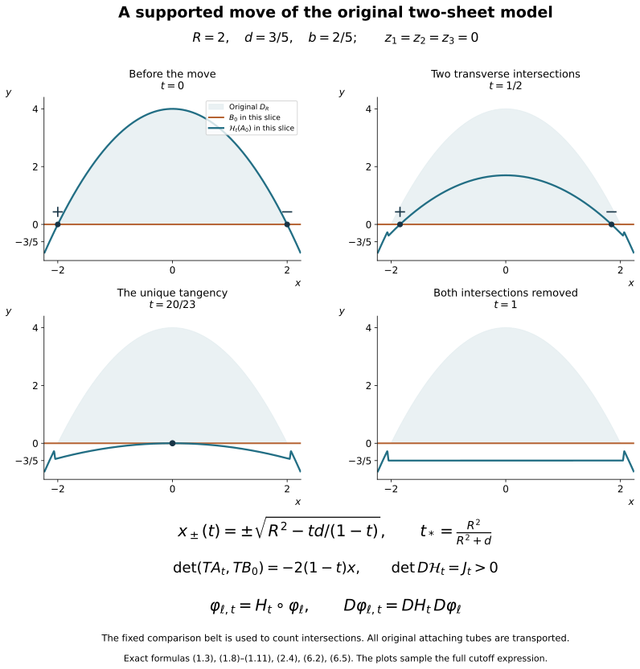

# The supported Whitney move and its original framings {#supported-whitney-move}

Companion for CG-S6 lesson 7. GPT-6 Astra (OpenAI), Ultra, 10 October 2026. New exposition CC0. We construct the supported move from the original framed disk proved in the [disk companion](belt-sphere-complements-and-the-whitney-disk.md#whitney-boundary), retaining its corner charts, full frame, attaching radii and every cutoff contribution. Arranging the original cobordism into the required handle stage and proving the remaining smooth sphere classification are later work in lesson 7.

## 1. A full flow in the specified model {#move-model-flow}

Retain positive parameters \(R,d,b\). In coordinates
\((x,y,z_1,z_2,z_3)\in\mathbb R^5\), put

\[
\phi(x)=R^2-x^2,\qquad
D_R=\{(x,y,0,0,0):-R\leq x\leq R,\ 0\leq y\leq\phi(x)\}.
\tag{1.1}
\]

The two sheet models, on a neighbourhood of this disk, are

\[
A_0=\{(x,\phi(x),z_1,0,0)\},\qquad
B_0=\{(x,0,0,z_2,z_3)\}.
\tag{1.2}
\]

Let \(U\) be an open neighbourhood of \(D_R\) on which these specified sheet descriptions hold. The task here is to construct a diffeomorphism isotopy supported in \(U\), applied to \(A_0\), such that its final image misses the fixed comparison sheet \(B_0\).

The selected comparison sheet is kept as a set in the intersection calculation; it is not required to be fixed pointwise by the ambient diffeomorphism. Such a requirement would make the desired operation impossible: if every \(H_t\) fixed \(B_0\) pointwise, then \(H_t(A_0)\cap B_0=H_t(A_0\cap B_0)\). In the receiving handle argument the operation changes the attaching embedding and its framing; the belt sphere remains the comparison data for the new embedding. Other sheets outside the support are fixed pointwise.

Use the full smooth step \(\chi\) from the framed-disk companion, and define

\[
\begin{aligned}
u(x)&=\frac{4\phi(x)}d+2,&
\mu(x)&=\chi(u(x)),&
\delta(x)&=\mu(x)\bigl(\phi(x)+d\bigr),\\
L(y)&=\frac{y+2d}{d},&
H(x,y)&=\frac{\phi(x)+d-y}{d},&
\eta(x,y)&=\chi(L(y))\chi(H(x,y)),\\
Z(z)&=2-\frac{2(z_1^2+z_2^2+z_3^2)}{b^2},&
\zeta(z)&=\chi(Z(z)),&
v(x,y,z)&=\delta(x)\eta(x,y)\zeta(z).
\end{aligned}
\tag{1.3}
\]

The letters \(H(x,y)\) in this formula name a scalar cutoff argument; the flow below is denoted \(\mathcal H_t\). All factors are retained.

The function \(\delta\) is nonnegative. Where \(\mu\ne0\), we have \(\phi>-d/2\), hence \(\phi+d>d/2>0\). Moreover \(\mu=1\) where \(\phi\geq-d/4\), and \(\mu=0\) where \(\phi\leq-d/2\). The support of \(v\) is contained in the compact set

\[
K_{d,b}=
\left\{x^2\leq R^2+\frac d2,\quad
 -2d\leq y\leq R^2-x^2+d,\quad
 z_1^2+z_2^2+z_3^2\leq b^2\right\}.
\tag{1.4}
\]

For sufficiently small positive \(d,b\), this set lies in \(U\). Otherwise choose \(d_\nu,b_\nu\to0\) and points of \(K_{d_\nu,b_\nu}\setminus U\). They lie in one bounded set. A convergent subsequence has limit satisfying \(z=0\), \(x^2\leq R^2\), \(0\leq y\leq R^2-x^2\), so its limit lies in \(D_R\subset U\), contradicting openness. This argument retains the original \(R\); in particular the horizontal enlargement is
\(\sqrt{R^2+d/2}-R=d/[2(\sqrt{R^2+d/2}+R)]\).

Take the smooth compactly supported vector field

\[
V=-v(x,y,z)\frac{\partial}{\partial y}.
\tag{1.5}
\]

It has a flow for every real time. Local existence and uniqueness follow by the elementary smooth ODE theorem; outside its compact support solutions are constant, and inside it the bounded field cannot escape to infinity in finite time. The continuation theorem then gives all times. Write

\[
\mathcal H_t(x,y,z)=(x,Y_t(x,y,z),z),\qquad
\dot Y_t=-v(x,Y_t,z),\quad Y_0=y.
\tag{1.6}
\]

The inverse is \(\mathcal H_{-t}\), by uniqueness and the composition rule for an autonomous flow. The map is the identity off \(K_{d,b}\).

The flow on the actual model sheet can be evaluated without discarding the cutoffs. If \(\delta(x)\ne0\), then

\[
\phi(x)-\delta(x)
=(1-\mu(x))\phi(x)-\mu(x)d\geq-d.
\tag{1.7}
\]

Here \(\phi(x)>-d/2>-d\), and the right side is a convex combination of \(\phi(x)\) and \(-d\). Thus the path
\(y=\phi(x)-t\delta(x)\zeta(z_1,0,0)\), \(0\leq t\leq1\), lies between \(-d\) and \(\phi(x)\). On that entire interval both factors of \(\eta\) equal one. If \(\delta=0\), the flow is constant. In both cases uniqueness gives the exact image

\[
\mathcal H_t(x,\phi(x),z_1,0,0)
=\bigl(x,\phi(x)-t\delta(x)\zeta(z_1,0,0),z_1,0,0\bigr).
\tag{1.8}
\]

A point in (1.8) lies in the fixed \(B_0\) only when \(z_1=0\). Then \(\zeta(0)=1\). If \(\phi(x)<0\), nonnegativity of \(\delta\) keeps its \(y\)-coordinate strictly negative at every time. If \(\phi(x)\geq0\), then \(\mu=1\), so the intersection equation is

\[
(1-t)(R^2-x^2)-td=0.
\tag{1.9}
\]

For \(0\leq t<t_*=R^2/(R^2+d)\), the two intersection coordinates are

\[
x_\pm(t)=\pm\sqrt{R^2-\frac{td}{1-t}}.
\tag{1.10}
\]

At \(t=t_*\) they meet at \(x=0\); for \(t>t_*\), including \(t=1\), there is no intersection. No extra intersection can occur in the cutoff transition, since that transition has \(\phi<0\).

Orient \(A_0\) by its \((x,z_1)\) parameters and \(B_0\) by its \((x,z_2,z_3)\) parameters, and use the displayed ambient coordinate order. The determinant of their five tangent vectors at a transverse intersection is the full slope

\[
\frac{\partial}{\partial x}\bigl((1-t)(R^2-x^2)-td\bigr)
=-2(1-t)x.
\tag{1.11}
\]

It is positive at \(x_-(t)\) and negative at \(x_+(t)\). At the meeting time the second \(x\)-derivative is
\(-2(1-t_*)=-2d/(R^2+d)\ne0\), and the time derivative at \(x=0\) is
\(-(R^2+d)\ne0\). Thus the only tangency is the displayed pair cancellation. Any receiving coordinate map must retain its own orientation determinant and the original sphere orientations when applying (1.11).

## 2. Every cutoff derivative in the ambient inverse {#move-full-derivative}

The full derivatives of the functions in (1.3) are

\[
\begin{aligned}
\phi'(x)&=-2x,\\
\delta'(x)&=-2x\left[
 \chi(u(x))+\frac{4(\phi(x)+d)}d\chi'(u(x))\right],\\
\eta_x(x,y)&=-\frac{2x}{d}\chi(L(y))\chi'(H(x,y)),\\
\eta_y(x,y)&=\frac1d\left[
 \chi'(L(y))\chi(H(x,y))-\chi(L(y))\chi'(H(x,y))\right],\\
\zeta_{z_j}(z)&=-\frac{4z_j}{b^2}\chi'(Z(z)),\\
v_x&=\delta'\eta\zeta+\delta\eta_x\zeta,\qquad
v_y=\delta\eta_y\zeta,\qquad
v_{z_j}=\delta\eta\zeta_{z_j}.
\end{aligned}
\tag{2.1}
\]

For fixed original input \((x,y,z)\), put

\[
J_t=\exp\left(-\int_0^t v_y(x,Y_s,z)\,ds\right)>0.
\tag{2.2}
\]

Differentiating (1.6) gives \(\partial_yY_t=J_t\). The inhomogeneous linear equations for the other derivatives give

\[
\begin{aligned}
\partial_xY_t&=-J_t\int_0^t
 \frac{v_x(x,Y_s,z)}{J_s}\,ds,\\
\partial_{z_j}Y_t&=-J_t\int_0^t
 \frac{v_{z_j}(x,Y_s,z)}{J_s}\,ds.
\end{aligned}
\tag{2.3}
\]

To verify these formulas, differentiate their quotient by \(J_t\), use \(\dot J_t=-v_yJ_t\), and use zero initial values for the \(x,z_j\) derivatives. The full derivative of the flow in the displayed coordinate order is

\[
D\mathcal H_t=
\begin{pmatrix}
1&0&0&0&0\\
\partial_xY_t&J_t&\partial_{z_1}Y_t&\partial_{z_2}Y_t&\partial_{z_3}Y_t\\
0&0&1&0&0\\
0&0&0&1&0\\
0&0&0&0&1
\end{pmatrix},
\qquad \det D\mathcal H_t=J_t>0.
\tag{2.4}
\]

In particular no derivative-size shortcut is needed to make the vertical modification invertible. Every mixed cutoff term is present in (2.1)–(2.4).

If \(\varphi\) is a specified framed attaching tube whose image is in the domain under consideration, the new framed tube is exactly \(\mathcal H_t\circ\varphi\), on the identical original domain and radii. Its derivative is
\(D\mathcal H_t|_{\varphi}\,D\varphi\). This carries the original full framing; no Gram factor is removed. For a coordinate map \(\Psi\) into the original middle level, Section 6 proves that the receiving isotopy is
\(\Psi\mathcal H_t\Psi^{-1}\), with derivative
\(D\Psi\,D\mathcal H_t\,D\Psi^{-1}\) at the corresponding actual points.

## 3. Extending an entire boundary collar map {#move-collar-extension}

We first prove the coordinate extension that the original disk needs. The radius \(h>0\) in this section is the radius of its original round filling disk. A collar germ means a map defined on some whole open band about the boundary; two such maps define the same germ if they agree on a smaller whole band.

**Collar extension.** A smooth diffeomorphism germ from a collar of \(\partial D_h^2\) to itself, taking the inward side to the inward side, extends to a diffeomorphism of \(D_h^2\) that agrees with that entire germ on a smaller collar.

First suppose the boundary map preserves orientation. Write its angular lift as \(f:\mathbb R\to\mathbb R\), with
\[
f(\theta+2\pi)=f(\theta)+2\pi,\qquad f'(\theta)>0.
\tag{3.1}
\]
Choose a smooth function \(a_0:[0,h]\to[0,1]\), zero near \(0\) and one near \(h\). The maps
\[
F_s(r,\theta)=
\bigl(r,\ \theta+s\,a_0(r)(f(\theta)-\theta)\bigr),
\qquad 0\leq s\leq1,
\tag{3.2}
\]
are diffeomorphisms of the disk. They are the identity near its centre. At each positive radius their angular derivative is
\[
1+s\,a_0(r)(f'(\theta)-1)
=(1-s\,a_0(r))+s\,a_0(r)f'(\theta)>0.
\tag{3.3}
\]
The angular map has degree one by (3.1), hence is bijective. Its inverse is smooth by (3.3). The radial coordinate remains \(r\), so this proves global bijectivity and smoothness of the inverse, including at the centre.

Let \(k\) be the given collar germ. The germ \(k_0=F_1^{-1}k\) fixes the boundary pointwise. Use inward coordinates \((\theta,t)\), where \(t=h-r\). Smoothness across \(t=0\), and preservation of the inward side, give
\[
k_0(\theta,t)=
\bigl(\theta+c(\theta)t+O(t^2),\
       a(\theta)t+O(t^2)\bigr),\qquad a(\theta)>0.
\tag{3.4}
\]
The positive normal factor \(a(\theta)\) is part of the original germ; it is not discarded. Define
\[
D_s(\theta,t)=\bigl(\theta,a_s(\theta)t\bigr),\qquad
a_s(\theta)=(1-s)+s\,a(\theta)>0.
\tag{3.5}
\]
The velocity of this local isotopy at its current point is
\[
X_s(\theta,t)=\frac{a(\theta)-1}{a_s(\theta)}
                  t\,\partial_t.
\tag{3.6}
\]
Multiply (3.6) by a smooth collar cutoff, equal to one sufficiently close to the boundary and zero off a slightly larger collar. This gives a globally defined smooth time-dependent field on the disk. It vanishes on the boundary and near the centre. Its flow exists for \(0\leq s\leq1\) by compactness. It preserves the boundary and the inward side by uniqueness, and has an inverse obtained by running the time-dependent equation backwards.

For a sufficiently small original \(t\), every path \(a_s(\theta)t\) remains in the region where the cutoff is one: the maximum of \(a_s\) is finite on the compact circle and time interval. Uniqueness therefore makes the global flow agree there with the full germ \(D_s\). Write its time-one map as \(\widetilde D\).

The residual germ \(g=D_1^{-1}k_0\) fixes the boundary and has identity normal derivative there. In circle coordinates its exact form is
\[
g(\theta,t)=
\bigl(\theta+t\,C(\theta,t),\
       t+t^2 B(\theta,t)\bigr).
\tag{3.7}
\]
The integral Taylor formula gives smooth periodic coefficient functions. The angular difference uses the unique small lift near the identity. For \(\delta_s(\theta,t)=(\theta,st)\), the exact conjugate is
\[
g_s=\delta_s^{-1}g\delta_s,\qquad
g_s(\theta,t)=
\bigl(\theta+s t\,C(\theta,st),\
       t+s t^2B(\theta,st)\bigr).
\tag{3.8}
\]
The right side defines it smoothly also at \(s=0\), where it is the identity. At the boundary,
\[
Dg_s|_{t=0}=
\begin{pmatrix}1&sC(\theta,0)\\0&1\end{pmatrix}.
\tag{3.9}
\]
The parameter-dependent inverse function theorem and compactness give one collar on which these are local diffeomorphisms for all \(s\). They are injective on a smaller common collar: otherwise equal-image pairs in collars of shrinking width would have both limits at the same boundary point, since their boundary maps are the identity, contradicting the local inverse there.

The velocity \(\partial_sg_s\circ g_s^{-1}\) is smooth on this common collar and vanishes on its boundary. Cut it off outside a smaller collar. For inputs in a sufficiently small further collar, the whole paths \(g_s(\theta,t)\) stay in the region where the cutoff is one, uniformly by (3.8). The resulting global flow therefore agrees with \(g_s\) there. Call its time-one map \(\widetilde g\). Then
\[
Q=F_1\,\widetilde D\,\widetilde g
\tag{3.10}
\]
extends \(F_1D_1g=k\) on a whole collar, with all derivatives.

If the original boundary map reverses orientation, retain the reflection
\[
J(p_1,p_2)=(p_1,-p_2),\qquad
DJ=\begin{pmatrix}1&0\\0&-1\end{pmatrix},\quad\det DJ=-1.
\tag{3.11}
\]
Apply the proved construction to \(Jk\), then compose its extension on the left by \(J\). This extends the original \(k\), retaining the reflection and its sign. Both cases are proved.

## 4. Parametrizing the original disk with both corners {#move-original-disk}

Retain \(D=C\cup_\gamma F(D_h^2)\), its original corner maps \(\mathcal H_p,\mathcal H_q\), arcs \(\alpha,\beta\), and full frame \(e\) from the disk companion. We construct a diffeomorphism from \(D_R\) onto that same disk, including its corner smooth structure.

### 4.1. A collar using the original parameters

Take the model arcs
\[
\alpha_0(s)=(-R+2Rs,4R^2s(1-s)),\qquad
\beta_0(s)=(-R+2Rs,0),\qquad 0\leq s\leq1.
\tag{4.1}
\]
Near their left and right endpoints respectively use the full charts
\[
\begin{aligned}
\mathcal H_{0,p}(r,u,s,v,w)
 &=(-R+2R(r+s),4R^2r(1-r),u,v,w),\\
\mathcal H_{0,q}(r,u,s,v,w)
 &=(R-2R(r+s),4R^2r(1-r),u,v,w).
\end{aligned}
\tag{4.2}
\]
Their base Jacobian determinants in the \((r,s)\) order are \(-8R^3(1-2r)\) and \(8R^3(1-2r)\), nonzero near the endpoints. On \(s=0\) they give the top sheet, and on \(r=0\) the bottom sheet. Their positive base quadrants lie in \(D_R\) for small \(r,s\), since at either corner
\[
\phi(\mp R\pm2R(r+s))-4R^2r(1-r)
=4R^2s(1-2r-s)\geq0.
\tag{4.3}
\]

Build model strips with the same abstract arc and transverse parameters as the original strips. Choose inward fields equal to the corner coordinate fields near the endpoints. Elsewhere use the downward vertical field along the top and upward vertical field along the bottom. Join the choices by nonnegative smooth weights: the inward vectors form a convex open half-space. Extend these fields to neighbourhoods and take their flows. At the corners they agree with (4.2) by uniqueness, since the fields there are its coordinate fields.

Use a positive comparison width \(\varepsilon\) small enough for both constructions, and the original rounding formula
\[
r(t)=\frac{\varepsilon}{2}+2\varepsilon\int_0^t\kappa(\tau)d\tau,
\qquad
s(t)=\frac{\varepsilon}{2}+2\varepsilon\int_t^1\kappa(1-\tau)d\tau.
\tag{4.4}
\]
Its derivative is \(2\varepsilon(\kappa(t),-\kappa(1-t))\), with the two cutoff values summing to one. It joins the strip edges at width \(\varepsilon/2\) with all derivatives. Sending each model strip or quadrant coordinate to the identical original coordinate defines
\[
j:C_0\longrightarrow C_\varepsilon,
\tag{4.5}
\]
a diffeomorphism between the model annulus and an original comparison subannulus \(C_\varepsilon\subset C\).

If a thinner annulus is needed, the original embedded disk and frame remain unchanged. We supply the full filling comparison. Let \(\varepsilon_0\) be the old width. The curves (4.4) with widths \(a\in[\varepsilon,\varepsilon_0]\) are disjoint and form a smooth band. In a corner write their coordinates as \((aR_0(t),aS_0(t))\). Their determinant is
\[
\det\frac{\partial(aR_0,aS_0)}{\partial(a,t)}
=a(R_0S_0'-S_0R_0')<0:
\tag{4.6}
\]
both functions are positive, \(R_0'\geq0\), \(S_0'\leq0\), and at least one derivative is nonzero. On a strip the width derivative is \(1/2>0\). The joining formulas agree. Thus \(a\) is a smooth transverse function on the band. Its gradient divided by its squared length gives a vector field with \(da(X)=1\); flowing it trivializes the compact band.

Extend the original filling's outward radial field across this band, keeping it unchanged near the old filling boundary and transverse toward decreasing \(a\). This is possible by combining that field with the band field: the fields with \(da(X)<0\) form a convex half-space. Each trajectory crosses every level once. The times to reach the new inner boundary are positive smooth functions \(\tau(\theta)\), by transversality and the implicit function theorem. Compactness bounds them. Flow coordinates extend the original \(F\) to an embedding \(F_{\rm ext}\) on
\[
\{r(\cos\theta,\sin\theta):0\leq r\leq h+\tau(\theta)\}.
\tag{4.7}
\]
It equals the retained original \(F\) on \(D_h^2\), including all derivatives across its boundary, because the field agrees with the original radial field on a whole collar. Flow uniqueness excludes intersecting trajectories.

Define \(a_1(r)=\chi((3r-h)/h)\). An explicit diffeomorphism \(P_\tau\) from the original \(D_h^2\) onto (4.7) has polar radius
\[
f_\tau(r,\theta)=r+a_1(r)\tau(\theta),
\quad
\partial_rf_\tau=1+a_1'(r)\tau(\theta)>0,
\quad
\partial_\theta f_\tau=a_1(r)\tau'(\theta).
\tag{4.8}
\]
It is the identity near zero. Therefore
\[
F_\varepsilon=F_{\rm ext}\circ P_\tau
\tag{4.9}
\]
parametrizes the complement of the thinner annulus with the same original radius \(h\). If no thinning was needed, take \(F_\varepsilon=F\). These explicit maps compare to the retained original filling; no smooth-disk classification was assumed.

### 4.2. The model inner region has a positive polar radius

Put \(c=(0,R^2/2)\). On the original top and bottom boundary arcs, outward normals \(n_A=(2x,1)\), \(n_B=(0,-1)\) satisfy
\[
n_A\cdot((x,\phi(x))-c)=x^2+R^2/2>0,\qquad
n_B\cdot((x,0)-c)=R^2/2>0.
\tag{4.10}
\]
The strip edges converge in their first derivatives to those arcs as their width tends to zero, so these strict products persist on the strip portions.

At the left rounded corner the base derivative columns of (4.2) are \((2R,4R^2(1-2r))\), \((2R,0)\). The left normal to the derivative of (4.4), which traverses this inner corner clockwise, is exactly
\[
4R\varepsilon\left[
\kappa(t)(-2R(1-2r),1)+(1-\kappa(t))(0,-1)\right].
\tag{4.11}
\]
At the limiting corner the two bracket vectors have radial products \(3R^2/2\) and \(R^2/2\); these remain positive nearby. Their coefficients are nonnegative and sum to one, so the full rounded normal has positive radial product. At the right corner the first vector becomes \((2R(1-2r),1)\), with the same positive limiting product, and the second is unchanged. Selecting the outward normal with the corresponding traversal direction gives the identical strict inequality. No derivative of the rounded curve was replaced by its limit.

Choose the collar small enough to miss \(c\). It gives a homotopy of its inner circle \(\gamma_0\) to the outer boundary in \(\mathbb R^2\setminus\{c\}\). The latter winds once counterclockwise about \(c\): the lune is convex and contains \(c\), and each ray meets its boundary once. The strict radial products prove that the counterclockwise inner curve's radial projection has positive derivative. This local diffeomorphism of circles has degree one, hence is a diffeomorphism. Thus
\[
\gamma_0=\{c+\rho(\theta)(\cos\theta,\sin\theta)\},
\qquad \rho(\theta)>0
\tag{4.12}
\]
for a smooth periodic \(\rho\).

Retain \(\rho_{\min}=\min\rho>0\), and set
\[
\lambda=\frac{\rho_{\min}}{2h},\qquad
f(r,\theta)=\lambda r+a_1(r)(\rho(\theta)-\lambda h).
\tag{4.13}
\]
The nonnegative derivative of \(a_1\) gives
\[
f_r=\lambda+a_1'(r)(\rho(\theta)-\lambda h)>0,\quad
f(0,\theta)=0,\quad f(h,\theta)=\rho(\theta).
\tag{4.14}
\]
Near zero \(f=\lambda r\). It follows that
\[
P(r\cos\theta,r\sin\theta)=c+f(r,\theta)(\cos\theta,\sin\theta)
\tag{4.15}
\]
is a diffeomorphism onto the inner region \(\Omega_0\). It is exactly \(p\mapsto c+\lambda p\) near the centre. Elsewhere the complete polar columns and Cartesian determinant are
\[
\partial_rP=f_re_r,\qquad
\partial_\theta P=f_\theta e_r+fe_\theta,\qquad
\det DP=\frac{ff_r}{r}>0.
\tag{4.16}
\]
The angular contribution remains in the map.

### 4.3. Matching the entire filling collar

The map \(j\) extends across its inner boundary by its original coordinate formulas: the strips and quadrant charts were defined beyond the rounding curve, and the actual disk agrees with their surface extension there. Consequently
\[
k=F_\varepsilon^{-1}\circ j\circ P
\tag{4.17}
\]
is an exact diffeomorphism germ of a round collar, preserving its inward side. Section 3 extends it to \(Q:D_h^2\to D_h^2\) while keeping the entire germ. Define
\[
\psi_D=
\begin{cases}
j,&\text{on }C_0,\\
F_\varepsilon\circ Q\circ P^{-1},&\text{on }\Omega_0.
\end{cases}
\tag{4.18}
\]
The formulas agree on a whole joining band by (4.17), hence with every derivative. They map the two pieces diffeomorphically onto the original pieces with matching overlap and disjoint remaining interiors. Thus \(\psi_D:D_R\to D\) is a diffeomorphism of the actual corner domains. At the endpoints it is the comparison between (4.2) and the original corner maps. Every radius, angle, transverse scale and orientation reflection remains in the displayed construction.

## 5. Exact coordinates for both original sheets {#move-sheet-coordinates}

### 5.1. Extending the full tube across the boundary

Pull back the original frame \(e\) along \(\psi_D\). The actual tube is
\[
T(p,z)=\mathfrak r\left(
\iota\psi_D(p)+\sum_{j=1}^3z_jD\iota_{\psi_D(p)}e_j(\psi_D(p))
\right).
\tag{5.1}
\]
This retains the original ambient embedding, retraction, metric and frame. On its zero section,
\[
DT_{(p,0)}(v,w)=D\psi_D(v)+\sum_{j=1}^3w_je_j,
\tag{5.2}
\]
an isomorphism.

We need an open coordinate neighbourhood, including outside both corners. Extend the surface and frame in their original local charts. At a corner use the original transverse chart on its base plane; elsewhere use the strip or filling chart. A global extension is obtained by applying \(\iota\) to finitely many local extensions, combining them by a partition of unity near the compact \(D_R\), and applying \(\mathfrak r\). On \(D_R\) they all equal \(\psi_D\), so the weighted map has its exact values and derivatives: all terms differentiating the weights sum to zero. Shrink the neighbourhood so the image stays in the retraction domain and its base derivative has rank two.

Extend the frame columns by the same procedure, project first to the original ambient tangent bundle and then to the normal complement of the extended base surface. They retain their original values on \(D_R\), and remain independent nearby. On smaller corner patches choose the partition to use the original corner extension exclusively. There the frame was precisely the projection of the original three extra coordinate fields, so use that exact projection also on the extension.

The inverse function theorem now gives local ambient inverses to (5.1). It is injective on an open neighbourhood of the compact zero section: otherwise equal-image pairs in shrinking neighbourhoods would have limiting points on that section. Injectivity of \(\psi_D\) makes the two limits the same, contradicting the local inverse there. Thus \(T\) restricts to an open coordinate embedding around \(D_R\times\{0\}\).

### 5.2. Realizing the entire original corner maps

At the two endpoints the required ambient maps are
\[
K_p=\mathcal H_p\circ\mathcal H_{0,p}^{-1},\qquad
K_q=\mathcal H_q\circ\mathcal H_{0,q}^{-1}.
\tag{5.3}
\]
They have the same zero-section map as \(T\). Moreover the original frame there is the normal projection of the extra corner fields, so
\[
g_C=T^{-1}K_C
\tag{5.4}
\]
fixes the zero section and induces identity on its normal quotient. Its full derivative can still contain a tangential shear. The exact integral Taylor expansion has the form
\[
g_C(p,z)=
\left(p+A(p)z+\sum_{i,j}z_i z_jB_{ij}(p,z),\
z+\sum_{i,j}z_i z_jC_{ij}(p,z)\right).
\tag{5.5}
\]
Here \(p=(x,y)\), \(z\in\mathbb R^3\); the original two-by-three matrix \(A\) is retained.

For \(\Delta_s(p,z)=(p,sz)\), its dilation conjugate has the exact smooth extension
\[
g_{C,s}(p,z)=
\left(p+sA(p)z+s^2\sum_{i,j}z_i z_jB_{ij}(p,sz),\
z+s\sum_{i,j}z_i z_jC_{ij}(p,sz)\right).
\tag{5.6}
\]
For \(s>0\) this is \(\Delta_s^{-1}g_C\Delta_s\); at \(s=0\) it is the identity. On the zero section,
\[
Dg_{C,s}=
\begin{pmatrix}I_2&sA\\0&I_3\end{pmatrix},\qquad
\det Dg_{C,s}=1.
\tag{5.7}
\]
The parameter-dependent inverse function theorem and compactness of a smaller corner patch give one neighbourhood of diffeomorphism germs for \(0\leq s\leq1\). Cut off their velocity \(\partial_sg_{C,s}\circ g_{C,s}^{-1}\) in a larger corner neighbourhood, with cutoff one on every trajectory from a sufficiently small required neighbourhood. Such a choice exists uniformly by (5.6). The resulting flow agrees with the full \(g_C\) there at time one.

This flow fixes the disk, since the velocity vanishes on its zero section. Its normal component has zero first derivative in \(z\) there, by (5.6). Multiplication by the cutoff preserves this property. Its normal quotient derivative therefore remains identity everywhere along the disk. Let \(G_p,G_q\) be these corrections, with disjoint supports. Then
\[
T_1=T\circ G_p\circ G_q
\tag{5.8}
\]
equals the full \(K_p,K_q\) near the respective corners, has the same base disk, and retains its full normal quotient frame. Both sheets now agree with the model exactly at the endpoints.

### 5.3. Straightening the interiors of the arcs

Near the top arc choose base coordinates \((s,r)\), where \(r=0\) is that arc, and keep the original normal coordinates. The frame's first vector is the projection of the extra \(A\)-direction, so projection of the actual sheet onto \((s,z_1)\) has invertible derivative along the arc. The inverse function theorem and compactness give the unique full graph
\[
(s,h_A(s,z_1),z_1,k_2(s,z_1),k_3(s,z_1)).
\tag{5.9}
\]
All graph functions vanish at \(z_1=0\), and
\[
\partial_{z_1}k_2(s,0)=\partial_{z_1}k_3(s,0)=0.
\tag{5.10}
\]
These are the actual normal quotient conditions. No zero is assumed for \(\partial_{z_1}h_A\); it contains the original tangent component. Near the endpoints all three graph functions vanish as germs, by (5.8).

The exact shear from the model to the graph is
\[
(s,r,z_1,z_2,z_3)\longmapsto
(s,r+h_A,z_1,z_2+k_2,z_3+k_3),
\tag{5.11}
\]
where every coefficient is evaluated at the unchanged \((s,z_1)\). Its inverse subtracts those same functions. It is the time-one flow of
\[
X_A=h_A(s,z_1)\partial_r+
k_2(s,z_1)\partial_{z_2}+k_3(s,z_1)\partial_{z_3}.
\tag{5.12}
\]
For a small closed interval \(|z_1|\leq b_A\), the trajectories from the model sheet are exactly
\[
(s,t h_A(s,z_1),z_1,t k_2(s,z_1),t k_3(s,z_1)),
\qquad 0\leq t\leq1.
\tag{5.13}
\]
Over the compact interior arc supporting these germs, their union lies in an arbitrarily small arc neighbourhood when \(b_A\) is small. Choose a smooth cutoff one near this compact union and supported in a slightly larger neighbourhood away from the corners. Its flow \(G_A\) agrees with (5.11) on the required sheet by uniqueness. It fixes the disk, since its coefficients vanish at \(z=0\). Its normal quotient derivative is identity by (5.10); derivatives of the cutoff multiply zero coefficients there. The tangent shear is retained.

Near the bottom arc the last two frame vectors are the projections of the two extra \(B\)-directions. Projection onto \((s,z_2,z_3)\) therefore gives the graph
\[
(s,h_B(s,z_2,z_3),k_1(s,z_2,z_3),z_2,z_3),
\tag{5.14}
\]
with all coefficients zero at \((z_2,z_3)=0\) and both first normal derivatives of \(k_1\) zero there. Both first derivatives of \(h_B\) are retained. The field
\[
X_B=h_B(s,z_2,z_3)\partial_r+
k_1(s,z_2,z_3)\partial_{z_1}
\tag{5.15}
\]
has the exact shear flow translating \(r,z_1\), with inverse subtracting those coefficients. The same trajectory cutoff gives \(G_B\), fixing the disk and its normal quotient frame. Its support can be disjoint from that of \(G_A\): the closed interior arc portions are disjoint, and both corrections vanish near the corners.

Consequently
\[
\Psi=T_1\circ G_A\circ G_B
\tag{5.16}
\]
maps both model sheets exactly onto the original sheets near the whole disk. The disjoint supports preserve the other arc's correction, and the corner equality follows from (5.8).

There are no extra branches of these sheets in a sufficiently small neighbourhood of the disk. Otherwise points on such branches in shrinking neighbourhoods have a limit on the compact disk. Its interior avoids both sheets; at its boundary the graph and corner charts describe the entire local embedded sheet. Both possibilities contradict an extra branch. The other attaching and belt cores are disjoint from the disk, including its boundary, and compactness excludes them as well. We therefore have an open neighbourhood \(U\) of \(D_R\) such that
\[
\Psi^{-1}(A)\cap U=A_0\cap U,\qquad
\Psi^{-1}(B)\cap U=B_0\cap U,
\tag{5.17}
\]
and \(\Psi(U)\) misses all other sphere cores. The original metric and nonorthogonal frame factors remain in \(\Psi\) through (5.1)–(5.16).

## 6. The move on the original framed attachments {#move-receiving-attachments}

Choose \(d,b>0\) so the compact \(K_{d,b}\) of (1.4) lies in this \(U\), and define
\[
H_t=
\begin{cases}
\Psi\mathcal H_t\Psi^{-1},&\text{on }\Psi(U),\\
\mathrm{id},&\text{off }\Psi(U).
\end{cases}
\tag{6.1}
\]
Equivalently push forward (1.5) and extend it by zero. Its support is compactly contained in \(\Psi(U)\), so this gives a smooth complete field and (6.1) is its global flow. The inverse is \(H_{-t}\). At \(m=\Psi(x,y,z)\), the full derivative is
\[
DH_t|_m=
D\Psi|_{\mathcal H_t(x,y,z)}
\,D\mathcal H_t|_{(x,y,z)}
\,D\Psi^{-1}|_m.
\tag{6.2}
\]
The two derivatives of \(\Psi\) are evaluated at their different actual points. In coordinate volumes,
\[
\det DH_t|_m=
\frac{\det D\Psi|_{\mathcal H_t(x,y,z)}}
{\det D\Psi|_{(x,y,z)}}J_t>0.
\tag{6.3}
\]
The quotient is retained. Its sign is positive because the two nonzero determinants have the same sign on the connected coordinate neighbourhood.

Equations (1.8)–(1.11) and (5.17) prove that \(H_1(A)\) has neither selected intersection with \(B\), and has exactly its original intersections outside the support. No new intersection with another core occurs: each such core is fixed pointwise, and an injective diffeomorphism fixing it cannot carry a point outside it into it. All the other attaching cores remain fixed. The selected \(B\) is the comparison set in this intersection statement; the ambient map is not required to fix its points.

At the transverse times, the original signs are (1.11) multiplied by the orientation sign of \(\Psi\) and the two signs comparing the model parameters with the original oriented sheets. These signs are constant along the connected arcs. They give precisely the original \(\sigma_p,\sigma_q\) at time zero and remain opposite. The unique tangency time remains \(R^2/(R^2+d)\).

Retain all the original framed attaching tubes at this level,
\[
\varphi_\ell:S_{a_\ell}^{k_\ell-1}\times D_{b_\ell}^{q_\ell}
\longrightarrow N'.
\tag{6.4}
\]
Transport the entire collection by
\[
\varphi_{\ell,t}=H_t\circ\varphi_\ell,\qquad
D\varphi_{\ell,t}|_\xi
=DH_t|_{\varphi_\ell(\xi)}D\varphi_\ell|_\xi.
\tag{6.5}
\]
Their original domains, radii and disjointness are retained. Equations (2.1)–(2.4) and (6.2) supply every derivative factor. For the other attaching cores, \(H_t\) is identity on a whole neighbourhood, so their core maps and derivative framings are unchanged.

Avoiding another core does not imply avoiding every point of its original thick tube. Its outer part can meet the support. Moving only the chosen tube while keeping all those thick images unchanged would not prove disjointness. Formula (6.5) transports the full original collection by one diffeomorphism, preserving all radii and mutual disjointness while fixing the other framed cores.

### 6.1. The diffeomorphism of attached cobordisms

Let \(W\) be the preceding cobordism with outgoing boundary \(N'\), and retain its inward collar
\[
c:N'\times[0,L)\longrightarrow W,\qquad L>0.
\tag{6.6}
\]
Choose smooth \(\beta:[0,L)\to[0,1]\), one near zero and zero for \(r\geq2L/3\). Extend the isotopy by
\[
\widehat H_t(c(x,r))=c(H_{t\beta(r)}(x),r)
\tag{6.7}
\]
and by identity outside the collar. At each radius the inverse uses \(H_{t\beta(r)}^{-1}\), so this is a diffeomorphism. Its full product-collar derivative is
\[
D\widehat H_t=
\begin{pmatrix}
DH_{t\beta(r)}&
t\beta'(r)\,\partial_sH_s|_{s=t\beta(r)}\\
0&1
\end{pmatrix}.
\tag{6.8}
\]
The off-diagonal cutoff contribution is retained. The determinant is \(\det DH_{t\beta(r)}>0\). Near the outgoing boundary it is exactly \(H_t\times\mathrm{id}\), and near every other boundary it is identity.

Attach the original handles along \(\varphi_\ell\), and copies of the identical domains along \(\varphi_{\ell,1}\). The map equal to \(\widehat H_1\) on \(W\) and identity in every original handle coordinate gives a diffeomorphism of the attached cobordisms. Its definitions agree because
\[
\widehat H_1\varphi_\ell=H_1\varphi_\ell=\varphi_{\ell,1}.
\tag{6.9}
\]
In the actual gluing collars smoothness follows from the product formula near the boundary and equality of these full framed tube maps. The inverse uses \(\widehat H_1^{-1}\) on \(W\) and identity in the same handle coordinates. The incoming boundary is fixed. This proves the receiving handle operation with its full framing transport; it does not assert that its outgoing boundary diffeomorphism fixes the selected old belt sphere.

## 7. Worked exercises {#move-exercises}

### Exercise 7.1. Exact time and signs with unequal parameters

Take \(R=2\), \(d=3/5\), retaining any positive \(b\) small enough for the support inclusion. Find the cancellation time, both intersection positions and signs at \(t=1/2\), and the full second spatial and first time derivatives at the tangency.

**Solution.** Equations (1.9)–(1.11) give
\[
t_*=\frac{4}{4+3/5}=\frac{20}{23},\qquad
x_\pm(1/2)=\pm\sqrt{4-\frac35}=\pm\sqrt{\frac{17}{5}}.
\tag{7.1}
\]
The determinants are \(-2(1-1/2)x_\pm=-x_\pm\), respectively positive and negative. At \((t,x)=(20/23,0)\), the exact derivatives are
\[
\partial_x^2\bigl((1-t)(4-x^2)-3t/5\bigr)=-\frac6{23},
\qquad
\partial_t\bigl((1-t)(4-x^2)-3t/5\bigr)=-\frac{23}{5}.
\tag{7.2}
\]
At \(t=1\) the central expression is \(-3/5\). Where the \(x\)-cutoff transitions, \(\phi\) was already negative and the displacement is nonnegative downwards. The normal cutoff is one at \(z=0\), the only possible intersection normal coordinate. Thus no transition region or omitted normal coordinate produces an extra intersection.

### Exercise 7.2. A full shear and nonorthogonal comparison

Let \(a(\theta)=2+\tfrac12\cos\theta\), and consider the actual collar germ
\[
k(\theta,t)=
\bigl(\theta+t\sin\theta,\ a(\theta)t+t^2\cos\theta\bigr).
\tag{7.3}
\]
Its boundary map is identity. Compute the exact residual after its positive normal factor is removed by the comparison of Section 3, keeping the image-angle evaluation. Then compute the full normal-coordinate relation for
\[
T(p)=
\begin{pmatrix}
2&p_1&p_2\\
0&3&p_1+p_2\\
0&0&5
\end{pmatrix}.
\tag{7.4}
\]

**Solution.** The inverse of \(D_1(\theta,t)=(\theta,a(\theta)t)\) divides its second coordinate by \(a\) evaluated at the input angle of that inverse. Therefore
\[
g(\theta,t)=
\left(\theta+t\sin\theta,\
\frac{a(\theta)t+t^2\cos\theta}
     {a(\theta+t\sin\theta)}\right).
\tag{7.5}
\]
The denominator is at least \(3/2\). To retain all terms, use
\[
a(\theta+t\sin\theta)-a(\theta)
=t\sin\theta\int_0^1a'(\theta+\tau t\sin\theta)\,d\tau.
\tag{7.6}
\]
The second component in (7.5) is exactly
\[
t+t^2\,
\frac{\cos\theta-\sin\theta\int_0^1
a'(\theta+\tau t\sin\theta)\,d\tau}
{a(\theta+t\sin\theta)}.
\tag{7.7}
\]
This is (3.7) with the complete original angular contribution. Its dilation conjugate replaces \(t\) by \(st\) inside the coefficient of \(t^2\), multiplies that correction by \(s\), and has first component \(\theta+st\sin\theta\). It is smooth at \(s=0\).

For (7.4), \(\det T=30>0\), and
\[
T(p)z=(2z_1+p_1z_2+p_2z_3,\
3z_2+(p_1+p_2)z_3,\ 5z_3).
\tag{7.8}
\]
The tube comparison is the full \(T_{eT}(p,z)=T_e(p,T(p)z)\). Its differential first sends
\[
(v,w)\longmapsto
\bigl(v,\ (DT(p)[v])z+T(p)w\bigr).
\tag{7.9}
\]
Thus derivatives of \(T\) in the base contribute away from the zero section. The squared normal length in the orthonormal comparison frame is
\[
(2z_1+p_1z_2+p_2z_3)^2+
(3z_2+(p_1+p_2)z_3)^2+25z_3^2.
\tag{7.10}
\]
The original ball maps to an ellipsoid. Replacing (7.10) by \(\|z\|^2\) would change the given tube. Equations (5.1), (6.2) and (6.5) retain (7.8)–(7.10) in the actual ambient move.

{#supported-move-diagram}

Each panel is the specified \(z_1=z_2=z_3=0\) coordinate slice of the five-dimensional model, sampled from the complete cutoff formula (1.8). The displayed parameter values are a model example, not substituted values for the original handle radii. The shaded region is the original \(D_R\) in that slice. The original sheets in the manifold are its images under the exact \(\Psi\) of Section 5. Equations (1.9)–(1.11) prove the intersection count, time and signs; (6.2) and (6.5) retain the full derivative framing outside this slice.

## Reading and proof state {#move-sources}

This chapter uses the [included framed-disk proof](belt-sphere-complements-and-the-whitney-disk.md), Sections 5–7. Its canonical literature search and actual reading limits remain recorded there. No new human-source reading, literature exhaustion or novelty claim is made here. Sections 1–6 give the full collar extension, corner-domain comparison, sheet graphs, supported flow and framed attachment comparison; Section 7 gives two complete calculations. The original low-index handle arrangement and remaining smooth sphere-group proof are still assigned within lesson 7. No independent mathematical review is claimed.

