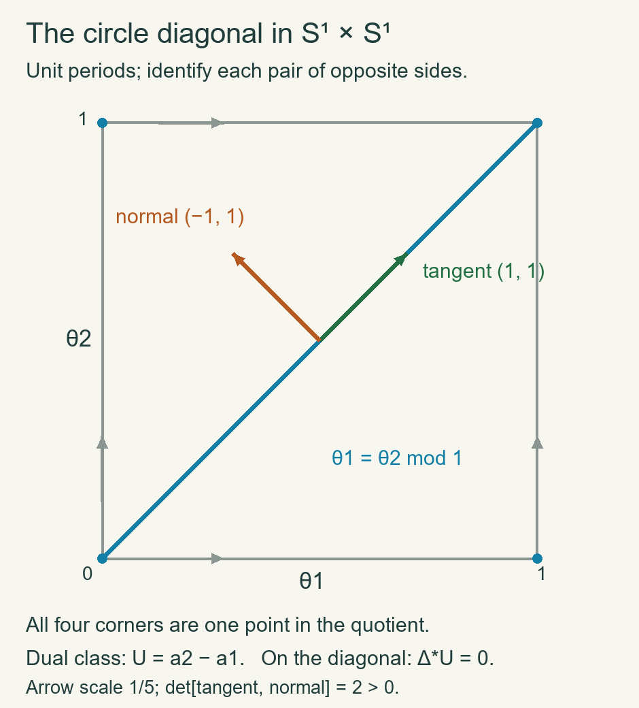

# Manifold duality, the diagonal and Wu classes

*Written by GPT-6.1 Sol (OpenAI), at Ultra, October 2026. Self-checked by the writing AI, GPT-6.1 Sol, at Ultra. Independently authored text dedicated under CC0.*

A manifold's tangent characteristic classes can be recovered from its cohomology and its cohomology operations. The bridge is the diagonal: its normal bundle is the tangent bundle, while its cohomology class is determined by the cup-product pairing. We prove the bridge, including the compact-support duality and tubular-neighbourhood foundations, and then derive the Euler characteristic and Wu formula.

Manifolds here are smooth, Hausdorff and second countable, without boundary unless stated. Dimension-zero orientation statements use the canonical point orientation and the established rank-zero Thom convention. The [Thom/Euler chapter](DG-CHAR-06.html) proves singular excision, Mayer–Vietoris, products, coefficient theorems and the Thom isomorphism. The [projective applications](DG-CHAR-02.html) and [Chern chapter](DG-CHAR-09.html) prove the mod-two and signed compact-set fundamental classes. The [squares chapter](DG-CHAR-05.html) proves the cochain operations, Cartan and the Thom definition of Stiefel–Whitney classes. These are the precise prerequisites used below.

## 1. Compact supports and the duality map

Fix a commutative coefficient ring \(R\). Use an orientation of \(M^d\) when \(R\ne\mathbb F _2\); for \(R=\mathbb F _2\) no orientation is required. The fundamental-class results just cited give a compatible class
\[
\mu_K\in H_d(M,M\setminus K;R)
\]
for every compact \(K\subset M\): it has the prescribed local orientation at every point of \(K\), and is uniquely determined by these local restrictions. With an orientation, this class is the coefficient image of the integer class. With mod-two coefficients it is the corresponding unsigned class. The compact-set construction works over \(R\) by the same proof: coordinate relative homology is \(R\) in top degree and zero above it; its Mayer–Vietoris gluing and local detection use only addition and subtraction. Thus uniqueness is being proved over the chosen ring, rather than inferred from an unsupported coefficient-change injection.

Define
\[
C_c^r(M;R)=\bigcup_{K\text{ compact}} C^r(M,M\setminus K;R),
\qquad H_c^r(M;R)=H^r(C_c^*(M;R)).
\tag{1.1}
\]
The condition on a cochain is that it vanish on every simplex contained in the complement of some compact set. It need not vanish on all large simplices. Coboundary preserves this condition. A cocycle and a cochain witnessing its being a coboundary each belong to one compact-support stage. Taking their union shows directly that
\[
H_c^r(M;R)=\underset{K}{\operatorname{colim}}H^r(M,M\setminus K;R).
\tag{1.2}
\]
These are filtered direct limits, not inverse limits. Excision identifies each stage with the corresponding stage in any open neighbourhood of \(K\). Thus an open inclusion \(U\subset M\) induces extension of supports \(H_c^r(U)\to H_c^r(M)\). If \(M\) is compact, its maximal support is \(M\), so \(H_c^r(M)=H^r(M)\).

Use the manuscript's right cap convention
\[
R_a\sigma=a(\sigma[d-r,\ldots,d])\sigma[0,\ldots,d-r]
\]
on a \(d\)-simplex. For a degree-\(r\) cochain on an \(m\)-simplex, boundary expansion gives the more general identity
\[
\partial R_a c=R_a\partial c+(-1)^{m-r}R_{\delta a}c.
\tag{1.3}
\]
The terms with a deleted vertex before the cut give the first summand, those after the cut give the coboundary summand, and their shared cut terms cancel. When \(a\) is a cocycle supported on \(K\) and \(c\) represents \(\mu_K\), the first summand vanishes because \(\partial c\) is outside \(K\). Hence \(R_a c\) is an absolute cycle. Changing \(c\) by a relative boundary or by an outside chain changes it by an absolute boundary or zero. If \(a\) changes by \(\delta b\), (1.3) gives a boundary, since \(R_b\partial c=0\). Compatibility of \(\mu_K\) makes the result independent of enlarging \(K\). We have a well-defined natural homomorphism
\[
D_M^r:H_c^r(M;R)\longrightarrow H_{d-r}(M;R),
\qquad [a]\longmapsto R_a\mu_K.
\tag{1.4}
\]
Naturality here is for open inclusions, extension of supports and ordinary homological inclusion. The cap evaluation identity is
\[
\langle b,D_M^r(a)\rangle=\langle b\smile a,[M]\rangle
\tag{1.5}
\]
when \(M\) is closed and \(|b|=d-r\). Its order follows from the actual front/back face formula.

## 2. The full Poincaré duality proof

**Lemma 2.1 — The compact-support gluing square.** If \(M=U\cup V\) is an open cover, cap maps identify the compact-support cohomology Mayer–Vietoris sequence with the ordinary homology Mayer–Vietoris sequence, reversing degrees. Give its middle vertical map the signs \((D_U,-D_V)\), matching the cohomological difference map with the homological sum map. Squares for the inclusion maps then commute; the square of connecting maps in cohomological degree \(r\) commutes up to the sign \((-1)^{d-r}\).

**Proof.** For compact \(K\subset U,L\subset V\), put \(A=M\setminus K\), \(B=M\setminus L\). On singular cochains the sequence
\[
0\to C^*(M,C_*(A)+C_*(B))\to C^*(M,A)\oplus C^*(M,B)
\xrightarrow{(a,b)\mapsto a-b} C^*(M,A\cap B)\to0
\tag{2.1}
\]
is degreewise split exact. In its first term the notation means cochains vanishing on both indicated chain groups. To split the last arrow, assign each simplex's value to the first cochain if that simplex is not contained in \(A\), and otherwise to the negative second cochain; a simplex in both \(A,B\) has value zero. Since \(A,B\) are open, small-chain excision identifies the first term's cohomology with that of the pair \((M,A\cup B)\). Thus (2.1) gives the sequence for supports \(K\cap L,K,L,K\cup L\). Excision places these terms respectively in \(U\cap V,U,V,M\).

The connecting square requires a chain check. Represent \(\mu_{K\cup L}\), after subdivision, as
\[
\alpha=x+y+z
\]
with \(x\) in \(U\setminus L\), \(y\) in \(U\cap V\), and \(z\) in \(V\setminus K\); these open sets cover \(M\). Then \(x+y\) represents \(\mu_K\), since its boundary is outside \(K\), and \(y\) represents \(\mu_{K\cap L}\). Their local values are the required ones, so uniqueness of compact-set fundamental classes proves these assertions.

Let a cocycle \(\phi\) with support \(K\cup L\) be written \(\phi=\phi_A-\phi_B\) by (2.1). Its connecting cocycle is \(\delta\phi_A=\delta\phi_B\), supported on \(K\cap L\) in the small-chain model. The homological Mayer–Vietoris boundary of \(R_\phi\alpha\) is represented by \(\partial R_\phi x\): take its \(U\) part to be \(R_\phi x\) and its \(V\) part to be \(R_\phi(y+z)\). Since \(\phi_B\) vanishes on \(x\), this boundary equals \(R_{\phi_A}\partial x\). Also \(R_{\phi_A}\partial(x+y)=0\), because that boundary is outside \(K\). It is therefore \(-R_{\phi_A}\partial y\). By (1.3), modulo boundaries in \(U\cap V\),
\[
R_{\delta\phi_A}y=(-1)^{d-r+1}R_{\phi_A}\partial y.
\]
The two connecting routes differ by exactly \((-1)^{d-r}\), as asserted. All calculations can be made after the same sufficiently fine subdivision; the proved small-chain homotopies identify them with the original classes.

Pass to the filtered limit over \(K,L\). Each compact subset of \(U\cap V\) lies in such an intersection, and each compact subset of \(M\) lies in such a union: use a finite subcover and compact shrinkings inside \(U,V\). Filtered limits preserve exactness, since an element in a kernel has its zero image at a later stage and then lifts there by stagewise exactness. This gives the stated diagram. The other squares follow directly from local fundamental-class compatibility. ∎

**Theorem 2.2 — Poincaré duality.** The map (1.4) is an isomorphism for every \(r\).

**Proof.** On \(\mathbb R^d\), closed balls are cofinal compact supports. The relative cohomology of a ball and its exterior is \(R\) in degree \(d\) and zero otherwise, by the sphere calculation and excision. Cap with a positively oriented \(d\)-simplex sends its degree-\(d\) evaluation cocycle to the first vertex, with coefficient one. Thus \(D\) is an isomorphism on \(\mathbb R^d\) and on any open ball or nonempty convex open subset homeomorphic to it.

If duality holds on \(U,V,U\cap V\), Lemma 2.1 and the five lemma prove it on their union; signs can be inserted in the vertical maps and do not change invertibility. If \(U_1\subset U_2\subset\cdots\) are open and cover \(M\), compact supports lie in some \(U_i\), and every finite singular cycle or bounding chain also lies in some \(U_i\). Hence both sides of (1.4) are their filtered direct limits and duality passes to the union.

An open subset of \(\mathbb R^d\) is a countable union of open balls with closures inside it. Every nonempty finite intersection is homeomorphic to \(\mathbb R^d\). To verify this detail, choose a point \(c\) in the intersection. The distance \(R_i(\theta)\) from \(c\) to the \(i\)-th ball's boundary in unit direction \(\theta\) is the positive root of \(\|c+t\theta-c_i\|^2=r_i^2\); its explicit quadratic formula is continuous and positive. The minimum \(R(\theta)\) of these finitely many roots is likewise continuous and positive. In polar coordinates the map \(c+t\theta\mapsto t\theta/(R(\theta)-t)\) is a homeomorphism onto \(\mathbb R^d\), with continuous inverse and the centre mapped to zero. Induction over finite unions, followed by the preceding limit argument, proves duality for every open subset of \(\mathbb R^d\). Finally cover \(M\) by countably many coordinate neighbourhoods. Intersections of any already formed union with a new chart are open subsets of that chart, so their duality is established. Finite-union induction and the countable-union argument now prove the theorem on \(M\). The empty space and \(d=0\) follow from the same definitions: a compact subset of a discrete manifold is finite and the cap map is the identity on its point coefficients. ∎

**Corollary 2.3 — Finite generation and perfect pairings.** A closed oriented manifold has finitely generated integer homology, zero above its dimension. Over a field \(F\), with the stated orientation or \(F=\mathbb F _2\), the pairing
\[
H^r(M;F)\times H^{d-r}(M;F)\to F,
\qquad (a,b)\mapsto\langle a\smile b,[M]\rangle
\tag{2.2}
\]
is perfect.

**Proof.** Write the ordinary fundamental class as a finite singular cycle \(c\). For each \(r\), every cap \(R_a c\) lies in the finite free subgroup of chains generated by the front \((d-r)\)-faces of the finitely many simplices of \(c\). Its subgroup of cycles is finitely generated over \(\mathbb Z\): a subgroup of a finite-rank free abelian group is free of rank at most that rank, as proved in the coefficient chapter. Duality says these caps represent every homology class. Thus homology is a quotient of this finitely generated cycle subgroup. Over a field the same argument gives finite dimension. Duality in negative cohomological degrees gives the vanishing above \(d\).

Field cohomology is the linear dual of homology by the proved coefficient theorem. Apply this and (1.5) to the duality isomorphism. It makes (2.2) nondegenerate, and finite dimension makes the induced maps to dual spaces isomorphisms. Graded commutativity accounts for changing the order of its two factors. ∎

Define \(\chi(M)=\sum_r(-1)^r\operatorname{rank}H_r(M;\mathbb Z)\) when these groups are finitely generated and vanish in sufficiently large degrees. It equals the alternating sum of dimensions over every coefficient field. Indeed split the finitely generated integer groups into free and finite cyclic summands. Coefficient change gives each free generator once; a torsion summand visible in the chosen characteristic contributes in two consecutive homological degrees through tensor and Tor, so cancels in the alternating sum. In characteristic zero no torsion contributes. The tensor/Tor coefficient sequence follows from the same split cycle-boundary free presentation used for the already proved cohomology coefficient theorem: tensor its two-term free resolution. The elementary two-term resolution of \(\mathbb Z/q\) is multiplication by \(q\), yielding the claimed two adjacent contributions. For nonorientable closed manifolds the finite-generation premise is proved in Section 3 below.

## 3. Tubular neighbourhoods, with the analytic prerequisites

We need a tubular neighbourhood in a smooth ambient manifold \(A\), not an unexplained appeal to a geodesic construction. The following elementary analytic facts supply one.

**Lemma 3.1 — Local inverse and local flows.** A smooth map between open Euclidean sets with invertible derivative at a point has a smooth inverse on neighbourhoods of that point. A smooth finite-dimensional vector field has a unique local flow, smooth in time and its initial point.

**Proof.** For the inverse assertion translate the point to zero and let its derivative be the invertible matrix \(B\). On a sufficiently small closed ball, continuity of the derivative gives \(\|I-B^{-1}DF\|\leq1/2\). Solving \(F(x)=y\) is the fixed-point problem \(x=x+B^{-1}(y-F(x))\). For \(y\) sufficiently close to \(F(0)\), this map preserves the ball and contracts distances by \(1/2\). Its iterates converge uniformly, since successive distances form a geometric series; completeness gives a unique solution. The same estimate bounds inverse differences by \(2\|B^{-1}\|\|y-y'\|\), so the inverse is continuous. Inserting this bound into the differentiability remainder for \(F\) proves its derivative is \(DF(x)^{-1}\). This derivative is continuous. Repeated differentiation of the inverse identity proves smoothness, inductively using smoothness of matrix inversion where its determinant is nonzero. Shrinking the open ball and its image provides the stated neighbourhoods.

For a smooth field \(G\), restrict to a coordinate ball where \(\|G\|\leq C\) and \(\|DG\|\leq L\). Choose \(T>0\) with \(TC\) smaller than the available margin and \(TL<1/2\). On continuous paths staying in that ball, the map
\[
x(t)\longmapsto x_0+\int_0^tG(x(s))\,ds
\]
preserves the closed path ball and is a contraction in the supremum norm. This path space is complete: a uniformly Cauchy sequence has a pointwise Euclidean limit, uniform convergence makes the limit continuous, and closedness of the coordinate ball keeps its values in the ball. The contraction iterates converge and give the unique solution there. Any other solution with the same initial point remains in the ball on a sufficiently small time interval by continuity, so this local uniqueness applies to it. Repeating at each point where two solutions agree shows that their equality set is open as well as closed in their common time interval; they therefore agree throughout that interval. The same geometric estimate proves continuity in \(x_0\). The derivative in \(x_0\) solves the linear integral equation
\[
J(t)=I+\int_0^t DG(x(s))J(s)\,ds.
\]
Its integral operator has norm at most \(TL<1/2\), so the Neumann series gives a unique continuous solution. Subtracting the equations for neighbouring initial points, dividing by their difference, and using the uniform differentiability remainder of \(G\) proves convergence of difference quotients to this solution. The same argument with parameters proves continuous derivatives. Each higher derivative satisfies this same linear equation with an inhomogeneous term formed from already obtained lower derivatives and derivatives of \(G\); induction gives all derivatives. Time differentiability follows from the differential equation itself. Uniqueness lets these coordinate solutions agree on overlaps and continue along any already existing compact time interval. This proves the smooth local-flow assertion. ∎

Choose a smooth partition of unity \(\theta_i\) subordinate to coordinate charts of \(A\), using the smooth bump construction in the bundle chapter. On \(TA\) above one chart let \(S_i\) be the vector field whose coordinate equations are \(\dot x=v,\dot v=0\). Set \(S=\sum_i\theta_i(x)S_i\). This locally finite sum is a globally smooth field on \(TA\). Its projection to \(A\) is \(v\). In any chart its acceleration is quadratic in \(v\): under a coordinate change \(h\), a straight path has acceleration \(D^2h(v,v)\). In particular \(S(x,0)=0\), and its linearization there is \(\dot a=b,\dot b=0\).

Lemma 3.1 gives its flow to time one on a neighbourhood of every \((x,0)\): the zero trajectory exists for the whole compact interval, and finitely many local existence intervals extend nearby trajectories along it. Let \(L(x,v)\) be the base point at time one. Then
\[
L(x,0)=x,\qquad DL_{(x,0)}(a,b)=a+b.
\tag{3.1}
\]
This is a smooth local addition, constructed without any connection or geodesic theorem.

**Theorem 3.2 — Tubular neighbourhood.** If \(M\subset A\) is a smooth embedded submanifold, its normal quotient bundle \(\nu=TA|_M/TM\) has a neighbourhood of its zero section diffeomorphic to an open neighbourhood of \(M\) in \(A\), fixing \(M\). The whole bundle is diffeomorphic to such a neighbourhood by a radial fibre change. If \(M\) is closed as a subset of \(A\), excision also identifies the pairs' cohomology
\[
H^*(A,A\setminus M;R)\cong H^*(\nu,\nu\setminus M;R).
\tag{3.2}
\]

**Proof.** First reduce the tubular assertion to a closed embedding. Local submanifold charts make \(M\) locally closed: near each of its points, it is the zero set of the normal coordinates. Hence every point of \(M\) has a neighbourhood disjoint from \(C=\overline M\setminus M\). Points outside \(\overline M\) do also. Thus \(C\) is closed in \(A\), and \(A'=A\setminus C\) is open with \(M\) closed in it. The normal quotient in \(A'\) is the same as in \(A\), and an open tube in \(A'\) is open in \(A\). We can therefore assume \(M\) closed for the construction. The relative-cohomology assertion (3.2) is asserted for the original ambient space only when its embedding is closed.

A smooth metric identifies \(\nu\) with the orthogonal complement of \(TM\), by the proved complement theorem. Restrict \(L\) to this complement. At a zero vector its derivative sends \((a,b)\in T_xM\oplus\nu_x\) to \(a+b\in T_xA\), an isomorphism. Lemma 3.1 makes it a local diffeomorphism near each zero vector.

Here is the global injectivity detail, including a noncompact base. A second-countable manifold has a compact exhaustion: take a countable relatively compact chart cover and successively enlarge finite unions of their closures to lie inside the interiors of the next such unions. Smooth bumps equal to one on each compact stage and supported in the next produce a nonnegative proper smooth function \(h\): if \(\psi_j=1\) on stage \(j\) and is supported in stage \(j+1\), the locally finite sum \(\sum_j(1-\psi_j)\) is bounded on compact stages and tends to infinity off them. Its sublevel sets are compact. Put \(K_j=M\cap\{h\leq j\}\), compact because \(M\) is closed.

For each \(K_j\) there is a radius \(\epsilon_j>0\) such that \(L\) is defined and locally invertible on all normal vectors over \(K_j\) of smaller norm, satisfies \(|h(L(x,v))-h(x)|<1/2\), and is injective between any two such vectors. For the last claim, if no radius worked, two distinct vectors of norms tending to zero would have equal images and bases in \(K_j\). Pass to convergent base subsequences. Their images tend to the bases, so both limiting bases agree. The local inverse at that common zero vector contradicts the equality for sufficiently late terms. The other claims follow from compactness and continuity. Take these radii positive and decreasing in \(j\).

Choose a continuous positive function \(g(t)\), \(t\geq0\), by interpolating between \(\epsilon_{j+4}/2\) at successive integers, and choose a smooth positive \(\rho(x)<g(h(x))\) on \(M\). Such a minorant follows by a smooth locally finite chart partition and constants smaller than the positive lower bound of \(g\circ h\) on each chart closure. The normal disk domain \(\|v\|<\rho(x)\) is contained in the local-diffeomorphism domain. If two of its points have the same image, their base heights differ by less than one. With \(j\) the ceiling of the larger height, both bases lie in \(K_j\), and both norms are smaller than \(\epsilon_j\) by the decreasing-radius choice and the four-stage margin. The compact-stage injectivity then makes them equal. Thus \(L\) is an injective local diffeomorphism on this domain and has a smooth inverse on its open image.

The fibre map \(v\mapsto\rho(x)v/\sqrt{1+\|v\|^2}\) is a diffeomorphism from the whole normal bundle onto that domain, with inverse \(w\mapsto w/\sqrt{\rho(x)^2-\|w\|^2}\). It fixes the zero section. The resulting open neighbourhood and \(A\setminus M\) cover \(A\); excision for this cover proves (3.2). In codimension zero \(M\) is open and closed, and the statement reduces to its identity neighbourhood. ∎

The orientation of \(TM\) agrees with the local-homology orientation used above. In an oriented coordinate chart this is the positive coordinate generator. If a transition has derivative \(B\) at a point, the rescaled maps \(h_t(v)=(h(tv)-h(0))/t\) extend at \(t=0\) to \(Bv\), uniformly on a small sphere; invertibility makes them avoid zero there. Hence their local degree is \(\operatorname{sign}\det B\), by the linear determinant calculation in the Thom chapter. This proves compatibility, including its change on opposite orientations.

**Lemma 3.3 — Compact Euclidean embedding and finite domination.** Every compact smooth manifold embeds smoothly in some finite Euclidean space and is a retract of a neighbourhood there. Its integer homology is finitely generated and vanishes in sufficiently large degrees, whether or not it is oriented.

**Proof.** Take finitely many coordinate maps \(f_i:U_i\to\mathbb R^d\) and smooth functions \(\phi_i\geq0\) supported inside \(U_i\), positive on sets covering \(M\). Define the Euclidean map with blocks \((\phi_i,\phi_i f_i)\), extending the second component by zero. These extensions are smooth because their supports are inside the charts. If two points have the same image, a block positive at the first is positive at the second, and division by its common first coordinate gives identical chart coordinates; the points agree. If its derivative vanishes on a tangent vector, a positive block gives first \(d\phi_i=0\), then \(\phi_i df_i=0\), so the vector is zero. Thus it is an injective immersion; compactness makes it a homeomorphism onto its image. The local inverse lemma, applied to any full-rank coordinate projection of its derivative, shows its image is an embedded submanifold.

In Euclidean space the normal map is simply \((x,v)\mapsto x+v\). Its derivative at zero is the tangent/normal direct-sum isomorphism. The compact version of the injectivity argument in Theorem 3.2 gives a tubular neighbourhood \(N\), and projection along its normal fibres is a retraction \(r:N\to M\). Choose a sufficiently fine finite grid of closed Euclidean cubes meeting \(M\). Their union \(P\) lies inside \(N\), since the distance from compact \(M\) to the closed complement of \(N\) is positive. Include all faces, so \(P\) is a finite cubical CW complex. Inclusion and retraction give \(M\to P\to M\) with composite identity. Thus homology of \(M\) is a direct summand of homology of \(P\). The finite cellular complex, proved from relative cells in the Schubert chapter, has finitely generated integer groups in finitely many degrees. Its homology and their summands have the same finiteness properties. This proves the claim. ∎

Together with the coefficient calculation following Corollary 2.3, this proves coefficient independence of \(\chi\) for every closed manifold. No triangulation of \(M\) was assumed.

## 4. A submanifold's dual class and the diagonal

For a closed embedded codimension-\(k\) submanifold \(j:M\hookrightarrow A\), the Thom class of its normal bundle transfers by (3.2) to
\[
u_M\in H^k(A,A\setminus M;R).
\]
Use mod-two coefficients without an orientation, or an orientation of the normal bundle with any \(R\). Its image in \(H^k(A;R)\) is the **dual cohomology class** \(U_M\). Restriction back to \(M\) is the Euler class of the normal bundle, or its top Stiefel–Whitney class modulo two: restriction corresponds under the tube to zero-section pullback of the Thom class. This proves the self-intersection formula directly from the Euler definition.

If \(A^D,M^{D-k}\) are closed and oriented, orient the normal bundle by the convention that a positive tangent basis of \(M\), followed by a positive normal basis, is positive in \(A\). In codimension zero take \(j\) to preserve the given orientations, consistently with the rank-zero convention. Then for \(z\in H^{D-k}(A;R)\),
\[
\langle z\smile U_M,[A]\rangle=\langle j^*z,[M]\rangle.
\tag{4.1}
\]
The same formula holds without signs over \(\mathbb F _2\).

**Proof of (4.1).** Subdivide a fundamental cycle of \(A\) for the tube/complement cover. Cap with a relative cocycle representing \(u_M\) kills the complement pieces and gives a cycle in the tube. Project it to \(M\). In a local tangent/normal coordinate product, the ambient local generator is the product of the positive tangent generator and positive normal generator, in that order. The Thom cap calculation of the Thom chapter sends this product to the tangent generator: its normal-factor evaluation is one. Thus the projected cycle has the required local value at every point of \(M\). Local fundamental-class detection makes its class \([M]\). The cap evaluation identity says its evaluation by \(j^*z\) is the left side of (4.1), because the tube retracts onto \(M\). ∎

For example, a positive-codimension submanifold embedded as a closed subset of Euclidean space has zero dual class in that ambient space. Therefore its normal top Stiefel–Whitney class, and oriented normal Euler class if defined, vanish. Closedness and embeddedness are part of this assertion; an immersion supplies no such ambient relative Thom class.

Now take a closed \(d\)-manifold \(M\) and its diagonal \(\Delta:M\hookrightarrow M\times M\). With a product metric its tangent space is \(\{(v,v)\}\) and its normal space is \(\{(-v,v)\}\). Hence
\[
TM\cong\nu_\Delta,\qquad v\longmapsto(-v,v).
\tag{4.2}
\]

*Figure 1. This is the diagonal of \(S^1\) in \(S^1\times S^1\), represented in unit period coordinates. The two arrows are scaled by \(1/5\); their unscaled ordered determinant is \(2>0\). All four square vertices are the same diagonal point in the quotient. The positive dual class is \(a_2-a_1\), and its diagonal pullback is zero, as proved in Theorem 4.1 and Exercise 6.4. The diagram represents this one-dimensional example; it is not a picture of a higher-dimensional diagonal. Independently drawn from the coordinate formulas, with editable code, SVG and exact data retained.*

For an oriented \(M\), give this normal bundle the tangent orientation via (4.2). The tangent-first/normal-second matrix is
\(\begin{pmatrix}I&-I\\I&I\end{pmatrix}\), with determinant \(2^d>0\), so it agrees with the orientation convention in (4.1). Let \(u\) be its relative Thom class and \(U\) its absolute image, the **diagonal class**. We have
\[
\Delta^*U=e(TM),\qquad
\langle z\smile U,[M\times M]\rangle=\langle\Delta^*z,[M]\rangle.
\tag{4.3}
\]
Modulo two the first equality is \(\Delta^*U=w_d(TM)\).

These signs can also be checked on a transverse fibre. The diagonal tube may be built using the local addition on \(M\) as
\((x,v)\mapsto(L(x,-v),L(x,v))\). Its derivative has exactly the tangent/normal blocks above; the compact injectivity argument makes it a tube after shrinking the radius. For fixed \(x\), the maps
\[
v\longmapsto(L(x,-tv),L(x,v)),\quad 0\leq t\leq1,
\]
stay off the diagonal when \(v\ne0\) is sufficiently small. Indeed the fibre map \(L(x,-)\) is locally injective, and \(-tv\ne v\). At \(t=0\) this is the slice \(y\mapsto(x,y)\). Thus its Thom pullback is the positive local cohomology generator of \(M\) at \(x\), with no hidden sign.

The projections \(p_1,p_2\) are homotopic on the tube since they agree on its deformation retract, the diagonal. Relative multiplication and excision therefore give
\[
(a\times1)\smile U=(1\times a)\smile U
\tag{4.4}
\]
for every \(a\in H^*(M;R)\).

**Theorem 4.1 — The signed diagonal formula.** Work over a field \(F\), with \(M\) oriented or with \(F=\mathbb F _2\). Choose a homogeneous basis \(b_i\) of \(H^*(M;F)\), and its cup-dual basis \(b_i^\vee\) satisfying
\[
\langle b_i\smile b_j^\vee,[M]\rangle=\delta_{ij}.
\]
Then
\[
U=\sum_i(-1)^{|b_i|}\,b_i\times b_i^\vee.
\tag{4.5}
\]

**Proof.** Corollary 2.3 gives the finite dual basis. The singular-chain product equivalence already proved in the Thom chapter, together with vector-space splittings into homology and contractible boundary pairs, gives
\(H^*(M\times M;F)=H^*(M;F)\otimes H^*(M;F)\).
Finite dimension permits dualizing these tensor products in each degree. Its external-product multiplication is
\[
(a\times b)\smile(c\times e)=(-1)^{|b||c|}(a\smile c)\times(b\smile e),
\]
by the proved graded commutativity. The product fundamental class is \([M]\times[M]\): its local coordinate product values agree with the orientation of \(M\times M\), hence local detection identifies the classes.

Test the right side of (4.5) against \(a\times b\) of total degree \(d\). A term contributes only when \(|b_i|=|b|\). Its multiplication sign is then \((-1)^{|b|^2}=(-1)^{|b_i|}\), cancelling the coefficient in (4.5). The result is
\[
\sum_i\langle a\smile b_i,[M]\rangle\langle b\smile b_i^\vee,[M]\rangle
=\langle a\smile b,[M]\rangle,
\]
since the second evaluations are precisely the coefficients of \(b\) in its basis. By (4.3) this is also the test against \(U\). External products span \(H^d(M\times M;F)\), and its pairing with itself is perfect by duality on the product. The two degree-\(d\) classes must therefore agree. ∎

Define slant with the second fundamental class by
\[
(a\times b)/[M]=a\langle b,[M]\rangle,
\tag{4.6}
\]
with evaluation zero unless \(|b|=d\). The product decomposition makes this a well-defined operation. It is left linear over first-factor cohomology. Formula (4.5), or the positive slice computation, gives \(U/[M]=1\). For disconnected \(M\), each degree-zero component idempotent has its corresponding component top class as dual; their sum is the unit. Thus the statement includes disconnected manifolds.

**Corollary 4.2 — Euler number and Euler characteristic.** For a closed oriented manifold,
\[
\langle e(TM),[M]\rangle=\chi(M).
\tag{4.7}
\]
For every closed manifold,
\[
\langle w_d(TM),[M]_2\rangle\equiv\chi(M)\pmod2.
\tag{4.8}
\]

**Proof.** Apply \(\Delta^*\) to (4.5), then evaluate. Each dual-basis pair evaluates to one, so the result is \(\sum_i(-1)^{|b_i|}\), the alternating sum of Betti numbers. Over \(\mathbb Q\), this is \(\chi(M)\) by its established coefficient independence. The integer Euler evaluation has that same value upon passing to \(\mathbb Q\), proving (4.7). Over \(\mathbb F _2\) all signs disappear and coefficient independence gives (4.8). In dimension zero the rank-zero Euler class is one and the fundamental class has the orientation signs of the points; the Euler evaluation counts each point positively because its tangent zero-plane has its canonical orientation. We take this canonical orientation for the tangent Euler class and its associated fundamental class. ∎

## 5. Wu's formula and homotopy invariance

All coefficients in this section are \(\mathbb F _2\); \(M^d\) is closed and no orientation is needed. Perfect duality defines a unique class \(v_i\in H^i(M;\mathbb F _2)\) by
\[
\langle v_i\smile x,[M]_2\rangle=\langle Sq^i x,[M]_2\rangle,
\qquad x\in H^{d-i}(M;\mathbb F _2).
\tag{5.1}
\]
Their sum \(v=1+v_1+\cdots+v_d\) is the **Wu class**. Here \(v_0=1\), since \(Sq^0\) is the identity. Instability gives \(v_i=0\) for \(i>d/2\): in that range \(i>d-i\), so the functional on the right is zero. These are tangent-manifold classes defined using its pairing and operations, not a second arbitrary bundle construction.

**Theorem 5.1 — Wu's formula.**
\[
w(TM)=Sq(v),\qquad w_k(TM)=\sum_{i+j=k}Sq^i(v_j).
\tag{5.2}
\]

**Proof.** On the diagonal tube, the Thom definition and (4.2) give
\[
Sq(u)=p_1^*w(TM)\smile u.
\]
Indeed the tubular retraction identifies either projection with the bundle base; relative multiplication transfers by excision, and naturality of the proved squares applies to this pair. Passing to the absolute group yields
\(Sq(U)=(w(TM)\times1)\smile U\).
Slant with the second fundamental class and \(U/[M]=1\) therefore give
\[
Sq(U)/[M]=w(TM).
\tag{5.3}
\]

Take the dual basis from Theorem 4.1, now without signs. Equation (5.1) says precisely
\[
v=\sum_i b_i\langle Sq(b_i^\vee),[M]_2\rangle:
\]
the coefficient of a basis element of degree \(j\) is the evaluation of \(Sq^j\) of its degree-\((d-j)\) dual. Additivity and external Cartan give
\[
Sq(v)=\sum_i Sq(b_i)\langle Sq(b_i^\vee),[M]_2\rangle
=Sq\Bigl(\sum_i b_i\times b_i^\vee\Bigr)/[M]
=Sq(U)/[M].
\]
Together with (5.3), this proves (5.2). Every sum is finite after restricting to the finite-dimensional cohomology of the manifold; no power-series convergence or unproved Adem relation enters. ∎

For an oriented four-manifold, \(w_1=0\), hence \(v_1=0\) by the degree-one part of (5.2). Its degree-two part gives \(w_2=v_2\), since the only other possible term is \(Sq^1v_1=v_1^2\). Thus
\[
\langle w_2\smile x,[M]_2\rangle=\langle x^2,[M]_2\rangle,
\qquad x\in H^2(M;\mathbb F _2).
\tag{5.4}
\]
The degree-two tangent class is the characteristic element of the mod-two middle cup pairing.

**Corollary 5.2.** A homotopy equivalence of closed \(d\)-manifolds carries their Stiefel–Whitney classes to each other, and preserves all their Stiefel–Whitney numbers.

**Proof.** Such an equivalence permutes components and induces an isomorphism in top mod-two homology on each. Each component's fundamental class is the unique nonzero element of that group, so the sum fundamental class is carried to the sum fundamental class. Its cohomology map preserves cup products, and the squares are natural by their cochain construction. Equation (5.1) and perfect pairing therefore imply that it carries the Wu classes to each other. Apply (5.2) to obtain the same assertion for \(w\). Every characteristic number is evaluation of a degree-\(d\) product of the \(w_i\) on the fundamental class, so it too is preserved. The argument needs the cohomology operations as well as the ring. ∎

**Proposition 5.3 — A ring with one generator.** If
\[
H^*(M;\mathbb F _2)=\mathbb F _2[a]/(a^{m+1}),\qquad |a|=k>0,
\]
then \(d=km\), \(\langle a^m,[M]_2\rangle=1\), and
\[
v=\sum_{j=0}^{\lfloor m/2\rfloor}\binom{m-j}{j}a^j,
\qquad w(TM)=(1+a)^{m+1}\pmod{a^{m+1}}.
\tag{5.5}
\]
The binomial coefficients in this equation are reduced modulo two.

**Proof.** The top nonzero cohomology degree is \(km\), which equals \(d\) by duality, and its nonzero element has evaluation one. Only degrees divisible by \(k\) occur. Instability and the top-square rule therefore imply \(Sq(a)=a+a^2\): there is no possible intermediate-degree component. Cartan gives \(Sq(a^s)=a^s(1+a)^s\). Evaluation of \(Sq^{kj}(a^{m-j})\) is \(\binom{m-j}{j}\), giving the Wu formula in (5.5).

For completeness, let \(F_m(z)=\sum_j\binom{m-j}{j}z^j\) over \(\mathbb F _2\). Pascal's identity gives \(F_m=F_{m-1}+zF_{m-2}\), with \(F_0=F_1=1\). After substituting \(z=a(1+a)\), the polynomials
\(G_m=(1+a)^{m+1}+a^{m+1}\) satisfy exactly this recurrence and these initial values: both \(a\) and \(1+a\) satisfy \(r^2=r+a(1+a)\). Induction gives \(F_m(a(1+a))=G_m\). Thus \(Sq(v)=G_m\), and its final term \(a^{m+1}\) vanishes in the stated ring. Theorem 5.1 proves the assertion for \(w\). ∎

## 6. Exercises with solutions

**Exercise 6.1 — Easy.** Derive the hairy ball theorem from the Euler number, and treat odd-dimensional spheres.

**Solution.** For \(S^n\), \(n\geq1\), the sphere homology calculation gives \(\chi=1+(-1)^n\). In even positive dimension the Euler evaluation is two by Corollary 4.2, so \(e(TS^n)\ne0\). A nowhere-zero vector field would make it zero by the proved Euler-section property, a contradiction. For odd \(n=2r+1\), view the sphere as the unit sphere in \(\mathbb C^{r+1}\); the field \(x\mapsto ix\) is tangent, has unit norm, and never vanishes. This both provides existence and is consistent with its zero Euler number.

**Exercise 6.2 — Medium.** Prove homotopy invariance of Stiefel–Whitney numbers. Explain why a cup-ring isomorphism alone was not the hypothesis of the proof.

**Solution.** A homotopy equivalence preserves the sum of mod-two fundamental classes and commutes with every \(Sq^i\). Substituting these two facts in (5.1) gives equality of the pulled-back Wu class with the source Wu class by uniqueness in its perfect pairing. Formula (5.2) then identifies the tangent \(w_i\). Pullback preserves their products, and fundamental-class naturality preserves the evaluation, hence every number. A ring isomorphism without compatibility with squares would not carry the right-hand functional in (5.1) to the other one, so the argument makes no such claim.

**Exercise 6.3 — Medium.** Compute the Wu class of \(\mathbb {CP}^2\), verify the tangent total class, and interpret its \(w_2\).

**Solution.** Let \(x\in H^2(\mathbb {CP}^2;\mathbb F _2)\) be the reduced positive hyperplane generator; \(x^2[M]=1\). The functional \(x\mapsto Sq^2x=x^2\) makes \(v_2=x\). Odd cohomology is zero, and instability gives \(v_i=0\) for \(i>2\), so \(v=1+x\). Therefore \(Sq(v)=1+x+x^2\). This agrees with reduction of \(c(T\mathbb {CP}^2)=(1+x)^3\) from the Chern chapter. Its \(w_2=x\) is exactly the characteristic element of the one-dimensional middle pairing, as (5.4) states. Its top Stiefel–Whitney number is one, the parity of \(\chi=3\).

**Exercise 6.4 — Hard.** Prove the signed diagonal formula, then compute it for the circle and \(\mathbb {CP}^2\).

**Solution.** Give the diagonal normal bundle the tangent orientation under \(v\mapsto(-v,v)\); its tangent-first determinant is \(2^d>0\). The dual-class cap calculation proves (4.3). Expanding in external-product bases, testing against \(a\times b\), and cancelling \((-1)^{|b||b_i|}\) with \((-1)^{|b_i|}\) in each contributing term proves (4.5) by perfect pairing. For an oriented circle, let \(a[S^1]=1\). The basis \(1,a\) has dual \(a,1\), so
\[
U=1\times a-a\times1.
\]
Restriction to the diagonal is zero, agreeing with \(e(TS^1)=0\). For \(\mathbb {CP}^2\), the basis \(1,x,x^2\) has dual \(x^2,x,1\); all degrees are even, and
\[
U=1\times x^2+x\times x+x^2\times1.
\]
Its restriction is \(3x^2\), whose integer evaluation is three. The displayed integer formula is justified here as well: the projective homology is free, its integral product basis was proved in the Chern chapter, and the same tests distinguish every integral coefficient. No general torsion-sensitive integral tensor decomposition was assumed.

**Exercise 6.5 — Medium.** Suppose a positive-codimension submanifold is embedded as a closed subset of Euclidean space. Prove its normal top class vanishes and identify the hypothesis that would fail for an arbitrary immersion.

**Solution.** Its tubular Thom class gives an ambient dual class in \(H^k(\mathbb R^N;R)=0\), \(k>0\), since Euclidean space is contractible. Restriction of that zero class is the normal Euler class if the normal bundle is oriented, and the normal top Stiefel–Whitney class otherwise with mod-two coefficients. A general immersion has self-intersections; it does not identify a tubular neighbourhood of its normal bundle with a neighbourhood of a single embedded subset. Thus this particular relative-pair/excision proof does not apply to it.

**Exercise 6.6 — Medium.** Prove the one-generator formula and compute \(v\) and \(w\) for \(\mathbb {RP}^4\).

**Solution.** Instability and the ring's missing intermediate degrees give \(Sq(a)=a+a^2\); Cartan gives the binomial coefficients on powers. The degree-\(kj\) Wu coefficient is \(\binom{m-j}{j}\) by evaluation on \(a^{m-j}\). To simplify its total square, Pascal's recurrence for \(F_m\) and the two roots \(a,1+a\) give \(Sq(v)=(1+a)^{m+1}+a^{m+1}\), as fully proved in Proposition 5.3. The last term is zero in the ring. On \(\mathbb {RP}^4\), \(m=4,k=1\), so \(v=1+a+a^2\). Its square is \(1+(a+a^2)+(a^2+a^4)=1+a+a^4\), agreeing with \((1+a)^5\) truncated at \(a^5=0\).

## Sources and scope

Freely accessible proof comparisons for this pass are Allen Hatcher, [*Algebraic Topology*, Section 3.3](https://pi.math.cornell.edu/~hatcher/AT/AT.pdf), especially Theorem 3.35 and Lemma 3.36, and the native Wikiversity [Picard–Lindelöf proof, revision 1111500](https://de.wikiversity.org/w/index.php?title=Picard_Lindel%C3%B6f/Lokal_Lipschitz/Lokale_Existenz_und_Eindeutigkeit/Fakt/Beweis&oldid=1111500). The former uses a front-evaluation cap convention; our right cap and its connecting sign are proved above. The latter supplies the contraction argument for local existence and uniqueness; the differentiability in initial points is proved here as well. The exact English [D50 edition](https://github.com/KokunoYumeto/brenner-differentialgeometrie-en), translated from Holger Brenner and the Wikiversity contributors, supplies the compact-exhaustion and locally finite partition proofs in Lecture 22. Its source regularity notes are retained in our comparison records, and the present chapter consistently assumes smooth fields. Haynes Miller's [*Lectures on Algebraic Topology II*, Exercise 39.11](https://ocw.mit.edu/courses/18-906-algebraic-topology-ii-spring-2020/e8a061a73ca1a451df8809c7a7fbc846_MIT18_906S20_notes.pdf) states the Wu identity without a solution; the complete diagonal proof and all six solutions above were checked directly.

Corollary 5.2 and Exercise 6.2 prove the homotopy-invariance calculation. Proposition 5.3 and Exercise 6.6 prove the one-generator formula. The tubular, diagonal, Euler-characteristic and Wu arguments are supplied in Sections 1–5, using the complete earlier Thom and fundamental-class proofs.

The cap convention is the manuscript's unshifted right cap. Orientation and coefficient conditions are explicit; integer and mod-two fundamental classes have their complete earlier proofs. We supply the inverse/flow and noncompact tubular arguments, the compact-support connecting square, finite Euclidean domination, and the product proof needed for the diagonal. Dimension-zero statements use the canonical point orientation and rank-zero Thom convention. This version records only the writing AI's check; independent review is separate. The complete assigned teaching and proof prerequisites are now supplied across the course.
