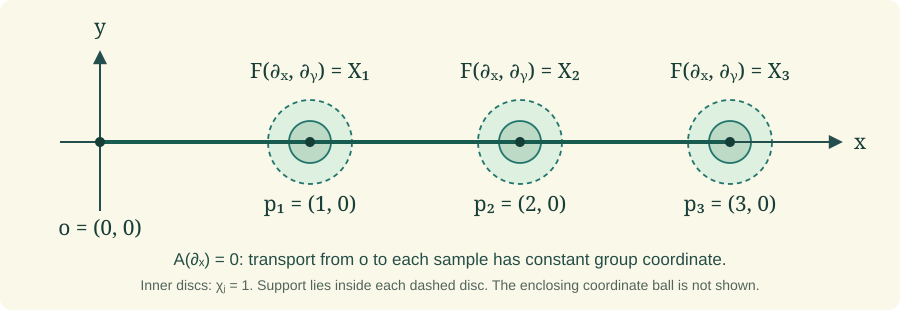

# Reduction and the holonomy theorem

Holonomy determines the frames reachable by horizontal transport and the associated objects that can remain parallel. We construct the reduction with its intrinsic topology, prove the fixed-point description for arbitrary smooth associated fibres, and derive how connections behave under bundle changes and path variations. A compactly supported local construction then realizes every connected reduction group as full and restricted holonomy.

Read the complete earlier programme proofs in [Curvature and holonomy groups](curvature-and-holonomy-groups.md), [Connections and parallel transport](connections-and-parallel-transport.md), [Principal bundles and associated bundles](principal-bundles-and-associated-bundles.md), and [Local tools for bundles and transport](local-tools-for-bundles-and-transport.md). Each external source below is an exact freely accessible human construction source; every used result is proved here or in an exact earlier programme proof.

## A. Reachable frames and parallel objects

Let \(P\to M\) be a smooth principal right \(G\)-bundle with connection form \(\omega\) and curvature \(\Omega\). The base is connected, finite dimensional, Hausdorff and second countable. Paths are finitely piecewise \(C^1\), with the endpoint regularity fixed in **Curvature and holonomy groups**, Part C. Write **Curv** for that lesson, **Conn** for **Connections and parallel transport**, and **PB** for **Principal bundles and associated bundles**. Their exact proofs are earlier programme proofs, not external references.

Fix \(u\in P_x\). Write \(T_c\) for principal transport along \(c\), and set
\[
H=\operatorname{Hol}_u,\qquad H^0=\operatorname{Hol}^0_u,
\qquad Q=\{T_cu:c(0)=x\}.
\tag{A.1}
\]
The Lie-group topology on \(H\) is the intrinsic immersed topology proved in Curv C.5. It is not assumed to be its subspace topology in \(G\).

**Theorem A.1 (the connected holonomy reduction).** The reachable set \(Q\) has a connected, Hausdorff, second-countable smooth principal \(H\)-bundle structure over \(M\). The inclusion \(j:Q\to P\) is an injective immersion, and \(j^*\omega\) is an \(\mathfrak h\)-valued principal connection with the same horizontal lifts. Its horizontal spaces are exactly the original horizontal spaces at points of \(Q\).

**Proof.** Apply the complete immersed-reduction proof Curv G.4. Its charts are constructed by choosing a fixed path from \(x\) to the centre of each convex coordinate ball \(U_i\), transporting \(u\) along that path, and then transporting along radial segments. If \(\sigma_i(y)\) is the resulting smooth section, the charts are
\[
U_i\times H\longrightarrow Q|_{U_i},\qquad
(y,h)\longmapsto\sigma_i(y)h.
\tag{A.2}
\]
Curv G.4 proves that their transition functions are smooth into the intrinsic group \(H\), that they define a Hausdorff second-countable total space, and that the inclusion is an injective immersion. In these same charts it proves that \(a_i=\sigma_i^*\omega\) is \(\mathfrak h\)-valued and that the restricted connection is
\[
\operatorname{Ad}(h^{-1})a_i+\vartheta_H^L.
\tag{A.3}
\]
This exact earlier proof therefore supplies each bundle and restriction assertion, including the claims that do not follow just from the set definition of \(Q\).

We supply the connectedness assertion explicitly. For any \(q=T_cu\in Q\), lift \(c\) in the restricted principal \(H\)-bundle starting at \(u\). Conn C.1–C.2 and the piecewise-\(C^1\) extension Curv C.2 give a continuous, piecewise \(C^1\) path in \(Q\) defined on the whole parameter interval. By uniqueness its image in \(P\) is the original horizontal lift, so its endpoint is \(q\). Thus every point is connected to \(u\) by a path in the intrinsic topology of \(Q\). This proves path connectedness and hence connectedness.

Finally, \(j^*\omega\) vanishes on precisely the original horizontal vectors that are tangent to \(Q\). Its kernel has dimension \(\dim M\) and projects isomorphically to \(TM\), by the connection decomposition in Conn A.1. The ambient horizontal space also has dimension \(\dim M\); its horizontal lift through \(Q\) was just shown to stay in \(Q\). The two horizontal spaces therefore coincide. \(\square\)

For a smooth left \(G\)-manifold \(F\), use the associated-bundle relation
\([pa,v]=[p,av]\) of PB B.1. Its transport along a path is defined by
\[
\mathcal T_c[p,v]=[T_cp,v].
\tag{A.4}
\]
The manifold \(F\) need not be a vector space. A section is called **parallel** if its values are preserved by (A.4) along every path.

**Lemma A.2 (associated transport for an arbitrary fibre).** Formula (A.4) is a well-defined smooth diffeomorphism of fibres. It respects concatenation and reversal and depends smoothly on the path parameters allowed in Curv C.2. In a principal chart with potential \(A\), the equation for a transported point \(v(t)\in F\) is
\[
v'(t)=-\zeta^F_{A(c'(t))}(v(t)),\qquad
\zeta^F_X(v)=\left.\frac{d}{ds}\right|_0\exp(sX)v.
\tag{A.5}
\]

**Proof.** Replacing \((p,v)\) by \((pa,a^{-1}v)\) changes the proposed output to \([T_c(pa),a^{-1}v]=[T_cp\,a,a^{-1}v]=[T_cp,v]\), using the principal equivariance proved in Conn C.2. In associated charts PB B.1, the map on the fibre is the action of a fixed group element, hence smooth. Reversal supplies its inverse; concatenation and parameter dependence follow directly from those properties of \(T_c\).

If the horizontal principal lift is \(s(c(t))g(t)\), then the associated coordinate is \(v(t)=g(t)v_0\). Conn C.1 gives \(g'=-dR_g A(c')\). Differentiating the identity \((\exp(rX)g)v_0=\exp(rX)(gv_0)\) at zero shows that the derivative of the action sends \(dR_gX\) to \(\zeta^F_X(gv_0)\). This proves (A.5). Local uniqueness for that smooth time-dependent equation is the coordinate ODE uniqueness in Local tools 2.1 and Curv C.2. Existence over the whole path already follows from (A.4), even when individual fundamental fields are being combined with variable coefficients. \(\square\)

**Theorem A.3 (parallel sections are holonomy-fixed points).** Evaluation in \(u\) gives a bijection
\[
\{\text{smooth parallel sections of }P\times_G F\}
\longleftrightarrow
F^H:=\{v\in F:hv=v\text{ for all }h\in H\}.
\tag{A.6}
\]
Full holonomy is required here; fixing only \(H^0\) need not give a global section.

**Proof.** If \(s(x)=[u,v]\) and \(s\) is parallel, transporting around a loop with \(T_cu=uh\) gives \([u,v]=[uh,v]=[u,hv]\). The coordinate \(v\) in a specified frame is unique by PB B.1, so \(hv=v\).

Conversely, for \(v\in F^H\), define
\[
s(y)=[T_cu,v]
\quad\text{for any path }c:x\to y.
\tag{A.7}
\]
All possible endpoints over \(y\) form the single \(H\)-orbit \(Q_y\), by (A.2). Replacing \(T_cu\) by \(T_cu\,h\) therefore changes its class to \([T_cu,hv]\), which is the same class. Thus (A.7) is independent of the path. In a radial chart (A.2) it equals \([\sigma_i(y),v]\), proving smoothness by PB B.1. Appending a path from \(y\) to \(z\) proves that its values are transported by (A.4). Its value at \(x\) is \([u,v]\), and any parallel section with that value must obey (A.7). This proves bijectivity.

The distinction between \(H\) and \(H^0\) is substantive: a flat connection can have nontrivial full holonomy, by Curv D.4. On an associated fibre where that discrete holonomy acts nontrivially, a point may be fixed by the trivial group \(H^0\) but not by \(H\); (A.7) then depends on the chosen loop. \(\square\)

**Exercise A.4 (parallel positive metrics and their reduction).** A connection on a real vector bundle preserves a positive-definite metric if and only if its full holonomy fixes a positive-definite inner product in one fibre. Such a metric determines an orthogonal reduction preserved by the connection.

**Solution.** First pass from a covariant derivative on the vector bundle to its frame bundle. In a local frame \(e=(e_1,\ldots,e_n)\), define the matrix of one-forms \(A\) by \(\nabla e_j=\sum_i e_iA_{ij}\). The defining linearity and Leibniz identities give \(\nabla(ev)=e(dv+Av)\). If \(e'=eh\), direct differentiation gives
\[
\nabla(eh)=e(Ah+dh),\qquad
A'=h^{-1}Ah+h^{-1}dh.
\tag{A.8a}
\]
The frame charts of PB C.1 and the gluing theorem Conn A.3 therefore construct a principal frame-bundle connection with these potentials. Conn D.1 recovers the original covariant derivative, and Conn D.2 identifies its vector transport. This also handles the unique rank-zero frame. Now let \(F\) be the set of positive-definite symmetric bilinear forms on the model fibre \(V\), with action
\[
(a\cdot b)(v,w)=b(a^{-1}v,a^{-1}w).
\tag{A.8}
\]
This is a smooth action: matrix inversion and tensor operations were proved in Local tools 0.4 and PB C.2. The positive cone is open. In dimension zero it is the one-point vector space. In dimension \(n>0\), on the unit sphere a positive quadratic form has a positive minimum \(m\) by the compactness and extreme-value arguments in Local tools 0.1. Changing each of its \(n^2\) matrix coefficients by less than \(m/(2n^2)\) changes its value at a unit vector by less than \(m/2\), since every coordinate has absolute value at most one. Thus all those values stay positive. Homogeneity then treats all nonzero vectors. Thus \(F\) is a smooth open submanifold of the vector space of symmetric forms.

The associated bundle is exactly the bundle of positive inner products: a form \(b\) in a frame \(p:V\to E_y\) gives \(g_y(pv,pw)=b(v,w)\), and (A.8) is precisely the required change-of-frame law. Theorem A.3 now gives a smooth metric preserved by transport exactly when its value is fixed by holonomy.

For clarity, preservation by transport agrees with \(\nabla g=0\). We prove the required tensor-pairing rule. In the chosen frame write \(B\) for the symmetric matrix of \(g\). Differentiating \(a^{-1}a=I\) at \(a=I\) gives the derivative \(-X\) of inversion in direction \(X\); hence differentiating the action (A.8) gives \(-X^TB-BX\). Conn D.1 applied to this tensor representation yields
\[
(\nabla g)_e=dB-A^TB-BA.
\tag{A.9}
\]
Along a path, parallel vectors satisfy \(v'=-A(c')v\) and \(w'=-A(c')w\), by Conn D.2. The ordinary product rule of Local tools 0.3 now gives
\[
\frac{d}{dt}(v^TBw)
=v^T\bigl(B'-A(c')^TB-BA(c')\bigr)w
=(\nabla_{c'}g)(ev,ew).
\tag{A.10}
\]
If the covariant derivative is zero, the pairings are constant. Conversely, transport preservation makes this derivative zero for every initial tangent direction and every initial vector pair. These directions are realized by straight paths in a local coordinate chart, so \(\nabla g=0\).

Fix the model inner product \(b\). Its orthonormal frames form a principal \(O(V,b)\)-bundle: Curv F.1 proves smooth local orthonormal frames and the precise matrix group charts, and PB C.1 gives the frame transitions. Parallel transport sends an orthonormal frame to an orthonormal frame. Hence every horizontal lift through this subbundle remains in it. For a tangent vector to the orthonormal frame bundle, subtract the horizontal lift of its base projection. The remainder is vertical and tangent to the orthogonal fibre, so it is the fundamental vector of some \(X\in\mathfrak{so}(V,b)\), by the fibre charts of Curv F.1. Conn A.2 gives connection value \(X\) on that remainder and zero on the horizontal part. The restriction is therefore \(\mathfrak{so}(V,b)\)-valued, reproduces fundamental vectors and retains right equivariance, which are precisely the principal connection identities. This is the asserted preserved orthogonal reduction. \(\square\)

The direct free construction source is Peter W. Michor, [*Topics in Differential Geometry*, freely accessible author draft](https://www.mat.univie.ac.at/~michor/dgbook.pdf), Sections 19.7–19.8, native PDF pages 249–254. The group, reduction and analytic prerequisites invoked above are the exact complete earlier programme proofs named at their points of use. No external foliation, covering or classification theorem supplies a missing proof. Newly written exposition: CC0 1.0. The human source's prose, figures and PDF are not reproduced.

## B. Changing bundles and varying paths

**Theorem B.1 (pullback and extension of a connection).** Every smooth map \(f:N\to M\) pulls a principal connection back to \(f^*P\), with curvature pulled back as well. Let \(\varphi:K\to G\) be a smooth Lie-group homomorphism and let \(B\to M\) be a principal \(K\)-bundle with connection. On the extended bundle \(B\times_KG\), the extended potential and curvature in a local section are
\[
A^G=\varphi_*A^K,\qquad F^G=\varphi_*F^K.
\tag{B.1}
\]
At the initial frames \(b\in B_x\) and \([b,e]\in(B\times_KG)_x\), both full and restricted holonomy are the images under \(\varphi\) of those of \(B\). Injectivity, surjectivity and closed image of \(\varphi\) are not required.

**Proof.** The smooth pullback bundle and its charts are constructed in PB A.3. Pull back each local potential along \(f\); their transition law is the pullback of the law in Conn A.3, so those same formulas construct the pullback connection. Curv A.7 proves the curvature identity for an arbitrary smooth map, including maps of nonconstant rank.

For extension, the left \(K\)-action on \(G\) is \(k\cdot g=\varphi(k)g\). PB B.1 constructs the associated bundle, whose charts are \((y,g)\mapsto[b_i(y),g]\); its right \(G\)-action is multiplication on the second coordinate, making it a principal \(G\)-bundle. If \(b_j=b_i k_{ij}\), its transition is \(\varphi(k_{ij})\). The derivative of a homomorphism preserves the Lie bracket, by the general homomorphism argument inside Curv A.3. The two other identities follow directly from the group law. Differentiate \(\varphi(khk^{-1})=\varphi(k)\varphi(h)\varphi(k)^{-1}\) in \(h\) at the identity to obtain \(\varphi_*\operatorname{Ad}(k)=\operatorname{Ad}(\varphi(k))\varphi_*\). Differentiating \(\varphi(k^{-1}h)=\varphi(k)^{-1}\varphi(h)\) at \(h=k\) gives \(\varphi_*\vartheta_K^L=\varphi^*\vartheta_G^L\). These arguments use only the chain rule and the definitions of the adjoint and left Maurer maps. Applying it to the \(K\)-potential transformation law gives
\[
\varphi_*A^K_j
=\operatorname{Ad}(\varphi(k_{ij})^{-1})\varphi_*A^K_i
 +(\varphi\circ k_{ij})^*\vartheta_G^L.
\tag{B.2}
\]
Conn A.3 therefore glues these potentials into a principal connection. Exterior differentiation commutes with the constant linear map \(\varphi_*\), and that map preserves brackets. Applying the structure equation Curv A.4 proves the second identity in (B.1).

In the chosen charts, if \(k(t)\) solves the principal \(K\)-transport equation, differentiating \(\varphi(k(t))\) shows that it solves the extended \(G\)-equation: the derivative of a homomorphism carries right-translated tangent vectors to the corresponding right-translated tangent vectors. Uniqueness in Conn C.1–C.2, including Curv C.2's piecewise-\(C^1\) extension, gives the global formula
\[
T^G_c[b,g]=[T^K_cb,g].
\tag{B.3}
\]
For a loop at the base point, \(T^K_cb=bk\) becomes \([b,\varphi(k)g]\). Taking all loops, or only the nullhomotopic loops in the same base, proves the two holonomy image assertions. These are equalities of represented groups; no assertion about the image's subspace topology is needed. \(\square\)

**Theorem B.2 (variation of horizontal transport).** Let \(q(s,t)\) be a smooth parameter family of horizontal path lifts, with the piecewise-time regularity of Curv C.2 allowed on a fixed finite subdivision. Put
\[
b(s,t)=\omega_{q(s,t)}(\partial_s q(s,t)).
\]
Then
\[
b(s,t)=b(s,0)+\int_0^t
\Omega_{q(s,r)}(\partial_rq,\partial_sq)\,dr.
\tag{B.4}
\]
In particular, if the initial lift is fixed and the endpoint lies over a fixed base point, write \(q(s,1)=v g(s)\) for a fixed \(v\) in that endpoint fibre. Then
\[
\vartheta_G^L(g'(s))=
\int_0^1\Omega_{q(s,t)}(\partial_tq,\partial_sq)\,dt.
\tag{B.5}
\]

**Proof.** On a smooth time interval the pullback connection form has zero \(dt\)-coefficient, since the lifts are horizontal, and \(ds\)-coefficient \(b\). The ordinary exterior evaluation formula in Curv A.2 gives
\[
(q^*d\omega)(\partial_t,\partial_s)=\partial_t b.
\]
The bracket term in the curvature structure equation vanishes on this pair because \(q^*\omega(\partial_t)=0\). Hence \(\partial_t b=q^*\Omega(\partial_t,\partial_s)\). Integrating uses the fundamental theorem of calculus in Local tools 0.3. At the finitely many subdivision points, the parameter derivative of the lift and therefore \(b\) have matching values, by Curv C.2. Adding the integrals over the pieces proves (B.4) on the entire interval.

For fixed initial lift, \(b(s,0)=0\). At the endpoint the principal division map PB A.2 makes \(g(s)\) smooth; the reproduction identity for a principal connection in Conn A.2 gives \(b(s,1)=\vartheta_G^L(g'(s))\). This proves (B.5), with the order of the two curvature arguments and the left Maurer convention fixed explicitly. Curv G.2 contains the same fixed-start calculation; (B.4) also retains the initial boundary term. \(\square\)

**Theorem B.3 (curvature generation and flatness).** In the notation of A.1,
\[
\mathfrak h=\operatorname{span}_{\mathbb R}
\{\Omega_q(X,Y):q\in Q,\ X,Y\in T_qP\}.
\tag{B.6}
\]
Horizontal arguments suffice, and the span needs no closure. Curvature vanishes identically if and only if \(H^0=\{e\}\), equivalently if and only if every base point has a neighbourhood with a horizontal principal section and zero local potential. Flat transport depends only on endpoint-fixed homotopy; over a simply connected base the horizontal trivialization exists globally.

**Proof.** Formula (B.6), including both inclusions for a possibly nonclosed holonomy group, is precisely the complete earlier theorem Curv G.3. Its proof uses the rectangle mixed derivative for one inclusion, then (B.5)'s variation identity, finite lasso factorization and the intrinsic group rank argument for the other. It does not replace the span by its topological closure. Curvature horizontality, proved in Curv A.4, allows both arguments to be horizontal.

The equivalences and global assertion are the complete theorem Curv G.6. Its proof derives \(\mathfrak h=0\) from (B.6), uses the connectedness of \(H^0\) to make it the identity, and proves the converse through the reduction and curvature equivariance. It then constructs a horizontal section by transport, proves path independence from nullhomotopic loops, and checks smoothness using radial charts. Conversely, a horizontal local section has \(A=0\), hence \(F=dA+\tfrac12[A,A]=0\); Curv A.4 and curvature equivariance then make \(\Omega\) zero over that neighbourhood. If such neighbourhoods cover the base, curvature is zero everywhere. Thus all topology and analytic steps in the stated consequences have exact earlier programme proofs, with this converse supplied directly. \(\square\)

The free construction sources underlying these results are Michor's [author draft](https://www.mat.univie.ac.at/~michor/dgbook.pdf), Section 19.7, and Clarke–Santoro's [exact arXiv 1206.3170v1](https://arxiv.org/abs/1206.3170v1), Section 3.4. Curv G.2–G.6 supply the complete programme variation, generation and reduction proofs; external references in either source are not proof providers. New exposition: CC0 1.0; no source prose, figures or files are reproduced.

## C. Prescribing connected holonomy

**Lemma C.1 (independent curvature values on one transport axis).** Let \(\mathfrak k\) be a finite-dimensional Lie algebra with basis \(X_1,\ldots,X_d\), and let a coordinate ball in \(\mathbb R^m\), \(m\geq2\), have coordinates \((x,y,z_3,\ldots,z_m)\) with its centre on the \(x\)-axis (translate coordinates if necessary). One can choose a smooth compactly supported \(\mathfrak k\)-valued one-form \(A\) in the ball, a point \(o\) and distinct points \(p_1,\ldots,p_d\) on its \(x\)-axis, such that
\[
A(\partial_x)=0,\qquad
(dA+\tfrac12[A,A])_{p_j}(\partial_x,\partial_y)=X_j.
\tag{C.1}
\]
The straight segments from \(o\) to every \(p_j\) lie in the coordinate ball. For the local principal connection with potential \(A\), transport along those segments has constant group coordinate.

**Proof.** For \(d>0\), choose a closed segment strictly inside the coordinate ball and choose \(d\) distinct interior points \(p_j=(a_j,0,\ldots,0)\), with \(o\) also on that segment. Choose disjoint small coordinate balls about the \(p_j\), whose closures are inside the original ball. Local tools 3.1 supplies smooth functions \(\chi_j\), equal to one near \(p_j\), with supports in those small balls. Set
\[
f_j=(x-a_j)\chi_j,
\qquad A=\sum_{j=1}^d f_jX_j\,dy.
\tag{C.2}
\]
Every coefficient is compactly supported inside the chart. The displayed form annihilates \(\partial_x\). Since every summand contains \(dy\), the bracket term \([A,A]\) is zero: each wedge product contains \(dy\wedge dy\). At \(p_j\), the other cutoffs vanish near the point and \(df_j=dx\), so \(dA(\partial_x,\partial_y)=X_j\). This proves (C.1). Conn C.1 gives \(g'=-dR_g A(c')=0\) on an axis segment; uniqueness makes \(g\) constant. When \(d=0\), take \(A=0\) and any interior \(o\); there are no prescribed sample points. \(\square\)

*The construction of Lemma C.1 for three basis elements.* In the displayed coordinate plane, choose \(o=(0,0)\), \(p_j=(j,0)\), cutoffs equal to one on radius-\(1/10\) discs and supported inside radius-\(1/5\) discs. A coordinate ball centred at \((3/2,0)\) of radius \(2\) contains the whole construction. Only its axis and support neighbourhoods are drawn. Formula (C.2) gives \(A(\partial_x)=0\) and the three curvature values in (C.1). Smooth cutoff and connection prerequisites are the complete earlier proofs Local tools 3.1 and Conn A.3/C.1; their human free-source credits remain in those lessons. The SVG is the reproducible original figure, under CC0 1.0.

**Theorem C.2 (realizing every connected reduction group).** Let \(K\) be a connected Lie subgroup of \(G\), with its own Hausdorff second-countable Lie-group topology and injectively immersive inclusion. Suppose a principal \(G\)-bundle over a connected smooth base of dimension at least two has a smooth principal \(K\)-reduction \(B\), whose inclusion is injectively immersive. Then there is a connection on the original bundle whose full and restricted holonomy, in a frame of \(B\), are both the represented subgroup \(K\).

**Proof.** First work on the principal \(K\)-bundle \(B\), with its own smooth structure. Conn B.1 supplies a global principal connection \(\omega_0\), using the complete partition-of-unity proof in Local tools 3.1; neither compactness nor closedness of \(K\) in \(G\) is needed. Choose a coordinate ball and a local section \(s\) of \(B\), with original potential \(A_0\). In a smaller ball choose the form \(A\), axis segment and points from Lemma C.1.

There is a smooth cutoff \(\eta\) supported in the original chart and equal to one on a neighbourhood of that entire closed axis segment and all chosen small supports. To see the required containment, their union is compact inside the chart; Local tools 3.1 constructs a cutoff equal to one near any such compact set. In the chart replace the potential by
\[
A_1=(1-\eta)A_0+\eta A.
\tag{C.3}
\]
Outside the chart retain \(\omega_0\). This glues to a connection: the difference \(\eta(A-A_0)\) is a local tensorial change of potential, extended by zero across a neighbourhood of the chart boundary; Conn A.4 and B.1 give exactly the corresponding global difference of connections. The principal reconstruction in Conn A.3 then yields a smooth \(K\)-connection.

At \(u=s(o)\), transport to \(p_j\) along the axis segment ends at \(s(p_j)\), because \(\eta=1\) near that segment and C.1 gives constant group coordinate there. Curvature at these reachable points has values \(X_j\), by (C.1) and \(\eta=1\) on neighbourhoods of the points. The generation formula (B.6), applied to this \(K\)-connection, therefore gives its holonomy Lie algebra equal to all of \(\mathfrak k\).

Let \(J^0\) be its restricted holonomy group with the intrinsic structure of Curv C.5. Its inclusion in \(K\) is an immersion whose derivative at the identity is now an isomorphism. The inverse-function theorem in Local tools 1.2 gives an open identity neighbourhood of \(K\) contained in \(J^0\). Translating that neighbourhood by members of \(J^0\) shows that \(J^0\) is an open subgroup. Every other coset is open as well; since \(K\) is connected and \(J^0\) is nonempty, its complement must be empty. Thus \(J^0=K\), and the full holonomy, lying between them, equals \(K\) too. If \(\mathfrak k=0\), the connected zero-dimensional group is \(\{e\}\), so the same conclusion holds directly.

Finally extend this connection along the inclusion \(K\hookrightarrow G\) by Theorem B.1. The resulting extended bundle is the given bundle \(P\). Indeed,
\[
B\times_KG\longrightarrow P,\qquad [b,g]\longmapsto j(b)g
\tag{C.4}
\]
is well defined, and each local section \(s\) of \(B\) is also a local section of \(P\). In their principal charts (C.4) is the identity \((y,g)\mapsto(y,g)\); it is therefore a global bundle isomorphism, with a smooth inverse, even though \(B\hookrightarrow P\) need not be embedded. The holonomy image assertion of B.1 now proves both required equalities in \(G\). \(\square\)

## D. Complete examples and exercises

**Exercise D.1 (the irrational circle holonomy bundle).** On the product \(U(1)\)-bundle over the circle, take the potential \(i\alpha\,d\theta\), where \(\alpha\) is irrational and \(d\theta\) is the globally defined angular one-form. Describe the reachable bundle, its holonomy action and its topology.

**Solution.** Local tools 6.3 gives smooth quotient-circle charts. Conn E.1 supplies the circle exponential, and Curv D.0 constructs the global angular form and proves angle lifting and winding for all of the allowed paths. Start at \(u=(1,1)\). Conn E.1 integrates the scalar transport equation, so an angle lift ending at \(t\in\mathbb R\) gives
\[
q(t)=(e^{it},e^{-i\alpha t}),\qquad
Q=\{q(t):t\in\mathbb R\},\qquad
H=\{h_n=e^{-2\pi i\alpha n}:n\in\mathbb Z\}.
\tag{D.1}
\]
Every real \(t\) occurs by following the angle path \(r\mapsto e^{irt}\), and every winding integer occurs by the loops in Curv D.0. Irrationality makes both \(t\mapsto q(t)\) and \(n\mapsto h_n\) injective: equality in the first circle factor forces a difference \(2\pi n\), and equality in the second then forces \(\alpha n\in\mathbb Z\), hence \(n=0\).

Curvature is zero because \(d(d\theta)=0\), as is seen in each angle chart, and the group is abelian. Thus B.3 makes \(H^0\) trivial. The intrinsic group \(H\) is consequently discrete. The path \(q(t)\) is the horizontal lift in the restricted bundle of Theorem A.1, so it is smooth into \(Q\). Its derivative projects to the nonzero circle tangent vector, and \(\dim Q=1\). Hence it is a local diffeomorphism by Local tools 1.2. It is bijective by (D.1); its local inverses agree and give a global diffeomorphism \(\mathbb R\to Q\).

The right holonomy action is exactly
\[
q(t)h_n=q(t+2\pi n).
\tag{D.2}
\]
This proves invariance under the full holonomy group. The projection is \(t\mapsto e^{it}\), with the ordinary line topology on the total space and the discrete topology on its structure group.

This reduction is not embedded in the product torus. Local tools 6.4 proves that the image of the irrational line \(t\mapsto(e^{it},e^{-i\alpha t})\) is a dense proper subset of the torus. It also gives nonzero integers \(n_j\) of unbounded absolute value with \(e^{-2\pi i\alpha n_j}\to1\): the integer multiples of an irrational angle approach the identity, and no bounded set of nonzero integers can give an infinite sequence of distinct angles tending to it. Thus \(q(2\pi n_j)\to q(0)\) in the ambient torus, whereas \(2\pi n_j\not\to0\) in the intrinsic line. The inverse of the inclusion onto its image is not continuous. This is precisely the failure of embeddedness. \(\square\)

**Exercise D.2 (curvature at one frame is insufficient).** On the product \(U(1)\)-bundle over \(\mathbb R^2\), take \(A=ix^2\,dy\). Determine curvature and restricted holonomy at the origin.

**Solution.** The structure equation gives \(F=2ix\,dx\wedge dy\), so \(F\) vanishes at the origin. Traverse the rectangle with vertices \((0,0),(1,0),(1,b),(0,b)\). The horizontal sides contribute zero to \(\int A\), the side at \(x=0\) contributes zero, and the side at \(x=1\) contributes \(ib\). Conn E.1 therefore gives holonomy \(e^{-ib}\). Those values fill \(U(1)\) as \(b\) varies, and every plane loop is nullhomotopic by straight contraction. Both holonomy groups are \(U(1)\). This is the complete earlier calculation Curv G.7, restated here with its exact rectangle and sign. Formula (B.6) requires curvature over all reachable frames, not only its value at the initial frame. \(\square\)

**Exercise D.3 (full \(\mathrm{SO}(3)\) holonomy supported in a disc).** Construct a smooth connection on the trivial \(\mathrm{SO}(3)\)-bundle over the two-torus with restricted holonomy \(\mathrm{SO}(3)\), whose curvature is supported in one coordinate disc.

**Solution.** Let \(X_{12},X_{13},X_{23}\) be the skew matrices defined by \(X_{ij}e_i=e_j\), \(X_{ij}e_j=-e_i\), and zero on the remaining basis vector. They form a basis of the skew matrices, since every skew \(3\)-by-\(3\) matrix has zero diagonal and three independent off-diagonal entries. Curv F.1 constructs \(O(3)\) as an embedded Lie group with exactly this Lie algebra. Its determinant-one subgroup \(\mathrm{SO}(3)\) is open in \(O(3)\): the top exterior power of PB C.2 defines determinant, functoriality gives its multiplicativity, and the coordinate expansion shows that transpose leaves it unchanged. Thus \(Q^TQ=I\) implies \((\det Q)^2=1\). The determinant is a polynomial in matrix entries, so its positive locus is open and is exactly the determinant-one locus within \(O(3)\). This open subgroup has the same tangent space at the identity and therefore the same Lie algebra.

We also verify that \(\mathrm{SO}(3)\) is connected, rather than importing that fact. For \(Q\in\mathrm{SO}(3)\), put \(v=Qe_1\). If \(v\ne\pm e_1\), a rotation in the plane spanned by \(v,e_1\), acting as the identity on its perpendicular line, can send \(v\) to \(e_1\). An orthonormal basis of that plane comes from subtracting the projection and dividing by its positive length. In that basis the rotations are the matrices \(\left(\begin{smallmatrix}\cos t&-\sin t\\\sin t&\cos t\end{smallmatrix}\right)\); the full circle parametrization and the existence of the needed angle are proved in Conn E.1. Varying \(t\) continuously from zero supplies a path of determinant-one orthogonal matrices. If \(v=e_1\), use the identity; if \(v=-e_1\), use the half-turn in the \((e_1,e_2)\)-plane with the same path construction. Thus a matrix \(R\) connected to the identity makes \(RQ\) fix \(e_1\).

The remaining restriction of \(RQ\) to \(e_1^\perp\) is a determinant-one orthogonal \(2\)-by-\(2\) matrix. Its first column is \((c,s)\) with \(c^2+s^2=1\); perpendicularity and positive determinant force the second to be \((-s,c)\). Conn E.1 again gives a rotation path to the identity. Concatenating these two paths connects \(Q\) to the identity in \(\mathrm{SO}(3)\). Hence the group is connected.

Choose a coordinate disc in the two-torus, whose product smooth structure is proved in Local tools 6.4 from the circle charts of 6.3. Apply C.1 there with the three displayed basis matrices, and extend its compactly supported potential by zero outside the disc in the global trivialization. Smoothness follows because the support is compactly contained in that disc. It is a principal connection by Conn A.3. Its curvature is zero outside the support of the potential and its derivative, hence has support inside the disc. The three axis sample points are reached from the chosen axis origin with constant group coordinate, and their curvature values are the three basis matrices. Formula (B.6) gives the full Lie algebra \(\mathfrak{so}(3)\); the open-subgroup argument in C.2 and the connectedness just proved give restricted holonomy exactly \(\mathrm{SO}(3)\). \(\square\)

These constructions use the complete earlier programme proofs of smooth cutoffs, local potential extension, principal transport and curvature generation. Their free human sources remain credited in those lessons, including Michor's [freely accessible author draft](https://www.mat.univie.ac.at/~michor/dgbook.pdf) and Clarke–Santoro's [exact arXiv 1206.3170v1](https://arxiv.org/abs/1206.3170v1). The construction (C.2), its axis argument and all exercise calculations are supplied here in full. New exposition: CC0 1.0; no human-source prose, figures or source files are reproduced.
