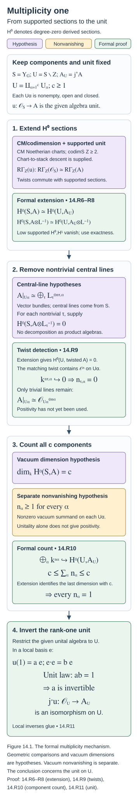

# Ambidexterity, opers and multiplicity one (GLC IV and V)

Draft. Self-checked by the writing AI.

The remaining problem after Eisenstein reduction is an algebra unit on the irreducible spectral locus. Ambidexterity makes its underlying object self-dual. Generic opers identify its fibres with homology and give a flat connection with finite monodromy. The last argument removes nontrivial central line bundles and counts the remaining trivial summands. Rank one then forces the specified algebra unit to be invertible.

Work over an algebraically closed field \(k\) of characteristic zero. Let \(X\) be a smooth projective connected curve, \(g\) its genus, \(G\) a connected reductive group, and \(\check G\) its Langlands dual. Put
\[
Y_G=\operatorname{LS}_{\check G}(X),\qquad
U_G=Y_G^{\mathrm{irred}},\qquad
Z_G^{\mathrm{red}}=Y_G\setminus U_G.
\]
Here \(Z_G^{\mathrm{red}}\) denotes the reducible spectral locus; the group centre will instead be written \(Z(G)\). These are different objects. The spectral stack is the derived de Rham stack of local systems. The automorphic category is the specified category of half-twisted D-modules on \(\operatorname{Bun}_G\); we retain the normalizations of [Constructing the Langlands functor (GLC I)](constructing-the-langlands-functor.md), [Kac-Moody localization and the fundamental local equivalence (GLC II)](kac-moody-localization-and-the-fundamental-local-equivalence.md), and [Eisenstein series and the reduction to the cuspidal part (GLC III)](eisenstein-series-and-the-reduction-to-the-cuspidal-part.md).

Write
\[
L_G:\mathcal C_G\longrightarrow\operatorname{IndCoh}_{\mathrm{Nilp}}(Y_G),
\qquad F_G=L_G^L,
\qquad L_GF_G\simeq A_G\star(-).
\]
The last comparison includes the monad multiplication and unit. On \(U_G\), the specified spectral identification gives \(\operatorname{QCoh}(U_G)\), and the restricted algebra is \(A_{G,\mathrm{irred}}\). The restriction of \(L_G\) to the cuspidal category is denoted \(L_{G,\mathrm{cusp}}\). Whenever the reducible-sector comparison is used, assume the full conjecture for every proper Levi quotient, as required by the preceding lesson.

For semisimple \(G\), the classical smoothness of \(U_G\) is a geometric input. We do not infer that property just from its definition as an open locus. The notation \(H^0\Gamma\) below means degree-zero cohomology of derived global sections. Likewise \(H^0\operatorname{End}\) means degree zero of the derived endomorphism complex; no claim about its other degrees is implicit.

The formal deductions below have proofs at their stated hypotheses. The actual Whittaker and localization comparisons, oper geometry, fundamental-group calculation, vacuum endomorphism theorem, and reductions in group and genus are stated separately as inputs not yet proved here. In particular, “simply connected” for the automorphic group \(G\), for its dual \(\check G\), and for a connected component of \(U_G\) must not be interchanged.

## The geometric reductions and normalized comparisons

### Conventions and geometric sources

Let \(X/k\) be a smooth projective connected curve of genus \(g\), with \(k\) algebraically closed of characteristic zero. Write \(H=\check G\), \(Y=\operatorname{LS}_{H}(X)\), \(U=Y^{\mathrm{irred}}\), and \(j:U\hookrightarrow Y\). The spectral stack is the derived de Rham stack. Whenever \(G\) is semisimple, \(Z_G=Z(G)\) denotes its finite centre; write \(Y^{\mathrm{red}}=Y\setminus U\) for the reducible spectral locus. Throughout the reduction to cuspidal objects, geometric Langlands for **every proper Levi subgroup** of \(G\) is a hypothesis. The automorphic category is
\[
\mathcal C_G=\operatorname{Dmod}_{1/2}(\operatorname{Bun}_G),
\qquad
\mathcal D_G=\operatorname{IndCoh}_{\mathrm{Nilp}}(Y).
\]
These conventions include the fixed half-twist and its determinant-line data.

The geometry below is supplied by Dmitry Arinkin, Dario Beraldo, Lin Chen, Joakim Færgeman, Dennis Gaitsgory, Kevin Lin, Sam Raskin and Nick Rozenblyum in [*Proof of the geometric Langlands conjecture IV: ambidexterity*, v1](https://arxiv.org/abs/2409.08670v1); by Dennis Gaitsgory and Sam Raskin in [*Proof of the geometric Langlands conjecture V: the multiplicity one theorem*, v3](https://arxiv.org/abs/2409.09856v3); and by Joakim Færgeman and Sam Raskin in [*Non-vanishing of geometric Whittaker coefficients for reductive groups*, v1](https://arxiv.org/abs/2207.02955v1). Deep geometric statements are identified explicitly as unproved inputs. The deductions following those inputs are proved here.

### Reduction and Whittaker conservativity

Define \(\mathcal C_{G,\mathrm{Eis}}\) using Eisenstein series from proper parabolics, and put
\[
\mathcal C_{G,\mathrm{cusp}}=\mathcal C_{G,\mathrm{Eis}}^\perp.
\]
Let \(e:\mathcal C_{G,\mathrm{cusp}}\hookrightarrow\mathcal C_G\) denote the inclusion and \(e^L\) its left adjoint. On the spectral side, \(\mathcal D_{G,\mathrm{red}}\) consists of objects supported on the union of the images of \(\operatorname{LS}_{\check P}\to Y\) for proper parabolics \(P\). Geometric inputs from Lesson 13 give the Eisenstein equivalence, the normalized constant-term compatibility, and the corresponding adjoint compatibilities. They imply
\[
L_Ge=j_*L,\qquad j^*L_G=Le^L,
\qquad
L:\mathcal C_{G,\mathrm{cusp}}\longrightarrow
\operatorname{IndCoh}_{\mathrm{Nilp}}(U)=\operatorname{QCoh}(U).
\]
Here the final equality uses vanishing of nilpotent singular directions on \(U\). The resulting equivalence
\[
L_G\text{ is an equivalence}\quad\Longleftrightarrow\quad
L\text{ is an equivalence}
\]
is GLC IV, Corollary 1.3.10. It requires the Eisenstein equivalence and the gluing compatibilities, not merely equivalence of abstract subcategories.

Conservativity has a precise Whittaker input. Færgeman–Raskin, Part III, §10.2, enhanced-coefficient corollary, proves conservativity of the **enhanced** coefficient functor
\[
\operatorname{Shv}_{\mathrm{Nilp}}(\operatorname{Bun}_G)^{\mathrm{temp}}
\longrightarrow
\operatorname{QCoh}(\operatorname{LS}_{H}^{\mathrm{restr}}).
\]
Their §10.3, de Rham conservativity theorem, proves the de Rham version
\[
\operatorname{Dmod}(\operatorname{Bun}_G)^{\mathrm{temp}}
\longrightarrow \operatorname{QCoh}(\operatorname{LS}_{H}).
\]
Its proof uses spectral fibres over all field extensions, the comparison of nilpotent-sheaf and D-module fibres, compatibility with tempered projection, and fibrewise detection. These geometric comparisons are unproved inputs here.

The mechanism in the nilpotent setting is more informative than an invocation of conservativity alone. A nonzero tempered projection has singular support meeting a generically regular nilpotent component. The Hecke-to-Kostant theorem of FR §9 moves this to the Kostant component. The kernel lemma in §10.1 identifies the kernel of the ordinary vacuum coefficient with objects whose singular support avoids that component. The index formula and shifted coefficient exactness used to prove this lemma are geometric inputs. Thus some divisor-indexed coefficient is nonzero. Enhanced spectral compatibility assembles these tests into one conservative functor. This argument does not assert that the ordinary vacuum coefficient is conservative on the entire automorphic category.

The additional Ramanujan input says that cuspidal objects are tempered. After transporting the fixed twisting conventions, the normalized Whittaker square gives conservativity of \(L\): GLC IV, Theorem 1.5.2. To deduce conservativity of \(L_G\), suppose \(L_GF=0\). Constant-term compatibility gives
\[
L_M(\operatorname{CT}_{P,*}F)=0
\]
for every proper parabolic. By the proper-Levi equivalences, every such constant term vanishes; hence \(F\) is cuspidal. Conservativity of \(L\) now gives \(F=0\). This proves GLC IV, Theorem 1.5.5, from the stated inputs.

The functor \(L\) has a left adjoint \(F\), and its monad \(LF\) is \(\operatorname{QCoh}(U)\)-linear. Since its target is the regular module \(\operatorname{QCoh}(U)\), there is a unital associative algebra \(A_U\) such that
\[
LF(M)=A_U\otimes M,\qquad u:\mathcal O_U\longrightarrow A_U.
\]
The algebra unit is the specified adjunction unit. The identity \(u\simeq\mathrm{id}\) is equivalent to full faithfulness of \(F\). Together with conservativity of \(L\), it implies equivalence: for the counit \(FL(C)\to C\), applying \(L\) gives an isomorphism by the triangle identity and invertibility of the unit; conservativity then makes the counit invertible. This proves the reduction of GLC IV, Corollary 1.6.5.

For \(G=\mathrm{GL}_n\), the geometric Whittaker theorem says that \(\operatorname{coeff}_G e\) is fully faithful. It is an unproved input here, recorded as GLC IV, Theorem 1.7.2. The spectral composite
\[
\operatorname{QCoh}(U)\xrightarrow{j_*}\operatorname{QCoh}(Y)
\xrightarrow{\Gamma_H^{\mathrm{spec}}}\operatorname{Rep}(H)_{\mathrm{Ran}}
\]
is fully faithful, so the Whittaker square makes \(L\) fully faithful. After base change to any field-valued \(\sigma\in U\), the algebra \(A_\sigma\) is idempotent: its multiplication \(A_\sigma\otimes A_\sigma\to A_\sigma\) is invertible. A nonzero unital idempotent algebra over a field has invertible unit. Indeed, tensoring the unit with \(A_\sigma\) is inverse to multiplication; therefore \(A_\sigma\otimes\operatorname{Cone}(u_\sigma)=0\). Tensoring with a nonzero complex of vector spaces is conservative, so \(\operatorname{Cone}(u_\sigma)=0\). The remaining geometric input is a nonzero Hecke eigensheaf for every irreducible \(\sigma\); it excludes \(A_\sigma=0\). Fieldwise detection on the eventually coconnective stack then gives \(u\) invertible. This is the complete formal deduction in GLC IV §1.7; the two Whittaker/eigensheaf existence theorems remain unproved.

### Duality and the normalized adjoint formula

Fix the following dualities before discussing ambidexterity. Verdier duality identifies \(\mathcal C_G^\vee\) with the colimit category \(\operatorname{Dmod}_{1/2}(\operatorname{Bun}_G)_{\mathrm{co}}\), formed using *-extension from quasi-compact opens. The cuspidal duality is the composite
\[
\mathcal C_{G,\mathrm{cusp}}^\vee
\xrightarrow{\mathbb D_{\mathrm{Verdier,cusp}}}
\mathcal C_{G,\mathrm{co,cusp}}
\xrightarrow{\operatorname{PsId}^{\mathrm{nv}}_{\mathrm{cusp}}}
\mathcal C_{G,\mathrm{cusp}}.
\]
The second arrow is an equivalence, and cuspidal objects have a common quasi-compact support open \(U_0\subset\operatorname{Bun}_G\). Both assertions are geometric inputs of GLC IV §2.2. On \(\operatorname{QCoh}(U)\), use naive duality, whose action on perfect objects is monoidal dualization.

Put
\[
d_N=\dim\operatorname{Bun}_{N_{\rho(\omega_X)}},
\qquad d_G=\dim\operatorname{Bun}_G=(g-1)\dim G.
\]
The integer \(d_N=-\chi(X,\mathfrak n_{\rho(\omega_X)})\) is a stack dimension and may be negative. Let \(\tau_G\) denote the Chevalley involution on the automorphic category. In these dualities the normalized dual is
\[
\Phi=\tau_G\circ L^\vee[-2d_N].
\tag{14.G1}
\]
GLC IV, Theorem 2.5.3 and Theorem 3.1.2 identify \(L^L\) and \(L^R\), respectively, with this same functor. Consequently Main Theorem 3.1.4 gives
\[
L^L\simeq L^R.
\tag{14.G2}
\]
The proof in §3 is written for semisimple \(G\). The paper states that the reductive extension needs additional central determinant notation; the semisimple argument below does not constitute a proof of that extension.

#### The Whittaker square

The upper Whittaker square uses
\[
\operatorname{CS}_G\,\operatorname{coeff}_G[2d_N]
=\Gamma_H^{\mathrm{spec,IndCoh}}L_G.
\]
After restriction to cuspidal objects, its entire right vertical composite is \(\Gamma_H^{\mathrm{spec}}j_*\). Its left adjoint is \(j^*\operatorname{Loc}_H^{\mathrm{spec}}\), and this left adjoint is also its dual: use naive QCoh duality and the representation-category duality in GLC IV, Lemma 2.4.5. Full faithfulness of the composite follows from full faithfulness of each factor.

The whole left vertical composite also needs a comparison; the corresponding assertion does not follow from a comparison for one factor. Its left adjoint is \(e^L\operatorname{Poinc}_{G,!}[-2d_N]\). The geometric !/* comparison is
\[
e^L\operatorname{Poinc}_{G,!}\Theta_{\mathrm{Whit}}
\simeq
e^L\operatorname{PsId}^{\mathrm{nv}}\operatorname{Poinc}_{G,*}[2d_N],
\tag{14.G3}
\]
GLC IV, Theorem 2.3.4. Also \(\operatorname{coeff}_G^\vee=\operatorname{Poinc}_{G,*}\), while dual Casselman–Shalika is related to inverse Casselman–Shalika by \(\Theta_{\mathrm{Whit}}\) and \(\tau_G\). These are unproved geometric comparisons.

Taking left adjoints and taking duals of the upper square, then substituting (14.G3), identifies the two composites
\[
L^L\,j^*\operatorname{Loc}_H^{\mathrm{spec}}
\simeq
\Phi\,j^*\operatorname{Loc}_H^{\mathrm{spec}}.
\]
Because \(j^*\operatorname{Loc}_H^{\mathrm{spec}}\) has fully faithful right adjoint, its counit is invertible. Compose the displayed isomorphism with that right adjoint and use the counit to obtain \(L^L\simeq\Phi\). This proves the formal part of the left-adjoint comparison, conditional on the precise geometric dualities above.

#### The localization square and its determinant lines

For the lower localization square, continue with semisimple \(G\). Define the non-graded determinant lines
\[
D=\det R\Gamma(X,\mathcal O_X\otimes\mathfrak g),\qquad
N=\det R\Gamma(X,\mathfrak n_{\rho(\omega_X)}).
\]
Let \(R\) be the fixed half-determinant line with
\[
R^{\otimes2}
=\det R\Gamma(X,\mathfrak g_{\rho(\omega_X)})\otimes D^{-1},
\qquad C=R\otimes N^{-1},\qquad \ell=C[-d_N].
\]
All shifts are displayed separately from these non-graded lines. Let \(K_{\mathrm{Kost}}\) denote the Kostant determinant line. The determinant comparison used in GLC IV §3.4 is
\[
K_{\mathrm{Kost}}\otimes D^{-1}\simeq C^{\otimes2}.
\tag{14.G4}
\]
It is the semisimple case of GLC III, Proposition 15.1.10. Its construction uses the principal \(\mathfrak{sl}_2\) decomposition, the Killing form and determinant-of-cohomology duality; these geometric determinant identifications are an unproved input here.

Set
\[
H_{\mathrm{loc}}=e^L\operatorname{Loc}_{G,\mathrm{crit}},
\qquad
P=j^*\operatorname{Poinc}^{\mathrm{spec}}_{H,*},
\qquad E=\operatorname{FLE}_{G,\mathrm{crit}}.
\]
The normalized fundamental square is
\[
L(H_{\mathrm{loc}}\otimes\ell)\simeq PE.
\tag{14.G5}
\]
Critical FLE is an equivalence. Localization on a quasi-compact open of \(\operatorname{Bun}_G\) is a Verdier quotient; since \(e^L\) factors through the common support open \(U_0\), \(H_{\mathrm{loc}}\) is a Verdier quotient as well. These are unproved geometric inputs, appearing in GLC IV, Proposition 3.2.3 and its proof.

The required comparison concerns the entire \(H_{\mathrm{loc}}\):
\[
H_{\mathrm{loc}}^\vee
\simeq H_{\mathrm{loc}}^R\otimes D[d_G].
\tag{14.G6}
\]
In Proposition 3.2.5, both sides factor through the same inclusion of cuspidal objects into \(\operatorname{Dmod}_{1/2}(U_0)\). On \(U_0\), the critical-twist duality identifies localization's dual and right adjoint. Transport to the half-twist produces exactly \(D[d_G]\). The support and critical-twist duality assertions remain unproved here.

For the spectral composite \(P\), use Serre duality followed by the !/* comparison \(\Theta_{\mathrm{Op}}\) on the monodromy-free oper category. The relevant comparisons are
\[
\operatorname{Poinc}^{\mathrm{spec}}_{H,!}
 \otimes K_{\mathrm{Kost}}[-d_G]
\simeq \operatorname{Poinc}^{\mathrm{spec}}_{H,*}\Theta_{\mathrm{Op}},
\]
\[
(j^*\operatorname{Poinc}^{\mathrm{spec}}_{H,!})^\vee
\simeq P^R[2d_G],
\qquad
P^\vee\simeq P^R\otimes K_{\mathrm{Kost}}[d_G].
\tag{14.G7}
\]
The second comparison uses naive duality on \(\operatorname{QCoh}(U)\). To see its shift, Serre and naive duality differ by \([2d_G]\): the Killing form equips the smooth semisimple irreducible locus with a symplectic volume trivialization. The first two displayed comparisons give the final one by cancelling \(-d_G+2d_G=d_G\).

The geometric adjunction underlying (14.G7) is visible at a fixed finite pole set \(D_X\subset X\):
\[
\operatorname{Op}^{\mathrm{mf}}_{H,D_X}
\xleftarrow{s}
\operatorname{Op}^{\mathrm{mf}}_H(X-D_X)
\xrightarrow{\pi}Y.
\]
The *-Poincaré functor is \(\pi_*^{\operatorname{IndCoh}}s^*\), and its candidate right adjoint is \(s_*^{\operatorname{IndCoh}}\pi^!\). Over \(U\), \(\pi\) is ind-proper: generic oper nondegeneracy is automatic for an irreducible local system. Proper adjunction and base change identify this candidate with the right adjoint of the whole composite \(P\). Ind-properness, the oper nondegeneracy assertion, and the Serre/naive duality comparison are unproved inputs.

Finally, critical FLE duality reads \(E^\vee\simeq\tau_G E^{-1}\), when the oper category is identified with its own dual using \(\Theta_{\mathrm{Op}}\); localization commutes with the relevant Chevalley involutions. This comparison is another unproved geometric input. Now the formal cancellation can be checked without suppressing lines. Taking right adjoints of (14.G5) gives
\[
H_{\mathrm{loc}}^R L^R\simeq E^{-1}P^R\otimes\ell.
\]
Taking duals, using (14.G6)–(14.G7), and moving \(\tau_G\) through localization gives
\[
H_{\mathrm{loc}}^R\tau_G L^\vee
\simeq E^{-1}P^R\otimes K_{\mathrm{Kost}}D^{-1}\ell^{-1}.
\]
After the shift \([-2d_N]\), the line on the right becomes
\[
K_{\mathrm{Kost}}D^{-1}C^{-1}[d_N-2d_N]
\simeq C[-d_N]=\ell
\]
by (14.G4). Thus \(H_{\mathrm{loc}}^R L^R\simeq H_{\mathrm{loc}}^R\Phi\). The right adjoint of a Verdier quotient is fully faithful, so \(L^R\simeq\Phi\). This completes the formal proof of ambidexterity from all four composite comparisons.

Let \(T=LL^L=A_U\otimes-\). Ambidexterity makes \(T\) its own left and right adjoint. To extract local perfectness, use the regular-module realization and affine-local self-adjunction premises of the formal ambidexterity argument, (14.19)–(14.22): the whole self-adjunction is supplied after base change to the regular module category \(D(R)\) of each affine chart, its unit \(R\) is compact, compact objects are perfect complexes, and perfection is local. These categorical base-change and finiteness facts are explicit unproved premises for the spectral stack here. On such a chart, the right adjoint of \(A_U\otimes-\) is \(R\operatorname{Hom}_R(A_U,-)\); its identification with the continuous tensor functor shows that derived Hom preserves filtered colimits. Compactness of \(R\) then gives compactness of \(A_U\), hence local perfectness and therefore perfectness on \(U\). Once perfectness is known, tensoring with its dual is the right adjoint; evaluation on \(\mathcal O_U\) gives \(A_U^\vee\simeq A_U\). This is the content of GLC IV, Corollary 3.1.7. Perfectness follows from the functor adjunction under those premises, not from an arbitrary self-isomorphism of a quasi-coherent complex.

### Generic opers and rational-map homology

The oper space retains its global local system. Put
\[
Z=\operatorname{Op}^{\mathrm{mf,irred}}_H(X^{\mathrm{gen}})_{\mathrm{Ran}},
\qquad \pi:Z\to U.
\]
An object records a globally defined local system \(\sigma\) and an oper structure on its restriction to \(X-D_X\), for a finite pole set \(D_X\); enlarging the pole set restricts that same generic structure. The monodromy-free condition at the removed points allows the local oper data to lie over a global local system. It does not impose trivial global monodromy on \(\sigma\). The map \(\pi\) is pseudo-proper, a colimit of proper maps.

Define
\[
B^{\mathrm{Op}}=\operatorname{oblv}^l\pi_!\omega_Z.
\tag{14.G8}
\]
The left forgetful functor produces a quasi-coherent object with a natural cocommutative coalgebra structure. Its derived fibre at \(\sigma\) is
\[
B^{\mathrm{Op}}_\sigma
=C_\bullet(\operatorname{Op}^{\mathrm{gen}}_{H,\sigma}),
\tag{14.G9}
\]
with homological degree \(i\) placed in cohomological degree \(-i\). Pseudo-proper base change is an unproved geometric input in (14.G9).

GLC IV, Theorem 4.6.3 identifies \(PP^R\) with tensoring by \(B^{\mathrm{Op}}\). Here is its proof architecture with its restricted scopes retained. Let \(s\) be the map from global generic opers to the local monodromy-free oper factorization space. Proposition 5.1.5 says that
\[
\Psi\,\pi_*s^*s_*\longrightarrow\Psi\,\pi_*
\]
is invertible on the essential image of \(\pi^!\). It is a statement after coarsening \(\Psi:\operatorname{IndCoh}(Y)\to\operatorname{QCoh}(Y)\), rather than universal full faithfulness of \(s_*\). Proposition 5.1.2 says that
\[
\pi_*^{\operatorname{IndCoh}}\operatorname{oblv}^r
\longrightarrow \operatorname{oblv}^r\pi_{*,\mathrm{dR}}
\]
is invertible on the essential image of D-module \(\pi^!\). Both assertions require integration over the entire Ran space.

Over \(U\), coarsening is an equivalence and proper adjunction gives
\[
PP^R
=j^*\pi_*s^*s_*\pi^!j_*
\simeq\pi_{U,*}\pi_U^!.
\]
The projection formula identifies the latter with !-tensoring by \(\pi_{U,*}\omega_Z\). The de Rham comparison identifies this object with \(\operatorname{oblv}^r\pi_{U,*,\mathrm{dR}}\omega_Z\). Finally
\[
\operatorname{oblv}^r(M)
=\operatorname{oblv}^l(M)\otimes\omega_U
\]
converts !-tensoring into ordinary tensoring with (14.G8). These substitutions prove Theorem 4.6.3 conditional on the two stated comparisons.

The rational-map geometry behind those comparisons has three distinct ingredients:

| Ingredient | Precise role |
|---|---|
| Relative induction/forgetting, Proposition 5.3.4 | For a map of D-prestacks \(\mathcal Z\to\mathcal Y\), under the sectional finiteness hypotheses, \(\operatorname{ind}^{\mathrm{rel}}\operatorname{oblv}^{\mathrm{rel}}\to\mathrm{id}\) is invertible on objects pulled back from \(\operatorname{Sect}_\nabla(X,\mathcal Y)\). |
| Local/global comparison, Propositions 5.5.5 and 5.6.8 | For affine D-schemes, and for the specified relative affine family with compatible unital structure, insertion of local evaluation followed by its adjoint changes no integrated coarsened object of the specified form. |
| Spectral localization, §8.1 | For a D-prestack with affine diagonal and the stated passability conditions, localization has fully faithful right adjoint; \(\mathcal Y=BH\) gives \(\Gamma_H^{\mathrm{spec}}\). |

In §6, the unital Ran object is a categorical prestack: pole sets have inclusion arrows. Strict objects invert every such arrow. The relative D-module description is a fibre product involving formal completion after adding a second pole set (Theorems 6.4.5 and 6.4.9). Its geometric description is an unproved input here. The remaining cofinality mechanism is explicit: any two finite sets embed into their union, so the diagonal is cofinal. On the diagonal, adding the same pole set again does nothing, and the formal-completion comparison becomes an identity. The fibre product therefore reduces to its first factor. Conservativity of !-pullback from the reduced test scheme reflects strictness, completing the induction/forgetting argument conditional on the relative D-module description.

In §7, factorization homology describes the integrated evaluation functor by insertion of the unit over pairs \(D_1\subseteq D_2\). Proposition 7.3.8, including its parametrized form, is a deep geometric input here. The unit object satisfies \(\operatorname{diag}^!\operatorname{ins.unit}=\mathrm{id}\); cofinality of the diagonal of the inclusion category then makes the integrated adjunction unit invertible. The triangle identity makes the corresponding counit invertible as well on the stated unital objects. In §8, the relative evaluation is factored into evaluation within the affine family and a base change of localization for \(\mathcal Y\). The first comparison follows from the parametrized absolute statement; the second follows from the localization counit. To prove that counit, the identity functor is represented by the diagonal kernel. Applying the parametrized factorization-homology comparison to the affine diagonal identifies its transformed kernel with itself. The necessary kernel formalism, base change and universal homological cofinality are unproved inputs. This explains the rational-map/Ran mechanism without claiming a proof of its geometric foundations.

The fundamental square now compares the comonads. Since \(E\) is an equivalence and \(H_{\mathrm{loc}}\otimes\ell\) is a Verdier quotient,
\[
PP^R
\simeq PEE^RP^R
\simeq L(H_{\mathrm{loc}}\otimes\ell)
 (H_{\mathrm{loc}}\otimes\ell)^R L^R
\simeq LL^R.
\]
Evaluating at \(\mathcal O_U\), then using ambidexterity, gives
\[
A_U\simeq B_U\simeq B^{\mathrm{Op}}.
\tag{14.G10}
\]
This is GLC IV, Theorem 4.1.5 and Corollary 4.2.5, as an identification of underlying quasi-coherent objects. Its use below does not require an identification of the algebra multiplication with the oper coalgebra.

#### Classical bundles, finite monodromy and connectedness

Now suppose \(G\) is semisimple. The locus \(U\) is a classical smooth stack: its infinitesimal automorphisms and obstructions vanish because irreducibility leaves only a finite centralizer; the curve duality identifies the obstruction with the dual of infinitesimal automorphisms. These deformation-theoretic facts are unproved geometric inputs. By (14.G9), every fibre of \(A_U\) lies in degrees \(\leq0\). Perfect self-duality puts it also in degrees \(\geq0\). The perfect-complex fibre criterion, proved in Lemmas 14.R4–14.R5, makes \(A_U\) a classical vector bundle. Its D-module structure from (14.G8) is a flat connection. This is GLC IV, Main Theorem 3.1.8.

Finite monodromy needs a separate geometric step. Normalize \(\pi_!\omega_Z\) by \([-\dim U]\). Pseudo-properness presents it as a colimit of properly pushed-forward dualizing objects. At the generic point of each component, their degree-zero cohomology is obtained from the finite part of Stein factorization; hence each such term has finite monodromy. Proper Stein factorization, its degree-zero identification, generic étaleness and the detection of global finite monodromy from the generic point are unproved geometric inputs. The resulting local system is finite rank and concentrated in degree zero. A finite sum of the degree-zero terms surjects onto it; the quotient therefore has finite monodromy, by Lemma 14.R3. This proves the formal final step of GLC IV, Proposition 4.2.8. A flat connection alone does not supply finite monodromy.

The same fibre argument gives
\[
H^i C_\bullet(\operatorname{Op}^{\mathrm{gen}}_{H,\sigma})=0
\quad(i\ne0).
\]
Thus each nonempty connected component is homologically contractible, and the finite rank of \(A_U\) bounds the number of components. Nonemptiness of generic opers on irreducible local systems is an additional geometric existence input. If each fibre is connected, (14.G10) makes every fibre of \(A_U\) one-dimensional and nonzero. The unital rank-one algebra argument of Lemma 14.R11 then makes the specified unit invertible. Conversely, invertibility of the unit gives one-dimensional homology in degree zero, hence connectedness. This proves the equivalences of GLC IV, Corollary 4.5.5. “Homologically contractible” concerns homology and does not assert topological contractibility.

For classical root systems, the contractibility theorem of Dario Beraldo, David Kazhdan and Tomer M. Schlank is an unproved input stated in GLC IV §4.5. It concerns Lie-algebra opers, equivalently opers for the adjoint spectral group. The group-change reduction of GLC V §2 transports the result to the required group forms. This is the architecture behind GLC IV, Main Theorem 4.5.11; the oper contractibility theorem itself is not proved here.

### Multiplicity one and the finite centre

GLC V completes the multiplicity-one step and therefore geometric Langlands for connected reductive \(G\). Its main large-genus argument uses the following exact geometric inputs. Here \(G\) is semisimple.

| Input in GLC V v3 | Hypotheses and conclusion |
|---|---|
| Proposition 4.1.6; Theorem 4.3.2 | For \(g\geq2\), excluding a type \(A_1\) factor when \(g=2\), \(U\to\operatorname{Bun}_{H}\) induces an equivalence of étale homotopy 1-truncations. The corresponding statement for \(\operatorname{Bun}_{H}\) identifies it with the gerbe space controlled by \(\pi_1(H)\). |
| Proposition 4.3.5 | Under the same genus restriction, the complement of stable \(H\)-bundles has codimension at least two. |
| Proposition 4.3.8 | Connections on stable \(H\)-bundles form an affine-space bundle. Stable connections are irreducible. |
| Theorem 5.3.2; Corollary 5.3.3 | For \(g\geq2\), \(Y\) is a classical local complete intersection, of dimension \((2g-2)\dim H\); consequently it is Cohen–Macaulay. |
| Proposition 5.3.5 | For \(g\geq2\), excluding type \(A_1\) factors at \(g=2\), \(Y\setminus U\) has codimension at least two. |
| Theorems 5.2.3–5.2.4 | For each central character/component \(\alpha\), \(H^0\operatorname{End}(\mathrm{Vac}_\alpha)=k\); the endomorphism complex of the whole vacuum has no cohomology outside degree zero. |
| Corollary 5.2.5 | \(H^0\operatorname{End}(\mathrm{Vac})\) has dimension \(|Z_G|\). |
| Theorems 5.2.7–5.2.8 | For every nontrivial \(Z_G\)-torsor \(\mathcal P\) on \(X\), \(\operatorname{Hom}(\mathrm{Vac},\mathcal P\cdot\mathrm{Vac})=0\). |
| Theorems 5.1.5 and 5.1.7 | Spectral component idempotents act as central-character projectors; the spectral line \(\mathcal L_{\mathcal P}^{-1}\) acts as translation by the central torsor \(\mathcal P\). |

These statements are unproved inputs, except for the numerical implications explained in Exercise 14.5. For the fundamental-group statement, the geometric route is an affine-space bundle over stable bundles, together with codimension-two purity and density of the stable locus in the irreducible connection locus. If \(H\) is simply connected, each relevant component is simply connected. This condition means that the **automorphic \(G\) is adjoint**. In general, the components are indexed by \(Z_G^\vee\); finite-monodromy local systems on each component split into the rank-one character local systems \(\mathcal L_{\mathcal P}\) associated with central torsors, by Corollary 4.3.3 and Lemma 14.R2. Simply-connectedness of the automorphic group does not remove this centre calculation.

For clarity, the global object \(A_G\) and the supported comparison are additional inputs from Lesson 13:
\[
j^*A_G=A_U,\qquad
\widehat i^{\,!}\mathcal O_Y\xrightarrow{\sim}\widehat i^{\,!}A_G,
\qquad
R\Gamma(Y,A_G)\simeq\operatorname{End}(\mathrm{Vac}).
\]
The first construction does not follow from QCoh-linearity alone. The middle arrow is induced by the specified algebra unit, on sections supported in \(Y\setminus U\). Cohen–Macaulayness and codimension two put \(\widehat i^{\,!}\mathcal O_Y\) in degrees \(\geq2\). Lemmas 14.R6–14.R8 consequently give
\[
H^0\Gamma(Y,A_G\otimes\mathcal L)
\simeq H^0\Gamma(U,A_U\otimes\mathcal L)
\]
for each relevant invertible character line \(\mathcal L\). This uses supported-section transfer and does not assume that \(A_G\) is a vector bundle on all of \(Y\).

On component \(U_\alpha\), write the finite-monodromy bundle as
\[
A_U|_{U_\alpha}
\simeq\bigoplus_{\mathcal P}
\mathcal L_{\mathcal P}|_{U_\alpha}^{\oplus n_{\mathcal P,\alpha}}.
\]
For nontrivial \(\mathcal P\), twist by \(\mathcal L_{\mathcal P}^{-1}\). A nonzero multiplicity would give a nonzero constant section over \(U_\alpha\); extension of sections and central Hecke compatibility would produce a nonzero morphism \(\mathrm{Vac}\to\mathcal P\cdot\mathrm{Vac}\), contradicting Theorem 5.2.8. Lemma 14.R9 formalizes this deduction. Thus only trivial summands survive. Each component has nonzero rank, supplied either by its nonzero vacuum component or, after the group-form reduction, by existence of generic opers. There are \(|Z_G|\) components and
\[
\sum_\alpha n_\alpha
\leq \dim H^0\operatorname{End}(\mathrm{Vac})
=|Z_G|,
\qquad n_\alpha\geq1.
\]
Lemma 14.R10 gives \(n_\alpha=1\) on every component; Lemma 14.R11 makes the algebra unit invertible. This proves the multiplicity-one deduction at the listed geometric premises. For adjoint \(G\), the centre is trivial and the count reduces to the single scalar endomorphism calculation.

#### The vacuum endomorphism and gerbe comparisons

GLC V §6 explains the endomorphism input by factoring the vacuum exponential along
\[
\operatorname{Bun}_{N_\rho}\longrightarrow
\operatorname{Bun}_{N_\rho}/T\longrightarrow
\operatorname{Bun}_{B}^{(g-1)2\rho}\longrightarrow
\operatorname{Bun}_G.
\]
The last map embeds the relevant Harder–Narasimhan stratum when \(g\geq2\). The character map is a tower of vector-group torsors, so the calculation reduces to the exponential object on \(\mathbb A^r/T\). Contraction and vanishing of exponential cohomology on \(\mathbb A^1\) reduce it to \((\mathbb G_m)^r/T=BZ_G\). Each central-character component has a one-dimensional Gauss cohomology factor, yielding its scalar endomorphisms; different characters are orthogonal. A nontrivial central torsor translates its distinguished \(T\)-bundle to a different point of the coarse \(T\)-bundle space, so the supports giving the cross-Hom calculation are disjoint. The stratum embedding, torsor descent, contraction, Fourier-transform/Gauss-cohomology calculation and exponential vanishing are unproved geometric inputs here.

The central Hecke comparisons are established by the gerbe construction of GLC V §8, rather than inferred solely from an equality of dimensions. Its 2-Fourier–Mukai transform sends a sheaf of categories \(\mathcal C\) on \(\mathcal Y_1\) to
\[
(p_2)_*\bigl(p_1^*\mathcal C\bigr)_{\mathcal G_{1,2}},
\]
where \(\mathcal G_{1,2}\) is the pairing gerbe on \(\mathcal Y_1\times\mathcal Y_2\). The finite-centre pairing relates \(Z_G\)-gerbes to gerbes controlled by \(\pi_1(H)\). The automorphic family has neutral fibre \(\mathcal C_G\), while its spectral counterpart comes from the QCoh action and the corresponding gerbe map from \(Y\). Theorem 8.6.8 identifies their transforms, with the inversion on \(Z_G\) dictated by Satake conventions. Taking components and torsor actions gives exactly the projector and inverse-character-line statements above. The transform theorem and its geometric Hecke identification remain unproved.

#### Group forms and low genus

Finally, the hypotheses used in the large-genus calculation do not restrict the final theorem. For an almost isogeny \(G_1\to G_2\), the change-of-group theorem of GLC V §2 identifies the \(G_2\) automorphic category with the required spectral base change of the \(G_1\) category, compatibly with Langlands. Tensoring an equivalence with that base-change category is again an equivalence. Applying this to the simply-connected cover of the derived group and to products reduces to almost simple simply-connected automorphic groups; the torus case is the abelian theorem. The geometric base-change/category comparison and normalized functor compatibility are unproved inputs.

After that semisimple reduction, genus zero has no irreducible local systems, so the proper-Levi/Eisenstein equivalence finishes the argument. At genus one, the non-type-\(A\) almost simple cases have no irreducible local systems by the compact-group classification of commuting pairs used in GLC V §3. For the remaining \(G=\mathrm{SL}_n\), the spectral group is \(\mathrm{PGL}_n\). GLC V §3.3 chooses a lift of an irreducible \(\mathrm{PGL}_n\)-local system to an \(\mathrm{SL}_n\)-local system over a sufficiently small open \(X-D_X\). This is a generic lift and does not assert a lift over all of \(X\). Generic opers then identify with generic lines in the underlying vector bundle on that open; their homological contractibility and Corollary 4.5.5 of GLC IV give the result. This argument works in every genus, including genus two. Products and the group-change theorem handle the other group forms. The commuting-pair argument itself is short once its geometric inputs are supplied: irreducibility gives a finite simultaneous centralizer; a commuting pair generates a subgroup inside that centralizer, hence a finite subgroup of a compact form; the compact-group classification then forces type \(A\). The classification, de Rham/Betti comparison, existence of the generic lift, the oper/generic-line identification and generic-line contractibility remain unproved inputs. The genus-two exclusion belongs to the intermediate codimension-two proof, not to geometric Langlands itself.

### The genus-two dimension exception

### What this lesson does not prove

The geometric foundations left unproved in this lesson are the proper-Levi Eisenstein/constant-term comparisons; temperedness of cuspidal objects and the enhanced Whittaker singular-support/fibre comparisons; cuspidal support and pseudo-identity duality; the normalized Casselman–Shalika, !/*, critical localization and FLE dualities; the affine-local regular-module adjunction and compactness foundations; ind-properness and pseudo-proper base change for generic opers; the relative D-module and factorization-homology theorems for rational sections; generic-oper existence and classical-group contractibility; the smoothness, purity, fundamental-group, local-complete-intersection and dimension inputs for local systems; the vacuum stratum/exponential calculation; the gerbe Fourier–Mukai/Hecke comparison; and the group-change and low-genus classification inputs. The formulas and arguments above establish the formal consequences at these precise premises.

## Computing both adjoints from normalized squares

We work with stable \(k\)-linear categories and their derived mapping complexes. The categorical foundations are explicit premises: enriched adjunctions and Yoneda, exact functor categories, presentable localizations, and dualizable presentable categories with evaluation, coevaluation and coherent biduality. For module examples we also assume the construction of \(D(R)\), the derived tensor–Hom adjunction, and computation of derived Hom by bounded-above projective resolutions. Their construction is not proved here. All functors being dualized are continuous. An adjoint used below is supplied with its unit, counit and triangle homotopies; its existence is a premise until the argument constructs it.

Choose self-duality equivalences for the categories in the two diagrams. The notation \(K^\vee\), for a continuous \(K:\mathcal A\to\mathcal B\), means its categorical transpose, transported through those chosen self-dualities:

\[
K^\vee:\mathcal B\longrightarrow\mathcal A,
\qquad
(K_2K_1)^\vee\simeq K_1^\vee K_2^\vee,
\qquad (K^\vee)^\vee\simeq K.
\tag{14.1}
\]

The transpose is specified by the evaluations, for example
\(\operatorname{ev}_{\mathcal B}(Kx,y)\simeq
\operatorname{ev}_{\mathcal A}(x,K^\vee y)\), together with the duality coherences. Evaluations are not mapping complexes in general. Accordingly \(K^L\simeq K^\vee\) and \(K^R\simeq K^\vee\) are additional adjunction statements, not consequences of the notation.

For example, with the usual evaluation \(x\otimes_k y\) identifying \(D(k)\) with its categorical dual, the transpose of \(K=k[1]\otimes_k-\) is again \(k[1]\otimes_k-\): move the factor \(k[1]\) through the tensor product. Both adjoints of this shift functor are \(k[-1]\otimes_k-\), because their composites with it are the identity. Evaluating on \(k\) distinguishes these functors. Even an equivalence can therefore have adjoints different from its transpose under given self-duality identifications.

### The precise premises of the two squares

The middle functor is \(L:\mathcal C\to\mathcal D\). Supply coherent squares

\[
\begin{array}{ccc}
\mathcal C&\xrightarrow{\ L\ }&\mathcal D\\
{\scriptstyle W}\downarrow&&\downarrow{\scriptstyle I}\\
\mathcal C_W&\xrightarrow{\ E\ }&\mathcal D_W
\end{array}
\qquad
\sigma:IL\xrightarrow{\sim}EW=:G,
\tag{14.2}
\]

and

\[
\begin{array}{ccc}
\mathcal C_K&\xrightarrow{\ U\ }&\mathcal D_K\\
{\scriptstyle Q}\downarrow&&\downarrow{\scriptstyle V}\\
\mathcal C&\xrightarrow{\ L\ }&\mathcal D.
\end{array}
\qquad
\tau:LQ\xrightarrow{\sim}VU=:H.
\tag{14.3}
\]

These are equivalences of functors, including their higher naturality data. An equality of values on objects would not give the required comparison of adjunctions.

In the first square require \(I\) fully faithful, with a specified left adjoint \(I^L\) and normalized identification

\[
I^L:\mathcal D_W\to\mathcal D,
\qquad I^L\simeq I^\vee.
\tag{14.4}
\]

Also supply \(G^L\dashv G\), with \(G^L:\mathcal D_W\to\mathcal C\), and a normalized identification \(G^L\simeq G^\vee\). A sufficient way to obtain the latter input is to supply \(W^L\dashv W\) and \(E^L\dashv E\), with compatible identifications \(W^L\simeq W^\vee\), \(E^L\simeq E^\vee\). Indeed the natural computation

\[
\operatorname{Map}_{\mathcal C}(W^LE^Ly,c)
\simeq\operatorname{Map}_{\mathcal C_W}(E^Ly,Wc)
\simeq\operatorname{Map}_{\mathcal D_W}(y,EWc)
\]

constructs \(G^L=W^LE^L\), and (14.1) identifies this with \(G^\vee\). If \(E\) is an equivalence, one must still supply its compatibility with the chosen dualities to identify \(E^{-1}\) with \(E^\vee\).

In the second square require \(Q\) an exact Verdier localization, with a fully faithful right adjoint \(R\) and normalized identification

\[
Q:\mathcal C_K\to\mathcal C,
\qquad R:\mathcal C\to\mathcal C_K,
\qquad Q\dashv R,
\qquad R\simeq Q^\vee.
\tag{14.5}
\]

Also supply \(H\dashv N\), with \(N:\mathcal D\to\mathcal C_K\), and a normalized identification \(N\simeq H^\vee\). It suffices to supply right adjoints \(U^R,V^R\), normalized as their respective transposes: the natural mapping computation gives \(N=U^RV^R\), and the reversed order in (14.1) gives \(N\simeq H^\vee\).

All normalizations in (14.4)–(14.5) and for the outer circuits are unshifted identifications of the stated functors and their actual adjunctions. If a geometric pairing, determinant twist or cohomological shift changes a transpose, that change must be included before applying this statement. A comparison with a shifted transpose gives a shifted conclusion. The two special vertical functors alone do not determine the outer circuits' adjoints.

### The left adjoint

Write \(q:I^LI\xrightarrow{\sim}\operatorname{Id}_{\mathcal D}\) for the counit of \(I^L\dashv I\). Its invertibility follows from full faithfulness by the adjunction and Yoneda calculation proved in **Kac-Moody localization and the fundamental local equivalence (GLC II)**, [“Adjoints computed through a fully faithful inclusion,” Theorem 12.2](kac-moody-localization-and-the-fundamental-local-equivalence.md). The hypotheses match (14.2) and (14.4).

Put \(J=G^LI:\mathcal D\to\mathcal C\). For \(d\in\mathcal D\), \(c\in\mathcal C\), the full mapping-complex comparison is

\[
\begin{aligned}
\operatorname{Map}_{\mathcal C}(Jd,c)
&\simeq\operatorname{Map}_{\mathcal D_W}(Id,Gc)\\
&\simeq\operatorname{Map}_{\mathcal D_W}(Id,ILc)\\
&\simeq\operatorname{Map}_{\mathcal D}(d,Lc).
\end{aligned}
\tag{14.6}
\]

The steps are the supplied adjunction, the specified square and full faithfulness. Thus \(J\dashv L\).

To retain the maps of this adjunction, write \(a:\operatorname{Id}_{\mathcal D_W}\to GG^L\) and \(b:G^LG\to\operatorname{Id}_{\mathcal C}\) for the outer unit and counit. The reconstruction comparison is

\[
\kappa:I^LG\xrightarrow{I^L\sigma^{-1}}I^LIL
\xrightarrow{q_L}L.
\tag{14.7}
\]

The unit \(\eta_d:d\to LJd\) and counit \(\varepsilon_c:JLc\to c\) are

\[
\eta_d=\kappa_{Jd}\,I^L(a_{Id})\,q_d^{-1},
\qquad
\varepsilon_c=b_c\,G^L(\sigma_c).
\tag{14.8}
\]

Equivalently full faithfulness characterizes the unit by
\(I(\eta_d)=\sigma_{Jd}^{-1}a_{Id}\). The first triangle is therefore

\[
\varepsilon_{Jd}J(\eta_d)
=b_{Jd}G^L(\sigma_{Jd})
G^L(\sigma_{Jd}^{-1}a_{Id})
\simeq\operatorname{id}_{Jd}.
\]

For the second, naturality of \(\sigma,a\) and the other outer triangle give

\[
\sigma_c\circ IL(\varepsilon_c)\circ I(\eta_{Lc})
=G(b_c)\,a_{Gc}\,\sigma_c
\simeq\sigma_c.
\]

Cancel \(\sigma_c\) and use full faithfulness of \(I\). This proves \(L(\varepsilon_c)\eta_{Lc}\simeq\operatorname{id}_{Lc}\). All these equations denote the supplied natural homotopies; (14.6) constructs the comparison on full mapping spaces and carries their coherences.

Finally (14.7), the transpose rules and the normalized inputs give

\[
L^\vee\simeq G^\vee(I^L)^\vee
\simeq G^\vee I
\simeq G^LI=J=L^L.
\tag{14.9}
\]

Here \((I^L)^\vee\simeq I\) uses both \(I^L\simeq I^\vee\) and the specified biduality. This is the comparison that identifies the constructed adjoint with the transpose; it is not a rule applied to every functor.

### The right adjoint

Let \(u:\operatorname{Id}_{\mathcal C_K}\to RQ\) and \(v:QR\xrightarrow{\sim}\operatorname{Id}_{\mathcal C}\) be the localization unit and counit. Full faithfulness of \(R\) makes \(v\) invertible. Transport the specified \(H\dashv N\) through \(\tau\) to an adjunction \(LQ\dashv N\). If its original unit and counit are \(\alpha^H,\beta^H\), the transported ones are

\[
\alpha_a=N(\tau_a^{-1})\alpha^H_a:
a\longrightarrow NLQa,
\qquad
\beta_d=\beta^H_d\tau_{Nd}:LQNd\longrightarrow d.
\tag{14.10}
\]

Their triangle identities follow by inserting \(\tau\) and its inverse in the mapping correspondence of \(H\dashv N\).

We first prove that \(Nd\) is local. For \(z\in\ker Q\),

\[
\operatorname{Map}_{\mathcal C_K}(z,Nd)
\simeq\operatorname{Map}_{\mathcal D}(LQz,d)=0,
\quad
\operatorname{Map}_{\mathcal C_K}(z,Rc)
\simeq\operatorname{Map}_{\mathcal C}(Qz,c)=0.
\]

The cofiber \(z\) of \(u_{Nd}:Nd\to RQNd\) belongs to \(\ker Q\), since \(v_{QNd}Q(u_{Nd})\simeq\operatorname{id}\) and \(v\) is invertible. Applying \(\operatorname{Map}(z,-)\) to its cofiber triangle makes \(\operatorname{Map}(z,z)\) zero. Its identity vanishes, so \(z=0\). Thus

\[
\theta_d=u_{Nd}:Nd\xrightarrow{\sim}RQNd.
\tag{14.11}
\]

Set \(K=QN:\mathcal D\to\mathcal C\). Now

\[
\begin{aligned}
\operatorname{Map}_{\mathcal C}(c,Kd)
&\simeq\operatorname{Map}_{\mathcal C_K}(Rc,RQNd)\\
&\simeq\operatorname{Map}_{\mathcal C_K}(Rc,Nd)\\
&\simeq\operatorname{Map}_{\mathcal D}(LQRc,d)\\
&\simeq\operatorname{Map}_{\mathcal D}(Lc,d).
\end{aligned}
\tag{14.12}
\]

The first step is full faithfulness of \(R\); the second is (14.11); the third is the transported adjunction; the last uses \(L(v_c)\). Hence \(L\dashv K\). Notice the orientation: localization directly compares maps **into** \(Rc\), not arbitrary maps out of it. Proving locality before (14.12) is what permits the comparison being used here.

The unit \(s_c:c\to KLc\) and counit \(t_d:LKd\to d\) are explicitly

\[
s_c=QN L(v_c)\,Q(\alpha_{Rc})\,v_c^{-1},
\qquad t_d=\beta_d.
\tag{14.13}
\]

Naturality of \(\beta\) and its first triangle give

\[
t_{Lc}L(s_c)
=L(v_c)\,\beta_{LQRc}\,LQ(\alpha_{Rc})\,L(v_c^{-1})
\simeq\operatorname{id}_{Lc}.
\]

For the other triangle, (14.11) and the localization triangle identity give \(Q(\theta_d^{-1})=v_{Kd}\). Consequently

\[
\begin{aligned}
K(t_d)s_{Kd}
&=Q\bigl(N\beta_d\,NLQ(\theta_d^{-1})
\,\alpha_{RKd}\bigr)v_{Kd}^{-1}\\
&\simeq Q\bigl(N\beta_d\,\alpha_{Nd}
\,\theta_d^{-1}\bigr)v_{Kd}^{-1}\\
&\simeq Q(\theta_d^{-1})v_{Kd}^{-1}
=\operatorname{id}_{Kd}.
\end{aligned}
\]

These are the explicit localization construction of **Kac-Moody localization and the fundamental local equivalence (GLC II)**, [“Adjoints computed through a localization,” Theorem 12.1](kac-moody-localization-and-the-fundamental-local-equivalence.md), now with the square comparison (14.10) included. Its compatibility with the original unit is

\[
\theta_{LQa}\alpha_a=R(s_{Qa})u_a;
\]

the compatible composite counit is \(t_dL(v_{Kd})\). Naturality and the localization triangle identities give these formulas, so the square's adjunction maps are preserved.

The reconstruction equivalence is

\[
HR\xrightarrow{\tau_R^{-1}}LQR
\xrightarrow{L v}L.
\tag{14.14}
\]

Transpose it and use \(R\simeq Q^\vee\), biduality and \(N\simeq H^\vee\):

\[
L^\vee\simeq R^\vee H^\vee
\simeq QH^\vee\simeq QN=K=L^R.
\tag{14.15}
\]

Equations (14.9) and (14.15) prove the formal ambidexterity statement

\[
L^L\simeq L^\vee\simeq L^R.
\tag{14.16}
\]

The mapping constructions supply the adjunctions, while the specified duality comparisons identify their functors. This separates the two roles that a phrase such as “take duals of the diagram” otherwise leaves implicit.

For the geometric application, the mapping constructions (14.6) and (14.12) remain valid under their respective full-faithfulness and localization premises. The geometric normalization is a separate input: its comparisons identify both adjoints with

\[
\Phi=\tau_G L_{\mathrm{cusp}}^\vee[-2\delta_N],
\qquad
L_{\mathrm{cusp}}^L\simeq\Phi\simeq L_{\mathrm{cusp}}^R.
\]

Here \(\tau_G\) is the Chevalley involution functor in the supplied geometric identifications, and \(\delta_N\) is the integer specified by that normalization. Establishing this formula requires the geometric square comparisons and the explicit cancellation of their twists and shifts. Those computations are additional geometric inputs. The unshifted statement (14.16) applies only to its stated normalized premises; the displayed Chevalley involution and shift remain part of the geometric adjoint formula.

### The tensor object of the monad

Choose a common adjoint \(P\simeq L^L\simeq L^R\), transporting the two actual adjunctions to obtain \(P\dashv L\dashv P\). Under the unshifted premises of (14.16) one may take \(P=L^\vee\); in the geometric application the separately normalized choice is \(P=\Phi\). The following argument uses the two adjunctions alone. Keep their two pairs of maps separate:

\[
\eta:\operatorname{Id}_{\mathcal D}\to LP,
\quad\varepsilon:PL\to\operatorname{Id}_{\mathcal C},
\qquad
s:\operatorname{Id}_{\mathcal C}\to PL,
\quad t:LP\to\operatorname{Id}_{\mathcal D}.
\]

The monad \(T=LP\) has unit \(\eta\) and multiplication \(\mu=L\varepsilon P\). Ambidexterity makes its underlying endofunctor self-adjoint, by the natural computation

\[
\operatorname{Map}_{\mathcal D}(Tx,y)
\simeq\operatorname{Map}_{\mathcal C}(Px,Py)
\simeq\operatorname{Map}_{\mathcal D}(x,Ty).
\tag{14.17}
\]

The first step uses \(L\dashv P\), the second \(P\dashv L\). The unit and counit of \(T\dashv T\) are

\[
\operatorname{Id}_{\mathcal D}
\xrightarrow{\eta}LP
\xrightarrow{L s P}LPLP=T^2,
\qquad
T^2\xrightarrow{L\varepsilon P}LP
\xrightarrow{t}\operatorname{Id}_{\mathcal D}.
\tag{14.18}
\]

They are the composite adjunction maps of the two mapping equivalences in (14.17), so their triangles are the composites of the supplied triangles. In particular the self-adjunction unit lands in \(T^2\); it is not the monad unit \(\eta\).

Suppose \(\mathcal V=\operatorname{QCoh}(Y)\) is a closed symmetric monoidal stable category, and the monad is specified as \(T\simeq\mathcal A\star-\) on a \(\mathcal V\)-module category \(\mathcal D\). To extract a sheaf statement from (14.17), require a fully faithful regular-module realization

\[
E:\mathcal V\longrightarrow\mathcal D,
\qquad E(a)\simeq a\star d_0,
\qquad TE(a)\simeq E(\mathcal A\otimes a),
\tag{14.19}
\]

with coherent action and unit compatibility. Taking \(\mathcal D=\mathcal V\), \(d_0=\mathcal O_Y\), \(E=\operatorname{Id}\) is a special case. The premise (14.19) is stronger than an action merely reflecting equivalences: it identifies the full mapping complexes needed below.

Full faithfulness, (14.17) and action compatibility give, naturally for every \(a,b\in\mathcal V\),

\[
\begin{aligned}
\operatorname{Map}_{\mathcal V}(\mathcal A\otimes a,b)
&\simeq\operatorname{Map}_{\mathcal D}(TEa,Eb)\\
&\simeq\operatorname{Map}_{\mathcal D}(Ea,TEb)\\
&\simeq\operatorname{Map}_{\mathcal V}(a,\mathcal A\otimes b).
\end{aligned}
\tag{14.20}
\]

The tensor–internal-Hom adjunction and Yoneda therefore identify

\[
\underline{\operatorname{Hom}}(\mathcal A,b)
\simeq\mathcal A\otimes b.
\tag{14.21}
\]

At \(b=\mathcal O_Y\) this is an object self-duality

\[
\mathcal A^\vee:=
\underline{\operatorname{Hom}}(\mathcal A,\mathcal O_Y)
\simeq\mathcal A.
\tag{14.22}
\]

Here the superscript means an internal-Hom dual of a sheaf, whereas (14.1) means categorical transposition of a functor. Equations (14.20)–(14.21), not a substitution between these meanings, prove (14.22).

To deduce perfection, a precise sufficient finiteness premise is that the tensor unit of \(\mathcal V\) is compact and that compact objects of \(\mathcal V\) are perfect. These compactness/perfection facts are additional foundations. For a filtered system \(b_i\), (14.21), continuity of tensor product and compactness of the unit imply

\[
\begin{aligned}
\operatorname{Map}_{\mathcal V}(\mathcal A,\operatorname{colim}b_i)
&\simeq\operatorname{Map}_{\mathcal V}
(\mathcal O_Y,\mathcal A\otimes\operatorname{colim}b_i)\\
&\simeq\operatorname{colim}_i
\operatorname{Map}_{\mathcal V}(\mathcal O_Y,\mathcal A\otimes b_i)\\
&\simeq\operatorname{colim}_i
\operatorname{Map}_{\mathcal V}(\mathcal A,b_i).
\end{aligned}
\]

Thus \(\mathcal A\) is compact, hence perfect under the stated premise. Alternatively, require an affine cover on which the whole self-adjunction (14.20) is supplied after restriction to the regular module categories \(D(R)\), with compact unit \(R\) and compact objects equal to perfect complexes. The same computation proves local perfection, and the premise that perfection is local gives perfection on \(Y\). One must supply that localized adjunction; restriction of an unproved internal-Hom base-change comparison cannot manufacture it.

The existence of the closed monoidal structure, the fully faithful realization (14.19), and these global or local finiteness facts are not proved for a spectral stack here. Once perfection is proved, the usual equivalence between perfect complexes and tensor-dualizable objects supplies evaluation and coevaluation with both triangle identities. Without that premise, the notation \(\mathcal A^\vee\) in (14.22) alone does not claim tensor dualizability.

Bare object self-duality does not imply perfection, even for a finite-dimensional algebra. Let \(R=k[e]/(e^2)\) and \(M=R/(e)=k\). The augmented complex with \(R\) in every nonpositive degree and each differential multiplication by \(e\) is a free resolution of \(k\): at every negative degree its kernel and image are both \(eR\), and its degree-zero cokernel is \(k\). As a bounded-above free resolution it computes derived Hom. Applying \(\operatorname{Hom}_R(-,R)\) gives differential \((-1)^{n+1}e\) from degree \(n\) to degree \(n+1\), by the cochain Hom rule. Changing basis signs in successive degrees identifies it with \(R\xrightarrow e R\xrightarrow e\cdots\). Its degree-zero cohomology is \(eR\simeq k\), and all positive cohomology is zero. The map taking \(1\) to \(e\) in degree zero is an \(R\)-linear quasi-isomorphism from \(k\). Hence

\[
\operatorname{RHom}_R(k,R)\simeq k.
\]

Applying \(\operatorname{Hom}_R(-,k)\), however, gives zero differentials and a copy of \(k\) in every nonnegative degree, so \(\operatorname{Ext}^n_R(k,k)=k\) for every \(n\ge0\). If \(k\) were perfect, its derived Hom into \(k\) would be a retract of a bounded complex coming from a finite complex of finite projective modules, hence would have bounded cohomology. This contradiction proves nonperfection. Even the quotient algebra \(R\to k\) is therefore self-dual as an \(R\)-module without being perfect. It does not satisfy the tensor self-adjunction (14.21).

Nor does ambidexterity prove invertibility of a monad unit. For a nonzero finite-dimensional vector space \(V\) of dimension greater than one, \(L=V\otimes_k-\) on \(D(k)\) is conservative and has both adjoints \(V^*\otimes_k-\). The finite-dimensional tensor–Hom comparison gives these two adjunctions. Conservativity follows because a basis of \(V\) expresses the tensor product as a nonzero finite number of copies of every cohomology group. The resulting monad is tensoring by \(V\otimes V^*\simeq\operatorname{End}_k(V)\), with unit taking \(1\) to the identity. This algebra is perfect and self-dual under its nondegenerate trace pairing, but its unit is not an isomorphism by dimension. The trace pairing is nondegenerate in every characteristic because matrix units pair with their transposes. The unit criterion of **Eisenstein series and the reduction to the cuspidal part (GLC III)**, [“A conservative right adjoint is controlled by its unit,” Proposition 13.A](eisenstein-series-and-the-reduction-to-the-cuspidal-part.md), consequently remains a separate test.

## Finite monodromy and the vector-bundle conclusion

The phrase “simply connected” must name a topology. For a topological local system we use paths and homotopies. For the algebraic argument we use finite étale covers. The geometric identification of the two kinds of local systems, where needed, is an additional theorem. It is not supplied by a formal adjunction.

**Lemma 14.R1 (trivialization on a simply connected base).** Let \(S\) be a nonempty, path-connected space. Suppose a local system \(\mathcal V\) has specified parallel transport along paths, invariant under homotopy relative to endpoints and compatible with concatenation. If \(\pi_1(S,s_0)=1\), then \(\mathcal V\) is constant. In the algebraic formulation, suppose \(S\) is a connected stack for which every finite étale cover is a finite disjoint union of copies of \(S\). A flat vector bundle trivialized, with its connection, by a nonempty finite étale cover is then trivial with its connection.

**Proof.** For \(s\in S\), choose a path \(\gamma\) from \(s_0\) to \(s\) and transport a vector in \(\mathcal V_{s_0}\) along \(\gamma\). Two choices differ by transport around a loop at \(s_0\). Such a loop represents the identity in \(\pi_1\), so the two transports agree. Reversed paths give inverse maps. The resulting identification of every fibre with \(\mathcal V_{s_0}\) agrees with local trivializations: inside a trivializing neighborhood, transport is the fixed local identification. These fibre maps therefore form an isomorphism of local systems. The topological conclusion does not need finite monodromy.

For the algebraic statement, write the given finite étale cover as \(\coprod_{i=1}^d S\), with \(d>0\). Inclusion of any summand gives a section of the cover. Pull the specified horizontal trivialization back along that section. Its composite with the original bundle is the identity pullback on \(S\), giving a global horizontal basis. The assertion uses the stated finite-cover property; proving that property for the actual stack of local systems is separate mathematics. \(\square\)

**Lemma 14.R2 (abelian finite monodromy).** Over an algebraically closed field of characteristic zero, every finite-dimensional representation of a finite abelian group \(H\) is a direct sum of characters. Consequently a flat bundle descended from a trivial bundle along an \(H\)-torsor, with constant descent representation, decomposes into the corresponding character line bundles.

**Proof.** If \(h\in H\) has order \(m\), its operator satisfies \(T_h^m=1\). The polynomial \(z^m-1\) has distinct roots: its derivative is \(mz^{m-1}\), which has no common root with it. An operator annihilated by a product of distinct linear factors is diagonalizable. Explicitly, the polynomials
\[
e_\lambda(z)=\prod_{\mu\ne\lambda}\frac{z-\mu}{\lambda-\mu}
\]
give pairwise orthogonal projectors summing to the identity when evaluated at the operator, because these identities hold modulo that annihilating polynomial. Since the operators for the elements of \(H\) commute, each eigenspace of one is invariant under the others. Repeatedly decompose these invariant spaces for a finite generating list of \(H\). On each resulting simultaneous eigenspace, every group element acts by a scalar, and multiplication of operators makes those scalars a character. Choose a basis in each space to obtain one-dimensional summands.

Descent preserves a direct sum whose summands are invariant under every descent map. Applying the character decomposition to the constant representation therefore gives line bundles after descent. The assertion about descent assumes the specified torsor and its bundle descent; it does not construct them for an arbitrary connection. \(\square\)

**Lemma 14.R3 (a finite-dimensional quotient).** Suppose \(V\) is a finite-dimensional representation of a group \(\Pi\), and a family of representations \(V_i\), each with finite image, maps equivariantly to \(V\) with images spanning \(V\). Then the image of \(\Pi\) on \(V\) is finite.

**Proof.** Select a basis of \(V\). Each basis vector is a finite linear combination of vectors in the stated images. Combining these finite lists gives a finite set of indices \(i_1,\ldots,i_r\) and a surjection
\[
\bigoplus_{j=1}^r V_{i_j}\longrightarrow V.
\]
The action on this direct sum has image in the product of the finitely many finite images on its summands. That product is finite. Its kernel acts trivially on the quotient \(V\), so the quotient action also has finite image. No conclusion of this kind follows just from finite-monodromy composition factors. In characteristic zero, the representation of \(\mathbb Z\) given by \(n\mapsto\left(\begin{smallmatrix}1&n\\0&1\end{smallmatrix}\right)\) has infinitely many distinct matrices, although its invariant first-coordinate line and the corresponding quotient both have trivial action. The surjection from a finite direct sum is the reason the argument works. \(\square\)

This is the linear-algebra step in the finite-monodromy argument for relative oper homology. The geometric steps producing its proper presentations, generic degree-zero fibres, finite-map terms, and extension of generic finite monodromy over the entire stack remain required inputs.

**Lemma 14.R4 (self-duality removes positive and negative degrees).** Let \(V\) be a bounded complex of finite-dimensional vector spaces. If \(V\simeq V^\vee\) and \(H^i(V)=0\) for \(i>0\), then \(H^i(V)=0\) for every \(i\ne0\).

**Proof.** In each degree choose complements to the boundaries inside the cycles and to the cycles inside the cochain group. The differential identifies the last complement with the boundaries in the next degree. Thus the complex splits as its cohomology with zero differential plus two-term complexes with invertible differential. The latter are contractible, with the inverse differential providing a homotopy. Dualizing reverses degrees and retains contractibility. Hence
\[
H^i(V^\vee)\simeq H^{-i}(V)^*.
\]
The given self-duality transfers the vanishing for positive degrees to negative degrees. \(\square\)

**Lemma 14.R5 (perfect complexes with degree-zero fibres).** Let \(S\) be a scheme and \(K\) a perfect complex: locally it is represented by a bounded complex of finite free modules. If every derived residue-field fibre of \(K\) has cohomology only in degree zero, then \(K\) is locally a finite free module in degree zero.

**Proof.** Work at a point with local ring \((R,\mathfrak m)\), using a bounded finite free complex \(C\). If a matrix of a differential has a unit entry, elementary changes of bases make that entry a \(1\)-by-\(1\) identity block, with the other entries in its row and column zero. The equation \(d^2=0\) makes the preceding differential have zero component into this block and the following differential vanish on its output. It is therefore a direct two-term contractible summand. Remove it. Each removal reduces the total rank, so the procedure stops. In the remaining complex all differential entries lie in \(\mathfrak m\).

Tensor this remaining complex with \(R/\mathfrak m\). Its differential is zero. The fibre hypothesis therefore says that every free module in a degree other than zero has rank zero. The remaining complex consists of its degree-zero free module alone. All operations used only finitely many unit entries. After shrinking an affine neighborhood of the point, those entries are still units and the same decomposition holds. The ranks of free modules do not change under this shrinking. Thus \(K\) has the required local form near every point. \(\square\)

To apply these lemmas to \(A_{G,\mathrm{irred}}\), one needs perfectness and compatible self-duality of its derived fibres, as well as the identification of those fibres with homology placed in nonpositive cohomological degrees. These are the stated ambidexterity and oper comparisons. The scheme argument extends to a stack after a smooth presentation and descent of the resulting vector bundle; those stack operations are additional foundations.

## Hartogs extension from a regular pair

For a ring \(R\), a module \(M\), and a finitely generated ideal \(I\), put \(U=\operatorname{Spec}(R)\setminus V(I)\). A section of \(\widetilde M\) on \(U\) is determined by compatible sections on the principal open sets \(D(f)\) for a generating list of \(I\). On such a principal open its sections are the fractions \(M_f\). The fraction construction and its exactness also appear in [Eisenstein series and the reduction to the cuspidal part (GLC III)](eisenstein-series-and-the-reduction-to-the-cuspidal-part.md).

**Lemma 14.R6 (the regular-pair extension).** Suppose \(x,y\in I\), multiplication by \(x\) is injective on \(M\), and multiplication by \(y\) is injective on \(M/xM\). Then restriction gives an isomorphism
\[
M\xrightarrow{\sim}\Gamma(U,\widetilde M).
\tag{14.R6}
\]
The assertion also holds for the zero module. No normality hypothesis is needed.

**Proof.** First \(y\) is injective on \(M/x^aM\) for every \(a\geq1\). The filtration by powers of \(x\) has factors
\[
x^jM/x^{j+1}M\simeq M/xM,
\]
where cancellation of \(x^j\) proves the isomorphism. An operator injective on a submodule and the corresponding quotient is injective on the whole module: an element in its kernel first maps to zero in the quotient, then is zero in the submodule. Induction through the filtration proves the assertion, and hence every power of \(y\) is also injective on \(M/x^aM\).

Let \(s\) be a section on \(U\). Its restrictions to \(D(x)\) and \(D(y)\) have the forms \(u/x^a\) and \(v/y^b\), increasing \(a,b\) to positive integers if necessary. Equality on \(D(xy)\) means that for some \(N\geq0\),
\[
x^Ny^N(y^bu-x^av)=0.
\]
Cancel \(x^N\). Modulo \(x^aM\), this gives \(y^{N+b}\bar u=0\). The injectivity just proved makes \(\bar u=0\), so \(u=x^am\) for some \(m\in M\). Substitution and another cancellation of \(x^a\) give
\[
y^N(y^bm-v)=0.
\]
Thus \(m\) agrees with \(s\) on both \(D(x)\) and \(D(y)\).

For any principal open \(D(f)\subset U\), the restriction of \(s-m\) is an element of \(M_f\) which becomes zero after further localization at \(x\). Multiplication by \(x\) remains injective on \(M_f\). Indeed, if \(xw/f^r=0\), some power of \(f\) kills \(xw\); cancelling \(x\) shows that it kills \(w\). Consequently \(M_f\to(M_f)_x\) is injective. It follows that \(s-m=0\) on every member of a principal-open cover, and hence on \(U\). This proves surjectivity. If \(m\) restricts to zero on \(U\), it is zero in \(M_x\), and injectivity of powers of \(x\) makes \(m=0\). This proves uniqueness. \(\square\)

**Lemma 14.R7 (codimension two supplies the pair).** Let \(R\) be a Noetherian Cohen–Macaulay ring and \(I\) a proper ideal such that every prime containing \(I\) has height at least two. Then \(I\) contains an \(R\)-regular pair \(x,y\).

**Proof.** We use the finite associated-prime set, its localization rule, the description of zero divisors, and finite prime avoidance proved in [Associated primes and primary decomposition](../../AG-CA/AG-CA-04.html), Theorems 1.2, 2.2 and 3.1 and Solution 8.5. We use the depth-zero criterion and the one-element depth drop proved in [Regular sequences, depth and Cohen–Macaulay modules](../../AG-CA/AG-CA-12.html), Lemma 2.2 and Theorem 2.3.

If \(\mathfrak p\in\operatorname{Ass}(R)\), localization makes the maximal ideal of \(R_{\mathfrak p}\) associated to that local ring. Its depth is zero by the depth-zero criterion. Since \(R\) is Cohen–Macaulay, this depth equals \(\dim R_{\mathfrak p}=\operatorname{ht}\mathfrak p\). Thus every associated prime has height zero. No such prime contains \(I\). Finite prime avoidance chooses \(x\in I\) outside their union, so multiplication by \(x\) on \(R\) is injective.

If \(\mathfrak q\in\operatorname{Ass}(R/xR)\), it contains \(x\), and \((R/xR)_{\mathfrak q}\) has depth zero. In the local Cohen–Macaulay ring \(R_{\mathfrak q}\), the element \(x\) is injective and belongs to the maximal ideal. The depth-drop theorem gives
\[
0=\operatorname{depth}(R_{\mathfrak q}/xR_{\mathfrak q})
=\operatorname{depth}(R_{\mathfrak q})-1
=\operatorname{ht}\mathfrak q-1.
\]
Thus these associated primes have height one. Again none contains \(I\). Apply finite prime avoidance to select \(y\in I\) outside them. It is injective on \(R/xR\). The quotient by \((x,y)\) is nonzero because this ideal lies in the proper ideal \(I\). The pair is regular. \(\square\)

The two preceding lemmas prove extension of sections of a finite locally free sheaf across a closed subset of codimension at least two on a Noetherian Cohen–Macaulay scheme. On each affine open the closed set has the height condition of Lemma 14.R7. After refining the cover to trivialize the bundle, apply Lemma 14.R6 to \(R^{\oplus r}\); both injections hold componentwise. The extended sections on overlaps agree by uniqueness, so they glue. If the closed subset is empty, restriction is the identity. This proves the normal Cohen–Macaulay case in particular; normality is not required by this argument.

For a smooth presentation of a Cohen–Macaulay stack, the same deduction requires that codimension and the Cohen–Macaulay property pass to the presentation and that sections satisfy descent. Given these stack premises, extend the pulled-back section on the presentation and on its double overlap. Uniqueness on the overlap makes the two pullbacks equal. The descent equalizer then gives a unique section on the stack. This states precisely what is needed to promote the scheme proof; those general stack premises are not proved here.

**Lemma 14.R8 (the supported-section transfer).** Work in a derived sheaf framework with the open–closed fibre sequence
\[
R\Gamma_Z(K)\longrightarrow K\longrightarrow Rj_*j^*K
\tag{14.R8a}
\]
and its derived-global-sections sequence. Suppose the first two cohomology groups of \(R\Gamma(S,R\Gamma_Z(\mathcal O_S))\) vanish. If a specified map \(\mathcal O_S\to A\) becomes an equivalence after \(R\Gamma_Z\), then
\[
H^0R\Gamma(S,A)\xrightarrow{\sim}H^0R\Gamma(U,j^*A).
\tag{14.R8b}
\]
The same holds with \(A\) replaced by \(A\otimes\mathcal L\), for a line bundle \(\mathcal L\), when supported sections commute with this tensor product and the same vanishing holds for \(\mathcal L\).

**Proof.** Apply global sections to (14.R8a). The relevant part of its long exact cohomology sequence is
\[
H^0R\Gamma(S,R\Gamma_Z(A))\longrightarrow H^0R\Gamma(S,A)
\longrightarrow H^0R\Gamma(U,j^*A)
\longrightarrow H^1R\Gamma(S,R\Gamma_Z(A)).
\]
The supported comparison identifies the two outside groups with the stipulated zero groups for \(\mathcal O_S\). Exactness gives (14.R8b). For the twist, tensor the supported comparison with \(\mathcal L\) and use the stipulated tensor compatibility; then apply the same argument with \(\mathcal L\) in place of \(\mathcal O_S\). \(\square\)

Here is the relation to local cohomology. On an affine scheme, in the usual quasi-coherent derived framework, \(R\Gamma(S,\widetilde M)\) has degree-zero group \(M\) and no positive cohomology. Taking cohomology of (14.R8a) gives
\[
0\longrightarrow H_I^0(M)\longrightarrow M\longrightarrow
\Gamma(U,\widetilde M)\longrightarrow H_I^1(M)\longrightarrow0.
\tag{14.R8c}
\]
Thus the isomorphism proved by fractions in Lemma 14.R6 gives \(H_I^0(M)=H_I^1(M)=0\). This identifies the low local-cohomology vanishing without replacing its proof by a Hartogs citation. Construction of the derived sheaf operations and affine higher-cohomology vanishing is a framework premise in (14.R8c). On a scheme, the global extension assertion was already proved directly by gluing, independent of this derived formulation.

For the actual \(A_G\), one must additionally establish the supported-unit equivalence
\[
R\Gamma_{Y_G^{\mathrm{red}}}(\mathcal O_{Y_G})
\xrightarrow{\sim}R\Gamma_{Y_G^{\mathrm{red}}}(A_G).
\tag{14.R8d}
\]
The geometric statement and its dependence on all proper-Levi conjectures are given in [Eisenstein series and the reduction to the cuspidal part (GLC III)](eisenstein-series-and-the-reduction-to-the-cuspidal-part.md). Its formal localization argument is proved there, while its geometric support comparison remains unproved in this course. Cohen–Macaulayness of the base cannot replace (14.R8d). For example, let \(R=k[x,y]\), \(I=(x,y)\), and \(M=R/I\). Its restriction to the punctured plane is zero: on \(D(x)\) or \(D(y)\), a zero-acting element has become invertible. But \(M\ne0\). Thus \(M\to\Gamma(U,\widetilde M)\) is not injective, even on this Cohen–Macaulay base. The regular-pair injections hold on \(R\), and fail on this \(M\).

## Removing line summands and counting components

The algebra structure and its unit matter at the last step, but the preceding decomposition is a decomposition of the underlying vector bundle. It is not asserted to be a decomposition into product algebras.

**Lemma 14.R9 (a twist detects a summand).** Let \(U=\coprod_{\alpha=1}^c U_\alpha\) with each \(U_\alpha\) a nonempty open and closed component over \(k\). Suppose
\[
A|_{U_\alpha}\simeq\bigoplus_{\tau}\mathcal L_\tau^{\oplus n_{\tau,\alpha}}|_{U_\alpha}
\]
as vector bundles, with only finitely many summands. If
\[
H^0(U,A\otimes\mathcal L_\tau^{-1})=0,
\]
then \(n_{\tau,\alpha}=0\) for every \(\alpha\).

**Proof.** On \(U_\alpha\), the indicated twist has a direct summand \(\mathcal O_{U_\alpha}^{\oplus n_{\tau,\alpha}}\). Global sections preserve the inclusion and its retraction, so sections of this summand inject into those of the twist. The constant sections give a copy of \(k^{n_{\tau,\alpha}}\): a nonzero scalar is a unit in every nonzero local ring, so its section on a nonempty component is nonzero. Extend these sections by zero on the other open and closed components. They inject into the stipulated zero vector space, forcing the multiplicity to be zero. \(\square\)

**Lemma 14.R10 (the component count).** Suppose \(A|_{U_\alpha}\simeq\mathcal O_{U_\alpha}^{\oplus n_\alpha}\), every \(n_\alpha\) is positive, and
\[
\dim_k H^0(S,A)=c,
\qquad H^0(S,A)\simeq H^0(U,A|_U).
\tag{14.R10}
\]
Then \(n_\alpha=1\) for every \(\alpha\). For one component, the same argument is the one-dimensional multiplicity count.

**Proof.** Constant sections on each component and each trivial summand are linearly independent, by projection to a summand and restriction to that component. Their extensions by zero therefore give an injection
\[
\bigoplus_{\alpha=1}^c k^{n_\alpha}\hookrightarrow H^0(U,A|_U).
\]
Using (14.R10) gives \(\sum_\alpha n_\alpha\leq c\). Positivity gives the reverse inequality because there are \(c\) terms. If one term exceeded one, their sum would exceed \(c\). Thus all terms equal one. This proof does not require that the spaces of global functions on the components were already known to have dimension one. It does require positivity. A zero algebra has a unit in the formal sense, so the word “unital” alone does not prove that an algebra object is nonzero on every component. In the geometric application, nonzero vacuum summands supply that fact. \(\square\)

**Lemma 14.R11 (a rank-one algebra has an invertible unit).** Let \(A\) be a locally free \(\mathcal O_S\)-module of rank one, equipped with an associative multiplication and a two-sided unit \(u:\mathcal O_S\to A\). Then \(u\) is an isomorphism.

**Proof.** On an open set with generator \(e\), write \(u(1)=ae\) and \(e\cdot e=be\). The unit law gives \(ab=1\). Hence \(a\) is invertible, with inverse \(b\), and the unit is an isomorphism on that open set. These local inverses agree because they invert the same specified map. They therefore glue to the inverse of \(u\). \(\square\)

Consequently, after nontrivial central line summands have been removed, extension of sections and the correct vacuum endomorphism count force the unit of \(A_{G,\mathrm{irred}}\) to be an isomorphism component by component. The global conjecture then requires the supported-unit comparison and conservativity, through the adjunction criterion in [Eisenstein series and the reduction to the cuspidal part (GLC III)](eisenstein-series-and-the-reduction-to-the-cuspidal-part.md). Each of these is a separate premise; the dimension count does not supply the geometric comparisons.

## The componentwise multiplicity mechanism

Figure 14.1. Lemmas 14.R6–14.R11 prove the displayed deductions. Geometric hypotheses and vacuum nonvanishing are marked separately. The actual support comparison, central-line description and vacuum endomorphism calculation are inputs stated in Gaitsgory and Raskin's [Proof of the geometric Langlands conjecture V: the multiplicity one theorem](https://arxiv.org/abs/2409.09856v3), §§4–5. The conclusion concerns the unit on the irreducible open locus; the preceding lesson supplies the conditional passage to the global equivalence.

## Examples of the elementary mechanisms

**A flat bundle with order-two holonomy.** Let \(T=\operatorname{diag}(-1,1)\) on \(k^2\). Form a local system on \(S^1=\mathbb R/\mathbb Z\) by the identifications
\[
(t,v)\sim(t+n,T^{-n}v),\qquad n\in\mathbb Z.
\]
On any sufficiently short interval in the circle choose a lift to \(\mathbb R\); this gives a trivialization. Changing a lift by an integer changes the fibre by the constant matrix specified above, so the transition maps define a local system. Transport around the loop obtained from \([0,1]\) sends \(v\) to \(Tv\), since \((1,v)\sim(0,Tv)\). The image of every transport around a loop lies in \(\{1,T\}\), by the integer change of a lifted endpoint. Thus its monodromy is finite and nontrivial.

The pullback to \(\mathbb R\) is constant by construction. Every pair of paths in \(\mathbb R\) with the same endpoints is homotopic relative to endpoints: take their pointwise linear interpolation. Hence \(\mathbb R\) is simply connected in the path sense used by Lemma 14.R1. The pullback to the double cover \(\mathbb R/2\mathbb Z\) is also constant, because its transition matrix is \(T^2=1\). Its two character lines are the trivial character and the order-two character. This example distinguishes finite monodromy from trivial monodromy and displays the effect of changing the base.

**The rank-one geometric correspondence.** For \(G=\mathbb G_m=\mathrm{GL}_1\), the full torus conjecture is a base case, not a consequence of the later semisimple argument. Under that equivalence, \(F_G\) is inverse to \(L_G\), so \(L_GF_G\simeq\operatorname{id}\), with invertible monad unit. Evaluating the unit-compatible tensor comparison on the tensor unit gives
\[
\mathcal O_{Y_G}\xrightarrow{\sim}A_G.
\]
At a \(k\)-valued point the fibre is therefore the one-dimensional algebra \(k\) with identity unit; its dimension count is \(1\geq n\geq1\), hence \(n=1\). Equivalently, on any single nonempty component where the hypotheses of Lemma 14.R10 hold with \(c=1\), the same count proves the rank. Neither calculation proves the actual torus equivalence or the global-function theorem for its de Rham spectral stack. The constructions and outstanding rank-one geometric hypotheses are given in [The GL_1 case as an equivalence of categories](the-gl-1-case-as-an-equivalence-of-categories.md).

**Why one global dimension cannot cover several components.** Take \(S\) to be a disjoint union of two points and \(A=\mathcal O_S\). Then each component has rank one, but
\[
H^0(S,A)=k\oplus k,
\qquad \dim_kH^0(S,A)=2.
\]
There are two independent idempotent sections, \((1,0)\) and \((0,1)\). The sheaf algebra unit \(\mathcal O_S\to A\) is the identity. On global sections it is the identity \(k^2\to k^2\). The structure map from constant scalars \(k\) to these global sections sends \(a\) to \((a,a)\) and is not surjective. The global endomorphism dimension is the number of components in the relevant multiplicity calculation. It must not be replaced by one when the centre supplies more than one component.

## Exercises and solutions

**Exercise 14.1 (easy).** A local system on a nonempty path-connected simply connected space has finite monodromy. Construct a global trivialization and explain which part of the hypothesis the construction uses. Give the corresponding finite étale-cover argument.

**Solution 14.1.** Fix a base point and a basis of its fibre. Transport that basis to any other point along a path. Changing the path multiplies by the transport around a loop at the base point, which is the identity by homotopy invariance and simple connectedness. Thus the transported basis is independent of the path. Inside a local trivialization it is a locally constant basis, so it defines an isomorphism with the constant local system. Reversing the paths gives the inverse. This is Lemma 14.R1; finite monodromy is unnecessary for its topological part. For the algebraic part, assume the connected base has no nontrivial connected finite étale covers and that the given bundle is horizontally trivialized by a nonempty finite étale cover. That cover is a disjoint union of copies of the base. Pulling its horizontal trivialization back along one summand gives a horizontal trivialization on the base. Without this cover property, finite monodromy alone does not imply triviality, as the order-two circle example shows.

**Exercise 14.2 (easy).** Check the rank-one dimension count for \(\mathrm{GL}_1\) under the full torus equivalence and the specified unit-compatible monad description. Also prove the one-component dimension deduction when \(A|_U\simeq\mathcal O_U^{\oplus n}\), \(n>0\), and restriction identifies \(H^0(S,A)\) with \(H^0(U,A|_U)\), a one-dimensional vector space.

**Solution 14.2.** The torus equivalence makes the adjunction unit \(\operatorname{id}\to L_GF_G\) invertible. Its evaluation on \(\mathcal O_{Y_G}\) is the given algebra unit \(\mathcal O_{Y_G}\to A_G\), so that map is invertible. At a point with residue field \(\kappa\), its fibre unit is the identity on \(\kappa\), and the fibre rank is exactly one. The identification with a tensor monad must include its unit for this argument.

For the independent dimension deduction, project constant sections to the \(n\) trivial summands. A scalar in a nonempty component is zero as a section only when that scalar is zero, so these sections inject \(k^n\) into \(H^0(U,A|_U)\). Consequently \(n\leq1\); positivity gives \(n=1\). The algebra unit is then invertible by Lemma 14.R11. This uses only the underlying rank-one bundle and the two-sided unit, and does not require the initial bundle decomposition to identify a product-algebra structure. The full torus equivalence and any asserted global-function comparison for its actual spectral stack remain geometric premises.

**Exercise 14.3 (medium).** Let \(S\) be a Noetherian normal Cohen–Macaulay scheme, \(Z\) a closed subset of codimension at least two at every point where it is nonempty, and \(\mathcal E\) a finite locally free sheaf. Prove that restriction of global sections to \(S\setminus Z\) is an isomorphism. Identify the two low local-cohomology vanishings in the usual affine derived framework, and explain why the same conclusion does not hold for every coherent module.

**Solution 14.3.** Refine an affine cover until \(\mathcal E\) is free on each member. If its closed subset is nonempty, its defining ideal has no containing prime of height zero or one. Lemma 14.R7 supplies a regular pair \(x,y\) in that ideal. The pair is successively injective on each free summand, so Lemma 14.R6 extends a section uniquely on this affine member. On a member with empty closed subset, there is nothing to extend. On intersections the extensions coincide because restriction there is injective by the same local argument; checking on affine trivializing neighborhoods of the intersection suffices. The sections therefore glue, and uniqueness holds by the same cover. This proves both surjectivity and injectivity globally. Normality is an extra hypothesis unused by this proof.

On an affine member, the low-degree supported-section sequence is (14.R8c). The restriction map in its middle is the isomorphism just proved, so its kernel and cokernel, \(H_I^0(R^{\oplus r})\) and \(H_I^1(R^{\oplus r})\), are zero. This is the required local-cohomology formulation at the stated derived-framework premises. For the coherent module \(k= k[x,y]/(x,y)\) on the plane, both coordinates act by zero and its restriction to the punctured plane is zero. Its section space on the whole plane is \(k\), so extension is not injective. The argument for vector bundles cannot be transferred to this module by applying a property of the base ring alone. For \(A_G\), the supported-unit comparison (14.R8d) is the additional required step.

**Exercise 14.4 (medium).** Prove formal ambidexterity for the normalized squares (14.2)–(14.5), including the outer-circuit adjunction inputs and all stated duality comparisons.

**Solution 14.4.** The left-square mapping chain (14.6) constructs \(G^LI\dashv L\). Its actual unit and counit are (14.8), and the two displayed triangle computations prove the adjunction identities. Full faithfulness of \(I\) also reconstructs \(L\simeq I^LG\); transposition, \(I^L\simeq I^\vee\), coherent biduality and \(G^L\simeq G^\vee\) give \(G^LI\simeq L^\vee\). For the right square, transport \(H\dashv N\) through \(\tau\) using (14.10). Orthogonality to \(\ker Q\) proves that \(N\) lands in local objects by (14.11). The mapping chain (14.12) then constructs \(L\dashv QN\), with the actual maps (14.13) and the verified two triangles. The localization counit reconstructs \(L\simeq HR\); transposition, \(R\simeq Q^\vee\), biduality and \(N\simeq H^\vee\) give \(QN\simeq L^\vee\). Thus both adjoints are the specified transpose under the exercise's unshifted premises. Every comparison is natural on full mapping complexes, so the square coherences and adjunction homotopies are transported, not discarded. Applying the mapping constructions geometrically still requires the actual squares, their outer-circuit adjoints and the stated dualities. Their separate twist and shift computations identify the common geometric adjoint with \(\Phi\) as displayed above. This formal proof does not establish those geometric inputs.

**Exercise 14.5.** Explain the genus-two type \(A_1\) exception in the dimension estimates for stable bundles and irreducible local systems in GLC V §7. Show why the failure is an actual codimension-one phenomenon.

**Solution 14.5.** In this solution \(H\) is semisimple and \(P\subsetneq H\) is a maximal parabolic with Levi \(M\) and unipotent radical \(N_P\). Put
\[
d=\dim N_P,\qquad e=\langle2\check\rho_P,\lambda\rangle.
\]
Nonstable bundles admit a destabilizing reduction whose degree \(\lambda\) has \(e\geq0\). This reduction criterion is a geometric input. Riemann–Roch and the deformation complex of a bundle give
\[
\dim\operatorname{Bun}_H=(g-1)(\dim M+2d),\qquad
\dim\operatorname{Bun}_P^\lambda=(g-1)(\dim M+d)-e.
\]
Consequently the image of this reduction stratum has codimension at least
\[
d(g-1)+e.
\tag{14.G11}
\]
Indeed, an image has dimension no larger than its source; subtracting the second displayed dimension from the first gives (14.G11). The source decomposition over all destabilizing degrees is locally finite in the required dimension argument; this is another geometric input.

For \(g\geq3\), (14.G11) is at least two because \(d\geq1\). For \(g=2\), the only possible failure has \(d=1\) and \(e=0\). A maximal parabolic can have \(d=1\) only in an isolated type \(A_1\) Dynkin component. To prove this root-theoretic assertion, let \(\alpha\) be the omitted simple root. The root \(\alpha\) contributes one dimension to \(\mathfrak n_P\). If its component has another vertex, \(\alpha\) has an adjacent simple root \(\beta\); the root-string property supplies the distinct positive root \(\alpha+\beta\), also outside the Levi. This forces \(d\geq2\). Conversely, an isolated \(A_1\) component has just one positive root, so its Borel has \(d=1\).

The bound is sharp for \(H=\mathrm{SL}_2\), \(g=2\). Choose a degree-zero line bundle \(L\) with \(L^2\ne\mathcal O_X\) and a nonzero extension
\[
0\longrightarrow L\longrightarrow E\longrightarrow L^{-1}
\longrightarrow0.
\]
Here \(H^0(X,L^2)=0\) and Riemann–Roch gives \(\dim H^1(X,L^2)=1\). The Picard stack has dimension \(g-1=1\), so the extension stack has dimension \(1+1=2\). For a nonsplit extension the degree-zero subline is unique: another degree-zero subline would map isomorphically onto \(L^{-1}\) and split the extension. Thus this family maps with generically zero-dimensional fibres to \(\operatorname{Bun}_{\mathrm{SL}_2}\), of dimension \(3\). Its image is a dimension-two locus of semistable, nonstable bundles, hence has codimension one. In particular, replacing “stable” by “semistable” would lose the example and change the theorem.

For local systems, put \(\delta=(2g-2)d\). GLC V, Lemma 7.3.3 gives two geometric inputs for
\[
q:\operatorname{LS}_P\longrightarrow\operatorname{LS}_M:
\]
every classical fibre has dimension at most \(d(2g-1)=\delta+d\), and fibres over a dense open subset of every base component are smooth of dimension \(\delta\). The obstruction explanation is explicit. The relative tangent complex is \(R\Gamma_{\mathrm{dR}}(X,\mathfrak n_\sigma)[1]\); curve duality gives
\[
\dim H^2_{\mathrm{dR}}(X,\mathfrak n_\sigma)
=\dim H^0_{\mathrm{dR}}(X,\mathfrak n_\sigma^\vee)\leq d.
\]
Horizontal sections inject into one fibre of the rank-\(d\) local system, proving the inequality. The deformation-complex identification and curve duality are geometric premises here.

For completeness, this obstruction bound gives the local dimension estimate. Choose a smooth scheme atlas of the quasi-smooth derived fibre, with relative dimension \(a\). Locally the atlas is the derived zero locus of \(r\) equations in a smooth \(N\)-dimensional scheme, so its virtual dimension is \(N-r=\delta+a\). If the Jacobian has rank \(r-m\), the classical tangent space has dimension \(\delta+a+m\). Here \(m=\dim H^{-1}\) of its cotangent fibre; smooth pullback preserves this obstruction group, so \(m\leq d\). Local dimension is at most tangent dimension. Subtracting the atlas relative dimension \(a\) therefore gives fibre-stack dimension at most \(\delta+d\). This subtraction accounts for stack automorphisms. Smoothness on the dense open follows by generically twisting with central \(M\)-local systems so that the nonzero central weights in \(\mathfrak n_P\) have no invariant quotients. The openness and generic existence of this unobstructed locus are the second geometric premise in Lemma 7.3.3.

The complement of that open in any base component has dimension at most \(\dim\operatorname{LS}_M-1\). Combining the smooth-fibre dimension on the open and the worst bound on its complement gives
\[
\dim\operatorname{LS}_P
\leq\dim\operatorname{LS}_M+d(2g-1)-1.
\tag{14.G12}
\]
Since \(P\) is maximal and \(H\) semisimple, \(\dim Z_M=1\), and the classical local-system dimension formula is
\[
\dim\operatorname{LS}_M=(2g-2)\dim M+1.
\]
Subtract (14.G12) from \(\dim\operatorname{LS}_H=(2g-2)(\dim M+2d)\). The resulting lower bound for the codimension of the reducible locus is
\[
d(2g-3).
\tag{14.G13}
\]
It is at least two for \(g\geq3\), or for \(g=2\) with \(d\geq2\). It equals one at \(g=2,d=1\), exactly the type \(A_1\) case identified above.

Again the failure is real. For \(H=\mathrm{SL}_2\), \(g=2\), a generic rank-one local system \(\chi\) satisfies \(\chi^2\ne1\). Its nonsplit extensions by the opposite character have extension space
\[
H^1_{\mathrm{dR}}(X,\chi^2),\qquad
\dim H^1_{\mathrm{dR}}(X,\chi^2)=2g-2=2,
\]
because \(H^0\) and \(H^2\) vanish. The classical torus local-system stack has dimension \(2g-1=3\): degree-zero line bundles form the Picard stack of dimension \(g-1\), and their connection spaces are torsors for \(H^0(X,\omega_X)\), of dimension \(g\). Existence of connections on degree-zero line bundles is a geometric premise. This calculation concerns the classical truncation; it does not discard the derived central directions of the full torus stack. Thus the generic Borel-local-system family has dimension \(3+2=5\). A nonsplit extension has a unique invariant line: a second line would project isomorphically onto the quotient and split the extension. Its map to the reducible locus therefore has generically zero-dimensional fibres. The ambient \(\mathrm{SL}_2\) local-system stack has dimension \(6\), so the reducible locus has a genuine dimension-five, codimension-one stratum. For products with an \(A_1\) factor, taking the product with the other factors retains this codimension-one stratum.

The solution proves all numerical inequalities, the root-system criterion, and sharpness once the explicitly stated bundle/local-system deformation and generic-smoothness inputs are supplied. It does not prove the existence of algebraic moduli, their quasi-smooth presentations, the Harder–Narasimhan reduction criterion, or the general geometric dimension and purity theorems.

## Geometric inputs not proved here

The multiplicity argument is a proof of implications between specified premises. The following mathematics is still needed to establish those premises for the actual Langlands functor and spectral stack.

| Required mathematics | Where it enters |
| --- | --- |
| The bundle and de Rham local-system stacks, half twists, nilpotent singular support, D-module and IndCoh operations, and their coherent adjunctions | The definition of the actual categories and functors |
| Proper-Levi geometric Langlands, Eisenstein generation, and the reducible supported-unit comparison | Reduction to the irreducible algebra unit and the comparison (14.R8d) |
| The actual Whittaker square, Lin's cuspidal duality, Casselman–Shalika, Chevalley involution, miraculous duality, and determinant-line identifications | The left-adjoint identification with the normalized dual |
| The actual localization square, critical fundamental local equivalence, common cuspidal support, spectral star/shriek duality and their compatible normalizations | The right-adjoint identification with that same normalized dual |
| Nonvanishing of Whittaker coefficients and its Ramanujan/tempered comparison; the GL_n vanishing and eigensheaf theorems | Conservativity and the separate GL_n proof |
| Generic oper spaces, pseudo-proper presentations, fibrewise base change, rational-map and unital-Ran comparisons, and their higher coherent functor structures | Identification of the oper object with the monad/comonad object |
| Classical smoothness of the irreducible stack, compatible fibre self-duality, and the generic-to-global finite étale monodromy argument | The vector bundle and flat finite-monodromy connection |
| Fundamental groups of the relevant de Rham stack components, identification of central character lines, finite-cover descent, and any required comparison of local-system topologies | Decomposition of the irreducible bundle into the precise central line bundles |
| The locally complete-intersection and Cohen–Macaulay theorem, and codimension estimates for reducible local systems and unstable bundles with their genus-two exceptions | The geometric application of the proved section-extension argument |
| Vacuum nonvanishing, scalar endomorphisms of each central summand, vanishing under nontrivial central translations, and compatibility of the two-categorical Fourier–Mukai transform | Removal of nontrivial line summands and the positive rank count on every component |
| Almost-isogeny and centre reductions, the full torus case, the low-genus theorems, and the classical-group oper theorem | Passage from the stated semisimple/high-genus case to the complete reductive conjecture |
| Stable and DG categories, enriched Yoneda, derived tensor and internal Hom, categorical duality, compactness/perfection, support-localization constructions, smooth descent and recursive foundations of earlier algebraic proofs | The frameworks explicitly assumed in the formal deductions |

In particular, the fraction argument proves extension for vector bundles on the stated schemes. Applying its local-cohomology form on the spectral stack requires the stated derived and descent framework. Applying it to \(A_G\), which need not have been proved to be a vector bundle on all of \(Y_G\), also requires its own supported-unit comparison. The actual proofs of these geometric and foundational inputs remain outstanding.

The argument uses the de Rham spectral geometry throughout. It does not establish a Betti or étale geometric Langlands equivalence by changing the name of the spectral stack. The global-function and central-line calculations would need their own hypotheses and proofs in such a setting.

## Further reading

These freely accessible works credit the human mathematical sources. Their statements are not substitutes for the proofs given above or for the still required geometric proofs.

- Dmitry Arinkin, Dario Beraldo, Lin Chen, Joakim Færgeman, Dennis Gaitsgory, Kevin Lin, Sam Raskin and Nick Rozenblyum, [Proof of the geometric Langlands conjecture IV: ambidexterity](https://arxiv.org/abs/2409.08670v1), v1: §1 for reduction, conservativity and GL_n; §§2–3 for the two normalized adjoint comparisons; §4 for opers and finite monodromy; §§5–8 for rational-map and unital-Ran constructions.
- Dennis Gaitsgory and Sam Raskin, [Proof of the geometric Langlands conjecture V: the multiplicity one theorem](https://arxiv.org/abs/2409.09856v3), v3: §§2–3 for changes of group and low genus; §§4–5 for fundamental groups, centre actions and multiplicity one; §6 for vacuum endomorphisms; §7 for the dimension estimates; §8 for the two-categorical Fourier–Mukai comparison.
- Justin Campbell, Lin Chen, Joakim Færgeman, Dennis Gaitsgory, Kevin Lin, Sam Raskin and Nick Rozenblyum, [Proof of the geometric Langlands conjecture III: compatibility with parabolic induction](https://arxiv.org/abs/2409.07051v1), v1, Proposition 15.1.10: the determinant-line comparison used in the normalized localization square.
- Joakim Færgeman and Sam Raskin, [Non-vanishing of geometric Whittaker coefficients for reductive groups](https://arxiv.org/abs/2207.02955v1), v1, Part III: the conservativity input and its preceding nonvanishing constructions.

Original lesson text and figure: CC0-1.0.
