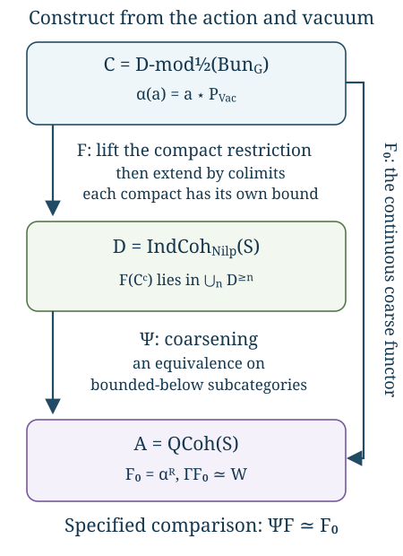

# Constructing the Langlands functor (GLC I)

Draft. Self-checked by the writing AI.

Let \(X\) be a smooth projective connected curve over an algebraically closed field \(k\) of characteristic zero. Let \(G\) be a connected reductive group, and let \(\check G\) be its Langlands dual. Fix a Borel subgroup \(B\), its unipotent radical \(N\), and a theta characteristic \(\kappa\) with \(\kappa^{\otimes2}\simeq\omega_X\). Put
\[
\mathcal B=\operatorname{Bun}_G,\qquad
S=\operatorname{LS}_{\check G},\qquad
\mathcal C=D\operatorname{-mod}_{1/2}(\mathcal B),\qquad
\mathcal A=\operatorname{QCoh}(S),\qquad
\mathcal D=\operatorname{IndCoh}_{\operatorname{Nilp}}(S).
\]
Here \(S\) is the derived stack of de Rham local systems, and the spectral nilpotent cone specifies the support condition on \(\mathcal D\). The t-structures are cohomological:
\[
H^i(M[n])=H^{i+n}(M).
\]
Thus \(k[-1]\) has its nonzero cohomology in degree \(1\). We call a functor left t-exact when it preserves degrees \(\ge0\), and right t-exact when it preserves degrees \(\le0\). “Eventually coconnective” will mean belonging to \(\bigcup_n\mathcal A^{\ge n}\), or the corresponding union in another category.

The construction has two stages. A specified spectral action and vacuum object give a functor \(F_0:\mathcal C\to\mathcal A\). A theorem about its compact images then permits a unique continuous lift \(F:\mathcal C\to\mathcal D\). Constructing these functors does not yet prove that \(F\) is an equivalence. The preceding lesson, [The categorical conjecture and its variants](the-categorical-conjecture-and-its-variants.md), explains the normalized conjecture and its full, restricted and tempered versions.

The diagram displays Theorems 11.1–11.3 below. Its lower triangle commutes with a specified natural equivalence \(\Psi F\simeq F_0\); it is not a claim that \(\Psi\) is an equivalence on the whole unbounded category.

## The automorphic category, action and vacuum

The half twist uses the square-root gerbe of the normalized determinant line. At a bundle \(E\), the determinant is normalized by
\[
\det R\Gamma(X,\mathfrak g_E)\otimes
\det R\Gamma(X,\mathfrak g_{\mathrm{triv}})^{-1}.
\]
The theta characteristic enters the square-root construction and the twisted \(N\)-bundle used below. The existence of this construction, its compatibility with Hecke operations and its descent are geometric inputs not proved in this lesson. Retain the half twist when comparing formulas; an arbitrary choice of an untwisted equivalence would not supply the required Hecke comparisons. See [Sheaves and D-modules on Bun_G](sheaves-and-d-modules-on-bun-g.md) for the specified category and its remaining foundations.

The spectral action begins with the Hecke action of the representation category over the Ran space. Evaluation of a local system gives the spectral localization
\[
\operatorname{Rep}(\check G)_{\operatorname{Ran}}
\longrightarrow \operatorname{QCoh}(S).
\]
To obtain an action of the target, the Hecke action must vanish on the kernel and have the compatible unit. Theorem C1 and the generalized-vanishing deduction in the preceding lesson prove the formal descent implication. They do not prove the actual geometric kernel vanishing, the Ran localization or derived Satake. In what follows, the resulting continuous \(\mathcal A\)-action is a specified input, denoted \(a\star c\).

Let
\[
\mathcal W=\operatorname{Bun}_{N,\rho(\omega_X)},\qquad
p:\mathcal W\longrightarrow\mathcal B.
\]
Here \(\rho\) is the half-sum of the positive coroots. The required Cartan twist is \(\rho(\omega_X)=(2\rho)(\kappa)\), defined using the integral cocharacter \(2\rho\) and the chosen theta characteristic even when \(\rho\) itself is not integral. The simple-root extension classes define a character
\(\chi:\mathcal W\to\mathbb A^1\). On \(\mathbb A^1\), choose the exponential D-module with the normalization multiplicative for ordinary \(*\)-pullback; it lies in the D-module heart shifted by \([-1]\). Write
\[
E_\chi=\chi^*\operatorname{exp},\qquad
P_{\mathrm{Vac}}=p_!E_\chi.
\]
The second expression uses the defined partial !-pushforward on this holonomic object, together with the specified trivialization of the pulled-back half twist. It does not assert that \(p_!\) is defined on every arbitrary D-module. Existence and compactness of \(P_{\mathrm{Vac}}\) are geometric inputs.

Use the following primary coefficient normalization:
\[
W(c)=\operatorname{Map}_{\mathcal C}(P_{\mathrm{Vac}},c)
\simeq\operatorname{Map}_{D\operatorname{-mod}(\mathcal W)}
              (E_\chi,p^!c).
\]
The comparison is the !-adjunction, when the stated pushforward and twist data exist. It fixes the whole natural coefficient functor, not just its value on one object.

An expression for this mapping complex as cohomology with a tensor factor uses the dual exponential character. Consequently a formula with \(E_\chi\) on both sides needs a specified change from \(\chi\) to \(-\chi\). The Cartan action supplies the geometric character-change comparison used in the construction. We do not discard its sign or identify the \(*\)-multiplicative and !-multiplicative exponential normalizations without a duality comparison. These comparisons, the tensor–Hom duality on the stack and the resulting coefficient identity remain unproved geometric inputs here.

Gaitsgory–Raskin, [Proof of the geometric Langlands conjecture I: construction of the functor](https://arxiv.org/abs/2405.03599v3), §§1.1–1.4, give these geometric ingredients. The proofs below establish what follows formally once the specified ingredients exist.

## The coarse functor from the spectral action

The formal construction starts with an action and one object. Let \(\mathcal A\) be a compactly generated presentable stable symmetric monoidal \(k\)-linear category. Its tensor product preserves colimits separately, its unit \(\mathbf1\) is compact, and every compact object of \(\mathcal A\) is dualizable. Let \(\mathcal C\) be a presentable stable \(\mathcal A\)-module category whose action preserves colimits separately, and let \(P\in\mathcal C\) be compact. Write
\[
\alpha(a)=a\star P,\qquad
W(c)=\operatorname{Map}_{\mathcal C}(P,c),\qquad
\Gamma(a)=\operatorname{Map}_{\mathcal A}(\mathbf1,a).
\tag{11.1}
\]
The mapping objects in these formulas are derived \(k\)-complexes. In the geometric application, \(\mathcal A=\operatorname{QCoh}(S)\), \(P\) is the specified vacuum Poincaré object, and \(W\) is the specified first global Whittaker coefficient. These geometric identifications are additional inputs.

We use the categorical framework of [The categorical conjecture and its variants](the-categorical-conjecture-and-its-variants.md), C0: the presentable adjoint theorem, enriched Yoneda, stable functor categories and the Ind universal property. The formal deductions below do not prove those foundations. A linear functor includes its natural action comparisons, unit and multiplication comparisons, and all higher coherences.

The compact unit also ensures that the dual of a compact dualizable object is compact: \(\operatorname{Map}_{\mathcal A}(v^\vee,a)\simeq\Gamma(v\otimes a)\), and the latter commutes with filtered colimits. Thus the compact tests and their duals remain in the same small rigid category.

**Theorem 11.1 (construction and coefficient normalization).** Under the preceding hypotheses, \(\alpha\) has a continuous right adjoint
\[
F_0=\alpha^R:\mathcal C\longrightarrow\mathcal A.
\tag{11.2}
\]
This right adjoint has a canonical coherent \(\mathcal A\)-linear structure and a canonical natural equivalence
\[
\eta:\Gamma F_0\xrightarrow{\sim}W.
\tag{11.3}
\]
The space of continuous \(\mathcal A\)-linear functors equipped with such a specified natural equivalence is contractible. In particular, this normalization determines the coarse functor. It does not assert that the coarse functor is an equivalence.

**Proof of existence and continuity.** The functor \(\alpha\) preserves colimits by the action hypothesis, so the presentable adjoint theorem supplies its right adjoint. If \(v\in\mathcal A^c\), duality gives
\[
\operatorname{Map}_{\mathcal C}(v\star P,c)
\simeq\operatorname{Map}_{\mathcal C}(P,v^\vee\star c).
\tag{11.4}
\]
The action by \(v^\vee\) is continuous. Compactness of \(P\) therefore shows that \(v\star P\) is compact: applying (11.4) to a filtered colimit gives the filtered colimit of its mapping complexes. Thus \(\alpha\) takes every compact object to a compact object.

For a filtered diagram \(c_i\), test the canonical comparison
\[
\operatorname*{colim}_iF_0(c_i)
\longrightarrow F_0\bigl(\operatorname*{colim}_i c_i\bigr)
\tag{11.5}
\]
against a compact \(v\in\mathcal A^c\). Compactness of \(v\), adjunction and compactness of \(\alpha(v)\) identify both resulting mapping complexes with
\(\operatorname*{colim}_i\operatorname{Map}_{\mathcal C}(v\star P,c_i)\), and identify the map with the identity on this colimit. Compact generators detect equivalences, so (11.5) is an equivalence.

The right adjoint is exact because finite limits and finite colimits agree in stable categories. An arbitrary coproduct is the filtered colimit of its finite subcoproducts. Exactness and the preservation just proved therefore imply that \(F_0\) preserves coproducts. The stable colimit argument in “Reconstructing an equivalence from compact objects” in the preceding lesson now applies: sequential colimits are cofibres of \(1-\mathrm{shift}\) on coproducts, geometric realizations are sequential colimits of finite skeletal attachments, and the coherent simplicial replacement computes any small colimit. Consequently \(F_0\) preserves all small colimits. This uses only the colimit part of that earlier proof; none of its full-faithfulness or equivalence hypotheses is being imposed here.

**Proof of linearity.** For any \(v\in\mathcal A\), define the projection-formula map
\[
\lambda_{v,c}:v\otimes F_0(c)\longrightarrow F_0(v\star c)
\tag{11.6}
\]
as the adjunction mate of
\[
\alpha\bigl(v\otimes F_0(c)\bigr)
\simeq v\star\alpha(F_0(c))
\xrightarrow{\,v\star\epsilon_c\,}v\star c,
\tag{11.7}
\]
where \(\epsilon\) is the counit. Suppose first that \(v\) is dualizable. For every \(a\in\mathcal A\), duality and adjunction give
\[
\begin{aligned}
\operatorname{Map}_{\mathcal A}(a,v\otimes F_0(c))
&\simeq\operatorname{Map}_{\mathcal A}(v^\vee\otimes a,F_0(c))\\
&\simeq\operatorname{Map}_{\mathcal C}((v^\vee\otimes a)\star P,c)\\
&\simeq\operatorname{Map}_{\mathcal C}(a\star P,v\star c)\\
&\simeq\operatorname{Map}_{\mathcal A}(a,F_0(v\star c)).
\end{aligned}
\tag{11.8}
\]
The map induced by (11.6) is precisely this chain: its definition as the mate of (11.7) fixes the comparison. Yoneda proves that (11.6) is an equivalence for dualizable \(v\), hence for every compact \(v\).

Every object of \(\mathcal A\) is a filtered colimit of compact objects under the Ind identification. Both sides of (11.6) preserve colimits in \(v\), including the right side by the continuity already proved. The comparison is therefore an equivalence for every \(v\).

There is also coherent module structure, not just a family of isomorphisms. The unit comparison is the mate of the unit action on \(\alpha\). For \(u,v\), the direct comparison for \(u\otimes v\) and the composite using \(\lambda_{u,v\star c}\) and \(u\otimes\lambda_{v,c}\) have, under adjunction, the two action composites from \(u\star v\star\alpha F_0(c)\) to \(u\star v\star c\). The module associativity and the natural counit identify them with their specified homotopy. The same argument transfers every higher unit and associativity homotopy: adjunction identifies the entire mapping spaces in which those homotopies live. The triangle identities ensure their compatibility with the unit and counit. Thus the mates construct the coherent \(\mathcal A\)-linear structure. Taking \(a=\mathbf1\) in adjunction gives (11.3), naturally in \(c\).

**Proof of uniqueness.** Let \(H:\mathcal C\to\mathcal A\) be another continuous \(\mathcal A\)-linear functor, with a specified natural equivalence \(\theta:\Gamma H\simeq W\). For every compact \(v\in\mathcal A^c\), use its dual to compute
\[
\begin{aligned}
\operatorname{Map}_{\mathcal A}(v,H(c))
&\simeq\Gamma(v^\vee\otimes H(c))\\
&\simeq\Gamma H(v^\vee\star c)\\
&\xrightarrow{\theta_{v^\vee\star c}}W(v^\vee\star c)\\
&\simeq\operatorname{Map}_{\mathcal C}(v\star P,c).
\end{aligned}
\tag{11.9}
\]
This is an equivalence of mapping complexes natural in both \(v\) and \(c\). Naturality in \(v\) includes all morphisms between compact tests, transported through duality. If \(a\simeq\operatorname*{colim}_i v_i\), mapping out of that colimit turns both sides into the corresponding limit, so (11.9) extends uniquely to
\[
\operatorname{Map}_{\mathcal A}(a,H(c))
\simeq\operatorname{Map}_{\mathcal C}(a\star P,c)
\qquad(a\in\mathcal A).
\tag{11.10}
\]
Thus \(H\) represents exactly the same functor as \(F_0\). Enriched Yoneda gives a natural equivalence \(H\simeq F_0\), respecting the specified coefficient comparisons.

It also respects the linear structure. For a compact \(u\), the two ways to compare its action, tested against \(v\), reduce to the same complex
\[
W(v^\vee\star u\star c)
\simeq
\operatorname{Map}_{\mathcal C}(v\star P,u\star c).
\]
On the other side of the action comparison one obtains this same complex by testing against \(u^\vee\otimes v\). The unit, duality and action coherences identify these descriptions, and naturality of \(\theta\) carries the identifications through (11.9). Yoneda on mapping spaces therefore supplies the compatible homotopy between the two linearity comparisons. For multiple compact action variables the same computation gives all higher module coherences. Continuity extends them to arbitrary variables. Full faithfulness of the Ind restriction and Yoneda says the space of these extensions and normalized equivalences is contractible. Applying the same mapping-space argument to transformations between two normalized choices proves the stated contractibility of the whole space of choices. \(\square\)

The normalization in this theorem is a natural identity on **every** \(c\), and the proof evaluates it on all \(v^\vee\star c\). An isomorphism only at \(c=P\) does not supply (11.9). Nor can equality of coefficient dimensions replace an equivalence of coefficient functors.

## An ordinary affine calculation

Let \(R\) be a commutative ordinary ring, and take
\(\mathcal A=\mathcal C=\operatorname{Mod}_R\), the unbounded derived category. Suppose \(P\) is a bounded complex of finitely generated projective \(R\)-modules. The object \(R\) is compact because \(\operatorname{Map}_R(R,M)\) is the underlying complex of \(M\). A finitely generated projective module is a retract of a finite sum of copies of \(R\), so it is compact. Finite shifts, finite cofibres and retracts preserve compactness. Constructing \(P\) by its finite filtration therefore proves its compactness.

The termwise dual
\[
P^\vee=\operatorname{RHom}_R(P,R)
\tag{11.11}
\]
is again a bounded complex of finitely generated projectives. In particular it is compact, and dualizing again gives \(P\): the finite-projective evaluation isomorphism in each degree commutes with the dual complex differentials. Evaluation \(P^\vee\otimes_R P\to R\) and the coevaluation corresponding to the identity of \(P\) give the duality maps. Their triangle identities are the finite-projective tensor–Hom identities, assembled with the cohomological signs. They also give the natural equivalence
\[
\operatorname{RHom}_R(P,M)\simeq P^\vee\otimes_R^{\mathbb L}M.
\tag{11.12}
\]
One can compute it directly using the bounded projective complex \(P\). Hom from a finitely generated projective module is exact because that module is a retract of a finite free module; tensoring by it is exact for the same reason. On an acyclic complex these operations therefore produce acyclic complexes. The total complex for the bounded complex \(P\) is built by finitely many shifts and cones from those complexes, so both constructions preserve quasi-isomorphisms even on unbounded arguments. Thus they compute the derived Hom and tensor in (11.12). The termwise finite-projective identity is an isomorphism of the total complexes, proving the displayed comparison. Consequently
\[
\alpha(a)=a\otimes_R^{\mathbb L}P,\qquad
F_0(M)=\operatorname{RHom}_R(P,M).
\tag{11.13}
\]
The adjunction follows from the tensor–Hom identity, and (11.12) exhibits continuity and \(R\)-linearity explicitly. The coefficient is the underlying complex of \(\operatorname{RHom}_R(P,M)\); \(\Gamma\) is underlying-complex forgetfulness in this affine case.

For a concrete example, take \(R=k[t]\) and \(P=k=R/(t)\). Its free resolution is
\[
Q=[R\xrightarrow{\ t\ }R],\qquad Q^{-1}=R,\quad Q^0=R.
\tag{11.14}
\]
The map is injective with cokernel \(k\), so \(Q\simeq k\). This proves that \(P\) is compact without requiring \(k\) itself to be projective over \(R\). The dual complex has terms in degrees \(0,1\) and differential \(-t\), which is isomorphic to the complex with differential \(t\). Hence
\[
P^\vee\simeq k[-1],\qquad
F_0(M)\simeq\operatorname{fib}(t:M\to M)
\simeq(k\otimes_R^{\mathbb L}M)[-1].
\tag{11.15}
\]
Our shift convention is \(H^i(M[n])=H^{i+n}(M)\). Consequently
\[
F_0(R)\simeq k[-1],\qquad
F_0(k)\simeq k\oplus k[-1].
\tag{11.16}
\]
The second equality follows by applying \(\operatorname{Hom}_R(Q,-)\) to \(k\), where multiplication by \(t\) is zero; its terms occupy degrees \(0,1\). The same computation with \(R[t^{-1}]\) has an invertible differential and gives
\(F_0(R[t^{-1}])=0\), although \(R[t^{-1}]\ne0\). Thus even this fully specified continuous linear coefficient functor need not be faithful or an equivalence.

## Lifting through coarsening on bounded objects

Let \(\mathcal A,\mathcal D\) be presentable stable \(k\)-linear categories with specified cohomological t-structures. Write
\[
\mathcal A_+=\bigcup_{n\in\mathbb Z}\mathcal A^{\ge n},
\qquad
\mathcal D_+=\bigcup_{n\in\mathbb Z}\mathcal D^{\ge n}.
\tag{11.17}
\]
Here “eventually coconnective” means bounded below in this convention: each individual object has some lower cohomological bound. These full subcategories are stable. A shift changes the bound by an integer; a finite sum uses the minimum of finitely many bounds; and a cofiber triangle changes that minimum by at most a finite shift. Retracts are bounded below as well. They need not be closed under arbitrary colimits.

For example, in \(\operatorname{Mod}_k\), every \(k[n]\) belongs to \(\mathcal A_+\), whereas
\(\bigoplus_{n\ge0}k[n]\) has nonzero cohomology in arbitrarily negative degrees. This is why the lift is first constructed on compacts and only afterwards extended to the whole category.

**Theorem 11.2 (continuous bounded lift).** Let \(\mathcal C\) be compactly generated, with
\(\mathcal C\simeq\operatorname{Ind}(\mathcal C^c)\). Suppose
\(\Psi:\mathcal D\to\mathcal A\) is exact and continuous and restricts to an equivalence of full stable subcategories
\[
\Psi_+:\mathcal D_+\xrightarrow{\sim}\mathcal A_+.
\tag{11.18}
\]
Let \(F_0:\mathcal C\to\mathcal A\) be continuous and satisfy
\[
F_0(c)\in\mathcal A_+\qquad(c\in\mathcal C^c).
\tag{11.19}
\]
Then there is a contractibly unique pair \((F,\varepsilon)\), where \(F:\mathcal C\to\mathcal D\) is continuous,
\[
\varepsilon:\Psi F\xrightarrow{\sim}F_0,
\qquad F(\mathcal C^c)\subset\mathcal D_+.
\tag{11.20}
\]
The comparison \(\varepsilon\) is part of the pair. The theorem asserts neither that \(F\) preserves compactness nor that \(F\) takes every object of \(\mathcal C\) to \(\mathcal D_+\).

**Proof.** Choose an inverse \(Q\) of (11.18), with its unit and counit, and form the exact functor
\[
F^c:\mathcal C^c\longrightarrow\mathcal D_+,
\qquad F^c=Q\circ F_0|_{\mathcal C^c}.
\tag{11.21}
\]
The Ind universal property extends the composite with the exact inclusion \(\mathcal D_+\subset\mathcal D\) uniquely to a continuous functor \(F:\mathcal C\to\mathcal D\). In a filtered compact presentation \(c\simeq\operatorname*{colim}_i c_i\), it has the concrete description
\[
F(c)\simeq\operatorname*{colim}_i Q(F_0(c_i)).
\tag{11.22}
\]
The colimit is taken in \(\mathcal D\). The Ind universal property supplies its independence of presentation, its action on morphisms and its full functorial coherences; the objectwise formula alone would not establish those points.

On compacts, the counit for \(\Psi_+Q\) gives the comparison (11.20). Both \(\Psi F\) and \(F_0\) are continuous, so the same universal property extends that natural equivalence uniquely to all of \(\mathcal C\).

To prove uniqueness, let \((F',\varepsilon')\) be another pair. Its compact restriction takes values in \(\mathcal D_+\). The full faithfulness of (11.18) identifies its mapping spaces of functors and transformations with those of its image in \(\mathcal A_+\). Over the fixed functor \(F_0|_{\mathcal C^c}\) and fixed comparisons, the space of lifts is therefore contractible. Restriction
\[
\operatorname{Fun}^{L}(\mathcal C,\mathcal D)
\xrightarrow{\sim}
\operatorname{Fun}^{\mathrm{ex}}(\mathcal C^c,\mathcal D)
\tag{11.23}
\]
is the Ind equivalence, including entire mapping spaces. It extends the unique compact comparison, its compatibility with \(\varepsilon,\varepsilon'\), and every higher homotopy. This proves contractible uniqueness. \(\square\)

No common integer \(n\) appears in (11.19). Each compact object may have its own lower bound. Furthermore, (11.18) is full faithfulness only on the indicated full subcategories. The proof never uses full faithfulness of \(\Psi\) on arbitrary objects of \(\mathcal D\).

**Theorem 11.3 (linear bounded lift).** In Theorem 11.2, assume additionally that \(\mathcal A\) has the rigid compact generation used in Theorem 11.1, that \(\mathcal C,\mathcal D\) are continuous \(\mathcal A\)-module categories, and that \(\Psi\) is a specified coherent \(\mathcal A\)-linear functor. Require action by each \(v\in\mathcal A^c\) to preserve \(\mathcal A_+\) and \(\mathcal D_+\). Finally, \(F_0\) is a **specified coherent \(\mathcal A\)-linear functor**. Then the lift has a contractibly unique coherent \(\mathcal A\)-linear structure for which \(\varepsilon\) is linear.

**Proof.** First, action by a dualizable compact \(v\) preserves \(\mathcal C^c\). Indeed
\(\operatorname{Map}_{\mathcal C}(v\star c,-)\simeq\operatorname{Map}_{\mathcal C}(c,v^\vee\star-)\), and the functor on the right preserves filtered colimits when \(c\) is compact. Thus, for \((v,c)\in\mathcal A^c\times\mathcal C^c\), both
\(v\star F^c(c)\) and \(F^c(v\star c)\) lie in \(\mathcal D_+\). The latter assertion uses compactness of \(v\star c\); the former uses the bounded-subcategory stability hypothesis.

Their images under \(\Psi\) have the specified equivalence
\[
\begin{aligned}
\Psi(v\star F^c(c))
&\simeq v\otimes\Psi F^c(c)\\
&\xrightarrow{\,v\otimes\varepsilon_c\,}v\otimes F_0(c)\\
&\simeq F_0(v\star c)\\
&\xleftarrow{\ \varepsilon_{v\star c}\ }\Psi F^c(v\star c).
\end{aligned}
\tag{11.24}
\]
Full faithfulness of \(\Psi_+\) lifts this to a natural equivalence
\(v\star F^c(c)\simeq F^c(v\star c)\), uniquely in its full mapping space. The middle comparison in (11.24) is the given linearity of \(F_0\); an unspecified objectwise compatibility would not supply the coherent natural transformation being lifted.

The unit and iterated action comparisons also live in \(\mathcal D_+\). Tensor products of compact objects are compact: mapping from \(u\otimes v\) is mapping from \(v\) after the continuous functor \(u^\vee\otimes-\). Consequently every finite compact action string remains among these tests. Its coherence homotopies are the lifts, through the full mapping-space equivalence \(\Psi_+\), of the given coherence homotopies for \(F_0\), \(\Psi\) and \(\varepsilon\). This constructs all coherent module data on the compact restriction.

The two functors
\[
(a,c)\longmapsto a\star F(c),\qquad
(a,c)\longmapsto F(a\star c)
\]
preserve colimits separately. Applying the Ind equivalence one variable at a time says that their natural-transformation space is determined fully by restriction to \(\mathcal A^c\times\mathcal C^c\). Thus the compact comparison extends uniquely to every \((a,c)\), and is an equivalence there by continuity. The same assertion in every finite number of action variables extends the entire coherent module structure and the linearity of \(\varepsilon\). It proves uniqueness on mapping spaces, rather than only uniqueness of an isomorphism class. \(\square\)

Rigid compact generation alone does not imply preservation of a chosen t-structure's bounded-below subcategory by compact tensor actions. That bounded stability is a separate hypothesis. In the intended spectral application it comes from the geometric finite-amplitude properties of the perfect action. Likewise, (11.18) and the compact-image theorem (11.19) must be established for the actual coarsening functor and actual coarse Langlands functor before these formal theorems apply.

## Bounds on individual compacts need not be uniform

Here is an example where even degree-zero compact generators require lower bounds tending to minus infinity. Take
\[
\mathcal C=\prod_{n\ge0}\operatorname{Mod}_k,
\qquad\mathcal A=\mathcal D=\operatorname{Mod}_k,
\qquad\Psi=\operatorname{id}.
\tag{11.25}
\]
Give \(\mathcal C\) the pointwise t-structure and the pointwise \(\operatorname{Mod}_k\)-action. Let \(e_n(V)\) denote the object with component \(V\) in position \(n\) and zero elsewhere. The objects \(e_n(k)\) are compact, since mapping from them is evaluation at the \(n\)-th component, and they detect zero objects. Every tuple is the coproduct of its individual components, and each complex of vector spaces is a colimit of finite sums of shifts of \(k\). Hence these objects compactly generate \(\mathcal C\).

More precisely, a compact object has finite support. Write any tuple \(c\) as the filtered colimit of its finite-support subtuples. If \(c\) is compact, its identity factors through one such subtuple; it is a retract of that finite-support tuple and is therefore zero outside its finite support. Its components are compact complexes: this follows by testing compactness on diagrams supported in one component. Conversely, a finite-support tuple of compact complexes is compact, since its mapping complex is a finite product of component mapping complexes. Over a field, a complex splits, by choosing complements to boundaries and cycles, into its graded cohomology and a contractible complex. Expressing that graded vector space as the filtered colimit of its finite-dimensional finite-degree subspaces shows that compact objects have finite-dimensional cohomology in finitely many degrees. Compactness makes the identity factor through a finite such subspace. Conversely, an object with this cohomology is represented by a finite sum of shifts of \(k\) and is compact.

Define the continuous \(\operatorname{Mod}_k\)-linear functor
\[
F_0((c_n)_{n\ge0})=\bigoplus_{n\ge0}c_n[n].
\tag{11.26}
\]
Colimits are computed componentwise, and shifts and coproducts preserve them, so this is indeed continuous. Every compact tuple has finitely many perfect components; its image is therefore a finite sum of bounded complexes and belongs to \(\mathcal A_+\). All hypotheses of Theorem 11.2 hold, and the lift is simply \(F=F_0\).

Nevertheless
\[
e_n(k)\in\mathcal C^c\cap\mathcal C^{\ge0},
\qquad F_0(e_n(k))=k[n],
\qquad H^{-n}(k[n])=k.
\tag{11.27}
\]
For every integer \(N\), choose \(n\ge0\) with \(-n<N\). Then \(F_0(e_n(k))\notin\mathcal A^{\ge N}\). Thus there is no uniform lower bound even on the degree-zero compact generators. Moreover, the noncompact tuple \((k,k,\ldots)\) is bounded below in \(\mathcal C\), whereas its image \(\bigoplus_{n\ge0}k[n]\) is not bounded below. These computations distinguish the compact-image hypothesis from either a uniform amplitude estimate or preservation of bounded-below objects on the whole source.

## The torus normalization

Let \(G=T\) be a torus. Its unipotent radical is trivial, its positive-root sum is zero, and \(\mathcal W=\mathrm{pt}\). The map \(p:\mathrm{pt}\to\operatorname{Bun}_T\) is the point given by the trivial bundle with its specified trivialization. It is not the residual gerbe \(BT\). The exponential factor is now the coefficient field, so
\[
P_{\mathrm{Vac}}=p_!k,\qquad
W(c)=\operatorname{Map}(p_!k,c)\simeq p^!c.
\]
The last expression is a complex of \(k\)-vector spaces and uses the defined point !-adjunction.

Denote the enhanced Fourier–Mukai–Laumon functor by
\[
\Phi_T:D\operatorname{-mod}(\operatorname{Bun}_T)
       \longrightarrow\operatorname{QCoh}(\operatorname{LS}_{\check T}).
\]
Let \(\tau_T\) be the automorphic involution induced by inversion of \(T\). With the Hecke convention in this course, the candidate is
\[
F_0\simeq\Phi_T\circ\tau_T.
\]
This inversion is part of the normalization: dualizing a character changes it to its inverse. The de Rham Poincaré kernel, its enhancement for the entire bundle stack, and the normalized comparisons
\[
(\Phi_T\tau_T)(a\star c)\simeq a\otimes(\Phi_T\tau_T)(c),
\qquad
\Gamma(S,(\Phi_T\tau_T)(c))\simeq p^!c
\]
are required geometric inputs. Their unit, action and character comparisons must be natural in \(a,c\). Gaitsgory–Raskin, §1.5 of the free paper above, identify this normalization.

**Exercise 11.1.** Identify the coarse functor for a torus, retaining its coefficient and Cartan convention.

**Solution 11.1.** Assume the specified enhanced transform and the two natural comparisons just displayed. Its composite with \(\tau_T\) is continuous and \(\operatorname{QCoh}(S)\)-linear, and its coefficient is precisely \(W\). The normalized uniqueness in Theorem 11.1 gives the asserted equivalence with \(\alpha^R\), compatible with the coefficient comparison. This proves the identification from those inputs; it does not prove the global Poincaré-kernel theorem. For \(\mathbb G_m\), the local-system inversion sends a line connection \((L,\nabla)\) to \((L^{-1},\nabla^\vee)\); the automorphic inversion sends a line bundle to its inverse. These are the two appearances of the same inverse-character convention.

The nilpotent cone for a torus has zero Lie-theoretic nilpotent directions. Turning that observation into
\(\operatorname{IndCoh}_{0}(S)\simeq\operatorname{QCoh}(S)\) requires the zero-singular-support theorem for the actual derived stack. That theorem is still an unproved input here. Under this comparison the full lift is the same normalized transform. The rank-one calculations and outstanding global foundations are given in [The GL_1 case as an equivalence of categories](the-gl-1-case-as-an-equivalence-of-categories.md).

## The restricted Whittaker exactness input

Let \(X\) be a smooth, projective, connected curve over an algebraically closed field of characteristic zero, and let \(G\) be a connected reductive group. Fix a Borel subgroup, its unipotent radical \(N\), and a square root of \(\omega_X\). Write

\[
\mathcal B=\operatorname{Bun}_G,\qquad
\mathcal W=\operatorname{Bun}_{N,\rho(\omega_X)},\qquad
d_G=\dim\mathcal B,\quad d_N=\dim\mathcal W,\quad
b=d_G-d_N.
\]

We use cohomological shifts, so \(H^i(K[n])=H^{i+n}(K)\). A left t-exact functor preserves the subcategory in degrees \(\geq0\); a right t-exact functor preserves the subcategory in degrees \(\leq0\).

The input required by Gaitsgory–Raskin, *Proof of the geometric Langlands conjecture I*, §2.3, Theorem `t:L coarse left exact Nilp`, concerns the functor

\[
L^{\mathrm{restr}}_{G,\mathrm{coarse}}[b]:
D_{1/2,\mathrm{Nilp}}(\mathcal B)
\longrightarrow
\operatorname{QCoh}(\operatorname{LS}^{\mathrm{restr}}_{\check G}).
\]

For the coefficient argument write \(\mathcal C_N=\operatorname{Shv}_{\mathrm{Nilp}}(\mathcal B)\). Its identification with the half-twisted nilpotent automorphic category, including the t-structure, is an additional geometric input. The displayed restricted functor is t-exact by the stated input. In particular, it preserves degrees \(\geq0\). This is stronger than the left t-exactness needed for the construction in GLC I, and it applies only after imposing nilpotent singular support and passing to the restricted spectral stack.

## Formal detection of exactness

**Lemma.** Let \(\mathcal D\) be a stable category with a t-structure, and let \(T_a:\mathcal D\to\mathcal E_a\) be exact, t-exact functors that are jointly conservative. Then the family reflects both halves of the t-structure.

**Proof.** Suppose every \(T_aK\) lies in degrees \(\geq0\). T-exactness implies

\[
T_a(\tau^{\leq-1}K)=\tau^{\leq-1}(T_aK)=0.
\]

Joint conservativity gives \(\tau^{\leq-1}K=0\), and the truncation triangle gives \(K\in\mathcal D^{\geq0}\). The proof for degrees \(\leq0\) uses \(\tau^{\geq1}\). No completeness assumption on the t-structure is needed. \(\square\)

For the restricted local-system stack, the relevant probes have the form

\[
T_{V,x}(K)=\Gamma_!\bigl(
\operatorname{LS}^{\mathrm{restr}}_{\check G},
K\otimes\mathcal E_{V,x}\bigr),
\]

where \(x\in X\), \(V\) is a representation of \(\check G\), and \(\mathcal E_{V,x}\) is the associated tautological vector bundle. Their t-exactness and joint conservativity are geometric properties of the restricted spectral stack; the formal lemma does not prove them. The use of \(\Gamma_!\) here must be preserved.

**Conditional exactness theorem.** Suppose an exact functor \(F:\mathcal C_N\to\mathcal D\) satisfies

\[
T_{V,x}(F(M)[b])\simeq
c(H_{V,x}(M))
\]

for every \(V\), where the probes are t-exact and jointly conservative, and every functor \(c\circ H_{V,x}\) is t-exact. Then \(F[b]\) is t-exact.

**Proof.** For \(M\) in either half of the t-structure, the right-hand side belongs to the same half. Every probe of \(F(M)[b]\) therefore belongs to that half. Apply the lemma. \(\square\)

This theorem reduces coarse exactness to the exactness of the normalized Whittaker coefficient after the relevant Hecke operation, together with the spectral detection theorem. Neither the conservativity of a single scalar coefficient nor the Euler characteristic of that coefficient is a substitute for these hypotheses.

## The index identity and its consequence for perverse sheaves

Færgeman–Raskin, *Non-vanishing of geometric Whittaker coefficients for reductive groups*, §5.2, define

\[
\operatorname{coeff}_{\mathrm{FR}}(M)=
C_{\mathrm{dR}}\bigl(\mathcal W,
p^!M\mathbin{\otimes^!}\psi^!\operatorname{exp}_!\bigr)[-d_N].
\]

Their exponential is normalized to have degree \(-1\) on \(\mathbb A^1\) and to be multiplicative for !-pullback. Their coefficient exactness theorem is that

\[
c:=\operatorname{coeff}_{\mathrm{FR}}[d_G]:
\operatorname{Shv}_{\mathrm{Nilp}}(\mathcal B)
\longrightarrow\operatorname{Vect}
\]

is t-exact. In their §6.1, Theorem `t:index`, the index identity is

\[
\chi\bigl(\operatorname{coeff}_{\mathrm{FR}}(M)\bigr)
=(-1)^{d_G}m_{\mathrm{Kos}}(M),
\]

for a constructible sheaf \(M\) with nilpotent singular support. Here \(m_{\mathrm{Kos}}(M)\) is the multiplicity of its characteristic cycle along the component of the global nilpotent cone containing the global Kostant point.

**Proposition.** Assume these two geometric theorems. For a constructible perverse sheaf \(P\) with nilpotent singular support,

\[
\dim H^0(c(P))=m_{\mathrm{Kos}}(P).
\]

Consequently, \(c(P)=0\) if and only if \(m_{\mathrm{Kos}}(P)=0\).

**Proof.** Exactness puts \(c(P)\) in the heart of \(\operatorname{Vect}\); constructibility makes it finite-dimensional. Since \(c(P)=\operatorname{coeff}_{\mathrm{FR}}(P)[d_G]\),

\[
\chi(c(P))=(-1)^{d_G}
\chi(\operatorname{coeff}_{\mathrm{FR}}(P))
=m_{\mathrm{Kos}}(P).
\]

The Euler characteristic of a vector space in degree zero is its dimension. A finite-dimensional vector space has dimension zero precisely when it is zero. \(\square\)

The index identity alone does not prove exactness. For example, a nonzero complex with one-dimensional cohomology in degrees zero and one has Euler characteristic zero. In particular, an index calculation cannot establish the vanishing of higher Whittaker cohomology.

## Two further formal deductions

**Lemma.** If \(i:\mathcal C_{N,0}\hookrightarrow\mathcal C_N\) is a t-exact inclusion with right adjoint \(i^R\), then \(i^R\) is left t-exact.

**Proof.** For \(M\in\mathcal C_N^{\geq0}\) and \(A\in\mathcal C_{N,0}^{\leq-1}\), adjunction and t-exactness give

\[
\operatorname{Hom}_{\mathcal C_{N,0}}(A,i^RM)
=\operatorname{Hom}_{\mathcal C_N}(iA,M)=0.
\]

The defining orthogonality of a t-structure gives \(i^RM\in\mathcal C_{N,0}^{\geq0}\). \(\square\)

**Lemma.** Let \(\mathcal C_N\) be a dualizable presentable linear category, and let \(\lambda:\mathcal C_N\to\operatorname{Vect}\) be continuous. If \(u_{\mathcal C_N}\in\mathcal C_N\otimes\mathcal C_N^\vee\) is the coevaluation object, then

\[
(\lambda\otimes\mathrm{id})(u_{\mathcal C_N})=\lambda
\quad\text{in}\quad
\mathcal C_N^\vee=\operatorname{Funct}_{\mathrm{cont}}(
\mathcal C_N,\operatorname{Vect}).
\]

**Proof.** Evaluate the object on \(c\in\mathcal C_N\). The snake identity identifies the contraction of \(u_{\mathcal C_N}\) with \(c\) with \(c\) itself. Applying \(\lambda\) yields \(\lambda(c)\). The resulting natural equivalence of continuous functors gives the stated equality. \(\square\)

This explains the formal passage in Færgeman–Raskin §8.1 from Lin's kernel identity to

\[
\operatorname{Mir}(\operatorname{coeff}_{\mathrm{FR}})
\simeq\operatorname{Poinc}_![-2d_G].
\]

The kernel identity itself is a separate geometric assertion:

\[
(\operatorname{coeff}_{\mathrm{FR}}\otimes\mathrm{id})
\bigl(\Delta_!\underline{k}_{\mathcal B}\bigr)
\simeq\operatorname{Poinc}_![-2d_G],
\qquad
\underline{k}_{\mathcal B}=\omega_{\mathcal B}[-2d_G].
\]

The lemma identifies the contraction of the coevaluation object; miraculous duality identifies its image with the displayed diagonal kernel. Applying the kernel identity then proves the equation for \(\operatorname{Mir}\). It does not construct Lin's comparison map or prove that it is an isomorphism.

## The two coefficient normalizations

Let \(P_{\mathrm{GLC}}=p_!\chi^*\operatorname{exp}_*\), so \(c_{\mathrm{GLC}}=\operatorname{Hom}(P_{\mathrm{GLC}},-)\). GLC I uses an exponential multiplicative for *-pullback, in \(D(\mathbb A^1)^\heartsuit[-1]\). Færgeman–Raskin use \(\operatorname{exp}_!\) multiplicative for !-pullback, in degree \(-1\). Their §5.4.1 gives
\[
P_{\mathrm{FR}}
=p_!(-\psi)^*(\operatorname{exp}_![-2])[d_N].
\]
Assume the geometric exponential and Cartan character-change comparisons, including their half twists. These are not proved here. Choose \(\chi=-\psi\); then \(\operatorname{exp}_*=\operatorname{exp}_![-2]\), and adjunction gives
\[
P_{\mathrm{FR}}=P_{\mathrm{GLC}}[d_N],
\qquad
\operatorname{coeff}_{\mathrm{FR}}=c_{\mathrm{GLC}}[-d_N].
\]
Changing the sign of all simple-root characters is harmless through the Cartan action, as GLC I §1.3 explicitly observes. Thus
\[
c_{\mathrm{GLC}}[b]=\operatorname{coeff}_{\mathrm{FR}}[d_G].
\tag{N}
\]
This explains the exact shift in the restricted coarse theorem.

## A complete deduction of coefficient exactness at geometric premises

Write \(\mathcal C_N=\operatorname{Shv}_{\mathrm{Nilp}}(\mathcal B)\), \(a_D=\operatorname{coeff}_D\), and \(b_D=\operatorname{coeff}_{D,!}\). The latter is defined by
\[
b_D(M)=C_{c,\mathrm{dR}}\bigl(\operatorname{Bun}_N^{\Omega(-D)},
p_D^*M\mathbin{\otimes^*}\psi_D^*(\operatorname{exp}_![-2])\bigr)
[\dim\operatorname{Bun}_N^{\Omega(-D)}].
\]
The geometric premises are the following precise assertions. Projection formula and base change for the Whittaker correspondence, and ordinary Verdier conjugation for the locally compact holonomic objects in question, are also assumed as part of the six-functor formalism.

1. Lin's kernel identity is the displayed identity in the preceding section. Miraculous duality carries the coevaluation kernel to \(\Delta_!\underline{k}_{\mathcal B}\).
2. The nilpotent kernel-pairing theorem says
   \[
   \lambda|_{\mathcal C_N}
   \simeq C_{c,\mathrm{dR}}(\mathcal B,
   \operatorname{Mir}(\lambda)\mathbin{\otimes^*}-).
   \tag{K}
   \]
   Færgeman–Raskin §8.2, Lemma labeled l:nilp-kernel, cite [Arinkin–Gaitsgory–Kazhdan–Raskin–Rozenblyum–Varshavsky, *Duality for automorphic sheaves with nilpotent singular support*](https://arxiv.org/abs/2012.07665), Corollary 4.3.7, for (K).
3. With the Hecke-side and inverse-character conventions of their §5.3,
   \[
   a_D=a_0\circ H_{V^D},\qquad b_D=b_0\circ H_{V^D}.
   \tag{CS}
   \]
   These are the geometric Casselman–Shalika formula and its compact-support analogue, labeled t:cs and c:cs-!.
4. For a sufficiently large conductor, the Whittaker stack is affine and the D-module amplitude estimates give
   \[
   a_D(\mathcal C_N^{\leq0})\subset\operatorname{Vect}^{\leq d_G},
   \qquad b_D(\mathcal C_N^{\geq0})\subset\operatorname{Vect}^{\geq-d_G}.
   \tag{A}
   \]
5. The tempered quotient \(q:\mathcal C_N\to\mathcal C_N^{\mathrm{temp}}\) is t-exact, is essentially surjective, and has a fully faithful left adjoint. All the \(a_D\) factor through it. The quotient is Hecke-linear, and every \(H_{V,x}\) for finite-dimensional \(V\) is t-exact on this quotient. These are the nilpotent forms of Færgeman–Raskin §7, Theorem labeled t:hecke-exact, and §7.6. The Hecke exactness statement concerns the tempered quotient.

**Comparison proof.** The coevaluation lemma, miraculous duality, and Lin's kernel identity give
\[
\operatorname{Mir}(a_0)=P_{\mathrm{FR}}[-2d_G].
\]
Insert this equality into (K), substitute the formula for \(P_{\mathrm{FR}}\), and apply the compact-support projection formula and base change. One obtains
\[
a_0=b_0[-2d_G]\quad\text{on }\mathcal C_N.
\]
Apply (CS) to both sides:
\[
a_D=b_D[-2d_G]\quad\text{on }\mathcal C_N.
\tag{C}
\]
This supplies the entire categorical deduction in Færgeman–Raskin §8.2, Theorem labeled t:coeff-!, and Corollary labeled c:coeff-!-D, from their geometric inputs.

For locally compact nilpotent sheaves, ordinary Verdier conjugation gives
\[
a_0(\mathbb D M)=a_0(M)^\vee[-2d_G],
\qquad
a_0[d_G](\mathbb D M)=(a_0d_G)^\vee.
\]
The second formula follows because duality reverses shifts. It records the precise coefficient-duality normalization.

**Large-conductor exactness.** The first bound in (A) gives \(a_D[d_G](\mathcal C_N^{\leq0})\subset\operatorname{Vect}^{\leq0}\). If \(M\in\mathcal C_N^{\geq0}\), the second bound and (C) imply
\[
a_D(M)=b_D(M)[-2d_G]\in\operatorname{Vect}^{\geq d_G}.
\]
Shifting by \(d_G\) puts it in degrees \(\geq0\). Thus \(a_D[d_G]\) is t-exact for a large conductor.

**Lemma (descent through a t-exact quotient).** If \(q:\mathcal A\to\mathcal Q\) is an essentially surjective t-exact quotient and \(f=\bar f q\) is t-exact, then \(\bar f\) is t-exact.

**Proof.** A lift \(A\) of \(Q\in\mathcal Q^{\leq0}\) can be replaced by \(\tau^{\leq0}A\), since \(q\) commutes with truncation and \(q(\tau^{\leq0}A)=Q\). Apply \(f\) to this lift. For \(Q\in\mathcal Q^{\geq0}\), use \(\tau^{\geq0}A\). \(\square\)

Choose a dominant coweight \(\lambda\) with \(D=\lambda x\) large. The dual of \(V^\lambda\) has highest weight \(-w_0(\lambda)\). Equivariant coevaluation \(k\to V^\lambda\otimes(V^\lambda)^\vee\) followed by evaluation is multiplication by \(\dim V^\lambda\). This scalar is invertible in characteristic zero; dividing evaluation by it gives a splitting. Thus the trivial representation is a direct summand of \(V^\lambda\otimes(V^\lambda)^\vee\). Hence \(a_0[d_G]\) is a retract of
\[
a_0[d_G]\circ H_{V^\lambda}\circ H_{(V^\lambda)^\vee}
=a_D[d_G]\circ H_{(V^\lambda)^\vee}.
\]
The latter factors through the t-exact descended large-conductor coefficient, a t-exact tempered Hecke functor, and the t-exact quotient \(q\). It is t-exact. Both halves of a t-structure are closed under retracts, so \(a_0[d_G]\) is t-exact. Formula (CS), descent, and Hecke exactness then prove the same assertion for every \(a_D[d_G]\). This is the full formal proof of the coefficient exactness theorem in Færgeman–Raskin §8.3.

The large-conductor premise can be stated with a safe explicit bound. For a positive root \(\alpha\), put \(h_\alpha=\langle\alpha,\rho\rangle\). The associated root line is
\[
\omega_X^{h_\alpha}(-\langle\alpha,D\rangle),
\]
so the inequalities
\[
\langle\alpha,D\rangle>2h_\alpha(g-1)
\quad\text{for every positive root }\alpha
\tag{L}
\]
give negative degree and therefore \(H^0=0\) for all root lines. Such conductors exist: \(D=2n\rho\cdot x\) with a positive integer \(n>g-1\) satisfies (L). A central root filtration of \(N\), vanishing of \(H^2\) on a curve, and the description of torsors under additive vector groups then give the affine Whittaker moduli scheme used in (A). These torsor and D-module facts remain geometric premises here.

## Applying the deduction to the actual coarse functor

Let \(Y=\operatorname{LS}^{\mathrm{restr}}_{\check G}\). Its functional \(\Gamma_!\) is dual to \(\mathcal O_Y\) under the canonical self-duality of \(\operatorname{QCoh}(Y)\). The geometric spectral premise is that
\[
T_{V,x}(K)=\Gamma_!(Y,K\otimes\mathcal E_{V,x})
\]
is a jointly conservative t-exact family. Færgeman–Raskin §1.6.2 connect this with the ind-affine formal-scheme presentation of the framed restricted stack, citing AGKRRV's restricted-local-system theorem. Their §10.2 constructs the enhanced coefficient and proves the action compatibility
\[
a_0(\mathcal G\star M)=
\Gamma_!(Y,\mathcal G\otimes a_0^{\mathrm{enh}}(M)).
\]

The normalization (N), the spectral action, and Hecke compatibility give
\[
T_{V,x}\bigl(L^{\mathrm{restr}}_{G,\mathrm{coarse}}(M)[b]\bigr)
=a_0(H_{V,x}M)[d_G].
\]
The right-hand functor factors through \(q\), a t-exact tempered Hecke functor, and the descended t-exact normalized coefficient proved above. Apply the probe-reflection lemma to conclude that \(L^{\mathrm{restr}}_{G,\mathrm{coarse}}[b]\) is t-exact. This argument uses the constructed coarse/enhanced functor and its compatibility; it assumes no Langlands equivalence. The spectral probes and compatibility remain geometric premises.

## The boundedness reduction and its geometric premises

The passage from the coarse functor to its bounded lift uses two statements: compact automorphic objects are bounded below, and the coarse functor has a finite lower amplitude. Gaitsgory–Raskin prove them in the construction paper, §2. The reduction of the second statement to restricted t-exactness can be proved formally once its geometric comparisons are specified. We use cohomological shifts:
\[
H^i(E[s])=H^{i+s}(E),\qquad
E\in\mathcal E^{\ge a}\Longleftrightarrow E[s]\in\mathcal E^{\ge a-s}.
\]
All functors in the reductions are exact. The stable categorical and t-structure foundations remain the prerequisites stated earlier in the lesson.

Let \(\mathcal C,\mathcal C_{\mathrm{restr}}\) be the full and restricted automorphic categories and let \(\mathcal A,\mathcal A_{\mathrm{restr}}\) be the full and restricted spectral categories. Here \(\mathcal A=\operatorname{QCoh}(S)\), where \(S\) is the derived de Rham local-systems stack. The \(!\)-criterion requires \(S\) to be an eventually coconnective algebraic stack with finite classical dimension; these geometric properties and the canonical t-structures are included among its premises. Put
\[
W_N=\operatorname{Bun}_{N,\rho(\omega_X)},\qquad
b=\dim\operatorname{Bun}_G-\dim W_N,
\qquad \delta=\dim S^{\mathrm{cl}}.
\]
The dimensions, restricted categories and normalized functors below are geometric data. In particular, \(\delta\) is the dimension of the classical algebraic stack, with its stack dimension convention; it is not being replaced by a virtual dimension.

Assume the following inputs, including their versions after every field extension \(K/k\).

1. Every compact object of \(\mathcal C\) belongs to \(\mathcal C^{\ge m}\) for some integer \(m\) depending on that object.
2. There are exact functors \(r_{\mathrm{aut}}:\mathcal C\to\mathcal C_{\mathrm{restr}}\) and \(r_{\mathrm{spec}}:\mathcal A\to\mathcal A_{\mathrm{restr}}\), with \(r_{\mathrm{aut}}(\mathcal C^{\ge0})\subset\mathcal C_{\mathrm{restr}}^{\ge0}\), and a specified natural comparison
   \[
   r_{\mathrm{spec}}F_0\simeq F_{0,\mathrm{restr}}r_{\mathrm{aut}}.
   \]
   Here \(r_{\mathrm{spec}}\) is the right adjoint to the specified fully faithful inclusion \(\iota_{\mathrm{spec}}:\mathcal A_{\mathrm{restr}}\hookrightarrow\mathcal A\). These comparisons and the functors commute with extension of the ground field, and those field pullbacks preserve the bounds used here.
3. The normalized restricted functor \(F_{0,\mathrm{restr}}[b]\) is t-exact.
4. For every \(K/k\) and \(K\)-rational point \(\sigma\) of \(S_K\), point pushforward factors through the restricted spectral category. Taking right adjoints gives a specified comparison
   \[
   i_\sigma^!\simeq i_{\sigma,\mathrm{restr}}^!r_{\mathrm{spec},K},
   \qquad
   i_{\sigma,\mathrm{restr}}^!(\mathcal A_{\mathrm{restr},K}^{\ge0})
   \subset\operatorname{Mod}_K^{\ge0}.
   \]
   Here \(i_\sigma^!\) is the possibly noncontinuous right adjoint to point pushforward. The factorization assertion includes a specified restricted point pushforward and its right adjoint. It is not ordinary tensor pullback.
5. The spectral \(!\)-fibre criterion has its stated dimension loss: if \(M\in\operatorname{QCoh}(S)\) satisfies \(i_\sigma^!(M_K)\in\operatorname{Mod}_K^{\ge0}\) for every such field and point, then
   \[
   M\in\operatorname{QCoh}(S)^{\ge-\delta}.
   \]

These are the inputs in [Gaitsgory–Raskin, *Construction of the functor*, §2](https://arxiv.org/abs/2405.03599v3). The restricted t-exactness input is attributed there to Færgeman–Raskin. None of these global geometric statements follows from the coefficient/Yoneda construction.

The stated right-adjoint factorization is a formal consequence of the pushforward factorization and the supplied adjoints. For every \(V\in\operatorname{Mod}_K\), their adjunctions identify
\[
\operatorname{Map}_{\mathcal A_K}((i_\sigma)_*V,M)
\simeq\operatorname{Map}_{\mathcal A_{\mathrm{restr},K}}
((i_{\sigma,\mathrm{restr}})_*V,r_{\mathrm{spec},K}M)
\simeq\operatorname{Map}_K(V,i_{\sigma,\mathrm{restr}}^!r_{\mathrm{spec},K}M).
\]
Yoneda gives the comparison in input 4, naturally with its adjunction coherences. This supplies no ordinary-fibre comparison.

**Proposition (formal lower amplitude).** Under inputs 2–5,
\[
c\in\mathcal C^{\ge m}
\quad\Longrightarrow\quad
F_0(c)\in\mathcal A^{\ge m+b-\delta}.
\]
Thus, with \(D=\delta-b\), the shifted functor \(F_0[-D]\) preserves \(\ge0\).

**Proof.** Exactness of \(r_{\mathrm{aut}}\) extends its \(\ge0\) preservation to every bound, so \(r_{\mathrm{aut}}(c)\in\mathcal C_{\mathrm{restr}}^{\ge m}\). Restricted t-exactness gives
\[
F_{0,\mathrm{restr}}(r_{\mathrm{aut}}c)[b]
\in\mathcal A_{\mathrm{restr}}^{\ge m},
\quad\text{hence}\quad
r_{\mathrm{spec}}F_0(c)\in\mathcal A_{\mathrm{restr}}^{\ge m+b}.
\]
After extending to any field \(K\), the same argument and comparison apply to \(c_K\). The restricted \(!\)-fibre preserves this lower bound by exactness and input 4. Consequently
\[
i_\sigma^!(F_0(c)_K)\in\operatorname{Mod}_K^{\ge m+b}
\qquad\text{for every }K,\sigma.
\]
Apply the \(!\)-fibre criterion to \(M=F_0(c)[m+b]\). Its \(!\)-fibres belong to \(\ge0\), so \(M\in\mathcal A^{\ge-\delta}\). Undoing the shift gives precisely \(F_0(c)\in\mathcal A^{\ge m+b-\delta}\). For \(m=0\), shifting by \([-D]\) raises this lower bound to zero. \(\square\)

Together with input 1, this proves that the coarse image of every compact object is eventually coconnective. A uniform lower bound for all compact objects is unnecessary: the integer \(m\) varies with the compact object. The continuous bounded-lift theorem can therefore be applied once the eventual-coconnective coarsening equivalence is also available.

## What finite filtrations prove

**Lemma (finite extension bounds).** Suppose a stable category has a t-structure and an object \(E\) has a finite filtration
\[
0=E_0\longrightarrow E_1\longrightarrow\cdots\longrightarrow E_N=E,
\qquad G_j=\operatorname{cofib}(E_{j-1}\to E_j).
\]
If \(G_j\in\mathcal E^{\ge a_j}\), then \(E\in\mathcal E^{\ge\min_j a_j}\). If \(G_j\in\mathcal E^{\le q_j}\), then \(E\in\mathcal E^{\le\max_j q_j}\). In particular, if \(G_j=T_j(M)[s_j]\) and each \(T_j\) preserves \(\ge r\), then
\[
M\in\mathcal E^{\ge r}
\quad\Longrightarrow\quad
E\in\mathcal E^{\ge r-\max_j s_j}.
\]
The analogous upper bound is \(r-\min_j s_j\) when each \(T_j\) preserves \(\le r\).

**Proof.** Both halves of a t-structure are extension closed. To see the lower assertion directly, if two terms of a triangle \(A\to B\to C\) corresponding to \(A,C\) lie in \(\ge a\), map any object of \(\le a-1\) into that triangle. The outer mapping spaces are contractible, and therefore so is the middle one. The orthogonality characterization of \(\ge a\) puts \(B\) in \(\ge a\). The upper assertion follows by mapping into objects of \(\ge q+1\). Induction on the finite filtration proves the two bounds. Finally a shift \([s_j]\) changes either bound by \(-s_j\), giving the displayed formulas. \(\square\)

There is a contravariant form useful for the \(!\)-criterion. If a derived module \(B\) has a finite filtration with graded pieces \(K[s_j]\), applying derived Hom into \(M\) reverses the filtration. Its graded pieces are
\[
\operatorname{RHom}(K[s_j],M)
\simeq\operatorname{RHom}(K,M)[-s_j].
\]
Therefore, if \(\operatorname{RHom}(K,M)\in\ge a\), their bounds are \(a+s_j\). In particular, shifts \(s_j\ge0\), which put the graded copies of \(K\) in nonpositive cohomological degrees, cause no loss of the lower bound. This follows by applying Hom to each filtration triangle and using the lemma. Signs of shifts must be checked in this direction because Hom is contravariant in its first argument.

For compact D-modules on \(\operatorname{Bun}_G\), the geometric argument seeks a filtration with at most \(n\) layers of the form \(T_j(M)[j]\), where the \(T_j\) preserve lower bounds and \(n\) comes from a fixed finite affine cover. The lemma gives an amplitude loss of at most \(n\), independent of the larger quasi-compact open on which the resulting object is examined. It does not establish the geometric hypotheses that produce that filtration. Those include:

- truncatability of \(\operatorname{Bun}_G\), suitable co-truncative open substacks, and the global-quotient presentations used in the construction;
- the actual compact generators \(j_!f_!(M)\), including the domain of the partially defined \(f_!\), compact generation on the quotient and the finite-construction description of all compact objects;
- boundedness of compact D-modules on the finite-type schemes involved, with the induction/forgetful functors and half-twist conventions;
- the relevant smooth base-change and conservative t-structure comparisons, the finite Cousin filtration, and its compatibility with partially defined functors and their pro-category values;
- the affine \(!\)-pushforward lower-amplitude theorem for the affine pieces, and comparison of its pro-category bound with an existing ordinary D-module value.

Given those inputs, if \(M\in\ge r\), the filtration gives \(j_!f_!(M)\in\ge r-n\). The bound depends on the chosen source presentation, not on the larger open target. Each resulting compact generator is thus bounded below. Finite shifts, cones and retracts preserve the existence of an individual lower bound. The supplied compact-generation theorem then extends boundedness to every compact object. This proves the formal last steps of the argument; it does not prove truncatability, the compact-generator theorem or affine D-module amplitude. The corresponding geometric argument is in the construction paper, §2.2.

The \(!\)-criterion has a different Cousin argument, in §2.4. Its required geometry includes a correctly normalized smooth-atlas reduction, finite-dimensional support reconstruction, and the precise relation between stack dimension and atlas dimension. On an affine atlas \(Y\), it uses generic support pieces along irreducible closed subvarieties \(Z\). To complete that argument one needs the support-localization functors, their reconstruction theorem, the realization by infinitesimal thickenings, and all associated base-change comparisons. One also needs the finite residue-field filtrations of the localized derived thickenings, with the actual cohomological shifts fixed as in the contravariant lemma.

At a generic point with field \(K\), the residue-field test beneath the thickening filtrations has a further comparison with the canonical \(K\)-rational point after field extension. With \(i_Z:Z\to Y\) the closed embedding and \(j_Z:\operatorname{Spec}K\to Z\) the generic localization, its form is
\[
j_Z^*i_Z^!(M)\simeq
i_\sigma^!(M_K)[\dim Z]\otimes L_Z,
\]
where \(L_Z\) is the specified determinant line in degree zero. This is a test involving the generic residue field, rather than an identification of the entire completed support object. The identity requires the smooth-point tensor–Hom comparison and its base-change theorem; it is not a consequence of extension closure. Once it is supplied, a \(\ge0\) bound on the \(!\)-fibre gives a \(\ge-\dim Z\) bound on this residue-field test, hence a \(\ge-\dim Y\) bound. The finite residue-field filtrations and the contravariant lemma must transfer that bound to the localized thickenings. A correctly typed comparison with their pushforward right-adjoint fibres, and a bound-preserving filtered-colimit theorem, must then transfer it to the completed support object. Finite support reconstruction preserves this common bound. Passing through the normalized atlas comparison must give the stack bound \(-\delta\). The required reconstruction, thickening, finiteness and descent theorems remain unproved geometric inputs here. Ordinary tensor fibres cannot be substituted for the displayed \(!\)-fibres.

## A sharp affine \(!\)-fibre example

The dimension loss already occurs on a smooth affine scheme. Let
\[
R=k[t_1,\ldots,t_d],\qquad M=R[d],\qquad d\ge0.
\]
After any field extension \(K/k\), a \(K\)-rational point is given by \(t_j=a_j\in K\). Set
\[
R'=K[t_1,\ldots,t_d],\qquad x_j=t_j-a_j,
\qquad R'/(x_1,\ldots,x_d)=K.
\]
The translation of variables identifies this sequence with the coordinate variables. Every \(x_j\) is a non-zero-divisor after quotienting by its predecessors, since that quotient is a polynomial ring over a field.

Define the Koszul complex
\[
Q=\bigotimes_{j=1}^{d}[R'e_j\xrightarrow{\ x_j\ }R'],
\qquad |e_j|=-1.
\]
Its degree \(-p\) term is \(\bigwedge^p R'^d\), and
\[
d_Q(e_{i_1}\wedge\cdots\wedge e_{i_p})
=\sum_{j=1}^{p}(-1)^{j-1}x_{i_j}
e_{i_1}\wedge\cdots\wedge\widehat{e_{i_j}}\wedge\cdots\wedge e_{i_p}.
\]
We prove that \(Q\to K\) is a resolution. With zero variables the complex is \(R'\). Suppose the complex for the first \(j-1\) variables has cohomology only in degree zero, equal to \(R'/(x_1,\ldots,x_{j-1})\). The complex for \(j\) variables is the cone of multiplication by \(x_j\) on that complex. Its long exact cohomology sequence has a possible degree \(-1\) term equal to the kernel of multiplication by \(x_j\) on the quotient, and degree zero term equal to its cokernel. The kernel vanishes by the non-zero-divisor assertion, and the cokernel is \(R'/(x_1,\ldots,x_j)\). All other terms vanish. Induction proves the claim, including the case \(d=0\).

The complex is finite free, so its ordinary Hom complex computes derived Hom into \(R'\). Indeed each free-term Hom preserves acyclic complexes, and a bounded total complex is a finite extension of shifts of those acyclic complexes. For a homogeneous dual map \(\phi\) of degree \(p\), the dual differential is
\[
d_{Q^\vee}(\phi)=-(-1)^p\phi\circ d_Q.
\]
For one variable the dual complex is \([R'\xrightarrow{-x_j}R']\) in degrees \(0,1\). It is the original one-variable complex shifted by \([-1]\): shifting an odd number changes the differential's sign. Tensoring these dual complexes, and using the graded tensor–Hom isomorphism, gives
\[
Q^\vee\simeq Q[-d],\qquad
\operatorname{RHom}_{R'}(K,R')\simeq K[-d].
\]
For completeness, the sign in the tensor–Hom comparison sends homogeneous \(\phi_1\otimes\phi_2\) on \(u_1\otimes u_2\) to
\((-1)^{|\phi_2||u_1|}\phi_1(u_1)\phi_2(u_2)\); iterating gives the comparison for all factors. Together with the dual differential formula, this verifies that the displayed tensor comparison is a chain map. Choosing the ordered coordinate volume \(e_1\wedge\cdots\wedge e_d\) identifies the top determinant line with \(R'\), fixing the final one-dimensional generator.

Consequently, for every field extension and every rational point,
\[
i_\sigma^!(M_K)
=\operatorname{RHom}_{R'}(K,R'[d])\simeq K[0],
\qquad
i_\sigma^*(M_K)
=K\otimes_{R'}^{\mathbb L}R'[d]\simeq K[d].
\]
All \(!\)-fibres are in degree zero, while every ordinary tensor fibre occupies degree \(-d\). The object \(M\) itself has nonzero cohomology exactly in degree \(-d\). For \(d>0\), it is not in \(\ge-d+1\). Thus the loss of \(d\) in the affine \(!\)-criterion is sharp, even for this free shifted module; the example verifies the criterion's possible loss without proving its general derived-stack form.

## The upper amplitude uses ordinary fibres

For the upper bound add three geometric inputs. Suppose
\[
r_{\mathrm{aut}}(\mathcal C^{\le0})
\subset\mathcal C_{\mathrm{restr}}^{\le d'}.
\]
For every field extension and rational point, require a specified ordinary-fibre comparison
\[
i_\sigma^*\simeq i_{\sigma,\mathrm{restr}}^*r_{\mathrm{spec},K},
\qquad
i_{\sigma,\mathrm{restr}}^*(\mathcal A_{\mathrm{restr},K}^{\le0})
\subset\operatorname{Mod}_K^{\le0}.
\]
This comparison is an additional assertion: factorization of point pushforward alone supplied its right-adjoint \(!\)-factorization. Finally assume ordinary-fibre detection with a finite integer \(d\): all \(i_\sigma^*(M_K)\in\le0\) imply \(M\in\mathcal A^{\le d}\). The construction paper takes such a \(d\) from the dimension of an affine smooth cover and proves the bound in §2.5.

**Proposition (formal upper amplitude).** Under these hypotheses and the restricted t-exactness and base-change comparisons above,
\[
F_0(\mathcal C^{\le0})\subset\mathcal A^{\le d+d'+b}.
\]

**Proof.** If \(c\in\mathcal C^{\le0}\), then \(r_{\mathrm{aut}}c\in\le d'\). Since \(F_{0,\mathrm{restr}}[b]\) is t-exact, its unshifted value lies in \(\le d'+b\). The spectral comparison and the ordinary-fibre comparison therefore give
\(i_\sigma^*(F_0(c)_K)\in\le d'+b\) for every field and point. The ordinary fibres of \(F_0(c)[d'+b]\) lie in \(\le0\). Detection gives \(F_0(c)[d'+b]\in\le d\), which is equivalent to the asserted upper bound. Exactness also gives \(F_0(\mathcal C^{\le m})\subset\mathcal A^{\le m+d+d'+b}\) for every \(m\). \(\square\)

## What t-exact coarsening can reflect

**Lemma (upper-bound reflection).** Let \(\Psi:\mathcal D\to\mathcal A\) be exact and t-exact, and suppose its restriction to \(\mathcal D_+=\bigcup_m\mathcal D^{\ge m}\) is fully faithful. For every \(x\in\mathcal D\) and integer \(n\),
\[
\Psi x\in\mathcal A^{\le n}\quad\Longleftrightarrow\quad
x\in\mathcal D^{\le n}.
\]
Consequently,
\[
\ker\Psi\subseteq\bigcap_{n\in\mathbb Z}\mathcal D^{\le n}.
\]
If additionally \(\bigcap_n\mathcal A^{\le n}=0\), this inclusion is an equality. Objects in the displayed intersection are called infinitely connective in this convention.

**Proof.** T-exactness preserves the upper bound. Conversely, form \(y=\tau^{\ge n+1}x\). It is bounded below, hence belongs to \(\mathcal D_+\). A t-exact exact functor commutes with truncation: applying it to the truncation triangle gives a triangle with the two prescribed t-structure bounds, and uniqueness of truncation identifies it with the target truncation triangle. Hence
\[
\Psi y\simeq\tau^{\ge n+1}\Psi x=0.
\]
Full faithfulness on \(\mathcal D_+\), which contains \(y\) and zero, gives \(\operatorname{Map}_{\mathcal D}(y,y)\simeq\operatorname{Map}_{\mathcal A}(0,0)=0\). Thus the identity of \(y\) is zero and \(y=0\). The truncation triangle now puts \(x\) in \(\le n\).

If \(\Psi x=0\), apply this argument for every \(n\), proving the kernel inclusion. Conversely, an infinitely connective \(x\) has \(\Psi x\in\mathcal A^{\le n}\) for every \(n\) by t-exactness. The additional target intersection hypothesis then gives \(\Psi x=0\), proving equality. \(\square\)

The upper-amplitude estimate for \(F_0=\Psi F\) therefore also bounds the upper amplitude of \(F\). The lemma does not reflect lower bounds: the truncation \(\tau^{\le n-1}x\) that would have to vanish is not necessarily bounded below, so the full faithfulness hypothesis cannot be applied to it. Nor does a zero coarse image prove that its chosen geometric lift is nonzero. Proving unbounded lower amplitude of the full Langlands functor requires an actual nonzero geometric example, together with its source bound; neither follows from this kernel calculation.

## The reduction exercise

**Exercise 11.5.** Explain the reduction of compact-image boundedness in the construction paper to the \(!\)-fibre criterion and restricted t-exactness.

**Solution 11.5.** Let \(c\) be compact. The compact D-module theorem supplies an integer \(m\) with \(c\in\mathcal C^{\ge m}\). Apply the restricted automorphic projection; it retains the bound \(m\). Restricted t-exactness after the normalization shift \([b]\) gives the bound \(m+b\) for \(F_{0,\mathrm{restr}}r_{\mathrm{aut}}c\). The specified comparison identifies this object with \(r_{\mathrm{spec}}F_0c\). After every field extension, each rational point factors through the restricted sector, and the right-adjoint \(!\)-fibre on that sector retains the same bound. Thus all \(!\)-fibres of \(F_0c[m+b]\) are in \(\ge0\). The \(!\)-criterion gives
\[
F_0c[m+b]\in\mathcal A^{\ge-\delta},
\qquad F_0c\in\mathcal A^{\ge m+b-\delta}.
\]
This is eventually coconnective and provides the hypothesis for the bounded lift on every compact object.

The complete deduction is conditional on the five geometric inputs stated above. The finite extension lemma proves how the bounds pass through the source's Cousin filtrations, but it does not construct those filtrations, establish affine D-module amplitude, or prove the general support reconstruction and point comparison in the \(!\)-criterion. The affine Koszul example verifies the distinction between the two fibre functors and the sharp possible dimension loss. Checking only closed points over the original field would omit the generic-field tests used by the criterion.

## Why a coarse lower bound does not bound the full lift

The lower-amplitude theorem above concerns \(F_0=\Psi F\). Coarsening reflects upper bounds by the proved truncation lemma. It need not reflect lower bounds, because it can kill infinitely connective objects.

Here is the exact implication behind the nonabelian example in Gaitsgory–Raskin, §2.1. Assume a nonzero bounded-below automorphic object \(c_0\), a zero coarse image \(F_0(c_0)=0\), and a nonzero full image \(F(c_0)\ne0\). The last condition follows from the Langlands equivalence if that equivalence is assumed; it does not follow from construction alone. The upper-bound reflection lemma puts \(F(c_0)\) in every \(\mathcal D^{\le n}\).

This nonzero object cannot be bounded below. Indeed, if it lay in \(\mathcal D^{\ge m}\), it would also lie in \(\mathcal D^{\le m-1}\). Orthogonality would then kill its identity map, forcing the object to be zero. Therefore no finite lower-amplitude estimate for \(F\) can hold on all bounded-below objects: any such estimate applied to \(c_0\) would contradict this conclusion.

In the geometric example \(c_0\) is the normalized constant automorphic object for a non-torus group. Its half-twist realization, its bounded source normalization, the vanishing of its coarse coefficient and nonvanishing of its full image are geometric assertions **not proved here**. The construction paper states the resulting unbounded lower amplitude for non-tori. The calculation above proves the formal obstruction once those assertions are supplied. It does not turn a zero coarse image into a nonzero full image without that essential input.

## Three exercises on the construction and lift

**Exercise 11.2.** Show that eventually coconnective objects are preserved by coarsening.

**Solution 11.2.** The needed premise is the t-structure compatibility of the named coarsening functor. Suppose \(\Psi\) is exact and satisfies
\[
\Psi(\mathcal D^{\ge0})\subset\mathcal A^{\ge0};
\tag{11.28}
\]
in particular this holds if \(\Psi\) is t-exact. Since an exact functor commutes with shifts, (11.28) implies \(\Psi(\mathcal D^{\ge n})\subset\mathcal A^{\ge n}\) for every \(n\). If \(d\in\mathcal D_+\), choose its individual bound \(n\). Then \(\Psi d\in\mathcal A^{\ge n}\subset\mathcal A_+\), proving the assertion. Equivalently, the restriction (11.18) already includes preservation of these subcategories as part of its statement.

Exactness alone is insufficient: the continuous exact functor \(M\mapsto\bigoplus_{n\ge0}M[n]\) on \(\operatorname{Mod}_k\) sends the degree-zero object \(k\) to an object with nonzero cohomology in every nonpositive degree. Thus the geometric t-structure theorem for \(\Psi\) is a genuine input to this exercise, not a consequence of being an exact functor.

**Exercise 11.3.** Prove uniqueness of the coarse functor from linearity and its Whittaker coefficient normalization.

**Solution 11.3.** Let \(H_1,H_2:\mathcal C\to\mathcal A\) be continuous coherent \(\mathcal A\)-linear functors and fix natural equivalences \(\theta_j:\Gamma H_j\simeq W\). For every compact dualizable \(v\), (11.9) identifies both
\(\operatorname{Map}_{\mathcal A}(v,H_j(c))\) with
\(\operatorname{Map}_{\mathcal C}(v\star P,c)\). Compose the first identification with the inverse of the second. The resulting equivalence is natural in \(v,c\), including every morphism of compact tests. Extend in \(v\) by the Ind presentation, which turns mapping out of colimits into limits, and apply enriched Yoneda. This gives \(H_1\simeq H_2\) naturally in \(c\), with \(\theta_2\circ\Gamma(H_1\simeq H_2)=\theta_1\).

The action check uses the same test identity with \(u^\vee\otimes v\) in place of \(v\); both action comparisons become \(W(v^\vee\star u\star c)\). Their unit, multiplication and higher homotopies therefore agree under the mapping-space form of Yoneda. Continuity extends this compatibility from compact \(u\) to all \(u\). Any normalized linear transformation must induce these same test maps, so the space of such transformations, with their specified compatibility, is contractible. Existence is supplied by \(\alpha^R\) in Theorem 11.1. This proves the precise normalized uniqueness statement.

**Exercise 11.4.** Prove existence and uniqueness of the bounded lift.

**Solution 11.4.** Restrict the given continuous functor \(F_0\) to the full category of **all** compact objects. Condition (11.19) makes its values lie in \(\mathcal A_+\), even though their bounds can differ. Invert (11.18) on this exact restricted functor and include its result in \(\mathcal D\). The Ind universal property gives its unique continuous extension, computed by (11.22). Continuity of \(\Psi\) extends the compact counit comparison to \(\Psi F\simeq F_0\). Any other continuous lift taking compacts into \(\mathcal D_+\) has the same compact restriction, with a contractibly unique comparison by full faithfulness of (11.18). The mapping-space equivalence (11.23) then gives contractible uniqueness on the whole source.

For the linear conclusion, retain the full specified coherent \(\mathcal A\)-linear structure on \(F_0\), the linear structure of \(\Psi\), rigid compact generation and the compact-action bounded stability assumptions. Equation (11.24) then constructs the linear comparisons on \(\mathcal A^c\times\mathcal C^c\). Its mapping-space full faithfulness lifts every coherence, and separate Ind extension gives them on all variables. This is Theorem 11.3. A merely continuous \(F_0\), or an objectwise action resemblance, does not imply this linear conclusion.

## The Betti construction and its exponential substitute

Now take the curve over \(\mathbb C\), and let \(e\) be a coefficient field of characteristic zero. Write \(S_B=\operatorname{LS}^{\mathrm{Betti}}_{\check G}\) and \(\mathcal A_B=\operatorname{QCoh}(S_B)\). The automorphic category for the Betti conjecture is
\[
\mathcal C_B=\operatorname{Shv}^{\mathrm{Betti}}_{1/2,\operatorname{Nilp}}
                     (\operatorname{Bun}_G).
\]
It sits fully faithfully in the category of all Betti sheaves through an inclusion \(b\) with left adjoint \(b^L\). Compact generation of \(\mathcal C_B\), existence of \(b^L\) and the claim that the objects \(b^L\delta_y\) for stack points \(y\) are compact generators are geometric theorems not proved here. The category of all Betti sheaves need not be compactly generated; a point object in that larger category need not be compact.

There is no ordinary Betti exponential local system on \(\mathbb A^1\) that can simply replace the de Rham exponential. The construction instead uses the quotient by dilation. For
\[
j:\mathrm{pt}=(\mathbb A^1-\{0\})/\mathbb G_m
   \hookrightarrow \mathbb A^1/\mathbb G_m,
\]
the substitute is \(j_*e[-1]\). For \(r=|\Delta|\), the number of simple roots, take the simple-root coordinates and the Cartan action on \(\mathbb A^r\). Their nonzero locus gives
\[
j:BZ_G\hookrightarrow\mathbb A^r/T.
\]
Let \(q:\mathrm{pt}\to BZ_G\), and put \(R_{Z_G}=q_!e\). The coefficient object is \(j_*R_{Z_G}[-r]\). Here all displayed pushforwards are the specified stack operations; their existence and comparisons are additional inputs.

The character descends to
\(\chi/T:\mathcal W/T\to\mathbb A^r/T\). With the specified pulled-back half twist, pull back \(j_*R_{Z_G}[-r]\), push it along \(p/T:\mathcal W/T\to\mathcal B\) by the defined !-operation, and apply \(b^L\). This gives
\[
P^B_{\mathrm{Vac}}
=b^L(p/T)_!(\chi/T)^*(j_*R_{Z_G}[-r]).
\]
The inverse-character and duality conventions enter the coefficient comparison here as in the de Rham construction. Define the normalized coefficient by
\[
W_B(c)=\operatorname{Map}_{\mathcal C_B}(P^B_{\mathrm{Vac}},c).
\]

**Lemma 11.B1.** In a stable category with filtered colimits, compact objects are closed under finite shifts, finite cofibres and retracts.

**Proof.** Mapping from a shift is a shift of the mapping complex. Mapping from a cofiber is the fiber of the map between the two mapping complexes. Filtered colimits of complexes commute with these finite stable operations, so preservation of filtered colimits by the two complexes implies preservation by their fiber. For a retract, the mapping functor is a retract of the original mapping functor, and its colimit comparison is a retract of an equivalence. A retract of an equivalence is an equivalence. These arguments prove each assertion and hence its iteration over a finite extension construction. \(\square\)

The geometric compactness argument for \(P^B_{\mathrm{Vac}}\) expresses it by a finite extension construction from objects \(b^L\delta_y\), after the appropriate unipotent-gerbe comparisons. The lemma proves the last compactness implication. It does not prove the stack comparison or the existence of that finite construction.

Given this compact vacuum and the specified rigid spectral action, Theorem 11.1 constructs
\[
F^B_0=(a\mapsto a\star P^B_{\mathrm{Vac}})^R.
\]
Given the Betti compact-image theorem and the bounded coarsening equivalence, Theorems 11.2–11.3 then construct the continuous linear lift
\[
F^B:\mathcal C_B\longrightarrow
             \operatorname{IndCoh}_{\operatorname{Nilp}}(S_B).
\]
The Betti compact-image theorem is an additional assertion. The de Rham proof that compact D-modules are bounded below cannot be applied to the larger category of all Betti sheaves. Gaitsgory–Raskin, §§3–4, supply the Betti construction and its distinct boundedness argument.

## Passing between the four forms of the conjecture

For the de Rham setting let
\(\mathcal N=\operatorname{QCoh}(S)_{\mathrm{restr}}\); for Betti let
\(\mathcal N_B=\operatorname{QCoh}(S_B)_{\mathrm{restr}}\).
Each is a specified right module over the corresponding **full** acting category. With the required geometric identifications, the restricted functors are base changes of the full functors:
\[
F^{\mathrm{restr}}\simeq\operatorname{id}_{\mathcal N}
                   \otimes_{\mathcal A}F,
\qquad
(F^B)^{\mathrm{restr}}\simeq\operatorname{id}_{\mathcal N_B}
                   \otimes_{\mathcal A_B}F^B.
\]
The target categories also require their stated restricted IndCoh identifications. A formal relative tensor product does not establish those geometric identifications.

If a full functor is a linear equivalence, its inverse has the transported linear structure. Tensoring both functors, their unit and their counit by the right module produces inverse restricted functors. This is the proof in “Base change of an equivalence retains its linear structure” and C6 of [The categorical conjecture and its variants](the-categorical-conjecture-and-its-variants.md); all its types apply to the two displayed formulas.

Conversely, equivalence on a restricted sector alone need not detect the whole category. The same earlier lesson proves the three exact formal implications used in the converse:

1. “Detecting an equivalence by its unit and counit”: jointly conservative geometric probes, together with comparisons preserving the base-changed adjunctions, detect invertibility of the unit and counit.
2. “Reconstructing an equivalence from compact objects”: a continuous functor with a right adjoint is an equivalence if it preserves compacts, is fully faithful on compacts and its compact images generate.
3. “The exact compact hypotheses in the tempered comparison”: the full functor is reconstructed from the tempered equivalence when the compact fully faithful projections and equality of coherent images hold.

For the actual Langlands functors, the required probes run over geometric points after all needed field extensions. Their conservative detection, the restricted/full fibre comparisons, the compact-image theorem and the tempered projection theorems remain geometric inputs. The tempered comparisons also require the normalized Eisenstein compatibilities for \(G\) and its Levi subgroups. Merely checking the closed \(k\)-valued points, or merely tensoring with \(\mathcal N\), does not prove the converse.

Riemann–Hilbert compares the regular-singular de Rham category with the appropriate ind-constructible Betti category when \(e=\mathbb C\). Nilpotent regularity and the restricted spectral comparisons permit the comparison of the two restricted conjectures, including their named functors and coefficient normalizations. These are not comparisons of every unrestricted D-module with every Betti sheaf. Returning from \(\mathbb C\) to the original base field and coefficient field requires the further field-comparison theorems. Gaitsgory–Raskin, §4.2, use this restricted route; their §5 combines it with the full/restricted and tempered/full reductions.

## Characteristic cycles of irreducible eigensheaves

Let \(\sigma\) be an irreducible local system. Assuming the normalized Langlands equivalence, define the underlying eigensheaf by the image
\[
F_\sigma\longleftrightarrow \sigma_*k[-b],
\qquad b=\dim\mathcal B-\dim\mathcal W,
\]
with its specified eigenvalue structure and the required irreducible-fibre and spectral pushforward comparisons. These comparisons are additional geometric inputs. The automorphisms of \(\sigma\) are retained; forgetting the eigenvalue data is not the same as replacing its entire fibre category by \(\operatorname{Vect}\).

The geometric assertion in Gaitsgory–Raskin, §6, is that if \(g(X)\ge2\) and \(Z_G\) is connected, then, assuming GLC, every such normalized \(F_\sigma\) has
\[
\operatorname{CC}(F_\sigma)=[\operatorname{Nilp}_{\mathrm{glob}}],
\]
the cycle of the scheme-theoretic zero fibre of the Hitchin map, retaining its component multiplicities. Those multiplicities need not all be one. This theorem is **not proved here**. Its regularity and perversity assertions have their own geometric inputs; the genus and center assumptions belong to the characteristic-cycle conclusion and must not be dropped.

Here is the formal constancy mechanism in that proof.

**Lemma 11.B2.** The Euler characteristic of the derived fibre of a perfect complex on a scheme is locally constant.

**Proof.** Locally represent the perfect complex by a bounded complex of finite-rank vector bundles \(E^i\). Their ranks are locally constant. At a point \(s\), the derived fibre is the ordinary tensor of this locally free complex with the residue field. For a bounded finite-dimensional complex \(V^\bullet\), write \(Z^i=\ker d^i\), \(B^i=\operatorname{im}d^{i-1}\). The exact sequences
\[
0\to Z^i\to V^i\to B^{i+1}\to0,\qquad
0\to B^i\to Z^i\to H^i(V^\bullet)\to0
\]
give \(\dim V^i=\dim H^i+\dim B^i+\dim B^{i+1}\). Taking the finite alternating sum cancels the boundary terms. Thus the Euler characteristic of the fibre is
\(\sum_i(-1)^i\operatorname{rank}E^i\), a locally constant function. On an overlap the two expressions agree because both compute the intrinsic derived-fibre cohomology. This proves the assertion. \(\square\)

For a smooth point \(\xi\) of a component of the global nilpotent cone, the geometric microstalk theorem supplies a t-exact continuous functor \(\mu_\xi\), a compact corepresenting object \(\mu\delta_\xi\), and the equality between its dimension on a perverse sheaf and the characteristic-cycle multiplicity. Assuming the Betti Langlands equivalence and these theorems, put
\[
E_\xi=F^B(\mu\delta_\xi)[b].
\]
The positive shift here is fixed by \(F^B(F_\sigma)=\sigma_*\mathbb C[-b]\): mapping out of \(F^B(\mu\delta_\xi)[b]\) into \(\sigma_*\mathbb C\) is mapping out of \(F^B(\mu\delta_\xi)\) into \(\sigma_*\mathbb C[-b]\). The restriction of \(E_\xi\) to the irreducible spectral locus is perfect. Adjunction and the equivalence identify
\[
\operatorname{Map}_{\mathbb C}
       (\sigma^*E_\xi,\mathbb C)
\simeq
\operatorname{Map}(E_\xi,\sigma_*\mathbb C)
\simeq\mu_\xi(F_\sigma).
\]
Perverse t-exactness makes the last complex degree zero. Hence the Euler characteristic of \(\sigma^*E_\xi\) equals the dimension of that microstalk, and equals the multiplicity along the component. Lemma 11.B2, together with the required atlas/descent comparison for the spectral stack, proves local constancy of this multiplicity.

To conclude constancy on an irreducible component one still needs the geometric theorem identifying the relevant connected components of the smooth irreducible locus with the irreducible components of the whole spectral stack. Finally, the proof needs an irreducible eigenvalue with cycle \([\operatorname{Nilp}_{\mathrm{glob}}]\) in the neutral component and the irreducibility theorem when \(\check G\) has simply connected derived group. Connectedness of \(Z_G\) gives that dual root-datum condition. These geometric and root-datum assertions are not proved by the Euler-characteristic lemma. With them, the locally constant multiplicity of each component equals its scheme-theoretic multiplicity at the specified eigenvalue, giving the displayed cycle. This explains the implication without replacing any missing input by a citation.

## Geometric inputs not proved here

The conditional theorems above isolate the following remaining assertions.

| Input | Exact role |
| --- | --- |
| Categorical foundations | Presentable adjoints, enriched Yoneda, coherent action mates, stable functor categories, the Ind universal property and the stated t-structure framework. |
| Spectral geometry | Derived local-system stacks, rigid compact generation, the actual Ran localization and Hecke kernel vanishing, the normalized spectral action and perfect-action finite amplitude. |
| Vacuum and coefficient | The normalized half-root gerbe, character-change and Verdier-duality comparisons, the defined !-pushforward, compactness of the actual vacuum, and its entire natural Whittaker coefficient identity. |
| Restricted exactness | The Whittaker exactness theorem, the normalized exponential comparison, spectral probes and their exact/conservative detection, with the required Hecke and base-change comparisons. |
| Bounds and lift | Truncatability and global-quotient geometry, the Cousin and affine !-pushforward input, the all-field !-fibre criterion, restricted factorization, coarsening t-exactness and its bounded equivalence. |
| Torus | The enhanced Fourier–Mukai–Laumon kernel and its Cartan/coefficient normalization, and the global zero-singular-support IndCoh/QCoh theorem. |
| Betti and comparison | The quotient-exponential construction, nilpotent projector and compact-generation theorem, vacuum finite extension and gerbe comparison, Betti compact bound, restricted regular-singular Riemann–Hilbert and field comparisons. |
| Equivalence reductions | Geometric detection after all field extensions, adjunction and restricted/full fibre comparisons, tempered compact projection and coherent-image theorems, and normalized Eisenstein compatibilities for all Levis. |
| Eigensheaf cycle | Regularity/perversity, compact corepresentable microstalks and the cycle comparison, perfect restriction and stack descent, spectral component geometry, an eigenvalue with the specified scheme-theoretic cycle, and the required root-datum/irreducibility results. |

The full categorical GLC equivalence is also not proved in this lesson. The formal construction, the normalized uniqueness, the bounded lift, the stated amplitude implications, and the elementary affine and Euler-characteristic calculations have proofs above under their explicit hypotheses.

## References

- Dennis Gaitsgory and Sam Raskin, [Proof of the geometric Langlands conjecture I: construction of the functor](https://arxiv.org/abs/2405.03599v3), §§1–6.
- Joakim Færgeman and Sam Raskin, [Non-vanishing of geometric Whittaker coefficients for reductive groups](https://arxiv.org/abs/2207.02955v1), Parts II–III.
- Dima Arinkin, Dennis Gaitsgory, David Kazhdan, Sam Raskin, Nick Rozenblyum and Yakov Varshavsky, [The stack of local systems with restricted variation and geometric Langlands theory with nilpotent singular support](https://arxiv.org/abs/2010.01906v2).

These freely accessible works provide further mathematical reading and credit. A reference does not prove any of the inputs listed above.
