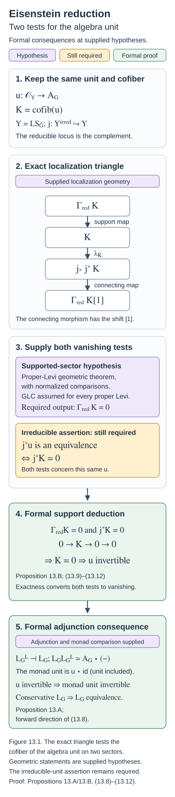

# Eisenstein series and the reduction to the cuspidal part (GLC III)

Draft. Self-checked by the writing AI.

Fix a smooth projective connected curve \(X\) over an algebraically closed field \(k\) of characteristic zero, a connected reductive group \(G\), its Langlands dual \(\check G\), and a theta characteristic \(\kappa_X^{\otimes2}\simeq\omega_X\). Put
\[
Y_G=\operatorname{LS}_{\check G}(X),\qquad
\mathcal C_G=D\operatorname{-mod}_{1/2}(\operatorname{Bun}_G),\qquad
\mathcal D_G=\operatorname{IndCoh}_{\operatorname{Nilp}}(Y_G).
\]
Local systems are de Rham local systems, all spectral fibre products are derived, and shifts are cohomological. Functor comparisons mean natural transformations with the specified action coherences. The centre of a reductive group remains part of every Levi subgroup and every Langlands-dual local-system stack.

[Kac-Moody localization and the fundamental local equivalence (GLC II)](kac-moody-localization-and-the-fundamental-local-equivalence.md) gives the local-to-global comparison and proves the formal adjoint mechanisms under explicit geometric hypotheses. Parabolic induction adds a different comparison: the construction for a Levi subgroup must agree with induction to \(G\). Once that comparison and the full conjecture for every proper Levi are supplied, the Eisenstein part is controlled. The remaining problem concerns the irreducible locus and its algebra unit.

The principal free reference is Justin Campbell, Lin Chen, Joakim Færgeman, Dennis Gaitsgory, Kevin Lin, Sam Raskin and Nick Rozenblyum, [Proof of the geometric Langlands conjecture III: compatibility with parabolic induction](https://arxiv.org/abs/2409.07051v1). Its parabolic comparison, existence of the left adjoint, algebra theorem and equivalence on the Eisenstein part are stated below with their precise hypotheses. From §15 onward, that paper assumes full geometric Langlands for the Levi quotients of every proper parabolic of \(G\). We retain this standing hypothesis in its §16 and §17 statements. Their geometric proofs and the recursive foundations are not proved here. The adjunction, support and induction deductions are proved under the indicated inputs.

## Parabolic induction, the left adjoint, and the Eisenstein equivalence

Let \(X\) be a smooth projective connected curve over an algebraically closed field \(k\) of characteristic zero. Fix a square root of \(\omega_X\). For a connected reductive group \(H\), write
\[
\mathcal C_H=\operatorname{Dmod}_{1/2}(\operatorname{Bun}_H),
\qquad
Y_H=\operatorname{LS}_{\check H},
\qquad
\mathcal D_H=\operatorname{IndCoh}_{\mathrm{Nilp}}(Y_H).
\]
The Langlands functor is \(L_H:\mathcal C_H\to\mathcal D_H\). Its left adjoint, when it exists, is \(F_H=L_H^L\), so \(F_H\dashv L_H\) and \(L_HF_H\) is the spectral monad.

The parabolic compatibility statements below are geometric inputs. Their formal consequences are proved with their hypotheses visible. From the constant-term argument onward, assume geometric Langlands for the Levi quotients of **all proper parabolic subgroups of \(G\)**. This is the standing hypothesis at the beginning of GLC III, §15; it also governs the left-adjoint and algebra arguments in §16.

## The normalized correspondences

For a standard parabolic \(P\), its Levi \(M\), and its opposite \(P^-\), the two correspondences are
\[
\operatorname{Bun}_G
\xleftarrow{p^-}\operatorname{Bun}_{P^-}
\xrightarrow{q^-}\operatorname{Bun}_M,
\qquad
Y_G\xleftarrow{p_{\mathrm{sp}}}Y_{P^-}
\xrightarrow{q_{\mathrm{sp}}}Y_M,
\]
where \(Y_{P^-}=\operatorname{LS}_{\check P^-}\). In both diagrams, \(p\) forgets the reduction and \(q\) takes the Levi quotient.

The ratio of the two automorphic determinant lines descends to \(\operatorname{Bun}_M\) and has a specified square root, identifying the pulled-back half-twisting gerbes. That square-root assertion, the safety of \(q^-\), and the existence of \(p^-_!\) on the required objects are geometric premises. With these identifications, define
\[
\operatorname{CT}^{-,\mathrm{nv}}_*=(q^-)_*(p^-)^!,
\qquad
\operatorname{Eis}^{-,\mathrm{nv}}_!=(p^-)_!(q^-)^*.
\]
Their types are \(\mathcal C_G\to\mathcal C_M\) and \(\mathcal C_M\to\mathcal C_G\). Put
\[
s_P=\dim_{\mathrm{rel}}(\operatorname{Bun}_{P^-}/\operatorname{Bun}_M),
\qquad
\operatorname{Eis}^-_!=\operatorname{Eis}^{-,\mathrm{nv}}_![s_P],
\qquad
\operatorname{CT}^-_*=\operatorname{CT}^{-,\mathrm{nv}}_*[-s_P].
\]
The integer \(s_P\) depends on the connected component of \(\operatorname{Bun}_M\). The opposite shifts preserve the adjunction.

Let \(\rho_P=\rho_G-\rho_M\), using half sums of positive coroots. This is a central coweight of \(M\); the chosen square root defines \(Q_P=\rho_P(\omega_X)\). Translation by \(Q_P\) gives
\[
\operatorname{Eis}_{!,Q_P}^-=\operatorname{Eis}_!^-(t_{Q_P})_*,
\qquad
\operatorname{CT}_{*,Q_P}^-=(t_{Q_P})^*\operatorname{CT}_*^-.
\]
Finally put
\[
\Delta_P=\dim\operatorname{Bun}_{(N_P^-)_{Q_P}},
\qquad
E_P=\operatorname{Eis}_{!,Q_P}^-[\Delta_P],
\qquad
C_P=\operatorname{CT}_{*,Q_P}^-[-\Delta_P].
\]
Then \(E_P\dashv C_P\). The component-dependent shift \(s_P\) and the constant \(\Delta_P\) are separate corrections. These are the conventions in GLC III, §§8.1 and 14.2. [GLC III](https://arxiv.org/abs/2409.07051v1)

On the spectral side,
\[
E_P^{\mathrm{sp}}
=(p_{\mathrm{sp}})^{\operatorname{IndCoh}}_*
 (q_{\mathrm{sp}})^{\operatorname{IndCoh},*},
\qquad
C_P^{\mathrm{sp}}
=(q_{\mathrm{sp}})^{\operatorname{IndCoh}}_*
 (p_{\mathrm{sp}})^!.
\]
Finite Tor dimension of \(q_{\mathrm{sp}}\), the adjunction, and preservation of nilpotent singular support are premises giving \(E_P^{\mathrm{sp}}\dashv C_P^{\mathrm{sp}}\) on \(\mathcal D_M\rightleftarrows\mathcal D_G\). The quasi-coherent versions are \(p_{\mathrm{sp},*}q_{\mathrm{sp}}^*\) and \(q_{\mathrm{sp},*}p_{\mathrm{sp}}^*\). The latter generally differs from the ind-coherent constant term:
\[
C_P^{\mathrm{sp}}\Xi_G
\simeq
\Xi_M\!\left(C_{P,\mathrm{QCoh}}^{\mathrm{sp}}(-)
\otimes\det T^*(Y_{P^-}/Y_G)\right)
[-(2g-2)\dim\mathfrak n_P].
\]
The determinant descends to \(Y_M\). The line and shift must be retained when comparing \(*\) and \(!\) pullbacks; this is Lemma “CT spec IndCoh vs QCoh” in GLC III, §12.1. [GLC III](https://arxiv.org/abs/2409.07051v1)

Drinfeld compactification supplies a different kernel. In the Borel case it allows the Plücker maps specifying a reduction to have zeros. The genuine-reduction locus is open. Extending its kernel by \(j_!\) yields the usual \(!\)-Eisenstein construction, whereas the intersection-cohomology kernel yields the compactified construction. Braverman–Gaitsgory, §§1.2–1.4, give this description under the assumption that the derived group is simply connected; it does not prove the arbitrary-parabolic half-twisted construction used here. [Deformations of local systems and Eisenstein series](https://arxiv.org/abs/math/0605139v4)

For the compactified spectral constant term, let \(r:Y_M\to Y_{P^-}\) be the Levi section. The \(Y_M\)-linear pushforward has an enhancement
\[
q_{\mathrm{sp},*}^{\mathrm{enh}}:
\operatorname{IndCoh}(Y_{P^-})\longrightarrow
\operatorname{IndCoh}(Y_M)
\otimes_{\operatorname{QCoh}(Y_M)}
\operatorname{QCoh}(Y_{P^-}).
\]
Define
\[
C_{P,!*}^{\mathrm{sp}}
=(\operatorname{Id}\otimes r^*)\,q_{\mathrm{sp},*}^{\mathrm{enh}}\,p_{\mathrm{sp}}^!.
\]
Replacing \(r^*\) by \(q_{\mathrm{sp},*}\) gives the ordinary constant term. On quasi-coherent objects, the compactified operation is Levi-section pullback of \(p_{\mathrm{sp}}^!\), retaining its relative dualizing line and shift. [GLC III, §12.12](https://arxiv.org/abs/2409.07051v1)

## Which compatibility is required

Theorem 14.2.2 of GLC III, “L and Eis”, supplies
\[
L_GE_P\simeq E_P^{\mathrm{sp}}L_M.
\tag{13.P1}
\]
This theorem precedes the standing proper-Levi hypothesis. Its proof compares the quasi-coherent projections of the two circuits on compact objects. Both circuits are bounded below there; the applicable full faithfulness of the projection from ind-coherent objects then lifts the comparison. Compact preservation, the bounds, and the Whittaker comparison are geometric premises. Spectral global sections is fully faithful on the quasi-coherent comparison; that assertion does not apply to the whole ind-coherent category. [GLC III, §14.2](https://arxiv.org/abs/2409.07051v1)

The local input has two parts. Theorem 2.4.3, “semiinf geom Satake”, gives an equivalence of unital factorization categories
\[
\operatorname{Sat}^{-,\infty/2}:
I(G,P^-)^{\mathrm{loc}}_{Q_P}
\simeq I(\check G,\check P^-)^{\mathrm{spec,loc}},
\]
compatible with the spherical actions and the enhanced Jacquet square. Comparison of left and right actions involves the Chevalley involutions. Proposition 2.5.9, “semiinf Sat IC”, identifies the semi-infinite IC factorization algebras under this equivalence. Their proofs and the required IC geometry remain inputs here. [GLC III, §§2.4–2.5](https://arxiv.org/abs/2409.07051v1)

Theorems 5.2.3 and 5.3.6, “local Jacquet” and “local Jacquet enh”, assert critical FLE compatibility with parabolic Jacquet. The critical Kac–Moody Jacquet functor has target
\[
\operatorname{KL}(M)_{\mathrm{crit}_M+\check\rho_P},
\]
where \(2\check\rho_P\) is the determinant character of \(M\) acting on \(\mathfrak n_P\). Under the torsor-twisted critical FLE it corresponds to Jacquet on the corresponding twisted monodromy-free Levi opers. The enhanced statement retains the semi-infinite factorization module and the spherical \(M\)-action. Dualization changes Jacquet to Wakimoto induction and introduces Chevalley involutions. Drinfeld–Sokolov reduction of Wakimoto objects supplies the deep computation. Pointwise compatibility does not imply compatibility in families over Ran; the latter is required by globalization. [GLC III, §§3.9 and 5–7](https://arxiv.org/abs/2409.07051v1)

Globalization uses localization, the oper constant-term correspondence, and cancellation of specified lines and shifts. Descent from localized Kac–Moody categories uses Harder–Narasimhan truncations and weight vanishing. These are geometric assertions, unproved here.

Under proper-Levi geometric Langlands, Theorem 15.1.13, “CT compat”, constructs a natural isomorphism
\[
\beta_P:C_P^{\mathrm{sp}}L_G\xrightarrow{\sim}L_MC_P.
\tag{13.P2}
\]
Separately, (13.P1) has a canonical mate
\[
\alpha_P:L_MC_P\longrightarrow C_P^{\mathrm{sp}}L_G.
\tag{13.P3}
\]
Indeed, apply \(E_P^{\mathrm{sp}}\dashv C_P^{\mathrm{sp}}\) to
\[
E_P^{\mathrm{sp}}L_MC_P\simeq L_GE_PC_P\longrightarrow L_G.
\]
Theorem 15.1.2, “L and CT”, asserts that this particular mate is invertible. Its proof follows the Eisenstein equivalence. Remarks 15.1.4 and 17.1.4 record that equality of \(\alpha_P\) and \(\beta_P^{-1}\) is not known. Existence of (13.P2) and invertibility of (13.P3) are separate assertions. [GLC III, §§15.1 and 17.1](https://arxiv.org/abs/2409.07051v1)

## Constructing the left adjoint

Theorem 16.1.2, “left adjoint”, states that \(L_G\) has a left adjoint. Retain the proper-Levi hypothesis and the spectral generation input: the objects \(E_P^{\mathrm{sp}}f\), for \(f\in\operatorname{QCoh}(Y_M)\) and **all** standard parabolics, generate \(\mathcal D_G\). This includes \(P=G\), which supplies \(\operatorname{QCoh}(Y_G)\). Only proper parabolics generate the reducible part. The required spectral generation theorem, Arinkin–Gaitsgory Theorem 13.3.6, is a geometric input not proved here. [GLC III, §16.1](https://arxiv.org/abs/2409.07051v1)

For a proper parabolic, (13.P2) gives
\[
\begin{aligned}
\operatorname{Map}_{\mathcal D_G}(E_P^{\mathrm{sp}}f,L_Gx)
&\simeq\operatorname{Map}_{\mathcal D_M}(f,C_P^{\mathrm{sp}}L_Gx)\\
&\simeq\operatorname{Map}_{\mathcal D_M}(f,L_MC_Px)\\
&\simeq\operatorname{Map}_{\mathcal C_M}(F_Mf,C_Px)\\
&\simeq\operatorname{Map}_{\mathcal C_G}(E_PF_Mf,x).
\end{aligned}
\tag{13.P4}
\]
Proper-Levi geometric Langlands supplies \(F_M\). For \(P=G\), the initial left adjoint on \(\operatorname{QCoh}(Y_G)\) comes from the spectral action on the vacuum Poincaré object.

Here is the formal extension argument. Use compact generation in the precise form that \(\mathcal D_G\) is the Ind-completion of the thick, idempotent-complete subcategory of the specified compact generators, and assume the initial representers exist. Stable Yoneda shows that objects \(d\) for which \(x\mapsto\operatorname{Map}(d,L_Gx)\) is representable are closed under shifts, finite cofibers, and retracts: the representers undergo those operations. Yoneda supplies the maps and their coherence, defining a functor on that thick subcategory. Extend it by colimits to \(F_G\). For \(d=\operatorname*{colim}_i d_i\) presented by compact objects,
\[
\operatorname{Map}(F_Gd,x)
\simeq\lim_i\operatorname{Map}(F_Gd_i,x)
\simeq\lim_i\operatorname{Map}(d_i,L_Gx)
\simeq\operatorname{Map}(d,L_Gx).
\]
Thus \(F_G\dashv L_G\). Compact generation and the initial representability statements are the geometric premises. Yoneda applied to (13.P4) also gives
\[
F_GE_P^{\mathrm{sp}}\simeq E_PF_M.
\tag{13.P5}
\]
This is the comparison constructed using \(\beta_P\). There is also a canonical mate of (13.P1) formed with the left adjoints \(F_G,F_M\). Its invertibility follows after proving invertibility of \(\alpha_P\). The remark following Theorem 16.1.2 does not identify that canonical comparison with (13.P5), just as the two constant-term comparisons are not identified.

Theorem 16.2.3, “left adjoint as dual”, refines this to
\[
F_G\simeq
\tau_G\circ\operatorname{Mir}_{\operatorname{Bun}_G}\circ L_G^\vee
\otimes\ell_{\mathfrak z_{\check G}}
[\,4\delta_G-2\delta_{N_{\rho(\omega_X)}}\,],
\tag{13.P6}
\]
where
\[
\ell_{\mathfrak z_{\check G}}
=\det T_1^*\operatorname{LS}_{Z_{\check G}^0}
\simeq\det(\mathfrak z_{\check G})^{\otimes(2-2g)}.
\]
The constants are \(\delta_G=\dim\operatorname{Bun}_G\) and the dimension of the indicated twisted-unipotent bundle stack. Spectral duality is Serre duality. Automorphic duality lands first in the co-category; miraculous duality \(\operatorname{Mir}\) then maps it to the ordinary category. Functor duality alone does not identify an adjoint. The proof first identifies tempered projections through Whittaker–Poincaré duality, then lifts using Eisenstein compatibility, compact preservation, and full faithfulness of tempered projection on the relevant compact objects. Those dualities and comparisons remain unproved geometric premises. [GLC III, §§16.2–16.3](https://arxiv.org/abs/2409.07051v1)

## The quasi-coherent algebra of the monad

Theorem 16.4.2, “AG”, asserts
\[
L_GF_G\simeq A_G\otimes_{\mathcal O_{Y_G}}-,
\qquad A_G\in\operatorname{QCoh}(Y_G).
\tag{13.P7}
\]
Monad multiplication and unit give an associative unital algebra \(A_G\) and \(u_G:\mathcal O_{Y_G}\to A_G\). The proper-Levi hypothesis still applies. Before the theorem, quasi-coherent linearity gives only a kernel in
\[
\mathcal D_G\otimes_{\operatorname{QCoh}(Y_G)}\mathcal D_G.
\]
An arbitrary such kernel need not belong to the diagonal quasi-coherent subcategory. [GLC III, §16.4](https://arxiv.org/abs/2409.07051v1)

Let \(U=Y_G^{\mathrm{irred}}\), \(j:U\hookrightarrow Y_G\), and \(Z=Y_G\setminus U\). Define
\[
\mathcal D_{G,\mathrm{red}}=\ker(j^*:\mathcal D_G\to\mathcal D_U),
\qquad
\operatorname{QCoh}(Y_G)_{\mathrm{red}}=\ker(j^*:\operatorname{QCoh}(Y_G)\to\operatorname{QCoh}(U)).
\]
These are set-theoretic support conditions, not quasi-coherent categories of a chosen reduced scheme structure on \(Z\).

The proof has five steps.

1. Over \(U\) the nilpotent cone is zero, hence \(\mathcal D_U=\operatorname{QCoh}(U)\). This geometric identification controls the open restriction of the kernel.
2. Tempered compatibility induces a linear endofunctor \(T_{\mathrm{temp}}\) of \(\operatorname{QCoh}(Y_G)\). Module linearity gives \(T_{\mathrm{temp}}(f)\simeq f\otimes T_{\mathrm{temp}}(\mathcal O_{Y_G})\). Write \(A_{\mathrm{temp}}=T_{\mathrm{temp}}(\mathcal O_{Y_G})\).
3. The functor \(T=L_GF_G\) preserves compact objects of \(\mathcal D_{G,\mathrm{red}}\). This uses generation by proper spectral Eisenstein images, (13.P1), (13.P5), compact preservation of the Eisenstein functors, and the proper-Levi equivalences.
4. Compact preservation gives the restriction \(T|_{\mathcal D_{G,\mathrm{red}}}\) a continuous right adjoint. The support/completion equivalence, the fully faithful \(\Xi\), its continuous right adjoint \(\Psi\), and tempered compatibility transfer this continuity to tensoring by \(A_{\mathrm{temp}}\) on \(\operatorname{QCoh}((Y_G)^\wedge_Z)\). The applicable tensor-dualizability criterion makes \(A_{\mathrm{temp}}|_{(Y_G)^\wedge_Z}\) perfect. That equivalence and criterion are geometric categorical inputs.
5. For compact \(m\in\mathcal D_{G,\mathrm{red}}\), both \(T(m)\) and \(A_{\mathrm{temp}}\otimes m\) are coherent. Their quasi-coherent projections agree. Full faithfulness on coherent supported objects lifts the agreement uniquely and naturally to \(T(m)\simeq A_{\mathrm{temp}}\otimes m\). Compact generation and continuity extend it to all supported objects. The kernel localization assertion in §16.4 combines open and supported comparisons and places the original kernel in \(\operatorname{QCoh}(Y_G)\). This kernel assertion is also an explicit input.

The compactness-to-continuity implication in step 4 has a short formal proof. Let \(S\) be continuous between compactly generated stable categories and preserve compact objects, and let \(R\) be its right adjoint. For compact generators \(c\) and a filtered diagram \(d_i\),
\[
\operatorname{Map}\!\left(c,R(\operatorname*{colim}_i d_i)\right)
\simeq\operatorname{Map}\!\left(Sc,\operatorname*{colim}_i d_i\right)
\simeq\operatorname*{colim}_i\operatorname{Map}(c,Rd_i).
\]
Generators detect equivalences, so \(R\) preserves filtered colimits. It is exact and preserves finite sums. Arbitrary sums are filtered colimits of finite sums; exactness and preservation of sums imply preservation of all colimits. Thus \(R\) is continuous, using the categorical premise that exact functors preserving arbitrary sums preserve colimits. That premise follows from the construction of colimits by sums, cofibers and skeletal realizations; that construction remains part of the unproved categorical foundations here. The displayed mapping argument proves the filtered-colimit and sum comparisons without supplying the support or coherent geometry.

## Equivalence on the Eisenstein part

Let \(\mathcal C_{G,\mathrm{Eis}}\) be the localizing subcategory generated by the images of \(E_P\) for proper parabolics. Translations and shifts of the Levi input do not change the generated subcategory. Put \(\mathcal C_{G,\mathrm{cusp}}=(\mathcal C_{G,\mathrm{Eis}})^\perp\). Theorem 17.1.2, “main”, states:

**Assuming geometric Langlands for every proper Levi quotient, the restricted adjoint functors**
\[
F_G:\mathcal D_{G,\mathrm{red}}\rightleftarrows
\mathcal C_{G,\mathrm{Eis}}:L_G
\]
**are mutually inverse equivalences.** Spectral generation identifies \(\mathcal D_{G,\mathrm{red}}\) with the category generated by the proper spectral Eisenstein images. The support is set-theoretic. [GLC III, §§16.5 and 17.1](https://arxiv.org/abs/2409.07051v1)

The preservation and generation statements give a formal conservativity argument on the Eisenstein part. If \(L_Gx=0\), then \(\operatorname{Map}(F_Gd,x)\simeq\operatorname{Map}(d,L_Gx)=0\) for every \(d\in\mathcal D_{G,\mathrm{red}}\). The objects \(F_Gd\) generate \(\mathcal C_{G,\mathrm{Eis}}\), so \(x=0\). Apply the same argument to the cofiber of a morphism, using exactness of \(L_G\), to prove conservativity of the restricted \(L_G\). Whole-category conservativity requires its separate Whittaker non-vanishing input.

To prove the unit invertible on the supported category, §17.3 reduces it to
\[
\mathcal O_{Y_{P^-}}\longrightarrow p_{\mathrm{sp}}^*A_G
\tag{13.P8}
\]
for every proper \(P\). The reduction uses conservativity of the family of parabolic pullbacks on supported quasi-coherent objects. This detection theorem is a geometric premise. Proposition 17.3.6, “AP 1”, states that \(p_{\mathrm{sp}}^*A_G\) is a line bundle. The following algebra argument then proves invertibility of the **specified unit** (13.P8).

Proposition 13.D below proves the invertible-algebra unit assertion in full.

The line-bundle assertion has two geometric stages. Proposition 17.3.9, “AP 2”, first proves that
\[
r^*p_{\mathrm{sp}}^*A_G
\]
is a line bundle on \(Y_M\). The enhanced compactified constant-term compatibility and the proper-Levi equivalence give
\[
C_{P,!*}^{\mathrm{sp}}L_GF_G\simeq C_{P,!*}^{\mathrm{sp}},
\]
which, evaluated on \(\mathcal O_{Y_G}\), identifies the compactified constant terms of \(A_G\) and \(\mathcal O_{Y_G}\). Its Levi-section description, together with the relative dualizing line, gives the stated line-bundle conclusion. An isomorphism of these composite functors does not by itself identify the image of the adjunction unit. The unit is proved invertible only after the line-bundle conclusion and Proposition 13.D. [GLC III, §§17.3 and 17.5](https://arxiv.org/abs/2409.07051v1)

Next choose an anti-dominant regular central coweight \(\theta:\mathbb G_m\to Z_{\check M}\), positive on \(\mathfrak n_P^-\). Its action contracts \(Y_{P^-}\) to the Levi section. Although the action is inner and hence isomorphic to the trivial action, its compatibility with \(q_{\mathrm{sp}}\) produces the central grading on \(Y_M\). Put
\[
R=q_{\mathrm{sp},*}\mathcal O_{Y_{P^-}},
\qquad
M=q_{\mathrm{sp},*}p_{\mathrm{sp}}^*A_G.
\]
The geometric premises are: \(R\) is non-negatively weight graded with \(R_0=\mathcal O_{Y_M}\); quasi-coherent sheaves on \(Y_{P^-}\) identify with \(R\)-modules on \(Y_M\); and \(M\) has non-negative weights. The last premise is proved in the source from ordinary constant-term compatibility, including the central action and the same relative dualizing correction for \(A_G\) and \(\mathcal O_{Y_G}\). These are weights for \(\mathbb G_m\), not cohomological degrees. [GLC III, §17.4](https://arxiv.org/abs/2409.07051v1)

The algebraic mechanism is derived graded Nakayama. Here is a proof in the local rank-one situation needed for a line bundle. Let \(R=\bigoplus_{n\geq0}R_n\) be an augmented graded commutative differential graded algebra over \(B=R_0\), and let \(M\) have non-negative weights. Suppose
\[
B\otimes_R^{\mathbf L}M
\]
is locally an invertible \(B\)-module concentrated in one weight \(w\). The usual geometric fact that a graded line bundle locally has one character is included in this hypothesis.

We assume the derived normalized bar construction computes augmentation base change, with its weight grading and exact skeletal filtration. This categorical construction is not proved here. Under that premise, augmentation base change is conservative on modules of non-negative weights. In the normalized two-sided bar resolution, a term of bar length \(r\) has \(r\) positive-weight factors from \(R_{>0}\). At a fixed total weight \(n\), only \(r\leq n\) occurs. If all lower-weight components of a module \(N\) vanish, its bar resolution in weight \(n\) reduces to \(N_n\). Consequently \(B\otimes_R^{\mathbf L}N=0\) implies \(N_0=0\), then \(N_1=0\), and so on. Every weight vanishes, hence \(N=0\).

The bar terms have non-negative weights, so its nonzero reduction weight \(w\) is non-negative. Apply the same induction to \(M\) below weight \(w\). Those components vanish, and its weight-\(w\) component is the line \(L\) in its derived reduction. The inclusion \(M_w\simeq L\to M\) induces
\[
R\otimes_B^{\mathbf L} L\langle w\rangle\longrightarrow M.
\]
Its derived reduction is an equivalence. Its cone has non-negative weights and zero derived reduction, so is zero by the preceding argument. Thus \(M\) is locally extension of scalars of the invertible \(B\)-module \(L\), with weight \(w\). Its inverse is \(R\otimes_B^{\mathbf L}L^{-1}\langle-w\rangle\): derived tensor associativity identifies their product over \(R\) with \(R\otimes_B^{\mathbf L}(L\otimes_B^{\mathbf L}L^{-1})\simeq R\). We use the specified descent framework in which invertibility is local and these local conclusions glue. That descent construction remains a categorical input. This proves the formal graded argument under the stated local hypothesis; the contraction, module-category equivalence, and positivity that make it applicable to local systems remain geometric premises.

Derived reduction is essential. For ordinary \(R=k[t]\), the ungraded underlying module \(k=R/(t)\) has ordinary reduction \(k\) but is not an invertible \(R\)-module. Its **derived** reduction has an additional Tor class, so it does not satisfy the hypothesis above.

Once the line-bundle test is available, (13.P8) is invertible by Proposition 13.D. Parabolic detection proves that the monad unit is invertible on \(\mathcal D_{G,\mathrm{red}}\). The restricted \(F_G\) is therefore fully faithful. To prove the counit invertible, the triangle identity says that \(L_G\) sends it to an equivalence, since the unit is invertible. Restricted conservativity then detects that the counit itself is invertible. This completes the formal deduction of the Eisenstein equivalence at the listed geometric premises.

Remark 17.1.5 identifies the remaining spectral category with \(\operatorname{QCoh}(U)\) and reduces the remaining equivalence to the restriction \(u_G|_U:\mathcal O_U\to A_G|_U\), retaining the independent global conservativity and localization hypotheses. A torus has no proper parabolics: its Eisenstein category and reducible category are zero, so this theorem gives a vacuous equivalence there. The torus case of the full correspondence is a separate base theorem. [GLC III, §17.1](https://arxiv.org/abs/2409.07051v1)

## Mathematical inputs left unproved

The unproved foundations are the half-twisting square root and six-functor assertions; nilpotent singular-support functoriality and parabolic generation/detection; semi-infinite Satake with its IC identification; the critical FLE and its enhanced Jacquet compatibility in Ran families; localization and its descent, determinant comparisons, and miraculous duality; compact preservation and coherent full faithfulness; the support/completion and kernel localization results; and the contraction and positivity assertions for parabolic local systems. The proper-Levi correspondence is an inductive hypothesis. Whole-category conservativity is a separate non-vanishing theorem. These inputs are not closed by their citations.

The formal deductions in this lesson are: extension of represented adjunctions from compact generators; the adjunction calculation for Eisenstein functors; compact preservation implying continuity of the right adjoint; unique lifting through a fully faithful comparison; invertibility of the unit of an algebra whose underlying object is invertible; the stated derived graded Nakayama argument; the unit-and-conservativity deduction of equivalence; and the explanation that both constant-term constructions can be used without identifying them.

GLC V, §1, summarizes the left adjoint, the tensor algebra, and the Eisenstein equivalence, with references to GLC III, Theorems 16.1.2, 16.4.2, and 17.1.2. Its summary does not replace the inductive hypotheses in the earlier proofs. Gaitsgory's earlier GL(2) outline, §6, explains parabolic induction, enhanced constant terms, and the reducible spectral category in its earlier categorical framework; its functor conventions do not replace the half-twisted, \(\rho\)-translated conventions above. [GLC V](https://arxiv.org/abs/2409.09856v3), [Outline for GL(2)](https://arxiv.org/abs/1302.2506v3)

Human sources: Justin Campbell, Lin Chen, Joakim Færgeman, Dennis Gaitsgory, Kevin Lin, Sam Raskin, and Nick Rozenblyum, *Proof of the geometric Langlands conjecture III: compatibility with parabolic induction*, version 1; Dennis Gaitsgory and Sam Raskin, *Proof of the geometric Langlands conjecture V: the multiplicity one theorem*, version 3; Dennis Gaitsgory, *Outline of the proof of the geometric Langlands conjecture for GL(2)*, version 3; Alexander Braverman and Dennis Gaitsgory, *Deformations of local systems and Eisenstein series*, version 4.

## Why a unital algebra with invertible underlying object has invertible unit

**Proposition 13.D.** Let \(\mathcal V\) be a monoidal category with coherent tensor constraints, and let \(A\) be a unital associative algebra whose underlying object is tensor-invertible. Then its unit \(u:\mathbf1\to A\) is an equivalence. The same proof applies in the stated stable categorical setting, with equations read as the specified homotopies.

**Proof.** Tensoring on the left by \(A\) is an equivalence. It therefore identifies the mapping objects from \(A\) to \(\mathbf1\) and from \(A\otimes A\) to \(A\). There is a morphism \(v:A\to\mathbf1\), with coherent comparison
\[
m\simeq\operatorname{id}_A\otimes v,
\]
where \(m\) is the multiplication. The right-unit axiom gives
\[
\operatorname{id}_A\otimes(vu)
\simeq m(\operatorname{id}_A\otimes u)
\simeq\operatorname{id}_A.
\]
Full faithfulness of left tensoring by \(A\) reflects this identity, so \(vu\simeq\operatorname{id}_{\mathbf1}\). The left-unit axiom gives
\[
\operatorname{id}_A
\simeq m(u\otimes\operatorname{id}_A)
\simeq (\operatorname{id}_A\otimes v)(u\otimes\operatorname{id}_A)
\simeq uv.
\]
The last comparison is functoriality of tensor product and its unit constraints: both composites are the tensor product \(u\otimes v\), viewed as a map from \(A\) to \(A\). Thus \(u\) and \(v\) are inverse equivalences. No field-valued-point detection or choice of a direct-sum complement is needed. \(\square\)

For a line bundle in \(\operatorname{QCoh}(Y)\), the dual line bundle supplies the tensor inverse, under the specified quasi-coherent monoidal framework. This proves the algebraic step once the geometric line-bundle assertion is established. It supplies no proof that the actual pullback of \(A_G\) is a line bundle.

## The monad unit and the two support tests

We use cohomological grading: \(H^i(M[n])=H^{i+n}(M)\). All functors and comparisons below are functors and coherent natural transformations of stable categories. An equivalence of monads includes their units and multiplications, with the associativity and unit coherences; an identification of underlying endofunctors alone supplies less information.

The categorical foundations used here are premises: mapping objects, the Yoneda criterion for equivalences, adjunctions with their coherent units and counits, and functorial exact triangles in stable categories. For the affine calculations we also assume the construction of the derived category of modules and of derived tensor product, computed using flat or free resolutions. We do not construct these foundations. Likewise, the existence of the geometric left adjoint, conservativity of the Langlands functor, the description of its monad by an algebra, the relevant embedding of quasi-coherent sheaves, and the geometric localization triangle are separate inputs. The arguments below establish the deductions from those inputs.

### A conservative right adjoint is controlled by its unit

Let

\[
F:\mathcal D\rightleftarrows\mathcal C:L,
\qquad F\dashv L,
\]

and write

\[
\eta:\operatorname{Id}_{\mathcal D}\longrightarrow LF,
\qquad
\varepsilon:FL\longrightarrow\operatorname{Id}_{\mathcal C}
\]

for the unit and counit. Conservativity of \(L\) means that a morphism whose image under \(L\) is an equivalence was already an equivalence.

**Proposition 13.A.** If \(L\) is conservative, then \(L\) is an equivalence if and only if every component of \(\eta\) is an equivalence.

**Proof.** Suppose first that \(\eta\) is an equivalence. The second triangle identity, at \(c\in\mathcal C\), is the specified homotopy

\[
L(\varepsilon_c)\circ\eta_{Lc}\simeq\operatorname{id}_{Lc}.
\tag{13.1}
\]

Since \(\eta_{Lc}\) is invertible, this identifies \(L(\varepsilon_c)\) with its inverse. Conservativity implies that \(\varepsilon_c\) is an equivalence. Thus both \(\eta\) and \(\varepsilon\) are equivalences of functors. They display \(F\) and \(L\) as inverse equivalences. This conclusion includes the coherence: the first triangle identity

\[
\varepsilon_{Fd}\circ F(\eta_d)
\simeq\operatorname{id}_{Fd}
\tag{13.2}
\]

and (13.1) are precisely the two cancellation homotopies for these inverse functors. We use the natural unit and counit of the given adjunction, rather than choosing unrelated inverses separately at each object.

Conversely, suppose that \(L\) is an equivalence. For \(c,c'\in\mathcal C\), precomposition with \(\varepsilon_c\) fits into the mapping-object comparison

\[
\begin{aligned}
\operatorname{Map}_{\mathcal C}(c,c')
&\longrightarrow
\operatorname{Map}_{\mathcal C}(FLc,c')\\
&\simeq
\operatorname{Map}_{\mathcal D}(Lc,Lc').
\end{aligned}
\tag{13.3}
\]

The composite sends \(g\) to
\(L(g)L(\varepsilon_c)\eta_{Lc}\), which is naturally homotopic to \(L(g)\) by (13.1). Full faithfulness of \(L\) makes this composite an equivalence, and adjunction makes the second arrow an equivalence. Therefore precomposition with \(\varepsilon_c\) is an equivalence for every \(c'\). Yoneda gives that \(\varepsilon_c\) is an equivalence. Equation (13.1) now shows that \(\eta_{Lc}\) is its inverse after applying \(L\). Every \(d\in\mathcal D\) is equivalent to some \(Lc\); naturality of \(\eta\) transports this conclusion to \(d\). Hence \(\eta\) is an equivalence. \(\square\)

The monad \(T=LF\) has multiplication

\[
\mu=L\varepsilon F:T^2\longrightarrow T.
\]

Its two unit identities are

\[
\mu_d\circ\eta_{Td}\simeq\operatorname{id}_{Td},
\qquad
\mu_d\circ T(\eta_d)\simeq\operatorname{id}_{Td}.
\tag{13.4}
\]

The first is (13.1) evaluated at \(Fd\); the second is (13.2) after applying \(L\). If \(\eta\) is invertible, (13.4) identifies \(\mu_d\) with both \(\eta_{Td}^{-1}\) and \(T(\eta_d)^{-1}\). The unit consequently identifies this monad coherently with the identity monad. Proposition 13.A uses only the adjunction identities and conservativity; no monadic reconstruction theorem is needed.

Conservativity is essential. Take a nonzero stable category \(\mathcal E\), let \(\mathcal C=\mathcal D\times\mathcal E\), let \(L(d,e)=d\), and let \(F(d)=(d,0)\). Product mapping objects give \(F\dashv L\), and \(LF=\operatorname{Id}_{\mathcal D}\) with identity unit. But \(\varepsilon_{(0,e)}:(0,0)\to(0,e)\) fails to be an equivalence when \(e\ne0\). Projection \(L\) loses this summand and is not an equivalence.

### Recovering the algebra unit from the monad

Put \(\mathcal V=\operatorname{QCoh}(Y)\), with tensor unit \(\mathcal O_Y\), and let \(\mathcal D\) be a \(\mathcal V\)-module category. Denote its action by \(a\star d\). Let \(\mathcal A\) be an associative algebra in \(\mathcal V\), with unit \(u:\mathcal O_Y\to\mathcal A\) and multiplication \(m:\mathcal A\otimes\mathcal A\to\mathcal A\). Suppose we are given a coherent equivalence of monads

\[
LF\simeq\bigl(d\longmapsto\mathcal A\star d\bigr),
\tag{13.5}
\]

under which

\[
\eta_d:
d\simeq\mathcal O_Y\star d
\xrightarrow{\ u\star\operatorname{id}_d\ }
\mathcal A\star d
\tag{13.6}
\]

and \(\mu\) is induced by \(m\). The identification in (13.6), including the action's unit constraint, is part of the premise.

If \(u\) is an equivalence, functoriality of the action makes (13.6) an equivalence for every \(d\). Proposition 13.A then proves that a conservative \(L\) is an equivalence. This direction needs no faithfulness condition on the action.

For the reverse implication we need a way to observe quasi-coherent sheaves inside \(\mathcal D\). A sufficient precise premise is an object \(d_0\in\mathcal D\) for which

\[
E:\mathcal V\longrightarrow\mathcal D,
\qquad E(a)=a\star d_0,
\tag{13.7}
\]

reflects equivalences. The unit constraint identifies \(E(\mathcal O_Y)\) with \(d_0\). If \(L\) is an equivalence, Proposition 13.A gives that \(\eta_{d_0}=E(u)\) is an equivalence. Reflection by \(E\) implies that \(u\) is an equivalence. Thus, under (13.5), conservativity of \(L\), and (13.7),

\[
L\text{ is an equivalence}
\quad\Longleftrightarrow\quad
\mathcal O_Y\xrightarrow{u}\mathcal A
\text{ is an equivalence}.
\tag{13.8}
\]

For \(\mathcal D=\operatorname{QCoh}(Y)\), take \(d_0=\mathcal O_Y\); then \(E\) is the identity up to the tensor unit constraint. Another sufficient premise is a fully faithful functor

\[
\Xi:\operatorname{QCoh}(Y)\hookrightarrow
\operatorname{IndCoh}_{\operatorname{Nilp}}(Y)
\]

with specified action compatibility
\(\Xi(a)\simeq a\star\Xi(\mathcal O_Y)\), natural in \(a\) and compatible with the tensor unit. Take \(d_0=\Xi(\mathcal O_Y)\). Full faithfulness reflects equivalences: an inverse to \(\Xi(f)\) lifts through the equivalence of mapping objects to an inverse to \(f\), and the two inverse homotopies lift as well. This gives (13.7). The existence, domain, and full faithfulness of such a geometric \(\Xi\) are inputs; they do not follow from the assertion that the monad is quasi-coherent-linear.

A nonfaithful action can conceal a noninvertible algebra unit even when \(L\) is the identity. Let \(R=k\times k\), let \(S=k\) with the first-projection \(R\)-algebra structure, and let \(\mathcal D=D(S)\). The action of \(D(R)\) on \(D(S)\) is

\[
a\star d=(S\otimes_R^{\mathbf L}a)
\otimes_S^{\mathbf L}d.
\]

The algebra \(\mathcal A=S\in D(R)\) has unit \(u:R\to S\). Its kernel is the nonzero second summand \(0\times k\), so \(u\) is not an equivalence. Since \(S\) is a direct summand of \(R\), it is projective, and multiplication gives \(S\otimes_R^{\mathbf L}S\simeq S\). Consequently \(\mathcal A\star d\simeq d\); its algebra unit and multiplication act as the identity monad. Set \(F=L=\operatorname{Id}_{D(S)}\). All adjunction and monad comparisons above hold, and \(L\) is conservative and an equivalence, but \(u\) is not. Indeed every action evaluation kills the second \(R\)-summand. This is the obstruction excluded by (13.7).

### Detecting a morphism on an open set and its complement

Let \(j:U\hookrightarrow Y\) be an open inclusion, and let \(Z\) be its complementary closed subset. The exact localization premise is a pair of exact functors \(j^*\dashv j_*\), with \(j_*\) fully faithful, together with the functorial triangle

\[
\Gamma_Z(M)\longrightarrow M
\xrightarrow{\lambda_M}j_*j^*M
\longrightarrow\Gamma_Z(M)[1]
\tag{13.9}
\]

in \(\operatorname{QCoh}(Y)\). Here \(\lambda\) is the unit of the localization adjunction and \(\Gamma_Z=\operatorname{fib}(\lambda)\). In particular \(\Gamma_Z\) is an exact functor. The mapping calculation (13.3), using only full faithfulness of the right adjoint, proves that the counit \(j^*j_*\to\operatorname{Id}\) is an equivalence. Its composite with \(j^*\lambda\) is the identity by the triangle identity, so \(j^*\lambda\) is an equivalence too. Therefore \(j^*\Gamma_Z(M)=0\). If \(j^*M=0\), (13.9) gives \(\Gamma_Z(M)\simeq M\). This explains the phrase “sections supported on \(Z\)”: it retains the whole object when the object vanishes on \(U\). Establishing (13.9) for a particular derived stack remains a geometric input.

**Proposition 13.B.** For any morphism \(f:M\to N\), the following are equivalent:

\[
f\text{ is an equivalence};
\qquad
j^*f\text{ and }\Gamma_Z(f)
\text{ are equivalences}.
\tag{13.10}
\]

**Proof.** Put \(K=\operatorname{cofib}(f)\). Exactness gives

\[
\operatorname{cofib}(j^*f)\simeq j^*K,
\qquad
\operatorname{cofib}(\Gamma_Z(f))\simeq\Gamma_Z(K).
\tag{13.11}
\]

If \(f\) is an equivalence, \(K=0\), so both objects in (13.11) vanish. Conversely, the two tests imply \(j^*K=0\) and \(\Gamma_Z(K)=0\). The exact triangle (13.9) evaluated at \(K\) is then \(0\to K\to0\); hence \(K=0\) and \(f\) is an equivalence. This is a natural argument: the functorial triangle for \(M\to N\) induces the triangle for its cofiber, so the support and open comparisons refer to the same morphism. \(\square\)

For the algebra unit, take \(M=\mathcal O_Y\), \(N=\mathcal A\). In the notation of irreducible and reducible local systems, set

\[
Y=\operatorname{LS}_{\check G},
\quad U=\operatorname{LS}_{\check G}^{\operatorname{irred}},
\quad Z=\operatorname{LS}_{\check G}^{\operatorname{red}}.
\]

Provided this is the specified open-complement localization, the criterion reads

\[
\mathcal O_Y\xrightarrow{u}\mathcal A
\text{ is an equivalence}
\quad\Longleftrightarrow\quad
\begin{cases}
\mathcal O_U\xrightarrow{j^*u}j^*\mathcal A
\text{ is an equivalence},\\
\Gamma_Z(\mathcal O_Y)\xrightarrow{\Gamma_Z(u)}
\Gamma_Z(\mathcal A)
\text{ is an equivalence}.
\end{cases}
\tag{13.12}
\]

In the first line we use the specified tensor compatibility \(j^*\mathcal O_Y\simeq\mathcal O_U\). No closed restriction functor appears in the second line.

### A computation of supported sections on the affine line

Take \(R=k[t]\), \(Y=\operatorname{Spec}R\), \(U=D(t)\), \(Z=V(t)\), and \(S=R[t^{-1}]\). We compute in \(D(R)\). Ordinary localization is exact. Indeed, given an exact sequence \(0\to P\to Q\to V\to0\), every fraction in \(V[t^{-1}]\) lifts by lifting its numerator. If \(q/t^n\) maps to zero, some \(t^mq\) lies in the image of \(P\); a preimage of \(t^mq\), divided by \(t^{n+m}\), then lifts \(q/t^n\) from \(P[t^{-1}]\). Finally, if a fraction from \(P\) vanishes in \(Q[t^{-1}]\), some power of \(t\) kills its numerator in \(Q\), and injectivity kills it in \(P\) as well. This proves all three exactness assertions. Thus \(S\) is flat, and derived localization is represented by termwise localization. The affine form of (13.9) is consequently

\[
\Gamma_Z(M)=
\operatorname{fib}\bigl(M\longrightarrow S\otimes_R^{\mathbf L}M\bigr).
\tag{13.13}
\]

For a cochain map \(q:M\to N\), use
\(\operatorname{Cone}(q)^n=N^n\oplus M^{n+1}\), with differential
\((n,m)\mapsto(d_Nn+q(m),-d_Mm)\).
The fiber is \(\operatorname{Cone}(q)[-1]\). For \(R\to S\), this gives the two-term complex

\[
\Gamma_Z(R)\simeq
\bigl[R\xrightarrow{\ \mathrm{loc}\ }S\bigr],
\qquad R\text{ in degree }0,\quad S\text{ in degree }1.
\tag{13.14}
\]

With the stated cone convention the differential initially has a minus sign; changing the sign of the degree-one summand gives the displayed complex. Since \(R\to S\) is injective,

\[
\Gamma_Z(R)\simeq(S/R)[-1],
\qquad H^1\Gamma_Z(R)=S/R\ne0.
\tag{13.15}
\]

In contrast, ordinary derived closed restriction of \(R\) is
\(k\otimes_R^{\mathbf L}R=k\), concentrated in degree zero. Even its direct image to \(Y\) is not (13.15). There is therefore no replacement of the first term of (13.9) by \(i_*i^*M\), where \(i:\operatorname{Spec}k\hookrightarrow Y\) is the closed inclusion. This distinction concerns the localization triangle itself, even in situations where a different argument can prove that open and derived closed restrictions jointly detect vanishing.

For the algebra unit \(R\to S\), open restriction is the isomorphism \(S\to S\). But \(\Gamma_Z(S)=0\), whereas (13.15) is nonzero; the supported-sections test detects that \(R\to S\) is not an equivalence.

A further example shows what an underived closed restriction can miss. Let \(T=S/R\). This module is nonzero because the class of \(t^{-1}\) is nonzero. Every element is killed by a power of \(t\), so \(S\otimes_RT=0\). Multiplication by \(t\) on \(T\) is surjective: a fraction representing an element can be divided by one more \(t\). Hence \(T/tT=0\), and both its open restriction and its underived closed restriction vanish. Nevertheless (13.13) gives \(\Gamma_Z(T)=T\ne0\).

This also gives an algebra example. Form the square-zero algebra

\[
B=R\oplus T,
\qquad
(r,x)(r',x')=(rr',rx'+r'x),
\qquad v(r)=(r,0).
\tag{13.16}
\]

The displayed multiplication is associative: either order of multiplying three elements has first component \(rr'r''\) and second component \(rr'x''+rr''x'+r'r''x\). Its identity is \((1,0)\). Open localization sends \(v:R\to B\) to an isomorphism \(S\to S\), and underived closed restriction sends it to an isomorphism \(k\to k\). But its cofiber is \(T\ne0\), and exactness gives

\[
\operatorname{cofib}\bigl(\Gamma_Z(v)\bigr)
=\Gamma_Z(T)=T\ne0.
\]

The derived closed restriction does catch this example. The free resolution

\[
0\longrightarrow R\xrightarrow{\ t\ }R
\longrightarrow k\longrightarrow0
\]

is exact because multiplication by \(t\) in \(k[t]\) is injective and has cokernel \(k\). In degrees \(-1,0\) it computes

\[
k\otimes_R^{\mathbf L}T
\simeq[T\xrightarrow{\ t\ }T].
\]

Surjectivity of \(t\) gives zero degree-zero cohomology. Its kernel consists of the scalar multiples of the class of \(t^{-1}\): writing a representative as a finite sum of negative powers shows that every term below \(t^{-1}\) survives multiplication by \(t\). Thus

\[
k\otimes_R^{\mathbf L}T\simeq k[1],
\qquad
k\otimes_R^{\mathbf L}B\simeq k\oplus k[1].
\tag{13.17}
\]

The derived restriction of \(v\) is the inclusion of the first summand and is not an equivalence. This calculation distinguishes underived closed restriction, derived closed restriction, and local sections with support, including their different cohomological degrees.

Combining (13.8) and (13.12) gives the formal reduction to the two sectors. Proving equivalence on the reducible sector by Eisenstein and constant-term geometry, establishing the required faithfulness premise, and proving the monad description are further mathematical obligations. These formal tests supply no proof of those geometric inputs or of the geometric Langlands conjecture.

## Cuspidality as a common kernel

Let \(\mathcal C_{G,\mathrm{Eis}}\) be the localizing subcategory generated by all normalized proper-parabolic Eisenstein images. For each proper parabolic \(P\) with Levi \(M\), write the specified adjunction as
\[
E_P:\mathcal C_M\rightleftarrows\mathcal C_G:R_P,
\qquad E_P\dashv R_P.
\]
Here \(R_P\) denotes the appropriately normalized constant term. Its construction and the geometric adjunction are inputs; the next assertion uses only the adjunction.

**Proposition 13.C (orthogonality and constant terms).** In the specified stable categorical framework,
\[
\mathcal C_{G,\mathrm{cusp}}
:=(\mathcal C_{G,\mathrm{Eis}})^\perp
=\bigcap_{P\subsetneq G}\operatorname{ker}R_P.
\tag{13.18}
\]
Orthogonality means that the whole mapping complex from every object of the Eisenstein subcategory vanishes.

**Proof.** If \(c\) is orthogonal to the Eisenstein subcategory, then for every \(m\in\mathcal C_M\)
\[
\operatorname{Maps}_{\mathcal C_M}(m,R_Pc)
\simeq\operatorname{Maps}_{\mathcal C_G}(E_Pm,c)=0.
\]
Take \(m=R_Pc\). Its identity is zero, so \(R_Pc=0\). Conversely, if every \(R_Pc\) vanishes, the same adjunction proves orthogonality to every generating Eisenstein image. For fixed \(c\), the objects \(a\) with \(\operatorname{Maps}(a,c)=0\) form a stable subcategory closed under colimits: mapping out of a colimit is the limit of the mapping complexes, all of which are zero. This subcategory therefore contains the entire localizing subcategory generated by those images. This proves (13.18).

The spectral analogue is the support subcategory
\[
\mathcal D_{G,\mathrm{red}}
=\operatorname{ker}\bigl(j^*:\mathcal D_G\longrightarrow
\operatorname{IndCoh}_{\operatorname{Nilp}}(Y_G^{\mathrm{irred}})\bigr),
\]
where \(j:Y_G^{\mathrm{irred}}\hookrightarrow Y_G\). Its generation by proper-parabolic spectral Eisenstein images is a geometric input. The equality is set-theoretic support along the reducible locus, including its formal and derived directions; it does not replace that support category by sheaves on a reduced closed substack.

## The case of \(\mathrm{GL}_2\)

For \(G=\mathrm{GL}_2\), the standard proper parabolic is the upper-triangular Borel and its Levi is \(\mathbb G_m\times\mathbb G_m\). On bundles, a Borel reduction is a line subbundle \(L_1\subset E\) with line quotient \(L_2\). Thus the parabolic correspondence records an extension
\[
0\longrightarrow L_1\longrightarrow E\longrightarrow L_2\longrightarrow0.
\tag{13.19}
\]
For fixed \(L_1,L_2\), its deformation and automorphism theory is governed by \(\operatorname{Ext}^1(L_2,L_1)\) and \(\operatorname{Hom}(L_2,L_1)\). The identification of the moduli fibre with that extension stack, and the compactification and D-module operations defining Eisenstein series, remain geometric inputs. An extension stack includes automorphisms; replacing it by a set of extension classes loses this information.

On the spectral side, a Borel reduction of a rank-two flat bundle is a connection-preserved line subbundle. The two rank-one connections on the line and quotient are its Levi local system. This description includes nonsplit extensions.

The differential line and the equality \(H^0(X,\mathcal O_X)=k\), at precisely our characteristic-zero curve hypotheses, are proved in [The GL_1 case as an equivalence of categories](the-gl-1-case-as-an-equivalence-of-categories.md), §§1.1.8–1.1.9 and the final paragraph of §1.1.12. The finite projection constructed there makes a global function satisfy a polynomial with coefficients in \(k\); algebraic closedness and the function-field argument make it constant. We use these earlier proofs, retaining their stated algebraic foundations.

For an explicit calculation, suppose a nonzero regular one-form \(\omega\) on \(X\) has been chosen. On the trivial rank-two bundle with basis \(e_1,e_2\), set
\[
\nabla=d+
\begin{pmatrix}0&\omega\\0&0\end{pmatrix}.
\tag{13.20}
\]
This is a flat connection: its curvature is \(d\omega\) in the upper-right entry, and the matrix wedge-square is zero by matrix multiplication. Since \(\Omega_X^1\) is a line bundle, \(\Omega_X^2=0\): locally a generator \(\alpha\) has \(\alpha\wedge\alpha=0\), so all wedge products of two one-forms vanish. Thus \(d\omega=0\). The line generated by \(e_1\) is horizontal and the quotient has the trivial connection. A splitting as a flat extension would send the quotient generator to \(e_2+f e_1\), for a global regular function \(f\), and horizontality would require
\[
df+\omega=0.
\]
The earlier global-function proof makes every such \(f\) constant, so \(df=0\). Hence (13.20) is a nonsplit flat extension. The matrix computation proves nonsplitting under the stated choice of \(\omega\). It shows that reducible local systems include more than direct sums of characters.

Irreducibility is a condition on the entire system of invariant lines. As an elementary representation example, let a free group on two generators act on \(k^2\) through
\[
A=\begin{pmatrix}2&0\\0&1\end{pmatrix},\qquad
B=\begin{pmatrix}1&1\\1&2\end{pmatrix}.
\tag{13.21}
\]
Their determinants are \(2\) and \(1\), so both matrices are invertible in characteristic zero. An \(A\)-invariant line is generated by an eigenvector: its nonzero generator \((a,b)\) must satisfy \((2a,b)=\lambda(a,b)\), so exactly one coordinate can be nonzero. The only possibilities are \(ke_1\) and \(ke_2\). But \(Be_1=(1,1)\) and \(Be_2=(1,2)\) lie on neither of those lines. There is no common invariant line, and this representation is irreducible. This finite-dimensional computation describes the invariant-line obstruction; its realization by a de Rham local system on the chosen projective curve is a separate geometric question.

Categorically, the Eisenstein part for \(\mathrm{GL}_2\) is generated by induction from the rank-one pair; its cuspidal part is the kernel of the normalized Borel constant term by (13.18). GLC III's main theorem, under the full torus conjecture, identifies the former with the reducible-support spectral category. It leaves the equivalence on the irreducible locus to the subsequent arguments. Reducibility of a spectral point and cuspidality of an automorphic object are different sorts of conditions; their relation uses the specified functor comparisons.

## Why both support tests are needed

Let \(u:\mathcal O_Y\to A\) be the specified algebra unit, and set
\[
K=\operatorname{cofib}(u).
\tag{13.22}
\]
The open–closed localization triangle tests \(K\) on the irreducible open locus and by sections supported on its complement. The formal proof above identifies the vanishing of these two objects with \(u\) being an equivalence.

Here are two completely explicit algebra units showing the roles of the tests. Let \(R=k[t]\), \(S=R[t^{-1}]\), \(U=D(t)\), and \(Z=V(t)\). Define componentwise product algebras
\[
A_U=R\times S,\qquad A_Z=R\times k,
\]
with units \(r\mapsto(r,r)\) and \(r\mapsto(r,\overline r)\), respectively. Projection to the first factor splits each unit as an \(R\)-module map. More explicitly,
\[
(a,b)\longmapsto b-a\quad\text{and}\quad
(a,b)\longmapsto b-\overline a
\]
identify their cokernels with \(S\) and \(k\). Consequently their unit cones are those modules in degree zero. For any complex \(M\), use the localization model
\[
\Gamma_ZM=\operatorname{fib}(M\longrightarrow S\otimes_R M).
\tag{13.23}
\]
The exactness and flatness of localization were proved by the fraction argument above. Thus ordinary localization computes its derived tensor product. Localization of \(S\) is \(S\), with the identity map; hence \(\Gamma_ZS=0\). Localization of \(k=R/(t)\) is zero, since making the zero action of \(t\) invertible forces the module to vanish; hence \(\Gamma_Zk=k\).

| Algebra unit | Unit cone on \(U\) | Sections of the unit cone supported on \(Z\) |
| --- | --- | --- |
| \(R\to A_U\) | \(S\neq0\) | \(0\) |
| \(R\to A_Z\) | \(0\) | \(k\neq0\) |

The first unit passes the supported-section test and fails on the open set. The second passes the open test and fails on supported sections. Each unit is a map of genuine unital associative algebras. No conclusion about the actual geometric algebra \(A_G\) follows from these examples; they prove the necessity of checking both terms in the localization argument.

## Induction on semisimple rank

Use the structural root-datum premise that standard parabolics are indexed by subsets \(I\) of a set \(\Delta\) of simple roots, that every parabolic is conjugate to a standard one, and that the semisimple rank of its Levi \(M_I\) is \(|I|\). These structure theorems for reductive groups are not proved here. Given them, a proper standard parabolic has \(I\subsetneq\Delta\), so
\[
\operatorname{rk}_{\mathrm{ss}}M_I=|I|<|\Delta|
=\operatorname{rk}_{\mathrm{ss}}G.
\tag{13.24}
\]
The induction parameter is semisimple rank. The total rank of a Levi, which includes its central torus, need not decrease; the Levi \(\mathbb G_m^2\) of \(\mathrm{GL}_2\) is an immediate example.

For rank zero, the connected reductive group is a torus, under the same structural premise. The full torus conjecture is the base case. [The GL_1 case as an equivalence of categories](the-gl-1-case-as-an-equivalence-of-categories.md) gives the rank-one transform calculations at its stated geometric hypotheses; the full torus, descent and spectral-support foundations still require proofs. An induction cannot treat an unfinished base case as established.

Suppose the full conjecture has been proved for every connected reductive group of semisimple rank less than \(r\). Let \(G\) have semisimple rank \(r\). Equation (13.24) supplies every proper-Levi hypothesis of the geometric Eisenstein equivalence. Under that theorem, the reducible-support part is therefore controlled. The support criterion then reduces the algebra unit to its restriction on \(Y_G^{\mathrm{irred}}\). If the remaining irreducible-unit theorem and the geometric conservativity of \(L_G\) are supplied, the adjunction criterion proves the full conjecture for \(G\). This completes the induction step conditional on those geometric inputs. Eisenstein compatibility alone establishes the reducible part, not the required irreducible-unit assertion.

For semisimple rank one, every proper Levi has semisimple rank zero. Thus the proper-Levi input consists of tori. This covers both \(\mathrm{GL}_2\) and the rank-one groups with their central factors. It does not identify the tori with the trivial group or delete their local systems.

## Exercises and solutions

**Exercise 13.1 (easy).** Let \(F=L^L\dashv L\) with \(L\) conservative, and suppose \(LF\) is tensoring by an algebra \(\mathcal A\) in \(\operatorname{QCoh}(Y)\). Prove the equivalence criterion in terms of \(\mathcal O_Y\to\mathcal A\), making every required premise explicit.

**Solution 13.1.** Require the monad comparison (13.5), the unit identification (13.6), and a reflecting evaluation (13.7). If \(u\) is an equivalence, each \(u\star\operatorname{id}_d\) is an equivalence, hence every \(\eta_d\) is. Equation (13.1) gives \(L(\varepsilon_c)=\eta_{Lc}^{-1}\). Conservativity makes each \(\varepsilon_c\) invertible, and (13.1)–(13.2) exhibit inverse equivalences \(F,L\). Conversely, if \(L\) is an equivalence, the mapping calculation (13.3) proves that \(\varepsilon\) is invertible; (13.1) and essential surjectivity then prove that \(\eta\) is invertible. Evaluating at \(d_0\) gives that \(E(u)\) is invertible, and reflection by \(E\) gives that \(u\) is invertible. The product-ring example proves that omission of the reflecting premise invalidates this reverse implication. No assertion that the adjunction is monadic is needed for either direction.

**Exercise 13.2 (easy).** Formulate the induction on semisimple rank precisely, including the base case and the remaining irreducible assertion.

**Solution 13.2.** Let \(\mathsf P(r)\) mean that the full specified Langlands functor is an equivalence for every connected reductive group of semisimple rank at most \(r\). Supply full torus GLC to prove \(\mathsf P(0)\). Assuming \(\mathsf P(r-1)\), every proper Levi of a rank-\(r\) group has smaller semisimple rank by (13.24), so its full conjecture is available. Apply GLC III's main theorem with all those hypotheses to identify the Eisenstein and reducible-support categories. Through the stated support comparison, the unit is controlled on the reducible part. Prove the remaining theorem that \(\mathcal O_{Y_G^{\mathrm{irred}}}\to A_{G,\mathrm{irred}}\) is an equivalence. The open–closed support argument makes the global unit an equivalence, and conservativity of \(L_G\) together with its left adjoint makes \(L_G\) an equivalence. This proves \(\mathsf P(r)\), and induction proves all finite semisimple ranks. The statement quantifies over complete reductive groups, including their centres, and requires the full conjecture for every proper Levi, not merely agreement on some Eisenstein objects. In this lesson the geometric Eisenstein, supported-unit, irreducible-unit, conservativity and torus premises remain unproved.

**Exercise 13.3 (medium).** Under the localization premise (13.9), prove that \(\mathcal O_Y\to\mathcal A\) is an equivalence if and only if it is so on the irreducible open set and after applying sections supported on the reducible complement.

**Solution 13.3.** Let \(K=\operatorname{cofib}(\mathcal O_Y\to\mathcal A)\). An equivalence has zero cofiber, and exact functors preserve zero cofibers, which proves the forward implication. For the converse, equivalence on the open set gives \(j^*K=0\), and equivalence after supported sections gives \(\Gamma_Z(K)=0\). Substituting into (13.9) gives \(0\to K\to j_*0=0\), so \(K=0\). The original unit is an equivalence. The supported map is specifically \(\Gamma_Z(\mathcal O_Y)\to\Gamma_Z(\mathcal A)\). The computations (13.14)–(13.17) explain why it must not be silently replaced by an underived closed restriction or by the first term of an incorrectly asserted closed-restriction triangle. The argument applies to the named irreducible and reducible sectors once their openness, complement relation, and exact localization functors are supplied.

**Exercise 13.4 (medium).** Explain why the proof of constant-term compatibility needs the existence of an isomorphism (13.P2), without knowing that it equals the inverse of the canonical mate (13.P3).

**Solution 13.4.** Assume the Eisenstein equivalence, the proper-Levi equivalence, and the automorphic localization triangle
\[
x_{\mathrm{Eis}}\longrightarrow x\longrightarrow x_{\mathrm{cusp}},
\]
with \(x_{\mathrm{Eis}}\in\mathcal C_{G,\mathrm{Eis}}\) and \(x_{\mathrm{cusp}}\in\mathcal C_{G,\mathrm{cusp}}\). The existence of this decomposition, including the continuous right adjoint to the Eisenstein inclusion, is a geometric categorical premise.

On the Eisenstein category, the horizontal functors in (13.P1) are equivalences. Taking right adjoints of the vertical arrows transports \(C_P\) to \(C_P^{\mathrm{sp}}\); the resulting comparison is exactly the mate \(\alpha_P\). Uniqueness of a right adjoint, or the adjunction mapping equivalences, proves that \(\alpha_P\) is invertible on that category.

For \(x\) cuspidal and every \(a\in\mathcal C_M\),
\[
\operatorname{Map}(a,C_Px)\simeq\operatorname{Map}(E_Pa,x)=0.
\]
Yoneda gives \(C_Px=0\), hence \(L_MC_Px=0\). The natural isomorphism \(\beta_P\) now gives \(C_P^{\mathrm{sp}}L_Gx=0\) as well. The canonical mate on \(x\) is therefore a map from a zero object to a zero object, and is invertible independently of any equality between the two comparisons.

Both circuits are exact. Apply them and \(\alpha_P\) to the displayed localization triangle. Its first and third components are equivalences, so its middle component is an equivalence by the cofiber sequence. Thus \(\alpha_P\) is invertible everywhere. This argument needs a natural isomorphism of the actual two circuits to prove vanishing; it does not need equality of that isomorphism with the mate. It also does not infer that a specified unit is invertible merely from an unrelated isomorphism of composite functors.

**Exercise 13.5 (hard).** Outline the proof of Theorem 16.4.2, identifying the step that places the monad in \(\operatorname{QCoh}(Y_G)\).

**Solution 13.5.** Work under geometric Langlands for all proper Levi quotients. First use the spectral generators, the initial quasi-coherent left adjoint, and the mapping calculation (13.P4) to obtain \(F_G\). The dual formula (13.P6) identifies its tempered projection and supplies its Eisenstein comparison and compact preservation. The geometric input in that identification is miraculous duality, Whittaker–Poincaré duality, and full faithfulness of the required compact tempered projection.

Linearity initially gives the kernel \(K\in\mathcal D_G\otimes_{\operatorname{QCoh}(Y_G)}\mathcal D_G\). The zero nilpotent cone over \(U\) makes its open restriction quasi-coherent. The tempered restriction is tensoring by \(A_{\mathrm{temp}}\), by the module-linearity argument above. On the supported category, proper Eisenstein generation and the proper-Levi equivalences make \(L_GF_G\) preserve compactness. The proven compactness-to-continuity implication, together with the support/completion and tensor-dualizability premises, makes \(A_{\mathrm{temp}}\) perfect on the completion.

For every supported compact \(m\), this perfectness and compact preservation make both proposed values coherent. Tempered compatibility identifies their quasi-coherent projections. Full faithfulness on coherent objects then proves the unique natural isomorphism \(L_GF_G(m)\simeq A_{\mathrm{temp}}\otimes m\). Continuity extends it to the supported category. Finally the kernel localization input combines that supported comparison with the open one, proving \(K\in\operatorname{QCoh}(Y_G)\). This last conclusion, not linearity alone, is Theorem 16.4.2. Transporting the monad operations gives the algebra \(A_G\), its multiplication, and its specified unit.

This solution proves the formal extension, continuity, and lifting implications under explicit premises. It does not prove spectral generation, support/completion equivalence, the kernel localization assertion, or the geometric compact and tempered comparisons.

## Geometric inputs not proved here

The adjunction and support proofs isolate the missing mathematics; they do not construct the actual functors or establish their geometric properties.

| Mathematical input | Required conclusion |
| --- | --- |
| Bundle and local-system stacks, parabolic reductions, half twists and the determinant normalizations | The actual geometric and spectral induction correspondences |
| D-module and IndCoh operations on these stacks, their compactifications, nilpotent-support bounds and adjunctions | The normalized Eisenstein and constant term functors |
| Semi-infinite Satake, Jacquet and critical FLE compatibility, and coherent local-to-global enhancement | GLC III's parabolic comparison theorems |
| The full spectral generation theorem, including the \(P=G\) quasi-coherent contribution | Existence and extension of the left adjoint from its quasi-coherent construction |
| Miraculous duality, Chevalley involution and the normalized dual description of the left adjoint | The precise duality and compactness properties used in the algebra theorem |
| Kernel representations for linear endofunctors, compatible tempered projections, compact preservation and coherent full faithfulness | The actual monad kernel belongs to \(\operatorname{QCoh}(Y_G)\) and acts by tensoring |
| Faithful quasi-coherent embeddings and their action compatibility; conservativity of \(L_G\) | Detection of the algebra unit and recovery of a full equivalence from it |
| Proper-parabolic generation of reducible support, set-theoretic-support localization and the corresponding formal-completion comparisons | The spectral Eisenstein subcategory and the supported-unit test |
| Both compactified constant-term comparisons and the geometric line-bundle and detection arguments | The Eisenstein equivalence under all proper-Levi conjectures |
| Reductive root-datum structure, full torus GLC and the irreducible-unit theorem | The geometric base case and induction step beyond the formal rank argument |
| The stable/DG categorical framework, derived tensor products, localization, coherent adjunctions and colimit constructions | The foundations used in the complete formal deductions |

The irreducible-unit theorem is addressed by the later ambidexterity and multiplicity-one arguments. Its statement is not a consequence of parabolic compatibility alone. Every input in this table remains a proof obligation for the full programme.

## Further reading

The freely accessible author paper [Proof of the geometric Langlands conjecture III: compatibility with parabolic induction](https://arxiv.org/abs/2409.07051v1), by Justin Campbell, Lin Chen, Joakim Færgeman, Dennis Gaitsgory, Kevin Lin, Sam Raskin and Nick Rozenblyum, develops the parabolic comparisons in §§14–15, the left adjoint and algebra in §16, and the Eisenstein equivalence in §17. Dennis Gaitsgory and Sam Raskin summarize the reduction in §1 of [Proof of the geometric Langlands conjecture V: the multiplicity one theorem](https://arxiv.org/abs/2409.09856v3). These papers credit the constructions and provide further reading; they do not replace the missing proofs.
