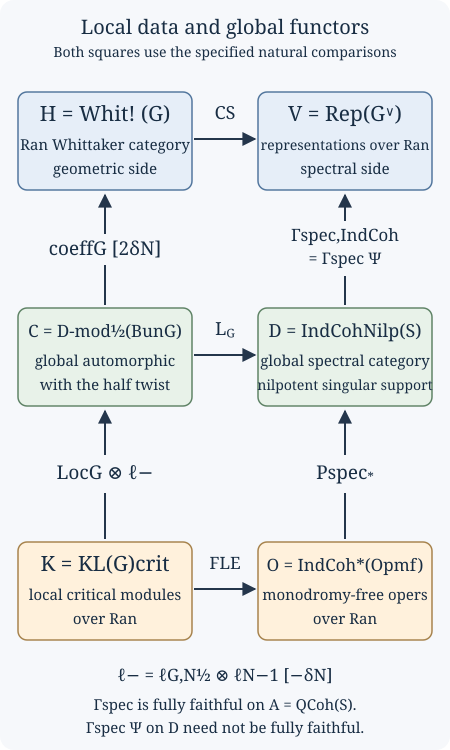

# Kac-Moody localization and the fundamental local equivalence (GLC II)

Draft. Self-checked by the writing AI.

Fix a smooth projective connected curve \(X\) over an algebraically closed field \(k\) of characteristic zero, a connected reductive group \(G\), its Langlands dual \(\check G\), a Borel \(B\subset G\) with unipotent radical \(N\), and a theta characteristic \(\kappa_X^{\otimes2}\simeq\omega_X\). Write
\[
S=\operatorname{LS}_{\check G}(X),\qquad
\mathcal C=D\operatorname{-mod}_{1/2}(\operatorname{Bun}_G),\qquad
\mathcal D=\operatorname{IndCoh}_{\operatorname{Nilp}}(S),\qquad
\mathcal A=\operatorname{QCoh}(S).
\]
All local systems are de Rham local systems. The stack \(S\) and all fibre products of spectral stacks below are derived. We use cohomological shifts, so \(H^i(M[n])=H^{i+n}(M)\). A continuous functor preserves colimits. Equivalences between composite functors include naturality and coherent compatibility with the indicated actions.

[Constructing the Langlands functor (GLC I)](constructing-the-langlands-functor.md) constructs the formal coarse functor and bounded lift from specified geometric inputs. This lesson studies their relation to local critical representations. [Opers, critical level and the Beilinson–Drinfeld construction](opers-critical-level-and-the-beilinson-drinfeld-construction.md) explains the oper normal forms and the critical central character. The local equivalence, the geometric localization comparisons and the infinite-dimensional sheaf theories used here remain unproved mathematical inputs; the categorical deductions below have complete proofs under their explicit hypotheses.

## The local and global categories

For a point \(x\in X\), write \(\mathcal D_x=\operatorname{Spec}k[[t]]\) and \(\mathcal D_x^\times=\operatorname{Spec}k((t))\) after choosing a parameter. The notation is independent of that choice when supplied with the coordinate-change comparisons. The critical Kazhdan–Lusztig category is
\[
\operatorname{KL}(G)_{\mathrm{crit},x}
=\bigl(\widehat{\mathfrak g}_{\mathrm{crit},x}
  \operatorname{-mod}\bigr)^{G(\mathcal D_x)}.
\tag{12.1}
\]
The category of smooth critical Kac–Moody modules is equipped with the arc-group action, and the superscript denotes the specified equivariant category. It is not merely a collection of central characters, nor an identification of its derived category with the derived category of an arbitrary chosen heart. The existence of this category, its t-structure and its equivariant and factorization constructions are inputs.

The Ran prestack assigns to a test scheme \(Y\) the nonempty finite subsets of \(\operatorname{Maps}(Y,X)\). For a finite collection \(I\) of disjoint points, local data are taken on the corresponding multi-disc. A factorization category supplies equivalences over the disjoint locus between the category for \(I\sqcup J\) and the tensor product of the categories for \(I\) and \(J\), together with their compatibility on refinements and collisions. A unital structure also specifies insertion of the local vacuum when points are added. Disjoint tensor product data alone do not specify these insertion maps or the behaviour on diagonals.

Thus \(\operatorname{KL}(G)_{\mathrm{crit},\operatorname{Ran}}\) is the Ran category of local critical representations with these geometric structures. The local-to-global functor is
\[
\operatorname{Loc}_{G,\mathrm{crit}}:
\operatorname{KL}(G)_{\mathrm{crit},\operatorname{Ran}}
\longrightarrow D\operatorname{-mod}_{\mathrm{crit}}(\operatorname{Bun}_G).
\tag{12.2}
\]
It relates the local representation at the marked discs to a critically twisted D-module on the global moduli stack. Its construction uses the level torsors and infinitesimal Hecke groupoid, with compatible vacuum insertion. This geometric construction is not proved here.

There is a specified identification of the critical twisting with the half twist. Compose (12.2) with that identification and denote the resulting functor to \(\mathcal C\) by \(\operatorname{Loc}_G\). Retaining this specified comparison is essential: choosing some untwisted realization of \(\mathcal C\) does not establish the required natural Hecke compatibility.

Use the oper convention with a Borel bundle, an identification of its Cartan bundle with \(\check\rho(\omega_X)=(2\check\rho)(\kappa_X)\), and a connection on its induced \(\check G\)-bundle satisfying the normalized simple-root transversality condition. In particular, the Cartan identification is part of the data. For a torus it is a fixed trivialization; forgetting it passes from a connection in that trivialization to a local system, and is not an equivalence of the two moduli problems.

The spectral local object is the space of monodromy-free opers:
\[
\operatorname{Op}^{\mathrm{mf}}_{\check G,I}
=\operatorname{Op}_{\check G}(\mathcal D_I^\times)
\mathbin{\times}_{\operatorname{LS}_{\check G}(\mathcal D_I^\times)}
\operatorname{LS}_{\check G}(\mathcal D_I).
\tag{12.3}
\]
An object includes a local system on the whole multi-disc, an oper structure on its restriction to the punctured multi-disc, and the comparison between these underlying local systems. The oper reduction may be singular at the marked points even though the local system extends. “Monodromy-free” here means this extension condition with its moduli data. It does not mean that every Laurent coefficient in an oper normal form is regular, or that a complex-analytic monodromy matrix has merely been declared equal to the identity.

These spaces have infinite type. The category in the critical equivalence is
\[
\mathcal O=\operatorname{IndCoh}^{*}
       (\operatorname{Op}^{\mathrm{mf}}_{\check G})_{\operatorname{Ran}}.
\tag{12.4}
\]
The star is part of its definition. There is also a shriek category and a specified duality equivalence
\(\Theta:\operatorname{IndCoh}^{!}(\operatorname{Op}^{\mathrm{mf}}_{\check G})
\simeq\operatorname{IndCoh}^{*}(\operatorname{Op}^{\mathrm{mf}}_{\check G})\).
Their construction, convergence properties and this duality are not consequences of the finite-type definition of \(\operatorname{IndCoh}\); they are further geometric inputs.

**A monodromy-free family with a singular oper form.** For \(\check G=\mathbb G_m\), let \(A=k[\varepsilon]/(\varepsilon^2)\). In the fixed torus trivialization, a connection is \(d+a(t)\,dt\). The unit
\[
u=1+\varepsilon t^{-1}\in A((t))^\times,
\qquad u^{-1}=1-\varepsilon t^{-1},
\]
has logarithmic derivative
\[
u^{-1}du=-\varepsilon t^{-2}\,dt.
\]
Consequently the connection \(d-\varepsilon t^{-2}\,dt\) is isomorphic on the punctured disc to the trivial connection, which extends to the whole disc. It therefore supplies monodromy-free oper data. It is not a regular oper in the given trivialization: its double-pole coefficient is the nonzero element \(-\varepsilon\). A change of trivialization by a unit of \(A[[t]]\) adds a regular logarithmic derivative and cannot remove that pole. Reducing modulo \(\varepsilon\) gives the regular zero connection. This explicit family shows why a description of field-valued points alone does not describe the entire monodromy-free oper space.

For the global correspondence put
\[
\operatorname{Op}^{\mathrm{mf,glob}}_{\check G,I}
=\operatorname{Op}_{\check G}(X\setminus I)
\mathbin{\times}_{\operatorname{LS}_{\check G}(X\setminus I)}S.
\tag{12.5}
\]
It parametrizes a local system on \(X\) equipped with an oper reduction on \(X\setminus I\). Restriction and forgetting the oper give
\[
\operatorname{Op}^{\mathrm{mf}}_{\check G,I}
\xleftarrow{\ \mathrm{ev}_I\ }
\operatorname{Op}^{\mathrm{mf,glob}}_{\check G,I}
\xrightarrow{\ \mathrm{fr}_I\ }S.
\tag{12.6}
\]
At a fixed \(I\), the spectral star-Poincaré functor is
\[
P_{*,I}^{\mathrm{spec}}
=(\mathrm{fr}_I)^{\operatorname{IndCoh}}_*
       \circ\mathrm{ev}_I^{*,\operatorname{IndCoh}}.
\tag{12.7}
\]
Here \(\mathrm{ev}_I^{*,\operatorname{IndCoh}}\) is the left adjoint of the indicated IndCoh pushforward from global to local opers. Its existence and its compatibility with the infinite-type categories are inputs. Formula (12.7) is not an unspecified ordinary pullback. Unital globalization produces
\[
P_*^{\mathrm{spec}}:\mathcal O\longrightarrow\mathcal D.
\tag{12.8}
\]
The corresponding shriek construction uses \(\mathrm{ev}_I^!\) and the shriek local category. Comparing the two requires \(\Theta\) and a graded determinant line; changing a star to a shriek without these data changes the functor.

## The localization comparison and its normalization

Set
\[
\mathcal W=\operatorname{Bun}_{N,\rho(\omega_X)},\qquad
\delta_N=\dim\mathcal W,
\qquad \rho(\omega_X)=(2\rho)(\kappa_X).
\]
The dimension is the stack dimension and can be negative. Let \(\ell_N\) be the constant ungraded line supplied by the canonical line of \(\mathcal W\). Let \(\ell_{G,N}^{1/2}\) be the specified square root of the constant line obtained by restricting the normalized determinant line of \(\operatorname{Bun}_G\) to \(\mathcal W\). Constancy, the square root and their coherent twist comparisons are geometric inputs. Write
\[
\ell_0=\ell_{G,N}^{1/2}\otimes\ell_N^{-1},\qquad
\ell_- =\ell_0[-\delta_N],\qquad
\ell_+ =\ell_0[\delta_N].
\tag{12.9}
\]
These symbols keep the two shifts visible. In particular \(\ell_+=\ell_-[2\delta_N]\).

**Geometric statement 12.A (critical local-to-global comparison; not proved here).** There is a specified natural equivalence
\[
L_G\circ(\operatorname{Loc}_G\otimes\ell_-)
\simeq P_*^{\mathrm{spec}}\circ\operatorname{FLE}_{G,\mathrm{crit}}
\tag{12.10}
\]
of functors from \(\operatorname{KL}(G)_{\mathrm{crit},\operatorname{Ran}}\) to \(\mathcal D\).

The functor \(\operatorname{FLE}_{G,\mathrm{crit}}\) is the critical fundamental local equivalence described below. Statement 12.A is the main theorem of Arinkin, Beraldo, Campbell, Chen, Færgeman, Gaitsgory, Lin, Raskin and Rozenblyum, [Proof of the geometric Langlands conjecture II: Kac-Moody localization and the FLE](https://arxiv.org/abs/2405.03648v3), Introduction and §18.5. It is a comparison of specified functors, not a claim that critical localization is essentially surjective, or that the global Langlands equivalence has already been proved from local data.

The theorem relates two distinct globalization procedures. One local critical representation can first be localized on \(\operatorname{Bun}_G\) and then sent through \(L_G\). Alternatively, it can first be turned into an ind-coherent sheaf on local opers and then transported through the global oper correspondence. The normalization (12.9) is necessary for these procedures to agree.

## The critical fundamental local equivalence

Let \(k\) be algebraically closed of characteristic zero, \(X\) a smooth connected curve, and \(G\) connected reductive, with Langlands dual \(\check G\). Fix the square root of \(\omega_X\) used for half-twisted spherical categories and the \(\rho(\omega_X)\)-twist. At \(x\in X\), write \(\mathcal O=k[[t]]\), \(K=k((t))\), \(LG=G(K)\), and \(L^+G=G(\mathcal O)\). Categories are stable presentable DG categories with continuous functors. The critical level is
\[
\kappa_{\mathrm{crit}}=-\tfrac12\operatorname{Kil}_{\mathfrak g};
\]
for a torus it is zero. The spherical representation category is
\[
\operatorname{KL}(G)_{\mathrm{crit},x}
=\widehat{\mathfrak g}\operatorname{-mod}_{\mathrm{crit},x}^{L^+G}.
\]
Its definition includes strong equivariance and a specified collection of compact objects.

The principal human source is *Proof of the geometric Langlands conjecture II: Kac-Moody localization and the FLE*, arXiv:2405.03648v3, by Dima Arinkin, Dario Beraldo, Justin Campbell, Lin Chen, Joakim Færgeman, Dennis Gaitsgory, Kevin Lin, Sam Raskin, and Nick Rozenblyum. Additional inputs are due to Beilinson–Drinfeld, Feigin–Frenkel, Frenkel–Gaitsgory, Campbell–Raskin, and Raskin.

The arguments below prove formal implications with their hypotheses displayed. The geometric and representation-theoretic hypotheses listed at the end are not proved here. A complete proof of the critical FLE still requires these inputs.

### The target and the exact theorem

Let \(\operatorname{Op}_{\check G,x}^{\mathrm{reg}}\) be opers on the formal disc and \(\operatorname{Op}_{\check G,x}^{\mathrm{mer}}\) opers on the punctured disc. The target is
\[
Z_x=\operatorname{Op}_{\check G,x}^{\mathrm{mf}}
:=\operatorname{LS}_{\check G,x}^{\mathrm{reg}}
\times_{\operatorname{LS}_{\check G,x}^{\mathrm{mer}}}
\operatorname{Op}_{\check G,x}^{\mathrm{mer}}.
\tag{F1}
\]
An object retains a connection extending across the puncture, an oper structure on its punctured restriction, and the specified identification. The oper reduction need not extend. The square with regular opers in its upper left corner is not Cartesian. Replacing \(Z_x\) by regular opers changes the problem; see GLC II §3.1.

Over \(\operatorname{Ran}(X)\), this gives a factorization ind-scheme \(Z\). The notation \(\operatorname{IndCoh}^{*}(Z)\) refers to GLC II's particular infinite-type construction. The star is part of the category's definition. An unqualified replacement by ordinary QCoh or a finite-type IndCoh theorem is unjustified.

GLC II Theorem 6.1.4, labelled “critical FLE,” asserts that the canonical functor
\[
\operatorname{FLE}_{G,\mathrm{crit}}:
\operatorname{KL}(G)_{\mathrm{crit}}
\xrightarrow{\sim}\operatorname{IndCoh}^{*}(Z)
\tag{F2}
\]
is an equivalence of factorization categories. Theorem 6.2.2 is the DG equivalence at a fixed point. Corollary 6.6.9 asserts t-exactness at each fixed finite subset of Ran. Theorem 6.4.5 adds derived-Satake compatibility and compatibility of the local pairings.

Distinguish an equivalence of abelian hearts at a point, an equivalence of DG categories at a point, and an equivalence compatible with families, collisions, factorization, and units. The first alone proves neither of the latter two.

### DS reduction and construction of the functor

The normalized DS functor is the semi-infinite pairing with the character object \(k_\chi\) of \(L\mathfrak n_{\rho(\omega_X)}\):
\[
\operatorname{DS}:
\widehat{\mathfrak g}\operatorname{-mod}_{\mathrm{crit},\rho(\omega_X)}
\longrightarrow\operatorname{Vect}.
\]
GLC II §2.3 defines it through the canonical self-duality of the nilpotent loop Lie algebra. It factors through Whittaker coinvariants:
\[
\widehat{\mathfrak g}\operatorname{-mod}
\longrightarrow\operatorname{Whit}_{*}(\widehat{\mathfrak g}\operatorname{-mod})
\xrightarrow{\overline{\operatorname{DS}}}\operatorname{Vect}.
\tag{F3}
\]
The passage between Whittaker invariants and coinvariants uses a specified equivalence.

The deep inputs are the factorization Feigin–Frenkel isomorphism, identifying the critical center with functions on regular opers; the center-to-DS-of-vacuum isomorphism; and the birth-of-opers theorem, making the vacuum construction compatible with the naive Satake action and the tautological local system. Their locators are GLC II Theorem 5.1.2, §4.8's theorem “center as DS,” and Theorem 5.2.5, citing Theorem 5.5.3 of Beilinson–Drinfeld’s free author draft, [Quantization of Hitchin’s integrable system and Hecke eigensheaves](https://math.uchicago.edu/~drinfeld/langlands/QuantizationHitchin.pdf).

The refined affine Skryabin input is
\[
\overline{\operatorname{DS}}^{\mathrm{enh,rfnd}}:
\operatorname{Whit}_{*}
(\widehat{\mathfrak g}\operatorname{-mod}_{\mathrm{crit},\rho(\omega_X)})
\xrightarrow{\sim}
\operatorname{IndCoh}^{*}(\operatorname{Op}_{\check G}^{\mathrm{mer}}).
\tag{F4}
\]
The factorization assertion is GLC II Theorem 4.8.8. Raskin's *W-algebras and Whittaker categories*, arXiv:1611.04937v1, §5 affine Skryabin theorem, identifies Whittaker objects with the renormalized W-algebra module category and identifies the composite with DS. Its critical specialization is in §7.5. Its pointwise statement does not by itself prove all coherent factorization structures in (F4).

Set \(Y=\operatorname{Op}_{\check G}^{\mathrm{mer}}\), \(A=\operatorname{IndCoh}^{!}(Y)\), and \(B=\operatorname{IndCoh}^{!}(Z)\). The center action on KL factors through \(B\); GLC II §§5.3–5.4 construct this action using birth of opers and a coherent coaction. Given that action, spherical forgetfulness, Whittaker projection, and (F4) give an \(A\)-linear functor
\[
H:\operatorname{KL}(G)_{\mathrm{crit},\rho(\omega_X)}
\longrightarrow A^\vee=\operatorname{IndCoh}^{*}(Y).
\]
It lifts to
\[
M\longmapsto [b\longmapsto H(b\cdot M)]
\quad\text{in}\quad\operatorname{Fun}_{A}(B,A^\vee).
\tag{F5}
\]

Here is the formal identification used in this construction:
\[
\operatorname{Fun}_{A}(B,A^\vee)\simeq B^\vee.
\tag{F6}
\]
For unital symmetric monoidal \(A\) and dualizable \(A\)-module \(B\), regard \(A^\vee\) as continuous linear functionals on \(A\), with its induced \(A\)-action. Evaluation at \(1_A\) sends an \(A\)-linear functor \(h\) to \(b\mapsto h(b)(1_A)\). Conversely, a functional \(\lambda:B\to\operatorname{Vect}\) gives
\[
h_\lambda(b)(a)=\lambda(a\cdot b).
\]
Associativity makes this \(A\)-linear. The unit law and linearity identify both composites with the identity, including mapping complexes and coherences. This proves (F6). In this application, the geometric duality \(B^\vee\simeq\operatorname{IndCoh}^{*}(Z)\) is a separate premise, GLC II Lemma 3.5.7.

Combining (F5) and (F6), then undoing the \(\rho(\omega_X)\)-twist by its tautological equivalence, constructs (F2) without assuming it is an equivalence. Under the conservative pushforward \(i_*:\operatorname{IndCoh}^{*}(Z)\to\operatorname{IndCoh}^{*}(Y)\), its vacuum-unit map becomes the center-to-DS-of-vacuum map. That is an isomorphism, so conservativity proves that FLE carries the vacuum to \(\mathcal O_{\operatorname{Op}^{\mathrm{reg}}}\). Upgrading this unit identification to strict unitality requires the coherent criterion in GLC II §6.1.

### The contribution of affine Skryabin

Raskin defines the W-algebra module category as the Ind-completion of the small subcategory of \(D^+(\mathcal W_\kappa\operatorname{-mod}^{\heartsuit})\) generated by generalized vacuum modules \(\mathcal W_\kappa^n\). This fixes the unbounded category and its compacts. An equivalence of hearts fixes neither.

His §5 proof uses substantial calculations: adolescent Whittaker approximations and their shifted t-structures; compact generators \(P_n\) in the Whittaker heart; corepresentation
\[
\Psi^{\mathrm{Whit}}(M)=\operatorname*{colim}_{n}
\operatorname{RHom}(P_n,M);
\]
the calculation \(\Psi^{\mathrm{Whit}}(P_n)=\mathcal W_\kappa^n\) in degree zero; injectivity of the transition maps on degree-zero Homs to heart objects; and reconstruction of the topological W-algebra from the pro-system. Stating affine Skryabin does not prove these calculations.

The exactness and bounded-below conservativity deductions can be proved explicitly. If \(M\geq0\), then \(\operatorname{RHom}(P_n,M)\geq0\), since \(P_n\leq0\). Filtered colimits preserve this condition in complexes of vector spaces, giving preservation of \(\geq0\). The source's \(\leq0\) part is generated under colimits and nonnegative cohomological shifts by the \(P_n\). Their images are in degree zero, so continuity gives preservation of \(\leq0\).

For \(M\geq0\) with \(H^0\Psi^{\mathrm{Whit}}(M)=0\), the spaces \(\operatorname{Hom}(P_n,H^0M)\) inject into the next ones and have zero colimit. Each is zero. Their generating property implies \(H^0M=0\). Shifting and repeating shows that if \(M\) is bounded below and \(\Psi^{\mathrm{Whit}}(M)=0\), every cohomology object vanishes. The given identification of the bounded-below category with \(D^+\) of its heart then implies \(M=0\). This proves the conservativity range in Raskin §5 exactness and conservativity theorem, without silently extending it to all unbounded objects.

Topological algebra reconstruction and the pro-system calculation produce a bounded-below equivalence. Restrict it to the small thick subcategories generated by \(P_n\) and \(\mathcal W_\kappa^n\). It is fully faithful there and matches their generators, hence identifies these thick subcategories. Ind-completion gives an equivalence on the specified unbounded categories. This proves the last step of affine Skryabin conditional on the earlier calculations.

There is a separate finiteness contribution. For a loop-group module category, let
\[
Q:\operatorname{Sph}(\mathcal C)\longrightarrow
\operatorname{Whit}_{*}(\mathcal C)
\]
be spherical forgetfulness followed by Whittaker projection. Given the clean Whittaker vacuum and the invariant–coinvariant comparison, its right adjoint is convolution with that vacuum followed by spherical averaging. GLC II Lemma 6.3.2 verifies the adjunction; Proposition 6.2.4 uses continuity of its right adjoint.

For compact \(c\), an adjunction \(Q\dashv R\), and a filtered diagram \(d_j\),
\[
\operatorname{Maps}(Qc,\operatorname*{colim}_j d_j)
\simeq\operatorname{Maps}(c,R\operatorname*{colim}_j d_j)
\simeq\operatorname*{colim}_j\operatorname{Maps}(c,Rd_j)
\simeq\operatorname*{colim}_j\operatorname{Maps}(Qc,d_j).
\]
Thus \(Qc\) is compact. Equation (F4) preserves compactness because it is an equivalence. GLC II Proposition 3.3.5 says \(i_*\) detects compactness as well as conservativity. Since \(i_*\operatorname{FLE}=\overline{\operatorname{DS}}^{\mathrm{enh,rfnd}}Q\), FLE preserves compactness. Exactness of DS alone would not prove this.

### Derived Satake and its algebra steps

The derived Satake equivalence identifies the prescribed half-twisted, renormalized spherical category with the spectral spherical category:
\[
S_G\simeq S_{\check G}^{\mathrm{spec}}.
\tag{F7}
\]
At a point the latter is the convolution category
\[
\operatorname{IndCoh}
\left(
\operatorname{LS}^{\mathrm{reg}}_{\check G,x}
\times_{\operatorname{LS}^{\mathrm{mer}}_{\check G,x}}
\operatorname{LS}^{\mathrm{reg}}_{\check G,x}
\right).
\]
GLC II §1.7 states (F7) with Casselman–Shalika compatibility. Campbell–Raskin, *Langlands duality on the Beilinson–Drinfeld Grassmannian*, arXiv:2310.19734v2, §6, proves the factorization version. The naive functor from \(\operatorname{Rep}(\check G)\) into the spherical category is not the DG equivalence (F7).

Campbell–Raskin §9 reduces equivalence to an isomorphism of monads on \(\operatorname{Rep}(\check G)\). The geometric monad uses an equivariant-cohomology calculation. The spectral monad uses Koszul duality. Both are
\[
\operatorname{Sym}(\check{\mathfrak g}[-2])\otimes-.
\tag{F8}
\]
The geometric calculation, monadicity, and compatibility of the actual monad map are deep premises. Abstractly identifying two algebras does not identify the actual map.

The spectral algebra calculation has an elementary core. For finite-dimensional \(V\), the derived zero intersection has functions \(B=\operatorname{Sym}(V^*[1])\), an exterior algebra with generators \(\theta_i\) of degree \(-1\). A free resolution of the augmentation module is \(P=B[u_1,\ldots,u_r]\), with \(|u_i|=-2\), \(du_i=\theta_i\). In one variable, \(d(u^n)=n\theta u^{n-1}\), so only degree-zero cohomology \(k\) remains. Tensoring the resolutions proves the result in all dimensions. Applying \(\operatorname{Hom}_B(-,k)\) gives zero differential and symmetric dual generators in degree \(2\).

Yoneda multiplication can be checked on this resolution. The \(B\)-linear operators \(D_i=\partial/\partial u_i\) have degree \(2\), commute with one another, and commute with \(d=\sum_i\theta_iD_i\). Thus they are chain maps representing the degree-two Ext classes after composition with the augmentation \(P\to k\). For a multi-index \(\alpha\), the composite \(D^\alpha\) followed by augmentation evaluates on \(u^\beta\) as zero unless \(\beta=\alpha\), and then as \(\alpha!\). These nonzero scalars are invertible in characteristic zero. In each cohomological degree, the resulting classes are therefore a basis of \(\operatorname{Hom}_B(P,k)\); operator composition gives their polynomial multiplication. Consequently
\[
\operatorname{RHom}_{B}(k,k)\simeq\operatorname{Sym}(V[-2]).
\tag{F9}
\]
Identifying the actual spectral category and adjunction with this model remains a geometric premise.

A conditional reduction from invariants to the algebra map is useful. Let \(H\) be connected reductive and let
\[
\varphi:\operatorname{Sym}(\mathfrak h[-2])
\longrightarrow\operatorname{Sym}(\mathfrak h[-2])
\]
be an \(H\)-equivariant graded algebra map, invertible on the invariant algebra. Use the following representation-theoretic premises: the reductive decomposition \(\mathfrak h=\mathfrak z\oplus\bigoplus_i\mathfrak h_i\); irreducibility and pairwise nonisomorphism of the nontrivial \(\mathfrak h_i\) as representations of the full group \(H\); and existence of a nonzero invariant quadratic element \(q_i\in\operatorname{Sym}^2(\mathfrak h_i)^H\) for each simple ideal. These premises, including the usual Casimir construction, are not proved here.

Its degree-two part is \(f:\mathfrak h\to\mathfrak h\). A nonzero equivariant map between irreducibles has zero kernel and full image, hence is an isomorphism; no such map exists between the nonisomorphic summands. An equivariant endomorphism of an irreducible has an eigenvalue over \(k\); the nonzero kernel of its difference from that scalar is invariant, so is the whole representation. Thus \(f\) is scalar \(c_i\) on each \(\mathfrak h_i\) and preserves \(\mathfrak z\). Degree-two invariants are exactly \(\mathfrak z\), so \(f|_{\mathfrak z}\) is invertible. Since \(\varphi(q_i)=c_i^2q_i\), injectivity on invariants forces \(c_i\neq0\). Thus \(f\) and its symmetric-algebra map are invertible. Applied on cohomology, this proves a quasi-isomorphism. This proves the algebra-map deduction under the stated representation-theoretic premises.

For the actual Satake map, compatible parabolic diagrams reduce injectivity on invariants to the torus calculation and Chevalley restriction. Each invariant graded piece is finite-dimensional, so injectivity of its endomorphism gives surjectivity. Equation (F9), the preceding algebra argument, and monadicity then prove pointwise Satake conditional on the geometric comparisons. The torus Fourier kernel, Contou–Carrère compatibility, and factorization upgrade remain additional premises.

### The pointwise critical FLE

Set \(\mathcal K=\operatorname{KL}(G)_{\mathrm{crit},x}\), \(\mathcal E=\operatorname{IndCoh}^{*}(Z_x)\), and \(\mathcal E_Y=\operatorname{IndCoh}^{*}(Y_x)_{\mathrm{mf}}\). The last category has set-theoretic support on the monodromy-free locus and includes its formal neighborhood. It is not sheaves on the reduced locus.

Let \(S=S_{\check G,x}^{\mathrm{spec}}\), \(S_{\mathrm{temp}}\) its tempered colocalization, and \(B_0=\operatorname{QCoh}(\operatorname{LS}^{\mathrm{reg}}_{\check G,x})\simeq\operatorname{Rep}(\check G)\). The crucial pointwise comparison is
\[
\mathcal C_{\mathrm{temp}}\simeq
\operatorname{Fun}_{A_0}(B_0,B_0\otimes_S\mathcal C),\qquad
A_0=\operatorname{QCoh}
((\operatorname{LS}^{\mathrm{mer}}_{\check G,x})^\wedge_{\mathrm{reg}}).
\tag{F10}
\]
It is natural in \(S\)-module categories. GLC II §7.1 obtains it from the identification of \(S_{\mathrm{temp}}\) with \(A_0\)-linear endomorphisms of \(B_0\), together with required dualizability and rigidity. These geometric identifications are premises here; an arbitrary endomorphism category does not automatically give (F10).

The Satake-compatible FLE gives a square with upper arrow \(B_0\otimes_S\operatorname{FLE}\) and vertical arrows landing in \(\mathcal E_Y\). The spectral vertical arrow is an equivalence by Proposition 3.6.5. The geometric one is the refined DS pairing and is fully faithful with the same image by Proposition 7.2.2. Compose with either vertical inverse to see that the upper arrow is an equivalence. Applying (F10) proves
\[
\mathcal K_{\mathrm{temp}}\xrightarrow{\sim}\mathcal E.
\tag{F11}
\]
The target is tempered by the pointwise base-change presentation in Proposition 3.8.11, transferring the tempered action from \(B_0\); see Proposition 7.2.4.

The actions in this square include their left/right conventions. GLC II §1.8 identifies the pairing with \(\operatorname{Whit}_{*}\) through the infinity version of the dual-group FLE, compatible with the Chevalley-twisted Satake functor \(\operatorname{Sat}^{\tau}_G\). The critical FLE itself is compatible with \(\operatorname{Sat}_G\). The twist \(\tau\), which acts by inversion on the torus, belongs to the balanced-action identification; it must be retained when choosing the two module structures. The compatibility in Theorem 6.4.5 is the geometric premise supplying that identification.

Full faithfulness of the pairing uses the geometric premise that
\[
\operatorname{Dmod}_{1/2}(\operatorname{Gr}_{G,x})
\otimes_{S_G}\operatorname{Sph}(\mathcal C)\longrightarrow\mathcal C
\]
is fully faithful with a continuous equivariant right adjoint. GLC II §7.3 derives it from ind-properness. Applying Whittaker coinvariants to the unit and counit preserves their triangle identities and the invertible unit, so the Whittaker pairing is fully faithful. This transfer is formal; existence and continuity of the equivariant adjunction are geometric.

Its image is determined by generators. Weyl modules
\[
\mathbb V^\lambda_{\mathrm{crit}}
=\operatorname{ind}^{(\widehat{\mathfrak g},L^+G)_{\mathrm{crit}}}_{L^+G}(V^\lambda)
\]
compactly generate KL. The required calculation is
\[
\operatorname{DS}^{\mathrm{enh,rfnd}}(\mathbb V^\lambda_{\mathrm{crit}})
=\mathcal O_{\operatorname{Op}^{\lambda\text{-reg}}_{\check G,x}}.
\tag{F12}
\]
GLC II Lemma 7.3.10 attributes this Weyl-module/oper calculation to Frenkel–Gaitsgory. The reduced monodromy-free locus is the disjoint union of these loci, and their structure sheaves generate the formal-support category. The DS calculation and infinite-type support-generation assertion remain premises. Given them, the image proof is complete: the fully faithful functor has a continuous right adjoint, so its image is closed under colimits; it contains the displayed generators, hence equals \(\mathcal E_Y\). This proves (F11) without assuming full FLE.

Remove the tempered colocalization by the following complete formal argument. Write
\[
i:\mathcal K_{\mathrm{temp}}\hookrightarrow\mathcal K,\qquad i\dashv q,
\]
with continuous \(q\). The tempered-action comparison includes its universal property: the \(S\)-linear FLE, whose target is tempered, factors as the equivalence (F11) after \(q\). Thus (F11) and FLE compactness imply that \(q\) preserves compacts. Continuity of \(q\) implies that \(i\) preserves compacts. For compact \(c\), the fiber \(a\) of \(iqc\to c\) is therefore compact and satisfies \(qa=0\).

The remaining t-structure input is Lemma 7.4.4: the comonad \(iq\) preserves \(\leq0\), and its counit induces an isomorphism on \(H^0\) of heart objects. Therefore \(q\) is conservative on the heart. FLE is t-exact on bounded objects. If a bounded \(a\) has \(qa=0\), (F11) gives \(\operatorname{FLE}(a)=0\), and t-exactness gives \(\operatorname{FLE}(H^ja)=0\) for all \(j\). By (F11) and heart conservativity, \(H^ja=0\); bounded cohomology detection gives \(a=0\). Compact KL objects are bounded, so the counit fiber above vanishes. Both functors are continuous and compacts generate, hence \(iq\simeq\operatorname{Id}\). Together with \(qi\simeq\operatorname{Id}\), this proves that \(q\) is an equivalence. Equation (F11) now gives the pointwise DG FLE.

Agreement on the heart alone would not justify this result: compactness, boundedness of compacts, and the controlled adjunction are all used.

### T-exactness and the factorization upgrade

The chain has no arbitrary extra shift. DS, normalized by the \(\rho(\omega_X)\)-twist, is t-exact on spherical modules; GLC II Lemma 2.3.8 and Frenkel–Gaitsgory's main theorem in *Local Geometric Langlands Correspondence: the Spherical Case*. Raskin §7.2 gives this as the \(n=0\) case of \(\Psi[-n\Delta]\) on adolescent approximations. Those approximation shifts do not become shifts of critical FLE.

The naive Satake action of heart representations on critical KL is t-exact, GLC II Corollary 5.4.5, using birth of opers and exact tensoring by tautological vector bundles. This is a specific critical-KL assertion. The coarse functor \(\operatorname{pre\!-\!FLE}\) is computed using the regular representation \(R_{\check G}\), this Hecke action, and DS. In characteristic zero \(R_{\check G}\) is a filtered union of finite-dimensional representations. Tensoring with it is exact, Hecke action is exact by the preceding premise, and DS on KL is exact. Thus their composition is t-exact, proving the deduction of Lemma 6.6.7.

Recovering the refined functor uses the bounded-below comparison with modules for \(R_{\check G,\operatorname{Op}}\), GLC II §4's bounded-below IndCoh comparison proposition. On bounded-below categories this is an equivalence with the prescribed t-structures and lift. The comparison, including the lift on bounded-below inputs, is a geometric premise. It is not an equivalence asserted on every unbounded object.

Given it, FLE preserves both t-structure halves on bounded-below objects. To extend preservation of \(\leq0\), use right completeness in the form
\[
M=\operatorname*{colim}_{n}\tau^{\geq-n}M.
\]
For \(M\leq0\), every truncation is bounded and \(\leq0\). Continuity and closure of the target's \(\leq0\) under filtered colimits give \(\operatorname{FLE}(M)\leq0\). Since every \(M\geq0\) is already bounded below, this proves full t-exactness conditional on the stated completeness and bounded-below comparison.

The factorization upgrade needs a precise descent premise: a compactness-preserving factorization functor from a compactly generated sheaf of categories has a continuous right adjoint compatible with factorization and base change; its unit and counit are detected on configuration strata, then on all field-valued fibers of the one-point stratum. This is the sheaf-of-categories input in Proposition 6.2.6.

Given it, the proof is complete. On a stratum of \(n\) distinct points, factorization identifies FLE with the tensor product of \(n\) one-point equivalences, so its unit and counit are isomorphisms. Collision strata use fewer distinct points. Conservative descent makes the unit and counit isomorphisms globally. An adjunction with invertible unit and counit is an equivalence. The pointwise theorem must hold over the field extensions occurring in fibers, or an independent local-trivialization and base-change argument must supply that assertion. Checking only closed \(k\)-points does not prove arbitrary family comparison.

### Why the abelian regular-oper statement is insufficient

The Beilinson–Drinfeld regular-center assertion identifies a specified abelian category using the vacuum module over regular opers. The critical FLE has a different derived target. Frenkel–Gaitsgory's *Local Geometric Langlands Correspondence: the Spherical Case*, arXiv:0711.1132v1, main theorem, asserts t-exactness of DS on its bounded-below derived source and an equivalence of abelian categories with quasi-coherent sheaves on the unramified central support. That support includes the formal neighborhoods of the regular-\(\lambda\) oper loci. The theorem as stated there is not an independent assertion of the entire unbounded factorization equivalence (F2).

Here is a full algebra calculation showing the problem with dropping ambient directions. Let \(A=k[z]\) and \(M=A/(z)=k\). The free resolution
\[
0\longrightarrow A\xrightarrow{\,z\,}A\longrightarrow M\longrightarrow0
\]
gives, after applying \(\operatorname{Hom}_A(-,M)\), a zero-differential two-term complex. Thus
\[
\operatorname{Ext}_A^0(M,M)=k,\qquad
\operatorname{Ext}_A^1(M,M)=k,
\]
and all other groups vanish. In the category of modules on the reduced point, \(\operatorname{Ext}_k^1(k,k)=0\). For \(r\) independent normal coordinates, tensor these two-term resolutions. The resulting Hom complex has zero differential and exterior generators in degree one, so its \(j\)-th dimension is \(\binom rj\). To check multiplication, write the tensor resolution as \(A\otimes\Lambda(e_1,\ldots,e_r)\), with \(|e_i|=-1\) and \(de_i=z_i\). Contraction by each \(e_i\) is a degree-one chain operator: it anticommutes with the differential and the other contractions, and its square is zero. Composing ordered contractions with augmentation evaluates nontrivially exactly on the corresponding exterior basis element. These classes form the computed Hom basis and their composites have exterior multiplication. The degree-one normal classes and their exterior products are lost by replacing the ambient formal support with the reduced locus.

The geometric identification of the Weyl-module self-extensions with the normal-bundle exterior algebra is an additional Frenkel–Gaitsgory calculation, displayed in that paper's introduction and the Weyl-module self-extension proposition. The algebra example proves the mechanism of losing normal extensions; it does not prove that geometric identification. An equivalence of hearts on regular opers therefore supplies too little information to establish the specified DG FLE.

### Exact premises still requiring proofs

The following mathematical inputs are used with the indicated human-source locators. None is supplied by a source name alone.

1. The DG Kac–Moody categories, their loop-group actions, specified t-structures, compact generation by Weyl modules, and boundedness of compacts. GLC II §§2.1–2.2 and the proofs in §§6–7 use these inputs. The completeness assumptions in the t-exactness argument also require justification.
2. The factorization Feigin–Frenkel theorem, the center-to-DS-of-vacuum calculation, and birth of opers with its Satake compatibility: GLC II Theorems 5.1.2 and 5.2.5 and §4.8. Birth of opers cites Theorem 5.5.3 of Beilinson–Drinfeld’s free author draft, [Quantization of Hitchin’s integrable system and Hecke eigensheaves](https://math.uchicago.edu/~drinfeld/langlands/QuantizationHitchin.pdf).
3. Affine Skryabin's adolescent geometry, shifted t-structures, generalized-vacuum calculations, transition injections, and topological algebra reconstruction. Raskin's [*W-algebras and Whittaker categories*](https://arxiv.org/abs/1611.04937v1), §§5 and 7, provides the pointwise source; GLC II Theorem 4.8.8 is the factorization form. Their final exactness, bounded-below conservativity, and Ind-extension deductions are proved in the affine Skryabin discussion.
4. The infinite-type oper geometry: conservative and compactness-detecting pushforward, the relative-Hom duality, formal-support generation, and the pointwise spherical/base-change presentations. The relevant GLC II locators are Proposition 3.3.5, Lemma 3.5.7, and Propositions 3.6.5 and 3.8.11. Finite-type analogies do not prove these assertions.
5. The actual derived-Satake monad comparison, its parabolic compatibility, Chevalley restriction, and the torus Fourier and Contou–Carrère calculations: Campbell–Raskin's [*Langlands duality on the Beilinson–Drinfeld Grassmannian*](https://arxiv.org/abs/2310.19734v2), §§6–9. The reductive-decomposition and Casimir premises in the algebra-map argument are also explicit inputs.
6. The coherent monodromy-free central action, exact Hecke action, bounded-below refined comparison with its lift, and the critical tempered comonad's \(H^0\) property. See GLC II §§4–5, Corollary 5.4.5, Lemma 6.6.7, Corollary 6.6.9, and Lemma 7.4.4. The formal propagation arguments do not establish the geometric comparisons themselves.
7. The equivariant continuous adjunction, clean Whittaker vacuum, DS of Weyl modules, and generation by regular-\(\lambda\) loci. See GLC II Lemma 6.3.2, §§7.2–7.3, and Lemma 7.3.10. The latter attributes the Weyl-module/oper calculation to Frenkel–Gaitsgory. The separate spherical paper's main theorem and Weyl-module self-extension proposition do not replace the complete Weyl-module calculation.
8. The coherent compatibility of the factorization actions and pairings, the strict-unit criterion, and the family/base-change/descent input for the factorization right adjoint. See GLC II Theorem 6.4.5, Appendix E Proposition E.10.10, and Proposition 6.2.6.

The external-fusion paragraph GLC II B.11.14 cannot be used as an established premise. Chen, Fu, Gaitsgory, and Yang explicitly identify its defect in [*Representations of loop groups as factorization module categories*](https://arxiv.org/abs/2511.02916v2), Warning C.9.13: a proposed étale hypercover has transition maps that are not schematic and fails the required surjectivity. Their corrected Lemma C.9.14 has its own hypotheses and proof obligation. The factorization argument above is conditional on valid descent and does not claim that either paragraph supplies its proof here.

The local theorem proved conditionally above is GLC II Theorem 6.1.4, with pointwise Theorem 6.2.2 and t-exactness Corollary 6.6.9. The global critical-localization identity, global Hecke property, and fundamental diagram (18.14) require the separate global arguments of GLC II. They are not formal corollaries of the torus calculation or the pointwise FLE.

## Hecke symmetry after extending the oper globally

The local spectral action makes the critical category a module for the category of quasi-coherent sheaves on local monodromy-free opers. Global opers give a map to these local opers, so one can extend scalars to global oper data. Write the resulting Ran category as
\[
\mathcal K^{\mathrm{glob}}
=\operatorname{KL}(G)_{\mathrm{crit},\operatorname{Ran}}
\mathbin{\otimes}_{\operatorname{QCoh}(\operatorname{Op}^{\mathrm{mf}}_{\check G})_{\operatorname{Ran}}}
\operatorname{QCoh}(\operatorname{Op}^{\mathrm{mf,glob}}_{\check G})_{\operatorname{Ran}}.
\tag{12.11}
\]
The relative tensor product here is taken with the specified Ran actions and their convolution and unital conventions. Its construction is an input, rather than the ordinary tensor product of two vector spaces.

**Geometric statement 12.B (critical Hecke property; not proved here).** Critical localization factors through a functor
\[
\operatorname{Loc}^{\mathrm{Op}}_{G,\mathrm{crit}}:
\mathcal K^{\mathrm{glob}}
\longrightarrow D\operatorname{-mod}_{\mathrm{crit}}(\operatorname{Bun}_G)
\tag{12.12}
\]
which is linear for the convolution monoidal category
\((\operatorname{Rep}(\check G)_{\operatorname{Ran}})^\star\).
On the target this is the Hecke action. On the source it is spectral localization to \(\operatorname{QCoh}(S)\), followed by pullback along the underlying-global-local-system map and the module action. This is GLC II §16.4, the critical Hecke-property corollary, with the scalar extension and globalization constructed in the preceding parts of that section.

This statement extends the regular-oper construction: the oper can have singularities at \(I\), while its underlying local system extends over \(X\). A central character at one disc alone does not supply such a global eigenvalue or the coherent Hecke comparisons.

The implication from the specified linearity to an eigen relation can be proved directly. Suppose a sheaf category on a spectral space \(Z\) is acted on by \(\operatorname{Rep}(\check G)_{\operatorname{Ran}}\) through a map \(r:Z\to S\). Fix a point \(z\) and a defined object \(k_z\), and suppose its action satisfies the specified fibre formula
\[
a\star k_z\simeq a(r(z))\otimes k_z.
\tag{12.13}
\]
If \(J\) is a continuous linear functor to an automorphic category, then
\[
a\star J(k_z)
\simeq J(a\star k_z)
\simeq J(a(r(z))\otimes k_z)
\simeq a(r(z))\otimes J(k_z).
\tag{12.14}
\]
The first map is linearity, the second is (12.13), and the third is the specified \(k\)-linear tensor compatibility. The action coherences for the three maps prove the tensor, unit and collision coherences of the eigen relation. Thus (12.14) is a full conditional deduction, not merely an equality in a Grothendieck group. For global opers the eigenvalue is the underlying global local system. The geometric fibre formula, the existence of \(k_z\) in the stated category, and the actual functor (12.12) are not proved by this deduction. Neither is nonvanishing: the zero object also satisfies (12.14).

## The fundamental diagram

Put
\[
\mathcal V=\operatorname{Rep}(\check G)_{\operatorname{Ran}},\qquad
\mathcal H=\operatorname{Whit}^{!}(G)_{\operatorname{Ran}}.
\]
The geometric Casselman–Shalika equivalence is \(\operatorname{CS}_G:\mathcal H\simeq\mathcal V\). It is an unproved geometric input here. Let \(\operatorname{coeff}_G:\mathcal C\to\mathcal H\) be the full Ran Whittaker coefficient, and let \(\Gamma^{\mathrm{spec}}:\mathcal A\to\mathcal V\) be the right adjoint of coarse spectral localization. It is a Ran-valued functor, not ordinary global sections to vector spaces. Let
\[
\Gamma^{\mathrm{spec},\operatorname{IndCoh}}
=\Gamma^{\mathrm{spec}}\circ\Psi_{\operatorname{Nilp},0}
       :\mathcal D\longrightarrow\mathcal V.
\tag{12.15}
\]

The upper square has the specified comparison
\[
\Gamma^{\mathrm{spec},\operatorname{IndCoh}}L_G
\simeq\operatorname{CS}_G\operatorname{coeff}_G[2\delta_N].
\tag{12.16}
\]
The lower square is (12.10). These are GLC II §18.3, the Langlands–Whittaker compatibility corollary, and §18.5. The image assertions needed in the argument are that critical localization lands in the tempered automorphic subcategory and that \(P_*^{\mathrm{spec}}\) lands in the zero-support copy of \(\mathcal A\). They are the tempered-localization proposition in GLC II §18.5 and the zero-support Poincaré proposition in §17, and are not proved here.

Equation (18.14) of GLC II expresses the outer comparison through the middle categories \(\mathcal C\) and \(\mathcal A\), before the horizontal Langlands arrow is filled in. With the unshifted coefficient functor its left ascending composite is
\[
\operatorname{CS}_G\operatorname{coeff}_G
       (\operatorname{Loc}_G\otimes\ell_+),
\tag{12.17}
\]
and its right ascending composite is
\[
\Gamma^{\mathrm{spec}}P_*^{\mathrm{spec}}
       \operatorname{FLE}_{G,\mathrm{crit}}.
\tag{12.18}
\]
Their equivalence has the \(+\delta_N\) shift in (12.17). Indeed, replacing the coefficient in (12.17) by the normalized coefficient \(\operatorname{coeff}_G[2\delta_N]\) changes the preceding localization line to \(\ell_-\), since
\[
\operatorname{coeff}_G[2\delta_N]
       (\operatorname{Loc}_G\otimes\ell_-)
\simeq\operatorname{coeff}_G
       (\operatorname{Loc}_G\otimes\ell_+).
\tag{12.19}
\]
The equality follows by adding cohomological shifts and commuting tensoring by the fixed line with a \(k\)-linear functor. It accounts for the apparent change of sign between the outer diagram and the main theorem.

### Why the outer comparison suffices

Here is the exact formal argument. Assume the categorical constructions, natural comparisons and geometric image assertions just stated. Write \(u:\mathcal C_{\mathrm{temp}}\hookrightarrow\mathcal C\) and \(\Xi:\mathcal A\hookrightarrow\mathcal D\) for the specified fully faithful inclusions. Suppose
\[
L_Gu\simeq\Xi L_{G,\mathrm{temp}},\qquad
L_{G,\mathrm{coarse}}u\simeq L_{G,\mathrm{temp}},
\quad
\operatorname{Loc}_G\simeq u\operatorname{Loc}_{G,\mathrm{temp}},
\quad P_*^{\mathrm{spec}}\simeq\Xi P_{*,0}^{\mathrm{spec}}.
\tag{12.20}
\]
These are specified functor factorizations and equivalences, not inferences from a statement about objects alone. Assume further that \(\Gamma^{\mathrm{spec}}\) is fully faithful and that the coarse version of (12.16) is given. If (12.17) and (12.18) agree naturally, then
\[
\begin{aligned}
\Gamma^{\mathrm{spec}}L_{G,\mathrm{coarse}}
       (\operatorname{Loc}_G\otimes\ell_-)
&\simeq\operatorname{CS}_G\operatorname{coeff}_G
       (\operatorname{Loc}_G\otimes\ell_+)\\
&\simeq\Gamma^{\mathrm{spec}}P_{*,0}^{\mathrm{spec}}
       \operatorname{FLE}_{G,\mathrm{crit}}.
\end{aligned}
\tag{12.21}
\]
Postcomposition with a fully faithful functor is fully faithful on functor categories. To see this, a natural transformation is a compatible family of maps; full faithfulness identifies each of its mapping spaces and all compatibility spaces. Taking the limit imposing these compatibilities gives the same space of transformations. Thus (12.21) lifts uniquely, with its specified coherence, to a natural equivalence of the two functors to \(\mathcal A\). Using (12.20) and then \(\Xi\) gives (12.10). The same argument backwards shows that (12.10), together with the upper-square comparison, implies the outer comparison. This proves the formal equivalence of the two comparison problems under the stated inputs.

Full faithfulness is used on \(\mathcal A\). The composite (12.15) does not inherit full faithfulness merely because its last factor is fully faithful: \(\Psi_{\operatorname{Nilp},0}\) can forget nonzero singular support. Accordingly equality of the two coarse images, without the image factorizations (12.20), would not determine the full nilpotent comparison.

The remaining outer comparison is geometric. It identifies two pairings into vector spaces. On the automorphic side localization followed by Whittaker coefficient is expressed through factorization homology of the critical centre; on the spectral side global oper pull-push followed by spectral global sections is expressed through factorization homology of functions on regular opers. The Feigin–Frenkel isomorphism and the compatible local pairing comparison identify these expressions. In GLC II these steps are the localization/coefficient theorem in §15, the spectral Poincaré/global-sections theorem in §17.5, and the coarse pairing corollary in §6. These geometric pairing identities, including their unital insertion and homological convergence data, are not proved by the cancellation argument above.

## Adjoints computed through a localization

The commutative squares in the local-to-global construction carry more than objectwise identifications. Their specified natural equivalences allow one to compute adjoints, including their units and counits. The following two mechanisms isolate the formal part of that calculation.

We work in presentable stable \(k\)-linear categories and use derived mapping complexes. Continuous means preserving all small colimits. We assume the enriched adjunction and Yoneda foundations, stable functor categories, and the existence of the supplied adjoints. For derived module categories we also assume their construction and the derived tensor–Hom adjunction; the explicit resolutions below prove the particular computations being used. When a presentable quotient is used below, its existence is a categorical prerequisite, not a geometric theorem proved here. All comparisons are natural equivalences with their higher coherence data.

Let
\[
Q:\mathcal A\longrightarrow\mathcal B,
\qquad Q\dashv R,
\]
be an exact localization with fully faithful right adjoint. Write its unit and counit as
\[
u:\operatorname{id}_{\mathcal A}\longrightarrow RQ,
\qquad v:QR\longrightarrow\operatorname{id}_{\mathcal B}.
\]
The counit is an equivalence. Indeed, full faithfulness and adjunction identify, naturally in \(b'\),
\[
\operatorname{Map}_{\mathcal B}(b,b')
\simeq\operatorname{Map}_{\mathcal A}(Rb,Rb')
\simeq\operatorname{Map}_{\mathcal B}(QRb,b').
\]
The resulting comparison is precomposition by \(v_b\). Yoneda therefore proves that \(v_b\) is an equivalence. An object \(a\in\mathcal A\) is *local* if its unit \(u_a\) is an equivalence; these are precisely the objects in the image of \(R\). One direction is immediate from that unit; for the other, the triangle identity gives \(u_{Rb}=(R v_b)^{-1}\).

Let \(F:\mathcal B\to\mathcal C\) be continuous and suppose the composite
\(L=FQ\) has a specified right adjoint
\[
L\dashv H,\qquad
\alpha:\operatorname{id}_{\mathcal A}\to HL,
\qquad \beta:LH\to\operatorname{id}_{\mathcal C}.
\]
We do not assume that \(R\) or \(H\) preserves colimits.

**Theorem 12.1 (localization and the right adjoint).** The functor \(H\) takes values in local objects. The functor
\[
J=QH:\mathcal C\longrightarrow\mathcal B
\]
is a right adjoint of \(F\), with natural comparisons
\[
H\xrightarrow{\sim}RJ,
\qquad FQR\xrightarrow{\sim}F.
\]
These comparisons identify the given adjunction \(FQ\dashv H\) with the composite of \(Q\dashv R\) and \(F\dashv J\).

**Proof of locality.** Put \(\mathcal K=\ker Q\). For \(k\in\mathcal K\), adjunction gives
\[
\operatorname{Map}_{\mathcal A}(k,Hc)
\simeq\operatorname{Map}_{\mathcal C}(FQk,c)=0.
\]
For any \(a\), the cofiber \(z\) of \(u_a:a\to RQa\) belongs to \(\mathcal K\): the triangle identity says \(v_{Qa}\circ Q(u_a)=\operatorname{id}_{Qa}\), and \(v_{Qa}\) is an equivalence, so \(Q(u_a)\) is an equivalence. Also
\[
\operatorname{Map}_{\mathcal A}(k,Rb)
\simeq\operatorname{Map}_{\mathcal B}(Qk,b)=0.
\]
Apply this to \(a=Hc\) and its cofiber \(z\). Both \(\operatorname{Map}(z,Hc)\) and \(\operatorname{Map}(z,RQHc)\) vanish. Exactness of mapping complexes on the cofiber triangle gives \(\operatorname{Map}(z,z)=0\). Its identity is therefore zero and \(z=0\). Thus
\[
\theta_c:=u_{Hc}:Hc\xrightarrow{\sim}RQHc=RJc
\]
is the required natural locality comparison.

**Proof of the adjunction.** For \(b\in\mathcal B\) and \(c\in\mathcal C\), compute
\[
\begin{aligned}
\operatorname{Map}_{\mathcal B}(b,Jc)
&\simeq\operatorname{Map}_{\mathcal A}(Rb,RJc)\\
&\simeq\operatorname{Map}_{\mathcal A}(Rb,Hc)\\
&\simeq\operatorname{Map}_{\mathcal C}(FQRb,c)\\
&\simeq\operatorname{Map}_{\mathcal C}(Fb,c).
\end{aligned}
\]
The first equivalence uses full faithfulness of \(R\); the second uses \(\theta\); the third is the given adjunction; and the last is induced by \(F(v_b)\). Every equivalence is natural on the full mapping complexes. This constructs \(F\dashv J\), rather than only an objectwise bijection of Hom sets. The comparison \(FQR\to F\) is exactly \(Fv\), hence is an equivalence.

The adjunction \(Q\dashv R\) has the orientation
\(\operatorname{Map}_{\mathcal A}(a,Rb)\simeq\operatorname{Map}_{\mathcal B}(Qa,b)\). It does not directly identify \(\operatorname{Map}_{\mathcal A}(Rb,a)\) with \(\operatorname{Map}_{\mathcal B}(b,Qa)\). In the proof the latter type of comparison became valid only after proving locality and using full faithfulness.

**Units, counits and coherence.** The unit \(s:\operatorname{id}_{\mathcal B}\to JF\) and counit \(t:FJ\to\operatorname{id}_{\mathcal C}\) of the constructed adjunction have the explicit formulas
\[
s_b=
QHF(v_b)\circ Q(\alpha_{Rb})\circ v_b^{-1},
\qquad t_c=\beta_c.
\]
The first formula starts at \(b\), passes through \(QRb\) and \(QHFQRb\), and ends at \(QHFb\). Thus each composition has its stated source and target. For its first triangle identity, naturality of \(\beta\) and the triangle for \(L\dashv H\) give
\[
\begin{aligned}
t_{Fb}\circ F(s_b)
&=F(v_b)\circ\beta_{LRb}\circ L(\alpha_{Rb})\circ F(v_b^{-1})\\
&=\operatorname{id}_{Fb}.
\end{aligned}
\]
For the other triangle, \(Q(\theta_c^{-1})=v_{Jc}\), again by the localization triangle. Hence \(L(\theta_c^{-1})=F(v_{Jc})\). Naturality of \(\alpha\) and the triangle for \(H\) give
\[
\begin{aligned}
J(t_c)\circ s_{Jc}
&=Q\bigl(H\beta_c\circ HL(\theta_c^{-1})\circ\alpha_{RJc}\bigr)
\circ v_{Jc}^{-1}\\
&=Q\bigl(H\beta_c\circ\alpha_{Hc}\circ\theta_c^{-1}\bigr)
\circ v_{Jc}^{-1}\\
&=Q(\theta_c^{-1})\circ v_{Jc}^{-1}
=\operatorname{id}_{Jc}.
\end{aligned}
\]

The unit and counit of the composite adjunction \(FQ\dashv RJ\) are
\[
a\xrightarrow{u_a}RQa\xrightarrow{R(s_{Qa})}RJFQa,
\]
and
\[
FQRJc\xrightarrow{F(v_{Jc})}FJc\xrightarrow{t_c}c.
\]
Under \(\theta:H\simeq RJ\), these are the given \(\alpha,\beta\). For the unit the precise comparison is
\[
\theta_{La}\circ\alpha_a=R(s_{Qa})\circ u_a.
\]
Insert the formula for \(s\); naturality of \(u,\alpha\), followed by \(v_{Qa}\circ Q(u_a)=\operatorname{id}_{Qa}\), gives this identity. Equivalently, the composite natural mapping correspondence is the original \(L\dashv H\) correspondence with \(\theta\) inserted. For the counit one checks that
\(v_{Jc}\circ Q(\theta_c)=\operatorname{id}_{Jc}\), the triangle identity for \(Q\dashv R\), so the displayed counit reduces to \(\beta_c\).

These are identities with the natural homotopies supplied by the adjunctions. Since the correspondences identify full mapping spaces, taking mates also transports every higher coherence of a specified commutative square. Nothing here discards those coherences by passing to a homotopy category. \(\square\)

## Adjoints computed through a fully faithful inclusion

Let \(I:\mathcal C\to\mathcal D\) be fully faithful with a specified left adjoint \(I^L\). Write
\[
p:\operatorname{id}_{\mathcal D}\to II^L,
\qquad q:I^LI\to\operatorname{id}_{\mathcal C}
\]
for the unit and counit. Full faithfulness of \(I\) makes \(q\) an equivalence, by the same Yoneda argument as above. Let \(F:\mathcal B\to\mathcal C\), and fix a natural equivalence
\(\gamma:IF\xrightarrow{\sim}G\). Suppose \(G\) has a specified left adjoint
\[
G^L\dashv G,\qquad
\eta:\operatorname{id}_{\mathcal D}\to GG^L,
\qquad \epsilon:G^LG\to\operatorname{id}_{\mathcal B}.
\]

**Theorem 12.2 (inclusion and the left adjoint).** There are canonical comparisons
\[
F\simeq I^LG,
\qquad F^L\simeq G^LI.
\]
The latter is an adjunction statement with the functor \(G^LI:\mathcal C\to\mathcal B\) on the left of \(F\).

**Proof.** The reconstruction comparison is
\[
\kappa:I^LG\xrightarrow{I^L\gamma^{-1}}I^LIF
\xrightarrow{q_F}F.
\]
It is an equivalence. Put \(T=G^LI\). Then
\[
\begin{aligned}
\operatorname{Map}_{\mathcal B}(Tc,b)
&\simeq\operatorname{Map}_{\mathcal D}(Ic,Gb)\\
&\simeq\operatorname{Map}_{\mathcal D}(Ic,IFb)\\
&\simeq\operatorname{Map}_{\mathcal C}(c,Fb).
\end{aligned}
\]
The first equivalence is \(G^L\dashv G\), the second uses \(\gamma\), and the third uses full faithfulness. Thus \(T\dashv F\).

Its unit \(a_c:c\to FTc\) and counit \(e_b:TFb\to b\) are
\[
a_c=\kappa_{Tc}\circ I^L(\eta_{Ic})\circ q_c^{-1},
\qquad
e_b=\epsilon_b\circ G^L(\gamma_b).
\]
Equivalently, full faithfulness characterizes the unit by
\(I(a_c)=\gamma_{Tc}^{-1}\circ\eta_{Ic}\). These formulas retain the functorial unit and counit of the supplied adjunction, including their directions.

For the first triangle,
\[
e_{Tc}\circ T(a_c)
=\epsilon_{Tc}\circ G^L(\gamma_{Tc})
\circ G^L(\gamma_{Tc}^{-1}\circ\eta_{Ic})
=\operatorname{id}_{Tc}.
\]
For the second triangle, apply \(I\). Naturality of \(\gamma\) and \(\eta\) identifies
\[
\gamma_b\circ IF(e_b)\circ I(a_{Fb})
=G(\epsilon_b)\circ\eta_{Gb}\circ\gamma_b
=\gamma_b.
\]
Cancel the equivalence \(\gamma_b\) and use full faithfulness of \(I\). This gives \(F(e_b)\circ a_{Fb}=\operatorname{id}_{Fb}\). All these equations stand for the corresponding natural adjunction homotopies. The natural mapping-space equivalence constructs the higher coherences as well. \(\square\)

In particular, one must use the counit \(I^LI\to\operatorname{id}_{\mathcal C}\) to reconstruct \(F\). The unit \(\operatorname{id}_{\mathcal D}\to II^L\) is generally not an equivalence on every object of \(\mathcal D\).

## Commutative squares and composite adjoints

Suppose a specified square identifies \(FQ\simeq VU\), where \(U:\mathcal A\to\mathcal E\) and \(V:\mathcal E\to\mathcal C\) have specified right adjoints. Composition of their natural mapping equivalences gives
\[
\operatorname{Map}_{\mathcal C}(VU(a),c)
\simeq\operatorname{Map}_{\mathcal E}(Ua,V^Rc)
\simeq\operatorname{Map}_{\mathcal A}(a,U^RV^Rc).
\]
Thus the square identifies \(H\simeq U^RV^R\), and Theorem 12.1 gives
\[
F\simeq VUR,\qquad F^R\simeq QU^RV^R.
\]
The right adjoints occur in reverse order. Their unit and counit are the composites obtained from the two adjunctions, transported through the fixed square; Theorem 12.1 identifies them with those of \(F\).

Dually, suppose \(IF\simeq VU\), where now \(U:\mathcal B\to\mathcal E\) and \(V:\mathcal E\to\mathcal D\) have specified left adjoints. The same calculation in the other direction gives
\[
G^L\simeq U^LV^L,\qquad
F\simeq I^LVU,\qquad F^L\simeq U^LV^LI.
\]
These formulas explain the formal role of the two squares of the fundamental diagram. Applying them to Kac–Moody localization and spectral Poincaré functors requires the actual geometric squares, their normalizations and their adjoints. The formal calculation supplies none of those geometric theorems.

**Why full faithfulness is necessary.** Let \(\mathcal V=\operatorname{Mod}_k\) and take the diagonal functor
\[
\Delta:\mathcal V\to\mathcal V\oplus\mathcal V,
\qquad x\longmapsto(x,x).
\]
Its left and right adjoints are both finite sum \((x,y)\mapsto x\oplus y\). All these functors are exact and continuous, but \(\Delta\) is not fully faithful. Its sum adjoint is not fully faithful either: there are no maps from \((k,0)\) to \((0,k)\), while the images have the nonzero identity map of \(k\).

For the localization formula take \(Q=\Delta\) and \(F(x,y)=x\). Then \(FQ=\operatorname{id}_{\mathcal V}\), so \(H=\operatorname{id}\). The proposed \(QH\) is diagonal, whereas \(F^R(c)=(c,0)\). Also \(FQR(x,y)=x\oplus y\), which differs from \(F(x,y)=x\), for example on \((0,k)\). Thus an exact functor with a right adjoint is insufficient to replace a localization.

For the inclusion formula take \(I=\Delta\), \(F=\operatorname{id}_{\mathcal V}\) and \(G=\Delta\). Then \(I^LG(x)=x\oplus x\) and \(G^LI(x)=x\oplus x\), while \(F(x)=F^L(x)=x\). The fully faithful inclusion hypothesis cannot be removed.

## Ring localization and the distinction between two right adjoints

Let \(R_0=k[t]\), \(S=R_0[t^{-1}]\), and use unbounded derived module categories. Localization is flat: a finite relation between fractions, or an element becoming zero, can be checked after multiplying by a common power of \(t\), which proves preservation of short exact sequences. Therefore
\[
Q(M)=S\otimes_{R_0}^{\mathbb L}M,
\qquad U(N)=N\text{ regarded as an }R_0\text{-module}
\]
are adjoint, \(Q\dashv U\). The multiplication map \(S\otimes_{R_0}S\to S\) is an isomorphism, because both factors already invert \(t\). Hence \(QU\simeq\operatorname{id}\), and \(U\) is fully faithful. Its image consists of modules on which multiplication by \(t\) is an equivalence. The unit \(M\to UQM\) is the localization map.

Here \(U\) preserves colimits: restriction of scalars computes them on the same underlying complexes. It has a further right adjoint,
\[
U\dashv C,\qquad C(M)=\operatorname{RHom}_{R_0}(S,M),
\]
with the \(S\)-action by precomposition. Its adjunction is the derived tensor–Hom identity
\[
\operatorname{Map}_{R_0}(UN,M)
\simeq\operatorname{Map}_S(N,\operatorname{RHom}_{R_0}(S,M)).
\]
At the level of module complexes, the correspondence sends \(f\) to the map \(n\mapsto(s\mapsto f(sn))\), with inverse evaluation at \(s=1\); its derived version is the assumed tensor–Hom adjunction. Thus \(U\), being also a left adjoint, preserves colimits. The functor \(C\) is derived coinduction. It must not be confused with the right adjoint \(U\) of localization.

There is an explicit free resolution of \(S\):
\[
0\longrightarrow\bigoplus_{j\ge0}R_0e_j
\xrightarrow{\ d\ }\bigoplus_{j\ge0}R_0e_j
\longrightarrow S\longrightarrow0,
\qquad d(e_j)=e_j-te_{j+1}.
\]
The last map sends \(e_j\) to \(t^{-j}\). The cokernel is the direct-limit presentation of localization. The map \(d\) is injective: in a finitely supported vector in its kernel, the zeroth coefficient is zero, and the successive equations force every coefficient to be zero. Thus the two-term complex in degrees \(-1,0\) resolves \(S\).

Applying Hom computes derived Hom, since the terms are free and the complex is bounded. Up to changing the sign of the degree-one term, its differential is
\[
\prod_{j\ge0}M\longrightarrow\prod_{j\ge0}M,
\qquad (x_j)\longmapsto(x_j-tx_{j+1}).
\]
For an ordinary module this complex occupies degrees \(0,1\); for a complex \(M\) one uses its corresponding total complex. If \(t\) acts invertibly, a sequence in the kernel is determined by \(x_0\), with \(x_j=t^{-j}x_0\). The differential is surjective: given \((a_j)\), choose \(x_0=0\) and define \(x_{j+1}=t^{-1}(x_j-a_j)\). Hence \(C(UN)\simeq N\), with the compatible \(S\)-action. This calculation checks the adjunction and its local-object restriction directly.

For \(F=\operatorname{id}_{\operatorname{Mod}_S}\), the composite \(FQ=Q\) has right adjoint \(H=U\). The formal proposition gives \(F^R=QH=QU\simeq\operatorname{id}\), exactly as it should.

## A localization whose right adjoint is not continuous

Continuity of \(U\) in the preceding ring example is a special feature. It is absent for a general reflective localization, so it was not an assumption of Theorem 12.1.

For an explicit example, let \(\mathcal A=\operatorname{Mod}_{R_0}\), let \(\mathcal K\) be the localizing subcategory generated by \(S=R_0[t^{-1}]\), and take the presentable stable quotient
\[
\widehat Q:\mathcal A\longrightarrow\mathcal A/\mathcal K,
\qquad\widehat Q\dashv\widehat R.
\]
Existence of this quotient with fully faithful right adjoint is part of the presentable-localization foundation being assumed. Its local objects are precisely those \(M\) satisfying \(\operatorname{RHom}_{R_0}(S,M)=0\): mapping out of colimits gives limits, so this condition is equivalent to orthogonality to all of \(\mathcal K\), and the locality proof above identifies that orthogonality with the image of \(\widehat R\).

Every \(M_n=R_0/(t^n)\), \(n\ge1\), is local. In the product complex just computed, put \(T(x)_j=tx_{j+1}\). Since \(T^n=0\) on \(\prod_j M_n\), the map \(1-T\) has inverse \(1+T+\cdots+T^{n-1}\). Derived Hom is therefore zero.

But \(M=\bigoplus_{n\ge1}M_n\) is not local. In \(\prod_{j\ge0}M\), let \(a_j\) be the class of \(1\) in the summand \(M_{j+1}\). If \(a=(1-T)x\), iteration would give
\[
x_0=\sum_{j=0}^{N-1}t^ja_j+t^Nx_N.
\]
Fix \(n\), and choose \(N\ge n\). Projection to \(M_n\) kills the last term and leaves \(t^{n-1}\ne0\). Thus \(x_0\) would have nonzero components in every \(M_n\), contradicting the finite support required in a direct sum. The product differential is not surjective; its degree-one cohomology, \(H^1\operatorname{RHom}_{R_0}(S,M)\), is nonzero.

The coproduct in the quotient category must be represented by the localized coproduct. If \(\widehat R\) preserved this coproduct, its image would be \(M\), which is not local. Hence \(\widehat R\) is not continuous. Nevertheless Theorem 12.1 and its adjoint identities remain valid. An equivalence \(F\simeq FQ R\) does not require the three displayed factors independently to preserve colimits.

## Degree-zero equivalences and derived mapping complexes

An exact equivalence of abelian categories does induce an equivalence of their ordinary derived categories: apply it termwise to complexes and to its exact inverse, which preserves quasi-isomorphisms. What needs separate proof is that those derived categories identify with the particular DG categories occurring in a geometric statement. Agreement in degree zero does not identify ambient derived mapping complexes.

Here is an elementary example. Put \(A=k[\varepsilon]/(\varepsilon^2)\). The abelian category of \(A\)-modules annihilated by \(\varepsilon\) is \(\operatorname{Vect}_k\). Its simple object \(k\) has \(\operatorname{Hom}_A(k,k)=k\). In the ambient derived category of \(A\)-modules, however, its self-Ext is nonzero in every nonnegative degree.

Indeed, the augmentation to \(k\) has the free resolution
\[
\cdots\xrightarrow{\varepsilon}A\xrightarrow{\varepsilon}A
\xrightarrow{\varepsilon}A\longrightarrow k\longrightarrow0,
\]
with the last free term in degree zero. The square of the differential is zero. The kernel and image of multiplication by \(\varepsilon\) are both \((\varepsilon)\), and the augmentation has this same kernel, so the resolution is exact.

This bounded-above free complex computes derived Hom even for unbounded targets. To verify that assertion, let its map to an acyclic complex be given. In degree zero its image lies in cycles; projectivity lifts it through the surjection from the preceding degree onto those cycles. Subtract this first homotopy. In degree \(-1\) the remaining map again lies in cycles and can be lifted. Continue downward. The resulting homotopy is defined in each degree after a finite stage, and contracts the map. Apply the same argument to every shift of the acyclic target; this proves that the Hom complex is acyclic.

Applying Hom to \(k\), every differential is zero. More explicitly the dual differential on a homogeneous map \(\phi\) of degree \(n\) is \(-(-1)^n\phi\circ d\), which vanishes because \(\varepsilon\) acts by zero on \(k\). Thus
\[
\operatorname{Ext}^n_A(k,k)=k\quad(n\ge0),
\qquad \operatorname{Ext}^n_A(k,k)=0\quad(n<0).
\]
By contrast, \(k\) is free over the field \(k\), so its higher self-Ext in \(\operatorname{Mod}_k\) vanishes. The restriction functor \(\operatorname{Mod}_k\to\operatorname{Mod}_A\) agrees with the displayed abelian inclusion in degree zero and is not fully faithful on derived mapping complexes. This explains the need for an actual derived comparison; it proves no geometric Frenkel–Gaitsgory equivalence or failure of such an equivalence.

## Exercises and complete solutions

**Exercise 12.1 (easy).** Describe the FLE for a torus.

**Solution 12.1.** Let \(G=T\). Then \(N=1\), \(\rho=0\), and the critical central extension is zero. The current algebra \(\mathfrak t((t))\) is commutative. Whittaker projection is the identity, and ordinary DS is the underlying-vector-space functor. The enhanced functor retains the action of the commutative current algebra and its spectral support; forgetting this action would lose the FLE.

The oper definition contains an identification of the Cartan bundle with \(\check\rho(\omega_X)\), GLC II §3.1. For a torus this fixes a trivialization. Accordingly a torus oper is a connection on that fixed trivial bundle:
\[
d+A(t)\,dt,\qquad A(t)\in\check{\mathfrak t}((t)).
\tag{F13}
\]
Regular opers have \(A(t)\in\check{\mathfrak t}[[t]]\). The space of such forms is an oper space, while \(\operatorname{LS}^{\mathrm{mer}}_{\check T,x}\) also identifies connections related by gauge transformations. They are different objects.

Choose the sign convention that gauge transformation by \(g\in\check T(K)\) sends \(A\,dt\) to \(A\,dt-d\log g\). The monodromy-free condition asks for a disc connection whose punctured restriction is isomorphic to (F13), while retaining the fixed oper trivialization. Over \(k\), every Laurent unit has the form \(t^\lambda u(t)\), where
\(\lambda\in X_*(\check T)=X^*(T)\) and \(u(t)\in\check T(\mathcal O)\). Hence
\[
d\log(t^\lambda u(t))
=\lambda\,\frac{dt}{t}+d\log u(t).
\]
The second summand is regular. It follows that a monodromy-free \(k\)-valued oper has no pole of order at least two and has integral residue. Conversely
\[
A(t)\,dt=\lambda\,\frac{dt}{t}+A_{\mathrm{reg}}(t)\,dt
\tag{F14}
\]
is gauge equivalent by \(t^\lambda\) to a regular connection, so it is monodromy-free. Regular connections themselves are formally trivializable over \(k\): integrate the regular coefficients term by term and exponentiate the resulting power series of zero constant term. The denominators and the formal exponential exist in characteristic zero. This proves the field-valued classification.

This does not classify families over nonreduced rings. For \(\check T=\mathbb G_m\), take \(R=k[\epsilon]/(\epsilon^2)\) and \(g=1+\epsilon/t\in R((t))^\times\). Then
\[
g^{-1}=1-\epsilon/t,\qquad
d\log g=-\epsilon t^{-2}\,dt.
\]
The fixed-trivialization oper with \(A\,dt=-\epsilon t^{-2}\,dt\) is monodromy-free, since gauge transformation by \(g\) sends it to zero. It has a nilpotent pole of order two. Thus neither the union of the reduced loci (F14) nor regular opers alone gives the full target (F1). The fiber product and its specified infinite-type category must be retained.

The elementary spectral coordinates come from the residue pairing, agreeing with GLC II §5.1's tautological torus Feigin–Frenkel normalization,
\[
\langle h(t),A(t)\,dt\rangle
=\operatorname{Res}_{t=0}\langle h(t),A(t)\rangle\,dt.
\tag{F15}
\]
If \(A_{\mathrm{reg}}(t)=\sum_{m\geq0}a_mt^m\), the negative current \(h\,t^{-m-1}\) acts through the coordinate \(\langle h,a_m\rangle\). The zero current pairs with the residue. For a commutative Lie algebra, its enveloping algebra is its symmetric algebra: this follows directly from the tensor-algebra definition after imposing the relations \(xy-yx=0\). Decomposing currents into negative, zero and positive powers decomposes that symmetric algebra as their tensor product. Induction from the zero-current character and trivial positive currents therefore leaves a free symmetric algebra in the negative currents. The torus Weyl module induced from a weight \(\lambda\) has zero-current weight \(\lambda\), zero positive-current action on its inducing line, and freely generated negative-current directions. Under the normalization (F15), its DS image is the structure sheaf on the corresponding reduced residue-\(\lambda\) oper locus. The derived category also retains extensions normal to this locus; the nilpotent example explains why its ambient support cannot be discarded.

Therefore the torus FLE is the enhanced commutative-current-algebra equivalence
\[
\operatorname{KL}(T)_{0,x}
\simeq
\operatorname{IndCoh}^{*}
\left(
\operatorname{LS}^{\mathrm{reg}}_{\check T,x}
\times_{\operatorname{LS}^{\mathrm{mer}}_{\check T,x}}
\operatorname{Op}^{\mathrm{mer}}_{\check T,x}
\right),
\tag{F16}
\]
with no \(\rho\)- or critical-level shift. Its full DG and factorization assertion uses the same completed-category and family premises as the theorem; the residue calculation establishes its coordinates and its Weyl-module normalization, not those premises. For \(T=1\), the current algebra is zero, both sides are \(\operatorname{Vect}\), and (F16) is the identity, including its tensor unit.

**Exercise 12.2 (easy).** Draw the fundamental diagram, name every arrow, and explain the shift on localization when the upper coefficient arrow is unshifted.

**Solution 12.2.** The upper row is \(\mathcal H\xrightarrow{\operatorname{CS}_G}\mathcal V\); the middle row is \(\mathcal C\xrightarrow{L_G}\mathcal D\); the lower row is \(\operatorname{KL}(G)_{\mathrm{crit},\operatorname{Ran}}\xrightarrow{\operatorname{FLE}_{G,\mathrm{crit}}}\mathcal O\). Both vertical directions ascend. From the middle to the upper row the left arrow is \(\operatorname{coeff}_G[2\delta_N]\) and the right arrow is \(\Gamma^{\mathrm{spec},\operatorname{IndCoh}}\). From the lower to the middle row the left arrow is \(\operatorname{Loc}_G\otimes\ell_-\) and the right arrow is \(P_*^{\mathrm{spec}}\). The lower square states (12.10); the upper square states (12.16). To express GLC II (18.14), replace the middle right category by \(\mathcal A\), use \(\Gamma^{\mathrm{spec}}\), omit the middle horizontal arrow, and compare the two outer circuits. Using the unshifted \(\operatorname{coeff}_G\) replaces \(\ell_-\) by \(\ell_+\) exactly as in (12.19). Ordinary \(\Gamma(S,-):\mathcal A\to\operatorname{Vect}\) is a further vacuum evaluation and is not the upper right arrow in this diagram. Finally, the full arrow (12.15) is not the fully faithful arrow used in the proof; that distinction is why the coarse and tempered factorizations were needed.

**Exercise 12.3 (medium).** Prove the formal statement on Verdier quotients and explain the dual inclusion mechanism.

**Solution 12.3.** Let \(Q\dashv R\) have fully faithful \(R\), let \(F\) be continuous, and let \(H=(FQ)^R\) be the specified right adjoint. For every kernel object \(k\), the adjunction gives \(\operatorname{Map}(k,Hc)=0\). The cofiber of \(Hc\to RQHc\) is a kernel object. Mapping from that cofiber into its defining triangle proves that its identity is zero, so \(Hc\simeq RQHc\). Locality is the needed step before using full faithfulness to write
\[
\operatorname{Map}_{\mathcal B}(b,QHc)
\simeq\operatorname{Map}_{\mathcal A}(Rb,Hc)
\simeq\operatorname{Map}_{\mathcal C}(Fb,c).
\]
Hence \(F^R=QH\), while the localization counit gives \(FQR\simeq F\). The unit is \(QHF(v_b)\circ Q\alpha_{Rb}\circ v_b^{-1}\), and the counit is \(\beta\). Theorem 12.1 verifies their compatibility with the original composite adjunction on all mapping spaces.

For a fully faithful \(I\) with left adjoint, the equivalence \(IF\simeq G\) gives \(I^LG\simeq I^LIF\simeq F\) by the counit of \(I^L\dashv I\). If \(G^L\) is specified, then
\[
\operatorname{Map}_{\mathcal B}(G^LIc,b)
\simeq\operatorname{Map}_{\mathcal D}(Ic,Gb)
\simeq\operatorname{Map}_{\mathcal C}(c,Fb),
\]
so \(F^L=G^LI\), with the units and counits given in Theorem 12.2. The diagonal counterexamples show why the full-faithfulness hypotheses are essential, and the second ring example shows why continuity of a localization's right adjoint must not be added without proof.

**Exercise 12.4 (medium).** Explain the role of monodromy-free opers.

**Solution 12.4.** An oper has two pieces of data: its underlying local system and its oper reduction with the prescribed Cartan identification. Spherical equivariance controls extension of the underlying local system across a puncture. It does not force the oper reduction, in the oper trivialization, to extend. The correct moduli object therefore remembers a regular local system together with a meromorphic oper on its punctured restriction and an isomorphism between those restrictions. This is precisely (F1).

The regular-oper inclusion is only one part of this target. The torus residue-\(\lambda\) examples (F14), for \(\lambda\neq0\), already show monodromy-free opers that are not regular in the fixed oper trivialization. For a general reductive group, the Weyl-module DS calculation (F12) identifies the other regular-\(\lambda\) loci. Passing to the reduced union would still discard the normal extensions illustrated in the derived normal-direction example, as well as nilpotent families such as the explicit torus example.

Conversely, using all meromorphic opers would discard the support condition supplied by spherical equivariance. GLC II §§5.3–5.4 construct the monodromy-free central action; §§7.2–7.3 identify the image of the refined DS pairing with its formal-support category. Given those geometric calculations, the generator argument in the pointwise critical FLE discussion proves that the FLE has exactly this target. Thus monodromy-free support expresses the spherical condition while retaining the oper data and its derived deformation directions.

The analogous global localization and Hecke statement also involves global curves, localization, and the spectral action. Its proof is separate from this local target calculation.

**Exercise 12.5 (hard).** Write a one-page outline of the proof of the critical FLE, distinguishing its formal deductions from its unproved geometric inputs.

**Solution 12.5.** Construct the critical FLE before proving equivalence. The factorization Feigin–Frenkel theorem identifies the critical center with functions on regular opers. Birth of opers and the coherent spectral coaction make the spherical category linear over monodromy-free opers. Compose spherical forgetfulness with Whittaker projection and enhanced DS. Affine Skryabin identifies the Whittaker target with the specified category on meromorphic opers. Relative linear Hom, followed by the geometric duality, refines this functor to \(\operatorname{IndCoh}^{*}(\operatorname{Op}^{\mathrm{mf}})\).

Next prove compactness and normalization. The spherical-to-Whittaker functor has a continuous right adjoint, so it preserves compact objects by the adjunction calculation in the compactness argument. Affine Skryabin preserves them, and conservative meromorphic-oper pushforward detects compactness of the refined image. The center-to-DS-of-vacuum calculation and conservative pushforward identify the vacuum with the regular-oper structure sheaf and give the strict-unit normalization once its coherent criterion is supplied.

At a point, derived Satake identifies the geometric and spectral spherical actions. The spectral pairing with regular local systems is an equivalence onto monodromy-free formal support. The geometric pairing is fully faithful by its equivariant adjunction and ind-properness. Its image contains the DS images of all Weyl modules; the Weyl-oper calculation and formal-support generation show that its image is the entire same target. Satake compatibility identifies these two pairings, and the tempered Morita presentation gives an equivalence on the tempered colocalization of critical KL.

Remove temperization using compact generators. Both inclusion and projection preserve the relevant compacts; the counit fiber of a compact object is compact and projects to zero. Critical Hecke exactness and exact DS give t-exactness of the coarse FLE; the bounded-below refined comparison and right completeness give refined t-exactness. The tempered comonad is conservative on the heart. Boundedness of compact KL objects then forces the counit fiber to vanish by its cohomology objects. Continuity and compact generation extend this identity to every object, proving the pointwise DG equivalence.

Finally use compactness to construct the factorization right adjoint. On configuration strata, factorization reduces the unit and counit to tensor products of one-point equivalences. Fiber detection and descent make both globally invertible. This proves the factorization equivalence, provided the family, base-change, and descent inputs hold. The outline's formal deductions are proved in the DS, Skryabin, Satake, temperedness and factorization arguments; its center, birth, Skryabin calculations, derived Satake geometry, Weyl-oper calculation, infinite-type geometry, and coherent family inputs are distinct deep premises.

## Geometric inputs not proved here

The formal adjoint lemmas apply to any categories with the specified localization, inclusion and adjunction data. They do not establish that a particular geometric functor has those properties. In the application to geometric Langlands, the following inputs still require complete proofs.

| Mathematical input | Conclusion it is needed for |
| --- | --- |
| The critical Kac–Moody category, its arc-group action, its t-structure and the coordinate-independent factorization construction | The source and natural structure of the critical FLE |
| Feigin–Frenkel duality with its factorization and central-action comparisons; birth of opers | The construction and central compatibility of the local functor |
| Affine Skryabin, derived Satake and geometric Casselman–Shalika with the stated renormalizations | The Whittaker description, tempered reconstruction and local equivalence |
| Compact preservation, the pointwise temperedness argument, and the theorem passing from fibres to factorization categories | The equivalence over the Ran space, beyond an equivalence at one point |
| Infinite-type star and shriek IndCoh, placidity, duality, convergence and the required base-change comparisons | The actual spectral oper categories, their functors and pairings |
| Critical localization, infinitesimal Hecke descent, the half twist and the two constant determinant lines | The functor \(\operatorname{Loc}_G\), its normalized global comparison and Hecke property |
| The relative scalar extension by global opers, its coherent Hecke action and the spectral fibre comparison | The geometric eigen relation for localized global oper objects |
| Local-to-global unitalization and factorization homology with the required insertion and collision comparisons | The actual outer fundamental diagram |
| The spectral global-sections localization, the spectral Poincaré image theorem and automorphic tempered image theorem | Cancellation on \(\operatorname{QCoh}(S)\) and passage back to nilpotent \(\operatorname{IndCoh}\) |
| The geometric localization/coefficient pairing and spectral Poincaré/global-sections pairing, identified through Feigin–Frenkel duality | The actual commutativity asserted in Statement 12.A |
| The stable categorical framework: mapping complexes, adjoints, coherent Yoneda, localization, derived tensor products and the Ind constructions | The foundations assumed by the complete formal deductions |

In particular, the derived calculation does not prove the critical FLE, the torus calculation does not construct the full unbounded infinite-type sheaf theory, and the formal diagram argument does not prove the geometric pairing identities. The distinction is mathematical: each calculation identifies the precise further assertion needed before it can be applied to the actual geometric categories.

The next stage uses these comparisons to compute adjoints on the cuspidal categories. Essential surjectivity and full faithfulness of the global Langlands functor are additional assertions; local critical localization alone does not establish them.

## Further reading

The main reference is the freely accessible author paper by Dima Arinkin, Dario Beraldo, Justin Campbell, Lin Chen, Joakim Færgeman, Dennis Gaitsgory, Kevin Lin, Sam Raskin and Nick Rozenblyum, [Proof of the geometric Langlands conjecture II: Kac-Moody localization and the FLE](https://arxiv.org/abs/2405.03648v3). Its introduction and §§6–8 develop the local equivalence and duality; §§11–17 construct localization, Hecke and spectral Poincaré comparisons; §18 assembles the fundamental diagram. These references credit the mathematical constructions and supply further reading. They do not replace the missing proofs listed above.
