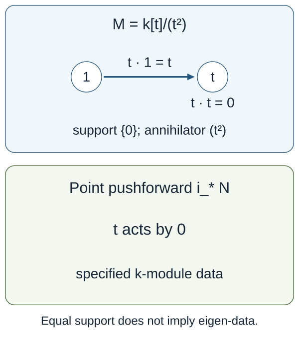

# The categorical conjecture and its variants

**Draft. Self-checked by the writing AI.** The formal localization, support, normalization, base-change and reconstruction theorems below have explicit hypotheses. The global geometric statements needed to apply them to a connected reductive group are stated separately in C8 and are not proved here.

The preceding lessons describe the automorphic category, the Hecke action and the spectral nilpotent category. We now ask what structure a correspondence between them must preserve. An equivalence of abstract categories, an equivalence compatible with Hecke operators, and the assertion that one specified normalized functor is an equivalence are different statements. The distinction controls the proof of every variant.

## The specified claim and its compatibilities

Let \(X/k\) be smooth, projective and connected, with \(k\) algebraically closed of characteristic zero. Let \(G\) be connected reductive and \(H=\check G\) its Langlands dual over \(k\). Put
\[
S=\operatorname{LocSys}^{\mathrm{dR}}_H(X),\qquad
\mathcal C_G=D\operatorname{-mod}_{1/2}(\operatorname{Bun}_G),\qquad
\mathcal D_H=\operatorname{IndCoh}_{\mathcal N}(S).
\]
Here \(S\) is the derived de Rham stack, \(\mathcal N\subset\operatorname{Sing}(S)\) is the global nilpotent cone, and the automorphic half-twist uses the conventions in [Sheaves and D-modules on Bun_G](sheaves-and-d-modules-on-bun-g.md). We retain the shifts and the Cartan-inversion convention of the named construction. We do not identify a twisted and an untwisted category without a specified untwisting equivalence.

**The categorical statement.** Arinkin–Gaitsgory, §11.2, formulate an equivalence between \(D\operatorname{-mod}(\operatorname{Bun}_G)\) and \(\operatorname{IndCoh}_{\mathcal N}(S)\), then impose additional compatibility data. The construction paper's Conjecture 1.6.7 asks whether its particular functor
\[
\mathbb L_G:\mathcal C_G\longrightarrow\mathcal D_H
\]
is an equivalence. The older formulation uses an untwisted category, so a comparison with the half-twisted category is necessary. Conjecture 1.6.7 is the label in that paper; the five-paper series proves the geometric Langlands theorem. The construction of the normalized functor and its equivalence will be the subject of the later lessons.

Write \(\mathcal A=\operatorname{QCoh}(S)\). The spectral Hecke action should give \(\mathcal C_G\) an \(\mathcal A\)-module structure, and \(\mathbb L_G\) should be a continuous \(\mathcal A\)-linear functor. In particular, for \(x\in X\) and \(V\in\operatorname{Rep}(H)\), let \(\mathcal E_{V,x}\) be evaluation of the universal local system in \(V\) at \(x\). The comparison has the type
\[
\mathbb L_G\bigl(\mathsf H_{V,x}(c)\bigr)
\simeq \mathcal E_{V,x}\otimes_{\mathcal O_S}\mathbb L_G(c)
\quad\text{in }\mathcal D_H.
\]
Its tensor, fusion, unit and higher compatibility data are part of the statement. Separate objectwise isomorphisms do not specify this module-functor structure. Applying this statement requires the geometric Ran localization, derived Satake and Hecke descent theorems.

The Whittaker condition fixes a *coefficient functor*. With the actual vacuum Poincaré object \(P_{\mathrm{Vac}}\in\mathcal C_G\), the coarse functor has a natural comparison
\[
\Gamma\bigl(S,\mathbb L_{G,\mathrm{coarse}}(c)\bigr)
\simeq\operatorname{coeff}^{\mathrm{Vac,glob}}(c)
\simeq\operatorname{Map}_{\mathcal C_G}(P_{\mathrm{Vac}},c).
\]
The normalization includes the exponential character, cohomological shifts and half-twist of that coefficient. The theorem in C5 proves why this natural identity and rigidity determine the coarse functor. The full lift also needs its boundedness and coarsening comparison. Merely requiring the image of one distinguished object to be the structure object is insufficient, as the explicit counterexample shows.

For a parabolic \(P\subset G\) with Levi \(M\), write
\[
S_H\xleftarrow{p_{\mathrm{spec}}}S_{\check P}
\xrightarrow{q_{\mathrm{spec}}}S_{\check M}.
\]
The automorphic Eisenstein functor uses the corresponding correspondence
\(\operatorname{Bun}_M\leftarrow\operatorname{Bun}_P\to\operatorname{Bun}_G\).
Its spectral partner uses the appropriate IndCoh pushforward/pullback functors on the displayed spectral correspondence. Those functors, their support bounds, and their shifts and determinant-line normalizations must be constructed before asserting
\[
\mathbb L_G\circ\operatorname{Eis}^{\mathrm{aut}}_P
\simeq
\operatorname{Eis}^{\mathrm{spec}}_{\check P}\circ\mathbb L_M.
\]
Arinkin–Gaitsgory §13 allows a Levi tensor-line normalization in this comparison. Determining that line and proving the normalized Eisenstein comparison are additional mathematical steps. The derived Satake comparison in §12 likewise requires its specified compatibility data.

## C0. Scope, conventions and exact foundations

Let \(k\) be an algebraically closed field of characteristic zero, \(X/k\) a smooth projective connected curve of any genus, and \(G\) a connected reductive group with Langlands dual \(\check G\). The intended geometric application has
\[
S=\operatorname{LocSys}^{\mathrm{dR}}_{\check G}(X),\qquad
\mathcal A=\operatorname{QCoh}(S),\qquad
\mathcal C=D\!\operatorname{-mod}_{1/2}(\operatorname{Bun}_G),\qquad
\mathcal D=\operatorname{IndCoh}_{\operatorname{Nilp}}(S).
\]
The half twist, the derived stack and the global nilpotent category are geometric constructions. Their existence and the structures specified below are hypotheses for the formal arguments in this lesson.

All categories below are presentable stable \(k\)-linear infinity categories, or their equivalent DG presentation. Functors described as continuous preserve all small colimits. Mapping objects are complexes, not only degree-zero Hom groups. Tensor products and limits of spaces are derived. A linear functor includes the equivalences relating the actions and **all** their unit, multiplication and higher compatibility data. A comparison included in a uniqueness claim is fixed as part of that claim.

The categorical hypotheses **F-CAT** are: stable functor categories and exactness of continuous functors; presentable tensor products representing separately continuous functors; relative tensor products representing balanced separately continuous functors; free module and augmented bar constructions with colimits computed on underlying objects; the presentable adjoint functor theorem; enriched Yoneda; and the Ind universal property for compactly generated stable categories. These foundational statements are assumed here. The proofs below establish descent, bar identifications, adjunctions, support transport, representability and lift deductions under these hypotheses.

For an ordinary ring \(R\), \(\operatorname{Mod}_R\) means its unbounded derived module category. The shift convention is cohomological: \(k[1]\) occupies degree \(-1\). A point is a specified morphism \(\sigma:\operatorname{Spec}\kappa\to S\); a coarse isomorphism class is less data. At a stack point the automorphisms and the possible choice of a framing must still be retained.

## C1. A monoidal localization and the entire space of descents

Let \(\mathcal H,\mathcal A\) be presentable stable monoidal categories, with tensor products separately continuous, and let
\[
L:\mathcal H\longrightarrow\mathcal A
\]
be a continuous exact strong monoidal localization. Precisely, its right adjoint is fully faithful and, with \(\mathcal K=\ker L\), for every presentable stable \(\mathcal E\), restriction induces
\[
\operatorname{Fun}^{L}(\mathcal A,\mathcal E)
\ \simeq\
\{F\in\operatorname{Fun}^{L}(\mathcal H,\mathcal E):F|_{\mathcal K}=0\}.
\tag{1}
\]
Thus \(L\) is the indicated stable quotient, not just an essentially surjective monoidal functor. The kernel is a tensor ideal: \(L(h\otimes q)=Lh\otimes Lq=0\) when \(q\in\mathcal K\).

Suppose \(\mathcal C\) has a continuous \(\mathcal H\)-action \(\alpha\). A descent consists of an \(\mathcal A\)-action \(\beta\), together with a specified equivalence of \(\mathcal H\)-actions
\[
\epsilon:L^*\beta\simeq\alpha.
\tag{2}
\]
This includes all coherences of the equivalence.

**Theorem C1.** The infinity groupoid of these pairs \((\beta,\epsilon)\) is empty unless
\[
q\star c=0\quad(q\in\mathcal K,\ c\in\mathcal C).
\tag{3}
\]
If (3) holds, that groupoid is contractible.

**Proof.** Package \(\alpha\) as a continuous strong monoidal functor
\(\mathcal H\to\operatorname{End}^{L}(\mathcal C)\), whose product is composition. Condition (3) says precisely that its underlying functor kills \(\mathcal K\): a functor which is zero on every object is the zero object in the stable functor category. By (1), the space of factorizations of the underlying functor, equipped with its specified comparison, is contractible.

We must show that a lift of the underlying functor carries the entire monoidal structure, with no missing coherence choices. Repeated use of (1), one variable at a time, gives for each \(r\geq1\) a fully faithful restriction
\[
\operatorname{Fun}^{L,\ldots,L}(\mathcal A^r,\mathcal E)
\longrightarrow
\operatorname{Fun}^{L,\ldots,L}(\mathcal H^r,\mathcal E).
\tag{4}
\]
Its essential image consists of the functors which kill \(\mathcal K\) separately in each variable. In particular, restriction gives equivalences on the **spaces** of natural transformations between any two lifted functors, and on all their higher homotopies.

Apply (4) with \(\mathcal E=\operatorname{End}^{L}(\mathcal C)\). The multiplication comparison between \(\beta(a\otimes b)\) and \(\beta(a)\circ\beta(b)\) lifts the comparison for \(\alpha\) uniquely up to a contractible space. It is an equivalence: every \(a\) is \(L(i a)\) for the fully faithful right adjoint \(i\), so equivalences are detected after restriction. The unit comparison lifts using \(L(\mathbf1_{\mathcal H})\simeq\mathbf1_{\mathcal A}\).

The associativity homotopy lifts by (4) for \(r=3\). Every subsequent compatibility lifts in its corresponding mapping space; no truncation at a pentagon is being made. More formally, the space of coherent monoidal structures is the limit of the spaces of its operation maps and their compatibility homotopies indexed by the associative operad. At each arity, (4) identifies the relevant mapping spaces. Taking that limit preserves these equivalences. The homotopy fibre over the already specified structure of \(\alpha\) is consequently contractible. The same argument for the coloured module operad gives the action and its comparison on \(\mathcal C\).

Conversely, if (2) exists and \(q\in\mathcal K\), then \(q\star c\simeq Lq\star c=0\). This proves necessity and sufficiency, including the stated space of choices. \(\square\)

The comparison in (2) matters. Without it, one has forgotten the trivialization of a lift; a space of equivalent structures may have automorphisms. “Unique isomorphism class” is also weaker than this theorem.

**Module-functor consequence.** If two actions have descended, restriction from continuous \(\mathcal A\)-linear functors between them to continuous \(\mathcal H\)-linear functors is fully faithful, and every \(\mathcal H\)-linear functor has a unique compatible \(\mathcal A\)-linear structure. Indeed, for a fixed continuous functor \(F\), its comparison \(F(a\star c)\simeq a\star F(c)\) is a natural transformation between two separately continuous functors. Restriction in the \(a\)-variable is fully faithful by (1); its higher module coherences lift exactly as in the preceding proof. This also proves the assertion for natural transformations between linear functors.

**Affine calculation.** Take \(R=k[t]\), \(R'=R[t^{-1}]\), and
\(L=R'\otimes_R-:\operatorname{Mod}_R\to\operatorname{Mod}_{R'}\). The right adjoint is restriction of scalars and is fully faithful because \(R'\otimes_RR'\simeq R'\). Its kernel consists of modules whose localization is zero. An \(R\)-linear category descends to \(R'\) precisely when multiplication by \(t\) is an equivalence on every object. To see sufficiency directly, an \(R\)-module acting on it can be localized by the telescope of repeated multiplication by \(t\); its action agrees with that telescope because the latter maps are equivalences. A localized-zero module therefore acts by zero. Necessity follows since \(t\) is invertible in \(R'\). The coherent inverse of an equivalence has a contractible space of choices. On \(\operatorname{Mod}_{R'}\) the condition holds. On the nonzero category \(\operatorname{Mod}_{R/(t)}\) it fails: the zero endomorphism \(t:k\to k\) cannot be invertible.

The Ran category in Gaitsgory’s 2010 note is initially nonunital. To apply C1, one must construct a unital completion together with compatible localization and Hecke action, or prove nonunital descent together with a unit comparison. Kernel vanishing alone does not construct a unit. For \(\mathcal H=\operatorname{Rep}(\check G)_{\operatorname{Ran}}\) and \(L=\operatorname{Loc}_{\mathrm{spec}}\), C1 therefore requires both the geometric localization theorem **F-LOC** and the kernel-vanishing theorem **F-VAN**, including this unit comparison.

## C2. Base change of an equivalence retains its linear structure

Let \(F:\mathcal C\simeq\mathcal D\) be a continuous \(\mathcal A\)-linear equivalence. Its inverse has a uniquely transported \(\mathcal A\)-linear structure: apply \(F^{-1}\) to the comparison for \(F\), using its unit and counit. These structure maps and their coherences satisfy the axioms because their images under the fully faithful equivalence \(F\) do.

Let \(\mathcal N\) be any presentable right \(\mathcal A\)-module category. No monoidal structure on \(\mathcal N\) is necessary. Relative tensoring gives
\[
F_{\mathcal N}=\operatorname{id}_{\mathcal N}\otimes_{\mathcal A}F:
\mathcal N\otimes_{\mathcal A}\mathcal C
\ \simeq\
\mathcal N\otimes_{\mathcal A}\mathcal D.
\tag{5}
\]
Its inverse is \(\operatorname{id}_{\mathcal N}\otimes_{\mathcal A}F^{-1}\). The composites are identities because the unit and counit, and their triangle homotopies, can be tensor transported. Equivalently, their coherent balanced functors agree on \((n,c)\) and \((n,d)\); the defining universal property of relative tensor products identifies the resulting functors and transformations. This proves (5) on categories, mapping complexes and all higher data.

For \(\mathcal A=\operatorname{QCoh}(S)\) and any specified map \(f:Y\to S\), put
\[
\mathcal C_Y=\operatorname{QCoh}(Y)\otimes_{\mathcal A}\mathcal C.
\tag{6}
\]
Then \(F_Y:\mathcal C_Y\simeq\mathcal D_Y\). A geometric identification of (6) with a particular D-module or IndCoh category is an additional base-change theorem, not part of (5).

## C3. Scheme structures, point fibres and eigen-objects

There are three distinct notions which should not be collapsed:

1. support at a point as a *set*;
2. an object with a coherent action factoring through that point's residue algebra;
3. an object of the base-changed category, including its fibre structure.

Here is a complete affine comparison. Let \(R\to B\) be a map of commutative derived \(k\)-algebras, \(\mathcal C\) an \(R\)-linear presentable category, and write
\[
\mathcal C_B=\operatorname{Mod}_B\otimes_{\operatorname{Mod}_R}\mathcal C.
\]
Let \(\operatorname{Mod}_B(\mathcal C)\) be the category of \(B\)-module objects in \(\mathcal C\), with the given underlying \(R\)-action.

**Proposition C3.1.** There are natural equivalences
\[
\mathcal C_B\simeq\operatorname{Mod}_B(\mathcal C)
\simeq\operatorname{Fun}^{L}_{\operatorname{Mod}_R}(\operatorname{Mod}_B,\mathcal C).
\tag{7}
\]
For the second equivalence the \(B\)-action on the value at the free module \(B\) comes from right multiplication on \(B\); commutativity identifies \(B^{\mathrm{op}}\) with \(B\).

**Proof.** The balanced continuous functor
\((M,c)\mapsto M\otimes_R c\), with \(B\) acting on \(M\), defines
\(\Phi:\mathcal C_B\to\operatorname{Mod}_B(\mathcal C)\).
For a \(B\)-module object \(N\), its augmented free bar resolution has terms
\[
B^{\otimes_R(q+1)}\otimes_R U(N),\qquad q\geq0.
\tag{8}
\]
The face maps multiply adjacent \(B\)'s, except for the last face which uses the action on \(N\); degeneracies insert the unit. On underlying \(R\)-objects an extra degeneracy inserting a leading unit contracts the augmented simplicial object. Therefore its realization is \(N\): forgetting is conservative and computes these colimits.

Send a free object \(B\otimes_R c\) to the tensor object \(B\boxtimes c\) in \(\mathcal C_B\), and use the same faces and degeneracies in (8) to define a functor \(\Psi\) by realization. The contracted resolution proves \(\Phi\Psi\simeq\operatorname{id}\). On a generator \(M\boxtimes c\), \(\Psi\Phi\) is the bar resolution of \(M\) tensored with \(c\); its realization is \(M\boxtimes c\). Both functors preserve colimits, and the universal balanced tensor construction extends this equivalence to every object. Its bar maps supply the natural transformations and coherences, proving the first equivalence.

For the second, a continuous \(R\)-linear functor \(H\) is determined by \(N=H(B)\) with the \(B^{\mathrm{op}}\)-action induced by \(\operatorname{End}_B(B)\). Conversely, such an \(N\) defines
\[
H_N(M)=M\otimes_B N
=\left|\,M\otimes_R B^{\otimes_R q}\otimes_R N\,\right|.
\tag{9}
\]
Every \(B\)-module \(M\) has its free bar resolution, so continuity and \(R\)-linearity give \(H(M)\simeq H_N(M)\), naturally in \(M\). Also \(B\otimes_BN\simeq N\). Applying the same bar resolution to transformations proves full faithfulness on mapping spaces, including higher homotopies. Thus evaluation and (9) are inverse functors, with the full coherent actions retained. \(\square\)

Under (7) the forgetful functor
\[
U_B:\mathcal C_B\longrightarrow\mathcal C
\tag{10}
\]
forgets the \(B\)-module structure. It is conservative, and has the free left adjoint \(c\mapsto B\otimes_Rc\); its cofree right adjoint is \(\underline{\operatorname{Hom}}_R(B,c)\), where available through the presentable internal-Hom construction. Linearity of \(F\) gives the commutative square
\[
\begin{array}{ccc}
\mathcal C_B&\xrightarrow{F_B}&\mathcal D_B\\
U_B\downarrow&&\downarrow U_B\\
\mathcal C&\xrightarrow{F}&\mathcal D.
\end{array}
\tag{11}
\]
Consequently, the entire category of specified \(B\)-structures, and also the essential image of forgetting, are transported by \(F\). The essential image is not generally a full subcategory with the correct fibre mapping complexes.

For an affine map \(j:Y\to S\) with a supplied comparison
\(\operatorname{QCoh}(Y)\simeq\operatorname{Mod}_{j_*\mathcal O_Y}(\operatorname{QCoh}(S))\), the identical bar proof with that commutative algebra object proves (7)–(11). This hypothesis is the exact geometric comparison used for an affine stack probe. It is not asserted for every map of prestacks without proof.

**Scheme-theoretic annihilators.** Over an ordinary affine base, define
\[
\operatorname{Ann}_R(c)=
\ker\!\left(R\longrightarrow H^0\operatorname{End}_{\mathcal C}(c)\right).
\tag{12}
\]
The linear equivalence identifies the mapping complexes and the scalar map, so
\(\operatorname{Ann}_R(Fc)=\operatorname{Ann}_R(c)\), not merely their radicals. Thus the closed subscheme defined by this ideal is preserved. This is an annihilator scheme; a specified lift to \(R/I\)-module objects is stronger because it contains the nullhomotopies and their relations. A list of scalar maps which are zero in the homotopy category does not itself specify such coherent data.

Set-theoretic support is also preserved: for every open localization of the base, the corresponding base-change functor in (5) commutes with \(F\), so its vanishing locus is unchanged. For a large category there need not be a least closed subscheme serving as an object's support; (11) and (12) are the precise statements and require no such assertion.

**Eigenvalue data.** Fix a monoidal character
\(\chi_\sigma:\mathcal A\to\operatorname{Mod}_\kappa\) given by pullback at \(\sigma\). Define the strong eigen-category by
\[
\operatorname{Eig}_\sigma(\mathcal C)=
\operatorname{Fun}^{L}_{\mathcal A}(\operatorname{Mod}_\kappa,\mathcal C).
\tag{13}
\]
An object \(H\) in this category is equivalently \(E=H(\kappa)\), a coherent \(\kappa\)-action, and coherent equivalences
\[
a\star E\simeq\chi_\sigma(a)\otimes_\kappa E
\tag{14}
\]
for all \(a\). Indeed \(H(V)=V\otimes_\kappa E\), since a continuous \(\kappa\)-linear functor out of \(\operatorname{Mod}_\kappa\) is determined by its value on its free generator; (14) is precisely its linearity data. The reverse construction uses this formula with the specified module coherences.

If Hecke actions descend as in C1, the module-functor consequence identifies Hecke eigen-data for the composed character \(\chi_\sigma L\) with (13). This step requires the entire factorization/fusion data, not just separate isomorphisms for individual representations at individual points.

Postcomposition with \(F\) gives
\[
\operatorname{Eig}_\sigma(\mathcal C)\simeq
\operatorname{Eig}_\sigma(\mathcal D).
\tag{15}
\]
The proof uses postcomposition with \(F^{-1}\) and the coherent unit/counit; it is valid without a fibre-comparison theorem. When \(\sigma\) is an affine probe with the algebra-object comparison just specified, (7) identifies (13) with
\[
\mathcal C_\sigma=\operatorname{Mod}_\kappa\otimes_{\mathcal A}\mathcal C.
\tag{16}
\]
Thus (15) is exactly the eigenvalue base-change equivalence \(F_\sigma\). In the equivalent more general formulation, it suffices to have a specified self-duality of the \(\mathcal A\)-module \(\operatorname{Mod}_\kappa\) and its evaluation comparison. Such a comparison is an actual premise.

This proves the precise correction of “eigen-objects are supported at \(\sigma\)”: a *strong eigen-object with its eigen-data* corresponds to an object of the categorical fibre and, after the forgetful/pushforward comparison, to an object carrying that coherent point structure. It does not say that every object with set support \(\{\sigma\}\) has eigen-data.

Nor does \(\mathcal A\)-linearity alone supply a new identification of the Arinkin–Gaitsgory cone action. If “support” means singular support in \(\operatorname{Sing}(S)\), one must also specify and intertwine the relevant graded cohomological-operator/Hochschild action. The same proof then preserves localization and annihilators for that action. Ordinary support over \(S\) and conical singular support over \(\operatorname{Sing}(S)\) are different claims.

## C4. The affine point example, with the correct adjunctions

Take \(R=k[t]\), \(B=k=R/(t)\), and \(\mathcal C=\operatorname{Mod}_R\). Then (7) gives \(\mathcal C_0\simeq\operatorname{Mod}_k\). The point map \(i:\operatorname{Spec}k\to\operatorname{Spec}R\) has
\[
i^*=k\otimes_R^{\mathbf L}-\ \dashv\
i_*=\operatorname{Res}_{R\to k}\ \dashv\
i^!=\operatorname{RHom}_R(k,-).
\tag{17}
\]
The first functor is pullback, the middle is pushforward/restriction of scalars, and the last is exceptional pullback, with these variances. The tensor-Hom adjunction proves both displayed adjunctions directly; replacing \(i^!\) by \(i^*\) would change the answer.

Resolve \(k\) by the two-term complex \(R\xrightarrow{t}R\) in degrees \(-1,0\). Injectivity of multiplication by \(t\) and its cokernel \(k\) make it a resolution. Tensoring with \(k\) kills its differential, whereas applying \(\operatorname{Hom}_R(-,k)\) gives degrees \(0,1\) and again zero differential. Hence
\[
i^*i_*k\simeq k\oplus k[1],\qquad
i^!i_*k\simeq k\oplus k[-1].
\tag{18}
\]
In particular \(i_*\) is not fully faithful on derived mapping complexes: \(\operatorname{Ext}^1_R(k,k)=k\), while \(\operatorname{Ext}^1_k(k,k)=0\).

Let \(M=R/(t^2)\). Localizing at any point with \(t\neq0\) kills \(M\), so its set support is \(\{0\}\). Its annihilator is \((t^2)\), and \(t\) acts nontrivially on \(H^0(M)\). Thus \(M\) cannot be \(i_*N\) for any \(N\in\operatorname{Mod}_k\): \(t\) acts by zero on every such underlying object. It cannot carry (14) for the character \(t\mapsto0\). Its ordinary derived fibre is nevertheless
\[
k\otimes_R^{\mathbf L}M\simeq k\oplus k[1],
\]
because tensoring the analogous free resolution \(R\xrightarrow{t^2}R\) with \(k\) gives zero differential. Taking a fibre of an object is not the same as endowing that object with a point-fibre structure.

*Figure C4.* A basis of \(M\) is \(1,t\). Multiplication by \(t\) sends \(1\) to \(t\) and \(t\) to zero. On every point-fibre object, multiplication by \(t\) is already zero. This two-dimensional calculation exhibits the obstruction to coherent point eigen-data.

An equivalence linear over \(R\) preserves the full ideal \((t^2)\), its scalar endomorphism and the coherent fibre categories. It cannot silently turn this thickened-support object into a strong point eigen-object.

## C5. The correct coefficient normalization and rigid Yoneda

First, the weak normalization “\(F(P)\simeq Q\)” does **not** in general determine a linear equivalence.

**Counterexample C5.1.** Let \(\mathcal A=\operatorname{Mod}_R\) for any nonzero ordinary \(k\)-algebra \(R\), and
\[
\mathcal C=\mathcal D=\operatorname{Mod}_R\oplus\operatorname{Mod}_R,\qquad
P=Q=(R,0).
\]
The action is diagonal. Both
\[
F_1(M,N)=(M,N),\qquad F_2(M,N)=(M,N[1])
\tag{19}
\]
are continuous \(\mathcal A\)-linear equivalences, and both have the same specified identity \(F_i(P)=Q\). They are not equivalent as functors: on \((0,R)\) their values have nonzero cohomology in different degrees. If \(\Xi:\mathcal A\to\mathcal D\) is inclusion of the first summand and \(\Psi:\mathcal D\to\mathcal A\) is projection, then \(Q=\Xi(\mathbf1)\) and even \(\Psi F_1=\Psi F_2\). Thus a normalization involving only that vacuum/unit image, even together with a fixed coarse projection, cannot determine a full refinement. This is a counterexample to a formal inference, not a counterexample to geometric Langlands.

The actual coarse normalization uses an equality of **coefficient functors**. Here is the sufficient theorem, including existence.

Assume \(\mathcal A\) is symmetric monoidal and compactly generated, its compact objects are dualizable, and its unit is compact. Let \(\mathcal C\) be an \(\mathcal A\)-module category and \(P\in\mathcal C\) compact. Define
\[
\alpha:\mathcal A\longrightarrow\mathcal C,\quad a\longmapsto a\star P,\qquad
W(c)=\operatorname{Map}_{\mathcal C}(P,c).
\]
The coefficient \(W\) is a \(k\)-complex. Let
\(\Gamma(a)=\operatorname{Map}_{\mathcal A}(\mathbf1,a)\).

**Theorem C5.2.** The right adjoint \(F=\alpha^R:\mathcal C\to\mathcal A\) is continuous, carries a canonical \(\mathcal A\)-linear structure, and has a canonical equivalence
\[
\Gamma F\simeq W.
\tag{20}
\]
The space of continuous linear functors \(F'\), with a specified natural normalization \(\Gamma F'\simeq W\), is contractible. This statement does not assert that \(F\) is an equivalence.

**Proof of existence and continuity.** The presentable adjoint theorem supplies \(F\), since \(\alpha\) is continuous. If \(v\in\mathcal A^c\) and \(\{c_i\}\) is a filtered diagram, dualizability gives
\[
\operatorname{Map}_{\mathcal C}(v\star P,\operatorname*{colim}c_i)
\simeq
\operatorname{Map}_{\mathcal C}(P,v^\vee\star\operatorname*{colim}c_i)
\simeq
\operatorname*{colim}\operatorname{Map}_{\mathcal C}(v\star P,c_i).
\]
Thus \(\alpha\) preserves compact objects. The same adjunction, tested against every compact \(v\), implies that \(F\) preserves filtered colimits. It is exact as a right adjoint between stable categories. Exactness plus preservation of filtered colimits implies preservation of arbitrary coproducts: a coproduct is the filtered colimit of finite coproducts. Every small colimit in a stable category can be computed using coproducts and the realization of its simplicial replacement; realizations are sequential colimits of skeleta formed using finite cofibres and coproducts. Hence \(F\) preserves all colimits.

**Proof of linearity.** For dualizable \(v\), the projection-formula transformation \(v\otimes F(c)\to F(v\star c)\) is the mate of
\[
\alpha(v\otimes F(c))\simeq v\star\alpha(F(c))
\longrightarrow v\star c.
\]
For every \(a\in\mathcal A\), adjunction and duality identify its map on mapping complexes with
\[
\begin{aligned}
\operatorname{Map}_{\mathcal A}(a,v\otimes F(c))
&\simeq\operatorname{Map}_{\mathcal A}(v^\vee\otimes a,F(c))\\
&\simeq\operatorname{Map}_{\mathcal C}((v^\vee\otimes a)\star P,c)\\
&\simeq\operatorname{Map}_{\mathcal C}(a\star P,v\star c)\\
&\simeq\operatorname{Map}_{\mathcal A}(a,F(v\star c)).
\end{aligned}
\]
It is consequently an equivalence by Yoneda. For arbitrary \(v\), express \(v\) as a colimit of compact objects and use continuity of both sides. The mates of unit and multiplication satisfy the action coherences: after applying the adjunction mapping equivalences they are the already specified action coherences of \(\alpha\). Yoneda identifies these entire mapping spaces, so the argument lifts every higher homotopy, not only equalities in a homotopy category.

Taking \(a=\mathbf1\) in the adjunction proves (20).

**Proof of uniqueness.** Suppose \(F'\) is linear and \(\eta:\Gamma F'\simeq W\) is the specified natural equivalence. For every dualizable compact \(v\),
\[
\begin{aligned}
\operatorname{Map}_{\mathcal A}(v,F'(c))
&\simeq\Gamma(v^\vee\otimes F'(c))\\
&\simeq\Gamma F'(v^\vee\star c)\\
&\overset{\eta}{\simeq}W(v^\vee\star c)\\
&\simeq\operatorname{Map}_{\mathcal C}(v\star P,c).
\end{aligned}
\tag{21}
\]
All equivalences are natural in \(v,c\). They extend to every \(v\in\mathcal A\), since writing \(v\) as a colimit turns both sides into the corresponding limit of mapping complexes. The Ind universal property makes the extension and its coherences unique. Thus (21) is exactly the full mapping identity for \(\alpha\dashv F'\). Enriched Yoneda says its representing object is unique with a contractible space of choices, naturally in \(c\); taking the functor-valued Yoneda mapping spaces establishes the same contractibility for \(F'\), \(\eta\) and the linear coherences. This also identifies \(F'\) with \(\alpha^R\) respecting (20). \(\square\)

The condition is natural in **all** \(c\), and (21) uses the dual twists \(v^\vee\star c\). An equality only at \(c=P\), or only of the dimensions of coefficients, cannot replace it. Conversely one may take the identities (21), coherent in the tests \(v\), as the coefficient representability data directly; this formulation works whenever those tests generate and the displayed representability is known.

In the affine example of C5.1, \(\alpha(a)=(a,0)\), \(F(M,N)=M\), and \(W(M,N)\) is the underlying complex of \(M\). Formula (21) is precisely ordinary tensor-Hom adjunction. This coarse functor satisfies (20) but kills every \((0,N)\); normalization proves its construction and uniqueness, not an equivalence.

For the geometric application \(P\) is the vacuum Poincaré object and \(W\) is the first global Whittaker coefficient. The theorem identifies the coarse functor from those specified structures. Compactness of \(P\), rigidity/compact generation of \(\operatorname{QCoh}(S)\), the action and the actual coefficient identity remain **F-WHIT/F-RIG** until their geometric proofs are supplied. Specifying only that a vacuum is sent to a structure sheaf is a weaker assertion.

**The bounded lift needed for the full functor.** Let \(\mathcal C=\operatorname{Ind}(\mathcal C^c)\), let \(\Psi:\mathcal D\to\mathcal A\) be exact and continuous, and let \(\mathcal D_+\subset\mathcal D\), \(\mathcal A_+\subset\mathcal A\) be full stable subcategories on which
\[
\Psi_+:\mathcal D_+\simeq\mathcal A_+
\tag{22}
\]
is an equivalence. If a continuous \(F_0:\mathcal C\to\mathcal A\) sends \(\mathcal C^c\) into \(\mathcal A_+\), then there is a contractibly unique continuous lift \(F:\mathcal C\to\mathcal D\), equipped with \(\Psi F\simeq F_0\), whose values on compacts lie in \(\mathcal D_+\).

Indeed restrict \(F_0\) to compacts, apply the inverse in (22), and extend that exact functor using the Ind universal property. Continuity of \(\Psi\) identifies the composite with \(F_0\). Full faithfulness of (22) makes its entire compact restriction, transformations and higher coherences unique; restriction of continuous functors out of an Ind category is fully faithful, so uniqueness extends to the whole functor. No preservation of compactness by the lifted functor was assumed.

If in addition \(F_0\) has a specified \(\mathcal A\)-linear structure, the comparison \(\Psi F\simeq F_0\) is required to respect it, and \(\mathcal A\) has dualizable compact generators, their action preserves the relevant \(\mathcal C^c,\mathcal A_+,\mathcal D_+\), and \(\Psi\) is linear, the same fully faithful lifting of comparisons on pairs \((v,c)\in\mathcal A^c\times\mathcal C^c\) equips \(F\) with its unique linear structure; continuity extends it to all pairs, including all higher coherence data. This is the precise formal step for the eventually coconnective lift. The actual boundedness estimate and (22) are **F-LIFT**, not consequences of the coefficient normalization.

## C6. Full equivalence implies restricted equivalence with typed premises

Write
\[
\mathcal N=\operatorname{QCoh}(S)_{\mathrm{restr}}.
\]
Here \(\mathcal N\) denotes the supplied right \(\operatorname{QCoh}(S)\)-module category of objects set-theoretically supported on the restricted-variation subprestack. It is not silently replaced by modules over the residue algebra of one point, and need not be given a unit or an ordinary quotient-algebra interpretation.

The exact geometric premises are coherent equivalences
\[
\begin{aligned}
\theta_{\mathcal C}:\mathcal N\otimes_{\operatorname{QCoh}(S)}\mathcal C
&\simeq D\!\operatorname{-mod}_{1/2,\operatorname{Nilp}}(\operatorname{Bun}_G),\\
\theta_{\mathcal D}:\mathcal N\otimes_{\operatorname{QCoh}(S)}\mathcal D
&\simeq\operatorname{IndCoh}_{\operatorname{Nilp}}(S^{\mathrm{restr}}),
\end{aligned}
\tag{23}
\]
together with identification of the named restricted Langlands functor with
\[
F^{\mathrm{restr}}=
\theta_{\mathcal D}(\operatorname{id}_{\mathcal N}\otimes F)\theta_{\mathcal C}^{-1}.
\tag{24}
\]
If full \(F\) is a linear equivalence, C2 proves (24) is an equivalence. Its inverse is
\(\theta_{\mathcal C}(\operatorname{id}_{\mathcal N}\otimes F^{-1})\theta_{\mathcal D}^{-1}\).
This is the complete formal proof of full \(\Rightarrow\) restricted. The denominator in both (23) is the **full** acting category \(\operatorname{QCoh}(S)\). Neither (23) nor the existence of its restricted geometry is proved by manipulating tensor notation; these are **F-RESTR**.

The converse does not follow from tensoring alone. For a worked obstruction, set \(R=k[t]\), \(K=k(t)\),
\(\mathcal C=\operatorname{Mod}_R\oplus\operatorname{Mod}_K\), \(\mathcal D=\operatorname{Mod}_R\), and let \(F\) be projection. It is \(R\)-linear but not an equivalence. At every \(k\)-valued closed point \(t=\lambda\),
\[
\operatorname{Mod}_{k_\lambda}\otimes_{\operatorname{Mod}_R}
\operatorname{Mod}_K
\simeq\operatorname{Mod}_{k_\lambda\otimes_R^{\mathbf L}K}=0.
\]
The tensor algebra is zero because \(t-\lambda\) is invertible in the flat localization \(K\). All those base-changed functors \(F_\lambda\) are equivalences. At the generic geometric point, after passing to an algebraic closure of \(K\), the second summand survives. This shows why all required field extensions, rather than only the \(k\)-valued closed points, matter in a geometric detection theorem.

The converse in the construction paper passes through tempered categories. It requires a continuous linear adjoint, geometric fibres detecting the unit and counit after all relevant field extensions, comparisons of restricted and full fibres, fully faithful tempered projection on compact objects, and equality of the coherent images. These are the hypotheses **F-CONV**. CAT10-DET, CAT10-COMP and CAT10-TEMP below prove the formal detection and reconstruction implications; the geometric theorems that verify their hypotheses are additional inputs.

## How generalized vanishing supplies the action

Gaitsgory’s [A generalized vanishing conjecture](https://people.mpim-bonn.mpg.de/gaitsgde/GL/GenVan.pdf), dated 18 October 2010, proposes a kernel-vanishing argument using critical localization, enhanced Eisenstein functors and generation. We first prove the categorical implication and then state the geometric inputs needed for that argument.

Its spectral localization is \(\operatorname{Loc}_{\mathrm{spec}}:\mathcal H_G\to\mathcal A\). The claim needed for the action is
\[
h\in\ker(\operatorname{Loc}_{\mathrm{spec}})
\quad\Longrightarrow\quad
h\star c=0\quad(c\in\mathcal C_G).
\]
Once the specified localization and this vanishing are proved, C1 gives existence and the contractible space of coherent descents to an \(\mathcal A\)-action.

Here is the entire formal generation reduction used by the note. It does not assume that critical-localization images alone generate the non-quasi-compact bundle category.

**Proposition CAT10-GENV.** Let \(\mathcal H_G\) act on a stable presentable category \(\mathcal C_G\), continuously and exactly in each variable. Suppose given a continuous localization \(L:\mathcal H_G\to\mathcal A\), functors
\[
\operatorname{Loc}_{\mathrm{crit}}:\mathcal K_G\to\mathcal C_G,\qquad
\operatorname{Eis}_P:\mathcal C_M\to\mathcal C_G
\]
for the proper parabolics of \(G\), and the following data.

1. Every \(h\in\ker L\) acts by zero on the image of \(\operatorname{Loc}_{\mathrm{crit}}\).
2. It acts by zero on the image of every \(\operatorname{Eis}_P\).
3. Those images together generate \(\mathcal C_G\) under cofibres and colimits.

Then every \(h\in\ker L\) acts by zero on \(\mathcal C_G\).

**Proof.** For fixed \(h\), the full class
\[
\mathcal Z_h=\{c\in\mathcal C_G:h\star c=0\}
\]
is closed under equivalences, shifts, cofibres and all colimits, by the action hypotheses. The first two premises put all the specified generating images in \(\mathcal Z_h\). The third says that their localizing closure is \(\mathcal C_G\), so \(\mathcal Z_h=\mathcal C_G\). Repeat for each \(h\in\ker L\). This proves the exact vanishing needed by C1. \(\square\)

In the geometric strategy, premise 1 comes from a *global* critical-localization Hecke comparison. For an enhanced localization category over the monodromy-free global oper space and its forgetful map \(\pi\) to \(S\), the required comparison is
\[
h\star\operatorname{Loc}^{\mathrm{glob}}_{\mathrm{crit}}(m)
\simeq
\operatorname{Loc}^{\mathrm{glob}}_{\mathrm{crit}}
\bigl(\pi^*L(h)\otimes m\bigr).
\]
If \(L(h)=0\), pullback, tensoring and the enhanced functor send the zero object to zero. The comparison and the factorization from the original critical category prove premise 1. They are the exact deep inputs; simply calling \(m\) an oper module does not prove them.

Premise 2 similarly requires an enhanced Eisenstein category
\[
\operatorname{QCoh}(S_{\check P})
\otimes_{\operatorname{QCoh}(S_{\check M})}\mathcal C_M
\]
and a comparison of the Hecke action with tensoring by \(p_{\mathrm{spec}}^*L(h)\). The usual Eisenstein functor must factor through that enhancement. The comparison then gives zero on its image. Semisimple-rank induction still needs the actual Levi action and all these compatibilities; the rank-zero case is the torus case, not an empty proof.

The note's Proposition 2.10 proposes premise 3 via cuspidal support, finite-type open restrictions, critical localization and a chiral differential-operator diagonal kernel. Its Lemmas 2.12 and 2.16 are substantive geometric assertions. The outline later replaces a single finite-type open for all cuspidals by an open quasi-compact on each connected component. This distinction cannot be erased for groups with infinitely many bundle components. Proper parabolics are essential: allowing \(P=G\) would include the identity Eisenstein functor and trivialize the generation assertion without supplying its vanishing.

The 2010 note initially calls its Ran monoidal category nonunital, then uses a unit in §1.7. The unital comparison required by C1 must therefore be constructed explicitly. GLC II’s Remark on the spectral action identifies a gap in the earlier critical Hecke eigen-property argument. The critical Hecke theorem, enhanced Eisenstein theorem and general vanishing theorem remain necessary geometric inputs.

## CAT10-AFF: residue fields detect objects on a Noetherian affine base

Let \(R\) be an ordinary commutative Noetherian ring of finite Krull dimension. Write \(D(R)\) for the unbounded derived category of \(R\)-modules, with cohomological grading, and
\[
\kappa(\mathfrak p)=\operatorname{Frac}(R/\mathfrak p)
\qquad(\mathfrak p\in\operatorname{Spec}R).
\]
For the zero ring the derived category is zero and the assertions below are immediate. A localizing subcategory means a full subcategory closed under equivalences, shifts, cofibres, and all small colimits.

**Proposition CAT10-AFF.** The smallest localizing subcategory of \(D(R)\) containing all \(\kappa(\mathfrak p)\) is \(D(R)\). Consequently, if a presentable stable category \(\mathcal C\) carries a unital action
\[
D(R)\times\mathcal C\longrightarrow\mathcal C,\qquad (M,c)\longmapsto M\otimes_R c,
\]
exact and colimit-preserving in each variable, then
\[
\bigl(\kappa(\mathfrak p)\otimes_R c=0\text{ for every }\mathfrak p\bigr)
\quad\Longrightarrow\quad c=0.
\]

**Proof.** First we establish the algebra used in the generation argument. Every nonzero finitely generated \(R\)-module \(M\) contains a submodule isomorphic to \(R/\mathfrak q\) for a prime \(\mathfrak q\). Choose a maximal ideal among the annihilators of nonzero elements of \(M\); the ascending chain condition guarantees such a maximal member. If \(I=\operatorname{Ann}(m)\), \(ab\in I\), and \(b\notin I\), then \(bm\ne0\) and
\[
I\subseteq\operatorname{Ann}(bm).
\]
Maximality gives equality, so \(a\in I\). Thus \(I\) is prime, and the map \(R/I\to M\), \(r\mapsto rm\), is injective. Apply this construction successively to \(M/M_j\), starting with \(M_0=0\). The resulting strictly ascending chain of submodules stops because \(M\) is Noetherian. We have obtained a finite filtration whose quotients are \(R/\mathfrak q_j\). If an ideal \(J\) annihilates \(M\), it annihilates every quotient, so each \(\mathfrak q_j\) contains \(J\).

Let \(\mathcal L\) be the localizing subcategory generated by the residue fields. We prove \(R/\mathfrak p\in\mathcal L\) by induction on \(d=\dim(R/\mathfrak p)\). For \(d=0\), the domain \(A=R/\mathfrak p\) is a field: a nonzero proper maximal ideal would give a prime chain of length one. Hence \(A=\kappa(\mathfrak p)\).

For \(d>0\), put \(K=\operatorname{Frac}(A)\). In the exact sequence
\[
0\longrightarrow A\longrightarrow K\longrightarrow K/A\longrightarrow0,
\]
\(K\) is already in \(\mathcal L\). Each finitely generated \(R\)-submodule \(N\) of \(K/A\) is annihilated by \(\mathfrak p\) and by a lift \(b\in R\) of a nonzero element of \(A\): take a common denominator of a finite set of representatives in \(K\). Every prime \(\mathfrak q_j\) in a prime filtration of \(N\) therefore strictly contains \(\mathfrak p\). Prepending \(\mathfrak p\) to a chain above \(\mathfrak q_j\) gives
\[
\dim(R/\mathfrak q_j)<\dim(R/\mathfrak p).
\]
The induction hypothesis puts every filtration quotient, and then \(N\), in \(\mathcal L\).

The finitely generated submodules form a filtered system with union \(K/A\). Filtered colimits of modules are exact: any finite relation, or an element becoming zero in the colimit, is witnessed at a common later index. The same observation applied degreewise to complexes shows that filtered colimits preserve quasi-isomorphisms and compute their derived colimits. Thus \(K/A\in\mathcal L\), and the exact sequence gives \(A\in\mathcal L\). In particular a prime filtration of the finitely generated module \(R\) gives \(R\in\mathcal L\).

For completeness, \(R\) generates all of \(D(R)\) under these operations. Any ordinary module \(M\) has a free resolution in degrees at most zero: take a free surjection, then free surjections onto the successive kernels. Each free module is a coproduct of copies of \(R\). A finite complex of modules already belonging to a localizing subcategory belongs to it by its finite filtration by degree. The free resolution is the filtered union of its subcomplexes obtained by discarding degrees below \(-m\). These are finite complexes, and their derived colimit is the resolution. Hence every module lies in \(\mathcal L\).

For an arbitrary complex \(K^\bullet\), let \(\tau_{\le n}K^\bullet\) have \(K^i\) in degree \(i<n\), \(\ker(d:K^n\to K^{n+1})\) in degree \(n\), and zero above \(n\). It is a subcomplex of \(K^\bullet\). Discarding degrees below \(-m\) from \(\tau_{\le n}K^\bullet\) again gives finite subcomplexes. Their filtered union is \(\tau_{\le n}K^\bullet\); the filtered union over \(n\) is \(K^\bullet\). These colimits are derived colimits by the exactness just proved. Thus \(K^\bullet\in\mathcal L\).

Finally, for fixed \(c\), the full subcategory
\[
\mathcal Z_c=\{M\in D(R):M\otimes_R c=0\}
\]
is localizing by the action hypotheses. If it contains every residue field, it contains \(R\). Unitality gives \(c=R\otimes_R c=0\). This argument applies to unbounded objects; it does not appeal to Nakayama's lemma for a finite module. \(\square\)

**Geometric-field extension.** For an extension of fields \(L/\kappa\), the unit \(\kappa\to L\) has a \(\kappa\)-linear retraction: extend \(1\) to a vector-space basis and send the other basis elements to zero. Accordingly \(x\) is a retract of \(L\otimes_\kappa x\) in any category with the stated action. If the latter vanishes, then \(x=0\). This proves the passage from residue fields to their algebraic closures whenever the specified fibre functors, after forgetting their field action, compute these tensors.

This last identification is a hypothesis about categorical base change. CAT10-AFF does not establish the construction of sheaves of categories on a derived stack, 1-affineness, or the reduction of a derived stack to this ordinary affine situation.

## CAT10-DET: detecting an equivalence by its unit and counit

Let \(F:\mathcal C\to\mathcal D\) be an exact functor with specified right adjoint \(G:\mathcal D\to\mathcal C\), unit \(\eta:\mathrm{id}_{\mathcal C}\to GF\), and counit \(\epsilon:FG\to\mathrm{id}_{\mathcal D}\). Suppose we have exact functors
\[
p_i:\mathcal C\to\mathcal C_i,\qquad q_i:\mathcal D\to\mathcal D_i
\]
jointly conservative on objects, and adjunctions \(F_i:\mathcal C_i\rightleftarrows\mathcal D_i:G_i\). Require comparison isomorphisms
\[
q_iF\simeq F_i p_i,\qquad p_iG\simeq G_iq_i
\]
which carry the unit and counit to those of \(F_i\dashv G_i\). Arbitrary comparison isomorphisms without this compatibility do not suffice.

**Proposition CAT10-DET.** If every \(F_i\) is an equivalence, then \(F\) is an equivalence.

**Proof.** For \(c\in\mathcal C\), form the cofibres
\[
u_c=\operatorname{cofib}(c\xrightarrow{\eta_c}GFc)\in\mathcal C.
\]
The unit comparison and exactness identify \(p_i(u_c)\) with the cofibres of the units of \(F_i\dashv G_i\). They vanish, since the right adjoint of an equivalence is its inverse: indeed the defining adjunction identifies its mapping functors with those represented by that inverse, and the unit and counit are the resulting isomorphisms. Joint conservativity gives \(u_c=0\), so every \(\eta_c\) is an isomorphism. Applying the same argument to
\[
v_d=\operatorname{cofib}(FGd\xrightarrow{\epsilon_d}d)\in\mathcal D
\]
and the \(q_i\) shows that every \(\epsilon_d\) is an isomorphism. These natural isomorphisms exhibit \(G\) as an inverse to \(F\); the adjunction triangle identities give their required compatibility. \(\square\)

**Why one fibre is insufficient.** For \(R=k[t]\), the nonzero module \(R[t^{-1}]\) has
\[
k\otimes_R^{\mathbf L}R[t^{-1}]=0
\]
at \(t=0\). Localization is flat: tensoring a module inverts \(t\), and preserves an exact sequence because a finite equality of fractions is checked after multiplication by a common power of \(t\). Hence the derived tensor here is the ordinary tensor, which is zero since \(t\) acts both as zero and invertibly. The object is nevertheless nonzero, since \(1\ne0\) in \(R[t^{-1}]\). A chosen fibre cannot replace a jointly conservative family.

For restricted-to-full GLC, one needs equivalences after the field extensions used to test *all* geometric points, comparison of their restricted and full fibres, compatible base-changed adjunctions, and conservativity for the relevant derived-stack module categories. CAT10-AFF supplies an elementary ordinary-affine detection argument. The unrestricted derived-stack detection theorem remains a distinct input.

## CAT10-COMP: reconstructing an equivalence from compact objects

A compact object \(c\) is one for which \(\operatorname{Map}(c,-)\) commutes with filtered colimits. A compactly generated presentable stable category is generated under colimits and cofibres by a set of compact objects. Such a generating set detects zero objects: if all mapping spectra from its shifts to \(x\) vanish, the full class of objects \(a\) with \(\operatorname{Map}(a,x)=0\) is closed under colimits and cofibres and contains the generators, so it contains \(x\). Then the identity of \(x\) is zero and \(x=0\).

**Proposition CAT10-COMP.** Suppose \(\mathcal C,\mathcal D\) are compactly generated presentable stable categories, \(F:\mathcal C\to\mathcal D\) is exact and colimit-preserving, and \(F\) has a specified right adjoint \(G\). Assume:

1. \(F\) sends compact objects to compact objects;
2. \(F|_{\mathcal C^c}\) is fully faithful, on mapping spectra;
3. \(F(\mathcal C^c)\) generates \(\mathcal D\).

Then \(F\) is an equivalence.

**Proof.** The right adjoint is exact: it preserves limits, and in a stable category finite limits and finite colimits agree. For any family \(d_j\), test the comparison
\[
\bigoplus_jGd_j\longrightarrow G\bigl(\bigoplus_jd_j\bigr)
\]
against a compact \(c\). Mapping from \(c\) commutes with coproducts because a coproduct is the filtered colimit of its finite sub-coproducts. Adjunction and compactness of \(Fc\) identify the two resulting mapping spectra, with precisely this comparison map. Compact generators detect its cofibres, so it is an isomorphism.

An exact functor preserving coproducts preserves all colimits in a stable presentable category. Here is the construction being used. A sequential colimit is the cofibres of \(1-\mathrm{shift}\) on a coproduct of the sequence. A geometric realization is the sequential colimit of its skeletal filtration; each attachment uses finite latching diagrams, finite simplex/boundary tensors, and finite cofibres. This also proves preservation of tensoring with a space: choose a simplicial-set presentation of the space and realize its levelwise coproducts of the object. Finally use the homotopy-coherent simplicial replacement of a small infinity-category diagram. Its terms are space-indexed coproducts involving the mapping spaces and higher simplices of composable morphisms. Mapping its realization into any object gives the limit of the coherent-cone mapping diagram, so its realization has the required colimit universal property. The existence of this replacement and that mapping identity are part of the stated stable-infinity-category foundation; a bare set of arrows is insufficient. Exactness, space-tensor preservation and coproduct preservation respect every step. Thus \(G\), and consequently \(GF\), preserve colimits.

For compact \(c,c'\), the map induced by the unit is, by adjunction,
\[
\operatorname{Map}_{\mathcal C}(c',c)\longrightarrow
\operatorname{Map}_{\mathcal D}(Fc',Fc).
\]
It is an equivalence by hypothesis 2. Compact generators detect the cofibres of \(\eta_c\), so \(\eta_c\) is an isomorphism for every compact \(c\). The class of objects on which \(\eta\) is an isomorphism is localizing, since both \(\mathrm{id}_{\mathcal C}\) and \(GF\) preserve colimits and are exact. It contains \(\mathcal C^c\), so \(\eta\) is an isomorphism everywhere.

The triangle identity gives \(\epsilon_{Fc}\circ F(\eta_c)=\mathrm{id}_{Fc}\). Since \(F(\eta_c)\) is an isomorphism, \(\epsilon_{Fc}\) is its inverse. The class of \(d\) for which \(\epsilon_d\) is an isomorphism is likewise localizing. It contains \(F(\mathcal C^c)\), which generates \(\mathcal D\). Thus the counit is an isomorphism everywhere, proving the assertion. \(\square\)

The existence of the specified right adjoint is part of the proposition's hypotheses. This proof does not supply a separate adjoint-functor theorem.

## CAT10-TEMP: the exact compact hypotheses in the tempered comparison

Let \(\mathcal C,\mathcal D\) be as above and suppose given exact functors
\[
q:\mathcal C\to\mathcal T,\quad
\psi:\mathcal D\to\mathcal A,\quad
\phi:\mathcal T\xrightarrow{\sim}\mathcal A,\quad
F:\mathcal C\to\mathcal D
\]
and a specified natural isomorphism \(\psi F\simeq\phi q\). Suppose \(F\) is continuous, has a right adjoint, and preserves compact objects; \(q\) is fully faithful on \(\mathcal C^c\); and \(\psi\) is fully faithful on \(\mathcal D^c\). Require the equality of essential images
\[
\psi F(\mathcal C^c)=\psi(\mathcal D^c)\quad\text{in }\mathcal A.
\]

**Corollary CAT10-TEMP.** Under these hypotheses \(F\) is an equivalence.

**Proof.** For compact \(c,c'\), compute successively
\[
\begin{aligned}
\operatorname{Map}_{\mathcal D}(Fc,Fc')
&\simeq \operatorname{Map}_{\mathcal A}(\psi Fc,\psi Fc')\\
&\simeq \operatorname{Map}_{\mathcal A}(\phi qc,\phi qc')\\
&\simeq \operatorname{Map}_{\mathcal T}(qc,qc')
\simeq \operatorname{Map}_{\mathcal C}(c,c').
\end{aligned}
\]
The natural comparison square identifies this equivalence with the map induced by \(F\). For compact \(d\in\mathcal D^c\), the image condition supplies \(c\in\mathcal C^c\) and an isomorphism \(\psi Fc\simeq\psi d\). Full faithfulness of \(\psi\) on compact objects lifts both that isomorphism and its inverse. Their composites lift the identities, so \(Fc\simeq d\). Thus \(F(\mathcal C^c)\) contains all compact objects up to equivalence and generates \(\mathcal D\). CAT10-COMP applies. \(\square\)

In the de Rham application the types are
\[
\begin{gathered}
\mathcal C=D\operatorname{-mod}_{1/2}(\operatorname{Bun}_G),\quad
\mathcal D=\operatorname{IndCoh}_{\mathcal N}(\operatorname{LocSys}_H),\\
\mathcal T=\mathcal C_{\mathrm{temp}},\quad
\mathcal A=\operatorname{QCoh}(\operatorname{LocSys}_H),\quad
q=u^R,\quad \psi=\Psi_{\mathcal N,\{0\}},\\
u:\mathcal C_{\mathrm{temp}}\hookrightarrow\mathcal C,\qquad u\dashv u^R,\qquad
\phi=\mathbb L_{G,\mathrm{temp}},\quad F=\mathbb L_G.
\end{gathered}
\]
There is no premise that \(u^R\) preserves compact objects. The proposition does require compact preservation by \(\mathbb L_G\). One can deduce this condition from the following additional bounded comparison: the images \(\mathbb L_G(c)\) of compact \(c\) and all compact \(d\) lie in a full subcategory on which \(\Psi\) is fully faithful, and the coarse-image theorem supplies a compact \(d\) with \(\Psi\mathbb L_G(c)\simeq\Psi d\). Full faithfulness lifts this isomorphism and its inverse, giving \(\mathbb L_G(c)\simeq d\). Full faithfulness of \(u^R\) on source compacts, this bounded-lift comparison and the exact image theorem for the coarse Langlands functor are the required premises. Their proofs use the tempered comparisons for \(G\) and its Levi subgroups, normalized Eisenstein compatibility, and the appropriate compact-generation theorem.

## The four settings and their tempered forms

For de Rham GLC let \(X/k\) be smooth, projective and connected, \(k\) algebraically closed of characteristic zero, \(G\) connected reductive, and \(H\) its Langlands dual. Retain the half-twist and normalizations from the preceding lessons. For Betti GLC take a complex curve and a characteristic-zero coefficient field \(e\), with \(H\) over \(e\). The comparison with de Rham made below uses \(k=e=\mathbb C\); returning to other fields is a further comparison theorem.

| Setting | Automorphic category | Spectral category |
|---|---|---|
| Full de Rham | \(D\operatorname{-mod}_{1/2}(\operatorname{Bun}_G)\) | \(\operatorname{IndCoh}_{\mathcal N}(\operatorname{LocSys}_H)\) |
| Restricted de Rham | \(D\operatorname{-mod}_{1/2,\mathcal N}(\operatorname{Bun}_G)\) | \(\operatorname{IndCoh}_{\mathcal N}(\operatorname{LocSys}^{\mathrm{restr}}_H)\) |
| Full Betti | \(\operatorname{Shv}^{B}_{1/2,\mathcal N}(\operatorname{Bun}_G)\), all allowed sheaves with nilpotent singular support | \(\operatorname{IndCoh}_{\mathcal N}(\operatorname{LocSys}^{B}_H)\) |
| Restricted Betti | \(\operatorname{Shv}^{B,\mathrm{constr}}_{1/2,\mathcal N}(\operatorname{Bun}_G)\), the ind-constructible category | \(\operatorname{IndCoh}_{\mathcal N}(\operatorname{LocSys}^{B,\mathrm{restr}}_H)\) |

Each row concerns its *specified* Langlands functor. Its tempered form replaces the automorphic category by its tempered subcategory and the spectral category by the corresponding \(\operatorname{QCoh}\) category. The construction, adjunctions and identifications for each row are separate geometric inputs.

Restricted variation retains formal deformations of local systems over the relevant fields. It is not the irreducible open locus. Set \(S=\operatorname{LocSys}_H\), \(\mathcal A=\operatorname{QCoh}(S)\), and let \(\mathcal N_{\mathrm{restr}}=\operatorname{QCoh}(S)_{\mathrm{restr}}\) be the specified right \(\mathcal A\)-module of objects set-theoretically supported on the restricted-variation subprestack. This right module is distinct from the nilpotent cone \(\mathcal N\) and from the output category \(\operatorname{IndCoh}_{\mathcal N}(S^{\mathrm{restr}})\). The restriction comparisons identify the restricted categories with
\[
\mathcal N_{\mathrm{restr}}\otimes_{\mathcal A}\mathcal C,\qquad
\mathcal N_{\mathrm{restr}}\otimes_{\mathcal A}\mathcal D,
\]
and the restricted functor with the base change of the full functor. These are comparison assertions, not automatic ordinary flat base change. Given them, an equivalence remains an equivalence after tensoring: tensor its inverse and both inverse-comparison natural isomorphisms. This is the full-to-restricted direction.

For the converse, the family of geometric fibres, field extensions, and adjunction comparisons specified in CAT10-DET must be available. The passage back to the full categories follows from that proposition once their joint conservativity has been proved. AGKRRV's argument invokes derived-stack hypotheses and 1-affineness; the elementary CAT10-AFF case cannot replace that global theorem.

The full-to-tempered direction also requires a precise identification of the subcategories and a commuting square of specified functors. Given those identifications, an equivalence restricts to an equivalence when it carries each selected subcategory onto its counterpart. For the reverse implication, CAT10-TEMP proves the formal step after the compact and Eisenstein inputs are supplied. The same statements apply to the restricted or Betti settings with their own proved comparisons.

Over \(\mathbb C\), the restricted de Rham-to-Betti comparison additionally requires: Riemann–Hilbert for the actual regular-singular automorphic category; the theorem identifying the relevant nilpotent-support de Rham objects with that category; the comparison of the restricted spectral prestacks; and compatibility with the specified Langlands functors. Transporting an inverse through a commuting square of vertical equivalences then proves the logical equivalence. An analytic Riemann–Hilbert identification alone does not identify the algebraic full spectral \(\operatorname{QCoh}\) categories. Combining the proved comparison arrows gives the familiar chain of variant equivalences only after all these geometric inputs are established.

## Tempered and cuspidal projections

The tempered and restricted argument is developed in [GLC I, §5](https://arxiv.org/abs/2405.03599v3). The all-field-extension unit/counit strategy appears in [AGKRRV, §21.4](https://arxiv.org/abs/2010.01906v2). CAT10-AFF through CAT10-TEMP give the formal detection and reconstruction proofs above; applying them to the derived local-system stack requires its geometric detection theorem.

If \(u:\mathcal C_{\mathrm{temp}}\to\mathcal C\) is the tempered inclusion with right adjoint \(u^R\), then \(u u^R(c)\) is the tempered projection \(c_{\mathrm{temp}}\), rather than an arbitrary object \(c\). If \(e:\mathcal C_{\mathrm{cusp}}\to\mathcal C\) has left adjoint \(e^L\), the cuspidal projection is typed \(e^L:\mathcal C\to\mathcal C_{\mathrm{cusp}}\). The reconstruction argument uses these typed adjunctions.

To apply the formal theorems, one must establish the spectral action and its vanishing theorem, derived-stack fibre detection and base change, existence and bounds of the Langlands lift, compact generation and the compact-image theorem, normalized Eisenstein comparisons for every Levi subgroup, and the regular-singular Riemann–Hilbert comparisons over their stated fields. These geometric theorems are not proved in the formal arguments above.

## Irreducible eigenvalues, normalization and multiplicity

Fix a point \(\sigma:\operatorname{Spec}\kappa\to S\) and retain its automorphisms. A local system's isomorphism class, its residual gerbe, and a specified point/framing give different spectral probes. The strong eigen-category is defined in C3 using the entire coherent character \(\sigma^*\) and the Ran/fusion data. A linear equivalence transports that category, not merely a support set.

Suppose the actual fibre comparison and zero-singular-support theorem identify the *specified point* fibre with \(\operatorname{Mod}_\kappa\). This identification is a geometric input, not a consequence of the word “irreducible.” Then there is an object \(E_\sigma\) corresponding to \(\kappa\), and every object of the strong eigen-category is
\[
V\otimes_\kappa E_\sigma,\qquad V\in\operatorname{Mod}_\kappa.
\]
Indeed the fibre equivalence is \(\kappa\)-linear and continuous; every complex of vector spaces is built from its free one-dimensional generators by the same resolution/colimit construction used in CAT10-AFF. Thus it identifies the tensor functor with the identity on \(\operatorname{Mod}_\kappa\).

This computes the formal meaning of the eigenvalue example. \(E_\sigma\), \(E_\sigma\oplus E_\sigma\), and \(E_\sigma[1]\) correspond to \(\kappa\), \(\kappa^2\), and \(\kappa[1]\), whose cohomology differs. The unqualified assertion that there is only one eigen-object is false even in this computed fibre. The endomorphism algebra of its degree-zero simple generator is \(\kappa\), so its automorphisms are \(\kappa^\times\). For the residual gerbe \(B\operatorname{Aut}(\sigma)\), automorphism actions must additionally be retained; it is not replaced by a point.

If the normalized Whittaker coefficient on this fibre is identified with \(V\) under the displayed parametrization, an object with a *specified* coefficient trivialization \(V\simeq\kappa\) is uniquely equivalent to the generator with that trivialization. The space of such normalized choices is contractible: transporting the specified trivialization identifies each choice with the same object, and an automorphism respecting it is the identity on \(\kappa\); the full mapping comparison gives the corresponding higher uniqueness. This is the precise formal multiplicity-one deduction. Establishing that actual coefficient comparison, a perverse representative, and the intended geometric fibre requires additional proofs.

The canonical object in the source has a specific normalization, rather than the degree-zero generator used in the elementary example:
\[
\mathbb L_{G,\sigma}(\widetilde{\mathcal F}_\sigma)
=k[-\dim(\operatorname{Bun}_G)+\dim(\operatorname{Bun}_{N,\rho(\omega_X)})].
\]
Its underlying D-module \(\mathcal F_\sigma\) is obtained by forgetting the coherent eigen-data. Conditional on GLC and irreducibility, the source states that \(\mathcal F_\sigma\) is regular holonomic, has nilpotent singular support, and lies in the D-module heart. That perversity statement has no extra genus or connected-center hypothesis. With \(S_\sigma=\operatorname{Aut}(\sigma)\), the source also states the semisimple decomposition
\[
\mathcal F_\sigma\simeq
\bigoplus_{\rho\in\operatorname{Irrep}(S_\sigma)}
\mathcal F_{\sigma,\rho}^{\oplus\dim\rho},
\]
with pairwise distinct simple constituents. This illustrates why forgetting the eigen-data is a separate operation. The further characteristic-cycle equality
\(\operatorname{CC}(\mathcal F_\sigma)=[\mathcal N]\) assumes genus at least two and connected center in that source. The shift, decomposition, perversity and characteristic-cycle statements are geometric assertions not proved by the formal fibre calculation above.

## Arithmetic trace is another statement

Now change the setting explicitly: redeclare \(X/\mathbb F_q\) as a smooth projective connected curve and \(G/\mathbb F_q\) as a connected reductive group. Use the applicable constructible coefficient theory, for example \(e=\overline{\mathbb Q}_\ell\) with \(\ell\ne\operatorname{char}\mathbb F_q\). Put \(\mathcal B=\operatorname{Bun}_G(X)\) over \(\mathbb F_q\) and \(\overline{\mathcal B}=\mathcal B\times_{\mathbb F_q}\overline{\mathbb F}_q\). Write \(\mathcal S_{\mathcal N}=\operatorname{Shv}_{\mathcal N}(\overline{\mathcal B})\), with the specified geometric Frobenius endomorphism and coefficient conventions. The trace conjecture in AGKRRV concerns an isomorphism
\[
\operatorname{Tr}\bigl((\operatorname{Frob}_{\overline{\mathcal B}})_*,
\mathcal S_{\mathcal N}\bigr)
\simeq\operatorname{Funct}_c\bigl(\mathcal B(\mathbb F_q)\bigr),
\]
compatible with its specified local-term map on the accessible subcategory. The right side is compactly supported functions with the conventions of [From automorphic functions to automorphic sheaves](from-automorphic-functions-to-automorphic-sheaves.md). Establishing this trace conjecture requires an arithmetic theorem in the finite-field setting.

The word trace already requires duality data. For a dualizable category \(\mathcal S\), its coevaluation has target \(\mathcal S\otimes\mathcal S^\vee\); the evaluation uses the opposite order, with the symmetry inserted as needed. Applying the endofunctor to the first factor gives a complex of coefficients. These categorical duality, Frobenius, base-change and local-term constructions require their own foundations.

As an elementary check of the definition, for an \(n\)-dimensional vector space \(V\) with basis \(v_i\) and dual \(v_i^*\), coevaluation sends \(1\) to \(\sum_i v_i\otimes v_i^*\). Applying an endomorphism \(A\) and evaluation gives
\[
\sum_i v_i^*(Av_i)=\sum_i A_{ii}.
\]
The tensor \(\sum_i v_i\otimes v_i^*\) corresponds to \(\mathrm{id}_V\) under \(V\otimes V^*\to\operatorname{End}(V)\), which is an isomorphism by expansion in this basis. It is therefore basis-independent. This checks the ordinary trace mechanism. It neither proves the categorical trace conjecture nor makes a characteristic-zero spectral theorem into a finite-field local-term theorem.

## C7. Five exercises and their formal solutions

The geometric compatibilities in these exercises are conditional on the hypotheses stated in their solutions. Each solution identifies the formal implication and the geometric theorem needed to apply it.

**Exercise 1 (easy). Check the compatibilities for \(G=T\).**

**Solution 10.1.** Let \(T\) be a torus and \(\Lambda=X^*(\check T)\). Assume the actual torus Fourier equivalence with the selected conventions
\[
F_T:D\!\operatorname{-mod}(\operatorname{Bun}_T)\simeq
\operatorname{QCoh}(\operatorname{LocSys}_{\check T})
\tag{25}
\]
and its linear spectral action have been supplied. For the conventions of the construction paper, \(F_T\) is the enhanced Fourier transform **composed with Cartan inversion** on \(T\); this sign cannot be omitted when identifying a particular Fourier kernel with the named functor.

For each \(\lambda\in\Lambda\) and \(x\in X\), the universal \(\check T\)-local system supplies an invertible line \(E_{\lambda,x}\) on \(S\). Its tensor maps
\(E_{\lambda,x}\otimes E_{\mu,x}\simeq E_{\lambda+\mu,x}\), unit \(E_{0,x}\simeq\mathcal O_S\), and their associativity and symmetry maps are part of that universal tensor functor. Given the Hecke identification \(H_{\lambda,x}=E_{\lambda,x}\star-\), linearity of (25) gives
\[
F_T(H_{\lambda,x}M)\simeq E_{\lambda,x}\otimes F_T(M).
\]
The comparison for \(\lambda+\mu\) equals the composite for \(\lambda,\mu\) because it is the multiplication coherence of the same module functor; the unit, symmetry and factorization comparisons follow from their corresponding specified coherences. This verifies the complete formal Hecke/Satake compatibility.

If \(P_T=F_T^{-1}(\mathcal O_S)\), then \(F_T(P_T)\simeq\mathcal O_S\) and for every \(M\)
\[
\operatorname{Map}(P_T,M)\simeq
\operatorname{Map}(\mathcal O_S,F_T M)=\Gamma(S,F_T M).
\]
Thus the full coefficient normalization holds, not only a comparison of one object. Its identification with the actual torus vacuum and Whittaker coefficient is the geometric premise **F-TOR**.

A torus has no proper parabolic subgroup: in the definition a parabolic contains a Borel, and a torus is its own Borel. For the sole parabolic \(T\) the Levi is \(T\) and both maps in either Eisenstein correspondence are identities, so the normalized Eisenstein comparison is the identity. The nilpotent locus in the abelian Lie algebra is the zero locus: all polynomial coordinates are invariant, and their common vanishing forces the zero element. Turning this fact into
\(\operatorname{IndCoh}_{\operatorname{Nilp}}(S)=\operatorname{QCoh}(S)\) still requires the full zero-singular-support theorem **F-ZERO**, including stack descent. Conditional on that theorem, the torus full and tempered categories coincide; C6 verifies the restricted implication.

As a fully computed affine test, take \(R=k[z,z^{-1}]\), \(\mathcal C=\operatorname{Mod}_R\), \(P=R\), and the identity equivalence. Define \(H_n(M)=R e_n\otimes_RM\), with \(e_n\otimes e_m\mapsto e_{n+m}\). All composites and unit comparisons are these explicitly associative products. At a character \(z\mapsto a\in k^\times\), the fibre is \(\operatorname{Mod}_k\), its coherent eigen-actions are those of the chosen character, and \(\Gamma F(M)=\operatorname{RHom}_R(R,M)=M\). This verifies the formal tensor, coefficient and fibre formulas. It is a model; it does not replace (25).

Betti/de Rham comparison additionally needs the actual restricted Riemann–Hilbert and functor comparison theorems, **F-BETTI**. It does not follow from a character lattice calculation.

**Exercise 2 (easy). Show that an equivalence compatible with the spectral action preserves supports over \(S\).**

**Solution 10.2.** For every specified base-change probe use C2. When the probe is a closed affine subscheme, apply C3.1 and (11): objects with a specified scheme structure are transported, as is the essential image of forgetting. For an ordinary affine chart, (12) proves equality of annihilator ideals under the equivalence; open-localization vanishing proves equality of set support. The object \(R/(t^2)\) in C4 proves why equality of radicals does not replace equality of scheme structures or point eigen-data. No fully faithful point pushforward is presumed. If conical singular support is also intended, the equivalence must intertwine its actual cohomological-operator action; apply the identical localization argument to that supplied action. This is the exact additional premise for that stronger reading of the exercise.

**Exercise 3 (medium). Show uniqueness of the factorization of the Hecke action through \(\operatorname{QCoh}(S)\).**

**Solution 10.3.** Apply C1 with the specified \(\operatorname{Loc}_{\mathrm{spec}}\). A descent forces each object of its kernel to act as zero. Conversely actual kernel vanishing allows the underlying action functor to descend by (1). Formula (4) lifts multiplication, unit and every higher homotopy. The homotopy fibre of the coherent structure space over the fixed Hecke action is contractible, including its comparison. This proves uniqueness in the required sense. Geometric spectral localization and vanishing are the exact remaining premises, not conclusions of this exercise.

For the nonunital Ran category, the unital-completion and action comparison stated after C1 is also required.

**Exercise 4 (medium). Explain why Whittaker normalization determines \(L_G\) uniquely given linearity.**

**Solution 10.4.** The conclusion depends on the normalization data. If normalization only says that a vacuum object is sent to a structure sheaf, the formal assertion is false: (19) gives two inequivalent linear equivalences with the same normalized object. Even the coarse projection does not distinguish them.

The actual source characterizes \(L_{G,\mathrm{coarse}}\) by a natural identity of coefficient functors
\(\Gamma L_{G,\mathrm{coarse}}\simeq\operatorname{coeff}^{\mathrm{Vac,glob}}\), together with linearity. With a compact vacuum corepresenting that coefficient, rigidity lets every dualizable test \(v\) recover the entire mapping identity (21). Yoneda determines its representing object and hence the coarse functor, with a contractible space of compatible choices. It is the right adjoint of \(a\mapsto a\star P_{\mathrm{Vac}}\).

The **full** functor additionally uses the eventually coconnective comparison (22) and the theorem that the coarse functor takes compact automorphic objects there. The bounded-lift proof in C5 gives its unique continuous refinement and linear structure under the stated stability premises. Thus the corrected exercise has a full formal proof with these exact extra data. The vacuum construction, rigidity, boundedness and IndCoh/QCoh comparison are **F-WHIT/F-RIG/F-LIFT**; normalization does not prove those inputs or prove that the resulting functor is an equivalence.

**Exercise 5 (hard). Show that full GLC implies restricted GLC, and describe what the construction paper adds for the converse.**

**Solution 10.5.** Use the actual supported-module category \(\mathcal N\), both comparisons (23), and the functor identification (24). Tensor the linear inverse of full \(L_G\); (5) gives the inverse displayed immediately after (24), including unit, counit and higher compatibility. This proves the implication in full under exactly those geometric comparisons.

For the converse the construction paper avoids assuming a left adjoint to the original full functor at that stage by passing through the tempered functor, whose left adjoint is built as \(a\mapsto a\star P_{\mathrm{Vac}}\). It uses the chain
\[
\text{restricted}\ \Longrightarrow\ \text{restricted tempered}\
\Longrightarrow\ \text{full tempered}\ \Longrightarrow\ \text{full}.
\]
The first step uses conservative tempered Whittaker coefficients and a Verdier quotient (or the full Satake comparison). The second requires restricted equivalence after all relevant field extensions and geometric point detection, together with continuous linear adjoints. The final step requires fully faithful tempered projection on compacts and identification of coherent images, with the group and its Levi subgroups; its proofs use miraculous duality, tempered *-extensions/cuspidals and automorphic/spectral Eisenstein generation and compatibility. These are precise additions, not properties of arbitrary relative tensoring.

The generic summand in C6 shows why closed-point fibres alone are insufficient. CAT10-DET proves detection by a jointly conservative family, and CAT10-COMP/CAT10-TEMP prove compact reconstruction. Applying these results requires the geometric hypotheses **F-CONV**.

CAT10-DET proves the exact unit/counit detection step, CAT10-AFF proves ordinary Noetherian affine residue-field generation for unbounded objects, and CAT10-COMP/CAT10-TEMP prove the compact reconstruction step. Their proofs are included above; their hypotheses are precisely the inputs that the geometric converse must establish.

## C8. Geometric inputs not proved here

The source distinctions are mathematically substantive. Arinkin–Gaitsgory's original formulation asks for an equivalence of categories and separately discusses Satake and Eisenstein compatibility. The construction paper asks whether its particular normalized functor is an equivalence. An arbitrary categorical equivalence does not identify it with that functor.

The construction defines the coarse functor through the coefficient identity, then lifts it using boundedness and the IndCoh comparison. Restriction tensors by the supported module category over the full acting QCoh category. The converse uses adjoints, all field extensions, geometric detection and the tempered compact-image and Eisenstein theorems.

The following statements are additional hypotheses for the geometric application:

| Hypothesis | Mathematical statement |
|---|---|
| F-CAT | The categorical platform stated in C0, including higher category, bar, adjoint, Yoneda and Ind foundations. |
| F-LOC | Actual Ran/Hecke construction, strong monoidal spectral localization and its fully faithful right adjoint, in the stated de Rham reductive setting. |
| F-VAN | The kernel of the geometric localization acts by zero on the full half-twisted automorphic category, compatibly with families and fusion. This requires critical localization, enhanced proper Eisenstein functors and generation. |
| F-RIG | Compact generation and rigidity of the actual QCoh category; applicable compactness of its unit and dualizable compact tests. |
| F-WHIT | Actual vacuum Poincaré construction, compactness, coefficient corepresentability, shifts, twists and the sign of its exponential character. |
| F-LIFT | Coarse compact objects are eventually coconnective; the actual coarsening comparison (22), its continuous linear structure and stability under the compact tests. |
| F-FIB | Affine probe or relative-duality comparison identifying strong eigen-data with actual stack fibre/pushforward geometry. Retain point automorphisms and framing. |
| F-RESTR | Restricted-variation prestack and both comparisons (23), with the exact supported module category and functor comparison. |
| F-CONV | Continuous linear adjoints, all-field detection, tempered quotient and conservativity, compact projection and coherent-image theorems, miraculous duality and normalized Eisenstein comparisons for \(G\) and every Levi subgroup. |
| F-TOR/F-ZERO | Actual enhanced torus Fourier equivalence with Cartan inversion and vacuum normalization; full zero-support IndCoh/QCoh comparison. |
| F-BETTI | Correct Betti categories, restricted regular-singular Riemann–Hilbert and comparison of the chosen functors; full/restricted/tempered comparison premises. |
| F-CONSEQ | Identification of the actual irreducible spectral fibre, normalization killing residual scalar automorphisms, arithmetic trace/Frobenius and coefficient-theory prerequisites. |

Conditional on \(\mathcal D_\sigma\simeq\operatorname{Mod}_\kappa\), C3 identifies the strong eigencategory with that category. Every complex \(V\) then gives an object \(V\otimes E\), and a simple generator has automorphism group \(\kappa^\times\). A specified coefficient trivialization can fix this scalar ambiguity. The geometric fibre identification, multiplicity theorem and arithmetic trace conjecture are not proved here.

## References

The following freely accessible works develop the geometric statements discussed in the lesson.

- D. Arinkin and D. Gaitsgory, [Singular support of coherent sheaves, and the geometric Langlands conjecture, arXiv:1201.6343v4](https://arxiv.org/abs/1201.6343v4), §§11.2–13.
- D. Gaitsgory and S. Raskin, [Proof of the geometric Langlands conjecture I: construction of the functor, arXiv:2405.03599v3](https://arxiv.org/abs/2405.03599v3), introduction, §§1.4–1.7, 4.2 and 5.
- D. Gaitsgory, [Outline of the proof of the geometric Langlands conjecture for GL(2), arXiv:1302.2506v3](https://arxiv.org/abs/1302.2506v3), §§4.3–4.5 and 11.1.
- D. Gaitsgory, [A generalized vanishing conjecture, free author note](https://people.mpim-bonn.mpg.de/gaitsgde/GL/GenVan.pdf), §§1–2.
- D. Arinkin, D. Gaitsgory, D. Kazhdan, S. Raskin, N. Rozenblyum and Y. Varshavsky, [The stack of local systems with restricted variation and geometric Langlands theory with nilpotent singular support, arXiv:2010.01906v2](https://arxiv.org/abs/2010.01906v2), §§21.2–21.4 and the trace-conjecture section.
- D. Ben-Zvi and D. Nadler, [Betti geometric Langlands, arXiv:1606.08523v1](https://arxiv.org/abs/1606.08523v1), introduction.
- D. Ben-Zvi, [What is the geometric Langlands correspondence about?, arXiv:2605.23167v1](https://arxiv.org/abs/2605.23167v1), §§2.5 and 4.4.
- D. Gaitsgory, [Local and global Langlands conjecture(s) over function fields, arXiv:2509.24902v1](https://arxiv.org/abs/2509.24902v1), §§2 and 5.
- D. Arinkin, D. Beraldo, J. Campbell, L. Chen, J. Færgeman, D. Gaitsgory, K. Lin, S. Raskin and N. Rozenblyum, [Proof of the geometric Langlands conjecture II: Kac–Moody localization and the FLE, arXiv:2405.03648v3](https://arxiv.org/abs/2405.03648v3), Remark on the spectral action.

The global spectral localization, vanishing, Satake, half-twist, vacuum and bounded-lift theorems are not proved here. The same applies to the stack fibre and restricted/Betti comparisons, derived-stack detection, compact-image and normalized Eisenstein theorems for all Levi subgroups, torus Fourier equivalence, irreducible multiplicity and perversity, and arithmetic trace. C8 states their mathematical roles; the proved formal implications depend on those hypotheses.
