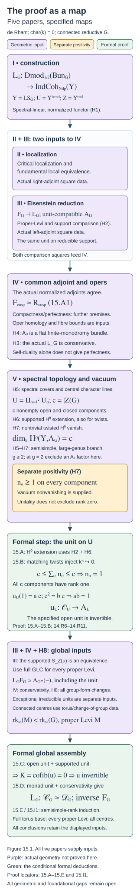

# The proof as a map

Draft. Self-checked by the writing AI.

The proof has two decisive reductions. First, the Langlands functor is an equivalence once its specified algebra unit is invertible. Second, the unit can be checked on the irreducible spectral open and on objects supported on its complement. Eisenstein series control the supported part by induction. Ambidexterity and generic opers turn the open part into a finite-monodromy vector bundle. The multiplicity argument then removes nontrivial character lines and counts every remaining component.

Work over an algebraically closed field \(k\) of characteristic zero, with a smooth projective connected curve \(X/k\) and a connected reductive group \(G\). Write
\[
Y=\operatorname{LS}_{\check G}(X),\qquad U=Y^{\mathrm{irred}},\qquad Z=Y\setminus U,
\]
\[
\mathcal C_G=\operatorname{Dmod}_{1/2}(\operatorname{Bun}_G),\qquad
\mathcal D_G=\operatorname{IndCoh}_{\mathrm{Nilp}}(Y).
\]
The spectral stack is derived and de Rham. The half twist, spectral action, singular-support convention, and normalization of the actual functor are those in [Constructing the Langlands functor (GLC I)](constructing-the-langlands-functor.md). The localization and parabolic comparisons are developed in [Kac-Moody localization and the fundamental local equivalence (GLC II)](kac-moody-localization-and-the-fundamental-local-equivalence.md) and [Eisenstein series and the reduction to the cuspidal part (GLC III)](eisenstein-series-and-the-reduction-to-the-cuspidal-part.md). The finite-monodromy and component-count arguments are proved at their stated hypotheses in [Ambidexterity, opers and multiplicity one (GLC IV and V)](ambidexterity-opers-and-multiplicity-one.md).

This lesson proves the assembly as a theorem about specified categories, functors, an algebra and geometric comparison maps. The constructions and geometric theorems supplying those hypotheses remain mathematical inputs. The conclusion of the assembly is the exact equivalence of the given Langlands functor, with its given adjunction unit. It does not follow from an unrelated equivalence between the two categories.

We use stable, presentable \(k\)-linear DG categories and coherent adjunctions. Exact functors preserve cofiber sequences; an object with zero cofiber is an equivalence. These categorical and derived sheaf frameworks are explicit foundational premises, as in the preceding lessons.

## The theorem and its precise scope

Let \(k\) be algebraically closed of characteristic zero, let \(X/k\) be a smooth projective connected curve, and let \(G/k\) be connected reductive. Write \(H=\check G\) for its Langlands dual and \(S=\operatorname{LS}_H(X)\) for the **derived** stack of de Rham local systems. Fix the square-root convention for the half twist. The main result of Dennis Gaitsgory and Sam Raskin's [*Proof of the geometric Langlands conjecture V: the multiplicity one theorem*, v3](https://arxiv.org/abs/2409.09856v3) is that the functor constructed in Part I is an equivalence
\[
\mathbb L_G:
\operatorname{Dmod}_{1/2}(\operatorname{Bun}_G)
\xrightarrow{\ \sim\ }
\operatorname{IndCoh}_{\operatorname{Nilp}}(S).
\tag{15.C1}
\]
Its statement appears as Conjecture 1.1.3, whose proof is the conclusion of the paper. The introduction and §1 specify the functor and the preceding results used to prove it.

The automorphic category in (15.C1) is the entire category of half-twisted D-modules. The nilpotent condition on the right concerns **coherent singular support** in \(\operatorname{Sing}(S)\). It is not a requirement to discard D-modules with nonnilpotent characteristic varieties on the left. Passing to the restricted correspondence introduces an additional, different nilpotent condition on the automorphic side.

There is no genus restriction in (15.C1), and neither adjoint type nor simply connectedness is an assumption of the final theorem. Those conditions enter particular stages of its proof. The simple adjoint case in genus at least two, excluding genus two and type \(A_1\), admits the simplest dimension argument. Low genus and type \(A_1\) are treated separately. The reductions for general reductive groups include central isogenies and the action of central torsors; one cannot replace these reductions by the assertion that the theorem for adjoint groups automatically gives every group.

The five-paper project is joint work of Dima Arinkin, Dario Beraldo, Justin Campbell, Lin Chen, Joakim Færgeman, Dennis Gaitsgory, Kevin Lin, Sam Raskin, and Nick Rozenblyum. Different papers have different subsets of these authors. In particular, Parts I and V have Gaitsgory and Raskin as their authors.

The theorem is a deep geometric input here. Its deduction from the named categorical and geometric hypotheses is the assembly argument of this lesson; the full proofs of those geometric hypotheses are not reproduced.

## The inputs and the maps they supply

Put \(\mathcal V=\operatorname{QCoh}(Y)\), with its specified action \(a\star d\) on \(\mathcal D_G\). The following hypotheses describe actual maps, rather than just isomorphism classes of objects.

| Hypothesis | Mathematical content | Source and preceding lesson |
| --- | --- | --- |
| H1: the functor and its monad | A continuous functor \(L:\mathcal C_G\to\mathcal D_G\), its left adjoint \(F\), and a coherent identification \(LF\simeq A\star(-)\) for a unital associative \(A\in\mathcal V\). The adjunction unit is induced by the specified \(u:\mathcal O_Y\to A\). | GLC I, §1, and GLC III, §16; the construction and monad sections of the preceding lessons. QCoh-linearity alone does not establish this global algebra comparison. |
| H2: support and Eisenstein comparison | Exact localization \(S_Z(K)\to K\to j_*j^*K\), where \(S_Z\) is the supported-object functor. Under full GLC for every proper Levi, the specified map \(S_Z(u)\) is an equivalence. | GLC III, §§16–17; Proposition 13.B and the proper-Levi reduction. |
| H3: conservativity | \(L\) reflects equivalences. | GLC IV v1, Theorem 1.5.5, using proper-Levi GLC, the Whittaker theorem and cuspidal temperedness. |
| H4: the irreducible bundle | \(A_U=j^*A\) is a classical vector bundle with a flat finite-monodromy connection. | GLC IV v1, Main Theorem 3.1.8 and Proposition 4.2.8; the two adjoint comparisons and oper homology in the preceding lesson. |
| H5: component and character description | For semisimple \(G\) in the stated genus range, \(U\) has \(c=|Z(G)|\) nonempty open and closed components. On each, the finite-monodromy bundle is a finite direct sum of the specified character lines \(\mathcal L_{\mathcal P}\) arising from central torsors. The trivial torsor gives \(\mathcal O\). | GLC V v3, Theorem 4.3.2 and Corollary 4.3.3; Lemmas 14.R1–14.R3 supply the elementary representation deductions. |
| H6: extension for the supported comparison | The groups \(H^0R\Gamma(Y,S_Z(\mathcal O_Y\otimes\mathcal L))\) and \(H^1R\Gamma(Y,S_Z(\mathcal O_Y\otimes\mathcal L))\) vanish for the relevant invertible lines. Supported objects commute with their tensor products, so H2 transfers this vanishing to \(A\otimes\mathcal L\). | GLC V v3, Theorem 5.3.2, Corollary 5.3.3 and Proposition 5.3.5; the ring, section and supported-transfer proofs in Lemmas 14.R6–14.R8. The stack and descent premises are additional inputs. |
| H7: vacuum sections and positivity | \(\dim_kH^0R\Gamma(Y,A)=c\). For every nontrivial central torsor \(\mathcal P\), \(H^0R\Gamma(Y,A\otimes\mathcal L_{\mathcal P}^{-1})=0\). The rank on every component is positive. | GLC V v3, Theorems 5.1.5, 5.1.7, 5.2.3–5.2.8 and their vacuum and gerbe constructions in §§6 and 8. The comparison with vacuum Hom spaces and nonvanishing are part of this premise. |
| H8: the remaining group and genus reductions | Compatible change-of-group and product equivalences, the full torus base case, and the separate irreducible-unit results in the low-genus or type \(A_1\) cases. | GLC V v3, §§2–3, and GLC IV v1, §§1.7 and 4.5. |

H5–H7 apply to the semisimple large-genus argument with \(g\geq2\), excluding a type \(A_1\) factor when \(g=2\). Those are hypotheses of this argument, not exclusions from the final geometric Langlands theorem. H8 supplies the other cases and group forms. A positive-dimensional connected centre is handled through the torus and change-of-group theorems; the finite cardinal \(|Z(G)|\) in H5 is used only in the semisimple calculation.

The role of GLC II in H4 is substantial. Its critical localization and fundamental local equivalence supply the lower square used to identify the right adjoint. The Whittaker square supplies the left-adjoint comparison. In the fixed dualities, the common geometric adjoint is
\[
L_{\mathrm{cusp}}^L\simeq
\tau_G L_{\mathrm{cusp}}^\vee[-2d_N]
\simeq L_{\mathrm{cusp}}^R,
\qquad d_N=\dim\operatorname{Bun}_{N_{\rho(\omega_X)}}.
\tag{15.A1}
\]
The determinant lines and shifts cancel in the precise comparisons of the preceding lesson. Tensor-self-adjunction, together with its affine-local compactness and perfection premises, gives a perfect self-dual tensor object. Its identification with generic-oper homology removes every nonzero cohomological degree. Pseudo-proper presentations give the further finite-monodromy assertion. Thus H4 involves the actual two squares, their normalizations, fibre comparison and monodromy geometry. Bare object self-duality would not provide all these conclusions.

## Assembling the irreducible-unit argument

**Lemma 15.A (extension from the supported unit).** Under H2 and H6, restriction induces isomorphisms
\[
H^0R\Gamma(Y,A\otimes\mathcal L)
\xrightarrow{\sim}
H^0R\Gamma(U,A_U\otimes j^*\mathcal L)
\tag{15.A2}
\]
for each relevant line \(\mathcal L\), including the trivial line.

**Proof.** Apply \(R\Gamma(Y,-)\) to the supplied localization triangle for \(A\otimes\mathcal L\). Its relevant cohomology sequence is
\[
H^0R\Gamma(Y,S_Z(A\otimes\mathcal L))
\longrightarrow H^0R\Gamma(Y,A\otimes\mathcal L)
\longrightarrow H^0R\Gamma(U,A_U\otimes j^*\mathcal L)
\longrightarrow H^1R\Gamma(Y,S_Z(A\otimes\mathcal L)).
\]
The supported tensor comparison and H2 identify the outside groups with those of \(S_Z(\mathcal O_Y\otimes\mathcal L)\). H6 makes them zero. Exactness gives (15.A2). The map used is induced by the specified unit. This is the supported-transfer argument of Lemma 14.R8, with its full hypotheses retained. \(\square\)

**Theorem 15.B (multiplicity one on all components).** Assume H2 and H4–H7. Then the specified algebra unit \(u_U:\mathcal O_U\to A_U\) is an equivalence.

**Proof.** On a component \(U_\alpha\), H5 gives
\[
A_U|_{U_\alpha}\simeq
\bigoplus_{\mathcal P}
\mathcal L_{\mathcal P}^{\oplus n_{\mathcal P,\alpha}}|_{U_\alpha}.
\tag{15.A3}
\]
This is a decomposition of vector bundles. No product decomposition of algebras is asserted.

Fix a nontrivial \(\mathcal P\). After tensoring with \(\mathcal L_{\mathcal P}^{-1}\), its matching summands are trivial line bundles. The inclusions of these summands have retractions. Taking sections therefore retains their injections. Constants on a nonempty component give an injection from \(k\): a nonzero scalar stays nonzero after pullback to a geometric point. Extend these sections by zero on every other open and closed component. Thus
\[
k^{n_{\mathcal P,\alpha}}
\hookrightarrow H^0R\Gamma(U,A_U\otimes\mathcal L_{\mathcal P}^{-1}).
\]
By Lemma 15.A and H7, the space on the right is zero. Hence \(n_{\mathcal P,\alpha}=0\). This works for every nontrivial torsor and every component. We obtain
\[
A_U|_{U_\alpha}\simeq\mathcal O_{U_\alpha}^{\oplus n_\alpha}.
\tag{15.A4}
\]

There are \(c\) components and H7 makes every \(n_\alpha\) positive. Constants on all summands and all components are independent: restriction to a component and projection to a summand recover each coefficient. Consequently
\[
\bigoplus_{\alpha=1}^c k^{n_\alpha}
\hookrightarrow H^0R\Gamma(U,A_U).
\]
Lemma 15.A and H7 give
\[
c\leq\sum_{\alpha=1}^c n_\alpha
\leq\dim_kH^0R\Gamma(U,A_U)
=\dim_kH^0R\Gamma(Y,A)=c.
\tag{15.A5}
\]
Every term is a positive integer, so all terms equal one. The argument did not need a separate theorem that the global functions on each component were already scalars.

Finally work locally on \(U\), with a generator \(e\) of the rank-one bundle. Write \(u_U(1)=ae\) and \(e\cdot e=be\). The two-sided unit law gives \(ab=1\). The scalar \(a\) is invertible, so the actual unit is an isomorphism. These local inverses glue because they invert the same map. This is the rank-one argument of Lemma 14.R11. It proves invertibility of the specified unit, completing the theorem. \(\square\)

Positivity in (15.A5) is a separate premise. A zero algebra object has a formal unit, so unitality does not exclude rank zero. Vacuum nonvanishing or the stated generic-oper existence comparison supplies the needed nonzero rank. Likewise H6 uses the supported comparison for \(A\); Cohen–Macaulayness of \(Y\) alone is not a section-extension theorem for every coherent or derived object.

## From the open unit to the actual equivalence

**Lemma 15.C (the support test).** Under the exact localization premise in H2, if \(j^*u\) and \(S_Z(u)\) are equivalences, then \(u\) is an equivalence.

**Proof.** Set \(K=\operatorname{cofib}(u)\). Exactness gives \(j^*K=0\) and \(S_Z(K)=0\). The supplied localization triangle becomes
\[
0\longrightarrow K\longrightarrow j_*0=0.
\]
It follows that \(K=0\), hence \(u\) is an equivalence. Both tests concern the same map. The supported functor is not an underived closed restriction. This is Proposition 13.B applied with its matching localization hypotheses. \(\square\)

**Theorem 15.D (formal assembly for a fixed group).** Suppose H1–H3 hold and the specified open unit \(u_U\) is an equivalence. Then the actual functor \(L\) is an equivalence, with inverse \(F\). In particular, H1–H7 prove this assertion in their stated semisimple and genus range.

**Proof.** H2 and Lemma 15.C make \(u\) invertible. The coherent monad identification in H1 identifies the adjunction unit, at \(d\in\mathcal D_G\), with
\[
\eta_d:d\simeq\mathcal O_Y\star d
\xrightarrow{u\star\mathrm{id}_d}A\star d\simeq LF(d).
\tag{15.A6}
\]
Functoriality of the action makes every \(\eta_d\) an equivalence. This direction requires no additional faithfulness assumption on the action.

Let \(\varepsilon:FL\to\mathrm{Id}_{\mathcal C_G}\) be the counit. The given adjunction has the triangle homotopy
\[
L(\varepsilon_c)\circ\eta_{Lc}\simeq\mathrm{id}_{Lc}.
\tag{15.A7}
\]
Since \(\eta_{Lc}\) is invertible, \(L(\varepsilon_c)\) is its inverse. H3 now makes \(\varepsilon_c\) an equivalence. Both the unit and counit are equivalences of functors. The other triangle homotopy,
\[
\varepsilon_{Fd}\circ F(\eta_d)\simeq\mathrm{id}_{Fd},
\tag{15.A8}
\]
is their second cancellation identity. Thus the specified adjunction gives mutually inverse coherent equivalences \(F\) and \(L\). This is precisely the adjunction criterion proved in Proposition 13.A; neither a separate monadic reconstruction theorem nor a different candidate equivalence is needed. Under H4–H7, Theorem 15.B supplies its open-unit hypothesis. \(\square\)

**Corollary 15.E (all groups and genera, at the complete inputs).** Suppose the full torus equivalence, the proper-Levi comparisons, H1–H7 in their actual ranges, and every comparison and exceptional-case assertion in H8 are supplied. Then the specified de Rham Langlands functor is an equivalence for every connected reductive \(G\) and every genus.

**Proof.** Induct on semisimple rank, with the full torus theorem at rank zero. At rank \(r\), first treat every almost simple simply-connected automorphic group \(S\) of that rank. Every proper Levi of \(S\) has smaller semisimple rank, so its full equivalence is available. H2 supplies the supported-unit comparison, and H1 and H3 supply the monad and conservativity. In the large-genus case outside the stated type \(A_1\) exception, Theorem 15.B supplies the irreducible unit. In the exceptional cases H8 supplies its separate proof; if the irreducible open is empty, its restriction is automatically an equivalence. Theorem 15.D proves the full equivalence for \(S\).

Now take an arbitrary rank-\(r\) connected reductive \(G\). Its structural central-isogeny reduction uses its connected central torus and the almost simple factors of its simply-connected derived cover. Each factor has rank at most \(r\): lower-rank factors are covered by induction, and rank-\(r\) factors by the preceding paragraph. The full torus theorem and the product comparisons in H8 give the equivalence for the covering product. The actual linear base-change comparisons in H8 transport that equivalence to the specified \(L_G\): tensor its inverse and its unit and counit with the given base-change category. This does not assume that the central isogeny lowers semisimple rank, nor that an arbitrary algebra unit reflects through a nonfaithful action. The rank and base-change computations are proved below. Every reductive group has finite semisimple rank, so this finishes the induction and includes every genus. \(\square\)

The centre machinery cannot be omitted merely because the easiest introductory case has adjoint \(G\). The final group-form reduction uses simply-connected automorphic groups. Their duals are adjoint and may have several spectral components. The character lines, central translations, gerbe compatibility, and the count of every component are exactly what completes that case.

## A computed obstruction to copying the dimension argument

Let \(S=(\mathbb G_m)^2\) and \(A=\mathcal O_S^{\times n}\) as a product algebra, with \(n\geq1\). Its specified unit is the diagonal map
\[
\mathcal O_S\longrightarrow\mathcal O_S^{\times n},\qquad a\longmapsto(a,\ldots,a).
\]
For \(n>1\) it is not surjective: \((1,0,\ldots,0)\) is not diagonal. Yet
\[
H^0(S,A)=k[x^{\pm1},y^{\pm1}]^{\oplus n}
\]
is infinite-dimensional for every positive \(n\). Indeed the Laurent monomials \(x^m\), \(m\in\mathbb Z\), are independent: a finite relation becomes an ordinary polynomial relation after multiplication by a sufficiently large power of \(x\), and its coefficients are zero. An infinite-dimensional section space supplies no finite upper bound \(n\leq c\) of the kind in (15.A5).

Under the topological presentation of a genus-one surface group as \(\mathbb Z^2\), this affine torus is its rank-one Betti representation space: a representation in \(\mathbb G_m\) is specified by two arbitrary invertible elements. Conjugation is trivial. That topological presentation and the interpretation as a spectral stack, including its stabilizer and derived data, are additional premises; the explicit coordinate calculation already demonstrates the obstruction. It does not assert that the displayed product algebra is the actual Betti Langlands algebra. The de Rham-to-Betti implication uses comparison theorems with their own nilpotent and restricted categories, rather than repeating this failed finite-dimension estimate on a Betti character space.

## The dependencies in one diagram

Figure 15.A. Purple boxes name geometric inputs, yellow records the separate positive-rank premise, and green boxes name the implications proved here. The two localization comparisons feed the normalized common adjoint in (15.A1). The open unit, supported unit and conservativity have distinct roles. The component count retains every central component; the full torus and group-form comparisons close the induction.

## Induction includes the centre

Fix a smooth projective connected curve \(X\) over an algebraically closed field \(k\) of characteristic zero. For each connected reductive group \(G\), retain the specified, normalized functor
\[
L_G:\mathcal C_G\longrightarrow\mathcal D_G,
\qquad
\mathcal C_G=\operatorname{Dmod}_{1/2}(\operatorname{Bun}_G),
\qquad
\mathcal D_G=\operatorname{IndCoh}_{\mathrm{Nilp}}
(\operatorname{LS}_{\check G}).
\]
Let \(\mathsf E(G)\) mean that this functor is an equivalence on the entire stated categories. This assertion includes all central sectors.

The reductive-group structure used in the induction is an explicit input. A choice of maximal torus and Borel gives a finite set \(\Delta_G\) of simple roots; standard parabolics correspond to subsets \(J\subseteq\Delta_G\), every parabolic is conjugate to a standard one, and its Levi quotient \(M_J\) has semisimple rank \(|J|\). Semisimple rank equals the rank of the root span, or of the derived group. A connected reductive group of semisimple rank zero is a torus, including the trivial torus. These structural theorems are not proved here.

Under that input, a proper parabolic gives
\[
\operatorname{rk}_{\mathrm{ss}}(M_J)=|J|
<|\Delta_G|=\operatorname{rk}_{\mathrm{ss}}(G).
\tag{15.I1}
\]
This is exactly the decrease established at the structural premises in [Eisenstein series and the reduction to the cuspidal part (GLC III)](eisenstein-series-and-the-reduction-to-the-cuspidal-part.md), “Induction on semisimple rank.” The assertion concerns the Levi quotient itself, with its central torus.

**Proposition 15.I1 (the finite induction).** Suppose:

1. For every torus \(T\), the full specified categorical functor \(L_T\) is an equivalence.
2. For every positive-rank connected reductive \(G\), the geometric assembly inputs give the implication
\[
\bigl(\mathsf E(M)\text{ for every proper Levi quotient }M\bigr)
\ \Longrightarrow\ \mathsf E(G).
\tag{15.I2}
\]

Then \(\mathsf E(G)\) holds for every connected reductive \(G\).

**Proof.** Let \(\mathsf P(r)\) assert \(\mathsf E(G)\) for every such group of semisimple rank at most \(r\). The rank-zero structure input and the full torus equivalence give \(\mathsf P(0)\). Suppose \(\mathsf P(r-1)\) and take a group of rank \(r\). Every proper Levi quotient has rank at most \(r-1\) by (15.I1), so its full equivalence is available. Applying (15.I2) proves \(\mathsf E(G)\). Groups of smaller rank were already covered, giving \(\mathsf P(r)\). Each root set is finite, so ordinary induction reaches every group. \(\square\)

The base case requires a categorical equivalence with its inverse and coherent comparison maps. A transform on selected line bundles, an equivalence of hearts, or a scalar endomorphism calculation does not supply this premise.

Here is the precise categorical content of the rank-step input. Supply \(F_G\dashv L_G\), conservativity of \(L_G\), and a unit-compatible monad description \(L_GF_G\simeq A_G\star-\). Proper-Levi geometric Langlands must supply the comparison of the **specified unit** on sections supported in the reducible locus. The irreducible calculation must supply the restriction of that same unit on the complementary open locus. Under the exact open–closed triangle, Proposition 13.B in [Eisenstein series and the reduction to the cuspidal part (GLC III)](eisenstein-series-and-the-reduction-to-the-cuspidal-part.md), “Detecting a morphism on an open set and its complement,” makes the global algebra unit invertible. The monad unit is then invertible by its specified action comparison. Proposition 13.A, “A conservative right adjoint is controlled by its unit,” finishes the step: the triangle
\[
L_G(\varepsilon_c)\eta_{L_Gc}\simeq\operatorname{id}_{L_Gc}
\]
makes \(L_G(\varepsilon_c)\) invertible, and conservativity makes \(\varepsilon_c\) invertible. The unit and counit exhibit inverse functors. All geometric existence, support and irreducible-unit assertions in this paragraph remain inputs.

### A block computation of the decreasing rank

For \(G=\mathrm{GL}_n\), conjugation by \(\operatorname{diag}(t_1,\ldots,t_n)\) sends the matrix unit \(E_{ij}\) to \((t_i/t_j)E_{ij}\). Thus its roots are \(e_i-e_j\), where \(e_i\) is the \(i\)-th coordinate character. Their rational span is the hyperplane
\[
\left\{(a_1,\ldots,a_n)\in\mathbb Q^n:
\sum_i a_i=0\right\}.
\]
Indeed every difference belongs to this hyperplane, and \(e_i-e_n\), \(1\leq i<n\), are an independent spanning list. Consequently \(\operatorname{rk}_{\mathrm{ss}}(\mathrm{GL}_n)=n-1\).

Take a composition \(n=n_1+\cdots+n_s\), with all \(n_i>0\). The block upper-triangular parabolic has block diagonal Levi
\[
M=\prod_{i=1}^s\mathrm{GL}_{n_i}.
\]
Within each block the root span is the hyperplane whose block-coordinate sum is zero. These subspaces have disjoint coordinate supports, so their direct sum has dimension
\[
\operatorname{rk}_{\mathrm{ss}}(M)
=\sum_i(n_i-1)=n-s.
\tag{15.I3}
\]
Its diagonal torus still has dimension \(n\), the total rank of \(\mathrm{GL}_n\). If \(s\geq2\), the flag defining the parabolic has a nonzero proper step, and a matrix exchanging a vector in that step with one outside it does not preserve the flag. The parabolic is proper, and \(n-s<n-1\).

For \(\mathrm{SL}_n\), the same flag gives
\[
M=\left\{(g_1,\ldots,g_s)\in
\prod_i\mathrm{GL}_{n_i}:\prod_i\det(g_i)=1\right\}.
\]
Its full diagonal torus is still the diagonal torus of \(\mathrm{SL}_n\), of dimension \(n-1\). The root characters are the same within-block differences. Rationally the character space of this torus is
\(\mathbb Q^n/\mathbb Q(e_1+\cdots+e_n)\). The coordinate-sum-zero subspace meets the discarded line only in zero, since \(n\ne0\) in \(\mathbb Q\). Therefore all the independence calculations for the root spans survive restriction, and the Levi again has semisimple rank \(n-s\). The standard torus and root interpretation of this dimension is the reductive-group structure premise already stated.

| Group and proper block Levi | Total rank of group and Levi | Semisimple ranks |
|---|---|---|
| \(\mathrm{GL}_4\), \(\mathrm{GL}_2\times\mathrm{GL}_2\) | \(4,\ 4\) | \(3,\ 2\) |
| \(\mathrm{SL}_4\), \(S(\mathrm{GL}_2\times\mathrm{GL}_2)\) | \(3,\ 3\) | \(3,\ 2\) |
| \(\mathrm{GL}_n\), all blocks of size one | \(n,\ n\) | \(n-1,\ 0\) |

The last Levi is \(\mathbb G_m^n\), rather than a rank-zero trivial group. Its torus equivalence is a substantive base-case input.

### What a change of group must provide

The structural reduction uses the central isogeny
\[
Z(G)^0\times G_{\mathrm{der}}^{\mathrm{sc}}\longrightarrow G
\]
and the product decomposition of a simply connected semisimple group into its almost simple factors. Existence of these maps and decompositions, and the geometric change-of-group theorem for the relevant almost isogenies, are explicit unproved inputs. An isomorphism of rational root spans alone cannot compare the categories of bundles or local systems.

Precisely, a permitted change of group must supply a presentable right \(\mathcal V_1\)-module \(\mathcal B\), geometric comparison equivalences
\[
\mathcal C_2\simeq\mathcal B\otimes_{\mathcal V_1}\mathcal C_1,
\qquad
\mathcal D_2\simeq\mathcal B\otimes_{\mathcal V_1}\mathcal D_1,
\tag{15.I4}
\]
and a coherent square identifying the actual \(L_2\) with
\(\operatorname{id}_{\mathcal B}\otimes_{\mathcal V_1}L_1\).
Here \(\mathcal V_1\) is the supplied spectral monoidal category. This formulation accommodates the precise spectral base change of the change-of-group theorem without assuming a description of it from root data. It must incorporate all allowed components, central-character projectors, gerbes and half-twist normalizations. The theorem must establish the required direction of these comparisons.

If \(L_1\) is a \(\mathcal V_1\)-linear equivalence, its inverse has the transported linear structure. Tensor that inverse with \(\mathcal B\). Tensoring the unit and counit gives the two inverse comparisons for (15.I4), and tensoring their triangle homotopies preserves the coherences. Thus \(L_2\) is an equivalence. This is the mapping and coherence argument of [The categorical conjecture and its variants](the-categorical-conjecture-and-its-variants.md), “C2. Base change of an equivalence retains its linear structure.”

For products, require the actual Künneth comparisons
\[
\mathcal C_{G_1\times G_2}\simeq\mathcal C_{G_1}\otimes_k\mathcal C_{G_2},
\quad
\mathcal D_{G_1\times G_2}\simeq\mathcal D_{G_1}\otimes_k\mathcal D_{G_2},
\quad
L_{G_1\times G_2}\simeq L_{G_1}\otimes_k L_{G_2}.
\tag{15.I5}
\]
Then \(L_{G_1}^{-1}\otimes_k L_{G_2}^{-1}\) is an inverse, by the same unit-and-counit calculation. The geometry of D-module and nilpotent-IndCoh Künneth, and compatibility with the specified functors, is not proved here. With these inputs, the structural central-isogeny reduction transfers the theorem from the torus and almost simple factors to \(G\). That transfer retains the centre; it does not establish equivalence of categories by forgetting it.

### The automorphic group and its dual have different centres

For semisimple \(G\), the root-datum duality premise identifies
\[
G\text{ adjoint}\quad\Longleftrightarrow\quad
\check G\text{ simply connected}.
\tag{15.I6}
\]
It also identifies the fundamental-group data of \(\check G\) with the character data of the finite centre \(Z(G)\). These structure statements and the geometric fundamental-group theorem for the irreducible local-system components remain inputs.

Thus the simply connected **spectral** group in the topology calculation corresponds to an adjoint **automorphic** group. For example, \(\mathrm{SL}_n\) has centre \(\mu_n\): a central matrix commutes with all diagonal matrices and elementary matrices, which first makes it diagonal and then makes its diagonal entries equal; determinant one gives \(\lambda^n=1\). For \(n>1\) this centre is nontrivial in the stated field. Its dual is \(\mathrm{PGL}_n\) under the root-datum premise. Conversely, the adjoint automorphic form \(\mathrm{PGL}_n\) has simply connected spectral dual \(\mathrm{SL}_n\). Automorphic simply connectedness therefore does not eliminate the central sectors.

The relevant calculation in [Ambidexterity, opers and multiplicity one (GLC IV and V)](ambidexterity-opers-and-multiplicity-one.md), “Multiplicity one and the finite centre,” retains every nonempty component \(U_\alpha\), indexed there by \(Z(G)^\vee\). At its stated geometric hypotheses, nontrivial central line summands are removed by Lemma 14.R9: twisting exposes a copy of the structure sheaf, whose nonzero constant section contradicts the stipulated vanishing. Afterward write \(A|_{U_\alpha}\simeq\mathcal O_{U_\alpha}^{\oplus n_\alpha}\).

The large-genus geometric calculation has \(g\geq2\), with type \(A_1\) factors excluded when \(g=2\). The remaining genera and that exception require the separate geometric reductions; the counting lemmas themselves require only their explicit section, component and positivity premises.

The further premises are positivity \(n_\alpha\geq1\), extension of the relevant sections, and the whole-vacuum count
\[
\dim_k H^0\operatorname{End}(\mathrm{Vac})
=c,\qquad c=|Z(G)|.
\]
Lemma 14.R10 injects \(\bigoplus_\alpha k^{n_\alpha}\) into that space, so
\[
c\leq\sum_\alpha n_\alpha\leq c.
\]
Every \(n_\alpha\) is one. Lemma 14.R11 then uses the **algebra unit**: if \(u(1)=ae\) and \(e^2=be\) in a local rank-one basis, the unit law gives \(ab=1\), proving \(u\) invertible. A scalar endomorphism statement for a single vacuum summand must not replace the count \(c\) for the whole vacuum. For a reductive group with positive-dimensional centre, this finite-centre formula itself requires the stated torus and change-of-group reductions; its cardinality cannot be used as if the centre were finite.

## What the equivalence says about an eigenvalue

The foundations in this section are premises: presentable stable linear categories, their mapping complexes, coherent module functors, relative tensor products representing balanced continuous functors, derived module categories and their tensor products, and computation of derived Hom by projective resolutions. The geometric spectral action and its identification with the full Hecke/fusion action are additional inputs.

Put \(\mathcal V=\operatorname{QCoh}(Y)\) and suppose given a continuous \(\mathcal V\)-linear equivalence
\[
L:\mathcal C\xrightarrow{\sim}\mathcal D.
\]
Choose a point \(\sigma:\operatorname{Spec}\kappa\to Y\), over the required field extension, together with the continuous strong monoidal character \(\sigma^*:\mathcal V\to D(\kappa)\). Define the categorical fibres
\[
\mathcal C_\sigma=D(\kappa)\otimes_{\mathcal V}\mathcal C,
\qquad
\mathcal D_\sigma=D(\kappa)\otimes_{\mathcal V}\mathcal D.
\tag{15.E1}
\]

**Proposition 15.E1 (transport of the complete fibre).** The specified functor
\[
L_\sigma=\operatorname{id}_{D(\kappa)}\otimes_{\mathcal V}L:
\mathcal C_\sigma\xrightarrow{\sim}\mathcal D_\sigma
\tag{15.E2}
\]
is an equivalence, including its mapping complexes and higher coherences.

**Proof.** Transport the linear structure of \(L\) to its inverse \(F\). Its action comparison is obtained by applying \(F\) to that of \(L\) and inserting the chosen inverse comparisons. Each module associativity and unit diagram commutes because applying the fully faithful \(L\) makes it the corresponding diagram for \(L\). Define \(F_\sigma=\operatorname{id}\otimes_{\mathcal V}F\). The natural equivalences \(FL\simeq\operatorname{Id}\) and \(LF\simeq\operatorname{Id}\) are linear, and the balanced tensor universal property transports them to
\[
F_\sigma L_\sigma\simeq\operatorname{Id}_{\mathcal C_\sigma},
\qquad
L_\sigma F_\sigma\simeq\operatorname{Id}_{\mathcal D_\sigma}.
\]
Their triangles transport by the same property. These are inverse functors, and hence give natural equivalences on all mapping complexes. \(\square\)

\[
\begin{array}{ccc}
\mathcal C&\xrightarrow{\ L\ }&\mathcal D\\
\downarrow&&\downarrow\\
\mathcal C_\sigma&\xrightarrow{\ L_\sigma\ }&\mathcal D_\sigma
\end{array}
\]

Figure 15.E. The vertical arrows are the canonical categorical base-change functors into (15.E1), and the square commutes by the balanced tensor construction. Proposition 15.E1 transports an inverse and its comparison maps. Geometric realization of the fibres and detection of a nonzero underlying object require the additional premises below.

There is a second formal comparison which does not yet identify fibres with geometric eigen-objects. Define the coherent eigen-category
\[
\operatorname{Eig}_\sigma(\mathcal C)
=\operatorname{Fun}_{\mathcal V}^{L}(D(\kappa),\mathcal C).
\tag{15.E3}
\]
An object has value \(E\) on \(\kappa\), with the coherent scalar structure and equivalences
\[
a\star E\simeq\sigma^*(a)\otimes_\kappa E
\]
for all \(a\), satisfying the module constraints. Postcomposition with \(L\) gives
\(\operatorname{Eig}_\sigma(\mathcal C)\simeq
\operatorname{Eig}_\sigma(\mathcal D)\): postcompose with \(F\) for the inverse, and apply the natural inverse comparisons to the functors and their transformations. Compatibility with Hecke eigensheaves requires the supplied spectral/Hecke comparison, including fusion.

To identify (15.E3) with (15.E1), require an actual fibre comparison. One sufficient case is an affine probe with the algebra-object comparison of Proposition C3.1 in [The categorical conjecture and its variants](the-categorical-conjecture-and-its-variants.md), “C3. Scheme structures, point fibres and eigen-objects.” Its proof uses the augmented free bar resolution to identify base change with coherent residue-algebra module objects and continuous module functors. For a general stack point, the corresponding relative-duality or geometric comparison remains an explicit premise. A point with a chosen framing, its residual gerbe, and its isomorphism class are different probes; automorphisms of \(\sigma\) must be retained in the chosen comparison.

Now assume \(\mathcal D_\sigma\) contains a specified nonzero object \(d_\sigma\). Equation (15.E2) produces
\[
e_\sigma=F_\sigma(d_\sigma)\ne0,
\]
because an equivalence reflects zero objects. This proves existence in the categorical fibre. To obtain a nonzero underlying automorphic object, also supply the eigen/fibre comparison and an exact conservative forgetful functor
\[
U_\sigma:\mathcal C_\sigma\longrightarrow\mathcal C.
\tag{15.E4}
\]
Then \(U_\sigma(e_\sigma)\ne0\): otherwise the map \(0\to e_\sigma\) becomes an equivalence, contradicting conservativity. Faithfulness on degree-zero morphisms is another sufficient zero-detection premise: if the image were zero, faithfulness would make \(\operatorname{id}_{e_\sigma}=0\), which forces a zero object. In the affine module-object situation forgetting is conservative by construction. It is not inferred for an arbitrary stack probe. Spectral-fibre nonvanishing and geometric forgetting are substantive inputs in this existence deduction.

If these fibre, Hecke and zero-detection inputs are supplied for every irreducible \(\sigma\), over all the fields required by the geometric statement, the same proof gives a nonzero eigensheaf for each of those eigenvalues. The universal nonvanishing premise is not established by naming an irreducible locus.

For a sharper conclusion, supply a \(\kappa\)-linear equivalence
\[
B_\sigma:D(\kappa)\xrightarrow{\sim}\mathcal D_\sigma.
\tag{15.E5}
\]
Let \(E_\sigma=F_\sigma B_\sigma(\kappa)\). The resulting \(\kappa\)-linear equivalence sends \(V\) to \(V\otimes_\kappa E_\sigma\): its module constraint applied to \(V\otimes_\kappa\kappa\) gives exactly this formula. It therefore classifies all objects of the coherent fibre. Its mapping comparison gives
\[
\operatorname{Map}_{\mathcal C_\sigma}(E_\sigma,E_\sigma)
\simeq\operatorname{RHom}_\kappa(\kappa,\kappa)
\simeq\kappa[0].
\tag{15.E6}
\]
This is a conclusion inside the coherent fibre. The forgetful functor (15.E4) need not be fully faithful, so (15.E6) alone does not compute the endomorphisms of the underlying D-module.

Even under (15.E5), the fibre contains \(E_\sigma\), \(E_\sigma\oplus E_\sigma\), and \(E_\sigma[1]\). Their preimages are \(\kappa\), \(\kappa^2\), and \(\kappa[1]\), which have different graded cohomology, so these objects are inequivalent. A categorical eigenvalue theorem does not assert uniqueness of every eigen-object, nor a rank for an underlying sheaf.

If a continuous coefficient functor \(W_\sigma:\mathcal C_\sigma\to D(\kappa)\) is **specified to be the inverse of this equivalence**, objects equipped with a chosen coefficient trivialization \(W_\sigma(e)\simeq\kappa\) form a contractible space. Indeed \(W_\sigma\) induces an equivalence on maximal subgroupoids; the space of pairs \((e,W_\sigma(e)\xrightarrow{\sim}\kappa)\) is its homotopy fibre at \(\kappa\), and the homotopy fibre of an equivalence is contractible. This is a precise normalized uniqueness statement. Without the chosen trivialization, \(E_\sigma\) has scalar automorphisms \(\kappa^\times\). Establishing the actual Whittaker coefficient comparison, its shifts, and any heart, holonomicity or characteristic-cycle conclusion is additional geometry.

Finally, a one-dimensional degree-zero endomorphism space does not imply (15.E5). In \(D(\kappa)\times D(\kappa)\), the object \((\kappa,0)\) has endomorphism complex \(\kappa[0]\), but a nonzero orthogonal summand \((0,\kappa)\) remains. This product cannot be equivalent to \(D(\kappa)\). To see this, split a complex of vector spaces by choosing complements to boundaries inside cycles, and complements to cycles in each cochain group. It is its graded cohomology plus contractible two-term summands. Every nonzero complex therefore has a shift of \(\kappa\) as a summand; any two nonzero complexes admit a nonzero map in some degree. The two displayed product objects instead have zero mapping complex in every degree. Even concentration of the endomorphism complex of a chosen object therefore requires a generation premise to reconstruct a whole category. A statement only about \(H^0\) supplies less information still. For \(R=\kappa[t]\) and \(M=R/(t)\), the exact free resolution
\[
0\longrightarrow R\xrightarrow{t}R\longrightarrow M\longrightarrow0
\]
is exact because multiplication by \(t\) is injective in the polynomial domain. Applying \(\operatorname{Hom}_R(-,M)\) gives zero differential, with \(M\simeq\kappa\) in degrees zero and one. Thus
\[
H^0\operatorname{RHom}_R(M,M)=\kappa,
\qquad
H^1\operatorname{RHom}_R(M,M)=\kappa.
\]
This scalar degree-zero calculation neither removes higher self-extensions nor proves a fibre equivalence.

The consequences are therefore conditional on the specified global equivalence, actual fibre and Hecke comparisons, spectral nonvanishing, and the applicable forgetful or coefficient premises. The rank-one algebra conclusion of Lesson 14, existence of a nonzero eigensheaf, and uniqueness after coefficient normalization are distinct deductions with distinct hypotheses.

## Why the theorem also gives Betti Langlands

For the Betti version, take \(X\) and \(G\) over \(\mathbb C\), and take a coefficient field \(\mathsf e\) of characteristic zero. The dual group on the spectral side is over \(\mathsf e\). The resulting equivalence is
\[
\mathbb L_G^{B}:
\operatorname{Shv}^{B}_{1/2,\operatorname{Nilp}}(\operatorname{Bun}_G)
\xrightarrow{\ \sim\ }
\operatorname{IndCoh}_{\operatorname{Nilp}}
  (\operatorname{LS}^{B}_{H}(X)).
\tag{15.C2}
\]
The left side consists of Betti sheaves with singular support in the global nilpotent cone. Its full version need not consist of ind-constructible sheaves. Dennis Gaitsgory and Sam Raskin prove the implication from de Rham to Betti in [Part I, v3, Theorem 3.5.2](https://arxiv.org/abs/2405.03599v3). Theorem 3.5.6 gives the equivalence of the full de Rham, restricted de Rham, full Betti, and restricted Betti statements.

Here is the content of the restricted statements. On the de Rham side the automorphic category is
\[
\operatorname{Dmod}_{1/2,\operatorname{Nilp}}(\operatorname{Bun}_G).
\]
On the Betti side it is
\[
\operatorname{Shv}^{B,\mathrm{constr}}_{1/2,\operatorname{Nilp}}
(\operatorname{Bun}_G),
\]
where “constr” means the ind-constructible sheaf theory. Their spectral categories are
\(\operatorname{IndCoh}_{\operatorname{Nilp}}(\operatorname{LS}^{\mathrm{restr}}_H)\)
and
\(\operatorname{IndCoh}_{\operatorname{Nilp}}(\operatorname{LS}^{B,\mathrm{restr}}_H)\).
Restricted variation is defined by the Tannakian category of constructible local systems; it retains infinitesimal deformation theory and stacky stabilizers. It is not the discrete set of local systems.

The comparison uses the following geometric premises, which remain unproved here:

1. Nilpotent D-modules lie in the regular-singular sheaf theory. Riemann–Hilbert identifies this category with the ind-constructible nilpotent Betti category, and identifies the two restricted spectral stacks.
2. The spectral action identifies restriction with tensoring over \(\operatorname{QCoh}(S)\) by its subcategory supported on restricted variation. The corresponding statement holds in the Betti setting.
3. The restricted Whittaker-normalized coarse functors agree under Riemann–Hilbert. Coarsening is an equivalence on eventually coconnective objects, and the Langlands functors send the relevant compact generators to such objects.
4. Restricted tempered equivalence detects full tempered equivalence after ground-field extensions. The tempered-to-full comparison uses the group and its Levi subgroups, compact generation, miraculous duality, temperedness of the required extensions, and normalized Eisenstein compatibility.

At these premises the implications are complete. Tensor an equivalence with the restricted spectral module to obtain the restricted equivalence. Under Riemann–Hilbert the coarse functors agree; premise 3 therefore identifies their lifts on compact generators. Since the functors preserve colimits, this identifies them on the whole compactly generated restricted categories.

To explain the last step, let \(u^R\) be tempered projection and \(\Psi\) spectral coarsening. Part I, Propositions 5.2.3–5.2.4, supplies full faithfulness of \(u^R\) on automorphic compacts and identifies their coarse images with
\(\operatorname{Coh}_{\operatorname{Nilp}}(S)\), assuming tempered Langlands for the group and its Levis. Coarsening is fully faithful on coherent objects. Thus for compacts \(c,d\),
\[
\operatorname{Map}(c,d)
\simeq\operatorname{Map}(u^Rc,u^Rd)
\simeq\operatorname{Map}(\Psi\mathbb L_Gc,\Psi\mathbb L_Gd)
\simeq\operatorname{Map}(\mathbb L_Gc,\mathbb L_Gd).
\]
Every coherent object with nilpotent support occurs as an image. Ind-completion now proves equivalence: full faithfulness extends from compact objects using the colimit descriptions of objects and compactness in the mapping variable, and essential surjectivity follows because those coherent objects generate the spectral category. Propositions 5.5.2–5.5.3 supply the analogous Betti premises. This closes the formal passage back from the restricted Betti statement to (15.C2).

For coefficient field \(\mathbb C\), Riemann–Hilbert supplies the middle comparison directly. The field-extension and coefficient comparisons used to obtain arbitrary characteristic-zero \(\mathsf e\) are additional geometric inputs in Part I; Riemann–Hilbert alone is not that general comparison.

The role of “tempered” in this argument is categorical. Its spectral category is \(\operatorname{QCoh}\), while the full spectral category is \(\operatorname{IndCoh}_{\operatorname{Nilp}}\). The proof does not identify tempered projection with the identity on every automorphic object.

## Eigensheaves and what multiplicity one means

Fix a \(k\)-point \(\sigma:\operatorname{Spec}k\to S\). The category of eigensheaves with an eigenstructure for \(\sigma\) is the relative tensor product
\[
\mathcal C_\sigma=
\operatorname{Dmod}_{1/2}(\operatorname{Bun}_G)
\underset{\operatorname{QCoh}(S)}\otimes\operatorname{Vect}_k.
\tag{15.C3}
\]
Here the action on \(\operatorname{Vect}_k\) is pullback along the specified point. Linearity of (15.C1) gives an equivalence with the corresponding spectral fibre category.

For an **irreducible** \(\sigma\), meaning that it has no reduction to a proper parabolic of \(H\), the spectral-fibre theorem used in Part I, §6.1.1, identifies that fibre with \(\operatorname{Vect}_k\). This is an additional geometric premise, not a consequence of the existence of the point alone. At that premise,
\[
\mathcal C_\sigma\simeq\operatorname{Vect}_k.
\tag{15.C4}
\]
Consequently a chosen one-dimensional vector space in the prescribed degree has a nonzero inverse image; every object of \(\mathcal C_\sigma\) is obtained by tensoring this generator with a complex of vector spaces. The statement concerns the category with eigenstructure. It does not say that the underlying D-module is always simple.

For the normalization of Part I, put
\[
c_G=\dim(\operatorname{Bun}_G)
-\dim(\operatorname{Bun}_{N,\rho(\omega_X)}).
\]
The canonical object \(\widetilde{\mathcal F}_\sigma\in\mathcal C_\sigma\) corresponds to \(k[-c_G]\). Let \(\mathcal F_\sigma\) be its underlying D-module. [Part I, v3, Theorem 6.1.3](https://arxiv.org/abs/2405.03599v3) states that \(\mathcal F_\sigma\) is regular holonomic, has nilpotent singular support, lies in the D-module heart, and is semisimple. If \(S_\sigma=\operatorname{Aut}(\sigma)\) is the ordinary stabilizer, then
\[
\mathcal F_\sigma\simeq
\bigoplus_{\rho\in\operatorname{Irr}(S_\sigma)}
\mathcal F_{\sigma,\rho}^{\oplus\dim\rho},
\tag{15.C5}
\]
with pairwise distinct simple regular holonomic constituents. A positive-dimensional central stabilizer can make this an infinite direct sum; the expression should not silently be replaced by a finite packet.

The geometric premises for (15.C5) are that \(S_\sigma\) is reductive, that its residual gerbe embeds closedly in the appropriate restricted component, and that the shifted correspondence on that component is t-exact and carries \(\mathcal F_\sigma\) to the pushforward of \(k\). The latter corresponds to the regular representation of \(S_\sigma\). The algebraic matrix-coefficient decomposition, an additional representation-theoretic input unproved here, is
\(\bigoplus_\rho\rho\otimes\rho^\vee\).
Conditional on that decomposition, the multiplicity deduction is complete: as a left representation it has \(\dim\rho\) copies of \(\rho\); the fully faithful residual-gerbe embedding and the t-exact equivalence preserve simples and their multiplicities. The regular-singularity, t-exactness, and residual-gerbe assertions remain unproved geometric inputs.

Under the additional hypotheses \(g(X)\ge2\) and connected centre of \(G\), the same theorem gives
\[
\operatorname{CC}(\mathcal F_\sigma)
=[\operatorname{Nilp}].
\tag{15.C6}
\]
The right side is the cycle of the scheme-theoretic zero fibre of the Hitchin map, including its component multiplicities. It is stronger than containment of singular support. The characteristic-cycle calculation is also unproved here.

## The boundary of the 2024 theorem

Part V's introduction, “What is not done in this paper?”, distinguishes six further problems from its global unramified characteristic-zero result:

| Further problem | Additional structure beyond (15.C1) |
|---|---|
| Iwahori ramification | Parabolic level structure and the corresponding tame local categories |
| Local wild ramification | Local systems with wild singularity on a punctured disc |
| Global wild ramification | Ramified global parameters and their local compatibility |
| Quantum geometric Langlands | A noncritical level or twisting parameter |
| Restricted \(\ell\)-adic Langlands in positive characteristic | A different ground characteristic and constructible sheaf theory |
| Langlands on the Fargues–Fontaine curve | An analytic curve and the categorical local arithmetic theory |

These are exclusions from the theorem, not an assertion that every such problem remains untouched after 2024. In particular, the positive characteristic result below substantially advances the fifth item.

The authors also propose routes toward a more direct proof in the original unramified setting. The oper route would prove contractibility of generic oper structures on each irreducible local system; once the higher homology vanishes and the resulting algebra is a vector bundle, connectedness reduces its fibre rank to one. The microlocal route would strengthen the comparison between Whittaker coefficients and microsheaves on the generically regular part of the nilpotent cone. Conservativity by itself does not supply this full faithfulness. The Verlinde route would assemble the Betti category through nodal degeneration and then use the Betti-to-de Rham implication. The arithmetic route would specialize and use an appropriate multiplicity-one theorem for unramified cusp forms with excursion operators.

These paragraphs describe proposed mechanisms, not additional proofs. The generic-oper geometry, strengthened microlocal compatibility, degeneration gluing, and required arithmetic multiplicity-one statement are separate inputs.

## Positive characteristic: the component qualification

Dennis Gaitsgory and Sam Raskin's [*Geometric Langlands in positive characteristic from characteristic zero*, v1](https://arxiv.org/abs/2508.02237v1), Main Theorem 1.3.9, constructs a \(\operatorname{QCoh}\)-linear equivalence
\[
\mathbb L_G^{\mathrm{restr}}:
\operatorname{Shv}_{\operatorname{Nilp}}(\operatorname{Bun}_G)
\xrightarrow{\ \sim\ }
\operatorname{IndCoh}_{\operatorname{Nilp}}(S'_G),
\qquad S'_G\subseteq\operatorname{LS}^{\mathrm{restr}}_H(X),
\tag{15.C7}
\]
where \(S'_G\) is a union of connected components. The ground field is algebraically closed, the curve is smooth and complete, and the sheaf theory is ind-constructible \(\overline{\mathbb Q}_\ell\)-adic étale sheaves, with \(\ell\ne\operatorname{char}k\) in positive characteristic. Each restricted component is labelled by a semisimple local system; it includes its stacky and nonreduced deformation data.

The characteristic hypotheses inherited from the nilpotent-support theory are part of the statement. Precisely, the input conditions in [*The stack of local systems with restricted variation and geometric Langlands theory with nilpotent singular support*, v2, §14.4.1 and §D.1.1](https://arxiv.org/abs/2010.01906v2), by Dima Arinkin, Dennis Gaitsgory, David Kazhdan, Sam Raskin, Nick Rozenblyum, and Yakov Varshavsky, require:

1. A nondegenerate invariant symmetric form on \(\mathfrak g\), nondegenerate on the centre of every Levi subalgebra.
2. The Chevalley quotient map \(\mathfrak t/\!/W\to\mathfrak g/\!/G\) is an isomorphism, also for each Levi.
3. The centralizer of a semisimple Lie-algebra element is a Levi subgroup.
4. Over every field extension under consideration, including extensions that are not algebraically closed, a nilpotent Lie-algebra element belongs to the Lie algebra of the unipotent radical of a parabolic defined over that extension.

The cited source supplies these inputs in the indicated good-characteristic range. For \(GL_n\) in positive characteristic, the first three stated conditions amount to \(p>n\). Nilpotent Jordan flags supply the fourth condition. Thus “for any \(k\)” in the theorem's \(GL_n\) clause retains the standing hypotheses of the sheaf theory.

The theorem proves \(S'_G=\operatorname{LS}^{\mathrm{restr}}_H\) in characteristic zero and for \(G=GL_n\) under those standing assumptions. For a general group in positive characteristic, the equality remains a conjecture in this edition. In particular, existence of an eigensheaf for every irreducible parameter is not asserted by (15.C7).

The proof mechanism begins with comparison to characteristic-zero Betti theory. It lifts the curve over Witt vectors and constructs specialization by nearby cycles. Compatibility with Hecke functors, Eisenstein series, and the vacuum Poincaré object gives the Langlands comparison square. The decisive additional property is that the selected nilpotent specialization functor is a Verdier quotient. Its proof uses universal local acyclicity of the diagonal kernel and the Drinfeld–Lafforgue–Vinberg compactification. Those geometric results, including the resulting description of the selected spectral components, remain unproved here.

Over a finite field, with Frobenius-compatible normalization, Corollary 1.5.6 identifies compactly supported automorphic functions with
\[
\operatorname{Funct}_c(\operatorname{Bun}_G(\mathbb F_q),
\overline{\mathbb Q}_\ell)
\simeq
\Gamma^{\operatorname{IndCoh}}
\big((S'_G)^{\operatorname{Frob}},\omega\big).
\tag{15.C8}
\]
The inputs are the Frobenius compatibility of (15.C7), the automorphic trace/local-term theorem, and the spectral trace calculation. Once these hold, (15.C8) follows by applying the categorical trace to the equivalence and composing the two trace identifications.

For semisimple \(G\), Corollary 1.5.8 gives **at most** one dimension for the excursion eigenspace of an irreducible Weil parameter. At the geometric premise that its arithmetic component is \(B\Gamma\) for a finite stabilizer \(\Gamma\), the calculation is complete: the dualizing sheaf there is the structure sheaf, and
\(\Gamma(B\Gamma,k)=k\).
Indeed, averaging over \(\Gamma\) makes invariants exact in characteristic zero, so higher group cohomology vanishes. The answer is one dimension if the component belongs to the selected union, and zero if it does not. The theorem therefore does not supply the missing nonvanishing for all parameters.

## Loop-group representations and factorization

Let \(k\) be algebraically closed of characteristic zero, let \(X/k\) be smooth, let \(x_0\in X(k)\), and let \(G\) be reductive. Lin Chen, Yuchen Fu, Dennis Gaitsgory, and David Yang prove in [*Representations of loop groups as factorization module categories*, v2, Theorem 2.1.6](https://arxiv.org/abs/2511.02916v2) that the functor
\[
LG_{x_0}\text{-}\operatorname{mod}
\longrightarrow
\operatorname{Dmod}(\operatorname{Gr}_G)
\text{-}\operatorname{mod}^{\mathrm{fact}}_{x_0}
\tag{15.C9}
\]
is fully faithful as a functor of 2-categories. It is constructed by tensoring a categorical loop-group representation with the factorization bimodule obtained from the affine Grassmannian with infinite level at \(x_0\). Full faithfulness means that the induced functor between the categories of compatible functors is an equivalence. Essential surjectivity is not part of the theorem.

The proof first rewrites these functor categories as factorization modules for the dualizing algebra \(\omega_{\operatorname{Gr}_G}\), then reduces loop-group actions to almost trivial and finally trivial actions. Categorical Koszul duality and a comparison of monads finish the reduction. The geometry of fusion and the homology comparison are deep inputs, unproved here.

The derived application in Theorem 10.1.8 identifies integrable loop-group representations at the integral level determined by a factorization line bundle with factorization modules for the integrable vacuum algebra. The level is required to be nonnegative definite on every simple factor. The comparison respects the forgetful functors to complexes of vector spaces; its assertion is derived, rather than merely an equivalence of abelian hearts.

There is a specific foundational repair relevant to Part II. Warning C.9.13 explains that a previously used Ran simplicial diagram is not an étale hypercover: its connecting maps fail the required schematic property, and the first matching map is not surjective even on field-valued points. The same defect affects the argument of Part II, §B.11.14. The replacement is the descent statement for crystals of categories in Lemmas C.9.14–C.9.15, used in the external-fusion theorem C.9.9.

The replacement has a different mechanism. After the appropriate Zariski reduction, the fibre combinatorics decomposes into one binary choice for each free graph-intersection class. The resulting simplicial set is a finite product of copies of \(\Delta^1\), hence is contractible: contract each interval to its initial vertex, and take the product contraction. At the additional geometric descent premises, this gives the required descent of crystals. It does not turn the original diagram into an étale hypercover. The categorical descent theorem and the homotopy-coherent external-fusion construction remain unproved inputs here.

## Tempered and generic automorphic functions

Dennis Gaitsgory, Vincent Lafforgue, and Sam Raskin's [*Tempered vs generic automorphic functions and the canonical filtration on automorphic functions*, v2](https://arxiv.org/abs/2603.26925v2) concerns a smooth complete curve and a split reductive group over \(\mathbb F_q\), with \(\overline{\mathbb Q}_\ell\) coefficients and the standing hypotheses of (15.C7). Put
\[
A=\Gamma(\operatorname{LS}^{\mathrm{arithm}}_H,\mathcal O),
\qquad
B=\Gamma^{\operatorname{IndCoh}}
((S'_G)^{\operatorname{Frob}},\omega).
\]
Here \(A\) is the excursion algebra. The spectral **tempered** subspace is the image of
\[
\phi:\Gamma((S'_G)^{\operatorname{Frob}},\mathcal O)\to B
\tag{15.C10}
\]
transported through (15.C8). This map comes from the normalized zero-singular-support embedding by taking traces. Its image is defined without asserting that \(\phi\) is injective.

Theorem 1.3.10 identifies the vacuum Poincaré function with \(\phi(1)\). Corollary 2.4.5 consequently identifies the spectral tempered subspace with the **non-degenerate** subspace, defined as the \(A\)-submodule generated by that function. The algebraic deduction is complete: restriction from the whole arithmetic stack to its open-and-closed selected union gives a surjection
\[
A\twoheadrightarrow A'
=\Gamma((S'_G)^{\operatorname{Frob}},\mathcal O).
\]
Since \(\phi\) is \(A\)-linear, \(A\phi(1)=\phi(A')\). This is exactly equality of the two subspaces. The vacuum comparison and the arithmetic-stack assertions used here remain unproved inputs.

For a closed invariant subset \(Y\) of the nilpotent cone, the paper constructs the trace map from
\(\operatorname{IndCoh}_Y(\operatorname{LS}^{\mathrm{restr}}_H)\)
to the full automorphic trace. Its interpretation as an injective filtration uses Conjecture 2.1.5: the Frobenius trace on every individual nilpotent-orbit quotient is concentrated in degree zero. The finite-orbit filtration and trace excision then give the injectivity formally, by the long exact cohomology sequences for successive orbit quotients. Those excision and geometric identifications are additional premises. The conjecture is not silently a theorem in this edition.

For semisimple \(G\), Theorem 2.5.8 identifies non-degenerate cuspidal functions with functions supported on the irreducible arithmetic locus, **conditionally on Conjecture 2.1.5**, as Remark 2.5.9 explicitly records. Pointwise purity of irreducible Weil parameters then gives one inclusion into analytically tempered cuspidal functions. Equality with the analytically tempered subspace, rationality of the orbit filtration, and the general Arthur-parameter description remain conjectural in this edition. In particular, the word “tempered” in (15.C10) should not be used to claim the full analytic Ramanujan or Arthur conjecture.

## The surveys and the next categorical level

David Ben-Zvi's [*What is the Geometric Langlands Correspondence about?*, v1, §5](https://arxiv.org/abs/2605.23167v1) organizes the proof around three compatible measurements:

| Automorphic measurement | Spectral counterpart | Role in the proof |
|---|---|---|
| Eisenstein series | Spectral Eisenstein series | Induction through proper Levi subgroups |
| Whittaker coefficient | Global sections | Normalization and detection |
| Kac–Moody localization | Opers | Construction and spectral generation |

This is an explanatory picture of the theorem. Its schematic rank-one spectral description must be supplied with the ind-coherent correction, and its multiplicity-one picture must be supplied with the irreducible-fibre hypothesis in (15.C4). The survey also explains why critical Kac–Moody localization is particularly tied to the de Rham setting. Its account provides perspective, not a replacement proof of the local or global compatibilities.

Dennis Gaitsgory's [*Local and global Langlands conjecture(s) over function fields*, v1](https://arxiv.org/abs/2509.24902v1) formulates a further programme with a precise change in categorical level. Its §1 reviews (15.C7) and the trace description (15.C8). Its §§2–3 then formulate local and ramified conjectures; Appendix A explains the trace formalism.

The local conjecture, 2.6.10, proposes a 2-categorical equivalence
\[
LG\text{-}\operatorname{Cat}_{\mathrm{restr}}
\simeq
2\text{-}\operatorname{IndCoh}_{\operatorname{Nilp}}
(\operatorname{LS}^{\mathrm{restr}}_H(\mathring D)).
\tag{15.C11}
\]
The left side uses the sheaf-family formalism \(\operatorname{AGCat}\), rather than arbitrary actions on a plain DG category. The right side is a category of categories with the appropriate singular-support condition, rather than simply modules over \(\operatorname{QCoh}\). In its account of the restricted local representation theory for \(p>|W|\), the survey records progress toward an abstract equivalence and separately identifies compatibility with the spectral Bernstein-centre action as an outstanding requirement. This is the status reported in this v1 account, not a verification of a subsequent completed local correspondence.

Assume (15.C11) is Frobenius compatible, assume the local trace conjecture 2.5.12, and assume the spectral fixed-point trace calculation. Taking traces then gives the proposed equivalence, Corollary-of-Conjecture 2.7.9,
\[
\operatorname{Shv}(\operatorname{Isoc}_G)
\simeq
\operatorname{IndCoh}
(\operatorname{LS}^{\mathrm{arithm}}_H(\mathring D)).
\tag{15.C12}
\]
Here \(\operatorname{Isoc}_G\) is the loop-group Frobenius-twisted conjugacy quotient, interpreted in the survey's sheaf theory. The formal implication is simply the composition of the trace equivalence with the two assumed calculations. None of those three geometric premises is proved here. Relating its automorphic side to sheaves on the Fargues–Fontaine stack is another comparison, not a consequence of (15.C1) alone.

For a finite set of ramification points \(D\), the global conjecture 3.4.4 identifies the Hecke-lisse category at full level with the relative spectral object for
\[
\operatorname{LS}^{\mathrm{restr}}_H(X-D)
\longrightarrow
\operatorname{LS}^{\mathrm{restr}}_H(\mathring D_D)
\]
under the local 2-categorical equivalence. With restrictedness, dualizability, the ramified trace conjecture, Frobenius-compatible global–local identification, and the class calculation assumed, Corollary-of-Conjecture 3.5.9 describes the enhanced automorphic object by the ind-coherent pushforward of the dualizing sheaf of the global arithmetic parameter stack. Ordinary smooth compactly supported full-level automorphic functions are recovered by the specified functor from that enhanced object. These are conditional descriptions; they do not extend the 2024 theorem to arbitrary ramification.

## Exercises and solutions

**Exercise 15.1 (easy).** Draw the dependency diagram of the five geometric Langlands papers. Specify the mathematical map or property carried by each decisive arrow.

**Solution 15.1.** Start with GLC I's actual functor and spectral action. Its construction feeds H1. GLC III supplies the left adjoint and the global algebra monad, then uses full GLC for the proper Levis to supply H2. Thus its induction input comes from a smaller semisimple rank, not from the conclusion for the same group.

The Whittaker comparison and GLC II's normalized critical localization square feed the two adjoint identifications in GLC IV. Their common normalized adjoint (15.A1) gives tensor-self-adjunction. At the compactness and fibre premises, its generic-oper description gives H4. The separate Whittaker and cuspidal temperedness inputs give H3; finite monodromy by itself is not conservativity.

GLC V supplies H5, H6 and H7: central character lines, the geometric supported-section extension, and the vacuum Hom calculations with nonvanishing. The arrow from H5–H7 to the irreducible unit is Theorem 15.B. The arrow from that open unit and H2 to the global unit is Lemma 15.C. Finally H1 and H3 turn the global unit into the equivalence by Theorem 15.D. The torus base case and H8 close the induction and all remaining genera. These statements label every decisive arrow in the displayed proof map; a bare linear list of five paper titles would not show the proper-Levi induction or the separate conservativity branch.

**Exercise 15.2 (easy).** List the inputs needed in the semisimple multiplicity argument when the automorphic group has nontrivial centre. Explain why proving only the adjoint case is insufficient. Compute the component count for \(G=\mathrm{SL}_2\) under H5–H7.

**Solution 15.2.** The extra finite-centre data are the component index \(Z(G)^\vee\), the character lines \(\mathcal L_{\mathcal P}\) attached to central torsors, compatibility of the spectral component projectors with automorphic central-character projectors, compatibility of the inverse character line with translation by \(\mathcal P\), and the twisted-vacuum Hom vanishing for every nontrivial \(\mathcal P\). The two-categorical gerbe Fourier–Mukai theorem supplies the last compatibilities. The whole vacuum endomorphism dimension is \(|Z(G)|\), while the individual character summands have scalar endomorphisms. Positivity must hold on every component.

For \(\mathrm{SL}_2\), a matrix commuting with every diagonal matrix is diagonal; commuting also with the upper and lower elementary unipotent matrices makes its two diagonal entries equal. Its determinant is one, so its centre consists of \(I\) and \(-I\) in characteristic zero. Thus H5 gives two components. After twisted vanishing removes all nontrivial line summands, write their positive ranks as \(n_+\) and \(n_-\). H6–H7 give
\[
2\leq n_++n_-\leq\dim H^0R\Gamma(Y,A)=2.
\]
Hence \(n_+=n_-=1\), and the unit law makes the unit invertible on both components. Replacing the global dimension by one would contradict the two nonzero ranks.

The automorphic group \(\mathrm{SL}_2\) is simply connected, and its dual is \(\mathrm{PGL}_2\); this is the group-form setting that needs the two components. In contrast, an adjoint automorphic group has simply-connected dual in the semisimple dual root data. The general group reduction uses simply-connected automorphic groups, so the adjoint shortcut does not finish it. A positive-dimensional centre also requires the separate torus/change-of-group comparison; the finite two-component computation is not a calculation for \(\mathrm{GL}_2\).

**Exercise 15.3 (medium).** Identify the de Rham-specific part of the proof. Explain why the Betti implication does not follow by substituting the Betti stack into the same dimension count.

**Solution 15.3.** The formal support test and adjunction criterion are abstract categorical deductions. The de Rham-specific data are the geometry of the local-system stack, its component character lines, its supported-section comparison, and particularly the finite global-section dimension in H7. The inequality (15.A5) uses that dimension as a finite bound on the positive trivial multiplicities.

The computed torus example has the independent sections \(x^m\) for every integer \(m\). Thus the section space of every positive-rank trivial bundle is infinite-dimensional. Even the diagonal unit into \(\mathcal O_S^{\times n}\) for \(n>1\) is noninvertible while its section space has that same infinite dimension. An estimate of the form “infinite dimension is at least \(n\)” cannot force \(n=1\). This proves the precise logical failure of transplanting the count. The example is an obstruction to that argument, not a counterexample to Betti geometric Langlands.

The Betti conclusion instead requires the de Rham/Betti and full/restricted comparison theorems stated in GLC I, with their specified nilpotent categories. Supply those comparisons and apply them to the already established de Rham equivalence. Neither abstract categorical equivalence alone nor a change of notation for \(Y\) supplies them. Their geometric proofs remain separate inputs in this lesson.

**Exercise 15.4 (medium).** Formulate the induction on semisimple rank, including its base case and the statement needed for every proper Levi.

**Solution 15.4.** Let \(\mathsf P(r)\) mean that the full specified functor is an equivalence for every connected reductive group of semisimple rank at most \(r\), for every curve in the stated characteristic-zero de Rham setting. The base assertion \(\mathsf P(0)\) is full torus GLC, including all torus forms and the required categorical compatibilities.

Assume \(\mathsf P(r-1)\). First treat the rank-\(r\) almost simple simply-connected groups. Every proper Levi has smaller semisimple rank by the reductive root-datum statement, so its full GLC follows from the induction hypothesis. It is not enough to know only a tempered equivalence for that Levi, and its absolute rank need not be smaller. Apply the Eisenstein and supported-unit comparison with all these full proper-Levi hypotheses. Supply the construction, global algebra monad and conservativity. Establish the irreducible unit through H4–H7 in their range and through the separate H8 exceptional-case assertions otherwise. Lemma 15.C proves the global unit and Theorem 15.D proves the equivalence for these groups.

For arbitrary rank-\(r\) \(G\), its simply-connected derived factors have ranks at most \(r\). Their full equivalences have just been proved or are lower-rank cases. Combine them with the full central-torus equivalence by the actual product comparisons, and use the specified central-isogeny/base-change comparison to transfer the resulting equivalence to \(L_G\). Its inverse is transferred by the same tensor construction. Thus \(\mathsf P(r)\) holds. The central isogeny does not decrease semisimple rank; it is not a further application of the induction hypothesis at rank \(r-1\).

Every connected reductive group has finite semisimple rank, so induction reaches every group. None of the full torus theorem, proper-Levi geometric comparison, group-change comparison, or exceptional-case theorem is proved by the induction itself. The induction is a proof of the consequence once those inputs are supplied.

**Exercise 15.5 (hard).** Write the complete formal derivation of geometric Langlands from H1–H8, including the specified unit, every component, and the coherent adjunction conclusion.

**Solution 15.5.** Fix an almost simple simply-connected group in the induction step of Solution 15.4. Its proper-Levi hypotheses give the equivalence \(S_Z(u)\) in H2. In the semisimple large-genus case, tensor that comparison with each relevant character line and use H6. The low cohomology sequence of the localization triangle has zero outside groups, so global degree-zero sections of \(A\) and of each twist extend uniquely to \(U\), as in (15.A2).

H4–H5 decompose \(A_U\) on each \(U_\alpha\) into the central character lines. For nontrivial \(\mathcal P\), tensor with \(\mathcal L_{\mathcal P}^{-1}\). Each matching summand contributes an independent constant section, extended by zero on all other components. H7 makes the global twisted section space zero, and extension makes the open twisted section space zero. Therefore every matching nontrivial multiplicity is zero. Only \(\mathcal O_{U_\alpha}^{\oplus n_\alpha}\) remains.

H7 supplies \(n_\alpha\geq1\) for each of the \(c\) components. Their constant sections give \(\sum n_\alpha\) independent sections. Extension and the vacuum dimension give \(\sum n_\alpha\leq c\); positivity gives \(\sum n_\alpha\geq c\). Hence all \(n_\alpha=1\). Write the local algebra generator as \(e\), its unit as \(ae\), and its square as \(be\). The unit law \(ab=1\) makes the specified \(u_U\) invertible. In the exceptional genera and type \(A_1\) cases, use the separate H8 open-unit results instead.

Now let \(K\) be the cofiber of the global \(u\). Its open restriction is zero, and its supported object is zero by H2. The localization triangle gives \(K=0\). Thus the actual global unit is an equivalence. H1 turns it, through the action's unit constraint, into the equivalence \(\eta_d:d\to LF(d)\) for every \(d\). For \(c\in\mathcal C_G\), the triangle identity identifies \(L(\varepsilon_c)\) with \(\eta_{Lc}^{-1}\). H3 reflects its invertibility, so every counit \(\varepsilon_c\) is an equivalence. The other triangle identity gives the second cancellation homotopy. Hence \(F\) and the specified \(L\) are coherent inverse equivalences.

This proves the rank-\(r\) assertion for the almost simple simply-connected groups from lower-rank assertions. For an arbitrary rank-\(r\) reductive group, combine the established factor equivalences and the torus base case through the actual product comparison. Transfer the inverse equivalence, its unit and counit, and their triangle homotopies through the actual central-isogeny base-change comparison. This proves the specified \(L_G\) is an equivalence. The full torus base case and finite-rank induction now give every connected reductive group, with all genera included by H8. Every geometric comparison used in the derivation remains one of H1–H8; no source citation replaces its proof.

## Geometric inputs not proved here

The proofs above establish the implications between the specified maps in H1–H8. A complete proof for the actual geometric categories also needs the following mathematics.

| Required theorem or construction | Precise role |
| --- | --- |
| Bundle and derived de Rham local-system stacks, half twists, nilpotent singular support, D-module and IndCoh operations, their spectral action and higher coherence | Construct the categories and the actual functor in H1. |
| The Whittaker construction and its bounded lift; the full torus transform | Supply the functor and the base case, including its normalizations. |
| The full critical fundamental local equivalence, corrected factorization and localization comparisons, and cuspidal support and duality | Supply the lower adjoint square used in H4. |
| Eisenstein generation, parabolic compatibilities, the global QCoh algebra kernel and its specified supported unit | Establish H1–H2 under all full proper-Levi equivalences. |
| Whittaker nonvanishing and enhanced conservativity, together with cuspidal temperedness and the corresponding de Rham comparison | Establish H3; the ordinary vacuum coefficient alone is not asserted conservative on the whole automorphic category. |
| Both normalized adjoint comparisons, generic-oper homology and pseudo-proper base change, rational-map/Ran comparisons, and finite-monodromy geometry | Establish H4, including perfection and the classical vector-bundle assertion. |
| Fundamental groups and components, central character-line descent, purity and the stable-connection comparison | Establish H5 in its actual genus range. |
| The local-complete-intersection and Cohen–Macaulay theorem, the codimension bounds and stack local-cohomology descent | Supply the geometric form of H6. The regular-pair and fraction deductions alone do not construct these stacks. |
| Vacuum nonvanishing, its endomorphism and twisted-Hom calculations, and the gerbe Fourier–Mukai/Hecke theorem | Establish H7 and positivity on every component. |
| Group-change and product compatibilities, the type \(A\) oper theorem, and the separate genus-zero and genus-one inputs | Establish H8 and ensure that the exceptional cases are included. |
| The actual equivalences between full, restricted, tempered, de Rham and Betti categories; the spectral-fibre/eigensheaf comparison | Establish the comparison and consequence statements at their stated hypotheses. |
| Stable and enriched categories, coherent adjunctions, derived tensor products and local cohomology, compactness/perfection and descent | Supply the frameworks explicitly assumed by the formal deductions. |

The support test proves something precise: the same unit map is invertible if its open restriction and its supported comparison are invertible. The component count proves something equally precise: all positive trivial multiplicities are one when the global section dimension is the number of components. Establishing the geometric maps and finite-dimensional section theorem is the remaining substance required to apply these deductions to geometric Langlands.

The later positive-characteristic, factorization and automorphic-function theorems stated above also have their own geometric and arithmetic proofs. Their statements describe developments beyond the 2024 theorem. They do not retrospectively supply an omitted proof of a hypothesis in H1–H8 merely by appearing in a reference list.

Original lesson text and proof-map figure: CC0-1.0. The linked freely accessible works credit their human mathematical authors; no source citation is a substitute for a proof.

## Human sources and further reading

These freely accessible author papers supply the constructions and geometric theorems discussed in this lesson. The references give credit and a route for further reading; they do not replace proofs of the geometric inputs left open here.

- **GLC I.** Dennis Gaitsgory and Sam Raskin, [*Proof of the geometric Langlands conjecture I: construction of the functor*](https://arxiv.org/abs/2405.03599v3), version 3. Construction and bounds of the Langlands functor, comparison of variants, and the structure of Hecke eigensheaves.
- **GLC II.** Dima Arinkin, Dario Beraldo, Justin Campbell, Lin Chen, Joakim Færgeman, Dennis Gaitsgory, Kevin Lin, Sam Raskin and Nick Rozenblyum, [*Proof of the geometric Langlands conjecture II: Kac-Moody localization and the FLE*](https://arxiv.org/abs/2405.03648v3), version 3. The critical fundamental local equivalence, localization, and the local-to-global comparison.
- **GLC III.** Justin Campbell, Lin Chen, Joakim Færgeman, Dennis Gaitsgory, Kevin Lin, Sam Raskin and Nick Rozenblyum, [*Proof of the geometric Langlands conjecture III: compatibility with parabolic induction*](https://arxiv.org/abs/2409.07051v1), version 1. Normalized Eisenstein and constant-term comparisons, the left adjoint, the algebra monad, and the proper-Levi reduction.
- **GLC IV.** Dmitry Arinkin, Dario Beraldo, Lin Chen, Joakim Færgeman, Dennis Gaitsgory, Kevin Lin, Sam Raskin and Nick Rozenblyum, [*Proof of the geometric Langlands conjecture IV: ambidexterity*](https://arxiv.org/abs/2409.08670v1), version 1. The normalized adjoints, generic opers, and the finite-monodromy description on the irreducible locus.
- **GLC V.** Dennis Gaitsgory and Sam Raskin, [*Proof of the geometric Langlands conjecture V: the multiplicity one theorem*](https://arxiv.org/abs/2409.09856v3), version 3. Changes of group and low genus, spectral topology, central sectors, vacuum endomorphisms, and the final multiplicity calculation.
