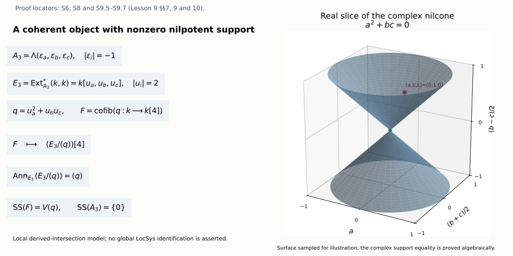

# The spectral side: local systems, singular support and IndCoh_Nilp

*Draft. Self-checked by the writing AI. Original mathematical exposition: CC0 1.0.*

The automorphic side attaches differential equations to bundles. The spectral side organizes local systems into a moduli stack and asks which category of sheaves on that stack should correspond to the automorphic category. Derived directions matter: a coherent object can have support in an obstruction direction even when its ordinary support is a single point.

We calculate those directions, their shifts and their nilpotent condition. An explicit derived intersection shows why a coherent skyscraper can fail to be perfect. Its polynomial cohomological operators give a complete one-generator model of the zero-support category. The earlier [The GL_1 case as an equivalence of categories](the-gl-1-case-as-an-equivalence-of-categories.md), §§5.1.1–5.1.8, proves the full torus comparison from its explicit arbitrary-rank exterior, smooth and automorphism factors, with the stated geometric and categorical foundations. The general reductive zero-support, compact-generation and Eisenstein theorems remain required.

Write \(H=\check G\) for the Langlands dual group. A de Rham \(H\)-local system is a principal \(H\)-bundle with an everywhere regular flat connection. On a curve the curvature two-form vanishes, and flatness is compatible with the usual connection descent. The derived moduli notation \(\operatorname{LocSys}_H\) includes infinitesimal automorphisms and obstruction directions. Its representability and family cotangent construction are the explicit foundation F-DAG below.

Once the global singular-support theory is constructed, its intended nilpotent subcategory is

\[
\operatorname{IndCoh}_{\mathrm{Nilp}_{glob}}\!\left(\operatorname{LocSys}_H\right),
\qquad
\mathrm{Nilp}_{glob}=\{(\sigma,A):A\text{ horizontal and nilpotent}\}.
\tag{A9.1}
\]

The full assignment requires this global category, its functoriality, its relation to QCoh and its compatibility with Eisenstein series and Whittaker normalization. We keep those requirements alongside the computations. In particular, an allowable nonzero direction is not itself an object with that support; §10 constructs such an object in an explicit local model and states the additional global work needed.

Let \(X/k\) be a smooth projective connected curve over an algebraically closed field of characteristic zero, and let \(g=\dim_kH^1(X,\mathcal O_X)\). Here \(g\) may be zero or one. Let \(H\) be any connected reductive group, with Lie algebra \(\mathfrak h\); in the course \(H=\check G\). Write \(\sigma\) for an everywhere regular de Rham \(H\)-local system and \(E=\mathfrak h_\sigma\) for its adjoint bundle with connection. All complexes are cohomological:

\[
(M[1])^i=M^{i+1},\qquad H^i(M[1])=H^{i+1}(M).
\tag{S0.1}
\]

## 1. Exact foundations and scope (S0)

The earlier curve proof in [The GL_1 case as an equivalence of categories](the-gl-1-case-as-an-equivalence-of-categories.md), §1.1.12, (R7.3), proves differential Serre duality

\[
H^1(X,F)^\vee=\operatorname{Hom}_X(F,\omega),\qquad\omega=\Omega^1_X,
\tag{S0.2}
\]

for coherent \(F\), using its constructed trace. Its §1.1.13, (R8.10), proves the principal-part trace formula
\(\operatorname{tr}(\partial\beta)=-\sum_p\operatorname{Res}_p\beta_p\),
and §1.1.14, (R9.6), proves that the Atiyah class of a line has trace equal to its degree. Its two-affine constructions compute curve coherent cohomology, show vanishing above degree one, and §1.1.16 proves fixed-curve tensor compatibility. Its local argument in §1.1.8 proves the needed DVR and completed-derivative facts. These results retain their recursive scheme, local-algebra and coherent-cohomology foundations.

The line Euler-characteristic calculation in [Opers, critical level and the Beilinson-Drinfeld construction](opers-critical-level-and-the-beilinson-drinfeld-construction.md), §2.1 (O0), has the hypothesis \(g\geq2\). The argument below gives the all-genus formula needed here. No theta characteristic is needed.

For statements involving \(\operatorname{LocSys}_H\) as a derived Artin stack, the existence of that derived moduli object, its cotangent universal property and the identification of linearized derived descent with the tangent functor are explicit DAG foundations. S2 supplies the actual linear deformation complex and its shifts, rather than using a citation to suppress that calculation. A tangent calculation alone does not prove algebraicity, perfectness on every parameter or existence of a quasi-smooth atlas. Those global steps remain separate foundations unless their exact complete proof is supplied.

## 2. Euler characteristic in the full reductive scope (S1)

First prove the line formula for every genus. A rational frame identifies a line \(M\) with \(\mathcal O_X(D)\) for its finite divisor \(D\). At a closed point \(p\), a DVR parameter gives the exact sequence

\[
0\to\mathcal O_X(D-p)\to\mathcal O_X(D)\to k_p\to0.
\tag{S1.1}
\]

Finite coherent cohomology and its long exact sequence show that adding \(p\) adds one to the Euler characteristic. Applying this repeatedly to positive and negative coefficients of \(D\) gives

\[
\chi(M)=\deg M+1-g.
\tag{S1.2}
\]

The definition of degree is independent of the rational frame: the earlier global residue theorem applied to \(d\log f\) makes the sum of the orders of a principal divisor zero. The earlier proof gives \(H^0(X,\mathcal O_X)=k\). By (S0.2), \(h^0(\omega)=g\) and \(h^1(\omega)=1\); comparing (S1.2) for \(\omega\) gives \(\deg\omega=2g-2\), for all genera.

Here is the vector version needed for an arbitrary reductive group. A rank-\(r\) bundle \(F\) has a filtration by line subbundles with locally free successive quotients. To construct its first step, choose a one-dimensional subspace of its rational fibre and intersect that subspace with \(F\). At a DVR stalk, write a spanning rational vector as a power of a parameter times a primitive vector; the saturated intersection is generated by that primitive vector. A primitive vector extends to a basis by elementary row operations, so the quotient is free. The local intersections glue to a coherent line subbundle: on a finite affine cover, clearing the denominators of a rational spanning vector gives the same finite rank-one saturated submodule. Repeating on the locally free quotient supplies the filtration. Determinants and Euler characteristics are additive in each of its short exact sequences. Thus (S1.2) gives

\[
\chi(F)=\deg(\det F)+r(1-g),
\quad
\deg(\det(F\otimes\omega))=\deg(\det F)+r(2g-2).
\tag{S1.3}
\]

If \(F\) has a regular connection, its determinant has the trace connection. The local determinant connection forms trivialize the Atiyah cocycle \(d\log\det g_{ij}\). Its class is therefore zero, and the exact earlier degree formula gives \(\deg(\det F)=0\). This uses characteristic zero, so an integer degree vanishing in \(k\) is the zero integer.

The two-term de Rham complex is

\[
C_F=R\Gamma\bigl(X,[F\xrightarrow{\nabla}F\otimes\omega]\bigr),
\tag{S1.4}
\]

with sheaf degrees \(0,1\). This is a complex of \(k\)-vector spaces; \(\nabla\) need not be \(\mathcal O_X\)-linear. The finite two-affine double complex gives cohomology in degrees \(0,1,2\). Filtering it by its two sheaf degrees gives the Euler identity
\(\chi(C_F)=\chi(F)-\chi(F\omega)\): every differential removes equal dimensions in adjacent total degrees, so it does not change the alternating sum. Equations (S1.3) consequently yield

\[
\chi(C_F)=(2-2g)r.
\tag{S1.5}
\]

For \(F=E=\mathfrak h_\sigma\), its rank is \(\dim H\). The tangent shift proved in S2 then gives

\[
\boxed{\ \chi(T_\sigma\operatorname{LocSys}_H)
=(2g-2)\dim H\ }.
\tag{S1.6}
\]

This is the virtual dimension at every local system once the indicated tangent perfect complex is part of the derived moduli foundation. It is not a claim that a stabilizer dimension or the dimension of the classical coarse space equals that number. It is also not a proof of global quasi-smooth representability.

## 3. Linear deformation complex and Artin-stack amplitude (S2)

On a finite affine trivializing cover, let \(u_{ij}\) describe a first-order change of transition functions and let \(a_i\) describe a first-order connection change. Choose the conventions in which the change of transitions is \(1+\varepsilon u_{ij}\) and the changed local connection is \(\nabla-\varepsilon a_i\). Conjugating this connection by \(1+\varepsilon u_{ij}\), and using \(\varepsilon^2=0\), gives

\[
\delta u=0,
\qquad\delta a=\nabla u.
\tag{S2.1}
\]

Changing the local identification by \(1+\varepsilon v_i\) changes \((u,a)\) to
\((u+\delta v,a+\nabla v)\). The deformation and arrow equations are therefore exactly the cocycle and boundary equations of the total Čech complex of (S1.4), with differential \(\delta+(-1)^p\nabla\) on Čech degree \(p\). Its degree-zero cohomology is infinitesimal automorphisms, degree one is first-order deformation classes, and degree two is the obstruction group for the transition/connection gluing equations. This calculation applies to a principal \(H\)-bundle because the kernel of reduction of a first-order group element is its adjoint Lie algebra, and conjugation is the adjoint action.

With a square-zero coefficient complex \(M\), linearizing these same descent and arrow equations tensors that total complex with \(M\). Within the explicitly retained derived tangent/linearization foundation, this identifies the tangent and cotangent complexes at \(\sigma\) as

\[
T_\sigma\operatorname{LocSys}_H=C_E[1],
\qquad
L_\sigma\operatorname{LocSys}_H=(C_E[1])^\vee=C_E^\vee[-1].
\tag{S2.2}
\]

The shift is forced by the automorphisms: \(H^0(C_E)\) must sit in tangent degree \(-1\). Since \(C_E\) has degrees \(0,1,2\), the resulting groups are

| Degree | Tangent cohomology | Cotangent cohomology |
|---|---|---|
| \(-1\) | \(H^0_{\mathrm{dR}}(X,E)\) | \(H^2_{\mathrm{dR}}(X,E)^\vee\) |
| \(0\) | \(H^1_{\mathrm{dR}}(X,E)\) | \(H^1_{\mathrm{dR}}(X,E)^\vee\) |
| \(1\) | \(H^2_{\mathrm{dR}}(X,E)\) | \(H^0_{\mathrm{dR}}(X,E)^\vee\) |

In particular the cotangent complex of this Artin stack is not blindly of amplitude \([-1,0]\). Degree \(1\) remembers stabilizers. A quasi-smooth *scheme* has cotangent amplitude \([-1,0]\); a one-Artin stack such as this one can have cotangent amplitude \([-1,1]\), and its quasi-smoothness is checked on a smooth derived-scheme atlas.

Framing the bundle at a fixed \(x\in X(k)\) removes those infinitesimal stabilizers. Evaluation of a horizontal section is injective. Indeed, in a local coordinate its equation is a linear system \(s'+A(t)s=0\); if \(s(0)=0\), coefficient comparison recursively gives every formal coefficient zero. The DVR embedding into its completion then makes the algebraic section zero on a nonempty open, hence zero everywhere on the integral curve. The tangent of the framed moduli is the fibre of
\(C_E[1]\to E_x[1]\). Its degree \(-1\) is the kernel of this evaluation, so it vanishes, and its remaining degrees are \(0,1\). Thus a represented framed derived atlas would have cotangent amplitude \([-1,0]\). Establishing that atlas and its smooth forgetful morphism is the missing global representability step; its existence is not inferred solely from the calculated degrees.

The sketch assertion that the classical truncation is singular at reducible local systems also needs qualification. For a torus, all adjoint local systems are trivial, and \(H^2_{\mathrm{dR}}\) gives derived directions while the earlier ordinary connection-torsor description is classically smooth once its Picard representability and smoothness foundations are supplied. A nonzero obstruction *space* need not impose a nonzero classical obstruction equation. S2 therefore makes no blanket assertion that every reducible classical local system is a singular classical point.

## 4. The top de Rham group and horizontal covectors (S3)

We need the precise duality identification used by the singular fibre. First prove that

\[
d:H^1(X,\mathcal O_X)\longrightarrow H^1(X,\omega)
\quad\text{is zero}.
\tag{S3.1}
\]

The rational-function principal-parts sequence is proved just as the earlier rational-differential sequence: rational functions and finite-support polar parts are flasque, and its kernel is \(\mathcal O_X\), as a DVR calculation shows. Its connecting map is onto \(H^1(X,\mathcal O_X)\). Differentiation maps it to the differential principal-parts sequence. The derivative of a Laurent series has no \(t^{-1}dt\) coefficient, so every polar derivative has residue zero. The proved trace formula makes the trace of the resulting \(H^1(\omega)\)-class zero. That trace is an isomorphism onto \(k\), hence the class is zero. This proves (S3.1), including the arbitrary-genus case.

For a flat vector bundle \(F\), the two sheaf-degree filtration of (S1.4) gives

\[
H^2(C_F)=\operatorname{coker}
\bigl(H^1(F)\xrightarrow{\nabla}H^1(F\omega)\bigr).
\tag{S3.2}
\]

By differential Serre duality, the dual of this map goes from \(H^0(F^*)\) to \(H^0(F^*\omega)\). It is minus the dual connection \(\nabla^*\). To check the sign and the identification, use local evaluation:

\[
d\langle v,s\rangle=
\langle\nabla^*v,s\rangle+
\langle v,\nabla s\rangle.
\tag{S3.3}
\]

For a Čech degree-one section \(s\) and a global section \(v\), the same equality holds on every overlap. Taking its trace in \(H^1(\omega)\), the derivative term is zero by (S3.1). The two terms therefore differ by a minus sign under the actual Serre pairing. Thus dualizing the cokernel in (S3.2) gives the canonical identification

\[
H^2_{\mathrm{dR}}(X,F)^\vee
\simeq\ker\bigl(H^0(F^*)\xrightarrow{\nabla^*}H^0(F^*\omega)\bigr)
=H^0_{\mathrm{dR}}(X,F^*).
\tag{S3.4}
\]

This is the exact portion of de Rham duality needed here. It does not silently import a full higher-dimensional Poincaré duality theorem.

For a quasi-smooth derived Artin stack \(Y\), the singular-vector fibre at a point is
\((H^1(T_yY))^*=H^{-1}(L_yY)\); the corresponding classical cone is built from \(\operatorname{Sym}H^1(T_Y)\). Applying (S2.2) and (S3.4), its fibre at \(\sigma\) is

\[
H^{-1}(L_\sigma\operatorname{LocSys}_H)
=H^0_{\mathrm{dR}}(X,\mathfrak h_\sigma^*).
\tag{S3.5}
\]

This supplies the actual horizontal-covector calculation. The global stack identification \(\operatorname{Sing}(\operatorname{LocSys}_H)\simeq\operatorname{Arth}_H\) additionally needs the global cotangent and relative-cone construction on all families; its global derived foundations are not certified by (S3.5) alone.

## 5. Nilpotence at one point (S4)

Use the invariant-quotient definition of the coadjoint nilpotent cone:

\[
\mathcal N_{\mathfrak h^*}
=V\bigl(k[\mathfrak h^*]^H_{>0}\bigr)\subset\mathfrak h^*.
\tag{S4.1}
\]

Here the ideal in \(k[\mathfrak h^*]\) is generated by homogeneous invariant polynomials of positive degree. This defines a closed \(H\)-stable cone; the polynomial ring is Noetherian, so its ideal has a finite generating subset. No assertion about a polynomial presentation of the invariant ring is needed for the lemma. For a reductive group this is the usual zero-fibre definition of its nilpotent cone. Relating it to other Lie-theoretic definitions, if those are used elsewhere, retains that separate Lie-theory foundation. In S5 we verify its matrix meaning directly for \(SL_2\), and in S7 we verify the torus case directly.

Let \(A\) be a horizontal global section of \(\mathfrak h_\sigma^*\). For any invariant polynomial \(f\), the local functions \(f(A)\) agree on overlaps, because transition functions act by the coadjoint action and \(f\) is invariant. Thus \(f(A)\) is a global regular function on \(X\), and is constant since \(H^0(X,\mathcal O_X)=k\). Consequently

\[
f(A)=0\ \text{on }X
\quad\Longleftrightarrow\quad f(A(x))=0
\quad\text{for one }x\in X(k).
\tag{S4.2}
\]

Applying this to all positive-degree homogeneous invariants proves

\[
\boxed{\ A\text{ is nilpotent everywhere }
\Longleftrightarrow A(x)\text{ is nilpotent at one point.}\ }
\tag{S4.3}
\]

In this projective-curve setting the invariant-function argument actually works for any global section of the untwisted coadjoint bundle; horizontality is required by the definition of a singular vector, but adds no further step to this particular proof. On a nonproper curve, horizontality instead gives \(d(f(A))=0\): the chain rule and infinitesimal invariance give
\(d f_A(a\cdot A)=0\), which cancels the connection term. That variant is not needed for (S4.3).

The same proof retains ordinary nonreduced parameters. For \(S=\operatorname{Spec}R\), the fixed-curve tensor calculation gives
\(\Gamma(X_S,\mathcal O_{X_S})=R\).
Every \(f(A)\) is pulled back from its evaluation along \(x\times S\), so vanishing along that section is equivalent to vanishing on \(X_S\), as an equality of functions with nilpotents retained. The criterion (S4.1) then gives equality of these ordinary nilpotent-subfunctors. This is stronger than checking only geometric points. No analogous derived-subfunctor equality is claimed without the separate global derived-cone foundation.

## 6. The trivial \(SL_2\) local system (S5)

For the trivial connection, the cohomology of
\(C_0=R\Gamma(X,[\mathcal O_X\xrightarrow d\omega])\)
can be computed without invoking degeneration of a general Hodge spectral sequence. Global functions are constants, so \(H^0(C_0)=k\). Equation (S3.1) and the two-column exact sequence give

\[
0\to H^0(\omega)\to H^1(C_0)\to H^1(\mathcal O_X)\to0,
\qquad H^2(C_0)=H^1(\omega)\xrightarrow{\operatorname{tr}}k.
\tag{S5.1}
\]

Thus \(\dim H^1(C_0)=2g\), while \(H^0(C_0)=H^2(C_0)=k\). The middle sequence is not being given a canonical splitting.

At the trivial \(SL_2\) local system, \(C_E=\mathfrak{sl}_2\otimes C_0\). The shift/dual calculation gives

\[
H^{-1}(L_\sigma)=\mathfrak{sl}_2^*,\quad
H^0(L_\sigma)=\mathfrak{sl}_2^*\otimes H^1(C_0)^\vee,\quad
H^1(L_\sigma)=\mathfrak{sl}_2^*.
\tag{S5.2}
\]

In particular the requested \(H^{-1}\) is a three-dimensional covector space; it is not \(H^1_{\mathrm{dR}}\), which would have dimension \(6g\) after tensoring with \(\mathfrak{sl}_2\). The fibre of \(\operatorname{Sing}\) is therefore \(\mathfrak{sl}_2^*\), in the quasi-smooth derived-moduli setting specified above.

The pairing \(B(U,V)=\operatorname{tr}(UV)\) identifies \(\mathfrak{sl}_2^*\) with \(\mathfrak{sl}_2\). It is invariant by cyclicity of trace and nondegenerate: for

\[
U=\begin{pmatrix}a&b\\c&-a\end{pmatrix},
\qquad
V=\begin{pmatrix}a'&b'\\c'&-a'\end{pmatrix},
\quad B(U,V)=2aa'+bc'+cb'.
\tag{S5.3}
\]

Its matrix has determinant \(-2\), which is invertible in characteristic zero. Direct multiplication gives

\[
U^2=(a^2+bc)I,
\qquad q(U)=a^2+bc=-\det U=\tfrac12\operatorname{tr}(U^2).
\tag{S5.4}
\]

If \(q=0\), then \(U^2=0\), so \(U\) is nilpotent. If \(q\ne0\), then \(U\) is invertible and cannot be nilpotent. The cone is consequently

\[
\mathcal N_{\mathfrak{sl}_2^*}
\simeq\{(a,b,c)\in\mathbb A^3:a^2+bc=0\}.
\tag{S5.5}
\]

This agrees scheme-theoretically with (S4.1), without a Chevalley theorem citation. If \(f\) is an invariant polynomial, its restriction to diagonal matrices \(\operatorname{diag}(a,-a)\) is invariant under \(a\mapsto-a\), realized by \(\left(\begin{smallmatrix}0&-1\\1&0\end{smallmatrix}\right)\in SL_2\). That restriction is therefore \(P(a^2)\) for a polynomial \(P\). Every matrix with \(q\ne0\) has two distinct eigenvalues \(\lambda,-\lambda\) and is conjugate to their diagonal matrix. A conjugating basis can be rescaled to determinant one, since the field is algebraically closed. On this dense open set, invariance gives \(f(U)=P(q(U))\). Two polynomials agreeing on a dense open subset of \(\mathbb A^3\) agree everywhere. Thus

\[
k[\mathfrak{sl}_2]^{SL_2}=k[q].
\tag{S5.6}
\]

The ideal generated by all positive-degree homogeneous invariants is consequently exactly \((q)\), proving the scheme-theoretic claim. In addition, every nonzero matrix with \(U^2=0\) has one-dimensional image equal to its kernel; choosing an image vector and a preimage gives its conjugacy to \(E_{12}\) under \(SL_2\) after determinant normalization. The gradient of \(q\) is \((2a,c,b)\), so the cone is smooth away from the origin and singular at the origin.

## 7. The exterior-algebra derived intersection (S6)

Let

\[
Z=\operatorname{Spec}k\times^{\mathbf R}_{\mathbb A^1}
\operatorname{Spec}k,
\]

with both maps at zero. Put \(R=k[t]\). Its Koszul resolution of \(k\) is \(R[\varepsilon]\), \(|\varepsilon|=-1\), \(d\varepsilon=t\). Tensoring it with \(k\) gives

\[
\mathcal O(Z)=A=k[\varepsilon],\qquad
|\varepsilon|=-1,\quad d=0,\quad\varepsilon^2=0.
\tag{S6.1}
\]

The square vanishes by graded commutativity in characteristic zero. Thus \(H^0(A)=k\), \(H^{-1}(A)=k\varepsilon\), and there is no other cohomology. The cotangent module is free on \(d\varepsilon\), in degree \(-1\), because \(A\) is free as a graded-commutative algebra on that generator. At its unique classical point, \(H^{-1}(L_Z)=k\) and \(H^1(T_Z)=k\). Hence \(\operatorname{Sing}(Z)=\mathbb A^1\). Denote its cohomological support coordinate by \(u\), of degree \(2\); the underlying classical cone coordinate has the corresponding dilation weight.

To compute its action, resolve the augmentation module \(k\) by

\[
P=\bigoplus_{j\geq0}Ae_j,
\quad|e_j|=-2j,
\quad de_0=0,
\quad de_j=\varepsilon e_{j-1}\ (j\geq1),
\quad e_0\mapsto1.
\tag{S6.2}
\]

This is semifree. As a \(k\)-complex its nonzero negative-degree basis elements are paired by
\(e_j\mapsto\varepsilon e_{j-1}\), so its augmentation has cohomology \(k\) in degree zero only. Applying \(\operatorname{Hom}_A(-,k)\) kills the differential, with one generator in each degree \(2j\). The degree-two chain map
\(e_j\mapsto e_{j-1}\) for \(j\geq1\), \(e_0\mapsto0\), represents the first class. Its powers represent every subsequent class and are nonzero on \(e_j\). Therefore its Yoneda algebra is

\[
\operatorname{Ext}_A^*(k,k)=k[u],\qquad |u|=2.
\tag{S6.3}
\]

This operator is the intrinsic cohomological singular-support operator, not just an arbitrary generator of the Ext vector space. Indeed, put
\(A^e=A\otimes A=\Lambda(\varepsilon_1,\varepsilon_2)\)
and \(\delta=\varepsilon_1-\varepsilon_2\). A diagonal bimodule resolution is

\[
Q=\bigoplus_{j\geq0}A^ee_j,
\quad de_j=\delta e_{j-1},\quad |e_j|=-2j.
\tag{S6.4}
\]

Changing generators to \(\delta\) and \(z=(\varepsilon_1+\varepsilon_2)/2\) identifies this with (S6.2) on the \(\delta\)-factor tensored with \(\Lambda(z)\). It therefore resolves the diagonal copy of \(A\). Its degree-two shift map gives a Hochschild class. Tensoring this bimodule map with an \(A\)-module gives the natural central action; on \(k\), the resolution becomes (S6.2) and the operator is exactly (S6.3). It is associated to the dual of the single odd cotangent generator, with the extra Hochschild cohomological shift, hence to the coordinate \(u\) of the singular fibre. This is the explicit complete-intersection cohomological-operator definition of support used here.

On the structure module \(A\), the degree-two map is zero in the derived category, because
\(\operatorname{Ext}_A^2(A,A)=H^2(A)=0\).
On \(k\), the same action is multiplication by \(u\) in the polynomial algebra (S6.3), with no nonzero annihilating polynomial. Thus the two support calculations are

\[
\operatorname{SS}(\mathcal O_Z)=\{0\},
\qquad
\operatorname{SS}(k)=\mathbb A^1.
\tag{S6.5}
\]

Equivalently, the pointwise Ext test has module \(\operatorname{Ext}_A^*(A,k)=k\) annihilated by \(u\), and module \(\operatorname{Ext}_A^*(k,k)=k[u]\) of full support. The finite model makes the same central operator visible in both descriptions; extending these descriptions to arbitrary quasi-smooth stacks requires the separate singular-support theory.

The skyscraper \(k\) is coherent: its only cohomology is the one-dimensional \(H^0(A)\)-module \(k\). It is not perfect. A finite cell \(A\)-module, or its retract, has bounded \(\operatorname{RHom}_A(-,k)\), since this is true for each shifted free cell and is preserved by finitely many cones and retracts. The nonzero classes in every degree \(2j\) in (S6.3) contradict that condition for \(k\). This proves coherence, nonperfectness and the whole singular fibre support by actual computations.

## 8. Zero singular support on the full torus stack (S7)

For a torus \(T\), the coadjoint action on \(\mathfrak t^*\) is trivial. All linear coordinate functions are invariant and of positive degree, so (S4.1) gives

\[
\mathcal N_{\mathfrak t^*}=\{0\}.
\tag{S7.1}
\]

Equations (S3.5) and (S4.3) then say that the global nilpotent cone is the zero section of the singular-vector cone, within the global derived-cone foundation. This is the elementary part of the torus exercise. The categorical identity

\[
\operatorname{IndCoh}_{\mathrm{Nilp}}(\operatorname{LocSys}_T)
\simeq\operatorname{QCoh}(\operatorname{LocSys}_T)
\tag{S7.2}
\]

is proved in [The GL_1 case as an equivalence of categories](the-gl-1-case-as-an-equivalence-of-categories.md), §§5.1.1–5.1.8. Here is its application to this stack. Its derived product is \(Y\times Z_r\times BT\), with \(Y=(J_X^\natural)^r\) smooth and \(Z_r\) the exterior derived point on \(r\) generators of degree \(-1\). Over every smooth affine chart \(\operatorname{Spec}R\) of \(Y\), the polynomial operators give \(\operatorname{IndCoh}\simeq R[u_1,\ldots,u_r]\text{-}\operatorname{Mod}\). Zero support is the localizing subcategory generated by its augmentation \(R\); the structure algebra transforms to \(\det(V)[r]\), so the continuous perfect-object comparison has exactly that image. The dualizing twist makes this comparison compatible with \(!\)-pullbacks on the full torus nerve. Taking its limit proves (S7.2) for every genus and rank, all unbounded objects and all weights. The geometric product and the regular-ring, coherent-duality, DG-category and affine/smooth-descent constructions remain its explicit foundations. A pointwise nilpotent-zero calculation alone would not prove this categorical assertion.

The comparison compatible with the \(!\)-chart diagram is \(\Upsilon\). On this Gorenstein torus model the scheme-normalized comparison is \(\Xi(F)=\Upsilon(F\otimes\omega^{-1})\), and both have the same zero-support image. The shifted dualizing line includes \(\det(\mathfrak t)[-r]\) from \(BT\); it cannot be omitted when comparing chart functors. For a general eventually coconnective quasi-smooth derived Artin stack \(W\), retain **F-ZS**: the fully faithful comparison \(\Xi_W:\operatorname{QCoh}(W)\to\operatorname{IndCoh}(W)\) has image \(\operatorname{IndCoh}_{\{0\}}(W)\). That general theorem is still unproved here. The explicit torus proof does not assume it.

The general theorem is stated in Arinkin–Gaitsgory, [*Singular support of coherent sheaves, and the geometric Langlands conjecture*, Theorem 4.2.6 and Corollary 8.2.8](https://arxiv.org/abs/1201.6343v4). The complete-intersection argument in §5.7 has the following mathematical inputs. A local complete-intersection chart reduces the comparison to conservativeness of the right adjoint \(\Psi\) on zero support. A Koszul-generation adjunction gives generators from zero-supported objects of the point self-intersection. Product support and Koszul duality identify them with dualizing pullbacks from the point. Base change identifies the resulting composite with \(\iota^!\iota_*\) for the immersion into a smooth ambient scheme. The ambient dualizing sheaf generates under the QCoh action; its pullback is the complete intersection's dualizing sheaf, an invertible line up to shift. Thus these generators lie in the image of \(\Xi\). Extending this argument to stacks requires smooth descent. Complete-intersection charts, Koszul generation, product support, IndCoh base change, Gorenstein duality and descent remain unproved in this generality. The explicit exterior models have the direct algebra proof below and the arbitrary-rank smooth-base proof in the earlier lesson.

## 9. Explicit zero-support category for the one-generator model (S8)

This section works in the usual stable DG module categories, with exact triangles, derived tensor–Hom and their free-bar construction. These categorical foundations are explicit prerequisites; no claim about arbitrary prestack IndCoh functoriality is made.

For the finite algebra \(A\) of S6, let \(\operatorname{Coh}(A)\) be the bounded modules with finite-dimensional cohomology. Its ordinary cohomological truncations give a finite Postnikov filtration of each such module. Each cohomology layer is a finite sum of shifts of the augmentation module \(k\), since the heart is finite-dimensional modules over \(H^0(A)=k\). Thus

\[
\operatorname{Coh}(A)=\operatorname{thick}(k),
\qquad
\operatorname{IndCoh}(Z)=\operatorname{Ind}(\operatorname{thick}(k)).
\tag{S8.1}
\]

Here “thick” allows finite cones and retracts. In its Ind-completion \(k\) is a compact generator. Its endomorphism DG algebra is quasi-isomorphic to \(E=k[u]\), \(|u|=2\), with zero differential. In addition to the cohomology computation (S6.3), the chain shift map there gives a DG algebra map \(k[u]\to\operatorname{End}_A(P)\), and it is an isomorphism on all cohomology by the same calculation; this proves the required DG algebra assertion rather than assuming formality from dimensions.

Compact-generator Morita gives

\[
\operatorname{IndCoh}(Z)\simeq E\text{-}\operatorname{Mod}.
\tag{S8.2}
\]

In this instance its proof can be described directly. The functor is the mapping complex \(\operatorname{Maps}_{\operatorname{IndCoh}(Z)}(k,-)\), and its inverse tensors a module with the compact generator \(k\) over its endomorphism algebra. On coherent objects this mapping complex agrees with the ordinary derived \(A\)-module Hom. On arbitrary Ind-objects it means the IndCoh mapping functor: the augmentation module is not compact in \(\operatorname{QCoh}(Z)\), so its ordinary QCoh Hom cannot be substituted for this functor. The composites agree on the free generator. Resolve any module by the split free bar; applying either composite to that augmented bar gives the original module. Compactness in IndCoh makes its mapping functor commute with sums, and exactness makes it commute with the bar realizations. Since the generator detects the zero object, these unit and counit equivalences prove (S8.2) on the whole Ind-category, not only on finite objects.

Under (S8.2), the object \(k\) is \(E\), of full support. The structure object \(A\) is \(\operatorname{RHom}_A(k,A)\). In \(\operatorname{Hom}_A(P,A)\), the functional \(e_j\mapsto1\) in degree \(2j\) maps, up to its differential sign, to the functional \(e_{j+1}\mapsto\varepsilon\) in degree \(2j+1\). These pairs are acyclic; the sole unpaired functional is \(e_0\mapsto\varepsilon\), in degree \(-1\). Hence

\[
A\longmapsto k[1]\quad\text{as an }E\text{-module},
\qquad u\text{ acts by zero}.
\tag{S8.3}
\]

As a check on the endomorphism algebra in this description, a semifree \(E\)-resolution of \(k\) is \(E\oplus Et\), with \(|t|=1\) and \(dt=u\). Applying \(\operatorname{Hom}_E(-,k)\) gives one class in degree zero and one in degree \(-1\). The degree-\(-1\) endomorphism sending \(t\) to \(1\) and \(1\) to \(0\) is a DG cycle and squares to zero. It therefore defines a DG algebra map \(k[\varepsilon]\to\operatorname{End}_E(E\oplus Et)\), with \(|\varepsilon|=-1\), inducing those two cohomology classes. This map is a quasi-isomorphism, so \(\operatorname{REnd}_E(k[1])\simeq A\). No completion of \(k[u]\) occurs: each fixed degree in the resolutions has only finitely many basis elements.

The subcategory supported at the origin of \(\operatorname{Spec}k[u]\) consists of modules whose localization at \(u\) is zero, or equivalently whose cohomology elements are each killed by some power of \(u\). It is the localizing subcategory generated by \(k\). One proof uses the localization telescope \(M\to M[2]\to M[4]\to\cdots\) given by multiplication by \(u\). Its colimit is \(M[u^{-1}]\). The fibre of the map to this colimit is built from the fibres of the maps \(u^m:M\to M[2m]\). Their cofibres are shifts of \(E/(u^m)\otimes_E^LM\); \(E/(u^m)\) has a finite filtration with layers shifted copies of \(k\). Each \(k\otimes_E^LM\) is a complex of \(k\)-vector spaces and so lies in the localizing subcategory of \(k\). If the localization is zero, this construction builds \(M\) in that subcategory. Conversely all its generators localize to zero.

Finally, \(\operatorname{QCoh}(Z)=A\text{-}\operatorname{Mod}\) is the Ind-completion of finite perfect \(A\)-modules. A proof uses free-cell resolutions and the split free bar: shifted free cells generate every module under sums and realizations, and the compact objects they generate are precisely finite cells and retracts. The inclusion of finite perfect modules into \(\operatorname{Coh}(A)\) is fully faithful and exact, and extends to a fully faithful functor of Ind-categories because both mapping computations out of its compact generators agree. Its image is the localizing subcategory generated by \(A\). Under (S8.2), that is exactly the localizing subcategory of \(k[1]\), which is the origin-support subcategory just computed. Therefore

\[
\operatorname{IndCoh}_{\{0\}}(Z)\simeq\operatorname{QCoh}(Z)
\tag{S8.4}
\]

in this explicit model, with the central cohomological support convention of S6. This calculation demonstrates why coherent and quasicoherent categories differ before the zero-support restriction: the coherent skyscraper corresponds to a free \(k[u]\)-module and has nonzero support, while the structure module corresponds to a torsion \(k[u]\)-module. The arbitrary-rank exterior calculation over smooth affine bases, and its compatible torus descent, are proved in the earlier The GL_1 case as an equivalence of categories, §§5.1.1–5.1.8. Together with the actual derived product, they give (S7.2) at the explicit foundations described in §8. The general F-ZS theorem remains a separate obligation.

## 10. Eisenstein compatibility and the rank-one candidate (S9)

This section states the global Eisenstein premises, proves their formal minimality consequence, and calculates the rank-one singular correspondence. It also constructs a coherent object with nilpotent nonzero support in an exterior-algebra model. The global functoriality, generation and strictness statements retain the proof obligations listed below.

For a parabolic \(P\subset G\) with Levi quotient \(M\), write \(H=\check G\), \(P_H=\check P\), and \(M_H=\check M\). The spectral correspondence and its proposed functor are

\[
\operatorname{LocSys}_H
\xleftarrow{\ p\ }\operatorname{LocSys}_{P_H}
\xrightarrow{\ q\ }\operatorname{LocSys}_{M_H},
\qquad
\operatorname{Eis}_{\mathrm{spec}}^P=p_*^{\operatorname{IndCoh}}q^!.
\tag{S9.1}
\]

The needed global functoriality is **F-EIS**: \(q\) is quasi-smooth, \(p\) is schematic proper, and the constructed \(!\)-pullback and proper IndCoh pushforward satisfy the singular-codifferential support bounds that make (S9.1) preserve nilpotent support. These statements require representability, the relative cotangent calculation, properness and the general reductive Lie-algebra support assertion; their full proofs remain required here. They are formulated in Arinkin–Gaitsgory, [*Singular support of coherent sheaves, and the geometric Langlands conjecture*, §13.2](https://arxiv.org/abs/1201.6343v4). The rank-one Lie-algebra assertion has the following direct computation.

Let \(H=SL_2\), let \(B\) be its upper-triangular Borel, and use the trace identification (S5.3). The covector represented by
\(U=\left(\begin{smallmatrix}a&b\\c&-a\end{smallmatrix}\right)\)
restricts on \(\mathfrak b\), with basis
\(h=\operatorname{diag}(1,-1)\), \(e=E_{12}\), to the two coordinates

\[
\langle U,h\rangle=2a,\qquad
\langle U,e\rangle=c.
\tag{S9.2}
\]

Since the Levi is a torus, its nilpotent cone is zero. The inverse image of its zero covector under the restriction \(\mathfrak{sl}_2^*\to\mathfrak b^*\) is therefore exactly

\[
a=c=0,\qquad U=bE_{12}.
\tag{S9.3}
\]

Every such matrix is nilpotent, including nonzero values of \(b\). Varying the Borel varies its preserved line. A nonzero nilpotent matrix has one unique kernel/image line, so the union of (S9.3) over all Borels is the entire cone (S5.5). This explains the nonzero nilpotent directions appearing in the singular correspondence. It is a calculation of directions; a pushforward support *bound* by itself does not prove that a particular pushforward attains every permitted direction.

The horizontal version also has a direct rank-one proof. A nonzero horizontal nilpotent endomorphism \(U\) of a rank-two flat bundle is nowhere zero, by the evaluation injectivity proved in S2. Its square is zero and its rank is one everywhere. A locally invertible entry makes its image a line subbundle, and its image equals its kernel at every fibre and at the bundle level. The identity \(\nabla U=U\nabla\) makes that line horizontal. It gives a horizontal Borel reduction containing \(U\) in its nilradical. Thus a local system with a nonzero horizontal nilpotent section is reducible, and an irreducible rank-two local system has only the zero nilpotent section. The same kernel-line construction glues in projective rank-two charts for \(PGL_2\): conjugation transports the line and scalar changes of a lift do not change it. This avoids inferring this particular rank-one geometric statement from a general fixed-point theorem.

The global generation premise is **F-GEN**: QCoh on \(\operatorname{LocSys}_H\), together with the images of Levi QCoh under all proper-parabolic spectral Eisenstein functors, generates \(\operatorname{IndCoh}_{\mathrm{Nilp}}(\operatorname{LocSys}_H)\). “Generates” means the smallest full stable subcategory closed under all colimits. Its construction needs generation by \(q^!\), using the quasi-smooth pullback tensor-product theorem and conservative QCoh pushforward for a unipotent affine quotient; generation by proper \(p_*\), using the support-sensitive proper-pushforward theorem; and horizontal parabolic reductions containing prescribed nilpotent covectors. One method for the final step integrates a horizontal nilpotent element to a \(\mathbb G_a\)-action on the proper scheme of horizontal reductions and takes a fixed point. The complete global categorical, integration and fixed-point arguments remain unproved here. Equations (S9.2)–(S9.3) and the horizontal kernel-line argument prove the rank-one Lie and reduction steps. The full generation statements are in Arinkin–Gaitsgory, [*Singular support of coherent sheaves, and the geometric Langlands conjecture*, §13.3](https://arxiv.org/abs/1201.6343v4).

Generation on the reducible locus uses proper-parabolic images of **Levi IndCoh with nilpotent support**. The assertion with **Levi QCoh**, together with QCoh on the full local-system stack, additionally needs zero support on the irreducible locus, categorical localization, transitivity of Eisenstein functors and induction on semisimple rank. Each of these is an explicit unproved premise of F-GEN, alongside the \(q^!\) and \(p_*\) generation statements. The torus comparison of §8 supplies torus Levi zero support; it does not prove these general reductive steps.

Here is the precise compatibility premise for minimality. Put \(I_H=\operatorname{IndCoh}(\operatorname{LocSys}_H)\), and let \(j_H:\mathcal C_H\hookrightarrow I_H\) be a full stable inclusion with colimit-closed image. Supply an equivalence \(\Phi_H:\mathcal C_H\simeq\mathcal A_G\) to the chosen automorphic category. For each proper parabolic, also supply a Levi functor
\[
\Phi_M^0:\operatorname{QCoh}(\operatorname{LocSys}_{M_H})\longrightarrow\mathcal A_M,
\]
the normalized automorphic Eisenstein functor \(\operatorname{Eis}_{aut}^P:\mathcal A_M\to\mathcal A_G\), and a natural isomorphism of functors into \(I_H\):
\[
j_H\Phi_H^{-1}\operatorname{Eis}_{aut}^P\Phi_M^0
\simeq
\operatorname{Eis}_{spec}^P\,\Xi_{M_H}(-\otimes\mathcal L_M).
\tag{C9.1}
\]
Here \(\Xi_{M_H}\) is the supplied QCoh-to-IndCoh comparison and \(\mathcal L_M\) is the permissible Levi line-bundle twist. The automorphic half twists and shifts are part of the stipulated normalization; (C9.1) is an assumed compatibility, not a theorem inferred from \(\Phi_H\) alone. The left side lands in \(j_H\mathcal C_H\). Tensoring by \(\mathcal L_M\) is an autoequivalence of Levi QCoh, so its right-side images run through all the untwisted Levi-QCoh Eisenstein images. If \(\mathcal C_H\) also contains \(\Xi_H\operatorname{QCoh}(\operatorname{LocSys}_H)\), it therefore contains every generator in the F-GEN corollary. By F-GEN, taking the stable colimit closure of those images gives

\[
\operatorname{IndCoh}_{\mathrm{Nilp}}(\operatorname{LocSys}_H)
\subset\mathcal C_H.
\tag{S9.4}
\]

This proves the minimality deduction from (C9.1) and F-GEN. By F-ZS, any object in the nilpotent category with nonzero singular support is outside the image of QCoh, and the deduction forces every such object into \(\mathcal C_H\). To establish that the nilpotent category is strictly larger in a specified global example requires an actual such global object or a proved strictness theorem. Allowed directions alone do not establish strictness.

For clarity, an actual object with this support can be computed in the following *local model*. Let \(Z_3=\operatorname{pt}\times^{\mathbf R}_{\mathbb A^3}\operatorname{pt}\), with algebra \(A_3=\Lambda(\varepsilon_a,\varepsilon_b,\varepsilon_c)\), each generator of degree \(-1\). Tensor the three resolutions (S6.2), with the ordinary Koszul differential signs. Every fixed degree has finitely many basis elements. The tensor Künneth argument over the field and the three commuting even shift maps give

\[
\operatorname{REnd}_{A_3}(k)\simeq
E_3=k[u_a,u_b,u_c],\qquad |u_a|=|u_b|=|u_c|=2.
\tag{S9.5}
\]

As in S8, finite Postnikov filtrations prove \(\operatorname{Coh}(A_3)=\operatorname{thick}(k)\), so the compact mapping functor identifies its Ind-category with \(E_3\)-modules. Identify the three singular coordinates with \(a,b,c\) in (S5.3). Define the coherent object

\[
F=\operatorname{cofib}\bigl(
u_a^2+u_bu_c:k\longrightarrow k[4]\bigr)
\quad\text{in }\operatorname{Coh}(A_3).
\tag{S9.6}
\]

The displayed map is the quadratic central cohomological operator; it exists through the diagonal resolutions used in S6. Under the compact-generator functor it is multiplication by \(q=u_a^2+u_bu_c\), from \(E_3\) to \(E_3[4]\). Since \(q\) is a nonzero divisor in the polynomial domain, \(F\) corresponds to \((E_3/(q))[4]\). Its annihilator is exactly \((q)\), and therefore

\[
\operatorname{SS}(F)=V(q)=\mathcal N_{\mathfrak{sl}_2^*}.
\tag{S9.7}
\]

In particular this support is nilpotent and contains the nonzero point \((a,b,c)=(0,1,0)\). Every perfect \(A_3\)-module has zero support: the operator acts trivially on the free module in the derived category because \(H^{>0}(A_3)=0\), and zero support is preserved by finite cones and retracts. Thus \(F\) is coherent and nonperfect. This is an actual object calculation, not just an allowable-support picture. Identifying a neighbourhood in a global local-system stack with this model, descending a suitable equivariant object and extending it globally are separate foundations and are not asserted here.

The exact complex support is \(V(a^2+bc)\), proved in (S9.5)–(S9.7). The plotted surface is only its real slice, in coordinates \(x=a\), \(y=(b+c)/2\), \(z=(b-c)/2\); then \(a^2+bc=x^2+y^2-z^2\). The red point is the nonzero nilpotent \((a,b,c)=(0,1,0)\), and the origin is the structure object's support. The picture represents the explicit derived-intersection model; global local-system descent remains F-STRICT.

Finally the candidate actually discussed by AG for automorphic \(G=SL_2\) is

\[
\operatorname{IndCoh}_{\mathrm{Nilp}_{glob}}
\bigl(\operatorname{LocSys}_{PGL_2}\bigr).
\tag{S9.8}
\]

Here \(PGL_2=\check{SL_2}\), under the course's dual-root-datum convention. Its allowed horizontal covectors, after trace identification locally, satisfy \(a^2+bc=0\). A \(\mathfrak{pgl}_2\) element has a unique trace-zero representative: subtract \(\tfrac12\operatorname{tr}(V)I\) from any matrix lift \(V\). Adding a scalar matrix to the lift preserves that representative; projective conjugation preserves its nilpotence and transports its kernel line. If the *spectral* group is instead \(SL_2\), as in Exercise 9.3, the category is \(\operatorname{IndCoh}_{\mathrm{Nilp}}(\operatorname{LocSys}_{SL_2})\), for automorphic dual group \(PGL_2\). Establishing strictness of the global category (S9.8) remains F-STRICT. The local object (S9.6) proves strictness in its exterior model, whose identification, descent and extension in a global local-system stack still need proof.

## 11. Exercises with solutions

**Exercise 9.1.** Compute the virtual dimension of \(\operatorname{LocSys}_H\).

**Solution 9.1.** For \(E=\mathfrak h_\sigma\), the coherent Euler formula in §2 gives
\[
\chi(C_E)=\chi(E)-\chi(E\omega)=(2-2g)\dim H.
\]
The tangent complex is \(C_E[1]\), with the automorphisms in degree \(-1\). Shifting changes the sign of the Euler characteristic, so
\[
\chi(T_\sigma)=(2g-2)\dim H.
\]
This calculation includes \(g=0,1\) and every connected reductive \(H\). Identifying it with a global derived-stack virtual dimension still consumes F-DAG; it is not a coarse-space dimension formula.

**Exercise 9.2.** Show that \(\operatorname{IndCoh}_{\mathrm{Nilp}}(\operatorname{LocSys}_T)=\operatorname{QCoh}(\operatorname{LocSys}_T)\) for a torus \(T\).

**Solution 9.2.** The coadjoint action is trivial, so every linear coordinate is an invariant polynomial of positive degree. Their zero scheme is the origin. Thus the nilpotent condition is zero singular support. The family-and-arrow construction in [The GL_1 case as an equivalence of categories](the-gl-1-case-as-an-equivalence-of-categories.md), §1, gives the full stack \((J_X^\natural)^r\times Z_r\times BT\), with all its geometric premises retained. On an affine smooth chart \(R\), let \(B=R[\varepsilon_1,\ldots,\varepsilon_r]\), \(|\varepsilon_i|=-1\). Sections 5.1.1–5.1.4 of that lesson prove \(\operatorname{IndCoh}(B)\simeq S\text{-}\operatorname{Mod}\), where \(S=R[u_1,\ldots,u_r]\), \(|u_i|=2\). Vanishing of all the operator localizations is exactly the localizing subcategory generated by the augmentation \(R\). The structure object \(B\) transforms to \(\det(V)[r]\), so the continuous extension of the inclusion of perfect \(B\)-modules is fully faithful with exactly this image. Tensoring by the computed dualizing line gives \(\Upsilon\); §§5.1.5–5.1.7 prove its natural compatibility with every map in the affine cover and torus nerve. The compatible inverse comparisons give an equivalence on the limit. This proves the stated comparison for all ranks, genera, unbounded objects and character weights, subject to the actual product and the explicitly retained regular-ring, coherent-duality, DG-category and affine/smooth-descent constructions. Section 5.1.8 also checks the generator-frame changes and the distinction between a coherent augmentation and the continuous comparison's image of its QCoh version. The argument does not use general reductive F-ZS.

**Exercise 9.3.** Compute \(H^{-1}\) of the cotangent complex of \(\operatorname{LocSys}_{SL_2}\) at the trivial local system.

**Solution 9.3.** The top de Rham group of the trivial line is \(k\), by the proved zero derivative on \(H^1(\mathcal O_X)\) and the differential trace. Therefore
\[
H^{-1}(L_\sigma)=H^2_{\mathrm{dR}}(X,\mathfrak{sl}_2)^\vee=\mathfrak{sl}_2^*.
\]
It has dimension three for every genus. The trace pairing identifies it with matrices \(\left(\begin{smallmatrix}a&b\\c&-a\end{smallmatrix}\right)\); their nilpotent cone is \(a^2+bc=0\). The middle group instead has dimension \(6g\). A stabilizer contributes to cotangent degree \(1\), so the scheme amplitude convention cannot be imposed directly on the Artin stack.

**Exercise 9.4.** Prove that a horizontal covector is nilpotent everywhere if and only if it is nilpotent at one point.

**Solution 9.4.** For each positive-degree homogeneous invariant polynomial \(f\), the function \(f(A)\) glues across every coadjoint transition and is a global regular function on the projective connected curve. It is constant. Hence it vanishes identically exactly when its value at the chosen point is zero. The invariant-zero-fibre ideal defines the nilpotent cone, so the equivalence holds simultaneously for all its generators. On an ordinary affine parameter \(S=\operatorname{Spec}R\), the same argument uses \(\Gamma(X_S,\mathcal O)=R\), and retains nilpotent coefficients in \(R\). This proves the ordinary family assertion; the separate derived-cone identification remains F-DAG.

**Exercise 9.5.** Explain why Eisenstein compatibility forces nilpotent nonzero support objects, and describe the candidate for automorphic \(SL_2\).

**Solution 9.5.** Assume the supplied Levi QCoh functors and the natural compatibility (C9.1), as well as F-EIS, F-GEN and F-ZS. Under F-EIS the spectral functor is \(p_*^{\operatorname{IndCoh}}q^!\), for \(\operatorname{LocSys}_{\check G}\leftarrow\operatorname{LocSys}_{\check P}\to\operatorname{LocSys}_{\check M}\). F-GEN says that Levi QCoh images under these functors, together with QCoh on \(\operatorname{LocSys}_{\check G}\), generate the nilpotent category under stable colimits. Consequently a stable colimit-closed proposed spectral category containing QCoh and respecting these Eisenstein functors contains the entire nilpotent category. A permissible Levi line-bundle twist preserves its collection of QCoh objects and does not alter this deduction. By F-ZS any object in that category with nonzero singular support lies outside QCoh.

The direct rank-one calculation gives the nonzero nilpotent directions \(bE_{12}\), and the horizontal kernel line supplies their Borel reductions. An actual local object is
\[
F=\operatorname{cofib}\!\left(u_a^2+u_bu_c:k\longrightarrow k[4]\right)
\]
in the three-generator exterior model. Its polynomial endomorphism module is \((k[u_a,u_b,u_c]/(u_a^2+u_bu_c))[4]\), so its support is the whole nilcone, including \((0,1,0)\); it is coherent and nonperfect. Promoting this object to a global local-system object requires F-STRICT. Without that global input, the general forcing deduction is conditional on the existence of the nonzero-support objects and the indicated global theorems.

For automorphic \(G=SL_2\), the dual is \(H=PGL_2\), and the candidate is \(\operatorname{IndCoh}_{\mathrm{Nilp}_{glob}}(\operatorname{LocSys}_{PGL_2})\). Exercise 9.3 instead fixes the *spectral* group \(SL_2\), whose automorphic dual is \(PGL_2\). The distinction preserves the original exercise and avoids changing its group silently.

## 12. Full theorem targets and remaining proofs

The written arguments supply the all-genus Euler calculation, linear deformation equations and shifts, top de Rham duality, ordinary family nilpotence test, the \(SL_2\) invariant ring and cone, diagonal cohomological operators, coherent nonperfect support examples, and the explicit one-generator zero-support comparison. Section 8 and Solution 9.2 apply the earlier arbitrary-rank affine and full torus descent proof to obtain the torus comparison at its stated foundations. The Eisenstein minimality argument is a complete deduction from its stated global premises.

The remaining global theorem statements are:

- **F-DAG:** derived representability of \(\operatorname{LocSys}_H\), perfect relative cotangent complexes, smooth quasi-smooth atlases and the all-family identification of its singular cone with horizontal covectors.
- **F-ZS:** the general zero-singular-support theorem for the relevant quasi-smooth derived Artin stacks beyond the explicit torus model, with complete-intersection charts, product support, Koszul generation, Gorenstein duality, IndCoh base change and smooth descent. The torus comparison is proved in the earlier The GL_1 case as an equivalence of categories, §§5.1.1–5.1.8; its regular-ring, coherent-duality, DG-category and affine/smooth-descent foundations remain required.
- **F-EIS:** construction of \(p_*^{\operatorname{IndCoh}}q^!\), schematic properness of \(p\), quasi-smoothness of \(q\), general reductive singular-codifferential support bounds and compatibility with the automorphic functors and Whittaker normalization.
- **F-GEN:** the global generation theorem by QCoh and proper-parabolic Eisenstein images, including the reducible-locus theorem for Levi IndCoh with nilpotent support, irreducible-locus zero support, categorical localization, Eisenstein transitivity, induction on semisimple rank, the support-sensitive proper-pushforward theorem, horizontal reductions, integration and fixed-point inputs.
- **F-STRICT:** a genuine global object with nilpotent nonzero support in the requested rank-one example, including any model identification, equivariant descent and global extension it uses. The explicit exterior-model object is retained separately.
- **F-COMPGEN:** compact generation of the global nilpotent category, as formulated in Arinkin–Gaitsgory, §11.1. Its recursive global proof remains required.
- **F-LIE:** any general reductive comparison between the invariant-zero-fibre definition and another nilpotence convention used downstream. The \(SL_2\) and torus comparisons are proved here.

The ordinary fixed-curve cohomology, local algebra, connection-stack and stable DG-category constructions retain their earlier recursive foundations. Section 3 proves two necessary distinctions: the \([-1,0]\) cotangent convention belongs to quasi-smooth scheme atlases, while the unframed Artin stack can have degree \(1\); and a nonzero obstruction space alone does not prove that every reducible classical point is singular.

Further reading: [Arinkin–Gaitsgory, *Singular support of coherent sheaves, and the geometric Langlands conjecture*, arXiv:1201.6343v4, §§2–5, 8, 10–11 and 13](https://arxiv.org/abs/1201.6343v4), and [Gaitsgory, *Ind-coherent sheaves*, arXiv:1105.4857v7, §§1, 5.7, 10.3 and 11.7](https://arxiv.org/abs/1105.4857v7).
