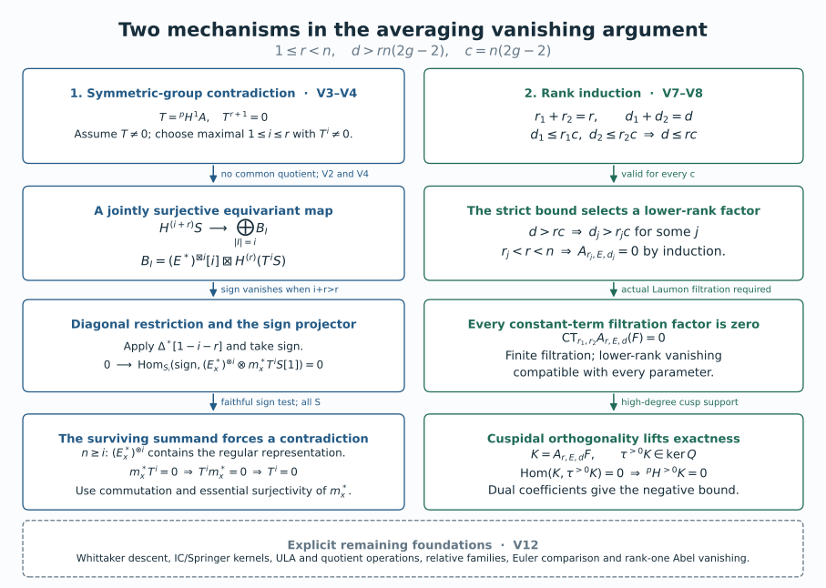
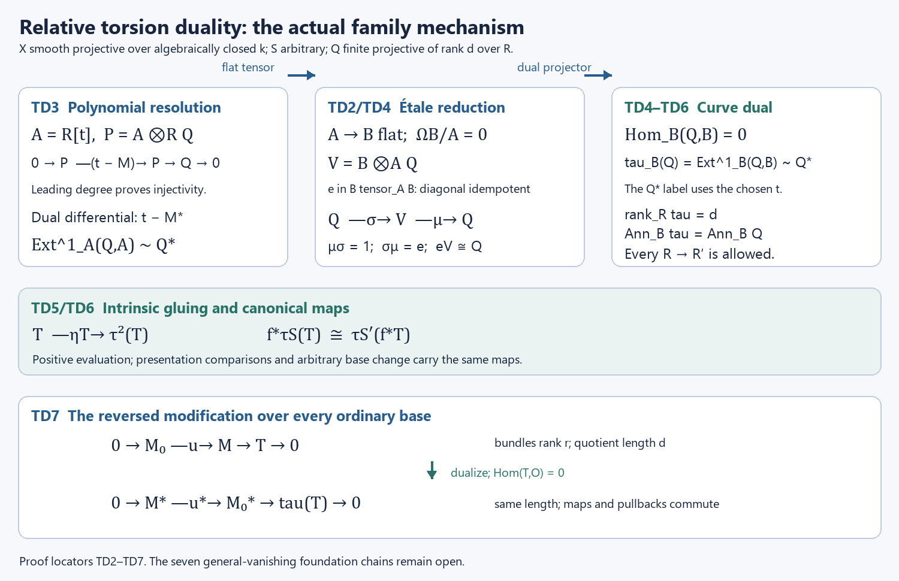

# The unramified correspondence for GL_n: Drinfeld, Laumon, Frenkel–Gaitsgory–Vilonen

*Written by GPT-6.1 Sol (OpenAI) in Codex, Ultra setting, October 2026. Draft under mathematical proof repair; full proof closure pending. Public domain (CC0).*

The passage from a local system on a curve to an automorphic sheaf uses modifications of bundles, a sheaf on torsion quotients, and a Whittaker construction. Vanishing removes unwanted lower-rank contributions. Descent then removes the auxiliary section used by the construction, and a separate compatibility argument supplies the Hecke eigenstructure.

This lesson proves the kernel reformulation, the ordinary rank-one modification geometry on arbitrary bases, and conditional Laumon and Abel comparisons with exact shifts. It also supplies the all-rank symmetric-group and adjunction deductions under their exact geometric hypotheses, proves the formal Euler descent steps, and computes an adelic Whittaker coefficient. Its complete higher-rank vanishing and automorphic construction proofs remain open. The hypotheses of each conditional result and the remaining full scope are stated explicitly.

## 1. The theorem and the averaging problem

Let \(X\) be a smooth projective connected curve of genus \(g\). In the geometric arguments below, the base field is algebraically closed of characteristic zero. The arithmetic example instead uses a curve over \(\mathbf F_q\). The historical étale construction uses characteristic-zero \(\ell\)-adic coefficients, \(\ell\ne\operatorname{char}k\), and, in the formulation discussed here, \(g>1\). A de Rham statement requires the corresponding stack categories, kernels and realization comparisons; it is not obtained by changing the coefficient notation in an étale proof.

Write \(\operatorname{Bun}_r\) for the stack of rank-\(r\) vector bundles, retaining their isomorphisms. A local system \(E\) has rank \(n\); that integer is independent of the modification rank \(r\). The **classical unramified existence target** is a nonzero perverse Hecke eigensheaf attached to an irreducible \(E\), simple on every degree component of \(\operatorname{Bun}_n\), with coherent eigenmaps. The standard-representation equation is
\[
\mathsf H_{\mathrm{std}}(\operatorname{Aut}_E)
\simeq E\boxtimes\operatorname{Aut}_E,
\tag{T7.1}
\]
and it must respect the tensor, permutation and factorization compatibilities in [Hecke functors and Hecke eigensheaves](hecke-functors-and-hecke-eigensheaves.md). The existence statement is formulated in Frenkel–Gaitsgory–Vilonen, §1.2. Its construction, the vanishing proof and the characteristic-zero comparison are required work in this lesson, rather than mathematical inputs supplied by that citation.

For an inclusion \(M\hookrightarrow M'\) with torsion quotient of length \(d\), name the two maps by
\[
a(M,M',\iota)=M,\qquad b(M,M',\iota)=M',
\qquad u(M,M',\iota)=M'/M.
\tag{T7.2}
\]
Positive averaging has the normalization
\
\mathsf A_{r,E}^d(F)
=b_!(a^*F\otimes u^*\mathcal L_E^d)[rd.
\tag{T7.3}
\]
Here \(\mathcal L_E^d\) is the intermediate-extension Laumon complex specified in §4. The half Tate twist is included only in an arithmetic convention with a chosen half twist. It is omitted in the de Rham theory. The underlying symmetric complex \(E^{(d)}\) is unshifted; its perverse normalization on \(X^{(d)}\) is \(E^{(d)}[d]\).

The **vanishing target** is
\[
\mathsf A_{r,E}^d=0
\quad\text{for irreducible }E\text{ of rank }n,\quad
1\le r<n,\quad d>rn(2g-2).
\tag{T7.4}
\]
Frenkel–Gaitsgory–Vilonen, §2.3, states this positive-direction problem. Gaitsgory, §1.2, uses the opposite direction, \(a_!(b^*F\otimes u^*\mathcal L_E^d)[rd]\). Comparing their zero assertions requires the matching adjoint and duality geometry; the kernel criterion below is proved directly for our fixed direction.

Our rank-one elementary Hecke operator in Lesson 4 evaluates \(F(L(-x))\) at \(L\). Consequently the positive-Abel local system \(C_E\), with \(a_d^*C_E=E^{(d)}\), has eigenvalue \(E^\vee\), and the \(E\)-eigenobject is \(C_{E^\vee}\). This convention is distinct from the reversed bundle projections in the historical Hecke formula. The Abel convolution in (T7.3) uses \(C_E\) without replacing it by its dual.

The proof programme for (T7.1) has five substantive parts: the global torsion-flag and Laumon construction; the Whittaker object on the compactification; cleanness and descent; coherent Hecke compatibility and cuspidality; and (T7.4), including the finite-field and characteristic-zero arguments. Sections 2–6 prove specific steps within this programme. They do not establish the five parts merely by listing them.

## 2. The averaging kernel and its fibres

Let \(X\) be a smooth projective connected curve over an algebraically closed field \(k\). In the étale version the coefficient field \(\Lambda\) has characteristic zero, with residue characteristic invertible on \(X\). Let \(r\geq1\) and \(d\geq0\). The stack \(\operatorname{Mod}_r^d\) has objects
\[
(M,M',\iota:M\hookrightarrow M'),\qquad
\operatorname{rank}M=\operatorname{rank}M'=r,\quad
\operatorname{length}(M'/M)=d.
\]
For families the quotient is required to be flat over the parameter, finite over it, and of relative length \(d\). Write \(a(M,M',\iota)=M\), \(b(M,M',\iota)=M'\), and \(u(M,M',\iota)=M'/M\). Thus the two bundle maps are named by what they retain, with no implicit reversal of their roles.

For a specified complex \(Q\) on \(\operatorname{Mod}_r^d\), define the positive averaging operation
\[
\mathsf A_Q(F)=b_!(a^*F\otimes Q),\qquad
K_Q=(a,b)_!Q.
\tag{A1}
\]
In the Laumon application \(Q=u^*\mathcal L_E^d\). The conventional dimension shift \([rd]\), and the half Tate twist when chosen, are invertible operations. They do not affect any zero assertion below. They must be restored when comparing actual functors and their eigenvalue normalizations.

### 2.1. The formal sheaf hypotheses

Assume that the constructible sheaf categories and the indicated finite-type maps have the following operations and identities:

1. Pullback and direct image with compact supports, their composition identities, Cartesian base change \(g^*f_!\simeq f'_!g'^*\), and the projection formula \(f_!(P\otimes f^*R)\simeq f_!P\otimes R\).
2. Fibre evaluation at a geometric point identifies its pullback of \(f_!P\) with \(R\Gamma_c\) of the fibre with the pulled-back complex.
3. A collection of point pullbacks detecting zero on the two bundle stacks and their product, with every point extension \(i_!\Lambda\) used below admitted as an object. One may use all geometric points in a sheaf theory stable under the associated base extensions, or closed \(k\)-points when constructibility on finite-type smooth charts proves they detect zero.

These are mathematical hypotheses of the following conditional theorem. A source citation alone does not establish them for an algebraic stack or for the inverse-limit constructible category on \(\operatorname{Bun}_r\). That extension remains part of Lesson 7's supporting proof obligations.

### 2.2. The kernel criterion

**Proposition A.** Under those hypotheses, the following statements are equivalent:

- \(\mathsf A_Q\) is the zero functor.
- \(\mathsf A_Q(i_!\Lambda)=0\) for every detecting input point \(i\).
- \(K_Q=0\).
- Every point fibre \(R\Gamma_c(\operatorname{Hom}^0(M,M'),Q_{M,M'})\) is zero.

Here \(Q_{M,M'}\) is the pullback to the fibre and \(\operatorname{Hom}^0\) denotes injective maps \(M\to M'\), in that direction.

**Proof.** Put \(f=(a,b)\), and let \(p_1,p_2\) be the two projections from the product of bundle stacks. Composition and the projection formula give
\[
\begin{aligned}
\mathsf A_Q(F)
 &= (p_2f)_!(Q\otimes f^*p_1^*F)\\
 &\simeq p_{2,!}(K_Q\otimes p_1^*F).
\end{aligned}
\tag{A2}
\]
Hence \(K_Q=0\) implies \(\mathsf A_Q=0\). A zero functor is zero on every point extension.

Fix an input point \(i:\operatorname{Spec}k\to\operatorname{Bun}_r\) representing \(M\). Cartesian base change for \(a^*i_!\), followed by the projection formula on that Cartesian square, identifies the averaging of \(i_!\Lambda\) with the direct image of \(Q\) on the fibre of \(a\). Pulling that object back to an output point \(j:\operatorname{Spec}k\to\operatorname{Bun}_r\) representing \(M'\) and applying the fibre identity gives
\[
j^*\mathsf A_Q(i_!\Lambda)
 \simeq R\Gamma_c\!\left(
      \operatorname{Mod}_r^d\times_{\operatorname{Bun}_r\times\operatorname{Bun}_r}
      (M,M'),\,Q_{M,M'}\right).
\tag{A3}
\]
Applying the same fibre identity directly to \(f_!Q\) gives exactly the same complex for \((i,j)^*K_Q\). Thus zero on all point extensions forces every detecting point pullback of \(K_Q\) to be zero, and point conservativity forces \(K_Q=0\). The fibre description proved next identifies (A3) with the last assertion. Conversely that last assertion makes every point pullback of \(K_Q\) zero, hence makes \(K_Q\) zero. All implications have now been proved. \(\square\)

The argument does not require that a point of a bundle stack be a closed immersion. In particular \(i_!\Lambda\) is a complex defined by the point map, not a presumed degree-zero sheaf supported on an ordinary closed point.

### 2.3. The actual geometric fibre

Fix bundles \(M,M'\) over \(k\) with \(\deg M'-\deg M=d\). The fibre in (A3) is the scheme
\[
\operatorname{Hom}^0(M,M')
 \subset H^0(X,M^\vee\otimes M').
\tag{A4}
\]
Indeed an object of the fibre includes identifications of its two bundles with the fixed bundles. After those identifications the only datum is \(\iota:M\to M'\). An automorphism respecting both identifications is the identity. This removes the bundle automorphism groups from this particular fibre; replacing it with their quotient would give a different cohomology problem.

To verify the openness, apply the determinant to the universal linear combination of a basis of \(H^0(X,M^\vee\otimes M')\). Its coefficients in \(H^0(X,\det M'\otimes\det M^{-1})\) are polynomial functions on that affine space. The condition that they all vanish is closed. Its complement is exactly the maps with nonzero generic determinant, which are injective: in the local domains of the integral smooth curve a matrix with nonzero determinant has zero kernel, by its adjugate identity.

At a closed point the local ring is a discrete valuation ring. Row and column operations reduce an injective square matrix to a diagonal matrix with entries \(t^{e_i}\) times units. Here is the reduction: choose an entry of least valuation, put it first by permutations, and subtract its multiples from its row and column; least valuation makes these divisions elements of the valuation ring. Continue on the smaller square matrix. The cokernel length is therefore \(\sum_i e_i\), which is the valuation of the determinant. Summing at all points gives \(d\). Thus a \(k\)-point of the open set has precisely the required torsion quotient.

For the scheme identity on all test schemes, use the universal map on this Noetherian open affine parameter. Its determinant is a fibrewise nonzerodivisor. The relative Cartier and flatness criterion makes its quotient flat over the parameter; its fibres have the constant length \(d\), and its finite support over a proper curve makes that support finite over the parameter. These are the explicit earlier relative-Cartier and coherent-flatness inputs still requiring proof-anchor verification. Pullback preserves the exact sequence because its quotient is flat. Conversely any family in the stack fibre is a map to the affine Hom scheme, and its fibrewise injectivity puts it in this open set. The constructions and their identifications are inverse after every base change. This proves (A4) relative to those stated algebraic foundations.

## 3. Rank-one modifications in families

Let \(X\) be a smooth connected projective curve over an algebraically closed field \(k\) of characteristic zero. The parameter scheme \(S\) in the geometric assertions is arbitrary: it need not be reduced, Noetherian, or of finite type. A finite flat family of degree \(d\) means finite locally free of rank \(d\). Coherent families are finitely presented. The notation \(\mathcal P\) denotes the **Picard stack**, retaining line-bundle automorphisms; \(P\) denotes a rigidified Picard scheme only when a rigidification has actually been chosen.

The proofs N1–N5 below take \(d\ge1\). For \(d=0\), the only divisor is empty, \(X^{(0)}=\operatorname{Spec}k\), the only torsion family is zero, and a modification is an isomorphism of lines. Thus \(\operatorname{Mod}_1^0\simeq\mathcal P\), \(G_0\) is trivial, and all formulas hold with \(E^{(0)}=\Lambda\).

The torsion-family calculation uses a finitely presented sheaf carried by a finite \(S\)-scheme whose pushforward to \(S\) is finite locally free of rank \(d\). This is exactly the family type obtained from every modification in the question. If \(\operatorname{Coh}_0^d\) is instead defined by proper support, flatness and zero-dimensional geometric fibres, one must additionally prove that its support is finite and its pushforward finite locally free on arbitrary bases. We do not infer that assertion from the fibre description. N6 records the matching full-stack foundation still needed for that convention.

The modification rank in this module is one. The rank of the local system \(E\) may be any positive integer \(n\). In particular the rank-one averaging problem for an irreducible \(E\) of rank \(n>1\) is included; it is not confused with the separate case \(\operatorname{rank}E=1\).

The all-family geometry is proved first. The Laumon and Abel comparison then uses the exact sheaf hypotheses N6 in §4.1. The full higher-rank construction retains the obligations in §8.

### 3.1. Graphs and sums of graphs over arbitrary bases

We first specify the local curve algebra used throughout the geometric proof. Over any algebraically closed field extension of \(k\), AG-CA-18, Theorem 2.1 and Proposition 3.1, give a regular local ring \(A\) of dimension one and a one-dimensional cotangent space at a closed curve point. Nakayama gives \(\mathfrak m_A=(u)\): the finite quotient by a cotangent-basis lift equals its product with the maximal ideal, and the adjugate of the identity minus a coefficient matrix makes a unit kill every generator. The generator is not nilpotent, since nilpotence would make every prime maximal and the dimension zero. The actual Krull-intersection proof in AG-CA-03, Theorem 6.1, gives \(\bigcap_nu^nA=0\). Every nonzero element consequently has the form \(u^mv\) with \(v\) a unit, and products of two such elements are nonzero. Thus \(A\) is a DVR. Every nonzero ideal is \((u^m)\), by choosing its least element valuation. Iterative subtraction of residue-field constants and division by \(u\) identify its completion with the power-series ring. These arguments supply both the power-ideal classification and the completed curve parameter used below; neither is inferred from divisor points alone.

If \(x:S\to X\) is a section of \(X_S\to S\), its graph \(\Gamma_x\) is a relative Cartier divisor. Here is a proof that includes nilpotent bases. Around a point of its image choose an étale coordinate \(t:U\to\mathbf A^1_k\). Such coordinates follow from the standard smooth presentation of a curve: add the chosen local differential generator to the invertible Jacobian minor. The resulting square presentation is étale by the actual lifting proof in AG-CA-17, Theorems 4.1–5.1. After shrinking \(S\), the section lands in \(U\). In \(U_S\) the inverse image of \(T-t(x)\) is Cartier: the polynomial \(T-t(x)\) is a nonzerodivisor in \(\mathcal O_S[T]\), and the étale coordinate map is flat over every base, by AG-CA-18, Theorem 6.1 and Corollary 6.2.

The graph is an open and closed part of that inverse image. Indeed that inverse image is étale over \(S\), and its section is open by the open-diagonal proof of AG-FSE-03, Theorem 4.1, and closed by separatedness. Near the graph it is the whole inverse image, and away from the graph the graph ideal is the unit ideal. This proves that its ideal \(I_x\) is invertible and its inclusion into \(\mathcal O_{X_S}\) is injective. Its quotient is \(x_*\mathcal O_S\), so is finite flat of rank one. These arguments commute with arbitrary base change.

For \(d\) sections, form

\[
I_D=I_{x_1}\cdots I_{x_d},
\qquad D=\Gamma_{x_1}+\cdots+\Gamma_{x_d}.
\tag{N1.1}
\]

The product ideal is invertible and generated locally by a product of nonzerodivisors. It is therefore Cartier even when sections collide. Flatness and finiteness need not be deduced merely from its geometric fibres. Near a parameter point choose one affine open \(U\subset X\) containing the finitely many images of the sections, and shrink the parameter so that all sections remain in \(U\). Such a common affine exists by taking a hyperplane complement in a projective embedding that avoids those images. In the affine \(U_S\), the successive quotients in the filtration by products of graph ideals are

\[
(I_{x_1}\cdots I_{x_{j-1}})/(I_{x_1}\cdots I_{x_j})
\simeq (I_{x_1}\cdots I_{x_{j-1}})|_{\Gamma_{x_j}}.
\tag{N1.2}
\]

They are line bundles over \(S\), supported on the corresponding graph. The coordinate module of \(D\) is consequently a successive extension of \(d\) finite projective modules of rank one. Locally on the affine base these extensions split as modules, since their quotients are projective. It is finite locally free of rank \(d\). The same calculation proves compatibility of the ideal sequence with every base change. Thus (N1.1) gives a genuine family of degree \(d\), rather than just the right divisor on each geometric fibre.

### 3.2. Finite flat subschemes of the curve and their parameter scheme

First construct the length-\(d\) Hilbert functor directly on an affine \(U=\operatorname{Spec}A\), where \(A=k[z_1,\ldots,z_m]/J\). A finite locally free quotient \(A\otimes R\twoheadrightarrow B\) of rank \(d\) has, locally on \(\operatorname{Spec}R\), a basis consisting of monomials in the \(z_i\), including \(1\). Monomials of total degree at most \(d-1\) suffice on every field fibre: their increasing spans start in dimension one, and once two consecutive spans agree, multiplication by each generator shows that the span is the whole quotient. There can be at most \(d-1\) strict increases. A selected fibre basis remains a basis after inverting its determinant in a local trivialization of \(B\).

For each selected list \(m_1=1,m_2,\ldots,m_d\), introduce \(d\times d\) matrices \(Z_i\). Impose the finite polynomial equations

\[
[Z_i,Z_j]=0,
\qquad f(Z_1,\ldots,Z_m)=0\quad(f\text{ in a finite generating list of }J),
\qquad m_j(Z)e_1=e_j.
\tag{N2.1}
\]

These equations represent that basis chart on **all** rings \(R\). The homomorphism \(A\otimes R\to R^d\), \(a\mapsto a(Z)e_1\), is onto by the last equations. Its kernel is an ideal because the matrices commute. It gives a quotient algebra, with its prescribed basis; conversely multiplication in any such quotient gives these matrices. For a different monomial basis, the change-of-basis determinant defines an open overlap, and matrix conjugation gives the inverse transition maps. There are finitely many lists to consider. This constructs the finite-type affine Hilbert scheme and its universal finite locally free quotient.

For the projective curve these schemes glue on the condition that the finite family lies in a common affine open. This condition is open on the parameter: the part of a finite family lying in the closed complement has closed image under a finite map. The elementary closedness of finite maps follows from integrality and lying over, the actual proof in AG-CA-05. A finite affine cover sufficient for this gluing can be chosen: choose \(d+1\) hyperplane sections with pairwise disjoint finite supports. A support of at most \(d\) points misses one of them and lies in its affine complement. The hyperplanes can be chosen successively avoiding all previous finite supports and not containing the curve: these exclusions are finitely many proper linear conditions over the infinite field. Hence the glued scheme \(H_d\) is of finite type and represents the finite locally free degree-\(d\) closed-subscheme functor, including every ordinary base change.

Every such family on a smooth curve is in fact a relative Cartier divisor. We prove this without importing the fibrewise Cartier criterion. Fix a parameter point, pass to a common affine \(U\) for the finite support, and choose a regular function \(t\) on \(U\) whose differential is nonzero at each support point and whose values distinguish the geometric support points. A suitable \(k\)-linear combination of affine coordinates does this: each prohibited equality or vanishing differential is a proper linear condition over the geometric residue field. A finite union of such conditions cannot exhaust the \(k\)-rational coefficient tuples, since \(k\) is infinite and polynomial interpolation shows those tuples are Zariski dense even after a field extension. Shrink \(U\) so that \(t:U\to\mathbf A^1\) is étale at the whole support.

On the chosen field fibre, each local quotient is a quotient of a DVR, hence a power of its parameter ideal. The étale coordinate and distinct values show that

\[
1,t,\ldots,t^{d-1}
\tag{N2.2}
\]

is a basis of its length-\(d\) algebra. After shrinking the parameter, it is a basis of the entire finite flat algebra \(B\). Multiplication by \(t\) has a unique monic relation \(P(T)\) of degree \(d\); division by this relation gives

\[
B\simeq R[T]/(P(T)).
\tag{N2.3}
\]

The closed subscheme \(D\subset U_R\) is a section of \(V(P(t))\to\operatorname{Spec}B\), which is étale and separated. Its image is an open and closed component, by the same section argument as N1. Since \(U_R\) is flat over \(R[T]\), the monic polynomial \(P\) remains a nonzerodivisor on it. Near this component its ideal is \((P(t))\); elsewhere its ideal is the unit ideal. Thus \(D\) is Cartier. This proves the identification of \(H_d\) with relative effective divisors of degree \(d\) on arbitrary bases.

### 3.3. The symmetric power identifies this full divisor functor

On a common affine \(U^d=\operatorname{Spec}B\), form \(\operatorname{Spec}B^{\mathfrak S_d}\). Each element \(b\) of \(B\) satisfies the monic polynomial \(\prod_\sigma(T-\sigma b)\) with invariant coefficients. The finitely many \(k\)-algebra generators also generate \(B\) over its invariant subring; their monic equations bound their exponents, giving a finite module generating list. Thus the quotient map is finite. Finite generation of the invariant ring follows from the actual Artin–Tate proof in AG-CA-06, Theorem 1.1. Geometric fibres are the orbits: over an algebraically closed field the Chinese remainder theorem separates two distinct finite orbits, and averaging a separating function over the group separates them by an invariant. Invariants commute with field extension, since they are the kernel of the finite list \(b\mapsto\sigma b-b\).

Images of invariant opens are open: the complement is invariant and its finite image is closed. On an invariant open, invariant regular functions are precisely functions on the quotient. To check this last assertion on a principal open of the quotient, localize the kernel description of invariants at the invariant denominator. A general invariant open is covered by these principal opens. Therefore invariant morphisms to an arbitrary scheme descend: take the inverse images of affine target opens, use the preceding invariant-open quotients, factor their ring maps through invariants, and glue. This proves the required categorical universal property, not an assertion of flat descent through a ramified quotient. The affine quotients glue to \(X^{(d)}\).

The all-family sum of graphs from N1 defines an invariant morphism \(X^d\to H_d\). Its categorical factorization is

\[
a:X^{(d)}\longrightarrow H_d.
\tag{N3.1}
\]

We check its infinitesimal structure, following the actual completed-local argument in AG-HP-05, Theorem 7.1, while N1–N2 supply its all-base flatness and representability inputs. At a divisor \(\sum_i d_i p_i\), an embedded deformation over a local Artinian \(k\)-algebra \(R\) splits into its support clusters: special-fibre idempotents lift uniquely through the nilpotent maximal ideal, by iteration of the actual square-zero formula in AG-CA-17, Lemma 6.2. Their products and sum are preserved, since the lifts of the zero and unit idempotents are unique. In a completed parameter \(u_i\), each cluster is a free quotient with basis \(1,u_i,\ldots,u_i^{d_i-1}\), and one unique relation

\[
u_i^{d_i}+a_{i,1}u_i^{d_i-1}+\cdots+a_{i,d_i}=0,
\qquad a_{i,j}\in\mathfrak m_R.
\tag{N3.2}
\]

Conversely every such relation gives a free quotient. If \(\mathfrak m_R^N=0\), it gives \(u_i^{d_iN}=0\), so series evaluate as finite polynomials. The Hilbert completion is therefore \(k[[a_{i,j}]]\).

Let \(A\) be the Noetherian local invariant ring at the divisor with maximal ideal \(\mathfrak m\), and let \(B\) be the finite algebra upstairs after localization by \(A\). Its maximal ideals \(\mathfrak q_1,\ldots,\mathfrak q_r\) are the orbit points above \(\mathfrak m\). Put \(J=\bigcap_i\mathfrak q_i\). The finite-dimensional algebra \(B/\mathfrak mB\) is Artinian, so AG-CA-03 Lemma 4.1 gives \(J^N\subset\mathfrak mB\) for some \(N\). Since \(\mathfrak mB\subset J\), these two adic topologies are cofinal. Distinct maximal ideals and their powers are comaximal; the explicit Chinese-remainder argument in AG-CA-03 Theorem 4.2 gives
\[
B/J^n\simeq\prod_i B/\mathfrak q_i^n.
\]
In \(B/\mathfrak q_i^n\), every denominator outside \(\mathfrak q_i\) is a unit, because this quotient has its unique maximal ideal \(\mathfrak q_i/\mathfrak q_i^n\). Its inverse limit is therefore \(\widehat{B_{\mathfrak q_i}}\). AG-CA-19 Theorem 3.1 identifies completion of the finite \(A\)-module \(B\) with \(\widehat A\otimes_A B\), yielding
\[
\widehat A\otimes_A B\simeq\prod_i\widehat{B_{\mathfrak q_i}}.
\]
Flatness of \(\widehat A/A\) preserves the finite kernel defining invariants. The group permutes the product factors transitively; an invariant tuple is determined by its value in one factor, fixed by that factor's stabilizer. This proves the stabilizer-invariants step without flatness of the ramified quotient.

Completion of the finite invariant quotient gives the invariants of the product of completed local rings over the orbit. Indeed completion is flat, by AG-CA-19, Theorem 3.2, and preserves the finite kernel defining invariants. The group permutes the orbit factors transitively; its invariants are the invariants of one factor under the stabilizer \(\prod_i\mathfrak S_{d_i}\). The elementary symmetric-polynomial algorithm consequently gives

\[
\widehat{\mathcal O}_{X^{(d)},D}
=k[[u_{i,1},\ldots,u_{i,d_i}]]^{\prod_i\mathfrak S_{d_i}}
=k[[e_{i,1},\ldots,e_{i,d_i}]].
\tag{N3.3}
\]

For completeness, in the polynomial algorithm the largest monomial of a symmetric homogeneous polynomial has sorted exponents \(m_1\ge\cdots\ge m_d\). The product \(e_1^{m_1-m_2}\cdots e_d^{m_d}\) has precisely that leading monomial. Subtract its coefficient and continue in the finite set of monomials of that degree. Apply the result to each homogeneous piece of an invariant series. The positive weights of the \(e_j\) make the weighted-degree and power-series completions agree. Algebraic independence follows from the distinct leading monomials. This proves (N3.3), including its scheme structure.

The map (N3.1) takes \(a_{i,j}\) to \((-1)^j e_{i,j}\), so is an isomorphism on these completions. Here is the exact passage to schemes. For the local map \(A\to D\), the isomorphic completions make \(\widehat D\) flat over \(A\); faithful flatness of \(D\to\widehat D\) detects flatness of \(D/A\). The cotangent map is an isomorphism, so the finite relative differential module has zero residue fibre and is zero locally by Nakayama. AG-FSE-04, Lemma 1.2, whose actual Jacobian-and-flat-kernel proof applies to finite presentations, therefore makes the morphism étale at these points. The non-étale locus of a finite-type morphism over \(k\) is closed and any nonempty such locus has a closed point, so the morphism is étale everywhere.

On geometric points (N3.1) is bijective, because finite-colength ideals in a DVR are unique parameter powers. This remains true after every algebraically closed field extension. Thus it is universally injective. The actual open-diagonal argument of AG-FSE-03, Proposition 6.1, makes an unramified universally injective map a monomorphism. AG-FSE-04, Theorem 4.1, then proves it is an open immersion; surjectivity on geometric points makes it an isomorphism. Both schemes are smooth of dimension \(d\): choose actual local functions lifting the coordinates of the power-series completions. Their formal coordinate map has invertible linear term and hence an inverse constructed degree by degree. The same completed-local étale criterion gives an étale map to \(\mathbf A^d\).

We have proved an isomorphism of representing schemes, so Yoneda now gives, for every ordinary scheme \(S\),

\[
X^{(d)}(S)
\simeq\{D\subset X_S:\ D\text{ relative effective Cartier, finite locally free of degree }d\}.
\tag{N3.4}
\]

This conclusion includes nilpotent and non-Noetherian bases. It is not being inferred from geometric divisor points alone.

### 3.4. Modifications and all their arrows

An \(S\)-object of \(\operatorname{Mod}_1^d\) is an inclusion \(\iota:L\hookrightarrow L'\) of line bundles on \(X_S\) with finite flat quotient of relative length \(d\). Locally it is multiplication by a nonzerodivisor \(f\): injectivity is part of the definition, and both bundles are free of rank one there. The image ideal of \(L\otimes(L')^{-1}\to\mathcal O_{X_S}\) defines a Cartier divisor \(D\). Its quotient is locally the given quotient tensored with an invertible module; it is therefore flat over \(S\), finite over \(S\), and of degree \(d\). Thus N3 applies.

On an affine parameter let \(Z=\operatorname{Spec}B\) be a finite scheme carrying the quotient, and let \(M\) be its pushforward, finite projective of rank \(d\) over the parameter ring \(R\). The restriction of an invertible sheaf to \(Z\) is a finite projective rank-one \(B\)-module \(N\), hence a direct summand of a finite \(B^m\). Thus \(M\otimes_B N\) is a direct summand of \(M^m\), and is finite projective over \(R\). On each residue-field fibre, \(B\otimes_R\kappa\) is semilocal Artinian and \(N\otimes_R\kappa\) is free of rank one on it; the tensor still has dimension \(d\). The twisted pushforward is therefore finite locally free of rank \(d\). Applying the inverse twist shows that its annihilator is unchanged. In N5's cyclic description the sheaf is invertible over the divisor algebra, so its annihilator is the divisor ideal. The exact quotient sequence remains exact after arbitrary base change because that algebra is \(R\)-flat; hence its ideal and the cyclic annihilator commute with base change too.

The image identification gives canonically

\[
L'\simeq L(D),
\quad\text{carrying }\iota\text{ to the canonical inclusion.}
\tag{N4.1}
\]

Conversely \((L,D)\) gives that inclusion. Flatness of its quotient makes its exact sequence stay exact after every base change.

An arrow between inclusions is a pair of line-bundle isomorphisms making the square commute. The image ideals show that it preserves \(D\); after this identification its target isomorphism is forced to be the source isomorphism tensored with the identity of \(\mathcal O(D)\). Conversely every such source isomorphism gives the arrow. These two constructions are inverse on objects, arrows and pullbacks. Hence

\[
\boxed{\operatorname{Mod}_1^d\simeq\mathcal P\times X^{(d)}}.
\tag{N4.2}
\]

Under this equivalence,

\[
a(L,D)=L,
\qquad b(L,D)=L(D),
\qquad u(L,D)=L|_D\otimes\mathcal O_D(D).
\tag{N4.3}
\]

Line-bundle automorphisms remain in \(\mathcal P\). In particular (N4.2) is not an identification with a product of Picard **schemes**.

### 3.5. The regular torsion stack and the quotient twist

The cyclic definition matches the regularity criterion in the source, \(\dim\operatorname{End}(T)=d\). At a geometric support point the DVR proof in N1 gives a decomposition \(T=\bigoplus_jA/(u^{e_j})\): take a finite presentation, move an entry of least valuation to the first position, clear its row and column using its divisibility of the other entries, and repeat on the remaining finite matrix. Torsion excludes a free summand. Since \(\operatorname{Hom}_A(A/(u^a),A/(u^b))\) is the subspace killed by \(u^a\), it has dimension \(\min(a,b)\). Hence

\[
\dim\operatorname{End}(T_p)
=\sum_{i,j}\min(e_i,e_j)
=\operatorname{length}(T_p)+\sum_{i\ne j}\min(e_i,e_j).
\tag{N5.0}
\]

Different support points have no cross homomorphisms, since coprime support ideals annihilate them. Equality with the length holds precisely when each support module has one cyclic summand. This verifies the source's pointwise label; the family and arrow assertions still require the following separate proof.

Call a geometric length-\(d\) torsion sheaf regular if at each support point it is cyclic over the local curve ring. For a family with this fibre property, we now prove its full family description. Choose a common affine coordinate \(t\) as in N2, separating the geometric supports and étale there. On the residue-field fibre, the module is cyclic over the residue-field polynomial ring in \(t\), with degree-\(d\) annihilator. Choose a cyclic vector. It exists over the residue field itself: the bad vectors satisfy finitely many proper linear conditions after an algebraic closure, and the residue field is infinite. Lift that vector locally on the parameter. The determinant of

\[
v,tv,\ldots,t^{d-1}v
\tag{N5.1}
\]

is invertible near the chosen parameter point. These are therefore a basis of the finite flat family module. Its \(t\)-action gives \(B=R[T]/(P)\), and identifies the module with \(B\) through this vector. Every affine coordinate of \(X\) acts by an operator commuting with \(T\). Such an operator is multiplication by its value on \(1\), because \(1,T,\ldots,T^{d-1}\) generate \(B\). Hence the whole coordinate-ring action factors through a quotient algebra \(A\otimes R\twoheadrightarrow B\).

N2 makes the corresponding \(D\) a finite flat Cartier divisor. It is intrinsically the annihilator subscheme of the original module; changing the cyclic vector multiplies the resulting local generator by a unit of \(B\). Thus the original sheaf is canonically a line bundle on \(D\), pushed to \(X_S\). Conversely a line bundle on such a \(D\) gives a flat regular torsion family. Every isomorphism preserves its annihilator and is precisely a line-bundle isomorphism on \(D\). This proves the groupoid equivalence on arbitrary bases, not merely its classification on points. The determinant construction also proves that the regular condition is open in any finite flat torsion family.

Over \(X^{(d)}\), put \(B=p_*\mathcal O_D\) for the universal divisor and let

\[
G_d=\operatorname{Res}_{D/X^{(d)}}\mathbf G_m.
\tag{N5.2}
\]

This group is the open locus \(\det(m_b)\ne0\) in the rank-\(d\) vector bundle \(B\): an element is a unit exactly when its multiplication matrix is invertible. It is therefore smooth of relative dimension \(d\), including over arbitrary bases. A line bundle on the finite divisor is locally trivial over the parameter: on each residue fibre its semilocal finite algebra has a generator, and a lifted generator remains a basis after inverting its determinant. Thus the preceding groupoid is the neutral gerbe

\[
\operatorname{Coh}^{d,\mathrm{reg}}_0\simeq B_{X^{(d)}}G_d,
\tag{N5.3}
\]

neutralized by the line \(\mathcal O_D(D)\). Its section

\[
\xi:X^{(d)}\longrightarrow\operatorname{Coh}^{d,\mathrm{reg}}_0,
\qquad D\longmapsto\mathcal O_D(D),
\tag{N5.4}
\]

is a smooth cover of relative dimension \(d\). Its pullback to an object is the unit torsor of its line bundle, which supplies the asserted smoothness directly. The stack assertion uses actual effective fppf descent of quasi-coherent modules: AG-DFG-02, Theorems 2.5 and 5.1, construct the descended module as the invariant equalizer and prove effectivity on all schemes; Proposition 3.1 descends finite presentation, flatness and rank-one local freeness. Applied to the finite divisor, these prove line-bundle descent including its arrows. Consequently (N5.3) is an equivalence of fppf stacks for the finite-family convention, rather than just a statement about fibre groupoids. The support map \(s\) satisfies \(s\xi=1\). The quotient in (N4.3) is another line on the **same** divisor, so

\[
s\circ u=\operatorname{pr}_{X^{(d)}}.
\tag{N5.5}
\]

This formula handles the twist by \(L|_D\). Pulling Laumon's sheaf back only along \(\xi\) would not by itself handle every \(L\).

For comparison with the flag formulation, a length-one flat torsion family is \(x_*N\), for a section \(x:S\to X\) and a line \(N\) on \(S\): locally its coordinate ring acts on a rank-one base module, hence through \(R\), which specifies the section. A surjection from a line bundle \(M\) to \(x_*N\) identifies \(N\) with \(M|_{\Gamma_x}\); its kernel is \(M(-\Gamma_x)\). Starting with the top line \(L'\) and successively taking these kernels proves that a full flat torsion flag in \(L'/L\) is exactly an ordered tuple \((x_1,\ldots,x_d)\) with sum divisor \(D\). This identifies the base change of the flag map, on all families and arrows, with

\[
\mathcal P\times X^d\longrightarrow\mathcal P\times X^{(d)}.
\tag{N5.6}
\]

It does not assert that a general Springer pushforward equals the intermediate-extension definition of Laumon's sheaf. That separate global comparison has its own sheaf-theoretic obligations.

## 4. Laumon restriction and averaging in every rank

### 4.1. The exact sheaf hypotheses still required

Fix a characteristic-zero coefficient field \(\Lambda\), and regard \(E\) as a local system in ordinary degree zero. The following hypotheses specify the precise remaining comparison boundary for the chosen sheaf theory. They must be proved for that theory and the indicated stacks before the conditional theorem below can be used without qualification.

1. Constructible derived categories on the schemes and stacks in the diagram, finite and proper base change, projection formula, composition of \(!\)-pushforwards, and conservative geometric-point pullbacks. Finite-map pushforward of a degree-zero local system has no higher ordinary cohomology, by its finite geometric fibres and this base change.
For every Cartesian square used in N8, require compact-support base change \(g^*f_!\simeq f'_!g'^*\), including the representable finite-type Abel map \(\mathrm{AJ}_d\), its smooth Picard-atlas base change, the line-frame torsor \(\pi\), and the exterior-product square for \(1\times\mathrm{AJ}_d\). Require these comparisons to agree with composition and projection formula. In particular require the induced comparison
\[
(1\times\mathrm{AJ}_d)_!(F\boxtimes E^{(d)})\simeq F\boxtimes(\mathrm{AJ}_d)_!E^{(d)}.
\]
Finite and proper base change alone do not supply this statement: the stack Abel map has nonzero-section fibres, which are generally not proper. These compact-support stack operations and their coherences remain part of the exact open foundation chain for the chosen theory.

2. Verdier duality commutes with finite proper pushforward and has the smooth orientation formula \(\mathbb D(E^{\boxtimes d}[d])=(E^\vee)^{\boxtimes d}d\) on \(X^d\) in the étale convention. Perverse upper bounds are the support-dimension bounds, lower bounds are their duals, and the resulting recollement has intermediate extension. Smooth pullback normalized by relative dimension is perverse exact, is conservative for smooth covers, and commutes with open \(!\)- and \(*\)-extension, including the atlas (N5.4).
3. The same stack operations apply to the Picard stack and its products, to the support gerbe in N5, and to the averaging and Abel maps. They include the algebraicity of the full torsion stack and the identification of its regular open with the finite-family gerbe of N5; in the proper-support convention this includes the finite-support and locally free pushforward theorem stated above. They also include extension to the chosen inverse-limit or presentable sheaf category on the locally finite-type Picard stack whenever the kernel criterion is asserted there. Bounded constructible calculations do not alone establish those extensions.

GL-PERV-02, Theorem 3.2, proves the abstract intermediate-extension uniqueness and full-faithfulness theorem from the recollement and t-structure axioms. Its proof is usable here for that categorical step. It does not establish the above algebraic-stack sheaf operations. The actual GL-PERV-10 theorem concerns Grothendieck–Springer maps for a connected complex reductive group, with separately specified arithmetic inputs. It cannot alone certify a torsion-stack Laumon/Springer comparison or a de Rham version. The precise missing foundations in this list remain open in this comparison.

No descent through the ramified quotient is included as an unstated hypothesis. We define its symmetric complex by the actual invariant pushforward, and prove the needed intermediate-extension comparison next under the displayed sheaf operations.

### 4.2. Symmetric complexes and the Laumon restriction

Let \(q:X^d\to X^{(d)}\) be the finite quotient, and define

\[
E^{(d)}=(q_*E^{\boxtimes d})^{\mathfrak S_d}.
\tag{N7.1}
\]

The action is the ordinary permutation action on the degree-zero external tensor factors; the shift \([d]\) is applied **after** that action. Permuting the already shifted factors \(E[1]\) would introduce the sign character and give a different convention. Invariants are the image of the idempotent \((d!)^{-1}\sum_\sigma\sigma\), hence a direct summand. This is where characteristic zero of coefficients is used.

On the distinct-point locus \(V\subset X^{(d)}\), the quotient is a finite étale \(\mathfrak S_d\)-torsor. This too can be checked scheme-theoretically: a free orbit has trivial stabilizer, so the same invariant completion calculation as N3 identifies the completed local map with an isomorphism. The completed-local criterion already proved in N3 gives étaleness. The map from the disjoint union of its deck graphs to \(X^d\times_VX^d\) is then an étale map bijective on geometric points, and the proved open-immersion criterion makes it an isomorphism. Here the needed descent of the particular local system can be proved directly under N6. Finite base change identifies \(q^*q_*E^{\boxtimes d}\) with the direct sum of its deck transforms. The equivariant action identifies that sum with copies of \(E^{\boxtimes d}\) indexed by the group. Its invariant subsheaf is the diagonal copy: projection to the identity copy has inverse sending a section to its equivariant translates. Pullback preserves the averaging idempotent, so this identifies \(q^*E_V^{(d)}\) with \(E^{\boxtimes d}\), including its given action. It is a local system because it becomes so on the surjective étale cover. This is effective descent of this complex on the free torsor, and supplies no flat quotient descent assertion across collisions.

Under N6, the perverse complex \(q_*E^{\boxtimes d}[d]\) is the intermediate extension of its restriction to \(V\). To prove this, its only ordinary cohomology sheaf is in degree \(-d\), and its support has dimension \(d\), giving the perverse upper bound. The smooth orientation and finite proper duality give the same upper bound for its dual, hence its perverse lower bound. On the collision boundary, of dimension at most \(d-1\), the same degree \(-d\) gives the strict perverse upper bound \(\le-1\); duality gives the strict costalk lower bound \(\ge1\). The actual abstract theorem GL-PERV-02, Theorem 3.2, identifies these two strict bounds with absence of boundary quotients and subobjects. Its direct summand of invariants has the same properties. Therefore

\[
E^{(d)}[d]\simeq j_{!*}(E_V^{(d)}[d]).
\tag{N7.2}
\]

This supplies the finite-quotient/intermediate-extension argument in the required normalization. It uses neither the decomposition theorem nor irreducibility of \(E\).

On the regular-semisimple torsion stack take the specified degree-zero local system \(s^*E_V^{(d)}\). This is its canonical support-tensor descent: on the cyclic atlas it is \(E_V^{(d)}\), and an arrow between torsion lines on the same divisor acts by the identity on the support tensor. The double-atlas comparisons are those identities; their unit and triple-cocycle equations are literal identities too. This specifies the generic descent including automorphisms, rather than deducing a sheaf on a gerbe from its point values. Let \(\mathcal L_E^d\) be the **intermediate extension** of this specified local system to \(\operatorname{Coh}_0^d\). Its regular-semisimple open has dimension zero by the dimension-d atlas of relative dimension d in N5; pulling that local system back by \(\xi\) gives \(E_V^{(d)}\), whose perverse normalization on \(V\) is \([d]\). This is the precise shift hidden by calling both complexes perverse without specifying their ambient dimensions.

Restrict to the regular open of N5. Smooth pullback by \(\xi\), shifted by \([d]\), commutes with intermediate extension under N6: apply its perverse exactness to the image of \({}^pH^0j_!\to{}^pH^0j_*\), using the open base-change identities. Equation (N7.2) gives

\[
\xi^*\mathcal L_E^d\simeq E^{(d)}.
\tag{N7.3}
\]

To include all line twists, put \(C=s^*E^{(d)}\) on the neutral gerbe. Its atlas pullback shifted by \([d]\) is \(E^{(d)}[d]\), hence is perverse and has no collision-boundary subobject or quotient. Conservativity and exactness of this smooth-cover pullback imply the same statements for \(C\): any such nonzero subobject or quotient would have a nonzero pullback. On the regular-semisimple open it is the descended local system used to define Laumon's complex. Intermediate-extension uniqueness therefore gives the canonical isomorphism on the whole regular torsion stack

\[
\mathcal L_E^d|_{\operatorname{Coh}^{d,\mathrm{reg}}_0}
\simeq s^*E^{(d)}.
\tag{N7.4}
\]

Combining with (N5.5) proves the actual needed all-modification comparison

\[
\boxed{u^*\mathcal L_E^d\simeq\operatorname{pr}_{X^{(d)}}^*E^{(d)}}.
\tag{N7.5}
\]

Its construction is natural in \(E\) and all arrows. Full faithfulness of intermediate extension fixes the isomorphism from its specified generic identification. Equation (N5.6) gives an alternative flag pushforward calculation after proper base change, but equating a globally constructed Springer complex with \(\mathcal L_E^d\) still requires its global smallness and IC theorem. The present proof closes this restriction by the cyclic atlas and the explicit finite quotient calculation, conditional exactly on N6.

### 4.3. Abel averaging, shifts, and the Picard gerbe

Define the stack Abel map and tensor-product map by

\[
\mathrm{AJ}_d:X^{(d)}\to\mathcal P^d,
\quad D\mapsto\mathcal O_X(D),
\qquad
\mathrm{mult}:\mathcal P\times\mathcal P^d\to\mathcal P,
\quad(L,H)\mapsto L\otimes H.
\tag{N8.1}
\]

These are morphisms in families, using the universal divisor just proved. Equations (N4.2)–(N4.3) identify the target-bundle map with \(\mathrm{mult}\circ(1\times\mathrm{AJ}_d)\). Composition and projection formula in N6, together with (N7.5), consequently give

\
\begin{aligned}
b_!(a^*F\otimes u^*\mathcal L_E^d)
&\simeq \mathrm{mult}_!\left(F\boxtimes(\mathrm{AJ}_d)_!E^{(d)}\right),\\
\mathsf A_{1,E}^d(F)
&\simeq \mathrm{mult}_!\left(F\boxtimes(\mathrm{AJ}_d)_!E^{(d)}\right)[d.
\end{aligned}
\tag{N8.2}
\]

The second line restores the conventional positive averaging shift and, when fixed in the arithmetic coefficient convention, half Tate twist. There is no additional \([d]\) inside \(E^{(d)}\) in this formula: (N7.1) is the unshifted symmetric complex, and (N7.2) describes its perverse normalization. In the characteristic-zero de Rham theory the Tate twist is absent; the corresponding functors and realization comparison must first be supplied.

There is an essential distinction from the ordinary Abel map \(a_d:X^{(d)}\to P^d\). At a geometric line-bundle class its effective divisors correspond to sections up to scalar; at a **specified line bundle with its identification**, the stack Abel fibre corresponds to nonzero sections retaining the scalar. The geometric fibres are therefore a projective complete linear system and its \(\mathbf G_m\)-torsor. The relative scheme statement additionally needs the complete-linear-system and fibrewise-Cartier foundations; a geometric-point description alone does not prove it. None of the calculations below substitutes the ordinary fibre for the stack fibre.

Assume the matching all-family Picard representability and normalized universal line, together with the universal-functions hypothesis \(\mathcal O_S\xrightarrow{\sim}(p_S)_*\mathcal O_{X_S}\) for every ordinary \(S\), have been supplied. This is precisely hypothesis (1.4) of actual AG-HP-09 Theorem 2.1. It makes every line automorphism a unique base scalar and every rigidified comparison unique. The associated Picard/cohomology foundation chain remains open here. The actual rigidified comparison in AG-HP-09, Theorem 2.1, shows how scalar automorphisms and base-line twists are removed, using effective fppf descent; its broader representability and cohomology foundations remain a separate chain. Let \(j:P^d\to\mathcal P^d\) be the normalized universal family, a smooth cover of the Picard gerbe. Write \(\mathcal U\) for its universal line, normalized at the fixed point \(x_0\in X(k)\), and \(R=\mathcal O(D)|_{\{x_0\}\times X^{(d)}}\) for the restriction of the universal divisor line. The normalized line \(\mathcal O(D)\otimes p^*R^{-1}\) and the pullback of \(\mathcal U\) along \(a_d\) represent the same rigidified class. Rigidified uniqueness gives their unique isomorphism on all families.

The universal-functions implication also has an explicit fixed-curve calculation. Under the coherent finiteness and affine Čech foundations used in [Lesson 6](the-gl-1-case-as-an-equivalence-of-categories.md), §1.1.16, \(\Gamma(X,\mathcal O_X)\) is a finite-dimensional \(k\)-domain because \(X\) is integral. It is a field: multiplication by a nonzero element is an injective linear endomorphism, hence surjective. Since \(k\) is algebraically closed, it is \(k\). Compute coherent sections of \(X_R\), for any ordinary \(k\)-algebra \(R\), by the fixed affine Čech complex tensored with \(R\). Every complex of \(k\)-vector spaces splits into its cohomology and contractible pairs, so its degree-zero cohomology after tensoring is \(\Gamma(X,\mathcal O_X)\otimes_k R=R\), including nilpotent and non-Noetherian \(R\). These identifications are induced by constants and commute with ring maps. Gluing on affine opens of any \(S\) gives \(\mathcal O_S\simeq(p_S)_*\mathcal O_{X_S}\). This proves the implication from those coherent foundations; their recursive proof obligations remain retained.

The base change \(T=X^{(d)}\times_{\mathcal P^d}P^d\) of \(\mathrm{AJ}_d\) along \(j\) consequently has the following exact description. A test object is a divisor \(D\), its forced ordinary class \(a_d(D)\), and an isomorphism \(\mathcal O(D)\to\mathcal U_{a_d(D)}\). Under the preceding rigidified isomorphism, its remaining datum is a frame of \(R^{-1}\). Arrows respecting that specified isomorphism are identities. Thus \(\pi:T\to X^{(d)}\) is the \(\mathbf G_m\)-torsor of nonzero vectors in \(R^{-1}\), naturally on every ordinary base. This proves the frame-torsor square without using the relative complete-linear-system assertion. The nonproper compact-support base change required in N6 and projection formula give

\[
j^*(\mathrm{AJ}_d)_!E^{(d)}
\simeq (a_d)_!\left(E^{(d)}\otimes\pi_!\Lambda_T\right).
\tag{N8.3}
\]

Suppose in addition that the line-bundle compact-support trace and localization triangle are proved in the chosen theory. The zero section and its complement in the ratio line then give

\[
\pi_!\Lambda_T\longrightarrow\Lambda(-1)[-2]
\longrightarrow\Lambda\longrightarrow(\pi_!\Lambda_T)[1].
\tag{N8.4}
\]

The middle arrow is the zero-section map; no assertion that it is zero is needed. Tensor with \(E^{(d)}\), push by \(a_d\), and use projection formula. If \((a_d)_!E^{(d)}=0\), both middle pushed objects vanish, so (N8.3) vanishes; smooth-cover conservativity makes \((\mathrm{AJ}_d)_!E^{(d)}=0\). Thus an ordinary Abel vanishing theorem implies the stack averaging vanishing under these explicitly stated operations. Merely composing a pushforward from the Picard gerbe and assuming it detects zero would not prove this implication.

For \(\operatorname{rank}E=1\), the actual earlier Lesson 5, Theorem 4.1, constructs the **positive** Abel object with coherent identifications in every degree,

\[
E^{(d)}\simeq a_d^*C_E^d.
\tag{N8.5}
\]

Its proof translates the large-degree projective-bundle descent by a fixed divisor and uses symmetric tensor grouping to verify independence, multiplicativity and collision coherence. It remains relative to Lesson 5's explicitly retained geometric, cohomological and realization foundations. We import (N8.5) only when those hypotheses hold in the same sheaf theory as N6. For \(\widetilde C_E^d\) its pullback to the Picard stack, projection formula now proves

\
(\mathrm{AJ}_d)_!E^{(d)}
\simeq\widetilde C_E^d\otimes(\mathrm{AJ}_d)_!\Lambda,
\qquad
\mathsf A_{1,E}^d(F)
\simeq\mathrm{mult}_!\bigl(F\boxtimes(
\widetilde C_E^d\otimes(\mathrm{AJ}_d)_!\Lambda)\bigr)[d.
\tag{N8.6}
\]

This supplies the rank-one-local-system Abel averaging comparison with its exact sign convention. Positive Abel tensoring uses \(C_E\); in Lesson 4's downward Hecke convention the \(E\)-eigenobject is \(A_E=C_{E^\vee}\). No reversal is inserted into (N8.5). The de Rham statement still requires the matching de Rham Laumon realization in N6; a Betti or étale identification does not automatically certify it.

### 4.4. The all-rank vanishing argument and its remaining foundations

The following argument keeps the full bound and every modification rank. It supplies the symmetric-group contradiction, rank-induction deduction, linear-kernel corrections and the reduction from cuspidal to arbitrary inputs under explicitly named geometric hypotheses. The historical constructible proof is over a field of positive characteristic with characteristic-zero étale coefficients; its de Rham and presentable realization for this course remains required. V12 retains all seven central foundation chains. The main vanishing theorem is still open under the programme proof policy. Write \(\Omega=\Omega_X^1\), and let \(\Lambda\) be the chosen characteristic-zero coefficient field.

Fix a smooth connected projective curve \(X\) of genus \(g\) over an algebraically closed field. Write \(n\) for the rank of the irreducible local system \(E\), and \(r\) for the rank of the bundles being modified. These two integers have different roles. The desired conclusion is

\[
1\leq r<n,\qquad d>rn(2g-2)
\quad\Longrightarrow\quad \operatorname{Av}_{r,E}^{d}=0.
\tag{V0}
\]

The proof has three separate mechanisms: a symmetric-group argument removes the top perverse cohomology of elementary averaging after a Whittaker quotient; lower-rank vanishing makes sufficiently long averaging cuspidal; and cuspidal orthogonality brings exactness back from the quotient. The remaining conversion from exactness to zero uses an Euler characteristic argument with additional geometry. We prove the algebra in these mechanisms, the local modification dimension calculation, and the corresponding rank induction below. We do not call the still-missing Whittaker construction a proved prerequisite.

The left panel shows why a nonzero top cohomology object cannot survive the diagonal sign projector. The right panel shows the numerical inequality forcing a lower-rank factor to vanish. Every arrow is explained in V3–V8 below. The dashed box lists open foundations, detailed in V12. Compare [Gaitsgory’s vanishing paper](https://arxiv.org/abs/math/0204081v2) and [Frenkel–Gaitsgory–Vilonen](https://arxiv.org/abs/math/0012255v3). The figure and the argument are independent programme exposition.

#### 4.4.1. Categories, directions, and normalizations (V1)

Gaitsgory's exact author edition, arXiv:math/0204081v2, works in its main proof with an algebraically closed field of characteristic \(p>0\), and constructible \(\overline{\mathbf Q}_\ell\)-complexes, \(\ell\neq p\). On a finite-type stack its category is bounded constructible. On a stack exhausted by increasing finite-type open substacks it is the inverse limit of these bounded categories under restriction. In particular this is a category of complexes bounded on each such open, not the presentable category of all D-modules. His Introduction, Conventions, also proposes characteristic-zero D-modules with the exponential connection in place of the Artin–Schreier sheaf. Establishing that extension with the actual stack operations is a mathematical task, not a consequence of the word “automatically.” The paper states a finite-coefficient extension for \(\ell>d\) and attributes that condition to the orders of its symmetric groups. Our abstract deduction requires the orders of *every group actually used* to be invertible, including \(\mathfrak S_{i+r}\) in V4. We use an algebraically closed characteristic-zero coefficient field in that deduction; we do not claim to certify the announced finite-coefficient extension from the numerical condition alone.

For a finite flat length-\(d\) modification \(M\hookrightarrow M'\), let \(a\) remember \(M\), let \(b\) remember \(M'\), and let \(u\) remember \(M'/M\). Put

\[
A^-_{r,E,d}(F)=a_!\bigl(b^*F\otimes u^*\mathcal L_E^d\bigr)[rd],
\qquad
A^+_{r,E,d}(F)=b_!\bigl(a^*F\otimes u^*\mathcal L_E^d\bigr)[rd].
\tag{V1.1}
\]

Gaitsgory proves the vanishing assertion for \(A^-\). FGV's positive averaging is \(A^+\), with the additional arithmetic normalization \((rd/2)\). The two directions have opposite effects on degree. In the geometric category one may suppress Tate factors for the proof of zero after choosing their trivializations; arithmetic formulas must restore them. Our symmetric-group equations below follow Gaitsgory's convention of suppressing these factors. All cohomological shifts are displayed. The normalized elementary Hecke functor in the downward direction is

\[
H_r(F)=(s\times a)_!b^*F[r],\qquad
A^-_{r,E,1}(F)=p_!\bigl(q^*E\otimes H_r(F)\bigr),
\tag{V1.2}
\]

where \(p:X\times\operatorname{Bun}_r\to\operatorname{Bun}_r\) and \(q\) is its projection to \(X\). A whole tensor power \(E^{\boxtimes i}\) has its ordinary permutation action; the shift \([i]\) is applied afterwards. Permuting the factors of \(E[1]^{\boxtimes i}\) without the appropriate symmetry correction would multiply that action by sign and would change the argument.

The adjunction comparison between \(A^-\) and \(A^+\) with dual coefficients requires smooth duality, properness of both modification projections, and the correct normalized Laumon kernel. Under those operations, their normalized kernels are dual and \(A^+_{r,E^*,d}\) is adjoint to \(A^-_{r,E,d}\); a functor is zero if and only if either of its adjoints is zero. Here is the categorical proof of that last assertion. If \(T\dashv U\) and \(T=0\), then \(\operatorname{Hom}(Z,UW)=\operatorname{Hom}(TZ,W)=0\) for all \(Z,W\). Taking \(Z=UW\) kills its identity, hence \(UW=0\). The converse follows by taking \(W=TZ\). Thus the direction change preserves the vanishing statement when the adjunction has actually been established. It does not permit replacing a downward eigenvalue by an upward one without dualizing it.

#### 4.4.2. Algebra of the quotient and of the sign test (V2)

Let \(\mathcal C\) have a bounded t-structure with heart \(\mathcal A\), and let \(\mathcal S\subset\mathcal A\) be a Serre subcategory. Define

\[
\mathcal N=\{K\in\mathcal C:H^jK\in\mathcal S\text{ for every }j\}.
\tag{V2.1}
\]

This is thick and stable under truncation: a cone's cohomology lies in extensions of subquotients of the two inputs, shifts just reindex it, and a direct summand's cohomology is a direct summand. The quotient \(Q:\mathcal C\to\mathcal C/\mathcal N\) has a t-structure with

\[
QK\in(\mathcal C/\mathcal N)^{\leq0}
\iff H^{>0}K\in\mathcal S,
\qquad
QK\in(\mathcal C/\mathcal N)^{\geq1}
\iff H^{\leq0}K\in\mathcal S.
\tag{V2.2}
\]

To check independence of the representative, apply the long cohomology sequence to a morphism whose cone belongs to \(\mathcal N\). Each new cohomology is an extension of a subquotient of an old one and an object of \(\mathcal S\), so the tests are invariant. Truncation triangles give the required triangles. For orthogonality replace representatives by their upper-zero and lower-one truncations. A roof \(K\leftarrow L\to J\), with left cone in \(\mathcal N\), can be replaced by \(K\leftarrow\tau^{\leq0}L\to J\): the omitted positive cohomologies belong to \(\mathcal S\), so the new left cone still belongs to \(\mathcal N\). The last arrow is zero by orthogonality in \(\mathcal C\). This proves the quotient's orthogonality. The heart is the Serre quotient: a heart roof can be truncated to degree zero; its left arrow has kernel and cokernel in \(\mathcal S\), and these are exactly the arrows inverted in the Serre quotient. This also proves fullness and faithfulness, not just surjectivity on objects.

Two Serre subcategories have a Serre join consisting of objects with finite filtrations whose factors belong to one of them. Intersecting or quotienting such a filtration proves closure under subobjects and quotients; splicing filtrations proves extension closure. Finite truncation triangles show that the thick category generated by their associated \(\mathcal N\)'s is precisely the category with cohomology in this join. This proves the sum-of-kernels assertion used in the bounded part of the Whittaker construction. It does not prove it for an arbitrary unbounded category or an arbitrary inverse limit; see V12.7.

We will need two additional elementary facts.

**Simultaneous quotient lemma.** In a finite-length abelian category, suppose \(K\to K_\alpha\) are epimorphisms for finitely many indices and no two distinct \(K_\alpha\)'s have a common nonzero quotient. Then \(K\to\bigoplus_\alpha K_\alpha\) is epic. If its cokernel were nonzero, take a simple quotient \(T\) of that cokernel. At least one summand maps nontrivially to \(T\). If only one did, its composite with the surjection from \(K\) would be nonzero, contrary to the definition of the cokernel. Hence at least two do, and each nonzero map to simple \(T\) is surjective. This is the excluded common quotient.

**Faithful sign test.** Let \(V\) have dimension at least \(i\), and assume \(i!\) is invertible in the coefficient field. The permutation representation on \(V^{\otimes i}\) contains the regular representation of \(\mathfrak S_i\): choose distinct basis vectors \(v_1,\ldots,v_i\) and take the span of their \(i!\) distinct permutations. Average a projection to split this invariant subspace. For every representation \(W\neq0\),

\[
\operatorname{Hom}_{\mathfrak S_i}
\bigl(\operatorname{sign},V^{\otimes i}\otimes W\bigr)\neq0.
\tag{V2.3}
\]

Indeed for a regular factor the invariant vectors in its tensor with \(W\otimes\operatorname{sign}\) are determined freely by their coefficient at the identity. Given \(w\), that invariant vector is \(\sum_\sigma e_\sigma\otimes\sigma w\); evaluation at \(e_1\) is its inverse. This proves the assertion without invoking Schur–Weyl theory. It works for objects \(W\) of a linear idempotent-complete category as well: the regular factor gives a direct summand isomorphic to the underlying object \(W\). After restriction to a point of \(X\), it gives the faithful tensor test used below. Exactness of the projector is the explicit idempotent \((1/i!)\sum_\sigma\operatorname{sign}(\sigma)\sigma\).

#### 4.4.3. The exact conditional input for the symmetric-group argument (V3)

We isolate the genuinely geometric assertions rather than bury them in the notation. A finite-type parameter scheme \(S\) does not make \(S\times\operatorname{Bun}_r\) finite type. V2–V4 first take place in bounded realizations of the finite modification diagrams. Fix a source degree \(e\) and the finite diagram used in one application: it includes the degrees reached by the elementary iterations under consideration, their Hecke-coordinate permutations and diagonals, and the finitely many tensor translations and inverse-translated lifts used in that argument. For V4 the iteration lengths are \(r+1\) and \(i+r\leq2r\); an application of (V4.8) has its own fixed finite length \(d\). An individual diagram therefore has only a finite degree window. This does not assert that the fixed-degree bundle stack itself is finite type.

Assume these data admit finite-type stage realizations with bounded constructible t-structures and exact quotients \(\widetilde{\mathcal C}_{\mathscr D}(S)\). A realization must include the objects, their perverse subquotients, finite direct sums and cokernels, and all correspondence maps actually used in that finite diagram \(\mathscr D\). If an operation requires a larger stage, its comparison with that stage is part of the hypothesis. Assume enlargement and restriction maps preserve the indicated quotients, t-structures, kernel actions, adjunctions and diagram identities. These existence and compatibility assertions, including compatibility with arbitrary parameter base change, remain in V12.7. We do not assert finite length of the whole restriction-limit heart. In the algebra below \(\widetilde{\mathcal C}(S)\) denotes a realization when a bounded argument is made, and a compatible componentwise system only when explicitly so stated.

The following properties are required in every relevant realization, with their comparison maps:

1. The quotient map is t-exact. Parameter pullbacks, proper-support direct images, Verdier duality, and tensor products by parameter local systems descend to it, with their actual base-change and composition maps.
2. \(H_S\) descends and is t-exact. Its iterations \(H^{(i)}\) have a coherent \(\mathfrak S_i\)-action from the flag-modification kernel. Integration satisfies
   \[
   A^i:=\bigl(A^-_{r,E,1}\bigr)^i
   =p_!\bigl(q^*E^{\boxtimes i}\otimes H^{(i)}(-)\bigr).
   \tag{V3.1}
   \]
3. The shifted diagonal restriction \(\Delta_i^*[1-i]\) is exact on all perverse subquotients of these iterated Hecke objects, and on the quotients and kernels occurring below. Its sign summand satisfies
   \[
   \operatorname{Hom}_{\mathfrak S_i}
   \bigl(\operatorname{sign},\Delta_i^*H^{(i)}(K)[1-i]\bigr)
   =\begin{cases}0&i>r,\\m^*K[1]&i=r,
   \end{cases}
   \quad m(x,M)=M(x).
   \tag{V3.2}
   \]
4. Irreducible parameter local systems have their required subquotient property: for irreducible \(E\), the functor
   \[
   R_i(B)=(E^*)^{\boxtimes i}[i]\boxtimes B
   \tag{V3.3}
   \]
   is fully faithful on the relevant hearts and its image is closed under subobjects and quotients. The same holds after the Serre quotient. The top integration functor is left adjoint to \(R_i\), with the suppressed Tate correction as described below.
5. The specific perverse objects in the simultaneous-quotient argument, including its finite direct sum and cokernel, have finite length in their bounded realization. This suffices for the simple-quotient test in V2; no finite-length assertion is made for the entire global heart. The pullback \(m_x^*\), for tensoring bundles by \(\mathcal O(x)\), descends t-exactly between the corresponding degree realizations and commutes with \(H,A\) and perverse cohomology. Every quotient-heart object used in its essential-surjectivity test has a perverse lift in the original realization; the finite diagram can be enlarged to contain its inverse-translated original lift and the same comparison maps. The inverse translation need not preserve the quotient kernel, so we do not assume it descends.

These are mathematical hypotheses for V4, not the theorem to be proved. V5–V10 prove further portions of them or exhibit their constructions; V12 names what is still unproved. Property 4 includes irreducibility on the geometric curve, not just irreducibility of an arithmetic Galois representation before extending its ground field.

For clarity about the top adjoint, with Tate factors retained it is

\
L_i(K)={}^{p}H^i p_!\bigl(E^{\boxtimes i}\otimes K\bigr),
\qquad
R_i(B)=(E^*)^{\boxtimes i}[i\boxtimes B.
\tag{V3.4}
\]

The shift follows from \(p^!B=p^*B2i\): a map \(L_iK\to B\) is a map \(p_!(E^{\boxtimes i}\otimes K)\to B[-i]\), because this integral has no perverse cohomology above \(i\). Adjunction and the dual of \(E\) give exactly (V3.4). One can instead twist \(L_i\) by \((i)\) and omit the twist in \(R_i\). On the chosen geometric Tate trivialization both versions give (V3.3). The \([-i]\) on a smooth pullback in the printed argument at Gaitsgory native line 1431 is a sign typo; the heart pullback is \(p^*[i]\).

The adjunction unit \(K\to R_iL_iK\) is an epimorphism. Its cokernel \(R_iB\) lies in the image of \(R_i\) by the subquotient property. The composite \(K\to R_iL_iK\to R_iB\) is zero. Adjunction identifies this composite with \(L_iK\to B\), which must therefore be zero. But the corresponding \(R_iL_iK\to R_iB\) is the cokernel epimorphism and hence cannot be zero unless \(B=0\). This proves the unit epimorphism, including its equivariant version by the faithful forgetful functor. An exact Serre quotient preserves that epimorphism. Applied to \(K=H^{(i)}S\), it gives

\[
H^{(i)}S\twoheadrightarrow
(E^*)^{\boxtimes i}[i]\boxtimes {}^{p}H^i A^iS.
\tag{V3.5}
\]

This derivation makes precise the subquotient and adjunction facts needed for the canonical quotient. An assertion that \(E\) is irreducible by itself does not prove them for a stack's derived category.

#### 4.4.4. Complete symmetric-group deduction of elementary exactness (V4)

We now prove that the descended elementary averaging \(A=A^-_{r,E,1}\) is t-exact on the bounded finite diagram realizations under V3, whenever \(n>r\). Its amplitude is contained in \([-1,1]\): \(H\) is exact, tensoring with \(E\) is exact, and the proper projection from the curve has that perverse amplitude. The final amplitude is the proper-map fiber-dimension calculation in V5. Put

\[
T={}^{p}H^1A:\widetilde{\mathcal A}\longrightarrow\widetilde{\mathcal A}.
\tag{V4.1}
\]

The displayed endofunctor notation is shorthand for the compatible degree-indexed family: downward elementary averaging takes input degree \(e\) to output degree \(e-1\), and \(m_x^*\) compares the degree components joined by tensor translation. A power \(T^j\) uses the corresponding finite string of components. A statement that this family is zero means zero on every realized component; a nonzero witness and every subsequent finite diagram involving it are accommodated by V3's stage hypotheses. The uniform bound \(T^{r+1}=0\) below therefore permits a largest nonzero power even though the component index set is infinite.

This is right exact. In an exact sequence of heart objects, the long perverse cohomology sequence terminates in \({}^{p}H^1A\), since \({}^{p}H^2A=0\). Also

\[
{}^{p}H^iA^i(S)=T^i(S).
\tag{V4.2}
\]

Here is a proof avoiding an unspecified spectral sequence. \(A^{i-1}S\) has no cohomology above \(i-1\). Its truncation triangle separates \(T^{i-1}S[-i+1]\) from a complex of upper degree \(i-2\). Applying \(A\) to the latter gives upper degree \(i-1\), so its degree-\(i\) cohomology contributes nothing. The former gives \(T(T^{i-1}S)\) in degree \(i\). Induct on \(i\).

Take \(i=r+1\) in (V3.5). Diagonal restriction, shifted by \([1-i]\), and the exact sign projector give an epimorphism

\[
0\twoheadrightarrow
\operatorname{Hom}_{\mathfrak S_i}
\bigl(\operatorname{sign},(E^*)^{\otimes i}[1]\boxtimes T^iS\bigr).
\tag{V4.3}
\]

The target is zero by the epimorphism. Restrict to one \(x\in X\). Since \(\dim E_x=n\geq r+1=i\), the faithful sign test V2 forces \(T^iS=0\). Parameter restriction descends by item 1 of V3; after restriction the test has a direct summand \(T^iS\). Thus \(T^{r+1}=0\) as a functor.

Suppose \(T\neq0\). There is a largest \(i\), \(1\leq i\leq r\), for which \(T^i\neq0\). Choose \(S\) with \(S_i=T^iS\neq0\). Apply \(H^{(r)}\) to (V3.5). Exactness gives an epimorphism to

\[
B_I=(E^*)^{\boxtimes i}[i]\boxtimes H^{(r)}(S_i),
\tag{V4.4}
\]

where \(I\) denotes the chosen \(i\) coordinates among \(i+r\). Equivariance gives epimorphisms to the corresponding \(B_J\) for every such subset \(J\).

Distinct \(B_I,B_J\) have no common nonzero quotient. To prove this, choose \(a\in I\setminus J\). A nonzero quotient \(B\) of \(B_I\) has its \(a\)-coordinate equal to the irreducible \(E^*[1]\) external factor, by item 4 of V3. Top integration against \(E\) in that coordinate is therefore nonzero: the adjoint's full faithfulness gives \(L_1R_1=\mathrm{id}\) (or the corresponding invertible Tate line). The same top integration, a right-exact functor, would then be nonzero on \(B_J\) if \(B\) were also its quotient. But \(a\) is a Hecke coordinate in \(B_J\), and Fubini, permutation compatibility, and (V3.1) give

\[
{}^{p}H^1 L^{\mathrm{untr}}_a(B_J)
=(E^*)^{\boxtimes i}[i]\boxtimes
H^{(r-1)}\bigl(TS_i\bigr)=0.
\tag{V4.5}
\]

Here \(L^{\mathrm{untr}}_a\) means integration against \(E\) before top truncation. The equality follows by moving that one integral inside the iterated Hecke diagram. The other \(r-1\) Hecke operations are exact, so they commute with perverse cohomology. Finally \(TS_i=T^{i+1}S=0\) by maximality. This is the desired contradiction.

The simultaneous quotient lemma now gives an epimorphism

\[
H^{(i+r)}S\twoheadrightarrow
\operatorname{Ind}_{\mathfrak S_i\times\mathfrak S_r}^{\mathfrak S_{i+r}}
\bigl((E^*)^{\boxtimes i}[i]\boxtimes H^{(r)}S_i\bigr).
\tag{V4.6}
\]

Induction is the finite direct sum over cosets; its components are precisely the maps just proved jointly surjective. It is both left and right adjoint to restriction: express an equivariant map by its component at the identity coset and translate that component to every other coset. This proves the needed Frobenius reciprocity without a representation-theory citation.

Restrict (V4.6) to the full diagonal with shift \([1-i-r]\), and take the sign summand. The source vanishes because \(i+r>r\). Restricting the sign character to \(\mathfrak S_i\times\mathfrak S_r\) gives sign in each factor, because permutation parity adds on disjoint blocks. Frobenius reciprocity and the \(i=r\) determinant identity in (V3.2) identify the target with

\[
\operatorname{Hom}_{\mathfrak S_i}
\bigl(\operatorname{sign},q^*(E^*)^{\otimes i}\otimes m^*S_i[1]\bigr).
\tag{V4.7}
\]

The shifts can be checked directly: the external \(E\)-block has shift \(i\), the determinant block restricts to \(m^*S_i[r]\), and the total diagonal correction is \(1-i-r\). Their sum is \(1\). There is no unexplained diagonal shift.

Equation (V4.7) is zero. The argument applied to every heart object \(S\), not just the initially chosen one, so restriction to \(x\) and V2 give the functor identity \(m_x^*T^i=0\). Its commutation with top averaging gives \(T^im_x^*=m_x^*T^i=0\). The descended \(m_x^*\) is essentially surjective on heart objects: lift an arbitrary quotient-heart object to a perverse object \(F\) in the original category, write \(F=m_x^*G\) there using the inverse tensor translation, and apply the exact quotient. The inverse itself does not have to descend. Therefore \(T^i=0\) on every relevant realized quotient heart in the compatible componentwise system, contrary to the definition of \(i\). We have proved \(T=0\), so \(A\) preserves the upper perverse half. Verdier duality changes \(E\) to \(E^*\), which is again irreducible of rank \(n\); the same proof gives the lower half. This completes the elementary exactness deduction. This essential-surjectivity argument is required: inferring \(S_i=0\) from the single equality \(m_x^*S_i=0\) would assume an unproved conservativity of the quotient translation.

Finally the exact projector onto ordinary \(\mathfrak S_d\)-invariants makes a direct summand of the exact functor \(A^d\) exact. If the Laumon–Springer comparison

\[
A^-_{r,E,d}\simeq(A^d)^{\mathfrak S_d}
\tag{V4.8}
\]

holds with its actual kernel action, then every descended \(A^-_{r,E,d}\) is t-exact. The comparison (V4.8) is a separate geometric assertion addressed in V12.2, not supplied merely by the algebra of the projector. All these conclusions first concern the bounded finite diagrams of V3. Assembly on the actual restriction-limit category requires the compatible finite-stage and quotient constructions in V12.7.

#### 4.4.5. Exact geometric calculations supporting the diagonal and Hecke steps (V5)

The earlier programme's *Affine morphisms, Artin vanishing and perverse cohomology*, Proposition 2.1, actually proves the fiber-dimension estimates by the ordinary support test and duality. A map with fiber dimension at most \(c\) has \(f^*D^{\leq0}\subset D^{\leq c}\). Indeed an ordinary degree-\(q\) support of dimension at most \(-q\) pulls back to dimension at most \(-q+c\). Orthogonality for the adjunction \(f^*\dashv f_*\), and then duality, give \(f_!D^{\leq0}\subset D^{\leq c}\). If \(f\) is proper, these same estimates give perverse amplitude \([-c,c]\). Thus the curve projection in V4 has amplitude \([-1,1]\) whenever the stack version of these operations is constructed. The scheme proof does not itself construct that stack version.

**Correspondence estimate.** Suppose \(Y\xleftarrow f Z\xrightarrow{f'}Y'\) has a finite adapted stratification \(Z_\alpha\). If the two fiber dimensions on a stratum are at most \(c_\alpha,c'_\alpha\), and \(c_\alpha+c'_\alpha\leq m\), then \(f_!f'^*D^{\leq0}(Y')\subset D^{\leq m}(Y)\). On a stratum, \(f'^*\) increases the upper bound by at most \(c'_\alpha\); its restriction to \(Z_\alpha\) is upper t-exact, since closed or locally closed pullback obeys the zero-fiber upper estimate. Proper-support pushforward increases it by at most \(c_\alpha\). Extension by zero along \(Z_\alpha\hookrightarrow Z\) is also upper t-exact by that estimate. Successive localization triangles along the frontier filtration express the full integral as finite extensions of these stratum integrals. This proves the bound. Locally finite stratifications require this finite argument on each fixed finite-type piece, with a compatibility assertion before passage to a limit.

**ULA restriction deduction.** Here we explicitly assume the construction of universal local acyclicity, its preservation under proper direct image and smooth pullback, and its identification with zero vanishing cycles under all base changes. An iterated elementary Hecke object is then ULA over its \(X^i\)-parameters. Inductively pull a ULA object on \(X^i\times\operatorname{Bun}_r\) to \(X^i\times X\times\operatorname{Bun}_r\); this external smooth factor is ULA over \(X^{i+1}\). Pull back along the smooth map \(s\times b\) on the next elementary modification, and push forward along the proper map \(s\times a\). These are the matching maps: in the printed argument at native lines 1594–1607 the last smooth arrow is written \(s\times a\), whereas the pullback being tested is through \(b\). The needed smooth arrow is \(s\times b\); elementary modifications have both smooth projections, so the argument is repaired with that arrow. The shift for one application is \([r]\), not the printed \([ir]\) at line 1596.

Let \(K\) be a perverse subquotient of a perverse cohomology of such a ULA object \(F\). For a smooth divisor in the parameter space, normalized vanishing cycles annihilate \(F\). Their exactness on the perverse heart annihilates \(K\) as well. The normalized specialization triangle gives

\[
i^*K[-1]\simeq\Psi(K),
\tag{V5.1}
\]

which is perverse. Every arrow and short exact sequence among these \(K\)'s stays exact after \(i^*[-1]\), by the same argument for its kernel and cokernel. Locally a smooth codimension-\(c\) subvariety is the intersection of \(c\) smooth coordinate divisors. The assertion persists under each restriction: \(i^*K[-1]\) is a subquotient of a perverse cohomology of \(i^*F[-1]\), which is ULA by base change. Iterate to obtain exactness of \(i^*[-c]\). This proves the diagonal deduction in item 3 of V3 from the named ULA and cycle foundations. The actual earlier cycle proof, *Nearby and vanishing cycles*, Theorem 2.1, proves the normalized exactness needed here relative to its explicit constructibility, affine-bound, purity and duality foundations. It does not prove the ULA stability theorem for these Hecke stacks.

#### 4.4.6. The full-flag Hecke dimension calculation (V6)

We prove the local linear algebra behind the Whittaker Hecke upper bound for every \(r\), without identifying a fiber dimension from its points alone. A full Plücker flag on a bundle determines a saturated flag on the formal disc. Choose its compatible basis over the discrete valuation ring \(A=k[[t]]\):

\[
M_j=Ae_1\oplus\cdots\oplus Ae_j,\qquad
\kappa_j=t^{a_j}c_j(e_1\wedge\cdots\wedge e_j),\quad c_j\in A^\times.
\tag{V6.1}
\]

Such a basis follows successively because the saturated quotients are free rank one over the DVR. The coefficient \(a_j\) is the vanishing order of the Plücker map at the chosen point.

Upper modifications of length one are parametrized by a line \(\ell\subset M/tM\). To see this as a functor of test rings at the fixed residue point, the quotient \(M'/M\) is an invertible module supported on that point; the inclusion \(tM'\subset M\) yields the locally direct-summand line \(tM'/tM\subset M/tM\). To check that it is a direct summand over an arbitrary test ring, frame the quotient and choose a frame of \(M'\) whose first vector maps to one and whose others map to zero. The quotient map is annihilated by \(t\), so its kernel has basis \(te'_1,e'_2,\ldots,e'_r\). Relative to that kernel basis, \(tM'/tM\) is the first coordinate line. This argument uses the given flat rank-one quotient and local vector-bundle frames, rather than a Smith normal form over the base ring. Conversely a line lifts to the lattice generated by \(M\) and \(t^{-1}v\), for a generator \(v\) of that line. Changing its lift by \(tw\) changes \(t^{-1}v\) by \(w\in M\), and changing its frame by a unit changes no lattice. These constructions are inverse and glue on test schemes, proving the projective-space parametrization, including its universal family.

Let \(k\) be the first flag step containing \(\ell\). Choose a compatible triangular basis with \(v=e_k\) modulo the preceding flag. In the new lattice, \(e_k=t(t^{-1}e_k)\). Hence \(\kappa_j\) gains one vanishing factor exactly when \(j\geq k\); it gains none when \(j<k\). The stratum of lines is

\[
\mathbf P(M_k/tM_k)\setminus\mathbf P(M_{k-1}/tM_{k-1}),
\tag{V6.2}
\]

an affine-space bundle of dimension \(k-1\) in a flag-family chart. A pattern of order changes not of the form \(0,\ldots,0,1,\ldots,1\) is empty. In particular merely taking the first nonzero change while allowing a later return to zero would not describe a nonempty stratum.

Conversely lower modifications of a fixed \(M'\) are kernels of line quotients of \(M'/tM'\), hence hyperplanes \(H\). Keeping exactly the same Plücker-order pattern says

\[
M'_{k-1}/tM'_{k-1}\subset H,
\qquad M'_k/tM'_k\not\subset H.
\tag{V6.3}
\]

The quotient linear form descends to an \((r-k+1)\)-dimensional quotient and is nonzero on its distinguished first line. Normalize that value to one. Its other \(r-k\) coefficients vary freely, so this stratum is an affine-space bundle of dimension \(r-k\). Consequently the two fiber dimensions sum to

\[
(k-1)+(r-k)=r-1.
\tag{V6.4}
\]

The support point itself contributes no further dimension to the fiber over the upper bundle with full Plücker data. Its determinant divisor is fixed there, and an elementary lower modification can occur only at a point of that finite divisor. This follows directly from the determinant formula: an inclusion with length-one quotient removes exactly one point from the determinant's effective zero divisor. With the stack stratification, local finiteness, and six operations supplied, V5's correspondence estimate applied with \(m=r-1\) proves that the full-flag Hecke integral, normalized by \([r-1]\), preserves the upper perverse half. This is the actual dimension argument underlying Gaitsgory §7. It holds for all \(r\) and all possible local order patterns; it supplies no proof yet of the global Whittaker category or of its compatibility with the Hecke operation.

#### 4.4.7. The numerical rank induction and lifting exactness (V7)

For positive ranks \(r_1+r_2=r\), define the constant term by the stack of vector-bundle extensions

\[
0\longrightarrow M_1\longrightarrow M\longrightarrow M_2\longrightarrow0,
\qquad \operatorname{CT}_{r_1,r_2}(F)=q_!p^*F.
\tag{V7.1}
\]

Cuspidal means that all these constant terms vanish. Verdier duality need not preserve this condition because \(q\) is not proper; the induction below never uses that false preservation claim.

Assume the constant-term/Laumon filtration with its actual finite stratification and kernel identification:

\[
\operatorname{CT}_{r_1,r_2} A^-_{r,E,d}(F)
\text{ has successive factors }
\bigl(A^-_{r_1,E,d_1}\boxtimes A^-_{r_2,E,d_2}\bigr)
\operatorname{CT}_{r_1,r_2}(F),
\qquad d_1+d_2=d.
\tag{V7.2}
\]

Each factor may carry the geometric shifts and Tate lines imposed by the chosen constant-term normalization. They do not affect whether it is zero. Let \(c=n(2g-2)\). If both \(d_1\leq r_1c\) and \(d_2\leq r_2c\), adding gives \(d\leq rc\). Therefore \(d>rc\) forces one \(d_j>r_jc\). Since \(r_j<r<n\), the induction hypothesis kills that factor. Every factor in the finite filtration is zero, hence the whole constant term is zero. The argument is made on each degree component; a fixed length-\(d\) kernel connects it to only the component whose degree differs by \(d\). The category restriction compatibilities are still required before assembling these component statements. The same proof works after every parameter base change only if the smaller-rank zero functors and (V7.2) have been established with those parameters. A fiberwise statement at points would not be sufficient to invoke their external product.

Suppose the quotient constructed in V3 additionally has the precise orthogonality property: there is a degree threshold \(e_0(r)\) such that, for cuspidal \(K\) supported in a component of degree at least \(e_0(r)\),

\[
N\in\ker Q\quad\Longrightarrow\quad
\operatorname{Hom}(K,N[j])=0\text{ for every }j.
\tag{V7.3}
\]

Twisting bundles by a fixed positive-degree line bundle commutes with all modification diagrams. It shifts the component degree by \(r\deg L\), preserves constant terms through tensoring both Levi bundles by \(L\), and is an autoequivalence. Thus one can move the input degree so that the output of downward length-\(d\) averaging has degree at least \(e_0(r)\). The numerical \(d\) and the rank of \(E\) are unchanged.

Take perverse \(F\) and \(K=A^-_{r,E,d}F\). V7.2 makes \(K\) cuspidal. V4 makes \(QK\) perverse, so the positive truncation \(N=\tau^{>0}K\) lies in \(\ker Q\). Orthogonality makes the canonical map \(K\to N\) zero. But that map is the identity on every positive perverse cohomology of \(K\), by its defining truncation triangle. Its being zero therefore kills every one of those cohomologies. On a bounded piece \(N=0\). Apply the same argument with \(E^*\) and duality to obtain the negative bound. Thus \(A^-_{r,E,d}\) is exact. This is the complete rank-induction deduction of exactness; the lower-rank input and the geometric filtration and quotient remain precisely as named, rather than being concealed in a theorem citation.

#### 4.4.8. What the constant-term filtration geometrically requires (V8)

We first construct the diagram for the **upward** direction used in FGV. It gives the upward version of (V7.2); the algebraic bundle-duality comparison at the end of this section is needed for the downward version. Start with an inclusion of bundles \(M_0\hookrightarrow M\), together with a subbundle \(M_1\subset M\) of rank \(r_1\). Intersect \(M_0\) with \(M_1\) and put

\[
M_{01}=M_0\cap M_1,\quad M_{02}=M_0/M_{01},\quad M_2=M/M_1,
\qquad T_1=M_1/M_{01},\quad T_2=M_2/M_{02}.
\tag{V8.1}
\]

Over a field the DVR calculation makes both \(M_{0j}\) vector bundles and \(T_j\) torsion sheaves, with an exact sequence

\[
0\longrightarrow T_1\longrightarrow M/M_0\longrightarrow T_2\longrightarrow0.
\tag{V8.2}
\]

Stratify by their lengths \(d_1,d_2\). On a test family, these strata must impose flatness of \(T_1,T_2\); their existence as locally closed flattening strata, compatibility with all scheme tests and sufficient local finiteness are extra assertions. A field intersection computation does not prove them.

Once these family strata exist, the factorization has three stages. First remember the two rank-\(r_j\) modifications, the extension \(M_0\) of their lower bundles, and the extension \(T\) of \(T_2\) by \(T_1\). Forgetting the compatible upper extension \(M\) is a torsor under \(\operatorname{Ext}^1(T_2,M_{01})\). Its dimension is \(r_1d_2\). Indeed over \(A=k[[t]]\), the resolution \(A\xrightarrow{t^e}A\) gives

\[
\operatorname{Ext}^1_A(A/t^e,A^{r_1})=(A/t^e)^{r_1},
\qquad \operatorname{Hom}_A(A/t^e,A^{r_1})=0.
\tag{V8.3}
\]

Sum over the elementary-divisor decomposition and support points. Here is a proof of the torsor assertion, with all input extensions framed. The middle extension of \(M_2\) by \(M_1\) must restrict to the pushout of the given extension of \(M_{02}\) by \(M_{01}\) and must push out to the pullback of the given extension of \(T_2\) by \(T_1\). The two resulting extensions of \(M_{02}\) by \(T_1\) have their specified common splitting. The homotopy fiber of the square of extension complexes

\[
\begin{matrix}
R\operatorname{Hom}(M_2,M_1)[1]&\longrightarrow&R\operatorname{Hom}(M_{02},M_1)[1]\\
\downarrow&&\downarrow\\
R\operatorname{Hom}(M_2,T_1)[1]&\longrightarrow&R\operatorname{Hom}(M_{02},T_1)[1]
\end{matrix}
\]

is \(R\operatorname{Hom}(T_2,M_{01})[1]\): take the target fibers using \(M_{01}\to M_1\to T_1\), then the source fiber using \(M_{02}\to M_2\to T_2\). This identifies both differences between lifts and their automorphisms, rather than only the unframed Ext classes. To verify the extension-complex interpretation, resolve the target by injectives. A closed degree-one cochain represents an extension by the pullback of \(I^0\to\ker(I^1\to I^2)\); changing it by the differential of a degree-zero cochain gives its framed isomorphism. Every extension is obtained this way by pushing out to the injective \(I^0\) and splitting. Thus the square describes the actual extension groupoids, including the specified compatibility isomorphism. Its obstruction is in \(\operatorname{Ext}^2(T_2,M_{01})\), its lift classes form a torsor under \(\operatorname{Ext}^1(T_2,M_{01})\), and its automorphisms are \(\operatorname{Hom}(T_2,M_{01})\). Over a field the obstruction vanishes: the DVR resolution has no local Ext above one, its first Ext sheaf has finite support and no first cohomology, and its Hom sheaf is zero. This last global assertion uses coherent Čech computation on the curve, one of the coherent foundations explicitly retained in V12.4. Formula (V8.3) kills the automorphisms and gives the dimension. The compatible extension diagram yields the required middle inclusion by the pullback/pushout construction; the kernel and quotient are the prescribed ones by the nine-lemma, checked in each row and column. This supplies the framed torsor calculation over fields; it does not assert the relative coherent foundation from its pointwise dimension.

The absence of Hom means that the lift groupoid has no additional automorphisms from this torsor direction. A family proof requires the relative resolution and base-change statement; over flat length-\(d_2\) families on a smooth curve the same relative perfect-duality assertion would make it a rank-\(r_1d_2\) vector bundle. We have not inferred that assertion merely from (V8.3).

Second integrate the \(T\)-extension using the Laumon parabolic restriction identity

\[
\mathfrak q_!\mathfrak p^*\mathcal L_E^{d_1+d_2}
\simeq\mathcal L_E^{d_1}\boxtimes\mathcal L_E^{d_2}.
\tag{V8.4}
\]

Third integrate the lower-bundle extension to obtain the constant term of \(F\). These two diagrams are actual Cartesian diagrams once the families have been constructed. Base change and projection then give the upward version of (V7.2). The affine torsor contributes its compact trace \(-2r_1d_2\) before comparing the dimension-normalized kernels. FGV's displayed normalized filtration records \(-r_1d_2\). One must compute this from the full normalization rather than transfer that factor unchanged to Gaitsgory's reversed direction. The vanishing proof V7 deliberately uses only that the factor is an invertible shift and Tate line.

For the opposite direction, use **algebraic duality of vector bundles**, not Verdier duality of sheaves. Denote by \(\iota_r\) the involution \(M\mapsto M^\vee\) on \(\operatorname{Bun}_r\). If relative torsion duality has been proved, dualizing a flat modification gives

\[
0\longrightarrow M^\vee\longrightarrow M_0^\vee
\longrightarrow\tau(T)\longrightarrow0,
\qquad \tau(T)=\mathcal E xt^1(T,\mathcal O_{X\times S}).
\tag{V8.5}
\]

Its exactness on arbitrary \(S\) requires the relative length-one perfect resolution, flatness of \(\tau(T)\), biduality, and base-change; the DVR calculation supplies their fiber values, not their family proofs. Once those assertions hold, \(\tau\) is an involution on the torsion stack and \(\tau^*\mathcal L_E^d=\mathcal L_E^d\). Indeed on the distinct-support open the Laumon local system is pulled back from its divisor parameter, which \(\tau\) fixes. An isomorphism of stacks is perverse-exact and commutes with both \(j_!\) and \(j_*\), so it commutes with their image \(j_{!*}\). This extends that canonical open isomorphism to the IC sheaf. The statement uses the actual Laumon IC construction, retained in V12.2.

Dualizing a short exact sequence of vector bundles reverses its two outer ranks. The isomorphisms of these modification and parabolic stacks, including all arrows, therefore give

\[
\begin{aligned}
\iota_r^* A^+_{r,E,d}\iota_r^*&\simeq A^-_{r,E,d},\\
\operatorname{CT}_{r_1,r_2}\iota_r^*
&\simeq (\iota_{r_1}\times\iota_{r_2})^*
\operatorname{swap}^*\operatorname{CT}_{r_2,r_1}.
\end{aligned}
\tag{V8.6}
\]

Apply the upward filtration with reversed Levi ranks, conjugate by these involutions, and rename \(d_1,d_2\). This proves precisely the downward filtration (V7.2), with the corresponding reversed normalization factors. No claim that Verdier duality preserves cuspidality is used. If the relative torsion-duality or IC foundations have not been supplied, the downward filtration remains open even after reading the upward FGV calculation.

FGV's actual proof of this filtration is in §9, Lemma 9.8 and its proof (native lines 3224–3232 and 3254–3362). Its use of (V8.4) is an import from Laumon, not a proof of that identity: FGV native lines 2049–2066 say where it is taken from, and 3339–3352 invoke it. Thus reading the FGV proof does not close the central torsion-sheaf identity under the operative policy.

#### 4.4.9. The geometric quotient construction, with its real remaining steps (V9)

This section explains the actual construction used in V3, and proves its categorical deductions once the specified geometric constructions exist. It keeps track of which parts of a proof of the quotient are still needed.

Let \(\overline Q_k\) classify a rank-\(r\) bundle \(M\) and nonzero Plücker-compatible maps

\[
\kappa_j:\Omega^{r-1+\cdots+r-j}\longrightarrow\Lambda^jM,
\qquad 1\leq j\leq k.
\tag{V9.1}
\]

Let \(\overline Q_{k+1,\mathrm{ex}}\) permit the last map to be zero. On the locus where the first \(k\) maps are nonzero at \(y\), they define a formal-disc flag. Upper-unipotent changes of that disc flag, allowed meromorphic poles at \(y\), produce a Hecke groupoid. Its adjacent matrix entries define a character by their differential residues. That character is additive: for adjacent entries the product formula is \((gh)_{j,j+1}=g_{j,j+1}+h_{j,j+1}\), since any intermediate matrix index would have to lie strictly between \(j\) and \(j+1\). The adjacent entry, interpreted through its successive graded-line quotient, is a meromorphic differential; changing it by an integral entry adds a regular differential, whose residue is zero. The residue character must also agree with the global extension trace. The earlier module *Differentials, residues, and the dualizing trace*, R5–R9, has characteristic-zero scope and its own stated coherent-duality premises; any use of its sign-normalized comparison on the de Rham side must stay within those premises and verify the actual proof. It is not presently a matching provider for the main positive-characteristic \(\ell\)-adic residue/trace comparison. That comparison remains in V12.1 and V12.4. The independent reading evidence for this correction audits the provider's opening scope and R10, rather than certifying a new full read of R5–R9. Using a numerical residue at a point without the applicable family comparison would not establish the Fourier pairing.

On each bounded pole stage define Whittaker objects by

\[
\mathrm{act}^*K\simeq\mathrm{pr}^*K\otimes\chi^*\mathcal L_\psi,
\tag{V9.2}
\]

or by the exponential connection in characteristic zero. The isomorphism includes the identity on the unit and the groupoid cocycle, not just isomorphism of two unrelated pullbacks. If the groupoid's fibers are towers of affine spaces, their ordinary cohomological contractibility and smooth descent make this a Serre condition and give unique normalized equivariance. These assertions require the actual groupoid, its entire nerve, and its relative affine fibrations. The fixed-disc rank-one crystal calculation from Lesson 5 is not a proof for these nonabelian groupoids or for their finite-pole quotients.

The next Whittaker step \(W_{k,k+1,\mathrm{ex}}\) is relative Fourier transform of these meromorphic extension directions. Its source and target on a fixed defect stratum are dual extension/section vector stacks over the lower-rank bundle and divisor parameters. The stratum with line increments \(D'_j=D_j-D_{j-1}\) can support a Whittaker object only if \(D'_j\) and \(D'_{j+1}-D'_j\) are effective, and the last section extends across the additional divisor. The proof mechanism is the stabilizer character: if the condition fails, some stabilizer acts trivially on the point but has nontrivial additive character; restriction of (V9.2) forces zero there. Establishing this mechanism globally requires computing the actual stabilizer and its residue character in every family, then proving descent and extension across the strata. Merely naming the effectiveness conditions does not give that computation. Gaitsgory §4, Proposition 4.13, states the stratum category description by comparison with a separate Whittaker-pattern paper; its proof is not supplied there.

If the Fourier steps have been constructed as equivalences, perverse-exact with quasi-inverse \(\pi_!=\pi_*\), define \(W_{k,k+1}\) by restricting to the nonzero last-section open, and \(W=W_{1,r}\). The inverse extended transform and localization give the following rigorous orthogonality deduction. For cuspidal \(F\), zero-frequency Fourier restriction vanishes because on each stratum it is the corresponding constant term. Indeed at the zero covector the pairing kernel is constant, so the Fourier integral is exactly the proper-support integral of the extension direction, with its normalization. For a bundle of rank \(a\), this is \(\pi_!Fa\); the vector-stack version requires its virtual-rank density. The same calculation and the Cartesian constant-term diagram give commutation of \(W\) with the remaining constant terms. Thus every successive \(W_{k,k+1,\mathrm{ex}}F\) has zero ordinary restriction to its zero-section complement.

Write \(j\) for its nonzero open and \(i\) for the complement. Localization now gives \(j_!j^*W_{k,k+1,\mathrm{ex}}F\simeq W_{k,k+1,\mathrm{ex}}F\), since \(i^*\) is zero. For any \(G\), adjunction yields

\[
\begin{aligned}
\operatorname{Hom}(F,G)
&=\operatorname{Hom}(W_{k,k+1,\mathrm{ex}}F,W_{k,k+1,\mathrm{ex}}G)\\
&=\operatorname{Hom}(W_{k,k+1}F,W_{k,k+1}G).
\end{aligned}
\tag{V9.3}
\]

Inducting gives \(\operatorname{Hom}(F,N[j])=0\) whenever \(F\) is cuspidal and \(WN=0\). Notice that ordinary zero restriction is enough for this direction of Hom, because \(j_!\) is its left adjoint; no false assertion that cuspidality is duality-invariant has been inserted.

To move from the mirabolic stack \(\overline Q_1=\operatorname{Bun}'_r\) to \(\operatorname{Bun}_r\), use the open

\[
U=\{M:\operatorname{Ext}^1(\Omega^{r-1},M)=0\},\qquad V=\operatorname{Bun}_r\setminus U.
\tag{V9.4}
\]

On each degree component of \(U\), \(\pi:\operatorname{Bun}'_r\to\operatorname{Bun}_r\) is the complement of zero in the vector bundle of global sections, once its relative formation and base change have been established. Ext vanishing and curve Riemann–Roch give its rank and relative dimension
\[
h(e)=\chi(\Omega^{-(r-1)}\otimes M)
=e-r(r-1)(2g-2)+r(1-g),
\qquad h(e+1)=h(e)+1.
\tag{V9.5}
\]
Form the thick Serre-compatible join of the objects supported over \(V\) and \(\ker W\) in the bounded finite diagram realizations of V3; V2 proves that bounded categorical part. Its compatible restriction-limit assembly is still a separate requirement in V12.7. Smooth pullback \(\pi^*[h(e)]\) is exact over \(U\). All its nonzero-degree perverse cohomologies are therefore supported over \(V\) and disappear in this quotient. This makes the projected pullback exact. Its kernel defines the desired quotient of \(\operatorname{Bun}_r\). The same localization argument proves duality and parameter compatibilities once those operations exist.

An upper elementary modification cannot create a nonzero \(\operatorname{Ext}^1(\Omega^{r-1},M)\) from a zero one: the long Ext sequence for \(0\to M\to M'\to T\to0\) ends in \(\operatorname{Ext}^1(\Omega^{r-1},M)\twoheadrightarrow\operatorname{Ext}^1(\Omega^{r-1},M')\), because a vector bundle on a curve has no Ext in degree two. Thus \(b^{-1}V\subset a^{-1}V\). If Hecke commutes with \(W\), it preserves the second part of the join as well. The mirabolic Hecke shift is \([r-1]\), whereas the ordinary Hecke shift is \([r]\). This is compatible with the degree pullback because \(h(e+1)-h(e)=1\). V6 gives its upper bound on the full flag quotient. The exact-kernel argument then transfers that bound back: in a commutative square \(F'G=G'F\), with \(F,F'\) exact and \(G'\) upper t-exact, \(F'\tau^{>0}G=\tau^{>0}G'F=0\). Hence \(G\) is upper t-exact after killing \(\ker F,\ker F'\). Duality gives the other half for the ordinary Hecke functor.

Finally, one needs a finite-type support theorem: in sufficiently high degree every bundle in \(V\) is very unstable, and cuspidal objects have zero ordinary stalk there. The Ext-zero definition of very unstable permits a direct constant-term check. If \(M=M_1\oplus M_2\) and \(\operatorname{Ext}^1(M_1,M_2)=0\), the extension stack over \((M_2,M_1)\) is \(B\operatorname{Hom}(M_1,M_2)\). Its middle bundle has isomorphism class \(M\), but the map of stacks still carries the additive automorphisms into \(\operatorname{Aut}(M)\); it need not factor through a chosen geometric point. If smooth descent on the entire additive-group nerve identifies its bounded constructible restriction with the constant stalk, and ordinary and compact integration on that classifying stack have been proved, they give an invertible shift/density factor times that stalk, so a zero constant term forces that stalk to be zero. A function-theoretic integral over the single Ext-class does not prove this sheaf assertion on its automorphism stack.

Once that support theorem holds, a high-degree cuspidal object is extended by zero from \(U\). Choose the high-degree threshold also so that \(h(e)>0\); this is possible by (V9.5), and changes neither the modification length \(d\) nor the bound in (V0). If \(h(e)=0\), the nonzero-section family is empty and cannot detect Hom. To detect its Hom after \(\pi^*\), quotient the nonzero-section family by its scaling \(\mathbf G_m\). It is a projective bundle over \(U\). Its direct image contains the constant object as a split summand, by the unit and normalized top hyperplane trace: their composite is the identity since a relative top hyperplane intersection has degree one. This injects Hom downstairs into equivariant Hom upstairs. Orthogonality (V9.3), together with zero support over \(V\), then proves (V7.3) for the join. Its proof needs the projective-bundle trace and the equivariant category, rather than a choice of a nonzero section at each point.

This is an actual construction and deduction, but the groupoid/family/stratum/Fourier and support foundations named in this section remain the unclosed part of it. They are listed separately in V12.

#### 4.4.10. Exactness-to-zero and the corrected linear-kernel calculation (V10)

The abstract Euler test is elementary. A nonzero perverse object on a finite-type scheme has a smooth open in a maximal component of its support on which it is a nonzero local system shifted by that component's dimension. This follows from the support and costalk perverse inequalities at the generic stratum; all other degrees violate one of them. The Euler characteristic of its stalk there is the signed positive rank, and hence nonzero as an integer. On a stack take a smooth atlas and its relative-dimension-shifted pullback; the same test detects nonzero. This is an integer test even for coefficient fields of positive characteristic; one does not reduce the integer modulo that characteristic.

Thus exact averaging vanishes on perverse objects if all its stalk Euler characteristics vanish. The required comparison between equal-rank local systems is deeper: the IC/Laumon kernels must be locally equivalent in a suitable coefficient topology, and proper integration must preserve their Euler characteristic function. Gaitsgory §2, Lemma 2.5, invokes Deligne's theorem through an Illusie reference for this purpose. Étale-locally trivializing all reductions of an adic local system is not the same as exhibiting a single finite étale cover trivializing its infinite monodromy. No complete equal-rank Euler comparison is established here. A classical cellular proof when an actual finite compatible triangulation and locally constant finite-dimensional restrictions exist is short: on each open cell the compact Euler integral is \((-1)^{\dim_{\mathbf R}\text{cell}}\) times its stalk Euler characteristic; localization adds the contributions, so equal local ranks give equal Euler integrals. This proof does not by itself supply those cells in the adic or all-holonomic stack settings.

We can nevertheless prove the linear duality identity used in the geometric appendix, including its necessary normalization correction. Let \(P:A\to B\) be a map of vector bundles of ranks \(a,b\) on a base \(Y\). Assume the compact-support kernel formalism, the character-addition identity, and the affine trace

\[
R\Gamma_c(\mathbf A^c,\Lambda)=\Lambda(-c)[-2c],\qquad
R\Gamma_c(\mathbf A^c,\mathcal L_\psi(\lambda))=0\quad(\lambda\neq0).
\tag{V10.1}
\]

Here is the scalar character proof. The Artin–Schreier map \(z\mapsto z^p-z\) is finite étale with deck group \(\mathbf F_p\). Its finite pushforward of the constant sheaf decomposes by the character idempotents, since \(p\) is invertible in the coefficient field. Compact cohomology of the covering affine line is the one-dimensional top trace; every deck translation preserves that trace, hence acts trivially on its only cohomology. The nontrivial character summands therefore have zero compact cohomology. A linear coordinate change reduces any nonzero linear form to the first coordinate; Künneth with the remaining affine factors proves (V10.1). This argument is also the exact computation in *Springer theory*, §4.1. It remains relative to the named affine trace, finite étale descent, compact base-change and Künneth foundations. Define

\[
K_P=(\ker P\to Y)_!\Lambda[a],\qquad
K_{P^\vee}=(\ker P^\vee\to Y)_!\Lambda[b].
\tag{V10.2}
\]

On \(A\times_Y B^\vee\), integrate the character \(\mathcal L_\psi(\langle P x,\xi\rangle)\) over both factors with total shift \([a+b]\). First integration over \(B^\vee\), base change, and localization identify the integral with \(K_P-b\). It is zero off \(\ker P\), and its closed restriction there is the specified affine trace. First integration over \(A\) similarly gives \(K_{P^\vee}-a\). Fubini identifies the two actual complexes, not just their stalk ranks. Therefore

\
K_P\simeq K_{P^\vee}[b-a.
\tag{V10.3}
\]

If each definition is additionally normalized by its half-rank twist, the final twist in (V10.3) is \(((b-a)/2)\). The cohomological correction remains \([b-a]\). The printed Appendix Lemma A.6 omits this correction. Take \(P=0\) over a point with \(a\neq b\): its two printed sides are \(\Lambda(-a)[-a]\) and \(\Lambda(-b)[-b]\), so their uncorrected isomorphism is false. Formula (V10.3) passes this test and is sufficient for arguments about zero.

For two rank-\(r\) bundles \(M,M'\) on \(X\), choose a sufficiently positive divisor \(D\) so that \(H^1(X,\mathcal H om(M,M'(D)))=0\) in the bounded family in question. The restriction map

\[
H^0\mathcal H om(M,M'(D))
\longrightarrow H^0\mathcal H om(M,M'(D)/M')
\tag{V10.4}
\]

then has kernel \(\operatorname{Hom}(M,M')\), and its dual kernel is \(\operatorname{Hom}(M',M\otimes\Omega)\) by curve Serre duality. Their rank difference is the constant Euler characteristic

\[
a-b=\chi\mathcal H om(M,M')=r^2(1-g)+r\bigl(\deg M'-\deg M\bigr).
\tag{V10.5}
\]

The family vanishing, vector-bundle formation, and Serre duality with base change in this statement are necessary coherent-geometric inputs. The preceding linear identity applies to their actual relative bundles once those have been proved; the single-pair vector-space calculation alone is insufficient.

If \(d=\deg M'-\deg M>r(2g-2)\), there is no injective map \(M'\to M\otimes\Omega\). Taking determinants of such a map would give an effective divisor of degree \(r(2g-2)-d<0\), impossible because every effective divisor has nonnegative length. This proves the dual-injective-locus vanishing.

The remaining noninjective locus has a useful exact description over fields. A generic-rank-\(k\) map, \(0<k<r\), factors uniquely as

\[
M\twoheadrightarrow I\hookrightarrow I^{\mathrm{sat}}\hookrightarrow M',
\tag{V10.6}
\]

where \(I\) is its image and \(I^{\mathrm{sat}}\) is its saturation in \(M'\). A torsion-free finite module over a DVR is free, so \(I\), the source quotient by its kernel, and the saturated target quotient are vector bundles. The gap \(I^{\mathrm{sat}}/I\) has finite length \(a\). The map stratum is therefore the correspondence of a source extension by rank \(r-k\), a rank-\(k\) length-\(a\) modification, and a target extension by rank \(r-k\). This equivalence includes arrows: an isomorphism of maps preserves their kernel, image and saturation; conversely an isomorphism of these two exact sequences and their middle inclusion uniquely determines an isomorphism of maps. An all-family version needs flattening and relative saturation, explicitly retained in V12.4.

Integrating the target extension first factors this stratum's integral through \(\operatorname{CT}_{k,r-k}\). Hence it kills a cuspidal input once the family stratum and base change are established. The rank-zero stratum is the zero section and gives compact cohomology of the input. In ranks \(r\geq2\), the assertion that the constant sheaf lies in the degenerate quotient kernel would kill this integral by (V7.3), after moving to high degree. Proving that assertion requires a nontrivial character Fourier direction in the actual Whittaker transform; it does not follow from the definition of cuspidality.

There is an essential base-case restriction. For \(r=1\), every object is cuspidal because there are no proper parabolics, and \(W_{1,1}=\mathrm{id}\). The constant Picard object is not degenerate. For a trivial rank-one coefficient, positive averaging of the constant object has nonzero stalks for large \(d\): on the fixed upper line its lower modifications are effective divisors of degree \(d\), and \(H^0(X^{(d)},\Lambda)=\Lambda\). The symmetric power is nonempty and proper, so its constant proper cohomology cannot vanish. The same counterexample works in the downward direction. Thus the printed Appendix A.4 statement about every cuspidal input needs \(r\geq2\), and its A.7 zero-stratum argument must not be used as the rank-one base case.

The rank-one vanishing for irreducible \(E\) of rank \(n>1\) instead requires the Abel–Jacobi coefficient calculation. Conditional on projective curve duality, Euler characteristic \(\chi(X,E)=n(2-2g)\), Künneth and symmetric-power descent, it gives

\[
H^0(X,E)=H^2(X,E)=0,
\quad \dim H^1(X,E)=n(2g-2),
\quad
R\Gamma(X^{(d)},E^{(d)})
\simeq\Lambda^d H^1(X,E)[-d].
\tag{V10.7}
\]

The first two vanishings follow because a nonzero invariant of \(E\) or \(E^*\) would be a trivial rank-one subobject, contradicting irreducibility of rank \(n>1\); duality relates the top group to invariants of the dual. For the last equality finite quotient invariants and Künneth identify the left side with the invariants in \(R\Gamma(X,E)^{\otimes d}\). The single-degree complex \(H^1[-1]\) has sign in every interchange, so those invariants are the exterior power. A wedge of more than \(n(2g-2)\) vectors is zero by alternating multilinearity and a basis expansion. This proves the global symmetric-power cohomology assertion under the named foundations.

It does **not** prove the needed sheaf-level Abel pushforward vanishing: global cohomology is not conservative on a Picard variety. One must repeat the calculation after every character twist and prove the relevant Fourier/Mellin conservativity, or supply a direct proof on each Abel fiber. The previous rank-one averaging module supplies its Mod/Picard/Sym and frame-torsor arguments only in its stated characteristic-zero field and family scope, and explicitly retains that spectral/cohomological foundation. The correction evidence here verifies its opening characteristic scope, rather than rereading or certifying all those arguments. The positive-characteristic \(\ell\)-adic Abel geometry and object-level vanishing require their own matching proofs; the characteristic-zero comparison/realization also remains to be established at the intended scope. The rank-one induction base therefore remains an exact open boundary in V12.6 and V12.7. In genera zero or one the displayed rank-\(n>1\) geometrically irreducible coefficient condition is itself constrained by the fundamental group; we have not silently inserted an unproved classification of those groups.

The direct-sum coefficient step is also elementary once (V4.8) and its mixed-coefficient compatibility hold. Expand \((E_1\oplus E_2)^{\boxtimes d}\) over subsets of coordinates. The \(\mathfrak S_d\)-orbits are indexed by subset size \(d_1\), stabilizer \(\mathfrak S_{d_1}\times\mathfrak S_{d_2}\). Taking invariants of an induced summand gives invariants under that stabilizer by evaluation at one coset, as in V2. Fubini then yields

\[
A^-_{r,E_1\oplus E_2,d}
\simeq\bigoplus_{d_1+d_2=d}
A^-_{r,E_1,d_1}\circ A^-_{r,E_2,d_2}.
\tag{V10.8}
\]

This has \(d_1+d_2=d\), correcting the zero printed at native line 4496. For a trivial rank-\(n\) coefficient, one factor in each \(n\)-tuple has degree \(>r(2g-2)\) when the sum exceeds \(rn(2g-2)\). The factors commute by the same coordinate permutation and Fubini, and preserve cuspidality if the constant-term filtration is proved. The rank-\(r\geq2\) trivial-coefficient cusp argument just discussed would then kill that factor. Equal-rank Euler comparison of the actual stalk integrals, together with V7 exactness and the nonzero-perverse Euler test, would then give zero for irreducible \(E\) on cuspidal perverse inputs. This conclusion must be established also for \(E^*\), which has the same rank and geometric irreducibility. It does not yet kill arbitrary inputs. Each central input remains separately named; the final reduction is supplied below.

One more printed normalization needs correction. With the geometrically unshifted constant Laumon kernel and smooth modification projection of relative dimension \(rd\),

\
b^!=b^*[2rd,\qquad
a_!b^*rd=a_!b^.
\tag{V10.9}
\]

The \([+rd]\) following \(b^!\) in the printed Appendix equation “simple averaging” is incompatible with these conventions; the shift is \([-rd]\). Neither this typo nor the virtual-rank correction changes the desired zero statement, but both must be corrected before presenting a kernel isomorphism as written.

We now give the missing formal reduction from cuspidal inputs to arbitrary inputs in rank \(r\geq2\). Fix a geometrically irreducible rank-\(n\) coefficient \(E\), \(r<n\), and \(d>rn(2g-2)\). This is conditional on the preceding constructions at their full required scope. Specifically, we require lower-rank zero functors with arbitrary parameter bases; the finite constant-term filtration and its comparison for the downward direction; the quotient, orthogonality and duality compatibilities making V7 exact for both \(E\) and \(E^*\); and the mixed-coefficient, trivial-coefficient cusp integral and equal-rank Euler comparisons just described. The trivial-coefficient factors must preserve cuspidality by the constant-term filtration. Tensor translation must commute with these diagrams and preserve cuspidality, so that a high-degree cusp argument applies to every degree component. Under these hypotheses we have
\[
A^-_{r,E,d}(C)=0,\qquad A^-_{r,E^*,d}(C)=0
\quad\text{for every cuspidal perverse }C.
\tag{V10.10}
\]

Let \(F\) be any perverse input in a bounded realization and put \(K=A^-_{r,E,d}F\). The lower-rank filtration in V7 makes \(K\) cuspidal, and the exactness argument there makes it perverse. Let \(U=A^+_{r,E^*,d}\) be the normalized **right** adjoint of \(A^-_{r,E,d}\). This adjunction is a hypothesis about the actual kernels and operations, rather than a consequence of their names: it requires the relevant smooth duality, proper modification projections, Laumon-kernel duality and projection/adjunction identities in V1, with the same cohomological shifts and arithmetic Tate normalization throughout.

Write \(\iota_r(M)=M^\vee\). Since this is an isomorphism of bundle stacks, its pullback preserves perversity. It preserves cuspidality by the second identity of (V8.6): dualization is an isomorphism of the actual parabolic diagrams and reverses the Levi ranks; base change for their \(q_!p^*\) identifies each constant term of \(\iota_r^*K\) with the pullback of the corresponding reversed constant term of \(K\). This statement requires the all-family diagram identities and their operation compatibilities. It makes no assertion that Verdier duality preserves cuspidality.

The first identity of (V8.6), applied to the coefficient \(E^*\), gives
\[
\iota_r^*U\iota_r^*\simeq A^-_{r,E^*,d},
\qquad
UK\simeq\iota_r^*A^-_{r,E^*,d}(\iota_r^*K)=0.
\tag{V10.11}
\]
Here one must supply the relative length-one perfect resolution of each flat torsion quotient, flatness of its dual \(\tau(T)\), torsion biduality and arbitrary-base-change compatibility in (V8.5), as well as the actual Laumon IC construction and the canonical identity \(\tau^*\mathcal L_{E^*}^d\simeq\mathcal L_{E^*}^d\). These are exactly the kernel requirements for the conjugation; algebraic bundle duality keeps the coefficient \(E^*\), whereas the adjunction has already changed \(E\) to \(E^*\). Since \(\iota_r^*K\) is cuspidal perverse, (V10.10) proves the last equality.

Adjunction now gives
\[
\operatorname{Hom}(K,K)
=\operatorname{Hom}(A^-_{r,E,d}F,K)
\simeq\operatorname{Hom}(F,UK)=0.
\tag{V10.12}
\]
The identity of \(K\) is zero, so \(K=0\). Thus the preceding conditional cusp calculation kills every perverse input, and finite perverse truncation triangles kill every bounded input in the realized categories. All finite-stage comparisons must carry this deduction, including its right adjoint and bundle-duality conjugation, to the actual restriction-limit category before asserting global zero there. The presentable extension additionally needs the actual zero kernel and operations in V11; neither extension follows merely from finite truncations. These requirements remain in V12.7. Rank \(r=1\) starts instead with the separate object-level Abel base in (V10.7) and its following paragraph. The false trivial-coefficient cusp claim in rank one is not used. Together, these steps describe the induction for the full target (V0), rather than declaring its still-open foundations complete.

#### 4.4.11. De Rham and presentable extensions (V11)

The actual earlier programme *The Fourier transform of D-modules*, §§1–2, proves Weyl transport and its normalized exponential-kernel realization on a vector bundle over a smooth characteristic-zero base. The proof handles every module, not just holonomic modules: conjugation by the finite-on-polynomials exponential \(\exp(-\sum D_j\partial_{y_j})\) turns the relative Spencer Koszul complex for \(D_j-y_j\) into the regular polynomial-variable Koszul complex. Its only cohomology is the underlying input module in degree zero; the output has \(y_j=D_j\) and \(\partial_{y_j}=-x_j\). This is a matching provider for the finite-dimensional vector-bundle Fourier step, with its own explicit D-module operation foundations. It is not a provider for Fourier on a jumping extension vector stack or for global Whittaker descent.

For a de Rham averaging statement one must construct the corresponding algebraic Laumon holonomic kernel, the Plücker stacks and all residue/exponential groupoid descent, prove the same ULA/restriction assertion or a D-module replacement, and prove the equal-rank Euler step directly or through an applicable comparison. Ordinary Riemann–Hilbert compares regular holonomic objects; it does not identify arbitrary irregular holonomic or arbitrary D-modules with ordinary constructible complexes. The earlier programme *Regular singularities*, §5, explicitly states the regularity restriction, and its general comparison is still an import. A finite-type spreading argument has to preserve these constructed kernels, operations and zero tests; saying “by transfer” does not provide it.

There is a clean formal extension once an actual presentable kernel is proved zero. Let \(\mathcal D(Y)\) be the chosen presentable D-module category and let

\[
Q_{r,E,d}=(a\times b)_!u^*\mathcal L_E^d
\tag{V11.1}
\]

be its actual kernel. If this object is zero, base change, projection, and pushforward composition express every averaging integral as convolution with that zero object, which is zero for every \(F\), including unbounded and nonholonomic \(F\). Conversely this argument cannot deduce (V11.1) is zero from vanishing only on bounded holonomic objects unless those objects have been proved to generate a category whose kernel action is faithful. The test-point kernel proof also requires that pullbacks to the relevant smooth atlas and geometric points detect zero in the actual category. The auxiliary compact integrals over nonrepresentable stacks also need their actual larger target categories: Gaitsgory Appendix A.5, native lines 4616–4621, uses a bounded-above category there, even though the representable proper averaging functor itself preserves bounded constructibility. Closure of every auxiliary integral inside a bounded category has not been assumed. These are the presentable foundation requirements. We retain them rather than shrink the original lesson to bounded coefficients.

#### 4.4.12. Exact closure status and foundation tasks (V12)

The following are the remaining central proof obligations. Each is necessary in the argument above; none is replaced by a citation, planned provider, or local coefficient calculation.

1. **Whittaker geometry and descent.** Construct the Plücker stacks and defect strata in ordinary families; construct the nonabelian meromorphic unipotent groupoids, every bounded stage and full nerve, their affine-space fibrations and compatible residue characters. Prove the stabilizer-character calculation giving the effectiveness conditions and global stratum category equivalence in V9. Gaitsgory §4 compares this to an additional Whittaker-pattern result rather than proving it; that extra source was not read or used here.
2. **Laumon–Springer kernels.** Prove smallness of the global flag-modification map with its family local model, IC identification, coherent permutation action, and invariants comparison (V4.8), and prove the diagonal sign/determinant identity (V3.2). The read *Springer theory* lesson proves Lie-algebra smallness and action calculations under its own Lie/operation hypotheses. It does not provide the family torsion-stack model, all-characteristic generality, or these modification kernel identities. FGV and Gaitsgory import them from Springer/Laumon sources. The parabolic restriction (V8.4) is also unproved here.
3. **Subquotients and ULA.** Prove the irreducible external-local-system subquotient property in item 4 of V3 in the actual stack quotient, including full faithfulness, finite length of the objects used in each bounded finite diagram's joint-quotient test, and compatibility with parameter restriction. This does not assert finite length of the whole inverse-limit heart. Prove ULA of the modification kernels and its proper/smooth/base-change stability. The read nearby-cycle proof proves the ensuing diagonal argument only relative to its expressly open recursive operations.
4. **Relative coherent geometry.** Supply locally closed flattening and saturation for V8 and V10.6, relative Ext/perfect-duality models and the flat torsion-duality involution (V8.5), bounded-family cohomology/base change and positive-twist vanishing for V10.4, and their compatibility with arbitrary scheme families and arrows. Supply the residue/global-trace comparison in the main positive-characteristic coefficient setting; the earlier characteristic-zero residue module does not establish this extension. The scalar DVR resolutions and field map factorizations are proved here but do not supply these relative theorems.
5. **Cuspidal support and orthogonality.** Prove high-degree very-unstable support and finite-type \(U\), full additive-group nerve descent identifying the restricted sheaf with its constant stalk, sheaf-level compact integration on those classifying stacks, and the projective-bundle/equivariant Hom detector in V9 with \(h(e)>0\). For the numerical very-unstable estimate, use a rank-one base constant strictly larger than \(\deg L^{\mathrm{est}}\) (for example \(\deg L^{\mathrm{est}}+1\)): the equality choice printed in FGV has the counterexample \(M=L^{\mathrm{est}}\). This is a correction to retain when proving the still-open support estimate. The read FGV very-unstable numerical induction uses coherent Serre duality; its cusp-support proof there is initially for automorphic functions, so it cannot replace this sheaf computation.
6. **Exactness-to-zero.** Prove equal-rank Euler independence for the actual local-system kernels in the coefficient setting used; prove the trivial-coefficient cusp integral in \(r\geq2\) after fixing (V10.3) and (V10.9); supply the separate rank-one Abel vanishing as an object, including its conservativity step. The entire threshold argument, direct-sum splitting and arbitrary-input adjunction deduction (V10.10)–(V10.12) are proved under their explicit hypotheses here, but they do not certify these central geometric inputs or the positive-characteristic Abel base. The adjunction deduction requires every dual-coefficient and cusp-preservation compatibility named there.
7. **Categories and limits.** Construct the six operations, duality, perverse descent and finite-stage restriction compatibilities on the finite-type stacks; construct the fixed-degree finite modification diagram realizations in V3 with their required perverse lifts, finite-length objects, enlarged stages and tensor-translation comparisons; prove the restriction and quotient compatibilities that assemble those deductions in the inverse-limit category used in Gaitsgory's infinite-type conventions; then provide the de Rham and all-presentable kernel realization and zero detection in V11. Bounded truncation and finite-length algebra do not imply convergence for all unbounded objects.

What is established in this module is the complete algebraic symmetric-group contradiction, the numerical rank induction and truncation argument, the DVR family-at-a-fixed-point Hecke dimension computation, the scalar Ext and framed extension-square calculations, the bundle-duality deduction of the reversed filtration under its explicit relative hypotheses, the linear Fourier kernel identity with its corrected shift/twist, the determinant bound on the dual injective locus, the categorical orthogonality deduction from clean Fourier steps, the arbitrary-input adjunction reduction with its coefficient-dual and cusp-preservation hypotheses, and the exact scope/direction audit. The central general averaging theorem (V0) is **not yet closed** under the programme proof policy because the seven chains above are not all supplied. This is progress on its actual proof mechanisms, not a claim that a conditional kernel reformulation completes Lesson 7.

### 4.5. Relative finite-family torsion duality and the reversed modification

Let \(k\) be algebraically closed, of arbitrary characteristic, and let \(X\) be a smooth connected projective curve over \(k\). For every ordinary \(k\)-scheme \(S\), put \(Y=X\times S\) and \(p:Y\to S\). The base may be nonreduced, non-Noetherian and of infinite type. We use sheaf Ext on \(Y\), rather than global Ext groups.

A finite flat torsion family means a finitely presented quasi-coherent sheaf \(T\), carried by a closed \(S\)-finite subscheme \(Z\subset Y\), and flat over \(S\). Its geometric fibre length is \(d\). Equivalently in this setting, its finite pushforward is locally free of rank \(d\); TD1 proves the finiteness detail needed for that equivalence. Finite support is an actual hypothesis. If a broader torsion-stack convention starts with proper support and zero-dimensional fibres, its passage to this finite-family convention is a separate theorem, retained in the original scope. We do not replace that theorem by a pointwise claim.

#### 4.5.1. The statement (TD0)

Every such \(T\) is locally represented by a length-one complex of finite locally free \(\mathcal O_Y\)-modules, in degrees \(-1,0\). Set
\[
\tau_S(T)=\mathcal E xt^1_Y(T,\mathcal O_Y).
\tag{TD0.1}
\]
Then
\[
\mathcal H om_Y(T,\mathcal O_Y)=0,\qquad
\mathcal E xt^j_Y(T,\mathcal O_Y)=0\ (j>1).
\tag{TD0.2}
\]
The sheaf \(\tau_S(T)\) is another finite flat, finitely presented family of the same length \(d\), with the same annihilator ideal. There is a natural positive biduality isomorphism
\[
\eta_T:T\xrightarrow{\sim}\tau_S^2(T),
\qquad
\tau_S(\eta_T)\,\eta_{\tau_S(T)}=1.
\tag{TD0.3}
\]
For every \(f:S'\to S\), without a flatness condition on \(f\), there is a canonical isomorphism
\[
f_Y^*\tau_S(T)\xrightarrow{\sim}\tau_{S'}(f_Y^*T).
\tag{TD0.4}
\]
These isomorphisms commute with maps of families, composition of base changes and biduality. For a flat modification of rank-\(r\) bundles they give, on every ordinary test scheme,
\[
0\to M_0\xrightarrow{u}M\to T\to0
\quad\longmapsto\quad
0\to M^\vee\xrightarrow{u^\vee}M_0^\vee\to\tau_S(T)\to0.
\tag{TD0.5}
\]

The upper row exhibits the two actual reductions, TD2–TD4. The identification with the base-module dual uses a chosen étale coordinate; the intrinsic sheaf Ext and its comparison maps glue in TD5–TD6. The lower row is the all-family modification statement TD7. No sheaf-theoretic Fourier or Laumon identity is encoded by this diagram.

#### 4.5.2. Finite presentation, flatness and the base module (TD1)

Work over an affine base \(\operatorname{Spec}R\), on an affine curve neighbourhood \(\operatorname{Spec}B\) containing the finite support. Let \(Q\) be the module of \(T\). It is finite over \(R\), since it is finite over the coordinate algebra of an \(R\)-finite support. It is flat over \(R\): tensor an arbitrary module injection over \(R\) with \(Q\) and localize its kernel at every prime of \(B\). Each localized tensor map is injective by the given relative stalk flatness; localization of the relevant base ring preserves flatness. A \(B\)-module zero at every prime is zero, since the annihilator of a nonzero element lies in a maximal ideal. Thus the original tensor map is injective. Here “finite” alone must not be substituted for “finitely presented.”

In fact \(Q\) is finitely presented over \(R\). Write \(B=R[b_1,\ldots,b_m]/J\) with a finite relation list, and choose finitely many \(R\)-generators \(q_1,\ldots,q_a\) of \(Q\). Express each \(b_iq_j\) in this list. The adjugate identity applied to its coefficient matrix gives a monic polynomial \(F_i\) with \(F_i(b_i)Q=0\): the vector of generators is killed by \(b_iI-C_i\), so also by its determinant. This argument does not require the chosen generators to be a basis.

Thus the action factors through
\[
B'=B/(F_1(b_1),\ldots,F_m(b_m)).
\tag{TD1.1}
\]
Before imposing \(J\), division by the separate monic polynomials gives a finite free \(R\)-module with the bounded monomials as basis. The image of \(J\) is finitely generated as an \(R\)-module: multiply its finite algebra generating list by that finite module basis. Hence \(B'\) is finitely presented over \(R\). Tensoring a finite \(B\)-module presentation of \(Q\) with \(B'\) gives a finite \(B'\)-module presentation of \(Q\). It follows, by lifting its finite lists of generators and relations to finite \(R\)-presentations of the copies of \(B'\), that \(Q\) is finitely presented over \(R\).

A finitely presented flat module is finite projective. For completeness, choose a finite presentation \(R^a\to Q\) and a finite generating list of its relation rows. Flatness makes every finite relation \(\sum c_iq_i=0\) factor as
\[
q_i=\sum_j h_{ij}v_j,\qquad \sum_i c_ih_{ij}=0.
\tag{TD1.2}
\]
Indeed put \(I=(c_i)\) and \(K=\ker(R^a\to I)\). The injection \(I\to R\) stays injective after tensoring with \(Q\), and right exactness shows that the relation vector is a finite sum of elements of \(K\) tensored with elements of \(Q\). Their coordinates give (TD1.2). Apply this successively to the finite relation rows; every new factorization preserves the previous zero rows. Lift the final \(v_j\)'s to \(R^a\). The resulting endomorphism of \(R^a\) induces the identity on \(Q\) and kills every relation generator. It descends to a section \(Q\to R^a\). Thus \(Q\) is a direct summand of a finite free module.

Such a module is locally free of finite rank. One elementary verification uses a residue-field basis at a prime, lifts it to a map \(R^d\to Q\), and kills its finite cokernel on a principal neighbourhood. The surjection splits, and its finite projective kernel has zero localization at that prime; kill its finite generating list on a smaller neighbourhood. The resulting map is an isomorphism. In the local step, finite flat modules are free: applying (TD1.2) to a relation in a lifted residue-field basis gives \(q=HCq\), where \(HC\) is the identity modulo the maximal ideal; its invertible determinant forces that relation to vanish. Nakayama used here follows directly by the adjugate of \(I-A\) for a finite generating list satisfying \(q=Aq\), with entries of \(A\) in the maximal ideal.

Consequently \(Q\) is finite projective of rank \(d\): its rank is the dimension of its geometric fibre as a vector space, which is the torsion sheaf's total geometric length. Its dual \(Q^*=\operatorname{Hom}_R(Q,R)\), evaluation \(Q\to Q^{**}\), and the canonical dual base-change maps are finite-projective operations. They commute with every ring map \(R\to R'\): check them first for a finite free module, then for the direct summand cut out by its idempotent matrix. This includes nonflat maps. If \(d=0\), \(Q=0\) and every assertion below is immediate.

The finite-projective argument was compared with the actual proofs in AG-CA-07, Theorems 5.1–5.3; it is written here so that its role and finite-presentation hypothesis are explicit.

#### 4.5.3. An actual étale curve neighbourhood for the finite family (TD2)

Fix a parameter point \(s\). The geometric fibre of the chosen finite carrier \(Z\) has finitely many points, and contains the support of \(T_s\). Use this entire finite set, including any extraneous points of the carrier, in the neighbourhood choices that follow. Choose a hyperplane complement in a projective embedding of \(X\) containing this set, giving an affine \(U_0\subset X\). To justify the choice over \(k\), avoidance of each such point is a proper linear condition on the hyperplane coefficients over an algebraically closed extension of \(\kappa(s)\). A finite union of these conditions cannot contain all \(k\)-coefficient tuples. In fact a polynomial over any extension field vanishing on all \(k^m\), with \(k\) infinite, is zero, by induction on \(m\) and the one-variable root bound. Apply this to the product of the finitely many nonzero linear conditions. The chosen hyperplane does not contain the curve, and its standard affine complement intersected with the closed projective curve is affine.

Choose algebra generators \(z_1,\ldots,z_m\) of \(\mathcal O(U_0)\). Their differentials span the one-dimensional differential fibre at every support point, because the curve is smooth. Hence a \(k\)-linear combination \(t=\sum a_iz_i\) has \(dt\ne0\) at all these points, by the same finite-condition argument. No separation of their \(t\)-values is needed. The open where \(dt\) generates \(\Omega_{U_0/k}\) contains the support. It contains an affine principal neighbourhood of this whole finite set. Indeed the differential cokernel is finite, and its localization is zero at each support point; kill a finite generating list by a denominator outside that point's prime. This gives an annihilator element not vanishing at that point. A \(k\)-linear combination of the finitely many resulting elements avoids vanishing at all the support points, by the same finite-condition argument. Inverting that annihilator element kills the differential cokernel. Replace \(U_0\) by this principal affine \(U\).

Here is the étale assertion, including its infinitesimal content. The affine algebra \(B_0=\mathcal O(U)\) is finitely presented and formally smooth over \(k\), in the smoothness convention of AG-CA-17 §4. The preceding principal-neighbourhood construction makes \(\Omega_{B_0/k}\) free with basis \(dt\). Given a square-zero lifting test over \(k[t]\), first lift the algebra of \(U\) over \(k\) by smoothness. The lifted value of \(t\) may differ from its prescribed value by an element \(j\) of the square-zero ideal. The universal differential property gives a derivation sending \(dt\) to \(-j\); adding it corrects this value and remains an algebra map, since products of two corrections vanish. A second lift differs by a derivation zero on \(dt\), hence by zero. This proves formal étaleness over \(k[t]\). The algebra is finitely presented over \(k[t]\), since adjoining the relation that specifies \(t\) gives a finite presentation. Therefore
\[
U=\operatorname{Spec}B_0\longrightarrow\mathbf A^1_k
\quad\text{is étale.}
\tag{TD2.1}
\]
The same lifting proof and the universal property of tensor products preserve étaleness under every base change.

For this fixed-curve situation one can prove its flatness without a general smooth-flatness theorem. The connected smooth curve is integral; \(dt\ne0\) makes \(t\) nonconstant, so \(k[t]\hookrightarrow B_0\), and \(B_0\) is torsion-free over the polynomial PID \(k[t]\). Every finite torsion-free module over a PID is free: embed it, after clearing denominators of a finite generating list, in a finite free module over the PID, and split its submodule by successive first-coordinate ideals. A torsion-free module is the directed union of its finite generated submodules; filtered unions preserve exactness of tensor sequences. Therefore \(B_0\) is flat over \(k[t]\). After arbitrary base change \(R\), the algebra
\[
A=R[t]\longrightarrow B=B_0\otimes_k R
\tag{TD2.2}
\]
is flat, finitely presented and has zero relative differentials. This also matches the arbitrary-base conclusion of AG-CA-18, Theorem 6.1 and Corollary 6.2, whose actual proof was read; their general recursive flatness argument is not needed for this PID proof.

Finally shrink the parameter around \(s\) so that the finite support remains in \(U\times S\). This is a genuine open condition: the intersection of \(Z\) with the closed complement has closed image under a finite map. For an affine verification, a finite algebra quotient \(C/I\) over \(R\) has nonempty fibre precisely where the finite module \((C/I)_{\mathfrak p}\) is nonzero, by Nakayama; its support is the closed set defined by its annihilator. A nonzero finite algebra over a field has a maximal ideal, so this is also its scheme-theoretic image on points. This proves the required closedness and hence the shrink. Take an affine neighbourhood of \(s\) afterwards.

We have therefore reached an affine \(B\)-module \(Q\), finite projective over \(R\), with (TD2.2). This reduction covers the finite family near every base point. It does not pretend that every curve is a polynomial line, or that an open part of a finite support automatically remains finite without this parameter shrink.

#### 4.5.4. The polynomial model and its dual (TD3)

Let \(Q\) be any finite projective \(R\)-module with endomorphism \(M\); let \(t\) act on \(Q\) by \(M\). There is an exact sequence of \(A=R[t]\)-modules
\[
0\longrightarrow A\otimes_RQ
\xrightarrow{\,t-M\,}A\otimes_RQ
\xrightarrow{\mathrm{ev}_M}Q\longrightarrow0.
\tag{TD3.1}
\]
The last map sends \(\sum t^jq_j\) to \(\sum M^jq_j\). Injectivity of the first map follows from leading degree: a nonzero polynomial vector with highest coefficient \(q_N\) has highest coefficient \(q_N\) in degree \(N+1\) after multiplication by \(t-M\), over every ring. For the middle exactness use the explicit identity
\[
t^j\otimes q-1\otimes M^jq
=(t-M)\sum_{h=0}^{j-1}t^{j-1-h}\otimes M^hq.
\tag{TD3.2}
\]
Subtract the constant evaluation from each polynomial vector. The two modules in (TD3.1) are finite projective over \(A\).

Dualizing this projective resolution gives the cochain differential \(t-M^*\), where \(M^*(\lambda)=\lambda\circ M\). We use the positive projective-resolution convention: a functional on the left term represents its pushout extension, and the quotient by functionals extended from the middle term is Ext in degree one. Thus
\[
\operatorname{Hom}_A(Q,A)=0,\qquad
\operatorname{Ext}^1_A(Q,A)\simeq Q^*,\qquad
t\lambda=M^*\lambda,
\tag{TD3.3}
\]
and all higher module Ext groups with this target vanish. The proof of (TD3.3) is the same leading-degree and evaluation calculation, now on \(Q^*\). Every step commutes with arbitrary \(R\to R'\), since finite-projective duals commute with that base change.

If cohomological internal Hom is written with the alternative differential \(-u^*\) for a complex \(P_1\xrightarrow{u}P_0\) in degrees \(-1,0\), multiplying its degree-one term by \(-1\) converts it to this positive pushout convention. Our later biduality uses the positive convention twice. No unrecorded Koszul sign or Tate twist is attached to the ordinary sheaf \(\tau\).

#### 4.5.5. Passing through the étale algebra, rather than identifying it with a line (TD4)

Keep \(A=R[t]\to B\) as in TD2, and let \(Q\) now carry its actual \(B\)-action. We prove the needed étale correction explicitly.

In \(C=B\otimes_AB\), let \(I\) be the kernel of multiplication. It is generated by the finitely many differences \(b_i\otimes1-1\otimes b_i\) of an algebra generating list. The universal derivation identifies \(I/I^2\) with \(\Omega_{B/A}=0\), so \(I=I^2\). Choose generators \(v_i\) and write \(v_i=\sum a_{ij}v_j\) with \(a_{ij}\in I\). The determinant \(e=\det(I_a-(a_{ij}))\), where \(I_a\) is the identity matrix, annihilates \(I\) by its adjugate and satisfies \(e\equiv1\bmod I\). Since \(1-e\in I\), we have \(e(1-e)=0\), so \(e^2=e\). Moreover multiplication identifies
\[
C e\simeq B,\qquad eI=0,\qquad \mu(e)=1.
\tag{TD4.1}
\]
To see injectivity, an element of \(Ce\) with zero multiplication belongs to \(I\), and \(eI=0\); surjectivity follows from \(\mu(e)=1\). Thus \(e\) is the unique idempotent selecting the diagonal factor. This is the algebraic open-and-closed diagonal argument, compared with AG-FSE-03, Theorem 4.1 and Proposition 5.1. Its construction does not need the complementary factor to be finite over \(R\).

The idempotent is canonical. Every base change sends it to the idempotent with the same three properties, and uniqueness identifies it with the new diagonal idempotent. Interchanging the two factors also fixes it. Write one finite tensor expression \(e=\sum b_i\otimes c_i\). For a \(B\)-module \(Q\), multiplication and this idempotent give
\[
\begin{aligned}
V=B\otimes_AQ&\xrightarrow{\mu_Q}Q,&
\mu_Q(b\otimes q)&=bq,\\
Q&\xrightarrow{\sigma_Q}V,&
\sigma_Q(q)&=\sum b_i\otimes c_iq.
\end{aligned}
\tag{TD4.2}
\]
Here \(\sigma_Q\) is \(B\)-linear: the difference of the two possible \(B\)-actions is annihilated by \(eI=0\). Also \(\mu_Q\sigma_Q=1\), and \(\sigma_Q\mu_Q\) is multiplication by \(e\) on \(V\). These maps are independent of the tensor expression, natural in \(Q\), and compatible with every base change.

Tensor (TD3.1) with the flat \(A\)-algebra \(B\). It is a length-one finite-projective \(B\)-resolution of \(V\). Its dual is the base change of the dual polynomial resolution, and gives
\[
\operatorname{Hom}_B(V,B)=0,\qquad
\operatorname{Ext}^1_B(V,B)=B\otimes_AQ^*.
\tag{TD4.3}
\]
On the right \(B\) acts on \(Q^*\) by \(b\lambda(q)=\lambda(bq)\). The projector \(\sigma_Q\mu_Q\) lifts to the resolution as \(\sum b_i\otimes\rho(c_i)\); these operators commute with \(M=\rho(t)\). Precomposition induces on (TD4.3) precisely
\[
\sum b_i\otimes\rho(c_i)^*.
\tag{TD4.4}
\]
This is the same diagonal projector for the \(B\)-module \(Q^*\). Its image is \(Q^*\), via the multiplication and section of (TD4.2) applied to \(Q^*\). Since \(Q\) is the retract of \(V\) selected by the original projector, (TD4.3)–(TD4.4) prove
\[
\operatorname{Hom}_B(Q,B)=0,\qquad
\operatorname{Ext}^1_B(Q,B)\simeq Q^*
\quad\text{as }B\text{-modules}.
\tag{TD4.5}
\]
The isomorphism is for the chosen coordinate \(t\). It is natural in \(B\)-linear maps and respects arbitrary base change. This retract calculation, rather than a fibrewise DVR computation, proves the actual relative flatness.

A check shows why the diagonal step is essential. When \(2a\) is a unit, take \(B=R[x,x^{-1}]\), \(t=x^2\), and the rank-one base module \(Q=R\) with \(x=a\). The induced module is \(V=B/(x^2-a^2)\), which has the two factors \(x=a\) and \(x=-a\); using the whole induced module would double the length. The diagonal projector on \(V\) is \((x+a)/(2a)\), and selects exactly \(Q\). Transposing the same projector selects its dual factor. This example uses \(2a\) invertible only for its displayed split formula; the proof (TD4.1)–(TD4.5) has no restriction on characteristic.

It also provides a length-one perfect model for \(Q\), even if a bundle modification presentation has not been chosen. The retract \(Q\) has \(\operatorname{Ext}^{j}_B(Q,N)=0\) for every \(B\)-module \(N\) and \(j>1\), since \(V\) has a length-one projective resolution. Choose a finite free surjection \(P_0\to Q\). Its kernel \(P_1\) is finite because \(Q\) is finitely presented over \(B\). Dimension shifting gives \(\operatorname{Ext}^1_B(P_1,N)=0\) for every \(N\); consequently any free surjection onto \(P_1\) splits, and \(P_1\) is projective. It is finite projective. Thus
\[
0\to P_1\xrightarrow{u}P_0\to Q\to0
\tag{TD4.6}
\]
is the required perfect model. Finite projective modules are locally free, so it is a bundle model after localization on \(Y\). For a given flat modification, its two bundles already provide that model.

Finally \(\operatorname{Ann}_B(Q^*)=\operatorname{Ann}_B(Q)\). If \(bQ=0\), transposition kills \(Q^*\); conversely if every functional kills \(bq\), finite-projective evaluation \(Q\simeq Q^{**}\) gives \(bq=0\). By (TD4.5), \(\tau\) has this same annihilator and is carried by the original finite support. Its underlying \(R\)-module is finite projective of rank \(d\). This proves the same relative length and actual flatness, including collisions and nilpotent base directions.

#### 4.5.6. Intrinsic construction, coordinate gluing and positive biduality (TD5)

For a model (TD4.6), sheaf Ext is represented locally by
\[
\tau(Q)=\operatorname{coker}(u^*:P_0^*\to P_1^*).
\tag{TD5.1}
\]
The map \(u^*\) is injective by (TD4.5). It therefore gives a length-one projective resolution of \(\tau(Q)\). Dualizing it once more gives the cokernel of
\[
u^{**}:P_1^{**}\to P_0^{**}.
\tag{TD5.2}
\]
The finite-projective evaluations identify (TD5.2) with \(u\). The induced map on cokernels is \(\eta_Q:Q\to\tau^2(Q)\). It is the positive evaluation \(q\mapsto(\lambda\mapsto\lambda(q))\) on the presentation terms; there is no overall minus.

Here is the independence and gluing argument. A module map between two such presentations lifts to a chain map because the source \(P_0\) is projective. If two lifts induce the same quotient map, their difference in degree zero is \(u'h\) for a map \(h:P_0\to P_1'\), and their difference in degree minus one is \(hu\). After dualizing, this difference has zero effect on the cokernel (TD5.1), since it factors through \(u^*\). Therefore it defines a canonical contravariant map on \(\tau\). Lifts of identity maps between different presentations give inverse maps on those cokernels: their compositions lift the identity, and the same argument applies.

Localization is exact and commutes with finite-projective Hom. These comparison maps consequently identify (TD5.1) on overlaps and satisfy the triple-overlap cocycle, since compositions are induced by the same module maps. They glue to the intrinsic quasi-coherent sheaf \(\mathcal E xt^1_Y(T,\mathcal O_Y)\). They also identify the evaluations in (TD5.2), because finite-projective evaluation is natural under chain maps. Thus \(\eta_T\) glues, independently of coordinate, presentation, affine neighbourhood or choice of diagonal tensor expression.

The triangle identity in (TD0.3) is likewise an actual identity: on a finite projective module \(P\), dualizing its evaluation and then evaluating \(P^*\) is the identity on \(P^*\), as applying it to \(p,\lambda\) gives \(\lambda(p)\). Apply this in both degrees of the presentation and pass to the cokernel.

One must distinguish this intrinsic construction from the coordinate description (TD4.5). For example, if \(t'=\alpha t+\beta\), with \(\alpha\in R^\times\), then the presentation differential becomes \(\alpha(t-M)\). The chain comparison from the old resolution to the new is identity in degree zero and multiplication by \(\alpha^{-1}\) in degree minus one. Its contravariant Ext map therefore takes the new generator to the following old representative:
\[
[\lambda]_{t'}=\alpha^{-1}[\lambda]_t.
\tag{TD5.3}
\]
Thus the local labels \(Q^*\) are not claimed to be coordinate-independent without their transition factors. The sheaf Ext, positive biduality and all comparison maps are coordinate-independent by the presentation argument. This is why no unsupported global identification with an untwisted base-module dual has been used.

The perfect models also show (TD0.2) on every open: the degree-zero Hom is zero by TD4, and no local higher Ext survives a length-one projective resolution. This is a statement about Ext sheaves. On a nonaffine parameter, global Ext groups can also contain cohomology of those sheaves; no global vanishing assertion is made.

#### 4.5.7. Arbitrary base change and exactness (TD6)

Let \(R\to R'\) be any map. In (TD4.6), the terms are \(R\)-flat because \(B\) is \(R\)-flat, and \(Q\) is \(R\)-flat by TD1. Tensoring with \(R'\) therefore preserves its exactness, including injectivity at the left. Here is an elementary proof of the tensor assertion used. For \(0\to U\to V\to W\to0\) with \(W\) flat, take a free presentation \(0\to L\to F\to N\to0\) of the tensor input. A tensor in \(U\otimes N\) killed in \(V\otimes N\) lifts to \(a\in U\otimes F\); its image in \(V\otimes F\) comes from \(b\in V\otimes L\). The image of \(b\) in \(W\otimes L\) maps to zero in \(W\otimes F\), so is zero by flatness of \(W\). Right exactness gives a lift of \(b\) from \(U\otimes L\). Its image in \(U\otimes F\) equals \(a\), because \(F\) is free and \(U\otimes F\to V\otimes F\) is injective. Thus the original tensor is zero. This proves left injectivity; the other two places follow from right exactness. It is the assertion also proved with Tor in AG-CA-07, Theorem 6.1.

Finite-projective duals give canonical termwise isomorphisms
\[
P_j^*\otimes_RR'\simeq
\operatorname{Hom}_{B\otimes_RR'}(P_j\otimes_RR',B\otimes_RR').
\tag{TD6.1}
\]
Taking the cokernel of \(u^*\) and using right exactness gives exactly
\[
\tau_B(Q)\otimes_RR'
\simeq\tau_{B\otimes_RR'}(Q\otimes_RR').
\tag{TD6.2}
\]
The dual sequence itself stays left exact too, because its quotient \(\tau_B(Q)\) is \(R\)-flat by TD4. Thus the new dual modification has the asserted ordinary exact sequence even for a nonflat base change.

For a nonreduced-base check, let \(R=k[\epsilon]/(\epsilon^2)\), \(Q=R^2\), and let \(M\) have entries \(M_{12}=\epsilon\) and all other entries zero. Its polynomial resolution uses \(tI-M\); the dual uses \(tI-M^{\mathsf t}\) and has cokernel \(R^2\) with that transposed action. The nonflat reduction \(R\to k\) produces the same two resolutions with \(\epsilon=0\). Their cokernels still have rank two over the new base. This checks the transpose, nilpotent directions and ordinary base-change convention in an actual example; the proof above works for every matrix and every base.

The comparisons (TD6.1) are natural in maps of finite projective modules. Their compositions for \(R\to R'\to R''\) are literally the same evaluation maps after the associativity identification of tensor products. Cokernels and the presentation comparisons in TD5 preserve these identities. Hence (TD6.2) glues to (TD0.4), commutes with arbitrary arrows and successive base changes, and carries \(\eta_T\) to \(\eta_{f_Y^*T}\).

On a short exact sequence \(0\to T_1\to T\to T_2\to0\) whose three members are finite flat torsion families, \(\tau\) is contravariantly exact:
\[
0\to\tau(T_2)\to\tau(T)\to\tau(T_1)\to0.
\tag{TD6.3}
\]
Locally this follows either by the Ext sequence and (TD0.2), or by (TD4.5): the sequence of finite projective \(R\)-modules has projective quotient and splits over \(R\), so taking \(R\)-duals is exact. The maps are \(B\)-linear and glue by TD5. This supplies the reversal for flat torsion extension diagrams, including their arrows.

#### 4.5.8. Modifications and their isomorphism groupoids (TD7)

Apply the local dual calculation to \(0\to M_0\xrightarrow{u}M\to T\to0\). The two bundles are their own locally projective resolutions. The vanishing of \(\mathcal H om(T,\mathcal O_Y)\) and (TD5.1) give (TD0.5) as an actual exact sequence of sheaves. Its quotient is finite flat of length \(d\), by TD4. No assertion about its flatness has been inferred from its fibres.

Duality is contravariant on module maps. On an isomorphism groupoid it becomes a covariant involution by using inverse dual maps. If a modification arrow is an isomorphism pair \((a_0,a)\) with \(a u=v a_0\), the reversed modification arrow is
\[
\bigl((a^\vee)^{-1},(a_0^\vee)^{-1}\bigr).
\tag{TD7.1}
\]
Indeed dualizing the original square gives \(u^\vee a^\vee=a_0^\vee v^\vee\), and multiplication by their inverses gives the new commuting square. Its quotient arrow is \(\tau(a_T)^{-1}\), by the natural construction in TD5. The identity, composition and double-duality comparisons are those already proved, not extra choices. The double application is canonically the original modification by vector-bundle evaluation and \(\eta_T\).

Thus on every test scheme there is a compatible groupoid equivalence between the upward modification and the reversed downward modification. It interchanges the two bundle projections with \(M\mapsto M^\vee\) and changes the torsion projection by \(\tau\). These equivalences commute with every ordinary base change by TD6. They give the required isomorphism of the modification fibre categories over schemes; if their stack realizations have been constructed, this is an isomorphism of those stacks as well.

For a parabolic bundle sequence \(0\to M_1\to M\to M_2\to0\), the quotient is a bundle, so duality gives \(0\to M_2^\vee\to M^\vee\to M_1^\vee\to0\). This reverses the Levi ranks, with the same arrow and base-change compatibilities. It supplies the ordinary diagram isomorphisms underlying the second formula of corrected V8.6. It does not prove a base-change theorem for constructible \(q_!p^*\).

On the distinct-support open, \(\tau\) fixes the actual support sections. A length-one family is \(x_*L\): on a rank-one base module every affine coordinate acts by a scalar, giving the section \(x\). Its graph is locally the diagonal component of \(t-t(x)=0\) in the étale chart, so it is Cartier even over nilpotent bases. Dualizing its Cartier resolution gives
\[
\tau(x_*L)\simeq
x_*\bigl(L^\vee\otimes\mathcal O_Y(\Gamma_x)|_{\Gamma_x}\bigr).
\tag{TD7.2}
\]
For this formula \(L\) extends to \(p^*L\), so tensor-Hom with that line is literal. It follows that a sum on disjoint graphs has the same support tuple after \(\tau\), with its line factors dualized as shown. On a bundle modification the zeroth Fitting ideal of the quotient is also unchanged: locally both square presentations have determinants \(\det u=\det u^{\mathsf t}\). These are scheme-level identities, not just equal support cycles on field points.

The passage from this support comparison to \(\tau^*\mathcal L_E^d\simeq\mathcal L_E^d\) still requires the actual Laumon IC construction and its canonical open local system, together with the operations used to extend it. The bundle involution and torsion involution keep the coefficient \(E\); the separate right-adjunction comparison of averaging is the step that introduces \(E^*\).

This proves the finite-carrier torsion-duality subobligation of V12.4 on every ordinary base, in every characteristic. The broader torsion-stack passage to finite support, flattening, saturation, coherent cohomology, residue/trace comparison, Laumon IC invariance and constructible operations remain required. All seven full V12 chains and the general vanishing target remain open.

## 5. What an Euler-characteristic descent argument establishes

For a bounded complex with finite-dimensional stalks, put
\[
\chi_y(K)=\sum_i(-1)^i\dim_\Lambda H^i(K_y).
\tag{D7.1}
\]
This numerical invariant does not detect an arbitrary complex at an individual point. For example, \(\Lambda\oplus\Lambda[1]\) has Euler characteristic zero and is nonzero. Descent requires additional geometric and perverse hypotheses.

### 5.1. Constant Euler characteristic and an intermediate extension

Here are the precise hypotheses for the following conditional result. Let \(Y\) be a smooth connected scheme of dimension \(m\), and assume:

1. Simple constructible perverse objects are intermediate extensions of nonzero irreducible local systems on smooth dense opens of their irreducible supports. Stalk Euler characteristics are constructible.
2. At the generic point of a divisor in a smooth support, the transverse strict-henselian curve calculation for that intermediate extension has generic stalk \(V[m]\) and closed stalk \(V^I[m]\), with no other stalk cohomology. Here \(I\) is the local inertia group. Trivial inertia permits extension as a local system near that generic point.
3. A local system on the complement of a closed subset of codimension at least two in \(Y\) extends uniquely to \(Y\), and its shift by \(m\) is the corresponding intermediate extension.

The second hypothesis includes the codimension-one local calculation and its extension criterion. The third is a purity theorem for local systems; it is not an assertion about every constructible sheaf. These particular geometric statements are retained proof obligations in the current lesson. The abstract uniqueness of intermediate extension follows from the actual recollement argument in *Gluing t-structures*, Theorem 3.2; that argument alone does not prove hypotheses 2 and 3.

**Proposition D7.2.** Under these hypotheses, a nonzero simple perverse object \(K\) with constant \(\chi_y(K)\) is \(L[m]\) for a local system \(L\) on \(Y\).

**Proof.** Write \(K\) as the intermediate extension from its support \(Z\), and let \(s=\dim Z\). On a nonempty smooth open of \(Z\) its stalk is a nonzero vector space of rank \(t\), shifted by \(s\). Its Euler characteristic there is \((-1)^s t\ne0\). If \(Z\) were proper, a point outside \(Z\) would have Euler characteristic zero. Constancy therefore forces \(Z=Y\), and the constant value is \((-1)^m t\).

Let \(U\) be the maximal open on which \(K=L_U[m]\) is a local system shift. If the complement had a divisor, the transverse calculation at a generic point of that divisor would give
\[
(-1)^m\dim V^I=\chi_{\mathrm{closed}}(K)
=\chi_{\mathrm{generic}}(K)=(-1)^m\dim V.
\tag{D7.2}
\]
Since \(V^I\) is a subspace of \(V\), this equality makes every vector invariant. The inertia representation is trivial. Hypothesis 2 then extends the local system near that generic point, contradicting maximality of \(U\). There is no divisorial component in the complement. Hypothesis 3 extends \(L_U\) across its codimension-at-least-two complement. Its intermediate extension is \(L[m]\); uniqueness identifies it with \(K\). Every use of a geometric extension statement has been isolated in the hypotheses. \(\square\)

There is also a useful global numerical test under the finite-length and simple-classification hypotheses for the perverse heart. A nonzero perverse object cannot have Euler characteristic zero at every point. To prove this, take its finite composition series and a support component of maximal dimension \(s\). Choose a smooth open in that component avoiding smaller supports and the other components. Only simple factors with that same support contribute there; each contributes \((-1)^s\) times a positive rank. Euler characteristic is additive along the composition series, by the long exact stalk cohomology sequences. The sum has that same sign and is nonzero. This argument is global. It makes no claim that every stalk of a nonzero perverse object has nonzero Euler characteristic.

### 5.2. Descent along the nonzero vectors of a bundle

Let \(V\to Y\) be a vector bundle of rank \(r\ge1\), write \(V^\times\) for the complement of its zero section, and let \(\rho:V^\times\to Y\) be its projection. Assume effective descent for local systems along the indicated torsors, the degree-zero smooth proper base-change theorem for local systems, and that local systems on each geometric projective space \(\mathbf P^{r-1}\) are constant. These are additional exact sheaf foundations; higher cohomology of projective space is not assumed to vanish.

**Proposition D7.3.** A local system \(K\) on \(V^\times\) with a strong \(\mathbf G_m\)-equivariant structure descends to a local system \(L\) on \(Y\):
\[
K\simeq\rho^*L.
\tag{D7.3}
\]

**Proof.** Strong equivariance means an isomorphism between the action pullback and the second-projection pullback on \(\mathbf G_m\times V^\times\), with its unit identity and multiplication cocycle. The map
\[
q:V^\times\longrightarrow\mathbf P(V)
\]
is a \(\mathbf G_m\)-torsor. On a projective chart, normalize one nonzero coordinate to \(1\); this gives a section of \(q\). Pull \(K\) to each section. On two charts the sections differ by their unique invertible coordinate ratio, and equivariance gives an isomorphism of these pullbacks. Its cocycle gives the triple-overlap equation, so the local systems glue to \(Q\) on \(\mathbf P(V)\), with \(q^*Q\simeq K\).

Put \(p:\mathbf P(V)\to Y\) and \(L=H^0p_*Q\). By the assumed degree-zero smooth proper base change, \(L\) is a local system whose geometric fibre is \(H^0(\mathbf P^{r-1},Q)\). The restriction of \(Q\) to that fibre is constant; evaluation of its constant sections at any point is therefore an isomorphism. Consequently the adjunction map \(p^*L\to Q\) is an isomorphism on every geometric stalk and hence an isomorphism of local systems. Pulling it along \(q\) gives (D7.3). The construction uses \(H^0\), not an assertion that the entire derived direct image is concentrated in degree zero. \(\square\)

If \(Y\) has dimension \(m\), the perverse normalizations are \(L[m]\) on \(Y\) and \(K[m+r]\) on \(V^\times\). In a theory with normalized smooth pullback, their comparison is
\[
K[m+r]\simeq\rho^*(L[m])[r].
\tag{D7.4}
\]
The rank restriction matters: a rank-zero vector bundle has empty nonzero locus, whose sheaves cannot determine sheaves on a nonempty base.

### 5.3. Comparing traces over every finite extension

The numerical step from all Frobenius power traces to Euler characteristic is finite-dimensional linear algebra. Suppose bounded complexes \(C,C'\) of finite-dimensional characteristic-zero vector spaces have invertible endomorphisms \(T,T'\), and their alternating traces agree for every integer \(a\ge1\). Extend coefficients to an algebraic closure. For each distinct eigenvalue \(\lambda_j\ne0\), let \(c_j\) be its multiplicity in the even cohomology of \(C\), minus its multiplicity in odd cohomology, minus the corresponding difference for \(C'\). A triangular form of an endomorphism shows that its power trace is the sum of the powers of its eigenvalues, even for a nontrivial Jordan block. Thus
\[
\sum_{j=1}^s c_j\lambda_j^a=0\qquad(a\ge1).
\tag{D7.5}
\]
For \(a=1,\ldots,s\), the coefficient matrix is a Vandermonde matrix times the diagonal matrix with entries \(\lambda_j\). Its determinant is
\[
\left(\prod_j\lambda_j\right)\prod_{i<j}(\lambda_j-\lambda_i)\ne0.
\]
Hence every \(c_j=0\), and summing the multiplicities gives \(\chi(C)=\chi(C')\). Equal traces therefore determine the virtual spectrum and the Euler characteristic. They do not determine the complex: the earlier example with the same invertible operator on \(\Lambda\) and \(\Lambda[1]\) has zero power traces. Inferring a vanishing complex requires another argument.

### 5.4. Applying these calculations to automorphic descent

The descent construction first produces an object on bundles together with a nonzero section. On a suitable smooth stratum of the bundle stack, that section space is \(V^\times\) for a vector bundle \(V\) of positive rank. Suppose its normalized perverse object is simple, its stalk Euler characteristic is constant on each fibre, and a dense local-system open meets every fibre under consideration. On that open the rank is constant after restricting to a connected stratum. Fibrewise constancy then makes the Euler characteristic constant on the whole inverse image of that stratum. Proposition D7.2 gives a local system shift, and strong scalar equivariance and Proposition D7.3 give its descent. Extending that descent to the whole bundle stack additionally requires the smooth-pullback and intermediate-extension comparison and the construction's transition isomorphisms.

This proves the formal descent mechanism under the stated hypotheses. It does not prove fibrewise Euler constancy for the constructed Whittaker object. Establishing that input requires the actual compactification, properness, the comparison of Euler characteristics of locally isomorphic coefficient complexes, and the arithmetic trace identities. Nor does it prove cleanness, simplicity, scalar equivariance or the compatibility between the strata. Each is a separate mathematical input in the full construction. The role of Euler characteristic is now precise: it tests the local-system extension after those inputs have been established.

## 6. A computed \(\mathrm{GL}_2\) Whittaker coefficient

### 6.1. The arithmetic setup and the integral

Let \(X\) now be a smooth projective geometrically connected curve over \(\mathbf F_q\), \(F=\mathbf F_q(X)\), and \(\mathbf A\) its ring of adeles. For this calculation assume the arithmetic foundations that \(\mathbf A/F\) is a compact additive group with translation-invariant probability measure and that the global residue sum for rational differentials is zero. These finite-field statements still need matching complete programme proofs; the characteristic-zero differential trace calculation in Lesson 6 does not by itself establish them.

Fix a nonzero rational differential \(\omega\) and a nontrivial additive character \(\psi:\mathbf F_q\to\mathbf C^\times\). Define
\[
\Psi(u)=
\psi\left(\sum_x\operatorname{Tr}_{\kappa(x)/\mathbf F_q}
                  \operatorname{Res}_x(u_x\omega)\right).
\tag{W7.1}
\]
The sum is finite: almost every \(u_x\) is integral and almost every \(\omega\) is regular, so their product has zero residue. The residue hypothesis makes \(\Psi\) trivial on \(F\). Additivity of residues and of the field trace makes it an additive character. Its local residue dependence gives an open kernel, so it is continuous. Thus it gives a character of the compact quotient \(C=\mathbf A/F\).

Write
\[
n(u)=\begin{pmatrix}1&u\\0&1\end{pmatrix}.
\]
Let \(f\) be a locally constant complex-valued automorphic function, invariant on the left under \(\mathrm{GL}_2(F)\) and on the right under \(K=\prod_x\mathrm{GL}_2(\mathcal O_x)\). Its Whittaker coefficient is
\[
W_{f,\Psi}(g)=
\int_{\mathbf A/F}f(n(u)g)\Psi(-u)\,du,
\qquad \operatorname{vol}(\mathbf A/F)=1.
\tag{W7.2}
\]
Left invariance makes the integrand well defined on \(\mathbf A/F\). Local constancy on the compact quotient makes it a finite-valued integrable function. This is the adelic \(\mathrm{GL}_2\) coefficient, not a coefficient on the finite group \(\mathrm{GL}_2(\mathbf F_q)\).

For \(a\in\mathbf A\), put \(v=u+a\) in the integral. Since \(n(u)n(a)=n(u+a)\), translation invariance gives
\[
W_{f,\Psi}(n(a)g)
=\int_C f(n(v)g)\Psi(a-v)\,dv
=\Psi(a)W_{f,\Psi}(g).
\tag{W7.3}
\]
For \(k\in K\), right invariance gives \(W_{f,\Psi}(gk)=W_{f,\Psi}(g)\). These two identities fix both the character and its sign convention.

Cuspidality in this rank means that the constant term vanishes:
\[
\int_C f(n(u)g)\,du=0\qquad\text{for every }g.
\tag{W7.4}
\]
It sets the coefficient of the trivial additive character to zero. It does not set the other Fourier coefficients to zero.

### 6.2. The exact finite sum and Fourier inversion

Here is a proof of the finite computation in (W7.2). For a fixed \(g\), put \(F_g(u)=f(n(u)g)\). The additive adelic quotient has a basis of open additive subgroups. Local constancy gives a translate of such a subgroup around each point on which \(F_g\) is constant. Choose finitely many of these translates covering the compact quotient and intersect their subgroups. For this common subgroup \(U\), a point and its translate by \(U\) stay in one chosen constant neighbourhood. Thus \(F_g\) is invariant under \(U\). Intersect also with \(\ker\Psi\) and with its finitely many scalar translates by \(\mathbf F_q^\times\). The resulting \(U\) is an open \(\mathbf F_q\)-subspace; the quotient \(H=C/U\) is a finite \(\mathbf F_q\)-vector space. Every coset has measure \(|H|^{-1}\), because translation identifies their measures and their finite union has measure \(1\). Consequently
\[
W_{f,\Psi}(g)
=\frac1{|H|}\sum_{h\in H}F_g(h)\,\overline\Psi(-h),
\tag{W7.5}
\]
where \(\overline\Psi\) is the induced character of \(H\).

For any character \(\chi\) of \(H\), define
\[
\widehat F_g(\chi)=\frac1{|H|}\sum_{h\in H}F_g(h)\chi(-h).
\]
All characters are accounted for as follows. Choose a basis of \(H\) over \(\mathbf F_p\), where \(q\) is a power of \(p\), and a primitive \(p\)-th root of unity. An additive character is uniquely specified by its value on each basis vector; each value is a \(p\)-th root of unity. There are \(|H|\) characters, and for every nonzero \(h\) there is one taking a nontrivial value on \(h\). If \(\chi\ne1\), choose \(b\) with \(\chi(b)\ne1\). Translation by \(b\) in its finite sum gives
\[
\sum_{h\in H}\chi(h)=\chi(b)\sum_{h\in H}\chi(h),
\]
so this sum is zero. The same argument on the character group gives
\[
\sum_{\chi}\chi(h)=
\begin{cases}|H|,&h=0,\\0,&h\ne0.\end{cases}
\]
Expanding the finite sums therefore proves Fourier inversion:
\[
F_g(h)=\sum_\chi\widehat F_g(\chi)\chi(h).
\tag{W7.6}
\]
For a cusp form, (W7.4) makes \(\widehat F_g(1)=0\). If \(F_g\ne0\), inversion forces some nontrivial coefficient to be nonzero. This proves existence of some nontrivial additive Fourier coefficient. Proving nonvanishing for a prescribed standard global Whittaker character, or uniqueness of its model, requires additional representation theory and is not implied by this calculation.

If a Hecke operator is presented as a finite sum of right translations, it commutes with the integration in (W7.2): insert each translate in the integral and interchange a finite sum with the integral. Thus an eigenfunction \(f\) gives the same eigenvalue for its coefficient. This proves that formal compatibility for a given eigenfunction. It does not construct that eigenfunction or identify the sheaf-function trace of a geometric Whittaker object.

### 6.3. A cuspidal support calculation

One further finite calculation explains why split bundles with vanishing extensions cannot support a cuspidal function. Fix bundles \(M_1,M_2\) and suppose the chosen constant-term convention evaluates on that pair as a nonzero scalar times the finite sum
\[
\sum_{\xi\in\operatorname{Ext}^1(M_1,M_2)(\mathbf F_q)}
f(M_\xi),
\tag{W7.7}
\]
where \(M_\xi\) is the middle bundle of the extension. If \(\operatorname{Ext}^1(M_1,M_2)=0\), this is a single term, a nonzero scalar times \(f(M_1\oplus M_2)\). The vanishing of the constant term forces that value to be zero. This proves the support implication from the displayed constant-term formula. The formula's stack weights, its relation to the adelic integral, and the geometric criterion ensuring this Ext group vanishes remain explicit foundations of the global cuspidality argument.

## 7. Exercises with solutions

**Exercise 7.1 (easy).** Treat the rank-one case. Distinguish a rank-one local system from a rank-one modification for a higher-rank local system, and check the positive-Abel and elementary Hecke conventions.

**Solution 7.1.** If \(E\) has rank one, there is no integer \(r\) with \(1\le r<n\), so (T7.4) makes no vanishing assertion. The positive class-field construction in Lesson 5, Theorem 4.1, gives \(C_E\) with \(a_d^*C_E=E^{(d)}\) and multiplicative comparison maps, relative to that lesson's displayed remaining foundations. Equation (N8.6) gives its positive averaging convolution; it need not vanish. In particular for \(E=\Lambda\), the Abel object has nonzero constant cohomology on a nonempty proper linear-system fibre.

In the course's elementary Hecke direction, multiplicativity gives
\[
C_E(L(-x))\simeq C_E(L)\otimes E_x^\vee.
\]
Replacing \(E\) by \(E^\vee\) gives the eigenvalue \(E_x\); the associativity and symmetry of the multiplicative maps give the coherence. If instead \(E\) is irreducible of rank \(n>1\) and only the bundles have rank one, (N4.2) still describes the modification stack, (N7.5) its Laumon restriction under N6, and (N8.2) its averaging. It is now the ordinary Abel vanishing \(a_{d,!}E^{(d)}=0\), followed by (N8.3)–(N8.4), that would prove rank-one-modification vanishing for \(d>n(2g-2)\). That higher-rank-\(E\) vanishing is a separate required theorem; the rank-one class-field proof is not its proof.

**Exercise 7.2 (easy).** For a \(\mathrm{GL}_2\) cusp form over the function field of a curve over \(\mathbf F_q\), write its adelic Whittaker coefficient, verify its character covariance, and compute it on a finite additive quotient.

**Solution 7.2.** With the arithmetic hypotheses of §6, equations (W7.1)–(W7.2) give
\[
W_{f,\Psi}(g)=\int_{\mathbf A/F}
f\!\left(\begin{pmatrix}1&u\\0&1\end{pmatrix}g\right)\Psi(-u)\,du.
\]
Translation \(v=u+a\) gives \(W_{f,\Psi}(n(a)g)=\Psi(a)W_{f,\Psi}(g)\), with that sign; right \(K\)-invariance follows by substituting \(gk\). Choose the common open subgroup \(U\) constructed in §6.2, and put \(H=(\mathbf A/F)/U\). Every coset has measure \(1/|H|\), so the integral is the finite sum (W7.5). The character-sum proof of (W7.6) proves its Fourier interpretation, and the cuspidal constant term makes its trivial-character coefficient zero. If \(F_g\ne0\), at least one nontrivial coefficient is nonzero. Nonvanishing for a prescribed \(\Psi\) and uniqueness of its Whittaker model are separate statements, not consequences of this finite calculation.

**Exercise 7.3 (medium).** Prove the equivalence of zero averaging, zero averaging on all detecting point extensions, zero kernel, and zero compactly supported cohomology on each injection fibre.

**Solution 7.3.** Assume the exact formal sheaf hypotheses in §2.1 and the all-family fibre identification in §2.3. The projection formula identifies averaging with the kernel transform (A2), so zero kernel implies zero functor, which implies zero on all point extensions. Applying output point pullback to a point extension gives (A3); applying product point pullback directly to the kernel gives the same compactly supported fibre complex. Thus zero on the detecting point extensions forces all detecting product stalks of the kernel to vanish, and conservativity makes the kernel zero. The fibre identity identifies these stalks with \(R\Gamma_c(\operatorname{Hom}^0(M,M'),u^*\mathcal L_E^d)\). Their vanishing is therefore equivalent to zero kernel. The shift and twist in (T7.3) are invertible and do not change any zero assertion. No closed-immersion assumption on a point of the bundle stack enters this proof.

**Exercise 7.4 (medium).** Give the Euler-characteristic descent argument for a simple perverse object on the nonzero section space of a positive-rank vector bundle. Identify the inputs that a Whittaker construction must actually establish.

**Solution 7.4.** Work on a connected smooth base stratum, and assume the simple-classification, transverse inertia and codimension-two extension hypotheses of §5.1. Assume the constructed perverse object is simple, has fibrewise constant Euler characteristic, and has a dense local-system open meeting every fibre. Its rank on that open is constant after restricting the stratum. Every fibre meets the open, so fibrewise constancy makes Euler characteristic constant everywhere in the section space. Proposition D7.2 first proves full support, then uses \(\dim V^I=\dim V\) to eliminate each divisorial failure of lissity, and finally uses codimension-two extension to obtain a local system shift.

Strong scalar equivariance now descends this local system to the projective bundle by its chart cocycle. Degree-zero smooth proper base change and constant projective-fibre local systems give \(L=H^0p_*Q\) on the base, and geometric-stalk evaluation makes \(p^*L\to Q\) an isomorphism. Equation (D7.4) gives the perverse normalization of its pullback. The Whittaker construction still must prove the Euler constancy, nonvanishing and simplicity, positive bundle rank, strong scalar equivariance, the stated purity and local-system foundations, and the transition and intermediate-extension compatibilities between strata. The trace-power calculation in §5.3 supplies only the numerical implication to Euler equality. This solution proves the conditional descent step without treating those separate inputs as already established.

**Exercise 7.5 (hard).** Disprove the version of (T7.4) with irreducibility removed.

**Solution 7.5.** Use the same sheaf foundations as §§2 and 4, and the large-degree Abel projective-bundle comparison of Lesson 5, Proposition 1.1. Take \(g>1\), \(E=\Lambda\oplus\Lambda\), \(r=1\), and \(d>4(g-1)\). Thus \(n=2\) and \(d>rn(2g-2)\). Inclusion and projection of the first constant summand give maps of external tensor powers whose composite is the identity. They commute with the ordinary symmetric-group action; passing to its idempotent invariants gives a split summand
\[
\Lambda_{X^{(d)}}\longrightarrow E^{(d)}
\longrightarrow\Lambda_{X^{(d)}}.
\tag{X7.1}
\]
The degree-\(d\) bound also ensures \(d>2g-2\). The ordinary Abel fibre at a degree-\(d\) line is then \(\mathbf P^{d-g}\), so proper base change gives nonzero degree-zero constant cohomology for \(a_{d,!}\Lambda\): its constant section \(1\) is nonzero. Hence \(a_{d,!}E^{(d)}\ne0\).

If \(\mathrm{AJ}_{d,!}E^{(d)}\) were zero on the Picard stack, its direct image to the Picard scheme would also be zero. Composition identifies that image with \(a_{d,!}E^{(d)}\), a contradiction. Equation (N8.2), or the point-extension calculation (A3) at the trivial source line, identifies \(\mathrm{AJ}_{d,!}E^{(d)}\), up to the invertible normalization, with the averaging of that point extension. Averaging is nonzero. This is one explicit counterexample to deleting irreducibility; it does not claim that every reducible local system fails every possible bound.

## 8. What this lesson does not prove

The full theorem (T7.1) and the general vanishing theorem (T7.4) remain required. In particular, the rank-one modification geometry proved here does not prove irreducible higher-rank local-system Abel vanishing. Section4.4 now gives the full algebraic symmetric-group contradiction, numerical rank induction, corrected linear-kernel comparison and arbitrary-input adjunction reduction under explicit hypotheses. Its V12 retains the actual Whittaker, kernel, ULA, relative-family, support, Euler/Abel and category/limit foundations needed for the complete theorem. Those missing proofs remain assigned mathematics.

The global torsion stack, its proper-support family convention, global flag smallness and the Laumon/Springer intermediate-extension identity require complete matching proofs. The Lie-algebra Grothendieck–Springer theorem alone does not provide them. N6 lists the exact stack sheaf operations, duality, perverse recollement and full-category extensions used conditionally; N8 additionally records Picard representability and the compact-support line-bundle triangle. The actual elementary commutative-algebra, étale, completion and descent arguments named in §§3–4 have been read, but their full recursive programme foundations remain subject to proof closure.

The geometric Whittaker construction, cleanness, simplicity, fibrewise Euler constancy, global descent transitions, coherent Hecke compatibility and cuspidality have not been proved by the formal calculations in §§5–6. Proposition D7.2 retains its transverse inertia and purity hypotheses; Proposition D7.3 retains its local-system descent and projective-fibre inputs. The finite-field compact quotient, residue theorem, constant-term weights, trace formula, arithmetic Langlands input and the L-function vanishing argument need complete matching programme proofs. Finally, the characteristic-zero de Rham construction and its compatibility with the étale calculation require their own exact realization and base-change arguments.

These obligations retain the full unramified \(\mathrm{GL}_n\) construction, including its rank-two case. A proof in a freely accessible paper is material for supplying the lesson's proof, rather than a replacement for it.

## 9. Human mathematical sources

E. Frenkel, D. Gaitsgory and K. Vilonen, [*On the geometric Langlands conjecture*, arXiv:math/0012255v3](https://arxiv.org/abs/math/0012255v3), §§1.1–1.3, 2.1–2.6, 4.13, 6.1–6.8 and9. These sections supply the unramified problem, the Laumon and averaging definitions, and the Whittaker and Euler-descent context. The proofs here use their own organization and expression.

D. Gaitsgory, [*On a vanishing conjecture appearing in the geometric Langlands correspondence*, arXiv:math/0204081v2](https://arxiv.org/abs/math/0204081v2), conventions, §§1–8 and Appendix A, for the vanishing problem, opposite correspondence direction, exactness mechanisms, quotient construction and linear-kernel comparison. The actual selected-source proof comparisons and normalization corrections are reflected in §4.4; a citation does not close its listed foundations. The complete general proof remains required in this lesson.

Earlier programme arguments used at exact steps are identified in the text. The rank-one positive-Abel construction is in [Geometric class field theory](geometric-class-field-theory.md), Theorem 4.1; its actual remaining foundation chain is retained when that argument is used.
