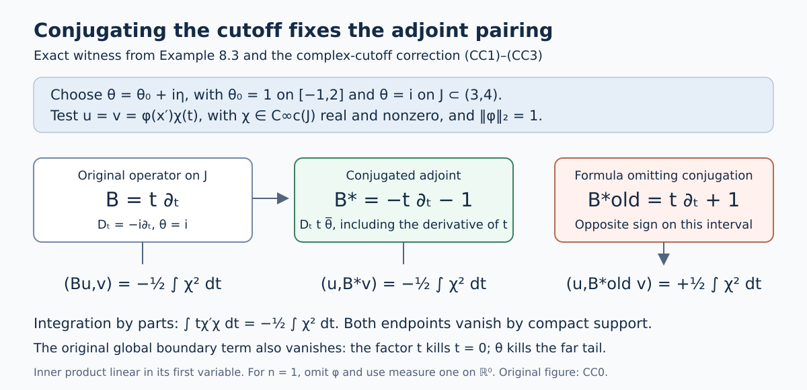

# Totally characteristic operators on the half space

*Written by Claude Opus 5.5 (Anthropic), September 2026. Self-checked by the writing AI. Public domain (CC0).*

*Edited and supplemented by Codex, September 2026. The additions and editorial corrections are also public domain (CC0).*

This lesson builds the local calculus of *totally characteristic* pseudodifferential operators on the closed half space \(\overline{\mathbb R}{}^n_+=\{x_n\geq0\}\). The differential operators of this kind are generated by the vector fields tangent to the boundary, which are the combinations of \(\partial_1,\ldots,\partial_{n-1}\) and \(x_n\partial_n\) with smooth coefficients. They respect the boundary: the boundary values of \(Pu\) depend only on the boundary values of \(u\), and the normal derivatives of \(Pu\) of order \(k\) at the boundary depend only on those of \(u\) of order at most \(k\). The pseudodifferential operators of the class come from symbols \(a(x,\xi)\) in which the normal frequency \(\xi_n\) is replaced by \(x_n\xi_n\) before quantization. A condition on the Fourier transform of the symbol in \(\xi_n\), called lacunarity, makes the output in the open half space depend only on the input there.

We prove that these operators act on functions and on distributions on the half space, and we compute their commutators and the boundary jets of their outputs. We describe the kernels of the operators of order \(-\infty\) near the corner \(x_n=y_n=0\) by blowing up the corner, and we show that these kernels are conormal there. The class is closed under adjoints and compositions, with asymptotic formulas for the symbols. Operators of order 0 are bounded on \(L^2\), on Sobolev spaces of every real order and on dyadic Besov spaces, and operators of every order preserve the distributions that are conormal to the boundary. In one respect the class differs from the ordinary calculus: operators of order \(-\infty\) need not improve regularity at all, because their kernels are singular at the corner.

These operators matter because they are the pseudodifferential counterpart of the differential operators tangent to the boundary. Since they respect the boundary, they can be combined with operators on the boundary, such as taking boundary values. On manifolds with boundary they form the b-calculus, which is used for instance in index theory.

The lesson assumes the symbol calculus on \(\mathbb R^n\) from the lesson [From symbol estimates to operators on every Sobolev scale](euclidean-symbol-calculus.md); conormal distributions and smooth extension across a boundary from [Singularities along a submanifold and smooth boundary passage](conormal-transmission.md); and local Besov spaces from [Detecting regularity without choosing coordinates](geometric-microlocal-calculus.md). It also uses tempered distributions, the Fourier transform and two facts from functional analysis. Section1 states the precise facts used from the linked lessons and identifies their proof sections.

Further reading is [Hörmander III] and the freely available author versions [Melrose] and [Loya]. The mathematical arguments used here are proved in this lesson and its linked prerequisites.

## 1. Conventions and background

### Notation

Throughout \(n\geq1\), \(x=(x',x_n)\in\mathbb R^{n-1}\times\mathbb R\), and
\[
\mathbb R^n_\pm=\{x:\pm x_n>0\},\qquad \overline{\mathbb R}{}^n_+=\{x:x_n\geq0\}.
\]
We write \(D=-i\partial\), \(\widehat u(\xi)=\int e^{-ix\cdot\xi}u(x)\,dx\) (inverse factor \((2\pi)^{-n}\)), \(\langle\xi\rangle=(1+|\xi|^2)^{1/2}\), and \((u,v)=\int u\overline v\), linear in the first argument. For a function of \((x,\xi)\) we write \(a^{(\alpha)}_{(\beta)}=\partial_\xi^\alpha\partial_x^\beta a\).

\(C^\infty(\overline{\mathbb R}{}^n_+)\) denotes the functions on \(\overline{\mathbb R}{}^n_+\) that are smooth in \(\mathbb R^n_+\) and whose derivatives all extend continuously to \(\overline{\mathbb R}{}^n_+\). Every such function is the restriction of a smooth function on \(\mathbb R^n\); this is the extension fact in the list below. \(C^\infty_b\) means smooth with all derivatives bounded.

**Sobolev and Besov spaces.** \(H_{(s)}\) is the space of tempered distributions \(u\) whose Fourier transform is locally square integrable and for which the norm \(\|u\|_{(s)}^2=(2\pi)^{-n}\int\langle\xi\rangle^{2s}|\widehat u|^2d\xi\) is finite. With the sharp annuli \(A_0=\{|\xi|<1\}\), \(A_j=\{2^{j-1}\leq|\xi|<2^j\}\) and the Fourier projections \(\Pi_j\) onto them, the dyadic Besov norm is
\[
\|u\|_{B^s_{2,p}}=\big\|\big(2^{js}\|\Pi_ju\|_{L^2}\big)_{j\geq0}\big\|_{\ell^p},\qquad 1\leq p\leq\infty .
\tag{1.1}
\]
\(B^s_{2,p}\) is the space of tempered distributions with locally square-integrable Fourier transform for which this norm is finite. Since \(\langle\xi\rangle\) is comparable to \(2^j\) on \(A_j\), \(B^s_{2,2}=H_{(s)}\) with equivalent norms. A distribution \(u\) on an open set \(\Omega\subset\mathbb R^n\) lies in the local space \(B^s_{2,p,\mathrm{loc}}(\Omega)\) if \(\chi u\), extended by zero, lies in \(B^s_{2,p}\) for every \(\chi\in C_0^\infty(\Omega)\).

**Values of symbols.** All symbols may take values in \(L(\mathbb C^p,\mathbb C^q)\) for fixed finite \(p,q\). Then \(|\cdot|\) is the operator norm, products keep their order, and complex conjugation of a symbol is replaced by the conjugate transpose \(a^*\). Every statement below holds in this generality with the same proof, except the square-root step in the proof of Theorem 10.1, where we say what changes. The reader may keep \(p=q=1\) in mind.

We also use Peetre's inequality \((1+|\xi+\zeta|)^s\leq(1+|\xi|)^s(1+|\zeta|)^{|s|}\) for real \(s\), which follows from \(1+|\xi|\leq(1+|\xi+\zeta|)(1+|\zeta|)\).

### Proofs used from earlier lessons

Fourier inversion and Plancherel on \(\mathcal S\), \(\mathcal S'\) and \(L^2\) are proved in [the Fourier lesson, Sections1--2 and7--8](prerequisite-bridges.md#AN03-DEP-001). The Schwartz kernel theorem for continuous linear maps \(\mathcal S(\mathbb R^n)\to\mathcal S'(\mathbb R^n)\) is proved in [the Weyl-product lesson, Sections4.1--4.5](weyl-metric-products.md#AN03-WP-KERNEL-001). Dominated convergence and Fubini's theorem are proved in [the measure chapter, Sections16.1--16.5](banach-foundation-bridges.md#AN03-BFD-GENERAL-001), and Taylor's formula in [the calculus chapter, Section13.6](metric-foundation-bridges.md#AN03-MFD-CALC-006). The following statements specify the other exact interfaces used below.

*Symbols and operators on \(\mathbb R^n\).* These facts are proved in the lesson [From symbol estimates to operators on every Sobolev scale](euclidean-symbol-calculus.md).

**Symbol classes.** For \(m\in\mathbb R\), \(S^m(\mathbb R^N\times\mathbb R^k)\) is the space of smooth functions \(a(x,\xi)\) with \(|\partial_\xi^\alpha\partial_x^\beta a(x,\xi)|\leq C_{\alpha\beta}(1+|\xi|)^{m-|\alpha|}\) for all \(x\) and \(\xi\). The best constants are seminorms, and they make \(S^m\) a Fréchet space. We put \(S^{-\infty}=\bigcap_mS^m\). If \(a_j\in S^{m_j}\) and \(m_j\) decreases to \(-\infty\), there is an \(a\in S^{m_0}\), unique modulo \(S^{-\infty}\), with \(a-\sum_{j<l}a_j\in S^{m_l}\) for every \(l\); one writes \(a\sim\sum_ja_j\). A symbol is *polyhomogeneous of degree \(\mu\) with step one* if \(a\sim\sum_ja_j\) with \(a_j\) homogeneous of degree \(\mu-j\) in \(\xi\) for \(|\xi|\geq1\).

**Quantization and kernels.** For \(a\in S^m(\mathbb R^n\times\mathbb R^n)\), the operator \(\operatorname{Op}(a)u(x)=(2\pi)^{-n}\int e^{ix\cdot\xi}a(x,\xi)\widehat u(\xi)\,d\xi\) maps \(\mathcal S\) into \(\mathcal S\), and \((a,u)\mapsto\operatorname{Op}(a)u\) is continuous. More generally, let \(a\) be any tempered distribution on \(\mathbb R^n\times\mathbb R^n\). The formulas
\[
K_a(x,y)=(2\pi)^{-n}\int e^{i(x-y)\cdot\xi}a(x,\xi)\,d\xi ,\qquad a(x,\xi)=\int e^{-iz\cdot\xi}K_a(x,x-z)\,dz ,
\]
in which the integrals are partial Fourier transforms of tempered distributions, are inverse to each other. So every continuous linear map \(\mathcal S\to\mathcal S'\) is the map \(\operatorname{Op}(a)\) with kernel \(K_a\) for exactly one tempered distribution \(a\); in particular the operator determines its symbol. If \(a\) is a measurable function with polynomial bounds, then \(\operatorname{Op}(a)u\) is given, for \(u\in\mathcal S\), by the absolutely convergent integral above; one checks this by pairing with a Schwartz function and using Fubini's theorem and Fourier inversion.

**The Gauss transform.** \(e^{i\langle D_y,D_\eta\rangle}\) is the Fourier multiplier with symbol \(e^{i\langle p,q\rangle}\), where \((p,q)\) are the variables dual to \((y,\eta)\in\mathbb R^n\times\mathbb R^n\). It maps \(S^m(\mathbb R^n_y\times\mathbb R^n_\eta)\) continuously into itself, and for every \(N\)
\[
e^{i\langle D_y,D_\eta\rangle}c-\sum_{|\alpha|<N}\frac1{\alpha!}\partial_\eta^\alpha D_y^\alpha c\in S^{m-N},
\]
each seminorm of the remainder being bounded by finitely many seminorms of \(c\). If a sequence is bounded in \(S^m\) and converges locally uniformly with all derivatives, then so do its transforms.

**The pre-diagonal product estimate.** Let \(a\in S^{m_1}(\mathbb R^n\times\mathbb R^n)\), \(b\in S^{m_2}(\mathbb R^n\times\mathbb R^n)\), and let \(B(x,\xi,y,\eta)\) be the transform \(e^{i\langle D_y,D_\eta\rangle}\) of \(a(x,\eta)b(y,\xi)\) in the variables \((y,\eta)\). Then for all multi-indices and all \(N\geq0\), at every point \((x,\xi,y,\eta)\),
\[
\Big|\partial_\xi^\alpha\partial_x^\beta\partial_\eta^{\alpha'}\partial_y^{\beta'}\Big(B-\sum_{|\gamma|<N}\frac1{\gamma!}\partial_\eta^\gamma a(x,\eta)\,D_y^\gamma b(y,\xi)\Big)\Big|\leq C\langle\eta\rangle^{m_1-N-|\alpha'|}\langle\xi\rangle^{m_2-|\alpha|},
\]
with \(C\) bounded by finitely many seminorms of \(a\) and \(b\). At \(y=x\), \(\eta=\xi\), \(B\) is the symbol of \(\operatorname{Op}(a)\operatorname{Op}(b)\).

**The Schur test.** If \(K\) is a measurable function on \(X\times Y\), for two measure spaces \(X\) and \(Y\), with \(\sup_x\int|K(x,y)|\,dy\leq A\) and \(\sup_y\int|K(x,y)|\,dx\leq B\), then \(u\mapsto\int K(\cdot,y)u(y)\,dy\) is bounded from \(L^2(Y)\) to \(L^2(X)\) with norm at most \(\sqrt{AB}\).

*The preceding unrestricted raw-integral statement is retained for the visible correction and complete proof in [Section1.1](#AN03-TC-SCHUR-001). Its applications below use Lebesgue output measure.*

**Sobolev and Besov continuity.** For \(a\in S^m(\mathbb R^n\times\mathbb R^n)\), \(\operatorname{Op}(a)\) maps \(H_{(s)}\) continuously into \(H_{(s-m)}\) for every real \(s\). The spaces \(B^s_{2,p}\) are Banach spaces, and multiplication by a \(C^\infty_b\) function is bounded on each of them. If \((c_l)_{l\in\mathbb Z}\) is summable, then convolution with it is bounded on \(\ell^p(\mathbb Z)\), \(1\leq p\leq\infty\), with norm at most \(\sum_l|c_l|\), by the triangle inequality for translates.

*Local spaces.* The local spaces \(B^s_{2,p,\mathrm{loc}}\) do not depend on the choice of cutoffs, and they are preserved by multiplication with smooth functions and by changes of coordinates. This is proved in the lesson [Detecting regularity without choosing coordinates](geometric-microlocal-calculus.md).

*Conormal distributions and extension.* These facts are proved in the lesson [Singularities along a submanifold and smooth boundary passage](conormal-transmission.md).

**Conormal distributions.** Let \(Y\) be a closed submanifold of \(\mathbb R^N\) of codimension \(k\), and \(\mu\in\mathbb R\). The space \(I^\mu(\mathbb R^N,Y)\) consists of the \(u\in\mathcal D'(\mathbb R^N)\) such that \(L_1\cdots L_Mu\in B^{-\mu-N/4}_{2,\infty,\mathrm{loc}}(\mathbb R^N)\) for every \(M\geq0\) and all first-order differential operators \(L_1,\ldots,L_M\) with smooth coefficients whose principal symbols vanish on the conormal bundle \(N^*Y\). Such a \(u\) is smooth off \(Y\), and its wave front set lies in \(N^*Y\). Suppose \(Y=\{t=0\}\) in coordinates \(x=(t,z)\in\mathbb R^k\times\mathbb R^{N-k}\). Then every \(u\in I^\mu(\mathbb R^N,Y)\) with compact support has the form \(u(t,z)=\int e^{i\langle t,\tau\rangle}b(z,\tau)\,d\tau\) with \(b\in S^{\mu+(N-2k)/4}(\mathbb R^{N-k}\times\mathbb R^k)\) of compact support in \(z\), and \(b\) is \((2\pi)^{-k}\) times the Fourier transform of \(u\) in \(t\). Conversely every such integral lies in \(I^\mu(\mathbb R^N,Y)\).

**Hadamard's lemma.** A smooth function \(f(t,z)\) that vanishes on \(t=0\) equals \(\sum_it_i\int_0^1(\partial_{t_i}f)(st,z)\,ds\). Hence every smooth vector field tangent to \(Y=\{t=0\}\) is a combination, with smooth coefficients, of the fields \(t_i\partial_{t_j}\) and \(\partial_{z_l}\).

**Smooth extension.** A function on \(\overline{\mathbb R}{}^n_+\) that is smooth in \(\mathbb R^n_+\), and all of whose derivatives extend continuously to \(\overline{\mathbb R}{}^n_+\), is the restriction of a smooth function on \(\mathbb R^n\).

*Functional analysis.*

**The Hahn–Banach theorem, seminorm form.** Let \(p\) be a seminorm on a complex vector space \(X\), \(M\subset X\) a subspace, and \(f\) a linear functional on \(M\) with \(|f(x)|\leq p(x)\) for \(x\in M\). Then \(f\) extends to a linear functional \(\Lambda\) on \(X\) with \(|\Lambda(x)|\leq p(x)\) for all \(x\in X\). Its full seminorm proof is [Section14.7 of the Banach foundations](banach-foundation-bridges.md#AN03-BFD-SEMINORM-001).

**Quotients of Fréchet spaces.** If \(N\) is a closed subspace of a Fréchet space \(X\), then \(X/N\) with the quotient topology is a Fréchet space. Its full quotient-topology and completeness proof is [Section14.8 of the Banach foundations](banach-foundation-bridges.md#AN03-BFD-FRECHET-QUOTIENT-001).

### 1.1. Schur's bound on the original measure spaces

**Editorial correction to the background statement.** The preceding Schur statement, as originally written, places no restriction on either measure space. Its assertion about the raw integral is false at that generality. We retain that statement above so the correction is identifiable. Here we prove the counterexample, the bounded operator that exists on the original arbitrary spaces, and its exact relationship with the raw integral. In particular, the raw-integral assertion holds when the output measure is semifinite; the input measure can remain arbitrary. Every application later in this lesson has Lebesgue output measure and therefore satisfies this condition.

Let \((X,\mathcal A,\mu)\) and \((Y,\mathcal B,\nu)\) be arbitrary measure spaces. In this section measurable kernels mean \(\mathcal A\otimes\mathcal B\)-measurable, finite complex-valued kernels. Retain the original two constants and both pointwise bounds
\[
 \int_Y|K(x,y)|\,d\nu(y)\leq A\quad(x\in X),\qquad
 \int_X|K(x,y)|\,d\mu(x)\leq B\quad(y\in Y),
 \qquad 0\leq A,B<\infty .
 \tag{SC1}
\]
All \(L^2\) spaces use the original measures and their almost-everywhere equivalence classes; inner products are linear in their first argument. We do not assume completeness, sigma-finiteness or semifiniteness of either measure.

#### A measurable counterexample with both bounds at every point

Put \(I=[0,1]\). On its Borel sets define
\[
 \mu(E)=
 \begin{cases}0,&E\text{ is meager in }I,\\
 \infty,&E\text{ is not meager in }I,\end{cases}
 \qquad \nu=\text{Lebesgue measure on the Borel sets of }I.
 \tag{SC2}
\]
Here meager means a countable union of sets whose closures have empty relative interior. This is a measure: a countable union of meager sets is meager; if one member of a countable disjoint family is nonmeager, its union is nonmeager and both the sum and union measure are infinite. These two cases also prove countable additivity. The complete-metric Baire theorem, proved in [the Banach chapter, Section6](banach-foundation-bridges.md#AN03-BFD-006), shows that \(I\) is not meager in itself. Thus \(\mu(I)=\infty\), while every set of finite \(\mu\)-measure has measure zero.

Enumerate the rationals as \((q_k)_{k\geq1}\), and set
\[
 U_j=\bigcup_{k\geq1}
 (q_k-2^{-j-k-3},q_k+2^{-j-k-3}),\qquad
 G=\bigcap_{j\geq1}U_j,\qquad N=\mathbb R\setminus G .
 \tag{SC3}
\]
Every \(U_j\) is open and dense, and its Lebesgue measure is at most
\[
 \sum_{k\geq1}2\cdot2^{-j-k-3}=2^{-j-2}.
 \tag{SC4}
\]
Consequently \(G\) is a Borel null set. Baire's theorem on \(\mathbb R\) also makes it dense. Each \(\mathbb R\setminus U_j\) is closed with empty interior, so \(N\) is meager and its complement is Lebesgue null. No finite approximation of these sets is being substituted for them.

Take \(X=Y=I\) with the measures in (SC2), and define
\[
 K(x,y)=1_N(x+y),\qquad u(y)=1 .
 \tag{SC5}
\]
Addition is continuous and \(N\) is Borel, so \(K\) is jointly Borel measurable. For every \(x\), the omitted set of \(y\)'s is \((G-x)\cap I\), a Lebesgue null set; hence its row integral is one. For every \(y\), the set of \(x\)'s where \(K\ne0\) is \((N-y)\cap I\). Translation preserves closed sets with empty interior, and restriction of any such set to the nondegenerate interval \(I\) has empty relative interior. Thus this section is meager in \(I\) and its column integral is zero. We have the exact values
\[
 A=1,\quad B=0,\quad \|u\|_{L^2(\nu)}=1,\qquad
 \int_I K(x,y)u(y)\,d\nu(y)=1\quad\text{for every }x,\qquad
 \int_I1^2\,d\mu=\infty .
 \tag{SC6}
\]
The original raw-integral assertion therefore fails. This is not a failure of a matrix estimate or of the square-root constant: the two measures detect different sections of the same measurable set.

#### The exact \(L^2\) operator without measure restrictions

Each \(L^2(\nu)\) class has a finite-valued measurable representative \(u\). An infinite value, if allowed in a representative, occurs on a null set and can be changed to zero. Its actual nonzero support is sigma-finite:
\[
 S_u=\{u\ne0\}=\bigcup_{k\geq1}\{|u|>1/k\},\qquad
 \nu\{|u|>1/k\}\leq k^2\|u\|_2^2 .
 \tag{SC7}
\]
The same construction applies to \(v\in L^2(\mu)\). On the original restricted measures on \(S_v\times S_u\), both factors are sigma-finite. Thus the product and Tonelli/Fubini proofs in [the Banach chapter, Sections16.2--16.4](banach-foundation-bridges.md#AN03-BFD-GENERAL-001) apply there, with no assertion of Tonelli on all of \(X\times Y\). Define
\[
 b_K(u,v)=
 \int_{S_v}\int_{S_u}K(x,y)u(y)\overline{v(x)}\,d\nu(y)\,d\mu(x).
 \tag{SC8}
\]
The two nonnegative integrals needed for product Cauchy--Schwarz obey
\[
 \begin{split}
 \int_{S_v\times S_u}|K(x,y)|\,|u(y)|^2\,d(\mu\otimes\nu)
 &\leq B\|u\|_{L^2(\nu)}^2,\\
 \int_{S_v\times S_u}|K(x,y)|\,|v(x)|^2\,d(\mu\otimes\nu)
 &\leq A\|v\|_{L^2(\mu)}^2,\\
 \int_{S_v\times S_u}|K(x,y)|\,|u(y)|\,|v(x)|\,d(\mu\otimes\nu)
 &\leq\sqrt{AB}\,\|u\|_{L^2(\nu)}\|v\|_{L^2(\mu)} .
 \end{split}
 \tag{SC9}
\]
Here the first line integrates the column bound and the second integrates the row bound. Cauchy--Schwarz uses the two displayed functions \(|K|^{1/2}|u|\) and \(|K|^{1/2}|v|\), retaining both factors. All integrals on the right are finite, including when \(A=0\) or \(B=0\); in either zero case the third integral vanishes. These bounds prove absolute convergence of (SC8). Changing \(u\) or \(v\) on its original null set changes no pairing: on the sigma-finite union of the old and new supports, those changes are product-null by the proved product theorem. The same observation on finite unions of supports proves sesquilinearity.

We include the Hilbert-space facts needed here at this generality. Cauchy--Schwarz for any measure follows by integrating \(|f-tg|^2\geq0\) with its minimizing complex \(t\), treating \(g=0\) separately; it gives Minkowski by expanding \(\|f+g\|_2^2\). If a sequence is Cauchy in \(L^2(\mu)\), choose a subsequence with successive differences \(d_j\) of norms at most \(2^{-j}\). For \(s_m=\sum_{j\leq m}|d_j|\), Minkowski and monotone convergence give
\[
 \int\left(\sum_{j\geq1}|d_j|\right)^2d\mu
 =\lim_m\int s_m^2d\mu
 \leq\left(\sum_{j\geq1}2^{-j}\right)^2 .
 \tag{SC10}
\]
The sum is finite off a measurable null set. There the subsequence converges pointwise; define the limit to be zero on that null set. Applying the same bound to each tail proves convergence in \(L^2\), and the Cauchy property gives convergence of the whole sequence. This proves completeness on arbitrary \(\mu\), and the proof for \(\nu\) is identical.

For completeness, the representing-vector argument requires no separability. For fixed \(u\), put \(\ell(v)=\overline{b_K(u,v)}\), a bounded linear functional on this Hilbert space. If \(\ell=0\), choose its representing vector to be zero. Otherwise the closed affine set \(\ell(v)=1\) is nonempty and its distance \(d\) from zero is positive, since \(1\leq\|\ell\|\|v\|\). A sequence in that set whose norms decrease to \(d\) is Cauchy: the parallelogram identity gives
\[
 \|z_j-z_k\|^2
 =2\|z_j\|^2+2\|z_k\|^2-4\|(z_j+z_k)/2\|^2
 \leq2\|z_j\|^2+2\|z_k\|^2-4d^2 .
 \tag{SC11}
\]
Completeness gives a minimizing vector \(z\) in the set. Varying \(z\) by \(tw\) and \(itw\), for real \(t\) and \(w\in\ker\ell\), shows \(\langle z,w\rangle=0\). Since \(v-\ell(v)z\in\ker\ell\),
\[
 \ell(v)=\left\langle v,\frac{z}{\|z\|^2}\right\rangle,\qquad
 b_K(u,v)=\left\langle\frac{z}{\|z\|^2},v\right\rangle .
 \tag{SC12}
\]
The vector in the second pairing is unique, as its difference from another would pair to zero with itself. Define it to be \(T_Ku\). Sesquilinearity and uniqueness prove that \(T_K\) is linear. Taking \(v=T_Ku\) in (SC9), and treating its zero norm separately, proves
\[
 T_K:L^2(\nu)\longrightarrow L^2(\mu),\qquad
 \langle T_Ku,v\rangle=b_K(u,v),\qquad
 \|T_K\|\leq\sqrt{AB}.
 \tag{SC13}
\]
This operator is defined on the original spaces. Its adjoint retains the literal swapped kernel \(K^*(y,x)=\overline{K(x,y)}\): absolute Fubini on the two supports gives \(b_K(u,v)=\overline{b_{K^*}(v,u)}\), so \(T_K^*=T_{K^*}\). The swapped constants are \(B,A\).

#### The raw integral on every finite-measure piece

Fix \(u\) and its support in (SC7). For any nonnegative product-measurable function \(h\) on \(X\times S_u\), its section integral is a measurable function of \(x\), without a condition on \(\mu\). Indeed, on a finite-\(\nu\) piece the section-measure argument in Section16.3 of the linked chapter uses rectangles, finite subtraction for complements, and countable sums for disjoint unions; its generating-class proof in Section16.2 requires no outer measure hypothesis. Increasing finite-measure exhaustions of \(S_u\), followed by increasing simple approximations to \(h\), give the assertion. Real and imaginary parts then give measurability of absolutely convergent complex section integrals.

Consequently the following sets and functions are measurable:
\[
 J_u(x)=\int_{S_u}|K(x,y)|\,|u(y)|\,d\nu(y),\quad
 D_u=\{J_u=\infty\},\qquad
 r_0(u)(x)=
 \begin{cases}
 \displaystyle\int_YK(x,y)u(y)\,d\nu(y),&x\notin D_u,\\
 0,&x\in D_u .
 \end{cases}
 \tag{SC14}
\]
The value zero on \(D_u\) is an explicit convention; it is not an assertion that the divergent raw integral exists there. For a measurable \(E\subset X\) with \(\mu(E)<\infty\), Tonelli on \(E\times S_u\) and the original column bound give
\[
 \int_E\int_{S_u}|K(x,y)|\,|u(y)|^2d\nu(y)d\mu(x)
 \leq B\|u\|_2^2 .
 \tag{SC15}
\]
The inner quantity is finite for almost every \(x\) in \(E\). Weighted Cauchy--Schwarz in \(y\) gives, at those points,
\[
 J_u(x)^2
 \leq\left(\int_Y|K(x,y)|d\nu(y)\right)
       \left(\int_{S_u}|K(x,y)|\,|u(y)|^2d\nu(y)\right).
 \tag{SC16}
\]
If \(A=0\), every row is zero almost everywhere in \(\nu\), and \(J_u=0\) at every \(x\); this also covers the zero-row case before multiplying any infinite value. Otherwise (SC15)--(SC16) prove
\[
 \mu(E\cap D_u)=0,\qquad
 \int_E|r_0(u)|^2d\mu\leq AB\|u\|_2^2
 \quad\text{for every }E\text{ of finite measure}.
 \tag{SC17}
\]
For \(v\) supported in such \(E\), absolute Fubini and (SC9) identify \(\langle r_0(u),v\rangle=b_K(u,v)\) on \(E\). Both \(r_0(u)1_E\) and \((T_Ku)1_E\) lie in \(L^2(\mu)\); testing their difference proves
\[
 \int_E|r_0(u)-T_Ku|^2d\mu=0
 \quad(\mu(E)<\infty).
 \tag{SC18}
\]
Equality on all finite-measure pieces is the exact comparison proved so far. In the counterexample it does not imply equality almost everywhere for the original \(\mu\).

#### The space defined by this defect and its complete quotient map

Let \(F_\mu\) be the vector space of original almost-everywhere classes of finite-valued measurable functions \(h\) for which
\[
 p_\mu(h)=\sup_{\substack{E\in\mathcal A\\\mu(E)<\infty}}
              \left(\int_E|h|^2d\mu\right)^{1/2}<\infty,\qquad
 N_\mu=\{h\in F_\mu:p_\mu(h)=0\}.
 \tag{SC19}
\]
Minkowski on each \(E\) proves that \(p_\mu\) is a seminorm. Its kernel consists exactly of the functions invisible to every finite-measure test. This definition retains the original global null classes, so \(N_\mu\) can contain a class that is nonzero globally.

There is a canonical onto isometry
\[
 i_\mu:L^2(\mu)\longrightarrow F_\mu/N_\mu,\qquad
 i_\mu(h)=h+N_\mu .
 \tag{SC20}
\]
First, for \(h\in L^2(\mu)\), the finite-measure level sets in (SC7), made increasing by finite unions, exhaust its support. Monotone convergence gives \(p_\mu(h)=\|h\|_2\). Thus this map is injective and isometric.

To prove surjectivity, take \(h\in F_\mu\), and put \(c=p_\mu(h)^2\). If \(c=0\), its class in the quotient is zero. If \(c>0\), choose finite-measure sets \(E_k\) such that \(\int_{E_k}|h|^2d\mu>c-2^{-k}\). Replace these sets by the finite unions \(F_k=\bigcup_{j\leq k}E_j\), and put \(S=\bigcup_kF_k\). Then
\[
 \int_S|h|^2d\mu=\lim_k\int_{F_k}|h|^2d\mu=c,\qquad
 h_s=h1_S\in L^2(\mu).
 \tag{SC21}
\]
For any finite-measure \(E\), the disjoint union \(F_k\cup(E\setminus S)\) still has finite measure, so
\[
 \int_{F_k}|h|^2d\mu+\int_{E\setminus S}|h|^2d\mu\leq c .
 \tag{SC22}
\]
Letting \(k\) increase proves that the second integral is zero. Therefore \(h-h_s\in N_\mu\), establishing surjectivity. Two choices of \(h_s\) differ by an \(L^2\) element of \(N_\mu\), hence are equal in the original \(L^2\) space. The inverse \(P_\mu=i_\mu^{-1}\) is consequently canonical and linear, and the quotient is a complete Hilbert space through this isometry.

Equations (SC17)--(SC18) now give the complete connecting maps
\[
 r_0(u)\in F_\mu,\qquad
 r_0(u)+N_\mu=i_\mu(T_Ku),\qquad
 P_\mu(r_0(u)+N_\mu)=T_Ku .
 \tag{SC23}
\]
In particular the raw assignment followed by the quotient is linear, even though the conventions on divergent sets were only pointwise choices. Any other finite measurable convention on \(D_u\) has the same quotient class, because every finite-measure intersection of \(D_u\) is null. In (SC2), \(p_\mu\) is zero on every finite-valued measurable function, \(F_\mu=N_\mu\), and \(L^2(\mu)=\{0\}\). The raw constant one in (SC6) is a nonzero original class in \(N_\mu\); (SC13) is the zero operator. Thus (SC23) describes exactly what the counterexample loses under finite-measure testing.

#### When the raw-integral assertion is recovered

A measure is semifinite if each measurable set of positive measure contains a measurable subset of finite positive measure. Under this condition, a measurable set whose intersection with every finite-measure set is null is itself null: if it were positive, the defining subset would contradict the intersection property. Applying this first to \(D_u\) and then to the sets \(\{|h|>1/k\}\) for \(h\in N_\mu\) gives
\[
 \mu\text{ semifinite}\quad\Longrightarrow\quad
 \mu(D_u)=0,\quad N_\mu=\{0\},\quad
 r_0(u)=T_Ku\ \mu\text{-almost everywhere},\quad
 \|r_0(u)\|_2\leq\sqrt{AB}\|u\|_2 .
 \tag{SC24}
\]
There is no restriction on the input measure \(\nu\) in this implication.

The defect criterion is exact: \(N_\mu=\{0\}\) if and only if \(\mu\) is semifinite. Indeed, if semifiniteness fails, its definition supplies a positive measurable set \(H\) with no finite positive-measure subset. Every finite-measure intersection \(E\cap H\) has measure zero. The finite-valued function \(1_H\) therefore belongs to \(N_\mu\) and is a nonzero original almost-everywhere class. This proves the converse. Equivalently, semifiniteness gives
\[
 \mu(H)=\sup_{\substack{E\subset H\\\mu(E)<\infty}}\mu(E).
 \tag{SC25}
\]
For finite \(\mu(H)\) this is immediate. If \(\mu(H)=\infty\) and the supremum \(c\) were finite, choose finite-measure \(E_k\subset H\) approaching \(c\), take their increasing finite unions, and let their union be \(S\). Measure continuity gives \(\mu(S)=c\). Any finite positive-measure subset of \(H\setminus S\) would raise the supremum by its disjoint union with \(S\), while \(H\setminus S\) still has infinite measure. This contradicts semifiniteness and proves (SC25). We have proved the exact vanishing criterion for the defect space; we do not infer that every kernel on a nonsemifinite space must fail its raw-integral bound.

Finally, the same construction works for the finite vector dimensions in this lesson, retaining their order. If \(K(x,y)\in L(\mathbb C^p,\mathbb C^q)\), replace \(|K|\) in (SC1) and (SC9) by its original operator norm and use
\[
 |\langle K(x,y)u(y),v(x)\rangle_{\mathbb C^q}|
 \leq\|K(x,y)\|\,|u(y)|_{\mathbb C^p}|v(x)|_{\mathbb C^q}.
 \tag{SC26}
\]
This gives exactly (SC9), with no dimension factor. Vector-valued \(L^2\) completeness follows by the same norm-sum proof (SC10); the Hilbert representing argument (SC11)--(SC12) applies unchanged. The raw convergence proof bounds the norm of its vector integral by \(J_u\). Define \(F_\mu,N_\mu\) with the original Euclidean vector norm; (SC21)--(SC22) prove the same onto isometry and comparison. The adjoint kernel is exactly \(K(y,x)^*\), reversing the two vector dimensions, as absolute Fubini in (SC8) shows. All subsequent Schur applications thus retain the full scalar or matrix constants and the original Lebesgue integral. ![Figure SC-F1. The exact kernel K(x,y)=1_N(x+y) on I=[0,1] has row bound A=1 and column bound B=0. Its raw integral sends the input constant one of Lebesgue L2 norm one to the constant one with infinite global output L2 integral. Every finite-measure output test is zero. The canonical Schur operator is zero, and the onto isometry F_mu/N_mu=L2(mu) identifies the raw output with zero through SC20--SC23. This is a diagram of the exact maps, not a sampled picture of the meager set N. Definitions and full proofs: SC2--SC6 and SC19--SC24. Reproducible figure source: figures/schur_arbitrary_measure.py.](../figures/schur_arbitrary_measure.png)

## 2. Totally characteristic differential operators

Let \(\mathcal V_b\) be the smooth vector fields \(V=\sum_jv_j\partial_j\), \(v_j\in C^\infty(\overline{\mathbb R}{}^n_+)\), that are tangent to the boundary, that is, \(v_n(x',0)=0\). Let \(\operatorname{Diff}_b(\overline{\mathbb R}{}^n_+)\) be the algebra of operators on \(C^\infty(\overline{\mathbb R}{}^n_+)\) generated by \(\mathcal V_b\) and by multiplication with functions in \(C^\infty(\overline{\mathbb R}{}^n_+)\), and \(\operatorname{Diff}^m_b\) the span of products containing at most \(m\) vector fields. Its elements are the *totally characteristic* differential operators.

**Proposition 2.1** (Structure of totally characteristic differential operators).

(a) \(\mathcal V_b\) is the \(C^\infty(\overline{\mathbb R}{}^n_+)\)-module generated by \(\partial_1,\ldots,\partial_{n-1}\) and \(x_n\partial_n\).

(b) For every integer \(k\geq0\),
\[
x_n^kD_n^k=\prod_{j=0}^{k-1}\big(x_nD_n+ij\big)=:q_k(x_nD_n).
\tag{2.1}
\]
Hence \(\{x_n^jD_n^j:j\leq k\}\) and \(\{(x_nD_n)^j:j\leq k\}\) span the same space, with constant coefficients.

(c) \(\operatorname{Diff}^m_b\) consists exactly of the finite sums
\[
P=\sum_{|\alpha|\leq m}c_\alpha(x)\,x_n^{\alpha_n}D^\alpha,\qquad c_\alpha\in C^\infty(\overline{\mathbb R}{}^n_+),
\tag{2.2}
\]
equivalently of the sums \(\sum_{|\alpha|\leq m}c'_\alpha(x)D'^{\alpha'}(x_nD_n)^{\alpha_n}\).

(d) For \(P\) as in (2.2) and \(u\in C^\infty(\overline{\mathbb R}{}^n_+)\), \((Pu)(x',0)=\sum_{\alpha_n=0}c_\alpha(x',0)D'^{\alpha'}u(x',0)\): the boundary value of \(Pu\) depends only on the boundary value of \(u\).

**Proof.** (a) If \(v_n(x',0)=0\), then \(v_n(x)=x_nw(x)\) with \(w(x)=\int_0^1(\partial_nv_n)(x',\theta x_n)\,d\theta\in C^\infty(\overline{\mathbb R}{}^n_+)\). Thus \(V=\sum_{j<n}v_j\partial_j+w\,x_n\partial_n\). Conversely each generator is tangent.

(b) For \(k\geq0\) and \(u\) smooth, \(x_nD_n(x_n^kD_n^ku)=x_n^{k+1}D_n^{k+1}u+x_n(D_nx_n^k)D_n^ku=x_n^{k+1}D_n^{k+1}u-ik\,x_n^kD_n^ku\), because \(D_nx_n^k=-ikx_n^{k-1}\). So \(x_n^{k+1}D_n^{k+1}=(x_nD_n+ik)\,x_n^kD_n^k\), and induction gives (2.1). The polynomial \(q_k\) is monic of degree \(k\), so the triangular system can be inverted.

(c) Moving a function to the left across a generator produces only multiplication operators: \(\partial_jc=c\partial_j+(\partial_jc)\) and \(x_n\partial_nc=c\,x_n\partial_n+x_n(\partial_nc)\). So a product of at most \(m\) vector fields and functions is a sum of terms \(c(x)M_1\cdots M_l\), \(l\leq m\), with each \(M_i\) one of the generators in (a). These generators commute pairwise, because \([x_n\partial_n,\partial_j]=0\) for \(j<n\). So each word is a constant times \(D'^{\beta'}(x_nD_n)^{\beta_n}\) with \(|\beta|\leq m\), and (b) rewrites it in the form (2.2). Conversely \(x_n^{\alpha_n}D^\alpha=D'^{\alpha'}q_{\alpha_n}(x_nD_n)\) is a product of \(|\alpha|\) generators.

(d) At \(x_n=0\) every term with \(\alpha_n>0\) carries the factor \(x_n^{\alpha_n}\), which vanishes. \(\square\)

Part (d) is the motivation for the whole lesson. An operator that respects the boundary in this way can be followed by boundary operators. Theorem 5.1(c) below extends (d) to the pseudodifferential operators of this lesson and to normal derivatives of every order.

## 3. Function spaces on the half space

### Restrictions and supports

**Two ways to attach a space to the half space.** Let \(F\) be a space of distributions on \(\mathbb R^n\).

* \(\overline F(\mathbb R^n_+)\) is the space of restrictions \(U|_{\mathbb R^n_+}\), \(U\in F\), with the quotient topology of \(F/\{U\in F:U=0\text{ in }\mathbb R^n_+\}\).
* \(\dot F(\overline{\mathbb R}{}^n_+)\) is the space of \(U\in F\) with \(\operatorname{supp}U\subset\overline{\mathbb R}{}^n_+\), with the topology of \(F\).

These are different objects and must be kept apart. A restriction of a Schwartz function may have any boundary values. A Schwartz function supported in \(\overline{\mathbb R}{}^n_+\) vanishes to infinite order on \(x_n=0\), since all its derivatives are continuous and vanish for \(x_n<0\). The zero extension of an element of \(\overline{\mathcal S}(\mathbb R^n_+)\) is an integrable function in \(\dot{\mathcal S}'(\overline{\mathbb R}{}^n_+)\); it lies in \(\dot{\mathcal S}(\overline{\mathbb R}{}^n_+)\) only when all its normal derivatives vanish at the boundary. In this notation, \(C^\infty(\overline{\mathbb R}{}^n_+)=\overline{C^\infty}(\mathbb R^n_+)\), by the smooth extension fact of Section 1.

**Lemma 3.1** (Supports in the closed half space). Let \(U\in\mathcal S'(\mathbb R^n)\) with \(\operatorname{supp}U\subset\overline{\mathbb R}{}^n_+\), and let \(\varphi\in\mathcal S(\mathbb R^n)\) vanish in \(\mathbb R^n_+\). Then \(U(\varphi)=0\).

**Proof.** First, \(U(\psi)=0\) whenever \(\psi\in\mathcal S\) vanishes on a neighbourhood \(W\) of \(\operatorname{supp}U\): for \(\psi\in C_0^\infty\) this is the definition of the support, and in general \(\psi\,\theta(\cdot/R)\to\psi\) in \(\mathcal S\) for a cutoff \(\theta\) equal to 1 near 0, while each \(\psi\theta(\cdot/R)\) vanishes on \(W\). Now put \(\varphi_\delta(x)=\varphi(x',x_n+\delta)\). It vanishes on \(\{x_n>-\delta\}\), a neighbourhood of \(\overline{\mathbb R}{}^n_+\), so \(U(\varphi_\delta)=0\); and \(\varphi_\delta\to\varphi\) in \(\mathcal S\) as \(\delta\to0\). \(\square\)

### Restricted Schwartz functions

For \(v\in\overline{\mathcal S}(\mathbb R^n_+)\) and multi-indices \(\alpha,\beta\) put
\[
q_{\alpha,\beta}(v)=\sup_{x\in\mathbb R^n_+}|x^\alpha D^\beta v(x)| .
\]

**Lemma 3.2** (Restricted Schwartz functions).

(a) Each \(q_{\alpha,\beta}\) is finite and continuous on \(\overline{\mathcal S}(\mathbb R^n_+)\). For every continuous seminorm \(q\) on \(\overline{\mathcal S}(\mathbb R^n_+)\) there are \(k\) and \(C\) with
\[
q(v)\leq C\sum_{|\alpha|+|\beta|\leq2k}q_{\alpha,\beta}(v) .
\tag{3.1}
\]
So the \(q_{\alpha,\beta}\) define the quotient topology.

(b) \(\overline{\mathcal S}(\mathbb R^n_+)\) is a Fréchet space.

(c) A function \(w\in C^\infty(\overline{\mathbb R}{}^n_+)\) is the restriction of a Schwartz function if and only if every \(q_{\alpha,\beta}(w)\) is finite.

(d) If \(g\in\overline{\mathcal S}(\mathbb R^n_+)\), \(k\geq1\), and \(\partial_n^jg(x',0)=0\) for \(j<k\), then \(g=x_n^kh\) with \(h\in\overline{\mathcal S}(\mathbb R^n_+)\).

**Proof.** (a) For every extension \(V\) of \(v\), \(q_{\alpha,\beta}(v)\leq\sup_{\mathbb R^n}|x^\alpha D^\beta V|\); so \(q_{\alpha,\beta}\) is bounded by a quotient seminorm, hence finite and continuous. Conversely let \(q\) be continuous, and let \(\pi\) be the restriction map. Then \(q\circ\pi\) is a continuous seminorm on \(\mathcal S(\mathbb R^n)\), so there are \(k,C\) with \(q(\pi V)\leq C\sum_{|\alpha|+|\beta|\leq k}\sup_{\mathbb R^n}|x^\alpha D^\beta V|\). Fix \(V\in\mathcal S\). Put \(\tilde V=V\) on \(x_n\geq0\) and
\[
\tilde V(x)=\theta(x_n)\sum_{j\leq k}\partial_n^jV(x',0)\frac{x_n^j}{j!}\qquad(x_n<0),
\]
with \(\theta\in C_0^\infty(\mathbb R)\) equal to 1 on \((-1,1)\). The two pieces have the same derivatives of order \(\leq k\) on \(x_n=0\), so \(\tilde V\in C^k(\mathbb R^n)\). For \(|\alpha|+|\beta|\leq k\), \(\sup_{\mathbb R^n}(1+|x|)^{|\alpha|}|D^\beta\tilde V|\) is bounded by a constant times \(\sum_{|\alpha'|+|\gamma|\leq2k}q_{\alpha',\gamma}(\pi V)\): on \(x_n\geq0\) this is clear, and on \(x_n<0\) the derivatives are combinations of derivatives of \(\theta(x_n)x_n^j\) (bounded, with support in a fixed interval) and of \(D'^{\beta'}\partial_n^jV(x',0)\), \(|\beta'|+j\leq2k\), whose weighted suprema are limits from \(\mathbb R^n_+\). Now take \(\phi\in C_0^\infty(\mathbb R^n_-)\) with \(\int\phi=1\), \(\phi_\varepsilon(x)=\varepsilon^{-n}\phi(x/\varepsilon)\), \(0<\varepsilon\leq1\). Then \(\tilde V*\phi_\varepsilon\in\mathcal S(\mathbb R^n)\). For \(x\in\mathbb R^n_+\) the convolution only uses values at \(x-y\) with \((x-y)_n>x_n>0\), so \(\pi(\tilde V*\phi_\varepsilon)=\pi(V*\phi_\varepsilon)\). For \(|\beta|\leq k\), \(D^\beta(\tilde V*\phi_\varepsilon)=(D^\beta\tilde V)*\phi_\varepsilon\), and \(1+|x|\leq(1+R)(1+|x-y|)\) for \(y\in\operatorname{supp}\phi_\varepsilon\subset\{|y|\leq R\}\). Hence \(q(\pi(V*\phi_\varepsilon))\leq C'\sum_{|\alpha|+|\beta|\leq2k}q_{\alpha,\beta}(\pi V)\), uniformly in \(\varepsilon\). Since \(V*\phi_\varepsilon\to V\) in \(\mathcal S\), (3.1) follows.

(b) The subspace \(\{V\in\mathcal S:V=0\text{ in }\mathbb R^n_+\}\) is closed, since point evaluations are continuous. The quotient of a Fréchet space by a closed subspace is again a Fréchet space (see the background list in Section 1).

(c) Necessity is clear. Conversely let every \(q_{\alpha,\beta}(w)\) be finite, let \(w_0\) be the zero extension of \(w\), and let \(\phi_\varepsilon\) be as in (a). Then \(W_\varepsilon=w_0*\phi_\varepsilon\in\mathcal S(\mathbb R^n)\), because \(w_0\) is bounded and rapidly decreasing and all derivatives fall on \(\phi_\varepsilon\). If \(\operatorname{supp}\phi\subset\{y_n\leq-c\}\), then for \(x\) near a point of \(\mathbb R^n_+\) the integral \(\int w_0(x-y)\phi_\varepsilon(y)dy\) only involves points with \((x-y)_n\geq x_n+c\varepsilon\), so we may differentiate under it: \(D^\beta W_\varepsilon(x)=\int(D^\beta w)(x-y)\phi_\varepsilon(y)\,dy\). By the mean value theorem along segments, which stay in \(\mathbb R^n_+\),
\[
|x^\alpha(D^\beta W_\varepsilon-D^\beta w)(x)|\leq C\varepsilon\sum_{|\alpha'|\leq|\alpha|,\,|\gamma|=|\beta|+1}q_{\alpha',\gamma}(w)\qquad(x\in\mathbb R^n_+).
\]
So \(\pi W_\varepsilon\to w\) in every \(q_{\alpha,\beta}\). By (a) the family is Cauchy in \(\overline{\mathcal S}(\mathbb R^n_+)\), by (b) it converges to some \(\pi W\), and since \(q_{0,0}\) is continuous the limit agrees with \(w\) on \(\mathbb R^n_+\).

(d) On \(x_n>1\) put \(h=g/x_n^k\). On \(0\leq x_n<2\) Taylor's formula with integral remainder and the vanishing jets give \(g=x_n^kh\) with \(h(x)=\frac1{(k-1)!}\int_0^1(1-\theta)^{k-1}(\partial_n^kg)(x',\theta x_n)\,d\theta\). The two definitions agree for \(1<x_n<2\). The second one is smooth up to \(x_n=0\), and both have finite weighted suprema of all derivatives (on \(x_n\leq2\) the weights are controlled by \(1+|x'|\)). So \(h\in\overline{\mathcal S}(\mathbb R^n_+)\) by (c). \(\square\)

## 4. Symbols, compressed quantization and lacunarity

### The symbol class and its quantization

**Definition 4.1** (The class \(S^m_+\)). For \(m\in\mathbb R\), \(S^m_+\) is the set of \(a\in C^\infty(\overline{\mathbb R}{}^n_+\times\mathbb R^n)\) such that for all multi-indices \(\alpha,\beta\) and all integers \(\nu\geq0\)
\[
p^m_{\alpha,\beta,\nu}(a)=\sup_{x\in\overline{\mathbb R}{}^n_+,\ \xi\in\mathbb R^n}(1+|\xi|)^{|\alpha|-m}(1+x_n)^{\nu}\,|a^{(\alpha)}_{(\beta)}(x,\xi)|<\infty .
\tag{4.1}
\]
These seminorms make \(S^m_+\) a Fréchet space: a sequence that is Cauchy for all of them converges locally uniformly with all derivatives, and the weighted bounds pass to the limit. We put \(S^{-\infty}_+=\bigcap_mS^m_+\). The estimates are uniform in \(x'\), with no decay in \(x'\), and require rapid decay in \(x_n\).

**Compression and quantization.** For \(a\in S^m_+\) put
\[
a^\flat(x,\xi)=a(x,\xi',x_n\xi_n)\quad(x_n\geq0),\qquad a^\flat(x,\xi)=0\quad(x_n<0),
\tag{4.2}
\]
and, for \(u\in\mathcal S(\mathbb R^n)\),
\[
T_au(x)=(2\pi)^{-n}\int e^{ix\cdot\xi}a^\flat(x,\xi)\,\widehat u(\xi)\,d\xi .
\tag{4.3}
\]
Since \(1+|(\xi',x_n\xi_n)|\leq(1+x_n)(1+|\xi|)\), the compressed symbol grows at most polynomially and the integral converges absolutely. We always write the last variable of \(a\) as \(\xi_n\); thus \(\partial_{\xi_n}a\) is the derivative of \(a\) in its last slot, \((\partial_{\xi_n}a)^\flat\) its compression, and \(\partial_{\xi_n}(a^\flat)=x_n(\partial_{\xi_n}a)^\flat\). We also write \(\xi_na\) for the symbol \((x,\xi)\mapsto\xi_na(x,\xi)\); its compression is \(x_n\xi_na^\flat\).

Two remarks explain the choice of class. First, away from the boundary \(T_a\) is an ordinary pseudodifferential operator. Indeed, for \(x_n\geq1\) the compressed symbol obeys the ordinary estimates of \(S^m\) uniformly. Each \(\partial_{\xi_n}\) of \(a^\flat\) brings a factor \(x_n\), and each \(\partial_{x_n}\) brings \((\partial_{x_n}a)^\flat\) or \(\xi_n(\partial_{\xi_n}a)^\flat\), where \(|\xi_n|\leq(1+|(\xi',x_n\xi_n)|)/x_n\). Moreover \((1+|\xi|)\leq1+|(\xi',x_n\xi_n)|\leq x_n(1+|\xi|)\). So every derivative obeys the estimate of \(S^m\) up to powers of \(x_n\), and the rapid decay in \(x_n\) absorbs every power of \(x_n\). Second, near \(x_n=0\) the compressed symbol is not a classical symbol: \(\partial_{\xi_n}a^\flat=x_n(\partial_{\xi_n}a)^\flat\) gains no power of \(\langle\xi\rangle\).

If \(P=\sum_{|\alpha|\leq m}c_\alpha(x)x_n^{\alpha_n}D^\alpha\) with \(c_\alpha\in C^\infty_b(\overline{\mathbb R}{}^n_+)\) vanishing for \(x_n\geq R\), then \(P=T_p\) with \(p(x,\xi)=\sum c_\alpha(x)\xi^\alpha\in S^{m}_+\): indeed \(p^\flat=\sum c_\alpha(x)\xi'^{\alpha'}(x_n\xi_n)^{\alpha_n}\), and left quantization places functions of \(x\) on the left. So Proposition 2.1 suggests the definition.

**The kernel.** The compressed symbol is a polynomially bounded measurable function. So, by the facts on quantization and kernels in Section 1, the operator \(T_a:\mathcal S\to\mathcal S'\) has the tempered kernel \(K_a(x,y)=(2\pi)^{-n}\int e^{i(x-y)\cdot\xi}a^\flat(x,\xi)\,d\xi\). For \(x_n>0\) the substitution \(\eta_n=x_n\xi_n\) suggests
\[
K_a(x,y)=x_n^{-1}A\Big(x,\,x'-y',\,\frac{x_n-y_n}{x_n}\Big),\qquad A(x,z)=(2\pi)^{-n}\int e^{iz\cdot\xi}a(x,\xi)\,d\xi .
\tag{4.4}
\]
For residual symbols this is an identity of functions (Theorem 6.2(b)). We want \(T_au\) to depend only on \(u|_{\mathbb R^n_+}\), that is, \(K_a(x,y)=0\) for \(y_n<0\). With \(z_n=(x_n-y_n)/x_n\), the condition \(y_n<0\) means \(z_n>1\). So \(A(x,\cdot)\) should vanish on \(z_n>1\); this is a condition on the Fourier transform of \(a\) in its last variable.

### Lacunary symbols

**Definition 4.2** (Lacunary symbols). For \(a\in S^m_+\) and fixed \((x,\xi')\), the function \(\xi_n\mapsto a(x,\xi',\xi_n)\) is tempered; let \(\mathcal F_na(x,\xi',\cdot)\) be its Fourier transform, a tempered distribution in the dual variable \(t\) (formally \(\int e^{-it\xi_n}a\,d\xi_n\)). We call \(a\) *lacunary* if
\[
\operatorname{supp}\mathcal F_na(x,\xi',\cdot)\subset[-1,\infty)\qquad\text{for all }(x,\xi')\in\overline{\mathbb R}{}^n_+\times\mathbb R^{n-1},
\tag{4.5}
\]
that is, \(\int a(x,\xi',\xi_n)\widehat\varphi(\xi_n)\,d\xi_n=0\) for every \(\varphi\in C_0^\infty((-\infty,-1))\). We call \(a\) *strongly lacunary* if these supports lie in \([-\tfrac12,1]\). \(S^m_{\mathrm{la}}\) denotes the lacunary elements of \(S^m_+\) and \(S^{-\infty}_{\mathrm{la}}=\bigcap_mS^m_{\mathrm{la}}\).

Each defining condition is a continuous linear functional on \(S^m_+\), since \(|\int a\widehat\varphi|\leq p(a)\int(1+|\xi'|+|\xi_n|)^{|m|}|\widehat\varphi(\xi_n)|d\xi_n\). So \(S^m_{\mathrm{la}}\) is a closed subspace and a Fréchet space.

The following closure properties are used constantly. If \(a\) is lacunary (strongly lacunary), then so are \(\partial_x^\beta a\), \(\partial_{\xi'}^\gamma a\), \(\partial_{\xi_n}a\), \(\xi^\gamma a\), and \(c(x)a\) for \(c\in C^\infty_b(\overline{\mathbb R}{}^n_+)\). Indeed \(\mathcal F_n\) commutes with operations in \(x\) and \(\xi'\), turns \(\partial_{\xi_n}\) into multiplication by \(it\), and turns multiplication by \(\xi_n\) into \(i\partial_t\); none of these enlarges the support.

**Proposition 4.3** (Lacunarity is exactly the support condition). For \(a\in S^m_+\) the following are equivalent.

1. \(a\) is lacunary.
2. \(T_av=0\) in \(\mathbb R^n_+\) for every \(v\in\mathcal S(\mathbb R^n)\) that vanishes in \(\mathbb R^n_+\).
3. \(T_av=0\) in \(\mathbb R^n_+\) for every \(v\in C_0^\infty(\mathbb R^n_-)\).

**Proof.** Fix \(x\in\mathbb R^n_+\) and \(v\in\mathcal S\). Let \(w(\xi',y_n)=\int e^{-iy'\cdot\xi'}v(y',y_n)\,dy'\), so that \(\widehat v(\xi',\xi_n)=\int e^{-iy_n\xi_n}w(\xi',y_n)\,dy_n\). By Fubini,
\[
T_av(x)=(2\pi)^{-n}\int e^{ix'\cdot\xi'}J(x,\xi')\,d\xi',\qquad
J(x,\xi')=\int a(x,\xi',x_n\xi_n)\,e^{ix_n\xi_n}\,\widehat v(\xi',\xi_n)\,d\xi_n .
\]
Substitute \(\eta_n=x_n\xi_n\), and write \(e^{ix_n\xi_n}\widehat v(\xi',\xi_n)=\int e^{-i(y_n-x_n)\xi_n}w(\xi',y_n)\,dy_n\). With \(s=(y_n-x_n)/x_n\) one finds
\[
J(x,\xi')=x_n^{-1}\int a(x,\xi',\eta_n)\,\widehat{\phi_{x,\xi'}}(\eta_n)\,d\eta_n,\qquad \phi_{x,\xi'}(s)=x_n\,w\big(\xi',x_n(1+s)\big).
\tag{4.6}
\]
(1 \(\Rightarrow\) 2) If \(v=0\) in \(\mathbb R^n_+\), then \(w(\xi',y_n)=0\) for \(y_n>0\), so \(\phi=\phi_{x,\xi'}\) vanishes for \(s>-1\). The translates \(\phi_\delta(s)=\phi(s+\delta)\) vanish on \((-1-\delta,\infty)\), a neighbourhood of \([-1,\infty)\), and \(\phi_\delta\to\phi\) in \(\mathcal S(\mathbb R)\). Hence \(\int a\,\widehat\phi\,d\eta_n=\langle\mathcal F_na,\phi\rangle=\lim_{\delta\to0}\langle\mathcal F_na,\phi_\delta\rangle=0\). So \(J=0\) and \(T_av(x)=0\).

(2 \(\Rightarrow\) 3) is trivial.

(3 \(\Rightarrow\) 1) Take \(v(y)=v_1(y')v_2(y_n)\) with \(v_1\in C_0^\infty(\mathbb R^{n-1})\) and \(v_2\in C_0^\infty((-\infty,0))\). Then \(w=\widehat{v_1}(\xi')v_2(y_n)\) and \(J(x,\xi')=\widehat{v_1}(\xi')\,j(x,\xi')\) with \(j(x,\xi')=x_n^{-1}\int a(x,\xi',\eta_n)\widehat{\psi_x}(\eta_n)\,d\eta_n\), \(\psi_x(s)=x_nv_2(x_n(1+s))\). For fixed \(x\), the continuous polynomially bounded function \(\xi'\mapsto e^{ix'\cdot\xi'}j(x,\xi')\) annihilates every \(\widehat{v_1}\), and these are dense in \(\mathcal S(\mathbb R^{n-1})\); so \(j(x,\cdot)=0\). As \(v_2\) runs through \(C_0^\infty((-\infty,0))\), \(\psi_x\) runs through all of \(C_0^\infty((-\infty,-1))\). This proves (4.5) for \(x_n>0\), and continuity in \(x\) gives it at \(x_n=0\). \(\square\)

### Every symbol is lacunary up to a residual symbol

**Lemma 4.4** (Lacunary modification of a symbol). Let \(\rho\in\mathcal S(\mathbb R)\) with \(\widehat\rho\in C_0^\infty((-\tfrac12,1))\) and \(\widehat\rho=1\) near 0. For \(a\in S^m_+\) put
\[
a_\rho(x,\xi)=\int a(x,\xi',\xi_n-t)\,\rho(t)\,dt .
\tag{4.7}
\]
Then:

(a) \(a\mapsto a_\rho\) is continuous \(S^m_+\to S^m_+\), and \(a_\rho\) is strongly lacunary, with \(\operatorname{supp}\mathcal F_na_\rho(x,\xi',\cdot)\subset\operatorname{supp}\widehat\rho\).

(b) \(a-a_\rho\in S^{-\infty}_+\), and \(a\mapsto a-a_\rho\) is continuous from \(S^m_+\) into every \(S^{m'}_+\).

(c) If \(a\) is lacunary (strongly lacunary), so is \(a-a_\rho\).

(d) The kernel of \(T_{a_\rho}\) vanishes on the open set \(\{x_n>0,\ y_n/x_n\notin[\tfrac12,2]\}\).

(e) The natural map \(S^m_{\mathrm{la}}/S^{-\infty}_{\mathrm{la}}\to S^m_+/S^{-\infty}_+\) is bijective.

**Proof.** (a) By Peetre's inequality,
\[
|(a_\rho)^{(\alpha)}_{(\beta)}(x,\xi)|\leq\int|a^{(\alpha)}_{(\beta)}(x,\xi',\xi_n-t)||\rho(t)|\,dt\leq p(a)(1+x_n)^{-\nu}(1+|\xi|)^{m-|\alpha|}\int(1+|t|)^{|m-|\alpha||}|\rho(t)|\,dt .
\]
By the convolution theorem \(\mathcal F_na_\rho=\widehat\rho\,\mathcal F_na\), whose support lies in \(\operatorname{supp}\widehat\rho\subset(-\tfrac12,1)\).

(b) Since \(\widehat\rho(\tau)=\int e^{-i\tau t}\rho(t)dt\) equals 1 near 0, \(\int\rho=1\) and \(\int t^j\rho(t)\,dt=0\) for \(j\geq1\). Hence, for every \(N\),
\[
a_\rho(x,\xi)-a(x,\xi)=\int\Big(a(x,\xi',\xi_n-t)-\sum_{j<N}\partial_{\xi_n}^ja(x,\xi)\frac{(-t)^j}{j!}\Big)\rho(t)\,dt .
\tag{4.8}
\]
Where \(|t|<(1+|\xi|)/2\), Taylor's formula bounds the bracket by \(|t|^N/N!\) times the supremum of \(|\partial^N_{\xi_n}a|\) on the segment from \(\xi\) to \(\xi-te_n\); there \(1+|\xi|\) and the norm of the point differ by a factor at most 2, so the bracket is at most \(C_Np(a)|t|^N(1+|\xi|)^{m-N}(1+x_n)^{-\nu}\). Where \(|t|\geq(1+|\xi|)/2\), each term of the bracket is at most \(Cp(a)(1+|t|)^{|m|+N}(1+x_n)^{-\nu}\), and \(1+|\xi|\leq2(1+|t|)\) gives \((1+|t|)^{|m|+N}\leq2^{N+|m|}(1+|\xi|)^{m-N}(1+|t|)^{2N+2|m|}\). Integrating against the rapidly decreasing \(|\rho|\) gives \(|a_\rho-a|\leq C_Np(a)(1+|\xi|)^{m-N}(1+x_n)^{-\nu}\) for all \(N,\nu\). Derivatives commute with the convolution, so the same argument applied to \(a^{(\alpha)}_{(\beta)}\in S^{m-|\alpha|}_+\) proves (b), with every seminorm controlled by finitely many seminorms of \(a\).

(c) \(\mathcal F_n(a-a_\rho)=(1-\widehat\rho)\mathcal F_na\) has support inside that of \(\mathcal F_na\).

(d) Fix \(x\) with \(x_n>0\) and let \(v\in\mathcal S\) vanish on the closed slab \(\{y:x_n/2\leq y_n\leq2x_n\}\). In (4.6) the function \(\phi_{x,\xi'}\) then vanishes on \([-\tfrac12,1]\), which is a neighbourhood of the compact set \(\operatorname{supp}\widehat\rho\). Hence \(J=0\) and \(T_{a_\rho}v(x)=0\). If \(\psi\in C_0^\infty\) and \(v\in C_0^\infty\) have \(\operatorname{supp}\psi\times\operatorname{supp}v\) inside the open set of (d), this gives \((T_{a_\rho}v,\psi)=0\); such products span a dense set of test functions, which proves (d).

(e) The kernel of the map is \(S^m_{\mathrm{la}}\cap S^{-\infty}_+=S^{-\infty}_{\mathrm{la}}\); surjectivity is (a)–(b). \(\square\)

By (e), the lacunary condition only restricts the residual part of a symbol. It has no effect on principal symbols or asymptotic expansions.

## 5. Action on restricted Schwartz functions

### Continuity, commutators and boundary jets

**Theorem 5.1** (Action, commutators and boundary jets). Let \(a\in S^m_{\mathrm{la}}\).

(a) For \(u\in\overline{\mathcal S}(\mathbb R^n_+)\) and any \(U\in\mathcal S(\mathbb R^n)\) equal to \(u\) in \(\mathbb R^n_+\), the restriction \((T_aU)|_{\mathbb R^n_+}\) depends only on \(u\); we call it \(T_au\). It lies in \(\overline{\mathcal S}(\mathbb R^n_+)\), and \((a,u)\mapsto T_au\) is a continuous bilinear map \(S^m_{\mathrm{la}}\times\overline{\mathcal S}(\mathbb R^n_+)\to\overline{\mathcal S}(\mathbb R^n_+)\). More precisely, for every \((\alpha,\beta)\) there are a seminorm \(p\) of \(S^m_+\) and a continuous seminorm \(\bar p\) of \(\overline{\mathcal S}(\mathbb R^n_+)\), depending only on \(\alpha,\beta,m,n\), with \(q_{\alpha,\beta}(T_au)\leq p(a)\,\bar p(u)\).

(b) As operators on \(\overline{\mathcal S}(\mathbb R^n_+)\), for \(j<n\),
\[
[T_a,D_j]=iT_{\partial_{x_j}a},\qquad [T_a,x_j]=-iT_{\partial_{\xi_j}a},
\]
and for the normal direction
\[
[T_a,D_n]=iT_{\partial_{x_n}a}+iT_{\partial_{\xi_n}a}D_n,\qquad [T_a,x_n]=-i\,x_n\,T_{\partial_{\xi_n}a}.
\tag{5.1}
\]

(c) For every integer \(k\geq0\) and \(u\in\overline{\mathcal S}(\mathbb R^n_+)\),
\[
D_n^k(T_au)(x',0)=\sum_{j=0}^k\binom kj\,a_{kj}(x',D')\big(D_n^ju(\cdot,0)\big)(x'),\qquad
a_{kj}(x',\xi')=\sum_{i=0}^j\binom ji\big(D_{x_n}^{k-j}D_{\xi_n}^ia\big)(x',0,\xi',0).
\tag{5.2}
\]
Here \(a_{kj}\in S^m(\mathbb R^{n-1}\times\mathbb R^{n-1})\), its \(i\)-th summand has order \(m-i\), and \(a_{kj}(x',D')\) is the left quantization on \(\mathbb R^{n-1}\).

(d) If \(D_n^ju(\cdot,0)=0\) for \(j<k\), then \(D_n^j(T_au)(\cdot,0)=0\) for \(j<k\). In particular \(T_a\) maps \(\dot{\mathcal S}(\overline{\mathbb R}{}^n_+)\) into itself.

*Reference:* [Hörmander III, (18.3.6)] has \(-i(1+x_n)T_{\partial_{\xi_n}a}\) for \([T_a,x_j]\) with \(j=n\); the correct term is \(-i\,x_nT_{\partial_{\xi_n}a}\), as in (5.1) and Example 5.2.

**Proof.** (a) Let \(U\in\mathcal S\) and, for \(x\in\overline{\mathbb R}{}^n_+\), put \(W(x)=(2\pi)^{-n}\int e^{ix\cdot\xi}a^\flat(x,\xi)\widehat U(\xi)\,d\xi\), so \(W=T_aU\) in \(\mathbb R^n_+\). From (4.2), for \(x_n\geq0\),
\[
D_{x_j}\big(e^{ix\cdot\xi}a^\flat\big)=e^{ix\cdot\xi}\big(\xi_ja^\flat+(D_{x_j}a)^\flat\big)\ (j<n),\qquad
D_{x_n}\big(e^{ix\cdot\xi}a^\flat\big)=e^{ix\cdot\xi}\big(\xi_na^\flat+(D_{x_n}a)^\flat+\xi_n(D_{\xi_n}a)^\flat\big).
\tag{5.3}
\]
By induction, \(D_x^\beta(e^{ix\cdot\xi}a^\flat)=e^{ix\cdot\xi}\sum_\gamma\xi^\gamma c_\gamma^\flat\), a finite sum with \(|\gamma|\leq|\beta|\), where each \(c_\gamma\) is a constant times some \(\partial_x^\mu\partial_{\xi_n}^ia\in S^{m-i}_+\). Since \(1+|(\xi',x_n\xi_n)|\leq(1+x_n)(1+|\xi|)\), each term is at most \(|\xi|^{|\gamma|}p(c_\gamma)(1+x_n)^{m_+-\nu}(1+|\xi|)^{m_+}\), \(m_+=\max(m,0)\), for any \(\nu\). For the weight \(x'^{\alpha'}\) we integrate by parts in \(\xi'\), using \(x'^{\alpha'}e^{ix\cdot\xi}=D_{\xi'}^{\alpha'}e^{ix\cdot\xi}\); \(\xi'\)-derivatives of \(c_\gamma^\flat\) are compressions of \(\xi'\)-derivatives and obey the same bounds. For the weight \(x_n^{\alpha_n}\) we take \(\nu\geq\alpha_n+m_+\). Thus
\[
\sup_{x\in\overline{\mathbb R}{}^n_+}|x^\alpha D^\beta W(x)|\leq p(a)\,p'(U)
\]
with \(p\) a seminorm of \(S^m_+\) and \(p'\) a Schwartz seminorm. The same bounds justify differentiation under the integral, and the integrands are continuous up to \(x_n=0\); so \(W\in C^\infty(\overline{\mathbb R}{}^n_+)\), and \(W|_{\mathbb R^n_+}\in\overline{\mathcal S}(\mathbb R^n_+)\) by Lemma 3.2(c). By Proposition 4.3, \(W|_{\mathbb R^n_+}\) depends only on \(U|_{\mathbb R^n_+}\). Taking the infimum over all extensions gives \(q_{\alpha,\beta}(T_au)\leq p(a)\bar p'(u)\) with the quotient seminorm \(\bar p'\), and Lemma 3.2(a) turns this into joint continuity.

(b) For \(U\in\mathcal S\) and \(x_n>0\), differentiation under the integral gives \(D_jT_aU=\operatorname{Op}(\xi_ja^\flat+D_{x_j}(a^\flat))U\), while \(T_aD_jU=\operatorname{Op}(a^\flat\xi_j)U\). Hence \([T_a,D_j]=-\operatorname{Op}(D_{x_j}(a^\flat))=i\operatorname{Op}(\partial_{x_j}(a^\flat))\). For \(j<n\), \(\partial_{x_j}(a^\flat)=(\partial_{x_j}a)^\flat\). For \(j=n\), \(\partial_{x_n}(a^\flat)=(\partial_{x_n}a)^\flat+\xi_n(\partial_{\xi_n}a)^\flat\), and \(\operatorname{Op}(c^\flat\xi_n)=T_cD_n\). Next, \(\widehat{x_jU}=-D_{\xi_j}\widehat U\); integrating by parts in \(\xi_j\) gives \(T_a(x_jU)=(2\pi)^{-n}\int D_{\xi_j}(e^{ix\cdot\xi}a^\flat)\widehat U\,d\xi=x_jT_aU+\operatorname{Op}(D_{\xi_j}(a^\flat))U\), so \([T_a,x_j]=-i\operatorname{Op}(\partial_{\xi_j}(a^\flat))\). For \(j<n\) this is \(-iT_{\partial_{\xi_j}a}\). For \(j=n\), \(\partial_{\xi_n}(a^\flat)=x_n(\partial_{\xi_n}a)^\flat\), and the factor \(x_n\) stands on the left. The symbols on the right are lacunary, so the identities pass to \(\overline{\mathcal S}(\mathbb R^n_+)\).

(c) By (5.3), \(D^k_{x_n}(e^{ix\cdot\xi}a^\flat)=e^{ix\cdot\xi}(\xi_n+D_{x_n})^ka^\flat\) for \(x_n\geq0\). Regard \(a\) as a function of \((x,\xi',\zeta)\), with \(\zeta=x_n\xi_n\) in the last slot and \(\xi_n\) as a parameter. Then \(D_{x_n}(a^\flat)=[(D_{x_n}+\xi_nD_\zeta)a]^\flat\), and \(D_{x_n}\), \(\xi_nD_\zeta\) commute; so \(D^\ell_{x_n}(a^\flat)=\sum_i\binom\ell i\xi_n^i(D^{\ell-i}_{x_n}D^i_\zeta a)^\flat\). At \(x_n=0\) (where \(\zeta=0\)),
\[
(\xi_n+D_{x_n})^ka^\flat\big|_{x_n=0}=\sum_{\ell}\binom k\ell\xi_n^{k-\ell}\sum_{i\leq\ell}\binom\ell i\xi_n^i\big(D^{\ell-i}_{x_n}D^i_{\xi_n}a\big)(x',0,\xi',0).
\]
The power \(\xi_n^j\) occurs for \(j=k-\ell+i\), and \(\binom k{k-j+i}\binom{k-j+i}i=\binom kj\binom ji\). So \(D^k_n(T_aU)(x',0)=\sum_j\binom kj(2\pi)^{-n}\int e^{ix'\cdot\xi'}a_{kj}(x',\xi')\xi_n^j\widehat U(\xi)\,d\xi\), and \((2\pi)^{-1}\int\xi_n^j\widehat U(\xi',\xi_n)d\xi_n\) is the Fourier transform in \(x'\) of \(D_n^jU(\cdot,0)\). This is (5.2). The symbol \(D^i_{\xi_n}D^{k-j}_{x_n}a\) lies in \(S^{m-i}_+\), and its restriction to \(x_n=0,\xi_n=0\) lies in \(S^{m-i}(\mathbb R^{n-1}\times\mathbb R^{n-1})\).

(d) This is read off from (5.2). If all jets of \(u\) vanish, those of \(T_au\) vanish too; the zero extension of \(T_au\) is then smooth, with all weighted derivatives bounded, hence in \(\dot{\mathcal S}(\overline{\mathbb R}{}^n_+)\). \(\square\)

Formula (5.2) is the purpose of the construction: the normal derivatives of the output at the boundary are obtained by letting pseudodifferential operators on the boundary act on normal derivatives of the input of the same or lower order. Proposition 2.1(d) is the case \(k=0\) for differential operators.

**Example 5.2** (The factor \(x_n\) in the normal commutator). Take \(\theta\in C_0^\infty(\mathbb R)\) with \(\theta=1\) near 0, and \(a(x,\xi)=\theta(x_n)\xi_n\). This symbol lies in \(S^1_{\mathrm{la}}\), because its normal Fourier transform is supported at \(t=0\). Here \(T_a=\theta(x_n)x_nD_n\), and \([T_a,x_n]u=\theta(x_n)x_nD_n(x_nu)-x_n\theta(x_n)x_nD_nu=-i\theta(x_n)x_nu\), while \(T_{\partial_{\xi_n}a}=\theta(x_n)\). So \([T_a,x_n]=-i\,x_nT_{\partial_{\xi_n}a}\), as (5.1) says, and there is no term \(-iT_{\partial_{\xi_n}a}=-i\theta(x_n)\) without the factor \(x_n\).

### Composition with totally characteristic derivatives

Composing \(T_c\) on the right with a totally characteristic differential operator gives again an operator of the class, with an exact formula for its symbol.

**Lemma 5.3** (Composition with totally characteristic derivatives). For \(c\in S^\mu_{\mathrm{la}}\), on \(\overline{\mathcal S}(\mathbb R^n_+)\),
\[
T_cD_j=T_{\xi_jc}\ (j<n),\qquad T_c\,x_nD_n=T_{\xi_n(1-i\partial_{\xi_n})c},\qquad T_c\,D_nx_n=T_{(\xi_n-i-i\xi_n\partial_{\xi_n})c},
\tag{5.4}
\]
and more generally
\[
T_c\,x_n^kD_n^kD'^{\beta'}=T_{\xi'^{\beta'}\xi_n^k(1-i\partial_{\xi_n})^kc}.
\tag{5.5}
\]
**Proof.** For \(j<n\), \(T_cD_j=\operatorname{Op}(c^\flat\xi_j)\) and \(c^\flat\xi_j=(\xi_jc)^\flat\). By (5.1), \(T_cx_n=x_nT_{(1-i\partial_{\xi_n})c}\), so \(T_cx_n^k=x_n^kT_{(1-i\partial_{\xi_n})^kc}\). Moreover \(x_n^kT_gD_n^k=\operatorname{Op}(x_n^k\xi_n^kg^\flat)=T_{\xi_n^kg}\), because \(x_n^k\xi_n^kg^\flat=(\xi_n^kg)^\flat\). Together these give (5.5) and the first two identities in (5.4). The third identity in (5.4) follows from \(D_nx_n=x_nD_n-i\). \(\square\)

## 6. Kernels near the corner

### Coordinates at the corner

Kernels of totally characteristic operators live on
\[
Q=\{(x,y)\in\mathbb R^{2n}:x_n\geq0,\ y_n\geq0\},\qquad \partial_2Q=\{(x,y):x_n=y_n=0\},
\]
the quarter space and its distinguished boundary. Near \(\partial_2Q\) we use
\[
t=\frac{x_n+y_n}2,\qquad r=\frac{x_n-y_n}t\quad(t>0);\qquad x_n=t\Big(1+\frac r2\Big),\quad y_n=t\Big(1-\frac r2\Big).
\tag{6.1}
\]

**Proposition 6.1** (Blow-up coordinates). Write \(\Phi(t,r)=(t(1+r/2),t(1-r/2))\).

1. \(\Phi\) maps \((0,\infty)\times\mathbb R\) diffeomorphically onto \(\{x_n+y_n>0\}\), with \(|\det\Phi'|=t\); hence \(dx_n\,dy_n=t\,dt\,dr\).
2. \(Q\setminus\{x_n=y_n=0\}\) corresponds to \(t>0\), \(|r|\leq2\). The face \(\{x_n=0<y_n\}\) is \(r=-2\), the face \(\{y_n=0<x_n\}\) is \(r=2\), the diagonal \(x_n=y_n\) is \(r=0\), and \(y_n/x_n=(2-r)/(2+r)\).
3. \(\Phi\) extends smoothly to \([0,\infty)\times\mathbb R\) and maps the whole line \(t=0\) to the corner: the corner is blown up into the *front face* \(t=0\), of which the segment \(|r|\leq2\) lies over \(Q\).
4. Normal dilations \((x_n,y_n)\mapsto\lambda(x_n,y_n)\) are \((t,r)\mapsto(\lambda t,r)\), and the radial field is \(x_n\partial_{x_n}+y_n\partial_{y_n}=t\partial_t\).
5. On \(Q\), \(|w|/2\leq t\leq|w|\) for \(w=(x_n,y_n)\); \(r\) is homogeneous of degree 0, so \(|\partial_w^\beta r|\leq C_\beta|w|^{-|\beta|}\) on \(\{x_n+y_n>0\}\cap\{|r|\leq3\}\).
6. The rescaled normal variable in (4.4) is a function of \(r\) alone: \((x_n-y_n)/x_n=2r/(2+r)\).

**Proof.** The Jacobian matrix of \(\Phi\) has rows \((1+\tfrac r2,\tfrac t2)\) and \((1-\tfrac r2,-\tfrac t2)\), with determinant \(-t\); the inverse is (6.1). Parts 2–4 and 6 are direct substitutions. For part 5, \(x_n+y_n\geq|w|\) when both are nonnegative, and \(x_n+y_n\leq\sqrt2|w|\). The set \(\{|r|\leq3\}=\{|x_n-y_n|\leq\tfrac32(x_n+y_n)\}\) is a closed cone that meets the line \(x_n+y_n=0\) only at the origin; its intersection with the unit circle is a compact subset of the open set where \(r\) is smooth. The derivatives of order \(k\) of \(r\) are homogeneous of degree \(-k\), so they are bounded by \(C_k|w|^{-k}\) on that cone. \(\square\)

The point of these coordinates is part 6. The kernel formula (4.4) involves \(x_n^{-1}\) and a function of \((x_n-y_n)/x_n\), and neither is smooth at the corner. But \(tK\) becomes a smooth function of \((t,r)\), as Theorem 6.2 shows.

### Residual kernels

**Theorem 6.2** (Residual kernels).

(a) Let \(a\in S^{-\infty}_{\mathrm{la}}\) and \(A(x,z)=(2\pi)^{-n}\int e^{iz\cdot\xi}a(x,\xi)\,d\xi\). Then \(A\in C^\infty(\overline{\mathbb R}{}^n_+\times\mathbb R^n)\), \(A=0\) for \(z_n\geq1\), and for all \(\alpha,\beta,N\)
\[
|\partial_x^\alpha\partial_z^\beta A(x,z)|\leq C_{\alpha\beta N}(1+|z|)^{-N}(1+x_n)^{-N},
\tag{6.2}
\]
with \(C_{\alpha\beta N}\) bounded by seminorms of \(a\). Conversely every \(A\in C^\infty(\overline{\mathbb R}{}^n_+\times\mathbb R^n)\) satisfying (6.2) and vanishing for \(z_n>1\) comes in this way from exactly one \(a\in S^{-\infty}_{\mathrm{la}}\), namely \(a(x,\xi)=\int e^{-iz\cdot\xi}A(x,z)\,dz\).

(b) For \(a\in S^{-\infty}_{\mathrm{la}}\) the kernel of \(T_a\) is the locally integrable function
\[
K(x,y)=x_n^{-1}A\Big(x,\,x'-y',\,\frac{x_n-y_n}{x_n}\Big)\quad(x_n>0),\qquad K(x,y)=0\quad(x_n<0).
\tag{6.3}
\]
For \(x_n>0\) and \(u\in\mathcal S\), \(T_au(x)=\int K(x,y)u(y)\,dy\), and \(\int|K(x,y)|\,dy=\int|A(x,z)|\,dz\leq C(1+x_n)^{-N}\). Moreover \(\operatorname{supp}K\subset Q\) and \(K\in C^\infty(\mathbb R^{2n}\setminus\partial_2Q)\).

(c) The function \(F(x',y',t,r)=t\,K(x',t(1+\tfrac r2),y',t(1-\tfrac r2))\), \(t>0\), extends to a \(C^\infty\) function on \(\{t\geq0\}\times\mathbb R^{n-1}_{x'}\times\mathbb R^{n-1}_{y'}\times\mathbb R_r\), which vanishes for \(|r|\geq2\). For all \(\alpha,\beta,\tau,\rho,\nu\) and \(r>-2\),
\[
|D^\alpha_{x'}D^\beta_{y'}D^\tau_tD^\rho_rF|\leq C(1+|x'-y'|+t)^{-\nu}(2+r)^{\nu},
\tag{6.4}
\]
and in particular
\[
|D^\alpha_{x'}D^\beta_{y'}D^\tau_tD^\rho_rF|\leq C'(1+|x'-y'|+t)^{-\nu}.
\tag{6.5}
\]
On the front face,
\[
F(x',y',0,r)=\frac{2}{2+r}\,A\Big(x',0,\,x'-y',\,\frac{2r}{2+r}\Big)\quad(r>-2).
\tag{6.6}
\]

(d) Conversely, let \(K\in L^1_{\mathrm{loc}}(\mathbb R^{2n})\) with \(\operatorname{supp}K\subset Q\), and suppose that the function \(F\) of (c) agrees almost everywhere on \(t>0\) with a function in \(C^\infty(\{t\geq0\})\) that vanishes for \(|r|\geq2\) and satisfies (6.5). Then \(K\) is, almost everywhere, the kernel of \(T_a\) for exactly one \(a\in S^{-\infty}_{\mathrm{la}}\).

**Proof.** (a) For \(a\in S^{-\infty}_+\), integration by parts gives
\(z^\gamma\partial^\beta_z\partial^\alpha_xA=(2\pi)^{-n}\int e^{iz\cdot\xi}(-D_\xi)^\gamma[(i\xi)^\beta\partial^\alpha_xa]\,d\xi\), with an integrand bounded by \(C(1+|\xi|)^{-n-1}(1+x_n)^{-N}\). This proves smoothness and (6.2). For fixed \((x,\xi')\), \(a(x,\xi',\cdot)\in\mathcal S(\mathbb R)\), so \(\mathcal F_na\) is a continuous function; by (4.5) it vanishes for \(t<-1\). Since \(A(x,z)=(2\pi)^{-n}\int e^{iz'\cdot\xi'}(\mathcal F_na)(x,\xi',-z_n)\,d\xi'\), \(A=0\) for \(z_n>1\), and by continuity for \(z_n\geq1\). Conversely, if \(A\) satisfies (6.2), then \(\xi^\gamma\partial_\xi^\beta\partial_x^\alpha a=\int e^{-iz\cdot\xi}D_z^\gamma[(-iz)^\beta\partial_x^\alpha A]\,dz\) is bounded by \(C(1+x_n)^{-N}\), so \(a\in S^{-\infty}_+\); Fourier inversion recovers \(A\) from \(a\); and \(\mathcal F_na(x,\xi',t)=2\pi\int e^{-iz'\cdot\xi'}A(x,z',-t)\,dz'\) vanishes for \(t<-1\). Uniqueness is Fourier inversion.

(b) For \(x_n>0\) fixed, \(a^\flat(x,\cdot)\in\mathcal S(\mathbb R^n)\), because \(a\) decreases rapidly in \((\xi',x_n\xi_n)\). So \(K(x,y)=(2\pi)^{-n}\int e^{i(x-y)\cdot\xi}a^\flat(x,\xi)d\xi\) converges absolutely, and the substitution \(\eta_n=x_n\xi_n\) gives (6.3). Fubini gives \(T_au(x)=\int K(x,y)u(y)dy\). The change of variables \(z=(x'-y',(x_n-y_n)/x_n)\), \(dy=x_n\,dz\), gives \(\int|K(x,y)|dy=\int|A(x,z)|dz\). Hence \((T_au,v)=\iint K(x,y)u(y)\overline{v(x)}\,dy\,dx\) for \(u,v\in\mathcal S\), with absolute convergence; so \(K\), which is locally integrable, is the Schwartz kernel. If \(x_n<0\), \(K=0\). If \(x_n>0>y_n\), then \((x_n-y_n)/x_n>1\) and \(A=0\). So \(K\) vanishes outside \(Q\), up to the null set \(x_n=0\).

Smoothness off \(\partial_2Q\). Near a point with \(x_n>0\), (6.3) is smooth. Near a point with \(x_n<0\), or with \(x_n=0\) and \(y_n<0\), \(K=0\). Let \(x^0_n=0<y^0_n\). For \(x_n>0\) small and \(y_n\) near \(y^0_n\), the normal argument \(z_n=(x_n-y_n)/x_n\) satisfies \(|z_n|\geq y^0_n/(2x_n)\). By the chain rule, a derivative of order \(|\gamma|\) of \(K\) is a finite sum of terms \(x_n^{-k}y_n^l(\partial A)(x,z)\) with \(k\leq1+2|\gamma|\), \(l\leq|\gamma|\), and \(|\partial A|\leq C_M(1+|z_n|)^{-M}\leq C_M(2x_n/y^0_n)^M\). So \(K\) and all its derivatives tend to 0 as \(x_n\to0+\), uniformly near the point. Since \(K=0\) for \(x_n\leq0\), \(K\) is smooth there.

(c) For \(t>0\) and \(r>-2\) we have \(x_n=t(1+r/2)>0\), \((x_n-y_n)/x_n=2r/(2+r)\) and \(t/x_n=2/(2+r)\). So by (6.3)
\[
F=\frac2{2+r}\,A\Big(x',\,t\big(1+\tfrac r2\big),\,x'-y',\,\frac{2r}{2+r}\Big)=:G .
\tag{6.7}
\]
The right side is smooth on \(\{t\geq0,\ r>-2\}\), because \(A\) is smooth up to \(x_n=0\). It vanishes for \(r\geq2\), where \(2r/(2+r)\geq1\). For \(t>0\), \(r<-2\) we have \(x_n<0\) and \(F=0\).

Now let \(-2<r<2\) and write \(z_n=2r/(2+r)\), \(z'=x'-y'\), \(x_n=t(2+r)/2\). Then
\[
\frac1{2+r}\leq\frac{1+|z_n|}2,\qquad t=\frac{2x_n}{2+r}\leq x_n(1+|z_n|).
\tag{6.8}
\]
The first inequality holds because \(1+|z_n|\geq1\geq2/(2+r)\) when \(r\geq0\), and \(1+|z_n|=(2-r)/(2+r)\geq2/(2+r)\) when \(r<0\). By the chain rule, \(D^\alpha_{x'}D^\beta_{y'}D^\tau_tD^\rho_rG\) is a finite sum of terms \(c\,t^k(2+r)^{-l}(\partial_x^\mu\partial_z^\kappa A)(x',x_n,z',z_n)\) with \(0\leq k\leq\rho\) and \(l\leq1+2\rho\): an \(r\)-derivative may hit \((2+r)^{-l}\), the argument \(t(1+r/2)\) (factor \(t/2\)) or the argument \(2r/(2+r)\) (factor \(4/(2+r)^2\)); a \(t\)-derivative brings the factor \((2+r)/2\). By (6.8) and (6.2), each term is at most
\[
C\,x_n^k(1+|z_n|)^{k+l_+}(1+|z|)^{-M}(1+x_n)^{-M}.
\]
On the other hand \(1+|x'-y'|+t\leq(1+|z'|)(1+x_n)(1+|z_n|)\leq(1+|z|)^2(1+x_n)\) and \((2+r)^{-\nu}\leq(1+|z|)^\nu\). Choosing \(M\) large gives (6.4) for \(-2<r<2\); for \(r\geq2\) the left side vanishes. In particular every derivative of \(G\) tends to 0 as \(r\downarrow-2\), locally uniformly (also at \(t=0\)); so \(G\), extended by 0 to \(r\leq-2\), is smooth, and it equals \(F\). Since \(2+r\leq4\) on the support, (6.4) implies (6.5). Formula (6.6) is (6.7) at \(t=0\).

(d) Taylor's formula at \(r=-2\), where \(F\) vanishes to infinite order, turns (6.5) into (6.4): \(|\partial_r^\rho F(r)|\leq\sup_{[-2,r]}|\partial_r^{\rho+\nu}F|\,(r+2)^\nu/\nu!\). Define, for \(x\in\overline{\mathbb R}{}^n_+\),
\[
A(x,z)=\frac2{2-z_n}\,F\Big(x',\,x'-z',\,\frac{x_n(2-z_n)}2,\,\frac{2z_n}{2-z_n}\Big)\quad(z_n<2),\qquad A(x,z)=0\quad(z_n>1).
\tag{6.9}
\]
On \(1<z_n<2\) both definitions give 0, because then \(2z_n/(2-z_n)>2\); so \(A\) is smooth. For \(z_n\leq1\) put \(r=2z_n/(2-z_n)\in(-2,2]\) and \(t=x_n(2-z_n)/2\). Then \(r+2=4/(2-z_n)\leq8/(1+|z_n|)\) and \(x_n/2\leq t\leq x_n(1+|z_n|)\). Every derivative of \(A\) is a finite sum of terms (polynomial in \(x_n\)) \(\times\) (smooth function of \(z_n\) growing at most polynomially on \(z_n\leq1\)) \(\times\) (a derivative of \(F\) at the displayed point). By (6.4) such a term is at most \(C(1+x_n)^{k}(1+|z_n|)^{k}(1+|z'|+x_n/2)^{-\nu}(1+|z_n|)^{-\nu}\), and choosing \(\nu\) large gives (6.2). By (a), \(A\) comes from a unique \(a\in S^{-\infty}_{\mathrm{la}}\). Finally, for \(x_n>0<y_n\), inserting \(z=(x'-y',(x_n-y_n)/x_n)\) into (6.9) gives \(2/(2-z_n)=x_n/t\), \(x_n(2-z_n)/2=t\) and \(2z_n/(2-z_n)=r\), so the kernel (6.3) of \(T_a\) equals \(F/t=K\) almost everywhere; for \(y_n<0\) both vanish. \(\square\)

**Remark 6.3** (Singular kernels of order \(-\infty\)). For an ordinary pseudodifferential operator of order \(-\infty\) the kernel is smooth. Here, by (c), \(K=F/t\) near the corner, and the leading part \(F(x',y',0,r)/t\) is homogeneous of degree \(-1\) in \((x_n,y_n)\). It is not smooth, and not even bounded, unless \(F\) vanishes on the front face. This singularity is what makes residual operators fail to improve regularity in Section 12.

### A kernel bound at finite negative order

**Proposition 6.4** (A kernel bound). Let \(a\in S^{-n-2}_{\mathrm{la}}\). Then the kernel of \(T_a\) is a function, and
\[
|K_a(x,y)|\leq C\,(1+|x'-y'|)^{-n}\,\frac{x_ny_n}{(x_n+y_n)^3}\quad(x_n,y_n>0),\qquad K_a=0\ \text{elsewhere},
\tag{6.10}
\]
with \(C\) bounded by a seminorm of \(a\). Consequently \(\sup_x\int|K_a(x,y)|dy\) and \(\sup_y\int|K_a(x,y)|dx\) are at most \(\tfrac12C\int_{\mathbb R^{n-1}}(1+|z'|)^{-n}dz'\).

**Proof.** For \(x_n>0\), \(|a^\flat(x,\xi)|\leq C(1+|(\xi',x_n\xi_n)|)^{-n-2}\) is integrable in \(\xi\), so \(K_a(x,y)=(2\pi)^{-n}\int e^{i(x-y)\cdot\xi}a^\flat d\xi\) converges absolutely, \(T_au(x)=\int K_a(x,y)u(y)dy\), and (6.3) holds with the bounded continuous function \(A(x,z)=(2\pi)^{-n}\int e^{iz\cdot\xi}a(x,\xi)d\xi\). As in Theorem 6.2(a), \(\mathcal F_na\) is now a continuous function, so \(A=0\) for \(z_n\geq1\). Integration by parts gives \(|z^\gamma A|\leq C\) for \(|\gamma|\leq n+2\), because \(|\partial_\xi^\gamma a|\leq C(1+|\xi|)^{-n-2-|\gamma|}\) is integrable; so \((1+|z'|)^n(1+|z_n|)^2|A|\leq C\). Likewise \(\partial_{z_n}A=(2\pi)^{-n}\int e^{iz\cdot\xi}i\xi_na\,d\xi\) and \(|z'^\gamma\partial_{z_n}A|\leq C\) for \(|\gamma|\leq n\). Since \(A(x,z',1)=0\), the mean value theorem gives \(|A(x,z)|\leq C(1+|z'|)^{-n}|1-z_n|\) for \(z_n\leq1\).

If \(0<x_n\leq y_n\), then \(z_n=(x_n-y_n)/x_n\leq0\), \(1+|z_n|=y_n/x_n\), and \(|K_a|\leq x_n^{-1}C(1+|z'|)^{-n}(x_n/y_n)^2=C(1+|z'|)^{-n}x_n/y_n^2\leq8C(1+|z'|)^{-n}x_ny_n/(x_n+y_n)^3\), because \(x_n+y_n\leq2y_n\). If \(0<y_n<x_n\), then \(|1-z_n|=y_n/x_n\) and \(|K_a|\leq C(1+|z'|)^{-n}y_n/x_n^2\leq8C(1+|z'|)^{-n}x_ny_n/(x_n+y_n)^3\). For the marginals, \(\int_{\mathbb R^{n-1}}(1+|z'|)^{-n}dz'<\infty\) and \(\int_0^\infty x_ny_n(x_n+y_n)^{-3}dy_n=\int_0^\infty s(1+s)^{-3}ds=\tfrac12\); the bound is symmetric in \(x_n,y_n\). \(\square\)

The two cases correspond to the two sides of the diagonal: for \(y_n\geq x_n\) the decay of \(A\) in \(z_n\) is used, for \(y_n<x_n\) the vanishing of \(A\) at \(z_n=1\), that is, lacunarity.

### Examples of residual kernels

**Example 6.5** (Without lacunarity the operator sees below the boundary). Let \(0\leq h\in C_0^\infty(\mathbb R^n)\) be supported near \((0,\tfrac32)\), with \(h(0,\tfrac32)>0\), and \(a=e^{-x_n}\widehat h(\xi)\in S^{-\infty}_+\). Then \(A=e^{-x_n}h\) does not vanish on \(z_n>1\), so \(a\) is not lacunary. For \(0\leq u\in C_0^\infty(\mathbb R^n_-)\) supported near \((0,-\tfrac12)\), with \(u(0,-\tfrac12)>0\), formula (6.3), whose derivation for \(x_n>0\) in Theorem 6.2(b) does not use lacunarity, gives \(T_au(0,1)=e^{-1}\int h(-y',1-y_n)u(y)\,dy>0\), since \(1-y_n\) is near \(\tfrac32\) there. So \(T_au\neq0\) in \(\mathbb R^n_+\) although \(u=0\) in \(\mathbb R^n_+\): lacunarity cannot be dropped from Theorem 5.1(a), in accordance with Proposition 4.3.

**Example 6.6** (A residual kernel in one dimension). Let \(n=1\), \(0\neq h\in C_0^\infty((-\tfrac12,\tfrac12))\) and \(a(x,\xi)=e^{-x}\widehat h(\xi)\). Then \(K(x,y)=e^{-x}x^{-1}h((x-y)/x)\) for \(x>0\), and
\[
T_au(x)=e^{-x}\int h(1-s)\,u(xs)\,ds,\qquad F(t,r)=\frac{2e^{-t(1+r/2)}}{2+r}\,h\Big(\frac{2r}{2+r}\Big).
\]
The kernel vanishes unless \(\tfrac12<y/x<\tfrac32\), and \(F\) vanishes unless \(-\tfrac25<r<\tfrac23\). Along the diagonal \(K(x,x)=e^{-x}h(0)/x\), which is unbounded if \(h(0)\neq0\): a symbol of order \(-\infty\) with an unbounded kernel. \(T_a\) is bounded on \(L^2(0,\infty)\) by Proposition 6.4 and gains no derivative by Theorem 12.1. The model \(T_0u(x)=\int h(1-s)u(xs)ds\) on the front face (so \(T_a=e^{-x}T_0\)) is not in the class, since its symbol does not decay in \(x\). It commutes with the unitary dilations \(u\mapsto\lambda^{1/2}u(\lambda\,\cdot)\) of \(L^2(0,\infty)\), and Minkowski's inequality gives \(\|T_0u\|\leq\int|h(1-s)|s^{-1/2}ds\,\|u\|\), since \(\|u(\cdot\,s)\|=s^{-1/2}\|u\|\).

**Example 6.7** (The resolved kernel near \(r=-2\)). In Example 6.6, \(F\) vanishes identically near \(r=-2\) because \(h\) has compact support. For a lacunary but not strongly lacunary symbol, take \(n=1\) and \(A(x,z)=e^{-x}g(z)\) with \(g\in\mathcal S(\mathbb R)\) vanishing for \(z\geq1\) but not near \(-\infty\), for instance \(g(z)=e^{-1/(1-z)}e^{-z^2}\) for \(z<1\) and \(g(z)=0\) for \(z\geq1\). Then \(F(t,r)=\tfrac2{2+r}e^{-t(1+r/2)}g(\tfrac{2r}{2+r})\), and as \(r\downarrow-2\) the argument \(2r/(2+r)\to-\infty\), where \(g\) decreases rapidly; this is the flatness at \(r=-2\) used in (6.4). At \(r=2\) the argument tends to 1, where \(g\) vanishes to infinite order.

### Residual kernels are polyhomogeneous conormal distributions

Smoothness of the resolved kernel \(F\) has an invariant meaning: it says precisely that \(K\) is a polyhomogeneous conormal distribution of order \(-n/2\) with respect to \(\partial_2Q\). We prove this now.

**The class.** Conormal distributions \(I^\mu(X,Y)\) are defined by tangential regularity. A compactly supported \(u\in I^\mu\) has, in coordinates, the normal form \(u=\int e^{i\langle t,\tau\rangle}b(z,\tau)\,d\tau\) with \(b\in S^{\mu+(N-2k)/4}\), where \(N=\dim X\), \(k\) is the codimension, and \(b\) is \((2\pi)^{-k}\) times the Fourier transform of \(u\) in the normal variables; conversely every such \(u\) is conormal. (All of this is in the background list of Section 1.) The polyhomogeneous class \(I^\mu_{\mathrm{phg}}\) requires in addition that these amplitudes be polyhomogeneous with step one. Step one is needed here, because a term of degree \(-\tfrac32\) in \(\tau\) would put a factor \(t^{1/2}\) into \(F\). For \(X=\mathbb R^{2n}\), \(Y=\partial_2Q\) we have \(N=2n\), \(k=2\), normal variables \(w=(x_n,y_n)\), tangential variables \(z=(x',y')\), and \(\mu=-n/2\) gives amplitude degree \(-1\). So \(K\in I^{-n/2}_{\mathrm{phg}}(\mathbb R^{2n},\partial_2Q)\) means: \(K\) is smooth off \(\partial_2Q\), and for all \(\phi\in C_0^\infty(\mathbb R^{2n-2}_z)\), \(\psi\in C_0^\infty(\mathbb R^2_w)\),
\[
(2\pi)^{-2}\widehat{\phi\psi K}(z,\tau)\sim\sum_{j\geq0}b_j(z,\tau),\qquad b_j\ \text{homogeneous of degree }-1-j\text{ in }\tau\text{ for }|\tau|\geq1,
\tag{6.11}
\]
in the sense of asymptotic sums of symbols (Section 1); the Fourier transform is taken in \(w\).

**Proposition 6.8** (Residual kernels are conormal). Let \(K\in L^1_{\mathrm{loc}}(\mathbb R^{2n})\) with \(\operatorname{supp}K\subset Q\), and let \(F(z,t,r)=tK(x',t(1+r/2),y',t(1-r/2))\) for \(t>0\). Then \(K\in I^{-n/2}_{\mathrm{phg}}(\mathbb R^{2n},\partial_2Q)\) if and only if \(F\) agrees almost everywhere with a function in \(C^\infty(\{t\geq0\}\times\mathbb R_r\times\mathbb R^{2n-2}_z)\); such a function vanishes for \(|r|\geq2\). In particular \(K_a\in I^{-n/2}_{\mathrm{phg}}(\mathbb R^{2n},\partial_2Q)\) for every \(a\in S^{-\infty}_{\mathrm{la}}\).

The global decay (6.5) is not a conormal property. So Theorem 6.2 and Proposition 6.8 together say: residual kernels are exactly the kernels supported in \(Q\), polyhomogeneous conormal of order \(-n/2\) at \(\partial_2Q\), with the uniform decay (6.5).

We need four lemmas. In them \(z\) ranges over \(\mathbb R^{m}\), all functions have compact \(z\)-support, and every estimate holds with \(z\)-derivatives, uniformly in \(z\).

**Lemma 6.9** (Homogeneous pieces). Let \(h\in C^\infty(\mathbb R^m\times\mathbb R_r)\) vanish for \(|r|\geq2\), let \(d>-2\), and let \(k(z,w)=t^dh(z,r)\) on \(Q\setminus\{0\}\), \(k=0\) off \(Q\). Then \(k\) is smooth off \(w=0\), homogeneous of degree \(d\) in \(w\), and locally integrable. If \(\psi\in C_0^\infty(\mathbb R^2)\) equals 1 near 0, then \(\widehat{\psi k}=g+e\), where \(g\) is smooth on \(\mathbb R^m\times(\mathbb R^2\setminus0)\) and homogeneous of degree \(-2-d\) in \(\tau\), and \(e\) is smooth with all derivatives \(O(|\tau|^{-N})\) for \(|\tau|\geq1\). In particular \(\widehat{\psi k}\in S^{-2-d}\).

**Proof.** \(h\) vanishes to infinite order at \(r=\pm2\), so \(k\) is smooth across the faces of \(Q\); it is smooth elsewhere off \(w=0\) by Proposition 6.1. Also \(|k|\leq C|w|^d\), so \(k\) is locally integrable and tempered, and its Fourier transform \(\widehat k\) is homogeneous of degree \(-2-d\) (compare \(k(\lambda\cdot)=\lambda^dk\) with \(\widehat{k(\lambda\cdot)}=\lambda^{-2}\widehat k(\cdot/\lambda)\)). Write \(\widehat k=\widehat{\psi k}+\widehat f\), \(f=(1-\psi)k\). The first term is smooth. The function \(f\) is smooth, with \(|\partial^\beta_wf|\leq C_\beta|w|^{d-|\beta|}\) for \(|w|\geq1\). If \(|\beta|>d+2+|\gamma|\), then \(D^\beta_w(w^\gamma f)\) is integrable, so \(\tau^\beta\partial_\tau^\gamma\widehat f\) is a bounded continuous function. Hence \(\widehat f\) is smooth on \(\tau\neq0\) and all its derivatives are \(O(|\tau|^{-N})\) for \(|\tau|\geq1\). So \(g=\widehat k|_{\tau\neq0}\) is smooth and homogeneous, and \(e=-\widehat f\) on \(\tau\neq0\) (with \(\widehat{\psi k}=g+e\) there). The symbol estimates follow from homogeneity on \(|\tau|\geq1\) and smoothness on \(|\tau|\leq1\). \(\square\)

**Lemma 6.10** (Remainders). Let \(R\in C^\infty(\{t\geq0\}\times\mathbb R_r\times\mathbb R^m)\) vanish for \(|r|\geq2\), let \(J\geq1\), and let \(E=t^{J-1}R(z,t,r)\) on \(Q\setminus0\), \(E=0\) off \(Q\). Then \(\widehat{\psi E}\in S^{-J-1}(\mathbb R^m\times\mathbb R^2)\).

**Proof.** By Proposition 6.1(5), each \(w\)-derivative of \(t\) or \(r\) costs at most \(C|w|^{-1}\), and \(t\) is comparable to \(|w|\) on \(Q\). So \(f=\psi E\) satisfies \(|\partial_w^\beta f|\leq C_\beta|w|^{J-1-|\beta|}\), and \(g_\gamma=w^\gamma f\) satisfies \(|\partial^\beta g_\gamma|\leq C|w|^{\nu-|\beta|}\) with \(\nu=J-1+|\gamma|\geq0\). Fix \(|\tau|\geq1\) and \(\chi_0\in C_0^\infty(\{|w|<2\})\) equal to 1 on \(|w|\leq1\). The Fourier transform of \(\chi_0(|\tau|w)g_\gamma\) is at most \(\int_{|w|\leq2/|\tau|}C|w|^\nu dw\leq C'|\tau|^{-\nu-2}\). For the rest, \(e^{-iw\cdot\tau}=(i|\tau|^{-2}\tau\cdot\nabla_w)e^{-iw\cdot\tau}\); integrating by parts \(L>\nu+2\) times, and noting that derivatives of \(\chi_0(|\tau|w)\) are \(O(|w|^{-k})\) where they do not vanish, gives the bound \(C|\tau|^{-L}\int_{1/|\tau|\leq|w|\leq R}|w|^{\nu-L}dw\leq C'|\tau|^{-\nu-2}\). Since \(\partial_\tau^\gamma\widehat f=\widehat{(-iw)^\gamma f}\), we get \(|\partial^\gamma_\tau\widehat f(\tau)|\leq C|\tau|^{-J-1-|\gamma|}\). \(\square\)

**Lemma 6.11** (Inverse transforms of homogeneous terms). Let \(j\geq0\), let \(b^{\mathrm{hom}}\) be smooth on \(\mathbb R^m\times(\mathbb R^2\setminus0)\) and homogeneous of degree \(-1-j\) in \(\tau\), let \(\chi\in C_0^\infty(\mathbb R^2)\) equal 1 near 0, and put \(b=(1-\chi)b^{\mathrm{hom}}\) and \(k(z,w)=\int e^{i\langle w,\tau\rangle}b(z,\tau)\,d\tau\). Then \(k\) is smooth off \(w=0\), rapidly decreasing with all derivatives as \(|w|\to\infty\), locally integrable, and on \(0<|w|<1\)
\[
k=h-P\log|w|+s,
\tag{6.12}
\]
where \(h\) is smooth off \(w=0\) and homogeneous of degree \(j-1\), \(P\) is a homogeneous polynomial of degree \(j-1\) in \(w\) with coefficients smooth in \(z\) (\(P=0\) when \(j=0\)), and \(s\) is smooth on \(\{|w|<1\}\).

**Proof.** \(b\in S^{-1-j}\). For \(|\gamma|\) large, \(w^\gamma\partial^\beta_wk\) is the absolutely convergent integral of \(e^{i\langle w,\tau\rangle}\) against a constant times \(D^\gamma_\tau(\tau^\beta b)\); this gives smoothness off 0 and rapid decay. Put \(\theta=(\tau\cdot\partial_\tau+1+j)b=-(\tau\cdot\partial_\tau\chi)\,b^{\mathrm{hom}}\), which is smooth with compact support in \(\mathbb R^2\setminus0\) (Euler's relation kills \(b^{\mathrm{hom}}\)), and \(\Theta=\int e^{i\langle w,\tau\rangle}\theta\,d\tau\in\mathcal S(\mathbb R^2)\). Since \(\int e^{i\langle w,\tau\rangle}\tau\cdot\partial_\tau f\,d\tau=-(2+w\cdot\partial_w)\int e^{i\langle w,\tau\rangle}f\,d\tau\) for tempered \(f\),
\[
\big(w\cdot\partial_w-(j-1)\big)k=-\Theta .
\tag{6.13}
\]
On a ray \(w=\sigma\omega\), \(|\omega|=1\), this says \(\frac d{d\sigma}[\sigma^{1-j}k(\sigma\omega)]=-\sigma^{-j}\Theta(\sigma\omega)\). Since \(\sigma^{1-j}k(\sigma\omega)\to0\) as \(\sigma\to\infty\), \(k(\sigma\omega)=\sigma^{j-1}\int_\sigma^\infty s^{-j}\Theta(s\omega)\,ds\). Write \(\Theta=T+\sum_{|\alpha|=j}w^\alpha r_\alpha\), where \(T\) is the Taylor polynomial of \(\Theta\) of degree \(j-1\) at 0 and the \(r_\alpha\) are smooth. For \(\sigma<1\) split \(\int_\sigma^\infty=\int_1^\infty+\int_\sigma^1\):

* \(\sigma^{j-1}\int_1^\infty s^{-j}\Theta(s\omega)ds\) is homogeneous of degree \(j-1\) and smooth off 0.
* For the degree-\(\ell\) part \(T_\ell\) of \(T\), \(\ell<j-1\): \(\sigma^{j-1}\int_\sigma^1s^{\ell-j}T_\ell(\omega)ds=(T_\ell(w)-\sigma^{j-1}T_\ell(\omega))/(j-1-\ell)\), a polynomial minus a homogeneous function of degree \(j-1\). For \(\ell=j-1\): \(\sigma^{j-1}T_{j-1}(\omega)\int_\sigma^1s^{-1}ds=-T_{j-1}(w)\log|w|\). So \(P=T_{j-1}\).
* \(\sigma^{j-1}\int_\sigma^1s^{-j}\sum_\alpha(s\omega)^\alpha r_\alpha(s\omega)ds=\sum_\alpha\sigma^{j-1}\omega^\alpha\big(\int_0^1-\int_0^\sigma\big)r_\alpha(s\omega)ds\). The first part is homogeneous of degree \(j-1\). In the second, \(\sigma^{j-1}\omega^\alpha=\sigma^{-1}w^\alpha\) and \(\sigma^{-1}\int_0^\sigma r_\alpha(s\omega)ds=\int_0^1r_\alpha(uw)du\), which is smooth in \(w\).

Collecting terms gives (6.12). Local integrability follows from (6.12), since \(j-1>-2\). \(\square\)

**Lemma 6.12** (Uniqueness of expansions). If \(\sum_{i=-1}^L(\alpha_i+\beta_i\log\lambda)\lambda^i=o(\lambda^L)\) as \(\lambda\to0+\), then all \(\alpha_i\) and \(\beta_i\) vanish.

**Proof.** Multiply by \(\lambda\): \(\alpha_{-1}+\beta_{-1}\log\lambda\) tends to a finite limit (namely 0), so \(\beta_{-1}=0\) and then \(\alpha_{-1}=0\). Repeat with the next power. \(\square\)

**Proof of Proposition 6.8.** (\(\Leftarrow\)) Off \(\partial_2Q\), \(K=F/t\) is smooth in the interior of \(Q\), smooth across its faces because \(F\) is flat at \(r=\pm2\), and zero outside \(Q\). Near \(\partial_2Q\), fix cutoffs \(\phi(z)\), \(\psi(w)\). Taylor's formula in \(t\) gives \(F=\sum_{j<J}t^jF_j(z,r)+t^JR_J(z,t,r)\), with \(F_j\) and \(R_J\) smooth and vanishing for \(|r|\geq2\). Hence \(\phi\psi K=\sum_{j<J}\phi\psi\,t^{j-1}F_j+\phi\psi\,t^{J-1}R_J\). By Lemma 6.9, \((2\pi)^{-2}\widehat{\phi\psi t^{j-1}F_j}\) equals a function homogeneous of degree \(-1-j\) for \(|\tau|\geq1\), up to \(S^{-\infty}\); by Lemma 6.10 the last term has transform in \(S^{-J-1}\). As \(J\) is arbitrary, (6.11) holds.

(\(\Rightarrow\)) Off \(\partial_2Q\), \(K\) is smooth, so \(F\) is smooth on \(t>0\), and \(F=0\) for \(|r|>2\) because \(\operatorname{supp}K\subset Q\). Fix \(z_0\) and choose \(\phi=1\) near \(z_0\) and \(\psi=1\) on \(|w|\leq2\delta\). Let \(b=(2\pi)^{-2}\widehat{\phi\psi K}\sim\sum b_j\), with \(b_j=(1-\chi)b_j^{\mathrm{hom}}\). Let \(k_j\) be the inverse transforms of Lemma 6.11 and \(\rho_J=\int e^{i\langle w,\tau\rangle}(b-\sum_{j<J}b_j)d\tau\). Since \(b-\sum_{j<J}b_j\in S^{-1-J}\) in two variables, \(\rho_J\in C^{J-2}\). So for \(z\) near \(z_0\) and \(0<|w|<\delta\),
\[
K=\sum_{j<J}\big(h_j-P_j\log|w|\big)+S_J,\qquad S_J=\rho_J+\sum_{j<J}s_j\in C^{J-2}.
\]
Let \(U=\mathbb R^2\setminus Q\), an open cone on which \(K=0\). For \(w\in U\), \(|w|<\delta\), and \(0<\lambda\leq1\) we have \(K(z,\lambda w)=0\). Insert homogeneity, \(\log|\lambda w|=\log\lambda+\log|w|\), and Taylor's formula \(S_J(\lambda w)=\sum_{i\leq J-3}\lambda^iS_{J,i}(w)+o(\lambda^{J-3})\) with homogeneous polynomials \(S_{J,i}\) of degree \(i\). The term \(j=J-1\) is \(O(\lambda^{J-2}|\log\lambda|)=o(\lambda^{J-3})\). Lemma 6.12 gives, for \(j\leq J-2\): \(P_j=0\) on \(U\), hence \(P_j\equiv0\); and \(h_j=-S_{J,j-1}\) on \(U\) (with \(S_{J,-1}=0\)). Thus \(\tilde h_j=h_j+S_{J,j-1}\) is homogeneous of degree \(j-1\), smooth off 0, and supported in \(Q\), and
\[
K=\sum_{j\leq J-2}\tilde h_j+R_J,\qquad R_J=\Big(S_J-\sum_{i\leq J-3}S_{J,i}\Big)+\big(h_{J-1}-P_{J-1}\log|w|\big).
\]
All derivatives of \(R_J\) of order \(\leq J-3\) are continuous and tend to 0 at \(w=0\), so \(R_J\in C^{J-3}\). Now \(t\tilde h_j(\Phi(t,r))=t^j\tilde F_j(z,r)\) with \(\tilde F_j(z,r)=\tilde h_j(z,1+r/2,1-r/2)\), which is smooth and vanishes for \(|r|\geq2\). Hence, for small \(t\) and \(|r|\leq3\), \(F=\sum_{j\leq J-2}t^j\tilde F_j+t\,R_J\circ\Phi\) is \(C^{J-3}\), and \(F=0\) for \(|r|\geq2\). Since \(J\) is arbitrary, \(F\) is smooth. The last assertion of the proposition follows from Theorem 6.2(c). \(\square\)

## 7. Adjoints

The adjoint of \(T_a\) with respect to \((u,v)=\int u\overline v\) is again an operator of the class. We first compute it for strongly lacunary residual symbols, where the transposed kernel can be read off from Theorem 6.2. Then we extend the formula by an adjoint transform defined on all of \(S^m_+\).

### The adjoint of a strongly lacunary residual operator

**Proposition 7.1** (A residual adjoint formula). Let \(a\in S^{-\infty}_{\mathrm{la}}\) be strongly lacunary, and let \(\chi\in C_0^\infty((0,\infty))\) equal 1 on \((\tfrac12,2)\). There is exactly one \(b\in S^{-\infty}_{\mathrm{la}}\) with
\[
(T_au,v)=(u,T_bv)\qquad(u,v\in\mathcal S(\mathbb R^n)),
\tag{7.1}
\]
and for \(x_n>0\), with the inner integral taken first,
\[
b(x,\xi)=(2\pi)^{-n}\int\!\Big(\int e^{-i\langle y,\eta\rangle}\,\overline a\big(x'-y',\,x_n(1-y_n),\,\xi'-\eta',\,(1-y_n)(\xi_n-\eta_n)\big)\chi(1-y_n)\,d\eta\Big)dy
\tag{7.2}
\]
\[
=\Big[e^{i\langle D_y,D_\eta\rangle}\big(\overline a(y',x_ny_n,\eta',y_n\eta_n)\chi(y_n)\big)\Big]_{y=(x',1),\ \eta=\xi}.
\tag{7.3}
\]

**Proof.** *Existence and uniqueness.* The transposed kernel \(K^*(x,y)=\overline{K_a(y,x)}\) is locally integrable and supported in \(Q\), and its resolved form is \(F^*(x',y',t,r)=\overline{F(y',x',t,-r)}\), which has all the properties in Theorem 6.2(c). By Theorem 6.2(d), \(K^*=K_b\) for a unique \(b\in S^{-\infty}_{\mathrm{la}}\), and Fubini's theorem, justified by the bounds of Theorem 6.2(b), gives (7.1). An operator determines its symbol (see quantization and kernels in Section 1), so \(b\) is unique.

*The formula.* By the inversion formula for kernels in Section 1, for \(x_n>0\), \(b^\flat(x,\xi)=\int e^{-iz\cdot\xi}\,\overline{K_a(x-z,x)}\,dz\), an absolutely convergent integral. Strong lacunarity says that \(A\) vanishes unless \(z_n\in[-1,\tfrac12]\); in \(K_a(y,x)\) the normal argument is \((y_n-x_n)/y_n\), so \(K_a(y,x)=0\) unless \(x_n/y_n\in[\tfrac12,2]\). So we may insert \(\chi((x_n-z_n)/x_n)\), since it equals 1 almost everywhere on the support. Writing \(\overline{K_a(x-z,x)}=(2\pi)^{-n}\int e^{i\langle z,\eta\rangle}\overline{a^\flat(x-z,\eta)}\,d\eta\) and substituting \(\eta\mapsto\xi-\eta\), we get
\[
b^\flat(x,\xi)=(2\pi)^{-n}\int\!\Big(\int e^{-i\langle z,\eta\rangle}\overline a\big(x-z,\xi'-\eta',(x_n-z_n)(\xi_n-\eta_n)\big)\chi\Big(\frac{x_n-z_n}{x_n}\Big)d\eta\Big)dz .
\]
Now \(b(x,\xi)=b^\flat(x,\xi',\xi_n/x_n)\). Substitute \(z_n=x_ny_n\), \(\eta_n\mapsto\eta_n/x_n\), \(z'=y'\): then \((x_n-z_n)(\xi_n/x_n-\eta_n/x_n)=(1-y_n)(\xi_n-\eta_n)\), \(z_n\eta_n\) becomes \(y_n\eta_n\), and \(dz_n\,d\eta_n=dy_n\,d\eta_n\). This is (7.2). Finally, for a function \(c(y,\eta)\) that is a residual symbol, \(e^{i\langle D_y,D_\eta\rangle}c(y,\eta)=(2\pi)^{-n}\iint e^{-i\langle w,\theta\rangle}c(y-w,\eta-\theta)\,d\theta\,dw\) (test with \(c=e^{i(p\cdot y+q\cdot\eta)}\), for which both sides equal \(e^{ip\cdot q}c\)). With \(c(y,\eta)=\overline a(y',x_ny_n,\eta',y_n\eta_n)\chi(y_n)\), a residual symbol for fixed \(x_n>0\), and \((y,\eta)=((x',1),\xi)\), this is (7.2). \(\square\)

### The adjoint transform

**Lemma 7.2** (The adjoint transform). Let \(\chi\in C_0^\infty((0,\infty))\) equal 1 near 1, with \(\operatorname{supp}\chi\subset(M^{-1},M)\), \(M>1\). For \(a\in S^m_+\) put
\[
L_\chi a(x,\xi)=\Big[e^{i\langle D_y,D_\eta\rangle}c_{x_n}\Big]\big((x',1),\xi\big),\qquad c_{x_n}(y,\eta)=\overline a(y',x_ny_n,\eta',y_n\eta_n)\chi(y_n).
\tag{7.4}
\]

(a) \(L_\chi\) is a continuous conjugate-linear map \(S^m_+\to S^m_{\mathrm{la}}\).

(b) In \(S^m_+\),
\[
L_\chi a\sim\sum_{j\geq0}\frac1{j!}\langle D_y,iD_\eta\rangle^j\,\overline a(y',x_ny_n,\eta',y_n\eta_n)\Big|_{y=(x',1),\,\eta=\xi},
\tag{7.5}
\]
the \(j\)-th term lying in \(S^{m-j}_+\), with the remainder after \(N\) terms in \(S^{m-N}_+\) and controlled by finitely many seminorms of \(a\). For \(x_n>0\) the \(j\)-th term equals \(\frac1{j!}\langle D_y,iD_\eta\rangle^j\overline a(y,\eta',y_n\eta_n)\) at \(y=x\), \(\eta'=\xi'\), \(\eta_n=\xi_n/x_n\).

(c) If \(a\in S^{-\infty}_+\), then \(\operatorname{supp}\mathcal F_n(L_\chi a)(x,\xi',\cdot)\subset[M^{-1}-1,\,M-1]\), and \(T_{L_\chi a}\) has the kernel \(\chi(y_n/x_n)\overline{K_a(y,x)}\) for \(x_n,y_n>0\) (and 0 elsewhere).

**Proof.** (a), (b) On \(\operatorname{supp}\chi\) we have \(M^{-1}\leq y_n\leq M\), hence \((1+|\eta|)/M\leq1+|(\eta',y_n\eta_n)|\leq M(1+|\eta|)\) and \(1+x_ny_n\geq(1+x_n)/M\). A \(y_n\)-derivative of \(\overline a(y',x_ny_n,\eta',y_n\eta_n)\) produces \(x_n\partial_{x_n}\overline a\) (the factor \(x_n\) is absorbed by the decay in \(x_ny_n\)) or \(\eta_n\partial_{\xi_n}\overline a\) (the factor \(\eta_n\) is paid for by the lower order); an \(\eta_n\)-derivative produces \(y_n\partial_{\xi_n}\overline a\). Hence \((1+x_n)^\nu c_{x_n}\) is bounded in the classical class \(S^m(\mathbb R^n_y\times\mathbb R^n_\eta)\), uniformly in \(x_n\geq0\), for every \(\nu\), and so is every \(\partial_{x_n}^kc_{x_n}\) (it has the same form, with \(y_n^k\partial_{x_n}^k\overline a\)).

By the facts on the Gauss transform in Section 1, \(e^{i\langle D_y,D_\eta\rangle}\) is continuous on \(S^m\), with the expansion \(\sum_{|\alpha|<N}\frac1{\alpha!}\partial_\eta^\alpha D_y^\alpha c\) and remainder in \(S^{m-N}\). The map \(x_n\mapsto c_{x_n}\) is \(C^\infty\) into \(S^m\) (difference quotients converge, by the mean value theorem and the bounds on the next derivative), so \(C(y,\eta;x_n)=e^{i\langle D_y,D_\eta\rangle}c_{x_n}\) is smooth in all variables, with \(|\partial^k_{x_n}\partial^\alpha_\eta\partial^\beta_yC|\leq C(1+|\eta|)^{m-|\alpha|}(1+x_n)^{-\nu}\). Evaluating at \(y=(x',1)\), \(\eta=\xi\) (so \(x'\)-derivatives are \(y'\)-derivatives) gives \(L_\chi a\in S^m_+\), continuously in \(a\).

Since \(\chi=1\) near \(y_n=1\), the expansion terms at \(y_n=1\) are those of (7.5). The \(j\)-th term is in \(S^{m-j}_+\): the operators \(x_n\partial_{x_n}\) and \(\eta_n\partial_{\xi_n}\) produced by \(D_{y_n}\) preserve \(S^m_+\), and each \(\partial_\eta\) lowers the order by one (also when it hits a factor \(\eta_n\), since \([\partial_{\eta_n},\eta_n\partial_{\xi_n}]=\partial_{\xi_n}\)). The second form of the terms follows from \(\overline a(y',x_ny_n,\eta',y_n\eta_n)=\overline a(Y,H',Y_nH_n)\) with \(Y=(y',x_ny_n)\), \(H=(\eta',\eta_n/x_n)\), under which \(D_{y_n}D_{\eta_n}=D_{Y_n}D_{H_n}\).

Lacunarity. First let \(a\in S^{-\infty}_+\). Then \(c_{x_n}\) is a residual symbol and \(L_\chi a\) is given by the integral (7.2) with this \(\chi\). Substitute \(\theta=\xi_n-\eta_n\) in the inner integral: \(L_\chi a(x,\xi',\cdot)\) is the Fourier transform, in \(y_n\), of
\[
G(y_n)=(2\pi)^{-n}\iiint e^{-i\langle y',\eta'\rangle+iy_n\theta}\,\overline a\big(x'-y',x_n(1-y_n),\xi'-\eta',(1-y_n)\theta\big)\chi(1-y_n)\,d\theta\,d\eta'\,dy' .
\]
So \(\mathcal F_n(L_\chi a)(x,\xi',t)=2\pi G(-t)\), which vanishes unless \(1+t\in\operatorname{supp}\chi\), that is \(t\in[M^{-1}-1,M-1]\subset(-1,\infty)\). For general \(a\in S^m_+\), take \(a_k=a\,\psi(\xi/k)\in S^{-\infty}_+\) with \(\psi\in C_0^\infty\) equal to 1 near 0; then \(a_k\to a\) in \(S^{m+1}_+\), so \(L_\chi a_k\to L_\chi a\) in \(S^{m+1}_+\) by (a), and \(L_\chi a\) is lacunary because \(S^{m+1}_{\mathrm{la}}\) is closed.

(c) The support statement was just proved. For the kernel, the computation in the proof of Proposition 7.1 applies to any \(a\in S^{-\infty}_+\) and shows that \((L_\chi a)^\flat(x,\cdot)\) is the transform \(\int e^{-iz\cdot\xi}k(x,x-z)dz\) of \(k(x,y)=\chi(y_n/x_n)\overline{K_a(y,x)}\). \(\square\)

The kernel statement in (c) explains the construction: the cutoff multiplies the transposed kernel by a function of the ratio of the normal variables, and that makes the result lacunary.

### Adjoints of lacunary operators

**Theorem 7.3** (Adjoints).

(a) For every \(a\in S^m_{\mathrm{la}}\) there is exactly one \(a^\dagger\in S^m_{\mathrm{la}}\) with
\[
(T_au,v)=(u,T_{a^\dagger}v)\qquad(u,v\in\mathcal S(\mathbb R^n)).
\tag{7.6}
\]
The map \(a\mapsto a^\dagger\) is conjugate-linear and continuous \(S^m_{\mathrm{la}}\to S^m_{\mathrm{la}}\), \((a^\dagger)^\dagger=a\), and \(a^\dagger-\overline a\in S^{m-1}_+\).

(b) If \(a\) is strongly lacunary and \(\chi\in C_0^\infty((0,\infty))\) equals 1 on \((\tfrac12,2)\), then \(a^\dagger=L_\chi a\); in particular \(a^\dagger\) has the expansion (7.5).

(c) Since \(T_au=0\) on \(\mathbb R^n_-\), (7.6) says \((T_au,v)_{L^2(\mathbb R^n_+)}=(u,T_{a^\dagger}v)_{L^2(\mathbb R^n_+)}\) for \(u,v\in\overline{\mathcal S}(\mathbb R^n_+)\).

**Proof.** (b) For residual \(a\) this is Proposition 7.1. Let \(a\in S^m_{\mathrm{la}}\) be strongly lacunary, and let \(\rho\) be as in Lemma 4.4. Take \(a_k=a\,\psi(\xi/k)\in S^{-\infty}_+\), so that \(a_k\to a\) in \(S^{m+1}_+\) (the error \((1-\psi(\xi/k))a\) has \(S^{m+1}\) seminorms \(O(k^{-1})\)). Then \((a_k)_\rho\in S^{-\infty}_+\) is strongly lacunary, and \((a_k)_\rho\to a_\rho\) in \(S^{m+1}_+\). By the residual case, \((T_{(a_k)_\rho}u,v)=(u,T_{L_\chi(a_k)_\rho}v)\). Let \(k\to\infty\): \(L_\chi(a_k)_\rho\to L_\chi a_\rho\) in \(S^{m+1}_{\mathrm{la}}\) by Lemma 7.2, and Theorem 5.1(a) lets us pass to the limit on both sides. So the formula holds for \(a_\rho\). The difference \(a-a_\rho\) is residual and strongly lacunary (Lemma 4.4(b),(c)), so the formula holds for it too, and \(L_\chi\) is additive and conjugate-linear.

(a) Write \(a=a_\rho+(a-a_\rho)\). The first term is strongly lacunary, so it has the adjoint symbol \(L_\chi a_\rho\) by (b). The second is in \(S^{-\infty}_{\mathrm{la}}\); by Theorem 6.2 its transposed kernel is the kernel of \(T_{b'}\) for some \(b'\in S^{-\infty}_{\mathrm{la}}\), as in the proof of Proposition 7.1. Put \(a^\dagger=L_\chi a_\rho+b'\). Uniqueness follows because \(T_c\) determines \(c^\flat\) (an operator determines its symbol), hence \(c\) on \(x_n>0\), hence \(c\) by continuity. Additivity, conjugate-linearity and \((a^\dagger)^\dagger=a\) follow from uniqueness. Indeed \(T_{\lambda a+\mu b}=\lambda T_a+\mu T_b\) and the inner product is linear in its first argument, so the unique adjoint symbol is \(\overline\lambda a^\dagger+\overline\mu b^\dagger\). For continuity, each step is continuous: \(a\mapsto a_\rho\) and \(a\mapsto a-a_\rho\) by Lemma 4.4, \(L_\chi\) by Lemma 7.2, and the residual adjoint by the explicit formulas of Theorem 6.2 (\(a\mapsto A\mapsto F\mapsto F^*\mapsto A^*\mapsto b'\), each with seminorm bounds). Finally \(L_\chi a_\rho=\overline{a_\rho}+S^{m-1}_+\) by (7.5), and \(\overline{a_\rho}-\overline a\in S^{-\infty}_+\).

(c) is immediate. \(\square\)

## 8. Composition

The composition of two operators of the class is again in the class. Its symbol is the sum of a near part, given by a Gauss transform as in the ordinary calculus, and a residual far part.

**Theorem 8.1** (Composition). Let \(a_j\in S^{m_j}_{\mathrm{la}}\), \(j=1,2\), and let \(\chi\in C_0^\infty((0,\infty))\) equal 1 near 1, with \(\operatorname{supp}\chi\subset(M^{-1},M)\). Put
\[
b_1(x,\xi)=\Big[e^{i\langle D_y,D_\eta\rangle}\big(a_1(x,\eta)\,a_2(y',x_ny_n,\xi',\xi_ny_n)\,\chi(y_n)\big)\Big]_{y=(x',1),\ \eta=\xi},
\tag{8.1}
\]
where the Gauss transform acts in \((y,\eta)\) with \((x,\xi)\) as parameters, and
\[
b_2(x,\xi)=\int e^{-i\langle x'-y',\xi'\rangle-i(1-y_n)\xi_n}A_1(x,x'-y',1-y_n)\,a_2(y',x_ny_n,\xi',\xi_ny_n)\,dy,\quad
A_1(x,z)=\big(1-\chi(1-z_n)\big)(2\pi)^{-n}\!\int e^{iz\cdot\xi}a_1(x,\xi)d\xi,
\tag{8.2}
\]
with the integrand taken to be 0 for \(y_n\leq0\). Then \(b=b_1+b_2\in S^{m_1+m_2}_{\mathrm{la}}\); \(b_2\in S^{-\infty}_+\); the map \((a_1,a_2)\mapsto b\) is continuous and bilinear; \(b\) does not depend on \(\chi\); and
\[
T_{a_1}T_{a_2}=T_b\quad\text{on }\overline{\mathcal S}(\mathbb R^n_+),\qquad
b\sim\sum_\alpha\frac1{\alpha!}\,\partial_\xi^\alpha a_1(x,\xi)\,D_{x'}^{\alpha'}D_s^{\alpha_n}\big[a_2(x',sx_n,\xi',s\xi_n)\big]_{s=1},
\tag{8.3}
\]
the \(\alpha\)-term having order \(m_1+m_2-|\alpha|\). If \(a_1\in S^{-\infty}_{\mathrm{la}}\) and \(a_2\) vanishes for large \(|x|\), then for \(x_n>0\)
\[
b(x,\xi)=(2\pi)^{-n}\iint_{y_n>0}e^{-i\langle x'-y',\xi'-\eta'\rangle-i(1-y_n)(\xi_n-\eta_n)}a_1(x,\eta)\,a_2(y',x_ny_n,\xi',\xi_ny_n)\,dy\,d\eta,
\tag{8.4}
\]
an absolutely convergent integral. Formally, \(b=e^{i\langle D_y,D_\eta\rangle}a_1(x,\eta)a_2(y',x_ny_n,\xi',\xi_ny_n)\) at \(y=(x',1)\), \(\eta=\xi\); the sum (8.1)+(8.2) is the precise meaning of this formula.

*Reference:* [Hörmander III, Theorem 18.3.11] treats composition. The truncation used below needs boundedness and pointwise convergence; its lack of convergence in the full symbol topology is proved in Remark 8.2.

**Proof.** *Step 1: the near part.* Put \(g(y,\xi)=a_2(y',x_ny_n,\xi',\xi_ny_n)\chi(y_n)\), with \(x_n\geq0\) a parameter. On \(\operatorname{supp}\chi\), \(M^{-1}\leq y_n\leq M\), so \(1+|(\xi',y_n\xi_n)|\) is comparable to \(1+|\xi|\). A \(y_n\)-derivative produces \(x_n\partial_{x_n}a_2\) (the factor \(x_n\) is absorbed by the decay of \(a_2\) in \(x_ny_n\)) or \(\xi_n\partial_{\xi_n}a_2\), and \(|\xi_n|(1+|(\xi',y_n\xi_n)|)^{m_2-1}\leq M(1+|(\xi',y_n\xi_n)|)^{m_2}\). A \(\xi\)-derivative lowers the order by one. So \(g\) is a classical symbol of order \(m_2\) in \((y,\xi)\), uniformly in \(x_n\), and so are its \(x_n\)-derivatives. Likewise \((1+x_n)^\nu a_1(x,\eta)\) is a symbol of order \(m_1\) in \((x,\eta)\) for every \(\nu\). We apply the pre-diagonal product estimate of Section 1 to the product \((1+x_n)^\nu a_1(x,\eta)\,g(y,\xi)\), with the multiplier acting in \((y,\eta)\) and \(x_n\) a passive parameter. That estimate holds at every \((y,\eta)\); at \(y=(x',1)\), \(\eta=\xi\) it gives
\[
\Big|\partial^\alpha_\xi\partial^\beta_x\Big(b_1-\sum_{|\gamma|<N}\frac1{\gamma!}\partial^\gamma_\eta a_1(x,\xi)D_y^\gamma g\big((x',1),\xi\big)\Big)\Big|\leq C(1+x_n)^{-\nu}(1+|\xi|)^{m_1+m_2-N-|\alpha|},
\]
with \(C\) controlled by finitely many seminorms of \(a_1\) and \(a_2\) (differentiation in \(x\) commutes with the multiplier, and a derivative of the evaluation at \(y=(x',1)\), \(\eta=\xi\) is a sum of derivatives in the two sets of variables, each controlled by the estimate). Since \(\chi=1\) near 1, \(D_y^\gamma g((x',1),\xi)=D^{\gamma'}_{x'}D^{\gamma_n}_s[a_2(x',sx_n,\xi',s\xi_n)]_{s=1}\). So \(b_1\in S^{m_1+m_2}_+\) with the expansion (8.3), continuously in \((a_1,a_2)\).

*Step 2: the far part is residual.* The factor \(1-\chi(1-z_n)\) vanishes near \(z_n=0\). Off \(z=0\) the inverse transform of \(a_1(x,\cdot)\) is smooth, and for \(|z|\) bounded below its derivatives are bounded by \(C_N(1+|z|)^{-N}(1+x_n)^{-N}\) (integrate by parts in \(\xi\)). So \(A_1\) satisfies (6.2). By lacunarity \(A_1=0\) for \(z_n\geq1\), and Taylor's formula at \(z_n=1\) gives
\[
|\partial_x^\alpha\partial_z^\beta A_1(x,z)|\leq C|1-z_n|^N(1+|z|)^{-2N}(1+x_n)^{-N}\qquad(z_n\leq1).
\tag{8.5}
\]
Let \(G(x,y,\xi)\) be the integrand of (8.2) without the exponential. For \(y_n>0\) we have \(\min(1,y_n)(1+|\xi|)\leq1+|\xi'|+y_n|\xi_n|\leq(1+y_n)(1+|\xi|)\). So a derivative of \(a_2(y',x_ny_n,\xi',\xi_ny_n)\) of order \(\gamma\) in \(\xi\) is bounded by \((1+|\xi|)^{m_2-|\gamma|}\) times a factor \((1+x_n)^K(y_n+y_n^{-1})^K\); the powers of \(x_n\) come from \(y_n\)-derivatives falling on the second argument. The factor \(A_1\) absorbs all of this. Near \(y_n=0\) the factor \(y_n^{-K}\) is paid for by \(y_n^N=|1-z_n|^N\) in (8.5). For large \(y_n\) the growth is paid for by the decay in \(z_n=1-y_n\). The powers of \(1+x_n\) are paid for by the decay of \(A_1\) in \(x_n\). Hence \(G\) is smooth across \(y_n=0\), and
\[
|\partial_x^\alpha\partial_y^\beta\partial_\xi^\gamma G|\leq C_N(1+|x'-y'|+|1-y_n|)^{-N}(1+x_n)^{-N}(1+|\xi|)^{m_2-|\gamma|}.
\]
The phase is \(e^{-i\langle x',\xi'\rangle-i\xi_n}e^{i\langle y,\xi\rangle}\), so \(\xi^\kappa b_2=\int e^{-i\langle x'-y',\xi'\rangle-i(1-y_n)\xi_n}(-D_y)^\kappa G\,dy\). Derivatives of \(b_2\) in \(x\) and \(\xi\) bring factors \(\xi'\) (treated the same way) or \(x'-y'\), \(1-y_n\) (absorbed by the decay of \(G\)). So \(b_2\in S^{-\infty}_+\), continuously in \((a_1,a_2)\).

*Step 3: the product formula for residual \(a_1\) and compactly supported \(a_2\).* Let \(a_1\in S^{-\infty}_{\mathrm{la}}\), \(a_2\in S^{m_2}_{\mathrm{la}}\) with \(a_2=0\) for \(|x|\geq R\), and \(u\in\mathcal S\). Then \(w=T_{a_2}u\) is a bounded function with compact support, zero for \(x_n<0\). For \(x_n>0\) the kernel \(K_{a_1}(x,\cdot)\) is a Schwartz function vanishing for \(y_n\leq0\) (Theorem 6.2), so for every Schwartz extension \(W\) of \(w|_{\mathbb R^n_+}\), \(T_{a_1}W(x)=\int K_{a_1}(x,y)w(y)dy=(2\pi)^{-n}\int e^{i\langle x,\eta\rangle}a_1^\flat(x,\eta)\widehat w(\eta)d\eta\). Here \(\widehat w(\eta)=(2\pi)^{-n}\iint e^{i\langle y,\xi-\eta\rangle}a_2^\flat(y,\xi)\widehat u(\xi)\,d\xi\,dy\), absolutely convergent. Combining the integrals (absolutely convergent for fixed \(x\)),
\[
T_{a_1}T_{a_2}u(x)=(2\pi)^{-n}\int e^{i\langle x,\xi\rangle}c(x,\xi)\widehat u(\xi)d\xi,\qquad c(x,\xi)=(2\pi)^{-n}\iint e^{-i\langle x-y,\xi-\eta\rangle}a_1^\flat(x,\eta)a_2^\flat(y,\xi)\,dy\,d\eta .
\]
Put \(b(x,\xi)=c(x,\xi',\xi_n/x_n)\), so \(c=b^\flat\). The substitutions \(\xi_n\mapsto\xi_n/x_n\), \(\eta_n\mapsto\eta_n/x_n\), \(y_n\mapsto x_ny_n\) turn \(c\) into (8.4); the double integral converges absolutely because \(a_1\) is residual and \(y\) stays in a compact set. Now insert \(1=\chi(y_n)+(1-\chi(y_n))\). The first part is the Gauss transform (8.1) of a residual symbol with compact \(y\)-support, written as an absolutely convergent integral (as in Proposition 7.1). In the second part, integrate in \(\eta\) first: \((2\pi)^{-n}\int e^{i\langle x'-y',\eta'\rangle+i(1-y_n)\eta_n}a_1(x,\eta)d\eta\), multiplied by \(1-\chi(y_n)=1-\chi(1-z_n)\) with \(z_n=1-y_n\), is \(A_1(x,x'-y',1-y_n)\); what remains is (8.2). So \(T_{a_1}T_{a_2}=T_{b_1+b_2}\) on \(\mathcal S\), in \(\mathbb R^n_+\).

*Step 4: general \(a_2\).* Let \(\vartheta\in C_0^\infty(\mathbb R^n)\) equal 1 near 0 and \(a_{2,k}=\vartheta(x/k)a_2\). These are lacunary, bounded in \(S^{m_2}_+\), and converge to \(a_2\) locally uniformly with all derivatives. Since functions of \(x\) stand on the left, \(T_{a_{2,k}}u=\vartheta(\cdot/k)T_{a_2}u\to T_{a_2}u\) in \(\overline{\mathcal S}(\mathbb R^n_+)\); so \(T_{a_1}T_{a_{2,k}}u\to T_{a_1}T_{a_2}u\) by Theorem 5.1. On the other side, \(b_{2,k}\to b_2\) pointwise by dominated convergence. The near parts \(b_{1,k}\) are Gauss transforms of symbols in \((y,\eta)\) that stay bounded in \(S^{m_1}\) and converge locally smoothly; by the facts on the Gauss transform in Section 1, the transforms converge locally uniformly with all derivatives, so \(b_{1,k}\to b_1\) pointwise. All \(b_k=b_{1,k}+b_{2,k}\) are bounded in \(S^{m_1+m_2}_+\) (here \(m_1\) is any real number, since \(a_1\) is residual), so \(T_{b_k}u(x)\to T_bu(x)\) for each \(x\in\mathbb R^n_+\) by dominated convergence. Hence \(T_{a_1}T_{a_2}u=T_bu\).

*Step 5: general \(a_1\).* Write \(a_1=(a_1)_\rho+r\) with \(r=a_1-(a_1)_\rho\in S^{-\infty}_{\mathrm{la}}\) (Lemma 4.4); Step 4 applies to \(r\). Let \(a_{1,k}=a_1\psi(\xi/k)\in S^{-\infty}_+\), \(\psi\in C_0^\infty\) equal to 1 near 0. Then \((a_{1,k})_\rho\in S^{-\infty}_{\mathrm{la}}\) and \((a_{1,k})_\rho\to(a_1)_\rho\) in \(S^{m_1+1}_+\). By Step 4, \(T_{(a_{1,k})_\rho}T_{a_2}u=T_{b^{(k)}}u\), where \(b^{(k)}\) is built from \((a_{1,k})_\rho\) and \(a_2\). As \(k\to\infty\), the left side converges to \(T_{(a_1)_\rho}T_{a_2}u\) (Theorem 5.1, continuity in the symbol), and \(b^{(k)}\) converges in \(S^{m_1+1+m_2}_+\) by Steps 1–2, so the right side converges to \(T_bu\) with \(b\) built from \((a_1)_\rho\). Bilinearity gives the formula for \(a_1\).

*Step 6: conclusions.* \(T_bu=T_{a_1}T_{a_2}u\) depends only on \(u|_{\mathbb R^n_+}\), so \(b\) is lacunary by Proposition 4.3. The operator determines the symbol, so \(b\) does not depend on \(\chi\). Continuity and the expansion come from Steps 1–2. \(\square\)

**Remark 8.2** (The truncated symbols do not converge in the symbol topology). For the tangential-translation example in this paragraph assume \(n\ge2\). In Step 4 the symbols \(b_k\) are bounded and converge pointwise, but they need not converge to \(b\) in the Fréchet topology of \(S^{-\infty}_+\), even when \(a_1\) is residual. Take \(a_2=\theta(x_n)\), with \(\theta\in C_0^\infty(\mathbb R)\) equal to 1 on \([0,1]\), and \(a_1=e^{-x_n}\widehat h(\xi)\) with \(0\leq h\in C_0^\infty(\{|z|<\tfrac12\})\), \(h\neq0\). Both are lacunary, \(T_{a_2}\) is multiplication by \(\theta(x_n)\), and \(T_{a_1}\) commutes with translations in \(x'\). If \(b_k\to b\) in \(S^{-\infty}_+\), then \(T_{b_k}\to T_b\) in the operator norm on \(L^2(\mathbb R^n_+)\), by the Schur bound of Proposition 6.4, which is linear in a seminorm of the symbol. But let \(u_0\geq0\) be a bump near \((0,\tfrac12)\), and let \(u\) be a translate of \(u_0\) in \(x'\) far outside the support of \(\vartheta(\cdot/k)\). Then \(\|(T_{b_k}-T_b)u\|=\|T_{a_1}(\theta u_0)\|>0\), independently of \(k\). So only boundedness together with pointwise convergence is available, and that is what Step 4 uses.

**Example 8.3** (A totally characteristic differential operator: product, adjoint, jets). Let \(\theta\in C_0^\infty(\mathbb R)\) equal 1 on \([-1,2]\) and \(a(x,\xi)=\theta(x_n)\xi_n\). It lies in \(S^1_{\mathrm{la}}\) (strongly lacunary, since \(\mathcal F_na\) is supported at \(t=0\)), and \(T_a=\theta(x_n)x_nD_n\).

*Product.* In (8.3) only \(\alpha=0\) and \(\alpha=e_n\) contribute: \(a\,a=\theta^2\xi_n^2\), and \(\partial_{\xi_n}a\cdot D_s[\theta(sx_n)s\xi_n]_{s=1}=-i\theta(\theta+x_n\theta')\xi_n\). Directly, \(\theta x_nD_n(\theta x_nD_nu)=\theta^2x_n^2D_n^2u-i\theta(\theta+x_n\theta')x_nD_nu\), whose compressed symbol is the same. Where \(\theta=1\) this is \((x_nD_n)^2=x_n^2D_n^2-ix_nD_n\), in agreement with (2.1).

*Adjoint for a real cutoff.* If the cutoff is real valued, the following calculation applies. The full complex-cutoff formula and proof follow below. By (7.5), the term \(j=0\) is \(\theta\xi_n\), the term \(j=1\) is \(\partial_{\eta_n}D_{y_n}[\theta(x_ny_n)y_n\eta_n]_{y_n=1}=-i(\theta+x_n\theta')\), and all later terms vanish. Directly, \((\theta x_nD_n)^*=D_n\,x_n\theta=\theta x_nD_n-i(\theta+x_n\theta')\). The expansion is exact here: the difference is a differential operator with symbol in \(S^{-\infty}_+\), hence 0.

*Jets.* In (5.2) only \(a_{kk}=\binom k1(-i)\theta(0)=-ik\) is nonzero near the boundary, so \(D_n^k(x_nD_nu)(x',0)=-ik\,D_n^ku(x',0)\); this is Leibniz' rule for \(D_n^k(x_nw)\) at \(x_n=0\).

### Complex cutoffs in the differential example

Example 8.3 allows a complex-valued cutoff. Its product and jet calculations
already hold for that original choice. The adjoint calculation displayed there
requires a real-valued cutoff; here is the exact formula for the full stated
class. With the same \(\theta\in C_0^\infty(\mathbb R)\), equal to 1 on
\([-1,2]\), retain the original operator and its compression:
\[
 \begin{aligned}
 B&=\theta(x_n)x_nD_n,\qquad
 a(x,\xi)=\theta(x_n)\xi_n,\\
 B^*&=D_n x_n\overline\theta\\
    &=\overline\theta x_nD_n
        -i(\overline\theta+x_n\overline{\theta'}),\\
 a^\dagger(x,\xi)&=\overline\theta(x_n)\xi_n
        -i(\overline\theta(x_n)+x_n\overline{\theta'(x_n)}).
 \end{aligned}
 \tag{CC1}
\]
Both terms of the last symbol remain: the derivative of the full coefficient
\(x_n\overline\theta\) is \(\overline\theta+x_n\overline{\theta'}\).
It is in \(S^1_{\mathrm{la}}\), with normal Fourier support at zero, including
the constant normal-frequency term.

For \(u,v\in\overline{\mathcal S}(\mathbb R^n_+)\), integration by parts in
\(t=x_n\) gives the complete pairing identity
\[
 \begin{aligned}
 (Bu,v)
 &=\int_{\mathbb R^{n-1}}\int_0^\infty
       -i\theta(t)t\,\partial_tu(x',t)\,\overline{v(x',t)}\,dt\,dx'\\
 &=\int_{\mathbb R^{n-1}}\int_0^\infty
       u(x',t)\,i\big[(\theta(t)+t\theta'(t))\overline{v(x',t)}
                 +t\theta(t)\partial_t\overline{v(x',t)}\big]\,dt\,dx'\\
 &=(u,B^*v).
 \end{aligned}
 \tag{CC2}
\]
The boundary contribution is
\(-i[\theta(t)t u(x',t)\overline{v(x',t)}]_{t=0}^{t=\infty}=0\):
the original factor \(t\) kills its value at zero, and the compact support
of \(\theta\) kills its value at infinity. Every integral is absolutely
convergent. For \(n=1\) the tangential integral is over \(\mathbb R^0\),
with measure one. Theorem 7.3 gives uniqueness of the adjoint symbol, so
(CC1) is its full symbol. Equivalently, (7.5) has zeroth term
\(\overline\theta\xi_n\), first term
\(-i(\overline\theta+x_n\overline{\theta'})\), and no later terms.
When \(\overline\theta=\theta\), this proves exactly the earlier display.

The omitted conjugation can change even the sign of the pairing. Choose
real cutoffs \(\theta_0,\eta\), with \(\theta_0=1\) on \([-1,2]\),
\(\theta_0=0\) on \((3,4)\), \(\operatorname{supp}\eta\subset(3,4)\),
and \(\eta=1\) on a nonempty open interval \(J\) about \(7/2\).
Then \(\theta=\theta_0+i\eta\) satisfies all the original hypotheses.
On \(J\), its original operator is \(B=t\partial_t\); (CC1) gives
\(B^*=-t\partial_t-1\), while the display without conjugation would
give \(B_{\mathrm{old}}^*=t\partial_t+1\).
Take a nonzero real \(\chi\in C_0^\infty(J)\), and a real tangential
\(\varphi\in C_0^\infty(\mathbb R^{n-1})\) with
\(\|\varphi\|_2=1\), using \(\varphi=1\) when \(n=1\).
For \(u=v=\varphi(x')\chi(t)\), the exact values are
\[
 (Bu,v)=-\frac12\int_0^\infty\chi(t)^2\,dt,
 \qquad
 (u,B^*v)=-\frac12\int_0^\infty\chi(t)^2\,dt,
 \qquad
 (u,B_{\mathrm{old}}^*v)=\frac12\int_0^\infty\chi(t)^2\,dt.
 \tag{CC3}
\]
Indeed \(\int t\chi'\chi=-\tfrac12\int\chi^2\), with both endpoint
terms zero. Thus conjugation is necessary for the original complex class.
Theorem 7.3 and the antidual extension in Theorem 9.1 already retain this
conjugation. Their proofs and actions require no change. The product in
Example 8.3, its boundary jets and the delta calculation in Example 11.3
also retain their original formulas.

*The witness in (CC1)–(CC3).* On the interval where the original cutoff equals \(i\), the true adjoint and the original operator give the same negative pairing. Omitting conjugation gives its positive opposite. The full argument and boundary conditions are proved immediately above. Original vector illustration: CC0.

## 9. Extension to distributions

By duality with the adjoints of Section 7, the operators act on supported and on restricted tempered distributions.

### Supported and restricted distributions

**Theorem 9.1** (Extension to distributions). Let \(a\in S^m_{\mathrm{la}}\).

(a) For \(U\in\dot{\mathcal S}'(\overline{\mathbb R}{}^n_+)\) and \(v\in\overline{\mathcal S}(\mathbb R^n_+)\) the pairing \((U,v)=U(\overline V)\), \(V\) any Schwartz extension of \(v\), is well defined, and it identifies \(\dot{\mathcal S}'(\overline{\mathbb R}{}^n_+)\) with the space of continuous antilinear functionals on \(\overline{\mathcal S}(\mathbb R^n_+)\).

(b) The formula
\[
(T_aU,v)=(U,T_{a^\dagger}v)\qquad(v\in\overline{\mathcal S}(\mathbb R^n_+))
\tag{9.1}
\]
defines a continuous map \(T_a:\dot{\mathcal S}'(\overline{\mathbb R}{}^n_+)\to\dot{\mathcal S}'(\overline{\mathbb R}{}^n_+)\). For \(u\in\overline{\mathcal S}(\mathbb R^n_+)\) with zero extension \(u_0\), \(T_au_0\) is the zero extension of the function \(T_au\).

(c) The restriction map \(\dot{\mathcal S}'(\overline{\mathbb R}{}^n_+)\to\overline{\mathcal S'}(\mathbb R^n_+)\) is surjective, and its kernel is
\[
\{U\in\mathcal S':\operatorname{supp}U\subset\partial\mathbb R^n_+\}=\bigcup_{k\geq0}\dot{\mathcal S}'_k,\qquad \dot{\mathcal S}'_k=\{U\in\mathcal S'(\mathbb R^n):x_n^kU=0\}.
\tag{9.2}
\]

(d) \(T_a\dot{\mathcal S}'_k\subset\dot{\mathcal S}'_k\) for every \(k\). Hence \(T_a\) induces a map \(\overline{\mathcal S'}(\mathbb R^n_+)\to\overline{\mathcal S'}(\mathbb R^n_+)\). Identifying \(\overline{\mathcal S'}(\mathbb R^n_+)\) with the antidual of \(\dot{\mathcal S}(\overline{\mathbb R}{}^n_+)\), this map is again given by (9.1), now with \(v\in\dot{\mathcal S}(\overline{\mathbb R}{}^n_+)\).

(e) Every element of \(\dot{\mathcal S}'(\overline{\mathbb R}{}^n_+)\), and every element of \(\overline{\mathcal S'}(\mathbb R^n_+)\), is a weak limit of a sequence in \(C_0^\infty(\mathbb R^n_+)\). So the action of \(T_a\) on either space is determined by its action on \(C_0^\infty(\mathbb R^n_+)\).

**Proof.** (a) If two extensions differ by \(\varphi\), then \(\varphi=0\) in \(\mathbb R^n_+\), and \(U(\overline\varphi)=0\) by Lemma 3.1. Since \(|U(\overline V)|\leq Cp(V)\) for a Schwartz seminorm \(p\) and every extension \(V\), \(|(U,v)|\leq C\bar p(v)\) with the quotient seminorm, so the functional is continuous. Conversely, a continuous antilinear \(\lambda\) on \(\overline{\mathcal S}(\mathbb R^n_+)\) gives \(U(\varphi)=\lambda(\overline\varphi|_{\mathbb R^n_+})\), which is linear and continuous on \(\mathcal S\), vanishes on \(C_0^\infty(\mathbb R^n_-)\) (so \(\operatorname{supp}U\subset\overline{\mathbb R}{}^n_+\)), and satisfies \((U,v)=\lambda(v)\).

(b) \(T_{a^\dagger}\) is continuous on \(\overline{\mathcal S}(\mathbb R^n_+)\) (Theorem 5.1), so (9.1) defines a continuous map by (a). For \(u\in\overline{\mathcal S}(\mathbb R^n_+)\), \((T_au_0,v)=\int_{\mathbb R^n_+}u\,\overline{T_{a^\dagger}v}=(T_au,v)_{L^2(\mathbb R^n_+)}\) by Theorem 7.3(c).

(c) Surjectivity. Let \(w=U|_{\mathbb R^n_+}\), \(U\in\mathcal S'\). There is a Schwartz seminorm \(p\) with \(|U(\varphi)|\leq p(\varphi)\). On the subspace \(\dot{\mathcal S}(\overline{\mathbb R}{}^n_+)\subset\overline{\mathcal S}(\mathbb R^n_+)\) (restriction is injective on it), \(p(v)\) equals the corresponding sum of suprema over \(\mathbb R^n_+\), a continuous seminorm \(\bar p\) of \(\overline{\mathcal S}(\mathbb R^n_+)\) by Lemma 3.2(a). The antilinear functional \(v\mapsto U(\overline v)\) on this subspace is bounded by \(\bar p\). By the Hahn–Banach theorem in seminorm form (Section 1), applied to the linear functional \(v\mapsto\overline{U(\overline v)}\), it extends to \(\overline{\mathcal S}(\mathbb R^n_+)\) with the same bound. By (a) the extension is some \(\tilde U\in\dot{\mathcal S}'(\overline{\mathbb R}{}^n_+)\), and \(\tilde U=U\) on \(C_0^\infty(\mathbb R^n_+)\). So \(\tilde U|_{\mathbb R^n_+}=w\).

Kernel. An element of \(\dot{\mathcal S}'\) that vanishes in \(\mathbb R^n_+\) has support in \(\partial\mathbb R^n_+\); conversely \(x_n^kU=0\) forces \(U=0\) on \(x_n\neq0\). Let \(\operatorname{supp}U\subset\{x_n=0\}\). Being tempered, \(U\) satisfies \(|U(\varphi)|\leq C\sum_{|\alpha|,|\beta|\leq\mu}\sup|x^\alpha D^\beta\varphi|\) for some \(\mu\). Let \(\theta\in C_0^\infty(\mathbb R)\) equal 1 on \([-1,1]\) and vanish outside \([-2,2]\), and \(\theta_\varepsilon(x)=\theta(x_n/\varepsilon)\). For \(\varphi\in\mathcal S\), \((1-\theta_\varepsilon)x_n^{\mu+1}\varphi\) vanishes near \(\operatorname{supp}U\), so \(U(x_n^{\mu+1}\varphi)=U(\theta_\varepsilon x_n^{\mu+1}\varphi)\). A derivative of order \(|\beta|\leq\mu\) of \(\theta_\varepsilon x_n^{\mu+1}\varphi\) is a sum of terms of size \(\varepsilon^{-i}\,\varepsilon^{\mu+1-j}\,|D^\gamma\varphi|\), \(i+j+|\gamma|=|\beta|\), on \(|x_n|\leq2\varepsilon\); each is \(O(\varepsilon)\), with the weights \(x^\alpha\) carried by \(\varphi\). So \(U(x_n^{\mu+1}\varphi)=0\), that is, \(U\in\dot{\mathcal S}'_{\mu+1}\).

(d) Let \(U\in\dot{\mathcal S}'_k\) and \(v\in\overline{\mathcal S}(\mathbb R^n_+)\). Then \((x_n^kT_aU,v)=(U,T_{a^\dagger}(x_n^kv))\). The jets of \(x_n^kv\) of order \(<k\) vanish, so by Theorem 5.1(d) those of \(T_{a^\dagger}(x_n^kv)\) do too, and Lemma 3.2(d) writes it as \(x_n^kh\), \(h\in\overline{\mathcal S}(\mathbb R^n_+)\). So \((x_n^kT_aU,v)=(x_n^kU,h)=0\). For the last assertion: \(\overline{\mathcal S'}(\mathbb R^n_+)\) is \(\mathcal S'\) modulo the distributions vanishing in \(\mathbb R^n_+\), and these are exactly the tempered distributions that annihilate the closed subspace \(\dot{\mathcal S}(\overline{\mathbb R}{}^n_+)\) (one inclusion is Lemma 3.1 with the half spaces exchanged, the other holds because \(C_0^\infty(\mathbb R^n_+)\subset\dot{\mathcal S}(\overline{\mathbb R}{}^n_+)\)). With the Hahn–Banach theorem this identifies \(\overline{\mathcal S'}(\mathbb R^n_+)\) with the antidual of \(\dot{\mathcal S}(\overline{\mathbb R}{}^n_+)\). If \(U\in\dot{\mathcal S}'(\overline{\mathbb R}{}^n_+)\) restricts to \(u\) and \(v\in\dot{\mathcal S}(\overline{\mathbb R}{}^n_+)\), then \(T_{a^\dagger}v\in\dot{\mathcal S}(\overline{\mathbb R}{}^n_+)\) (Theorem 5.1(d)) and \((T_aU,v)=(U,T_{a^\dagger}v)=(u,T_{a^\dagger}v)\).

(e) Let \(U\in\dot{\mathcal S}'(\overline{\mathbb R}{}^n_+)\). Choose \(\phi\in C_0^\infty(\mathbb R^n_+)\) with \(\int\phi=1\) and \(\theta\in C_0^\infty(\mathbb R^n)\) equal to 1 near 0, and put \(U_\varepsilon=\theta(\varepsilon x)\,(\phi_\varepsilon*U)\), \(\phi_\varepsilon=\varepsilon^{-n}\phi(\cdot/\varepsilon)\). Then \(U_\varepsilon\in C_0^\infty(\mathbb R^n_+)\), since \(\operatorname{supp}(\phi_\varepsilon*U)\subset\overline{\mathbb R}{}^n_++\operatorname{supp}\phi_\varepsilon\subset\mathbb R^n_+\). For \(\varphi\in\mathcal S\), \(U_\varepsilon(\varphi)=U(\check\phi_\varepsilon*(\theta(\varepsilon\cdot)\varphi))\), and \(\check\phi_\varepsilon*(\theta(\varepsilon\cdot)\varphi)\to\varphi\) in \(\mathcal S\). So \(U_\varepsilon\to U\) weakly. Restricting gives the statement for \(\overline{\mathcal S'}(\mathbb R^n_+)\). Both actions of \(T_a\) are weakly continuous, being transposes of continuous maps. \(\square\)

In the ordinary calculus one works modulo smooth functions, the range of operators of order \(-\infty\). Here one also loses the distributions supported on the boundary when passing to \(\overline{\mathcal S'}(\mathbb R^n_+)\): they are the kernel (9.2).

By (e), the composition formula \(T_{a_1}T_{a_2}=T_b\) of Theorem 8.1 holds on \(\dot{\mathcal S}'(\overline{\mathbb R}{}^n_+)\) and on \(\overline{\mathcal S'}(\mathbb R^n_+)\) as well. Indeed, both sides are weakly continuous, and by (b) they agree on \(C_0^\infty(\mathbb R^n_+)\).

### Residual operators produce conormal distributions

**Lemma 9.2** (Bounded order implies conormality). Let \(W\in\mathcal D'(\mathbb R^n)\). Suppose there is \(\mu\) such that every \(D'^{\alpha'}(x_nD_n)^{\alpha_n}W\) has order at most \(\mu\) on every compact set (the constants may depend on \(\alpha\) and the set). Then \(W\in I^{\mu+n/4}(\mathbb R^n,\partial\mathbb R^n_+)\).

**Proof.** If \(w\) has order \(\leq\mu\) near the support of \(\phi\in C_0^\infty\), then \(|\widehat{\phi w}(\xi)|=|w(\phi e^{-ix\cdot\xi})|\leq C(1+|\xi|)^\mu\), so \(\|\Pi_j(\phi w)\|_{L^2}^2\leq C2^{2j\mu}2^{jn}\) and \(\phi w\in B^{-\mu-n/2}_{2,\infty}\). Products of first-order operators whose principal symbols vanish on \(N^*(\partial\mathbb R^n_+)\) are, by Hadamard's lemma and the commutation argument of Proposition 2.1(c), finite sums of smooth functions times \(D'^{\alpha'}(x_nD_n)^{\alpha_n}\); multiplication by smooth functions preserves the local order. So all these products map \(W\) into \(B^{-\mu-n/2}_{2,\infty,\mathrm{loc}}\). By the definition of conormal distributions in Section 1, this says that \(W\in I^{\mu+n/4}\), since \(-(\mu+n/4)-n/4=-\mu-n/2\). \(\square\)

**Theorem 9.3** (Conormal outputs). Let \(a\in S^{-\infty}_{\mathrm{la}}\) and \(U\in\dot{\mathcal S}'(\overline{\mathbb R}{}^n_+)\). Then \(\operatorname{supp}T_aU\subset\overline{\mathbb R}{}^n_+\) and \(T_aU\in I^k(\mathbb R^n,\partial\mathbb R^n_+)\) for some \(k\). More precisely, if \(|(U,v)|\leq C\sum_{|\beta|+|\gamma|\leq\mu}q_{\beta,\gamma}(v)\), then there is \(\mu'\), depending only on \(\mu\) and \(n\), such that every \(D'^{\alpha'}(x_nD_n)^{\alpha_n}T_aU\) has order at most \(\mu'\) on every compact set, and \(T_aU\in I^{\mu'+n/4}\).

**Proof.** The support statement is part of Theorem 9.1. Since \(U\) is continuous on \(\overline{\mathcal S}(\mathbb R^n_+)\), a bound of the stated form holds by Lemma 3.2(a). For \(\varphi\in C_0^\infty(\mathbb R^n)\), using the formal adjoints \((x_nD_n)^*=D_nx_n\) and (5.4),
\[
\big(D'^{\alpha'}(x_nD_n)^{\alpha_n}T_aU,\varphi\big)=\big(U,T_{a^\dagger}D'^{\alpha'}(D_nx_n)^{\alpha_n}\varphi\big)=(U,T_{b_\alpha}\varphi),\qquad
b_\alpha=\xi'^{\alpha'}\big(\xi_n-i-i\xi_n\partial_{\xi_n}\big)^{\alpha_n}a^\dagger\in S^{-\infty}_{\mathrm{la}} .
\]
By Theorem 5.1(a), applied in the fixed class \(S^0_{\mathrm{la}}\supset S^{-\infty}_{\mathrm{la}}\), there are \(\mu'\) (depending only on \(\mu\) and \(n\)) and a seminorm \(p\) with \(\sum_{|\beta|+|\gamma|\leq\mu}q_{\beta,\gamma}(T_{b_\alpha}\varphi)\leq p(b_\alpha)\sum_{|\beta|+|\gamma|\leq\mu'}q_{\beta,\gamma}(\varphi)\). For \(\varphi\) supported in a fixed compact set the right side is at most \(C\,p(b_\alpha)\sum_{|\gamma|\leq\mu'}\sup|D^\gamma\varphi|\). So the order is at most \(\mu'\), with constants depending on \(\alpha\) only through \(p(b_\alpha)\). Lemma 9.2 finishes the proof. \(\square\)

In particular the wave front set of \(T_aU\) lies in the conormal bundle of the boundary, since this holds for every element of \(I^k(\mathbb R^n,\partial\mathbb R^n_+)\) (Section 1).

## 10. Boundedness on \(L^2\), Sobolev and Besov spaces

Operators of order 0 are bounded on \(L^2(\mathbb R^n_+)\). We prove this first. Then we extend it to Sobolev spaces of integer order, using the commutator identities and duality, and to all real orders and all Besov exponents by interpolation.

### Boundedness on \(L^2\)

**Theorem 10.1** (Boundedness on \(L^2\)). If \(a\in S^0_{\mathrm{la}}\), then \(T_a\) extends to a bounded operator on \(L^2(\mathbb R^n_+)\), with norm bounded in terms of finitely many seminorms of \(a\).

**Proof.** *Step A (order \(-n-2\)).* For \(a\in S^{-n-2}_{\mathrm{la}}\), Proposition 6.4 and the proved Schur test in Section1.1, whose raw-integral assertion applies here to Lebesgue measure, give \(\|T_au\|_{L^2(\mathbb R^n_+)}\leq C\|u\|_{L^2(\mathbb R^n_+)}\) for \(u\in\overline{\mathcal S}(\mathbb R^n_+)\), since \(T_au(x)=\int_{\mathbb R^n_+}K_a(x,y)u(y)dy\). Restrictions of Schwartz functions are dense in \(L^2(\mathbb R^n_+)\).

*Step B (doubling).* Suppose every operator with symbol in \(S^{-2k}_{\mathrm{la}}\) is bounded, and let \(a\in S^{-k}_{\mathrm{la}}\). For \(u\in\overline{\mathcal S}(\mathbb R^n_+)\), Theorems 7.3 and 8.1 give \(\|T_au\|^2=(T_{a^\dagger}T_au,u)=(T_cu,u)\) with \(c=a^\dagger\#a\in S^{-2k}_{\mathrm{la}}\) (writing \(\#\) for the composition symbol of Theorem 8.1). So \(\|T_au\|^2\leq\|T_c\|\,\|u\|^2\).

*Step C.* By Steps A–B, operators with symbols in \(S^{-k}_{\mathrm{la}}\) are bounded for \(k\geq(n+2)/2\), then for \(k\geq(n+2)/4\), and so on; after finitely many steps, for every \(k>0\).

*Step D (order 0).* Let \(a\in S^0_{\mathrm{la}}\) and \(M>\sup|a|\). The function \(c_0=(M^2-|a|^2)^{1/2}-M\) lies in \(S^0_+\): it is \(G(a,\overline a)\) with \(G\) smooth on a neighbourhood of the closed range and \(G(0)=0\), so by the chain rule every derivative is a sum of products containing at least one derivative of \(a\) (or \(a\) itself, since \(|G(a)|\leq C|a|\)), which gives the decay in \(x_n\). Let \(c=(c_0)_\rho\in S^0_{\mathrm{la}}\) (Lemma 4.4). For \(u\in\overline{\mathcal S}(\mathbb R^n_+)\),
\[
\|(M+T_c)u\|^2+\|T_au\|^2=M^2\|u\|^2+(T_ru,u),\qquad r=M(c+c^\dagger)+c^\dagger\#c+a^\dagger\#a,
\]
using \(2\operatorname{Re}(T_cu,u)=(T_{c+c^\dagger}u,u)\), \(\|T_cu\|^2=(T_{c^\dagger\#c}u,u)\) and \(\|T_au\|^2=(T_{a^\dagger\#a}u,u)\). The symbol \(r\) is lacunary. Its leading part, by Theorem 7.3(a) and (8.3), is \(2Mc_0+c_0^2+|a|^2\) modulo \(S^{-1}_+\) (recall \(c-c_0\in S^{-\infty}_+\) and \(c_0\) is real). This equals \((M+c_0)^2-M^2+|a|^2=0\). So \(r\in S^{-1}_{\mathrm{la}}\), \(T_r\) is bounded by Step C, and \(\|T_au\|^2\leq(M^2+\|T_r\|)\|u\|^2\). \(\square\)

**Matrix-valued symbols.** For \(a\) with values in \(L(\mathbb C^p,\mathbb C^q)\) take \(M>\sup\|a\|\) and
\[
 c_0=(M^2I_p-a^*a)^{1/2}-M I_p,
 \qquad
 C_M(A)=M\sum_{k=1}^\infty\binom{1/2}{k}
                (-A^*A/M^2)^k .
\]
The full square-root series, including its constant term, is
\[
 (M^2I_p-A^*A)^{1/2}
 =M\sum_{k=0}^\infty\binom{1/2}{k}(-A^*A/M^2)^k
 =M I_p+C_M(A).
\]
The square root is positive; \(c_0\) is its displayed difference from \(M I_p\). For \(\|A\|\le r<M\), the ordered power series and all its real and imaginary entry derivatives converge uniformly. Its first term is \(-A^*A/(2M)\); hence \(C_M(0)=0\) and its first derivative at zero is zero. The square root itself equals \(M I_p\) there. The product and chain rules, with the uniform derivative bounds on this ball, prove \(c_0\in S^0_+\). The leading symbol of \(r\), with all identities explicit, is
\[
 M(c_0+c_0^*)+c_0^*c_0+a^*a
 =(M I_p+c_0)^2-M^2I_p+a^*a=0 .
\]
Thus the same ordered proof applies, with the input and output vector dimensions retained.

### Sobolev spaces on the half space

Let \(\dot H_{(s)}(\overline{\mathbb R}{}^n_+)=\{u\in H_{(s)}:\operatorname{supp}u\subset\overline{\mathbb R}{}^n_+\}\), with the norm of \(H_{(s)}\), and let \(\overline H_{(s)}(\mathbb R^n_+)\) be the space of restrictions, with \(\|u\|_{\overline H_{(s)}}=\inf\{\|U\|_{(s)}:U=u\text{ in }\mathbb R^n_+\}\). Define \(\dot B^s_{2,p}(\overline{\mathbb R}{}^n_+)\) in the same way as \(\dot H_{(s)}\). We prove the three facts about these spaces that we need.

**Proposition 10.2** (Sobolev spaces on the half space).

(a) \(C_0^\infty(\mathbb R^n_+)\) is dense in \(\dot H_{(s)}(\overline{\mathbb R}{}^n_+)\), and \(\overline{\mathcal S}(\mathbb R^n_+)\) is dense in \(\overline H_{(s)}(\mathbb R^n_+)\), for every real \(s\).

(b) The sesquilinear form \((u,v)=(2\pi)^{-n}\int\widehat u\,\overline{\widehat V}\,d\xi\), for \(u\in\dot H_{(s)}(\overline{\mathbb R}{}^n_+)\) and \(V\in H_{(-s)}\) any extension of \(v\in\overline H_{(-s)}(\mathbb R^n_+)\), is well defined. It identifies each of \(\dot H_{(s)}(\overline{\mathbb R}{}^n_+)\) and \(\overline H_{(-s)}(\mathbb R^n_+)\) isometrically with the antidual of the other. For \(u\in\dot{\mathcal S}(\overline{\mathbb R}{}^n_+)\), \(v\in\overline{\mathcal S}(\mathbb R^n_+)\) it equals \(\int_{\mathbb R^n_+}u\overline v\).

(c) Let \(k\geq0\) be an integer. For \(u\in\dot H_{(k)}(\overline{\mathbb R}{}^n_+)\), \(\|u\|_{(k)}^2=\sum_{|\alpha|\leq k}\frac{k!}{\alpha!(k-|\alpha|)!}\|D^\alpha u\|^2_{L^2}\). For \(u\in\overline H_{(k)}(\mathbb R^n_+)\), with \(N_k(u)^2=\sum_{|\alpha|\leq k}\|D^\alpha u\|^2_{L^2(\mathbb R^n_+)}\),
\[
C^{-1}N_k(u)\leq\|u\|_{\overline H_{(k)}}\leq C\,N_k(u).
\tag{10.1}
\]

**Proof.** (a) Let \(u\in\dot H_{(s)}\). The translates \(u_h=u(\cdot-he_n)\), supported in \(x_n\geq h\), converge to \(u\) in \(H_{(s)}\) as \(h\downarrow0\), by dominated convergence on the Fourier side. Mollifying with a kernel supported in \(\{|x|<h/2\}\) gives smooth functions supported in \(x_n\geq h/2\), converging in \(H_{(s)}\); these lie in \(H_{(\sigma)}\) for every \(\sigma\). Cutting off with \(\theta(x/R)\) converges in \(H_{(k)}\) for integers \(k\geq s\) (Leibniz' rule and dominated convergence), hence in \(H_{(s)}\). The second statement holds because \(\mathcal S\) is dense in \(H_{(s)}\) and restriction is continuous and onto.

(b) \(H_{(s)}\) and \(H_{(-s)}\) are each other's antiduals, isometrically, under this form: Cauchy–Schwarz with the weights \(\langle\xi\rangle^{\pm s}\), with equality for \(\widehat V=\langle\xi\rangle^{2s}\widehat u\). If \(V=0\) in \(\mathbb R^n_+\), then \((\varphi,V)=0\) for \(\varphi\in C_0^\infty(\mathbb R^n_+)\), and by (a) \((u,V)=0\) for all \(u\in\dot H_{(s)}\); so the form is well defined, and the annihilator of \(\dot H_{(s)}\) in \(H_{(-s)}\) is exactly \(\{V:V=0\text{ in }\mathbb R^n_+\}\). A continuous antilinear functional on the closed subspace \(\dot H_{(s)}\) extends with the same norm to \(H_{(s)}\) (orthogonal projection) and is then represented by some \(V\); two representatives differ by an element of the annihilator. So the antidual of \(\dot H_{(s)}\) is \(H_{(-s)}\) modulo the annihilator, that is \(\overline H_{(-s)}\), and the norms agree (the infimum over the coset is at most the norm of the norm-preserving extension). Conversely, a functional on the quotient \(\overline H_{(-s)}\) is a functional on \(H_{(-s)}\) vanishing on the annihilator; it is represented by \(u\in H_{(s)}\) orthogonal to the annihilator, and the double annihilator of the closed subspace \(\dot H_{(s)}\) is itself. The last statement is Plancherel.

(c) The identity is Plancherel with \((1+|\xi|^2)^k=\sum_{|\alpha|\leq k}\frac{k!}{\alpha!(k-|\alpha|)!}\xi^{2\alpha}\). For (10.1), any extension \(U\) gives \(N_k(u)^2\leq\sum_{|\alpha|\leq k}\|D^\alpha U\|^2_{L^2(\mathbb R^n)}\leq C\|U\|^2_{(k)}\). For the other inequality, let \(c_1,\ldots,c_{k+1}\) solve the Vandermonde system \(\sum_{l=1}^{k+1}c_l(-l)^i=1\), \(i=0,\ldots,k\) (the nodes \(-1,\ldots,-(k+1)\) are distinct). For \(u\in\overline{\mathcal S}(\mathbb R^n_+)\) let \(Eu=u\) on \(x_n\geq0\) and \(Eu(x)=\sum_lc_lu(x',-lx_n)\) for \(x_n<0\). The normal derivatives of order \(i\leq k\) from both sides agree on \(x_n=0\), so \(Eu\in C^k\), and \(\|D^\alpha Eu\|_{L^2(\mathbb R^n_-)}\leq\sum_l|c_l|l^{\alpha_n-1/2}\|D^\alpha u\|_{L^2(\mathbb R^n_+)}\). Hence \(\|u\|_{\overline H_{(k)}}\leq\|Eu\|_{(k)}\leq CN_k(u)\) on the dense set \(\overline{\mathcal S}(\mathbb R^n_+)\), and by continuity of both sides everywhere. \(\square\)

### Sobolev continuity at integer orders

**Theorem 10.3** (Integer orders). Let \(a\in S^0_{\mathrm{la}}\) and \(k\in\mathbb Z\). Then \(T_a\) is bounded on \(\dot H_{(k)}(\overline{\mathbb R}{}^n_+)\) and on \(\overline H_{(k)}(\mathbb R^n_+)\). These bounded operators are the restrictions of the maps of Theorem 9.1.

**Proof.** Iterating the commutator identities (5.1) gives, for every \(\alpha\),
\[
D^\alpha T_a=\sum_{|\beta|\leq|\alpha|}T_{c_{\alpha\beta}}D^\beta\quad\text{on }\overline{\mathcal S}(\mathbb R^n_+),\qquad c_{\alpha\beta}\in S^0_{\mathrm{la}},
\tag{10.2}
\]
each \(c_{\alpha\beta}\) being a constant-coefficient combination of \(x\)- and \(\xi_n\)-derivatives of \(a\), linear in \(a\). (Indeed \(D_jT_c=T_cD_j-iT_{\partial_{x_j}c}-i\delta_{jn}T_{\partial_{\xi_n}c}D_n\), and \(\partial_{\xi_n}c\in S^{-1}_{\mathrm{la}}\subset S^0_{\mathrm{la}}\).)

*Nonnegative \(k\), supported spaces.* For \(u\in\dot{\mathcal S}(\overline{\mathbb R}{}^n_+)\), \(T_au\in\dot{\mathcal S}(\overline{\mathbb R}{}^n_+)\) (Theorem 5.1(d)), and its derivatives on \(\mathbb R^n\) are the zero extensions of the derivatives in \(\mathbb R^n_+\). By Proposition 10.2(c), (10.2) and Theorem 10.1, \(\|T_au\|_{(k)}^2\leq C\sum_{|\alpha|\leq k}\|D^\alpha T_au\|^2_{L^2(\mathbb R^n_+)}\leq C'\sum_{|\beta|\leq k}\|D^\beta u\|^2_{L^2}\leq C''\|u\|^2_{(k)}\). By density (Proposition 10.2(a)) \(T_a\) extends to \(\dot H_{(k)}\).

*Nonnegative \(k\), restricted spaces.* For \(u\in\overline{\mathcal S}(\mathbb R^n_+)\), (10.1), (10.2) and Theorem 10.1 give \(\|T_au\|_{\overline H_{(k)}}\leq CN_k(T_au)\leq C'N_k(u)\leq C''\|u\|_{\overline H_{(k)}}\); then use density.

*Negative \(k\).* Let \(k\geq0\). For \(u\in\overline{\mathcal S}(\mathbb R^n_+)\) and \(v\in\dot{\mathcal S}(\overline{\mathbb R}{}^n_+)\), Theorem 7.3 gives \((T_au,v)=(u,T_{a^\dagger}v)\), so \(|(T_au,v)|\leq\|u\|_{\overline H_{(-k)}}\|T_{a^\dagger}v\|_{(k)}\leq C\|u\|_{\overline H_{(-k)}}\|v\|_{(k)}\) by the supported case for \(a^\dagger\in S^0_{\mathrm{la}}\). By Proposition 10.2(a),(b), \(\|T_au\|_{\overline H_{(-k)}}\leq C\|u\|_{\overline H_{(-k)}}\), and density extends \(T_a\). In the same way, for \(u\in\dot{\mathcal S}(\overline{\mathbb R}{}^n_+)\) and \(v\in\overline{\mathcal S}(\mathbb R^n_+)\), \(|(T_au,v)|\leq\|u\|_{(-k)}\|T_{a^\dagger}v\|_{\overline H_{(k)}}\leq C\|u\|_{(-k)}\|v\|_{\overline H_{(k)}}\), which bounds \(T_a\) on \(\dot H_{(-k)}\).

*Consistency.* The maps of Theorem 9.1 are weakly continuous, the spaces here embed continuously into \(\dot{\mathcal S}'(\overline{\mathbb R}{}^n_+)\) or \(\overline{\mathcal S'}(\mathbb R^n_+)\), and the two definitions agree on the dense subspaces used above. \(\square\)

### All real orders and all Besov exponents

**Lemma 10.4** (A mollifier supported in the half space). Let \(\phi\in C_0^\infty(\mathbb R^n_+)\) with \(\int\phi=1\), and put \(\psi=2\phi-\phi*\phi\). Then \(\psi\in C_0^\infty(\mathbb R^n_+)\), \(\widehat\psi=1-(1-\widehat\phi)^2\), and for all \(\zeta\in\mathbb R^n\)
\[
|\widehat\psi(\zeta)|\leq C\min(1,|\zeta|^{-2}),\qquad|1-\widehat\psi(\zeta)|\leq C\min(1,|\zeta|^2).
\tag{10.3}
\]
With \(\psi_\varepsilon(x)=\varepsilon^{-n}\psi(x/\varepsilon)\) and \(|s|\leq\tfrac12\),
\[
\int_0^1|\widehat\psi(\varepsilon\xi)|^2\varepsilon^{1-2s}d\varepsilon\leq C\langle\xi\rangle^{2s-2},\qquad
\int_0^1|1-\widehat\psi(\varepsilon\xi)|^2\varepsilon^{-3-2s}d\varepsilon\leq C\langle\xi\rangle^{2s+2}.
\tag{10.4}
\]

**Proof.** \(\operatorname{supp}(\phi*\phi)\subset\operatorname{supp}\phi+\operatorname{supp}\phi\subset\mathbb R^n_+\). \(\widehat\psi\) is a Schwartz function, and \(|1-\widehat\phi(\zeta)|\leq C\min(1,|\zeta|)\) since \(\widehat\phi(0)=1\); this gives (10.3). For (10.4) with \(|\xi|\leq1\): the first integral is at most \(C\int_0^1\varepsilon^{1-2s}d\varepsilon<\infty\) (as \(1-2s\geq0\)), and the second at most \(C|\xi|^4\int_0^1\varepsilon^{1-2s}d\varepsilon\). For \(|\xi|\geq1\) substitute \(u=\varepsilon|\xi|\) and extend to \((0,\infty)\): the integrals become \(|\xi|^{2s-2}\int_0^\infty\min(1,u^{-4})u^{1-2s}du\) and \(|\xi|^{2s+2}\int_0^\infty\min(1,u^4)u^{-3-2s}du\), which converge because \(1-2s>-1\), \(-3-2s<-1\) and \(-3+4-2s>-1\). \(\square\)

The quadratic vanishing of \(1-\widehat\psi\) at 0 is needed for \(s\geq0\), and it cannot be had with \(\psi\geq0\): see Example 10.5. That is why \(\psi\) is built from \(\phi\) in this way.

**Example 10.5** (A positive mollifier is not good enough). Let \(0\leq\phi\in C_0^\infty(\mathbb R^n_+)\) with \(\int\phi=1\). Its first moment \(m=\int x\phi\,dx\) has \(m_n>0\), and \(\widehat\phi(\zeta)=1-i\zeta\cdot m+O(|\zeta|^2)\). For \(\xi=\lambda e_n\) we get \(|1-\widehat\phi(\varepsilon\xi)|\geq m_n\varepsilon\lambda/2\) when \(\varepsilon\lambda\) is small, so \(\int_0^1|1-\widehat\phi(\varepsilon\xi)|^2\varepsilon^{-3-2s}d\varepsilon=\infty\) for \(s\geq0\). So the second inequality of (10.4) fails for \(\phi\), and it fails for every \(\psi\geq0\) supported in \(\mathbb R^n_+\): quadratic vanishing forces \(\int x_n\psi=0\), which is impossible when \(\psi\geq0\) and \(x_n>0\) on the support. The function \(\psi=2\phi-\phi*\phi\) of Lemma 10.4 takes negative values.

**Theorem 10.6** (Sobolev and Besov continuity). Let \(a\in S^0_{\mathrm{la}}\), \(\sigma\in\mathbb R\) and \(1\leq p\leq\infty\). Then \(T_a\) is bounded on \(\dot B^\sigma_{2,p}(\overline{\mathbb R}{}^n_+)\). In particular:

1. (\(p=2\)) \(T_a\) is bounded on \(\dot H_{(\sigma)}(\overline{\mathbb R}{}^n_+)\), and, by duality with \(a^\dagger\) (Proposition 10.2(b)), on \(\overline H_{(\sigma)}(\mathbb R^n_+)\), for every real \(\sigma\).
2. (\(p=\infty\)) \(T_a\) is bounded on \(\dot B^\sigma_{2,\infty}(\overline{\mathbb R}{}^n_+)\).

**First proof, for \(p=2\) (continuous interpolation).** Write \(\sigma=k+s\) with \(k\in\mathbb Z\), \(|s|\leq\tfrac12\), and let \(u\in\dot H_{(\sigma)}(\overline{\mathbb R}{}^n_+)\). The pieces \(\psi_\varepsilon*u\) and \(u-\psi_\varepsilon*u\) are supported in \(\overline{\mathbb R}{}^n_+\), because \(\operatorname{supp}\psi\subset\mathbb R^n_+\); they lie in \(\dot H_{(k+1)}\) and \(\dot H_{(k-1)}\). By (10.4) and Fubini,
\[
\int_0^1\Big(\|\psi_\varepsilon*u\|^2_{(k+1)}\varepsilon^{1-2s}+\|u-\psi_\varepsilon*u\|^2_{(k-1)}\varepsilon^{-3-2s}\Big)d\varepsilon\leq C\|u\|^2_{(\sigma)} .
\]
Put \(v_\varepsilon=T_a(\psi_\varepsilon*u)\), \(w_\varepsilon=T_a(u-\psi_\varepsilon*u)\) and \(U=T_au=v_\varepsilon+w_\varepsilon\). By Theorem 10.3 the same integral with \(v_\varepsilon,w_\varepsilon\) in place of the two pieces is at most \(C'\|u\|^2_{(\sigma)}\). If \(\tfrac12<\varepsilon\langle\xi\rangle<1\), then \(|\widehat U(\xi)|^2\leq C\big(|\widehat{v_\varepsilon}(\xi)|^2(\varepsilon\langle\xi\rangle)^{2k+2}+|\widehat{w_\varepsilon}(\xi)|^2(\varepsilon\langle\xi\rangle)^{2k-2}\big)\). Multiply by \(\varepsilon^{-1-2\sigma}\) and integrate over these \(\varepsilon\) (all in \((0,1]\)): the left side becomes \(c_\sigma\langle\xi\rangle^{2\sigma}|\widehat U(\xi)|^2\) with \(c_\sigma=\int_{1/2}^1u^{-1-2\sigma}du>0\), and the right side is at most the integrand of the previous display, evaluated for \(v_\varepsilon,w_\varepsilon\) at the frequency \(\xi\). Integrating in \(\xi\) gives \(\|U\|^2_{(\sigma)}\leq C''\|u\|^2_{(\sigma)}\). \(\square\)

**Second proof, for all \(p\) (dyadic form).** Let \(\sigma=k+s\) as before and \(u\in\dot B^\sigma_{2,p}(\overline{\mathbb R}{}^n_+)\). Since \(B^\sigma_{2,p}\subset H_{(\sigma-\delta)}\) for every \(\delta>0\) (the squares \(2^{2j(\sigma-\delta)}\|\Pi_ju\|^2_{L^2}\) are at most \(2^{-2j\delta}\) times the square of the norm in \(B^\sigma_{2,p}\), so they are summable) and \(s>-1\), \(u\in\dot H_{(k-1)}\). For each \(j\geq0\) put \(\varepsilon_j=2^{-j}\), \(v_j=\psi_{\varepsilon_j}*u\in\dot H_{(k+1)}\), \(w_j=u-v_j\in\dot H_{(k-1)}\). Then \(T_au=T_av_j+T_aw_j\) (the maps of Theorems 9.1 and 10.3 agree), and, since \(\langle\xi\rangle\) is comparable to \(2^j\) on \(A_j\),
\[
2^{j\sigma}\|\Pi_jT_au\|_{L^2}\leq C\big(2^{j(s-1)}\|T_av_j\|_{(k+1)}+2^{j(s+1)}\|T_aw_j\|_{(k-1)}\big)\leq C'\big(2^{j(s-1)}\|v_j\|_{(k+1)}+2^{j(s+1)}\|w_j\|_{(k-1)}\big).
\]
On \(A_l\), \(|\widehat\psi(2^{-j}\xi)|\leq C\min(1,2^{2(j-l)})\) and \(|1-\widehat\psi(2^{-j}\xi)|\leq C\min(1,2^{2(l-j)})\) by (10.3). With \(y_l=2^{l\sigma}\|\Pi_lu\|_{L^2}\) this gives
\[
2^{j(s-1)}\|v_j\|_{(k+1)}\leq C\Big(\sum_l\big[2^{(j-l)(s-1)}\min(1,2^{2(j-l)})\big]^2y_l^2\Big)^{1/2},\quad
2^{j(s+1)}\|w_j\|_{(k-1)}\leq C\Big(\sum_l\big[2^{(j-l)(s+1)}\min(1,2^{2(l-j)})\big]^2y_l^2\Big)^{1/2}.
\]
For \(|s|\leq\tfrac12\) both brackets are at most \(2^{-|j-l|/2}\): for \(j\geq l\) they are \(2^{(j-l)(s-1)}\) and \(2^{(j-l)(s-1)}\); for \(j<l\) they are \(2^{(j-l)(s+1)}\) and \(2^{(j-l)(s+1)}\). Since \((\sum_lc_ly_l^2)^{1/2}\leq\sum_lc_l^{1/2}y_l\), we get \(x_j:=2^{j\sigma}\|\Pi_jT_au\|_{L^2}\leq C\sum_l2^{-|j-l|/2}y_l\). Convolution with the summable sequence \(2^{-|m|/2}\) is bounded on \(\ell^p(\mathbb Z)\) for every \(1\leq p\leq\infty\), by the triangle inequality for translates (Section 1), so \(\|T_au\|_{B^\sigma_{2,p}}\leq C\|u\|_{B^\sigma_{2,p}}\). Finally \(T_au\) is supported in \(\overline{\mathbb R}{}^n_+\). \(\square\)

The dyadic proof treats all \(1\leq p\leq\infty\) at once and contains the case \(p=2\).

## 11. Conormal distributions are preserved

Let \(\mathcal P_b\) be the set of operators \(P=\sum_{|\alpha|\leq M}c_\alpha(x)x_n^{\alpha_n}D^\alpha\) with \(c_\alpha\in C^\infty_b(\mathbb R^n)\) and any \(M\). For \(\kappa\in\mathbb R\) put
\[
\mathcal A^\kappa=\big\{u\in\dot{\mathcal S}'(\overline{\mathbb R}{}^n_+):\ Pu\in B^\kappa_{2,\infty}(\mathbb R^n)\text{ for every }P\in\mathcal P_b\big\},
\tag{11.1}
\]
the distributions supported in the closed half space that are conormal to the boundary uniformly at infinity.

**Lemma 11.1** (Exact compositions). Let \(a\in S^m_{\mathrm{la}}\).

(a) If \(P\in\mathcal P_b\) has order \(\leq M\), then \(PT_a=T_{p\star a}\) on \(\overline{\mathcal S}(\mathbb R^n_+)\), where
\[
p\star a=\sum_\alpha c_\alpha(x)\prod_{j<n}(\xi_j+D_{x_j})^{\alpha_j}\;q_{\alpha_n}\big(\xi_n+x_nD_{x_n}+\xi_nD_{\xi_n}\big)\,a\in S^{m+M}_{\mathrm{la}},
\tag{11.2}
\]
with \(q_k\) from (2.1).

(b) Let \(M\geq0\) be even and \(Q(\xi)=|\xi|^M\). Then \(T_Q:=\sum_{|\beta|=M/2}\frac{(M/2)!}{\beta!}D'^{2\beta'}x_n^{2\beta_n}D_n^{2\beta_n}\in\mathcal P_b\) is the operator with compressed symbol \(Q^\flat=(|\xi'|^2+x_n^2\xi_n^2)^{M/2}\), and for \(f\in S^\mu_{\mathrm{la}}\)
\[
T_fT_Q=T_{f\circ Q},\qquad f\circ Q=\sum_{|\beta|=M/2}\frac{(M/2)!}{\beta!}\,\xi'^{2\beta'}\xi_n^{2\beta_n}(1-i\partial_{\xi_n})^{2\beta_n}f\in S^{\mu+M}_{\mathrm{la}},\qquad f\circ Q-Qf\in S^{\mu+M-1}_+ .
\tag{11.3}
\]

(c) If \(c\in S^\mu_{\mathrm{la}}\) and \(M\geq0\) is an even integer with \(M>\mu\), then \(c=f\circ Q+g\) with \(f,g\in S^0_{\mathrm{la}}\).

**Proof.** (a) By (5.3), \(D_{x_j}(e^{ix\cdot\xi}c^\flat)=e^{ix\cdot\xi}((\xi_j+D_{x_j})c)^\flat\) for \(j<n\), and \(x_nD_{x_n}(e^{ix\cdot\xi}c^\flat)=e^{ix\cdot\xi}((\xi_n+x_nD_{x_n}+\xi_nD_{\xi_n})c)^\flat\), because \(x_n\xi_nc^\flat=(\xi_nc)^\flat\). So \(D_jT_c=T_{(\xi_j+D_{x_j})c}\) and \(x_nD_nT_c=T_{(\xi_n+x_nD_{x_n}+\xi_nD_{\xi_n})c}\), and \(c_\alpha(x)T_c=T_{c_\alpha c}\). These symbol operators preserve lacunarity and raise the order by at most one (the factor \(x_n\) is absorbed by the decay in \(x_n\)). By (2.1), \(x_n^{\alpha_n}D^\alpha=D'^{\alpha'}q_{\alpha_n}(x_nD_n)\), which gives (11.2).

(b) Expanding \((|\xi'|^2+x_n^2\xi_n^2)^{M/2}\) and quantizing on the left gives \(\operatorname{Op}(Q^\flat)=\sum\frac{(M/2)!}{\beta!}x_n^{2\beta_n}D^{2\beta}=T_Q\). By (5.5), \(T_fD'^{2\beta'}x_n^{2\beta_n}D_n^{2\beta_n}=T_{\xi'^{2\beta'}\xi_n^{2\beta_n}(1-i\partial_{\xi_n})^{2\beta_n}f}\). Expanding \((1-i\partial_{\xi_n})^{2\beta_n}f=f+(\text{terms with }\partial_{\xi_n})\) shows \(f\circ Q-Qf\in S^{\mu+M-1}_+\).

(c) Let \(\chi\in C_0^\infty(\mathbb R^n)\) equal 1 near 0; then \((1-\chi)/Q\in S^{-M}\). Put \(g_0=c\). Given \(g_i\in S^{\mu-i}_{\mathrm{la}}\), put \(f_i=\big((1-\chi)g_i/Q\big)_\rho\in S^{\mu-i-M}_{\mathrm{la}}\) (Lemma 4.4) and \(g_{i+1}=g_i-f_i\circ Q\). Then
\[
g_{i+1}=\chi g_i+\Big(\frac{(1-\chi)g_i}Q-f_i\Big)Q-\big(f_i\circ Q-f_iQ\big)\in S^{\mu-i-1}_{\mathrm{la}},
\]
since the first two terms are in \(S^{-\infty}_+\) and the last is in \(S^{\mu-i-1}_+\) by (b); it is lacunary as a combination of lacunary symbols. After \(N\) steps with \(\mu-N\leq0\), \(c=\big(\sum_{i<N}f_i\big)\circ Q+g_N\), with \(\sum f_i\in S^{\mu-M}_{\mathrm{la}}\subset S^0_{\mathrm{la}}\) and \(g_N\in S^0_{\mathrm{la}}\). \(\square\)

**Theorem 11.2** (Conormal distributions are preserved). Let \(\kappa\in\mathbb R\) and \(k=-\kappa-n/4\).

(a) \(I^k(\mathbb R^n,\partial\mathbb R^n_+)\cap\dot{\mathcal E}'(\overline{\mathbb R}{}^n_+)\subset\mathcal A^\kappa\subset I^k(\mathbb R^n,\partial\mathbb R^n_+)\cap\dot{\mathcal S}'(\overline{\mathbb R}{}^n_+)\).

(b) For every real \(m\) and every \(a\in S^m_{\mathrm{la}}\), \(T_a\mathcal A^\kappa\subset\mathcal A^\kappa\).

(c) If \(a\in S^m_{\mathrm{la}}\) and \(u\in I^k(\mathbb R^n,\partial\mathbb R^n_+)\cap\dot{\mathcal E}'(\overline{\mathbb R}{}^n_+)\), then \(T_au\in I^k(\mathbb R^n,\partial\mathbb R^n_+)\cap\dot{\mathcal S}'(\overline{\mathbb R}{}^n_+)\).

**Proof.** (a) Let \(u\in I^k\cap\dot{\mathcal E}'(\overline{\mathbb R}{}^n_+)\) and \(P\in\mathcal P_b\). By (2.1), \(P=\sum c_\alpha D'^{\alpha'}q_{\alpha_n}(x_nD_n)\) is a sum of words in the tangent operators \(D_j\) (\(j<n\)) and \(x_nD_n\), times \(C^\infty_b\) functions. By the definition of conormal distributions (Section 1), these words map \(u\) into \(B^{\kappa}_{2,\infty,\mathrm{loc}}\), since \(\kappa=-k-n/4\); and multiplication by \(c_\alpha\) preserves that space. \(Pu\) has compact support, so \(Pu=\vartheta Pu\in B^\kappa_{2,\infty}\) with \(\vartheta\in C_0^\infty\) equal to 1 near \(\operatorname{supp}u\). For the second inclusion, let \(L_1,\ldots,L_N\) be first-order operators on \(\mathbb R^n\) whose principal symbols vanish on \(N^*(\partial\mathbb R^n_+)\), and \(\vartheta\in C_0^\infty(\mathbb R^n)\). By Hadamard's lemma and the commutation argument of Proposition 2.1, \(\vartheta L_1\cdots L_N\) is an element of \(\mathcal P_b\) (with compactly supported coefficients). So \(\vartheta L_1\cdots L_Nu\in B^\kappa_{2,\infty}\) for \(u\in\mathcal A^\kappa\), which is the definition of \(I^k(\mathbb R^n,\partial\mathbb R^n_+)\).

(b) Let \(u\in\mathcal A^\kappa\) and \(P\in\mathcal P_b\) of order \(M_P\). By Lemma 11.1(a), \(PT_a=T_c\) with \(c=p\star a\in S^{m+M_P}_{\mathrm{la}}\). Choose an even \(M>m+M_P\), \(M\geq0\), and write \(c=f\circ Q+g\) as in Lemma 11.1(c). Then \(PT_a=T_fT_Q+T_g\). These identities hold on \(\overline{\mathcal S}(\mathbb R^n_+)\), hence on \(\dot{\mathcal S}'(\overline{\mathbb R}{}^n_+)\): both sides are weakly continuous and agree on \(C_0^\infty(\mathbb R^n_+)\) (Theorem 9.1(e)). They agree there because every element of \(\mathcal P_b\) commutes with extension by zero: if \(w\in\overline{\mathcal S}(\mathbb R^n_+)\) has zero extension \(w_0\), then \(x_n^{\alpha_n}D^\alpha w_0\) and the zero extension of \(x_n^{\alpha_n}D^\alpha w\) differ by terms \(x_n^{\alpha_n}\delta^{(l)}(x_n)\otimes g_l(x')\) with \(l<\alpha_n\), and these vanish. With Theorem 9.1(b), both sides therefore send \(\varphi\in C_0^\infty(\mathbb R^n_+)\) to the zero extension of the same function. Now \(T_Qu\in B^\kappa_{2,\infty}\) because \(T_Q\in\mathcal P_b\), it is supported in \(\overline{\mathbb R}{}^n_+\), and \(u\in B^\kappa_{2,\infty}\) (take \(P=1\)). By Theorem 10.6 with \(p=\infty\), \(T_f\) and \(T_g\) are bounded on \(\dot B^\kappa_{2,\infty}(\overline{\mathbb R}{}^n_+)\). So \(PT_au\in B^\kappa_{2,\infty}\) for every \(P\in\mathcal P_b\), that is, \(T_au\in\mathcal A^\kappa\).

(c) follows from (a) and (b). \(\square\)

The order \(m\) of \(a\) plays no role: conormal distributions are infinitely regular in the directions of the totally characteristic operators, so any loss of order can be moved onto the elliptic b-operator \(T_Q\), which conormality controls. The exact formulas (11.2)–(11.3) do not need the coefficients of \(P\) to decay in \(x_n\), as the composition theorem would; this is what allows the global class \(\mathcal A^\kappa\) in (b). Without conormality nothing of this kind holds; see Example 11.3.

**Example 11.3** (Besov regularity alone is not preserved at positive order). Let \(a\) be as in Example 8.3, of order 1, and \(u=\delta(x_n-\tfrac32)\otimes\varphi(x')\) with \(0\neq\varphi\in C_0^\infty(\mathbb R^{n-1})\). Then \(u\in\dot B^{-1/2}_{2,\infty}(\overline{\mathbb R}{}^n_+)\) and \(u\) has compact support, but \(u\) is not conormal to the boundary. The exact distributional identity is
\[
 T_au=x_nD_nu=-i\varphi(x')\big(\tfrac32\delta'(x_n-\tfrac32)-\delta(x_n-\tfrac32)\big),
 \qquad
 \widehat{T_au}(\xi',\xi_n)
 =\widehat\varphi(\xi')e^{-3i\xi_n/2}\big(\tfrac32\xi_n+i\big).
\]

**Editorial correction to the Fourier lower bound.** It holds on a bounded tangential set where \(|\widehat\varphi|\) is bounded below, rather than at every point of \(\{|\xi'|\le1\}\). Since Fourier inversion and \(\varphi\neq0\) imply \(\widehat\varphi\not\equiv0\), continuity gives a bounded set \(E\) of positive measure and a constant \(c>0\) with \(|\widehat\varphi|\ge c\) on \(E\). In dimension one, \(E=\mathbb R^0\), with its measure one and the nonzero scalar \(\varphi\). For sufficiently large \(j\),
\[
 E\times[\tfrac35\,2^j,\tfrac45\,2^j]\subset A_j,
 \qquad
 \|\Pi_jT_au\|_2^2
 \ge (2\pi)^{-n}c^2|E|
       \int_{(3/5)2^j}^{(4/5)2^j}
           \big(\tfrac94\xi_n^2+1\big)\,d\xi_n
 \ge C2^{3j}.
\]
Thus \(2^{-j/2}\|\Pi_jT_au\|_2\ge C'2^j\), so \(T_au\notin B^{-1/2}_{2,\infty}\). For the original input, integration over \(A_j\) is bounded above by integration over \(|\xi_n|<2^j\) and all tangential frequencies, giving
\[
 \|\Pi_j u\|_2^2
 \le (2\pi)^{-n}2^{j+1}\|\widehat\varphi\|_2^2.
\]
The order-zero annulus is finite as well, so the stated input membership follows. It is not conormal to the boundary: it is singular on \(x_n=3/2\) wherever \(\varphi\neq0\), whereas a boundary-conormal distribution is smooth off \(x_n=0\). Conormality is what makes the order irrelevant in Theorem 11.2.

## 12. Residual operators need not gain regularity

An ordinary pseudodifferential operator of order \(-\infty\) maps every Sobolev space into every other. For totally characteristic operators this fails: the singularity of the kernel at the corner (Remark 6.3) can prevent any gain.

**Theorem 12.1** (No gain of regularity). Let \(a\in S^{-\infty}_{\mathrm{la}}\) with resolved kernel \(F\) (Theorem 6.2).

(a) Suppose that for some \(s<s'\) there is \(C\) with
\[
|(T_au,v)|\leq C\|u\|_{(s)}\|v\|_{(-s')}\qquad(u,v\in C_0^\infty(\mathbb R^n_+)),
\tag{12.1}
\]
which holds in particular if \(T_a\) maps \(\dot H_{(s)}(\overline{\mathbb R}{}^n_+)\) continuously into \(\dot H_{(s')}(\overline{\mathbb R}{}^n_+)\). Then \(F(x',y',0,r)=0\) for all \(x',y',r\).

(b) There are \(a\in S^{-\infty}_{\mathrm{la}}\) with \(F(\cdot,\cdot,0,\cdot)\not\equiv0\). For these, \(T_a\) maps no \(\dot H_{(s)}(\overline{\mathbb R}{}^n_+)\) into any \(\dot H_{(s')}(\overline{\mathbb R}{}^n_+)\) with \(s'>s\).

(c) There are also \(a\in S^{-\infty}_{\mathrm{la}}\), \(a\neq0\), for which \(T_a\) maps \(\dot H_{(s)}(\overline{\mathbb R}{}^n_+)\) into \(\dot H_{(s')}(\overline{\mathbb R}{}^n_+)\) for all \(s,s'\).

**Proof.** (a) *Test functions.* Let \(\varphi,\vartheta\in C_0^\infty(\mathbb R^{n-1})\), \(w,z\in C_0^\infty((0,\infty))\), and integers \(J,J'\geq0\). Put \(u(y)=\varphi(y')D^J_{y_n}w(y_n)\), \(v(x)=\vartheta(x')D^{J'}_{x_n}z(x_n)\), and \(u_\varepsilon(y)=\varepsilon^{-1/2}u(y',y_n/\varepsilon)\), \(v_\varepsilon(x)=\varepsilon^{-1/2}v(x',x_n/\varepsilon)\), \(0<\varepsilon\leq1\). Then \(\widehat{u_\varepsilon}(\xi)=\varepsilon^{1/2}\widehat u(\xi',\varepsilon\xi_n)\), so
\[
\|u_\varepsilon\|^2_{(\sigma)}=(2\pi)^{-n}\int\big(1+|\xi'|^2+\theta^2/\varepsilon^2\big)^\sigma|\widehat u(\xi',\theta)|^2\,d\xi'\,d\theta .
\]
For \(\sigma\geq0\) the weight is at most \(\varepsilon^{-2\sigma}(1+|\xi'|^2+\theta^2)^\sigma\). For \(\sigma<0\) it is at most \(\varepsilon^{-2\sigma}|\theta|^{2\sigma}\), and \(|\widehat u(\xi',\theta)|=|\widehat\varphi(\xi')||\theta|^J|\widehat w(\theta)|\), so the integral is finite if \(2\sigma+2J>-1\). Hence \(\|u_\varepsilon\|_{(\sigma)}\leq C\varepsilon^{-\sigma}\) when \(J>-\sigma-\tfrac12\), and likewise for \(v_\varepsilon\). Choosing \(J>-s-\tfrac12\) and \(J'>s'-\tfrac12\), (12.1) gives \(|(T_au_\varepsilon,v_\varepsilon)|\leq C\varepsilon^{s'-s}\to0\).

*The limit.* By Theorem 6.2(b), \((T_au_\varepsilon,v_\varepsilon)=\iint K(x,y)u_\varepsilon(y)\overline{v_\varepsilon(x)}\,dy\,dx\). Substitute \(x_n=\varepsilon X\), \(y_n=\varepsilon Y\). Since \(\varepsilon K(x',\varepsilon X,y',\varepsilon Y)=2F\big(x',y',\varepsilon\tfrac{X+Y}2,r\big)/(X+Y)\) with \(r=2(X-Y)/(X+Y)\), and \(F\) is bounded with decay in \(x'-y'\), while \(X,Y\) stay in a compact subset of \((0,\infty)\), dominated convergence gives
\[
\lim_{\varepsilon\to0}(T_au_\varepsilon,v_\varepsilon)=\iint\kappa(x',y',X,Y)\,u(y',Y)\,\overline{v(x',X)}\,dx'\,dy'\,dX\,dY,\qquad \kappa=\frac{2F\big(x',y',0,\frac{2(X-Y)}{X+Y}\big)}{X+Y}.
\]
So this integral vanishes for all choices above.

*Conclusion.* Let \(\kappa_{\varphi\vartheta}(X,Y)=\iint\kappa\,\varphi(y')\overline{\vartheta(x')}\,dx'\,dy'\), a smooth function on \((0,\infty)^2\), homogeneous of degree \(-1\). Integrating by parts in \(X\) and \(Y\), the vanishing says \(\iint(\partial_X^{J'}\partial_Y^J\kappa_{\varphi\vartheta})\,w(Y)\overline{z(X)}\,dX\,dY=0\) for all \(w,z\), so \(\partial_X^{J'}\partial_Y^J\kappa_{\varphi\vartheta}=0\). Hence, for fixed \(Y\), \(X\mapsto\partial_Y^J\kappa_{\varphi\vartheta}(X,Y)\) is a polynomial of degree \(<J'\). But \(\partial_Y^J\kappa_{\varphi\vartheta}(X,Y)=X^{-1-J}g(Y/X)\) with \(g(\varrho)=\partial_\varrho^J[\kappa_{\varphi\vartheta}(1,\varrho)]\), and \(\kappa_{\varphi\vartheta}(1,\varrho)\) is smooth on \([0,1]\) and flat at \(\varrho=0\) (as \(\varrho\to0\), \(r\to2\), where \(F\) vanishes to infinite order); so \(\partial_Y^J\kappa_{\varphi\vartheta}(X,Y)\to0\) as \(X\to\infty\), and the polynomial is 0. So \(\partial_Y^J\kappa_{\varphi\vartheta}\equiv0\), and the same argument in \(Y\) (now using \(r\to-2\)) gives \(\kappa_{\varphi\vartheta}\equiv0\). As \(\varphi,\vartheta\) are arbitrary and \(r=2(X-Y)/(X+Y)\) takes every value in \((-2,2)\), \(F(x',y',0,r)=0\) for \(|r|<2\); for \(|r|\geq2\) it vanishes anyway.

(b) Let \(\theta(x_n)=e^{-x_n}\) and \(0\neq h\in C_0^\infty(\{|z|<\tfrac12\})\), and put \(a(x,\xi)=\theta(x_n)\widehat h(\xi)\). Then \(a\in S^{-\infty}_+\) and \(A(x,z)=\theta(x_n)h(z)\), which vanishes for \(z_n\geq\tfrac12\); so \(a\) is (strongly) lacunary. By (6.6), \(F(x',y',0,r)=2h\big(x'-y',\tfrac{2r}{2+r}\big)/(2+r)\), and \(2r/(2+r)\) runs through \((-\infty,1)\supset(-\tfrac12,\tfrac12)\) as \(r\) runs through \((-2,2)\); so \(F(\cdot,\cdot,0,\cdot)\not\equiv0\). By (a), no gain is possible.

(c) Let \(\theta_1\in C_0^\infty((2,3))\), \(\theta_1\neq0\), and \(a(x,\xi)=\theta_1(x_n)\widehat h(\xi)\) with \(h\) as in (b). On \(\operatorname{supp}\theta_1\), \(x_n\) is bounded above and below, so \(a^\flat\) is an ordinary symbol of order \(-\infty\) on \(\mathbb R^n\times\mathbb R^n\), and \(T_a\) maps \(H_{(s)}\) into \(H_{(s')}\) for all \(s,s'\), by the Sobolev continuity of ordinary pseudodifferential operators (Section 1). Its outputs are supported in \(\{2\leq x_n\leq3\}\). Here \(F=0\) for \(t<1\). \(\square\)

So a residual operator may or may not improve regularity: by (b) some gain nothing at all, and by (c) others gain every amount. The reason for (a) is dilation invariance. Near the corner the kernel is \(F(x',y',0,r)/t\), homogeneous of degree \(-1\) in \((x_n,y_n)\). Normal dilations \(u\mapsto\lambda^{1/2}u(x',\lambda x_n)\) preserve the \(L^2\) norm but change the \(\dot H_{(s)}\) norms of normal oscillations by different powers of \(\lambda\), so an operator that commutes with them cannot gain derivatives unless it vanishes. Test functions with vanishing normal moments make the argument work at every \(s\): with generic bumps the norms \(\|u_\varepsilon\|_{(\sigma)}\) are of size \(\varepsilon^{1/2}\) for \(\sigma<-\tfrac12\), and the estimate then says nothing when \(s<s'<-\tfrac12\) or \(\tfrac12<s<s'\).

## 13. Exercises

**Exercise 1.** Express \((x_nD_n)^3\) in the basis \(x_n^jD_n^j\), and check the result on \(x_n^\lambda\) for \(x_n>0\).

*Solution.* Write \(L=x_nD_n\). By (2.1), \(x_n^2D_n^2=L^2+iL\) and \(x_n^3D_n^3=L(L+i)(L+2i)=L^3+3iL^2-2L\). Hence \(L^3=x_n^3D_n^3-3iL^2+2L=x_n^3D_n^3-3ix_n^2D_n^2-x_nD_n\). Check: \(D_nx_n^\lambda=-i\lambda x_n^{\lambda-1}\), so \(L^3x_n^\lambda=(-i\lambda)^3x_n^\lambda=i\lambda^3x_n^\lambda\), while the right side gives \(i[\lambda(\lambda-1)(\lambda-2)+3\lambda(\lambda-1)+\lambda]x_n^\lambda=i\lambda^3x_n^\lambda\).

**Exercise 2.** Show that the pointwise product of two lacunary symbols need not be lacunary, although by Theorem 8.1 the composition symbol always is.

*Solution.* With \(\mathcal Ff(t)=\int e^{-it\xi}f(\xi)d\xi\) we have \(\mathcal F(fg)=(2\pi)^{-1}\mathcal Ff*\mathcal Fg\), so supports add. Take \(0\neq g\in C_0^\infty((-0.95,-0.85))\), \(G\in\mathcal S(\mathbb R)\) with \(\mathcal FG=g\), \(0\neq\psi\in\mathcal S(\mathbb R^{n-1})\), and \(a(x,\xi)=e^{-x_n}\psi(\xi')G(\xi_n)\in S^{-\infty}_{\mathrm{la}}\). Then \(\mathcal F_n(a^2)\) is a multiple of \(g*g\), which is supported in \((-1.9,-1.7)\) and is not zero (its Fourier transform is a multiple of \(G^2\)). So \(a^2\) is not lacunary.

**Exercise 3.** Show that on \(\overline{\mathcal S}(\mathbb R^n_+)\), for \(a\in S^m_{\mathrm{la}}\),
\[
[D_j,T_a]=T_{D_{x_j}a}\ (j<n),\qquad[x_nD_n,T_a]=T_{x_nD_{x_n}a},
\]
so commutators with the generators of \(\operatorname{Diff}_b\) do not raise the order, unlike \([D_n,T_a]\).

*Solution.* By the proof of Lemma 11.1(a), \(D_jT_a=T_{(\xi_j+D_{x_j})a}\) and \(x_nD_nT_a=T_{(\xi_n+x_nD_{x_n}+\xi_nD_{\xi_n})a}\). By (5.4), \(T_aD_j=T_{\xi_ja}\) and \(T_ax_nD_n=T_{\xi_n(1-i\partial_{\xi_n})a}=T_{\xi_na+\xi_nD_{\xi_n}a}\). Subtract. Since \(x_n\) is absorbed by the decay in \(x_n\), \(x_nD_{x_n}a\in S^m_{\mathrm{la}}\). In contrast \([D_n,T_a]=-iT_{\partial_{x_n}a}-iT_{\partial_{\xi_n}a}D_n\) by (5.1), and \(D_n\) is not in \(\operatorname{Diff}_b\).

**Exercise 4.** For the symbol of Example 6.6, find the ratios \(y/x\) at which the kernel can be nonzero, and show directly that \(F\) is smooth for \(t\geq0\).

*Solution.* \(h((x-y)/x)\neq0\) requires \(|1-y/x|<\tfrac12\), that is \(\tfrac12<y/x<\tfrac32\). In the formula for \(F\), \(h(2r/(2+r))\neq0\) requires \(-\tfrac12<2r/(2+r)<\tfrac12\), that is \(-\tfrac25<r<\tfrac23\). On this interval \(2+r\geq\tfrac85\), so \(F\) is a product of smooth functions of \((t,r)\) for \(t\geq0\), with support in \(-\tfrac25\leq r\leq\tfrac23\); it vanishes near \(r=\pm2\). The two descriptions agree, because \(y/x=(2-r)/(2+r)\) maps \((-\tfrac25,\tfrac23)\) onto \((\tfrac12,\tfrac32)\).

**Exercise 5.** Let \(a\in S^m_{\mathrm{la}}\) and \(u\in\overline{\mathcal S}(\mathbb R^n_+)\) with \(u(x',0)=0\). Show that \((T_au)(x',0)=0\) and compute \(D_n(T_au)(x',0)\).

*Solution.* By (5.2) with \(k=0\), \((T_au)(x',0)=a_{00}(x',D')u(\cdot,0)=0\). With \(k=1\), \(D_n(T_au)(x',0)=a_{10}(x',D')u(\cdot,0)+a_{11}(x',D')D_nu(\cdot,0)=a_{11}(x',D')\big(D_nu(\cdot,0)\big)\), where \(a_{11}(x',\xi')=a(x',0,\xi',0)+(D_{\xi_n}a)(x',0,\xi',0)\). The first term is the value of the symbol at the boundary with the normal frequency compressed to 0; the second is a correction of order \(m-1\).

## 14. Positive order on both original Sobolev spaces

The following proof extends the zero-order bounds without changing the compressed operator or its distribution action.

### The original theorem and spaces

Let \(m\ge0\), \(s\in\mathbb R\), and let
\(a\in S^m_{\mathrm{la}}\) take values in
\(L(\mathbb C^p,\mathbb C^q)\), with \(p,q\) fixed finite positive integers.
Use the original symbol estimates
\[
 |\partial_\xi^\alpha\partial_x^\beta a(x,\xi)|
 \le C_{\alpha\beta\nu}
 (1+|\xi|)^{m-|\alpha|}(1+x_n)^{-\nu},
 \quad x_n\ge0,\quad \nu\ge0,
 \qquad
 \operatorname{supp}\mathcal F_n a\subset[-1,\infty).
 \tag{PS1}
\]
The forward Fourier kernel is \(e^{-ix\cdot\xi}\), \(D=-i\partial\), and
\[
 a^\flat(x,\xi)=a(x,\xi',x_n\xi_n)\quad(x_n\ge0),\qquad
 a^\flat(x,\xi)=0\quad(x_n<0),\qquad
 T_a u=(2\pi)^{-n}\int e^{ix\cdot\xi}a^\flat(x,\xi)\widehat u(\xi)\,d\xi .
 \tag{PS2}
\]
The full-space norm is
\(\|u\|_{(s)}^2=(2\pi)^{-n}\int(1+|\xi|^2)^s|\widehat u(\xi)|^2\,d\xi\).
The supported space is the closed subspace of this \(H_{(s)}\) consisting of
distributions supported in \(\{x_n\ge0\}\). The restricted space is its
original ambient restriction quotient, with the infimum norm over
\(H_{(s)}\) extensions. Neither space is replaced.

We prove
\[
 T_a:\dot H_{(s)}(\overline{\mathbb R}{}^n_+;\mathbb C^p)
       \longrightarrow
       \dot H_{(s-m)}(\overline{\mathbb R}{}^n_+;\mathbb C^q),
 \qquad
 T_a:\overline H_{(s)}(\mathbb R^n_+;\mathbb C^p)
       \longrightarrow
       \overline H_{(s-m)}(\mathbb R^n_+;\mathbb C^q)
 \tag{PS3}
\]
continuously. For each fixed \(m,s\), a finite sum \(p_{m,s}(a)\) of the
original symbol seminorms bounds both operator norms. The maps agree with
the original distribution action in Theorem 9.1.

### Exact integer-order decomposition

Fix the same normal convolution \(\rho\) as Lemma 4.4, including its inverse
Fourier convention, \(\widehat\rho=1\) near zero and
\(\operatorname{supp}\widehat\rho\subset(-1/2,1)\).
For an integer \(M\ge1\) and \(a\in S^M_{\mathrm{la}}\), put
\[
 w_j=\frac{\xi_j a}{1+|\xi|^2},\quad
 a_j=(w_j)_\rho\quad(1\le j\le n),\qquad
 a_0=a-\sum_{j=1}^n\xi_j a_j
     =\frac{a}{1+|\xi|^2}
       +\sum_{j=1}^n\xi_j(w_j-a_j).
 \tag{PS4}
\]
Every \(w_j\in S^{M-1}_+\). Lemma 4.4 gives
\(a_j\in S^{M-1}_{\mathrm{la}}\) and
\(w_j-a_j\in S^{-\infty}_+\), continuously with all the stipulated
seminorms. Thus \(a_0\in S^{M-2}_+\subset S^{M-1}_+\). It is lacunary because
the first definition in (PS4) is a difference of lacunary symbols.
The residual sum in the second definition is retained exactly; its separate
summands need not themselves be lacunary.

Multiplication of a symbol by \(x_n\) preserves every original order and
lacunarity: a weighted seminorm uses one extra \(x_n\)-decay seminorm, and
differentiating \(x_n\) produces only a derivative of \(a_j\).
On the original test spaces the exact left-quantization identity is
\[
 T_a=\sum_{j<n}T_{a_j}D_j+
       T_{x_n a_n}D_n+T_{a_0}
     =\sum_{j<n}T_{a_j}D_j+
       x_n T_{a_n}D_n+T_{a_0}.
 \tag{PS5}
\]
In the normal term the uncompressed derivative frequency is \(\xi_n\);
the left factor \(x_n\) supplies precisely the original compression
\(x_n\xi_n\). No derivative is commuted past this factor.

The zero-order theorem is the induction base, for every real \(s\), on both
spaces. Suppose the bound of order \(M-1\) has been proved for every \(s\).
Each ambient \(D_j:H_{(s)}\to H_{(s-1)}\) has norm at most one, since
\(|\xi_j|^2\le1+|\xi|^2\). Derivatives preserve supported distributions and
descend continuously to the restriction quotient. Hence every derivative
term in (PS5) maps index \(s\) to \(s-M\). The term \(T_{a_0}\) maps index
\(s\) to \(s-(M-1)\), which embeds into index \(s-M\) with norm at most one.
The same inequality descends to quotient norms. This proves both integer
bounds, with finite original symbol seminorm control.

The identities initially hold on supported or restricted Schwartz test
functions. Candidate Proposition 10.2(a) gives density for every real index,
and Theorem 9.1 gives their weakly continuous distribution actions.
Consequently the bounded extensions retain precisely (PS5) and the original
distribution action; no boundary delta term is removed by an arbitrary
extension. The supported proof uses functions smooth and flat on the boundary
before taking density.

### A support-preserving exact change of Sobolev index

Set
\[
 \ell(\xi)=\sqrt{1+|\xi'|^2}+i\xi_n,\qquad
 -\frac{\pi}{2}<\arg\ell<\frac{\pi}{2},\qquad
 \Lambda_+^z=\mathcal F^{-1}\ell(\xi)^z\mathcal F,
 \quad \ell^z=\exp(z\log\ell).
 \tag{PS6}
\]
In dimension one the first term is \(1\), with its zero-dimensional Fourier
factor. The full factor \(\ell\) is retained. In particular
\[
 |\ell|^2=1+|\xi'|^2+\xi_n^2=1+|\xi|^2,\qquad
 |\ell^z|=(1+|\xi|^2)^{\operatorname{Re}z/2}
           e^{-\operatorname{Im}z\,\arg\ell}.
 \tag{PS7}
\]
It follows by the original Plancherel norm that
\[
 \|\Lambda_+^z u\|_{(r-\operatorname{Re}z)}
 \le e^{\pi|\operatorname{Im}z|/2}\|u\|_{(r)}.
 \tag{PS8}
\]
For real \(z\) this is equality. The inverse is the literal multiplier
\(\Lambda_+^{-z}\), so the real-index map is an isometry onto the full
\(H_{(r-z)}\), and it will be an isometry of the supported subspaces once
support is proved. All multipliers have smooth derivatives of polynomial
growth; they act continuously on \(\mathcal S,\mathcal S'\).
On each bounded real strip their Schwartz operator seminorms grow at most
as a polynomial in \(|\operatorname{Im}z|\) times
\(e^{\pi|\operatorname{Im}z|/2}\). This follows by differentiating the full
\(\ell^z\): every derivative is a finite sum of derivatives of \(\ell\),
powers of \(\ell^{-1}\), and polynomial factors in \(z\).
Parameter derivatives add powers of \(\log\ell\), bounded by any fixed
positive power of \(1+|\xi|\), which proves holomorphy on the test spaces.

Here is a proof of support, with the transform constants. For
\(\operatorname{Re}q>0\), the elementary Laplace identity gives
\[
 \ell^{-q}=\frac1{\Gamma(q)}
       \int_0^\infty t^{q-1}
          e^{-t\sqrt{1+|\xi'|^2}}e^{-it\xi_n}\,dt .
 \tag{PS9}
\]
It is valid first for positive real \(\ell\) by substitution in the gamma
integral and then for \(\operatorname{Re}\ell>0\) by holomorphy and the
identity theorem.

For clarity, the gamma denominator here is nonzero. Integration by parts
in the beta integral gives
\[
 \int_0^1 u^{q-1}(1-u)^N\,du
 =\frac{N!}{q(q+1)\cdots(q+N)}.
\]
Multiply by \(N^q\) and put \(t=Nu\). The integrand is bounded in modulus by
\(t^{\operatorname{Re}q-1}e^{-t}\) on \(0<t<N\), so dominated convergence
gives \(\Gamma(q)\). Rewriting the finite product, its limit is
\[
 \Gamma(q)=\frac1q\exp\!\left(
   -\gamma q+\sum_{k\ge1}
        \left[\frac qk-\log\left(1+\frac qk\right)\right]\right),
 \quad
 \gamma=\lim_{N\to\infty}\left(\sum_{k=1}^N\frac1k-\log N\right).
\]
The latter real limit exists by integral comparison; the complex series
converges absolutely, with summands \(O(k^{-2})\). Each logarithm is in the
right half-plane branch, so the displayed value is nonzero. This proves the
division in (PS9), including complex \(q\).

Let
\[
 E_t(x')=(2\pi)^{-(n-1)}
       \int e^{ix'\cdot\xi'}e^{-t\sqrt{1+|\xi'|^2}}\,d\xi'.
\]
In dimension one \(E_t=e^{-t}\). The inverse Fourier kernel of (PS9) is
\[
 K_{-q}(x',x_n)=\frac1{\Gamma(q)}
        \int_0^\infty t^{q-1}E_t(x')\delta(x_n-t)\,dt .
 \tag{PS10}
\]
This is a tempered distribution: near zero the tested integrand has the
integrable bound \(C t^{\operatorname{Re}q-1}\), and at infinity the factor
\(e^{-t}\), with finitely many test seminorms, makes it integrable.
The kernel is supported in \(x_n\ge0\). The tangential Fourier factor is
exactly \((2\pi)^{-(n-1)}\); inverse transformation of \(e^{-it\xi_n}\) is
the displayed delta, without an extra factor.

For arbitrary \(z\in\mathbb C\), choose an integer \(k\ge0\) with
\(k>\operatorname{Re}z\). Then
\(\ell^z=\ell^k\ell^{-(k-z)}\).
The second multiplier has the kernel (PS10); the first is the finite
operator
\((\sqrt{1+|D'|^2}+\partial_n)^k\).
Tangential multipliers and normal derivatives preserve normal support.
Thus \(\Lambda_+^z\) preserves support for every \(z\). More explicitly, its
action on a Schwartz function supported in the positive half space has
that support by (PS10) and the finite operator; the one-sided mollification
and compact cutoff approximation in Theorem 9.1(e) extends this conclusion
to every supported tempered distribution. All the operators are continuous
on \(\mathcal S'\), so the support is retained in the weak limit. The same
argument applies to \(-z\).

It follows that, for real \(r\),
\[
 \Lambda_+^{-r}:\dot H_{(0)}\longrightarrow\dot H_{(r)},
 \qquad
 \Lambda_+^{r}:\dot H_{(r)}\longrightarrow\dot H_{(0)}
 \tag{PS11}
\]
are inverse isometries, with exactly the original full-space norms.
This proves the support-preserving index change rather than assuming that
the multiplier \((1+|D|^2)^{r/2}\) preserves half-space support.

### The original analytic symbol family and the strip estimate

Fix \(0<m<M\), with \(M\) an integer, and retain
\[
 b_z=a(1+|\xi|^2)^{(z-m)/2},\qquad
 A_z=(b_z)_\rho+(a-a_\rho),\qquad 0\le\operatorname{Re}z\le M.
 \tag{PS12}
\]
The residual contribution is present for every \(z\); \(A_m=a\) exactly.
For each \(z\), \(A_z\in S^{\operatorname{Re}z}_{\mathrm{la}}\).
Frequency differentiation of the displayed scalar factor yields finite
polynomials in \(z-m\), the full powers of \(1+|\xi|^2\), and the original
frequency coordinates. Hence each indicated symbol seminorm is bounded by
\(C(1+|\operatorname{Im}z|)^L p(a)\), uniformly on this real strip, with
a finite original seminorm \(p\). The convolution and residual bounds of
Lemma 4.4 retain the same property. Holomorphy holds in any fixed slightly
larger symbol order, such as \(S^{M+1}_+\): parameter derivatives produce
powers of \(\log(1+|\xi|^2)\), which the one extra order bounds.
No assertion of order-\(M\) holomorphy at its borderline is needed.

For \(f,g\) in the original supported Schwartz spaces of dimensions \(p,q\),
respectively, set
\[
 F_{f,g}(z)=
  \left(\Lambda_+^{s-z}T_{A_z}\Lambda_+^{-s}f,g\right)_{L^2}.
 \tag{PS13}
\]
This is holomorphic on the strip, continuous on its closed boundary.
The preceding test-space estimates and Theorem 5.1 bound its
growth throughout the strip by
\(C_{f,g}(1+|\operatorname{Im}z|)^L
 e^{\pi|\operatorname{Im}z|/2}\).
On the two boundary lines, the proved integer bounds, (PS8) and (PS11) give
\[
 |F_{f,g}(i\tau)|
 \le C_0(1+|\tau|)^L e^{\pi|\tau|/2}
        p(a)\|f\|_2\|g\|_2,\qquad
 |F_{f,g}(M+i\tau)|
 \le C_M(1+|\tau|)^L e^{\pi|\tau|/2}
        p(a)\|f\|_2\|g\|_2 .
 \tag{PS14}
\]
Take a single finite seminorm \(p\) large enough for both endpoints.
The zero-order norm depends continuously on finitely many original symbol
seminorms, as proved in Section 10. Rescaling a symbol by their sum gives
a linear bound in that sum; the integer induction uses only continuous
linear symbol operations. Thus the stated \(p(a)\) bounds are homogeneous,
including \(p(a)=0\).

For any fixed \(\varepsilon>0\), multiply \(F\) by
\(\exp(\varepsilon(z-m)^2)\). Its boundary bounds now have finite constants
\(C'_0,C'_M\), since
\((1+|\tau|)^L e^{\pi|\tau|/2-\varepsilon\tau^2}\) is bounded.
Its modulus tends to zero on the horizontal edges of large rectangles in
the strip. Dividing it by
\(p(a)\|f\|_2\|g\|_2 C'_0\) and multiplying by
\(\exp[-(z/M)\log(C'_M/C'_0)]\) makes the two vertical-edge bounds at most
one. The maximum principle on these rectangles, followed by their expanding
limit, therefore gives
\[
 |F_{f,g}(m)|
 \le (C'_0)^{1-m/M}(C'_M)^{m/M}
      p(a)\|f\|_2\|g\|_2 .
 \tag{PS15}
\]
The zero-seminorm or zero-test-function case is immediate and does not
require dividing by zero. This is the required strip estimate with its
growth control proved.

Since \(A_m=a\), duality in the supported \(L^2\) space and density of its
Schwartz subspace show that
\(\Lambda_+^{s-m}T_a\Lambda_+^{-s}\) is bounded on supported \(L^2\).
Conjugating by the exact isometries (PS11) gives the supported bound (PS3)
for this real \(m\), with finite original seminorm control.
Together with the integer case it covers every \(m\ge0\) and every real
\(s\). The bounded extension agrees with the original supported distribution
action by test-space density and its weak continuity.

### The full restriction quotient

Theorem 7.3 gives
\(a^\dagger\in S^m_{\mathrm{la}}\), continuously and conjugate-linearly,
with the original reversed vector dimensions. Apply the supported result
at the index \(m-s\):
\[
 T_{a^\dagger}:\dot H_{(m-s)}(\mathbb C^q)
      \longrightarrow\dot H_{(-s)}(\mathbb C^p).
 \tag{PS16}
\]
For the supported/restricted duality of Proposition 10.2(b),
\[
 |(T_a u,v)|=|(u,T_{a^\dagger}v)|
 \le C p_{m,s}(a)
       \|u\|_{\overline H_{(s)}}\|v\|_{\dot H_{(m-s)}} .
 \tag{PS17}
\]
The antidual of \(\dot H_{(m-s)}\) is exactly
\(\overline H_{(s-m)}\) with its original quotient norm, so (PS17) proves
the restricted bound, without choosing or identifying a supported extension
of the restricted input. Density and Theorem 9.1(d) retain the original
quotient distribution action. This completes both assertions of (PS3).

For \(m<0\), the same zero-order membership proves boundedness at the same
index, but the argument above does not assert a gain of \(-m\). Theorem 12.1 gives nonzero residual examples forbidding every such gain.
The original residual term, and this exact limitation, remain part of the
calculus.

## Where this leads

- *Operators of positive order.* An operator with symbol in \(S^m_{\mathrm{la}}\), \(m>0\), maps \(\dot H_{(s)}(\overline{\mathbb R}{}^n_+)\) continuously into \(\dot H_{(s-m)}(\overline{\mathbb R}{}^n_+)\) (Section 14). So the order bounds the loss of regularity, while by Theorem 12.1 an operator of negative order need not gain any.
- *The global calculus.* The class is invariant under changes of variables that preserve the boundary, so it makes sense on manifolds with boundary. Its kernels live on the product blown up at the corner, as in Section 6, and the calculus has principal symbols, wave front sets and a notion of ellipticity. This is Melrose's b-calculus. The free author version [Melrose] develops its index theory, and [Loya] surveys related Dirac-operator constructions.
- *Not treated here.* We do not discuss whether, conversely, the vanishing of the resolved kernel \(F\) on the front face makes a residual operator improve regularity. Nor do we treat continuity on the restricted Besov spaces \(\overline B^s_{2,p}(\mathbb R^n_+)\) for \(p\neq2\), which would need a duality theorem for dyadic Besov spaces on the half space. For \(p=2\) these are the spaces \(\overline H_{(s)}(\mathbb R^n_+)\) of Theorem 10.6.

## References

- [Hörmander III] L. Hörmander, *The Analysis of Linear Partial Differential Operators III: Pseudo-Differential Operators*, Grundlehren der mathematischen Wissenschaften 274, Springer-Verlag, Berlin, 1985; corrected second printing 1994. Totally characteristic operators are treated in Section 18.3.

- [Loya] Paul Loya, [*Index theory of Dirac operators on manifolds with corners up to codimension two*](https://people.math.binghamton.edu/loya/papers/bpag-art.pdf), freely accessible author-hosted version, listed on the [author’s research page](https://people.math.binghamton.edu/loya/research.html).
- [Melrose] Richard B. Melrose, [*The Atiyah–Patodi–Singer Index Theorem*, freely available author version](https://math.mit.edu/~rbm/tapsit.html), with the [first half](https://math.mit.edu/~rbm/tapsit1.ps) and [second half](https://math.mit.edu/~rbm/tapsit2.ps) provided by the author.

