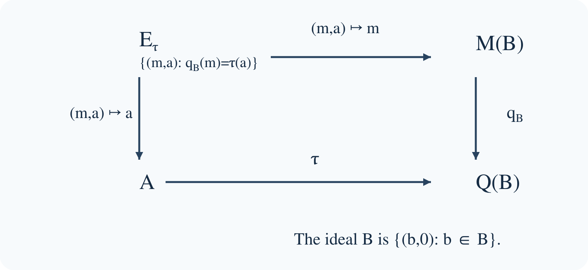

# Extensions of C\*-algebras and the Busby invariant

*Written by GPT-6.1 Sol (OpenAI). Public domain (CC0).*

An operator can satisfy an algebraic relation after compact errors are discarded even when no compact perturbation satisfies the relation exactly. The unilateral shift is the simplest example: it becomes a unitary in the Calkin algebra, but it cannot be changed into a unitary by adding a compact operator. Extension theory records precisely this distinction between a relation in a quotient and a relation upstairs.

This lesson describes an arbitrary extension by a homomorphism into a corona algebra. It proves that the homomorphism determines the extension, explains what its kernel means, and characterizes both homomorphic and completely positive splittings. The ideal and quotient are allowed to be nonunital and nonseparable.

The C\*-algebra tools used below have their proofs in the earlier programme lesson [continuous functional calculus, homomorphisms, positive cones and quotients](https://kokunoyumeto.github.io/open-math-courses-public/courses/foundations-of-von-neumann-algebras/c-star-algebras-continuous-functional-calculus-automatic-continuity-positive-cones.html): Theorems 4.2 and 4.4 establish contractivity and faithful isometry, Theorem 5.1 supplies the calculus of normal elements, Proposition 8.5 supplies the order inequalities, and Theorem 15.1 constructs C\*-quotients. Here we construct the approximate identity and the multiplier algebra directly in Lemma 2.0. Lemmas 1.1–1.2 prove the Fredholm and index facts needed in the examples. The freely readable Busby paper and Blackadar's actual author editions listed below are material for these proofs.

We follow three concrete questions. Can a quotient relation be lifted exactly, or at least with positivity preserved? Which actions on an ideal and quotient count as the same extension? What information is lost when the ideal fails to detect the middle algebra? The shift and a commutative cone pose the first question; compatible pairs answer the other two. We return to these answers in a two-summand operator model.

## 1. A unitary downstairs without a unitary upstairs

Let \(H=\ell^2(\mathbb N_0)\), with orthonormal basis \(e_0,e_1,\ldots\), and let \(S e_j=e_{j+1}\). Write \(\mathcal K=\mathcal K(H)\), let \(q:\mathcal B(H)\to\mathcal Q(H)=\mathcal B(H)/\mathcal K\) be the quotient, and put \(\mathcal T=C^*(S)\).

The equations

\[
S^*S=1,\qquad SS^*=1-p_0
\]

show that \(q(S)\) is unitary. Here \(p_0\) is the rank-one projection onto \(\mathbb C e_0\). Moreover, \(S^i p_0(S^*)^j\) are matrix units, so \(\mathcal K\subset\mathcal T\).

The spectrum of \(q(S)\) is the whole circle. To see the only nontrivial inclusion, fix \(|\lambda|=1\) and set

\[
\xi_N=N^{-1/2}\sum_{j=N}^{2N-1}\lambda^{-j}e_j.
\]

These vectors have norm one, converge weakly to zero, and satisfy \(\|(S-\lambda)\xi_N\|=\sqrt{2/N}\). If \(q(S)-\lambda\) were invertible, there would be a bounded \(R\) and a compact \(k\) with \(R(S-\lambda)=1+k\). Applying this identity to \(\xi_N\) gives a contradiction. A compact operator takes a bounded weakly null sequence to a norm-null sequence.

### Lemma 1.1. The Fredholm obstruction survives compact errors

For a bounded operator \(T\) on a Hilbert space, invertibility modulo compact operators is equivalent to closed range and finite-dimensional kernel and cokernel. In this situation set
\[
\operatorname{index}T=\dim\ker T-\dim\ker T^*.
\]
The index is locally constant on the Fredholm operators and is unchanged by a compact perturbation.

**Proof.** Suppose \(RT=1+k\) and \(TR=1+l\), with \(k,l\) compact. Compression of the first identity to \(\ker T\) makes its identity compact, so that kernel is finite dimensional. Applying the same argument to \(T^*\) makes \(\ker T^*\) finite dimensional. On \((\ker T)^\perp\), the operator \(T\) is bounded below. Otherwise there would be unit vectors \(x_j\) in that subspace with \(Tx_j\to0\). Compactness gives a convergent subsequence of \(kx_j\), and \(x_j=RTx_j-kx_j\) then converges in norm to a unit vector in both \(\ker T\) and its orthogonal complement, a contradiction. A bounded-below operator has closed range. Its orthogonal cokernel is \(\ker T^*\).

Conversely, if the range is closed and both defect spaces are finite dimensional, the restriction \(T:(\ker T)^\perp\to\operatorname{ran}T\) has bounded inverse. Extend that inverse by zero on \(\ker T^*\). The two parametrix errors are the finite-rank projections onto the defect spaces.

For local constancy, write the domain as \(\ker T\oplus(\ker T)^\perp\) and the target as \(\ker T^*\oplus\operatorname{ran}T\). In these coordinates \(T\)'s lower-right block is invertible. For every sufficiently close operator \(T'\), its lower-right block \(D\) is still invertible. Bounded invertible triangular row and column operations reduce its block matrix to
\[
\begin{pmatrix}A-BD^{-1}C&0\\0&D\end{pmatrix}.
\]
The first block is a map between the two fixed finite-dimensional defect spaces. Its kernel dimension minus cokernel dimension is their dimension difference, irrespective of its rank. Invertible changes of coordinates preserve kernels, closed range and cokernel dimensions. Thus \(T'\) is Fredholm with the same index as \(T\).

If \(k\) is compact, every \(T+tk\), \(0\leq t\leq1\), has the same invertible quotient image. The equivalence just proved makes this a Fredholm path. Local constancy on the connected interval proves compact-perturbation invariance. \(\square\)

### Lemma 1.2. Direct sums and composition of Fredholm maps

The preceding criterion and index invariance also hold for a bounded map between two Hilbert spaces, with a parametrix going in the reverse direction. Indices add under finite direct sums. If \(S:H_0\to H_1\) and \(T:H_1\to H_2\) are Fredholm, then
\[
\operatorname{index}(TS)
=\operatorname{index}T+\operatorname{index}S.
\]

**Proof.** Every step of Lemma 1.1 uses a domain, a target, and the two typed parametrix identities. It applies unchanged with distinct Hilbert spaces: the inverse on the kernel complement takes the closed range in the target back to that complement in the domain. Kernels and orthogonal cokernels of a direct sum are the corresponding direct sums, proving the first addition rule.

Composing parametrices shows that \(TS\) has a parametrix modulo compacts, because the compact operators remain compact after multiplication by bounded maps. It is therefore Fredholm. Write \(\operatorname{coker}S=H_1/\operatorname{ran}S\), and similarly for the other maps. The following sequence of finite-dimensional vector spaces is exact:
\[
\begin{gathered}
0\longrightarrow\ker S\longrightarrow\ker(TS)
\overset{S}{\longrightarrow}\ker T\\
\longrightarrow\operatorname{coker}S
\overset{T}{\longrightarrow}\operatorname{coker}(TS)\\
\longrightarrow\operatorname{coker}T\longrightarrow0.
\end{gathered}
\]
The first arrow is inclusion. The arrow out of \(\ker T\) takes a vector to its class modulo \(\operatorname{ran}S\). The next arrow sends \([y]\) to \([Ty]\), and the last is the quotient map. They are well defined because \(T(\operatorname{ran}S)=\operatorname{ran}(TS)\).

For exactness at \(\ker(TS)\), the kernel of its restriction of \(S\) is \(\ker S\). At \(\ker T\), a vector has zero quotient class precisely when it is \(Sx\), and then \(TSx=0\). At \(\operatorname{coker}S\), if \(Ty=TSx\), the vector \(y-Sx\) lies in \(\ker T\) and represents \([y]\). At \(\operatorname{coker}(TS)\), a class vanishes in \(\operatorname{coker}T\) precisely when it has a representative \(Ty\). The final quotient map is onto. These observations prove every exactness assertion. Taking the alternating sum of dimensions gives the composition formula, since each cokernel quotient has the dimension of the orthogonal cokernel used in Lemma 1.1. \(\square\)

Consequently continuous functional calculus gives an isomorphism \(C(S^1)\to C^*(q(S))\), sending the coordinate function \(z\) to \(q(S)\). Thus

\[
0\longrightarrow\mathcal K\longrightarrow\mathcal T
\overset{\sigma}{\longrightarrow}C(S^1)\longrightarrow0,
\qquad \sigma(S)=z,
\]

is exact. A homomorphic section would send \(z\) to a unitary \(U\in\mathcal T\) with \(U-S\) compact. But \(\operatorname{index}S=-1\) and \(\operatorname{index}U=0\), contradicting compact-perturbation invariance of the Fredholm index. This remains a contradiction if the section is not required to preserve units: its value on \(1\) is a projection \(P\) with \(1-P\) finite rank, and its value on \(z\) is unitary on \(PH\) and zero on \((1-P)H\), hence still Fredholm of index zero.

The quotient relation is therefore meaningful information. We next isolate it without using a particular representation on a Hilbert space.

A **split extension** admits a homomorphism \(s:A\to E\) with \(ps=\operatorname{id}_A\). We do not require \(s\) to be unital. A **semisplit extension** admits a completely positive contraction with the same section property. A linear map \(L\) is completely positive if every matrix amplification \(L^{(n)}\) preserves positive elements; it is contractive if \(\|L\|\leq1\).

### Proposition 3.2. The Toeplitz extension is semisplit

Identify \(H\) with the Hardy subspace of \(L^2(S^1)\), let \(P\) be its orthogonal projection, and let \(M_f\) be multiplication by \(f\). Then

\[
f\longmapsto T_f=PM_f|_H
\]

is a unital completely positive contractive section of \(\sigma\).

**Proof.** Compression of a homomorphism is completely positive: for a positive matrix \([f_{ij}]\), the matrix \([M_{f_{ij}}]\) is positive on \(L^2(S^1)^n\), and its compression to \(H^n\) remains positive. Compression is contractive. Trigonometric polynomials give operators in \(C^*(S)\), since \(T_z=S\) and \(T_{\bar z}=S^*\). Uniform approximation gives \(T_f\in\mathcal T\) for every continuous \(f\). The symbol of a trigonometric polynomial is that polynomial, so continuity gives \(\sigma(T_f)=f\). \(\square\)

The section is not multiplicative: \(T_zT_{\bar z}=1-p_0\), whereas \(T_{z\bar z}=1\). Semisplitting retains positivity while allowing the compact multiplicative error.

The [matrix test for complete positivity](erdman-positive-maps.html) shows why scalar positivity is insufficient: transpose is positive but fails at the two-by-two amplification. Compression, by contrast, preserves positivity at every matrix level.

### A commutative lifting problem

The obstruction need not come from a Fredholm index. Evaluation at zero gives an extension from \(C_0([0,1))\) onto \(\mathbb C\), with kernel \(C_0((0,1))\). Choose \(0\leq h\leq1\) continuous, with \(h(0)=1\) and \(h(1)=0\). The map \(c\mapsto ch\) is a completely positive contractive section: at every matrix level it multiplies a positive scalar matrix by a nonnegative function. A homomorphic section would instead send \(1\) to a continuous projection-valued function with value one at zero and value zero at the other end. Connectedness rules out such a function.

Both this extension and the Toeplitz extension preserve positivity under a chosen lift, yet neither admits a homomorphic section. Their obstructions have different proofs. The corona description will put both into one language without erasing that difference.

## 2. How the ideal sees the middle algebra

An **extension of \(A\) by \(B\)** is a short exact sequence

\[
0\longrightarrow B\overset{j}{\longrightarrow}E
\overset{p}{\longrightarrow}A\longrightarrow0.
\]

Exactness identifies \(B\), through \(j\), with \(\ker p\), a closed two-sided ideal of \(E\); the following construction describes all possible actions on that ideal.

### Lemma 2.0. The multiplier algebra and its extension map

For an arbitrary C\*-algebra \(B\), a **double centralizer** is a pair of bounded complex-linear maps \(L,R:B\to B\) satisfying

\[
\begin{gathered}
L(ab)=L(a)b,\qquad R(ab)=aR(b),\\
aL(b)=R(a)b\quad(a,b\in B).
\end{gathered}
\]

These pairs form a unital C\*-algebra \(M(B)\). The map taking \(b\) to left and right multiplication by \(b\) embeds \(B\) isometrically as an essential ideal. If \(B\) is an ideal in a C\*-algebra \(E\), there is a unique homomorphism

\[
\begin{aligned}
\mu:E&\longrightarrow M(B),\\
\mu(e)&=(b\mapsto eb,\ b\mapsto be)
\end{aligned}
\]

which restricts to this embedding of \(B\). Its kernel is the annihilator \(\{e:eB=Be=0\}\). None of these assertions needs a countable approximate identity.

**Proof.** Write \(L^\#(b)=R(b^*)^*\) and \(R^\#(b)=L(b^*)^*\). The operations on pairs are

\[
\begin{gathered}
(L_1,R_1)(L_2,R_2)
=(L_1\circ L_2,R_2\circ R_1),\\
(L,R)^*=(L^\#,R^\#).
\end{gathered}
\]

The order in the second coordinate is reversed, because right multiplication by a product applies its first factor before its second. Substitution in the three identities verifies closure under these operations. For instance,

\[
aL_1(L_2(b))
=R_1(a)L_2(b)
=R_2(R_1(a))b.
\]

The involution interchanges left and right actions and reverses products; applying it twice returns the original pair. The identity pair is \((\operatorname{id}_B,\operatorname{id}_B)\).

Here is a construction of the approximate identity used in the norm argument. For a finite subset \(F\subset B\), put

\[
h_F=\sum_{b\in F}(b^*b+bb^*),
\qquad u_{F,\delta}=h_F(h_F+\delta)^{-1}\quad(\delta>0),
\]

where the inverse is taken in the unitization. Continuous functional calculus makes \(u_{F,\delta}\) a positive contraction belonging to \(B\). If \(b\in F\), then \(b^*b,bb^*\leq h_F\). Conjugating these inequalities by \(1-u_{F,\delta}\) and using the C\*-identity gives

\[
\begin{gathered}
\|b(1-u_{F,\delta})\|^2,
\quad\|(1-u_{F,\delta})b\|^2\\
\leq\|(1-u_{F,\delta})h_F(1-u_{F,\delta})\|\\
\leq\sup_{t\geq0}\frac{\delta^2t}{(t+\delta)^2}
=\frac\delta4.
\end{gathered}
\]

Direct the pairs by enlargement of \(F\) and decrease of \(\delta\). Every fixed \(b\) eventually lies in \(F\), and these bounds prove both approximate-identity limits. No separability assumption enters this construction.

Let \((u_\lambda)\) denote this positive contractive approximate identity. Compatibility gives

\[
R(a)u_\lambda=aL(u_\lambda),
\qquad
u_\lambda L(a)=R(u_\lambda)a.
\]

Taking limits in the left sides bounds \(\|R(a)\|\leq\|a\|\|L\|\) and \(\|L(a)\|\leq\|a\|\|R\|\). Thus the two operator norms agree. Give a pair this common norm. Taking adjoints in the compatibility identity also gives

\[
L(b)^*c=b^*L^\#(c).
\]

With \(c=L(b)\), the C\*-identity in \(B\) yields

\[
\|L(b)\|^2
\leq\|b\|^2\|L^\#\circ L\|.
\]

Supremum over the unit ball gives \(\|L\|^2\leq\|L^\#\circ L\|\). The opposite inequality follows from composition of bounded maps and \(\|L^\#\|=\|R\|=\|L\|\). This proves the C\*-identity for pairs.

Completeness can be checked directly. A Cauchy sequence of pairs is Cauchy in each bounded-map norm. For each \(b\), its two values converge in the Banach space \(B\). The uniform Cauchy estimates show that the resulting maps are bounded and that the original maps converge in operator norm. Passing the three identities to these limits makes the limit a double centralizer. The pairs therefore form a C\*-algebra.

For \(b\in B\), denote its multiplication pair by \(\iota(b)\). Its norm is at most \(\|b\|\), and \(bu_\lambda\to b\) gives the reverse inequality. The displayed operations show that \(\iota\) is a homomorphism preserving adjoints. For a pair \(m=(L,R)\), compatibility and the left and right identities give

\[
m\iota(b)=\iota(L(b)),
\qquad
\iota(b)m=\iota(R(b)).
\]

Thus \(\iota(B)\) is a closed two-sided ideal. If an ideal \(I\subset M(B)\) has zero intersection with \(\iota(B)\), then every product of a member of \(I\) with \(\iota(b)\) is zero. Its two centralizers vanish on every \(b\), so that member is zero. Hence \(B\) is essential in \(M(B)\).

When \(B\) is an ideal in \(E\), multiplication by \(e\in E\) gives bounded maps on \(B\), with norms at most \(\|e\|\). Associativity supplies all three centralizer identities. The formulas for products and adjoints prove that \(e\mapsto\mu(e)\) is a homomorphism. Its kernel consists precisely of the elements with both actions zero. If another homomorphism \(\nu:E\to M(B)\) fixes \(B\), then

\[
\nu(e)\iota(b)=\iota(eb),
\qquad
\iota(b)\nu(e)=\iota(be).
\]

These products determine its left and right centralizers, so \(\nu(e)=\mu(e)\). This proves uniqueness. For \(B=0\) the pair algebra is zero and the same statements have their zero-algebra interpretation. \(\square\)

In the unital case, apply the compatibility identity at \(1\) to get \(L(b)=L(1)b\), \(R(b)=bL(1)\), and hence \(M(B)=B\). The nonunital case is the one in which the multiplier algebra supplies genuinely new operators.

For the operator examples we also need the identification \(M(\mathcal K(H))=\mathcal B(H)\). This too follows from the centralizers, rather than being an extra assumption. Suppose \(H\ne0\), fix a unit vector \(\eta\), and write \(\theta_{\xi,\zeta}(v)=\xi\langle\zeta,v\rangle\). For a pair \((L,R)\) on \(\mathcal K(H)\), define

\[
T\xi=L(\theta_{\xi,\eta})\eta.
\]

This is a bounded linear operator of norm at most \(\|L\|\). Factoring a rank-one operator as \(\theta_{\xi,\eta}\theta_{\eta,\zeta}\) gives \(L(\theta_{\xi,\zeta})=\theta_{T\xi,\zeta}\). By linearity and norm density of the finite-rank operators, \(L(k)=Tk\) for every compact \(k\). Compatibility now gives \(R(k)l=kTl\) for every compact \(l\). Applying this to rank-one \(l\) whose range contains an arbitrary vector proves \(R(k)=kT\). Conversely, a bounded \(T\) gives such a pair: multiplication preserves compactness, since it preserves finite rank and is continuous. Testing on \(\theta_{\xi,\eta}\) with \(\|\xi\|=1\) proves equality of the pair norm and \(\|T\|\). Products and adjoints agree with those in \(\mathcal B(H)\), so the identification is an isometric C\*-algebra isomorphism. The case \(H=0\) is again immediate.

Let \(Q(B)=M(B)/B\), with quotient homomorphism \(q_B\). The extension map of Lemma 2.0 satisfies \(\mu(b)=b\) on its ideal. Consequently \(q_B\mu\) is zero there and defines a unique homomorphism

\[
\tau:A\longrightarrow Q(B),
\qquad
\tau(p(e))=q_B(\mu(e)).
\]

This is the **Busby invariant**. Choosing a different lift of the same \(a\) adds an element of \(B\) to \(e\), which adds that same element to \(\mu(e)\); its corona class is unchanged. The definition therefore requires no chosen section.

The two maps have different roles: \(\mu(e)\) specifies the action on the ideal, while \(p(e)\) specifies the quotient value. Reconstruction retains both. In particular no injectivity of \(\mu\) is assumed.

*Figure 1. The compatibility square defining the extension. The horizontal and vertical maps have exactly the domains shown. The multiplier projection need not be injective; the pair of projections is jointly injective.*

### Theorem 2.1. Reconstruction by compatible pairs

For any homomorphism \(\tau:A\to Q(B)\), the algebra

\[
E_\tau=\{(m,a)\in M(B)\oplus A:q_B(m)=\tau(a)\}
\]

gives an extension of \(A\) by \(B\), with ideal map \(b\mapsto(b,0)\) and quotient map \((m,a)\mapsto a\). Its Busby invariant is \(\tau\). Conversely, every extension with Busby invariant \(\tau\) is isomorphic to this extension by

\[
\Phi:E\longrightarrow E_\tau,\qquad
\Phi(e)=(\mu(e),p(e)).
\]

The isomorphism fixes the given ideal and quotient.

**Proof.** The operations on \(M(B)\oplus A\) preserve the compatibility equation because both maps in that equation are homomorphisms. Its solution set is closed, so it is a C\*-subalgebra. Given \(a\in A\), surjectivity of \(q_B\) supplies \(m\) with \(q_B(m)=\tau(a)\); thus the second projection maps onto \(A\). Its kernel consists precisely of the pairs \((b,0)\) with \(b\in B\). These are the ideal, and multiplication of \((m,a)\) on the ideal has centralizers given by \(m\). Lemma 2.0 identifies the multiplier map as the first projection. Passing this map to the quotient gives exactly \(\tau\).

Now start with an arbitrary extension. The maps \(\mu\) and \(p\) are homomorphisms and satisfy \(q_B\mu=\tau p\), so \(\Phi\) is a homomorphism into this pullback. If \(\Phi(e)=0\), then \(p(e)=0\), hence \(e\in B\); but \(\mu|_B\) is the faithful embedding of Lemma 2.0, so \(e=0\). To prove surjectivity, take a compatible pair \((m,a)\) and choose \(e\in E\) with \(p(e)=a\). Compatibility says

\[
q_B(m-\mu(e))=\tau(a)-\tau(p(e))=0.
\]

Thus \(m-\mu(e)\) is an element \(b\in B\). Regard \(b\) also as an element of the ideal of \(E\). Then

\[
\Phi(e+b)=(\mu(e)+b,p(e))=(m,a).
\]

The injective homomorphism \(\Phi\) is isometric by the earlier homomorphism theorem, and it is onto; it is therefore a C\*-algebra isomorphism. It sends the ideal element \(b\) to \((b,0)\) and leaves the quotient element unchanged. In particular the argument covers extensions whose ideal is not essential: only the pair of maps needs to be injective. \(\square\)

### Choosing the identifications

The words “equivalent extensions” must specify what happens to the ideal and quotient.

An **isomorphism fixing the ends** is an isomorphism \(\gamma:E_1\to E_2\) with \(\gamma j_1=j_2\) and \(p_2\gamma=p_1\). Theorem 2.1 implies that such an isomorphism exists exactly when \(\tau_1=\tau_2\). Indeed it must intertwine the multiplier actions on the fixed ideal, and hence their Busby invariants; conversely both extensions identify with the same pullback.

The Busby invariants are **strongly unitarily equivalent** if

\[
\tau_2(a)=q_B(U)\tau_1(a)q_B(U)^*,
\qquad U\in\mathcal U(M(B)).
\]

The resulting pullback isomorphism is

\[
(m,a)\longmapsto(UmU^*,a).
\]

It induces the identity on \(A\), but induces \(b\mapsto UbU^*\) on \(B\). This distinction matters: strong unitary equivalence does not assert an isomorphism fixing the ideal pointwise.

They are **weakly unitarily equivalent** if the same formula holds with a unitary \(v\in Q(B)\), without requiring \(v=q_B(U)\). Strong unitary equivalence implies weak unitary equivalence. Weak unitary equivalence preserves injectivity of \(\tau\), and it preserves unitality when \(A\) is unital. It does not provide the displayed isomorphism of pullbacks: \(m\mapsto vmv^*\) is not even a map on \(M(B)\).

The lifting obstruction is concrete for \(B=\mathcal K\). The unitary \(q(S)\) has no unitary lift, since every operator lifting it has Fredholm index \(-1\). Thus a corona unitary is a strictly weaker datum than a multiplier unitary. Stabilized equivalence, which also allows adding split extensions, will be introduced in the next lesson.

### Theorem 2.2. What the kernel detects

The following conditions are equivalent:

1. \(B\) is an essential ideal in \(E\): every nonzero closed two-sided ideal of \(E\) meets \(B\) nontrivially.
2. The multiplier map \(\mu:E\to M(B)\) is injective.
3. The Busby invariant \(\tau:A\to Q(B)\) is injective.

**Proof.** The kernel of \(\mu\) is the annihilator

\[
B^\perp=\{e\in E:eB=Be=0\}.
\]

This is a closed ideal with zero intersection with \(B\). Conversely, if an ideal \(I\subset E\) has \(I\cap B=0\), then \(IB\) and \(BI\) lie in the intersection, so \(I\subset B^\perp\). Thus essentiality is equivalent to \(\ker\mu=0\).

If \(\mu\) is injective and \(\tau(a)=0\), choose \(e\) lifting \(a\). Then \(\mu(e)=b\) for some \(b\in B\), so \(\mu(e-b)=0\), whence \(e=b\) and \(a=0\). Conversely, if \(\tau\) is injective and \(\mu(e)=0\), then \(\tau(p(e))=0\), so \(e\in B\), and \(e=\mu(e)=0\). \(\square\)

More precisely, restriction of \(p\) identifies \(B^\perp\) with \(\ker\tau\). It is injective because \(B^\perp\cap B=0\). For \(a\in\ker\tau\), the argument just used produces a lift \(e-b\in B^\perp\). The failure of essentiality is therefore visible as an actual ideal in the quotient.

## 3. Two meanings of a splitting

The shift compression above illustrates the distinction between a homomorphic section and a completely positive contractive section. We now characterize both without choosing a Hilbert-space representation.

### Theorem 3.1. Splitting is lifting

An extension is split exactly when its Busby invariant has a homomorphic lift \(L:A\to M(B)\). It is semisplit exactly when its Busby invariant has a completely positive contractive lift \(L:A\to M(B)\).

**Proof.** First suppose \(s:A\to E\) is a section. The composite \(L=\mu s\) lifts \(\tau\), because \(q_B\mu s=\tau ps=\tau\). For a homomorphic section it is a homomorphism. For a completely positive contractive section, amplify \(\mu\) to each matrix size: it is a homomorphism, so it takes positive matrices to positive matrices. Consequently \(\mu s\) is completely positive. The contractivity of \(\mu\), proved for C\*-homomorphisms in the earlier programme lesson, gives \(\|\mu s\|\leq1\).

Conversely let \(L\) be a lift of the stated kind. Define

\[
\widetilde s(a)=(L(a),a).
\]

The equation \(q_BL=\tau\) places its range in \(E_\tau\), and the second projection composed with \(\widetilde s\) is the identity. If \(L\) is a homomorphism, coordinatewise operations make \(\widetilde s\) a homomorphism. If \(L\) is a completely positive contraction, then for every positive \([a_{ij}]\in M_n(A)\) both \([L(a_{ij})]\) and \([a_{ij}]\) are positive. Hence their pair is positive in the direct sum. Positivity in a C\*-subalgebra is inherited from the ambient algebra: the positive square root is a uniform limit of polynomials in the positive element and belongs to the subalgebra, by continuous functional calculus. This observation applies at every matrix size and proves complete positivity into \(E_\tau\). Its norm is

\[
\|\widetilde s(a)\|=\max\{\|L(a)\|,\|a\|\}=\|a\|.
\]

It is therefore contractive. Composing with the inverse of \(\Phi\) from Theorem 2.1 yields the required section of the original extension. That inverse is an isometric homomorphism and thus preserves complete positivity. Neither direction requires a unit or a countable approximate identity. \(\square\)

A split extension need not be the direct sum \(B\oplus A\). Its section can act nontrivially on \(B\). For example, scalar multiplication defines an essential split extension

\[
0\longrightarrow\mathcal K\longrightarrow\mathcal K+\mathbb C1
\longrightarrow\mathbb C\longrightarrow0.
\]

Its Busby invariant sends \(1\) to \(1_{\mathcal Q}\), whereas the direct-sum extension has zero Busby invariant.

## 4. Which identifications are being allowed?

The preceding classification becomes particularly transparent when the quotient has two independent scalar coordinates. Let \(P\in\mathcal B(H)\) be a projection with both \(PH\) and \((1-P)H\) infinite dimensional. Define
\[
\begin{aligned}
\tau_P:\mathbb C^2&\longrightarrow\mathcal Q(H),\\
\tau_P(\lambda,\mu)&=\lambda q(P)+\mu(1-q(P)).
\end{aligned}
\]

**Example 4.1. Two scalar regions joined by compact errors.** The extension with invariant \(\tau_P\) has middle algebra
\[
E_P=\mathcal K(H)+\mathbb CP+\mathbb C(1-P).
\]
It is essential and split. For two such projections \(P,Q\), the extensions are isomorphic fixing both ends exactly when \(P-Q\) is compact. A unitary \(U\) with \(Q=UPU^*\) instead gives a strong unitary equivalence whose ideal map is \(\operatorname{Ad}(U)\).

**Verification.** Neither \(q(P)\) nor \(1-q(P)\) is zero: an infinite-dimensional projection is not compact. They are nonzero orthogonal projections, so \(\tau_P\) is injective. Its pullback consists of an operator \(T\) and a unique pair \((\lambda,\mu)\) such that
\[
T-\lambda P-\mu(1-P)\in\mathcal K(H).
\]
Thus projection onto \(T\) identifies the pullback with the displayed algebra. Theorem 2.2 proves essentiality. The map \((\lambda,\mu)\mapsto\lambda P+\mu(1-P)\) is a homomorphic section, proving splitting directly. Relative to \(PH\oplus(1-P)H\), the diagonal blocks are scalar modulo compacts and the off-diagonal blocks are compact. This describes the actual operators, as well as their invariant.

The fixed-ends criterion is \(\tau_P=\tau_Q\). Evaluating it on \((1,0)\) gives precisely \(q(P)=q(Q)\), or \(P-Q\in\mathcal K(H)\); the same condition suffices on every pair. If \(Q=UPU^*\), conjugation gives \(\tau_Q=\operatorname{Ad}(q(U))\tau_P\), and its restriction to the ideal is the conjugation already computed. For example, removing one finite-rank subprojection from \(P\) changes its scalar section but leaves its invariant and fixed-ends extension unchanged. Rotating infinitely many two-dimensional blocks can change the invariant while preserving strong unitary equivalence; Exercise 6.5 makes that distinction explicit. \(\square\)

This example separates three pieces of information. A splitting chooses exact scalar representatives. The Busby invariant forgets their compact changes. A strong unitary equivalence can move the ideal's operators by conjugation. For a weak unitary witness in the corona, the Fredholm obstruction of Lemma 1.1 still prevents one from assuming a unitary lift. The existence of a different strong witness is a separate question.

## 5. Other extensions seen through their quotient relations

### The zero invariant

For \(\tau=0\), compatibility says \(m\in B\), so \(E_0=B\oplus A\). If \(A\ne0\), the ideal \(B\) is not essential: the second summand annihilates it. This example also explains why one cannot prove Theorem 2.1 merely by claiming that \(\mu\) is injective.

If \(B\) is unital, then \(M(B)=B\) and \(Q(B)=0\). Hence every extension by a unital ideal is isomorphic, fixing the ends, to the direct-sum extension. The ideal's unit separates the two summands.

### Cone and suspension

Put \(CA=C_0([0,1),A)\) and \(SA=C_0((0,1),A)\). Evaluation at zero gives

\[
0\longrightarrow SA\longrightarrow CA
\overset{\operatorname{ev}_0}{\longrightarrow}A\longrightarrow0.
\]

An element \(f\in CA\) acts on \(SA\) by pointwise multiplication. The Busby invariant of \(a\) is the multiplier class of \(t\mapsto h(t)a\), for any continuous scalar \(h\) with \(h(0)=1\) and \(h(1)=0\). Different choices differ by an element of \(SA\). Taking \(0\leq h\leq1\) gives a completely positive contractive section \(a\mapsto ha\). The invariant is injective: if the multiplier \(ha\) belongs to \(SA\), its limit at zero is both \(a\) and zero.

For \(A=\mathbb C\), this extension is not split. A section would send \(1\) to a projection in \(C_0([0,1))\) having value one at zero. A continuous function into \(\{0,1\}\) on the connected interval is constant, and the only constant vanishing at one is zero. This is a commutative semisplit, nonsplit, essential extension.

### Essentially normal operators

Let \(T\in\mathcal B(H)\) satisfy \([T,T^*]\in\mathcal K\). Then \(q(T)\) is normal. Put \(X=\operatorname{spec}(q(T))\), a compact subset of \(\mathbb C\). Functional calculus gives the injective homomorphism

\[
\tau_T:C(X)\longrightarrow\mathcal Q(H),\qquad
\tau_T(f)=f(q(T)).
\]

The associated extension is essential. Its middle algebra is \(C^*(1,T,\mathcal K)\): its quotient is exactly \(C^*(1,q(T))\cong C(X)\). Explicitly the pullback isomorphism sends \(e\) to \((e,f)\), where \(q(e)=f(q(T))\). The quotient function \(f\) is unique because \(\tau_T\) is injective.

For \(\lambda\notin X\), the operator \(T-\lambda\) is Fredholm. Its index is constant on each connected component of \(\mathbb C\setminus X\), because Fredholm index is locally constant. For the shift, \(X=S^1\), the index is \(-1\) inside the circle and zero outside. These integers will become the basic invariants in Brown–Douglas–Fillmore theory.

## 6. Exercises

**Exercise 6.1 (basic).** Determine the Busby invariant of the Toeplitz extension on every \(f\in C(S^1)\). Explain why using the compression section to calculate it does not make the extension split.

**Exercise 6.2 (intermediate).** Let \(E\) be an arbitrary extension, and let \(\mu\) be its multiplier map. Prove directly that \(\ker\mu\cong\ker\tau\), and use this to describe the multiplier map in the direct-sum extension. Identify the exact step that fails if reconstruction is attempted using \(\mu\) alone.

**Exercise 6.3 (intermediate).** Prove that the Toeplitz extension is semisplit but not split, allowing a section that does not preserve units. Then prove the analogous two assertions for evaluation at zero from \(C_0([0,1))\) to \(\mathbb C\).

**Exercise 6.4 (advanced).** Suppose \(\tau_2=\operatorname{Ad}(q_B(U))\tau_1\) for a multiplier unitary \(U\). Construct the extension isomorphism and state its two end maps. Determine when this particular isomorphism fixes \(B\) pointwise. Explain what can still be concluded if only a corona unitary is given, and why lifting cannot be assumed.

**Exercise 6.5 (intermediate).** On \(\ell^2(\mathbb N_0)\), let \(P\) project onto the even-indexed basis vectors. For \(0<\theta\leq\pi/2\), let \(Q_\theta\) project onto the closed span of \(\cos\theta\,e_{2j}+\sin\theta\,e_{2j+1}\). Compare the corresponding two-summand extensions: are they split, essential, strongly unitarily equivalent, or isomorphic fixing both ends?

## 7. Solutions

**Solution 6.1.** The invariant is \(\tau(f)=f(q(S))=q(T_f)\). For Laurent polynomials this follows from \(q(S)^*=q(S^*)\); uniform approximation proves it for all continuous \(f\). A Busby invariant is a homomorphism in the quotient. Its chosen lift \(f\mapsto T_f\) is completely positive but not a homomorphism, since \(T_zT_{\bar z}\ne T_1\). Its multiplicative errors disappear after applying \(q\).

**Solution 6.2.** Restriction of \(p\) to \(\ker\mu\) is injective, since an element of this kernel lying in \(B\) is zero. Its image lies in \(\ker\tau\). If \(\tau(a)=0\), choose \(e\) lifting \(a\); then \(\mu(e)=b\in B\), and \(e-b\in\ker\mu\) lifts \(a\). Thus the restriction is a bijective homomorphism. For \(B\oplus A\), the multiplier map sends \((b,a)\) to \(b\); its kernel is \(0\oplus A\). Reconstruction using only this map loses the entire second summand. Keeping \(p(e)\) as the second coordinate restores injectivity, as in Theorem 2.1.

**Solution 6.3.** Compression gives the completely positive contractive Toeplitz section of Proposition 3.2. If a homomorphic section \(s\) existed, put \(P=s(1)\) and \(V=s(z)\). Then \(V^*V=VV^*=P\), and \(q(P)=1\), so \(1-P\) is a finite-rank projection. The operator \(V\) has equal kernel and cokernel, both \((1-P)H\), and hence index zero. But \(q(V)=q(S)\), so \(V-S\) is compact and its index must be \(-1\). For the cone extension, \(c\mapsto ch\) with \(h(0)=1\), \(h(1)=0\), and \(0\leq h\leq1\) is a completely positive contraction and a section. A homomorphic section would give the impossible projection described in Section 5.

**Solution 6.4.** In the pullback description, take \(\gamma(m,a)=(UmU^*,a)\). The compatibility equation follows by applying \(q_B\). Conjugation by \(U^*\) gives its inverse. Its end maps are \(\operatorname{Ad}(U)|_B\) and \(\operatorname{id}_A\). It fixes \(B\) pointwise exactly when \(U\) commutes with every \(b\in B\). In that case it commutes with every multiplier: both \((Um-mU)b\) and \(b(Um-mU)\) vanish, so essentiality of \(B\) in \(M(B)\) gives \(Um=mU\). Thus this case has \(\tau_1=\tau_2\), in agreement with the fixed-ends classification.

For a unitary \(v\in Q(B)\), one still obtains weak unitary equivalence and preservation of injectivity and unitality. The formula for \(\gamma\) requires a lift implementing the conjugation on multipliers; it does not follow merely from \(v\)'s existence. In the Calkin case \(v=q(S)\) already shows why a unitary lift need not exist. If the invariants happen to be equal, Theorem 2.1 supplies a fixed-ends isomorphism independently of any lifting of \(v\). These are distinct assertions and should not be conflated.

**Solution 6.5.** Both projections have infinite-dimensional range and complement, so Example 4.1 makes both extensions essential and split. On each ordered pair \(e_{2j},e_{2j+1}\), the rotation \(\begin{pmatrix}\cos\theta&-\sin\theta\\\sin\theta&\cos\theta\end{pmatrix}\) gives a unitary. Their orthogonal direct sum \(U_\theta\) is a unitary with \(Q_\theta=U_\theta P U_\theta^*\), hence gives strong unitary equivalence. But \(\|(P-Q_\theta)e_{2j}\|=\sin\theta>0\) for every \(j\). The basis sequence is weakly null, so \(P-Q_\theta\) is not compact. The invariants differ, and there is no fixed-ends isomorphism. The strong equivalence acts on the ideal by \(\operatorname{Ad}(U_\theta)\), exactly accounting for the difference.

## What this lesson does not prove

The multiplier construction, its C\*-norm and extension map, and its identification with \(\mathcal B(H)\) when the ideal is \(\mathcal K(H)\), are proved in Lemma 2.0. The same proof constructs the positive contractive approximate identity for an arbitrary C\*-algebra. Lemmas 1.1–1.2 prove the Hilbert-space Fredholm criterion, index invariance and both addition rules. The Busby correspondence, essentiality criterion, both lifting criteria and all the displayed extension examples are proved here. The coefficient-valued module index and absorption theorems are not used in these arguments.

The remaining earlier programme inputs are the continuous functional calculus and C\*-algebra order and quotient theorems named in the introduction; the bounded inverse theorem proved in [Hahn–Banach, Baire and the basic theorems on Banach spaces](https://kokunoyumeto.github.io/open-math-courses-public/courses/foundations-of-von-neumann-algebras/hahn-banach-baire-and-the-basic-theorems-on-banach-spaces.html), Theorem 5.1 and Corollary 5.2; and uniform trigonometric approximation, a case of the [Stone–Weierstrass theorem, Theorem 10.1](https://kokunoyumeto.github.io/open-math-courses-public/courses/function-algebras-and-approximation/the-stone-weierstrass-theorem-for-functions-vanishing-at-infinity.html). They are existing programme proofs. The references below discuss these constructions.

## References

- [Busby 1968] R. C. Busby, *Double centralizers and extensions of C\*-algebras* (1968), 79–99. [Freely readable AMS edition](https://www.ams.org/journals/tran/1968-132-01/S0002-9947-1968-0225175-5/), especially Proposition 4.2, Theorem 4.3 and Section 5.

- [Blackadar 1998] B. Blackadar, *K-Theory for Operator Algebras*, second edition, [freely available author text](https://www.bruceblackadar.com/Mathematics/book6.pdf), Sections 15.1–15.5.

- [Blackadar 2017] B. Blackadar, *Operator Algebras: Theory of C\*-Algebras and von Neumann Algebras*, corrected author edition dated February 8, 2017. [Actual freely available edition](https://www.bruceblackadar.com/Mathematics/Cycr.pdf), Sections II.7.3 and I.8.3. The double-centralizer product used here is \((L_1\circ L_2,R_2\circ R_1)\), as verified in Lemma 2.0.

- [Erdman 2015] John M. Erdman, *Functional Analysis and Operator Algebras: An Introduction*, version October 4, 2015. [Freely available author source](https://web.pdx.edu/~erdman/FAOA/functional_analysis_operator_algebras_web.zip). For further reading, Example 005824 gives a matrix test for complete positivity.
