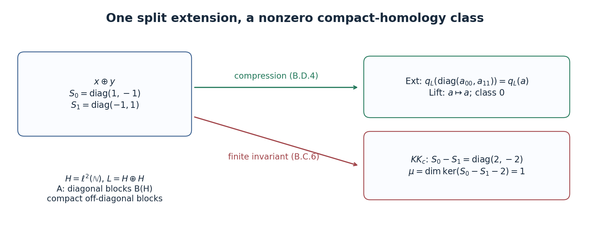

# Pictures of KK: Fredholm operators, quasihomomorphisms and extensions

*Written by GPT-6.1 Sol (OpenAI). Public domain (CC0).*

An even cycle has two represented modules and an operator between them. One can make the representations particularly simple, leaving the information in a Fredholm operator, or make the operator particularly simple, leaving the information in two homomorphisms. An odd cycle has a compression description closely related to the Busby invariant of an extension. These descriptions are useful because they connect the cycle definition to ordinary K-theory and to explicit operators.

We retain the conventions of [*Graded C\*-algebras, Clifford algebras and graded Hilbert modules*](KT-KK-05.html) and [*Kasparov modules and the groups \(KK(A,B)\)*](KT-KK-06.html). In particular, we use the graded stabilization theorem of the former, Theorem 6.2, and the normalization and inverse-rotation proofs of the latter, Theorem 3.2 and Theorem 4.1. The scalar and extension pictures in Sections 2–6 assume that the coefficient algebra \(B\) is \(\sigma\)-unital and trivially graded. The extension picture also assumes trivial grading on \(A\). The functorial constructions later allow graded algebras. The stable multiplier vanishing, finite-matrix index boundary and compact matrix stability have local proofs in Lemmas 2.0–2.0b. The positive exponential boundary, its exactness and its ordinary Bott input are proved locally in Lemmas 3.1a–3.1e. Corollary 3.1f applies them to the stable Calkin extension. The Toeplitz proof allows arbitrary complex coefficient algebras.

## 1. Which equivalence relation?

Write \(\mathcal E(A,B)\) for the cycles of *Kasparov modules and the groups \(KK(A,B)\)*. There are several useful quotients of this set.

- \(KK_h(A,B)=KK(A,B)\) uses cycles over \(C([0,1],B)\), with their two evaluations.
- \(KK_{\mathrm{oh}}(A,B)\) uses unitary equivalence, addition of degenerate cycles, and norm-continuous paths of operators on a fixed represented module.
- \(KK_{\mathrm{cp}}(A,B)\) uses unitary equivalence, addition of degenerate cycles, and replacement of \(F\) by \(F'\) when \((F-F')\phi(a)\) is compact for every \(a\).
- \(KK_c(A,B)\) is the cancellation quotient of the preceding semigroup: two classes become equal if adding the same additional cycle makes them equal in \(KK_{\mathrm{cp}}\).

Thus the additional cycle in the last definition need not be degenerate. Direct sum is the operation in all four quotients. The preceding lesson's straight-line perturbation proof and inverse rotation give
\[
KK_{\mathrm{cp}}\longrightarrow KK_c
\longrightarrow KK_{\mathrm{oh}}\longrightarrow KK_h.
\tag{1.1}
\]
The last two objects are abelian groups. We initially regard the first two as semigroups; the definition of cancellation alone does not create additive inverses.

The normalization arguments of the preceding lesson work with these stronger relations wherever only a locally compact perturbation and a degenerate summand are used. In particular every cycle can be represented by an odd self-adjoint involution after adding a zero-representation summand. The path to that involution was explicit there. The eventual equality of all the relevant homotopy relations has hypotheses and a proof; it must not be assumed while establishing a picture for one particular quotient.

**Lemma 1.1 (lifting an operator path).** Let \(q:D\to D/I\) be a quotient of Banach spaces. A continuous path in \(D/I\) has a continuous lift with any prescribed lifts of its two endpoints. For a quotient of C\*-algebras, a self-adjoint path has a self-adjoint lift with prescribed self-adjoint endpoints. If the quotient is graded, a homogeneous path has a lift of the same degree.

**Proof.** Approximate the path uniformly by piecewise linear paths \(v_n\), using successively finer finite partitions, with the original endpoints and errors at most \(2^{-n}\). Begin with the linear path joining the two prescribed lifts. On a common subdivision, \(v_n-v_{n-1}\) is piecewise linear, vanishes at the endpoints and has norm at most \(3\cdot2^{-n}\), after adjusting the first error bound. Lift its finitely many vertices to elements of norm at most twice their quotient norms, and interpolate those lifts linearly. The resulting correction path has norm at most \(6\cdot2^{-n}\). The uniformly convergent sum of the correction paths lifts the given path and keeps the endpoints.

For self-adjoint vertices replace each chosen lift \(x\) by \((x+x^*)/2\); this does not increase its norm. To retain degree \(p\), replace it by \((x+(-1)^p\gamma(x))/2\). Both operations commute with the quotient. \(\square\)

In applications below the lifted operator need not be invertible or a projection: invertibility or the projection equation is required only in the quotient, precisely the cycle condition.

## 2. The even scalar Fredholm picture

Put
\[
H_B=\ell^2(\mathbb N)\otimes B,\qquad
J=B\otimes\mathcal K=\mathcal K(H_B),\qquad
M=\mathcal L(H_B)=M(J),\qquad Q=M/J.
\tag{2.1}
\]
The standard module is countably generated because \(B\) is \(\sigma\)-unital. We write \(q:M\to Q\).

**Lemma 2.0 (the stable multiplier swindle).** Let \(B\) be any trivially graded C*-algebra, \(H_B=\ell^2(\mathbb N)\otimes B\), and \(M=\mathcal L(H_B)\). Then
\[
K_0(M)=K_1(M)=0.
\]
The assertion uses the ordinary stable-projection definition of \(K_0\) and stable-unitary-path definition of \(K_1\); it requires no countability hypothesis on \(B\).

**Proof.** Split the countable Hilbert-space coordinates into infinitely many infinite subsets. The associated coordinate isometries \(V_j\) have orthogonal ranges summing to the whole standard module. For \(T\in M\), let
\[
\Theta(T)=\sum_{j\geq0}V_jTV_j^*.
\]
This is the diagonal operator \(T,T,\ldots\) on the countable orthogonal sum, transported to \(H_B\). It is bounded adjointable, of norm at most \(\|T\|\), and its adjoint is the corresponding diagonal of \(T^*\). To justify the sum, check convergence on finite-support vectors and then approximate an arbitrary square-summable vector, using the uniform bound on partial sums. Multiplication and adjoints on that dense set show that \(\Theta\) is a unital *-homomorphism. The first coordinate and the remaining coordinates identify its action with the folded direct sum of \(T\) and \(\Theta(T)\), by a coordinate unitary. The same assertions hold in every finite matrix amplification.

Here are the K-class consequences of that folding; they do not assume norm-connectedness of the module unitary group. A projection \(p\) and its corner \(VpV^*\), for any adjointable isometry \(V\), are Murray–von Neumann equivalent through \(Vp\). Orthogonal projection addition agrees with block addition: the row of two orthogonal projections implements equivalence of their sum and their block diagonal. Thus for any projection in any matrix amplification,
\[
[\Theta(p)]=[p]+[\Theta(p)].
\]
Cancellation in the Grothendieck group gives \([p]=0\), proving \(K_0(M)=0\).

For unitaries, conjugacy preserves stable path class. Indeed, with
\(R_s=\bigl(\begin{smallmatrix}\cos s&-\sin s\\\sin s&\cos s\end{smallmatrix}\bigr)\), the path
\[
\operatorname{diag}(w,1)R_s\operatorname{diag}(1,w^*)R_s^*,
\qquad0\leq s\leq\pi/2,
\]
joins \(\operatorname{diag}(w,w^*)\) to \(1\). Conjugating \(\operatorname{diag}(u,1)\) along this path proves the assertion for every unitary \(w\), whether or not \(w\) has a path to one at its original size.

Placement in an isometric corner preserves the same K-class. Put \(Q=1-VV^*\). The matrix
\[
J_V=\begin{pmatrix}V&Q\\0&V^*\end{pmatrix}
\]
is unitary: \(Q^2=Q\), \(QV=V^*Q=0\) and \(V^*V=1\) verify both products. Direct multiplication gives
\[
J_V\operatorname{diag}(u,1)J_V^*
=\operatorname{diag}(VuV^*+Q,1).
\]
The conjugacy argument therefore identifies the corner unitary with \([u]\). Finally block sum and unitary product give the same stable class, through the explicit rotation path
\(\operatorname{diag}(u,1)R_s\operatorname{diag}(1,v)R_s^*\), from \(\operatorname{diag}(u,v)\) to \(\operatorname{diag}(uv,1)\).

Apply these facts to the first-coordinate and remaining-coordinate folding of \(\Theta(u)\). The two complementary corner unitaries multiply to the folded sum, and give
\[
[\Theta(u)]=[u]+[\Theta(u)].
\]
The stable-unitary group has cancellation, so \([u]=0\) for every finite matrix unitary. This proves \(K_1(M)=0\). The zero coefficient algebra gives zero groups directly. \(\square\)

*Reference:* [Blackadar, author edition, Proposition 12.2.1](https://www.bruceblackadar.com/Mathematics/book6.pdf).

**Lemma 2.0a (the stable Calkin index, with its finite-matrix proof).** In the notation (2.1), the boundary
\[
\delta:K_1(Q)\longrightarrow K_0(J)
\]
is an isomorphism. For a unitary \(u\in M_n(Q)\), choose a unitary \(U\in M_{2n}(M)\) lifting \(\operatorname{diag}(u,u^*)\), and set
\[
\delta[u]=[UPU^*]-[P],\qquad P=\operatorname{diag}(1_n,0_n).
\]
If \(u\) lifts to a partial isometry \(v\), this is
\([1-v^*v]-[1-vv^*]\), the kernel-minus-cokernel convention. Only the index boundary is claimed in this lemma; it does not prove ordinary Bott periodicity.

**Proof.** We first give the finite projection and lifting facts used in the argument. The ordinary nonunital group \(K_0(J)\) is the scalar kernel in \(K_0(J^+)\). Every element has the form \([e]-[P]\), with \(e\) a finite matrix projection, \(P\) a scalar projection, and \(e-P\in M_m(J)\). Indeed start with \([p]-[q]\) whose scalar projections have equal rank. Adding the complement \(1-q\) to both terms makes the second term equivalent to a scalar identity and zero block. A scalar unitary puts the scalar part of the first projection into that same form. The identity \([q]+[1-q]=[1]\) follows from the row \((q,1-q)\), a partial isometry from \(\operatorname{diag}(q,1-q)\) onto \(1\).

If two projections have equal \(K_0\)-classes, the group-completion definition gives a common projection summand after which they are stably equivalent. Add the complement of that common summand to obtain equal identity and zero padding. Stable equivalent projections become connected by a projection path after additional zero padding. Explicitly, for \(v^*v=p\), \(vv^*=q\),
\[
W=\begin{pmatrix}v&1-q\\1-p&-v^*\end{pmatrix}
\]
is unitary and carries \(\operatorname{diag}(p,0)\) to \(\operatorname{diag}(q,0)\). The rotation path from Lemma 2.0 connecting \(\operatorname{diag}(W,W^*)\) to \(1\) supplies the projection path, and a conjugating unitary in the identity component. Conversely a projection path has a conjugator in the identity component: on each sufficiently short interval use
\(c_t=p_t p_s+(1-p_t)(1-p_s)\). Since
\(c_t-1=(p_t-p_s)(2p_s-1)\), it is invertible when \(\|p_t-p_s\|<1\); it intertwines the two projections. Its polar unitary does too. Glue these finitely many polar-unitary paths by multiplying their previously chosen endpoints. These arguments work in \(J^+\) and in every matrix algebra over \(M\).

Every unitary \(u\) has a doubled unitary lift. Choose arbitrary lifts \(a,b\in M_n(M)\) of \(u,u^{-1}\). The invertible matrix
\[
w=E(a)F(-b)E(a)L,\qquad
E(a)=\begin{pmatrix}1&a\\0&1\end{pmatrix},\quad
F(b)=\begin{pmatrix}1&0\\b&1\end{pmatrix},\quad
L=\begin{pmatrix}0&-1\\1&0\end{pmatrix}
\]
has quotient \(\operatorname{diag}(u,u^{-1})\). Its polar unitary \(U=w(w^*w)^{-1/2}\) has the same quotient, since that quotient is unitary. The elementary factors and the scalar rotation for \(L\) put \(w\), and hence \(U\), in the invertible or unitary identity component.

The projection \(e=UPU^*\) has quotient \(P\), so \(e-P\in M_{2n}(J)\); the difference in the formula is consequently in \(K_0(J)\). Two doubled lifts differ by a unitary whose quotient is one. This unitary belongs to \(1+M_{2n}(J)\) and conjugates their projections, so the formula is independent of the lift. A unitary path \(u_t\) has continuous lifts of \(u_t,u_t^*\) by Lemma 1.1; the elementary formula and polar normalization give a continuous doubled lift and therefore a projection path. This proves homotopy invariance. Identity stabilization adds an identical scalar block to both terms. Direct sums and a scalar permutation grouping the selected blocks give additivity. Thus the formula defines a group homomorphism on the stable-unitary-path definition of \(K_1(Q)\).

We need one further elementary lifting fact: a unitary in the identity component of a quotient has a unitary lift in the identity component upstairs. Subdivide its path from one into finitely many small ratios \(z\) with \(\|z-1\|<1\). Functional calculus gives \(z=\exp(ih)\) for self-adjoint \(h\) in the quotient. Lift \(h\) self-adjointly and use \(\exp(i\widetilde h)\). Multiplying these lifts, while successively traversing their exponential paths, proves the fact. If only its stable \(K_1\)-class is zero, first add the finite identity blocks in the definition of that equality.

Suppose \(\delta[u]=0\). Then \([e]=[P]\) in \(K_0(J^+)\). The projection facts above give common identity and zero padding and a unitary \(x\) over \(J^+\) conjugating the padded \(P\) to the padded \(e\). Pad \(U\) by the identical identity operator on these added coordinates. A scalar permutation arranges the reference projection as a selected and unselected block. Since the scalar part \(\bar x\) commutes with that reference projection, replacing \(x\) by \(x\bar x^*\) keeps its conjugation and makes its scalar part one. Consequently \(x^*U\) commutes with the reference projection and is block diagonal. Its selected block is a unitary lift of \(u\), after identity stabilization. Lemma 2.0 gives \(K_1(M)=0\); thus \([u]=0\). This proves injectivity.

For surjectivity take any normal-form difference \([e]-[P]\in K_0(J)\). Its image is zero in \(K_0(M)\), again by Lemma 2.0. The projection facts give equal identity and zero padding and a unitary \(W\) in the identity component of a matrix algebra over \(M\), with \(WPW^*=e\). In the quotient it commutes with \(P\), so it is \(\operatorname{diag}(c,d)\). Add identity padding to the selected and unselected blocks to give both blocks the same size. Since \(W\) is in the identity component, \([c]+[d]=0\) in \(K_1(Q)\). The unitary \(d^*c^*\) therefore has zero stable class. After the finite identity stabilization just described, the lifting fact gives a unitary \(V\) upstairs with quotient \(d^*c^*\). Replace \(W\) by \(W\operatorname{diag}(1,V)\). Right multiplication leaves \(WPW^*\) exactly unchanged, while its quotient becomes \(\operatorname{diag}(c,c^*)\). It is a doubled lift for \(c\), and \(\delta[c]=[e]-[P]\). This proves surjectivity without a Bott or KK comparison theorem.

Finally if \(v\) is a partial-isometry lift, its defects lie in \(J\), and
\[
U_v=\begin{pmatrix}v&1-vv^*\\1-v^*v&-v^*\end{pmatrix}
\]
is unitary. Its quotient is \(\operatorname{diag}(u,-u^*)\); multiplying on the right by \(\operatorname{diag}(1,-1)\) gives a doubled lift and leaves the selected projection unchanged. That projection is \(\operatorname{diag}(vv^*,1-v^*v)\). Subtracting \(P\) gives the asserted difference of defect projections. \(\square\)

**Lemma 2.0b (compact matrix stability).** The first-coordinate corner gives natural isomorphisms \(K_i(B)\cong K_i(B\otimes\mathcal K)\), for \(i=0,1\) and arbitrary \(B\).

**Proof.** The finite coordinate corners are \(M_N(B)\); their union is norm dense in \(B\otimes\mathcal K\). Work in forced unitizations, retaining a fixed scalar matrix separately. A relative projection is \(e=P+k\), where \(P\) is scalar and \(k\) is a finite matrix over \(B\otimes\mathcal K\). Compress \(k\) to the first \(N\) coordinates and put \(a_N=P+k_N\). It is self-adjoint and converges to \(e\) in norm. For large \(N\), its spectrum lies in disjoint neighborhoods of zero and one; functional calculus with the characteristic function of the latter gives a projection \(e_N\) close to \(e\), with the same scalar part. The straight segment from \(e\) to \(a_N\), followed by the same spectral cut, is a projection path fixing its initial projection. Outside the finite coordinate corner \(e_N=P\); inside it is a projection over \(M_N(B)^+\). Hence its relative class comes from the ordinary finite-matrix definition of \(K_0(B)\).

A normalized unitary is \(u=1+k\). Its analogous compression \(1+k_N\) is invertible for large \(N\), and its polar unitary agrees with one outside the finite corner. Polar normalization along the straight segment from \(u\) to \(1+k_N\) gives a unitary path. Thus every \(K_1\)-class also comes from a finite matrix over \(B\). Scalar unitary parts can first be normalized, since finite scalar unitary groups are connected: diagonalize the scalar unitary and rotate its finitely many eigenvalues to one.

For injectivity, apply the same compression to a witnessing stable unitary path or stable relative projection path. Such paths are norm-compact sets, so a single sufficiently large finite corner approximates every point. The spectral cut or polar normalization then gives a path in that corner. If the original endpoints already lie in a finite corner, choose the larger corner to contain it; compression and normalization fix both endpoints exactly. For \(K_0\), equality first has the identity and zero padding and projection-path form proved in Lemma 2.0a, so this argument applies to the full group-completion relation as well. Passing from a finite \(M_N(B)\) to \(B\) simply uses the finite stabilization built into the definitions. Extra scalar blocks contribute the same reference projection on both sides of a relative difference, or identity blocks for unitaries. This proves injectivity, surjectivity and independence of the corner size. Entrywise homomorphisms commute with compression, functional calculus and the fixed first corner; hence the isomorphisms are natural. \(\square\)

*Reference:* [Blackadar, author edition, Section 8.3](https://www.bruceblackadar.com/Mathematics/book6.pdf).

For an even cycle over a unital trivially graded \(A\), a unital representation on \(E^0\oplus E^1\) and an odd self-adjoint operator have the form
\[
\phi(a)=
\begin{pmatrix}\phi_0(a)&0\\0&\phi_1(a)\end{pmatrix},
\qquad
F=\begin{pmatrix}0&T^*\\T&0\end{pmatrix}.
\tag{2.2}
\]
Here \(T:E^0\to E^1\). The cycle conditions say
\[
T^*T-1\in\mathcal K(E^0),\quad
TT^*-1\in\mathcal K(E^1),\quad
T\phi_0(a)-\phi_1(a)T\in\mathcal K(E^0,E^1).
\tag{2.3}
\]
For a nonunital representation, the first two conditions are instead localized by \(\phi_0(a)\) and \(\phi_1(a)\). The order of the representation subscripts in the intertwiner is determined by the domain of \(T\).

**Proposition 2.1 (scalar reduction).** Every \(KK_{\mathrm{oh}}(\mathbb C,B)\)-class has a representative (2.2) on \(H_B\oplus H_B\), with the unital scalar representation and \(q(T)\) unitary. Conversely every \(T\in M\) with unitary image gives such a cycle.

**Proof.** Let \(P=\phi(1)\). It is an even projection, and \([F,P]\) is compact. Replacing \(F\) by \(PFP+(1-P)F(1-P)\) is a compact perturbation, hence an operator homotopy. The complementary representation is zero, so its cycle is degenerate and may be removed. On \(PE\) the scalar representation is unital.

Add a degenerate scalar cycle on \(H_B\oplus H_B\) whose off-diagonal operator is the identity. Ungraded stabilization identifies each of the two new grading summands with \(H_B\). The resulting off-diagonal operator has both square-modulus defects compact by the unital cycle conditions. This is exactly unitarity of \(q(T)\). Conversely those defects and the identically zero scalar commutator verify the cycle conditions. \(\square\)

No assertion about closed range is needed here. Over a general nonunital coefficient algebra an index class need not be a difference of kernel and cokernel modules of a closed-range perturbation.

**Theorem 2.2 (even scalar index).** For a trivially graded \(\sigma\)-unital \(B\), the maps
\[
KK_{\mathrm{oh}}(\mathbb C,B)
\xrightarrow{\,T\mapsto[q(T)]\,}K_1(Q)
\xrightarrow{\partial_1}K_0(B)
\tag{2.4}
\]
are isomorphisms. The boundary convention is kernel minus cokernel whenever the Hilbert-module Fredholm operator has compact kernel and cokernel projections.

**Proof.** Proposition 2.1 gives the first map on representatives. An operator path gives a unitary path in the quotient. A change of the two standard-module identifications replaces \(T\) by \(U_1TU_0^*\). Its K-class changes by
\([q(U_1)]-[q(U_0)]\), which is zero because \(K_1(M)=0\). A degenerate scalar cycle has \(T\) unitary in \(M\) and therefore also has zero quotient class. This proves well-definedness and additivity.

Every unitary matrix over \(Q\) lifts entrywise to a matrix over \(M\). Its lift is an essentially unitary map on a finite sum of standard modules, and therefore gives a scalar cycle. Folding that finite sum into \(H_B\) does not change its class. Hence the first map is onto.

If two quotient unitaries have equal \(K_1\)-class, after adjoining finite identity blocks they are joined by a unitary path in a matrix algebra over \(Q\). This is the stable-path definition of \(K_1\). Lemma 1.1 lifts the path with the two original essentially unitary operators as endpoints. Every lift remains essentially unitary. Consequently it is an operator homotopy between the two stabilized scalar cycles. Identity blocks are degenerate cycles. This proves injectivity.

For the second map, use the stable Calkin sequence
\[
0\longrightarrow B\otimes\mathcal K
\longrightarrow M
\xrightarrow q Q\longrightarrow0.
\tag{2.5}
\]
Lemma 2.0a proves directly that this \(K_1\)-to-\(K_0\) index boundary is an isomorphism, using the stable multiplier vanishing proved in Lemma 2.0. Lemma 2.0b identifies \(K_0(B\otimes\mathcal K)\) with \(K_0(B)\). The partial-isometry computation at the end of Lemma 2.0a fixes its kernel-minus-cokernel sign. \(\square\)

This deduction of (2.4) does not use ordinary Bott periodicity: only the stable multiplier swindle and the index boundary are involved.

**Example 2.3 (a compact projection).** If \(p\in\mathcal K(H_B)\) is a projection, the compact-representation cycle
\[
(pH_B,\lambda\mapsto\lambda\,1_{pH_B},0)
\tag{2.6}
\]
is even and represents \([p]\). After standard stabilization it is represented by an off-diagonal coisometry \(T\) with
\[
T^*T=1-p,\qquad TT^*=1.
\tag{2.7}
\]
The missing even submodule is \(pH_B\); the remaining summands form a degenerate cycle. Existence and the precise comparison are proved in Solution 10.1.

## 3. The odd scalar picture

Recall \(C_1=\mathbb C\oplus\mathbb C\), graded by interchanging the two coordinates, with odd generator \(\varepsilon=(1,-1)\).

**Proposition 3.1 (ordinary odd modules).** For trivially graded \(A,B\), cycles with coefficient \(B\widehat\otimes C_1\) are equivalently ungraded triples \((E,\psi,T)\), with
\[
(T-T^*)\psi(a),\quad(T^2-1)\psi(a),\quad[T,\psi(a)]
\quad\hbox{compact}.
\tag{3.1}
\]
This identification preserves unitary equivalence, all four relations in Section 1 and direct sums. Every class has a representative with \(T=T^*=T^{-1}\) after a degenerate summand.

**Proof.** The central coefficient idempotents \((1,0)\) and \((0,1)\) split a coefficient module into two ungraded Hilbert \(B\)-modules. These projections are obtained as central adjointable multipliers even when \(B\) has no unit. The grading exchanges the two modules and identifies them isometrically. An even representation is consequently \(\psi\oplus\psi\), and an odd operator is \(T\oplus(-T)\). Compact operators split in the same way. The three graded cycle defects are exactly the two signed copies of (3.1).

Conversely take \(E\otimes C_1\), with the coefficient grading, representation \(\psi\otimes1\) and odd operator \(T\otimes L_\varepsilon\). The inner-product and compact-operator tensor formulas show that these constructions are inverse under the stated identifications. Countable generation passes to a central summand and back to the finite sum. The same constructions over the interval prove the assertion for homotopies.

Normalize \(T\) to a self-adjoint contraction \(t\) using the preceding lesson. On \(E\oplus E\), with representation \(\psi\oplus0\), replace \(t\oplus(-t)\) by
\[
\begin{pmatrix}
t&(1-t^2)^{1/2}\\
(1-t^2)^{1/2}&-t
\end{pmatrix}.
\tag{3.2}
\]
The added zero-representation triple is degenerate. The displayed operator is a self-adjoint involution, and its difference from the original diagonal operator is locally compact for \(\psi\oplus0\), exactly as in the normalization proof in the preceding lesson. \(\square\)

For scalar \(A\), compress \(\psi(1)\) and add a degenerate scalar module before stabilizing to \(H_B\). Thus an odd scalar class is represented by a self-adjoint \(T\in M\) with \(T^2-1\in J\). The element
\[
p=q\bigl((T+1)/2\bigr)
\tag{3.3}
\]
is a projection in \(Q\).

### Projection lifts and the exponential boundary

A projection in a quotient has a self-adjoint lift, although it need not have a projection lift. Exponentiating a self-adjoint lift gives a unitary which is identity in the quotient. We prove the required isomorphism for the stable Calkin extension. Its ordinary K-theory input is proved below using Cuntz's Toeplitz construction; the statement allows every complex C\*-algebra, including nonunital and nonseparable ones.

We use the stable projection and normalized unitary definitions of ordinary K-theory. In a forced unitization \(D^+\), write \(\epsilon_D:D^+\to\mathbb C\) for the scalar quotient. A relative projection class has the form \([e]-[P]\), with \(\epsilon_D(e)=P\) scalar. A normalized unitary has scalar part identity. The normal forms, finite complement padding, polar conjugators for nearby projections and matrix rotations are proved in Lemmas 2.0–2.0b. Those finite calculations apply to every C\*-algebra. Homotopy invariance follows directly from the definitions: applying a homotopy of homomorphisms to a projection or unitary gives its defining homotopy. The spatial tensor norm and its inclusion property are proved in [*Graded C\*-algebras, Clifford algebras and graded Hilbert modules*, Lemma 3.0a](KT-KK-05.html#lemma-3-0a-the-ordinary-spatial-norm).

**Lemma 3.1a (the finite index and split inclusions).** For an extension
\[
0\longrightarrow I\xrightarrow{\iota}D\xrightarrow{\pi}R\longrightarrow0
\]
there is a natural index map \(d:K_1(R)\to K_0(I)\). For a normalized unitary \(v\in M_n(R^+)\), choose a normalized unitary lift \(U\in M_{2n}(D^+)\) of \(\operatorname{diag}(v,v^*)\). Then
\[
d[v]=[UP_nU^*]-[P_n],\qquad P_n=\operatorname{diag}(1_n,0_n).
\tag{E.1}
\]
Its two exactness assertions are
\[
\begin{gathered}
\ker d=\operatorname{im}\bigl(K_1(D)\to K_1(R)\bigr),\\
\operatorname{im}d=\ker\bigl(K_0(I)\to K_0(D)\bigr).
\end{gathered}
\tag{E.2}
\]
If \(\pi\) has a *-homomorphic section, then for \(i=0,1\) the ideal inclusion is injective on \(K_i\), and
\[
0\longrightarrow K_i(I)\longrightarrow K_i(D)\longrightarrow K_i(R)\longrightarrow0
\tag{E.3}
\]
is split exact. If \(v\) has a normalized partial-isometry lift \(a\), its index is
\[
d[v]=[1-a^*a]-[1-aa^*].
\tag{E.4}
\]

**Proof.** Lift \(v-1\) and \(v^*-1\) entrywise to \(D\), and add identity. Applying the elementary doubled-lift formula in Lemma 2.0a gives an invertible lift with scalar part identity; its polar unitary is the required \(U\). The projection \(UP_nU^*\) has quotient \(P_n\), so its relative difference lies in \(K_0(I)\). Two such lifts differ by a unitary in \(1+M_{2n}(I)\), which conjugates their projections. Lemma 1.1 lifts a continuous quotient path, retaining prescribed endpoints. The doubled-lift formula and polar normalization then give a continuous projection path. Identity stabilization, direct sums and block permutations preserve the formula and give additivity. Thus (E.1) is a well-defined homomorphism. Applying a morphism of extensions to a lift proves naturality.

A unitary lift \(a\) makes \(\operatorname{diag}(a,a^*)\) commute with \(P_n\), so \(d[v]=0\). Conversely suppose \(d[v]=0\). The finite projection argument of Lemma 2.0a, applied in \(I^+\), gives common identity and zero padding and a unitary \(x\) conjugating the padded \(P_n\) to the padded \(UP_nU^*\). Pad \(U\) by identities on the added coordinates. Its scalar part remains identity. Since the scalar part \(\bar x\) commutes with the padded scalar reference projection, replacing \(x\) by \(x\bar x^*\) preserves that conjugation and gives \(\pi^+(x)=1\). Thus \(x^*U\) commutes with the reference projection. Its selected block is an exact normalized unitary lift of \(v\) with the added identities. This proves the first equality in (E.2).

Every difference in (E.1) vanishes in \(K_0(D)\), since its two projections are conjugate there. Conversely let \([e]-[P]\in K_0(I)\) vanish in \(K_0(D)\). The finite projection argument gives common identity and zero padding and an identity-component unitary \(W\) over \(D^+\), with \(WPW^*=e\). Its scalar part commutes with \(P\); right multiplication by its adjoint makes \(W\) normalized and preserves the conjugation. Normalizing a path from identity in the same way retains its normalized identity-component membership. Since \(\pi^+(e)=P\), the quotient is \(\operatorname{diag}(c,b)\) on the selected and complementary blocks. Therefore \([c]+[b]=0\) in \(K_1(R)\). Add identity and zero reference blocks until the sizes agree. Further identity stabilization makes \(b^*c^*\) belong to the normalized quotient unitary identity component.

A normalized unitary in that component has a normalized unitary lift: subdivide its normalized path from identity into ratios sufficiently close to identity, take their self-adjoint logarithms, lift the logarithms in the self-adjoint part of the matrix algebra over \(D\), and multiply their exponentials. The logarithms have scalar part zero, so this is the local lifting argument of Lemma 2.0a in forced unitizations. Choose such a lift \(V\) of \(b^*c^*\). The unitary \(W\operatorname{diag}(1,V)\) still conjugates \(P\) to \(e\), and its quotient is \(\operatorname{diag}(c,c^*)\). Thus \([e]-[P]=d[c]\), proving the other equality in (E.2). The defect-matrix calculation of Lemma 2.0a uses only the partial-isometry identities and gives (E.4) here.

Let \(s:R\to D\) be a *-section. To prove injectivity on \(K_0(I)\), suppose a relative class \([e]-[P]\) vanishes over \(D\). Choose its padded normalized conjugator \(W\) as above. Since \(\pi^+(W)\) commutes with \(P\), so does \(s^+(\pi^+(W))\). Hence \(Y=W s^+(\pi^+(W))^*\) has quotient identity and still satisfies \(YPY^*=e\). It belongs to a matrix algebra over \(I^+\), proving that the original class was zero. For \(K_1(I)\), a padded normalized unitary \(a\in1+M_n(I)\) which has a normalized path \(a_t\) to identity in \(D^+\) has the path \(a_t s^+(\pi^+(a_t))^*\) in \(1+M_n(I)\) with the same endpoints. This proves injectivity.

For middle exactness on \(K_0\), represent a kernel class by \([e]-[P]\). The quotient projections have equal \(K_0\)-classes. After common identity and zero padding, the finite projection argument gives an identity-component unitary \(v\) with \(vPv^*=\pi^+(e)\). Then \(s^+(v)^* e s^+(v)-P\) belongs to the matrix ideal, and its relative class maps to \([e]-[P]\). Its scalar part is \(P\), since the scalar part of \(v\) commutes with \(P\). For \(K_1\), a kernel representative has, after finite padding, a normalized quotient path to identity. Its image under \(s^+\) gives an identity-component unitary \(w\) with the same quotient as the representative. Multiplying the representative by \(w^*\) gives a normalized unitary over \(I^+\) with the same \(K_1(D)\)-class. Finally \(\pi_*s_*=1\), proving surjectivity and the splitting. This proves (E.3).

In particular (E.3) identifies the K-groups of \(D_0\oplus D_1\) with its two coordinate groups. If homomorphisms \(\rho,\eta:C\to D\) have orthogonal ranges, their sum factors through \(C\to C\oplus C\), \(c\mapsto(c,c)\), and the homomorphism \((c_0,c_1)\mapsto\rho(c_0)+\eta(c_1)\). The coordinate identification therefore gives
\[
(\rho+\eta)_*=\rho_*+\eta_*.
\tag{E.5}
\]
This proves the formula also for nonunital algebras and homomorphisms. \(\square\)

**Lemma 3.1b (the coefficient Toeplitz extensions).** Let \(S_+\) be the unilateral shift on \(\ell^2(\mathbb N_0)\), \(p_0=1-S_+S_+^*\), and \(\mathcal T=C^*(S_+)\). There is a symbol homomorphism \(\sigma:\mathcal T\to C(\mathbb T)\), with \(\sigma(S_+)=z\) and kernel \(\mathcal K\). Put \(\chi=\operatorname{ev}_1\sigma\) and \(\mathcal T_0=\ker\chi\). For every complex C\*-algebra \(C\), the sequences
\[
\begin{gathered}
0\longrightarrow C\otimes\mathcal K\longrightarrow C\otimes\mathcal T
\xrightarrow{\sigma_C}C(\mathbb T,C)\longrightarrow0,\\
0\longrightarrow C\otimes\mathcal K\longrightarrow C\otimes\mathcal T_0
\longrightarrow SC\longrightarrow0,\qquad
SC=C_0(\mathbb T\setminus\{1\},C),
\end{gathered}
\tag{E.6}
\]
are exact. We identify the suspension coordinate with \(z=e^{2\pi i s}\), \(0<s<1\), increasing with \(s\). Every isometry in a unital C\*-algebra is the image of \(S_+\) under a unique unital homomorphism from \(\mathcal T\).

**Proof.** The operators \(S_+^i p_0 S_+^{*j}\) are the coordinate matrix units; hence \(\mathcal T\) contains \(\mathcal K\). Multiplication by \(S_+\) or its adjoint preserves their closed span, so this is an ideal. The quotient of \(S_+\) is unitary. Every \(\lambda\in\mathbb T\) belongs to its quotient spectrum: normalized long finite geometric strings, placed successively farther along the basis, are approximate \(\lambda\)-eigenvectors, with error at most \(2/\sqrt N\) for length \(N\). Compact operators send these strings to vectors tending to zero in norm, by finite-rank approximation. A left inverse modulo compacts for \(S_+-\lambda\) would consequently contradict their norm one. Functional calculus identifies the quotient algebra with \(C(\mathbb T)\), giving \(\sigma\).

For the isometry assertion, represent the target faithfully on a Hilbert space and let \(V\) be its represented isometry. Set \(L=\ker V^*\). The spaces \(V^nL\) are mutually orthogonal: for \(m>n\), their inner product reduces to one with \(V^{m-n}L\perp L\). Their closed span is reducing, and there \(V\) is the shift with multiplicity \(L\). On its orthogonal complement \(V\) is unitary: that complement is contained in \(L^\perp=\operatorname{ran}V\), and its invariance under \(V^*\) shows that the restriction is onto. For a *-polynomial \(f\), its norm on the shift part is at most \(\|f(S_+)\|\). Its norm on the unitary part is at most \(\sup_{z\in\mathbb T}|f(z,\bar z)|\leq\|f(S_+)\|\), by the symbol quotient. Thus \(f(S_+)\mapsto f(V)\) is contractive. Completion gives a homomorphism into the represented target algebra, hence into the target itself. The generator determines it uniquely.

For scalar \(f\in C(\mathbb T)\), compress multiplication by \(f\) on \(L^2(\mathbb T)\) to the closed span of nonnegative Fourier modes. This is a contraction \(f\mapsto T_f\). On trigonometric polynomials it is a polynomial in \(S_+,S_+^*\), with symbol \(f\). Uniform trigonometric approximation follows by convolving with the normalized Fejér kernel \((N+1)^{-1}|\sum_{j=0}^N e^{ij\theta}|^2\). Orthogonality of the finitely many circle characters gives its integral one. The geometric-series formula bounds it outside every neighborhood of zero by a constant times \((N+1)^{-1}\). Positivity and uniform continuity of \(f\) then give uniform convergence of these finite trigonometric convolutions. Thus the compression and symbol assertions hold for every continuous \(f\), and \(a-T_{\sigma(a)}\in\mathcal K\) for every \(a\in\mathcal T\).

The spatial tensor product \(C\otimes C(\mathbb T)\) is \(C(\mathbb T,C)\). Use a faithful representation of \(C\) and the faithful representation of \(C(\mathbb T)\) by all point evaluations: the product norm is \(\sup_z\|F(z)\|\). Finite scalar functions times values of \(C\) are dense in the continuous \(C\)-valued functions. Indeed choose a finite cover by arcs on which \(F\) varies by less than a prescribed tolerance. The functions \(\operatorname{dist}(z,\mathbb T\setminus U_j)\), divided by their everywhere positive sum, give a subordinate partition of unity. Weighting a value of \(F\) from each arc gives that uniform approximation. This proves the identification. The spatial inclusion property ensures that \(C\otimes\mathcal K\) embeds in \(C\otimes\mathcal T\).

Compress multiplication by \(F\in C(\mathbb T,C)\) on \(L^2(\mathbb T)\otimes H\), where \(C\) acts faithfully on \(H\). The result is contractive for the supremum norm. Finite trigonometric sums take values in \(C\odot\mathcal T\), so completion gives a contractive linear section \(t_C:C(\mathbb T,C)\to C\otimes\mathcal T\) of \(\sigma_C\). For an algebraic tensor \(x\), the difference \(x-t_C\sigma_C(x)\) belongs to \(C\odot\mathcal K\), by the scalar difference just proved. If \(\sigma_C(x)=0\) for a completed tensor, algebraic approximations \(x_n\) satisfy \(x_n-t_C\sigma_C(x_n)\to x\). This proves the exact kernel in the first sequence of (E.6).

A *-split extension remains exact after tensoring by \(C\). For its quotient \(q\) and section \(s\), the bounded map \(1-\mathrm{id}_C\otimes sq\) sends every algebraic tensor into the algebraic ideal tensor. Applying it to algebraic approximations proves the kernel equality; the tensor section proves surjectivity. Apply this to \(0\to\mathcal T_0\to\mathcal T\xrightarrow{\chi}\mathbb C\to0\). Thus \(\ker\chi_C=C\otimes\mathcal T_0\). Also \(\chi_C(T_F)=F(1)\), first on finite trigonometric sums and then by continuity. Restrict the symbol sequence to the character kernel: functions vanishing at \(1\) still have their compression section there, and its kernel remains \(C\otimes\mathcal K\). This proves the second sequence of (E.6). \(\square\)

**Lemma 3.1c (the reduced Toeplitz K-groups).** For every complex C\*-algebra \(C\),
\[
K_0(C\otimes\mathcal T_0)=K_1(C\otimes\mathcal T_0)=0.
\tag{E.7}
\]

**Proof.** The following rotation replaces one shift summand by a scalar summand. Inside \(\mathcal T\otimes\mathcal T\), put
\[
\begin{gathered}
\mathcal D=C^*(\mathcal K\otimes\mathcal T,\mathcal T\otimes1),\\
v=S_+\otimes1,\quad r=p_0\otimes1,\quad
y=p_0\otimes S_+,\quad d=p_0\otimes p_0.
\end{gathered}
\]
By Lemma 3.1b with coefficient \(\mathcal T\), the symbol on the first factor restricts to \(\widehat\sigma:\mathcal D\to C(\mathbb T)\), with kernel \(\mathcal K\otimes\mathcal T\) and \(\widehat\sigma(v)=z\). Put \(h=vrv^*\) and \(a=v(1-r)v^*\). The projections \(a,h,r\) are orthogonal and sum to one. Also \(y^*y=r\) and \(yy^*=r-d\). Thus \(yv^*\) exchanges \(h\) and \(r-d\), whereas \(rv^*\) exchanges \(h\) and \(r\). Squaring on these orthogonal supports shows that
\[
Z_0=a+yv^*+vy^*+d,\qquad Z_1=a+rv^*+vr
\tag{E.8}
\]
are self-adjoint unitaries. Both have symbol one. Let
\[
E_j=(1-Z_j)/2,\qquad
Z_t=\exp(i\pi tE_1)\exp(i\pi(1-t)E_0),\qquad v_t=Z_tv.
\]
These are norm-continuous unitary and isometry paths with symbols one and \(z\), respectively. Multiplication, using \(rv=0\) and \(y^*v=dv=0\), gives
\[
v_0=v(1-r)+y,\qquad v_1=v(1-r)+r.
\tag{E.9}
\]
Form the pullback
\[
\mathcal P=\{(x,b)\in\mathcal D\oplus\mathcal T:
\widehat\sigma(x)=\sigma(b)\}.
\]
Its second-coordinate map is a *-split extension with ideal \(\mathcal K\otimes\mathcal T\), and section \(b\mapsto(b\otimes1,b)\). The isometry property of Lemma 3.1b gives a homotopy \(\alpha_t:\mathcal T\to\mathcal P\), with \(\alpha_t(S_+)=(v_t,S_+)\). It is pointwise norm-continuous on *-polynomials, and hence everywhere by contractivity. There are two corner homomorphisms \(\rho,\omega:\mathcal T\to\mathcal P\):
\[
\begin{aligned}
\rho(1)&=(1-r,1),&\rho(S_+)&=(v(1-r),S_+),\\
\omega(1)&=(r,0),&\omega(S_+)&=(y,0).
\end{aligned}
\]
Their two units are orthogonal; each displayed generator is an isometry in its stated corner. Consequently their ranges are orthogonal. If \(j:\mathbb C\to\mathcal T\) is the scalar inclusion, (E.9) and the unit values give
\[
\alpha_0=\rho+\omega,\qquad \alpha_1=\rho+\omega j\chi.
\tag{E.10}
\]
Tensor these homomorphisms with \(C\). Their homotopies stay pointwise norm-continuous, by finite tensor approximation and contractivity. The split tensor argument of Lemma 3.1b gives ideal \(C\otimes\mathcal K\otimes\mathcal T\) in the resulting pullback extension. Its inclusion is injective on both K-groups by Lemma 3.1a. The map \(\omega_C\) factors through that inclusion and the compact corner
\[
C\otimes\mathcal T\longrightarrow C\otimes\mathcal K\otimes\mathcal T,\qquad
c\otimes b\longmapsto c\otimes p_0\otimes b.
\]
That corner induces an isomorphism by Lemma 2.0b with coefficient \(C\otimes\mathcal T\). Therefore \((\omega_C)_*\) is injective. Homotopy invariance, (E.5) and (E.10) give
\[
(\rho_C)_*+(\omega_C)_*
=(\rho_C)_*+(\omega_C)_*(j_C\chi_C)_*.
\]
Cancel the common summand in the abelian K-group, then use injectivity of \((\omega_C)_*\). This proves \((j_C\chi_C)_*=1\). The other composite \(\chi_Cj_C=1_C\) holds on the algebras themselves. Thus \(\chi_C\) is an isomorphism on both K-groups. The ideal inclusion \(C\otimes\mathcal T_0\to C\otimes\mathcal T\) is injective by the split character extension and Lemma 3.1a, and its composite with \(\chi_C\) is zero. Its source groups must vanish, proving (E.7). \(\square\)

*References:* [Blackadar, author edition, Section 9.4.2](https://www.bruceblackadar.com/Mathematics/book6.pdf); [Arici–Mesland, *Toeplitz extensions in noncommutative topology and mathematical physics*, Section 3.1](https://arxiv.org/pdf/1911.05823v1). The coefficient kernels, both rotation endpoints and the split ideal inclusions have been proved above.

**Lemma 3.1d (the two ordinary suspension maps).** For every complex C\*-algebra \(D\), there are natural isomorphisms
\[
\beta_D:K_0(D)\longrightarrow K_1(SD),\qquad
\theta_D:K_1(D)\longrightarrow K_0(SD).
\tag{E.11}
\]
For a relative projection,
\[
\beta_D([e]-[P])=
\bigl[s\longmapsto\exp(2\pi i s e)\exp(-2\pi i sP)\bigr].
\tag{E.12}
\]
For a normalized unitary \(u\), reverse the doubled rotation of Lemma 2.0 to define
\[
Z_s=\operatorname{diag}(u,1)R_{(1-s)\pi/2}
\operatorname{diag}(1,u^*)R_{(1-s)\pi/2}^*.
\]
This joins identity to \(\operatorname{diag}(u,u^*)\). Then
\[
\theta_D[u]=[Z_sP_nZ_s^*]-[P_n].
\tag{E.13}
\]
The increasing suspension variable fixes the signs. In particular the index of the coefficient Toeplitz extension in (E.6) satisfies \(d\beta_D=-1\), after compact matrix stability.

**Proof.** For a unital algebra, a projection \(e\) defines the based loop \(f_e(s)=1+(e^{2\pi i s}-1)e\). Projection paths give based unitary paths; equivalent projections give such a path after the finite padding of Lemma 2.0a; a zero projection adds an identity block. Block sums give additivity. Thus \([e]\mapsto[f_e]\) is a natural homomorphism on the projection Grothendieck group. It is natural for nonunital homomorphisms too: their extensions to the based-loop unitizations preserve the scalar identity.

For nonunital \(D\), the split extension \(0\to SD\to S(D^+)\to S\mathbb C\to0\) and (E.3) identify \(K_1(SD)\) with the scalar kernel in \(K_1(S(D^+))\). Restrict the projection-loop map for \(D^+\) to the defining scalar kernel \(K_0(D)\subset K_0(D^+)\). Naturality gives a map into that kernel. The product-versus-block rotation of Lemma 2.0 gives (E.12), whose endpoints and scalar part are identity.

Let \(d_D:K_1(SD)\to K_0(D\otimes\mathcal K)\) be the index of the second extension of (E.6). Both K-groups of its middle algebra vanish by Lemma 3.1c, so (E.2) makes \(d_D\) an isomorphism. For unital \(D\) and \(e\in M_n(D)\), the lift of \(f_e\) in the forced unitization of \(M_n(D\otimes\mathcal T_0)\) is
\[
A_e=1+(S_+-1)\otimes e.
\]
Tensor factors may be flipped. Its scalar part is identity, \(A_e^*A_e=1\), and \(1-A_eA_e^*=p_0\otimes e\), by direct multiplication. Formula (E.4) and compact matrix stability give \(d_D[f_e]=-[e]\). Additivity proves \(d_D\beta_D=-1\), and hence \(\beta_D\) is an isomorphism. The ordinary projection group of unital \(D\) agrees with its forced-unitization scalar kernel: \(D^+\cong D\oplus\mathbb C\), and the direct-sum calculation after (E.3) identifies that kernel with \(K_0(D)\).

Apply this unital assertion to \(D^+\) and to \(\mathbb C\). Their natural Bott isomorphisms commute with the scalar quotient and therefore restrict to an isomorphism of its two kernels, \(K_0(D)\) and \(K_1(SD)\). This proves the nonunital assertion; index naturality gives the same negative sign. There was no countability or separability condition.

For \(\theta_D\), use \(CD=\{f\in C([0,1],D):f(0)=0\}\). Endpoint evaluation gives \(0\to SD\to CD\to D\to0\), with surjectivity witnessed by the linear lift \(a\mapsto(s\mapsto sa)\). The cone has zero K-groups: \(f(s)\mapsto f(rs)\), \(0\leq r\leq1\), is a homotopy from its zero homomorphism to its identity. By (E.2) its index is an isomorphism \(K_1(D)\to K_0(SD)\). The path \(Z_s\) has scalar part identity and is an exact doubled lift over \((CD)^+\), so (E.1) gives (E.13). Boundary well-definedness proves independence of the chosen doubled path, and boundary naturality proves naturality. Its positive cone-boundary sign follows from that identical formula. \(\square\)

**Lemma 3.1e (exponential exactness).** For every extension \(0\to I\to D\xrightarrow{\pi}R\to0\), the formula
\[
\begin{gathered}
e_I([e]-[P])=[\exp(2\pi i x)]\in K_1(I),\\
x=x^*,\qquad \pi^+(x)=e,\qquad \epsilon_D(x)=P
\end{gathered}
\tag{E.14}
\]
defines a natural homomorphism \(e_I:K_0(R)\to K_1(I)\). Its exactness positions are
\[
\begin{gathered}
\ker e_I=\operatorname{im}\bigl(K_0(D)\to K_0(R)\bigr),\\
\operatorname{im}e_I=\ker\bigl(K_1(I)\to K_1(D)\bigr).
\end{gathered}
\tag{E.15}
\]

**Proof.** Lemma 1.1 with both endpoints zero makes \(0\to SI\to SD\to SR\to0\) exact: its kernel is pointwise \(I\), and continuous quotient functions with zero endpoints have lifts with those endpoints. Let \(d_S:K_1(SR)\to K_0(SI)\) be its index. Define the typed homomorphism
\[
e_I=-\theta_I^{-1}d_S\beta_R.
\tag{E.16}
\]
The naturality and bijectivity of \(\beta_D,\beta_R\) turn exactness of \(d_S\) at \(K_1(SR)\) into the first equality of (E.15). The naturality and bijectivity of \(\theta_I,\theta_D\) turn the other equality in (E.2) into the second one: \(\beta_R\) is onto, and a subgroup is unchanged by negation. Naturality of the three factors gives naturality of (E.16).

To identify the formula and its sign, lift \(e-P\) entrywise to \(D\), add \(P\), and take the self-adjoint part. This gives \(x\). Put \(u=\exp(2\pi i x)\); its quotient and scalar part are identity, so \(u\in1+M_n(I)\). Set
\[
\begin{aligned}
g_s&=\exp(2\pi i s e)\exp(-2\pi i sP),\\
G_s&=\exp(2\pi i s x)\exp(-2\pi i sP),\\
D_s&=\operatorname{diag}(G_s,G_s^*).
\end{aligned}
\]
The first is the normalized loop for \(\beta_R([e]-[P])\). The second starts at identity and ends at \(u\), with scalar part constantly identity. Let \(Z_s\in M_{2n}(I^+)\) be the doubled rotation from identity to \(\operatorname{diag}(u,u^*)\). Then \(R_s=D_sZ_s^*\) has both endpoints identity and quotient \(\operatorname{diag}(g_s,g_s^*)\). The suspended index formula gives
\[
d_S\beta_R([e]-[P])=[R_sP_nR_s^*]-[P_n].
\]
For \(0\leq r\leq1\), the projections \(H_{r,s}=D_{rs}Z_s^*P_nZ_sD_{rs}^*\) have quotient and scalar part \(P_n\), since the quotient of \(Z_s\) is identity and \(D_{rs}\) is block diagonal. At \(s=0\) they equal \(P_n\). At \(s=1\), \(Z_1\) is block diagonal and commutes with \(P_n\), so they again equal \(P_n\). This is a relative projection homotopy over \(SI\), joining \(R_sP_nR_s^*\) to \(Z_s^*P_nZ_s\). The path \(Z_s^*\) is a normalized doubled path from identity to \(\operatorname{diag}(u^*,u)\), so independence of the doubled lift in (E.1) identifies the latter class with \(\theta_I[u^*]=-\theta_I[u]\). Consequently
\[
d_S\beta_R([e]-[P])=-\theta_I[\exp(2\pi i x)].
\]
Equation (E.16) now proves (E.14). Two self-adjoint lifts with scalar part \(P\) have a convex path of such lifts; their exponentials form a path in \(1+M_n(I)\), proving lift independence directly. Representative independence and additivity also follow from (E.16). \(\square\)

**Corollary 3.1f (the stable Calkin exponential).** In (2.1), positive exponentiation of a self-adjoint projection lift gives an isomorphism
\[
K_0(Q)\xrightarrow{\ e_J\ }K_1(J)\cong K_1(B).
\tag{E.17}
\]

**Proof.** Apply (E.15) to \(0\to J\to M\to Q\to0\). By Lemma 2.0, \(K_0(M)=K_1(M)=0\), so the exponential is injective and surjective. Lemma 2.0b gives compact matrix stability. Its formula and positive sign are (E.14). For an ordinary projection \(p\in M_n(Q)\) and self-adjoint lift \(l\in M_n(M)\), this means the normalized class of the ordinary unitary \(\exp(2\pi i l)\in1+M_n(J)\); passage between ordinary and forced units leaves this class unchanged. \(\square\)

**Theorem 3.2 (odd scalar index).** For trivially graded \(\sigma\)-unital \(B\), there are isomorphisms
\[
KK^1_{\mathrm{oh}}(\mathbb C,B)
\xrightarrow{\,T\mapsto[q((T+1)/2)]\,}K_0(Q)
\xrightarrow{\partial_0}K_1(B).
\tag{3.4}
\]

**Proof.** Self-adjoint operator paths give projection paths in \(Q\); unitary equivalence gives conjugate projections. A degenerate triple has an actual projection \((T+1)/2\) in \(M\), hence its image has zero K-class because \(K_0(M)=0\). The inverse cycle has \(-T\), giving \(1-p\); since \([1_Q]=0\), this is the negative of \([p]\). Consequently the first arrow is an additive map.

Every projection in a finite matrix algebra over \(Q\) has a self-adjoint lift \(l\). The operator \(2l-1\) has compact involution defect and defines an odd scalar cycle. Formal differences of projection classes are obtained by subtracting the corresponding cycles. This proves surjectivity.

If two projection classes agree in \(K_0(Q)\), there is an additional projection \(r\) such that the two projections, after adding \(r\) and harmless zero blocks, are stably homotopic. To see the last formulation, stable equivalence gives a conjugating unitary; after adding a complementary identity block, the elementary rotation path for \(\operatorname{diag}(u,u^*)\) turns that conjugacy into a projection path. Lemma 1.1 lifts this self-adjoint path with prescribed endpoints. Passing from its lifts \(l_s\) to \(2l_s-1\) gives an operator homotopy. Thus the original odd cycles become equal after adding the same cycle representing \(r\). Cancellation in the already proved group \(KK^1_{\mathrm{oh}}\) removes that cycle and proves injectivity.

The second arrow is the exponential boundary of (2.5). Corollary 3.1f proves that it is an isomorphism and identifies it with positive exponentiation of a self-adjoint projection lift, followed by compact matrix stability. Lemmas 3.1a–3.1e prove its ordinary index, Toeplitz, Bott and exponential inputs in full. \(\square\)

### The suspension source

Let \(S=C_0(\mathbb T\setminus\{1\})\cong C_0((0,1))\), with the increasing coordinate \(u(t)=e^{2\pi it}\). Thus \(u-1\in S\), whereas \(u\) itself belongs to its unitization. For an odd cycle normalize its operator to an involution by Proposition 3.1 and stabilize its underlying module to \(H_B\), adding a zero-representation summand if needed. Write
\[
P=(1+T)/2,\qquad
V=1+\psi(u-1),\qquad
W=(1-P)+PVP.
\tag{3.5}
\]
Here \(V\) is an actual unitary. The commutator \([P,V]\) is compact, so \(q(W)\) is unitary. The compression Busby map sends \(f\in S\) to \(q(P\psi(f)P)\); its unitary for \(u\) is precisely \(q(W)\).

**Lemma 3.2a (extensions of the suspension).** A Busby homomorphism \(\tau:S\to Q\) is uniquely determined by the unitary
\[
v_\tau=1+\tau(u-1).
\]
Conversely, every unitary \(v\in Q\) determines the Busby homomorphism
\(\tau_v(g)=g(v)\), for \(g\in C(\mathbb T)\) with \(g(1)=0\). These correspondences give an isomorphism
\[
\operatorname{Ext}(S,B)\xrightarrow{\ [\tau]\mapsto[v_\tau]\ }K_1(Q).
\tag{3.5a}
\]
Every class on the left is invertible. Finite matrices are allowed in the correspondence, then folded into the standard module.

**Proof.** The unitization of \(S\) is \(C(\mathbb T)\). Extend any \(\tau\) by \(\tau^+(g+\lambda1)=\tau(g)+\lambda1\). The image of its coordinate unitary is \(v_\tau\); continuous functional calculus proves both assertions on representatives. In particular, a multiplier-unitary lift \(V\) of \(v\) gives a homomorphic lift \(g\mapsto g(V)\) of \(\tau_v\). A homomorphic lift of \(\tau_v\) conversely gives the multiplier-unitary lift \(1+\widetilde\tau_v(u-1)\).

We use the stable strong-equivalence definition of Ext in [*Ext groups, absorption and Brown–Douglas–Fillmore theory*, Section 1, Propositions 1.1–1.2](KT-KK-02.html#1-adding-quotient-relations). A strong equivalence conjugates \(v\) by the image of a multiplier unitary, which preserves its stable \(K_1\)-class by the rotation argument of Lemma 2.0. A split Busby map has a multiplier-unitary lift, so its class is zero by that lemma. Direct sum of Busby maps gives block sum of their unitaries. Folding preserves the class by Lemma 2.0's isometric-corner calculation. Thus (3.5a) is a well-defined additive map, and every stable unitary class is represented by some \(\tau_v\).

The doubled unitary \(\operatorname{diag}(v,v^*)\) has a multiplier-unitary lift, by the elementary doubled-lift construction in Lemma 2.0a. Hence \(\tau_v\oplus\tau_{v^*}\) splits. The class of \(\tau_{v^*}\) is therefore an explicit inverse to that of \(\tau_v\), and all of Ext here is a group.

Suppose \([v_0]=[v_1]\) in \(K_1(Q)\). Then
\([\operatorname{diag}(v_0,v_1^*)]=0\). By the stable-path definition of \(K_1\), finite identity padding makes this doubled unitary belong to the unitary identity component of a finite matrix algebra over \(Q\). It has an exact unitary lift: subdivide a path from one into ratios \(z\) with \(\|z-1\|<1\), write each ratio as \(\exp(ih)\) by the continuous self-adjoint logarithm near one, lift \(h\) self-adjointly, and multiply the exponentials of those lifts. This is the unitary-lifting argument already proved in Lemma 2.0a.

Functional calculus of that lift makes \(\tau_{v_0}\oplus\tau_{v_1^*}\), with its added zero Busby corners, split. Zero corners are split and do not change an Ext-class, by the cited Proposition 1.2. Consequently
\[
[\tau_{v_0}]+[\tau_{v_1^*}]=0
=[\tau_{v_1}]+[\tau_{v_1^*}].
\]
Cancellation of the explicit inverse gives \([\tau_{v_0}]=[\tau_{v_1}]\). This proves injectivity and (3.5a). \(\square\)

**Theorem 3.3 (the suspension scalar index).** For every trivially graded \(\sigma\)-unital \(B\),
\[
\begin{gathered}
KK_{\mathrm{oh}}^1(S,B)
\xrightarrow{\ [\psi,T]\mapsto[q(W)]\ }K_1(Q),\\
K_1(Q)\xrightarrow{\ \partial_1\ }K_0(B)
\end{gathered}
\tag{3.6}
\]
are isomorphisms. The second map is the index boundary of (2.5). For \(B=\mathbb C\), the adjoint-shift compression has index \(+1\).

**Proof.** We use Lemma 3.2a and the fixed-representation compression rotation proved in [Theorem 5.2](#5-odd-compression-and-the-extension-it-defines). That rotation applies whenever two odd compression pairs have the same Ext-class. Its proof uses only the equality of their quotient compressions after split additions and does not use the suspension computation.

The quotient of \(P\) commutes with that of \(V\), so the complementary two corners show \(q(W)^*q(W)=q(W)q(W)^*=1\). The operator \(W\) is a contraction: it is the direct sum of the compressed unitary \(PVP\) and the identity on \(1-P\).

Unitary equivalence conjugates its quotient class. Direct sums give K-theory sums after the standard folding of modules. A degenerate odd cycle has \(P\) commuting exactly with the representation, so \(W\) is an actual multiplier unitary. Its quotient K-class is zero since \(K_1(M)=0\). For an operator path perform the self-adjoint contraction normalization and involution doubling continuously on that one fixed represented module. It gives a norm-continuous projection path \(P_t\) and hence a quotient-unitary path \(q(W_t)\). Thus the map is well-defined on operator-homotopy classes. The opposite odd operator replaces \(P\) by \(1-P\); the product of the two complementary quotient unitaries is \(q(V)\), which lifts to a unitary in \(M\) and has zero K-class. Hence this change gives the negative class, and the map is an additive homomorphism.

Here is surjectivity, with its actual cycle construction. Given a matrix unitary in \(Q\), lift it to an operator \(L\) in the corresponding matrix algebra over \(M\). Replace the lift by
\[
L\,f(L^*L),\qquad
f(s)=
\begin{cases}1,&0\leq s\leq1,\\s^{-1/2},&s\geq1.\end{cases}
\tag{3.7}
\]
This is a contraction, with the same quotient unitary. Denote it by \(L\) again. Both its square-modulus defects are compact. On the doubled standard module the Julia operator
\[
\mathcal U_L=
\begin{pmatrix}
L&(1-LL^*)^{1/2}\\
(1-L^*L)^{1/2}&-L^*
\end{pmatrix}
\tag{3.8}
\]
is unitary. The off-diagonal cancellation follows from
\(L(1-L^*L)^{1/2}=(1-LL^*)^{1/2}L\), first for polynomials and then by uniform functional calculus. Let \(P_0\) be the first block projection and represent \(S\) by \(g\mapsto g(\mathcal U_L)\). Use the odd involution \(2P_0-1\).

The off-diagonal entries of (3.8) are compact. Consequently \([P_0,\mathcal U_L]\) is compact and the same holds for every \(g(\mathcal U_L)\), by trigonometric-polynomial approximation. This verifies every odd-cycle condition. Its compression Busby map is \(g\mapsto\operatorname{diag}(g(q(L)),0)\), and its unitary is \(\operatorname{diag}(q(L),1)\). Therefore it gives the chosen \(K_1\)-class. Finite matrix folding proves surjectivity on all of \(K_1(Q)\).

For injectivity suppose two original cycles have the same quotient-unitary class. Their compression Busby maps \(\tau_i(g)=q(P_i\psi_i(g)P_i)\) have unitaries \(q(W_i)\). Lemma 3.2a therefore identifies their Ext-classes. The operator-homotopy implication of Theorem 5.2 now applies to the original pairs themselves. Here are its precise steps in this case.

Add degenerate odd pairs for the split Busby maps witnessing that Ext-equality. Add zero-representation degenerate modules to each projection range and complement, and use [graded stabilization, Theorem 6.2 of *Graded C\*-algebras, Clifford algebras and graded Hilbert modules*](KT-KK-05.html#theorem-6-2-graded-stabilization) in its ungraded form to identify both projection ranges with one standard module \(H_B\). The multiplier unitary witnessing stable strong equivalence can be implemented on the first range, with identity on its complementary range. Thus, after a unitary equivalence, the two compression lifts on \(H_B\) have the same quotient. Write these lifts as
\[
L_i(g)=V_i^*\psi_i(g)V_i,
\qquad V_i:H_B\longrightarrow E_i,
\qquad V_iV_i^*=P_i.
\]
Their difference is compact for every \(g\in S\). On \(E_0\oplus E_1\) retain the one fixed representation
\(\Psi=\psi_0\oplus\psi_1\), and set
\[
\begin{gathered}
V_sx=(\cos s\,V_0x,\ \sin s\,V_1x),\qquad
P_s=V_sV_s^*,\\
L_s(g)=\cos^2s\,L_0(g)+\sin^2s\,L_1(g),
\qquad0\leq s\leq\pi/2.
\end{gathered}
\tag{3.9}
\]
Each \(V_s\) is an adjointable isometry. The original compact commutators give
\(\psi_i(g)V_i-V_iL_i(g)\) compact. Combining them with the compact differences \(L_i(g)-L_s(g)\) shows
\(\Psi(g)V_s-V_sL_s(g)\) compact. Multiplication by \(V_s^*\), and the adjoint identity for \(g^*\), then show \([P_s,\Psi(g)]\) compact. All these compact operators vary in norm continuously with \(s\).

Therefore \(2P_s-1\) is a norm-continuous path of odd-cycle operators for the fixed representation \(\Psi\). At its initial endpoint the second represented summand has operator \(-1\), hence is degenerate; at its final endpoint the first represented summand is degenerate. The other summands are the two original cycles with the split additions already made. The path proves equality in \(KK^1_{\mathrm{oh}}(S,B)\), exactly the relation in (3.6), and proves injectivity.

The stable Calkin index-boundary isomorphism already used in Theorem 2.2 supplies the second arrow of (3.6). For \(B=\mathbb C\), its kernel-minus-cokernel convention assigns \(+1\) to a coisometry with one-dimensional kernel and zero cokernel, in particular the adjoint shift. \(\square\)

## 4. Quasihomomorphisms

An even quasihomomorphism from \(A\) to \(B\) is a pair
\[
\psi_+,\psi_-:A\longrightarrow M(B\otimes\mathcal K),
\qquad
\psi_+(a)-\psi_-(a)\in B\otimes\mathcal K
\quad(a\in A).
\tag{4.1}
\]
Neither representation is required to be unital. The associated cycle is
\[
\left(H_B\oplus H_B,\ \psi_+\oplus\psi_-,\
\begin{pmatrix}0&1\\1&0\end{pmatrix}\right),
\tag{4.2}
\]
with the first copy even and the second odd. The only possibly nonzero cycle defect is the compact representation difference.

**Theorem 4.1 (quasihomomorphism normal form).** Every even cycle for trivially graded \(A,B\), with \(B\) \(\sigma\)-unital, is equivalent under the locally compact perturbation relation to a cycle of the form (4.2). Equality of the two representations gives a degenerate cycle.

**Proof.** Use the exact self-adjoint involution normalization. Write the grading summands as \(E^0,E^1\). The bottom-left part of the involution is a unitary \(U:E^0\to E^1\). Identify \(E^1\) with \(E^0\) through \(U\). The operator becomes the flip and the representations become
\(\psi_+=\phi_0\) and \(\psi_-=U^*\phi_1U\). The original compact intertwiner condition says precisely \(\psi_+(a)-\psi_-(a)\in\mathcal K(E^0)\).

Add the degenerate zero-representation flip on \(H_B\oplus H_B\). Ordinary stabilization of \(E^0\oplus H_B\) then puts both representations on \(H_B\). Conjugation by the same module unitary preserves compact differences. If those differences vanish, the flip commutes with the representation exactly and all defects vanish. \(\square\)

A homotopy of such pairs consists of homomorphisms into
\(\mathcal L(H_{C([0,1],B)})\), with compact difference in
\(\mathcal K(H_{C([0,1],B)})\). In field language the individual homomorphisms are strictly continuous, while their compact differences are norm-continuous for every \(a\). A pointwise compact difference without that continuity does not define a Kasparov homotopy. Conversely these continuity conditions give (4.2) over the interval, hence a homotopy. Applying the normal-form construction to an arbitrary homotopy gives such a path after degenerate endpoint summands.

The free-product description explains the name “generalized homomorphism.” Let \(QA=A*A\) be the full free product with its two canonical embeddings \(\iota_+,\iota_-\), and let
\[
qA=\ker(QA\longrightarrow A),
\tag{4.3}
\]
where the arrow agrees with the identity on both copies. This ideal is generated by \(\iota_+(a)-\iota_-(a)\). Indeed quotienting by those differences identifies the two copies and has the universal property of \(A\).

**Proposition 4.2 (the universal difference map).** The pair (4.1) gives a homomorphism \(qA\to B\otimes\mathcal K\).

**Proof.** The free-product property gives a homomorphism \(QA\to M(B\otimes\mathcal K)\) restricting to \(\psi_+\) and \(\psi_-\). Each generator of the ideal (4.3) maps into \(B\otimes\mathcal K\). This algebra is an ideal in its multiplier algebra, so the whole generated closed ideal maps into it. \(\square\)

There is also a useful factorization which requires no free-product theorem. Define
\[
D=\{(a,\psi_-(a)+b):a\in A,\ b\in B\otimes\mathcal K\}.
\tag{4.4}
\]
It is a closed C\*-subalgebra of \(A\oplus M(B\otimes\mathcal K)\): the first-coordinate projection identifies the distance to its second-coordinate ideal and proves closedness. It has quotient \(A\), ideal \(B\otimes\mathcal K\), splitting \(s(a)=(a,\psi_-(a))\), and another homomorphism \(f(a)=(a,\psi_+(a))\). The splitting quasihomomorphism on \(D\) is
\[
(a,m)\longmapsto m,\qquad
(a,m)\longmapsto\psi_-(a).
\tag{4.5}
\]
Their difference is compact. Precomposition with \(f\) gives precisely (4.1). Thus every cycle in this normal form factors into an ordinary homomorphism and a splitting quasihomomorphism. If \(A\) and \(B\) are separable, so is \(D\).

**Lemma 4.3 (stable placement of compact homomorphisms).** For a homomorphism \(\theta:D\to\mathcal K(H_B)\), adjoining a zero standard-module summand does not change its ordinary homotopy class after folding the modules. Neither does conjugating it by an arbitrary module unitary of \(H_B\).

**Proof.** Work first with one fixed folding. Identify the Hilbert-space factor of \(H_B\) with \(L^2(\mathbb R_+)\), and let \(V_t\) be right translation by \(t\), with zero extension. For a compactly supported continuous vector, translation and its adjoint vary continuously in \(L^2\); density and their norm bounds give this for every vector. Thus \(V_t,V_t^*\) are strongly continuous, and \(V_t^*V_t=1\).

For an elementary compact module operator \(\theta_{f\otimes b,g\otimes c}\), conjugation gives \(\theta_{V_tf\otimes b,V_tg\otimes c}\). The rank-one norm bound makes this norm continuous. Finite sums of these operators are norm dense in \(\mathcal K(H_B)\), and conjugation is contractive. Hence
\[
t\longmapsto (V_t\otimes1)k(V_t^*\otimes1)
\tag{4.6}
\]
is norm continuous for every compact \(k\). Applying it to \(\theta(d)\) gives a pointwise norm-continuous homotopy of homomorphisms, from the original placement to a proper infinite corner at \(t=1\).

The range \(L^2([1,\infty))\) and its complement \(L^2([0,1))\) are both infinite-dimensional separable Hilbert spaces. Choose a unitary between them, and let \(W=W^*=W^{-1}\) exchange them through that unitary and its adjoint. With \(V_1\) as above, put \(V_2=WV_1\). Their ranges are orthogonal and sum to the whole Hilbert space. The norm-continuous unitary path \(\exp(i\pi s(1-W)/2)\) joins \(1\) to \(W\). Following the translation homotopy by conjugation with this path shows that placement through either \(V_1\) or \(V_2\) is homotopic to the original map. Consequently the fixed folding
\((x,y)\mapsto (V_1\otimes1)x+(V_2\otimes1)y\)
makes adjoining a zero summand harmless in either corner.

Now let \(U\) be any adjointable module unitary. The column maps
\[
R_sx=(\cos s\,x,\ \sin s\,Ux),\qquad 0\leq s\leq\pi/2,
\tag{4.7}
\]
are norm-continuous adjointable isometries, since \(R_s^*R_s=1\). Thus \(d\mapsto R_s\theta(d)R_s^*\) is a homomorphism into \(\mathcal K(H_B\oplus H_B)\), norm continuous on each \(d\). Its endpoints are the first-corner original map and the second-corner map conjugated by \(U\). Folding by the one fixed folding, and using its two corner homotopies, proves the claimed conjugation invariance. Any other folding differs from the fixed one by a module unitary, so the assertion holds for every folding. No norm-connectedness theorem for the module unitary group is used. \(\square\)

**Lemma 4.4 (support and compact homotopy).** Suppose \(D\) is \(\sigma\)-unital and \(\theta:D\to\mathcal K(E)\), with \(E\) countably generated. Then
\[
X=\overline{\theta(D)E}
\tag{4.8}
\]
is countably generated, and \(\theta(D)\) restricts to \(\mathcal K(X)\). After standard stabilization, the original compact homomorphism and this restricted one, extended by zero, are ordinarily homotopic.

**Proof.** Choose a positive sequential approximate identity \(u_n\) of \(D\), and homogeneous generators \(x_j\) of \(E\) when grading is present. The countable family \(\theta(u_n)x_j\) generates \(X\): first approximate \(\theta(d)x\) by \(\theta(u_n)\theta(d)x\), then approximate \(\theta(d)x\) by finite \(B\)-linear combinations of the original generators. This proves countable generation, including when the inclusion \(X\subset E\) has no adjoint.

We spell out the norm used for compact inclusion. For vectors \(\xi_i,\eta_i\in X\), define the finite column operators \(C,D:B^r\to X\), or into \(E\), by those same columns. Both have adjoints given by the inner products with their columns. The finite operator \(T=CD^*\) has
\[
\|T\|^2=\|(C^*C)^{1/2}(D^*D)(C^*C)^{1/2}\|.
\]
Indeed \(T^*T=D(C^*C)D^*\), and \(\|ZZ^*\|=\|Z^*Z\|\) for \(Z=D(C^*C)^{1/2}\). The two Gram matrices are identical in \(X\) and \(E\). Therefore the rank-one inclusion extends isometrically to \(\mathcal K(X)\to\mathcal K(E)\). This argument uses no projection onto \(X\).

For \(d\in D\), approximate identities give
\[
\theta(u_n)\theta(d)\theta(u_n)\longrightarrow\theta(d)
\quad\text{in norm}.
\tag{4.9}
\]
For fixed \(n\), approximate the middle compact operator on \(E\) by finite rank sums. Sandwiching places both rank-one vectors in \(X\), since \(\theta(u_n)\) is self-adjoint and has range in \(X\). The shared norm formula proves compactness of the restriction to \(X\); norm convergence in (4.9) then proves it for \(\theta(d)\). It also gives nondegeneracy of the restricted action, because \(\theta(u_n)\xi\to\xi\) on the dense span \(\theta(D)E\) and hence on all of \(X\).

Consider the Hilbert \(C([0,1],B)\)-module
\[
\mathcal M=\{f\in C([0,1],E):f(1)\in X\}.
\tag{4.10}
\]
Use the pointwise inner product. This is a closed module and hence complete. It is generated by the constant sections of the countable family just obtained for \(X\), together with \((1-t)x_j\). Here is the density check. Approximate the endpoint value of a section by a finite \(B\)-linear combination of the constant sections. Subtract it. Continuity makes the remaining section uniformly small near \(1\), so cutoff changes it by an arbitrarily small norm. A section vanishing near \(1\) is uniformly approximated by finite sums of original generating vectors with continuous \(B\)-valued coefficients; divide those coefficients by \(1-t\) on their common support and extend by zero. Thus these sums lie in the span of \((1-t)x_j\). A scalar partition of unity supplies the finite uniform approximation from the pointwise generator property.

Evaluation at \(t<1\) has fibre \(E\), using a scalar cutoff supported away from \(1\); at \(1\) its fibre is \(X\), using constant sections. In either case its kernel is the closure of the module times coefficient functions vanishing at that point. This follows by cutting off a section whose value is zero there, then using uniform continuity. Consequently these are the actual quotient fibres, not just dense evaluation ranges.

Constant application of \(\theta(d)\) and of its adjoint preserves \(\mathcal M\). It is compact there: (4.9), followed by finite rank approximation of its middle factor, approximates it uniformly by rank-one operators whose vectors are constant sections in \(X\). The error norm on \(\mathcal M\) is at most the corresponding error on \(E\). Thus \(d\mapsto\theta(d)|_{\mathcal M}\) is a homomorphism into \(\mathcal K(\mathcal M)\), with the required original and support endpoint actions.

Apply the earlier graded stabilization theorem, Lesson 05 Theorem 6.2, over \(C([0,1],B)\):
\(\mathcal M\oplus H_{C([0,1],B)}\cong H_{C([0,1],B)}\), with the appropriate grading copies when needed. Conjugate the compact action plus zero by this module unitary. The standard compact algebra is \(C([0,1],\mathcal K(H_B))\): finite rank fields give one inclusion, and a finite interval partition and uniform finite rank approximation give the other. We have therefore obtained an ordinary pointwise norm-continuous homotopy of homomorphisms into \(\mathcal K(H_B)\). Its endpoints are exactly the two stabilized actions. Their endpoint unitary choices and zero summands are harmless by Lemma 4.3. This proves the assertion. \(\square\)

**Theorem 4.5 (Cuntz's homomorphism picture).** If \(A\) is separable and \(B\) is \(\sigma\)-unital, both trivially graded, the constructions above give a bijection
\[
KK_h(A,B)\cong[qA,B\otimes\mathcal K],
\tag{4.11}
\]
where the right side uses ordinary pointwise norm-continuous homotopy of homomorphisms. Direct-sum placement gives its abelian group operation.

**Proof.** Associate to a cycle its normal-form pair and the homomorphism of Proposition 4.2. We first check independence and the homotopy relation. A common module-unitary conjugation does not affect the homomorphism class, by Lemma 4.3. A degenerate pair has zero restriction on \(qA\), and adjoining it only adjoins a zero compact summand.

Normalize an arbitrary interval cycle to an exact self-adjoint involution and stabilize its two grading summands, as in Theorem 4.1, now over \(C([0,1],B)\). Its resulting pair has compact difference in \(C([0,1],B\otimes\mathcal K)\), giving an ordinary homotopy of the restrictions to \(qA\). At an endpoint already of flip form the normalization does not alter its operator; its doubling only adds a zero-representation pair. The resulting endpoint pair is therefore the original pair with a zero summand, up to a common unitary conjugation. The two harmless operations just checked show that arbitrary cycle homotopies, and different normal-form choices for the same class, give the same homomorphism class. This defines the map in (4.11).

For the reverse construction, let \(\theta:qA\to B\otimes\mathcal K\). The algebra \(qA\) is separable: the free product is generated by two countable dense generating sets, and its closed ideal is separable. Lemma 4.4 therefore makes
\(X=\overline{\theta(qA)H_B}\)
countably generated, with compact nondegenerate \(qA\)-action. The two embeddings \(\iota_\pm:A\to QA\) act by multipliers on the ideal \(qA\). Extend the nondegenerate representation of \(qA\) to its multiplier algebra on \(X\); this is the earlier local multiplier-extension proof in Lesson 05, Lemma 2.0. It gives two representations
\(\psi_\pm:A\to\mathcal L(X)\).
Their difference on \(a\) is \(\theta(\iota_+(a)-\iota_-(a))\) restricted to \(X\), compact by Lemma 4.4. Hence they define the flip cycle on \(X\oplus X\).

If \(\theta\) varies in an ordinary homotopy, perform the same construction for \(qA\to C([0,1],B\otimes\mathcal K)\) and its support module over the interval. Its two endpoint support modules are exactly the closures of the evaluated actions: applying an approximate identity of \(qA\) proves density in both fibers. We obtain a Kasparov homotopy. Thus this reverse construction respects the relation on the right side of (4.11).

Check the first composition on a quasihomomorphism \((\psi_+,\psi_-)\). Its free-product representation on \(H_B\) preserves \(X\) and its adjoint preserves \(X\), because \(qA\) is an ideal. On this support, the multiplier actions just constructed agree with \(\psi_\pm\): check their action on the dense vectors \(\theta(d)x\). Use the module \(\mathcal M\) of (4.10) for that support. The two original representations preserve it, and their difference acts compactly there by (4.9). The flip on \(\mathcal M\oplus\mathcal M\) therefore defines a cycle homotopy between the original pair and the restricted pair. Hence this composition is the identity in \(KK_h\).

For the other composition, begin with \(\theta\). The restriction to \(qA\) of the constructed support pair is precisely its original action on \(X\): the canonical multiplier action of \(QA\) restricts to left multiplication by \(qA\). After adding the zero module and stabilizing, this is the restricted map of Lemma 4.4. That lemma homotopes it back to \(\theta\), with endpoint placements handled by Lemma 4.3. The second composition is therefore the identity.

Both constructions preserve direct sums. Consequently the operation on the homomorphism side is independent of the corner choices, associative and commutative, and has inverses because the corresponding cycle quotient is the group of the preceding lesson. Swapping the two free-product copies gives the inverse normal-form pair. \(\square\)

The support module is necessary in this proof. A possibly degenerate homomorphism \(qA\to B\otimes\mathcal K\) does not automatically extend to all of \(M(qA)\) on the original \(H_B\). Separability supplies the countable generation needed on its support. The normal-form pair in Theorem 4.1 itself did not require \(A\) to be separable.

## 5. Odd compression and the extension it defines

In Proposition 3.1 normalize \(T\) to an actual involution and put
\[
P=(T+1)/2.
\tag{5.1}
\]
Then \(P\) is an actual projection and \([P,\psi(a)]\) is compact. Add a zero-representation degenerate module and stabilize to the standard module. The compression
\[
\tau_{\psi,P}(a)=q(P\psi(a)P)
\tag{5.2}
\]
is taken on this whole ambient module. It is meaningful even when \(PH_B\) is not itself isomorphic to \(H_B\).

**Proposition 5.1 (compression is an invertible extension).** Formula (5.2) is a Busby homomorphism. It respects unitary equivalence, locally compact perturbations of \(P\), and addition of degenerate triples, after passage to \(\operatorname{Ext}(A,B)\). Its class is invertible, with inverse given by \(1-P\). Consequently it induces a surjective map
\[
KK_c^1(A,B)\longrightarrow\operatorname{Ext}(A,B)^{-1}.
\tag{5.3}
\]

**Proof.** Put \(L(a)=P\psi(a)P\). The multiplicative defect is
\[
L(a)L(b)-L(ab)
=-P\psi(a)(1-P)\psi(b)P,
\tag{5.4}
\]
which is compact because \((1-P)\psi(b)P=(1-P)[\psi(b),P]\). The adjoint relation is exact. Therefore \(qL\) is a homomorphism. Since \(L\) is a compression of a representation it is completely positive and contractive, also exhibiting a semisplitting.

Conjugation by a module unitary conjugates (5.2) by a multiplier unitary. If \((P-P')\psi(a)\) is compact, the adjoint condition gives compactness of \(\psi(a)(P-P')\) as well, and expansion of the two compressions shows equality in the quotient. If \(P\) commutes with \(\psi(A)\) exactly, then \(P\psi(\,\cdot\,)P\) is already a homomorphism into the multiplier algebra, so the extension splits. These are exactly the generating operations defining the map out of \(KK_{\mathrm{cp}}^1\).

Write \(Q_P=1-P\), using a subscript to distinguish this projection from the Calkin algebra. The self-adjoint unitary
\[
R=\begin{pmatrix}P&Q_P\\Q_P&P\end{pmatrix}
\tag{5.5}
\]
conjugates
\(\operatorname{diag}(P\psi(a)P,Q_P\psi(a)Q_P)\)
to
\(\operatorname{diag}(P\psi(a)P+Q_P\psi(a)Q_P,0)\).
The first diagonal entry differs compactly from \(\psi(a)\). Hence the sum of the two compressed Busby maps is strongly equivalent to a split map. This proves the asserted inverse. The target is thus a group; equality after adding the same cycle can be cancelled there, so the map descends to \(KK_c^1\).

To prove surjectivity without a separability assumption on \(A\), let \(\tau\) have an inverse \(\rho\) in \(\operatorname{Ext}(A,B)\). By the definition of that quotient, there are split maps \(\sigma_0,\sigma_1\) such that
\(\tau\oplus\rho\oplus\sigma_0\) is strongly equivalent to \(\sigma_1\), allowing zero split summands. Choose a homomorphism lift of \(\sigma_1\). Transporting it by the multiplier unitary implementing the strong equivalence gives a representation \(\psi\) on a finite sum of standard modules whose quotient is block diagonal with entries \(\tau,\rho,\sigma_0\). Let \(P\) be its first block projection. The off-diagonal entries of \(\psi(a)\) are compact, so \([P,\psi(a)]\) is compact. The first compression gives \(\tau\), with zero on the other blocks. Removing those zero split summands in Ext and folding the standard modules proves surjectivity. \(\square\)

This construction gives both maps on representatives that one expects in the extension picture. Theorem 5.2 identifies the separable compact-homology comparison. Appendix B, Theorem B.E.1, proves the full operator-homotopy comparison for arbitrary sources, while Theorem B.D.1 disproves arbitrary-source compact injectivity.

**Theorem 5.2 (extension comparison for separable source).** If \(A\) is separable and \(B\) is \(\sigma\)-unital, both trivially graded, (5.3) is an isomorphism. If \(A\) is also nuclear, its target is all of \(\operatorname{Ext}(A,B)\). More generally, for arbitrary trivially graded \(A\), two odd pairs defining the same Ext-class are operator homotopic after degenerate additions.

**Proof.** Surjectivity for arbitrary source is the direct split-stabilization construction of Proposition 5.1. For the nuclear conclusion, [*Ext groups, absorption and Brown–Douglas–Fillmore theory*, Corollary 3.1](KT-KK-02.html#corollary-3-1-the-extension-group-of-a-nuclear-algebra) proves that every extension has an inverse when the source is separable and nuclear. We prove the precise injectivity implication by an explicit operator path.

First put an odd pair in a standard two-block form with \(P=\operatorname{diag}(1,0)\). Add zero-representation degenerate modules to both its projection range and complement, and use ordinary stabilization on each range. The two become standard modules; the compression on the first standard module is strongly stably equivalent to the original ambient Busby map, since the other block has zero Busby map.

Suppose the two Ext-classes agree. By its defining relation, after adding split maps their compressed Busby maps are conjugate by a multiplier unitary. A split map is represented by a degenerate odd pair with \(P=1\). Add those degenerate pairs, and add zero-representation pairs if needed to retain standard projection ranges and complements. Implement the multiplier unitary on the first range of one pair and use the identity on its complementary range. After this module-unitary change the two completely positive compression lifts
\[
L_i(a)=V_i^*\psi_i(a)V_i\in\mathcal L(H_B),\qquad i=0,1,
\tag{5.6}
\]
have the same quotient. Here \(V_i:H_B\to E_i\) is the isometry onto \(P_iE_i\), and \(E_i\) is a sum of standard modules. Thus \(L_0(a)-L_1(a)\) is compact for every \(a\).

On \(E_0\oplus E_1\) keep the representation
\(\Psi=\psi_0\oplus\psi_1\) fixed. Define
\[
V_sx=(\cos s\,V_0x,\ \sin s\,V_1x),\qquad
P_s=V_sV_s^*,\qquad 0\leq s\leq\pi/2.
\tag{5.7}
\]
These are norm-continuous isometries and projections. Put
\(L_s(a)=\cos^2s\,L_0(a)+\sin^2s\,L_1(a)\).
The original compact commutators imply
\(\psi_i(a)V_i-V_iL_i(a)\in\mathcal K(H_B,E_i)\).
Since each \(L_i(a)-L_s(a)\) is compact as well,
\[
\Psi(a)V_s-V_sL_s(a)\in\mathcal K(H_B,E_0\oplus E_1).
\tag{5.8}
\]
Multiplying by \(V_s^*\), and using the adjoint statement for \(a^*\), proves \([P_s,\Psi(a)]\) compact. Consequently
\((E_0\oplus E_1,\Psi,2P_s-1)\)
is an operator homotopy of odd cycles.

At its first endpoint the second original representation has projection zero, hence gives a degenerate summand. At its last endpoint the first representation has projection zero and is degenerate. The remaining summands are exactly the two original pairs, with the split additions made above. This proves their stable operator-homotopy equivalence for arbitrary \(A\).

For separable \(A\), Theorem 9.4 identifies that equivalence with compact homology. Thus equality of the images in (5.3) implies equality of the \(c\)-classes. The map is injective, hence an isomorphism. \(\square\)

The operator path (5.7) by itself does not identify \(\sim_c\) with \(\sim_{\mathrm{oh}}\) for nonseparable \(A\). Appendix B, Theorem B.D.1, proves that the arbitrary-source compact-homology assertion is false. Its split compression has a nonzero finite invariant surviving common-cycle cancellation. Theorem B.E.1 proves the arbitrary-source operator-homotopy isomorphism.

## 6. Two familiar classes

An even analytic Fredholm module on a separable graded Hilbert space is a cycle for \(KK(A,\mathbb C)\). The unitary, compact-perturbation and operator-path relations used in *Fredholm modules and analytic K-homology* give the corresponding \(KK_{\mathrm{oh}}\)-class. The later comparison with general module homotopies gives the full analytic K-homology identification.

For the circle let \(\psi\) be multiplication on \(L^2(S^1)\) and let \(P\) project onto the nonnegative Fourier modes. Its commutator with every continuous function is compact, as proved in the Fredholm-module lesson. Compression gives the Toeplitz Busby map
\[
f\longmapsto q(PM_fP).
\tag{6.1}
\]
Thus the circle's odd cycle is sent by (5.3) to the Toeplitz extension. The complementary negative-mode compression gives its inverse. The compression of the coordinate \(z\) is the unilateral shift on \(PL^2(S^1)\), whose index is \(-1\); this fixes the sign of the index pairing of the odd class.

For \(B=C_0(\mathbb C)\), consider the projection
\[
b(z)=\frac1{1+|z|^2}
\begin{pmatrix}|z|^2&z\\\overline z&1\end{pmatrix},
\qquad b_\infty=\begin{pmatrix}1&0\\0&0\end{pmatrix}.
\tag{6.2}
\]
The matrix is the rank-one projection onto the vector \((z,1)\), so \(b^2=b=b^*\). Its difference from \(b_\infty\) tends to zero at infinity. Hence
\([b]-[b_\infty]\in K_0(C_0(\mathbb C))\).
Theorem 2.2 gives its even scalar Fredholm class. This example uses a difference of projections over the unitization; it is not a nonzero projection in \(C_0(\mathbb C)\otimes\mathcal K\). Indeed a continuous projection field vanishing at infinity is zero on the connected plane, since its integer rank is locally constant. The precise orientation and its relation to the Clifford symbol are fixed in *Bott periodicity in KK: the Bott and Dirac elements*.

## 7. Functoriality and homotopy invariance

We now allow graded algebras. If \(f:A'\to A\) is a graded homomorphism, put
\[
f^*(E,\phi,F)=(E,\phi f,F).
\tag{7.1}
\]
Every defect is one of the original defects, so this is a cycle and preserves the relations. The coefficient direction is an interior tensor product:
\[
g_*(E,\phi,F)
=(E\widehat\otimes_g B',\ \phi\widehat\otimes1,\
F\widehat\otimes1),\qquad g:B\to B'.
\tag{7.2}
\]
No nondegeneracy hypothesis on \(g\) is imposed.

**Lemma 7.1 (compactness and generation after tensoring).** The module in (7.2) is countably generated. The map \(S\mapsto S\widehat\otimes1\) sends compact module operators to compact module operators.

**Proof.** For \(x\in E\), the creation operator
\[
R_x:B'\longrightarrow E\widehat\otimes_g B',
\qquad b'\longmapsto x\widehat\otimes b'
\]
is adjointable, with \(R_x^*R_x\) equal to left multiplication by \(g(\langle x,x\rangle)\). If \((e_\lambda)\) is a positive approximate identity of \(B'\), then
\[
\|R_x(1-e_\lambda)\|^2
=\|(1-e_\lambda)g(\langle x,x\rangle)(1-e_\lambda)\|
\longrightarrow0.
\tag{7.3}
\]
The operators \(R_x e_\lambda\) are compact: factoring \(e_\lambda\) as \(e_\lambda^{1/2}e_\lambda^{1/2}\) writes them as the rank-one operator from \(B'\) determined by \(x\widehat\otimes e_\lambda^{1/2}\) and \(e_\lambda^{1/2}\). Thus \(R_x\) is compact. The tensor of \(\theta_{x,y}\) is \(R_xR_y^*\), with the prescribed graded signs when homogeneous operators are moved across a factor. This proves the compactness assertion by norm density.

Choose a bounded countable homogeneous generating family \(x_j\). Let \(c_j=g(\langle x_j,x_j\rangle)\) and \(h=\sum_j2^{-j}c_j\), changing the weights if needed to make the series convergent. The element is even and positive. Put \(e_n=h(h+1/n)^{-1}\in B'\). Since \(c_j\leq2^j h\),
\[
\|(1-e_n)c_j(1-e_n)\|
\leq2^j\|(1-e_n)h(1-e_n)\|\longrightarrow0.
\tag{7.4}
\]
Thus \(R_{x_j}e_n\to R_{x_j}\) in norm. The countable vectors \(x_j\widehat\otimes e_n\) generate the tensor module: they approximate all \(x_j\widehat\otimes b'\), and the original generating family approximates all elementary tensors. This also proves countable generation when \(B'\) is not \(\sigma\)-unital. \(\square\)

**Theorem 7.2 (bifunctoriality).** The operations (7.1) and (7.2) are contravariant in \(A\), covariant in \(B\), commute with each other, and preserve all four relations of Section 1.

**Proof.** The interior tensor formulas give adjoints and products of the tensor operators. Consequently each of the three cycle defects in (7.2) is the tensor of an original compact defect, compact by Lemma 7.1. The same holds for a locally compact perturbation. A fixed norm-continuous operator path remains norm-continuous after tensoring, because this operator map is contractive. A degenerate cycle remains degenerate.

For full homotopies, tensor the interval module with the homomorphism \(C([0,1],B)\to C([0,1],B')\) induced by \(g\). Evaluation and associativity of the interior tensor product identify its endpoint modules with the pushforwards of the two endpoints. Hence (7.2) also respects full homotopy.

For composable \(g:B\to B'\) and \(g':B'\to B''\), the map
\[
(x\widehat\otimes b')\widehat\otimes b''
\longmapsto x\widehat\otimes g'(b')b''
\tag{7.5}
\]
preserves the inner products, has dense range by the defining tensor product and intertwines the operators. Identity maps give the canonical unitary \(E\widehat\otimes_B B\to E\), \(x\otimes b\mapsto xb\). Precomposition is associative and commutes with tensoring on the represented module. Additivity is immediate from direct sums. Cancellation relations are therefore preserved as well. \(\square\)

**Theorem 7.3 (homotopy invariance).** Homotopic graded homomorphisms induce equal maps on \(KK_h\), in either variable.

**Proof.** Let \(f_t:A'\to A\) be a pointwise norm-continuous homomorphism path. For a cycle \((E,\phi,F)\), use \(C([0,1],E)\), representation
\(\rho(a')_t=\phi(f_t(a'))\), and constant operator \(F\). It is countably generated by constant sections from a generating family: continuous sections are uniformly approximated by finite sums of such sections times scalar functions and coefficient functions. Each cycle defect is a norm-continuous compact field, because the original defect maps are bounded linear maps of the represented element. The interval compact algebra is \(C([0,1],\mathcal K(E))\), obtained by approximating compact fields with finitely many rank-one fields and a partition of unity. This gives the required homotopy of the two pulled-back cycles.

For \(g_0,g_1:B\to B'\) with homotopy \(g:B\to C([0,1],B')\), (7.2) gives one interval cycle whose evaluations are \(g_{0*}\) and \(g_{1*}\). Lemma 7.1 verifies its countable generation and compactness. \(\square\)

We have proved homotopy invariance for \(KK_h\). Applying it to the stronger quotients before comparing their relations would be an additional theorem.

## 8. Stability and formal Clifford periodicity

Here \(A\) and \(B\) are arbitrary graded C\*-algebras. Let \(L\) be a separable graded Hilbert space with a chosen even unit vector \(e\), and write \(\mathcal K_L=\mathcal K(L)\) with its induced grading. We allow finite-dimensional \(L\), and for infinite-dimensional \(L\) use either trivial grading or the standard grading with both parity spaces infinite-dimensional. The corner map is
\[
j_B:B\longrightarrow B\widehat\otimes\mathcal K_L,
\qquad b\longmapsto b\widehat\otimes p_e.
\tag{8.1}
\]

**Lemma 8.1 (compact-left tensoring).** Let \(X\) be a graded right Hilbert \(D\)-module, with a graded left action \(\lambda:C\to\mathcal K(X)\). No countable-generation assumption on \(X\) is needed. Interior tensoring with \(X\) sends a countably generated cycle over \((A,C)\) to a countably generated cycle over \((A,D)\), preserving each relation in Section 1.

**Proof.** For \(x\in E\), the creation operator \(R_x:X\to E\widehat\otimes_C X\) is adjointable, and
\[
R_x^*R_x=\lambda(\langle x,x\rangle)=k_x\in\mathcal K(X).
\tag{8.1a}
\]
For the positive compact operator \(k_x\), put \(e_n=k_x(k_x+1/n)^{-1}\in\mathcal K(X)\). Functional calculus gives
\[
\|R_x(1-e_n)\|^2
=\|(1-e_n)k_x(1-e_n)\|\longrightarrow0.
\tag{8.1b}
\]
The bound follows also directly from
\(\sup_{t\geq0}t/(1+nt)^2\leq1/(4n)\).
Every \(R_xe_n\) is compact: approximate \(e_n\) by finite sums of rank-one operators, and use \(R_x\theta_{\xi,\eta}=\theta_{R_x\xi,\eta}\). Hence \(R_x\) is compact. In particular
\(\theta_{x,y}\widehat\otimes1=R_xR_y^*\) is compact; density proves the assertion for every compact operator on \(E\).

Choose a countable homogeneous generating family \(x_j\) for \(E\). For each \(j\), choose finite rank approximants to the compact operator \(R_{x_j}\), with errors tending to zero. The countable collection of their range vectors generates the closed span of all \(\operatorname{ran}R_{x_j}\). This is the entire interior tensor product: approximating \(x\in E\) by finite \(C\)-linear combinations of the \(x_j\) approximates \(x\widehat\otimes\xi\), with the coefficient acting on \(\xi\) through \(\lambda\). Taking homogeneous components of the range vectors retains countability and the same generated module. Thus the tensor module is countably generated even when \(X\) or \(D\) is not.

The tensor operator preserves adjoints and products and is contractive. Each cycle defect and locally compact perturbation therefore tensors to a compact defect. Fixed norm-continuous operator paths stay norm-continuous; degenerate cycles stay degenerate. For interval homotopies use the continuous-section correspondence \(C([0,1],X)\). Its pointwise left action is compact: a norm-continuous compact-operator field on the compact interval is uniformly approximated, using a finite partition of unity, by finite sums of scalar continuous functions times fixed rank-one operators on \(X\). Each such summand is a rank-one operator on the section module, by putting the scalar function in its first section vector. The same creation-operator proof now gives countable generation of the tensor module and compactness of its defects. Its evaluation fibres are the endpoint tensor products, by the tensor inner product and approximation of elementary tensors by constant sections times scalar cutoffs. This proves preservation of full homotopy as well. Direct sums and their cancellation relation are preserved. \(\square\)

**Theorem 8.2 (coefficient stability).** The corner pushforward
\[
j_{B*}:KK_h(A,B)\longrightarrow
KK_h(A,B\widehat\otimes\mathcal K_L)
\tag{8.2}
\]
is an isomorphism. The same compact-left correspondence argument works for \(KK_{\mathrm{oh}}\), \(KK_{\mathrm{cp}}\) and \(KK_c\).

**Proof.** Put \(C=B\widehat\otimes\mathcal K_L\),
\(X=L\widehat\otimes B\), regarded as a \(C\)-\(B\) module through its compact left action, and \(Y=p_eC\), a \(B\)-\(C\) module through the corner action. Their left actions are compact, since elementary coefficients act by rank-one operators and their span is dense in the compact algebra. The correspondences themselves need not be countably generated; Lemma 8.1 proves countable generation of each resulting cycle. Their tensor inner products give unitaries
\[
Y\widehat\otimes_C X\cong B,\qquad
X\widehat\otimes_B Y\cong C.
\tag{8.3}
\]
Concretely the first map multiplies a row by a column; the second sends a column and row to their rank-one operator. These maps preserve the inner products by the rank-one composition formula of the graded-module lesson. Their ranges contain the elementary coefficients and all elementary rank-one operators respectively, hence are dense. Their degrees are zero, since \(e\) is even. This proves the displayed identifications, including their left actions.

By Lemma 8.1, tensoring cycles with \(X\) and \(Y\) defines inverse maps on all the stated quotients: associativity of interior tensoring and (8.3) give their two compositions exactly. Tensoring with \(Y\) is the corner pushforward (8.2). Indeed \(E\widehat\otimes_{j_B}C\cong E\widehat\otimes_B p_eC\), by sending \(x\otimes c\) to \(x\otimes p_ec\); the tensor inner products and balancing give this unitary. \(\square\)

Exterior tensoring with the coefficient module \(\mathcal K_L\) gives
\[
\tau_{\mathcal K_L}:KK_h(A,B)\longrightarrow
KK_h(A\widehat\otimes\mathcal K_L,\
B\widehat\otimes\mathcal K_L).
\tag{8.4}
\]
The compact algebra of the exterior module is the graded tensor of the compact algebras. Thus the cycle defects, first for elementary tensors and then by density, are compact. This verifies (8.4) directly.

**Theorem 8.3 (stability in the source variable).** Restriction along the even corner \(j_A:A\to A\widehat\otimes\mathcal K_L\) is an isomorphism
\[
j_A^*:KK_h(A\widehat\otimes\mathcal K_L,B)
\longrightarrow KK_h(A,B).
\tag{8.5}
\]
An inverse is exterior tensoring as in (8.4), followed by the inverse coefficient map of Theorem 8.2.

**Proof.** Denote that proposed inverse by \(R\). It sends \((E,\phi,F)\) to the cycle on \(E\widehat\otimes L\) with representation \(\phi\widehat\otimes\operatorname{id}_{\mathcal K_L}\) and operator \(F\widehat\otimes1\). Restricting to the corner decomposes this module into \(E\widehat\otimes\mathbb Ce\), carrying the original cycle, and a zero-representation complement. Both are preserved by the operator. The complement is degenerate. Hence \(j_A^*R\) is the identity.

For the other composition start with \((E,\rho,F)\) over \(A\widehat\otimes\mathcal K_L\). On \(E\widehat\otimes L\), represent
\[
A\widehat\otimes\mathcal K_L\widehat\otimes\mathcal K_L
\quad\hbox{by}\quad \rho\widehat\otimes\operatorname{id}.
\]
There are two embeddings of the original source into this algebra:
\[
\alpha_0(a\widehat\otimes k)=a\widehat\otimes p_e\widehat\otimes k,
\qquad
\alpha_1(a\widehat\otimes k)=a\widehat\otimes k\widehat\otimes p_e.
\tag{8.6}
\]
Their pulled-back cycles are respectively \(Rj_A^*(E,\rho,F)\) and the original cycle plus a zero-representation complement.

The graded Hilbert-space flip \(V\) on \(L\widehat\otimes L\) implements the exchange of the last two compact factors. It is an even self-adjoint unitary. Put \(P_-=(1-V)/2\) and \(V_s=\exp(i\pi sP_-)\). This is an even norm-continuous unitary path from \(1\) to \(V\). Conjugating the last two factors of \(\alpha_0\) by \(V_s\) gives a pointwise norm-continuous homomorphism path ending at \(\alpha_1\); the corner projection is even, so the endpoint has the stated order without an extra sign. Theorem 7.3 applied to the exterior-tensored cycle gives equality of the two endpoint classes.

This proves \(Rj_A^*=\mathrm{id}\). In particular no extension of the possibly degenerate \(\rho\) to multiplier matrix units was assumed: the path was constructed on the source algebra before applying the representation. \(\square\)

Combining Theorems 8.2 and 8.3 proves diagonal stability of \(\tau_{\mathcal K_L}\) for \(KK_h\), as well as finite graded matrix stability.

**Corollary 8.4 (formal Clifford periodicity).** There are natural isomorphisms
\[
\begin{aligned}
KK_h(A,B)&\cong KK_h(A\widehat\otimes C_1,
B\widehat\otimes C_1),\\
KK_h^1(A,B)&\cong KK_h(A\widehat\otimes C_1,B),\\
KK_h^{n+2}(A,B)&\cong KK_h^n(A,B).
\end{aligned}
\tag{8.7}
\]

**Proof.** The Clifford tensor isomorphism of the graded-algebra lesson identifies \(C_1\widehat\otimes C_1=C_2\), a graded \(2\times2\) matrix algebra. Thus two successive diagonal tensor maps \(\tau_{C_1}\) compose to the diagonal matrix-stability isomorphism \(\tau_{C_2}\).

To spell out the inverse rather than cancel an unspecified map, let \(t_P:KK_h(P)\to KK_h(TP)\) denote this map for the pair \(P=(A,B)\), and let \(T\) tensor each member of the pair with \(C_1\). Put \(s_P=t_{TP}t_P\), the invertible \(C_2\)-stability map. An inverse candidate is \(s_P^{-1}t_{TP}\). Its composition with \(t_P\) is the identity immediately. Tensor associativity gives \(s_{TP}t_P=t_{T^2P}s_P\), so the other composition is
\[
t_Ps_P^{-1}t_{TP}
=s_{TP}^{-1}t_{T^2P}t_{TP}
=s_{TP}^{-1}s_{TP}
=1.
\]
This proves the first line with the domains of every map specified.

Apply it with coefficient \(B\widehat\otimes C_1\), then use coefficient \(C_2\)-matrix stability to obtain the second line. Finally \(C_{n+2}=C_n\widehat\otimes C_2\), and coefficient matrix stability proves the third. All identifications preserve the graded associators and signed flips already proved earlier. \(\square\)

These are statements about moving Clifford factors and using graded matrix stability. The analytic Bott and Dirac elements for Euclidean space, and their inverse Kasparov products, are additional theorems proved later.

## 9. Cobordism and compact homology

In this section \(A\) and \(B\) may be graded. A compression of a cycle needs a commutator hypothesis in addition to a projection commuting with its representation.

**Lemma 9.1 (valid compression).** Let \(p\) be an even adjointable projection commuting with \(\phi(A)\), and suppose
\([F,p]\phi(a)\) is compact for every \(a\). Then
\[
(pE,p\phi,pFp)
\tag{9.1}
\]
is a cycle. The original cycle is a locally compact perturbation of the direct sum of its \(p\) and \(1-p\) compressions.

**Proof.** Both projection summands are countably generated, by applying their projections to a generating family. Put
\(F'=pFp+(1-p)F(1-p)\).
Its commutators with the representation are the corresponding diagonal compressions of the original compact commutators, since \(p\) commutes with the representation. Its difference from \(F\) consists of the two off-diagonal blocks. Multiplication by \(\phi(a)\) makes each compact by the stated commutator condition. Adjoints and the locally self-adjoint defect of \(F\) give the same compactness on the other side. Thus \(F'-F\) lies in the locally compact ideal of the pseudolocal algebra. The quotient of \(F'\) is the same involution as that of \(F\), so \(F'\) is a cycle. Its diagonal blocks are precisely the two displayed compressions. \(\square\)

The hypothesis cannot be omitted. On \(H\oplus H\), with infinite-dimensional \(H\), use the scalar representation, the odd flip \(F\), and \(p=\operatorname{diag}(1,0)\). The original cycle is degenerate and \(p\) commutes with the representation, but its compression has zero operator and infinite-dimensional represented space. Its square defect is the noncompact identity.

A **cobordism** is a cycle \((E,\phi,F)\) with an even partial isometry \(v\) such that
\[
[v,\phi(a)]=0,\qquad [v,F]\phi(a)\in\mathcal K(E).
\tag{9.2}
\]
Its two boundary cycles are the compressions onto
\(1-vv^*\) and \(1-v^*v\), in that order. These are valid by Lemma 9.1. Indeed adjoints of (9.2), the locally self-adjoint defect of \(F\), and pseudolocality give \([v^*,F]\phi(a)\) compact as well; the product rule then gives the required commutators for \(vv^*\) and \(v^*v\).

**Proposition 9.2 (cobordism is compact homology).** Cobordism is a direct-sum-compatible equivalence relation and is exactly \(\sim_c\).

**Proof.** Reflexivity uses \(v=0\); symmetry replaces \(v\) by \(v^*\). For transitivity take two cobordisms whose middle boundaries are identified by an even module unitary \(u\). On the direct sum of their ambient modules, extend that unitary by zero from the first initial-defect module to the second final-defect module and put
\[
v=v'\oplus v''+u.
\tag{9.3}
\]
The three summands have mutually orthogonal initial spaces and mutually orthogonal final spaces. Consequently \(v\) is a partial isometry. The new initial defect is the second original initial defect, and the new final defect is the first original final defect. It commutes with the representation. Its commutator with \(F'\oplus F''\) is locally compact: the middle compressed operators are exactly intertwined by \(u\), while the off-diagonal blocks from a boundary compression are locally compact by Lemma 9.1. This proves transitivity. Direct sums preserve every condition.

The same gluing removes a common boundary summand. If a cobordism has boundaries \(x\oplus z\) and \(y\oplus z\), add to \(v\) the unitary identifying the two copies of \(z\), extended by zero. Its initial space lies in \(\ker v\) and its final space in \(\ker v^*\), so the enlarged operator remains a partial isometry. The remaining boundaries are \(x,y\). Thus cobordism has cancellation.

Every generating compact-perturbation relation is a cobordism. For \(F,F'\) on the same represented module, use \(E\oplus E\), operator \(F\oplus F'\), and the partial isometry from the first copy identically onto the second. Its commutator with the operator is locally compact exactly when \((F-F')\phi(a)\) is compact. A unitary equivalence is a reflexive cobordism after the indicated boundary identification.

A degenerate cycle is cobordant to zero. Take countably many copies of it, with the unilateral shift between those copies. Their sum is still degenerate: all defects are zero, not an infinite repetition of a nonzero compact defect. The shift commutes with both the representation and the operator; its final defect is the first copy and its initial defect is zero. Countable generation is retained. Addition, transitivity and the cancellation just proved show that \(\sim_c\) implies cobordism.

Conversely suppose (9.2) supplies a cobordism with boundaries \(x,y\). Decompose the ambient cycle at \(vv^*\) and at \(v^*v\), using Lemma 9.1. Its two resulting sums are
\[
x\oplus(E,\phi,F)_{vv^*},
\qquad
y\oplus(E,\phi,F)_{v^*v}.
\tag{9.4}
\]
The partial isometry \(v\) is a unitary between the two indicated interior modules, intertwining their representations exactly and their compressed operators up to locally compact perturbation. Thus those interior cycles are equal under \(\sim_{\mathrm{cp}}\). Replace one by that identified representative in (9.4) and cancel their common cycle in the definition of \(\sim_c\). This proves \(x\sim_c y\). \(\square\)

**Lemma 9.3 (an operator null-homotopy gives a cobordism).** Suppose \(A\) is separable and \((E,\phi,F)\) is operator homotopic to a degenerate cycle on the same represented module. Then its class is zero in \(KK_c(A,B)\).

**Proof.** Let \(F'\) be the degenerate endpoint. Let \(S\) be the unilateral shift on \(H=\ell^2(\mathbb N)\), with trivial grading, let \(\mathcal T=C^*(S)\), and let \(p=1-SS^*\), a rank-one projection. The operators \(S^i p S^{*j}\) are the coordinate matrix units, as evaluation on the standard basis verifies; their closed span is \(\mathcal K(H)\). Left or right multiplication by \(S,S^*\) preserves that span, so it is an ideal of \(\mathcal T\). Its tensor with \(A\) is consequently an ideal of \(A\widehat\otimes\mathcal T\), by elementary tensor multiplication and norm density. The cycle
\[
(E\widehat\otimes H,\ \phi\widehat\otimes\operatorname{id}_{\mathcal T},\
F'\widehat\otimes1)
\tag{9.5}
\]
is degenerate over \(A\widehat\otimes\mathcal T\). Restrict it to the ideal \(A\widehat\otimes\mathcal K(H)\). Reversing the given operator homotopy and tensoring its operators with \(1\) gives an operator homotopy on this ideal from (9.5) to the operator \(F\widehat\otimes1\). Every defect is an original compact defect tensored with a compact Hilbert-space operator, hence is compact by the exterior compact-operator formula.

The source \(A\widehat\otimes\mathcal T\) is separable. Apply local Theorem A.5.3 to extend this ideal homotopy. Its endpoint is an operator \(G\) making a cycle over the full source, with
\[
(G-F\widehat\otimes1)(\phi\widehat\otimes\operatorname{id})(x)
\in\mathcal K(E\widehat\otimes H)
\quad(x\in A\widehat\otimes\mathcal K(H)).
\tag{9.6}
\]
Restrict the representation to \(\psi(a)=\phi(a)\widehat\otimes1\). The isometry \(V=1\widehat\otimes S\) commutes with it. Also \([V,G]\psi(a)\) is compact. To check the latter even when \(A\) has no unit, use compactness of the two graded commutators of \(G\) with \(\psi(a)\) and with \(\psi(a)V\), both represented elements of \(A\widehat\otimes\mathcal T\). Their Leibniz expansion gives \(\psi(a)[G,V]\) compact. Commuting \(\psi(a)\) back across \([G,V]\) changes it by
\([[G,\psi(a)]_{\mathrm{gr}},V]\), also compact.

Thus \((E\widehat\otimes H,\psi,G,V)\) is a cobordism. Its initial defect is zero, and its final defect is \(1\widehat\otimes p\). Its nonzero boundary is locally compactly equivalent to the original cycle: compress (9.6) at this rank-one projection and use \(x=a\widehat\otimes p\). Proposition 9.2 now proves that original cycle has zero \(c\)-class. \(\square\)

**Theorem 9.4 (operator homotopy and compact homology).** If \(A\) is separable and \(B\) is \(\sigma\)-unital, then
\[
KK_c(A,B)\cong KK_{\mathrm{oh}}(A,B).
\tag{9.7}
\]
The common quotient is an abelian group.

**Proof.** The inverse cycle from the preceding lesson has the same represented module with opposite grading, grading-twisted representation and negative operator. The explicit inverse rotation joins its sum with the original cycle to a degenerate cycle, using only an operator homotopy on that fixed represented sum. Lemma 9.3 makes that sum zero in \(KK_c\). Thus every \(c\)-class has an additive inverse.

Now let \(F_t\) be any operator path on \((E,\phi)\). Add the inverse of its endpoint cycle as a constant second summand. At the endpoint the sum is operator homotopic to a degenerate cycle by the same inverse rotation. Concatenating the two operator paths and using Lemma 9.3 shows
\([F_0]+[-F_1]=0\) in \(KK_c\), hence \([F_0]=[F_1]\).
Unitary equivalence and degenerate additions already hold there. Every generator of \(\sim_{\mathrm{oh}}\) therefore holds for \(\sim_c\). The reverse implication follows from (1.1), since locally compact perturbations are operator paths and the operator-homotopy group has cancellation. This proves the isomorphism. \(\square\)

The theorem compares \(c\) with operator homotopy. Comparing them with arbitrary interval-module homotopy remains the product-based theorem of the later homotopy lesson.

## 10. Exercises

**10.1. A projection as a Fredholm cycle.** For a projection \(p\in B\otimes\mathcal K\), construct on \(H_B\oplus H_B\) a unital scalar even cycle of index \([p]\). Compare it with (2.6), including the case where \(B\) has no identity.

**10.2. The stable Calkin calculation.** Starting with (2.5) and vanishing of both K-groups of \(M\), prove the even scalar picture, checking the lifted path and the effects of degenerate summands and module-unitary changes.

**10.3. First-variable homotopy.** For pointwise norm-continuously homotopic graded homomorphisms \(f_0,f_1:A'\to A\), construct the cycle homotopy proving \(f_0^*=f_1^*\).

**10.4. The two extension constructions.** Starting from an odd compression pair, construct its invertible extension. Starting from a split stabilization of an invertible extension, construct its odd compression pair. Prove independence and both inverse identities for operator homotopy. Prove the compact-homology identities for separable sources, and determine whether they hold for arbitrary sources.

## 11. Solutions

**Solution to 10.1.** Let \(e_N\) be the multiplier projection onto the first \(N\) coordinates of \(H_B\). Although \(e_N\) need not itself be a compact module operator, compactness of \(p\) gives
\(e_Npe_N\to p\) in norm, by checking this on rank-one operators and then approximating \(p\). Choose \(N\) with error less than \(\varepsilon<1/4\). The positive contraction \(a=e_Npe_N\in M_N(B)\) has spectrum in
\([0,\varepsilon]\cup[1-\varepsilon,1]\).
Continuous functional calculus, with a function zero on the first interval and one on the second, gives a projection \(r\in M_N(B)\) with \(\|r-p\|\leq2\varepsilon<1\). The function vanishes at zero, so no unit in \(B\) was introduced.

The invertible element
\[
w=rp+(1-r)(1-p)
\]
satisfies \(wp=rw\) and
\(w-1=(r-p)(2p-1)\).
Its polar unitary \(W=w(w^*w)^{-1/2}\) therefore satisfies \(WpW^*=r\); functional calculus shows \(W-1\) is compact.

The complement
\[
(1-r)H_B=(1-r)B^N\oplus H_{\mathrm{tail}}
\]
is isomorphic to \(H_B\) by ordinary stabilization. Its finite-coordinate summand is countably generated because \(B\) is \(\sigma\)-unital, and the tail is another standard module. Transport this isomorphism by \(W^*\) to obtain an adjointable isometry \(V:H_B\to H_B\) with
\[
V^*V=1,\qquad VV^*=1-p.
\]
Set \(T=V^*\), and put it in the bottom-left corner of (2.2). This is an even scalar cycle, with \(T^*T=1-p\), \(TT^*=1\), compact square defect and zero commutator. Its kernel is \(pH_B\) in even degree, and its cokernel is zero. Its complement is carried unitarily onto the odd standard module and is a degenerate cycle. Removing that complement leaves precisely (2.6). The index boundary in (2.4) is \([p]-0\), so this proves the required class and sign.

**Solution to 10.2.** A standard scalar cycle has \(q(T)\) unitary. Its quotient K-class is invariant under operator paths. Changing the standard identifications multiplies \(q(T)\) by quotient images of multiplier unitaries on the left and right; their \(K_1\)-classes vanish because \(K_1(M)=0\). A degenerate summand is itself such a multiplier unitary and has zero class. Conversely every matrix unitary over \(Q\) has an operator lift, giving a scalar cycle. Equality of two K-classes gives a quotient unitary path after adjoining identity blocks. Lift it with the original endpoints using Lemma 1.1. Every lift remains essentially unitary, so this is the required operator homotopy, and the identity blocks are degenerate. This proves the first isomorphism in (2.4). Exactness of (2.5), the two vanished multiplier K-groups and matrix stability then make \(\partial_1:K_1(Q)\to K_0(B)\) an isomorphism. No exponential boundary or ordinary Bott theorem has entered this argument.

**Solution to 10.3.** On \(C([0,1],E)\) put
\(\rho(a')_t=\phi(f_t(a'))\) and \(G_t=F\).
The representation is adjointable and graded, with adjoint \(\rho(a'^*)\), since the represented field is norm-continuous. The commutator field, the square-defect field and the adjoint-defect field are norm-continuous fields of compact operators, by the original cycle conditions applied to \(f_t(a')\). Such fields belong to \(C([0,1],\mathcal K(E))=\mathcal K(C([0,1],E))\): uniform approximation on finitely many interval neighborhoods, followed by a scalar partition of unity, reduces them to finite rank fields. Constant generating sections make the interval module countably generated. Its evaluations are the two pulled-back cycles. Thus they give the same \(KK_h\)-class.

**Solution to 10.4.** The two representative constructions work for arbitrary trivially graded \(A\) and \(\sigma\)-unital trivially graded \(B\). Their comparison in the full compact-homology relation is proved here when \(A\) is separable.

For an odd pair, normalize to the involution \(2P-1\). The compact commutator makes \(a\mapsto q(P\psi(a)P)\) multiplicative by (5.4). The complementary compression is its inverse: the unitary (5.5) identifies their sum with \(q\psi\oplus0\), which splits. Unitary equivalence, locally compact perturbation and degenerate addition respectively give multiplier conjugacy, identical quotient compression and split addition. The image is invertible, so cancellation descends to the relation \(\sim_c\). These verifications are all in Proposition 5.1.

Conversely take an invertible extension \(\tau\), choose an inverse \(\rho\), and choose split maps witnessing
\(\tau\oplus\rho\oplus\sigma_0\sim_u\sigma_1\).
Conjugate a homomorphic lift of \(\sigma_1\) by the witnessing multiplier unitary. The resulting representation \(\psi\) has quotient \(\operatorname{diag}(\tau,\rho,\sigma_0)\). Its first block projection \(P\) has compact commutator with \(\psi(a)\); the triple with operator \(2P-1\) is therefore an odd cycle. Its compression is exactly \(\tau\) on that block and zero on the other blocks. Zero Busby maps are split, so the extension-to-cycle-to-extension composition is identity in Ext. The finite sum of standard modules remains countably generated; no dilation of an uncountably generated source module is used.

Different inverse, split-map, lifting or module-identification choices produce compression pairs with the same Ext-class. Standardize their projection ranges and complements as in Theorem 5.2. Strong equivalence identifies their quotient compression lifts. Equations (5.6)–(5.8) then give an operator homotopy with the one fixed representation \(\psi_0\oplus\psi_1\). This proves independence in \(KK_{\mathrm{oh}}^1\) for arbitrary \(A\). If \(A\) is separable, local Theorem 9.4 identifies precisely that equivalence with compact homology, so it also proves independence in \(KK_c^1\).

Start now with an original odd pair, compress it, and apply the reverse construction. The original pair and the reconstructed pair have the same Ext-class. The same fixed-representation comparison, followed by Theorem 9.4 for separable \(A\), identifies their compact-homology classes. This proves the second composition and the full isomorphism of Theorem 5.2 under its stated hypotheses. For arbitrary sources the compact-homology comparison is false: Appendix B, Theorem B.D.1, gives a split compression whose compact-homology invariant is one. The reconstruction of its zero extension may be chosen degenerate, whose invariant is zero. Thus no unrestricted compact inverse exists. Theorem B.E.1 proves both arbitrary-source operator-homotopy inverse identities and independence of every choice.

## Appendix A. The local technical and ideal-homotopy proofs

The cobordism argument in Lemma 9.3 requires ideal homotopy extension. We prove it here, including its technical partition. The functional calculus and positive-order facts have the earlier C*-algebra proofs named in Lesson 05; its Lemma 2.0 proves the compact-ideal, multiplier and countability facts. The new two-by-two argument in Theorem A.1.1 uses the earlier *Hahn–Banach, Baire and the basic theorems on Banach spaces*, Theorem 2.1 and Corollary 6.4(2), and the GNS construction proved in Lesson 05 Lemma 3.0a. It supplies the weak-convergence step locally, without assuming a universal-bidual or normal-functional representation theorem.

### A.1. Approximate identities with commutator control

An approximate identity means positive contractions \(u_\lambda\) such that
\(u_\lambda a\to a\) and \(au_\lambda\to a\) in norm for every \(a\) in the algebra. A subspace \(\Delta\) of an ambient C\*-algebra **derives** a subalgebra \(A\) if
\[
[d,a]\in A\qquad(d\in\Delta,\ a\in A).
\tag{A.1.1}
\]
Here the commutator is ordinary until grading is explicitly introduced. Deriving is weaker than preserving \(A\) by left and right multiplication separately.

**Theorem A.1.1 (convex quasicentrality).** Suppose \(\Delta\) derives \(A\). From any positive contractive approximate identity of \(A\), finite convex combinations can be chosen to form an approximate identity quasicentral for \(\Delta\):
\[
\|[u_\lambda,d]\|\longrightarrow0\qquad(d\in\Delta).
\tag{A.1.2}
\]
More precisely every tail of the original approximate identity has convex combinations meeting any finite collection of approximate-identity and commutator tests. If \(A\) is \(\sigma\)-unital and \(\Delta\) is separable, the combinations may be chosen as a sequence.

**Proof.** Write \(C\) for the ambient C*-algebra. First every bounded complex linear functional \(f\) on \(C\) is a vector coefficient in some Hilbert-space representation of the forced unitization \(C^+\). Here is a proof that needs only Hahn–Banach and the GNS construction proved in Lesson 05 Lemma 3.0a. The zero functional is immediate; normalize a nonzero one to \(\|f\|=1\). In \(M_2(C^+)\) use the unital self-adjoint subspace consisting of matrices
\[
\begin{pmatrix}\lambda1&a\\b&\mu1\end{pmatrix},
\qquad a,b\in C,\quad\lambda,\mu\in\mathbb C.
\]
On it define
\[
F\left(\begin{pmatrix}\lambda1&a\\b&\mu1\end{pmatrix}\right)
=\tfrac12(\lambda+\mu+f(a)+\overline{f(b^*)}).
\]
This is complex linear and real on self-adjoint matrices. For a positive such matrix, \(\lambda,\mu\geq0\) and \(\|a\|^2\leq\lambda\mu\). To check that bound when \(\lambda>0\), apply the triangular Schur-complement factorization to obtain \(a^*a\leq\lambda\mu1\). If \(\lambda=0\), positivity and its square root show that the first column is zero, so \(a=0\). Thus
\[
F\left(\begin{pmatrix}\lambda1&a\\a^*&\mu1\end{pmatrix}\right)
\geq(\lambda+\mu)/2-\|a\|\geq0.
\]
Since \(F(1)=1\), order bounds give real norm one on the self-adjoint part of this subspace. Extend it by real Hahn–Banach to a norm-one real functional on \(M_2(C^+)_{\rm sa}\), retaining its value one at the identity. This extension is positive: for \(0\leq h\leq1\), the bound \(\|1-h\|\leq1\) gives \(F(h)=1-F(1-h)\geq0\), and scale for arbitrary positive \(h\). Complexification therefore gives a state \(\Psi\) on \(M_2(C^+)\).

Let \((\rho,H,\xi)\) be its cyclic GNS representation. Restrict \(\rho\) to the diagonal copy of \(C^+\), writing \(\pi(c)=\rho(\operatorname{diag}(c,c))\). If \(E_{ij}\) are the scalar matrix units, the prescribed off-diagonal value is
\[
f(c)/2=\Psi(E_{12}\operatorname{diag}(c,c))
=\langle\rho(E_{21})\xi,\pi(c)\xi\rangle\qquad(c\in C).
\]
Rescale the first vector for the original norm of \(f\). This establishes the asserted vector-coefficient representation; it uses neither a polar decomposition of functionals nor a Jordan decomposition.

For this representation \(\pi\), let \(H_A=\overline{\pi(A)H}\), and let \(P\) be its Hilbert-space orthogonal projection. The projection needs only the Hilbert-space projection theorem: minimize distance to a closed linear subspace, use the parallelogram identity to make a minimizing sequence Cauchy, and differentiate the squared distance along each subspace direction to get orthogonality. This also proves the resulting decomposition and bounded projection. Approximate-identity convergence shows \(\pi(e_\lambda)\to P\) strongly: check on \(\pi(a)\eta\) by norm convergence \(e_\lambda a\to a\), extend by their dense span and the contraction bound, and note that each \(\pi(e_\lambda)\) vanishes on \(H_A^\perp\).

The derivating hypothesis also holds for \(d^*\), since \([d^*,a]=-[d,a^*]^*\). Both \(\pi(d)\) and \(\pi(d^*)\) preserve \(H_A\), because
\[
\pi(d)\pi(a)\eta
=\pi(a)\pi(d)\eta+\pi([d,a])\eta\in H_A.
\]
Hence \(H_A\) reduces \(\pi(d)\) and \([P,\pi(d)]=0\). Strong convergence now gives \(\pi([e_\lambda,d])\to0\) strongly. Testing its vector coefficient proves \(f([e_\lambda,d])\to0\) for every bounded functional \(f\), which is the claimed weak convergence in \(C\).

For finitely many \(d_j\in\Delta\), form the tuple of commutators, together with \(e_\lambda a_k-a_k\) and \(a_ke_\lambda-a_k\) for any finitely many \(a_k\in A\). This tuple tends weakly to zero in a finite Banach direct sum. If zero were outside the norm-closed convex hull of a tail, real Hahn–Banach separation would contradict that weak convergence. A finite convex combination from the tail therefore makes all the tuple's norms smaller than any prescribed tolerance. Its algebra element is still a positive contraction, and its tuple is exactly the corresponding errors, by linearity. Direct the finite tests and tolerances to obtain the quasicentral net. For \(\sigma\)-unital \(A\) and separable \(\Delta\), apply this to tails of a sequential approximate identity, taking progressively all previous tests from countable dense families. Uniform operator bounds extend the commutator and approximate-identity convergence to every test. This proves the full convex quasicentrality assertion. \(\square\)

The same argument works uniformly on a norm-compact set of tests, by choosing a finite net in that set.

We need increasing choices whose square-root differences have small commutators. A \(\sigma\)-unital algebra has a strictly positive element \(h\), equivalently one for which \(hA\) is norm dense. Choose continuous functions \(f_n\) on \([0,\|h\|]\), vanishing near zero, with \(0\leq f_n\leq1\), such that
\[
e_n=f_n(h),\quad e_{n+1}e_n=e_n,\quad e_n\longrightarrow1
\quad\hbox{strictly}.
\tag{A.1.3}
\]
For example let \(f_n\) vanish below \(2^{-n}\), equal one above \(2^{-n+1}\), and increase linearly between, after rescaling \(h\). The support condition gives the product equation. Functional calculus and density of \(hA\) prove the approximate-identity assertion.

**Lemma A.1.2 (increasing quasicentral choices).** Finite convex combinations of the \(e_n\) can be chosen as an approximate identity \(v_n\) with
\[
v_nv_{n-1}=v_{n-1},\qquad 0\leq v_{n-1}\leq v_n\leq1,
\tag{A.1.4}
\]
while satisfying successively prescribed finite or compact commutator tests with a separable derivating subspace. The same assertion holds for commutator tests on the images of \(v_n\) in a quotient algebra.

**Proof.** Having chosen \(v_{n-1}\) as a combination of finitely many \(e_j\), choose all indices in the next combination greater than their maximum. By (A.1.3), each new \(e_j\) multiplies every old \(e_i\) to \(e_i\) on both sides. Hence the product equation in (A.1.4) holds. For commuting positive contractions it implies \(v_n\geq v_{n-1}\). Theorem A.1.1 provides the desired new finite tests from this tail. Let the minimum index tend to infinity to retain the approximate-identity property.

For quotient tests apply Theorem A.1.1 to the image approximate identity, selecting its convex coefficients. Use those same coefficients on the original \(e_j\). Their quotient then has exactly the chosen commutator bounds, while the original product relation and tail bounds are retained. \(\square\)

**Lemma A.1.3 (square-root commutators).** Given \(\varepsilon>0\), there is \(\eta>0\) such that, in any C\*-algebra,
\[
0\leq a\leq1,\quad\|w\|\leq1,\quad
\|[a,w]\|<\eta
\quad\Longrightarrow\quad
\|[a^{1/2},w]\|<\varepsilon.
\tag{A.1.5}
\]

**Proof.** Approximate \(t^{1/2}\) uniformly on \([0,1]\) by a polynomial \(p(t)=\sum c_kt^k\), to error less than \(\varepsilon/4\). The commutator difference between \(a^{1/2}\) and \(p(a)\) has norm at most \(\varepsilon/2\). Also
\[
[a^k,w]=\sum_{j=0}^{k-1}a^j[a,w]a^{k-1-j},
\]
so \(\|[p(a),w]\|\leq(\sum k|c_k|)\|[a,w]\|\). Taking \(\eta\) small proves (A.1.5), uniformly in the algebra. \(\square\)

### A.2. The separation theorem

The **strict topology** of \(M(J)\) tests convergence after multiplication by each \(z\in J\), on both sides. A bounded strict Cauchy sequence has a strict limit: define its left and right actions on \(J\) by the norm limits and pass the double-centralizer identities to these limits.

**Theorem A.2.1 (Kasparov's technical theorem).** Let \(J\) be a \(\sigma\)-unital C\*-algebra. Let \(A_1,A_2\subset M(J)\) be \(\sigma\)-unital C\*-subalgebras, and let \(\Delta\subset M(J)\) be a separable linear subspace. Assume
\[
A_1A_2\subset J,\qquad [\Delta,A_1]\subset A_1.
\tag{A.2.1}
\]
There are \(M,N\in M(J)\) satisfying
\[
\begin{gathered}
0\leq M,N\leq1,\qquad M+N=1,\\
MA_1\subset J,\qquad NA_2\subset J,\\
[M,\Delta]\subset J.
\end{gathered}
\tag{A.2.2}
\]

The identity belongs to the multiplier algebra; the theorem does not require either \(A_i\) to contain it.

**Proof for separable data.** Enlarge \(\Delta\) by its adjoints. This still derives \(A_1\), since
\([d^*,a]=-[d,a^*]^*\).
Choose norm-compact sets \(X_1,X_2,Y\), of elements of norm at most one, whose linear spans are dense in \(A_1,A_2,\Delta\). Such a set is obtained from a bounded dense sequence by multiplying its \(j\)-th term by \(1/j\) and adjoining zero. Include adjoints when needed.

Put \(\varepsilon_n=2^{-n}\). By Theorem A.1.1 choose positive contractions \(u_n\in A_1\) such that
\[
\|u_nx-x\|<\varepsilon_n\quad(x\in X_1),\qquad
\|[u_n,y]\|<\varepsilon_n\quad(y\in Y).
\tag{A.2.3}
\]
They may be chosen as an approximate identity of \(A_1\).

Using Lemmas A.1.2–A.1.3 on \(J\), choose an increasing approximate identity \(v_n\in J\), with \(v_0=0\), and set
\[
b_n=(v_n-v_{n-1})^{1/2}.
\tag{A.2.4}
\]
Require
\[
\begin{aligned}
\|(1-v_n)u_jx\|&<\varepsilon_n^4
&& (x\in X_2,\ 1\leq j\leq n+1),\\
\|[b_n,w]\|&<\varepsilon_n
&& (w\in X_1\cup X_2\cup Y).
\end{aligned}
\tag{A.2.5}
\]
The first requirement tests compact subsets of \(J\), because \(u_jX_2\subset A_1A_2\subset J\). The second can be arranged prospectively: if \(\eta_n\) is the square-root tolerance in Lemma A.1.3 for \(\varepsilon_n\), require the commutators of \(v_n\) to be smaller than half both \(\eta_n\) and \(\eta_{n+1}\). Then the commutators of \(v_n-v_{n-1}\) are smaller than \(\eta_n\). The multiplier tests derive the ideal \(J\), so Lemma A.1.2 applies. Include an increasing dense family of \(J\)-tests to keep \(v_n\) an approximate identity.

Define partial sums
\[
N_r=\sum_{n=1}^r b_nu_nb_n.
\tag{A.2.6}
\]
Each summand is positive and belongs to \(J\). Since \(u_n\leq1\),
\[
0\leq N_s-N_r\leq v_s-v_r\leq1-v_r\qquad(s\geq r),
\tag{A.2.7}
\]
and \(N_r\leq v_r\leq1\). For \(z\in J\),
\[
\|(N_s-N_r)z\|^2
\leq\|z^*(N_s-N_r)z\|
\leq\|z^*(1-v_r)z\|\longrightarrow0.
\tag{A.2.8}
\]
Applying the same argument to \(z^*\) gives convergence on the other side. Thus (A.2.6) converges strictly to a positive contraction \(N\in M(J)\). Put \(M=1-N\).

We now prove all three conclusions in (A.2.2), with norm estimates. For \(x\in X_2\) and \(n\geq2\), both \(v_n\) and \(v_{n-1}\) approximate \(u_nx\) by the first line of (A.2.5); this is why that line included \(j=n+1\). Thus
\[
\begin{aligned}
\|(v_n-v_{n-1})u_nx\|&<17\varepsilon_n^4,\\
\|b_nu_nx\|^2
&=\|(u_nx)^*(v_n-v_{n-1})(u_nx)\|
<17\varepsilon_n^4.
\end{aligned}
\tag{A.2.9}
\]
Commuting the last \(b_n\) past \(x\), we obtain
\[
\|b_nu_nb_nx\|
\leq\sqrt{17}\,\varepsilon_n^2+\varepsilon_n.
\tag{A.2.10}
\]
The series \(Nx=\sum b_nu_nb_nx\) is therefore norm-convergent, apart from one harmless first term, and all its terms lie in \(J\). Hence \(NA_2\subset J\), by density and boundedness.

For \(x\in X_1\), expand the complementary summand:
\[
\begin{gathered}
(b_n^2-b_nu_nb_n)x\\
 =b_n(x-u_nx)b_n\\
 \quad+b_n[b_n,x]\\
 \quad-b_nu_n[b_n,x].
\end{gathered}
\tag{A.2.11}
\]
Its norm is at most \(3\varepsilon_n\), by (A.2.3) and (A.2.5). The norm-convergent sum of these elements belongs to \(J\). Strictly, that sum is
\[
\left(\sum b_n^2-\sum b_nu_nb_n\right)x=(1-N)x.
\]
Thus \(MA_1\subset J\).

Finally for \(y\in Y\),
\[
[b_nu_nb_n,y]
=b_nu_n[b_n,y]+b_n[u_n,y]b_n+[b_n,y]u_nb_n,
\tag{A.2.12}
\]
of norm at most \(3\varepsilon_n\). Its norm-convergent sum lies in \(J\) and equals \([N,y]\) by strict continuity of multiplication by a fixed multiplier. Density gives \([N,\Delta]\subset J\), and \([M,\Delta]=-[N,\Delta]\). This proves the separable case. \(\square\)

**Reduction to the stated generality.** Choose strictly positive \(h_0\in J\), \(h_1\in A_1\), \(h_2\in A_2\). Inside \(A_1\), begin with \(C^*(h_1)\) and repeatedly adjoin commutators with a countable dense family of \(\Delta+\Delta^*\). The closed union is a separable subalgebra \(B_1\) containing \(h_1\) and derived by \(\Delta\). Put \(B_2=C^*(h_2)\).

Inside \(J\), start with the separable algebra generated by \(h_0\) and \(B_1B_2\). Repeatedly adjoin its left and right products by \(B_1,B_2,\Delta,\Delta^*\). Their closed union \(J_0\) is separable and is preserved on both sides by all those multipliers. It contains the strictly positive element \(h_0\) of the original \(J\).

There is a canonical embedding \(M(J_0)\subset M(J)\). Here are the details that make the reduction legitimate. An approximate identity of \(J_0\) is also one for \(J\): it approximates \(h_0\), and the density of \(h_0J\) and \(Jh_0\) extends that approximation to every element of \(J\). A bounded strict Cauchy family on \(J_0\) is then strict Cauchy on \(J\), by first multiplying a \(J\)-test by a fixed approximate-identity element of \(J_0\). Consequently the bounded strict approximation \(me_\lambda\in J_0\) of a multiplier \(m\in M(J_0)\) extends to a multiplier of \(J\). Its multiplication and adjoint are preserved by strict limits. Restriction to \(J_0\) proves injectivity and identifies every original multiplier preserving \(J_0\) with its extension.

Apply the proved separable case to \(J_0,B_1,B_2,\Delta\). Its \(M,N\) lie in \(M(J)\), with \(MB_1,NB_2,[M,\Delta]\subset J_0\). If \(e_n=f_n(h_1)\) is an approximate identity of \(A_1\), then \(e_n\in B_1\), and for \(a\in A_1\),
\[
Ma=\lim_n Me_na\in J.
\tag{A.2.13}
\]
Likewise \(NA_2\subset J\), using \(h_2\). The commutator conclusion already lies in \(J_0\subset J\). This completes the theorem. \(\square\)

### A.3. Grading and square roots

For graded \(J\), its grading extends to \(M(J)\). A graded subspace derives a graded algebra when the graded commutator is in that algebra for homogeneous inputs.

**Theorem A.3.1 (graded technical theorem).** In Theorem A.2.1, suppose \(J,A_1,A_2,\Delta\) are graded and the derivating condition uses graded commutators. Then \(M,N\) can be chosen even. All conclusions (A.2.2) hold, with graded commutators.

**Proof.** A graded \(\sigma\)-unital algebra has an even strictly positive element: replace \(h\) by \(h+\gamma(h)\). Here is the domination argument. If \(k\ge h\ge0\), set \(e_\varepsilon=k(k+\varepsilon)^{-1}\), in the unitization when necessary. Functional calculus and order give
\[
0\le(1-e_\varepsilon)h(1-e_\varepsilon)
\le(1-e_\varepsilon)k(1-e_\varepsilon)
\le\frac{\varepsilon}{4}1.
\]
The last bound is \(\sup_{t\ge0}t\varepsilon^2/(t+\varepsilon)^2=\varepsilon/4\). Hence \(\|(1-e_\varepsilon)h\|\to0\), by applying the C*-identity to \(h^{1/2}(1-e_\varepsilon)\) and then multiplying by \(h^{1/2}\). Density of \(hA\) gives \(e_\varepsilon a\to a\) for every \(a\); taking adjoints gives the right convergence. Since \(e_\varepsilon a\in kA\), that range is dense. Apply this to \(k=h+\gamma(h)\). Its functional-calculus approximate identity is even.

Use the bounded-functional vector representations and Hilbert support projections constructed in Theorem A.1.1, with an even approximate identity. For homogeneous \(d\) and \(a\), the identity \(\pi(d)\pi(a)\eta=(-1)^{|d||a|}\pi(a)\pi(d)\eta+\pi([d,a]_{\mathrm{gr}})\eta\) shows that \(\overline{\pi(A)H}\) is invariant under \(\pi(d)\); the same holds for \(d^*\). Thus this subspace reduces \(\pi(d)\), and its projection commutes with it. Represented approximate identities converge strongly to that projection. Their commutators with \(d\) therefore converge strongly to zero in every such representation; vector-coefficient testing gives Banach weak convergence. These are also the graded commutators, since the approximate identity is even. The convex-separation argument of Theorem A.1.1 now gives even convex combinations, and the increasing construction and square-root functional calculus retain that parity.

In the separable reduction use grading-invariant subalgebras and homogeneous dense families, adjoining graded commutators. This keeps \(B_1\) invariant and graded-derived. Choose the \(u_n,v_n,b_n\) even. Every commutator involving one of them is then ordinary, so each estimate (A.2.3)–(A.2.12) applies unchanged. The strict sum \(N\) and its complement \(M\) are even. Their commutators with homogeneous tests are the required graded commutators. \(\square\)

**Corollary A.3.2 (the square-root partition).** Under the hypotheses of Theorem A.3.1,
\[
\begin{gathered}
M^{1/2}A_1\subset J,\qquad N^{1/2}A_2\subset J,\\
[M^{1/2},\Delta]\subset J,\qquad
[N^{1/2},\Delta]\subset J.
\end{gathered}
\tag{A.3.1}
\]

**Proof.** For \(a\in A_1\),
\((M^{1/2}a)^*(M^{1/2}a)=a^*Ma\in J\).
Passing to \(M(J)/J\) shows that \(M^{1/2}a\) has zero quotient norm, so it lies in \(J\). The same argument applies to \(N\) and \(A_2\). In the quotient, the images of \(M,N\) commute with \(\Delta\). Polynomial approximation to the square root preserves that commutation. Lifting back gives the two commutator conclusions. \(\square\)

This is the form used to combine product operators:
\(M^{1/2}F_1+N^{1/2}F_2\).
Only the local ideal-homotopy extension below is needed for the comparison in Section 9.

### A.5. Extending an operator homotopy from an ideal

Let \(A\) be separable and graded, \(I\subset A\) a graded ideal, and \(E\) a countably generated graded Hilbert \(B\)-module. Let \(\phi:A\to\mathcal L(E)\) be graded. Write \(K=\mathcal K(E)\) and define the two pseudolocal algebras
\[
\begin{aligned}
C&=\{x:[x,\phi(a)]_{\mathrm{gr}}\in K\ (a\in A)\},\\
D&=\{x:[x,\phi(i)]_{\mathrm{gr}}\in K\ (i\in I)\}.
\end{aligned}
\tag{A.5.1}
\]
Use homogeneous components in this notation. Their locally compact ideals are
\[
\begin{aligned}
J_A&=\{x\in C:x\phi(a),\phi(a)x\in K\ (a\in A)\},\\
J_I&=\{x\in D:x\phi(i),\phi(i)x\in K\ (i\in I)\}.
\end{aligned}
\tag{A.5.2}
\]
These are closed graded C\*-ideals in the respective algebras, by the commutator Leibniz rule and adjoints, as in the quotient formulation of the preceding cycle lesson.

**Lemma A.5.1 (pseudolocal decomposition).** One has \(D=C+J_I\). Consequently inclusion induces a surjective map
\[
C/J_A\longrightarrow D/J_I.
\tag{A.5.3}
\]

**Proof.** Take homogeneous \(x\in D\). For homogeneous \(a\in A,i\in I\), the graded Leibniz rule gives
\[
[x,\phi(a)]_{\mathrm{gr}}\phi(i)
=[x,\phi(ai)]_{\mathrm{gr}}
-(-1)^{|x||a|}\phi(a)[x,\phi(i)]_{\mathrm{gr}}\in K.
\tag{A.5.4}
\]
Adjoints give compactness in the other order. Thus the algebra
\[
A_1=C^*(K,\phi(I))
\]
has compact products with
\[
A_2=C^*(K,\{[x,\phi(a)]_{\mathrm{gr}}:a\in A\}).
\tag{A.5.5}
\]
Indeed the localized commutators, their adjoints, and their finite products annihilate \(\phi(I)\) modulo \(K\), by (A.5.4), and products involving \(K\) are compact.

Both \(A_1,A_2\) are \(\sigma\)-unital: \(K\) is \(\sigma\)-unital, and each adjoins a separable set of generators. Explicitly, if \(h_K\) is strictly positive in \(K\) and \(s_j\) is a bounded countable generating set for the adjoined part, the positive sum
\[
h_K+\sum_j2^{-j}(s_j^*s_j+s_js_j^*)
\tag{A.5.6}
\]
has functional-calculus approximate identity converging on \(K\) and each \(s_j,s_j^*\), by domination. It therefore approximates the generated algebra. Take homogeneous generators to make the sum even.

The separable graded subspace spanned by \(x,x^*,\phi(A)\) derives \(A_1\). Commutators with \(K\) remain in \(K\); commutators of \(\phi(A)\) with \(\phi(I)\) remain in \(\phi(I)\); and the commutators of \(x,x^*\) with \(\phi(I)\) are compact. Apply Theorem A.3.1 in \(M(K)=\mathcal L(E)\). It gives even \(M,N\) such that
\[
M\phi(I)\subset K,\quad
N[x,\phi(A)]_{\mathrm{gr}}\subset K,\quad
[M,x],[M,\phi(A)]\subset K.
\tag{A.5.7}
\]
The graded product rule shows \(Nx\in C\). The other part \(Mx\) belongs to \(J_I\): commuting \(x\) across \(\phi(i)\) leaves a compact error and a factor \(M\phi(i)\), and the same argument with adjoints gives the other side. Its pseudolocality for \(I\) follows from the same product rule. Thus \(x=Nx+Mx\in C+J_I\).

Decompose an arbitrary \(x\) into its homogeneous parts. This proves the equality and the surjectivity in (A.5.3); the inclusion maps \(J_A\) into \(J_I\). \(\square\)

The localized compactness conditions in (A.5.2) must be stated inside the pseudolocal algebras. A one-sided compactness set of arbitrary adjointable operators need not itself be a C\*-algebra.

**Lemma A.5.2 (lifting an involution path).** For a surjective graded homomorphism between unital C\*-algebras, a norm-continuous path of odd self-adjoint unitaries lifts to such a path, starting at any prescribed odd self-adjoint unitary lift.

**Proof.** First recall an elementary Banach quotient argument. Approximate a continuous quotient path by finite polygonal paths, retaining its endpoints and with geometrically decreasing uniform errors. Lift the differences of consecutive polygonal paths by lifting their finitely many vertices to elements of at most twice their quotient norm and interpolating. The differences vanish at the endpoints, so their lifts can vanish there too. The uniform sum of those correction paths converges, giving a lift with prescribed endpoint values.

If instead only the initial value zero is prescribed, and the quotient path has norm at most \(\delta\), begin with a polygonal approximation of error at most \(\delta/4\). Its vertex lifts have norms at most \(2\delta\). Subsequent errors at most \(\delta/2^{n+2}\) yield uniformly summable correction lifts of total norm at most \(2\delta\). A bound \(8\delta\) therefore holds for the full lift. Contractive averaging with the adjoint and grading makes every lift self-adjoint and odd when the quotient path has those properties.

Subdivide the involution path until each piece stays within a sufficiently small \(\delta\) of its initial value. Lift its difference from that initial value by this argument, starting at zero.

Choose the subdivision so these lifted differences have norm less than \(1/2\). Adding one to the current self-adjoint unitary lift gives an odd self-adjoint invertible path \(h_t\). Replace it by
\[
h_t|h_t|^{-1}.
\tag{A.5.8}
\]
It is an odd self-adjoint unitary path. Its quotient is the original involution path, because (A.5.8) fixes a self-adjoint unitary. At the start it equals the prescribed lift. Continue from the new endpoint on the next subinterval; the resulting finitely many paths glue. \(\square\)

For logical independence, the elementary polygonal lifting used here needs no result about KK. Its proof is the summable finite-vertex correction argument, valid in every Banach quotient; the self-adjoint and odd parts are obtained by contractive averaging.

**Theorem A.5.3 (ideal homotopy extension).** Let \((E,\phi,F)\) be a cycle over \((A,B)\), with \(A\) separable. Suppose \(F_t\) is a norm-continuous operator homotopy for its restriction to \(I\), starting with \(F_0=F\). There is an operator homotopy \(G_t\) for the original representation of \(A\), with \(G_0=F\), and
\[
(G_t-F_t)\phi(i),\quad\phi(i)(G_t-F_t)\in\mathcal K(E)
\qquad(t\in[0,1],\ i\in I).
\tag{A.5.9}
\]

**Proof.** The quotient formulation of cycle conditions identifies the images of \(F_t\) in \(D/J_I\) as odd self-adjoint unitaries. The image of \(F\) in \(C/J_A\) is one such lift of their initial value. By Lemmas A.5.1–A.5.2, lift the whole path to odd self-adjoint unitaries in \(C/J_A\). The Banach-space path lifting argument then lifts this to a norm-continuous odd path \(G_t\in C\), starting at the original \(F\). Self-adjointness is required only modulo \(J_A\), so the prescribed \(F\) need not be exactly self-adjoint.

In \(C/J_A\), \(G_t^2=1\) and \(G_t=G_t^*\), so its square and adjoint defects are locally compact for all \(a\in A\). Membership in \(C\) gives its compact graded commutators. It is therefore the required operator homotopy. Its image in \(D/J_I\) equals that of \(F_t\), proving (A.5.9). \(\square\)

## Appendix B. The exact extension comparison and a compact-homology obstruction

Let \(A,B\) be trivially graded complex C*-algebras, with \(B\) sigma-unital. All cycle modules are countably generated. We use exactly the relations of [Lesson07, Section1](KT-KK-07.html#1-which-equivalence-relation): compact perturbation changes the operator on one fixed represented module; degenerate summands and module-unitary equivalence are also allowed; compact homology additionally cancels a common, possibly nondegenerate, cycle. These conventions matter even for unital sources and scalar coefficients.

Compression gives a surjection
\[
\kappa_c:KK_c^1(A,B)\longrightarrow\operatorname{Ext}(A,B)^{-1}
\tag{B.A.1}
\]
for every such \(A,B\). It need not be injective when \(A\) is nonseparable. The exact arbitrary-source isomorphism is instead
\[
\kappa_{\mathrm{oh}}:KK_{\mathrm{oh}}^1(A,B)
\xrightarrow{\cong}\operatorname{Ext}(A,B)^{-1}.
\tag{B.A.2}
\]
For separable \(A\), the proved compact-homology comparison in [Lesson07, Theorem9.4](KT-KK-07.html#9-cobordism-and-compact-homology) identifies \(KK_c\) with \(KK_{\mathrm{oh}}\), and therefore makes (B.A.1) an isomorphism too. Sections B.B–B.D prove the obstruction to removing that hypothesis; Section B.E proves (B.A.2) directly; Section B.F gives the corresponding full exercise solution.

### B.A. The exact objects and elementary compactness facts

An ordinary odd cycle is a triple \((E,\psi,T)\) satisfying
\[
(T-T^*)\psi(a),\quad (T^2-1)\psi(a),\quad[T,\psi(a)]
\in\mathcal K(E)\qquad(a\in A).
\tag{B.A.3}
\]
This is precisely the graded cycle with coefficient \(B\widehat\otimes C_1\): the two central coefficient summands are interchanged by the grading, its representation is \(\psi\oplus\psi\), and its odd operator is \(T\oplus(-T)\). The complete identification, including countable generation and each equivalence relation, is proved in [Lesson07, Proposition3.1](KT-KK-07.html#3-the-odd-scalar-picture). We use no larger Hilbert modules than that definition permits. For \(B=\mathbb C\), countable generation is exactly Hilbert-space separability: the finite rational complex linear combinations of a countable generating family form a countable dense set.

The local normalization in that proposition uses only compact perturbations and a zero-representation degenerate summand. Thus a cycle has a representative with \(T=T^*=T^{-1}\). For \(P=(T+1)/2\), the Busby map on the whole ambient standard module is
\[
\tau_{\psi,P}(a)=q(P\psi(a)P),\qquad
q:\mathcal L(H_B)\longrightarrow\mathcal L(H_B)/\mathcal K(H_B),
\quad H_B=\ell^2\otimes B.
\tag{B.A.4}
\]
Standardization adds a zero-representation degenerate \(H_B\) and applies [Lesson05, Theorem6.2](KT-KK-05.html#theorem-6-2-graded-stabilization). Sigma-unitality of \(B\) makes \(H_B\) countably generated. A projection range is countably generated by the projected generating family; no assertion about arbitrary closed submodules is used.

For ordinary Hilbert spaces we will use the following elementary compactness observations. Compact operators are the norm closure of finite-rank operators. If \(\xi_n\) is orthonormal, then \(K\xi_n\to0\) for compact \(K\): for a rank-one operator this follows from Bessel's inequality, hence for finite ranks and their norm limits. If bounded projections \(p_N\to0\) strongly, then \(p_NK,Kp_N\to0\) in norm; check rank-one operators first. A block diagonal operator \(\bigoplus_nK_n\) is compact when each \(K_n\) is compact and \(\|K_n\|\to0\), since finite diagonal truncations approximate it in norm. Conversely, if a block diagonal operator is compact, its block norms tend to zero, by the preceding projection observation. Tensoring two compact Hilbert-space operators gives a compact operator, by finite-rank approximation. Finally
\[
1_H\otimes R\text{ compact},\quad \dim H=\infty
\quad\Longrightarrow\quad R=0:
\tag{B.A.5}
\]
if \(Rm\ne0\), the orthonormal vectors \(e_n\otimes m/\|m\|\) have images of the same nonzero norm. These statements include arbitrary finite or countably infinite multiplicity spaces.

### B.B. The source algebra and all its permitted representations

Fix a separable infinite-dimensional Hilbert space \(H=\ell^2(\mathbb N)\), and put \(L=H\oplus H\). Define
\[
\mathfrak A=
\left\{\begin{pmatrix}a&k\\l&b\end{pmatrix}:
a,b\in\mathcal B(H),\ k,l\in\mathcal K(H)\right\}
\subset\mathcal B(L).
\tag{B.B.1}
\]
This is a unital closed *-algebra: its adjoints have the same form, and the two-sided compact ideal preserves the compact off-diagonal condition under multiplication. It contains
\(J=\mathcal K(L)\) as an ideal, and taking the two diagonal entries modulo compacts gives the exact quotient
\[
\mathfrak A/J\cong Q(H)\oplus Q(H),\qquad
Q(H)=\mathcal B(H)/\mathcal K(H).
\tag{B.B.2}
\]
The quotient map is surjective by diagonal lifts; its kernel is exactly the matrices whose four entries are compact. The algebra is nonseparable, since its first diagonal corner contains all diagonal operators on \(\ell^2\), including an uncountable family of projections at pairwise distance one. It is nevertheless unital and hence sigma-unital.

**Lemma B.B.1.** The Calkin algebra \(Q(H)\) is simple and has no nonzero representation on a separable Hilbert space.

**Proof.** Let \(t\in\mathcal B(H)\) be noncompact and let \(c=\operatorname{dist}(t,\mathcal K(H))>0\). For every finite-rank orthogonal projection \(p\),
\(\|t(1-p)\|\ge c\), since \(tp\) is compact. Inductively choose unit vectors \(x_n\), orthogonal to all previous \(x_j,t^*t x_j\), with \(\|tx_n\|\ge c/2\). The extra constraints form a finite-dimensional space, so the preceding bound permits each choice. The \(x_n\) are orthonormal and the \(tx_n\) are mutually orthogonal. For the isometry \(V:e_n\mapsto x_n\), the operator \(tV\) is bounded below by \(c/2\). Its range is closed. Define \(W\) on this range by \(W(tx_n)=e_n\) and define it to be zero on the orthogonal complement. Orthogonality gives \(\|W\|\le2/c\), and \(WtV=1\). Consequently every nonzero \(q(t)\) generates the unit as a two-sided ideal. This proves simplicity without a spectral-subspace theorem.

Enumerate the finite binary strings by distinct natural numbers. For each infinite binary sequence \(r\), let \(I_r\subset\mathbb N\) be the indices of its finite prefixes. Every \(I_r\) is infinite; for distinct sequences \(r,s\), the intersection \(I_r\cap I_s\) is finite. The corresponding diagonal projections \(p_r\) are noncompact, and
\(q(p_r)q(p_s)=0\) for \(r\ne s\). Thus \(Q(H)\) contains uncountably many nonzero mutually orthogonal projections. A nonzero representation of the simple algebra would be faithful, and would send all these projections to nonzero mutually orthogonal projections. Selecting a unit vector in each range would give an uncountable orthonormal family in a separable Hilbert space. This is impossible: in a countable dense set choose distinct points within distance \(1/3\) of those vectors. Therefore the representation must be zero. \(\square\)

**Lemma B.B.2 (all representations).** Every unital representation of \(\mathfrak A\) on a separable Hilbert space is unitarily equivalent to
\[
a\longmapsto a\otimes1_M\quad\text{on }L\otimes M
\tag{B.B.3}
\]
for a finite or countably infinite-dimensional Hilbert space \(M\). Every intertwiner between two such representations is \(1_L\otimes U\), with \(U\) a multiplicity-space intertwiner. An arbitrary, possibly degenerate, representation is the sum of (B.B.3) and a zero representation.

**Proof.** For a representation \(\psi\) on \(E\), the closed subspace \(E_J=\overline{\psi(J)E}\) reduces \(\psi(\mathfrak A)\), since \(J\) is a two-sided *-ideal. On its orthogonal complement, the representation kills \(J\) and factors through (B.B.2). Each of the two Calkin summands acts on a separable space, so Lemma B.B.1 makes this factor representation zero. In the unital case the complement is therefore zero.

Choose matrix units \(e_{ij}\) for \(\mathcal K(L)\), put \(M=\psi(e_{11})E\), and map
\[
e_i\otimes m\longmapsto\psi(e_{i1})m.
\tag{B.B.4}
\]
The matrix-unit identities prove that this map is isometric on finite sums. Finite coordinate projections of \(J\) converge strongly to the identity on \(E_J\): they converge first on \(\psi(J)E\) by norm approximation of compact operators, then on its closure by their uniform bound. Hence (B.B.4) is onto \(E_J\). It identifies the representation of \(J\) with its defining amplification. For \(a\in\mathfrak A\), multiply \(\psi(a)\) on the left and right by matrix units. All its matrix entries then equal those of \(a\otimes1_M\), which proves (B.B.3).

An intertwiner of the amplified representations intertwines all \(e_{ij}\otimes1\). Commutation with \(e_{ii}\otimes1\) makes it diagonal by \(L\)-coordinates; intertwining \(e_{ij}\otimes1\) makes all its diagonal entries equal. It is precisely \(1_L\otimes U\). Finally an arbitrary representation splits at \(\psi(1)\), where its complement is zero; apply the unital argument on its range. Separability makes \(M\) separable, so every module used here is permitted. \(\square\)

### B.C. The type-I commutant modulo compact operators

**Lemma B.C.1.** Let \(H=\ell^2(\mathbb N)\), let \(M\) be separable, and let \(T\in\mathcal B(H\otimes M)\). If
\[
[T,a\otimes1_M]\in\mathcal K(H\otimes M)
\quad\text{for every }a\in\mathcal B(H),
\tag{B.C.1}
\]
there is a unique \(S\in\mathcal B(M)\) such that
\[
T=1_H\otimes S+K,\qquad K\in\mathcal K(H\otimes M).
\tag{B.C.2}
\]

**Proof.** The zero multiplicity space is immediate. Write \(p_i=e_{ii}\otimes1_M\), and write \(T_{ii}\in\mathcal B(M)\) for its diagonal blocks. The block diagonal operator \(D=\bigoplus_iT_{ii}\) is bounded by \(\|T\|\). Put \(C=T-D\). For every \(i\), the row \(p_iC=p_iT(1-p_i)\) and column \(Cp_i=(1-p_i)Tp_i\) are compact, by (B.C.1) for \(e_{ii}\). Thus both the row and column cutoffs for finitely many coordinates are compact.

Suppose \(C\) were noncompact, with \(\eta=\operatorname{dist}(C,\mathcal K)>0\). For every \(N\), deleting the first \(N\) rows and columns changes \(C\) by a compact operator. Therefore its remaining tail compression has norm at least \(\eta\). Finite coordinate projections converge strongly to one, so within each tail there is a finite coordinate set \(I\) with
\(\|p_I C p_I\|>\eta/2\). Choose successive finite sets \(I_n\), each beyond every preceding coordinate; they are disjoint. Write \(C_n=p_{I_n}Cp_{I_n}\). Its diagonal blocks are zero.

Average \(R C_n R\) over all diagonal sign matrices \(R\) on the finite coordinate set \(I_n\), acting as scalar signs on each \(M\)-block. Every off-diagonal entry has mean zero, so this average is zero. Hence \(C_n\) is the average of \(C_n-RC_nR\), and some sign matrix \(R_n\) satisfies
\[
\|[C_n,R_n]\|=\|C_n-R_nC_nR_n\|
\ge\|C_n\|>\eta/2.
\tag{B.C.3}
\]
Choose a unit vector \(\xi_n\in p_{I_n}(H\otimes M)\) with \(\|[C_n,R_n]\xi_n\|>\eta/4\). Assemble the chosen signs on the disjoint \(I_n\), and take sign \(+1\) elsewhere, obtaining one diagonal unitary \(d\in\mathcal B(H)\). Its commutator with \(D\) is zero, and
\[
p_{I_n}[T,d\otimes1]p_{I_n}=[C_n,R_n].
\tag{B.C.4}
\]
The \(\xi_n\) are orthonormal. Equations (B.C.3)–(B.C.4) contradict compactness of \([T,d\otimes1]\). Thus \(C\) is compact.

It follows that \([D,a\otimes1]\) is compact for every \(a\). In particular, compression of the commutator with \(e_{ij}\otimes1\) shows that \(T_{ii}-T_{jj}\) is compact on \(M\). The sequence \(T_{ii}\) is norm-Cauchy. Indeed, if it were not, choose disjoint pairs \(i_n,j_n\to\infty\) with
\(\|T_{i_ni_n}-T_{j_nj_n}\|>\epsilon>0\). Let a coordinate permutation swap each such pair. Its commutator with \(D\), on those coordinate blocks, has these differences. Taking unit vectors in the separate blocks with image norms greater than \(\epsilon/2\) would contradict compactness of that commutator.

Let \(S=\lim_iT_{ii}\) in norm. Every \(T_{ii}-S\) is compact, as a norm limit of \(T_{ii}-T_{jj}\). Its norm tends to zero with \(i\). The block diagonal compactness observation in Section A proves \(D-1_H\otimes S\) compact. Together with compactness of \(C\), this proves (B.C.2). Uniqueness is (B.A.5). All choices were on countable coordinate sets; no finite-dimensional multiplicity restriction was imposed. \(\square\)

**Lemma B.C.2 (the exact residual involutions).** For any odd cycle \((E,\psi,T)\) over \((\mathfrak A,\mathbb C)\), its nonzero represented part has the form (B.B.3). On this part there are unique self-adjoint involutions \(S_0,S_1\in\mathcal B(M)\), with compact difference, such that
\[
T=\begin{pmatrix}1_H\otimes S_0&0\\0&1_H\otimes S_1\end{pmatrix}
\pmod{\mathcal K(L\otimes M)}.
\tag{B.C.5}
\]

**Proof.** The projection \(r=\psi(1)\) has compact commutator with \(T\). Replace \(T\) by \(rTr+(1-r)T(1-r)\); its difference from \(T\), multiplied by every \(\psi(a)\), is compact. The represented and zero-representation summands are now separated. The zero summand is degenerate, regardless of its operator. Both are separable Hilbert spaces, and removing that degenerate summand is allowed. The representation on \(rE\) is (B.B.3) by Lemma B.B.2.

The source projection \(\operatorname{diag}(1_H,0)\) has compact commutator with \(T\), so its two off-diagonal \(H\)-blocks are compact. Each diagonal \(T\)-block commutes modulo compacts with all \(a\otimes1_M\), \(a\in\mathcal B(H)\). Lemma B.C.1 yields (B.C.5), with unique \(S_i\). On the unital represented part the adjoint and square defects of \(T\) are compact. Substitution in (B.C.5) and (B.A.5) force \(S_i=S_i^*\) and \(S_i^2=1_M\) exactly.

Take a rank-one off-diagonal source element \(\left(\begin{smallmatrix}0&e_{11}\\0&0\end{smallmatrix}\right)\). Its commutator with (B.C.5) is \(e_{11}\otimes(S_0-S_1)\), hence is compact. Compressing to the corresponding one-dimensional \(H\)-coordinates proves that \(S_0-S_1\) is compact on \(M\). Conversely, any such pair of involutions defines a cycle by (B.C.5): diagonal source entries commute exactly, and off-diagonal compact entries have compact commutators by tensor compactness. \(\square\)

**Proposition B.C.3 (a cancellative finite invariant).** For an odd cycle over \((\mathfrak A,\mathbb C)\), define
\[
\mu(T)=\dim\ker(S_0-S_1-2\,1_M).
\tag{B.C.6}
\]
This is a finite nonnegative integer, additive under direct sum, invariant under every compact-perturbation relation, zero on degenerate cycles, and invariant under compact homology.

**Proof.** The difference \(S_0-S_1\) is compact and self-adjoint. An infinite orthonormal family in its eigenvalue-\(2\) space would have images of norm \(2\), contradicting the compactness observation in Section A. Thus (B.C.6) is finite. For \(M=0\) define it to be zero.

A unitary intertwining the represented cycles restricts on their unital parts to \(1_L\otimes U\) by Lemma B.B.2. The uniqueness in Lemma B.C.1 makes the two residual involutions conjugate by the same \(U\). Thus it preserves (B.C.6). A locally compact perturbation, applied to \(a=1\in\mathfrak A\), changes the operator on its represented part by a compact operator. It leaves both \(S_i\) unchanged by their uniqueness. If a cycle is degenerate, its operator commutes exactly with \(\psi(\mathfrak A)\). Intertwining all the matrix units of \(J\) then makes that operator \(1_L\otimes S\); hence \(S_0=S_1\) and \(\mu=0\). Adding a degenerate cycle therefore preserves the invariant.

Direct sum replaces the two residual involutions by their respective direct sums, and the eigenvalue-\(2\) kernel is the direct sum of the two kernels. Hence \(\mu\) is additive and well defined in \(KK_{\mathrm{cp}}^1\). If \(x\oplus z\sim_{\mathrm{cp}}y\oplus z\), it gives
\(\mu(x)+\mu(z)=\mu(y)+\mu(z)\). All integers are finite, so cancellation yields \(\mu(x)=\mu(y)\). This is precisely invariance under \(\sim_c\). Infinite multiplicities of the individual \(S_i\) cannot absorb a nonzero finite eigenvalue multiplicity of their compact difference. \(\square\)

### B.D. Split compression does not imply compact null-homology

**Theorem B.D.1 (counterexample to arbitrary-source injectivity).** Let \(\mathfrak A\) be (B.B.1), let \(B=\mathbb C\), let \(\psi:\mathfrak A\hookrightarrow\mathcal B(L)\) be inclusion, and put
\[
P=\begin{pmatrix}1_H&0\\0&0\end{pmatrix},\quad
F=2P-1_L=\begin{pmatrix}1_H&0\\0&-1_H\end{pmatrix},\quad
x=(L,\psi,F),\quad y=(L,\psi,-F).
\tag{B.D.1}
\]
Then
\[
\kappa_c([x]+[y])=0,
\qquad [x]+[y]\ne0\text{ in }KK_c^1(\mathfrak A,\mathbb C).
\tag{B.D.2}
\]
In particular (B.A.1) is not injective in general, even for a unital source and scalar coefficients. The compact-homology semigroup in this example is not a group.

**Proof.** The module \(L\) is separable and countably generated over \(\mathbb C\). The operators in (B.D.1) are exact self-adjoint involutions. For \(a=\left(\begin{smallmatrix}a_{00}&k\\l&a_{11}\end{smallmatrix}\right)\in\mathfrak A\),
\[
[F,a]=\begin{pmatrix}0&2k\\-2l&0\end{pmatrix}\in\mathcal K(L).
\tag{B.D.3}
\]
Thus both triples are permitted odd cycles. On their compression ranges, their Busby maps are \(a\mapsto q_H(a_{00})\) and \(a\mapsto q_H(a_{11})\). Each original ambient compression additionally has a zero Busby summand, which is split and is discarded in Ext. On the sum of the two ranges their sum is
\[
a\longmapsto q_L\!\begin{pmatrix}a_{00}&0\\0&a_{11}\end{pmatrix}
=q_L(a).
\tag{B.D.4}
\]
The defining representation \(\psi\) is a homomorphic lift, so (B.D.4) is split. The two compressed classes are consequently inverses in Ext, and their sum has zero image under (B.A.1).

For \(x\oplus y\), identify \(L\oplus L\) with \(L\otimes\mathbb C^2\). Its residual involutions and their difference are
\[
S_0=\begin{pmatrix}1&0\\0&-1\end{pmatrix},\qquad
S_1=\begin{pmatrix}-1&0\\0&1\end{pmatrix},\qquad
S_0-S_1=\begin{pmatrix}2&0\\0&-2\end{pmatrix}.
\tag{B.D.5}
\]
Proposition B.C.3 gives \(\mu(x\oplus y)=1\), while the zero class has invariant zero. This proves the second assertion in (B.D.2). In fact \(\mu(x)=1\), and the invariant is nonnegative and additive on \(KK_c^1\). Thus \(x\) has no additive inverse there, proving the final assertion. \(\square\)

*Figure B.D.1.* The two multiplicity coordinates in (B.D.5) have differences \(+2\) and \(-2\). The eigenvalue-\(2\) space has dimension one, giving the compact-homology invariant (B.C.6). By (B.D.4), the compressed Busby sum is \(q_L\psi\), with homomorphic lift \(\psi\). The two conclusions concern different, explicitly defined equivalence relations.

The same pair has an operator null-homotopy. On the fixed representation \(\psi\oplus\psi\), the path
\[
F_\theta=
\begin{pmatrix}F\cos\theta&1_L\sin\theta\\
1_L\sin\theta&-F\cos\theta\end{pmatrix},
\qquad0\le\theta\le\pi/2,
\tag{B.D.6}
\]
consists of self-adjoint involutions: the off-diagonal square terms cancel and the diagonal squares are \(\cos^2\theta+\sin^2\theta\). Its commutator is the two diagonal compact commutators from (B.D.3), multiplied by \(\cos\theta\); its off-diagonal commutators vanish. At \(\pi/2\) it is the flip, which commutes with \(\psi\oplus\psi\), so the endpoint is degenerate. The path proves zero in \(KK_{\mathrm{oh}}^1\), while Theorem B.D.1 proves nonzero in \(KK_c^1\). It is therefore also a concrete obstruction to replacing the separability hypothesis in Theorem9.4 by sigma-unitality of the source.

### B.E. The corrected extension theorem, including arbitrary sources

**Theorem B.E.1.** For arbitrary trivially graded \(A\) and sigma-unital trivially graded \(B\), compression is a surjection (B.A.1) and induces the isomorphism (B.A.2). For separable \(A\), (B.A.1) is an isomorphism. If \(A\) is separable and nuclear, the target is all of \(\operatorname{Ext}(A,B)\).

**Proof.** We give the arbitrary-source argument first. For a normalized pair \((\psi,P)\), the compression defect is
\[
(P\psi(a)P)(P\psi(b)P)-P\psi(ab)P
=-P\psi(a)(1-P)\psi(b)P\in\mathcal K(E).
\tag{B.E.1}
\]
It is *-preserving, so (B.A.4) is a homomorphism. Module-unitary equivalence gives multiplier-unitary conjugacy after standardization. If \((P-P')\psi(a)\) is compact for every \(a\), its adjoint version is compact on the other side, and expansion makes the two compressions equal in the quotient. For a compact perturbation before normalization, the two operators have the same image in the pseudolocal algebra modulo its locally compact ideal, as proved in [Lesson06, Proposition3.1 and Theorem3.2](KT-KK-06.html#3-perturbation-and-normalization). Self-adjoint contraction normalization and the doubled functional-calculus formula preserve that equality; the normalized projections therefore have precisely the compact difference just checked. A degenerate pair has \(P\) commuting exactly with \(\psi(A)\), so its compression lifts homomorphically and is split.

Put \(Q=1-P\). The self-adjoint unitary
\[
R=\begin{pmatrix}P&Q\\Q&P\end{pmatrix}
\tag{B.E.2}
\]
conjugates the sum of the two complementary compressions to the compression with first block \(P\psi(a)P+Q\psi(a)Q\) and second block zero. The first block differs compactly from \(\psi(a)\). Their Busby sum is therefore strongly equivalent to \(q\psi\oplus0\), a split map. This proves invertibility of every image. Since the invertible part of Ext is a group, equality after a common cycle addition cancels in the target. Compression thus gives (B.A.1).

Conversely let \(\tau\) be an invertible Ext-class and choose an inverse \(\rho\). The exact stable-strong relation defining Ext, proved in [Lesson02, Propositions1.1–1.2](KT-KK-02.html#proposition-1-2-the-stabilized-semigroup-has-zero), gives split maps \(\sigma_0,\sigma_1\) with
\[
\tau\oplus\rho\oplus\sigma_0\sim_s\sigma_1.
\tag{B.E.3}
\]
Choose a homomorphic lift of \(\sigma_1\) and transport it by the witnessing multiplier unitary. On a finite sum of standard modules the resulting representation \(\psi\) has block diagonal quotient \(\operatorname{diag}(\tau,\rho,\sigma_0)\). The projection \(P\) onto its first block has compact commutator with \(\psi(a)\) for every \(a\). The pair \((\psi,2P-1)\) is an odd cycle whose compression is \(\tau\) with zero split blocks. Folding the finite sum proves surjectivity. This construction uses a homomorphic lift already supplied by the inverse relation; it does not dilate an uncountable-source Stinespring module.

Next compression respects operator homotopies for arbitrary \(A\). Given a norm-continuous operator path on fixed \((E,\psi)\), apply self-adjoint contraction normalization pointwise and the doubling (3.2) of Lesson07. Continuous functional calculus is norm-continuous on this uniformly bounded path, by uniform polynomial approximation. We obtain a norm-continuous path of actual involutions on the fixed representation \(\Psi=\psi\oplus0\), with endpoint changes consisting only of the allowed compact perturbations and degenerate additions. Its projections \(P_t\) lie in the unital C*-algebra
\[
\mathcal D_\Psi=\{v\in\mathcal L(E\oplus E):[v,\Psi(a)]\in\mathcal K(E\oplus E) (a\in A)\}.
\tag{B.E.4}
\]
Closure, adjoints and multiplication follow from the compact ideal and the commutator product rule.

For \(\|P_t-P_s\|<1\), the invertible element
\[
c_{t,s}=P_tP_s+(1-P_t)(1-P_s),\qquad
c_{t,s}-1=(P_t-P_s)(2P_s-1),
\tag{B.E.5}
\]
belongs to \(\mathcal D_\Psi\) and intertwines \(P_s,P_t\). Its polar unitary \(u_{t,s}=c_{t,s}(c_{t,s}^*c_{t,s})^{-1/2}\) does too: \(c_{t,s}^*c_{t,s}\) commutes with \(P_s\). A finite subdivision and multiplication of the previous endpoint unitaries give a path \(U_t\in\mathcal D_\Psi\) with \(U_0=1\) and \(U_tP_0U_t^*=P_t\). Its quotient commutes with \(q\Psi(A)\). Consequently
\[
q(P_t\Psi(a)P_t)=q(U_t)q(P_0\Psi(a)P_0)q(U_t)^*.
\tag{B.E.6}
\]
After adding a zero standard module, these are precisely strongly equivalent Busby maps. Thus compression is constant under operator homotopy and defines \(\kappa_{\mathrm{oh}}\).

For injectivity of this map, put two pairs in standard two-block form with projection \(\operatorname{diag}(1,0)\), by adding zero-representation standard modules to their projection ranges and complements and stabilizing each. If their Ext-classes agree, add the split maps in the defining stable-strong equivalence as degenerate pairs with projection \(1\). The multiplier unitary implementing that equivalence acts on the first range of one pair and as identity on its complement. After this change, let \(V_i:H_B\to E_i\) be the range isometries and write
\[
L_i(a)=V_i^*\psi_i(a)V_i,\qquad
L_0(a)-L_1(a)\in\mathcal K(H_B).
\tag{B.E.7}
\]
Keep \(\Psi=\psi_0\oplus\psi_1\) fixed and put
\[
V_s=\binom{\cos s\,V_0}{\sin s\,V_1},\quad
P_s=V_sV_s^*,\quad
L_s=\cos^2s\,L_0+\sin^2s\,L_1,
\qquad0\le s\le\pi/2.
\tag{B.E.8}
\]
The original compact commutators give \(\psi_i(a)V_i-V_iL_i(a)\) compact. Equation (B.E.7) then gives \(\Psi(a)V_s-V_sL_s(a)\) compact. Multiplication by \(V_s^*\), and the adjoint equation for \(a^*\), prove \([P_s,\Psi(a)]\) compact. The operators \(2P_s-1\) form a norm-continuous operator homotopy. At its two endpoints, the unused representation summand has projection zero and is degenerate. The other summand is the corresponding original pair with its split additions. Thus equal Ext-classes give equal \(KK_{\mathrm{oh}}^1\)-classes for arbitrary \(A\), proving (B.A.2).

When \(A\) is separable, [Lesson07, Theorem9.4](KT-KK-07.html#9-cobordism-and-compact-homology) gives \(KK_c\cong KK_{\mathrm{oh}}\). Its full preceding proofs are Proposition9.2, Lemma9.3 and [AppendixA.5](KT-KK-07.html#a-5-extending-an-operator-homotopy-from-an-ideal): operator null-homotopies become cobordisms by the proved ideal homotopy extension for the separable source \(A\widehat\otimes\mathcal T\). Applying this established theorem to the path (B.E.8) makes (B.A.1) injective. No extension theorem is used in that compact-homology proof. Finally [Lesson02, Corollary3.1](KT-KK-02.html#corollary-3-1-the-extension-group-of-a-nuclear-algebra) proves, by its complete positive lifting and countable dilation arguments, that every extension is invertible for separable nuclear \(A\). This gives the last statement. \(\square\)

The positive results retain arbitrary coefficient algebras \(B\) subject to the stated sigma-unitality. The negative result uses \(B=\mathbb C\), which already satisfies that hypothesis; strengthening coefficient assumptions cannot repair arbitrary-source compact injectivity. Nor can merely assuming that the source is sigma-unital, since (B.B.1) is unital.

### B.F. Solution to the two extension constructions

**Solution to Exercise10.4.** For arbitrary trivially graded \(A\) and sigma-unital trivially graded \(B\), the two constructions are inverse for operator homotopy. They are inverse for compact homology when \(A\) is separable. The unrestricted compact-homology request is false under the stated definitions, as Theorem B.D.1 proves.

Starting from an odd cycle, use Proposition3.1 to obtain an exact involution \(2P-1\) and standardize its module. Define the extension by (B.A.4). Its multiplicative defect is (B.E.1); its adjoint relation is exact. Equation (B.E.2) makes the complementary compression an inverse extension. Unitary equivalence conjugates the Busby map by a multiplier unitary, compact perturbation leaves it equal in the quotient, and a degenerate addition is split. The invertible target permits common-cycle cancellation. These facts establish the map on the full compact-homology relation without separability.

Starting from an invertible extension, choose the inverse and split stabilization (B.E.3), transport a homomorphic lift of the split right-hand side by its witnessing unitary, and use its first block projection \(P\). Its quotient is block diagonal, so \([P,\psi(a)]\) is compact and \(2P-1\) is an odd cycle. Compression returns the chosen Busby map with only zero split summands. Thus the extension-to-cycle-to-extension composition is identity. All its modules are finite sums of countably generated standard modules.

Different inverse, splitting, lift or standard-module choices yield pairs with the same Ext-class. Add the split pairs witnessing that equality; standardize both projection ranges and complements; implement their quotient-compression equivalence on the first range. Their lifts satisfy (B.E.7). The fixed-representation path (B.E.8) identifies their operator-homotopy classes, proving independence of every choice. Starting with an original odd pair and performing both constructions also gives the same Ext-class; the identical argument proves that the resulting operator-homotopy class is the original one. This proves both inverse identities in (B.A.2).

For separable \(A\), apply the already proved Theorem9.4 to that exact fixed-representation path. It gives independence and both inverse identities in \(KK_c^1\), rather than merely in \(KK_{\mathrm{oh}}^1\). For a nonseparable source there is no corresponding inference. Specifically, \(x\oplus y\) in (B.D.1) compresses to the zero Ext-class. The reverse construction of this zero class may choose zero split maps, producing a degenerate cycle, while \(\mu(x\oplus y)=1\) and every degenerate cycle has \(\mu=0\). Therefore cycle-to-extension-to-cycle fails to return the compact-homology class, and no inverse map with the requested compact-homology identities can exist in that generality.

### B.G. Source and proof locators

The freely readable [Blackadar author edition, Sections17.2 and17.6](https://www.bruceblackadar.com/Mathematics/book6.pdf) supplies the literal compact-perturbation and common-cycle definitions and the compression formulation. Its Proposition17.6.5 states the unrestricted compact-homology isomorphism. Under those same definitions and countably generated modules, Theorem B.D.1 disproves that unrestricted statement. The separable version remains valid. The source's brief equivalence-relation assertion is not a proof of arbitrary-source injectivity.

All new Hilbert-space premises of the counterexample are proved in Sections B.A–B.C: Calkin simplicity and the separable-representation obstruction in Lemma B.B.1; every permitted source representation in Lemma B.B.2; the full infinite-multiplicity commutant assertion in Lemma B.C.1; residual involutions and compact difference in Lemma B.C.2; the finite invariant and common-cycle cancellation in Proposition B.C.3. The counterexample and its distinct operator null-homotopy are (B.D.1)–(B.D.6). The positive comparison and exercise solution use the exact earlier normalization, standardization, Ext definition, separable compact-homology and nuclear inversion proofs linked at their uses. The compact placement/support lemmas of Lesson07 concern ordinary homotopies of compact homomorphisms; they are not compact-operator-perturbation statements and do not change the invariant (B.C.6).

## What this lesson does not prove

The scalar Fredholm pictures, including the suspension source, are proved for operator homotopy. The proof for \(S\) uses its unitary Busby-map description and a fixed-representation compression rotation. Its use of Theorem 5.2 concerns only that operator-homotopy implication; it does not use arbitrary-source compact homology.

For arbitrary graded \(A,B\), [Blackadar, author edition, Proposition 17.8.7 and Corollary 17.8.8](https://www.bruceblackadar.com/Mathematics/book6.pdf) also state natural source and diagonal compact-operator stability for \(KK_{\mathrm{oh}}\) and \(KK_c\). Those stronger source-relation statements are not proved here and are not used as premises. Theorems 8.2–8.3 prove the assigned stability of \(KK_h\) for arbitrary graded coefficients; coefficient stability alone is proved for all four quotients by the compact-left argument. Corollary 8.4 uses only the proved \(KK_h\) stability.

## References

- B. Blackadar, [*K-Theory for Operator Algebras*, corrected author edition](https://www.bruceblackadar.com/Mathematics/book6.pdf), Sections 8.3 and 9.3–9.4.2, Proposition 12.2.1, Sections 12.4 and 14.6, and Sections 17.4–17.10. These contain the ordinary index, Toeplitz, multiplier and KK pictures. The [author's usage terms](https://www.bruceblackadar.com/mathpubs.html) retain copyright and permit use under Creative Commons rules with attribution, without specifying a licence version.
- F. Arici and B. Mesland, [*Toeplitz extensions in noncommutative topology and mathematical physics*](https://arxiv.org/pdf/1911.05823v1), arXiv:1911.05823, version 1, November 2019, Section 3.1. The coefficient Toeplitz and ordinary Bott arguments have complete local proofs in Lemmas 3.1b–3.1d.
- J. Cuntz, [*Split exactness, operator homotopy and stable uniqueness in KK*](https://arxiv.org/pdf/2410.20125v4), arXiv:2410.20125, version 4, 20 August 2025, Sections 2–4 and 8. This discusses the universal difference algebra and the distinctions between ordinary, operator and stable homotopy. Its text is licensed [CC BY-NC-ND 4.0](https://creativecommons.org/licenses/by-nc-nd/4.0/).
