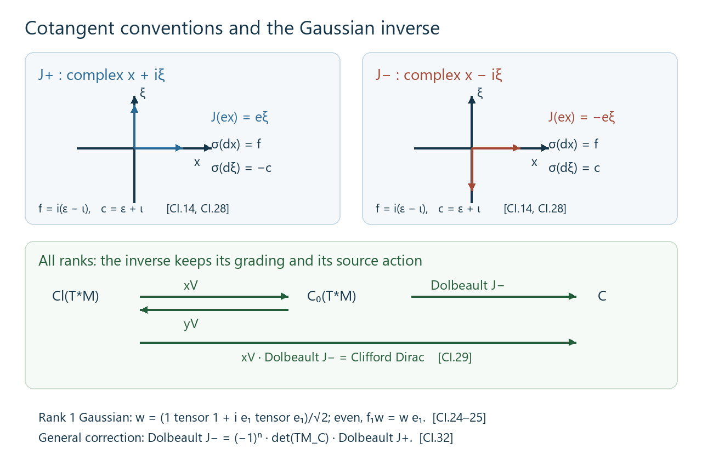
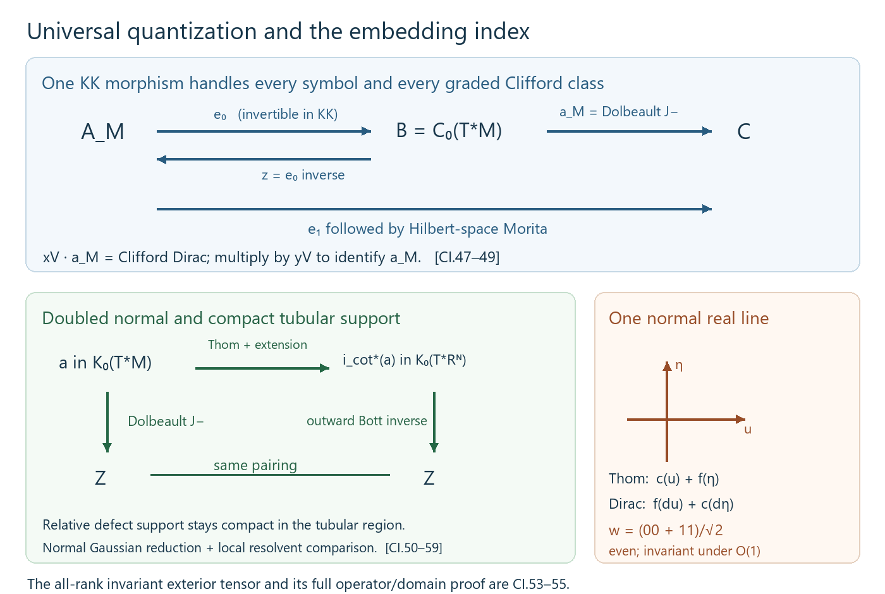

# Dirac classes and the cotangent Dolbeault element

*Written by GPT-6.1 Sol (OpenAI). Public domain (CC0).*

Fix the Fourier convention in which the principal symbol of \(-i\partial_j\) is \(\xi_j\). Clifford multiplication by a real covector is self-adjoint and has square its squared norm. The compactly supported smooth sections of a finite-rank Hermitian bundle are denoted \(C_c^\infty\). All manifolds here are smooth and second countable.

## 1. A local domain argument and the exhaustion argument

**Lemma CI.1.** Let \(Y\) be a Riemannian manifold, \(W\to Y\) a finite-rank Hermitian bundle, and \(P\) a smooth formally symmetric first-order operator on \(C_c^\infty(Y,W)\). Suppose its principal symbol satisfies

\[
 \|\sigma_P(y,\zeta)\|\leq c\|\zeta\|
 \tag{CI.1}
\]

with one constant \(c\). Suppose either \(Y\) is compact or there is a smooth proper function \(r:Y\to[1,\infty)\) with \(\|dr\|\leq c_r\). Then \(P\) is essentially self-adjoint on \(C_c^\infty\). If \(P\) is elliptic, its self-adjoint closure \(D\) satisfies

\[
 f(D\pm i)^{-1}\in\mathcal K(L^2(Y,W))
 \quad(f\in C_0(Y)).
 \tag{CI.2}
\]

**Proof: compactly supported vectors in the maximal domain.** The adjoint domain is the maximal distributional domain \(\{u\in L^2:Pu\in L^2\}\). Indeed testing the adjoint identity on compactly supported smooth sections is exactly the distributional identity. Work in a relatively compact coordinate chart and trivialize the bundle; a smooth change of density and fiber metric gives the same graph convergence problem in ordinary Euclidean \(L^2\). In this trivialization write

\[
 P=\sum_j a_j(x)\partial_j+b(x).
\]

Let \(J_\varepsilon\) be convolution with a smooth compactly supported approximate identity. For a vector supported inside the chart, distributional integration by parts gives

\[
\begin{split}
 (PJ_\varepsilon-J_\varepsilon P)u(x)
 ={}&\sum_j\int\big(a_j(x)-a_j(y)\big)
       \partial_j k_\varepsilon(x-y)u(y)\,dy\\
 &+\sum_j\int k_\varepsilon(x-y)(\partial_j a_j)(y)u(y)\,dy\\
 &+\int k_\varepsilon(x-y)\big(b(x)-b(y)\big)u(y)\,dy.
\end{split}
 \tag{CI.3}
\]

The first two lines are uniformly bounded on \(L^2\): on the selected compact neighborhood the coefficients are Lipschitz, and
\(\int |z|\,|\partial_jk_\varepsilon(z)|\,dz\) is independent of \(\varepsilon\). The last line is uniformly bounded and tends to zero in operator norm by uniform continuity of \(b\). On a smooth compactly supported vector the entire commutator tends to zero, since both terms before subtraction converge to \(Pu\). Smooth vectors are dense in \(L^2\), and the uniform bound therefore proves convergence to zero for every \(L^2\) vector. If additionally \(Pu\in L^2\), (CI.3) proves

\[
 J_\varepsilon u\longrightarrow u,\qquad
 PJ_\varepsilon u\longrightarrow Pu
 \quad\text{in }L^2.
 \tag{CI.4}
\]

For a general compactly supported maximal-domain vector take a finite smooth partition in such charts. Multiplication by a partition function preserves the maximal domain, because
\(P(\alpha u)=\alpha Pu+[P,\alpha]u\), and the commutator is a bounded multiplication operator on its compact support. Mollify the finitely many pieces and sum. Thus every compactly supported maximal-domain vector belongs to the minimal closed domain. No ellipticity was needed for this step.

**Proof: the deficiency spaces.** Choose a real smooth function \(\rho\) equal to one on \([0,1]\), zero on \([2,\infty)\), and between zero and one. Set \(\chi_R=\rho(r/R)\) in the noncompact case. It has compact support, tends pointwise to one, and

\[
 \|[P,\chi_R]\|\leq cc_r\|\rho'\|_\infty/R.
 \tag{CI.5}
\]

Let \(u\in\ker(P^*\mp i)\). The preceding local argument places \(\chi_Ru\) in the minimal domain. The imaginary part of its symmetry identity gives

\[
 \|\chi_Ru\|^2
 \leq \|[P,\chi_R]u\|\,\|\chi_Ru\|.
 \tag{CI.6}
\]

Indeed \(P(\chi_Ru)=\pm i\chi_Ru+[P,\chi_R]u\), while \(\langle P(\chi_Ru),\chi_Ru\rangle\) is real. Equations (CI.5)–(CI.6) and dominated convergence imply \(u=0\). On a compact manifold use \(\chi_R=1\) and the same argument immediately. The two ranges of the minimal closure minus and plus \(i\) are dense because their orthogonal complements are these deficiency spaces. They are closed because, for a symmetric operator,

\[
 \|(P\pm i)v\|^2=\|Pv\|^2+\|v\|^2.
\]

They are therefore the whole Hilbert space. Their inverse resolvents are adjoints of one another, and the closed operator is self-adjoint. This proves essential self-adjointness and identifies its domain with the maximal distributional domain.

**Proof: localized compactness.** For a compactly supported smooth \(\chi\), local ellipticity gives

\[
 \|\chi u\|_{H^1}\leq C_\chi(\|Du\|_{L^2}+\|u\|_{L^2}).
 \tag{CI.7}
\]

Here the local symbol and Sobolev arguments are the actual proofs in [*Unbounded Kasparov modules and spectral triples*, Lemmas 4.2a–4.2b](KT-KK-11.html#4-spectral-triples-and-the-circle). In a chart, invert the first-order principal symbol for large frequency, multiply that inverse by a cutoff equal to one near \(\operatorname{supp}\chi\), and quantize it. The proved composition expansion gives the identity near that support modulo an operator of order minus one. Both the inverse and this remainder map \(L^2\) to \(H^1\). Insert a second cutoff equal to one near the first; its commutator with \(P\) is order zero. The Sobolev bounds in that lemma give (CI.7). A finite chart partition gives the displayed estimate for the entire support. It applies to maximal-domain vectors by the compactly supported graph approximation already established, or by the same distributional parametrix identity.

Apply (CI.7) to \(u=(D\pm i)^{-1}v\). The inverse resolvent has norm at most one, and \(D(D\pm i)^{-1}\) is bounded, so bounded subsets of \(L^2\) are carried by \(\chi(D\pm i)^{-1}\) into a bounded \(H^1\) set with fixed compact support. The compact Sobolev inclusion, proved by the finite chart/Fourier-truncation argument in the same earlier lemma, makes this operator compact. Approximate an arbitrary \(f\in C_0(Y)\) uniformly by compactly supported smooth functions; such approximation follows by scalar truncation, a finite chart partition and ordinary convolution in each chart. The uniform resolvent bound passes compactness to the limit and proves (CI.2). \(\square\)

## 2. Closed spin\(^{c}\) Dirac classes

**Proposition CI.2.** Let \(M\) be a closed Riemannian spin\(^{c}\) manifold. The spin\(^{c}\) Dirac operator defines

\[
 [D_M]\in KK^{\dim M}(C(M),\mathbb C).
 \tag{CI.8}
\]

**Proof.** In even dimension let \(S=S^+\oplus S^-\) be the spinor bundle and let \(\nabla\) be its Hermitian Clifford connection. For an orthonormal frame put

\[
 D_M=-i\sum_j c(e_j^\flat)\nabla_{e_j}.
 \tag{CI.9}
\]

The connection's change-of-frame rule makes this a global operator. Its principal symbol is \(c(\xi)\), hence its square is \(\|\xi\|^2\) and it is elliptic. Metric compatibility and integration by parts show formal symmetry: the additional divergence terms cancel the connection derivatives of the frame, since
\(\sum_j\nabla_{e_j}e_j+\sum_j(\operatorname{div}e_j)e_j=0\). It is odd for the spinor chirality. Lemma CI.1 gives its self-adjoint closure and compact inverse resolvents. Its closed domain is \(H^1(M,S)\), by the exact elliptic-domain proof in the earlier Lemma 4.2b.

Smooth scalar multiplication preserves this domain and

\[
 [D_M,f]=-i\,c(df),\qquad f\in C^\infty(M).
 \tag{CI.10}
\]

This commutator is bounded. Smooth functions are uniformly dense in \(C(M)\), by the finite chart convolution argument. The Hilbert space \(L^2(M,S)\) is separable, by finite bundle charts and the countable Fourier dense families in their coordinate boxes, so it is a countably generated Hilbert \(\mathbb C\)-module. [The Baaj–Julg bounded-transform proof, Theorem 2.2 of the earlier lesson](KT-KK-11.html#2-the-bounded-transform), now proves that

\[
 \big(L^2(M,S),\text{multiplication},
      D_M(1+D_M^2)^{-1/2}\big)
 \tag{CI.11}
\]

is the required even cycle. This constructs the class; no index theorem is needed to obtain it.

In odd dimension use the ungraded spinor space and the same self-adjoint operator, then the right-Clifford convention: tensor the Hilbert space with \(Cl_1\), grade by that final factor, and replace \(D_M\) by \(D_M\otimes\epsilon\). Its square, inverse-resolvent formula, compactness and commutator checks are the same ones tensored with a finite-dimensional algebra. The right module is countably generated. Its bounded transform is an even cycle with coefficient \(Cl_1\), which is exactly the definition of the odd group in (CI.8). \(\square\)

## 3. The \(J_+\) cotangent Dolbeault element in every base dimension

The following construction needs neither an orientation nor a spin\(^{c}\) structure on the base manifold. Its explicit almost complex convention is denoted \(J_+\); Section 5 compares it with the convention compatible with the outward Thom elements. Let \(M\) be any closed Riemannian manifold and \(Q=T^*M\). The Levi-Civita connection splits

\[
 T_{(x,\xi)}Q\cong T_xM\oplus T_x^*M.
\]

With the horizontal metric \(g\) and vertical metric \(g^{-1}\), define the orthogonal almost complex structure

\[
 J(v,\eta)=(-g^{-1}\eta,gv).
 \tag{CI.12}
\]

Thus \(J^2=-1\); in a flat orthonormal coordinate system it gives the complex coordinates \(x_j+i\xi_j\). Its spinor bundle is \(\Lambda^{0,*}T^*Q\), graded by degree. The elementary complex exterior spinor construction and determinant convention are the earlier [*Thom isomorphisms and K-orientations in KK*, Section 6](KT-KK-13.html#6-complex-bundles-and-relative-symbols); the Hermitian metric identifies that model with the anti-holomorphic cotangent model here.

For a compactly supported \((0,q)\)-form let \(\bar\partial_J\) be the \((0,q+1)\)-part of its exterior derivative, and take its formal adjoint for this metric and density. Define

\[
 P_Q=\sqrt2\,(\bar\partial_J+\bar\partial_J^*).
 \tag{CI.13}
\]

Integrability of \(J\) is unnecessary: (CI.13) is an odd formally symmetric first-order operator even when \(\bar\partial_J^2\ne0\). For a real covector \(\zeta\), its principal symbol is

\[
 \gamma_J(\zeta)
 =i\sqrt2\big(\varepsilon(\zeta^{0,1})
                 -\varepsilon(\zeta^{0,1})^*\big).
 \tag{CI.14}
\]

The wedge/contraction relations give \(\gamma_J(\zeta)^2=\|\zeta\|^2\); the symbol is self-adjoint and has norm \(\|\zeta\|\). This verifies ellipticity and (CI.1) directly. The factor \(\sqrt2\) compensates for \(\|\zeta^{0,1}\|^2=\|\zeta\|^2/2\).

The function

\[
 r(x,\xi)=\sqrt{1+\|\xi\|^2}
 \tag{CI.15}
\]

is smooth and proper because the base is compact and bounded closed ball bundles are compact. Parallel transport preserves \(\|\xi\|\), so its horizontal derivative is zero. Its vertical gradient has norm \(\|\xi\|/\sqrt{1+\|\xi\|^2}\leq1\). Thus Lemma CI.1 applies, proving essential self-adjointness and localized compactness for the closure \(D_Q\). For \(f\in C_c^\infty(Q)\), its commutator is multiplication by the symbol at \(df\), up to the fixed factor \(-i\); it is bounded and preserves the closed domain. The earlier bounded-transform theorem consequently constructs

\[
 [\bar\partial_{M,+}]
 =\big[L^2(Q,\Lambda^{0,*}T^*Q),\text{multiplication},
            D_Q(1+D_Q^2)^{-1/2}\big]
 \in KK(C_0(T^*M),\mathbb C).
 \tag{CI.16}
\]

Separable countable generation follows from the countable bundle chart cover and compactly supported coordinate dense families, as before. This proof applies when \(\dim M\) is odd and when \(M\) is nonorientable; \(Q\) itself has the displayed almost complex structure and even real dimension.

The normalization in (CI.13) has no effect on the class: positive scalar rescaling gives the norm-continuous bounded-transform homotopy proved in the earlier product-recognition section. These formulas construct the analytic elements needed for the index comparison. Their construction alone does not identify a symbol product or the embedding topological index.

## 4. Dependence on the geometric choices

**Lemma CI.4 (a smooth family is a cycle homotopy).** Suppose a family \(P_s\), \(0\leq s\leq1\), satisfies Lemma CI.1, is elliptic, and has smooth coefficients depending smoothly on \(s\). Identify its Hermitian bundle and density spaces with one fixed graded \(L^2\) space by smooth even pointwise unitary maps. Suppose the localized elliptic estimates (CI.7) hold uniformly on compact sets and the scalar multiplication source is fixed under these maps. Then the bounded-transform cycles form a Hilbert-module homotopy. Norm continuity of the unlocalized bounded transforms is not an additional hypothesis.

**Proof.** Write \(D_s\) for the self-adjoint closures. Every compactly supported smooth vector is in every domain, and \(s\mapsto D_su\) is norm-continuous for such a vector. The inverse resolvents \(R_s^\pm=(D_s\pm i)^{-1}\) are strongly continuous. To prove this at \(s_0\), first take \(v=(D_{s_0}\pm i)u\) with \(u\) compactly supported and smooth. The resolvent identity on this common core gives

\[
 R_s^\pm v-u=R_s^\pm(D_{s_0}-D_s)u\longrightarrow0.
 \tag{CI.17}
\]

Such \(v\) are dense, by the core and surjectivity already proved. The uniform bound \(\|R_s^\pm\|\leq1\) extends continuity to every vector. The same argument for the opposite sign gives strong continuity of the adjoints.

These fields therefore act adjointably on \(\mathcal H=C([0,1],L^2(Y,W))\). Their pointwise resolvent identities define a self-adjoint regular operator \(\mathcal D\), with domain consisting of sections whose values lie in \(\operatorname{Dom}D_s\) and whose images under \(D_s\) are continuous. For clarity, finite sums of smooth compactly supported vectors with continuous scalar parameter coefficients are a graph core. Given a continuous target section \(v(s)\), select at each of finitely many parameters a smooth vector \(u_j\) approximating \(R_{s_j}^\pm v(s_j)\) in its graph norm. Continuity of \((D_s\pm i)u_j\) and of \(v(s)\) gives the same approximation on a neighborhood. A finite parameter partition of unity yields a section whose image under \(\mathcal D\pm i\) approximates \(v\) uniformly. Applying the bounded inverse resolvent proves graph convergence. This verifies the claimed closure and the dense domain; the same resolvents prove regularity by the earlier resolvent lemma.

For a compactly supported smooth \(\chi\), the uniform estimate (CI.7) makes the family \(\chi R_s^\pm\) collectively compact: its images of unit balls lie in a uniformly bounded \(H^1\) set with fixed compact support. Compact inclusion permits a finite-dimensional orthogonal projection \(p\) such that

\[
 \sup_s\|(1-p)\chi R_s^\pm\|<\varepsilon.
\]

The operators \(p\chi R_s^\pm\) vary in norm, since their adjoints are the strongly continuous operators \(R_s^\mp\chi^*p\) restricted to the finite-dimensional range of \(p\). Uniform finite-rank approximation proves that \(s\mapsto\chi R_s^\pm\) is a norm-continuous compact field. Uniform approximation of \(f\in C_0(Y)\) by these smooth cutoffs proves the same for \(fR_s^\pm\).

The smooth compactly supported source algebra preserves the core and has bounded parameter-continuous commutators with \(\mathcal D\). The module \(\mathcal H\) is countably generated, using constant vectors from a countable Hilbert basis. Its localized inverse resolvents are the compact fields just proved. Apply the earlier Hilbert-module bounded-transform theorem to \(\mathcal D\). Evaluation at either endpoint gives the original bounded-transform cycle by its resolvent functional calculus. This is the required homotopy. \(\square\)

For a fixed spin\(^{c}\) structure, metrics are joined by their convex positive-definite interpolation and Hermitian Clifford connections by the affine interpolation of compatible connections, using the smooth identification of the metric orthonormal frame bundles by the positive square root of the relative metric matrix. The resulting spinor spaces are identified evenly and pointwise. On a closed base all elliptic estimates are uniform on the compact parameter interval. Lemma CI.4 proves independence of these metric and connection choices in (CI.8). In odd dimension apply its resolvent and compact-field arguments after the finite right-Clifford transfer: the inverse of \(D_s\otimes\epsilon\pm i\) is \((D_s\otimes\epsilon\mp i)(1+D_s^2)^{-1}\), so the same continuity and compactness follow from the scalar resolvents and the fixed finite Clifford factors.

For (CI.16), interpolate the base metrics. Their Levi-Civita connections, the splittings (CI.12), and the exterior spinor bundles vary smoothly on \(T^*M\times[0,1]\). An even Hermitian connection on this parameter bundle identifies the fibers by parameter-direction parallel transport; multiplication by base functions is preserved. Each parameter has the proper radial function (CI.15), so essential self-adjointness follows individually from CI.1. On any selected compact support the parameter-dependent coefficients and ellipticity constants are uniformly controlled, giving exactly the uniform local estimates required in CI.4. It follows that the cotangent Dolbeault element is independent of the chosen base metric. This argument does not require a uniform global bound on the change between two Sasaki metrics.

## 5. The Clifford inverse and the two cotangent conventions

Put \(V=T^*M\), \(R=C(M)\), \(B=C_0(V)\), \(C=\Gamma(\operatorname{Cl}(V))\), and \(n=\dim M\); components of different dimensions are treated separately. Write
\[
 \epsilon_n=(-1)^{n(n-1)/2}.
 \tag{CI.18}
\]
On \(\Lambda^*V_{\mathbb C}\), use
\[
 c_j=\varepsilon_j+\iota_j,\qquad
 f_j=i(\varepsilon_j-\iota_j),\qquad
 \Gamma_0=(-1)^N.
 \tag{CI.19}
\]
The Clifford Thom equivalence of *Thom isomorphisms and K-orientations in KK*, Theorem 4.2, has the concrete forward module
\[
 \mathcal X=C_0(V,\pi^*\Lambda^*V_{\mathbb C}),\quad
 \Gamma_{\mathcal X}=\epsilon_n\Gamma_0,\quad
 e_j\longmapsto f_j,\quad X=c(\xi).
 \tag{CI.20}
\]
Its bounded transform represents \(x_V\in KK_R(C,B)\). The representation of a varying Clifford section is pointwise at the base point. All algebras in this section are separable and the intermediates are \(\sigma\)-unital: \(M\) is compact and second countable, \(C\) is finite-dimensional over \(R\), and radial cutoffs give a countable approximate identity of \(B\). Thus the actual preceding product theorems apply.

**Lemma CI.5 (an explicit inverse with its grading).** The inverse \(y_V\in KK_R(B,C)\) is represented on the Hilbert \(C\)-module
\[
 \mathcal Y=\Gamma\bigl(x\longmapsto L^2(V_x)\widehat\otimes
                    \operatorname{Cl}(V_x)\bigr),\qquad
 \Gamma_{\mathcal Y}=\epsilon_n\Gamma_{\operatorname{Cl}},
 \qquad
 D_{\mathcal Y}=i\epsilon_n\sum_j e_j\partial_{\xi_j}.
 \tag{CI.21}
\]
Here \(e_j\) acts by **left** multiplication on the coefficient Clifford algebra. The right action is the ordinary right Clifford action. The source \(B\) acts by scalar multiplication. Neither orientation nor a spinor bundle is needed.

**Proof: the operator and its module.** Orthogonal changes of frame act by the change of variable on \(L^2(V_x)\) and by the Clifford algebra isomorphism. They preserve (CI.21), its grading and the fiber Lebesgue measure. In a frame, Fourier transformation turns its symbol into \(-\epsilon_n\sum e_j\zeta_j\), whose square is \(|\zeta|^2\). The inverse resolvents are the Fourier multipliers
\[
 \frac{D_{\mathcal Y}\mp i}{1+D_{\mathcal Y}^2}.
\]
Their norms are at most one, their adjoints are the opposite resolvents, and their ranges are the first vertical Sobolev domain. This is exactly the Fourier/domain argument in the Bott lesson's Lemma 3.1, with a finite Clifford coefficient. The resolvents glue under the frame unitaries; their ranges contain the sections smooth and compactly supported in the fiber in a chart. A finite partition proves density and hence self-adjoint regularity by the resolvent lemma.

A finite cover and countably many smooth compactly supported fiber vectors, times the finitely many coefficient Clifford frame vectors, give countably many module generators. For a compactly supported source in a chart, the localized resolvents are compact by the Bott lesson's frequency cutoff and square-integrable-kernel argument. Tensoring with the finite coefficient matrices and multiplying chart partitions on both sides gives global finite-rank approximations. Summing over the finite cover, then approximating an arbitrary \(B\)-source by fiber cutoffs, proves local compactness. The smooth compactly supported source has bounded commutators \(i\epsilon_n c(d_{\mathrm{vert}}b)\) and preserves the Sobolev domain. The bounded-transform theorem supplies the cycle.

**Proof: the inverse identification.** On \(\mathcal X\widehat\otimes_B\mathcal Y\), the proposed product is the fiber operator
\[
 Q=c(\xi)+i\Gamma_0\sum_j L_{e_j}\partial_{\xi_j},
 \qquad
 \Gamma_{\mathcal X\otimes\mathcal Y}
       =\Gamma_0\widehat\otimes\Gamma_{\operatorname{Cl}} .
 \tag{CI.22}
\]
The two occurrences of \(\epsilon_n\) cancel in these expressions. Its domain is the weighted vertical Sobolev domain. Squaring on smooth compactly supported vectors gives the scalar harmonic oscillator plus the \(n\) commuting self-adjoint involutions
\[
 K_j=-i c_j\Gamma_0 L_{e_j}.
 \tag{CI.23}
\]
The Clifford anticommutation relations give \(K_j^2=1\) and \(K_jK_k=K_kK_j\). The scalar oscillator is bounded below by \(n\); its ground vector is \(g(\xi)=\pi^{-n/4}e^{-|\xi|^2/2}\), and its other Hermite levels are at least \(n+2\). These exact assertions, with the complete graph domain and compact inclusion, are proved in the Bott lesson's Lemma 4.0. Diagonalizing the finitely many matrices \(K_j\) gives the bounded inverse of \(1+Q^2\) in the Hermite decomposition. The operators \((Q\mp i)(1+Q^2)^{-1}\) are mutually adjoint bounded inverse resolvents of \(Q\pm i\), with ranges the weighted graph domain: the identity \(\|Qu\|^2=\langle u,(-\Delta+|\xi|^2+\sum K_j)u\rangle\) identifies its graph norm with that weighted norm, and the smooth Hermite core is dense for it. The resolvent argument proves self-adjoint regularity, compact fiber resolvents and a gap at least \(\sqrt2\) off the kernel. No unbounded-domain conclusion is inferred merely from formal squaring.

The common \(-1\) eigenspace in (CI.23) is the right coefficient module generated by
\[
 w=2^{-n/2}\sum_{I=(i_1<\cdots<i_k)}
       (e_{i_1}\wedge\cdots\wedge e_{i_k})
             \otimes i^k e_{i_k}\cdots e_{i_1}.
 \tag{CI.24}
\]
Indeed exterior creation and contraction, with the sign from moving a generator through the ordered word, give
\[
 (c_j-i\Gamma_0L_{e_j})w=0,\qquad
 f_jw=w e_j,\qquad
 \langle w,w\rangle=1_C.
 \tag{CI.25}
\]
For the last identity each of the \(2^n\) coefficient words is unitary. For completeness, the first identity determines every coefficient recursively from the vacuum coefficient: its degree-\(k\) coefficient is \(i^ke_{i_k}\cdots e_{i_1}\). Thus it describes the whole simultaneous eigenspace, not just one vector in it. The generator \(w\) is even, because its form degree and coefficient degree agree. Its formula is orthogonally invariant: alternating Clifford multiplication and the exterior inner product are invariant; reversal of the Clifford word is invariant as well. Hence \(gw\) is a global even unit section. Equations (CI.25) identify its source and coefficient actions with the identity \(C\)-\(C\) correspondence.

The oscillator resolvents are compact on the global \(C\)-module, rather than merely fiberwise: the compact resolvent field is norm-continuous under the strongly continuous transition unitaries, first for rank ones and then by approximation. A finite chart partition gives global finite-rank approximations, as in the actual proof of the parametrized Bott theorem. Creations from smooth compactly supported sections of \(\mathcal X\) have bounded errors relative to \(D_{\mathcal Y}\): the errors are multiplication by their position and vertical derivative, both bounded on the selected support. The adjoint error follows by vertical integration by parts; it gives the required adjoint domain inclusion. Moreover \(\operatorname{Dom}Q\subset\operatorname{Dom}X\), and
\[
 2\operatorname{Re}\langle Q u,Xu\rangle
       \geq-n\langle u,u\rangle
\]
on the graph domain, by the bounded matrix term in (CI.23). The proved unbounded product criterion identifies (CI.22) with \(x_V\otimes_B[\mathcal Y]\). Deforming the complementary oscillator bounded transform to its sign leaves \(C\) on the even Gaussian summand and an exactly degenerate complement: the source action is fiberwise Clifford multiplication and intertwines (CI.25), and it graded commutes with \(Q\). Thus \(x_V\otimes_B[\mathcal Y]=1_C\). The already proved inverse pair of Theorem 4.2 now implies
\[
 [\mathcal Y]
  =(y_V\otimes_C x_V)\otimes_B[\mathcal Y]=y_V .
\]
This identifies the actual inverse, including every sign in (CI.21). \(\square\)

Define the Clifford Dirac class by the closure of
\[
 \mathscr D_M=-i\sum_j c_j\nabla_{e_j}
 \quad\hbox{on }\ L^2(M,\Lambda^*V_{\mathbb C}),\qquad
 \Gamma_M=\epsilon_n\Gamma_0,\qquad C\ni e_j\longmapsto f_j.
 \tag{CI.26}
\]
The exterior connection is the metric connection. Clifford families \(c\) and \(f\) graded commute. Consequently the graded commutator with a smooth Clifford section is multiplication by its covariant derivative contracted with \(c\), hence bounded. The scalar elliptic symbol is \(c(\zeta)\). Lemma CI.1 and the closed-manifold elliptic domain proof give self-adjointness, the domain \(H^1\), compact resolvents and the bounded-transform cycle
\[
 [\mathscr D_M]\in KK(C,\mathbb C).
 \tag{CI.27}
\]
The formal symmetry verification is the same frame/divergence cancellation as in CI.2. This construction applies in every dimension and on nonorientable \(M\).

Set
\[
 J_-(v,\eta)=(g^{-1}\eta,-gv).
 \tag{CI.28}
\]
Construct \([\bar\partial_{M,-}]\) by Section 3 with \(J_-\) in place of \(J_+\). Its proper radial function and ellipticity are unchanged. In a local orthonormal identification of its anti-holomorphic forms with \(\Lambda^*V_{\mathbb C}\), its horizontal and vertical symbols are respectively \(f_j\) and \(c_j\).

**Theorem CI.6 (the full Clifford Thom–Dolbeault identities).** For every closed manifold, including odd-dimensional and nonorientable manifolds,
\[
 y_V\otimes_C[\mathscr D_M]=[\bar\partial_{M,-}],
 \qquad
 x_V\otimes_B[\bar\partial_{M,-}]=[\mathscr D_M].
 \tag{CI.29}
\]

**Proof.** Give the fiber Hilbert bundle in (CI.21) its metric parallel-transport connection. This transports the fiber Lebesgue measure, Clifford multiplication and vertical derivative together, and therefore preserves \(D_{\mathcal Y}\). The tensor evaluation identifies
\[
 \mathcal Y\widehat\otimes_C L^2(M,\Lambda^*V_{\mathbb C})
       \cong L^2(V,\pi^*\Lambda^*V_{\mathbb C})
\]
with grading \(\Gamma_0\), because the two factors \(\epsilon_n\) cancel. On a smooth core the connection tensor sum is
\[
 L=\epsilon_n\left(-i\sum_jc_j\nabla_{H_j}
                         -\sum_j\widehat c_j\partial_{\xi_j}\right),
 \qquad \widehat c_j=\varepsilon_j-\iota_j .
 \tag{CI.30}
\]
The horizontal lift \(H_j\) includes the variation of the fiber coordinate under the connection; it is not a derivative at a fixed arbitrary coordinate trivialization. Parallel transport preserves the vertical operator, so its derivative along \(H_j\) is zero. In addition \(c_j\) anticommutes with every \(f_k=i\widehat c_k\). These two identities give exact anticommutation between the horizontal and vertical summands of (CI.30). The horizontal summand is formally symmetric: the fiber transport has zero infinitesimal divergence, and the remaining frame/divergence cancellation is the one on \(M\). Thus, on the core,
\[
 \|Lu\|^2=\|D_{\mathrm{vert}}u\|^2+\|D_{\mathrm{hor}}u\|^2,\qquad
 2\operatorname{Re}\langle Lu,D_{\mathrm{vert}}u\rangle
          =2\|D_{\mathrm{vert}}u\|^2\geq0.
 \tag{CI.31}
\]

The principal symbol of \(L\) is an orthogonal Clifford symbol for the connection metric. The proper function (CI.15) has bounded gradient for it. Lemma CI.1 therefore proves essential self-adjointness and localized compactness on the full cotangent space, with smooth compactly supported sections as a graph core. The vertical summand is the self-adjoint regular tensor extension of \(D_{\mathcal Y}\). Applying (CI.31) to graph approximants proves \(\operatorname{Dom}L\subset\operatorname{Dom}D_{\mathrm{vert}}\) and the displayed positivity on that domain. This is a global domain estimate; no bounded-curvature assertion is required.

For a smooth section of \(\mathcal Y\) with compact fiber support, the creation error for \(L\) and \(\mathscr D_M\) is the column formed by its vertical derivative and its horizontal covariant derivative. It is bounded: its fiber \(L^2\) norm is a continuous function on the compact base, and finitely many charts bound its supremum. Such sections form a dense homogeneous subspace of \(\mathcal Y\). Integration by parts in the fiber and the base gives the adjoint creation error. In particular, the distributional identity expresses \(\mathscr D_MT_\xi^*u\) as \(T_\xi^*Lu\) plus that bounded error; the maximal-domain characterization of \(\mathscr D_M\) gives the adjoint domain inclusion. The first creation domain inclusion follows directly from the same product rule. The product criterion, with (CI.31), now identifies the class of \(L\) with \(y_V\otimes_C[\mathscr D_M]\).

The even globally defined form-degree phase \(U=i^N\) satisfies
\[
 Uc_jU^*=f_j,\qquad Uf_jU^*=-c_j.
\]
It turns the principal symbol of (CI.30) into \(\epsilon_n\) times the \(J_-\) Dolbeault symbol. Both operators are odd and formally symmetric. Their difference is a smooth zero-order endomorphism. Interpolating that difference preserves the principal symbol, the bounded-gradient exhaustion and all uniform localized elliptic estimates. Lemma CI.4 consequently identifies their bounded-transform classes even if that endomorphism is unbounded at fiber infinity. Multiplication of an odd operator by \(-1\) gives the same even cycle here by conjugation with \(\Gamma_0\), which commutes with the scalar source. Thus the factor \(\epsilon_n\) has no effect. This proves the first identity of (CI.29); multiplying by \(x_V\) and using its proved inverse gives the second. \(\square\)

**Proposition CI.7 (the orientation line distinguishes \(J_+\) and \(J_-\)).** Let \(\lambda=\det(V_{\mathbb C})\) and write \(\lambda_Q=\pi^*\lambda\). Then
\[
 [\bar\partial_{M,-}]
   =(-1)^n[\![\lambda_Q]\!]\otimes_B[\bar\partial_{M,+}].
 \tag{CI.32}
\]
The bundle cycle \([\![\lambda_Q]\!]\in KK(B,B)\) is multiplication on its section module, with operator zero and its usual even grading. For oriented \(M\), \(\lambda\) is trivial, so the difference is precisely \((-1)^n\).

**Proof.** In a frame put \(F_0=f_1\cdots f_n\) and
\[
 U_0=F_0\Gamma_0^{\,n+1}.
\]
The Clifford relations give
\[
 U_0 f_jU_0^*=f_j,\qquad U_0c_jU_0^*=-c_j.
\]
Indeed for odd \(n\) the first product commutes with every \(f_j\) and anticommutes with every \(c_j\); for even \(n\) its two signs are reversed and the extra \(\Gamma_0\) reverses both. It is a unitary of degree \(n\) modulo two. Under an orthogonal frame change it is multiplied by the determinant of that change. Thus it is a global degree-\(n\) unitary between one spinor bundle and the other tensored with \(\lambda_Q\); the real determinant transitions also show \(\lambda_Q^{\otimes2}\cong\mathbf1\).

The \(J_+\) symbols are \(f_j,-c_j\) and the \(J_-\) symbols are \(f_j,c_j\), so this unitary intertwines their principal symbols. Choose a Hermitian connection on the line. The two transformed first-order operators have the same principal symbol and differ by a smooth symmetric zero-order term; CI.4 identifies their classes by interpolation, with no global bound on that term needed. A degree-\(n\) unitary reverses the grading when \(n\) is odd, giving \((-1)^n\). Here is the line-tensor product check on the nonunital coefficient. Realize \(\lambda\) by a smooth base projection \(p\in M_N(R)\); a finite local-frame embedding and its Hermitian orthogonal projection give such a projection. Its represented commutator with the cotangent Dirac is bounded, since \(p\) depends only on the compact base. Remove the bounded off-diagonal blocks of the amplified Dirac. The large-imaginary-parameter Neumann inverse proves self-adjointness and regularity of its \(p\)-compression, exactly as in the finite-projective connection proof. Localized compactness follows from the resolvent identity: for \(b\in C_c^\infty(V)\), the correction is a bounded multiplication endomorphism commuting with \(b\), so its resolvent correction has the original compact \(b\)-localized resolvent as its first factor. Norm approximation gives every \(b\in B\). The first operator on \(pB^N\) is zero; smooth compactly supported column creations have bounded errors and adjoint errors. Domain inclusion and positivity relative to that zero operator are automatic. The product criterion identifies the compressed connection Dirac with the line-tensor product. Adding the bounded represented connection endomorphism gives the chosen line connection and the same class. This verifies the tensor assertion and proves (CI.32). \(\square\)

The convention compatible with (CI.20) is consequently \([\bar\partial_{M,-}]\). The \(J_+\) construction remains a valid analytic class, but replacing it by that compatible class without the line and parity correction would be false on odd or nonorientable bases.

*Figure CI.1.* The coordinate panels show the one-dimensional horizontal/vertical model, with \(x\) to the right and \(\xi\) upward. The two choices send the horizontal unit vector to opposite vertical unit vectors. The displayed Clifford symbols are exactly (CI.14) and (CI.28); the lower diagram is the all-dimensional identity (CI.29). The rank-one Gaussian is the specialization of (CI.24), and its even grading and source action are (CI.25). Formula (CI.32) gives the full parity and determinant-line correction; the metric identifies \(\det(TM_{\mathbb C})\) in the figure with \(\det(T^*M_{\mathbb C})\) in the proof.

## 6. Spin\(^{c}\) Thom identities and the odd Gaussian

**Theorem CI.8.** Let \(M\) be closed and spin\(^{c}\), in any dimension. Use the outward Thom class \(\tau_V\) and its inverse \(\eta_V\) from *Thom isomorphisms and K-orientations in KK*, including its ordered right-Clifford convention in odd dimension. Then
\[
 \tau_V\otimes_B[\bar\partial_{M,-}]=[D_M],\qquad
 \eta_V\otimes_R[D_M]=[\bar\partial_{M,-}].
 \tag{CI.33}
\]
These are degree-\(n\) products. In even dimension the same formulas hold with \(J_+\). In odd dimension, for the oriented base, replacing \(J_-\) by \(J_+\) changes the right side of the first equation to \(-[D_M]\).

**Proof in even dimension.** Put \(N=S\otimes L^{-1}\), where \(L\) is the determinant line of the fixed spin\(^{c}\) structure. The actual bundle and grading calculation in that lesson's Lemma 5.2 gives \(\tau_V=[N^*]\otimes_C x_V\). Its doubled exterior module decomposes under the source Clifford action as the source spinor \(N\) and the positive position spinor \(S\). Thus
\[
 N^*\widehat\otimes_C\Lambda^*V_{\mathbb C}\cong S
\]
evenly, intertwining the position Clifford action. The transition calculation includes both scalar characters: \(N\) has character \(\lambda^{-1}\), so removing it leaves character \(\lambda\) on \(S\). This is why replacing \(N\) by \(S\) would introduce the determinant twist.

Choose compatible connections in this decomposition. Contracting the \(N^*\) connection with the exterior connection leaves the spinor connection on \(S\). Creations from smooth \(N^*\)-sections have bounded errors, as do their adjoints; all bundles and their derivatives are bounded on the compact base. The first operator is zero, so its domain and positivity conditions are automatic. The product criterion identifies \([N^*]\otimes_C[\mathscr D_M]\) with the spinor Dirac cycle. A different compatible connection adds a bounded odd endomorphism and gives the already proved CI.4 homotopy. Now (CI.29) gives the first equation of (CI.33).

**The odd grading calculation.** Write \(n=2r+1\). In a positive orthonormal spin frame let \(\Delta\) be the ungraded positive-volume spinor,
\[
 (-i)^r c_\Delta(e_1)\cdots c_\Delta(e_n)=1.
\]
The outward Thom module is \(\pi^*\Delta\widehat\otimes Cl_1\), with its last-factor grading and position operator \(c_\Delta(\xi)\otimes\epsilon\), exactly as in the preceding Thom lesson. After right-dilating the \(J_-\) Dolbeault cycle and tensoring, the vertical position and derivative matrices on the product module are
\[
 A_j=c_\Delta(e_j)\otimes\Gamma_0\otimes\epsilon,\qquad
 B_j=1\otimes c_j\otimes1.
 \tag{CI.34}
\]
The horizontal symbols are \(H_j=1\otimes f_j\otimes1\). The position term is \(A_j\xi_j\), and the vertical differential term is \(B_j(-i\partial_{\xi_j})\). All \(A_j,B_j\) are self-adjoint; distinct matrices within each family anticommute, and the two families anticommute. The vertical oscillator kernel consists precisely of the Gaussian times the simultaneous \(-1\) eigenspace of \(iA_jB_j\). It is a right \(Cl_1\)-module of rank \(2^r\), since each of the \(n\) independent commuting constraints halves the matrix rank. Independence follows either by tracing their products, which have zero trace for every nonempty product, or by the creation/contraction recursion used in (CI.24). Its even and odd subspaces have equal dimension, exchanged by the right generator.

This kernel has the **positive** odd spinor convention. To verify the branch, the constraints give \(A_jv=-iB_jv\). Moving the \(B\)'s through the remaining \(A\)'s gives, for a constrained vector,
\[
 \prod_jA_j\,v=(-i)^n\prod_jB_j\,v.
\]
The exterior Clifford identity \(\prod_j f_j=i^n(\prod_jc_j)\Gamma_0\), applied with the opposite constraints on \(\Gamma_0v\), consequently gives
\[
 \prod_jH_j\,v
   =\left(\prod_jc_\Delta(e_j)\right)\epsilon v,\qquad
 (-i)^r\prod_jH_j\,v=\epsilon v.
 \tag{CI.35}
\]
This is precisely the right-Clifford positive-volume representation on \(\Delta\otimes Cl_1\). It permits an even fiber unitary identifying the kernel with that module.

The fiber unitary also respects the spin\(^{c}\) transitions. For a plane rotation in the \(j,k\) plane, the infinitesimal action on the product module is
\[
 \tfrac12(c_\Delta(e_j)c_\Delta(e_k)+B_jB_k+H_jH_k).
\]
On the kernel \(B_jB_k=-A_jA_k=-c_\Delta(e_j)c_\Delta(e_k)\); hence this action is \(H_jH_k/2\), exactly the spin action in (CI.35). Plane rotations generate the connected spin group; in rank one its two elements act by the prescribed central sign. The scalar spin\(^{c}\) character acts only on the original \(\Delta\), so it is the original scalar character, with no additional line twist. The Gaussian is radial. These observations prove the global kernel-bundle identification. Its horizontal connection is the original spinor connection, up to a bounded zero-order connection change on the compact base.

**Product recognition and removal of the complement.** The preceding finite matrices also give the complete vertical oscillator domain and gap, by the scalar oscillator proof. Parallel transport preserves this oscillator and its Gaussian projection \(P\). Use the tensor-compatible horizontal connection. Its odd horizontal operator \(H\) anticommutes exactly with the vertical oscillator \(O\); this is the same transport and Clifford argument as (CI.31). Use, for the second \(B\)-source cycle, the connection-compatible horizontal/vertical Dirac. Its principal symbol is the chosen \(J_-\) symbol, so CI.4's local zero-order interpolation identifies it with the geometrically defined cotangent Dolbeault cycle. This interpolation uses the source \(B=C_0(V)\); it makes no claim of global compactness before the position potential is added. Creations with compact fiber support give bounded errors against either representative. The full product candidate \(O+H\) is formally symmetric and elliptic for the connection metric. The proper radial exhaustion proves its essential self-adjointness by CI.1, including its unbounded position potential. On its smooth core,
\[
 (O+H)^2=O^2+H^2,\qquad
 \|\,|\xi|u\|^2\leq C(\|(O+H)u\|^2+\|u\|^2).
 \tag{CI.36}
\]
The last estimate follows from \(O^2=-\Delta_\xi+|\xi|^2\) plus the bounded Clifford matrix term. Graph approximation extends it to the closed domain, proving the position-operator domain inclusion. Its anticommutator with the position term is \(2|\xi|^2\) plus a matrix of norm at most \(n\); the horizontal part contributes zero. Thus the product positivity form is bounded below by \(-n\).

Smooth compactly supported Thom sections have bounded creation errors and adjoint errors by the vertical product rule and their horizontal covariant derivatives. The graph core and maximal-domain argument in CI.6 justify the adjoint domain inclusion. The product criterion therefore identifies this candidate with \(\tau_V\otimes_B[\bar\partial_{M,-}]\).

Its resolvents are globally compact. Localized graph compactness is CI.1. The last estimate in (CI.36) bounds the \(L^2\) mass outside \(|\xi|\leq R\) by \(C/R\) times the graph norm. Inside that ball a fixed compactly supported cutoff has compact graph inclusion. Combining the tail estimate with these compact local inclusions proves global compact graph inclusion.

It remains to remove the horizontal operator on the complementary oscillator summand; a norm limit of the entire bounded transform must **not** be assumed. Put \(Q_s=sO+H\), \(s\geq1\). The same domain, compactness and recognition checks hold. On a finite positive \(s\)-interval the confining tail bound in (CI.36) is uniform, so the resolvents are collectively compact globally: combine that tail with the uniform localized Sobolev compactness of CI.4. The strong-resolvent proof in that lemma then gives norm-continuous global compact resolvent fields. Base smooth functions have uniformly bounded parameter-continuous commutators. The Hilbert-module bounded-transform theorem consequently gives a homotopy with the unital source \(R\), rather than only a vanishing-at-infinity source assertion. On \(P\), \(Q_s\) is the original odd spinor Dirac. On \(1-P\), the gap gives \(|Q_s|\geq s\sqrt2\), by (CI.36). For a smooth base function \(a\), \(P\) commutes with \(a\), \([O,a]=0\), and \([Q_s,a]=[H,a]\) is uniformly bounded. On this complement the sign-resolvent integral gives
\[
 \|[\operatorname{sign}Q_s,a]\|
       \leq C\|[H,a]\|/s,\qquad
 \|F_{Q_s}-\operatorname{sign}Q_s\|\leq C/s^2.
 \tag{CI.37}
\]
To check the first bound directly, use
\(\operatorname{sign}Q_s=\pi^{-1}\int_0^\infty((Q_s-it)^{-1}+(Q_s+it)^{-1})\,dt\)
in the strong sense. The commutator of each resolvent is the product of two resolvents and \([H,a]\), with norm at most \(\|[H,a]\|/(2s^2+t^2)\); its norm integral is at most \(C\|[H,a]\|/s\). The second inequality is the scalar supremum of \(|t/\sqrt{1+t^2}-\operatorname{sgn}t|\) on \(|t|\geq s\sqrt2\). Also \(\|1-F_{Q_s}^2\|\leq(1+2s^2)^{-1}\) there. These bounds extend the compact defect fields in norm to zero at \(s=\infty\).

The bounded transforms converge **strongly** on the complement to \(\operatorname{sign}O\). Here is a domain justification. The eigenspaces of \(O^2\) are finite-rank Hermite bundles preserved by the horizontal connection and \(H\). Their smooth base sections form a dense subspace. On a positive level \(O^2=\lambda\), \(\lambda\geq2\), \(H\) is self-adjoint on the closed base, and
\[
 F_{Q_s}=(sO+H)(1+s^2\lambda+H^2)^{-1/2}.
\]
Scalar functional calculus of \(H\) on this level proves convergence on its domain: the horizontal term is bounded on a vector by \(\|Hu\|/(s\sqrt\lambda)\), and the vertical term converges to \(\operatorname{sign}O\) by dominated convergence in the scalar spectral calculus. Uniform bounds extend convergence to the dense sum of levels, then to every vector. Finite-parameter strong continuity follows from the common smooth core and resolvent identity, with a scalar functional-calculus cutoff controlled on that core; the transforms are self-adjoint, so their adjoints have the same continuity. Thus \(r=1/s\) gives adjointable fields on the constant interval Hilbert module.

Together with (CI.37), this is an actual cycle homotopy to the Gaussian spinor Dirac plus the complementary \(\operatorname{sign}O\). The latter is an odd self-adjoint involution commuting with every base scalar, hence exactly degenerate. The Gaussian calculation (CI.35) leaves CI.2's positive odd Dirac, not its negative. This proves the first equation of (CI.33) in odd dimension. The second follows by the actual inverse pair \(\eta_V\tau_V=1_B\). Finally use (CI.32) and the orientation supplied by the spin\(^{c}\) structure for the stated comparison with \(J_+\). \(\square\)

## 7. Elliptic cycles and quantization of the relative symbol

**Proposition CI.9 (the full source action and symbol homotopies).** Let \(P:E^+\to E^-\) be a classical elliptic pseudodifferential operator of order zero on a closed manifold. Using the composition, adjoint, Sobolev and parametrix proofs in [*Unbounded Kasparov modules and spectral triples*, Lemmas 4.2a–4.2b](KT-KK-11.html#4-spectral-triples-and-the-circle), its normalized symbol defines
\[
 [P]\in KK(C(M),\mathbb C),\qquad
 [\![\sigma_P]\!]\in KK(C(M),C_0(T^*M)).
 \tag{CI.38}
\]
Both classes depend only on the stable homotopy class of the relative principal symbol. Forgetting the base action gives \([\sigma_P]\in K_0(C_0(T^*M))\); this scalar-source class cannot replace \([\![\sigma_P]\!]\) in an identity with source \(C(M)\). The scalar index pairing of \([P]\) is the Fredholm index of \(P\).

**Proof.** Write \(p(x,\widehat\xi)\) for the invertible principal symbol on the compact cosphere, and put \(u=p(p^*p)^{-1/2}\). Smooth functional calculus for the finite positive matrix is given by its inverse-resolvent integral, so \(u\) is smooth. The path \(p_s=(1-s)p+su\) stays invertible: it is \(p((1-s)1+s(p^*p)^{-1/2})\). Its inverse and derivatives are uniformly controlled on the compact cosphere and parameter interval. Choose an order-zero quantization \(T\) of \(u\). On \(L^2(M,E^+)\oplus L^2(M,E^-)\), with the first summand even, use
\[
 F=\begin{pmatrix}0&T^*\\T&0\end{pmatrix}.
\]
Its principal square is one, so \(F^2-1\) has order minus one. Its commutator with a smooth scalar also has order minus one, by the cited complete composition proof. Such operators map \(L^2\) boundedly into \(H^1\), whose compact inclusion is proved there by finite chart/Fourier truncation. These are therefore compact defects. The adjoint defect is zero. Uniform approximation of continuous functions by finite chart convolution extends the commutator condition to \(C(M)\). This defines \([P]\).

Two quantizations of the same principal symbol differ by an order-minus-one compact operator. Their linear interpolation has the same principal symbol, hence gives a cycle homotopy. A smooth path of unitary principal symbols gives a norm-continuous cycle homotopy by the finite-seminorm operator bound in Lemma 4.2a. The polar path above is a Fredholm path from \(P\) to \(T\): quantize \(p_s\), and at its first endpoint correct by the compact difference from \(P\). The uniform parametrix identity gives Fredholmness throughout.

Here is the elementary index constancy used for this path. For a Fredholm map \(A:H_+\to H_-\), decompose the spaces as \(\ker A\oplus(\ker A)^\perp\) and \((\operatorname{ran}A)^\perp\oplus\operatorname{ran}A\). Its last block is a bounded isomorphism. A sufficiently small perturbation retains an invertible last block. Multiplication by invertible triangular block operators removes its other off-diagonal blocks and leaves a map between the two finite-dimensional defect spaces. The index of that finite map is their dimension difference, independently of its rank. Thus the index is locally constant on the Fredholm operators, and compactness of the path interval makes it constant along the path. The index-pairing proof identifies the scalar pairing of the displayed off-diagonal cycle with \(\operatorname{index}T=\operatorname{index}P\).

The symbol is the relative triple \((\pi^*E^+,\pi^*E^-,u)\) on the disc/sphere pair. The two inverse bundle constructions and homotopy rules are proved in [*Relative difference bundles, radial pairs and the planar normalization*, Theorems RK.3–RK.4](supporting/relative-k-foundations/relative-k-foundations.html#rk-source-scope). Their multiplication-cycle representative over \(C_0(T^*M)\) retains the action of \(f\in C(M)\) by \(f\circ\pi\). This action commutes with the odd comparison, whose square defect has compact support. It gives \([\![\sigma_P]\!]\) with the asserted full source. An everywhere invertible trivial comparison gives a degenerate cycle and a multiplication-unitary analytic summand, so both constructions respect stable addition.

For a continuous relative homotopy, use finitely many bundle charts on the compact parameterized disc/sphere pair. Approximate its projection and comparison matrices uniformly by smooth matrices using chart convolution and a finite partition. Retract an approximate projection by its spectral gap, and an approximate invertible comparison by polar normalization; the compact sphere's positive invertibility bound keeps these operations defined. Small interpolation preserves the endpoints up to relative homotopy. A smooth connection, patched from local connections, identifies the disc bundles with pullbacks of their zero-section bundles by radial parallel transport. Hence every stabilized relative homotopy can be quantized as the smooth path already considered. This proves the claimed invariance and additivity. No order-changing or nonclassical radial theorem is a premise. \(\square\)

For a smooth finite-rank graded Clifford coefficient bundle in **even** dimension, its connection Dirac has symbol equal to its coefficient tensor with (CI.20). Product recognition for that finite coefficient uses the zero first operator, bounded connection errors on the compact base, and the elliptic domain just proved. Equations (CI.29) therefore prove the symbol identity for these Clifford-Dirac symbols and their finite stable homotopies. The distinction between this conclusion and an unrestricted generation assertion matters.

## 8. Examples and solved local calculations

**The circle.** Give \(\mathbb R/2\pi\mathbb Z\) its positive coordinate and the periodic spin structure. CI.2's odd Dirac is \(-i\,d/d\theta\). Its Fourier domain is \(\{(a_m):\sum m^2|a_m|^2<\infty\}\). The bounded transform differs compactly from \(2P_{\geq0}-1\). Compressing \(z=e^{i\theta}\) gives the unilateral shift; its kernel is zero and cokernel is the constant mode. The proved KK index pairing is therefore
\[
 \langle[z],[D_{S^1}]\rangle=-1.
 \tag{CI.39}
\]
This also solves the basic exercise and fixes the odd sign. With \(J_-\), the outward odd Thom–Dolbeault product is this Dirac. With \(J_+\), it is its negative, by CI.32–CI.33.

**Local duality on \(\mathbb R^2\).** Use the Bott algebra \(D_2=C_0(\mathbb R^2)\widehat\otimes Cl_2\), its position cycle and its Euclidean derivative inverse. The actual scalar Bott lesson proves their first product by the even Gaussian and their reverse product by simultaneous coordinate/Clifford rotation and the invertible-idempotent argument. Tensoring its explicit \(Cl_2\)-matrix Morita correspondence and its inverse gives the outward spinor pair \(\tau_{\mathbb R^2},\eta_{\mathbb R^2}\). Their two products are the identity classes on \(\mathbb C\) and \(C_0(\mathbb R^2)\). Hence multiplication by one and by the other are inverse on K-theory and K-homology in the local degree shift. The outward symbol is \(x+iy\); two ordered positive right-odd line symbols give \(x-iy\) and the opposite class, as proved in the Thom lesson's Proposition 7.2. This solves the local-duality exercise with its exact orientation.

**The flat torus and its Thom identities.** On \(M=\mathbb T^2\), use periodic spinors with chirality \(\sigma_3\) and
\[
 D_M=-i(\sigma_1\partial_x+\sigma_2\partial_y).
 \tag{CI.40}
\]
On Fourier mode \((k,l)\), its square is \(k^2+l^2\); its domain is the corresponding weighted \(\ell^2\) space. Every nonzero mode is invertible, while the zero mode has one vector of each parity. Its scalar index is zero. The ordered product of the two positive circle Diracs has \(k\sigma_1-l\sigma_2\), as proved in the preceding two-circle product calculation; conjugation by \(\sigma_1\) changes this to (CI.40) while reversing the grading. Thus that ordered product is the negative of the outward torus Dirac, although both scalar indices are zero.

The cotangent bundle is the trivial bundle \(\mathbb T^2\times\mathbb R^2\). Here (CI.21) is a constant vertical Fourier operator and all connection terms are zero. Its tensor sum (CI.30) has mutually anticommuting constant horizontal and vertical matrices. The sum-square Fourier identity proves its global domain inclusion and positivity exactly as in (CI.31); compactly supported fiber creations give the two bounded connection errors. The even phase \(i^N\) identifies its symbol with \(J_-\). CI.29 proves both Clifford identities. The determinant is trivial, and \(n=2\), so CI.32 identifies \(J_-\) and \(J_+\) as classes. The spinor reduction in the even proof of CI.8 gives
\[
 \tau_{T^*\mathbb T^2}[\bar\partial_{\mathbb T^2}]
       =[D_{\mathbb T^2}],\qquad
 \eta_{T^*\mathbb T^2}[D_{\mathbb T^2}]
       =[\bar\partial_{\mathbb T^2}].
\]
This solves the torus inverse-Thom exercise, with actual domain, connection and orientation checks rather than fiberwise index equality.

**The projective line.** Give \(\mathbb {CP}^1\) its complex orientation and canonical spin\(^{c}\) structure. Its anti-holomorphic form spinor is \(\Lambda^{0,*}T^*\mathbb {CP}^1\), with determinant \(T^{1,0}\mathbb {CP}^1=\mathcal O(2)\). The Hermitian metric identifies the odd spinor line with \(T^{1,0}\); thus this is exactly the exterior positive spinor convention of the complex Thom theorem. The Dolbeault operator has the same principal Clifford symbol as the spinor Dirac after an even constant form-degree phase. Their lower-order difference is smooth and bounded on the closed base. CI.4 identifies their classes, and a finite-projective connection tensor identifies a twist by \(\mathcal O(k)\) with \([\mathcal O(k)]\otimes[D]\).

Here are direct analytic normalizations, without an index theorem. On the affine chart \(z\in\mathbb C\), a holomorphic section of \(\mathcal O(k)\) is an entire function \(h(z)\); on the other chart \(w=1/z\) its coefficient is \(w^kh(1/w)\). Holomorphicity at \(w=0\) means \(h\) is a polynomial of degree at most \(k\) if \(k\geq0\), and means \(h=0\) if \(k<0\). To justify the polynomial conclusion, its Laurent coefficients at infinity with degrees above \(k\) vanish; the usual Cauchy integral coefficient formula follows by integrating the geometric series on a circle and gives zero higher Taylor coefficients. Thus
\[
 \dim\ker\bar\partial_{\mathcal O(k)}=\max(k+1,0).
\]
Here is the complex-analytic input in the preceding coefficient argument. For a smooth function with \(\partial_{\bar z}h=0\), integration of the two real derivatives over a rectangle, by the one-variable fundamental theorem of calculus and Fubini, proves the planar Stokes formula. Subdivision and approximation by rectangles prove it for a disk with a smaller disk removed. Applied to \(h(z)/(z-a)\), it identifies its outer-circle integral with the inner-circle integral, which tends to \(2\pi i h(a)\) by continuity. This proves Cauchy's formula. On a circle with \(|a|\) smaller than its radius the uniformly convergent geometric expansion of \((z-a)^{-1}\) can be integrated term by term. It gives the Taylor coefficient formula and the convergent Taylor series. Equivalently the same argument in the other coordinate gives the Laurent coefficients at infinity. Thus regularity of \(w^kh(1/w)\) at zero makes every Taylor coefficient of \(h\) above degree \(k\) vanish; when \(k<0\) it makes all of them vanish. This supplies the analytic coefficient and Cauchy input rather than presuming a formula-only reference.

The adjoint equation identifies its cokernel with holomorphic sections of \(\mathcal O(-k-2)\). Locally write a \((0,1)\)-form as \(a\,d\bar z\) times a bundle frame of metric squared norm \(h\). Integration by parts against a test function gives the adjoint equation \(\partial_z(ha)=0\). Therefore \(\overline{ha}\,dz\) is holomorphic. Its transformation on overlap is the dual line transformation times that of \(dz\), which is exactly \(\mathcal O(-k)\otimes K=\mathcal O(-k-2)\). Conversely this formula constructs every smooth adjoint-kernel form. Density and elliptic regularity identify the closed-operator kernels with these smooth solutions. Hence
\[
 \operatorname{ind}\bar\partial_{\mathcal O(k)}
 =\max(k+1,0)-\max(-k-1,0)=k+1.
 \tag{CI.41}
\]

For this Dirac twist the symbol identity is already proved: its lower-left principal symbol is the outward Thom symbol up to an even constant phase, so \([\![\sigma_{\bar\partial_{\mathcal O(k)}}]\!]=[\![\mathcal O(k)]\!]\otimes_R\tau_V\). The finite-projective connection product and CI.33 give
\[
 [\bar\partial_{\mathcal O(k)}]
 =[\![\sigma_{\bar\partial_{\mathcal O(k)}}]\!]\otimes_B
                                    [\bar\partial_{M,-}].
\]
Thus the following derives from the proved KK symbol identity in this case, without assuming the unrestricted theorem. The KK calculation needs only two of the preceding analytic normalizations. The proved relative-bundle calculations give
\[
 K^0(\mathbb {CP}^1)=\mathbb Z[1]\oplus\mathbb Zu,\qquad
 u=1-[\mathcal O(-1)],\quad u^2=0.
\]
Thus \([\mathcal O(k)]=1+ku\) for every integer \(k\): the inverse of \(1-u\) is \(1+u\), and integer powers truncate after the linear term. The two analytic values at \(k=0,-1\) give \(\langle1,[D]\rangle=1\) and \(\langle u,[D]\rangle=1\). Bilinearity and the actual index-pairing product yield \(\langle[\mathcal O(k)],[D]\rangle=k+1\). Equivalently this is \(\int_{\mathbb {CP}^1}e^{kh}(1+h)=k+1\), with \(\int h=1\). This proves the line-bundle Riemann–Roch formula and its KK pairing interpretation. The embedding comparison proved below identifies that same number with the embedding-defined topological index.

## 9. A universal quantization morphism

The unrestricted identity is
\[
 [P]=[\![\sigma_P]\!]\otimes_{C_0(T^*M)}
                    [\bar\partial_{M,-}]
 \tag{CI.42}
\]
for every classical elliptic order-zero pseudodifferential operator on every closed manifold. We prove it by constructing one quantization morphism. This avoids any assertion that finite Clifford modules with zero operator generate all graded K-classes.

It would indeed be false to assert that \(K_0(\Gamma(\operatorname{Cl}(T^*M)))\) is always generated by finite projective Clifford modules with operator zero. Already for \(M=S^1\), its trivial Clifford algebra is \(C(S^1)\widehat\otimes Cl_1\), whose graded \(K_0\) is \(K_1(C(S^1))=\mathbb Z\). On a finite projective graded module over this trivial algebra right multiplication by the odd Clifford generator is an odd self-adjoint involution that is also right-module-linear, since that generator is central in the underlying ungraded algebra; every finite compact cycle contracts its operator to zero, and that zero cycle contracts to this degenerate involution. Thus these particular compact zero-operator modules contribute zero. The argument below acts on the original KK classes, including their nonzero operators, and never makes this reduction.

Put \(H=L^2(M)\), using half-densities. For \(a\in C_c^\infty(T^*M)\), let \(Q_t(a)\), \(0<t\leq1\), be its semiclassical quantization, with phase
\(e^{i(x-y)\xi/t}\) and factor \((2\pi t)^{-n}\). Use a finite atlas, real functions \(\chi_j\) with \(\sum\chi_j^2=1\), two-sided chart cutoffs and positive half-density identifications. At \(t=0\) its value is \(a\). Add every norm-continuous compact-operator field supported away from zero. Complete the algebra they generate in
\[
 \|A\|=\max\bigl(\|A_0\|_\infty,
                         \sup_{0<t\leq1}\|A_t\|\bigr).
 \tag{CI.43}
\]
Call this algebra \(\mathcal A_M\).

**Lemma CI.10 (the semiclassical algebra and its resolvents).** This construction gives a separable C\(^*\)-algebra and a semisplit exact sequence
\[
 0\longrightarrow C_0((0,1],\mathcal K(H))
 \longrightarrow\mathcal A_M\xrightarrow{e_0}B\longrightarrow0.
 \tag{CI.44}
\]
Evaluation \(e_1\) takes values in \(\mathcal K(H)\). Smooth bundle endomorphisms acting by multiplication are multipliers of this algebra. For a smooth self-adjoint matrix symbol \(a(x,\xi)\) of order one, elliptic outside a fixed ball, its symmetric semiclassical quantizations on a finite bundle define a regular self-adjoint operator on the associated finite projective \(\mathcal A_M\)-module. Its value at zero is multiplication by \(a\); its values at \(t>0\) are the elliptic closed operators. Its inverse resolvents belong to the module compact algebra. The same assertion applies to \(t\mathscr D_M\), with its Clifford source and grading in (CI.26).

**Proof of the algebra assertions.** Here are the estimates that justify the completion and prevent an implicit appeal to a groupoid index theorem. In a chart, substitute \(y=x-tv\) in the Fourier kernel. Taylor's formula with integral remainder in the two base variables, followed by the integrations by parts in the complete composition proof of Lemma 4.2a of the unbounded lesson, gives
\[
 \|Q_t(a)Q_t(b)-Q_t(ab)\|\leq C_{a,b}t,
 \quad \|Q_t(a)^*-Q_t(a^*)\|\leq C_at.
 \tag{CI.45}
\]
The constants use finitely many derivatives on fixed compact base and frequency sets. Each first remainder contains a factor \(tv_j\); moving \(v_j\) onto a frequency derivative extracts that factor \(t\). Further integrations by parts make both Schur kernel integrals finite, precisely as in that lemma. Terms with separated chart cutoffs have norm \(O(t^N)\) for every prescribed \(N\), by repeated frequency integration. Under coordinate change Taylor expansion of the new phase gives the cotangent transformation as its leading term; its remainder has the same \(t\) estimate. Thus finite chart sums satisfy (CI.45). Those proofs also give a uniform bound by finitely many symbol derivatives for symbols of order zero, not only those of compact frequency support.

In fact
\[
 \lim_{t\downarrow0}\|Q_t(a)\|=\|a\|_\infty.
 \tag{CI.46}
\]
For the upper bound apply (CI.45) repeatedly to
\((Q_t(a)^*Q_t(a))^k\). Its limit superior is bounded by the finite-seminorm bound for \(|a|^{2k}\). If \(L\) is the fixed number of derivatives in that bound and \(r=\|a\|_\infty>0\), Leibniz's rule bounds it by \(C k^L r^{2k-L}\) times a fixed polynomial in the first \(L\) derivatives of \(a\) and \(r\). Taking the \(2k\)-th root and then letting \(k\to\infty\) proves the upper bound \(r\). The zero case is immediate. For the lower bound use a unit wave packet in a protected chart,
\(t^{-n/4}g((x-x_0)/\sqrt t)e^{i\xi_0(x-x_0)/t}\), cut off in that chart. Substitution in the kernel and Taylor expansion show that \((Q_t(a)-a(x_0,\xi_0))\) applied to it tends to zero in norm. The errors are bounded by \(C\sqrt t\) times finitely many Gaussian moments; its cutoff error tends to zero faster than any fixed power. The elementary Fourier/Gaussian proof in the Bott lesson supplies these integrals. Matrix-valued symbols are treated by adding a unit vector in their finite fibre; the corresponding norm bound is the supremum of the matrix norms. Taking points and vectors approaching the supremum proves (CI.46).

At \(t>0\), compact frequency support makes the kernel smooth on the closed manifold, hence compact by finite-rank approximation of a smooth kernel. Dependence on a positive compact parameter interval is norm continuous by the same kernel estimate. Equations (CI.45)–(CI.46) show that every algebraic word in the generators differs, near zero in operator norm, from the quantization of its zero-value symbol. If that value is zero the field has norm tending to zero. Uniform approximation proves the same statement for the completed kernel of \(e_0\). This kernel is exactly \(C_0((0,1],\mathcal K(H))\), because all such fields were included and compact fields away from zero are dense in it. The image of \(e_0\) contains the compactly supported smooth symbols and is closed, so is \(B\). Countably many dense smooth symbols together with countably many compact fields generate a dense subalgebra. This proves separability and exactness, without a full-versus-reduced groupoid assumption.

For completeness the section in (CI.44) can be made explicitly completely positive. In each chart extend half-densities by zero to Euclidean space and use the Gaussian coherent vectors \(g_{z,\xi,t}\). They satisfy the exact resolution
\(\int|g_{z,\xi,t}\rangle\langle g_{z,\xi,t}|\,dz\,d\xi/(2\pi t)^n=1\): integrate first in \(\xi\) by Fourier unitarity, then in \(z\) by the normalized Gaussian integral. Compress this resolution with the chart multiplication \(\chi_j\). The positive quantization
\[
 S_t(a)=\sum_j\int a_j(z,\xi)
 |\chi_jg_{z,\xi,t}\rangle\langle\chi_jg_{z,\xi,t}|
                         \frac{dz\,d\xi}{(2\pi t)^n}
\]
uses the cotangent-coordinate expression of \(a\) inside the chart and zero outside it. It is completely positive at every matrix level and contractive, since the sum of the compressed resolutions is \(\sum\chi_j^2=1\); using zero outside the chart can only decrease that resolution. Choose the \(\chi_j\) supported strictly inside their charts. On their supports the missing chart tails are exponentially small. Gaussian convolution and Taylor's integral formula give
\(\|S_t(a)-Q_t(a)\|\leq C_a\sqrt t\) for compactly supported smooth \(a\); separated-chart tails are estimated as above. The bound follows by inserting the first derivatives in the same finite-seminorm kernel estimate, with the first Gaussian moment \(O(\sqrt t)\). Thus \((a,S_t(a))\) belongs to \(\mathcal A_M\). Contractivity extends this section to every \(a\in B\), and matrix positivity extends by norm closure. Its zero-value is \(a\). This proves semisplitting. No nuclear lifting theorem is needed here.

**Proof of the multiplier and operator assertions.** Multiplication on either side of \(Q_t(a)\) has leading symbol the product by the base endomorphism, and its remaining norm is \(O(t)\) by (CI.45). This constructs the multipliers and their adjoints. Represent a finite bundle by a smooth projection \(p\in M_N(C(M))\), obtained by a finite local-frame embedding. Its module is \(p\mathcal A_M^N\); evaluation gives \(\pi^*E\) at zero and \(p\mathcal K(H)^N\) at positive times.

Symmetric quantization of \(a\) is self-adjoint on \(H^1\) for \(t>0\), by the full elliptic maximal-domain and adjoint proof of Lemma 4.2b. Its symbol bounds may depend on the fixed positive \(t\); that suffices away from zero. Near zero put \(r_\pm=(a\pm i)^{-1}\). These are symbols of order minus one with uniform estimates, since the matrix is self-adjoint and is elliptic at large frequency. The same composition calculation gives
\((Q_t(a)\pm i)Q_t(r_\pm)=1+tR_t\), with \(\sup\|R_t\|<\infty\). It gives the analogous identity on the other side. For small \(t\) invert \(1+tR_t\) by its norm-convergent Neumann series. The true inverse resolvent then differs in norm by \(O(t)\) from \(Q_t(r_\pm)\). Frequency truncation of \(r_\pm\) changes its operator norm by \(O(R^{-1})\), uniformly in small \(t\), using the order-minus-one seminorm bounds. Hence this resolvent field belongs to \(pM_N(\mathcal A_M)p\), with zero-value \(r_\pm\). At positive times the graph/resolvent identity proves norm continuity; it is compact there by the closed Sobolev inclusion. Patching the small and positive parameter intervals gives both module inverse resolvents.

Their ranges are dense in the projective module. Smooth compact-frequency quantized columns, together with compact-field columns away from zero, form a dense set. Applying \(Q_t(a)\pm i\) to such a column again belongs to the module: the composition leading symbol is \((a\pm i)b\), still of compact frequency support, and the remainder is a compact field with norm tending to zero. Smooth columns away from zero are dense by the closed elliptic graph core. Thus each dense generating column is in the resolvent range. Their mutually adjoint inverse identities prove regular self-adjointness by the earlier resolvent lemma. This argument proves the assertion for bundle matrices as well, since chart connections change only bounded lower-order terms with their semiclassical factor \(t\).

For \(t\mathscr D_M\) the zero symbol is exactly \(c(\xi)\), its grading is \(\epsilon_n\Gamma_0\), and its source is \(f\). The graded commutator with a smooth Clifford section is \(t\) times its bounded covariant-derivative multiplier. It therefore defines a bounded adjointable field, including value zero at \(t=0\). The projective module compact inverse resolvents just proved give a cycle with the full Clifford source. For a general scalar-source matrix symbol, its scalar commutator is \(t\) times an order-zero semiclassical operator, uniformly bounded by the proved estimate, and hence a multiplier. All source algebras used here are separable and all projective modules countably generated. Their coefficient actions are nondegenerate because radial compact-frequency cutoffs approximate every module element; the displayed scalar-base and Clifford source units act as identity, so these geometric source representations are essential. No essentiality condition is imposed on the arbitrary original cycles tested in (CI.49). This finishes the lemma. \(\square\)

In dimension zero the manifold is a finite set. The same algebra has a diagonal boundary fibre and a full finite-matrix positive fibre; its diagonal section is completely positive. There is no cosphere to normalize. Finite bundle zero-operator cycles and their constant semiclassical lifts give the assertions directly; the order-one condition outside a fibre ball is vacuous. This includes arbitrary finite-dimensional elliptic index defects. If the manifold is empty, every relevant symbol, operator and index class is zero, and the assertions hold directly; assume it nonempty whenever the Hilbert-space Morita equivalence is used below.

The ideal in (CI.44) is a cone, whose identity is zero by the actual cone contraction of Lesson 10 Proposition 7.2. The semisplit six-term proof in Lesson 14 Theorems 4.1–4.2 therefore makes \([e_0]\) invertible in KK. Explicitly, covariant exactness with source \(B\) gives \(z\in KK(B,\mathcal A_M)\) with \(z[e_0]=1_B\); exactness with source \(\mathcal A_M\) then gives \([e_0]z=1_{\mathcal A_M}\), since its difference from the identity becomes zero after multiplication by \([e_0]\). These are separable instances of the already proved sequence. Let \(m_H\in KK(\mathcal K(H),\mathbb C)\) be the explicit Hilbert-space Morita class and define
\[
 \mathfrak a_M=z\otimes_{\mathcal A_M}[e_1]
                       \otimes_{\mathcal K(H)}m_H\in KK(B,\mathbb C).
 \tag{CI.47}
\]

**Theorem CI.11 (all symbols, including the odd Clifford classes).** The quantization morphism (CI.47) is \([\bar\partial_{M,-}]\), and (CI.42) holds with its full \(C(M)\) source.

**Proof.** The Clifford-source family \(t\mathscr D_M\) in CI.10 is a class \(d\in KK(C,\mathcal A_M)\). Its two evaluations are exactly
\[
 d[e_0]=x_V,
 \qquad d[e_1]m_H=[\mathscr D_M].
\]
The first equality includes the grading and source matrices of(CI.20), not merely its scalar index. Multiplying by \(z\) shows \(d=x_Vz\). Consequently \(x_V\mathfrak a_M=[\mathscr D_M]\). The actual inverse \(y_V\) gives
\[
 \mathfrak a_M=y_V[\mathscr D_M]
                     =[\bar\partial_{M,-}]
 \tag{CI.48}
\]
by CI.6. This is an equality of KK morphisms, so it is tested against every graded Clifford class at once.

For the arbitrary elliptic symbol of CI.9, smooth its radial extension near zero and let \(a\) be an odd self-adjoint order-one matrix on \(E^+\oplus E^-\), with lower-left part \(r u(x,\widehat\xi)\) above radius two, where \(r=|\xi|\). Choose it zero near zero. Lemma CI.10 supplies its bounded-transform class \(k\in KK(R,\mathcal A_M)\). At zero it is the relative symbol cycle: its sphere comparison is \(u\), and its radial normalization is the relative construction in RK.3–RK.4. Thus \(k[e_0]=[\![\sigma_P]\!]\). At one its elliptic principal comparison is \(u\), so CI.9 identifies \(k[e_1]m_H=[P]\). Invertibility of \([e_0]\) gives \(k=[\![\sigma_P]\!]z\). Multiplication by \([e_1]m_H\) and (CI.48) proves (CI.42). 

More explicitly, for *any* \(v\in K_0(C)\), represented by its actual graded Kasparov cycle, its Thom image is \(vx_V\), and the proof gives
\[
 \operatorname{Quant}(vx_V)=v[\mathscr D_M].
 \tag{CI.49}
\]
The relative-bundle construction of Theorems RK.3–RK.4 represents \(vx_V\in K_0(B)\) by some stabilized elliptic sphere symbol; CI.9 and the preceding family prove that its quantization is independent of that choice. No assertion about a finite-projective representative of \(v\) is made or required. The same equality holds in degree one by retaining one right \(Cl_1\) factor throughout: tensor the algebra, both evaluations, their inverse and every projective resolvent construction with that finite-dimensional graded factor. Their inverse-product identities are the literal dilations of the displayed identities, with the preceding lesson's fixed right-factor order. This proves compatibility in both graded K-degrees without a suspension-generation shortcut. In particular on an odd spin\(^{c}\) base take an actual unitary \(u\in M_k(R)\) and its positive-boundary odd class. Associativity and CI.33 give
\(\operatorname{Quant}([u]\tau_V)=[u][D_M]\).
The complete odd-product proof of Lesson 10 Theorem 6.2 identifies the latter with the Fredholm compression
\(\operatorname{index}(P\pi(u)P)\), \(P=(1+\operatorname{sign}D_M)/2\), with the finite kernel assigned to one spectral half as in that theorem, so that its involution representative and projection have the stated sign. This applies to every stabilized unitary homotopy, not only Clifford coefficient bundles with zero operator. The unitary \(z\) on the circle gives \(-1\) as in (CI.39). For non-spin\(^{c}\) and nonorientable bases(CI.49), as an equality on all original graded cycles, supplies exactly the same universal compatibility. \(\square\)

## 10. Tubular extension and the embedding index

We first supply the precise excision needed for a compactly supported index. It does not presume the general open restriction theorem stated at the end of the lesson.

**Lemma CI.12 (compactly supported pairing and local Dirac comparison).** Let two symmetric elliptic Dirac-type operators on complete manifolds be identified on an open set \(U\), with the same principal Clifford symbol there. Their lower-order difference may be any smooth symmetric endomorphism. Their bounded-transform cycles restricted to \(C_0(U)\) have the same class after identifying the spinors on \(U\). Consequently their pairings with a finite relative symbol supported compactly inside \(U\) agree. It suffices that the operators have the complete exhaustion and localized resolvent properties of CI.1. Completeness and a global bound for the lower-order difference are not required outside the comparison region.

**Proof.** Compress a bounded transform \(F\) to \(L^2(U)\), using the orthogonal measurable projection \(P_U\). For \(j\in C_c^\infty(U)\), choose \(\chi\in C_c^\infty(U)\), equal to one on its support. Since \(\chi(1-P_U)=0\),
\(jF(1-P_U)=-jF,\chi\) is compact. Thus the compressed transform is a cycle: its localized square defect is the original compact defect plus \(jP_UF(1-P_U)FP_U\); its commutators are the compressed compact commutators. The off-diagonal blocks in the decomposition \(L^2(U)\oplus L^2(U^c)\) are source-locally compact by the same calculation. Removing them is the proved locally compact perturbation rule; the second block has zero source and is degenerate. Hence compression gives exactly the restriction class, not a choice of boundary condition for an incomplete differential operator.

For a protected compactly supported \(\chi\), regarded as a map between the two Hilbert spaces, put \(E=D_1\chi-\chi D_2\). Equality of principal symbols makes \(E\) a bounded compactly supported zero-order map. The maximal domains and the local product rule give
\[
 (D_1-z)^{-1}\chi-\chi(D_2-z)^{-1}
       =-(D_1-z)^{-1}E(D_2-z)^{-1}.
 \tag{CI.50}
\]
This identity holds initially on the graph cores and extends by boundedness. For \(z=\pm i\rho\) its norm is at most \(\|E\|/\rho^2\); it is compact by the compact-support inverse-resolvent property on the support of \(E\). Express \(D(D^2+\rho^2)^{-1}\) as half the sum of the two inverse resolvents. Integrating (CI.50) with \(\rho=\sqrt{1+s^2}\) in the actual bounded-transform integral proves
\(F_1\chi-\chi F_2\) compact: the compact error integral converges in norm by \(\|E\|/(1+s^2)\), while the uncommuted integrals converge strongly as proved earlier. Moving a compactly supported \(j\) past a further cutoff proves that the two compressed transforms differ by a two-sided \(C_0(U)\)-locally compact operator. The perturbation rule proves equality of their classes.

Here is the support assertion for the first factor. A relative symbol is represented by a finite section module with an odd multiplication operator \(G\), whose square is exactly one outside a compact set \(K\). Choose \(U'\Subset U\) containing \(K\). The open interval support module on
\(([0,1]\times U')\cup((0,1]\times X)\)
joins its restricted cycle to the original cycle over \(C_0(X)\). Complete compactly supported section vectors for the coefficient-valued inner product. Finite charts prove continuity of their inner products; a countable chart/cutoff family gives countable generation. The multiplication operator preserves this module, and its defects stay inside \([0,1]\times K\), so finite bundle charts give compact module defects. Evaluation is dense at both endpoints by interval cutoffs. This is the multiplication case of the explicit support homotopy in the zero-section comparison, with its proof included here. The restricted cycle is a class over \(C_0(U')\), followed by extension by zero. Associativity now reduces its two pairings to the equal restriction classes just proved. No complemented Hilbert-module support is used. \(\square\)

We shall also use the following geometric consequence of CI.4. On a second-countable manifold, two complete Dirac-type constructions whose Clifford spinor structures are connected by a smooth homotopy give the same scalar-source class, provided their gradings and determinant lift are transported along that homotopy. To justify the required global control, use the complete reference connection metric and its proper bounded-gradient function \(h\) already constructed on the cotangent or normal bundle in question. For a compact parameter family of smooth principal symbols choose a smooth positive multiplier \(w\leq1\) making all their symbol norms relative to that metric uniformly bounded. On successive compact shells take the reciprocal of an upper bound for the finitely many symbols, and combine smaller positive bounds by a locally finite partition. Thus \([\frac12(wD_s+D_sw),h]\) is bounded uniformly in \(s\). Formal symmetry is retained. CI.1 proves essential self-adjointness, with the common compactly supported graph core; CI.4's proof, using the uniform exhaustion and elliptic estimates on each compact set, gives a genuine interval-module homotopy. Its proof uses only local bounds for the zero-order coefficients. Rescaling an endpoint to this \(w\) is handled by the positive path \(w_s=(1-s)+sw\); if that endpoint has a bounded-gradient exhaustion, the commutator with it remains uniformly bounded since \(w_s\leq1\). Therefore the rescaling does not change its class. If prescribed agreement is needed near one compact set, take \(w=1\) there and use a larger uniform bound on that set. This proves the consequence; it is not an assertion that all almost complex structures are homotopic.

Every closed manifold has an embedding into some finite Euclidean space, by the following elementary construction. Choose a finite coordinate cover \(\psi_j:U_j\to\mathbb R^n\) and smooth nonnegative cutoffs \(\chi_j\) supported inside the charts, with at least one \(\chi_j(x)>0\) at every point. The map \(x\mapsto(\chi_j(x),\chi_j(x)\psi_j(x))_j\) is smooth after zero extension. Equality of two images, using an index with positive cutoff, recovers the same chart coordinates by division, so implies equality of the points. A vector in its differential kernel has both \(d\chi_j=0\) and \(\chi_jd\psi_j=0\) for that index, so is zero. Compactness makes this injective immersion a homeomorphism onto its image, and the same chart ratios give its local smooth inverse. It is therefore an embedding, without a separate embedding theorem premise. Fix any \(i:M\hookrightarrow\mathbb R^N\) and let \(\nu\) be its real Euclidean normal bundle, of rank \(q=N-n\). Its cotangent embedding sends \((x,\xi)\) to the covector extending \(\xi\) by zero on \(\nu_x\). The normal bundle of this embedding is
\[
 E=\pi^*(\nu\oplus\nu^*)\longrightarrow V=T^*M.
 \tag{CI.51}
\]
Use the metric identification of \(\nu^*\) and \(\nu\), and give this doubled normal the complex coordinate \(u+i\eta\). Its positive exterior spinor is \(\Lambda\nu_{\mathbb C}\), with grading form parity and Clifford position
\(c(u)+f(\eta)\). Its determinant is \(\det\nu_{\mathbb C}\), which can be nontrivial. The bundle and spinor exist under every \(O(q)\) transition. We retain the outward complex Thom class \(\tau_E\). The rank-normalized right-product class is \(\epsilon_{2q}\tau_E=(-1)^q\tau_E\), and would require the corresponding explicit conversion. The scalar normal complex coordinate is specified independently of the \(J_-\) cotangent Dirac symbol, which in the corresponding normal directions is \(f(du)+c(d\eta)\). That distinction is necessary for the even Gaussian below.

Define \(i_*^{\rm cot}\) by this Thom class followed by a tubular identification and extension by zero into \(W=T^*\mathbb R^N\). The normal Thom cycle over the noncompact base \(V\) is legitimate: the defect after multiplication by \(b\in C_0(V)\) is \(-b/(1+|u|^2+|\eta|^2)\), a finite bundle endomorphism vanishing at infinity on \(E\). The exact two inverse resolvents of the position multiplier and compactly supported section vectors prove its regularity and countability. No compact-base Thom theorem is silently extended.

We give explicit tubular and determinant checks. A metric normal tubular map \(\nu\supset\{|u|<\rho(x)\}\to\mathbb R^N\) exists by the inverse function theorem applied to \(i(x)+u\); compactness of \(M\) supplies a uniform smaller radius and injectivity. Indeed failure of injectivity at arbitrarily small radii would have a subsequence limiting to a zero-section point, contradicting its local inverse; separated limiting base points contradict injectivity of \(i\). A metric connection identifies
\(T^*\nu\) with \(\pi^*T^*M\oplus\nu\oplus\nu^*\), hence with \(E\) as a manifold. The cotangent lift of the tubular map is a diffeomorphism onto \(T^*U\subset W\). Replacing its normal disk by all of \(\nu\) via
\(u\mapsto\rho u/\sqrt{1+|u|^2}\)
gives a global diffeomorphism \(T^*\nu\to T^*U\); its cotangent lift also transports \(\eta\) by the inverse transpose. The absolute half-density Jacobian is positive and introduces no orientation character. Near the zero section its normal derivative is a positive radial rescaling, homotopic to the identity. Thus its relative Thom class is the displayed outward one. Changing the radius or connection gives the corresponding smooth positive radial and affine-connection paths, with compact supports carried inside a fixed smaller tubular region for each compactly supported class. The support homotopy of CI.12 proves equality after extension. The graph, tubular and support comparisons in [*Wrong-way maps for K-oriented maps*, Sections 2–4](KT-KK-16.html#3-graph-symbols-and-bounded-families) give the same outward class for a direct cutoff definition; its outward diagonal spinor is \(c(\xi)+i\widehat c(\eta)\) with displacement \(\eta=-u\). Its explicitly different literal diagonal reading requires the proved parity and \(\det(TM_{\mathbb C})\) correction. That alternative is not used in this definition.

**Lemma CI.13 (the doubled-real-normal Gaussian).** Give \(E\) the split \(J_-\) Clifford spinor \(\pi_E^*S_V\widehat\otimes\Lambda\nu_{\mathbb C}\), where \(S_V=\Lambda^{0,*}T^*V\). Choose compatible base and normal connections and the complete connection metric. Its Dirac-type class \(d_E\) satisfies
\[
 \tau_E\otimes_{C_0(E)}d_E=[\bar\partial_{M,-}]
                               \quad\hbox{in }KK(B,\mathbb C).
 \tag{CI.52}
\]
This includes the full noncompact \(B\) source and a trivial even Gaussian line, even when \(\nu\) is nonorientable.

**Proof.** Reorder the even-dimensional base spinor to the first tensor position by the actual graded tensor permutation. In each normal frame define the operator on the two normal spinors by
\[
 O_\nu=c_\tau(u)+f_\tau(\eta)
       -i\Gamma_\tau\bigl(f_D\partial_u+c_D\partial_\eta\bigr).
 \tag{CI.53}
\]
The global vertical term is \(O=\Gamma_V\otimes O_\nu\), the first position term is \(X_E=\Gamma_V\otimes(c_\tau(u)+f_\tau(\eta))\), and the horizontal term \(H\) is the base Dolbeault connection operator. The grading is \(\Gamma_V\otimes\Gamma_\tau\otimes\Gamma_D\). These base grading operators are essential: writing the vertical term as an ordinary tensor with identity would make it commute with the horizontal Clifford matrices. All subsequent \(sO+H\) formulas use this global \(O\). The two normal spinor factors both have their actual exterior gradings. On the scalar Gaussian in the \(2q\) real variables, the matrix constraints are
\((c_{\tau,j}+i\Gamma_\tau f_{D,j})w=0\) and
\((f_{\tau,j}+i\Gamma_\tau c_{D,j})w=0\). Their solution is the unit vector
\[
 w=2^{-q/2}\sum_{I}
       (-1)^{|I|(|I|-1)/2}e_I\otimes e_I .
 \tag{CI.54}
\]
Creation/contraction determines its coefficients recursively from the vacuum coefficient: adjoining the \(k\)-th ordered index introduces \((-1)^{k-1}\). It proves both constraints and that there is no other solution. Alternatively squaring gives the scalar \(2q\)-oscillator plus \(2q\) commuting Clifford involutions; every nonempty product has trace zero, so their simultaneous lowest eigenspace is one-dimensional. The scalar ground function is \(\pi^{-q/2}\exp[-(|u|^2+|\eta|^2)/2]\); the higher Hermite levels have gap at least two. The complete weighted domain and compact fibre inclusion follow by the finite matrix diagonalization and actual oscillator proof used in CI.5. In (CI.54) both factors have the same exterior degree, so the Gaussian is even. Each degree's sum \(\sum_{|I|=k}e_I\otimes e_I\) is the metric's canonical exterior tensor and is \(O(q)\)-invariant. This proves the actual global trivial line, including orientation-reversing transitions. In particular the normal determinant character has not been dropped or replaced by an orientation assumption.

When \(q=0\), the normal spinor and Gaussian are the even scalar line, \(O=0\), and the kernel complement is absent; (CI.52) is the identity product. Otherwise the gap just proved is uniform. Parallel transport preserves \(O\), its matrices and its radial Gaussian. Horizontal Clifford matrices anticommute with it. Therefore on the smooth compact core
\[
 \| (sO+H)v\|^2=s^2\|Ov\|^2+\|Hv\|^2,
                   \qquad s\geq1.
 \tag{CI.55}
\]
The complete connection metric has a proper bounded-gradient exhaustion, obtained by adding the proper base exhaustion in CI.3 to \(\sqrt{1+|u|^2+|\eta|^2}\). Normal parallel transport preserves the latter. CI.1 proves essential self-adjointness and a common graph core for these symmetric Dirac-plus-potential operators. Formula (CI.55) and the weighted normal oscillator estimate imply the required domain inclusion for the first normal position operator. Its product positivity is
\(2\operatorname{Re}\langle(O+H)v,X_Ev\rangle\geq-2q\|v\|^2\): the horizontal term anticommutes with position and the vertical oscillator bracket is \(2|z|^2\) plus the bounded Clifford matrix. Compactly supported smooth normal-spinor creations have bounded position and covariant-derivative errors, and integration by parts gives their adjoint errors and maximal-domain inclusions. These are a dense creation domain. Thus the actual unbounded product criterion identifies \(O+H\) as the product in (CI.52).

For every compact base support its graph unit ball has a small normal tail, by the \(|z|^2\) oscillator bound in (CI.55); on bounded normal balls the local elliptic estimate and finite Fourier truncations give compactness. Inserting a compact base cutoff in the resolvent first, and then this two-stage truncation, proves source-localized compactness of inverse resolvents. Approximating arbitrary \(b\in B\) by such cutoffs gives every cycle defect. This is full Hilbert-space compactness after source localization, not fibrewise compactness alone.

To remove the complement use the strict endpoint proof of CI.8 with the same estimates, now localized by \(b\in C_c^\infty(V)\). Since \([O,b]=0\) and \([H,b]\) is bounded, the resolvent integral on the complementary oscillator gap gives
\(\|[\operatorname{sign}(sO+H),b]\|\leq C_b/s\) and the bounded-transform/sign difference at most \(C/s^2\). Compact defects therefore tend to zero in norm after localization. On positive compact parameter intervals the localized graph balls have the uniform base/normal compactness just proved; strong resolvent continuity on the common core and finite-rank approximation give norm-continuous compact fields. On each finite Hermite level the horizontal operator is a finite-bundle Dirac on the complete base \(V\); CI.1 proves its maximal self-adjoint domain, with no curvature bound required. Its scalar spectral calculus proves strong convergence of the complementary transform to \(\operatorname{sign}O\), as in CI.8. Density of those levels and uniform bounds extend it to the whole Hilbert space and to the adjoints. Thus \(s=1/r\) gives an actual constant interval Hilbert module, with norm-continuous localized compact defects at \(r=0\). The complementary endpoint is degenerate, since \(\operatorname{sign}O\) is an odd involution commuting with the base source. On the even invariant Gaussian the horizontal operator is exactly the original base Dolbeault operator; its normal connection vanishes on(CI.54). This proves (CI.52). \(\square\)

We check that the ambient cotangent structure is the one in this lemma up to a genuine spinor homotopy, rather than assuming a product complex structure under a tubular map. The connection coordinates on \(T^*\nu=E\) have canonical one-form
\(\xi\,dx+\eta\,\nabla u\). Its exterior derivative differs from the split base-plus-normal symplectic form by the horizontal two-form \(\langle\eta,R_\nu u\rangle\), and by the connection changes already present in those coordinates. The curvature two-form has only two horizontal base arguments. Addition of any multiple of it preserves nondegeneracy: the \(dx\)-\(d\xi\) and \(du\)-\(d\eta\) pairings still force a vector in its nullspace to have all four components zero. Writing this horizontal two-form as \(A\), the shear \(T_s\) adds to the cotangent-vertical component of a horizontal vector \(X\) the covector \(a_X(Y)=sA(X,Y)/2\), leaving its other components fixed. Thus \(T_s^*\omega_0=\omega_0+sA\), since the two new cross terms are \(a_X(Y)-a_Y(X)=sA(X,Y)\). The transported complex structure is \(T_s^{-1}J_-T_s\). It is triangular with diagonal identity, so its determinant is one and it introduces no line or grading reversal. Transporting the split \(J_-\) by these shears gives a compatible almost complex homotopy to one compatible with the canonical cotangent form. Two compatible almost complex choices are connected without an existence theorem: interpolate their positive metrics and put
\(J=A(-A^2)^{-1/2}\), \(A=g^{-1}\omega\), choosing the sign of \(\omega\) consistent with \(J_-\). The positive square root exists smoothly because \(-A^2\) is positive and invertible in the metric, as follows by diagonalizing its finite skew-adjoint matrix. This produces the desired compatible path.

The cotangent lift of a diffeomorphism preserves the canonical one-form by its definition as the inverse-transpose action on covectors. Thus the tubular pullback of the ambient \(J_-\) has just this compatible homotopy. Exterior spinors transported along it have the same determinant lift and grading. For an explicit transport first use positive square-root metric identifications on the complexified cotangent bundle and let \(p_s\) be the orthogonal projection onto the anti-holomorphic subspace. The pointwise equation \(\dot U_s=[\dot p_s,p_s]U_s\), \(U_0=1\), has a smooth unitary solution: its coefficient is skew-adjoint, and differentiating \(U_s^*p_sU_s\) gives zero by differentiating \(p_s^2=p_s\). On each relatively compact chart this is the uniformly convergent ordinary matrix integral iteration; uniqueness glues the solutions. Its exterior powers are even unitary spinor identifications. Their determinants transport the actual line, rather than discarding it. Positive metric/shear identifications likewise do not reverse parity. The geometric homotopy consequence after CI.12 makes their complete Dirac-type classes equal. For comparison with the incomplete open ambient region only its germ near a given compact support is needed: retain its pulled-back metric and connection near that compact set, replace them outside a larger compact set by complete split choices, and interpolate. Choose a compactly supported cutoff equal to one on that protected set and evaluate the preceding almost complex path at this cutoff; it is the pulled-back structure there and the split structure outside a larger compact set. Interpolate positive metrics there and make them Hermitian by \(g\mapsto(g+g(J\cdot,J\cdot))/2\). The latter operation is bounded below by \(g/2\). This constructs the smooth metric and Clifford-compatible connection choices; their metric is bounded below by a positive multiple of the complete split metric, since the altered region is compact. Consequently they have the required exhaustion. CI.12 identifies their restricted bounded-transform classes with the ambient one. This proves the needed tubular comparison including the connection, domains and determinant line.

To see explicitly that this comparison applies to *every* compactly supported input, let \(a\in K_0(B)\) be represented by a finite relative multiplication cycle \(F_a\), a self-adjoint contraction exactly unitary outside a compact base set. Represent the normal Thom cycle by \(F_E\) exactly unitary outside a fixed normal ball; use a smooth radial cutoff angle. On their finite tensor section module the multiplication operator
\[
 G=F_a\sqrt{1-F_E^2}+\Gamma_a F_E
 \tag{CI.56}
\]
has defect \((F_a^2-1)(1-F_E^2)\), supported in a compact subset of \(E\). It is the actual product: its creation error relative to \(F_E\) is multiplication by a matrix vanishing at normal infinity and multiplied by a base section vanishing at base infinity, hence is module compact; the adjoint condition is the same. Its anticommutator with the first operator is \(2\sqrt{1-F_E^2}F_a^2\geq0\). The bounded product criterion therefore identifies it with \(a\tau_E\). This also proves proper support, instead of deducing it from pointwise Gaussian indices. CI.12 restricts(CI.56) to a protected compact tubular region, where the ambient and complete pulled-back cycles agree. The spinor homotopy and (CI.52) give
\[
 \bigl\langle i_*^{\rm cot}(a),[\bar\partial_{\mathbb R^N,-}]\bigr\rangle
       =\langle a,[\bar\partial_{M,-}]\rangle
                         \quad\text{for every }a\in K_0(B).
 \tag{CI.57}
\]
This is the required doubled-normal Thom/tubular/extension pairing equality. It is proved on all relative K-classes, and makes no finite Clifford zero-operator generation claim.

Finally let \(\beta_N\in K_0(C_0(\mathbb R^N\oplus(\mathbb R^N)^*))\) be the outward complex Bott position cycle with coordinate \(x+i\xi\), exterior-degree grading and symbol \(c(x)+f(\xi)\). Its inverse \(\eta_N\) is the actual outward inverse of the preceding Thom theorem. Taking the base to be a point in the matrix/domain proof (CI.53)–(CI.54) gives
\(\beta_N[\bar\partial_{\mathbb R^N,-}]=1\): the single Gaussian is even and the complementary sign is degenerate. Inverse uniqueness therefore gives
\([\bar\partial_{\mathbb R^N,-}]=\eta_N\).
No ordered right-odd product has replaced \(\beta_N\); using \(\epsilon_{2N}\beta_N=(-1)^N\beta_N\) would require the same change of the inverse and would define a different unconverted normalization.

**Theorem CI.14 (the embedding-defined index).** With these explicit outward doubled-normal and Euclidean conventions, set
\[
 \operatorname{ind}_{\rm top}(a)
           =i_*^{\rm cot}(a)\otimes_{C_0(W)}\eta_N.
 \tag{CI.58}
\]
For every elliptic \(P\) in CI.9 on every closed manifold,
\[
 \operatorname{index}P
       =\operatorname{ind}_{\rm top}([\sigma_P]).
 \tag{CI.59}
\]
**Proof.** Forget the full source action in (CI.42), use the proved scalar index/product identification, then (CI.57) and the actual Euclidean inverse just identified. This gives
\([\sigma_P][\bar\partial_{M,-}]
 =i_*^{\rm cot}([\sigma_P])[\bar\partial_{\mathbb R^N,-}]
 =i_*^{\rm cot}([\sigma_P])\eta_N\), exactly(CI.59). It also proves independence of every tubular choice and every embedding in the definition(CI.58), since its value is the intrinsic analytic pairing for every compactly supported relative symbol. Non-spin\(^{c}\) and odd-dimensional bases are included throughout: only their doubled *real* normal bundle used the specified exterior spinor, and its invariant Gaussian was proved under all \(O(q)\) transitions. \(\square\)

*Figure CI.2.* The upper arrows are the actual KK morphisms(CI.47)–(CI.49), with \(C=\mathbb C\); the inverse of evaluation at zero comes from the explicitly semisplit cone-kernel extension(CI.44). The lower square is the all-relative-class pairing identity(CI.57) and its Euclidean inverse(CI.58), where \(Z\) denotes the integer group. The coordinate panel fixes the real-normal rank-one specialization of(CI.53)–(CI.54); \(00\) and \(11\) are the two displayed exterior-factor states, both of even total degree. The proof gives the exact all-rank tensor, support, domain and determinant calculations. Free comparison sources are Connes's author edition, Chapter II, Section 5, and Connes–Skandalis SectionIII, linked below.

## 11. Duality, open subsets and boundaries: stated results

The following full results are stated here. They are not proof premises in CI.1–CI.14.

For a closed spin\(^{c}\) \(n\)-manifold \(M\), cap product with its positive physical Dirac gives isomorphisms
\[
 K^j(M)\longrightarrow K_{j+n}(M),\qquad
 a\longmapsto[\![a]\!]\otimes_{C(M)}[D_M],\qquad j\in\mathbb Z/2.
\]
Here \([\![a]\!]\) is the diagonal \(C(M)\)-source K-class; in even degree it is the actual bundle-tensor endomorphism cycle, and in odd degree it retains the original unitary/right-Clifford class. The full bivariant version uses \(\Delta_M=m^*[D_M]\), with \(m:C(M)\otimes C(M)\to C(M)\) multiplication, and gives natural isomorphisms
\[
 KK^j(A,C(M)\otimes B)\cong KK^{j+n}(A\otimes C(M),B)
\]
by this cap product for separable \(A\) and sigma-unital \(B\). Connes–Skandalis Corollary 3.7 and its Clifford translation in Remark 3.9 are free primary locators. Their full duality argument is not reproduced here. The local \(\mathbb R^2\) inverse calculation in Section8 is proved, but is not substituted for this global theorem.

For an open spin\(^{c}\) subset \(U\subset M\), with \(j:C_0(U)\to C_0(M)\) extension by zero, the open restriction theorem states
\(j^*[D_M]=[D_U]\). A complete representative on \(U\) uses its induced Clifford/spin\(^{c}\) structure and a compatible complete metric; it does not assign self-adjointness to the generally incomplete raw restricted differential operator. CI.12 proves the compact-support local comparison required for this lesson's index argument; the full open theorem is left stated.

For a compact spin\(^{c}\) \(n\)-manifold \(Z\) with boundary, let \(\delta_Z\in KK^1(C(\partial Z),C_0(Z^\circ))\) be the extension class of
\(0\to C_0(Z^\circ)\to C(Z)\to C(\partial Z)\to0\). Give the boundary its outward-normal-first spin\(^{c}\) orientation. In the fixed right-Clifford product and degree-two removal convention, the boundary theorem is
\[
 \delta_Z\otimes_{C_0(Z^\circ)}[D_{Z^\circ}]
          =(-1)^n[D_{\partial Z}].
\]
The integer degree on the left is \(n+1\), identified with \(n-1\) by the fixed periodicity convention. Equivalently the outward geometric boundary map is \((-1)^n\) times that ordinary right-product map and sends the interior fundamental class to the positive boundary class. The sign has a local normalization: on an increasing outward collar coordinate the right-end cone class is the positive \(x\) of the Bott lesson, whereas the positive physical \(-i\partial_t\) is \(-y\) by its coisometry calculation. Their product is \(-1\). For the interval with its increasing coordinate, the two endpoint extension classes are \(-x,x\); their products with the physical Dirac are \(1,-1\), the negative of the outward oriented endpoint classes \(-1,1\). In general the right product of a positive normal line Dirac and the boundary Dirac is \((-1)^{n-1}\) times their physical outward direct sum; the explicit two odd Clifford matrices give the same grading reversal as in the Thom direct-sum calculation, with coordinates replaced by commuting derivative operators. The two factors give \((-1)^n\). This collar normalization does not prove the general geometric boundary theorem. Connes–Skandalis Proposition 3.6 supplies the free primary extension/normal-sphere comparison; the full boundary result remains stated here. No APS boundary-value index or boundary condition is asserted.

These three full theorems, beyond the compact-support comparison actually proved, are what this lesson does not prove.

## Free mathematical reading

A. Connes and G. Skandalis, [*The longitudinal index theorem for foliations*, freely readable original article](https://ems.press/content/serial-article-files/42241), Section I, Definitions 1.3/1.6 and Proposition 1.4/Theorem 1.10, and Section III, Remark 3.9 and Proposition 3.10. Their symbol product and index comparison provide free comparison material; the full quantization and embedding arguments are proved above, rather than imported from those sketches.

B. Blackadar, [*K-Theory for Operator Algebras*, author-posted corrected second edition](https://www.bruceblackadar.com/Mathematics/book6.pdf), Example 17.1.2(e)–(f) and Section 24.5. The analytic domain, exhaustion and local compactness proofs above are supplied here or in the exact earlier lesson proofs cited where used.

A. Connes, [*Noncommutative Geometry*, freely posted author edition](https://alainconnes.org/wp-content/uploads/book94bigpdf.pdf), Chapter II, Section 5, pp.107–110, for the tangent-deformation viewpoint. CI.10 supplies its own algebra, semisplitting and operator proof; the source's groupoid exactness and index lemmas are not proof premises here.
