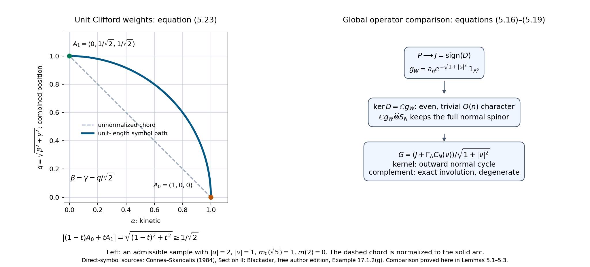
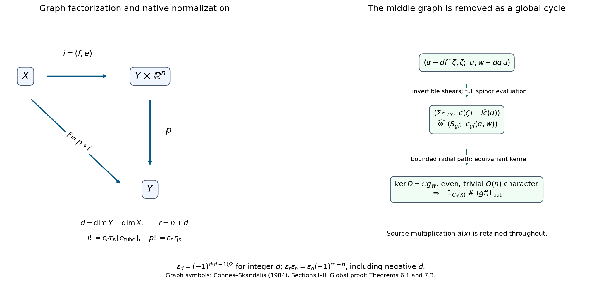

# Wrong-way maps for K-oriented maps

*Written by GPT-6.1 Sol (OpenAI). Public domain (CC0).*

A smooth map transports compactly supported K-theory in the direction of the map when it has a K-orientation. It need not be proper. The extra orientation supplies a Clifford symbol near its graph; the symbol, rather than pullback of functions, supplies the transfer. We construct that symbol, prove its composition rule, and identify the familiar Thom and Dirac descriptions as its special cases.

Manifolds in this lesson are second countable, Hausdorff, smooth, finite dimensional and without boundary. They need not be compact or orientable. Dimensions are fixed on each connected component; statements for a disjoint union apply componentwise, provided a single degree is specified. All Hilbert modules are graded, and odd classes retain the right Clifford coefficient of [*Graded C*-algebras, Clifford algebras and graded Hilbert modules*](KT-KK-05.html). We use the proved product existence and uniqueness in [*Connections and the existence of the Kasparov product*, Sections 3–4](KT-KK-09.html#3-existence-from-the-technical-theorem), its associativity in [*Homotopy, associativity, the index pairing and KK-equivalence*, Theorem 4.1](KT-KK-10.html#4-full-associativity), and the explicit Bott inverses and spinor conventions in [*Bott periodicity in KK*](KT-KK-12.html) and [*Thom isomorphisms and K-orientations in KK*, Sections 3–7](KT-KK-13.html#3-the-two-inverse-identities).

Basic references are the freely available author edition of Blackadar's *K-Theory for Operator Algebras*, Connes–Skandalis's *The longitudinal index theorem for foliations*, and the author edition of Connes's *Noncommutative Geometry*. Their manifold constructions motivate the graph symbols below. The proofs use no general index theorem.

## 1. Orientations, diagonal cancellation and integer signs

Use a metric to identify tangent and cotangent bundles. For \(f:X\to Y\), set
\[
 T_f=T^*X\oplus f^*TY,\qquad d_f=\dim Y-\dim X.
 \tag{1.1}
\]
A K-orientation is a spin\(^{c}\) structure on this real bundle, including its full Clifford spinor module \(S_f\). A spin\(^{c}\) module consists of local irreducible complex Clifford modules with unitary transition maps intertwining the Clifford action. The scalar part of those transition maps is part of the data. Keeping only their determinant would lose the spin\(^{c}\) structure. In odd rank we use the right \(C_1\) realization of the spinor module from the Thom lesson, Section 5. Changing the metric transports these data by the positive square root of the change of metric and gives a homotopy.

For a Euclidean real bundle \(V\), put
\[
 \Sigma_V=\Lambda^*V_{\mathbb C},\quad
 c(v)=\varepsilon(v)+\iota(v),\quad
 \widehat c(v)=\varepsilon(v)-\iota(v).
\]
The two self-adjoint Clifford actions on \(V\oplus V\) are \(c(v)\) and \(i\widehat c(w)\). They anticommute. We give \(\Sigma_V\) its exterior parity. This is the **outward diagonal orientation**. In the order \((v_1,w_1,\ldots,v_n,w_n)\), its chirality is exterior parity. This choice works for an unoriented \(V\): the natural action of every \(O(n)\) frame change on exterior forms is even and intertwines both actions. The identity map uses this diagonal orientation on \(T^*X\oplus TX\).

Define the orientation of a composite before defining its transfer. For \(X\xrightarrow{f}Y\xrightarrow{g}Z\), identify
\[
 T_f\oplus f^*T_g
 \longrightarrow f^*(T^*Y\oplus TY)\oplus T_{gf}
\]
by the ordered block map
\[
 (v_X,w_Y;v_Y,w_Z)\longmapsto
 \bigl((v_Y,-w_Y),(v_X,w_Z)\bigr).
 \tag{1.2}
\]
Here the two copies of \(TY\) are identified using the metric. The middle minus sign is part of this convention. Interchanging the two middle blocks has determinant \((-1)^{(\dim Y)^2}\); changing the sign of the second one has determinant \((-1)^{\dim Y}\). Their product is one.

The composite spinor module is the Clifford Morita quotient
\[
 S_{gf}=\operatorname{Hom}_{\operatorname{Cl}(f^*(T^*Y\oplus TY))}
 \bigl(f^*\Sigma_{TY},S_f\widehat\otimes f^*S_g\bigr),
 \tag{1.3}
\]
with the actions transported by (1.2). Evaluation gives an isomorphism
\[
 f^*\Sigma_{TY}\widehat\otimes S_{gf}
 \simeq S_f\widehat\otimes f^*S_g.
 \tag{1.4}
\]
Indeed, in an orthonormal frame the middle even Clifford algebra is the full matrix algebra on \(\Sigma_{TY}\), so its matrix units prove that evaluation is an isomorphism. The evaluation maps commute with the spinor transition maps. They therefore glue, including their scalar phases. The remaining Clifford action is precisely that of \(T_{gf}\). This proves existence of the composite orientation. For three maps the two evaluations remove two full matrix factors; associativity of evaluation identifies the two results. This proves associativity of the orientation convention, including its line bundles. Formula (1.3) is also the convention when one of the maps is an identity.

There are two presentations of the transfer. We write \(f!_{\rm out}\) for the graph construction with these outward spinors. We reserve \(f!\) for the native right-Clifford convention of the ordinary Kasparov product. For every integer, including a negative integer, put
\[
 \varepsilon_d=(-1)^{d(d-1)/2},\qquad
 f!=\varepsilon_{d_f}f!_{\rm out}.
 \tag{1.5}
\]
For classes of integer degrees \(a,b\) it is convenient to write
\[
 x\mathbin{\#}y=(-1)^{ab}x\widehat\otimes_R y.
 \tag{1.6}
\]
The subscript \(R\) indicates the native right-Clifford transfer. Degrees in (1.6) are used modulo two; the normalization (1.5) uses the actual integer.

**Lemma 1.1.** The normalizations satisfy
\[
 \varepsilon_{a+b}=\varepsilon_a\varepsilon_b(-1)^{ab},\qquad
 \varepsilon_{-a}=(-1)^a\varepsilon_a.
 \tag{1.7}
\]
Consequently outward composition with \(\#\) is equivalent to ordinary native composition. If \(x\) of degree \(a\) has an outward inverse \(y\) of degree \(-a\), the normalized classes \(\varepsilon_ax\), \(\varepsilon_{-a}y\) are native inverses.

**Proof.** Subtract the exponents in the first equality: the difference is \(ab\). For the second it is \(a\). Since \((-1)^{-a^2}=(-1)^a\),
\[
 (\varepsilon_ax)\otimes_R(\varepsilon_{-a}y)
 =\varepsilon_a\varepsilon_{-a}(-1)^a(x\#y)=1.
\]
The other order is identical. These are integer identities, so a negative projection degree needs no special exception. \(\square\)

The sign in (1.6) has a concrete Clifford explanation. When both factors are odd, the exterior spinor sum uses \(Q_1\sigma_1+Q_2\sigma_2\), with grading \(\sigma_3\). The native right-Clifford product uses \(Q_1\sigma_1-Q_2\sigma_2\). Conjugation by \(\sigma_1\) changes the second expression into the first and reverses \(\sigma_3\); reversing a grading negates the even class. If one factor is even the expressions agree. This is exactly the complete matrix calculation of the Thom lesson, Proposition 7.2. In particular an outward Thom class \(\tau_N\) of rank \(r\) is presented natively by \(\varepsilon_r\tau_N\). We retain both symbols; their distinction will be visible already for a point in a plane.

## 2. Local geometry with control at infinity

We need neighborhoods that are small over the source, rather than a uniform radius on an entire manifold.

**Lemma 2.1.** A second-countable \(q\)-manifold has a smooth proper embedding into \(\mathbb R^{2q+2}\). It has a proper Riemannian distance, locally finite smooth partitions subordinate to relatively compact coordinate charts, and tubular neighborhoods of arbitrary embedded submanifolds after passage to an open neighborhood in which the submanifold is closed. All these neighborhoods may be shrunk by a positive smooth function on the submanifold. The statements also hold for compact intervals of parameters, with control uniform on compact subsets of the source.

**Proof.** Choose a compact exhaustion \(K_j\subset\operatorname{int}K_{j+1}\). On each compact annulus take a finite collection of smaller coordinate balls inside larger balls and bump functions supported in the latter, positive on the former. This is a locally finite collection: an annulus uses balls contained in \(\operatorname{int}K_{j+2}\setminus K_{j-2}\). Dividing each bump by their positive locally finite sum gives a smooth partition. The same construction, with values increasing on successive annuli, gives a smooth function \(h\geq0\) that is proper. For example first choose a continuous function at least \(j\) outside \(K_j\), then replace it locally by constants using the partition, choosing each constant above the supremum on the corresponding smaller annulus. Its lower bound still tends to infinity.

Here is a finite-dimensional embedding argument. Put \(m=2q+1\). A smooth \(g:X\to\mathbb R^m\) can be chosen both immersive and injective. To prove this without a genericity assertion, consider two kinds of compact tests: unit tangent vectors over \(K_j\), and pairs of points in \(K_j\) separated by at least \(1/j\) in any fixed compatible metric. They exhaust, respectively, the nonzero tangent directions and the off-diagonal in \(X\times X\). For a compact set of either kind, finitely many compactly supported coordinate functions supply a finite parameter perturbation of \(g\) such that
\[
 (t,x,v)\mapsto d(g_t)_xv
 \quad\hbox{or}\quad
 (t,x,x')\mapsto g_t(x)-g_t(x')
\]
has surjective parameter differential. For a direction choose a coordinate whose derivative on that direction is nonzero, multiply it by a bump equal to one nearby, and give its \(m\) output coordinates independent parameters. For a separated pair choose a bump equal to one near the first point and zero near the second. A finite covering of the compact test gives the asserted finite parameter family.

The zero locus of either map is a smooth submanifold of codimension \(m\), by the inverse function theorem. Its dimension is strictly less than the dimension of parameter space: the two test domains have dimensions \(2q-1\) and \(2q\). Its projection to parameter space has measure zero. The last assertion needs only a covering calculation: a Lipschitz image of a bounded subset of \(\mathbb R^k\) in \(\mathbb R^p\), \(k<p\), is covered by \(O(\rho^{-k})\) cubes of volume \(O(\rho^p)\), so its outer measure tends to zero. Apply this to a countable collection of compact coordinate pieces of the zero locus. Thus arbitrarily small parameters avoid each compact test. Starting with any \(g_0\), avoid successively the first \(j\) tests, making the \(j\)-th perturbation small in the first \(j\) derivative norms on \(K_j\) and small enough to preserve all earlier positive lower bounds. Choose the subsequent tail bounds below half each previously obtained lower bound. The sum converges smoothly on every compact set and preserves every test. This produces the required \(g\).

The inverse function theorem used here follows locally from the contraction map \(u\mapsto u-A^{-1}(F(u)-y)\), where \(A=dF\) at the center and the ball is small enough that its derivative has norm below \(1/2\). The contraction gives the inverse, and differentiation of \(F(F^{-1}(y))=y\) gives its smoothness. Applying this in transverse coordinates also proves the zero-locus assertion.

Now \(e=(h,g)\) is a proper injective immersion. A proper continuous injection into a Hausdorff space is a homeomorphism onto its closed image: the image of a closed set is closed, since every compact neighborhood meets its preimage in a compact set. The local inverse function theorem expresses an immersion as a graph. Hence \(e\) is an embedding. The induced Euclidean metric on any such embedded manifold has proper distance: distance controls Euclidean displacement, so a closed metric ball is contained in the inverse image of a compact Euclidean ball. Its closedness and the local topology make it compact.

For an embedding \(i:X\to Y\), its image is relatively open in its closure, by the local graph description. Remove the closed frontier \(\overline{i(X)}\setminus i(X)\) from \(Y\); then \(i(X)\) is closed in the remaining open manifold. On the normal bundle the derivative of the normal exponential at the zero section is an isomorphism. On each relatively compact chart the inverse function theorem gives an injective normal disk over a smaller chart. There are also separation conditions: the compact closure of that smaller chart has positive distance from the closed portion of \(i(X)\) outside the larger chart, in a proper metric on the open ambient manifold. Shrink the disk below half this distance. A locally finite exhaustion permits all these inequalities to be imposed by a positive smooth radius \(\rho(x)\); only finitely many inequalities occur near each point. Two normal images that agree must then lie in one of the injective larger charts. This proves global injectivity. Its differential is invertible on the shrunken disks, so their image is open. The diffeomorphism
\[
 (x,v)\longmapsto \exp_{i(x)}\frac{\rho(x)v}{\sqrt{1+|v|^2}}
 \tag{2.1}
\]
identifies the whole normal bundle with that open tube.

For graph neighborhoods use a proper distance on \(Y\) and require \(\rho\leq1\). Over a compact source set the centers form a compact target set, so the closed disks lie in a compact target set. Choose smaller disks whenever injectivity, trivialization or derivative estimates require them. The construction over \(X\times[0,1]\), using finite coverings of each compact source set times the interval, gives the parameter version. No global lower bound on \(\rho\), or bound on curvature or derivatives at infinity, has been asserted. \(\square\)

Two tubes with the same normal derivative have the same germ up to an isotopy after shrinking. In local coordinates their difference has derivative along the normal quotient equal to the identity. Their horizontal derivative may be a shear \((u,v)\mapsto(u+Av,v)\); the interpolation in \(A\) stays invertible. Interpolating the remaining higher-order terms stays invertible on sufficiently small disks, by the same compact-chart derivative estimate as in Lemma 2.1. Shrinking by a smooth positive radius imposes these estimates globally. This proves the needed germ isotopy, including the parameter case.

## 3. Graph symbols and bounded families

Write \(A_X=C_0(X)\). Let \(\Omega\) be a small open neighborhood of the graph of \(f\) in \(X\times Y\), with projection \(\Omega\to Y\). A point in it is written \((x,y)\), and
\[
 v(x,y)=\exp_{f(x)}^{-1}(y)\in T_{f(x)}Y.
\]
Pull \(S_f\) to \(\Omega\), use parallel transport in the second Clifford factor when necessary, and use source half-densities. Completion of compactly supported smooth sections for
\[
 \langle s,t\rangle(y)=\int_{\Omega_y}\langle s(x,y),t(x,y)\rangle\,dx
 \tag{3.1}
\]
gives a Hilbert \(A_Y\)-module \(E_f\). In odd degree tensor with the original right \(C_1\). Integration over finitely many coordinate charts proves continuity of (3.1); a compact section has compact target support. These sections are dense by cutoff and chart approximation. A countable collection of rational smooth chart approximations proves countable generation. Multiplication by \(a(x)\) gives an adjointable representation of \(A_X\). This construction does not require a pullback homomorphism \(A_Y\to A_X\).

Choose an angle \(\theta(x,y)\), zero near the graph and \(\pi/2\) near the boundary of a smaller graph tube, flat at both values. Its nonconstant part is proper over \(X\). Put \(m=\cos\theta\), \(n=\sin\theta\). On the nonzero source cotangent vectors define
\[
 p_f(x,y,\xi)=m(x,y)c_f(\xi,0)/|\xi|
               +n(x,y)c_f(0,v)/|v|.
 \tag{3.2}
\]
The second term is zero where \(n=0\); it is therefore smooth. The two Clifford terms anticommute. Consequently \(p_f^*=p_f\) and \(p_f^2=1\). Outside the frequency-dependent region it is an exact multiplication involution. Covectors, displacement vectors and their norms always refer to their indicated bundles.

If \(\dim X=0\), each source fibre has no differential variable. Use the finite-spinor position operator, zero near \(v=0\) and equal to \(c_f(0,v)/|v|\) near the outer tube boundary, with a smooth radial interpolation. Its defect is supported in a smaller graph tube and is a compact finite-matrix field after source localization. If also \(\dim Y=0\), use the zero operator on the even oriented line; the representation of a compactly supported source function is finite rank on each of the finitely many relevant graph fibres. The same arguments below apply to these multiplication cycles. No cotangent-sphere direction is introduced in dimension zero.

**Lemma 3.1 (controlled quantization).** A symbol of the form (3.2), or a smooth homotopy of such Clifford symbols, has a self-adjoint contraction \(F\) on \(E_f\) whose principal symbol is \(p_f\), such that
\[
 a(F^2-1),\ [F,a]\in\mathcal K(E_f)\quad(a\in A_X).
 \tag{3.3}
\]
Two properly supported choices with the same symbol define the same class. Proper changes of graph tube, source coordinates, spinor trivialization, cutoff and positive metric give the same class. In parameter statements the resulting cycle is on a Hilbert \(C_0(Y\times[0,1])\)-module. The operator family and the localized compact errors are norm continuous on every compact source set and vanish in norm at coefficient infinity.

**Proof.** We spell out the global bound. In a compact source chart the complete Fourier proof in [*Unbounded Kasparov modules and spectral triples*, Lemma 4.2a](KT-KK-11.html#4-spectral-triples-and-the-circle) gives
\[
 |\widehat K(\eta,\xi)|\leq C_L\langle\eta-\xi\rangle^{-L},\qquad L>\dim X,
 \tag{3.4}
\]
where \(C_L\) uses finitely many symbol derivatives. The two Schur integrals bound the operator norm. Differences satisfy the same bound. Taylor expansion of an amplitude at the diagonal, followed by integration in frequency, gives composition, adjoint and coordinate-change remainders of order minus one, with these same finite derivative bounds. The cited lemma proves that expansion and its remainder estimates in full. A compactly supported order-minus-one operator maps \(L^2\) into \(H^1\); finite Fourier truncation on a cube approximates its inclusion into \(L^2\) by finite-rank operators. This is [*Fredholm modules and analytic K-homology*, Lemma 4.1a](KT-KK-03.html#lemma-4-1a-finite-chart-sobolev-density-and-compactness). Thus the remainders are compact, with continuous parameter norms. These estimates apply to a proper kernel cutoff equal to one on a smaller diagonal neighborhood.

Choose real compactly supported source chart functions \(q_j\), locally finite, with \(\sum q_j^2=1\). On a slightly larger chart than \(\operatorname{supp}q_j\), quantize the frequency-dependent part and cut its kernel at both ends inside a closed graph tube proper over that chart. Add the global multiplication part. Symmetrize to obtain a bounded self-adjoint \(P_j\) on the whole module. Its bound may depend on \(j\); compact source support and Lemma 2.1 give uniform bounds over all target parameters for this one \(j\). Choose once and for all a smooth odd compactly supported function \(\gamma\), bounded by one, with \(\gamma(1)=1\), \(\gamma(-1)=-1\), constant on small neighborhoods of those two points, and put \(G_j=\gamma(P_j)\). Such a function is obtained from smooth flat bump functions on the positive half-line and then extended oddly.

Then \(\|G_j\|\leq1\). Polynomial approximation in continuous functional calculus shows that its principal symbol near \(\operatorname{supp}q_j\) is \(\gamma(p_f)=p_f\), and that it remains the exact multiplication involution off the closed support of the nonmultiplication part. For the latter assertion decompose the module by that measurable region: the kernel cutoff has both ends there, and the multiplication part preserves the region; every polynomial and hence \(\gamma(P_j)\) preserves the decomposition. This bounded functional calculus is also norm smooth in any compact-chart parameter in which \(P_j\) is norm smooth. Indeed Fourier inversion writes \(\gamma(P_j)=\int\widehat\gamma(t)e^{itP_j}\,dt\). Differentiating the exponential by its norm-convergent power series gives the Duhamel integral, bounded by \(|t|\|\partial P_j\|\). Repeated derivatives have polynomial bounds in \(|t|\), integrable against the rapidly decreasing \(\widehat\gamma\). This proves all finite parameter derivative estimates needed below.

Define
\[
 F=\sum_j q_jG_jq_j.
 \tag{3.5}
\]
The map \(s\mapsto(q_js)_j\) is an isometry into a countable module sum, so (3.5) is its compression of the diagonal contraction \(\operatorname{diag}(G_j)\). It is adjointable, self-adjoint and bounded by one. The sum and its adjoint converge on compact sections and hence strongly on the module. On compact source support only finitely many terms and their proper kernel neighbors occur. Their principal symbols sum to \(p_f\), so composition gives (3.3) there. The compact errors are continuous fields of localized compact operators supported in a compact target set. To see that such fields are module compact, first approximate on finitely many parameter charts by finite-rank Fourier truncations, then use a finite partition of unity; approximation of their finitely many continuous matrix entries gives finite sums of module rank-one operators. The resulting norm approximation is uniform on the compact parameter set. For general \(a\in A_X\), approximate \(a\) uniformly by compactly supported functions. The bound \(\|F\|\leq1\) bounds the remaining defects by \(2\|a-a_0\|\). It also proves decay at coefficient infinity, since the compact source part has compact target support.

The same construction on compact source sets times an interval proves the parameter assertion. Uniform finite symbol seminorms give norm continuity of each localized term by (3.4). Continuous functional calculus gives continuity of its clipping. Local finite summation and the uniform bound give an adjointable operator on the interval module, even when the operators are not globally norm continuous in a single fixed trivialization. This distinction is why the parameter cycle is formulated on its interval module.

Equal symbols have a localized order-minus-one difference before clipping. Polynomial approximation shows the clipped difference is locally compact too. Their straight interpolation is a cycle: modulo localized compacts the two self-adjoint symbols are the same involution, so its square is one. This proves independence of quantization. A positive metric change, coordinate change or intertwining spinor trivialization has the same conclusion from the amplitude calculation. For symbols with two nonnegative unit coefficients, use
\[
 h_s=\frac{(1-s)h_0+sh_1}{|(1-s)h_0+sh_1|},
 \qquad |(1-s)h_0+sh_1|\geq1/\sqrt2.
 \tag{3.6}
\]
Choose the endpoint cutoffs flat where a direction becomes undefined. This gives a smooth unit Clifford symbol and a norm-controlled quantized homotopy.

Finally, shrinking a tube removes a region where the operator is multiplication by an involution. On this region multiplication by the source commutes with it and all defects vanish. The interval module
\[
 \{s\in E\otimes C([0,1]):s(1)\in E_{\rm smaller}\}
 \tag{3.7}
\]
implements the removal; the smaller tube contains the closed support of every nonmultiplication kernel. The operator preserves that submodule. A compact error on (3.7) is obtained by the same finite-rank approximation with vectors supported in the retained region. At the other endpoint the removed summand is degenerate. This proves equality under restriction and extension. The germ isotopy following Lemma 2.1, and (3.6), handle arbitrary tubes and cutoffs. \(\square\)

Define \(f!_{\rm out}\) to be the class of \((E_f,a(x),F_f)\) in degree \(d_f\). Lemma 3.1 proves existence and independence of its auxiliary choices. It also proves homotopy invariance when the map and its full K-orientation extend over \(X\times[0,1]\). A smooth homotopy need not be proper: the image of each compact source set times the interval is compact, which is exactly the estimate used in the proof.

## 4. Recognizing a product from its symbol

For a first cycle \((E_1,A,F_1)\) with coefficient algebra \(D\), let \(E_1^{\rm def}\) be the closed submodule generated by the ranges of the localized square defects, adjoint defects and commutators, and by applying \(A,F_1,F_1^*\) to those ranges. Include the ranges of their adjoints. It is countably generated: take dense countable source sets and a sequential compact approximate identity \(u_j\) on \(E_1\), as proved in the graded-module lesson, Lemma 2.0. For each compact error \(T\), \(Tu_j\to T\) in norm. Finite-rank approximations to the \(u_j\) show that the closure of the range is generated by countably many vectors of the form \(T\xi\), which lie in that range. Apply this also to adjoint errors and finite words in the countable source set and \(F_1,F_1^*\). It is invariant under the first operator and the source. Every first localized error belongs to \(\mathcal K(E_1^{\rm def})\), considered on \(E_1\), because its range and adjoint range belong to that submodule. The complete included-compact-algebra proof is [*Unbounded Kasparov modules and spectral triples*, Lemma 0.2](KT-KK-11.html#0-regular-calculus-localization-and-compact-supports): regard such a compact operator as an adjointable map into the submodule, use the compact squared-modulus criterion, and sandwich by the submodule's compact approximate identity. No orthogonal complement of \(E_1^{\rm def}\) is required.

**Lemma 4.1 (localized connections).** Let \(G\) be a cycle operator on \(E_1\widehat\otimes_D E_2\). It represents the product if it is an \(F_2\)-connection for creation vectors in \(E_1^{\rm def}\), and
\[
 a\{F_1\widehat\otimes1,G\}a^*\geq0
 \quad\hbox{modulo compact operators for every }a\in A.
 \tag{4.1}
\]

**Proof.** Normalize the first and second cycle operators to self-adjoint contractions. Let \(H\) be a product operator whose existence is the product lesson, Theorem 3.1, and put \(S=F_1\widehat\otimes1\). Creation identities, proved there in Lemmas 1.1–1.2, apply without alteration to the submodule \(E_1^{\rm def}\). They show that
\[
 G-H,\quad\{S,G\},\quad\{S,H\},\quad\{G,H\}-2
 \tag{4.2}
\]
are zero-connections on that submodule. For the last expression, composing the two connection relations gives a connection of \(2F_2^2\); the error \(F_2^2-1\) is compact after any coefficient multiplication. Every creation vector is a norm limit of vectors multiplied by coefficient elements, so the same statement holds for all creation vectors in the submodule. A zero-connection annihilates \(I=\mathcal K(E_1^{\rm def})\otimes1\) on both sides modulo final compacts, by the rank-one calculation in Lemma 1.1. The first errors are in \(I\) after source localization, and \(S,A\) preserve \(I\). Connections preserve \(I\) modulo final compacts, again by the two creation identities.

Apply the graded technical partition of [*Kasparov's technical theorem*, Theorem 3.1 and Corollary 3.2](KT-KK-08.html#3-grading-and-square-roots) to \(I+\mathcal K(E)\) and the separable algebra generated, modulo \(\mathcal K(E)\), by (4.2) and their products with the controlled source and operators. Products of these two algebras are compact by the preceding calculation. It gives even \(M,N\geq0\), \(M+N=1\), with \(MI\) compact, \(N\) times every expression in (4.2) compact, and compact commutators with \(S,G,H,A\). Include a dense countable source set in the controls and extend by norm continuity. Set
\[
 L=M^{1/2}S+N^{1/2}H.
\]
Expansion of its square gives, after source localization, \(M(S^2-1)+N(H^2-1)\) and the mixed bracket \(M^{1/2}N^{1/2}\{S,H\}\), all compact. Its adjoint and source commutator errors are compact by the same expansion. Thus \(L\) is a cycle. Modulo localized compacts,
\[
 \{G,L\}=M^{1/2}\{G,S\}+2N^{1/2},\qquad
 \{H,L\}=M^{1/2}\{H,S\}+2N^{1/2}.
\]
The first bracket on each right side is locally positive; its commuting square-root multiplier preserves that positivity. The remaining term is positive. The complete positive-comparison homotopy in [*Kasparov modules and the groups KK(A, B)*, Proposition 3.3](KT-KK-06.html#proposition-3-3-the-positive-comparison-criterion) therefore identifies \(G\) with \(L\) and \(L\) with \(H\). This proves the lemma. Notice that we did not assert that \(L\) itself is a connection for all of \(E_1\). \(\square\)

We apply this test to graph symbols. For the first proper quantization choose its nonmultiplication kernel with both ends in a closed set \(K_1\) proper over its source and strictly inside its graph neighborhood. Off \(K_1\) it is the exact position involution. Thus \(E_1^{\rm def}\) is contained in the submodule of sections supported in \(K_1\); multiplication and the first operator preserve this support. We may enlarge \(K_1\) a little when choosing cutoffs.

**Lemma 4.2 (the symbol product).** Suppose first and second graph symbols are \(p_1(x_1,x_2,\xi_1)\) and \(p_2(x_2,y,\xi_2)\), acting on their graded tensor spinors. They anticommute. There are nonnegative homogeneous weights \(h_1,h_2\), \(h_1^2+h_2^2=1\), for which a proper quantization of
\[
 p_{12}=h_1p_1+h_2p_2
 \tag{4.3}
\]
on the joint graph neighborhood represents \([p_1]\#[p_2]\). The weights can be changed through any admissible positive normalized homotopy. The assertion also holds when the first operator differentiates only along a Euclidean vector-bundle fibre over the source of the second symbol.

**Proof.** On compact source support choose closed enlarged regions \(K_1,K_2\) containing the two nonmultiplication supports. Choose a joint cutoff \(\kappa\), equal to one near \(K_1\times K_2\) and supported in a set proper over \(x_1\). Use smooth functions \(A(s),B(s)\) that vanish flatly for \(s\leq\epsilon\) and are positive for \(s\geq2\epsilon\), where \(0<\epsilon<1/8\). With \(s_i=|\xi_i|^2/(|\xi_1|^2+|\xi_2|^2)\), normalize \((A(s_1),B(s_2))\) to get \(h^{\rm freq}\). Its denominator is bounded below because one \(s_i\) is at least \(1/2\). Outside \(\kappa=1\), the regions where only the first or only the second symbol is not pure position are separated by the enlarged joint core. Choose a smooth position-dependent pair \(h^{\rm pos}\) equal to \((0,1)\) on the first-only region and \((1,0)\) on the second-only region. Where both symbols are pure position any smooth positive unit pair can be used. Normalize
\[
 \kappa h^{\rm freq}+(1-\kappa)h^{\rm pos}.
 \tag{4.4}
\]
Its norm is at least \(1/\sqrt2\). It follows that \(h_1=0\) in an open cone about \(\xi_1=0\) on \(K_1\), and \(h_2=0\) about \(\xi_2=0\) on \(K_2\). Where a direction is undefined its coefficient vanishes flatly. The frequency-dependent part is proper over \(x_1\); outside its joint core (4.3) is a position involution. Lemma 3.1 quantizes it to a contraction cycle \(G\).

The half-density tensor and Fubini identify the interior tensor module with the completion of sections in variables \((x_1,x_2,y)\), with spinors \(S_1\widehat\otimes S_2\). On compact section cores, equality of the positive fibre integrals proves that this map is isometric. Products of compact chart sections are dense by coordinate approximation, so it is onto. This is an actual module unitary, including the spinor transitions.

We verify the connection relation. Let \(\eta,\eta'\) be smooth compact creation vectors supported in \(K_1\). Compression in the first variable has principal second-variable symbol
\[
 \int \eta(x_1,x_2)^*p_{12}(x_1,x_2,y,0,\xi_2)
                    \eta'(x_1,x_2)\,dx_1
 =\langle\eta,\eta'\rangle(x_2)p_2(x_2,y,\xi_2),
 \tag{4.5}
\]
with the graded creation signs understood. Here (4.4) is \((0,1)\) near \(\xi_1=0\) on the support in question. The remainder is of order minus one in \(\xi_2\). Here is an estimate that also controls the potentially singular axis. Fourier transforms of compact smooth creation vectors decay faster than any power of \(|\xi_1|\). On \(|\xi_1|\leq c|\xi_2|\), Taylor expansion at \(\xi_1=0\) bounds the first remainder by
\(C(1+|\xi_1|)^k\langle\xi_2\rangle^{-1}\); integration against those Fourier transforms is bounded by \(C'\langle\xi_2\rangle^{-1}\). On the complementary cone their rapid decay gives \(C_N\langle\xi_2\rangle^{-N}\), after the Schur integrations in the other frequency differences. Spatial derivatives have the same bounds, using the finite seminorm estimate (3.4). Thus compressed errors are localized order-minus-one operators and compact by Lemma 3.1. Apply (4.5) to \(G\), \(G^2\) and the two adjoint compressions. Expansion of the squared norm of the creation error \(GT_\eta-(-1)^{|\eta|}T_\eta F_2\) leaves only these compact compressed errors and localized defects of \(F_2\). Hence its product with its adjoint is compact. The compact squared-modulus criterion of the unbounded-module lesson, Lemma 0.2, makes the creation error itself compact. Adjointing proves the second creation relation. Norm density gives both conditions for every vector in \(E_1^{\rm def}\).

The connection calculation actually applies to every compact smooth vector supported in \(K_1\), and hence to that whole support submodule by density. Therefore \(G\) graded commutes, modulo final compacts, with \(\mathcal K(E_{K_1})\otimes1\), by the two creation identities and rank-one expansion. This also controls the smooth bounded functional calculus used in (3.5). On any compact source set its difference from a raw proper quantization with the same principal symbol is a compact first-module operator, with both ranges in \(K_1\): in the localized symbol quotient \(p_1^2=1\), so \(\gamma(p_1)-p_1=0\); polynomial approximation proves the assertion, and the two-end kernel support preserves \(K_1\). Its tensor graded commutator with \(G\) is thus compact. Proper kernel support supplies a larger compact input cutoff for a given compact source sandwich. We can consequently compute that sandwich's positivity with the raw first quantization. Similarly the joint bounded normalization changes \(G\) only source-locally compactly; multiplication on either side by bounded localized first operators preserves those final compacts. This accounts for both normalizations without assuming a classical functional-calculus symbol theorem.

For positivity, the resulting \(S=F_1\otimes1\) is not a joint classical operator on the axis \(\xi_1=0\); it must be treated separately. Where \(|\xi_1|\geq c|\xi_2|\), the composition calculation of Lemma 3.1 applies jointly and gives principal bracket
\[
 \{p_1,p_{12}\}=2h_1\geq0.
 \tag{4.6}
\]
Near \(\xi_1=0\) on \(K_1\), (4.3) is \(p_2\) in an open cone and is independent of \(x_1\). The first quantization, viewed as an operator-valued family in \(x_2\), is norm smooth after compact source localization by (3.4). In the commutator with the second quantization, expand
\(S(x_2')-S(x_2)\) once at the diagonal. The amplitude proof then bounds its Fourier kernel by
\[
 C_L\langle\eta_2-\xi_2\rangle^{-L}\langle\xi_2\rangle^{-1}
 \tag{4.7}
\]
in operator norm on the first-variable space. The Clifford anticommutator has the same estimate, since the zero-order independent graded factors anticommute. Insert the conic cutoff \(|\xi_1|\leq C|\xi_2|\). Above joint frequency \(T\), (4.7) has norm at most \(C'/T\), by Schur's test. Below \(T\) both frequencies are bounded; on compact spatial supports finite Fourier truncation in both variables is finite rank and converges in norm. Thus this axis remainder is compact. Overlap and cone-separation errors have arbitrarily decreasing frequency order, by integration by parts in separated frequency supports, with the same Schur bound. Outside \(K_1\) the first operator is the exact position involution, so its bracket is again (4.6), modulo the ordinary proper composition remainders. All compactness statements are uniform on compact source sets and vanish at coefficient infinity as in Lemma 3.1.

For completeness, a self-adjoint localized order-zero operator with positive principal symbol is positive modulo compacts. For \(\lambda<0\) its principal symbol minus \(\lambda\) has a smooth uniformly bounded inverse on each compact set, with bounded finite derivatives. Properly quantize that inverse. Composition gives a two-sided inverse modulo order-minus-one compacts. Thus no negative \(\lambda\) belongs to the spectrum in the compact quotient; continuous functional calculus makes the quotient positive. Apply this to source sandwiches of the bracket, whose symbols are \(2|a|^2h_1\); off their compact support the symbol is zero, and subtracting \(\lambda\) is still invertible. This proves (4.1).

Lemma 4.1 now proves the product assertion for even Clifford presentations. Passing to right-odd presentations gives precisely the sign in (1.6), by the two Pauli-matrix expressions following Lemma 1.1. The vertical vector-bundle version uses the same Fourier estimates in its fibre coordinates. Orthogonal parallel transports intertwine their Clifford actions and half-density unitaries, so the estimates and creation identities agree on chart overlaps. Compact base localization supplies all bounds. Finally (3.6) and Lemma 3.1 prove the admissible homotopy assertion. \(\square\)

## 5. The zero section and its even vacuum

For a zero section \(i:X\to N\) of a Euclidean spin\(^{c}\) bundle, the orientation is \(\Sigma_{TX}\widehat\otimes S_N\). We prove
\[
 i!_{\rm out}=\tau_N.
\]
The proof compares two bounded symbols through explicit paths. It also identifies the tangent-fibre oscillator, retaining its global even vacuum. A fibre index alone would not establish this equality of modules with source representations.

Use phase \(e^{i(u-u')\cdot\xi}\), and on exterior forms put
\[
 c_j=\varepsilon_j+\iota_j,\quad \widehat c_j=\varepsilon_j-\iota_j,
 \quad b_j=-i\widehat c_j,\quad L=-i\sum_jc_j\partial_j.
 \tag{5.1}
\]
Choose nonnegative smooth radial \(m,n\), the cosine and sine of a flat cutoff angle, with \(m^2+n^2=1\), \(m=1\) near zero and \(m=0,n=1\) outside a fixed ball. Choose the angle flat enough that \(\sqrt m\) is smooth. The free Fourier operator \(T_0=L(1+L^2)^{-1/2}\) has principal symbol \(c(\xi)/|\xi|\). Cut its kernel by a real radial proper-support cutoff, one near the diagonal, to get a self-adjoint \(O(n)\)-equivariant \(T\). The removed kernel is smooth and rapidly decreasing away from the diagonal: repeated frequency integration by parts makes every prescribed derivative absolutely integrable. Localizing either end to a compact ball therefore makes \(T-T_0\) compact. Its Schur bounds follow from Lemma 3.1. Put
\[
 P=\tfrac12(mT+Tm)+n\,b(u)/|u|,
 \qquad p=m c(\xi)/|\xi|+n b(u)/|u|.
 \tag{5.3}
\]
The second term vanishes near zero and is smooth. This self-adjoint proper operator has unit principal symbol and is the exact position involution off a compact ball. Lemma 3.1 proves
\[
 P^2-1\in\mathcal K.
 \tag{5.5}
\]
Equal proper quantizations differ compactly and are connected by straight cycle interpolation. These constructions and estimates intertwine every orthogonal frame change.

### 5.1. A bounded radial potential

Put
\[
W(u)=\sqrt{1+|u|^2},\quad v(u)=u/\sqrt{1+|u|^2},\quad D=L+b(v).
\tag{5.6}
\]

**Lemma 5.1.** The operator \(D\) is self-adjoint on \(H^1(\mathbb R^n,\Lambda)\). Its kernel is one even \(O(n)\)-invariant line. There is \(\delta>0\) such that \(|D|\geq\delta\) on its orthogonal complement. Compactly supported multiplication times either inverse resolvent is compact.

**Proof.** Fourier multiplication by \(c(\xi)\) gives self-adjointness of \(L\), exactly the \(H^1\) domain and its two inverse resolvents. This is the proof of [the Euclidean Dirac domain, Bott lesson Lemma 3.1](KT-KK-12.html#3-differentiation-on-euclidean-space), after an even phase change of exterior Clifford matrices. The bounded symmetric potential preserves that domain. For \(t>\|b(v)\|\), factor \(D\pm it\) by \(L\pm it\); the remaining factor has a Neumann inverse. Both ranges are surjective. Symmetry and their two deficiency kernels prove self-adjointness. Its graph norm is equivalent to \(H^1\), and smooth compactly supported vectors are a core by the cited cutoff and Fourier approximation.

For \(U=(-i)^{\mathcal N}\), an even unitary,
\[
D=UQ_WU^*,\qquad Q_W=\widehat c\,\partial+c(v).
\tag{5.7}
\]
Integration by parts and the exterior relations, first on the core and then on \(H^1\), give
\[
\|Q_W\xi\|^2=\sum_j\|(\partial_j+v_j)\xi\|^2+
2\int\left\langle\sum_{j,k}W_{jk}\varepsilon_j\iota_k\xi,\xi\right\rangle\,du.
\tag{5.8}
\]
The Hessian of \(W\) is strictly positive: its radial and tangential eigenvalues are respectively \((1+|u|^2)^{-3/2}\) and \((1+|u|^2)^{-1/2}\). Its second-quantized action on degree \(k>0\) is at least \(k\) times its smallest eigenvalue. Thus a kernel vector has no positive-degree part. In degree zero \((\partial_j+v_j)\xi=0\), so \(e^W\xi\) has all distributional derivatives zero on every bounded ball. Convolution makes it locally a constant smooth function, and letting the convolution radius decrease proves the same assertion for the original function. Constants agree on overlaps. Therefore the kernel is
\[
g_W=a_n e^{-\sqrt{1+|u|^2}}1_{\Lambda^0},\qquad a_n>0,\quad\|g_W\|_2=1.
\tag{5.9}
\]
Its integral is finite by exponential decay, and \(U\) fixes it.

Expanding (5.8) gives
\[
Q_W^2=-\Delta+|v|^2-\Delta W+2\sum_{j,k}W_{jk}\varepsilon_j\iota_k.
\tag{5.10}
\]
The zeroth-order coefficient tends to the identity at infinity. A vector supported outside a large ball consequently has squared \(D\)-norm at least half its squared norm. For smooth radial \(\chi_R,\eta_R\), with \(\chi_R^2+\eta_R^2=1\), inner and outer supports of radii \(R,2R\), and gradients bounded by \(C/R\), the product rule gives the exact localization identity
\[
\|D\xi\|^2=\|D\chi_R\xi\|^2+\|D\eta_R\xi\|^2
-\|\,|d\chi_R|\xi\|^2-\|\,|d\eta_R|\xi\|^2.
\tag{5.11}
\]
The functions are the cosine and sine of a fixed rescaled cutoff angle. Thus unit vectors with \(D\xi_j\to0\) satisfy \(\|\eta_R\xi_j\|^2\leq2\|D\xi_j\|^2+C'/R^2\). They are bounded in \(H^1\). Finite Fourier compactness on each ball and a diagonal subsequence give convergence there; the displayed tail estimate makes the subsequence Cauchy in the full \(L^2\) norm. If it was perpendicular to (5.9), its unit norm limit would be a kernel vector perpendicular to that line, a contradiction. This proves the gap.

Inverse resolvents map boundedly into \(H^1\). Local finite Fourier compactness therefore makes their compactly supported localizations compact. The same holds for \(R_\rho=(D^2+\rho^2)^{-1}\) and \(DR_\rho\); the latter is half the sum of the inverse resolvents at \(\pm i\rho\). Approximation extends it to \(C_0\) multipliers. Simultaneous orthogonal transformation of \(u\) and exterior forms preserves every formula and fixes \(g_W\), including orientation-reversing transformations. \(\square\)

**Lemma 5.2.** Let \(J=\operatorname{sign}D\), with value zero on (5.9). Then
\[
J^2=1-P_{g_W},\qquad\{J,P\}\geq0\pmod{\mathcal K}.
\tag{5.12}
\]
There is an \(O(n)\)-equivariant norm-continuous cycle path from \(P\) to \(J\).

**Proof.** Replacing the kinetic part of \(P\) by \(A T_0 A\), \(A=\sqrt m\), is a compact order-minus-one change with compactly localized ends. Its anticommutator with \(D\) is bounded and locally of order zero, by the full composition remainder of Lemma 4.2a; the smoothing tails have the same localized ends. Direct expansion gives, as forms on \(H^1\),
\[
\{D,P\}=K+E,\qquad
K=2A L^2(1+L^2)^{-1/2}A+2n|v|\geq0,
\tag{5.13}
\]
with \(E\) bounded. Its errors are \([L,A]T_0A-AT_0[L,A]\), the locally order-minus-one term \(A\{b(v),T_0\}A\), the multiplier \(-i\sum c_j\partial_j(n b(u)/|u|)\), and the bounded localized terms from the quantization change. The order-zero principal terms in the potential-kinetic bracket cancel by Clifford anticommutation. The displayed multiplier is smooth and tends to zero at infinity. These facts account for every term.

For each \(\rho>0\), \(ER_\rho,EDR_\rho,R_\rho E,DR_\rho E\) are compact. For the multiplier tending to zero use Lemma 5.1. For the localized terms insert coordinate cutoffs and use local resolvent compactness; commuting an order-zero operator past a cutoff adds a localized order-minus-one compact remainder. This treats either end and the smoothing tails.

The exact resolvent identity is
\[
\{DR_\rho,P\}=\rho^2R_\rho(K+E)R_\rho+
DR_\rho(K+E)DR_\rho.
\tag{5.14}
\]
It follows by expanding \([D^2,P]=D\{D,P\}-\{D,P\}D\) and \(D^2R_\rho=1-\rho^2R_\rho\). Domains cause no hidden term: \(D^2=-\Delta\) plus a bounded smooth multiplier has domain \(H^2\), by the Fourier weak-domain description, and approximation extends the form identity to all vectors. The \(K\) terms are positive. The \(E\) terms are compact and have combined norm at most \(5\|E\|/(4\rho^2)\).

For \(\lambda>0\), continuous calculus gives the vector integral
\[
F_\lambda=D(\lambda^{-2}+D^2)^{-1/2}
=\frac2\pi\int_0^\infty DR_{\sqrt{\lambda^{-2}+t^2}}\,dt .
\tag{5.15}
\]
The partial scalar integrals are uniformly bounded and converge first on the dense \(C_0(D)\)-range, as proved in [the unbounded lesson, Lemma 0.0 and Theorem 2.2](KT-KK-11.html#0-regular-calculus-localization-and-compact-supports). The uncommuted integral need not converge in operator norm. In (5.14) the compact error integrals do converge in norm, since \((\lambda^{-2}+t^2)^{-1}\) is integrable. The positive partial integrals, after subtraction of this error, have a vector limit equal to \(\{F_\lambda,P\}\) minus a compact operator. Their limit is positive. Hence \(\{F_\lambda,P\}\geq0\) modulo compacts. The gap gives \(F_\lambda\to J\) in norm as \(\lambda\to\infty\), including value zero on the kernel. Positivity of the quotient is norm closed, proving (5.12).

For an explicit path let \(L_s=(1-s)P+sJ\). In the quotient,
\(L_s^2\geq(1-s)^2+s^2\geq1/2\).
Fix \(0<\epsilon<1/2\) and put
\[
C_s=L_s\bigl(\max(L_s^2,\epsilon)\bigr)^{-1/2}.
\tag{5.16}
\]
It is an odd self-adjoint norm-continuous path, with square one modulo compacts. Its endpoints differ compactly from \(P,J\); prepend and append their straight compact-perturbation paths. Functional calculus and the entire construction commute with \(O(n)\). \(\square\)

For \(n=0\), use \(P=J=0\) on the even one-dimensional space; its defect is finite rank and its kernel statement is immediate.

### 5.2. Full normal spinors and coefficient infinity

Let \(V\to X\) be any Euclidean rank-\(n\) bundle. Simultaneous orthogonal frame changes glue the preceding operators on \(L^2(V_x,\Lambda V_{x,\mathbb C})\). Tensor with the full normal spinor and, in odd rank, the original right Clifford factor. Sections vanishing at infinity over \(N\) form a countably generated coefficient module: a countable relatively compact chart cover, cutoffs and a countable dense family of model fibre vectors generate by finite-chart approximation.

For any smooth positive \(\rho(x)\leq1\), put \(\nu=w/\rho(x)\) and
\[
G(w)=\frac{P\widehat\otimes1+1\widehat\otimes C_N(\nu)}
{\sqrt{1+|\nu|^2}} .
\tag{5.17}
\]
The second numerator in ordinary tensor notation is \(\Gamma_\Lambda\otimes C_N(\nu)\). Anticommutation gives
\[
G^2-1=(P^2-1)/(1+|\nu|^2).
\tag{5.18}
\]
The source is \(a(x)\), commuting exactly. The source-localized defect is a norm-continuous compact-operator field, decays in the normal direction by (5.18), and decays in the base direction by \(a\in C_0(X)\). Such a field is a compact module operator: on a compact chart approximate it uniformly by fixed finite-rank fields, use a finite partition to obtain rank-one section operators, and then remove the base and normal tails by these norm estimates.

Replacing \(P\) by the whole path in Lemma 5.2 gives a global cycle homotopy with those same estimates, uniform on the interval. At its end, the kernel line gives \(C_N(\nu)/\sqrt{1+|\nu|^2}\); its complement gives an exact involution and is degenerate. The kernel line is trivial and even by (5.9), with trivial transitions even on orientation-reversing charts. Thus
\[
[\mathcal E,a(x),G]=\tau_N.
\tag{5.19}
\]
For the final finite-spinor cycle, replace \(\rho\) by \((1-t)\rho+t\). Its fields are jointly norm continuous on compact base sets, bounded by one and have source-localized defects uniformly decaying at normal infinity, since the scale is at most one. Multiplication on sections is strongly continuous by compact-coefficient approximation. This is an interval-module homotopy even when \(\inf\rho=0\), and ends at the usual outward normal cycle.

Let \(s_0=\sqrt{|u|^2+|\nu|^2}\). For cutoffs \(m_0(s_0)^2+n_0(s_0)^2=1\), chosen as above, the radial direct principal symbol is
\[
p_0=m_0c(\xi)/|\xi|+
n_0\bigl(b(u)+\Gamma_\Lambda C_N(\nu)\bigr)/s_0 .
\tag{5.20}
\]
Its singularity at \(s_0=0\) is absent because \(n_0=0\) there. The principal symbol of (5.17) is instead
\[
p_1=\bigl(mc(\xi)/|\xi|+n b(u)/|u|+
\Gamma_\Lambda C_N(\nu)\bigr)/\sqrt{1+|\nu|^2}.
\tag{5.21}
\]
They are not identical at large frequency and finite position.

**Lemma 5.3 (uniform scalar symbol homotopy).** Proper quantizations of (5.20) and (5.21) are joined by a source-preserving cycle homotopy over the full coefficient space.

**Proof.** In the three mutually anticommuting unit directions \(c(\xi)/|\xi|,b(u)/|u|,\Gamma_\Lambda C_N(\nu)/|\nu|\), their coefficient triples are
\[
A_0=(m_0,n_0|u|/s_0,n_0|\nu|/s_0),\quad
A_1=(m,n,|\nu|)/\sqrt{1+|\nu|^2}.
\tag{5.22}
\]
They have length one and nonnegative entries. Use
\[
A_t=\frac{(1-t)A_0+tA_1}{|(1-t)A_0+tA_1|}.
\tag{5.23}
\]
The denominator is at least \(1/\sqrt2\). The vector coefficient expressions in (5.20)–(5.21) cancel divisions by zero. Near \(u=0\), the \(n(u)\) term vanishes identically and the other tangential-position term is a smooth scalar times \(b(u)\); the normal term is a smooth scalar times \(C_N(\nu)\). At \((u,\nu)=0\), both position terms vanish on a neighbourhood. The denominator is smooth there and at either zero direction, as one sees also from the dot product \(A_0\cdot A_1\).

Every frequency coefficient has support in a fixed \(u\)-ball, with uniformly bounded finite symbol seminorms; their differences are bounded by \(C|t-t'|\). For large \(|\nu|\), the first frequency coefficient vanishes and the second is \(O(|\nu|^{-1})\), with all required \(u\)-derivatives. The lower denominator bound preserves this rate.

Quantize the kinetic part symmetrically with the fixed proper-support cutoff of Lemma 3.1 and keep the position part as multiplication. That lemma proves norm continuity and boundedness. The square defect has order minus one in a fixed compact \(u\)-region and is zero off a larger region, hence is compact and norm continuous in the parameters. At normal infinity its norm is \(O(|\nu|^{-1})\): the kinetic operator has that bound, while the position multiplier has square \(1-\alpha_t^2\), with \(\alpha_t\) the frequency coefficient. Expansion bounds the other terms by \(2\|\text{kinetic}\|\|\text{position}\|+\|\text{kinetic}\|^2+\|\alpha_t^2\|\). No uniform approach of the entire position multiplier to the normal direction as \(u\to\infty\) is required.

Multiplication by \(a(x)\), followed by the finite-chart rank-one argument after (5.18), gives compactness over all of \(N\), uniformly on the interval. At the final endpoint this quantization is exactly (5.17); other admissible choices differ source-locally compactly by Lemma 3.1. The formulas intertwine every orthogonal and normal spinor transition. \(\square\)

If \(n=0\), there is no cotangent-sphere direction. The module is the finite normal spinor module; the two position operators are joined by straight interpolation. Their defects are finite bundle endomorphisms vanishing at normal infinity, so the same conclusion follows directly. No nonexistent frequency direction is used.

*Figure 1.* An exact admissible sample of (5.23), with \(|u|=2\), \(|\nu|=1\), \(m_0(\sqrt5)=1\) and \(m(2)=0\). The two equal position weights are shown by \(q=\sqrt{\beta^2+\gamma^2}\); the dashed chord is normalized to the unit arc, with denominator at least \(1/\sqrt2\). The right-hand reduction is the operator homotopy and full normal-spinor kernel calculation (5.16)–(5.19). This sample illustrates the proof and does not replace its uniform estimates. The direct-symbol constructions are Connes–Skandalis, Section II, and Blackadar's free author edition, Example 17.1.2(g), linked below.

### 5.3. The formal diagonal action and its determinant line

For the outward zero-section orientation use, in an interleaved frame of \(T^*X\oplus TX\),
\[
\Sigma=\Lambda^*T^*X_{\mathbb C},\qquad
\Gamma_\Sigma=(-1)^{\mathcal N},\qquad
\mu_{\rm out}(\xi,\eta)=c(\xi)+i\widehat c(\eta).
\tag{5.24}
\]
Its positive interleaved chirality is
\((-i)^n\prod_j c_j(i\widehat c_j)=\Gamma_\Sigma\).
Append the given normal spinor by the graded tensor sum. Exterior transitions implement every orthogonal tangent transition; normal spinor transitions retain their original spin\(^{c}\) scalar. The implementer construction in [the Thom lesson, Proposition 6.1](KT-KK-13.html#6-complex-bundles-and-relative-symbols), applied to \(TX\otimes\mathbb C\) with real vector \(\xi+i\eta\), proves this is a spin\(^{c}\) lift: the Clifford matrices generate the full fibre endomorphisms, their even implementers differ by a scalar, and exterior transition maps give the actual implementers for the \(U(n)\) subgroup. This definition requires no orientation of \(TX\).

In source coordinates \(z=x+u\), with coefficient base \(x\), the displacement from source to coefficient is \(\eta=-u\). Thus (5.24) gives \(c(\xi)+b(u)\), the signs used in (5.20).

The literal displayed action in Connes–Skandalis, Section II, following Definition 2.1, is different:
\[
\mu_{\rm CS}(\xi,\eta)=i\widehat c(\xi)+c(\eta).
\tag{5.25}
\]
With our positive quantization phase and exterior-degree grading, its radial pullback has operator \(\widehat c\,\partial-c(v)\), with a top-degree kernel. Here is the exact bundle comparison.

Let \(\ell=\det(TX_{\mathbb C})\), with its Euclidean metric, and in a tangent orthonormal frame put
\[
\mathcal C=c_1\cdots c_n.
\tag{5.26}
\]
It is unitary of parity \(n\) and transforms by \(\det T\) under \(T\in O(n)\). It therefore defines a global unitary from \(\Sigma\) to \(\Sigma\otimes\ell\) of parity \(n\); as a map to \(\Pi^n(\Sigma\otimes\ell)\), it is even. It is not an untwisted even scalar-valued unitary. The Clifford relations give
\[
\mathcal C\widehat c_j\mathcal C^*=(-1)^n\widehat c_j,\qquad
\mathcal Cc_j\mathcal C^*=(-1)^{n-1}c_j,
\tag{5.27}
\]
and hence
\[
\mathcal C(\widehat c\,\partial-c(v))\mathcal C^*
=(-1)^n(\widehat c\,\partial+c(v)).
\tag{5.28}
\]
After the even phase \(U=(-i)^{\mathcal N}\), this is \((-1)^nD\). Conjugating the full normal sum gives
\((-1)^n(D+\Gamma_\Sigma C_N)\), because \(\mathcal C\Gamma_\Sigma\mathcal C^*=(-1)^n\Gamma_\Sigma\). The target grading changes by the same parity; the normal spinor and its right odd coefficient are untouched.

Thus the literal action (5.25), read with form-parity grading and this positive phase, gives
\[
(-1)^n[\ell]\widehat\otimes_{C_0(X)}\tau_N .
\tag{5.29}
\]
Here the line factor denotes the explicit normal position cycle with spinor \(\pi^*\ell\widehat\otimes S_N\). For odd \(n\), the factor \(-1\) is the opposite cycle: its grading and its operator both change sign. Its sum with the original cycle is zero by the fixed-representation rotation with diagonal blocks \(F\cos s,-F\cos s\) and off-diagonal blocks \(\sin s\): its source-localized square defect is \(\cos^2s(F^2-1)\), and at \(s=\pi/2\) the flip is degenerate. If (5.25) is instead graded by its positive interleaved chirality, \((-1)^n\Gamma_\Sigma\), the parity reversal has already occurred and the remaining factor is \([\ell]\). The determinant correction is still present. Its inverse twist is the same line, since the Euclidean determinant metric canonically trivializes \(\ell^{\otimes2}\).

These are conditional statements with the phase and grading specified. They do not impute an unmentioned grading choice to the source. They show exactly why an equivariant-index assertion cannot identify a literal diagonal action with the untwisted even Gaussian. Blackadar's general direct construction allows a specified formal spin\(^{c}\) structure; (5.24) is the outward structure compared next.

### 5.4. The actual curved graph and its representation

Let \(i:X\to N\) be the zero section. Its direct family is a proper quantization of
\[
\alpha(z,x,w)c(\xi)/|\xi|+
\beta(z,x,w)\mu_{\rm out}\bigl(0,\operatorname{disp}(i(z),(x,w))\bigr)/
|\operatorname{disp}(i(z),(x,w))|,
\tag{5.30}
\]
with \(\alpha,\beta\geq0\), \(\alpha^2+\beta^2=1\), \(\alpha=1\) near the graph and \(\alpha=0\) near the outer boundary. The formal spinor is \(\Sigma\widehat\otimes S_N\); the displacement's vertical Clifford action uses the full normal spinor. Its frequency-dependent support is proper over the source. This is the noncompact support requirement in Connes–Skandalis Remark 1.5(a), not a compactness assumption on \(X\).

We need the following elementary support homotopy.

**Lemma 5.4 (removing a multiplication region).** Suppose the nonmultiplication kernels of a proper family lie in \(K_y\times K_y\), where \(K\) is closed inside an open subneighbourhood \(\Omega\) of its domain, and the operator is an exact odd multiplication involution off \(K\). The family and its restriction to \(\Omega\) have the same KK-class, assuming source-localized compactness and properness as in Lemma 3.1.

**Proof.** In the relative interval take the open set
\[
\mathcal O=([0,1]\times\Omega)\cup
((0,1]\times\text{original domain}).
\tag{5.31}
\]
Complete compactly supported half-density sections on this set for the \(C([0,1])\otimes C_0(N)\)-valued inner product. In a finite chart cover of a section's support, its fibre integral is continuous in \((t,y)\): extend the chart integrand by zero and use its fixed compact support and uniform integral bound. Polarization treats two sections. Thus this completion is a Hilbert module. Countable charts, cutoffs and fibre approximations give countable generation. The same kernel and multiplication formula is bounded and adjointable there: its nonmultiplication kernel is inside \(\Omega\times\Omega\), and the bounds are those of Lemma 3.1. The source commutators and square defects are supported inside \(K\), so do not approach the removed part at \(t=0\). Local finite-rank approximants times interval and coordinate cutoffs give compact module operators. Exhausting the source treats its other tails, since properness makes coefficient supports compact on each source-compact set. Evaluation of compact sections is dense in each fibre module, using interval cutoffs equal to one at the chosen parameter. Evaluations at zero and one therefore give the restricted and full families. This proves the homotopy without a complemented-support assumption. \(\square\)

Choose a countable locally finite cover by relatively compact coordinate and bundle charts and an exhaustion \(K_j\subset\operatorname{int}K_{j+1}\). Finite unions of successive chart closures, enlarged within further finite unions, construct this exhaustion. Coordinate ball cutoffs divided by their locally finite positive sum give a smooth partition.

The geometric quantizations can be constructed from these charts. Choose real source cutoffs \(q_j\) with \(\sum q_j^2=1\), obtained by dividing an ordinary partition by the positive square root of its sum of squares. Quantize the frequency part on each chart with a kernel cutoff supported inside that chart, symmetrize, and sum \(q_jP_jq_j\). Add the position multiplier globally. This sum is finite on each compact geometric neighbourhood; its principal symbol is the specified frequency part. The two-sided kernel cutoffs make its nonmultiplication kernel proper. Lemma 3.1 makes its square defect and source commutators compact after source localization, since their principal symbols vanish. This constructs the families used below, with local norm continuity and without relying on a separate quantization-existence assertion.

For the initial geometric families, estimates after source localization need only be uniform on compact coefficient sets. If an intermediate raw quantization has only these local norm bounds, apply the fixed odd continuous clipping function \(f(t)=t/\max(1,|t|)\) fibrewise before assembling the field. The clipped family is bounded by one and is norm continuous on each compact parameter set. It defines bounded adjointable multiplication on the section module: first test continuity on compactly supported sections and then approximate any section, using the bound one. On a source-compact region polynomial approximation to \(f\) on its fixed local spectral interval shows that its source commutators are compact and its quotient value is still the unit principal symbol, since \(f(\pm1)=\pm1\). It changes a bounded endpoint only source-locally compactly. Outside that proper source-support region the operator is already multiplication by an involution and clipping changes nothing. This proves the global cycle and interval conditions without inferring a global bound from uncontrolled geometric derivatives. The later rescaled models already have the uniform estimates of Lemma 3.1.

There is a smooth positive \(\rho(x)\leq1\) on which the source chart \(z=\exp_x v\) and the normal charts have all the following properties. The parallel-transported differential of the source exponential is within \(1/10\) of the identity. The transported target displacement differs from \((-v,w)\) by at most \((|v|+|w|)/10\). The finitely many rescaled derivatives in Lemma 3.1 are uniformly bounded. The two base projections of this graph neighbourhood are proper on source-compact supports.

To verify this choice, at \(v=w=0\) the differentials are respectively the identity and \((v,w)\mapsto(-v,w)\). Taylor's integral remainder and smooth dependence give the inequalities on a sufficiently small neighbourhood of each point. On a compact chart closure the finitely many derivative bounds are finite; rescaling by its radius supplies the corresponding powers of the radius for the remainders. Shrink that bound until the inequalities and finite seminorm bounds hold. For points in the shell \(K_j\setminus\operatorname{int}K_{j-1}\), also make the neighbouring base points stay inside \(K_{j+1}\setminus K_{j-2}\). Compactness of the shell gives such neighbourhoods. Thus a compact set can meet only finitely many neighbouring shells, proving properness. On a locally finite refinement choose positive chart constants below all the required bounds on the intersecting compact chart closures; their partition-weighted sum is a smooth positive function below the pointwise bounds. Further shrinking preserves them. This argument does not assume bounded geometry.

Use a bundle connection metric on \(N\), so vertical lines are normal geodesics and the displacement at \(v=0\) is exactly the vertical \(w\). Connections and compatible spinor transports can be constructed here: average local metric connections by the partition, using their affine transformation law. Lift the normal orthogonal connection through the spin Lie algebra and add a unitary determinant-line connection in local spin\(^{c}\) frames. This preserves Clifford and metric compatibility. Along the short source geodesic its even parallel transport identifies the formal spinor with the fibre at \(x\), intertwining the transported Clifford action.

Vary the cutoff angle in (5.30) so its frequency part is supported in this smaller neighbourhood, leaving the displacement direction unchanged. The covector and displacement belong to orthogonal formal summands; the principal symbol remains a unit Clifford symbol throughout. Quantize with kernel supports in a slightly larger subneighbourhood. Lemma 3.1, applied after source localization, proves a cycle homotopy. Properness makes its coefficient supports compact there. Its defects are then inside the smaller region. Lemma 5.4 removes the outer multiplication region. This proves that the shrinking step preserves the direct class.

Write the coefficient point as \((x,w)\), and identify its source ball with \(T_xX\) by
\[
h_x(u)=\rho(x)u/\sqrt{1+|u|^2},\qquad
z=\exp_x h_x(u).
\tag{5.32}
\]
Half-density pullback, with the positive square root of the absolute Jacobian, and the preceding even spinor transport give an actual fibre unitary. On compactly supported model sections its coefficients and Jacobian depend smoothly on the base, so fibre integration proves continuity of the map and its inverse; density and isometry extend it to the field completions. Orthogonal frame changes transform \(u,\xi\) and exterior forms together. Normal frame changes retain their given spin\(^{c}\) scalar. The absolute Jacobian supplies no orientation character. These are compatible global continuous-field identifications.

The source representation is now \(a(\exp_x h_x(u))\). Replace it by
\(a(\exp_x((1-t)h_x(u)))\).
For \(a\in C_c^\infty(X)\) its base support is in a compact proper-support enlargement. The commutator with the kinetic part is order minus one in a fixed compact \(u\)-region; multiplication terms commute. The localized square defects have the same supports. Lemma 3.1 proves compactness and continuity. Uniform approximation extends these assertions to \(C_0(X)\). For each such \(a\) the representation homotopy is norm continuous: on the compact support enlargement this is uniform continuity, and outside it the multipliers vanish. At its end the source is \(a(x)\), preserved exactly in all subsequent paths.

On the kinetic support the transported source covector is a near-identity factor times \((Dh_x)^{-T}\xi\). On that support \(|u|\) is bounded, and \(Dh_x\), after scalar rescaling, is positive with uniformly bounded condition number. Join this positive matrix to the identity through positive matrices. Join the near-identity factor to the identity through straight matrices; their scalar product with a nonzero vector stays positive. Normalizing gives unit-covector paths with lower denominator bounds on that support and the rescaled finite seminorm bounds established above.

Explicitly, arrange the smaller kinetic support in \(|v|\leq\rho(x)/2\). In (5.32) this implies \(|u|\leq1/\sqrt3\). The ratio of the radial and tangential eigenvalues of \((Dh_x)^{-T}\) is \(1+|u|^2\leq4/3\). A factor within \(1/10\) of the identity consequently has positive scalar product with this covector, bounded below by \(1-2/15\) times the smallest rescaled eigenvalue. This is the quantitative denominator bound used in that interpolation.

Join the transported displacement to \((-h_x(u),w)\) by straight interpolation. Its Taylor estimate keeps its norm bounded below by a positive multiple of \(\sqrt{|h_x(u)|^2+|w|^2}\). Its symbol coefficient vanishes near the graph, removing the possible normalization singularity. At \(u=0\), the horizontal displacement is zero, by the vertical-geodesic choice. Under (5.24), the resulting position term has tangential direction \(b(u)/|u|\) and normal direction \(\Gamma_\Lambda C_N(\nu)/|\nu|\), with nonnegative scalar weights.

Near the normal boundary of the smaller coefficient disk arrange that the kinetic coefficient is zero. The operator there is multiplication by a unit Clifford vector. In a narrower collar deform that vector to the outward normal direction by normalized straight interpolation. Its normal component has the sign of \(w\) and a positive lower length bound in the collar, since \(|h_x(u)|\leq\rho(x)\) while \(|w|\) is a fixed positive fraction of \(\rho(x)\). Hence no zero occurs, uniformly in \(u\). It remains an exact multiplication involution there. Extend across the coefficient boundary using that same normal involution on the full field \(L^2(T_xX,\Lambda)\widehat\otimes S_{N,x}\). The interval support enlargement of Lemma 5.4 identifies the extended and restricted cycles: the defects and nonmultiplication kernels vanish before the collar.

Every resulting principal symbol now has the three directions of (5.22), with nonnegative unit-length coefficient triple. Its frequency coefficient has support in a fixed \(u\)-ball and a bounded \(\nu\)-region, and outside the latter the extended symbol is normal multiplication. Join this triple to \(A_0\) of (5.22) by normalized convex interpolation. The denominator is at least \(1/\sqrt2\). Use the underlying vector coefficients at zero directions: the horizontal displacement vanishes at \(u=0\), and the normal component is a smooth scalar times \(w\); the graph cutoff removes the joint zero. The radius choice bounds all finite symbol seminorms uniformly. At normal infinity both kinetic coefficients vanish, so this path is multiplication by an exact involution. Its compact defects and interval continuity therefore follow from Lemma 3.1 over all coefficients. Lemma 5.3 then reaches (5.17).

These operations prove the global equality, with the formal orientation (5.24),
\[
[i_{\rm direct,out}!]=[\mathcal E,a(x),G]=\tau_N.
\tag{5.33}
\]
The operator estimates are uniform on compact base sets, and source multiplication supplies decay at base infinity. Normal-infinity decay is explicit in Lemma 5.3 and (5.18). No compact base, horizontal curvature bound or tangent orientation was used.

The global tangent-fibre Gaussian family \(H\widehat\otimes1+1\widehat\otimes C_N(w)\) has class \(\tau_N\) by its domain, coefficient-compactness, even Gaussian-line and complement-sign proof. Thus (5.33) identifies this Gaussian family with the outward direct cut-off family. The identification uses the actual paths (5.16), (5.23), (5.31), and the representation homotopy; it does not declare different symbols equal modulo compacts.

Applying (5.26)–(5.28) to these same paths proves the alternative comparison (5.29) for the literal diagonal reading specified there. It is a determinant-twisted, parity-shifted Gaussian comparison. Correcting that formal-diagonal line and parity gives (5.33), while the normal outward spinor and the right odd Clifford factor stay fixed.

We now give the Gaussian comparison used above. Take any Euclidean bundle \(V\to X\) of rank \(n\), and the full normal spinor of \(N\to X\), of rank \(r\). In even rank the coefficient algebra is \(C_0(N)\); in odd rank it is \(C_0(N)\widehat\otimes C_1\). The normal position operator \(C_N(w)\) is odd, self-adjoint and has square \(|w|^2\). The right odd factor is graded by that factor throughout.

### 5.5. The orthogonally invariant Gaussian family

On \(L^2(V_x,\Lambda^*V_{x,\mathbb C})\), grade by exterior degree. In an orthonormal frame let \(\varepsilon_j\) and \(\iota_j\) be exterior creation and contraction and set
\[
c_j=\varepsilon_j+\iota_j,\qquad
\widehat c_j=\varepsilon_j-\iota_j,
\qquad
H_x=-i\sum_{j=1}^n(c_j\partial_{u_j}+\widehat c_j u_j).
\tag{5.41}
\]
Each summand is symmetric: \(-i\partial_{u_j}\) is symmetric, \(c_j\) is self-adjoint, and \(-i\widehat c_j\) is self-adjoint. All terms are odd. The exterior relations give on compactly supported smooth forms
\[
H_x^2=-\Delta_u+\|u\|^2+2\mathcal N-n.
\tag{5.42}
\]
Indeed \(c_j\widehat c_j=1-2\varepsilon_j\iota_j\). The derivative of the position coordinate contributes \(-c_j\widehat c_j\); all other mixed terms cancel by anticommutation.

Here are exact earlier analytic inputs. [Lemma 4.0 of the Bott lesson](KT-KK-12.html#lemma-4-0-the-complete-oscillator-input) proves the domain, self-adjointness, compact inverse resolvents and the single even Gaussian kernel of
\(Q_n=\sum_j(\widehat c_j\partial_{u_j}+c_ju_j)\). Its proof includes weighted Sobolev density, the graph estimate, the deficiency-kernel argument and compact graph inclusion. These assertions transfer to (5.41) by an actual even unitary: on exterior degree \(k\) let \(U=(-i)^k\). Then
\[
Uc_jU^*=-i\widehat c_j,\qquad
U\widehat c_jU^*=-ic_j,\qquad UQ_nU^*=H_x.
\tag{5.43}
\]
Thus the domain of \(H_x\) is precisely the space where all \(u_ju\) and \(\partial_{u_j}u\) belong to \(L^2\). Its kernel is the line
\[
g_x(u)=\pi^{-n/4}e^{-\|u\|^2/2}\,1_{\Lambda^0},
\qquad \|g_x\|_2=1.
\tag{5.44}
\]
The normalization follows from the product Gaussian integral used in the Fourier proof of that lesson. The phase unitary (5.43) fixes this degree-zero vector.

There is a constant \(\delta_n>0\) such that \(H_x^2\geq\delta_n^2\) on its kernel complement, uniformly in \(x\). For one model fibre this is the closed-range argument in the cited lemma: a sequence of unit vectors orthogonal to the Gaussian with \(H_xu_j\to0\) is bounded in the weighted graph norm and has a norm-convergent subsequence by compact graph inclusion; its limit would be both a unit kernel vector and perpendicular to that kernel. All fibres are isometric to the same model, giving the uniform constant. If \(n=0\), the complement is zero and no gap estimate is required.

An orthogonal map \(T:V_x\to V_y\) acts by
\[
(\mathcal U_T\xi)(u)=(\Lambda^*T)\xi(T^{-1}u).
\tag{5.45}
\]
Its Jacobian has absolute value one. Substitution proves that it is an even unitary, that \(\mathcal U_TH_x=H_y\mathcal U_T\), and that \(\mathcal U_Tg_x=g_y\). The creation, contraction, derivative and coordinate vectors all transform by the same orthogonal matrix, whose two matrix factors cancel in the contracted sums (5.41). These conclusions include orientation-reversing \(T\). The operators (5.41), their domains and the Gaussian therefore glue over arbitrary \(V\).

### 5.6. The coefficient module and both inverse resolvents

Over \((x,w)\in N\) take the graded tensor product of the oscillator Hilbert space with the normal spinor coefficient fibre. Let \(\mathcal E\) be the continuous sections vanishing at infinity, with the pointwise \(B\)-valued inner product. In a normal and Euclidean bundle chart this is the standard continuous Hilbert-space field, with the finite normal spinor factor and, in odd rank, the right Clifford factor. Transition maps are (5.45) and the given spinor transitions. They preserve the inner products and the right coefficient action, so the local definitions agree.

For clarity, this module is countably generated. Cover \(N\) by countably many relatively compact trivializing charts with countably many nested compactly supported cutoffs exhausting each chart. In a fixed model Hilbert space choose a countable dense family, take the finite spinor basis and a finite basis of the Clifford factor where present, multiply by those cutoffs, and extend the resulting sections by zero. Their coefficient-linear span is dense: a compactly supported section is approximated on finitely many charts by finite sums of these constant model vectors times continuous coefficients; finite partitions subordinate to those charts combine the approximations. General sections are uniformly approximated by compactly supported ones. Taking homogeneous components preserves countability.

Use graded operator tensor notation to define
\[
Q=H\widehat\otimes1+1\widehat\otimes C_N(w).
\tag{5.46}
\]
In the ordinary tensor realization the second term is \(\Gamma_\Lambda\otimes C_N(w)\). The grading operator is essential here. Hence the two summands anticommute and
\[
Q^2=H^2+\|w\|^2.
\tag{5.47}
\]
This formula also holds in the right odd Clifford model; placing an additional grading operator inside the graded tensor notation would give the wrong operator.

For fixed \(w\), the normal term is bounded and self-adjoint. To verify self-adjointness of the sum, start at a parameter \(t>\|w\|\): the factors \(1+C_N(w)(H\pm it)^{-1}\), with the grading in (5.46) retained, have inverses given by a convergent Neumann series. Thus both ranges of \(Q\pm it\) are the whole fibre. Symmetry and the vanishing of the two corresponding deficiency kernels give self-adjointness on the oscillator domain. Formula (5.47) then supplies its inverse resolvents at \(\pm i\). This uses a large imaginary parameter in the Neumann step, rather than assuming that series converges at \(i\).

On each fibre set
\[
R_\pm=(Q\mp i)(H^2+\|w\|^2+1)^{-1}.
\tag{5.48}
\]
They have norm at most one, satisfy \(R_+^*=R_-\), and obey the usual resolvent identity, because all expressions are functions of the self-adjoint fibre operator \(Q\). In a chart their dependence on \(w\) is norm continuous. One may see this without differentiating an unbounded operator: \(Q(w)-Q(w')\) is the bounded matrix \(\Gamma_\Lambda\otimes(C_N(w)-C_N(w'))\), and the resolvent identity bounds the inverse-resolvent difference by \(\|w-w'\|\). The oscillator operator is constant in that chart. Under frame changes its resolvents are conjugated by (5.45), consistently with the normal spinors.

Consequently (5.48) defines bounded adjointable module maps. Their ranges are dense. A section supported compactly in one chart with values in the oscillator graph domain and smooth compact normal-coordinate dependence lies in their ranges: apply \(Q\pm i\) to that section. Finite sums of such sections are dense by the graph-core density already proved in Lemma 4.0 and the preceding chart approximation. The resolvent identity, symmetry and these dense mutually adjoint inverse resolvents give a regular self-adjoint module operator by [the converse resolvent argument in the unbounded-module lesson, Section 0](KT-KK-11.html#0-regular-calculus-localization-and-compact-supports). Its domain consists exactly of sections \(\xi\) for which the fibre expression \(Q\xi\) is a continuous section vanishing at infinity. Equality of the graph norm with the norm defined by (5.47) proves that the stated local graph domains agree on overlaps.

Represent \(a\in A\) by multiplication by \(a(x)\). It preserves the domain and commutes with \(Q\). We next check compactness over the full, possibly noncompact coefficient space; fibrewise compactness alone would not suffice.

For fixed \((x,w)\), \((1+Q^2)^{-1/2}\) is compact in the oscillator variable. This follows from the compact inverse resolvents of \(H\), finite-dimensional spinors and continuous \(C_0\) functional calculus, whose compactness proof is in [the unbounded-module lesson, Section 0](KT-KK-11.html#0-regular-calculus-localization-and-compact-supports). In a chart this is a norm-continuous compact-operator field. The same conclusion after a frame change follows because strong-continuous unitaries conjugate a compact operator norm continuously: verify it for rank-one operators and use a finite-rank approximation. Moreover
\[
\|(1+Q^2)^{-1/2}\|
\leq(1+\|w\|^2)^{-1/2}.
\tag{5.49}
\]
For \(a\in C_c(X)\), (5.49) makes \(a(x)(1+Q^2)^{-1/2}\) vanish uniformly outside large normal balls. A closed bounded bundle ball over the compact support of \(a\) is compact: finitely many trivializing charts reduce this assertion to compact subsets of Euclidean balls. On such a compact set the operator field is uniformly approximated by finite sums of rank-one section operators. To prove this, choose finitely many chart neighbourhoods where fixed finite-rank approximants have error less than a prescribed \(\epsilon\), multiply them by a subordinate finite partition, and put the scalar partition function in the first rank-one section vector. Their extensions by zero are global rank-one operators. Together with (5.49), this proves module compactness. Uniform approximation of \(a\in C_0(X)\) by compactly supported functions proves it for every \(a\).

The bounded transform \(F_Q=Q(1+Q^2)^{-1/2}\) is therefore a cycle over \((A,B)\). It is odd and self-adjoint, its source commutators vanish, and \(a(F_Q^2-1)=-a(1+Q^2)^{-1}\) is compact by the same argument. This also directly verifies all bounded cycle conditions, independently of the unbounded-transform theorem.

### 5.7. The even vacuum and the full normal spinor

Let \(P\) be projection onto the Gaussian in the oscillator variable, tensored with the identity normal spinor module. Formula (5.45) makes \(P\) a global even adjointable projection. It commutes with \(Q\), the source and the coefficient action. The map
\[
\Gamma_0(N,\pi^*S_N)\longrightarrow P\mathcal E,
\qquad s(x,w)\longmapsto g_x\widehat\otimes s(x,w)
\tag{5.50}
\]
includes the right odd factor where required. It is an even module unitary: (5.44) preserves the inner product and its range is exactly the Gaussian submodule. On this submodule \(Q=C_N(w)\). Thus its bounded cycle is the outward normal position cycle
\[
\left(\Gamma_0(N,\pi^*S_N),\ a\mapsto a\circ\pi,
\frac{C_N(w)}{\sqrt{1+\|w\|^2}}\right).
\tag{5.51}
\]
It is a cycle even for noncompact \(X\): its source-localized square defect is \(-a(x)/(1+\|w\|^2)\), a bundle endomorphism vanishing at infinity on \(N\). Local finite bundle frames and compact cutoffs make it a compact module operator. This is the outward \(\tau_N\) convention, rather than a scalar-source class without base decay.

On \((1-P)\mathcal E\), (5.47) gives \(Q^2\geq\delta_n^2+\|w\|^2\). Functional calculus defines an odd self-adjoint involution \(J=\operatorname{sign}Q\) there. It commutes with \(A\), so \((\mathcal E_{\perp},\phi,J)\) is degenerate. The difference
\[
h(Q)=J-F_Q,
\qquad h(t)=\operatorname{sign}t-\frac{t}{\sqrt{1+t^2}},
\tag{5.52}
\]
is source-locally compact. For fixed coefficients it is compact because \(h\) is continuous on the gapped spectrum and tends to zero at infinity. Its compact-operator field is norm continuous, by approximating \(h\) with the resolvent polynomials in continuous functional calculus; the approximation is uniform on all spectra outside the fixed gap. As \(\|w\|\to\infty\), its norm tends to zero, since the spectrum then has modulus at least \(\sqrt{\delta_n^2+\|w\|^2}\). Multiplication by \(a(x)\), followed by the finite-chart rank-one argument above, proves compactness over the full coefficient space.

The norm-continuous path \(F_Q+s h(Q)\) on the complement is an actual cycle path. Its commutator is zero; self-adjointness and parity persist. Expanding its square after multiplication by \(a\), all additional terms contain the compact factor \(a h(Q)\); bounded multiplication preserves compactness. At \(s=1\) it is the degenerate involution. Therefore
\[
[\mathcal E,\phi,F_Q]=\tau_N\quad\text{in }KK^r(C_0(X),C_0(N)).
\tag{5.53}
\]

The Gaussian line itself has trivial transition maps and even grading. In particular, when \(V=TX\), no orientation of \(TX\), hidden determinant twist, or curvature-dependent line remains. The normal spinor transition maps, including their spin\(^{c}\) scalar factors, remain precisely those of \(S_N\). The exterior-phase unitary (5.43) commutes with every orthogonal transition and fixes the vacuum, so it introduces no sign. The odd normal transfer likewise retains that even Gaussian and the originally chosen right Clifford factor.

## 6. Composition by cancellation of the middle graph

**Theorem 6.1.** For K-oriented smooth maps \(X\xrightarrow{f}Y\xrightarrow{g}Z\), give \(gf\) the full orientation (1.2)–(1.4). Then
\[
 (gf)!_{\rm out}=f!_{\rm out}\#g!_{\rm out},\qquad
 (gf)!=f!\widehat\otimes_{C_0(Y),R}g!.
 \tag{6.1}
\]
For the diagonal identity orientation, \((\operatorname{id}_X)!=1_{C_0(X)}\).

**Proof.** We prove equality of global cycles, not equality of their fibre indices. Quantize the cup symbol of Lemma 4.2 on the joint graph neighborhood in variables \((x,y,z)\). Its module is the actual tensor module by the half-density Fubini unitary in that lemma. Shrink the neighborhood so that
\[
 y=\exp_{f(x)}u,\qquad z=\exp_{gf(x)}w
 \tag{6.2}
\]
are valid bundle coordinates, with \(u\in f^*TY\), \(w\in (gf)^*TZ\). The restrictions and enlargements in Lemma 3.1 preserve the cycle. For each compact source set choose a radius that bounds the finite derivatives used in (3.4), and then use the smooth radius of Lemma 2.1 globally. Parallel transport along the short \(y\)-geodesic identifies \(S_g|_y\) with \(S_g|_{f(x)}\) and its cotangent Clifford action with the transported action at \(f(x)\). This is an even unitary of the full spinor bundle, including its scalar transition. Half-density pullback contributes the positive square root of the absolute Jacobian in (6.2). Its map and inverse are continuous on compact section cores, by smooth coordinate dependence and fibre integration; their isometry extends them to the completed modules. These give global module unitaries.

Let \(\alpha\) be the covector of \(x\) in (6.2), and \(\zeta\) the covector of \(u\). To first order along \(u=w=0\), the two old covectors and displacement vectors are
\[
 (\xi_1,\xi_2)=(\alpha-df^*\zeta,\zeta),\qquad
 (v_1,v_2)=(u,w-dg\,u).
 \tag{6.3}
\]
We justify the corresponding symbol homotopy with its coordinate compatibility. The exact cotangent coordinate transformation is block triangular: its diagonal blocks are the identity in \(x\) and the inverse transpose of the vertical derivative of the exponential in \(u\). Polar decomposition deforms the latter through positive matrices to its transported identity; its orthogonal part is the parallel-transport identification. Its off-diagonal block then deforms linearly to \(-df^*\). All these transformations are invertible. For the target displacement, its exact transported pair is \((u,w-dg\,u+R(x,u,w))\), with \(R(x,0,w)=0\). After a positive metric transport, deform \(R\) linearly to zero. A simultaneous zero of this pair requires \(u=0\), when its second entry is exactly \(w\); hence it is zero only at the joint graph. More quantitatively, shrink each compact chart so the Taylor remainder has norm at most one tenth of \(|u|+|w|\); the invertible triangular linear map in (6.3) then supplies a positive lower bound for the deformed pair. All constants may depend on the compact source set. The radius is chosen below those finitely many bounds, so Lemma 3.1 applies globally.

Normalize the resulting Clifford vectors. Flat position cutoffs remove their zero at the graph; flat frequency weights remove the two separate zero-frequency directions. The nonnegative coefficient interpolation (3.6) changes the initial cup weights to a radial joint cutoff for the combined kinetic and position vectors in (6.3). Where one of the individual vectors is zero use its vector coefficient rather than its normalized direction; on the collar use the exact multiplication position involution. The denominator in the weight interpolation is at least \(1/\sqrt2\). The kinetic pair is nonzero at every nonzero joint covector because its triangular transformation is invertible. The position pair is nonzero away from the graph by the preceding estimate. Thus their orthogonal Clifford sum, divided by its length, is a smooth unit symbol throughout the homotopy. If a frequency direction was missing from a zero-dimensional first factor, the cup construction chooses the second frequency direction on the first defect support; the interpolation just described uses that one kinetic vector. The finite-spinor part is retained as a position term. When both source differential variables have dimension zero, the module has only graph basis vectors and finite spinors; Fubini and the compact-representation product formula of the product lesson, Theorem 5.2, give (6.1) directly.

Next deform the two shears in (6.3) by
\[
 (\alpha-t df^*\zeta,\zeta),\qquad
 (u,w-t dg\,u),\qquad 1\geq t\geq0.
 \tag{6.4}
\]
Every linear map is invertible. On each compact source set its inverse norm is bounded uniformly in \(t\); this is the denominator bound after normalization. Smooth dependence gives uniform finite symbol seminorms there. The coefficient position Clifford term is pure multiplication outside the enlarged kinetic core, so no remainder reaches the removed tube boundary. Lemma 3.1 therefore supplies a global interval-module cycle homotopy. The source throughout these changes is multiplication by \(a(x)\): (6.2) preserves \(x\). Source localization makes the coefficient support compact, and uniform contraction bounds treat \(a\in C_0(X)\) at infinity. This proves actual operator continuity and compactness, even if derivatives of \(f,g\) are unbounded at infinity.

The middle fibre disk is identified with its whole vector space by \(h_x(U)=\rho(x)U/\sqrt{1+|U|^2}\). This step uses the absolute half-density Jacobian, and the even spinor transport just described. Arrange the kinetic support in \(|h_x(U)|\leq\rho(x)/2\), so \(|U|\leq1/\sqrt3\). On that support the inverse-transpose derivative of \(h_x\), after scalar rescaling, has condition number at most \(4/3\). Its positive-matrix homotopy to the identity is therefore norm controlled by the same estimates as (5.32). The middle position direction is exactly the direction of \(U\). On the outer middle collar choose the cup weights to select that first pure position involution. Its direction is independent of the second graph constraint. This permits extension or removal of the outer middle region by (3.7), leaving the nonmultiplication kernels in a smaller closed region. Shrink the second graph constraint on that region to a fixed graph tube of \(gf\); continuity of \(g\) on the compact source enlargement makes this possible. Outside the region use the same first position involution to enlarge the domain to the product of the full middle vector space and this \(gf\) tube. On the second tube collar choose the second position direction when the first factor is not already pure position; where both are position terms their nonnegative normalized combination is an involution. Thus no defect meets a removed boundary. The finite core has the coordinate, derivative and compactness estimates already established; the added part is exact multiplication. Lemma 3.1 proves these interval support changes globally. Positive rescaling of \(U\), and of its covector on the finite kinetic core, now gives precisely the variables \((u,\zeta)\) below. This explains the actual completed-module identification with a full Euclidean middle fibre; a flat coordinate equality on a small disk alone would not give that identification.

Transport the Clifford modules by the block map (1.2) and evaluation (1.4). At \(t=0\) the joint symbol is a radial cutoff sum of
\[
 \mu_{\rm out}(\zeta,-u)=c(\zeta)-i\widehat c(u)
 \quad\hbox{on }\Sigma_{f^*TY},
 \qquad
 c_{gf}(\alpha,w)\quad\hbox{on }S_{gf}.
 \tag{6.5}
\]
The first minus sign follows from (1.2); it is not an unspecified choice of diagonal orientation. The full evaluation intertwines these operators on every chart overlap. There is no replacement of \(S_f\otimes f^*S_g\) by a line-bundle determinant. We may now interpolate the joint weights to the vertical cup weights of Lemma 4.2, by (3.6), shrinking and extending only multiplication regions. The final cycle represents the product of the vertical diagonal cycle on the Euclidean bundle \(f^*TY\to X\) and the direct cycle of \(gf\).

The vertical diagonal cycle is the \(N=0\) case of Section 5. The equivariant bounded radial-potential path (5.16) glues by every orthogonal transition, and reduces it to the one even global kernel line. The complement is an exact involution commuting with \(C_0(X)\). Consequently this vertical cycle is \(1_{C_0(X)}\). In particular this assertion includes nonorientable \(f^*TY\), and the global line has neither a determinant twist nor odd parity. Lemma 4.2 and product homotopy invariance identify the final class with \((gf)!_{\rm out}\). This proves the first equality in (6.1). Lemma 1.1 proves the native equality.

For an identity map, its graph is the zero section of its diagonal normal bundle of rank zero after the same coordinate reduction. Section 5 gives the vertical diagonal class one directly. Equivalently take the zero-section argument there with \(N=0\). Since \(\varepsilon_0=1\), the native identity class is also one. \(\square\)

This proof establishes associativity geometrically as well as algebraically: removing the middle spinor factors in either order is the same evaluation (1.4), and each removed factor has its actual even global kernel. Ordinary Kasparov associativity then identifies the resulting products without additional choices.

## 7. Embeddings, projections and arbitrary maps

**Proposition 7.1 (open inclusions and embeddings).** If \(j:U\hookrightarrow Y\) is an open inclusion with its identity orientation, then
\[
 j!=j!_{\rm out}=[e_U],\qquad e_U:C_0(U)\to C_0(Y)
\]
is extension by zero. If \(i:X\hookrightarrow Y\) has a spin\(^{c}\) normal bundle \(N\) of rank \(r\), and its formal orientation is \(\Sigma_{TX}\widehat\otimes S_N\), then for any oriented tube \(\Theta:N\to Y\),
\[
 i!_{\rm out}=\tau_N\widehat\otimes[e_\Theta],\qquad
 i!=\varepsilon_r\tau_N\widehat\otimes[e_\Theta].
 \tag{7.1}
\]

**Proof.** For an open inclusion shrink the graph inside \(U\times U\), using proper source radii; it becomes the identity graph over \(U\). The identity comparison in Section 5 identifies it with the identity Hilbert module of \(C_0(U)\). Extending coefficients by the homomorphism \(e_U\) gives exactly the original module over \(C_0(Y)\), by completion of its compact section cores. The homomorphism-product calculation of the product lesson, Theorem 5.2, proves the stated class. Only extension by zero is used: restriction of an arbitrary \(C_0(Y)\) function to an open \(U\) need not lie in \(C_0(U)\).

Factor the embedding as zero section of \(N\), the tube diffeomorphism, and open inclusion. Its composite full orientation is \(\Sigma_{TX}\otimes S_N\), by the matrix evaluation (1.4). Section 5 computes its zero-section class as the literal outward \(\tau_N\); the other factor has degree zero. Theorem 6.1 proves (7.1), including the native normalization. All tubes yield the same direct class, so the formula proves their independence, also for nonclosed embeddings by Lemma 2.1. \(\square\)

The normal position cycle in (7.1) is valid over a noncompact base. Its source-localized defect is the finite bundle endomorphism \(-a(x)/(1+|w|^2)\), which vanishes at base and fibre infinity and hence is module compact by finite charts. We do not regard the same finite spinor cycle as a scalar-source element of \(K(C_0(N))\) when the base is noncompact.

**Proposition 7.2 (projections and fibre normalization).** Let \(p:Y\times\mathbb R^n\to Y\). Give it the inverse Bott orientation: after composing the positive normal zero section \(i:Y\to Y\times\mathbb R^n\), the cancellation (1.4) is the canonical diagonal orientation of \(Y\). Let \(\eta_n\) be the native inverse of the outward Euclidean class \(\tau_{\mathbb R^n}\), as proved in the Bott and Thom lessons. Then
\[
 p!_{\rm out}=(-1)^n(1_Y\boxtimes_R\eta_n),\qquad
 p!=\varepsilon_n(1_Y\boxtimes_R\eta_n).
 \tag{7.2}
\]
These formulas use the degree \(-n\) of the projection, since
\(\varepsilon_{-n}(-1)^n=\varepsilon_n\).

**Proof.** The chosen full spinor orientation exists by matrix cancellation against \(S_i\); in the trivial vertical bundle it is the constant inverse spinor orientation in the Euclidean factor. The composition \(p\circ i=\operatorname{id}_Y\) and Theorem 6.1 give
\[
 (-1)^n(1_Y\boxtimes\tau_n)\otimes_Rp!_{\rm out}=1_Y.
\]
The outward Euclidean Bott class has a two-sided native inverse \(\eta_n\). Tensoring that inverse gives the first formula. The second follows from Lemma 1.1. This also identifies the direct projection cycle with the Dirac class, with its precise right-Clifford presentation. In even dimension \(\eta_n\) is the differential spinor operator with the inverse grading from the two Bott products; in odd dimension it is its original right-odd realization. In dimension one that native operator is \(-P\), \(P=-i\partial_u\), the coisometry normalization proved in [the Bott lesson, Theorem 7.3](KT-KK-12.html#7-the-one-dimensional-extension-cycles). Thus (7.2) keeps the established line Dirac sign.

Both inverse products in higher dimension are the actual Euclidean inverse identities of the Thom lesson, Sections 2–5, with the right odd added-line construction in Section 5. Exterior tensoring with \(1_Y\) preserves them by the naturality and associativity proved in the product lessons. It works for arbitrary \(C_0(Y)\): these Euclidean cycles do not use compactness of \(Y\). This proves the normalization globally, rather than inferring it from a fibre index. \(\square\)

**Theorem 7.3 (factorization).** For every K-oriented smooth \(f:X\to Y\), choose a proper smooth embedding \(e:X\to\mathbb R^n\), and put
\[
 i=(f,e):X\hookrightarrow Y\times\mathbb R^n,
 \qquad p:Y\times\mathbb R^n\to Y.
\]
Orient \(p\) as in Proposition 7.2 and orient the normal bundle of \(i\) so that its full composite orientation is the given \(S_f\). Then
\[
 f!=i!\widehat\otimes_Rp!.
 \tag{7.3}
\]
The formula is independent of the Euclidean embedding, dimension, tube and all factorization choices with this full orientation.

**Proof.** Lemma 2.1 supplies \(e\), even for noncompact \(X\). Its graph \(i\) is a proper embedding: an inverse image of a compact subset of \(Y\times\mathbb R^n\) is a closed subset of the compact inverse image of its Euclidean projection. Its differential is injective, and its inverse on its image is continuous. Let \(N_i\) be its normal bundle. Orthogonal splitting gives
\[
 TX\oplus N_i\simeq f^*TY\oplus\mathbb R^n,
 \qquad
 (T^*X\oplus TX)\oplus N_i\simeq T_f\oplus\mathbb R^n.
 \tag{7.4}
\]
Use the full matrix Morita module \(\Sigma_{TX}\) in (7.4), together with the fixed Euclidean spinor and its inverse projection orientation, to cancel the diagonal factor. Evaluation, exactly as in (1.3), produces a spin\(^{c}\) module \(S_{N_i}\). Smooth positive Gram matrices identify the quotient metric with the orthogonal normal metric. Their positive square-root paths preserve the module and its orientation. Thus the composite formal orientation is precisely \(S_f\), including its scalar phases, rather than merely an orientation of its underlying determinant.

Theorems 6.1 and Proposition 7.1 now give (7.3). The right side equals the same auxiliary-choice-independent direct class of Section 3 for every such factorization. This proves independence of all choices. For a useful sign check, if \(r=\operatorname{rank}N_i=n+d_f\), then the displayed native formula is
\[
 f!=\varepsilon_r\varepsilon_n\,
       \tau_{N_i}\otimes[e_\Theta]\otimes(1_Y\boxtimes\eta_n).
 \tag{7.5}
\]
The outward formula has factor \((-1)^{rn+n}\). The integer identity
\(\varepsilon_r\varepsilon_n=\varepsilon_{d_f}(-1)^{rn+n}\),
obtained from (1.7) with \(r=d_f+n\), shows that (7.5) is exactly (1.5). In particular negative \(d_f\) has been included. \(\square\)

*Figure 2.* The left diagram has \(i=(f,e)\), \(p\) the projection, \(d=\dim Y-\dim X\), and normal rank \(r=n+d\). The right diagram records the invertible shears (6.4), the full Clifford evaluation (1.4), and the bounded equivariant radial path that removes the middle cycle. The source remains \(a(x)\). The integer sign identity gives the native formula (7.5). The graph-symbol construction is due to Connes–Skandalis, Sections I–II; Theorems 6.1 and 7.3 give the global proof and its support estimates here.

## 8. Homotopies and the projection formula

**Theorem 8.1 (oriented homotopy).** If \(f_t:X\to Y\) is a smooth homotopy and the given endpoint orientations are restrictions of one full K-orientation over \(X\times[0,1]\), then \(f_0!=f_1!\). The homotopy and its endpoints need not be proper. The same conclusion holds for a continuous oriented homotopy between smooth maps.

**Proof.** The smooth assertion is the interval construction of Lemma 3.1. A compact source set times the interval has compact image; graph radii, spinor transports and all the finite symbol estimates can therefore be chosen uniformly there. The uniform contraction bound treats the source tail. Endpoint evaluation of the resulting Hilbert \(C_0(Y\times[0,1])\)-module gives precisely the two direct cycles. Normalization uses a fixed integer degree, so it commutes with this homotopy.

Here are the reduction details for a continuous homotopy. Embed \(Y\) properly in a finite Euclidean space by Lemma 2.1 and take a tube retraction to \(Y\). A locally finite coordinate partition on \(X\times[0,1]\) and convolution in its coordinate balls approximate the continuous Euclidean map by a smooth one, with error less than a prescribed positive continuous function. Choose that function below the pointwise tube radius divided by four; compact sets have positive lower radii. On collars of the two endpoints first make the homotopy constant in its parameter at the endpoints, leaving the smooth endpoint maps unchanged, and use a cutoff that makes the approximation relative to them. This can be done by reparametrizing the interval before approximation. The straight Euclidean interpolation lies in the tube; its retraction gives a continuous relative homotopy from the original family to the smooth family. Pull the orientation along this short homotopy.

We also justify smoothing its spinor data. A continuous finite vector bundle on a smooth manifold is isomorphic to a smooth one. Use a locally finite collection of trivializing charts and square-root partition functions to embed it isometrically in the trivial countable Hilbert bundle. Locally only finitely many coordinates occur. Its projection can therefore be approximated by locally finite smoothing of its finite matrix entries, giving a smooth self-adjoint operator within norm \(1/8\). Functional calculus across the gap at \(1/2\) gives a smooth projection. The two projections have norm difference less than one; the polar part of the restricted projection map is a continuous bundle isomorphism. To work relative to an endpoint, first use continuity and compact source exhaustions to choose a positive smooth collar width on which its projection is within \(1/8\) of the endpoint projection. Polar comparison identifies the bundle there with the endpoint pullback. The logarithm of this near-identity comparison, times a collar cutoff, extends the identification to a slightly larger collar. The data are then smooth on the smaller collar, and smoothing with a cutoff keeps them fixed there. For Clifford modules use the equivariant projection and polar comparison below in this same collar construction.

To preserve the Clifford action, use the same argument in an equivariant form. In even rank let \(\mathcal A\) be the smooth full matrix-algebra bundle of the formal Clifford algebra. Local column-module identifications and square-root partition functions embed the continuous spinor isometrically and \(\mathcal A\)-linearly in the countable direct sum of the regular \(\mathcal A\) bundle. Its image projection \(P\) commutes with the left \(\mathcal A\) action. Smooth it to a self-adjoint \(Q\) within \(1/8\). The conditional expectation onto that commutant is, in local matrix units,
\[
 \mathcal E(Q)=\frac1N\sum_{i,j=1}^N e_{ij}Qe_{ji},
 \qquad\mathcal A\simeq M_N(\mathbb C).
\]
Matrix multiplication proves that this expression commutes with \(\mathcal A\). It is unchanged by unitary changes of matrix units. It is unital and positive, and has norm one: express it as an average of conjugations by the finite clock-and-shift unitary matrices, or verify the sum on positive matrix blocks. Thus \(\mathcal E(Q)\) is smooth and remains within \(1/8\) of \(P\). Its spectral projection is smooth, commutes with \(\mathcal A\), and the polar comparison with \(P\) is \(\mathcal A\)-linear. Symmetrizing by the grading before this operation preserves the even projection. In odd rank adjoin the fixed last Clifford line, perform this full even matrix calculation, and retain the original right coefficient. Local column embeddings may have their copies grading-shifted to make the embedding even. The conditional expectation commutes with this grading operation. This constructs an isomorphic smooth full spinor module, relative to the endpoint collars, including all scalar transition data; it does not smooth transition cocycles independently. The smooth assertion now proves the result. \(\square\)

For a finite Hermitian bundle \(E\to Y\), write \([[E]]\in KK^0(A_Y,A_Y)\) for the module \(\Gamma_0(E)\), source multiplication and zero operator. It is a cycle: \(a\) times the identity is a finite bundle endomorphism vanishing at infinity, hence compact by finite-chart rank-one approximation. On a noncompact \(Y\) the unlocalized identity need not be compact; this is an endomorphism class, rather than a scalar-source K-theory class.

**Theorem 8.2 (projection formula).** For every finite Hermitian bundle \(E\to Y\),
\[
 [[f^*E]]\otimes_{A_X}f!=f!\otimes_{A_Y}[[E]].
 \tag{8.1}
\]
More generally, if \(b\in K_j(A_Y)\), it defines a degree-\(j\) multiplication endomorphism \([[b]]\) of \(A_Y\), and its ordinary pullback data define an endomorphism \([[f^*b]]\) of \(A_X\), even when \(f\) is not proper. Then
\[
 [[f^*b]]\otimes f!=(-1)^{d_fj}f!\otimes[[b]].
 \tag{8.2}
\]
For compactly supported K-theory classes \(a\in K_i(A_X)\), with multiplication on the indicated side, this says
\[
 f_!(f^*b\cdot a)=b\cdot f_!(a),\qquad
 f_!(a\cdot f^*b)=(-1)^{d_fj}f_!(a)\cdot b.
 \tag{8.3}
\]
Here \(f_!(a)=a\otimes f!\). Pullback data in (8.3) act on compactly supported classes; no nonproper pullback homomorphism \(C_0(Y)\to C_0(X)\) is asserted.

**Proof.** Tensoring the direct module with \(f^*E\) gives the fibre factor \(E_{f(x)}\); tensoring it on the coefficient side gives \(E_y\). In a small graph tube use unitary connection transport along \(t\mapsto\exp_{f(x)}(t v(x,y))\) to identify these factors. A compatible connection is made by averaging local unitary connections with the locally finite partition; its affine transformation law ensures that this average is a connection. Its transport is an actual even module unitary on (3.1), preserving inner products and agreeing on chart overlaps. At the graph it is the identity. The two symbols are therefore identical under that unitary. Differentiating the transport contributes only the order-minus-one composition error. Lemma 3.1 makes it source-locally compact, with compact target support for compact source functions; its global bound and approximation treat infinity. The product lesson's compact-representation formula for \([[E]]\) thus gives (8.1). The scalar normalization \(\varepsilon_{d_f}\) multiplies both sides equally.

For clarity the endomorphism in (8.2) can be defined without representing \(b\) by a bundle on a compact base. In even degree use the two finite matrix projections in the forced unitization representing \(b\), and their difference. Smooth them if necessary: approximate their continuous entries, fixed at their scalar value outside a compact set, by smooth entries; an approximation of norm below \(1/4\) has a spectral gap at \(1/2\), and its spectral projection is smoothly homotopic to the original one. Their ranges are finite bundles on \(Y\), so the preceding proof applies. Pulling them back to \(X\) gives bounded projection fields. Multiplication by \(a\in A_X\) makes each finite matrix field compact on its range module, even when its difference from the scalar projection does not vanish at infinity. In odd degree use the finite unitary in the unitization and the right-Clifford suspension construction proved in the graded-module and Bott lessons. Smooth it by approximation and polar decomposition; its degree-one coefficient is pulled back as a bounded unitary field in exactly the same way. The graph transport and localized-symbol argument remain valid, now with this original right odd factor.

Moving that factor from the source side of the degree-\(d_f\) cycle to its coefficient side is the graded flip. Its sign is \((-1)^{d_fj}\), the explicit exterior-product calculation of [*Homotopy, associativity, the index pairing and KK-equivalence*, Theorem 5.3](KT-KK-10.html#5-naturality-composition-and-rings). This proves (8.2), with no additional sign for an even bundle. Multiplying on the right by \(a\), associating products, and using graded commutativity in compactly supported K-theory gives the second equation in (8.3). For the first, move \(b\) past \(a\) on the source, which gives \((-1)^{ij}\), and past the output of degree \(i+d_f\) on the target, which gives \((-1)^{(i+d_f)j}\). These two signs cancel the \((-1)^{d_fj}\) from (8.2). This proves (8.3). \(\square\)

There is also a coefficient-natural version of the Thom formulas. If a bundle metric, spinor or finite coefficient bundle is pulled back, every displayed finite position operator pulls back with it. The fibre differential inverses and their oscillator and rotation homotopies are orthogonally equivariant. Over a compact base set their finite seminorms and resolvent bounds are uniform; source multiplication treats the base tail. Thus the compact-base identities of the Thom lesson extend to the required noncompact bundle endomorphism identities. A total-space pullback is used as a \(C_0\)-homomorphism only when it is proper. The preceding coefficient-module argument is the version that does not need properness.

## 9. Three examples

**A point in Euclidean space.** Orient the normal \(\mathbb R^n\) positively and use its full spinor. The outward class of \(i:\{0\}\to\mathbb R^n\) is
\[
 i!_{\rm out}=\tau_n,
 \quad F(v)=C_n(v)/\sqrt{1+|v|^2};\qquad
 i!=\varepsilon_n\tau_n.
 \tag{9.1}
\]
For even \(n\) the spinor is graded by positive Clifford chirality; for odd \(n\) it retains the right \(C_1\). Its inverse projection is \(p!=\varepsilon_n\eta_n\). Thus \(i!\otimes_Rp!=1\) and \(p!\otimes_Ri!=1\); the two factors have equal scalar normalization. In dimension two the native point class is the negative of the outward planar Bott class. This sign comes from the ordered right-Clifford product, not a reversal of the normal orientation.

**A Euclidean projection.** For \(p:X\times\mathbb R^n\to X\), (7.2) gives
\[
 p!=\varepsilon_n(1_X\boxtimes_R\eta_n).
\]
The Hilbert module is the continuous field of vertical \(L^2\) spinors, and the differential operator is the Euclidean inverse Dirac operator, with the indicated overall class sign. For \(n=1\) it is the native right-odd \(-P\). For \(n=2\) the class is \(-\eta_2\). The embedding of the zero section has class \(\varepsilon_n(1_X\boxtimes\tau_n)\); it is its two-sided inverse. This works without a spin\(^{c}\) orientation or an ordinary orientation on \(TX\), since its diagonal exterior module handles the horizontal directions.

**A circle in a torus.** Write \(T^2=S^1_\theta\times S^1_\phi\), with increasing angles, and embed \(i(\theta)=(\theta,0)\). Its normal line points in increasing \(\phi\). Since \(\varepsilon_1=1\), native and outward embedding classes agree. Take a tube \(S^1\times(-\pi,\pi)\). Its cycle is the positive line position cycle in the \(\phi\) direction, followed by extension by zero into the torus, with source acting on \(\theta\).

Let \(u_\theta,u_\phi\) be the positive winding-one coordinate classes. Extension of the positive line Bott unitary across the normal arc gives
\[
 i_!([1])=u_\phi,\qquad
 i_!(u_\theta)=u_\theta\boxtimes_Ru_\phi=-\beta_T.
 \tag{9.2}
\]
Here \(\beta_T\) is defined precisely as extension of the outward positive plane Bott class from the cell \((-\pi,\pi)^2\), with ordered coordinates \((\theta,\phi)\). To check the calculation, represent each positive winding class by a smooth unitary equal to one outside a smaller coordinate arc and having argument increase by \(2\pi\) there. It is homotopic to the coordinate unitary: their ratio has winding zero and hence a continuous periodic argument, whose scalar exponential homotopy contracts it. This argument is constructed by lifting the phase successively along subintervals where the unitary avoids one point; zero winding makes the endpoint values agree. The two localized line cycles therefore live in that cell. The odd–odd Clifford calculation of Lemma 1.1, equivalently the Thom lesson Proposition 7.2, says their native product is minus the outward plane class. Extension of coefficients preserves this equality. This proves both formulas without requiring a Künneth theorem or a Chern-character computation.

## 10. Exercises and solutions

**Exercise 1.** Compute the transfer of the positive point inclusion \(i:\{0\}\hookrightarrow\mathbb R^2\), giving both presentations.

**Solution.** Put \(z=x_1+ix_2\), grade \(\mathbb C^2\) by \(\sigma_3\), and use
\[
 F(z)=\frac1{\sqrt{1+|z|^2}}
       \begin{pmatrix}0&\overline z\\z&0\end{pmatrix}.
\]
It is odd and self-adjoint, and \(F^2-1=-(1+|z|^2)^{-1}\) is a compact module multiplier. The outward class is \(\tau_2\). Under the explicit cycle-to-projection calculation in the Bott lesson, Proposition 6.1, it is
\[
 [q]-[P],\qquad q(z)=\frac1{1+|z|^2}
 \begin{pmatrix}1&\overline z\\z&|z|^2\end{pmatrix},
 \quad P=\begin{pmatrix}0&0\\0&1\end{pmatrix}.
 \tag{10.1}
\]
Indeed \(q\) projects onto the unit column \((1,z)^T/\sqrt{1+|z|^2}\), so \(q^2=q=q^*\), and each entry of \(q-P\) tends to zero at infinity. The cycle identification, including its boundary sign, is proved in that proposition by a Julia unitary and a constant coordinate swap. Since \(d_i=2\) and \(\varepsilon_2=-1\), the native class is \(-\tau_2=[P]-[q]\). Its inverse projection class is \(-\eta_2\). Multiplying both negative classes gives one by the two actual Bott inverse products.

**Exercise 2.** Compare two graph factorizations through \(Y\times\mathbb R^n\) and \(Y\times\mathbb R^m\), with their normal orientations chosen to give the same prescribed orientation of \(f\).

**Solution.** Suppose first that the Euclidean coordinates \(e_0,e_1\) are the proper embeddings of Lemma 2.1. Stabilize to \(\mathbb R^{n+m}\) and use
\[
 e_t(x)=(\cos t\,e_0(x),\sin t\,e_1(x)),\quad
 0\leq t\leq\pi/2.
 \tag{10.2}
\]
Each \((f,e_t)\) is an injective immersion because at least one of \(\cos t,\sin t\) is nonzero and the corresponding \(e_j\) is an embedding. The family is proper uniformly in \(t\): at least one coefficient has absolute value at least \(1/\sqrt2\), so the inverse image of a compact target set is contained in the union of two fixed compact Euclidean-embedding inverse images. It is closed there, hence compact. Normal Gram matrices and (7.4) give an orientation over the whole interval. At each endpoint the added normal Euclidean factor has its positive spinor and the projection has its inverse Bott orientation. Their normalized classes cancel by Lemma 1.1 and the two inverse products, including the odd sign from (1.6). Theorem 8.1 and associativity therefore identify the stabilized formulas. If either supplied embedding is a graph embedding without a proper Euclidean coordinate, Theorem 7.3 already identifies its formula with the same direct class, using proper source graph neighborhoods. Thus the conclusion covers all factorizations with the specified full composite orientation; it does not require a proper homotopy between arbitrarily supplied embeddings.

**Exercise 3.** Prove the projection formula for an embedding \(i:X\hookrightarrow Y\) and a finite Hermitian bundle \(E\to Y\).

**Solution.** On a tube \(\Theta:N\to Y\), the two modules in the formula have spinors \(\pi^*S_N\otimes\pi^*i^*E\) and \(\pi^*S_N\otimes\Theta^*E\). Unitary transport of \(E\) along the normal path \(t\mapsto\Theta(x,tw)\) identifies them. It is even and commutes exactly with normal Clifford multiplication, which acts on \(S_N\). Thus the two Thom position cycles are unitarily equivalent on a smaller tube. Their normal tails are controlled by \(a(x)/(1+|w|^2)\); extension by zero and the support homotopy of Lemma 3.1 identify the original tubes. Composing with \(e_\Theta\) and applying associativity gives
\[
 [[i^*E]]\otimes i!=i!\otimes[[E]].
\]
The common factor \(\varepsilon_r\) in (7.1) multiplies both sides. Differences of bundles and the right-Clifford suspension give the degree-\(j\) version with \((-1)^{rj}\), as in (8.2). In particular the even bundle formula has no sign and works on a noncompact base.

**Exercise 4.** Let \(i:X\hookrightarrow Y\times\mathbb R^n\) be K-oriented, and let \(p\) be the inverse-Bott-oriented projection. Give \(f=p i\) the composite orientation (1.2)–(1.4). Prove \(f!=i!\otimes_Rp!\), keeping the integer signs.

**Solution.** Let \(r\) be the normal rank of \(i\), so \(d_f=r-n\). The global symbol product proof of Theorem 6.1 applies to these maps; its middle \(\Sigma_{T(Y\times\mathbb R^n)}\) is removed by the bounded radial path and its even kernel, with full spinor evaluation (1.4). Thus the outward equality uses \(\#\), and (7.1)–(7.2) give
\[
 f!_{\rm out}=(-1)^{rn+n}\tau_{N_i}\otimes[e_\Theta]
                         \otimes(1_Y\boxtimes\eta_n).
\]
The native product on the proposed right side is
\[
 \varepsilon_r\varepsilon_n\tau_{N_i}\otimes[e_\Theta]
                         \otimes(1_Y\boxtimes\eta_n).
\]
From (1.7), \(\varepsilon_r\varepsilon_n=\varepsilon_{r-n}(-1)^{rn+n}\); multiply the outward formula by \(\varepsilon_{r-n}\) to obtain exactly this native product. This proves the requested equality with the prescribed composite orientation, including \(r<n\). It also explains why replacing the negative projection degree by its parity before normalization would give an incorrect sign.

## 11. Deformations and correspondences

The following descriptions place the manifold theorem in its wider setting; they are statements, rather than premises of the proofs above.

For a linear map \(L:E\to F\), let \(\operatorname{Ind}(L)=F\rtimes_LE\): its arrows are \((\eta,\xi)\), with range \(\eta\), source \(\eta+L\xi\), and composition by addition of \(\xi\). Connes's deformation description of a smooth \(f:X\to Y\) has zero fibre \(\operatorname{Ind}(df)\) and positive fibres \(Y\times(X\times X)\). A second deformation, \(\operatorname{Ind}(t df)\), starts with the abelian algebra \(C_0(T^*X\oplus f^*TY)\). Combining the deformations, the Morita equivalence of the pair groupoid with a point, and the Thom orientation gives the image of the wrong-way class in E-theory. *Reference:* [Connes, author edition, Chapter II, Section 6, Propositions 1 and 3 and Theorem 7](https://alainconnes.org/wp-content/uploads/book94bigpdf.pdf). The deformation algebra and the comparison functor from KK to E-theory are topics of the later lessons *Asymptotic morphisms and E-theory* and *Deformations and the analytic index in E-theory*.

A manifold correspondence from \(X\) to \(Y\) consists of a smooth manifold \(M\), a finite coefficient bundle \(E\to M\), a proper map \(a:M\to X\), and a K-oriented smooth map \(b:M\to Y\). Its analytic class is
\[
 [a^*]\otimes_{C_0(M)}[[E]]\otimes_{C_0(M)}b!.
 \tag{11.1}
\]
Properness of \(a\) makes \(a^*:C_0(X)\to C_0(M)\) a homomorphism. The middle class is the multiplication endomorphism of Section 8, so (11.1) makes sense also for noncompact \(M\). In a transverse composition the new manifold is the fibre product and the new coefficient is the **tensor product** of the two pulled-back bundles. Its orientation is the full diagonal-cancellation orientation. The analytic intersection statement identifies that correspondence with the Kasparov product. *Reference:* [Connes–Skandalis, Section III, Theorem 3.2](https://ems.press/content/serial-article-files/42241); [Blackadar, author edition, Exercise 19.9.6](https://www.bruceblackadar.com/Mathematics/book6.pdf). We do not use a direct sum of coefficients: tensoring the two middle endomorphism modules gives their tensor product. Nontransverse intersections require an additional perturbation or excess-intersection construction.

For a foliation, the target algebra becomes the groupoid C*-algebra of the leaf space. The longitudinal theory constructs wrong-way classes for suitable K-oriented maps and proves their composition and index properties. Those statements require groupoid Hilbert modules and a longitudinal symbol calculus. *Reference:* [Connes–Skandalis, Section IV, Definition 4.10 and Theorem 4.11](https://ems.press/content/serial-article-files/42241). They are topics of the later lesson *The longitudinal index theorem and the assembly map for foliations*; the manifold proof above does not assert them for arbitrary leaf spaces.

## What this lesson does not prove

The E-theory deformation identification and its natural comparison with KK are stated in Section 11, with the exact Connes locator given there. The general correspondence intersection theorem and its nontransverse extension are also stated there, with the Connes–Skandalis Section III, Theorem 3.2 locator. The longitudinal theorem for foliations requires the later groupoid theory. None of these statements is used to prove the manifold transfer, its independence, composition, homotopy invariance or projection formula.

## References

- A. Connes and G. Skandalis, [*The longitudinal index theorem for foliations*](https://ems.press/content/serial-article-files/42241), Publications of the Research Institute for Mathematical Sciences **20** (1984), 1139–1183. Section I develops graph symbols and their products; Section II treats manifold wrong-way maps; Appendices A and B discuss localized products and K-orientations.
- B. Blackadar, [*K-Theory for Operator Algebras*, corrected author edition](https://www.bruceblackadar.com/Mathematics/book6.pdf), Example 17.1.2(g) and Exercises 19.9.5–19.9.6. The direct graph module allows a specified formal spin\(^{c}\) structure; Sections 3 and 5 above specify the outward structure and its comparison explicitly.
- A. Connes, [*Noncommutative Geometry*, author edition](https://alainconnes.org/wp-content/uploads/book94bigpdf.pdf), Chapter II, Section 6, for the deformation description and noncompact manifold formulation.

